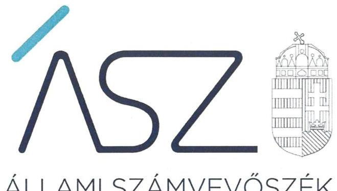
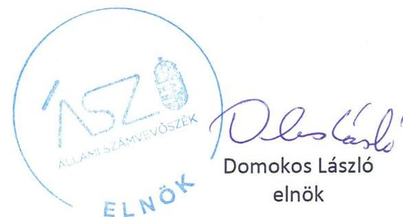
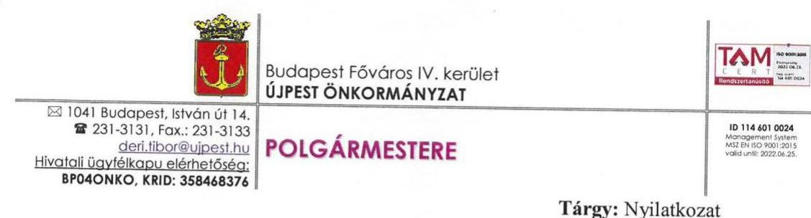
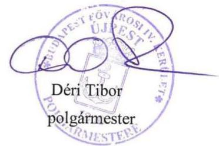

ÁLLAMI SZÁMVEVŐSZÉK

# JELENTÉS 

Nemzeti tulajdonú gazdasági társaságok ellenőrzése

Újpesti Egészségügyi Szolgáltató Nonprofit Korlátolt Felelősségű Társaság
2020.

2017
www.asz.hu

---

ÁLLAMI SZÁMVEVŐSZÉK

# JELENTÉS

Nemzeti tulajdonú gazdasági társaságok ellenőrzése

Újpesti Egészségügyi Szolgáltató Nonprofit Korlátolt Felelősségű Társaság

2020. 09. hó 18. nap

2017. www.asz.hu

---

# AZ ELLENŐRZÉST FELÜGYELTE: 

MAKKAI MÁRIA felügyeleti vezető

## AZ ELLENŐRZÉST VEZETTE ÉS A VÉGREHAJTÁSÁÉRT FELELŐS:

ÁRPÁSI TIBOR ellenőrzésvezető

## A PROGRAM ÖSSZEÁLLÍTÁSÁÉRT FELELŐS:

TÓTPÁL SZABOLCS osztályvezető
FEKETE-NAGY ANDRÁS GÁBOR projektvezető

IKTATÓSZÁM: EL-2855-001/2020
TÉMASZÁM: 2513
ELLENŐRZÉS-AZONOSÍTÓ SZÁM: V082236, V082268, V085715
Jelentéseink az Országgyűlés számítógépes hálózatán és az interneten a www.asz.hu címen is olvashatóak.

---

# TARTALOMJEGYZÉK 

■ ÖSSZEGZÉS ..... 5
■ AZ ELLENŐRZÉS CÉLJA ..... 6
■ AZ ELLENŐRZÉS TERÜLETE ..... 7
■ AZ ELLENŐRZÉS HÁTTERE, INDOKOLTSÁGA ..... 8
■ A JELENTÉS LÉNYEGES KÉRDÉSKÖREI ..... 9
■ AZ ELLENŐRZÉS HATÓKÖRE ÉS MÓDSZEREI ..... 10
■ MEGÁLLAPÍTÁSOK ..... 13
■ MELLÉKLETEK ..... 15
I. sz. melléklet: Fogalomtár ..... 15
■ FÜGGELÉK: ÉSZREVÉTELEK ..... 17
■ RÖVIDÍTÉSEK JEGYZÉKE ..... 19

---

.

---

# ÖSSZEGZÉS 

Budapest Főváros IV. kerület Újpest Önkormányzata az Újpesti Egészségügyi Szolgáltató Nonprofit Korlátolt Felelősségű Társaság feletti tulajdonosi jogait szabályszerűen gyakorolta. A Társaság vagyongazdálkodása szabályszerű volt, a vagyonnal való gazdálkodás során a nemzeti vagyon megőrzése, az elszámoltathatóság biztosított volt.

## Az ellenőrzés társadalmi indokoltsága

Az Állami Számvevőszék stratégiájában megfogalmazta, hogy az államháztartáson kívül működő feladatellátó rendszerek ellenőrzéseivel hozzájárul ahhoz, hogy a közpénzeket, illetve az ingyenesen juttatott közvagyont az államháztartáson kívül működő szervezetek is átlátható, rendezett módon használják fel.

Az állam és a helyi önkormányzatok tulajdona nemzeti vagyon. A nemzeti vagyon megőrzése, megóvása érdekében kiemelten fontos a nemzeti tulajdonú gazdasági társaságok ellenőrzése.

Az Állami Számvevőszék céljaival és a társadalmi igénnyel összhangban, a gazdasági társaságok kiemelt fontosságú szerepe miatt került sor a Budapest Főváros IV. Kerület Újpest Önkormányzata kizárólagos tulajdonában álló Újpesti Egészségügyi Szolgáltató Nonprofit Korlátolt Felelősségű Társaság vagyongazdálkodásának, gazdálkodásának a kormányzati szektor hiányára, az államadósságra gyakorolt hatásának, illetve az Önkormányzat tulajdonosi joggyakorlásának ellenőrzésére.

## Főbb megállapítások, következtetések

Az Újpesti Egészségügyi Szolgáltató Nonprofit Korlátolt Felelősségű Társaság feletti tulajdonosi joggyakorlás kereteit Budapest Főváros IV. kerület Újpest Önkormányzata a jogszabályoknak és belső szabályzatainak megfelelően alakította ki, tulajdonosi jogait szabályszerűen gyakorolta.

Az Újpesti Egészségügyi Szolgáltató Nonprofit Korlátolt Felelősségű Társaság vagyongazdálkodása szabályszerű volt, a számviteli beszámolók mérlegét - az eszközöket és forrásokat mennyiségben és értékben tartalmazó - leltárral alátámasztotta, a beszámolók valós képet mutattak a vagyonról.

---

# AZ ELLENŐRZÉS CÉLJA 

AZ ELLENŐRZÉS CÉLJA annak megállapítása, hogy a tulajdonosi joggyakorló a gazdasági társasága feletti tulajdonosi joggyakorlás kereteit kialakította-e, tulajdonosi jogait megfelelően gyakorolta-e és kötelezettségeit teljesítette-e. Az ellenőrzés célja annak megállapítása, hogy a gazdasági társaság biztosította-e a vagyon védelmét a nyilvántartások szabályszerű vezetése és a mérleg tételeinek leltárral történő alátámasztása útján, valamint szabályszerűen gondoskodott-e a társaság használatában lévő nemzeti vagyon értékének megőrzéséről, gyarapításáról, hasznosításáról. Az ellenőrzés célja továbbá annak megítélése, hogy a kormányzati szektorba sorolt nemzeti tulajdonban lévő gazdasági társaság gazdálkodásának a kormányzati szektor hiányára és az államadósságra befolyással bíró elemei a jogszabályi előírásoknak megfeleltek-e és a gazdasági társaság az adatszolgáltatási kötelezettségének eleget tett-e.

---

# AZ ELLENŐRZÉS TERÜLETE

## Budapest Főváros IV. kerület Újpest Önkormányzata és az Újpesti Egészségügyi Szolgáltató Nonprofit Korlátolt Felelősségű Társaság

Budapest Főváros IV. Kerület Újpest Önkormányzata a kizárólagos tulajdonában álló Újpesti Egészségügyi Szolgáltató Nonprofit Korlátolt Felelősségű Társaságot 2011. október 1-jétől nonprofit gazdasági társaságként, illetve közhasznú szervezetként működtette. A Társaság1 főtevékenysége szakorvosi járóbeteg-ellátás volt, emellett egészségmegőrzés, betegségmegelőzés, gyógyító-, egészségügyi rehabilitációs tevékenységet is végzett. A Társaság jegyzett tőkéje 2014-től 3 M Ft volt, az ellenőrzött időszakban nem változott.

A Társaság az Önkormányzattal2 2011-ben megkötött Közhasznúsági szerződés3 szerint közfeladatait saját eszközeivel, illetve a járóbeteg-ellátást szolgáló Eszközbérleti szerződés4 és ingatlanhasználati megállapodás5 alapján használt önkormányzati tulajdonú eszközökkel látta el. A Társaság vagyonkezelésbe vett eszközzel nem rendelkezett.

A Társaság az ellenőrzött években nyereségesen működött, a nyereség a saját vagyont gyarapította. A 2015-2018. évi feladatellátást az Önkormányzat évente megújított Pénzeszköz átadási megállapodás6 keretében támogatta.

Az ügyvezető7 személye az ellenőrzött években egy alkalommal, 2015. július 1-től változott. A Társaságnál 3 tagú felügyelőbizottság8 működött. A Társaság a Számv. tv.9 155. § (2) alapján könyvvizsgálatra volt kötelezett.

A Társaság más gazdasági társaságban tulajdoni részesedéssel nem rendelkezett.

A Társaság az NGM közleményei10 alapján a 2015-2017. évek tekintetében a kormányzati szektorba sorolt egyéb szervezetek közé tartozott.

---

# AZ ELLENŐRZÉS HÁTTERE, INDOKOLTSÁGA 

Az Alaptörvény ${ }^{11}$ 38. cikke alapján az állam és a helyi önkormányzatok tulajdona nemzeti vagyon. A nemzeti vagyon megőrzése, megóvása érdekében kiemelten fontos ezen nemzeti tulajdonú gazdasági társaságok ellenőrzése. Gazdálkodásuk jellemzően a közérdeklődés és a média figyelmének középpontjában áll, amihez hozzájárul a gazdálkodásuk körébe tartozó - a nemzeti vagyon részét képező - vagyon nagysága, illetve az általuk ellátott közszolgáltatások minősége és hatékonysága.

Az ÁSZ ${ }^{12}$ ellenőrzései feltárhatják, hogy a tulajdonosi felügyelet hozzá-járult-e a szabályszerű gazdálkodáshoz és feladatellátáshoz. Az ellenőrzés eredményeként meghatározhatóvá válnak a gazdasági társaság vagyongazdálkodást érintő kockázatai, ezzel lehetővé téve a kockázatok csökkentését. A megállapítások alapján megfogalmazott számvevőszéki javaslatok hasznosítása elősegítheti a meglévő hibák megszüntetését. A jó gyakorlatok bemutatásával az ÁSZ hozzájárulhat a követendő megoldások megismertetéséhez, terjesztéséhez.

---

# A JELENTÉS LÉNYEGES KÉRDÉSKÖREI 

1. A Társaság feletti tulajdonosi joggyakorlás megfelelt-e az előírásoknak?
2. A Társaság vagyongazdálkodása szabályszerű volt-e?
3. A Társaság gazdálkodásának a kormányzati szektor hiányára és az államadósságra befolyással bíró elemei megfeleltek-e a jogszabályi előírásoknak, az adatszolgáltatási kötelezettségének eleget tett-e?

---

# AZ ELLENŐRZÉS HATÓKÖRE ÉS MÓDSZEREI 

## Az ellenőrzés típusa

Megfelelőségi ellenőrzés.

## Az ellenőrzött időszak

A tulajdonosi joggyakorlás tekintetében az ellenőrzött időszak a 2017-2018. évek az éves beszámolók elfogadása kivételével, amelynél az ellenőrzött időszak a 2015-2018. évek.

A társaság vagyongazdálkodási tevékenységét illetően az ellenőrzött időszak a 2015 - 2018. évek.

A társaság gazdálkodásának a kormányzati szektor hiányára és az államadósságra befolyással bíró elemei és a jogszabályi előírásoknak megfelelő adatszolgáltatási kötelezettsége teljesítése tekintetében az ellenőrzött időszak a 2015-2017. évek, a 2017. évi beszámoló jóváhagyása és közzététele tekintetében a 2018. június elsejéig tartó időszak.

## Az ellenőrzés tárgya

Az Újpesti Egészségügyi Szolgáltató Nonprofit Korlátolt Felelősségű Társaság feletti tulajdonosi joggyakorlás kialakítása és működtetése.

Az Újpesti Egészségügyi Szolgáltató Nonprofit Korlátolt Felelősségű Társaság vagyongazdálkodási tevékenysége, a társaság használatában lévő nemzeti vagyon, illetve a saját vagyona tekintetében a vagyonnyilvántartások vezetése, leltára, a nemzeti vagyon értékének megőrzése, gyarapítása, hasznosítása.

Az Újpesti Egészségügyi Szolgáltató Nonprofit Korlátolt Felelősségű Társaság gazdálkodásának a kormányzati szektor hiányára és az államadósságra befolyással bíró elemei és a jogszabályi előírásoknak megfelelő adatszolgáltatási kötelezettség teljesítése.

## Az ellenőrzött szervezet

Budapest Főváros IV. kerület Újpest Önkormányzata
Újpesti Egészségügyi Szolgáltató Nonprofit Korlátolt Felelősségű Társaság

---

# Az ellenőrzés jogalapja 

Az ellenőrzés jogszabályi alapját az ÁSZ tv. ${ }^{13} 1 . \S$ (3) bekezdése és 5. § (3) - (5) bekezdései képezték.

## Az ellenőrzés módszerei

Az ÁSZ az ellenőrzést az ellenőrzési program ellenőrzési kérdései, az ellenőrzött időszakban hatályos jogszabályok, az ellenőrzés szakmai szabályok és módszertanok alapján, a nemzetközi standardok figyelembe vételével végezte.

Az ellenőrzés ideje alatt az ellenőrzött szervezettel történő kapcsolattartást az ÁSZ Szervezeti és Működési Szabályzatának vonatkozó előírásai alapján biztosította az ÁSZ.

Az ÁSZ a 2017-2018. évek vonatkozásában ellenőrizte a tulajdonosi joggyakorlás kereteinek kialakítását, a tulajdonosi joggyakorló tevékenységét a felügyelő bizottság és a független könyvvizsgáló működéséhez kapcsolódóan, valamint azt, hogy a tulajdonosi joggyakorló - amennyiben a gazdasági társaság feladatellátásához kapcsolódóan határozott meg követelményeket, elvárásokat - a nemzeti vagyon értékének megőrzése érdekében monitorozta-e azok teljesülését. Az ÁSZ a 2015-2018. évekre terjedő teljes ellenőrzött időszakra ellenőrizte a tulajdonosi joggyakorló részvételét az éves beszámoló elfogadására vonatkozó döntéshozatalban.

A gazdasági társaság vagyonhoz kapcsolódó nyilvántartásai vezetésének megfelelősége, a nemzeti vagyon értéke megőrzésének, gyarapításának, hasznosításának szabályszerűsége 2015. és 2017-2018. évek tekintetében került ellenőrzésre. A 2015-2018. éveket érintően történt meg a lényeges dokumentumok értékelése, kiemelten a mérleg tételeinek leltárral való alátámasztottsága.

Az ellenőrzési kérdések megválaszolásához szükséges bizonyítékok megszerzése a következő ellenőrzési eljárások alkalmazásával történt: megfigyelés, információkérés, összehasonlítás, lényeges sokaságból mintavétel, valamint elemző eljárás. Az ellenőrzési bizonyítékként felhasználható adatforrások közé tartoztak az ellenőrzési programban felsorolt adatforrások, továbbá minden - az ellenőrzés folyamán - feltárt, az ellenőrzés szempontjából információkat tartalmazó dokumentum. Az ellenőrzést a kérdésekre adott válaszok kiértékelésével, valamint a megjelölt adatforrások, a csatolt tanúsítványok felhasználásával, továbbá az adott időszakban hatályos jogszabályok figyelembe vételével folytatta le az ÁSZ.

A vagyonnyilvántartások és a leltár szabályszerűsége esetében az ellenőrzés azokra a legnagyobb értékű tételekre - a lényeges sokaságra - terjedt ki, melyek összértéke elérte a teljes sokaság összértékének 50%-át. A 2015. és 2017-2018. évek esetében a lényeges sokaságot tételesen ellenőrizte az ÁSZ.

A gazdasági társaság gazdálkodásának az államadósságra, továbbá a kormányzati szektor hiányára befolyással bíró gazdasági eseményei elszámolásának megfelelősége 2015. és 2017. évek tekintetében került ellenőrzésre, míg a kormányzati szektorba sorolt gazdasági társaság adatszolgáltatási kötelezettségére vonatkozó jogszabályi előírások betartását a 2015-2017. évekre vonatkozóan értékelte az ÁSZ.

---

# 1. A Társaság feletti tulajdonosi joggyakorlás megfelelt-e az előírásoknak? 

Összegző megállapítás A Társaság feletti tulajdonosi joggyakorlás szabályszerű volt.
A TULAJDONOSI JOGGYAKORLÁS KERETEIT a 2017-2018. években az Alapító ${ }^{14}$ az Mt. ${ }^{15}$, az Nvtv ${ }^{16}$., illetve a Ptk. ${ }^{17}$ előírásainak megfelelően a Vagyonrendeletben ${ }^{18}$, a Képviselő-testület SZMSZében ${ }^{19}$, illetve a Társaság Alapító okiratában ${ }^{20}$ határozta meg.

Az Alapító megalkotta a Kjt. ${ }^{21}$ előírásaival összhangban lévő, a vezető tisztségviselők, a felügyelőbizottság tagjai és az Mt. ${ }^{22}$ 208. § hatálya alá tartozó munkavállalók javadalmazásáról, valamint a jogviszony megszűnése esetére biztosított juttatások módjának, mértékének elveiről, annak rendszeréről szóló javadalmazási szabályzatot ${ }^{23}$.

A TULAJDONOSI JOGOK GYAKORLÁSA során 2017-2018-ban az Alapító a Ptk. és az Alapító okirat előírásaival összhangban megválasztotta a Társaság vezető tisztségviselőjét, kijelölte a felügyelőbizottság tagjait, elfogadta annak ügyrendjét ${ }^{24}$, kijelölte a könyvvizsgálót ${ }^{25}$.

Az Alapító a Társaság 2015-2018. évi éves beszámolóit a Ptk., a Számv. tv. és az Alapító okirat előírásainak megfelelően a felügyelőbizottság és a könyvvizsgáló írásbeli jelentésének birtokában fogadta el.

## 2. A Társaság vagyongazdálkodása szabályszerű volt-e?

## Összegző megállapítás A Társaság vagyongazdálkodása szabályszerű volt.

A TÁRSASÁG az ellenőrzött években rendelkezett a Számv. tv. előírásának megfelelő Leltározási szabályzattal ${ }^{26}$. A saját vagyon, illetve a használatra átvett vagyon nyilvántartása megfelelt a Számv. tv.-ben és a Leltározási szabályzatban foglalt előírásoknak. A Társaság a tárgyi eszközök üzembe helyezését bizonylattal alátámasztotta, az eszközök besorolása, bekerülési értékének meghatározása, és az értékcsökkenés elszámolása a Számv. tv., a Számviteli politika ${ }^{27}$, az Értékelési szabályzat ${ }^{28}$ és a Számlarend ${ }^{29}$ előírásainak megfelelően történt.

A VAGYONGAZDÁLKODÁS a 2015-2018. években szabályszerű volt, a Társaság az éves beszámolókat szabályszerűen állította össze, a mérlegsorokat a jogszabályi előírásoknak megfelelő leltárral alátámasztotta.

---

# 3. A Társaság gazdálkodásának a kormányzati szektor hiányára és az államadósságra befolyással bíró elemei megfeleltek-e
 a jogszabályi előírásoknak, az adatszolgáltatási kötelezettségének eleget tett-e? 

## Összegző megállapítás

A Társaság adatszolgáltatási kötelezettségét szabályszerűen teljesítette.

A TÁRSASÁG gazdálkodásának a kormányzati szektor hiányára befolyással bíró eleme, az államadósságra befolyással bíró gazdasági eseménye, adósságot keletkeztető ügylete a 2015-2017. években nem volt.

A Társaság a 2015-2017. évi adatszolgáltatási kötelezettségének szabályszerűen tett eleget.

---

# MELLÉKLETEK 

- I. SZ. MELLÉKLET: FOGALOMTÁR
gazdasági társaság
haszonbérleti szerződés
kormányzati szektorba sorolt egyéb szervezet
közszolgáltatás
közfeladat
nemzeti vagyon
nonprofit gazdasági társaság
tulajdonosi jogok gyakorlója
vagyonkezelői jog

A gazdasági társaságok üzletszerű közös gazdasági tevékenység folytatására, a tagok vagyoni hozzájárulásával létrehozott, jogi személyiséggel rendelkező vállalkozások, amelyekben a tagok a nyereségből közösen részesednek, és a veszteséget közösen viselik. (Forrás: Ptk. 3:88. § (1) bekezdése)
Haszonbérleti szerződés alapján a haszonbérlő hasznot hajtó dolog időleges használatára vagy hasznot hajtó jog gyakorlására és hasznainak szedésére jogosult, és ennek fejében köteles haszonbért fizetni. A haszonbérleti szerződést írásba kell foglalni. A haszonbérlő a dolog hasznainak szedésére a rendes gazdálkodás szabályainak megfelelően jogosult. A haszonbérlet tárgyát képező dolog fenntartásához szükséges felújítás és javítás, továbbá a dologgal kapcsolatos terhek viselése a haszonbérlőt terheli. A rendkívüli felújítás és javítás a haszonbérbeadót terheli. A haszonbért időszakonként utólag kell megfizetni. (Forrás: Ptk. XLV. Fejezet)
Az a szervezet, amely az Áht. alapján nem része az államháztartásnak, azonban az Európai Közösséget létrehozó szerződéshez csatolt, a túlzott hiány esetén követendő eljárásról szóló jegyzőkönyv alkalmazásáról szóló 2009. május 25-i 479/2009/EK rendelet ${ }^{30}$ szerint a kormányzati szektorba tartozik.
Az Ebktv. ${ }^{31}$ 3. § d) pontja a következőképpen határozza meg a közszolgáltatást: „szerződéskötési kötelezettség alapján a lakosság alapvető szükségleteinek ellátására irányuló szolgáltatás, így különösen a villamos energia-, gáz-, hő-, víz-, szenny-víz- és hulladékkezelési, köztisztasági, postai és távközlési szolgáltatás, továbbá a menetrend alapján közlekedő járművekkel végzett közforgalmú személyszállítás".
Az Áht. 3/A. § (1) bekezdése alapján közfeladat a jogszabályban meghatározott állami vagy önkormányzati feladat.
Nvtv. 1. § (2) bekezdése szerint nemzeti vagyonba tartozik többek között:
„az állam vagy a helyi önkormányzat kizárólagos tulajdonában álló dolgok,
az a) pont hatálya alá nem tartozó, állam vagy a helyi önkormányzat tulajdonában lévő dolog,
az állam vagy a helyi önkormányzat tulajdonában lévő pénzügyi eszközök, továbbá az államot vagy a helyi önkormányzatot megillető társasági részesedések, az államot vagy a helyi önkormányzatot megillető bármely vagyoni értékkel rendelkező jogosultság, amelyet jogszabály vagyoni értékű jogként nevesít."
Az a gazdasági társaság minősül nonprofit gazdasági társaságnak és cégnevében az a gazdasági társaság tüntetheti fel a nonprofit jelleget, amelynek létesítő okirata tartalmazza, hogy a gazdasági társaság tevékenységéből származó nyereség a tagok között nem osztható fel, hanem az a gazdasági társaság vagyonát gyarapítja
Aki a nemzeti vagyon felett az államot vagy a helyi önkormányzatot megillető tulajdonosi jogok és kötelezettségek összességének gyakorlására jogosult. (Forrás: Nvtv. 3. § (1) bekezdés 17. pontja)
A vagyonkezelő köteles a vagyontárgy állagának megóvásáról, jó karbantartásáról, működtetéséről gondoskodni, jogszabályban és szerződésben előírt más kötelezettségét teljesíteni, valamint a vagyontárgyat jogszabályban vagy szerződésben meghatározott célnak megfelelően használni. A vagyonkezelő - a központi költségvetési szervek és a kizárólag közfeladatot ellátó nem központi költségvetési szerv vagyonkezelők kivételével - köteles díjat fizetni, jogszabályban és szerződésben előírt más kötelezettségét teljesíteni, valamint a vagyontárgyat jogszabályban vagy

---

szerződésben meghatározott célnak megfelelően használni. Amennyiben a vagyonkezelő ezen kötelezettségeinek nem tesz eleget, a tulajdonosi joggyakorló jogosult a szerződést azonnali hatállyal felmondani. (Forrás: Vtv. ${ }^{32}$ 27. § (2), (2a) bekezdések)

---

# FÜGGELÉK: ÉSZREVÉTELEK 

A jelentéstervezetet a Számvevőszék 15 napos észrevételezésre megküldte az ellenőrzött szervezetek vezetőinek az ÁSZ tv. 29. § (1) bekezdése előírásának megfelelően.

Az Újpesti Egészségügyi Szolgáltató Nonprofit Korlátolt Felelősségű Társaság ügyvezetője nem tett észrevételt, Budapest Főváros IV. kerület Újpest Önkormányzatának polgármestere nemleges észrevételt tett, amelyet a függelékben szerepeltetünk.

[^0]
[^0]:    * 29. § (1) Az Állami Számvevőszék az ellenőrzési megállapításait megküldi az ellenőrzött szervezet vezetőjének vagy az általa megbízott személynek, és annak, akinek személyes felelősségét állapította meg.
    (2) Az ellenőrzött szervezet vezetője és a felelősként megjelölt személy az ellenőrzés megállapításaira tizenöt napon belül írásban észrevételt tehet.
    (3) Az Állami Számvevőszék az észrevételre a beérkezésétől számított harminc napon belül írásban válaszol. A figyelembe nem vett észrevételeket köteles a jelentésben feltüntetni, és megindokolni, hogy azokat miért nem fogadta el.

---

# ÁLLAMI SZÁMVEVŐSZÉK 

## Domokos László elnök úr részére

Budapest
Apáczai Csere János utca 10. 1052

Tárgy: Nyilatkozat
Úgyiratszám: KP/4149/2020
Ikt. szám: EL-2115-057/2020

## NYILATKOZAT

Alulírott, Déri Tibor Budapest Főváros IV. kerület Újpest Önkormányzat polgármestere nyilatkozom, hogy az Állami Számvevőszék által az EL-2115-057/2020 iktatószámú, a „Nemzeti tulajdonú gazdasági társaságok ellenőrzése - Újpesti Egészségügyi Szolgáltató Nonprofit Kft." címmel készített számvevőszéki jelentéstervezetben foglaltakat megismertem, a jelentéstervezetben tett megállapításokkal kapcsolatban észrevételt nem kívánok tenni.

Budapest, 2020. augusztus 3.

---

# RÖVIDÍTÉSEK JEGYZÉKE 

${ }^{1}$ Társaság
${ }^{2}$ Önkormányzat
${ }^{3}$ Közhasznúsági szerződés
${ }^{4}$ Eszközbérleti szerződés
${ }^{5}$ ingatlanhasználati megállapodás
${ }^{6}$ Pénzeszköz átadási megállapodás
${ }^{7}$ ügyvezető
${ }^{8}$ felügyelőbizottság
${ }^{9}$ Számv. tv.
${ }^{10}$ NGM közlemény
${ }^{11}$ Alaptörvény
${ }^{12}$ ÁSZ
${ }^{13}$ ÁSZ tv.
${ }^{14}$ Alapító
${ }^{15}$ Mötv.
${ }^{16}$ Nvtv.
${ }^{17}$ Ptk.
${ }^{18}$ Vagyonrendelet
${ }^{19}$ SZMSZ
${ }^{20}$ Alapító okirat

Újpesti Egészségügyi Szolgáltató Nonprofit Korlátolt Felelősségű Társaság Budapest Főváros IV. kerület Újpest Önkormányzata
az Önkormányzat és a Társaság között 2011. szeptember 13-án létrejött közhasznúsági szerződés egészségügyi közfeladatok ellátására (hatályos: 2011. október 1-től)
az Önkormányzat és a Társaság között létrejött és többször módosított eszközbérleti szerződés egészségügyi közfeladatok ellátásához (hatályos: 2013. december 31-től)
az UV Újpesti Vagyonkezelő Zrt. és a Társaság között létrejött Együttműködési megállapodás az Önkormányzat tulajdonában lévő Budapest IV. ker. Görgey Artúr u. 30. szám alatt található szakrendelő használatáról (hatályos: 2012. április 27-től)
az Önkormányzat és a Társaság között létrejött Pénzeszköz átadási megállapodás egészségügyi közfeladatok finanszírozására
megállapodás: (hatályos: 2015. május 20-tól)
megállapodás: (hatályos: 2016. március 9-től)
megállapodás: (hatályos: 2017. március 27-től)
megállapodás: (hatályos: 2018. május 25-től)
a Társaság ügyvezetője
ügyvezető: tisztségét ellátta 2015. június 30-ig
ügyvezető: tisztségét ellátta 2015. július 1. - 2019. december 31.
a Társaság felügyelőbizottsága
2000. évi C. törvény a számvitelről (hatályos: 2001. január 1-től)
a nemzetgazdasági miniszter közleménye a kormányzati szektorba sorolt egyéb szervezetekről
közlemény: 2013/60 sz. Hivatalos Értesítő (megjelent: 2013. december 16.)
közlemény: 2015/66 sz. Hivatalos Értesítő (megjelent: 2015. december 30.)
közlemény: 2017/28 sz. Hivatalos Értesítő (megjelent: 2017. június 15.)
Magyarország Alaptörvénye
Állami Számvevőszék
2011. évi LXVI. törvény az Állami Számvevőszékről (hatályos: 2011. július 1-től) Budapest Főváros IV. kerület Újpest Önkormányzata Képviselő-testülete mint a Társaság legfőbb szerve
2011. évi CLXXXIX. törvény Magyarország helyi önkormányzatairól (hatályos: 2012. január 1-től)
2011. évi CXCVI. törvény a nemzeti vagyonról (hatályos: 2011. december 31-től) 2013. évi V. törvény a Polgári Törvénykönyvről (hatályos: 2014. március 15-től) 48/2012. (XI. 30.) önkormányzati rendelet Budapest Főváros IV. kerület Újpest Önkormányzata vagyonáról és a vagyonelemek feletti tulajdonosi jogok gyakorlásáról, a módosításokkal egységes szerkezetben (hatályos: 2012. december 1-től)
60/2012. (XII. 21.) önkormányzati rendelet Budapest Főváros IV. kerület Újpest Önkormányzata Képviselő-testületének Szervezeti és Működési Szabályzatáról (hatályos: 2013. január 1-től)
a Társaság Alapító okirata a módosításokkal egységes szerkezetben

---

|  | Alapító okirat1 (hatályos: 2014. február 1. - 2015. március 25.) |
| :--: | :--: |
|  | Alapító okirat2 (hatályos: 2015. március 26. - 2015. június 24.) |
|  | Alapító okirat3 (hatályos: 2015. június 25. - 2016. május 31.) |
|  | Alapító okirat4 (hatályos: 2016. június 1. - 2016. december 29.) |
|  | Alapító okirat5 (hatályos: 2016. december 30. - 2018. december 31.) |
|  | Alapító okirat6 (hatályos: 2019. január 1-től) |
| ${ }^{21}$ Taktv. | 2009. évi CXXII. törvény a köztulajdonban álló gazdasági társaságok takarékosabb működéséről (hatályos: 2009. december 4-től) |
| ${ }^{22} \mathrm{Mt}$. | 2012. évi I. törvény a munka törvénykönyvéről (hatályos: 2012. július 1-től) |
| ${ }^{23}$ javadalmazási szabályzat | a Társaság Vezetői Javadalmazási Szabályzata (hatályos: 2015. október 27-től) |
| ${ }^{24}$ felügyelőbizottság ügyrendje | a Társaság felügyelőbizottságának ügyrendje (hatályos: 2015. február 9-től) |
| ${ }^{25}$ könyvvizsgáló | a Társaság könyvvizsgálója (Audit-Line Könyvelő és Könyvvizsgáló Korlátolt Felelősségű Társaság) |
| ${ }^{26}$ Leltározási szabályzat | a Társaság leltározási szabályzata (hatályos: 2012. október 1-től) |
| ${ }^{27}$ Számviteli politika | a Társaság számviteli politikája |
|  | számviteli politika1 (hatályos: 2014. január 22-től) |
|  | számviteli politika2 (hatályos: 2016. március 30-tól) |
| ${ }^{28}$ Értékelési szabályzat | a Társaság eszközök és források értékelési szabályzata |
|  | szabályzat ${ }_{1}$ (hatályos: 2011. augusztus 1. - 2015. december 31.) |
|  | szabályzat ${ }_{2}$ (hatályos: 2016. január 1-től) |
| ${ }^{29}$ Számlarend | a Társaság számlarendje |
|  | számlarend ${ }_{1}$ (hatályos: 2014. január 2-től) |
|  | számlarend ${ }_{2}$ (hatályos: 2016. március 30-tól) |
| ${ }^{30} 479 / 2009 /$ EK rendelet | a Tanács 479/2009/EK rendelete az Európai Közösséget létrehozó szerződéshez csatolt, a túlzott hiány esetén követendő eljárásról szóló jegyzőkönyv alkalmazásáról |
| ${ }^{31}$ Ebktv. | 2003. évi CXXV. törvény az egyenlő bánásmódról és az esélyegyenlőség előmozdításáról (hatályos: 2004. január 27-től) |
| ${ }^{32}$ Vtv. | 2007. évi CVI. törvény az állami vagyonról (hatályos: 2007. szeptember 25-től) |

---

# ASZ 

ÁLLAMI SZÁMVEVŐSZÉK
1052 Budapest, Apáczai Cs. J. u. 10. I 1364 Budapest 4. Pf. 54 TEL: +36 14849100
email: szamvevoszek@asz.hu
web: www.asz.hu | www.aszhirportal.hu

