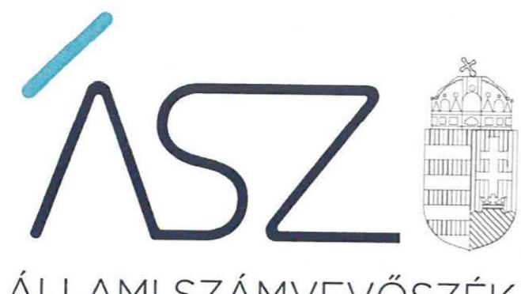
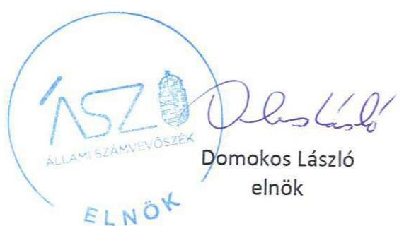

ÁLLAMI SZÁMVEVŐSZÉK

# JELENTÉS 

Nemzeti tulajdonú gazdasági társaságok ellenőrzése

IGAL-FÜRDŐ Üzemeltető és Szolgáltató Korlátolt Felelősségű Társaság
2020.

20178
www.asz.hu

---

ÁLLAMI SZÁMVEVŐSZÉK

# JELENTÉS

Nemzeti tulajdonú gazdasági társaságok ellenőrzése

IGAL-FÜRDŐ Üzemeltető és Szolgáltató Korlátolt Felelősségű Társaság

2020.
03
hó 14. nap

20178
www.asz.hu

---

# AZ ELLENŐRZÉST FELÜGYELTE: 

MAKKAI MÁRIA felügyeleti vezető

## AZ ELLENŐRZÉST VEZETTE ÉS A VÉGREHAJTÁSÁÉRT FELELŐS:

VALASTYÁNNÉ DR. VÍZHÁNYÓ JÚLIA ellenőrzésvezető
ÁRPÁSI TIBOR ellenőrzésvezető

## A PROGRAM ÖSSZEÁLLÍTÁSÁÉRT FELELŐS:

TÓTPÁL SZABOLCS osztályvezető
FEKETE-NAGY ANDRÁS GÁBOR projektvezető

## IKTATÓSZÁM: EL-2853-001/2020

TÉMASZÁM: 2513
ELLENŐRZÉS-AZONOSÍTÓ SZÁM: V082272, V085708

---

# TARTALOMJEGYZÉK 

■ ÖSSZEGZÉS ..... 5
■ AZ ELLENŐRZÉS CÉLJA ..... 6
■ AZ ELLENŐRZÉS TERÜLETE ..... 7
■ AZ ELLENŐRZÉS HÁTTERE, INDOKOLTSÁGA ..... 8
■ A JELENTÉS LÉNYEGES KÉRDÉSKÖREI ..... 9
■ AZ ELLENŐRZÉS HATÓKÖRE ÉS MÓDSZEREI ..... 10
■ MEGÁLLAPÍTÁSOK ..... 12
■ JAVASLATOK ..... 13
■ MELLÉKLETEK ..... 15
I. sz. melléklet: Fogalomtár ..... 15
■ FÜGGELÉK: ÉSZREVÉTELEK ..... 17
■ RÖVIDÍTÉSEK JEGYZÉKE ..... 19

---

.

---

# ÖSSZEGZÉS 

Igal Város Önkormányzata az IGAL-FÜRDŐ Üzemeltető és Szolgáltató Korlátolt Felelősségű Társaság feletti tulajdonosi jogait nem szabályszerűen gyakorolta 2015-2018-ban. A Társaság a vagyonnal való gazdálkodás során a nemzeti vagyon megőrzését, elszámoltathatóságát nem biztosította az ellenőrzött időszakban.

## Az ellenőrzés társadalmi indokoltsága

Az Állami Számvevőszék kiemelt célja, hogy a helyi önkormányzatok gazdálkodásában rejlő pénzügyi kockázatok feltárásával, az államháztartáson kívül működő feladatellátó rendszerek ellenőrzéseivel hozzájáruljon ahhoz, hogy a közpénzeket, illetve az ingyenesen juttatott közvagyont az államháztartáson kívül működő szervezetek is átlátható, rendezett módon használják fel.

A helyi önkormányzatok tulajdona nemzeti vagyon, melynek megőrzése, megóvása érdekében kiemelten fontos a nemzeti tulajdonú gazdasági társaságok ellenőrzése. Ellenőrzésüket további társadalmi elvárás is indokolja, részben a gazdálkodásuk körébe tartozó vagyon nagysága, részben az általuk ellátott közszolgáltatások, sajátos feladatellátások, mivel tevékenységükön keresztül a lakosság széles köre kerül kapcsolatba a társaságokkal. A vezetői teljesítményértékelést érintő ellenőrzések lefolytatása a téma jellege, a vezetőknek a társaság működése szempontjából meghatározó szerepe és a társadalmi érdeklődés miatt indokolt.

Az Állami Számvevőszék céljaival és a társadalmi igénnyel összhangban, a gazdasági társaságok kiemelt fontosságú szerepe miatt került sor az IGAL-FÜRDŐ Üzemeltető és Szolgáltató Korlátolt Felelősségű Társaság vagyongazdálkodásának, illetve Igal Város Önkormányzata tulajdonosi joggyakorlásának ellenőrzésére.

## Főbb megállapítások, következtetések, javaslatok

Igal Város Önkormányzata tulajdonosi joggyakorlása nem volt szabályszerű, mert az IGAL-FÜRDŐ Üzemeltető és Szolgáltató Korlátolt Felelősségű Társaság javadalmazási szabályzatát nem alkotta meg, a 2015-2017. évi egyszerűsített éves beszámolóit a felügyelőbizottság jelentése nélkül fogadta el, 2018. évre vonatkozó számviteli beszámolót nem hagyott jóvá. A felügyelőbizottság nem rendelkezett ügyrenddel.

Az IGAL-FÜRDŐ Üzemeltető és Szolgáltató Korlátolt Felelősségű Társaság vagyongazdálkodása nem volt szabályszerű, nem gondoskodott a nemzeti vagyon védelméről, mert az egyszerűsített éves beszámolók mérlegtételeit nem támasztotta alá leltárral, ezáltal beszámolói nem voltak megalapozottak.

Az Állami Számvevőszék a jelentésben foglalt megállapítások alapján Igal Város Önkormányzata polgármesterének kettő, az IGAL-FÜRDŐ Üzemeltető és Szolgáltató Korlátolt Felelősségű Társaság ügyvezetőjének kettő javaslatot fogalmazott meg.

---

# AZ ELLENŐRZÉS CÉLJA 

AZ ELLENŐRZÉS CÉLJA annak megállapítása volt, hogy a tulajdonosi joggyakorló a gazdasági társasága feletti tulajdonosi joggyakorlás kereteit kialakította-e, tulajdonosi jogait megfelelően gyakorolta-e és kötelezettségeit teljesítette-e. Az ellenőrzés célja volt továbbá annak megállapítása, hogy a gazdasági társaság biztosította-e a vagyon védelmét a nyilvántartások szabályszerű vezetése és a mérleg tételeinek leltárral történő alátámasztása útján, valamint szabályszerűen gondoskodott-e a társaság használatában lévő nemzeti vagyon értékének megőrzéséről, gyarapításáról, hasznosításáról.

---

# AZ ELLENŐRZÉS TERÜLETE 

## Igal Város Önkormányzata és az IGAL-FÜRDŐ Üzemeltető és Szolgáltató Korlátolt Felelősségű Társaság

Igal Város Önkormányzata a kizárólagos tulajdonában álló IGAL-FÜRDŐ Üzemeltető és Szolgáltató Korlátolt Felelősségű Társaságot 1999. február 22-én alapította. A Társaság ${ }^{1}$ jegyzett tőkéje az ellenőrzött időszakban 4,5 millió Ft volt.

A Társaság fő tevékenysége üdülési, egyéb átmeneti szálláshely szolgáltatás volt. A Társaság az Igali Gyógyfürdő és a kapcsolódó létesítmények üzemeltetéséhez kapcsolódó feladatait saját és az Önkormányzattól ${ }^{2}$ Üzemeltetési szerződés ${ }^{3}$ alapján üzemeltetésre átvett eszközökkel látta el, vagyonkezelésbe vett vagyonnal az ellenőrzött időszakban nem rendelkezett. A Társaságnak tulajdoni részesedése más gazdasági társaságban nem volt és nem tartozott a kormányzati szektorba sorolt egyéb szervezetek közé.

Az ügyvezető ${ }^{4}$ személye az ellenőrzött időszakban egy alkalommal változott, a jelenlegi ügyvezető 2018. december 1. óta tölti be tisztségét. A Társaságnál a Taktv. ${ }^{5}$ előírásának megfelelően háromfős felügyelőbizottság ${ }^{6}$ működött. A Társaság könyvvizsgálójának ${ }^{7}$ személye az ellenőrzött időszakban egyszer változott.

Igal Város polgármestere ${ }^{8}$ és a jegyző ${ }^{9}$ személye az ellenőrzött időszakban nem változott.

---

# AZ ELLENŐRZÉS HÁTTERE, INDOKOLTSÁGA 

Az Alaptörvény 38. cikke alapján az állam és a helyi önkormányzatok tulajdona nemzeti vagyon. A nemzeti vagyon megőrzése, megóvása érdekében kiemelten fontos ezen nemzeti tulajdonú gazdasági társaságok ellenőrzése. Gazdálkodásuk jellemzően a közérdeklődés és a média figyelmének középpontjában áll, amihez hozzájárul a gazdálkodásuk körébe tartozó - a nemzeti vagyon részét képező - vagyon nagysága, illetve az általuk ellátott közszolgáltatások minősége és hatékonysága.

Az ÁSZ ${ }^{10}$ ellenőrzései, hogy a tulajdonosi felügyelet hozzájárult-e a szabályszerű gazdálkodáshoz és feladatellátáshoz. Az ellenőrzés eredményeként meghatározhatóvá válnak a gazdasági társaság vagyongazdálkodást érintő kockázatai, ezzel lehetővé téve a kockázatok csökkentését. A megállapítások alapján megfogalmazott számvevőszéki javaslatok hasznosítása elősegítheti a meglévő hibák megszüntetését. A jó gyakorlatok bemutatásával az ÁSZ hozzájárulhat a követendő megoldások megismertetéséhez, terjesztéséhez.

---

# A JELENTÉS LÉNYEGES KÉRDÉSKÖREI 

1. A Társaság feletti tulajdonosi joggyakorlás megfelelt-e az előírásoknak?
2. A Társaság vagyongazdálkodása szabályszerű volt-e?

---

# AZ ELLENŐRZÉS HATÓKÖRE ÉS MÓDSZEREI 

## Az ellenőrzés típusa

Megfelelőségi ellenőrzés.

## Az ellenőrzött időszak

A tulajdonosi joggyakorlás tekintetében az ellenőrzött időszak a 2017-2018. évek az éves beszámolók elfogadása kivételével, amelynél az ellenőrzött időszak a 2015-2018. évek.

A társaság vagyongazdálkodási tevékenységét illetően az ellenőrzött időszak a 2015 - 2018. évek.

## Az ellenőrzés tárgya

Az IGAL-FÜRDŐ Üzemeltető és Szolgáltató Korlátolt Felelősségű Társaság feletti tulajdonosi joggyakorlás kialakítása és működtetése.

Az IGAL-FÜRDŐ Üzemeltető és Szolgáltató Korlátolt Felelősségű Társaság vagyongazdálkodási tevékenysége, a társaság használatában lévő nemzeti vagyon, illetve a saját vagyona tekintetében a vagyonnyilvántartások vezetése, leltára, a nemzeti vagyon értékének megőrzése, gyarapítása, hasznosítása.

## Az ellenőrzött szervezet

- Igal Város Önkormányzata
- IGAL-FÜRDŐ Üzemeltető és Szolgáltató Korlátolt Felelősségű Társaság

## Az ellenőrzés jogalapja

Az ellenőrzés jogszabályi alapját az ÁSZ tv. ${ }^{11} 1. §$ (3) bekezdése és 5. § (3) - (5) bekezdései képezték.

## Az ellenőrzés módszerei

Az ÁSZ az ellenőrzést az ellenőrzési program ellenőrzési kérdései, az ellenőrzött időszakban hatályos jogszabályok, az ellenőrzés szakmai szabályok és módszertanok alapján, a nemzetközi standardok figyelembe vételével végezte.

---

Az ellenőrzés ideje alatt az ellenőrzött szervezettel történő kapcsolattartást az ÁSZ Szervezeti és Működési Szabályzatának vonatkozó előírásai alapján biztosította az ÁSZ.

Az ÁSZ a 2017-2018. évek vonatkozásában ellenőrizte a tulajdonosi joggyakorlás kereteinek kialakítását, a tulajdonosi joggyakorló tevékenységét a felügyelő bizottság és a független könyvvizsgáló működéséhez kapcsolódóan, valamint azt, hogy a tulajdonosi joggyakorló - amennyiben a gazdasági társaság feladatellátásához kapcsolódóan határozott meg követelményeket, elvárásokat - a nemzeti vagyon értékének megőrzése érdekében monitorozta-e azok teljesülését. Az ÁSZ a 2015-2018. évekre terjedő teljes ellenőrzött időszakra ellenőrizte a tulajdonosi joggyakorló részvételét az éves beszámoló elfogadására vonatkozó döntéshozatalban.

A gazdasági társaság vagyonhoz kapcsolódó nyilvántartásai vezetésének megfelelősége, valamint a nemzeti vagyon értéke megőrzésének, gyarapításának, hasznosításának szabályszerűsége 2015. és 2017-2018. évek tekintetében került ellenőrzésre. A 2015-2018. éveket érintően történt meg a lényeges dokumentumok értékelése, kiemelten a mérleg tételeinek leltárral való alátámasztottsága.

A vagyonnyilvántartások és a leltár szabályszerűsége esetében az ellenőrzés azokra a legnagyobb értékű tételekre - a lényeges sokaságra - terjedt ki, melyek összértéke elérte a teljes sokaság összértékének 50%-át. A 2017. év esetében a lényeges sokaságot tételesen ellenőrizte az ÁSZ.

Az ellenőrzési kérdések megválaszolásához szükséges bizonyítékok megszerzése a következő ellenőrzési eljárások alkalmazásával történt: megfigyelés, információkérés, összehasonlítás, lényeges sokaságból mintavétel, valamint elemző eljárás. Az ellenőrzési bizonyítékként felhasználható adatforrások közé tartoztak az ellenőrzési programban felsorolt adatforrások, továbbá minden - az ellenőrzés folyamán - feltárt, az ellenőrzés szempontjából információkat tartalmazó dokumentum. Az ellenőrzést a kérdésekre adott válaszok kiértékelésével, valamint a megjelölt adatforrások, a csatolt tanúsítványok felhasználásával, továbbá az adott időszakban hatályos jogszabályok figyelembe vételével folytatta le az ÁSZ.

Amennyiben a gazdasági társaság működését és gazdálkodását alapvetően meghatározó dokumentum hiánya miatt, valamely lényeges kérdéskörre vonatkozóan az ÁSZ megállapítást tett, további ellenőrzési tevékenységek az adott kérdéskörrel és az azzal szoros logikai kapcsolatban lévő kérdéskörökkel - ráépülő jelleggel - nem kerültek végrehajtásra.

---

# 1. A Társaság feletti tulajdonosi joggyakorlás megfelelt-e az előírásoknak? 

Összegző megállapítás

A Társaság feletti tulajdonosi joggyakorlás nem volt szabályszerű.

Az Alapító ${ }^{12}$ a Tak. tv. ${ }^{13}$ 5. § (3) bekezdés előírása ellenére nem alkotta meg a vezető tisztségviselők, felügyelőbizottsági tagok, az Mt. ${ }^{14}$ 208. §-ának hatálya alá eső munkavállalók javadalmazása, valamint a jogviszony megszűnése esetére biztosított juttatások módjának, mértékének elveiről, annak rendszeréről szóló szabályzatot.

A 2015-2017. évi egyszerűsített éves beszámoló jóváhagyása nem volt szabályszerű, mert azt az Alapító a Ptk. ${ }^{15}$ 3:120. § (2) bekezdésében foglaltak ellenére a felügyelőbizottság írásbeli jelentése nélkül fogadta el.

Az Alapító a 2018. évre vonatkozó számviteli beszámolót nem hagyott jóvá a Ptk. 3:109. § (2) bekezdésében foglaltak ellenére.

A felügyelőbizottság a Ptk. 3:122. § (3) bekezdésében foglaltak ellenére nem rendelkezett ügyrenddel.

## 2. A Társaság vagyongazdálkodása szabályszerű volt-e?

## Összegző megállapítás

A Társaság vagyongazdálkodása a 2015-2018. években nem volt szabályszerű.

A Társaság az ellenőrzött években rendelkezett a Számv. tv. előírásának megfelelő leltározási szabályzattal ${ }^{16}$, amely tartalmazta a leltározásra és a leltár összeállítására vonatkozó szabályokat, előírásokat.

A Társaság a 2015-2017. évi számviteli beszámolók mérlegtételeit a Számv. tv. 69. § (1) bekezdésében foglaltak ellenére - a mérleg fordulónapján meglévő eszközöket és forrásokat mennyiségben és értékben tételesen, ellenőrizhető módon tartalmazó - leltárral nem támasztotta alá. A Társaság 2018-ban a könyvek üzleti év végi zárásához, a beszámoló elkészítéséhez, a mérleg tételeinek alátámasztásához a Számv. tv. 69. § (1) bekezdésében foglaltak ellenére nem állított össze leltárt. A könyvvizsgáló a Társaság 2015-2017. évi számviteli beszámolójáról a jelentésében korlátozás nélküli záradékot adott ki.

A Társaság a 2018. évre vonatkozóan a Számv. tv. 20. § (6) bekezdésében foglalt előírás ellenére, a Társaság képviseletére jogosult személy aláírásának hiányában nem tett eleget a Számv. tv. 4. § (1) bekezdésében foglalt beszámoló készítési kötelezettségének.

---

# JAVASLATOK 

Az ÁSZ tv. 33. § (1) bekezdésében foglaltak értelmében az ellenőrzött szervezet vezetője köteles a jelentésben foglalt megállapításokhoz kapcsolódó intézkedési tervet összeállítani és azt a jelentés kézhezvételétől számított 30 napon belül az ÁSZ részére megküldeni. Amennyiben az ellenőrzött szervezet vezetője nem küldi meg határidőben az intézkedési tervet, vagy továbbra sem elfogadható intézkedési tervet küld, az Állami Számvevőszék elnöke az ÁSZ tv. 33. § (3) bekezdése a) és b) pontjaiban foglaltakat érvényesítheti.

## Igal Város Önkormányzata polgármesterének

1. Kezdeményezze a Társaság legfőbb szervénél a vezető tisztségviselők, felügyelőbizottsági tagok, valamint az Mt.
 208. §-ának hatálya alá eső munkavállalók javadalmazása, valamint a jogviszony megszünése esetére biztosított juttatások módjának, mértékének elveire, annak rendszerére vonatkozó szabályzat megalkotását.
(1. sz. megállapítás 1. bekezdése alapján)
2. Kezdeményezze a Társaság felügyelőbizottságánál az ügyrend elkészítését és a Társaság legfőbb szerve általi jóváhagyását.
(1. sz. megállapítás 4. bekezdése alapján)

## az IGAL-FÜRDŐ Üzemeltető és Szolgáltató Korlátolt Felelősségű Társaság ügyvezetőjének

1. Intézkedjen az éves beszámoló mérlegtételeit alátámasztó leltár jogszabályi előírásnak megfelelő elkészítéséről.
(2. sz. megállapítás 2. bekezdés második mondata alapján)
2. Intézkedjen a jogszabályi előírásnak megfelelően az éves beszámoló elkészítéséről.
(2. sz. megállapítás 3. bekezdése alapján)

---

.

---

# MELLÉKLETEK 

- I. SZ. MELLÉKLET: FOGALOMTÁR
gazdasági társaság
kormányzati szektorba sorolt egyéb szervezet
közszolgáltatás
közfeladat
nemzeti vagyon
nemzeti vagyon hasznosítása
tulajdonosi jogok gyakorlója
vagyonkezelői jog

A gazdasági társaságok üzletszerű közös gazdasági tevékenység folytatására, a tagok vagyoni hozzájárulásával létrehozott, jogi személyiséggel rendelkező vállalkozások, amelyekben a tagok a nyereségből közösen részesednek, és a veszteséget közösen viselik. (Forrás: Ptk. 3:88. § (1) bekezdése)
Az a szervezet, amely az Áht. ${ }^{17}$ alapján nem része az államháztartásnak, azonban az Európai Közösséget létrehozó szerződéshez csatolt, a túlzott hiány esetén követendő eljárásról szóló jegyzőkönyv alkalmazásáról szóló 2009. május 25-i 479/2009/EK rendelet ${ }^{18}$ szerint a kormányzati szektorba tartozik.
Az Ebktv. ${ }^{19}$ 3. § d) pontja a következőképpen határozza meg a közszolgáltatást: „szerződéskötési kötelezettség alapján a lakosság alapvető szükségleteinek ellátására irányuló szolgáltatás, így különösen a villamos energia-, gáz-, hő-, víz-, szenny-víz- és hulladékkezelési, köztisztasági, postai és távközlési szolgáltatás, továbbá a menetrend alapján közlekedő járművekkel végzett közforgalmú személyszállítás".
Az Áht. 3/A. § (1) bekezdése alapján közfeladat a jogszabályban meghatározott állami vagy önkormányzati feladat.
Nvtv. ${ }^{20}$ 1. § (2) bekezdése szerint nemzeti vagyonba tartozik többek között:
„az állam vagy a helyi önkormányzat kizárólagos tulajdonában álló dolgok,
az a) pont hatálya alá nem tartozó, állam vagy a helyi önkormányzat tulajdonában lévő dolog,
az állam vagy a helyi önkormányzat tulajdonában lévő pénzügyi eszközök, továbbá az államot vagy a helyi önkormányzatot megillető társasági részesedések,
az államot vagy a helyi önkormányzatot megillető bármely vagyoni értékkel rendelkező jogosultság, amelyet jogszabály vagyoni értékű jogként nevesít."
A tulajdonosi joggyakorló vagy a nemzeti vagyon használója által a nemzeti vagyon birtoklásának, használatának, hasznok szedése jogának bármely - a tulajdonjog átruházását nem eredményező - jogcímen történő átengedése, ide nem értve a vagyonkezelésbe adást, valamint a haszonélvezeti jog alapítását.
Forrás: Nvtv. 3. § (1) bekezdés 4. pont
Aki a nemzeti vagyon felett az államot vagy a helyi önkormányzatot megillető tulajdonosi jogok és kötelezettségek összességének gyakorlására jogosult. (Forrás: Nvtv. 3. § (1) bekezdés 17. pontja)
A vagyonkezelő köteles a vagyontárgy állagának megóvásáról, jó karbantartásáról, működtetéséről gondoskodni, jogszabályban és szerződésben előírt más kötelezettségét teljesíteni, valamint a vagyontárgyat jogszabályban vagy szerződésben meghatározott célnak megfelelően használni. A vagyonkezelő - a központi költségvetési szervek és a kizárólag közfeladatot ellátó nem központi költségvetési szerv vagyonkezelők kivételével - köteles díjat fizetni, jogszabályban és szerződésben előírt más kötelezettségét teljesíteni, valamint a vagyontárgyat jogszabályban vagy szerződésben meghatározott célnak megfelelően használni. Amennyiben a vagyonkezelő ezen kötelezettségeinek nem tesz eleget, a tulajdonosi joggyakorló jogosult a szerződést azonnali hatállyal felmondani. (Forrás: Vtv. ${ }^{21}$ 27. § (2), (2a) bekezdések)

---

.

---

# FÜGGELÉK: ÉSZREVÉTELEK 

A jelentéstervezetet a Számvevőszék 15 napos észrevételezésre megküldte az ellenőrzött szervezetek vezetőinek az ÁSZ tv. 29. § (1) bekezdése előírásának megfelelően.

Igal Város Önkormányzatának polgármestere és az IGAL-FÜRDŐ Üzemeltető és Szolgáltató Korlátolt Felelősségű Társaság ügyvezetője az ÁSZ tv. 29. § (2) bekezdésében foglalt észrevételezési jogával nem élt.

[^0]
[^0]:    * 29. § (1) Az Állami Számvevőszék az ellenőrzési megállapításait megküldi az ellenőrzött szervezet vezetőjének vagy az általa megbízott személynek, és annak, akinek személyes felelősségét állapította meg.
    (2) Az ellenőrzött szervezet vezetője és a felelősként megjelölt személy az ellenőrzés megállapításaira tizenöt napon belül írásban észrevételt tehet.
    (3) Az Állami Számvevőszék az észrevételre a beérkezésétől számított harminc napon belül írásban válaszol. A figyelembe nem vett észrevételeket köteles a jelentésben feltüntetni, és megindokolni, hogy azokat miért nem fogadta el.

---

.

---

# RÖVIDÍTÉSEK JEGYZÉKE 

${ }^{1}$ Társaság
${ }^{2}$ Önkormányzat
${ }^{3}$ Üzemeltetési szerződés
${ }^{4}$ Ügyvezető
${ }^{5}$ Taktv.
${ }^{6}$ felügyelőbizottság
${ }^{7}$ könyvvizsgáló
${ }^{8}$ polgármester
${ }^{9}$ jegyző
${ }^{10}$ ÁSZ
${ }^{11}$ ÁSZ tv.
${ }^{12}$ Alapító
${ }^{13}$ Taktv.
${ }^{14} \mathrm{Mt}$.
${ }^{15}$ Ptk.
${ }^{16}$ leltározási szabályzat
${ }^{17}$ Áht.
${ }^{18}$ 479/2009/EK rendelet
${ }^{19}$ Ebktv.
${ }^{20}$ Nvtv.
${ }^{21}$ Vtv.

IGAL-FÜRDŐ Üzemeltető és Szolgáltató Korlátolt Felelősségű Társaság Igal Város Önkormányzata
az Önkormányzat és a Társaság között 2005. február 8-án az igali fürdő üzemeltetésére létrejött szerződés (hatályos: 2003. március 4-től)
a Társaság ügyvezetője
ügyvezető; tisztségét ellátta 2018. december 31-ig
ügyvezető; tisztségét ellátta 2018. december 1-től
a köztulajdonban álló gazdasági társaságok takarékosabb működéséről szóló 2009. évi CXXII. törvény (hatályos: 2009. november 26-tól)
a Társaság felügyelőbizottsága
a Társaság könyvvizsgálója
könyvvizsgáló; megbízva 2018. augusztus 14-ig
könyvvizsgáló; megbízva 2018. augusztus 15-től
Igal Város Önkormányzata polgármestere
Igali Közös Önkormányzati Hivatal jegyzője
Állami Számvevőszék
2011. évi LXVI. törvény az Állami Számvevőszékről (hatályos: 2011. július 1-től) Igal Város Önkormányzatának Képviselő-testülete mint a Társaság legfőbb szerve 2009. évi CXXII. törvény a köztulajdonban álló gazdasági társaságok takarékosabb működéséről (hatályos: 2009. december 4-től)
2012. évi I. törvény a munka törvénykönyvéről (hatályos: 2012. július 1-től) 2013. évi V. törvény a Polgári Törvénykönyvről (hatályos: 2014. március 15-től) a Társaság eszközök és források leltárkészítési és leltározási szabályzata (hatályos: 2015. május 1-től)
az államháztartásról szóló 2011. évi CXCV. törvény (hatályos 2011. december 31-étől)
a Tanács 479/2009/EK rendelete az Európai Közösséget létrehozó szerződéshez csatolt, a túlzott hiány esetén követendő eljárásról szóló jegyzőkönyv alkalmazásáról 2003. évi CXXV. törvény az egyenlő bánásmódról és az esélyegyenlőség előmozdításáról (hatályos: 2004. január 27-től)
2011. évi CXCVI. törvény a nemzeti vagyonról (hatályos: 2011. december 31-től) 2007. évi CVI. törvény az állami vagyonról (hatályos: 2007. szeptember 25-től)

---

# ASZ 

ÁLLAMI SZÁMVEVŐSZÉK
1052 Budapest, Apáczai Cs. J. u. 10. I 1364 Budapest 4. Pf. 54 TEL: +36 14849100
email: szamvevoszek@asz.hu
web: www.asz.hu | www.aszhirportal.hu

