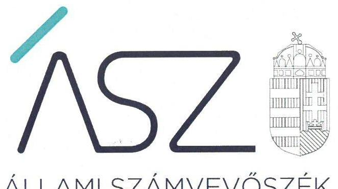
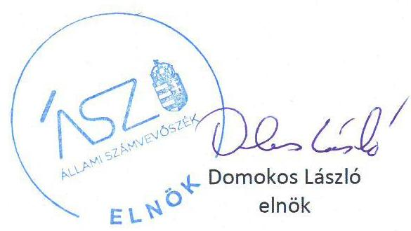
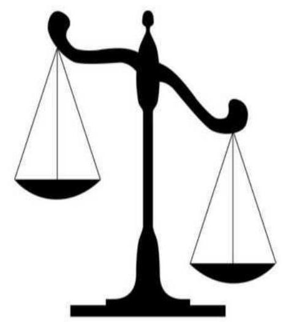

ÁLLAMI SZÁMVEVŐSZÉK

# JELENTÉS

A költségvetési támogatásban részesülő pártalapítványok 2017-2018. évi gazdálkodása törvényességének ellenőrzése

Táncsics Mihály Alapítvány

2020.

20179
www.asz.hu

---

ÁLLAMI SZÁMVEVŐSZÉK

# JELENTÉS 

A költségvetési támogatásban részesülő pártalapítványok 2017-2018. évi gazdálkodása törvényességének ellenőrzése

Táncsics Mihály Alapítvány
2020. 03. 10.

20179
www.asz.hu

---

# AZ ELLENŐRZÉST FELÜGYELTE: 

KAKAS SÁNDOR felügyeleti vezető

## AZ ELLENŐRZÉST VEZETTE ÉS A VÉGREHAJTÁSÁÉRT FELELŐS:

GÁL MAGDOLNA ellenőrzésvezető

## A PROGRAM ÖSSZEÁLLÍTÁSÁÉRT FELELŐS:

BERTALAN RUDOLF GYULA projektvezető

## A TÉMÁHOZ KAPCSOLÓDÓ KORÁBBI SZÁMVEVŐSZÉKI JELENTÉSEK:

- címe: Jelentés - A költségvetési támogatásban részesülő pártalapítványok 2015-2016. évi gazdálkodása törvényességének ellenőrzése Táncsics Mihály Alapítvány
- sorszáma: 18204

IKTATÓSZÁM: EL-2857-001/2020.
TÉMASZÁM: 2521
ELLENŐRZÉS-AZONOSÍTÓ SZÁM: V086501

---

# TARTALOMJEGYZÉK 

- ÖSSZEGZÉS ..... 5
- AZ ELLENŐRZÉS CÉLJA ..... 6
- AZ ELLENŐRZÉS TERÜLETE ..... 7
- AZ ELLENŐRZÉS HÁTTERE, INDOKOLTSÁGA ..... 8
- A JELENTÉS LÉNYEGES KÉRDÉSKÖREI ..... 9
- AZ ELLENŐRZÉS HATÓKÖRE ÉS MÓDSZEREI ..... 10
- MEGÁLLAPÍTÁSOK ..... 13
- JAVASLATOK ..... 15
- MELLÉKLETEK ..... 17
I. sz. melléklet: Értelmező szótár ..... 17
II. sz. melléklet: Az ÁSZ 18204 számú jelentéséhez kapcsolódó intézkedési terv végrehajtásáról ..... 18
- FÜGGELÉK: ÉSZREVÉTELEK ..... 19
- RÖVIDÍTÉSEK JEGYZÉKE ..... 21

---

.

---

# ÖSSZEGZÉS 

A Táncsics Mihály Alapítvány 2017-2018. évi gazdálkodására vonatkozó belső szabályozása nem felelt meg a jogszabályi előírásoknak. A 2017-2018. években a tevékenységéről szóló éves jelentések készítése során nem biztosította a költségvetési támogatás felhasználásának átláthatóságát, elszámoltathatóságát.

## Az ellenőrzés társadalmi indokoltsága

A Párt tv. ${ }^{1}$ 9/A § (1) bekezdése alapján a politikai kultúra fejlesztése érdekében tudományos, ismeretterjesztő, kutatási, oktatási tevékenység folytatása céljából létrehozott pártalapítványok gazdálkodása törvényességének ellenőrzése - Pártalapítványi tv. ${ }^{2}$ 4. § (2) bekezdése értelmében - az ÁSZ ${ }^{3}$ feladata. E törvény 4. § (4) bekezdése alapján az ÁSZ kétévente - kötelező jelleggel - ellenőrzi azoknak a pártalapítványoknak a gazdálkodását, amelyek állami költségvetési támogatásban részesültek.

Az ÁSZ, mint az Országgyűlés ellenőrző szerve a pártalapítványok gazdálkodása törvényességének/szabályszerűségének értékelésével hozzájárul ahhoz, hogy a társadalom objektív képet alkothasson a pártalapítványok működéséről. A jelentésben foglalt megállapítások, következtetések és javaslatok alapján a törvényalkotók konkrét lépéseket tehetnek a pártalapítványokra vonatkozó szabályozások megváltoztatása, átláthatóbbá, ellenőrizhetőbbé tétele irányába. Az ellenőrzött szervezetek szintjén a hiányosságok, szabálytalanságok feltárása, az ennek kapcsán megfogalmazott megállapítások elősegíthetik a pártalapítványok szabályszerű gazdálkodását.

Az ÁSZ stratégiájában megfogalmazta, hogy az államháztartáson kívülre nyújtott költségvetési támogatások és az ingyenes vagyonjuttatás ellenőrzésével hozzájárul ahhoz, hogy a közpénzeket a civil szervezetek is átlátható módon használják fel. A pártalapítványok gazdálkodása szabályszerűségének bemutatásával az ellenőrzés értékteremtő módon járul hozzá az ÁSZ stratégiai céljainak megvalósításához, a nyilvánosság megfelelő tájékoztatásához.

Az ÁSZ 2018. évben ellenőrizte a Pártalapítvány ${ }^{4}$ 2015-2016. évi gazdálkodásának törvényességét.

## Főbb megállapítások, következtetések, javaslatok

A Táncsics Mihály Alapítvány a 2017-2018. években a gazdálkodására vonatkozó belső szabályait nem a jogszabályi előírásoknak megfelelően alakította ki, nem határozta meg a költségvetési támogatás felhasználásának nyilvántartási szabályait. A Táncsics Mihály Alapítvány az alkalmazott könyvviteli rendszereiben nem biztosította a tevékenységéről közzétett éves jelentések részeként elkészített - a költségvetési támogatás felhasználására vonatkozó - kimutatás adatainak alátámasztását, így nem teremtette meg a költségvetési támogatás felhasználásának elszámoltathatóságát.

A Táncsics Mihály Alapítvány ráfordításainak elszámolása 2017. évben nem volt szabályszerű, 2018. évben szabályszerű volt.

A 2015-2016. évi gazdálkodás ellenőrzéséről szóló 18204 számú számvevőszéki jelentésben foglalt megállapításokhoz kapcsolódó intézkedéseket a Táncsics Mihály Alapítvány végrehajtotta.

---

# AZ ELLENŐRZÉS CÉLJA 

Az ellenőrzés célja annak megállapítása volt, hogy a pártalapítvány törvényesen gazdálkodott-e, az éves számviteli beszámolók és a pártalapítvány tevékenységéről szóló éves jelentések a jogszabályi előírásoknak megfeleltek-e, a könyvvezetés és gazdálkodás során a vonatkozó jogszabályi rendelkezéseket és belső előírásokat betartották-e. Az ellenőrzés célja továbbá annak értékelése volt, hogy az előző számvevőszéki jelentésben foglalt megállapításokkal összhangban készített intézkedési tervben meghatározott feladatokat az ellenőrzött szervezet végrehajtotta-e.

---

# AZ ELLENŐRZÉS TERÜLETE 

## Táncsics Mihály Alapítvány

Az ellenőrzés a Párt tv. alapján a politikai kultúra fejlesztése érdekében tudományos, ismeretterjesztő, kutatási, oktatási tevékenység folytatása céljából, a Ptk. ${ }^{5}$ szerinti létesítő/alapító okiraton alapuló bírósági nyilvántartásba vétellel létrejött pártalapítvány gazdálkodására terjedt ki.

A pártalapítvány törvényes gazdálkodásának (könyvvezetése, beszámolása, jelentéstétele) szabályait alapvetően a Pártalapítványi tv.-en túl, a Számv. tv. ${ }^{6}$ és a Számviteli vhr. ${ }^{7}$ határozzák meg.

Az utóellenőrzés az ÁSZ tv. ${ }^{8}$-nek megfelelően a pártalapítványnál 2018. évben végzett ellenőrzés alapján készített 18204 számú számvevőszéki jelentésben foglalt megállapításokra készített intézkedési tervben foglaltak végrehajtásának ellenőrzésére terjedt ki.

A Magyar Szocialista Párt - a Párt tv.-ben és a Pártalapítványi tv.-ben biztosított lehetőséggel élve - 2003-ban megalapította a Táncsics Mihály Alapítványt, 1,0 millió Ft induló vagyonnal. A Pártalapítvány alapító okiratban rögzített célja, hogy elősegítse a Magyar Szocialista Párt Alkotmányban biztosított, a népakarat kialakításában, valamint kinyilvánításában történő hatékony közreműködését. A Pártalapítvány testületi vezető szerve a hét tagú Kuratórium ${ }^{9}$, egyéb szerve pedig a Kuratórium elnöke, valamint a Felügyelő Bizottság ${ }^{10}$. Képviseletét minden ügyre kiterjedő hatáskörrel a Kuratórium elnöke látja el.

A Pártalapítvány 2017-ben 234,2 millió Ft, 2018-ban 187,2 millió Ft költségvetési támogatásban részesült.

A Pártalapítvány az ellenőrzött időszakban gazdasági-vállalkozási tevékenységet nem végzett. Tevékenységét a Felügyelő Bizottság és választott könyvvizsgáló ellenőrizte.

A Pártalapítvány a Ptk. ${ }^{11}$ és a Civil tv. ${ }^{12}$ előírásai alapján 2006. évben alapította a Kapcsolat.hu Kommunikációs és Szolgáltató Nonprofit Kft-t. A Pártalapítvány az ellenőrzött időszakban nem alapított más jogalanyt, nem volt tagja más jogalanynak, illetve nem csatlakozott más jogalanyhoz.

---

# AZ ELLENŐRZÉS HÁTTERE, INDOKOLTSÁGA 

Társadalmi elvárás a közpénzek értékelvű, rendeltetésszerű felhasználása, a közpénzekből nyújtott támogatások átláthatóságának megteremtése, amelyhez az ÁSZ az államháztartásból nyújtott támogatások ellenőrzésével kíván hozzájárulni. A Párt tv. 9/A § (1) bekezdése alapján a politikai kultúra fejlesztése érdekében tudományos, ismeretterjesztő, kutatási, oktatási tevékenység folytatása céljából létrehozott pártalapítványok gazdálkodása törvényességének ellenőrzése - Pártalapítványi tv. 4. § (2) bekezdése értelmében - az ÁSZ feladata. E törvény 4. § (4) bekezdése alapján az ÁSZ kétévente - kötelező jelleggel - ellenőrzi azoknak a pártalapítványoknak a gazdálkodását, amelyek állami költségvetési támogatásban részesültek.

Az ÁSZ, mint az Országgyűlés ellenőrző szerve a pártalapítványok gazdálkodása törvényességének/szabályszerűségének értékelésével hozzájárul ahhoz, hogy a társadalom objektív képet alkothasson a pártalapítványok működéséről. Az ellenőrzés eredményeinek célzott felhasználói a nyilvánosság, a jogalkotó, továbbá a pártalapítványok esetén azok alapítója és szervei. A jelentésben foglalt megállapítások, következtetések és javaslatok alapján a törvényalkotók konkrét lépéseket tehetnek a pártalapítványokra vonatkozó szabályozások megváltoztatása, átláthatóbbá, ellenőrizhetőbbé tétele irányába. Az ellenőrzött szervezetek szintjén a hiányosságok, szabálytalanságok feltárása, az ennek kapcsán megfogalmazott megállapítások elősegíthetik a pártalapítványok szabályszerű gazdálkodását.

Az ÁSZ tv. 33. § (1) bekezdése értelmében az ellenőrzött szervezet vezetője köteles a jelentésben foglalt megállapításokhoz kapcsolódó intézkedési tervet összeállítani, és azt a jelentés kézhezvételétől számított harminc napon belül az ÁSZ részére megküldeni.

Az ÁSZ tv. 33. § (6) bekezdése értelmében, amennyiben az ÁSZ elnöke az ellenőrzés során feltárt jogszabálysértő gyakorlat, illetve a vagyon rendeltetésellenes vagy pazarló felhasználásának megszüntetése érdekében figyelemfelhívó levéllel fordult az ellenőrzött szerv vezetőjéhez, az abban foglaltakat az ellenőrzött szerv vezetője köteles elbírálni, a megfelelő intézkedést megtenni és erről az ÁSZ elnökét értesíteni.

Az ÁSZ által befogadott intézkedési tervben foglaltak megvalósítását az ÁSZ tv. 33. § (7) bekezdésében foglaltak alapján - az ÁSZ utóellenőrzés keretében ellenőrizheti. Az utóellenőrzések keretében - az intézkedések értékelése során - az ÁSZ figyelembe veszi az ellenőrzött szervezetek működési feltételeiben, valamint a jogszabályi előírásokban bekövetkezett változásokat.

---

# A JELENTÉS LÉNYEGES KÉRDÉSKÖREI 

1. A Táncsics Mihály Alapítvány gazdálkodásának törvényessége biztosított volt-e?
2. A Táncsics Mihály Alapítvány könyvvezetése és gazdálkodása során a vonatkozó jogszabályi rendelkezéseket és belső előírásokat betartották-e?
3. A Táncsics Mihály Alapítvány tevékenységéről szóló éves jelentések, az éves számviteli beszámolók a jogszabályi előírásoknak megfeleltek-e?
4. A Táncsics Mihály Alapítvány az intézkedési tervben meghatározott feladatokat végrehajtotta-e?

---

# AZ ELLENŐRZÉS HATÓKÖRE ÉS MÓDSZEREI 

## Az ellenőrzés típusa

Szabályszerűségi ellenőrzés.

## Az ellenőrzött időszak

2017-2018. évek.
Az utóellenőrzés tekintetében a 18204 számú számvevőszéki jelentés közzétételének napjától (2018. augusztus 30.) a kiértesítő levél keltéig (2019. szeptember 9.) tartó időszak.

## Az ellenőrzés tárgya

Az ellenőrzés tárgyát képezi a pártalapítvány gazdálkodása, a könyvvezetés szabályozása és gyakorlata szabályszerűsége, az éves számviteli beszámolókra és az alapítvány tevékenységéről szóló éves jelentésekre vonatkozó kötelezettség teljesítése, valamint a gazdálkodáshoz kapcsolódó ellenőrzések javaslatainak hasznosítására irányuló tevékenység.

Az ellenőrzés kiterjedt minden olyan körülményre és adatra, amely az ÁSZ jogszabályban meghatározott feladatainak teljesítéséhez, valamint a program végrehajtása folyamán felmerült újabb összefüggések feltárásához szükséges.

## Az ellenőrzött szervezet

Táncsics Mihály Alapítvány

## Az ellenőrzés jogalapja

Az ÁSZ tv. 1. § (3) bekezdése, 5. § (3) bekezdése, 33. § (7) bekezdése, a Pártalapítványi tv. 4. § (2) és (4) bekezdései.

## Az ellenőrzés módszerei

Az ellenőrzést az ÁSZ az Ellenőrzési program szempontjai, az ellenőrzött időszakban hatályos jogszabályok, a jelen ellenőrzésre irányadó ÁSZ módszertan figyelembe vételével végezte el.

Az ellenőrzés ideje alatt az ellenőrzött szervezettel történő kapcsolattartás az ÁSZ SZMSZ ${ }^{13}$-ének vonatkozó előírásai alapján történt.

---

Az ellenőrzést az ÁSZ az ellenőrzött szervezet által rendelkezésre bocsátott dokumentumokra, adatokra alapozta. A rendelkezésre bocsátott adatok, információk kontrollja az ellenőrzés keretében történt. Az ellenőrzés céljának eléréséhez szükséges bizonyítékok megszerzése az egyes adatok közvetlen, részletes elemzésével történt a következő ellenőrzési eljárások alkalmazásával: szemrevételezés, mintavétel, valamint elemző eljárás.

A 2017-2018. évi a Pártalapítvány által nyújtott támogatások elszámolásának, és a Pártalapítvány beszámolóinál a mérlegtételek besorolása, év végi értékelése, azok leltárral való alátámasztottsága szabályszerűsége esetében tételes ellenőrzésre került sor.

Véletlen mintavétellel ellenőrizte az ÁSZ a Pártalapítvány 2017-2018. évi kiadásai, ráfordításai elszámolásának szabályszerűségét.

A mintavétellel ellenőrzött területek esetében minden egyes tétel vonatkozásában a szabályszerűségre vonatkozó kérdéseket tett fel az ÁSZ. Szabályszerűnek minősült egy ellenőrzött területet, amennyiben 95\%-os bizonyossággal az ellenőrzött sokaságban az átlagos hibaarány legfeljebb 10\%, nem szabályszerűnek, amennyiben 10\%-nál magasabb arányt képviselt.

Az ellenőrzési bizonyítékként felhasználható adatforrások közé tartoztak egyrészt az Ellenőrzési program részletes szempontjainál felsorolt adatforrások, másrészt minden egyéb -az ellenőrzés folyamán - feltárt, az ellenőrzés szempontjából információt tartalmazó dokumentum.

Az ellenőrzés lefolytatásához az ellenőrzött a tanúsítványok kitöltésével, valamint az ÁSZ által kért dokumentumok elektronikus megküldésével szolgáltatott adatokat. Az így rendelkezésre bocsátott adatok, információk, a tanúsítványok adatai valódiságának kontrollja az ellenőrzés keretében történt.

Az utóellenőrzés megállapításait az ÁSZ rendelkezésére álló dokumentumok, valamint az ÁSZ adatbekérése szerint, az ellenőrzött szervezet által elektronikusan rendelkezésre bocsátott dokumentumok, adatok alapján értékelte. Az ÁSZ az ellenőrzés során az intézkedési tervekben előírt feladatokat, azok végrehajthatósága, illetve végrehajtása szempontjából az alábbiak szerint értékelte:
"határidőben végrehajtott" a feladat, ha a teljesítés dokumentáltan, az intézkedési tervben előírt határidőben és tartalommal megtörtént;
"határidőn túl végrehajtott" a feladat, ha annak teljesítése az intézkedési tervben meghatározott módon, de az abban előírt határidőn túl történt meg;
"nem végrehajtott" a feladat, ha a végrehajtás nem történt meg, vagy amennyiben a teljesítést/végrehajtást nem dokumentálták, dokumentumokkal nem tudták igazolni annak teljesítését;
"okafogyottá vált" a
 feladat, ha végrehajtására - meghatározott esemény bekövetkezése, továbbá külső körülmény, a működést érintő feltétel változása miatt - már nem volt szükség, illetve lehetőség, és egyértelműen megállapítható, hogy az intézkedést szükségessé tevő körülmény a jövőben nem fordulhat elő;
"nem időszerű" az a feladat, amelynek ellenőrzési időszakon belüli végrehajtására azért nem került (kerülhetett) sor, mert az intézkedé-

---

dés alapjául szolgáló esemény nem következett be, de annak jövőbeni előfordulása lehetséges, a végrehajtása nem volt esedékes, vagy a végrehajtás határideje még nem járt le.

---

# 1. A Táncsics Mihály Alapítvány gazdálkodásának törvényessége biztosított volt-e? 

Összegző megállapítás

A Pártalapítvány gazdálkodására vonatkozó belső szabályozása nem felelt meg a jogszabályi előírásoknak.

A Pártalapítvány kialakította számviteli politikáját ${ }^{14}$, annak keretében a leltározási szabályzatát ${ }^{15}$, az értékelési szabályzatát ${ }^{16}$, pénzkezelési szabályzatát ${ }^{17}$ és elkészítette a számlarendjét ${ }^{18}$.

A Pártalapítvány a számlarendjében a költségnemenkénti bontás mellett alaptevékenység, vállalkozási tevékenység, kezelő szerv költségei bontású munkaszámok alkalmazását írta elő, amely a Pártalapítványi tv.-nek való megfelelést nem biztosította. A Pártalapítvány a Számv. tv. 161/A. § (2) bekezdése, továbbá a Számviteli vhr. 14. § (1) bekezdése ellenére a nyilvántartási rendszerét nem alakította ki olyan részletezettséggel, hogy abból a Pártalapítványi tv. 3/A. §. (3) bekezdés b) pontja szerinti - a költségvetési támogatás felhasználására vonatkozó kimutatás adataival kapcsolatos - információk rendelkezésre álljanak.

## 2. A Táncsics Mihály Alapítvány könyvvezetése és gazdálkodása során a vonatkozó jogszabályi rendelkezéseket és belső előírásokat betartották-e?

Összegző megállapítás

A Pártalapítvány a 2017-2018. években a könyvvezetése és gazdálkodása során nem tartotta be a jogszabályi rendelkezéseket.

A Pártalapítvány a 2017. és a 2018. években a Számv. tv. 161/A. § (2) bekezdésének előírása ellenére a közpénzek felhasználásának ellenőrizhetősége érdekében a nyilvántartási (könyvvezetési) rendszerében nem alkalmazott olyan részletezést, amely biztosítja a Pártalapítványi tv. 3/A. § (3) bekezdés b) pontjában előírt, a költségvetési támogatás felhasználására vonatkozó kimutatás adatainak alátámasztását.

A Pártalapítvány ráfordításainak elszámolása 2017. évben nem volt szabályszerű, 2018. évben szabályszerű volt. A 2017. évben a Pártalapítvány a Számv. tv. 165. § (2) bekezdése előírása ellenére bizonylat nélkül rögzített gazdasági eseményt a könyvviteli nyilvántartásba. A 2017. évben a kiadásokat alátámasztó bizonylatok nem feleltek meg a Számv. tv. 167. § (1) bekezdés c) pontjában előírt követelményeknek, mert nem tartalmazták az utalványozó és a rendelkezés végrehajtását igazoló személy aláírását.

---

A Pártalapítvány a 2017-2018. években az általa nyújtott támogatások elbírálása, folyósítása, nyilvántartása, és elszámolása tekintetében betartotta a Számv. tv.-ben és az SZMSZ ${ }^{19}$-ben foglalt előírásokat.

Az ellenőrzött időszakban a Pártalapítvány az alapító párt részére vagyoni hozzájárulást nem nyújtott.

# 3. A Táncsics Mihály Alapítvány tevékenységéről szóló éves jelentések, az éves számviteli beszámolók a jogszabályi előírásoknak megfeleltek-e? 

Összegző megállapítás Az ellenőrzött időszakban a Pártalapítvány tevékenységéről szóló éves jelentések elkészítésénél nem tartották be a jogszabályi előírásokat. A 2017-2018. évi éves számviteli beszámolók szabályszerűek voltak.

A Pártalapítvány a 2017. évi és 2018. évi tevékenységéről szóló éves jelentései részeként elkészítette a költségvetési támogatás felhasználására vonatkozó kimutatást, azonban annak adatait a Számv. tv. 161/A. § (2) bekezdése ellenére nyilvántartással nem támasztotta alá.

A Pártalapítvány 2017. és 2018. évi egyszerűsített éves beszámolói mérlegtételeinek besorolása szabályszerű volt, a mérlegtételeket leltárral alátámasztotta.

A Pártalapítvány a 2017. évi és 2018. évi egyszerűsített éves beszámolóinak letétbe helyezésénél betartotta a jogszabályi előírásokat.

## 4. A Táncsics Mihály Alapítvány az intézkedési tervben meghatározott feladatokat végrehajtotta-e?

## Összegző megállapítás

A Pártalapítvány az intézkedési tervben rögzített feladatokat határidőben végrehajtotta.

A Pártalapítvány a 2015-2016. évi gazdálkodása törvényességének ellenőrzéséről szóló számvevőszéki jelentésben ${ }^{20}$ megfogalmazott javaslatok alapján két pontból álló intézkedési tervet készített, amelyet határidőben végrehajtott:

- A Pártalapítvány intézkedett az Info tv. ${ }^{21}$-ben előírtak érvényre juttatásához szükséges eljárási szabályok kialakításáról.
- A Pártalapítvány intézkedett a mérleg tételeinek alátámasztásához a Számv. tv. által előírt leltár összeállításáról.
Az intézkedési tervben meghatározott feladatokat, határidőket, felelősöket és a feladatok végrehajtását a II. számú melléklet mutatja be.

---

# JAVASLATOK 

Az ÁSZ tv. 33. § (1) bekezdésében foglaltak értelmében az ellenőrzött szervezet vezetője köteles a jelentésben foglalt megállapításokhoz kapcsolódó intézkedési tervet összeállítani és azt a jelentés kézhezvételétől számított 30 napon belül az ÁSZ részére megküldeni. Amennyiben az ellenőrzött szervezet vezetője nem küldi meg határidőben az intézkedési tervet, vagy továbbra sem elfogadható intézkedési tervet küld, az Állami Számvevőszék elnöke az ÁSZ tv. 33. § (3) bekezdés a) és b) pontjaiban foglaltakat érvényesítheti.

## Táncsics Mihály Alapítvány kuratóriumi elnökének

1. Az ellenőrzött időszakot követően intézkedjen a nyilvántartási (könyvvezetési) rendszerének továbbrészletezéséről, hogy abból a közpénzek felhasználásával kapcsolatos információk rendelkezésre álljanak.
(2. sz. megállapítás 1. bekezdése alapján)

---

.

---

# MELLÉKLETEK 

- I. SZ. MELLÉKLET: ÉRTELMEZŐ SZÓTÁR
alapítvány
gazdasági-vállalkozási tevékenység
költségvetésből juttatott/nyújtott forrás/támogatás
pártalapítvány

Az alapítvány az alapító által az alapító okiratban meghatározott tartós cél folyamatos megvalósítására létrehozott jogi személy. Az alapító az alapító okiratban meghatározza az alapítványnak juttatott vagyont és az alapítvány szervezetét. Alapítvány nem alapítható gazdasági-vállalkozási tevékenység folytatására. Az alapítvány az alapítványi cél megvalósításával közvetlenül összefüggő gazdasági tevékenység végzésére jogosult. Alapítvány nem lehet korlátlan felelősségű tagja más jogalanynak, nem létesíthet alapítványt és nem csatlakozhat alapítványhoz. (Forrás: Ptk.; 3:378. §, 3:379. § (1) - (3) bekezdés)
A jövedelem- és vagyonszerzésre irányuló vagy azt eredményező, üzletszerűen végzett gazdasági tevékenység, kivéve az adomány (ajándék) elfogadását, a létesítő okiratban meghatározott cél szerinti tevékenységet (ideértve a közhasznú tevékenységet is), - 2015. november 28 -tól - a pénzeszközök betétbe, értékpapírba, társasági részesedésbe történő elhelyezését és az ingatlan megszerzését, használatának átengedését és átruházását. (Forrás: Ectv. 2. § 11. pont.)
a pártalapítványoknak a Párt tv. 9/A. § (1) bekezdése és a Pártalapítványi tv. 1. § előírásainak értelmében, az éves költségvetési törvények szerint - jellemzően az 1. számú melléklet I. Országgyűlés fejezet 9. Pártalapítványok támogatás címen - az állami költségvetésből juttatott forrás/támogatás.
a államháztartás központi alrendszeréből - a Tb alap kivételével - ellenérték nélkül, pénzben nyújtott költségvetési támogatás (Forrás: Áht ${ }^{22}$. 1. § 14. pont)
a politikai kultúra fejlesztése érdekében, tudományos, ismeretterjesztő, kutatási és oktatási tevékenység folytatása céljából pártok által létrehozott, külön jogszabályban - a Pártalapítványi tv. 1. § és 3. § (1) bekezdése - meghatározott, jogi személynek minősülő egyéb szervezet, speciális jogállású alapítvány (Forrás: Párt tv. 9/A. § (1) bekezdés, Pártalapítványi tv. 1. §, Ectv. 1. § (2) bekezdés, 2. § 6. c) pont, Számv. tv. 3. § (1) bekezdése 4. pont, Számviteli vhr. 2. § (1) bekezdés I) pont)

---

|  Sorszám | Intézkedési tervben meghatározott feladat | Az intézkedési tervben meghatározott határidő | Az intézkedési tervben meghatározott feladat felelőse | A feladat végrehajtása  |
| --- | --- | --- | --- | --- |
|   |  | Határidőben végrehajtott feladatok |  |   |
|  1. | Az Info tv.-ben előírtak érvényre juttatásához szükséges eljárási szabályok kialakításra kerültek, a Kuratórium 2017. május 22-i ülésén az Adatvédelmi Szabályzatot elfogadta. | 2018. július 30. | Kuratóriumi elnök | A Pártalapítvány az Info tv.-ben előírtak érvényre juttatása érdekében elkészítette a 2017. május 22-től hatályos Adatvédelmi Szabályzatot^{23}, valamint a 2018. május 28-án kelt Adatvédelmi és Adatbiztonsági Szabályzatot^{24}.  |
|  2. | Intézkedünk a könyvek üzleti év végi zárásához, a beszámoló elkészítéshez, a mérleg tételeinek alátámasztásához a Számv. tv. által előírt leltár összeállítására. | 2018. december 31. | Kuratóriumi elnök | A Pártalapítvány a 2017. évi és 2018. évi egyszerűsített éves beszámolók mérlegtételeinek alátámasztásához a leltárakat összeállította.  |

---

# FÜGGELÉK: ÉSZREVÉTELEK 

A jelentéstervezetet a Számvevőszék 15 napos észrevételezésre megküldte az ellenőrzött szervezet vezetőjének az ÁSZ tv. 29. §* (1) bekezdése előírásának megfelelően.

A Táncsics Mihály Alapítvány kuratóriumi elnöke a jelentéstervezet megállapításaira észrevételt tett.
Az ÁSZ tv. 29. § (3) bekezdésével összhangban az Állami Számvevőszék a Függelékben feltünteti az ellenőrzés megállapításaival kapcsolatban tett, figyelembe nem vett észrevételeket, és megindokolja, hogy azokat miért nem fogadta el.

A Táncsics Mihály Alapítvány (továbbiakban: Pártalapítvány) kuratóriumi elnöke által a 2020. július 24-én kelt levélben tett észrevételek és azok kezelésének indokolása:

1. A jelentéstervezet 2. számú összegző megállapításával és az 1. számú javaslattal kapcsolatban tett észrevétel

A Táncsics Mihály Alapítvány kuratóriumi elnöke észrevételében jelezte, hogy a Pártalapítvány bevételei közül 2017ben és 2018-ban kizárólag az állami támogatást költötte el. A költségeket és ráfordításokat - az elszámolt amortizáción és a pénzügyi ráfordításokon kívül - mind az állami támogatásból számolták el, ezért nem volt ok arra, hogy a költségvetési támogatás felhasználására vonatkozóan szabályzatot illetve az állami támogatás felhasználását mutató egyedi nyilvántartást vezessenek.

A Pártalapítvány kuratóriumi elnöke észrevételében elismerte, hogy a Pártalapítvány nem alakított ki a számvitelről szóló 2000. évi C. törvény 161/A. § (2) bekezdésében, illetve a számviteli törvény szerinti egyes egyéb szervezetek beszámoló készítési és könyvvezetési kötelezettségének sajátosságairól szóló, 479/2016. (XII. 28.) Korm. rendelet 14. § (1) bekezdésében előírt, a költségek, ráfordítások továbbrészletezésére alkalmas nyilvántartási rendszert. A jogszabály a nyilvántartás kialakítását kötelező jelleggel írja elő. A Pártalapítványnak az ellenőrzött időszakban a költségvetési támogatáson túlmenően magánszemélytől kapott pénzbeli hozzájárulásból is származott bevétele. A részletes nyilvántartás hiányában nem igazolt, hogy a közpénzből, a költségvetési támogatásból a Pártalapítvány milyen költségeket, ráfordításokat fedezett, illetve hogy az összes költségét - ahogy azt Elnök úr az észrevételében írta - csak a támogatásokból fedezte.

A fentiek alapján a jelentéstervezet megállapítása helytálló, módosítása nem indokolt.

[^0]
[^0]:    * 29. § (1) Az Állami Számvevőszék az ellenőrzési megállapításait megküldi az ellenőrzött szervezet vezetőjének vagy az általa megbízott személynek, és annak, akinek személyes felelősségét állapította meg.
    (2) Az ellenőrzött szervezet vezetője és a felelősként megjelölt személy az ellenőrzés megállapításaira tizenöt napon belül írásban észrevételt tehet.
    (3) Az Állami Számvevőszék az észrevételre a beérkezésétől számított harminc napon belül írásban válaszol. A figyelembe nem vett észrevételeket köteles a jelentésben feltüntetni, és megindokolni, hogy azokat miért nem fogadta el.

---

# 2. A jelentéstervezet 3. sz. összegző megállapítás 1. bekezdésével kapcsolatban tett észrevétel 

A Pártalapítvány kuratóriumi elnökének észrevétele szerint a költségvetési támogatás felhasználására vonatkozó kimutatás minden évben elkészült, abban összevontan megjelent az egyszerűsített éves jelentés részeként a közhasznúsági mellékletben személyi és dologi kiadásként. A beszámoló részeként elkészítették a közhasznúsági jelentést főkönyvi számonként, azonban, mivel a Pártalapítvány nem közhasznú, ezért a részletes kimutatást és az azt alátámasztó nyilvántartást nem tették közzé, valamint az ellenőrzésnek sem adták át. A hiányolt kimutatást az észrevételhez mellékelték.

A Pártalapítvány kuratóriumi elnöke észrevételében jelzett jelentéstervezet megállapítása nem a költségvetési támogatás felhasználására vonatkozó, az éves jelentések részeként elkészítendő kimutatásra, hanem a kimutatást
 alátámasztó nyilvántartás hiányára vonatkozott.

Az ÁSZ tv. 28. § (2) bekezdése szerint, a közreműködésre felhívott szervezet az ÁSZ részére - annak kérésére soron kívül, de legkésőbb öt munkanapon belül - az ellenőrzés tervezhetősége, meghatározása, illetve lefolytatása érdekében szükséges adatokat és dokumentumokat rendelkezésre bocsátja, illetve a kapcsolódó tájékoztatást köteles megadni. A Pártalapítvány teljességi és hitelességi nyilatkozatokkal alátámasztottan dokumentumokat küldött meg. Az ÁSZ az ellenőrzés során kizárólag az adatszolgáltatásra rendelkezésre álló - az ÁSZ tv. 28. § (2) bekezdés szerinti határidőn belül beérkezett - dokumentumokat veszi figyelembe. A törvényes határidőn túl megküldött dokumentumokat az ÁSZ nem értékeli.

A fentiek alapján a jelentéstervezet megállapítása helytálló, módosítása nem indokolt.

---

# RÖVIDÍTÉSEK JEGYZÉKE 

${ }^{1}$ Párt tv.
${ }^{2}$ Pártalapítványi tv.
${ }^{3}$ ÁSZ
${ }^{4}$ Pártalapítvány
${ }^{5}$ Ptk. 2
${ }^{6}$ Számv. tv.
${ }^{7}$ Számviteli vhr.
${ }^{8}$ ÁSZ tv.
${ }^{9}$ Kuratórium
${ }^{10}$ Felügyelő Bizottság
${ }^{11}$ Ptk. 1
${ }^{12}$ Civil tv.
${ }^{13}$ ÁSZ SZMSZ
${ }^{14}$ számviteli politika
${ }^{15}$ leltározási szabályzat
${ }^{16}$ értékelési szabályzat
${ }^{17}$ pénzkezelési szabályzat
${ }^{18}$ számlarend
${ }^{19}$ SZMSZ
${ }^{20}$ számvevőszéki jelentés
${ }^{21}$ Info. tv.
${ }^{22}$ Áht.
${ }^{23}$ Adatvédelmi szabályzat
${ }^{24}$ Adatvédelmi és adatbiztonsági szabályzat
1989. évi XXXIII. törvény a pártok működéséről és gazdálkodásáról
2003. évi XLVII. törvény a pártok működését segítő tudományos, ismeretterjesztő, kutatási, oktatási tevékenységet végző alapítványokról Állami Számvevőszék
Táncsics Mihály Alapítvány
a 2013. évi V. törvény a Polgári Törvénykönyvről
2000. évi C. törvény a számvitelről

479/2016. (XII. 28.) Korm. rendelet a számviteli törvény szerinti egyes egyéb szervezetek beszámoló készítési és könyvvezetési kötelezettségének sajátosságairól (hatályos: 2017. január 1-jétől)
2011. évi LXVI. törvény az Állami Számvevőszékről

Táncsics Mihály Alapítvány Kuratóriuma
Táncsics Mihály Alapítvány Felügyelő Bizottsága
1959. évi IV. törvény a Polgári törvénykönyvről (hatálytalan: 2014. március 15-től)
2011. évi CLXXV. törvény az egyesülési jogról, a közhasznú jogállásról, valamint a civil szervezetek működéséről és támogatásáról
Állami Számvevőszék Szervezeti és Működési Szabályzata
Táncsics Mihály Alapítvány Számviteli Politika (hatályos: 2016. október 17-től)
Táncsics Mihály Alapítvány Leltározási Szabályzat (hatályos: 2014. szeptember 4-től)
Táncsics Mihály Alapítvány Eszközök és Források Értékelési Szabályzat (hatályos: 2017. január 1-től)

Táncsics Mihály Alapítvány Pénzkezelési Szabályzat (hatályos: 2015. május 26-tól)
Táncsics Mihály Alapítvány számlarend (hatályos: 2017. január 1-től 2017. december 31-ig)
Táncsics Mihály Alapítvány számlarend (hatályos: 2018. január 1-től)
Táncsics Mihály Alapítvány Szervezeti és Működési Szabályzata (hatályos: 2015. május 26-tól 2017. május 21-ig)
Táncsics Mihály Alapítvány Szervezeti és Működési Szabályzata (hatályos: 2017. május 22-től 2018. december 18-ig)
Táncsics Mihály Alapítvány Szervezeti és Működési Szabályzata (hatályos: 2018. december 19-től)
az Állami Számvevőszék 18204 számú jelentése A költségvetési támogatásban részesülő pártalapítványok 2015-2016. évi gazdálkodása törvényességének ellenőrzése - Táncsics Mihály Alapítvány
2011. évi CXII. törvény az információs önrendelkezési jogról és az információszabadságról
2011. évi CXCV. törvény az államháztartásról

Táncsics Mihály Alapítvány Adatvédelmi szabályzat (hatályos: 2017. május 22-től)
Táncsics Mihály Alapítvány Adatvédelmi és adatbiztonsági szabályzat (hatályos: 2018. május 30-tól)

---

# ASZ 

ÁLLAMI SZÁMVEVŐSZÉK
1052 Budapest, Apáczai Cs. J. u. 10. I 1364 Budapest 4. Pf. 54 TEL: +36 14849100
email: szamvevoszek@asz.hu
web: www.asz.hu | www.aszhirportal.hu

