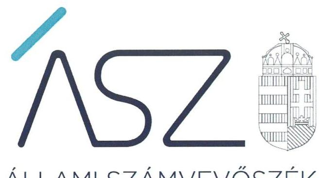
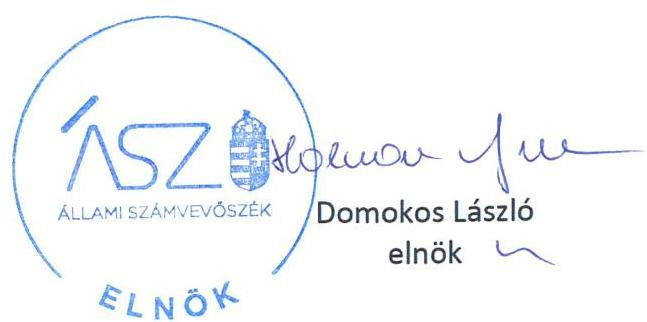

ÁLLAMI SZÁMVEVŐSZÉK

# JELENTÉS 

Nemzeti tulajdonú gazdasági társaságok ellenőrzése

Váci Dunakanyar Színház Nonprofit Korlátolt Felelősségű Társaság
2020.

20180
www.asz.hu

---

ÁLLAMI SZÁMVEVŐSZÉK

# JELENTÉS

Nemzeti tulajdonú gazdasági társaságok ellenőrzése

Váci Dunakanyar Színház Nonprofit Korlátolt Felelősségű Társaság

2020.
O9
hó 29. nap

20180
www.asz.hu

---

# AZ ELLENŐRZÉST FELÜGYELTE: 

KLINGA LÁSZLÓ felügyeleti vezető

## AZ ELLENŐRZÉST VEZETTE ÉS A VÉGREHAJTÁSÁÉRT FELELŐS:

SALAMIN VIKTOR ellenőrzésvezető

## A PROGRAM ÖSSZEÁLLÍTÁSÁÉRT FELELŐS:

FEKETE-NAGY ANDRÁS GÁBOR ellenőrzési program elkészítéséért felelős vezető

TÓTPÁL SZABOLCS osztályvezető

IKTATÓSZÁM: EL-2856-001/2020
Jelentéseink az Országgyúlés számítógépes hálózatán és az interneten a www.asz.hu címen is olvashatóak.

TÉMASZÁM: 2513
ELLENŐRZÉS-AZONOSÍTÓ SZÁM: V082249, V082280, V085714

---

# TARTALOMJEGYZÉK 

■ ÖSSZEGZÉS ..... 5
■ AZ ELLENŐRZÉS CÉLJA ..... 6
■ AZ ELLENŐRZÉS TERÜLETE ..... 7
■ AZ ELLENŐRZÉS HÁTTERE, INDOKOLTSÁGA ..... 8
■ A JELENTÉS LÉNYEGES KÉRDÉSKÖREI ..... 9
■ AZ ELLENŐRZÉS HATÓKÖRE ÉS MÓDSZEREI ..... 10
■ MEGÁLLAPÍTÁSOK ..... 12
■ JAVASLATOK ..... 14
■ MELLÉKLETEK ..... 15
I. sz. melléklet: Értelmező szótár ..... 15
■ FÜGGELÉK: ÉSZREVÉTELEK ..... 17
■ RÖVIDÍTÉSEK JEGYZÉKE ..... 19

---

.

---

# ÖSSZEGZÉS 

A Váci Dunakanyar Színház Nonprofit Kft. felett tulajdonosi jogokat gyakorló Vác Város Önkormányzat tulajdonosi joggyakorlása a 2017-2018. években szabályszerű volt. A Társaság vagyongazdálkodása a 2015-2018. években nem volt szabályszerű, így az átláthatóságot és az elszámoltathatóságot nem biztosította.

## Az ellenőrzés társadalmi indokoltsága

Az Állami Számvevőszék kiemelt célja, hogy a helyi önkormányzatok gazdálkodásában rejlő pénzügyi kockázatok feltárásával, az államháztartáson kívülre nyújtott költségvetési támogatások és ingyenes vagyonjuttatások, valamint az államháztartáson kívül múködő feladat-ellátó rendszerek ellenőrzéseivel hozzájáruljon ahhoz, hogy a közpénzeket az államháztartáson kívül múködő szervezetek is átlátható, rendezett módon használják fel.

A helyi önkormányzatok tulajdona nemzeti vagyon, melynek megőrzése érdekében kiemelten fontos a nemzeti tulajdonú gazdasági társaságok ellenőrzése. Ellenőrzésüket további társadalmi elvárás is indokolja, részben a gazdálkodásuk körébe tartozó vagyon nagysága, részben az általuk ellátott közszolgáltatások, sajátos feladatellátások, mivel tevékenységükön keresztül a lakosság széles köre kerül kapcsolatba a társaságokkal.

Az Állami Számvevőszék céljaival és a társadalmi igénnyel összhangban, a gazdasági társaságok kiemelt fontosságú szerepe miatt került sor a Váci Dunakanyar Színház Nonprofit Kft. vagyongazdálkodásának, illetve a Vác Város Önkormányzat tulajdonosi joggyakorlásának ellenőrzésére.

## Főbb megállapítások, következtetések, javaslatok

Vác Város Önkormányzat a 2017-2018. években a tulajdonosi jogok gyakorlásának kereteit a jogszabályi előírások szerint kialakította, tulajdonosi jogait a törvényi és a belső előírások szerint gyakorolta.

A Váci Dunakanyar Színház Nonprofit Kft. vagyongazdálkodási tevékenysége nem volt szabályszerű. A Társaság a jogszabály előírása ellenére a 2015-2018. évekre vonatkozóan nem állított össze leltárt, amely tételesen, ellenőrizhető módon tartalmazta a mérleg fordulónapján meglévő eszközöket és forrásokat mennyiségben és értékben. Leltár hiányában a 2015-2018. évi egyszerűsített éves beszámolók részét képező mérlegek nem voltak megalapozottak, a vagyon védelme nem volt biztosított.

A Váci Dunakanyar Színház Nonprofit Kft., mint kormányzati szektorba sorolt nemzeti tulajdonban lévő gazdasági társaság 2017. évben nem tett eleget a jogszabályokban előírt adatszolgáltatási kötelezettségeinek.

Az Állami Számvevőszék a jelentésben foglalt megállapítások alapján a Váci Dunakanyar Színház Nonprofit Kft. ügyvezetőjének kettő javaslatot fogalmazott meg.

---

# AZ ELLENŐRZÉS CÉLJA 

AZ ELLENŐRZÉS CÉLJA annak megállapítása volt, hogy a tulajdonosi joggyakorló a gazdasági társaságai feletti tulajdonosi joggyakorlás kereteit kialakította-e, tulajdonosi jogait megfelelően gyakorolta-e és kötelezettségeit teljesítette-e. Az ellenőrzés értékeli, hogy a gazdasági társaság biztosította-e a vagyon védelmét a nyilvántartások szabályszerű vezetése és a mérleg tételeinek leltárral történő alátámasztása útján, valamint szabályszerűen gondoskodott-e a használatában, kezelésében lévő nemzeti vagyon értékének megőrzéséről, gyarapításáról, hasznosításáról. Az ellenőrzés célja továbbá annak megítélése, hogy a kormányzati szektorba sorolt nemzeti tulajdonban lévő gazdasági társaság gazdálkodásának a kormányzati szektor hiányára és az államadósságra befolyással bíró elemei a jogszabályi előírásoknak megfeleltek-e és a gazdasági társaság az adatszolgáltatási kötelezettségének eleget tett-e.

---

# AZ ELLENŐRZÉS TERÜLETE

## Vác Város Önkormányzat, valamint a kizárólagos tulajdonában lévő Váci Dunakanyar Színház Nonprofit Korlátolt Felelősségű Társaság

Vác Város Önkormányzat a Váci Dunakanyar Színház Nonprofit Korlátolt Felelősségű Társaságot 2012-ben alapította kulturális-, közművelődési- és művészeti feladatok ellátására. Az ellenőrzött időszakban a Társaság1 kizárólagos tulajdonosa az Önkormányzat2 volt. A tulajdonosi jogokat az Alapító3 gyakorolta. A Társaságnál három fős Felügyelő Bizottság4 működött.

A Társaság jegyzett tőkéje 2015. december 31-én 3,0 M Ft volt, amely az ellenőrzött időszak végéig nem változott. A 2015-2018. években a Társaság főtevékenysége előadó-művészeti tevékenység volt, amelyet a Közszolgáltatási szerződés5 alapján közfeladatként látott el.

A Társaság az ellenőrzött időszakban vagyonkezelésbe vett vagyonnal nem rendelkezett. A 2017/28. számú Hivatalos Értesítőben közzétett, 2017. június 15-étől hatályos NGM6 Közlemény alapján a Társaság kormányzati szektorba sorolt egyéb szervezetnek minősült. A Társaságnál független könyvvizsgáló kijelölésére nem került sor, arra a Számv. tv.7 előírásai szerint nem volt kötelezett.

Az ellenőrzött időszakban a polgármester, a jegyző és az ügyvezető8 személyében változás nem történt.

---

# AZ ELLENŐRZÉS HÁTTERE, INDOKOLTSÁGA 

Az Alaptörvény ${ }^{9}$ 38. cikke alapján az állam és a helyi önkormányzatok tulajdona nemzeti vagyon. A nemzeti vagyon megőrzése, megóvása érdekében kiemelten fontos ezen nemzeti tulajdonú gazdasági társaságok ellenőrzése. Gazdálkodásuk jellemzően a közérdeklődés és a média figyelmének középpontjában áll, amihez hozzájárul a gazdálkodásuk körébe tartozó - a nemzeti vagyon részét képező - vagyon nagysága, illetve az általuk ellátott közszolgáltatások minősége és hatékonysága. Ellenőrzéseink feltárhatják, hogy a tulajdonosi felügyelet hozzájárult-e a szabályszerű gazdálkodáshoz és feladatellátáshoz.

Az ellenőrzés eredményeként meghatározhatóvá válnak a szervezet vagyongazdálkodást érintő kockázatai, ezzel lehetővé téve a kockázatok csökkentését. A megállapítások alapján megfogalmazott számvevőszéki javaslatok hasznosítása elősegítheti a meglévő hibák megszüntetését. A jó gyakorlatok bemutatásával az ÁSZ ${ }^{10}$ hozzájárulhat a követendő megoldások megismertetéséhez, terjesztéséhez.

Az Európai Közösséget létrehozó szerződéshez csatolt, a túlzott hiány esetén követendő eljárásról szóló jegyzőkönyv alkalmazásáról megalkotott 2009. május 25-i 479/2009/EK Rendelet II. fejezet 3. cikk (1) bekezdése alapján a tagállamok évente kétszer teljesítenek adatszolgáltatást a Bizottság (Eurostat) részére a tervezett és tényleges kormányzati hiányukról és államadósságuk szintjéről. Az adatszolgáltatás teljesítéséhez kapcsolódóan - összhangban a hivatkozott, és egyéb európai uniós jogszabályokkal nemcsak az államháztartás, hanem az államháztartáson kívüli, kormányzati szektorba sorolt egyéb szervezetek adatait is figyelembe kell venni, tekintettel arra, hogy mindkét terület gazdálkodása befolyásolja a kormányzati szektor hiányát, az államadósság mértékét.

---

# A JELENTÉS LÉNYEGES KÉRDÉSKÖREI 

1.     - A Társaság feletti tulajdonosi joggyakorlás megfelelt-e a jogszabályi és belső előírásoknak?
2.     - A Társaság vagyongazdálkodási tevékenysége szabályszerű volt-e?
3.     - A Társaság gazdálkodásának a kormányzati szektor hiányára és az államadósságra befolyással bíró elemei megfeleltek-e a jogszabályi előírásoknak, az adatszolgáltatási kötelezettségének eleget tett-e?

---

# AZ ELLENŐRZÉS HATÓKÖRE ÉS MÓDSZEREI 

## Az ellenőrzés típusa

Megfelelőségi ellenőrzés.

## Az ellenőrzött időszak

A tulajdonosi joggyakorlás vonatkozásában az ellenőrzött időszak a 20172018. évek, az éves beszámolók elfogadása kivételével, amelyeknél az ellenőrzött időszak 2015-2018. évek.

A Társaság vagyongazdálkodása ellenőrzése tekintetében az ellenőrzött időszak a 2015-2018. évek. A kormányzati szektorba sorolt nemzeti tulajdonban lévő gazdasági társaságra vonatkozó egyes kötelezettségek teljesítésének ellenőrzése a 2015. és 2017. évekre terjedt ki. Az adatszolgáltatási kötelezettségére vonatkozó jogszabályi előírások betartását a teljes ellenőrzött időszakra vonatkozóan értékelte az ÁSZ.

## Az ellenőrzés tárgya

Az önkormányzati tulajdonban lévő gazdasági társaság feletti tulajdonosi joggyakorlás kialakítása és múködtetése.

Önkormányzati tulajdonban lévő gazdasági társaság vagyongazdálkodása keretében a társaság használatában, kezelésében lévő nemzeti vagyon, illetve a saját vagyon tekintetében a vagyonnyilvántartások vezetése, leltára. A társaság használatában, vagyonkezelésében lévő nemzeti vagyon tekintetében a vagyon értékének megőrzése, gyarapítása, hasznosítása.

A kormányzati szektorba sorolt nemzeti tulajdonban lévő gazdasági társaság gazdálkodásának a kormányzati szektor hiányára és az államadósságra befolyással bíró elemei és a jogszabályi előírásoknak megfelelő adatszolgáltatási kötelezettség teljesítése.

## Az ellenőrzött szervezet

Vác Város Önkormányzat és a Váci Dunakanyar Színház Nonprofit Kft.

## Az ellenőrzés jogalapja

Az ellenőrzés jogalapját az ÁSZ tv. ${ }^{11} 1$. § (3) bekezdése és 5. § (3)-(5) bekezdései képezték.

---

# Az ellenőrzés módszerei 

Az ellenőrzést az ellenőrzési program ellenőrzési kérdései, az ellenőrzött időszakban hatályos jogszabályok, az ellenőrzés szakmai szabályok és módszertanok alapján, a nemzetközi standardok figyelembe vételével végeztük.

Az ellenőrzés ideje alatt az ellenőrzött szervezettel történő kapcsolattartást az ÁSZ SZMSZ-ének ${ }^{12}$ vonatkozó előírásai alapján biztosítottuk.

A tulajdonosi joggyakorlás kereteinek kialakítását, a tulajdonosi joggyakorló tevékenységét 2017. január 1-től 2018. december 31-éig ellenőrizte az ÁSZ a felügyelő bizottság és a független könyvvizsgáló múködéséhez kapcsolódóan, valamint azt, hogy a tulajdonosi joggyakorló - amennyiben a gazdasági társaság feladatellátásához kapcsolódóan határozott meg követelményeket, elvárásokat - a nemzeti vagyon értékének megőrzése érdekében monitorozta-e azok teljesülését.

A gazdasági társaság vagyonhoz kapcsolódó nyilvántartásai vezetésének megfelelősége, valamint a nemzeti vagyon értéke megőrzésének, gyarapításának, hasznosításának szabályszerűsége 2015. és 2017-2018. évek tekintetében került ellenőrzésre. A 2015-2018. éveket érintően történt meg a lényeges dokumentumok értékelése.

A vagyonnyilvántartások és a leltár szabályszerűsége esetében az ellenőrzés azokra a legnagyobb értékű tételekre - a lényeges sokaságra - terjedt ki, melyek összértéke eléri a teljes sokaság összértékének 50\%-át. A lényeges sokaságot tételesen ellenőrizte az ÁSZ.

A kormányzati szektorba sorolt gazdasági társaság gazdálkodásának a kormányzati szektor hiányára befolyással bíró gazdasági eseményei elszámolásának megfelelősége a 2017. év tekintetében került ellenőrzésre, a kormányzati szektorba sorolt gazdasági társaság adatszolgáltatási kötelezettségére vonatkozó jogszabályi előírások betartását az e területre vonatkozó teljes ellenőrzött időszakra értékeltük.

Az ellenőrzési kérdések megválaszolásához szükséges bizonyítékok megszerzése a Társaság vonatkozásában a következő ellenőrzési eljárások alkalmazásával történt: megfigyelés, információkérés, összehasonlítás, elemző eljárás. Az ellenőrzési bizonyítékként felhasználható adatforrások közé tartoznak az ellenőrzési programban felsorolt adatforrások, továbbá minden - az ellenőrzés folyamán - feltárt, az ellenőrzés szempontjából információkat tartalmazó dokumentum. Az ÁSZ az ellenőrzést a kérdésekre adott válaszok kiértékelésével, valamint a megjelölt adatforrások, a csatolt tanúsítványok felhasználásával, továbbá az adott időszakban hatályos jogszabályok figyelembe vételével folytatta le.

Amennyiben a Társaság múködését és gazdálkodását alapvetően meghatározó dokumentum hiánya miatt, valamely lényeges kérdéskörre vonatkozóan az ÁSZ megállapítást tett, további ellenőrzési tevékenységek az adott kérdéskörrel és az azzal szoros logikai kapcsolatban lévő kérdéskörökkel - ráépülő jelleggel - nem kerültek végrehajtásra.

---

# MEGÁLLAPÍTÁSOK 

## 1. A Társaság feletti tulajdonosi joggyakorlás megfelelt-e a jogszabályi és belső előírásoknak?

Összegző megállapítás Az Önkormányzat tulajdonosi joggyakorlása a 20172018.években szabályszerű volt.

A TULAJDONOSI JOGOK GYAKORLÁSÁNAK RENDJÉT a Társaság felett az Önkormányzat az Alapító okirat ${ }^{13}$-ban, az SZMSZ ${ }^{14}$-ben, a vagyonrendeletben ${ }^{15}$ és a Közszolgáltatási szerződésben kialakította.

Az Alapító a Taktv. ${ }^{16}$ 5. § (3) bekezdésének előírása szerint a vezető tisztségviselők, a felügyelőbizottsági tagok, az Mt. ${ }^{17}$ 208. §-ának hatálya alá eső munkavállalók javadalmazásáról, valamint a jogviszony megszűnése esetére biztosított juttatások módjának, mértékének elveiről, annak rendszeréről szóló szabályzatot megalkotta.

A FELÜGYELŐ BIZOTTSÁG az Alapító által jóváhagyott ügyrenddel a Ptk. ${ }^{18} 3: 122 . \S$ (3) bekezdésének előírásai alapján rendelkezett az ellenőrzött időszakban.

A TÁRSASÁG EGYSZERŰSÍTETT ÉVES BESZÁMOLÓIT a 2015-2018. évekre vonatkozóan az Alapító a Ptk. és az Alapító okirat előírásai szerint a Felügyelő Bizottság írásbeli jelentésének birtokában fogadta el, amely során döntött a nyereség felosztásáról is.

## 2. A Társaság vagyongazdálkodási tevékenysége szabályszerű volt-e?

Összegző megállapítás A Társaság vagyongazdálkodási tevékenysége a 2015-2018. években nem volt szabályszerű.

A VAGYONNYILVÁNTARTÁSI TEVÉKENYSÉG FELTÉTELEIT a Társaság az ellenőrzött években kialakította, a Számv. tv. előírása szerint rendelkezett számviteli politikával ${ }_{1-4}{ }^{19}$, Leltározási szabályzattal ${ }_{1-4}{ }^{20}$, eszközök és források értékelési szabályzattal ${ }_{1-4}{ }^{21}$, pénzkezelési szabályzattal ${ }_{1-4}{ }^{22}$, valamint számlarenddel ${ }_{1-4}{ }^{23}$. A Leltározási szabályzat tartalmazta a leltározásra és leltárkészítésre vonatkozó szabályokat, előírásokat.

A VAGYONGAZDÁLKODÁS nem volt szabályszerű az ellenőrzött időszakban. A Társaság a Számv. tv. 69. § (1) bekezdésének előírása ellenére a 2015-2018. évekre vonatkozóan nem állított össze olyan leltárt, amely tételesen, ellenőrizhető módon tartalmazta volna a mérleg fordulónapján meglévő eszközöket és forrásokat mennyiségben és értékben. A

---

Társaság által összeállított 2015-2018. évi leltárak a tárgyi eszközöket mennyiségben nem, csak értékben tartalmazták. A Számv. tv. előírásai szerinti leltár hiányában a 2015-2018. évi egyszerűsített éves beszámolók részét képező mérlegek nem voltak megalapozottak.

# 3. A Társaság gazdálkodásának a kormányzati szektor hiányára és az államadósságra befolyással bíró elemei megfeleltek-e a jogszabályi előírásoknak, az adatszolgáltatási kötelezettségének eleget tett-e? 

Összegző megállapítás

A Társaság gazdálkodásának a kormányzati szektor hiányára és az államadósságra befolyással bíró elemei nem feleltek meg a jogszabályi előírásoknak, adatszolgáltatási kötelezettségének nem tett eleget.

A Társaság adatszolgáltatási kötelezettségének nem tett eleget, a 2017. évi beszámolóját nem küldte meg az államháztartásért felelős miniszter részére, ezzel megsértette az Áht. ${ }^{24}$ 107. § (1) bekezdését az Ávr. ${ }^{25}$ 167/M. § (1) bekezdése, valamint 5. mellékletének 23. pontja vonatkozásában.

---

# JAVASLATOK 

Az ÁSZ tv. 33. § (1) bekezdésében foglaltak értelmében az ellenőrzött szervezet vezetője köteles a jelentésben foglalt megállapításokhoz kapcsolódó intézkedési tervet összeállítani és azt a jelentés kézhezvételétől számított 30 napon belül az ÁSZ részére megküldeni. Amennyiben az ellenőrzött szervezet vezetője nem küldi meg határidőben az intézkedési tervet, vagy továbbra sem elfogadható intézkedési tervet küld, az Állami Számvevőszék elnöke az ÁSZ tv. 33. § (3) bekezdése a) és b) pontjaiban foglaltakat érvényesítheti.

## Váci Dunakanyar Színház Nonprofit Korlátolt Felelősségű Társaság ügyvezetőjének

1. Gondoskodjon az ellenőrzött időszakot követően készítendő beszámoló mérleg tételeit alátámasztó Számv. tv. előírásai szerinti leltár összeállításáról.
(2.sz. megállapítás 2. bekezdés 2. mondata alapján)
2. Intézkedjen az Ávr.-ben előírt adatszolgáltatási kötelezettség teljesítéséről.
(3. sz. megállapítás 1. bekezdése alapján)

---

# MELLÉKLETEK 

- I. SZ. MELLÉKLET: ÉRTELMEZŐ SZÓTÁR
gazdasági társaság
kormányzati szektorba sorolt egyéb szervezet
közszolgáltatás
közfeladat
nemzeti vagyon
nemzeti vagyon használója
tulajdonosi jogok gyakorlója

Ptk. 3:88. § (1) bekezdése szerint „a gazdasági társaságok üzletszerű közös gazdasági tevékenység folytatására, a tagok vagyoni hozzájárulásával létrehozott, jogi személyiséggel rendelkező vállalkozások, amelyekben a tagok a nyereségből közösen részesednek, és a veszteséget közösen viselik".
Az a szervezet, amely az Áht. alapján nem része az államháztartásnak, azonban az Európai Közösséget létrehozó szerződéshez csatolt, a túlzott hiány esetén követendő eljárásról szóló jegyzőkönyv alkalmazásáról szóló 2009. május 25-i 479/2009/EK rendelet szerint kormányzati szektorba tartozik.
Az Ebktv. ${ }^{26}$ 3. § d) pontja a következőképpen határozza meg a közszolgáltatást: „szerződéskötési kötelezettség alapján a lakosság alapvető szükségleteinek ellátására irányuló szolgáltatás, így különösen a villamos energia-, gáz-, hő-, víz-, szennyvíz- és hulladékkezelési, köztisztasági, postai és táv-közlési szolgáltatás, továbbá a menetrend alapján közlekedő járművekkel végzett közforgalmú személyszállítás".
Az Áht. 3/A. § (1) bekezdése alapján közfeladat a jogszabályban meghatározott állami vagy önkormányzati feladat.
Nvtv. ${ }^{27}$ 1. § (2) bekezdése szerint nemzeti vagyonba tartozik többek között:
„az állam vagy a helyi önkormányzat kizárólagos tulajdonában álló dolgok,
az a) pont hatálya alá nem tartozó, állam vagy a helyi önkormányzat tulajdonában lévő dolog,
az állam vagy a helyi önkormányzat tulajdonában lévő pénzügyi eszközök, továbbá az államot vagy a helyi önkormányzatot megillető társasági részesedések,
az államot vagy a helyi önkormányzatot megillető bármely vagyoni érték-kel rendelkező jogosultság, amelyet jogszabály vagyoni értékű jogként nevesít
A tulajdonosi joggyakorló vagy a nemzeti vagyon használója által a nemzeti vagyon birtoklásának, használatának, hasznok szedése jogának bármely - a tulajdonjog átruházását nem eredményező - jogcímen történő átengedése, ide nem értve a vagyonkezelésbe adást, valamint a haszonélvezeti jog alapítását.
Forrás: Nvtv. 3. § (1) bekezdés 4. pont
Azon természetes személy, jogi személy vagy jogi személyiséggel nem rendelkező szervezet, aki vagy amely állami vagyon tekintetében törvény vagy szerződés alapján, a helyi önkormányzat vagyona tekintetében törvény, a helyi önkormányzat rendelete vagy szerződés alapján bármely jogcímen nemzeti vagyont birtokol, használ, szedi annak hasznait, kivéve a tulajdonosi joggyakorló.
Forrás: Nvtv. 3. § (1) bekezdés 11. pont
Aki a nemzeti vagyon felett az államot vagy a helyi önkormányzatot megillető tulajdonosi jogok és kötelezettségek összességének gyakorlására jogosult. (Forrás: Nvtv. 3. § (1) bekezdés 17. pontja)

---

.

---

# FÜGGELÉK: ÉSZREVÉTELEK 

A jelentéstervezetet a Számvevőszék 15 napos észrevételezésre megküldte az ellenőrzött szervezet vezetőjének az ÁSZ tv. 29. §* (1) bekezdése előírásának megfelelően.

A Váci Dunakanyar Színház Nonprofit Kft. ügyvezetője, illetve Vác Város Önkormányzat polgármestere írásban jelezte, hogy a jelentéstervezet megállapításaira nem tesz észrevételt.

[^0]
[^0]:    * 29. § (1) Az Állami Számvevőszék az ellenőrzési megállapításait megküldi az ellenőrzött szervezet vezetőjének vagy az általa megbízott személynek, és annak, akinek személyes felelősségét állapította meg.
    (2) Az ellenőrzött szervezet vezetője és a felelősként megjelölt személy az ellenőrzés megállapításaira tizenöt napon belül írásban észrevételt tehet.
    (3) Az Állami Számvevőszék az észrevételre a beérkezésétől számított harminc napon belül írásban válaszol. A figyelembe nem vett észrevételeket köteles a jelentésben feltüntetni, és megindokolni, hogy azokat miért nem fogadta el.

---

.

---

# RÖVIDÍTÉSEK JEGYZÉKE 

${ }^{1}$ Társaság
${ }^{2}$ Önkormányzat
${ }^{3}$ Alapító
${ }^{4}$ Felügyelő Bizottság
${ }^{5}$ Közszolgáltatási szerződés ${ }_{1}$

Közszolgáltatási szerződés ${ }_{2}$

6 NGM
${ }^{7}$ Számv. tv.
${ }^{8}$ ügyvezető
${ }^{9}$ Alaptörvény
${ }^{10}$ ÁSZ
${ }^{11}$ ÁSZ tv.
${ }^{12}$ ÁSZ SZMSZ
${ }^{13}$ Alapító okirat
${ }^{14}$ SZMSZ
${ }^{15}$ vagyonrendelet
${ }^{16}$ Taktv.
${ }^{17}$ Mt.
${ }^{18}$ Ptk.
${ }^{19}$ Számviteli politika $1-4$

Váci Dunakanyar Színház Nonprofit Korlátolt Felelősségű Társaság
Vác Város Önkormányzat
Vác Város Önkormányzatának Képviselő-testülete, mint a társaság legfőbb szerve
a Váci Dunakanyar Színház Nonprofit Korlátolt Felelősségű Társaság Felügyelő Bizottsága
Vác Város Önkormányzat és a Váci Dunakanyar Színház Nonprofit Korlátolt Felelősségű Társaság között létrejött és a Képviselő-testület az 51/2013. (II. 21.) számú határozatával jóváhagyott Közszolgáltatási szerződés (hatályos 2013. február 22-étől 2017. június 22-éig)
Vác Város Önkormányzat és a Váci Dunakanyar Színház Nonprofit Korlátolt Felelősségű Társaság között létrejött és a Képviselő-testület a 156/2017. (VI. 22.) számú határozatával jóváhagyott Közszolgáltatási szerződés (hatályos 2017. június 23-ától 2022. június 22-éig, öt év határozott időtartamra szól)
Nemzetgazdasági Minisztérium
a számvitelről szóló 2000. évi C. törvény
a Váci Dunakanyar Színház Nonprofit Korlátolt Felelősségű Társaság ügyvezetője
Magyarország Alaptörvénye
Állami Számvevőszék
az Állami Számvevőszékről szóló 2011. évi LXVI. törvény
az Állami Számvevőszék Szervezeti és Működési Szabályzata
a Váci Dunakanyar Színház Nonprofit Korlátolt Felelősségű Társaság Alapító okirata és módosításai
Vác Város Önkormányzatának 9/2012. (III. 22.) számú önkormányzati rendelete
Vác Város Önkormányzat Képviselő-testületének Szervezeti és Müködési
Szabályzatáról
Vác Város Önkormányzatának 22/2014. (VI. 20.) számú rendelete az önkormányzat vagyonáról és a vagyonnal való gazdálkodás egyes szabályairól, valamint az önkormányzat vagyonának értékesítése, illetve hasznosítása során alkalmazandó pályáztatási szabályokról
a köztulajdonban álló gazdasági társaságok takarékosabb müködéséről szóló 2009. évi CXXII. törvény
a munka törvénykönyvéről szóló 2012. évi I. törvény
a Polgári Törvénykönyvről szóló 2013. évi V. törvény
Váci Dunakanyar Színház Nonprofit Korlátolt Felelősségű Társaság Számviteli politika1 (Hatályos: 2015. január 1-jétől)
Váci Dunakanyar Színház Nonprofit Korlátolt Felelősségű Társaság Számviteli politika2 (Hatályos: 2016. január 1-jétől)
Váci Dunakanyar Színház Nonprofit Korlátolt Felelősségű Társaság Számviteli politika3 (Hatályos: 2017. január 1-jétől)
Váci Dunakanyar Színház Nonprofit Korlátolt Felelősségű Társaság Számviteli politika (Hatályos: 2018. január 1-jétől)
Váci Dunakanyar Színház Nonprofit Korlátolt Felelősségű Társaság Eszközök és források leltárkészítési és leltározási szabályzata ${ }_{1}$ (hatályos 2015. január 1-jétől)
Váci Dunakanyar Színház Nonprofit Korlátolt Felelősségű Társaság Eszközök és források leltárkészítési és leltározási szabályzata ${ }_{2}$ (hatályos 2016. január 1-jétől)

---

21 Értékelési szabályzat ${ }_{1-4}$
22 Pénzkezelési szabályzat ${ }_{1-4}$
${ }^{23}$ Számlarend $_{1-4}$
${ }^{24}$ Áht.
${ }^{25}$ Ávr.
${ }^{26}$ Ebktv.
${ }^{27} \mathrm{Nvtv}$.

Váci Dunakanyar Színház Nonprofit Korlátolt Felelősségű Társaság Eszközök és források leltárkészítési és leltározási szabályzata3 (hatályos 2017. január 1-jétől)
Váci Dunakanyar Színház Nonprofit Korlátolt Felelősségű Társaság Eszközök és források leltárkészítési és leltározási szabályzata4 (hatályos 2018. január 1-jétől)
Váci Dunakanyar Színház Nonprofit Korlátolt Felelősségű Társaság Eszközök és források értékelési szabályzata1 (Hatályos: 2015. január 1-jétől)
Váci Dunakanyar Színház Nonprofit Korlátolt Felelősségű Társaság Eszközök és források értékelési szabályzata2 (Hatályos: 2016. január 1-jétől)
Váci Dunakanyar Színház Nonprofit Korlátolt Felelősségű Társaság Eszközök és források értékelési szabályzata3 (Hatályos: 2017. január 1-jétől)
Váci Dunakanyar Színház Nonprofit Korlátolt Felelősségű Társaság Eszközök és források értékelési szabályzata4 (Hatályos: 2018. január 1-jétől)
Váci Dunakanyar Színház Nonprofit Korlátolt Felelősségű Társaság Pénzkezelési szabályzat ${ }_{1}$ (Hatályos: 2015. január 1-jétől)
Váci Dunakanyar Színház Nonprofit Korlátolt Felelősségű Társaság Pénzkezelési szabályzat ${ }_{2}$ (Hatályos: 2016. január 1-jétől)
Váci Dunakanyar Színház Nonprofit Korlátolt Felelősségű Társaság Pénzkezelési szabályzat ${ }_{3}$ (Hatályos: 2017. január 1-jétől)
Váci Dunakanyar Színház Nonprofit Korlátolt Felelősségű Társaság Pénzkezelési szabályzat ${ }_{4}$ (Hatályos: 2018. január 1-jétől)
Váci Dunakanyar Színház Nonprofit Korlátolt Felelősségű Társaság Számlarend ${ }_{1}$ (Hatályos: 2015. január 1-jétől)
Váci Dunakanyar Színház Nonprofit Korlátolt Felelősségű Társaság Számlarend ${ }_{2}$ (Hatályos: 2016. január 1-jétől)
Váci Dunakanyar Színház Nonprofit Korlátolt Felelősségű Társaság Számlarend ${ }_{3}$ (Hatályos: 2017. január 1-jétől)
Váci Dunakanyar Színház Nonprofit Korlátolt Felelősségű Társaság Számlarend ${ }_{4}$ (Hatályos: 2018. január 15-től)
az államháztartásról szóló 2011. évi CXCV. törvény
368/2011. (XII. 31.) Korm. rendelet az államháztartásról szóló törvény végrehajtásáról
az egyenlő bánásmódról és az esélyegyenlőség előmozdításáról szóló 2003. évi CXXV. törvény
a nemzeti vagyonról szóló 2011. évi CXCVI. törvény

---

# ASZ 

ALLAMI SZAMVEVOSZEK
1052 Budapest, Apáczai Cs. J. u. 10. I 1364 Budapest 4. Pf. 54 TEL: +36 14849100
email: szamvevoszek@asz.hu
web: www.asz.hu | www.aszhirportal.hu