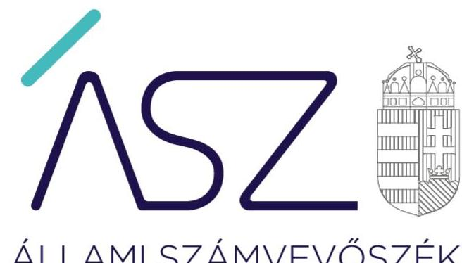
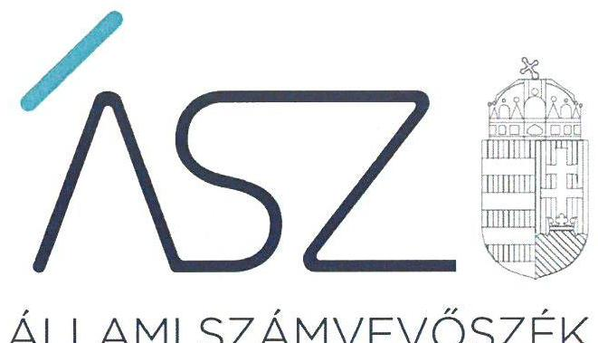
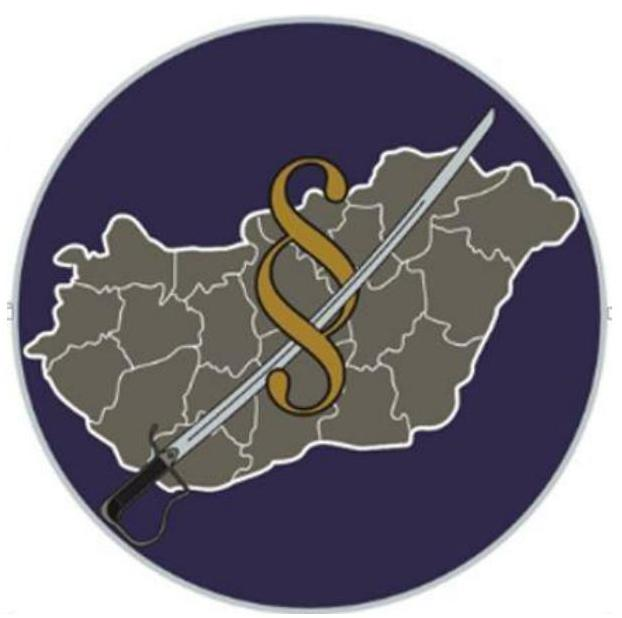

ÁLLAMI SZÁMVEVŐSZÉK

# JELENTÉS 

## Központi költségvetési szervek ellenőrzése

Magyar Honvédség Katonai Igazgatási és Központi Nyilvántartó Parancsnokság
2020.

20181
www.asz.hu

---

ÁLLAMI SZÁMVEVŐSZÉK

# JELENTÉS

## Központi költségvetési szervek ellenőrzése

Magyar Honvédség Katonai Igazgatási és Központi Nyilvántartó Parancsnokság

2020. 09. hó 23. nap

20181 www.asz.hu

Domokos László
elnök

---

# AZ ELLENŐRZÉST FELÜGYELTE: 

MAKKAI MÁRIA felügyeleti vezető

## AZ ELLENŐRZÉST VEZETTE ÉS A VÉGREHAJTÁSÁÉRT FELELŐS:

JANIK JÓZSEF ellenőrzésvezető

A PROGRAM ÖSSZEÁLLÍTÁSÁÉRT FELELŐS:
SZALAY-NAGY JÁNOS projektvezető

IKTATÓSZÁM: EL-2861-001/2020.
TÉMASZÁM: 2450
ELLENŐRZÉS-AZONOSÍTÓ SZÁM: V079187

---

# TARTALOMJEGYZÉK 

■ ÖSSZEGZÉS ..... 5
■ AZ ELLENŐRZÉS CÉLJA ..... 6
■ AZ ELLENŐRZÉS TERÜLETE ..... 7
■ AZ ELLENŐRZÉS HÁTTERE, INDOKOLTSÁGA ..... 8
■ A JELENTÉS LÉNYEGES KÉRDÉSKÖREI ..... 9
■ AZ ELLENŐRZÉS HATÓKÖRE ÉS MÓDSZEREI ..... 10
■ MEGÁLLAPÍTÁSOK ..... 12
■ JAVASLATOK ..... 15
■ MELLÉKLETEK ..... 17
I. sz. melléklet: Értelmező szótár ..... 17
■ FÜGGELÉK: ÉSZREVÉTELEK ..... 19
■ RÖVIDÍTÉSEK JEGYZÉKE ..... 21

---

.

---

# ÖSSZEGZÉS 

A budapesti székhelyú Magyar Honvédség Katonai Igazgatási és Központi Nyilvántartó Parancsnokság belső kontrollrendszerének müködtetése 2015-2018 között nem volt szabályszerű. Nem volt biztositott a nemzeti vagyonnal való átlátható, szabályszerű gazdálkodás.

## Az ellenőrzés társadalmi indokoltsága

Az államháztartás központi alrendszerébe tartozó szervezetek alapvető rendeltetése a társadalom javát szolgáló közfeladatok ellátásának hatékony, számon kérhető, pazarlásmentes biztosítása. A közpénzek felhasználásában meghatározó arányt képviselő központi költségvetési szervek gazdálkodásuk révén jelentős hatást gyakorolhatnak a költségvetés egyensúlyának fenntartására, a közpénzek felelős, takarékos felhasználására, a nemzeti vagyon értékének megóvására, gyarapítására, társadalmi érdeknek megfelelő hasznosítására.

A szabályszerű, korrupciómentes, átlátható múködés és az elszámoltatható közpénzfelhasználás alapfeltétele az integritás kontrollokat is magában foglaló belső kontrollrendszer szabályszerű kiépítettsége, a kontrollok érvényesítése, a közfeladat ellátását szolgáló vagyonelemek valósághú számbavétele, értékelése, napra kész nyilvántartása.

Indokolt ezért, hogy az Állami Számvevőszék a központi költségvetési szervek belső kontrollrendszerét és vagyongazdálkodását rendszeresen ellenőrizze, értékelve múködésük irányítottságát, korrupció elleni védettségét, továbbá, hogy vagyongazdálkodásuk elszámoltatható volt-e és hozzájárult-e a kiegyensúlyozott, átlátható és fenntartható költségvetési gazdálkodás Alaptörvényben meghatározott elvének érvényesítéséhez.

## Főbb megállapítások, következtetések, javaslatok

2015-2018 között a Magyar Honvédség Katonai Igazgatási és Központi Nyilvántartó Parancsnokság múködését, gazdálkodását meghatározó szabályozási környezet kialakítása szabályszerűen történt. A gazdálkodási jogkörök gyakorlására jogosult személyek és aláírás-mintájuk beazonosíthatósága szabályszerű nyilvántartás hiányában nem volt biztosított, a kötelezettségvállalások nyilvántartása nem felelt meg a jogszabályi előírásoknak. Emiatt a belső kontrollok nem múködtek szabályszerűen.

A szervezet múködésével kapcsolatos korrupciós kockázatelemzést nem végeztek, a kötelezően elő nem írt integritást erősítő kontrollok további kiépítése, kiterjesztése szükséges.

A jogszabályok és a belső szabályzatok előírásai ellenére az éves költségvetési beszámolót leltárral nem támasztották alá, a mérlegben szereplő adatok valódisága nem volt igazolt, nem érvényesült a nemzeti vagyon védelme. Leltár hiányában a szervezet számviteli beszámolója nem biztosít valós információkat a tényleges vagyoni, pénzügyi és jövedelmi helyzetéről, valamint azok változásáról, így a beszámoló nem biztosítja az Alaptörvényben előírt átláthatóság elvének érvényesülését.

Az Állami Számvevőszék a jelentésben foglalt megállapítások alapján a Magyar Honvédség Katonai Igazgatási és Központi Nyilvántartó Parancsnokság parancsnoka részére hét javaslatot fogalmazott meg.

---

# AZ ELLENŐRZÉS CÉLJA 

szerű kezelése.

AZ ELLENŐRZÉS CÉLJA annak megítélése volt, hogy a Magyar Honvédség Katonai Igazgatási és Központi Nyilvántartó Parancsnokságra vonatkozó irányító szervi feladatellátás a jogszabályi előírások betartásával történt-e; a belső kontrollrendszer kialakítása és múködtetése biztosította-e az átlátható, szabályszerű, gazdaságos, hatékony és eredményes gazdálkodás feltételeit. Kiépítették-e a korrupciós kockázatok kezelését szolgáló integritás kontrollokat, érvényesült-e az integritás szemlélet. A vagyongazdálkodás során biztosított volt-e a nemzeti vagyon értékének megőrzése, védelme és szabály-

---

# AZ ELLENŐRZÉS TERÜLETE 

## Magyar Honvédség Katonai Igazgatási és Központi Nyilvántartó Parancsnokság

A Magyar Honvédség Katonai Igazgatási és Központi Nyilvántartó Parancsnokság jogelődjét 1967. szeptember 1-én alapította a Honvédelmi Minisztérium. Jelenlegi nevét és funkcióját többszöri átalakulást, átszervezést követően, 2016. július 1-i hatállyal nyerte el.

Az MH KIKNYP ${ }^{1}$ - a Hvt. ${ }^{2}$ rendelkezéseivel összhangban országos illetékességű, katonai igazgatási és központi adatfeldolgozó szerv, kezeli a hadköteles korú személyek adatait, a Honvédség központi személyügyi nyilvántartásait, hadkiegészítési szakfeladatokat lát el, és katonai toborzást végez.

Az MH KIKNYP irányító szerve a Honvédelmi Minisztérium, vezetője a parancsnok, aki felett a munkáltatói jogokat a honvédelmi miniszter gyakorolta. A parancsnok személyében az ellenőrzött időszak folyamán 2017. március 1-től történt változás. A hivatásos és szerződéses katonákból, valamint közalkalmazottakból összetevődő állomány átlagos statisztikai létszáma 2018-ban 336 fő volt.

A Hvt. 52. § (2) bekezdése felhatalmazást ad a honvédelmi szervezetek vezetésére és működési rendjére vonatkozó szabályozások központi meghatározására. A Hvt. 81. § (1) bekezdés a) pontja felhatalmazza a kormányt arra, hogy rendeletben állapítsa meg a honvédelemért felelős miniszternek a honvédelem ágazati irányításával, valamint a Honvédség irányításával kapcsolatos feladatait.

A 346/2009. (XII.30.) Korm. rendelet ${ }^{3}$ 2. § (4) bekezdése ezzel összhangban rögzítette, hogy központi gazdálkodás és ellátás keretében valósul meg többek között egyes pénzügyi és számviteli feladatok ellátása, a létszámgazdálkodás, az illetmény- és bérgazdálkodás, az ingatlanokkal való gazdálkodás, a központi beszerzési, fejlesztési és beruházási feladatok ellátása, valamint az állami vagyonnal történő gazdálkodás. Továbbá a 3. § rendelkezett arról, hogy az Áhsz. ${ }^{4}$ 50. § (1) bekezdése szerinti számviteli politika és annak szabályzatai a honvédelmi szervezetek részére egységesen, a $\mathrm{HM}^{5}$ fejezet egészére vonatkozóan kerülnek kialakításra és kiadásra. A gazdálkodásra vonatkozó központi szabályozás kiterjedt a vagyongazdálkodásra ${ }^{6}$, a számviteli politika és az ahhoz kapcsolódó szabályzatok kiadására ${ }^{7}$, a leltározási intézkedésekre ${ }^{8}$ és a gazdálkodási rend meghatározására ${ }^{9}$. Az MH KIKNYP, mint honvédelmi szervezet működése során ezek a szabályozások voltak irányadók.

Az MH KIKNYP kimutatott vagyona 2018. december 31-én meghaladta a negyed milliárd forintot. A szervezet beszámolói alapján a költségvetési bevételek és kiadások a 2015. évi mintegy 2,2 Mrd Ft-ról 2018-ra 0,8 Mrd Ft-tal, mintegy 3 Mrd Ft-ra emelkedtek.

---

# AZ ELLENŐRZÉS HÁTTERE, INDOKOLTSÁGA 

A belső kontrollrendszer kialakítása és működtetése nélkül nem valósítható meg a közpénzek, a közvagyon átlátható, szabályos, gazdaságos, hatékony és eredményes felhasználása. A belső kontrollrendszer azt a célt szolgálja, hogy a költségvetési szervek működésük és gazdálkodásuk során a tevékenységeket szabályszerűen hajtsák végre, teljesítsék elszámolási kötelezettségeiket és megvédjék az erőforrásokat a veszteségektől, a károktól és a nem rendeltetésszerű használattól. A belső kontrollrendszer magában foglalja mindazon elveket, eljárásokat és belső szabályzatokat, melyek biztosítják, hogy a költségvetési szerv működése szabályszerű és szabályozott legyen, valamennyi tevékenysége és célja összhangban álljon a gazdaságosság, hatékonyság és eredményesség követelményeivel, az eszközökkel és forrásokkal való gazdálkodásban ne kerüljön sor pazarlásra, visszaélésre, rendeltetésellenes felhasználásra. Megfelelő, pontos és naprakész információk álljanak rendelkezésre a költségvetési szerv működésével kapcsolatosan, és a belső kontrollrendszer harmonizációjára, összehangolására vonatkozó jogszabályok végrehajtásra kerüljenek. Az integritás kontrollok kiépítése, erősítése a szervezet korrupciós kockázatainak kezelését szolgálja. A teljesítménykövetelmények meghatározása és működtetése megalapozhatja a központi költségvetési szervnél a teljesítmény ellenőrzés lefolytatását.

Az államháztartás központi alrendszerébe tartozó szervezet vagyona a nemzeti vagyon része, és az Alaptörvény is rögzíti, hogy a vagyonnal való gazdálkodás célja a közérdek szolgálata. Az ÁSZ ${ }^{10}$ szisztematikusan ellenőrzi a költségvetési szervek gazdálkodását, működését, hogy az ellenőrzések megállapításaival támogassa az ellenőrzött szervezetek szabályszerű gazdálkodását, javaslataival elősegítse az Alaptörvényben megfogalmazott alapvetések érvényesülését a mindennapi életben a szervezetek szintjén.

Az ellenőrzések során az ÁSZ „jó gyakorlatokat" is azonosíthat, melyeket tanácsadó funkciója keretében szélesebb körben is megismertethet az érintettekkel, ezáltal is hozzájárulva a költségvetési rendszer szabályozott, átlátható, elszámoltatható és fenntartható működéséhez.

---

# A JELENTÉS LÉNYEGES KÉRDÉSKÖREI 

1. Szabályszerú volt-e a központi költségvetési szerv belső kontrollrendszerének kialakítása és müködtetése?
2. A központi költségvetési szervnél kiépítették-e és erősítették-e az integritás kontrollrendszerét?
3. A központi költségvetési szerv biztositotta-e a nemzeti vagyon védelmét és szabályszerú kimutatását?
4. A központi költségvetési szerv biztositotta-e a nemzeti vagyon védelmét és szabályszerú kimutatását?

---

# AZ ELLENŐRZÉS HATÓKÖRE ÉS MÓDSZEREI 

## Az ellenőrzés típusa

Megfelelőségi ellenőrzés.

## Az ellenőrzött időszak

2015. január 1. - 2018. december 31.

## Az ellenőrzés tárgya

Az irányító szervi feladatok ellátása, a költségvetési szerv pénzügyi gazdálkodása a 2015-2016. évekre vonatkozóan. A költségvetési szerv belső kontroll rendszerének kialakítása és múködtetése, továbbá vagyongazdálkodása a 2015-2018. években. Az integritás kontrollok kiépítettsége, az integritás érvényesülése, valamint a teljesítmény mérésére alkalmas követelmények kialakítása a 2017-2018. évek tekintetében.

A vagyongazdálkodás ellenőrzésének keretében a vagyongazdálkodás feltételeinek kialakítása, annak szabályszerűsége, az elszámoltathatóság biztosítása a szabályozás szintjén. A vagyonváltozást eredményező döntések, a vagyonban bekövetkezett változások végrehajtásának, nyilvántartásba vételének, elszámolásának szabályszerűsége. A költségvetési szerv könyveiben, mérlegében kimutatott nemzeti vagyon nyilvántartásának szabályszerűsége, ennek keretében a nemzeti vagyonnal történő rendelkezés, a vagyonmozgások, a vagyon nyilvántartásba vétele, értékelése és a mérleg leltárral való alátámasztása.

## Az ellenőrzött szervezet

Magyar Honvédség Katonai Igazgatási és Központi Nyilvántartó Parancsnokság, valamint irányító szervként a Honvédelmi Minisztérium

## Az ellenőrzés jogalapja

Az ellenőrzés jogszabályi alapját az ÁSZ tv. ${ }^{11} 1$. § (3) bekezdés, 5. § (2)-(4) és (6) bekezdései, valamint az Áht. ${ }^{12} 61 . \S$ (2) bekezdésének előírásai képezték.

---

# Az ellenőrzés módszerei 

Az ellenőrzést az ellenőrzési program szempontjai, az ellenőrzött időszakban hatályos jogszabályok alapján, az ellenőrzés szakmai szabályai, és a jelen ellenőrzésre irányadó módszertanok figyelembevételével végezte az ÁSZ.

Az ellenőrzés ideje alatt az ellenőrzött szervezettel a kapcsolattartás biztosítása az ÁSZ SZMSZ ${ }^{13}$ vonatkozó előírásai alapján történt.

Az ellenőrzési kérdések megválaszolásához szükséges bizonyítékok megszerzésére az ellenőrzött által rendelkezésre bocsátott dokumentumokra, adatokra alapozva megfigyelés, szemle (szemrevételezés), kérdésfeltevés (információkérés), valamint elemző eljárás útján került sor.

Az ellenőrzési bizonyítékként felhasználható adatforrások közé tartoztak egyrészt a szakmai program részletes szempontjainál felsorolt adatforrások, másrészt minden egyéb - az ellenőrzés folyamán feltárt, az ellenőrzés szempontjából információt tartalmazó - dokumentum.

Az ellenőrzés lefolytatásához az ellenőrzött szervezet a tanúsítványok kitöltésével, valamint az ÁSZ által kért dokumentumok megküldésével szolgáltatott adatokat, amelyek valódiságát és teljes körűségét az ellenőrzött szervezet vezetője által tett teljességi és hitelességi nyilatkozat igazolta. Az így rendelkezésre bocsátott adatok, információk kontrollja az ellenőrzés keretében történt.

Amennyiben az intézmény működését és gazdálkodását alapvetően meghatározó dokumentum hiánya miatt valamely lényeges kérdéskörre vonatkozóan az ÁSZ megállapítást tett, az adott kérdéskör és az azzal szoros logikai kapcsolatban lévő kérdéskörök tekintetében további ellenőrzési tevékenységek - ráépülő jelleggel - nem kerültek végrehajtásra.

A belső kontrollrendszer egyes pilléreinek kialakítására és működtetésére vonatkozó értékelés:
$\longrightarrow$ „szabályszerű", amennyiben az értékelt területen az elért „igen" válaszok százalékban kifejezett, egész számra kerekített aránya legalább $85 \%$ volt,
$\longrightarrow$ „nem szabályszerű", ha nem érte el a $85 \%$-ot.
A belső kontrollrendszer összesített értékelése (a kontrollrendszer egésze) esetében a „szabályszerű" értékelés feltétele, hogy egyik kontrollterület sem kaphat „nem szabályszerű" értékelést.

A 2018. év tekintetében az integritás kontrollok megfelelőségét és az integritás érvényesülését az ellenőrzött szervezet által szolgáltatott ellenőrzési bizonyítékok alapján értékelte az ÁSZ.

---

# 1. Szabályszerú volt-e a központi költségvetési szerv belső kontrollrendszerének kialakítása és múködtetése? 

### 1.1. számú megállapítás

A szabályozási környezet kialakítása szabályszerű volt.
Az MH KIKNYP rendelkezett az Áht. előírásainak megfelelő, hatályos alapító okirattal és SZMSZ-el ${ }^{14}$. Az irányító szervi feladatok ellátása a 2015-2016. években szabályszerűen történt.

Az intézmény rendelkezett a jogszabályi előírásoknak megfelelő számviteli politikával, eszközök és a források leltárkészítési és leltározási szabályzatával, eszközök és források értékelési szabályzatával, valamint pénzkezelési szabályzattal.

A gazdasági szervezetre vonatkozó szabályokat az SZMSZ-ben, valamint más belső szabályozásokban rögzítették. Az előzetes írásbeli kötelezettségvállalás nélkül teljesített kifizetések rendjét az Ávr. ${ }^{15}$ 53. § (2) bekezdésének előírásai ellenére nem szabályozták.

A hivatásos és szerződéses katonai állományra vonatkozóan az etikai elvárásokat a Katonai Etikai Kódex ${ }^{16}$ tartalmazta, azonban a közalkalmazotti jogviszonyban foglalkoztatottak tekintetében etikai elvárásokat nem határoztak meg, így nem érvényesültek a Bkr. ${ }^{17}$ 6. § (1) c) pontjában foglaltak.

### 1.2. számú megállapítás

Az integrált kockázatkezelési rendszer kialakítása és múködtetése 2017-2018-ban nem volt szabályszerű.

Az MH KIKNYP kockázatkezelési rendszerének kereteit a 2014-ben kiadott OBKR Szabályzat ${ }^{18}$ rögzítette. A kockázatkezelési rendszer kialakítása és múködtetése 2016. szeptember 30-ig szabályszerű volt.

A szabályozás nem követte a Bkr. 2016. október 1-től hatályos módosításait, így nem állt összhangban az integrált kockázatkezelési rendszer kialakítására és múködtetésére vonatkozó jogszabályi követelményekkel.

A Bkr. 7. § (4) bekezdésével ellentétben az integrált kockázatkezelési rendszer koordinálásának szervezeti felelősét nem jelölték ki.

A szabályozási hiányosságok következtében az integrált kockázatkezelési rendszer működtetése sem volt szabályszerű.

### 1.3. számú megállapítás

Az információs és kommunikációs folyamatok kialakítása szabályszerű volt.

Az MH KIKNYP parancsnoka a jogszabályi követelményekkel összhangban, szabályszerűen kialakította a szervezet információs és kommunikációs rendszerét.

---

### 1.4. számú megállapítás

A szervezet tevékenységének, a célok megvalósításának nyomon követését biztosító rendszert és a belső ellenőrzést szabályszerűen kiépítették és múködtették.

Az MH KIKNYP-nél a szervezet tevékenységének és céljainak nyomon követését szolgáló (monitoring) rendszer kereteit meghatározták, kiépítették, azt szabályszerűen működtették. A belső ellenőrzés kialakítása az Áht. és a Bkr. előírásaival összhangban történt, működtetése szabályszerű volt.

A parancsnok a jogszabályi előírásokkal összhangban, a Bkr. 1. számú melléklet szerinti nyilatkozatban minden évben értékelte az MH KIKNYP belső kontrollrendszerének minőségét. A nyilatkozatban foglaltak szerint a parancsnok gondoskodott a belső kontrollrendszer szabályszerű működéséről, amit az ÁSZ ellenőrzés tapasztalatai nem támasztották alá.

### 1.5. számú megállapítás

Az MH KIKNYP-nél a kontrolltevékenységek gyakorlása nem volt szabályszerű

A kötelezettségvállalásra, illetve teljesítésigazolásra jogosult személyekről és aláírás-mintájukról az Ávr. 60. § (3) bekezdés előírásai szerinti naprakész nyilvántartást nem vezették. A nyilvántartás hiányában a kontrolltevékenységek nem voltak szabályszerűek.

A kötelezettségvállalások részletező nyilvántartása nem támogatta a kontrolltevékenységek szabályszerű elvégzését, mivel az Áhsz. 39. § (3) bekezdésében foglaltakkal ellentétben nem tartalmazta a 14. melléklet II. 4. a), b), d) és e) pontjaiban előírtak közül
$\longrightarrow$ a pénzügyi ellenjegyzésre vonatkozó adatokat;
$\longrightarrow$ a kötelezettségvállalást tanúsító dokumentum iktató- vagy érkeztető számát;
$\longrightarrow$ a kötelezettségvállalás tárgyát, összegét (értékét);
$\longrightarrow$ a kötelezettségvállalás évek szerinti megoszlását, a költségvetési évben a pénzügyi teljesítési határidőket.
A pénzügyi gazdálkodás 2015-2016-ban a kontrolltevékenységek hiányosságai miatt nem volt szabályszerű.

# 2. A központi költségvetési szervnél kiépítették-e és erősítették-e az integritás kontrollrendszerét? 

## Összegző megállapítás

Az MH KIKNYP-nél kiépített integritás kontrollokat működtették, azonban az integritás további erősítése szükséges

A Bkr. rendelkezéseiben meghatározott kontrollok kiépítésén túlmenően szűk körben éltek a kötelezően nem előírt integritást támogató kontrollok alkalmazásának lehetőségével.

A szervezet integritás elvű működésének erősítése érdekében további fejlesztési lehetőségek azonosíthatók a kockázatelemzések korrupciós kockázatelemzéssel való kibővítése, korrupcióellenes képzések végzése, valamint a „négy szem" elv alkalmazása terén.

---

# 3. A központi költségvetési szerv biztosította-e a nemzeti vagyon védelmét és szabályszerű kimutatását? 

## Összegző megállapítás

A nemzeti vagyon nyilvántartása, kimutatása nem szabályszerűen történt.

Az éves költségvetési beszámolókat a Számv. tv. ${ }^{19}$ 69. § (1) bekezdése, valamint az Áhsz. 5. § (1), 22. § (1) és (2) bekezdése előírásai ellenére a mérleg fordulónapján meglévő eszközöket és forrásokat mennyiségben és értékben tartalmazó leltárral nem támasztották alá. A mérleget alátámasztó leltárak nem tartalmazták a leltározott eszközök értékét, így nem voltak alkalmasak a beszámolók szabályszerű alátámasztására. Az éves beszámolók alátámasztására főkönyvi kivonatot a Számv. tv. 5. §, illetve az Áhsz. 53. § (1) bekezdése előírásaival szemben nem készítettek, megsértve ezzel az Áhsz. 5. § (1) bekezdésében foglaltakat is.

## 4. A központi költségvetési szerv biztosította-e a nemzeti vagyon védelmét és szabályszerű kimutatását?

## Összegző megállapítás

Az MH KIKNYP parancsnoka nem alakított ki a teljesítmény mérésére alkalmas követelményeket.

Az MH KIKNYP-nél nem alakítottak ki a szervezeti célok elérését szolgáló feladatok, folyamatok, tevékenységek mérését szolgáló indikátorokat, mérőszámokat, feladat- és teljesítménymutatókat, amelyek alkalmasak a szervezeti tevékenység teljesítményének mérésére a Bkr. 2. § g), i), j) pontjaiban meghatározott eredményesség, gazdaságosság és hatékonyság követelményeinek érvényesítése érdekében. Ezzel a teljesítmény mérésének lehetőségét nem biztosították és nem teremtették meg annak előfeltételeit, hogy a Bkr. 4. § a) pontjának előírásaival összhangban biztosítsák a költségvetési szerv valamennyi tevékenységének és céljának összhangját a gazdaságosság, hatékonyság és eredményesség követelményeivel.

---

# JAVASLATOK 

Az ÁSZ tv. 33. § (1) bekezdésében foglaltak értelmében az ellenőrzött szervezet vezetője köteles a jelentésben foglalt megállapításokhoz kapcsolódó intézkedési tervet összeállítani és azt a jelentés kézhezvételétől számított 30 napon belül az ÁSZ részére megküldeni. Amennyiben az ellenőrzött szervezet vezetője nem küldi meg határidőben az intézkedési tervet, vagy továbbra sem elfogadható intézkedési tervet küld, az Állami Számvevőszék elnöke az ÁSZ tv. 33. § (3) bekezdése a) és b) pontjaiban foglaltakat érvényesítheti.

## a Magyar Honvédség Katonai Igazgatási és Központi Nyilvántartó Parancsnokság parancsnokának

1. Intézkedjen az elözetes írásbeli kötelezettségvállalást nem igénylő kifizetések rendjének szabályzatban való rögzitéséről.
(1. 1. sz. megállapítás 3. bekezdés második mondata alapján)
2. Intézkedjen, hogy valamennyi foglalkoztatottra vonatkozóan meghatározottak, ismertek és elfogadottak legyenek etikai elvárások.
(1.1. sz. megállapítás 4. bekezdés második tagmondata alapján)
3. Intézkedjen az integrált kockázatkezelési rendszer koordinálása szervezeti felelősének kijelöléséről.
(1.2. sz. megállapítás 3. bekezdés alapján)
4. Intézkedjen a kötelezettségvállalásra, teljesítésigazolásra jogosult személyek és aláírás-mintájuk naprakész nyilvántartásának jogszabályi előírások szerinti vezetéséről.
(1.5. sz. megállapítás 1. bekezdés alapján)
5. Intézkedjen a kötelezettségvállalások részletező nyilvántartásának jogszabályi előírásoknak megfelelő tartalommal történő vezetéséről.
(1.5. sz. megállapítás 2. bekezdés alapján)
6. Intézkedjen az éves költségvetési beszámoló fökönyvi kivonattal és leltárral történő alátámasztásáról.
(3. sz. megállapítás 1. bekezdés alapján)
7. Intézkedjen a teljesítmény mérésére alkalmas követelmények kialakításáról.
(4 sz. megállapítás 1. bekezdés első mondata alapján)

---

.

---

# MELLÉKLETEK 

- I. SZ. MELLÉKLET: ÉRTELMEZŐ SZÓTÁR
állami vagyon
állami vagyonnak minősül:
a) az állam tulajdonában lévő dolog, valamint a dolog módjára hasznosítható természeti erő,
b) az a) pont hatálya alá nem tartozó mindazon vagyon, amely vonatkozásában törvény az állam kizárólagos tulajdonjogát nevesíti,
c) az állam tulajdonában lévő tagsági jogviszonyt megtestesítő értékpapír, illetve az államot megillető egyéb társasági részesedés,
d) az államot megillető olyan immateriális, vagyoni értékkel rendelkező jogosultság, amelyet jogszabály vagyoni értékű jogként nevesít,
e) az állam tulajdonában lévő pénzügyi eszközök.
(Forrás: Vtv. 1. § (2) bekezdése)
állami vagyon használója
Az a természetes vagy jogi személy, jogi személyiséggel nem rendelkező szervezet, aki, vagy amely törvény vagy szerződés alapján, bármely jogcímen (bérlet, haszonbérlet, használat stb.) állami vagyont birtokol, használ, szedi annak használt, hasznosít, ide nem értve a haszonélvezőt, a vagyonkezelőt és a tulajdonosi jogok gyakorlóját". (Forrás: Vtvr. 1. § (7) bekezdés a) pontja)
állami vagyon hasznosítása
Az állami vagyonnal a tulajdonosi joggyakorló maga gazdálkodik, vagy szerződés - így különösen bérlet, haszonbérlet, megbízás - alapján hasznosításra átengedi, illetőleg vagyonkezelésbe, haszonélvezetbe adja. (Forrás: Vtv. 23. § (1) bekezdése)
állami vagyon kezelője /vagyonkezelő
Az állami tulajdonában álló vagyon tekintetében - a nemzeti vagyonról szóló törvényben vagyonkezelőként meghatározott azon személy, amellyel az állami vagyon vagyonkezelésére a Magyar Nemzeti Vagyonkezelő Zrt. valamint annak jogelődje, vagy az állami tulajdonosi joggyakorlója vagyonkezelési szerződést kötött, továbbá akit törvény vagyonkezelőnek kijelölt. (Forrás: Vtvr. 1. § (7) bekezdés b) pontja és az Nvtv. 3. § 19. a) pontja)
beruházás
A tárgyi eszköz beszerzése, létesítése, saját előállítása, a beszerzett tárgyi eszköz üzembe helyezése, rendeltetésszerű használatba vétele érdekében az üzembe helyezésig, a rendeltetésszerű használatba vételig végzett tevékenység, beruházás a meglevő tárgyi eszköz bővítését, rendeltetésének megváltoztatását, átalakítása, élettartamának, teljesítőképességének közvetlen növelését eredményező tevékenység is, az előbbiekben felsorolt, e tevékenységhez hozzákapcsolható egyéb tevékenységekkel együtt. (Számv. tv. 3. § (3) bekezdés 7. pontja)
irányító szerv
A költségvetési szerv tekintetében az e törvényben meghatározott irányítási hatáskört gyakorló szerv. (Forrás: Áht. 1. § 9. pontja)

---

nemzeti vagyon
vagyongazdálkodás
a) az állam vagy a helyi önkormányzat kizárólagos tulajdonában álló dolgok,
b) az a) pont hatálya alá nem tartozó, az állam vagy a helyi önkormányzat tulajdonában lévő dolog,
c) az állam vagy a helyi önkormányzat tulajdonában lévő pénzügyi eszközök, továbbá az államot vagy a helyi önkormányzatot megillető társasági részesedések,
d) az államot vagy a helyi önkormányzatot megillető bármely vagyoni értékkel rendelkező jogosultság, amelyet jogszabály vagyoni értékű jogként nevesít,
e) Magyarország határa által körbezárt terület feletti légtér,
f) az üvegházhatású gázok kibocsátási egységeinek kereskedelméről szóló törvény szerinti kibocsátási egység és légiközlekedési kibocsátási egység, valamint az ENSZ Éghajlatváltozási Keretegyezménye és annak Kiotói Jegyzőkönyve végrehajtási keretrendszeréről szóló törvény szerinti kiotói egység,
g) állami vagy helyi önkormányzati fenntartású közgyűjtemény (muzeális intézmény, levéltár, közgyűjteményként működő kép- és hangarchívum, valamint könyvtár) saját gyűjteményében nyilvántartott kulturális javak körébe tartozó dolog, kivéve, ha az állami vagy önkormányzati tulajdon jogszerű létrejötte kétséget kizáró módon nem bizonyítható és a dologra nézve más a tulajdonjogát bizonyítja vagy a kulturális javakra vonatkozó jogszabályokban meghatározott eljárás keretében valószínűsíti,
h) a régészeti lelet,
i) a nemzeti adatvagyon körébe tartozó állami nyilvántartások fokozottabb védelméről szóló törvény szerinti nemzeti adatvagyon (Forrás: Nvtv. 2. § (2) bekezdés a)-i) pontok).
A nemzeti vagyongazdálkodás feladata a nemzeti vagyon rendeltetésének megfelelő, az állam, az önkormányzat mindenkori teherbíró képességéhez igazodó, elsődlegesen a közfeladatok ellátásához és a mindenkori társadalmi szükségletek kielégítéséhez szükséges, egységes elveken alapuló, átlátható, hatékony és költségtakarékos működtetése, értékének megőrzése, állagának védelme, értéknövelő használata, hasznosítása, gyarapítása, továbbá az állam vagy a helyi önkormányzat feladatának ellátása szempontjából feleslegessé váló vagyontárgyak elidegenítése. (Forrás: Nvtv. 7. § (2) bekezdése)

---

# FÜGGELÉK: ÉSZREVÉTELEK 

A jelentéstervezetet a Számvevőszék 15 napos észrevételezésre megküldte az ellenőrzött szervezetek vezetőinek az ÁSZ tv. 29. §* (1) bekezdése előírásának megfelelően.

Az ÁSZ a jelentéstervezetet észrevételezésre megküldte a Magyar Honvédség Katonai Igazgatási és Központi Nyilvántartó Parancsnokság parancsnokának, valamint a Honvédelmi Minisztérium miniszterének.
A Magyar Honvédség Katonai Igazgatási és Központi Nyilvántartó Parancsnokság parancsnoka és a Honvédelmi Minisztérium minisztere nem élt az ÁSZ tv. 29. § (2) bekezdésében foglalt észrevételezési jogával.

[^0]
[^0]:    * 29. § (1) Az Állami Számvevőszék az ellenőrzési megállapításait megküldi az ellenőrzött szervezet vezetőjének vagy az általa megbízott személynek, és annak, akinek személyes felelősségét állapította meg.
    (2) Az ellenőrzött szervezet vezetője és a felelősként megjelölt személy az ellenőrzés megállapításaira tizenöt napon belül írásban észrevételt tehet.
    (3) Az Állami Számvevőszék az észrevételre a beérkezésétől számított harminc napon belül írásban válaszol. A figyelembe nem vett észrevételeket köteles a jelentésben feltüntetni, és megindokolni, hogy azokat miért nem fogadta el.

---

.

---

# RÖVIDÍTÉSEK JEGYZÉKE 

${ }^{1}$ MH KIKNYP
${ }^{2}$ Hvt.
${ }^{3}$ 346/2009. (XII.30.) Korm. r.
${ }^{4}$ Áhsz.
${ }^{5} \mathrm{HM}$
${ }^{6}$ Vagyongazdálkodási utasítások 11/2010. (I. 27.) HM utasítás

67/2011. (VI. 24.) HM utasítás

74/2017. (XII. 29.) HM utasítás
${ }^{7}$ Számviteli szakutasítások
4/2012. HM VGHÁT szakutasítás
12/2016. HM VGHÁT szakutasítás
9/2017. HM VGHÁT szakutasítás
${ }^{8}$ Leltározási intézkedések
7/2015. (II. 20.) HM utasítás

62/2017. (HK 7.) HM közigazgatási államtitkári és HVK vezérkari főnöki együttes intézkedés
${ }^{9}$ Gazdálkodási rend
89/2011. (VIII. 4.) HM utasítás

24/2015. (VI. 15.) HM utasítás

75/2017. (XII. 29.) HM utasítás
${ }^{10}$ ÁSZ
${ }^{11}$ ÁSZ tv.
${ }^{12}$ Áht.
${ }^{13}$ ÁSZ-SZMSZ
${ }^{14}$ SZMSZ
${ }^{15}$ Ávr.
${ }^{16}$ Katonai Etikai Kódex

Magyar Honvédség Katonai Igazgatási és Központi Nyilvántartó Parancsnokság a honvédelemről és a Magyar Honvédségről, valamint a különleges jogrendben bevezethető intézkedésekről szóló 2011. évi CXIII. törvény
346/2009. (XII. 30.) Korm. rendelet a honvédelmi szervezetek müködésének az államháztartás müködési rendjétől eltérő szabályairól
4/2013. (I. 11.) Korm. rendelet az államháztartás számviteléről
Honvédelmi Minisztérium
11/2010. (I. 27.) HM utasítás a Magyar Nemzeti Vagyonkezelő Zrt. és a Honvédelmi Minisztérium között 2008. május 29-én megkötött Vagyonkezelési Szerződés ingatlanvagyonra vonatkozó rendelkezései végrehajtásának egyes szabályairól 67/2011. (VI. 24.) HM utasítás a Honvédelmi Minisztérium vagyonkezelésében lévő ingóságok és társasági részesedések kezelésének, tulajdonosi ellenőrzésének, valamint az ingóságok hasznosításának, elidegenítésének, átadás-átvételének szabályairól (hatályos: 2018. január 6-ig)
74/2017. (XII. 29.) HM utasítás az ingó vagyonelemekkel való gazdálkodásról (hatályos: 2018. január 6-tól)

4/2012. (HK 5.) HM VGHÁT szakutasítás a HM fejezet egységes számviteli politikájáról és számlarendjéről (hatályos: 2016. március 30-ig)
12/2016. (HK 4.) HM VGHÁT szakutasítás a HM fejezet egységes számviteli politikájáról és számlarendjéről (hatályos: 2016. március 31-től 2017. március 30-ig) 9/2017. (HK 5.) HM VGHÁT szakutasítás a HM fejezet egységes számviteli politikájáról és számlarendjéről (hatályos: 2017. március 31-től)

7/2015. (II. 20.) HM utasítás a honvédelmi kiállítóhelyek létrehozásáról és müködtetéséről, valamint a honvédelmi szervezetek által a HM Hadtörténeti Intézet és Múzeumtól kölcsönzött műtárgyak kezeléséről (hatályos: 2015. február 21-től) 62/2017. (HK 7.) HM közigazgatási államtitkári és HVK vezérkari főnöki együttes intézkedés az egyes leltározási és törzsadat-tisztítási feladatok végrehajtásáról (hatályos: 2017. június 16-tól)

89/2011. (VIII. 4.) HM utasítás a Honvédelmi Minisztérium fejezet központi és intézményi gazdálkodásának rendjéről (hatályos 2015. június 15-ig),
24/2015. (VI. 15.) HM utasítás a Honvédelmi Minisztérium fejezet központi és intézményi gazdálkodásának rendjéről (hatályos: 2015. június 16-tól 2017. december 31-ig)
75/2017. (XII. 29.) HM utasítás a Honvédelmi Minisztérium fejezet központi és intézményi gazdálkodásának rendjéről (hatályos: 2018. január 1-től 2018. december 31-ig)
Állami Számvevőszék
2011. évi LXVI. törvény az Állami Számvevőszékről
2011. évi CXCV. törvény az államháztartásról
az Állami Számvevőszék Szervezeti és Működési Szabályzata
Szervezeti és Müködési Szabályzat
368/2011. (XII. 31.) Korm. rendelet az államháztartásról szóló törvény végrehajtásáról a 67/2003. (Honvédelmi Közlöny 18.) HM utasítás 1. melléklete

---

${ }^{17}$ Bkr.
${ }^{18}$ OBKR Szabályzat
${ }^{19}$ Számv. tv.

370/2011. (XII. 31.) Korm. rendelet a költségvetési szervek belső kontrollrendszeréről és belső ellenőrzéséről
A Magyar Honvédség Katonai Igazgatási és Központi Nyilvántartó Parancsnokság Operatív Belső Kontrollok Rendszere Szabályzata (hatályos: 2014. január 20-tól)
2000. évi C. törvény a számvitelről

---

# ASZ 

ALLAMI SZAMVEVOSZEK
1052 Budapest, Apáczai Cs. J. u. 10. I 1364 Budapest 4. Pf. 54 TEL: +36 14849100
email: szamvevoszek@asz.hu
web: www.asz.hu | www.aszhirportal.hu