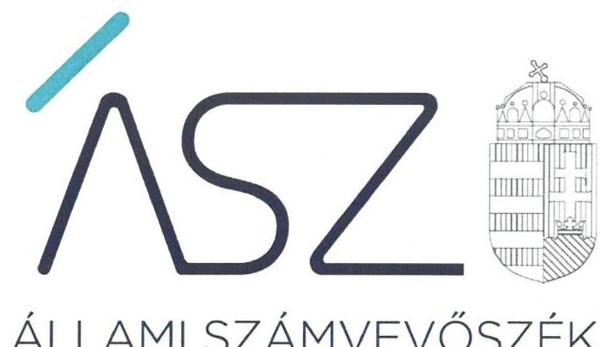
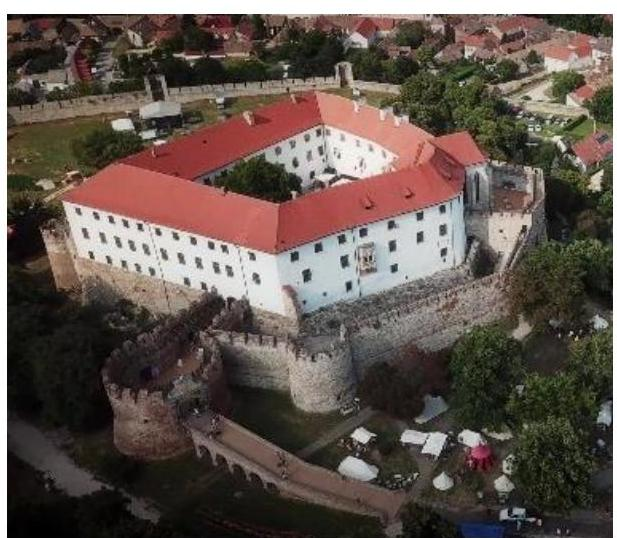
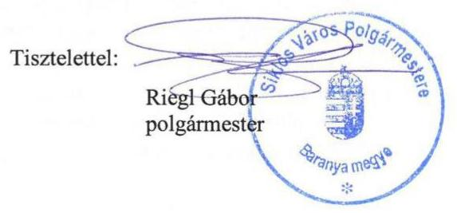
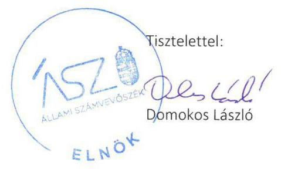
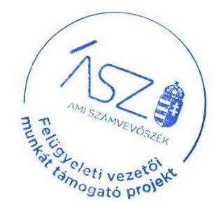

ÁLLAMI SZÁMVEVŐSZÉK

# JELENTÉS 

Nemzeti tulajdonú gazdasági társaságok ellenőrzése

Siklósi Várszínház Kulturális és Idegenforgalmi Központ Nonprofit Közhasznú Korlátolt
Felelősségú Társaság
2020.

20182
www.asz.hu

---

ÁLLAMI SZÁMVEVŐSZÉK

# JELENTÉS 

Nemzeti tulajdonú gazdasági társaságok ellenőrzése

Siklósi Várszínház Kulturális és Idegenforgalmi Központ Nonprofit Közhasznú Korlátolt Felelősségú Társaság
2020. 09. hó 18. nap

20182
www.asz.hu

---

# AZ ELLENŐRZÉST FELÜGYELTE: 

MAKKAI MÁRIA felügyeleti vezető

## AZ ELLENŐRZÉST VEZETTE ÉS A VÉGREHAJTÁSÁÉRT FELELŐS:

VALASTYÁNNÉ DR. VÍZHÁNYÓ JÚLIA ellenőrzésvezető
ÁRPÁSI TIBOR ellenőrzésvezető

## A PROGRAM ÖSSZEÁLLÍTÁSÁÉRT FELELŐS:

TÓTPÁL SZABOLCS osztályvezető

FEKETE-NAGY ANDRÁS GÁBOR projektvezető

Jelentéseink az Országgyúlés számítógépes hálózatán és az interneten a www.asz.hu címen is olvashatóak.

IKTATÓSZÁM: EL-2862-001/2020
TÉMASZÁM: 2513
ELLENŐRZÉS-AZONOSÍTÓ SZÁM: V082246, V085712

---

# TARTALOMJEGYZÉK 

■ ÖSSZEGZÉS ..... 5
■ AZ ELLENŐRZÉS CÉLJA ..... 6
■ AZ ELLENŐRZÉS TERÜLETE ..... 7
■ AZ ELLENŐRZÉS HÁTTERE, INDOKOLTSÁGA ..... 8
■ A JELENTÉS LÉNYEGES KÉRDÉSKÖREI ..... 9
■ AZ ELLENŐRZÉS HATÓKÖRE ÉS MÓDSZEREI ..... 10
■ MEGÁLLAPÍTÁSOK ..... 13
JAVASLATOK ..... 15
MELLÉKLETEK ..... 17
I. sz. melléklet: Fogalomtár ..... 17
FÜGGELÉKEK ..... 19
I. sz. függelék: Vezetői teljesítmény értékelése ..... 19
II. sz. függelék: Észrevételek ..... 20
■ RÖVIDÍTÉSEK JEGYZÉKE ..... 27

---

.

---

# ÖSSZEGZÉS 

Siklós Város Önkormányzata a Siklósi Várszínház Kulturális és Idegenforgalmi Központ Nonprofit Közhasznú Korlátolt Felelősségű Társaság feletti tulajdonosi jogait nem szabályszerűen gyakorolta 2015-2018-ban. A Társaság a vagyonnal való gazdálkodás során a nemzeti vagyon megőrzését, elszámoltathatóságát nem biztositotta az ellenőrzött időszakban.

## Az ellenőrzés társadalmi indokoltsága

Az Állami Számvevőszék kiemelt célja, hogy a helyi önkormányzatok gazdálkodásában rejlő pénzügyi kockázatok feltárásával, az államháztartáson kívül működő feladatellátó rendszerek ellenőrzéseivel hozzájáruljon ahhoz, hogy a közpénzeket, illetve az ingyenesen juttatott közvagyont az államháztartáson kívül működő szervezetek is átlátható, rendezett módon használják fel.

A helyi önkormányzatok tulajdona nemzeti vagyon, melynek megőrzése, megóvása érdekében kiemelten fontos a nemzeti tulajdonú gazdasági társaságok ellenőrzése. Ellenőrzésüket további társadalmi elvárás is indokolja, részben a gazdálkodásuk körébe tartozó vagyon nagysága, részben az általuk ellátott közszolgáltatások, sajátos feladatellátások, mivel tevékenységükön keresztül a lakosság széles köre kerül kapcsolatba a társaságokkal. A vezetői teljesítményértékelést érintő ellenőrzések lefolytatása a téma jellege, a vezetőknek a társaság múködése szempontjából meghatározó szerepe és a társadalmi érdeklődés miatt indokolt.

Az Állami Számvevőszék céljaival és a társadalmi igénnyel összhangban, a gazdasági társaságok kiemelt fontosságú szerepe miatt került sor a Siklósi Várszínház Kulturális és Idegenforgalmi Központ Nonprofit Közhasznú Korlátolt Felelősségű Társaság vagyongazdálkodásának és vezető tisztségviselője teljesítményének, illetve Siklós Város Önkormányzata tulajdonosi joggyakorlásának ellenőrzésére.

## Főbb megállapítások, következtetések, javaslatok

Siklós Város Önkormányzata tulajdonosi joggyakorlása nem volt szabályszerű, mert a Siklósi Várszínház Kulturális és Idegenforgalmi Központ Nonprofit Közhasznú Korlátolt Felelősségű Társaság felügyelőbizottsága nem rendelkezett ügyrenddel, a 2018. évi egyszerűsített éves beszámolót Siklós Város Önkormányzata a felügyelőbizottság jelentése nélkül fogadta el.

A Siklósi Várszínház Kulturális és Idegenforgalmi Központ Nonprofit Közhasznú Korlátolt Felelősségű Társaság vagyongazdálkodása nem volt szabályszerű, mert az egyszerűsített éves beszámolók mérlegtételeit nem támasztotta alá leltárral, ezáltal beszámolói nem voltak megalapozottak.

Az Állami Számvevőszék a jelentésben foglalt megállapítások alapján Siklós Város Önkormányzata polgármesterének kettő, a Siklósi Várszínház Kulturális és Idegenforgalmi Központ Nonprofit Közhasznú Korlátolt Felelősségű Társaság ügyvezetőjének egy javaslatot fogalmazott meg.

---

# AZ ELLENŐRZÉS CÉLJA 

AZ ELLENŐRZÉS CÉLJA annak megállapítása volt, hogy a tulajdonosi joggyakorló a gazdasági társasága feletti tulajdonosi joggyakorlás kereteit kialakította-e, tulajdonosi jogait megfelelően gyakorolta-e és kötelezettségeit teljesítette-e, továbbá annak megállapítása, hogy a gazdasági társaság biztosította-e a vagyon védelmét a nyilvántartások szabályszerű vezetése és a mérleg tételeinek leltárral történő alátámasztása útján, valamint szabályszerűen gondoskodott-e a társaság használatában lévő nemzeti vagyon értékének megőrzéséről, gyarapításáról, hasznosításáról. Az ellenőrzés célja volt még a gazdasági társaság vezetője tevékenységében rejlő kockázatok azonosítása az egyes vezetői feladatok ellátásával összhangban.

---

# AZ ELLENŐRZÉS TERÜLETE 

## Siklós Város Önkormányzata és a Siklósi Várszínház Kulturális és Idegenforgalmi Központ Nonprofit Közhasznú Korlátolt Felelősségű Társaság

A Siklós Város Önkormányzata kizárólagos tulajdonában álló Siklósi Várszínház Kulturális és Idegenforgalmi Központ Nonprofit Közhasznú Korlátolt Felelősségű Társaság 2008. november 13-án jött létre a Siklósi Várszínház Kulturális és Idegenforgalmi Központ Közhasznú Társaság átalakulásával.

A Társaság ${ }^{1}$ főtevékenysége múzeumi tevékenység, valamint előadó-művészet, könyvtári, levéltári tevékenység és történelmi hely, építmény egyéb látványosság müködtetése önkormányzati közfeladatnak minősült. A Társaság 2006-tól üzemeltette a Siklósi Várat, majd 2018-tól az Örsi Ferenc Művelődési Központot és a Malkocs Bej Dzsámit.

A Társaságnak az ellenőrzött időszakban nem volt vagyonkezelésbe vett eszköze, feladatait saját eszközeivel és az Önkormányzattal² kötött Üzemeltetési szerződések³ alapján üzemeltetésre átvett vagyonnal látta el. A Társaság Közművelődési megállapodás ${ }^{4}$ alapján ellátta az Önkormányzat kulturális közszolgáltatási feladatait.

Az ellenőrzött időszakban a Társaság jegyzett tőkéje 3 millió Ft volt. A Társaság más gazdasági társaságban nem rendelkezett részesedéssel és nem tartozott a kormányzati szektorba sorolt egyéb szervezetek közé.

Az ellenőrzött időszakban az ügyvezető5 személye 2017. március 1-től változott. A Társaságnál három tagú felügyelőbizottság ${ }^{6}$ működött. A Társaság a Számv. tv. ${ }^{7}$ szerint könyvvizsgálatra nem volt kötelezett, azt nem alkalmazott.

Siklós város polgármestere ${ }^{8}$ és a jegyző ${ }^{9}$ személye az ellenőrzött időszakban nem változott.

---

# AZ ELLENŐRZÉS HÁTTERE, INDOKOLTSÁGA 

Az Alaptörvény 38. cikke alapján az állam és a helyi önkormányzatok tulajdona nemzeti vagyon. A nemzeti vagyon megőrzése, megóvása érdekében kiemelten fontos ezen nemzeti tulajdonú gazdasági társaságok ellenőrzése. Gazdálkodásuk jellemzően a közérdeklődés és a média figyelmének középpontjában áll, amihez hozzájárul a gazdálkodásuk körébe tartozó - a nemzeti vagyon részét képező - vagyon nagysága, illetve az általuk ellátott közszolgáltatások minősége és hatékonysága.

Az ÁSZ ${ }^{10}$ ellenőrzései feltárhatják, hogy a tulajdonosi felügyelet hozzá-járult-e a szabályszerű gazdálkodáshoz és feladatellátáshoz. Az ellenőrzés eredményeként meghatározhatóvá válnak a gazdasági társaság vagyongazdálkodást érintő kockázatai, ezzel lehetővé téve a kockázatok csökkentését. A megállapítások alapján megfogalmazott számvevőszéki javaslatok hasznosítása elősegítheti a meglévő hibák megszüntetését. A jó gyakorlatok bemutatásával az ÁSZ hozzájárulhat a követendő megoldások megismertetéséhez, terjesztéséhez.

A Kormány „jól irányított állam" megteremtésével kapcsolatos céljaival összhangban van, hogy olyan vezetői teljesítményértékelési rendszer kerüljön kialakításra és múködtetésre, amely hozzájárul a szervezeti teljesítmény növeléséhez, a fejlődési lehetőségek kihasználásához. Az ÁSZ a rendszer kiépítésében vállalt aktív ellenőrzési, értékelési tevékenységével kíván hozzájárulni a „jól irányított állam" megteremtéséhez.

---

# A JELENTÉS LÉNYEGES KÉRDÉSKÖREI 

1. A Társaság feletti tulajdonosi joggyakorlás megfelelt-e az elöírásoknak?
2. A Társaság vagyongazdálkodása szabályszerű volt-e?
3. A Társaság vezetőjének tevékenysége megfelelő volt-e?

---

# AZ ELLENŐRZÉS HATÓKÖRE ÉS MÓDSZEREI 

## Az ellenőrzés típusa

Megfelelőségi ellenőrzés.

## Az ellenőrzött időszak

A tulajdonosi joggyakorlás tekintetében az ellenőrzött időszak a 20172018. évek az éves beszámolók elfogadása kivételével, amelynél az ellenőrzött időszak a 2015-2018. évek.

A társaság vagyongazdálkodási tevékenységét illetően az ellenőrzött időszak a 2015 - 2018. évek.

A társaság vezetője teljesítménye tekintetében az ellenőrzött időszak a 2018. év.

## Az ellenőrzés tárgya

A Siklósi Várszínház Kulturális és Idegenforgalmi Központ Nonprofit Közhasznú Korlátolt Felelősségű Társaság feletti tulajdonosi joggyakorlás kialakítása és múködtetése.

A Siklósi Várszínház Kulturális és Idegenforgalmi Központ Nonprofit Közhasznú Korlátolt Felelősségű Társaság vagyongazdálkodási tevékenysége, a társaság használatában lévő nemzeti vagyon, illetve a saját vagyona tekintetében a vagyonnyilvántartások vezetése, leltára, a nemzeti vagyon értékének megőrzése, gyarapítása, hasznosítása.

A Siklósi Várszínház Kulturális és Idegenforgalmi Központ Nonprofit Közhasznú Korlátolt Felelősségű Társaság vezetői teljesítményének értékelése. A gazdasági társaság átlátható, szabályszerű, gazdaságos, hatékony, eredményes és felelős gazdálkodása feltételrendszerének kialakítása, a belső kontrollrendszer és humánpolitikai rendszer múködtetése. Az integritásszemléletet érvényesítése, illetve a felelős vagyongazdálkodás biztosítása a nemzeti vagyon megőrzése és védelme érdekében.

## Az ellenőrzött szervezet

- Siklós Város Önkormányzata
- Siklósi Várszínház Kulturális és Idegenforgalmi Központ Nonprofit Közhasznú Korlátolt Felelősségű Társaság

---

# Az ellenőrzés jogalapja 

Az ellenőrzés jogszabályi alapját az ÁSZ tv. ${ }^{11} 1 . \S$ (3) bekezdése és 5. § (3) - (5) bekezdései képezték.

## Az ellenőrzés módszerei

Az ÁSZ az ellenőrzést az ellenőrzési program ellenőrzési kérdései, az ellenőrzött időszakban hatályos jogszabályok, az ellenőrzés szakmai szabályok és módszertanok alapján, a nemzetközi standardok figyelembe vételével végezte.

Az ellenőrzés ideje alatt az ellenőrzött szervezettel történő kapcsolattartást az ÁSZ Szervezeti és Múködési Szabályzatának vonatkozó előírásai alapján biztosította az ÁSZ.

Az ÁSZ a 2017-2018. évek vonatkozásában ellenőrizte a tulajdonosi joggyakorlás kereteinek kialakítását, a tulajdonosi joggyakorló tevékenységét a felügyelő bizottság és a független könyvvizsgáló múködéséhez kapcsolódóan, valamint azt, hogy a tulajdonosi joggyakorló - amennyiben a gazdasági társaság feladatellátásához kapcsolódóan határozott meg követelményeket, elvárásokat - a nemzeti vagyon értékének megőrzése érdekében monitorozta-e azok teljesülését. Az ÁSZ a 2015-2018. évekre terjedő teljes ellenőrzött időszakra ellenőrizte a tulajdonosi joggyakorló részvételét az éves beszámoló elfogadására vonatkozó döntéshozatalban.

A gazdasági társaság vagyonhoz kapcsolódó nyilvántartásai vezetésének megfelelősége, valamint a nemzeti vagyon értéke megőrzésének, gyarapításának, hasznosításának szabályszerűsége 2015. és 2017-2018. évek tekintetében került ellenőrzésre. A 2015-2018. éveket érintően történt meg a lényeges dokumentumok értékelése, kiemelten a mérleg tételeinek leltárral való alátámasztottsága.

A vagyonnyilvántartások és a leltár szabályszerűsége esetében az ellenőrzés azokra a legnagyobb értékű tételekre - a lényeges sokaságra - terjedt ki, melyek összértéke elérte a teljes sokaság összértékének 50\%-át. A 2015. és 2017. évek esetében a lényeges sokaságot tételesen ellenőrizte az ÁSZ.

2018-ra vonatkozóan a vezetői teljesítmény ellenőrzési szempontjait a szabályszerűségi szempontok szerinti ellenőrzésben a jogszabályi előírások, belső utasítások, belső szabályozók, a tulajdonosi joggyakorlók elvárásai, előírásai, a helyénvalósági szempontok szerinti ellenőrzésben az ÁSZ által általánosan elfogadott, jó gyakorlat szerinti ajánlásai, értékelési kritériumai mentén kerültek meghatározásra. Az ellenőrzési kérdések szerint az összesített értékelés alapján az elért pontok az elérhető pontok minimum 70\%-át elérve, a társaság vezetője tevékenységét megfelelőnek, 70\% alatt nem megfelelőnek tekintette az ÁSZ.

Az ellenőrzési kérdések megválaszolásához szükséges bizonyítékok megszerzése a következő ellenőrzési eljárások alkalmazásával történt: megfigyelés, információkérés, összehasonlítás, lényeges sokaságból mintavétel, valamint elemző eljárás. Az ellenőrzési bizonyítékként felhasználható adatforrások közé tartoztak az ellenőrzési programban felsorolt adatforrások, továbbá minden - az ellenőrzés folyamán - feltárt, az ellenőrzés

---

szempontjából információkat tartalmazó dokumentum. Az ellenőrzést a kérdésekre adott válaszok kiértékelésével, valamint a megjelölt adatforrások, a csatolt tanúsítványok felhasználásával, továbbá az adott időszakban hatályos jogszabályok figyelembe vételével folytatta le az ÁSZ.

Amennyiben a gazdasági társaság múködését és gazdálkodását alapvetően meghatározó dokumentum hiánya miatt, valamely lényeges kérdéskörre vonatkozóan az ÁSZ megállapítást tett, további ellenőrzési tevékenységek az adott kérdéskörrel és az azzal szoros logikai kapcsolatban lévő kérdéskörökkel - ráépülő jelleggel - nem kerültek végrehajtásra.

---

# 1. A Társaság feletti tulajdonosi joggyakorlás megfelelt-e az előírásoknak? 

Összegző megállapítás

A Társaság feletti tulajdonosi joggyakorlás nem volt szabályszerű.

A tulajdonosi joggyakorlás kereteit az Alapító ${ }^{12}$ az Mötv. ${ }^{13}$, az Nvtv ${ }^{14}$., illetve a Ptk. ${ }^{15}$ előírásainak megfelelően a Vagyonrendeletben ${ }^{16}$, a Képviselő-testület SZMSZ-ében ${ }^{17}$, illetve a Társaság Alapító okiratában ${ }^{18}$ határozta meg.

Az Alapító megalkotta a Taktv. ${ }^{19}$ előírásaival összhangban lévő, a vezető tisztségviselők, a felügyelőbizottság tagjai és az Mt. ${ }^{20}$ 208. § hatálya alá tartozó munkavállalók javadalmazásáról, valamint a jogviszony megszűnése esetére biztosított juttatások módjának, mértékének elveiről, annak rendszeréről szóló javadalmazási szabályzatot ${ }^{21}$.

A felügyelőbizottság a Ptk. 3:122. § (3) bekezdésében és az Alapító okirat 12.8. pontjában foglaltak ellenére nem rendelkezett ügyrenddel.

A 2018. évi egyszerűsített éves beszámoló jóváhagyása nem volt szabályszerű, mert azt az Alapító a Ptk. 3:120. § (2) bekezdésében foglaltak ellenére a felügyelőbizottság írásbeli jelentése nélkül fogadta el.

## 2. A Társaság vagyongazdálkodása szabályszerű volt-e?

## Összegző megállapítás

A Társaság vagyongazdálkodása a 2015-2018. években nem volt szabályszerű.

A Társaság az ellenőrzött években rendelkezett a Számv. tv. előírásának megfelelő leltározási szabályzattal², amely tartalmazta a leltározásra és a leltár összeállítására vonatkozó szabályokat, előírásokat. A Társaság a tárgyi eszközökről folyamatos mennyiségi nyilvántartást vezetett, a leltározási szabályzat a mennyiségi felvétel gyakoriságát a Számv. tv. 69. § (3) bekezdés előírásának megfelelően három évben határozta meg.

A Társaság a 2015-2018. években mennyiségi felvétellel nem leltározta a tárgyi eszközöket, nem tett eleget a Számv. tv. 69. § (3) bekezdésében és a leltározási szabályzatában előírt legalább háromévenkénti leltározási kötelezettségnek.

A Társaság a 2015-2016. években mennyiségi felvétellel nem leltározta a házipénztár pénzkészletét, nem tett eleget a Számv. tv. 69. § (4) bekezdésében és a leltározási szabályzatában előírt évenkénti leltározási kötelezettségnek.

A Társaság 2015-2018-ban nem végezte el a bankbetétek, saját tőke, továbbá 2018-ban a követelések, kötelezettségek, időbeli elhatárolások egyeztetéssel történő leltározását, megsértve a Számv. tv. 69. § (3)-(4) bekezdésében foglaltakat.

---

A Társaság a 2015-2018. évi egyszerűsített éves beszámolók mérlegtételeit a Számv. tv. 69. § (1) bekezdésében foglaltak ellenére - a mérleg fordulónapján meglévő eszközöket és forrásokat mennyiségben és értékben tételesen, ellenőrizhető módon tartalmazó - leltárral nem támasztotta alá.

# 3. A Társaság vezetőjének tevékenysége megfelelő volt-e? 

Összegző megállapítás A Társaság ügyvezetőjének 2018. évi tevékenysége nem volt megfelelő.

A Társaság vezető tisztségviselője 2018. évi tevékenységének részletes értékelését az I. sz. Függelék tartalmazza.

---

# JAVASLATOK 

Az ÁSZ tv. 33. § (1) bekezdésében foglaltak értelmében az ellenőrzött szervezet vezetője köteles a jelentésben foglalt megállapításokhoz kapcsolódó intézkedési tervet összeállítani és azt a jelentés kézhezvételétől számított 30 napon belül az ÁSZ részére megküldeni. Amennyiben az ellenőrzött szervezet vezetője nem küldi meg határidőben az intézkedési tervet, vagy továbbra sem elfogadható intézkedési tervet küld, az Állami Számvevőszék elnöke az ÁSZ tv. 33. § (3) bekezdése a) és b) pontjaiban foglaltakat érvényesítheti.

## Siklós Város Önkormányzata polgármesterének

1. Kezdeményezze a Társaság felügyelő bizottságánál az ügyrend elkészitését és a Társaság legfőbb szerve általi jóváhagyását.
(1. sz. megállapítás 3. bekezdése alapján)
2. Kezdeményezze, hogy a Társaság legfőbb szerve a jogszabályban előirtak szerint döntsön az éves számviteli beszámoló jóváhagyásáról.
(1. sz. megállapítás 4. bekezdése alapján)

## Siklósi Várszínház Kulturális és Idegenforgalmi Központ Nonprofit Közhasznú Korlátolt Felelősségű Társaság ügyvezetőjének

1. Intézkedjen a Számv. tv. előírásának megfelelően a leltározás végrehajtásáról és az éves beszámoló mérlegtételeit alátámasztó leltár jogszabályi előírásnak megfelelő elkészítéséről.
(2. sz. megállapítás 2. és 4.-5. bekezdése alapján)

---

.

---

# MELLÉKLETEK 

- I. SZ. MELLÉKLET: FOGALOMTÁR
gazdasági társaság
kormányzati szektorba sorolt egyéb szervezet
közszolgáltatás
közfeladat
nemzeti vagyon
nemzeti vagyon hasznosítása
tulajdonosi jogok gyakorlója
vagyonkezelői jog

A gazdasági társaságok üzletszerű közös gazdasági tevékenység folytatására, a tagok vagyoni hozzájárulásával létrehozott, jogi személyiséggel rendelkező vállalkozások, amelyekben a tagok a nyereségből közösen részesednek, és a veszteséget közösen viselik. (Forrás: Ptk. 3:88. § (1) bekezdése)
Az a szervezet, amely az Áht. ${ }^{23}$ alapján nem része az államháztartásnak, azonban az Európai Közösséget létrehozó szerződéshez csatolt, a túlzott hiány esetén követendő eljárásról szóló jegyzőkönyv alkalmazásáról szóló 2009. május 25-i 479/2009/EK rendelet ${ }^{24}$ szerint a kormányzati szektorba tartozik.
Az Ebktv. ${ }^{25}$ 3. § d) pontja a következőképpen határozza meg a közszolgáltatást: „szerződéskötési kötelezettség alapján a lakosság alapvető szükségleteinek ellátására irányuló szolgáltatás, így különösen a villamos energia-, gáz-, hő-, víz-, szenny-víz- és hulladékkezelési, köztisztasági, postai és távközlési szolgáltatás, továbbá a menetrend alapján közlekedő járművekkel végzett közforgalmú személyszállítás".
Az Áht. 3/A. § (1) bekezdése alapján közfeladat a jogszabályban meghatározott állami vagy önkormányzati feladat.
Nvtv. ${ }^{26}$ 1. § (2) bekezdése szerint nemzeti vagyonba tartozik többek között:
„az állam vagy a helyi önkormányzat kizárólagos tulajdonában álló dolgok,
az a) pont hatálya alá nem tartozó, állam vagy a helyi önkormányzat tulajdonában lévő dolog,
az állam vagy a helyi önkormányzat tulajdonában lévő pénzügyi eszközök, továbbá az államot vagy a helyi önkormányzatot megillető társasági részesedések,
az államot vagy a helyi önkormányzatot megillető bármely vagyoni értékkel rendelkező jogosultság, amelyet jogszabály vagyoni értékű jogként nevesít."
A tulajdonosi joggyakorló vagy a nemzeti vagyon használója által a nemzeti vagyon birtoklásának, használatának, hasznok szedése jogának bármely - a tulajdonjog átruházását nem eredményező - jogcímen történő átengedése, ide nem értve a vagyonkezelésbe adást, valamint a haszonélvezeti jog alapítását.
Forrás: Nvtv. 3. § (1) bekezdés 4. pont
Aki a nemzeti vagyon felett az államot vagy a helyi önkormányzatot megillető tulajdonosi jogok és kötelezettségek összességének gyakorlására jogosult. (Forrás: Nvtv. 3. § (1) bekezdés 17. pontja)
A vagyonkezelő köteles a vagyontárgy állagának megóvásáról, jó karbantartásáról, múködtetéséről gondoskodni, jogszabályban és szerződésben előírt más kötelezettségét teljesíteni, valamint a vagyontárgyat jogszabályban vagy szerződésben meghatározott célnak megfelelően használni. A vagyonkezelő - a központi költségvetési szervek és a kizárólag közfeladatot ellátó nem központi költségvetési szerv vagyonkezelők kivételével - köteles díjat fizetni, jogszabályban és szerződésben előírt más kötelezettségét teljesíteni, valamint a vagyontárgyat jogszabályban vagy szerződésben meghatározott célnak megfelelően használni. Amennyiben a vagyonkezelő ezen kötelezettségeinek nem tesz eleget, a tulajdonosi joggyakorló jogosult a szerződést azonnali hatállyal felmondani. (Forrás: Vtv. ${ }^{27}$ 27. § (2), (2a) bekezdések)

---

.

---

# FÜGGELÉKEK 

I. SZ. FÜGGELÉK: VEZETŐI TELJESÍTMÉNY ÉRTÉKELÉSE

A Siklósi Várszínház Kulturális és Idegenforgalmi Központ Nonprofit Közhasznú Korlátolt Felelősségű Társaság vezetőjének teljesítményét 2018-ban nem megfelelőnek értékelte az ÁSZ, mert

- $\quad$ nem dolgozta ki a Társaság középtávú stratégiáját;
- $\quad$ nem müködtetett a szervezet teljesítményének értékelése céljából mutatószámokon, mutatószámrendszeren alapuló szervezeti teljesítményértékelési rendszert;
- $\quad$ nem alakította ki a társaság szervezeti, müködési rendjét;
- $\quad$ nem müködtetett a vezetést támogató információs/kontrolling rendszert;
- $\quad$ nem müködtetett a gazdálkodás, tevékenység folyamataira vonatkozó belső ellenőrzési rendszert;
- $\quad$ nem müködtetett egyéni teljesítményértékelési, teljesítmény-ösztönző rendszert;
- $\quad$ nem mérte fel a szervezet müködésével kapcsolatos integritási és korrupciós kockázatokat, azok csökkentése érdekében nem tett lépéseket;
- $\quad$ nem dolgozta ki a társaság menedzsmentjére, munkavállalóira és a vagyongazdálkodására vonatkozó összeférhetetlenségi előirásokat;
- $\quad$ nem állt rendelkezésre a vezető jogszabályi előírások szerinti összeférhetetlenségi nyilatkozata és vagyonnyilatkozata;
- $\quad$ nem elemezte a bevételek növelését, a kiadások csökkentését célzó lehetőségeket.

---

A jelentéstervezetet a Számvevőszék 15 napos észrevételezésre megküldte az ellenőrzött szervezetek vezetőinek az ÁSZ tv. 29. §* (1) bekezdése előírásának megfelelően.

Az ÁSZ a jelentéstervezetet észrevételezésre megküldte Siklós Város Önkormányzata polgármesterének és a Siklósi Várszínház Kulturális és Idegenforgalmi Központ Nonprofit Közhasznú Korlátolt Felelősségű Társaság ügyvezetőjének.
A Siklósi Várszínház Kulturális és Idegenforgalmi Központ Nonprofit Közhasznú Korlátolt Felelősségű Társaság ügyvezetője az ÁSZ tv. 29. § (2) bekezdésében foglalt észrevételezési jogával nem élt, Siklós Város Önkormányzata polgármesterének észrevételét és az arra adott választ a jelentés alább tartalmazza.

[^0]
[^0]:    * 29. § (1) Az Állami Számvevőszék az ellenőrzési megállapításait megküldi az ellenőrzött szervezet vezetőjének vagy az általa megbízott személynek, és annak, akinek személyes felelősségét állapította meg.
    (2) Az ellenőrzött szervezet vezetője és a felelősként megjelölt személy az ellenőrzés megállapításaira tizenöt napon belül írásban észrevételt tehet.
    (3) Az Állami Számvevőszék az észrevételre a beérkezésétől számított harminc napon belül írásban válaszol. A figyelembe nem vett észrevételeket köteles a jelentésben feltüntetni, és megindokolni, hogy azokat miért nem fogadta el.

---

# SiKLÓs VÁROS POLGÁRMESTERÉTŐL 

$\boxtimes 7801$ SiKLÓs, Kossuth TÉr 1. SZÁM
$\boxtimes 72 / 579-505$

Ügyiratszám: SIK/7731-2/2020.
Ügyintéző: Dr. Héger Zsolt
Tárgy: A „Nemzeti tulajdonú gazdasági társaságok ellenőrzése - Siklósi Várszínház Kulturális és Idegenforgalmi Központ Nonprofit Közhasznú Kft." címmel készített számvevőszéki jelentéstervezetre észrevétel

Ügyiratszám Önöknél: EL-2112-056/2020
Ügyintéző Önöknél: -

## Állami Számvevőszék   Domonkos László Elnök részére

1364 Budapest 4.
Pf. 54

ÁLLAMI SZÁMVEVÖSZÉK
ÜGYVITELI IRODA
JE - 78080 pozol
20200806

Tisztelt Elnök Úr!
Fenti ügyiratszámú 2020. július 13-án keltezett kísérőlevéllel megküldte részemre a „Nemzeti tulajdonú gazdasági társaságok ellenőrzése - Siklósi Várszínház Kulturális és Idegenforgalmi Központ Nonprofit Közhasznú Korlátolt Felelősségủ Társaság" címmel készített számvevőszéki jelentéstervezetet.
A jelentéstervezet 5. oldalán (a Főbb megállapítások, következtetések, javaslatok alcím alatt) a következő megállapítás olvasható: „Siklós Város Önkormányzata tulajdonosi joggyakorlása nem volt szabályszerű, mert ... a 2018. évi egyszerűsitett éves beszámolót Siklós Város Önkormányzata a felügyelőbizottság jelentése nélkül fogadta el." A jelentéstervezet a 13. oldalon ezt az állítást a következő formában ismétli meg: „A 2018. évi egyszerüsített éves beszámoló jóváhagyása nem volt szabályszerű, mert az Alapitó a Ptk. 3:120. § (2) bekezdésében foglaltak ellenére a felügyelőbizottság írásbeli jelentése nélkül fogadta el."

A jelentéstervezetre a következő észrevételt teszem:
1.)A Siklósi Várszínház Nonprofit Közhasznú Kft. 2018. évi egyszerűsített éves beszámolója elfogadásakor Siklós Város Önkormányzata képviselő-testületi ülésén nem vettem részt (mert a 2014-2019-es önkormányzati ciklusban nem voltam a képviselő-testület tagja), azonban a 2018. évi mérlegbeszámoló elfogadása előtt - az akkor hivatalban volt jegyző tájékoztatása szerint - a Kft. felügyelőbizottsága tárgyalta a 2018. évi beszámolót és a képviselő-testület a felügyelőbizottság jegyzőkönyvének birtokában fogadta el (125/2019. (V. 30.) Kt. határozatával) a Várszínház Kft. 2018. évi beszámolóját. - Ennek alátámasztására mellékelten megküldöm Siklós Város Önkormányzata 2019. május 30-i testületi ülésnek jegyzőkönyvéből az első 26 oldalt hitelesített másolatban. A jegyzőkönyv 14. oldalán olvasható, hogy mindenki megkapja, megkapta a felügyelőbizottság ülésének jegyzőkönyvét. A felügyelőbizottság

---

elnöke, aki egyben a képviselő-testület tagja is, a jegyzőkönyv 15 . oldalán maga is megerősíti, hogy tárgyalták a testületi ülés előtt a 2018. évi beszámolót, valamint azt mondja: „A felügyelőbizottság mind a két beszámolót és az üzleti tervet is maximálisan támogatta."
2.)Az ÁSZ elektronikus adatbekérési rendszerében Ellenörzések - Ellenörzés kezelés V0857_Siklós_Önk kódú ellenörzés, 233530 azonositó, Nyilatkozat Várszínház Kft. ellenörzés rendje megnevezéssel feltöltött dokumentum is tartalmazta: „A Siklósi Várszínház Nonprofit Kft.-t ellenőrzése egyrészt a felügyelőbizottságon keresztül történik ... az FB tagjai egyben képviselő-testületi tagok is ebben az időszakban." - Így a képviselő-testület a felügyelőbizottsági tag képviselőktől folyamatosan tájékoztatást kapott a Kft. működéséről, ezt igazolja nem csak az 1.) pontban írt és most csatolt jegyzőkönyv a 2018. évi beszámoló elfogadásáról, de ezt igazolja például az egy évvel korábbi, 2017. évi beszámoló elfogadása is. A 2017. évi beszámoló elfogadása is feltöltésre került az ÁSZ elektronikus adatbekérési rendszerében: Ellenörzések - Ellenörzés kezelés - SIKLÓS_ON2_V082246 kódú ellenörzés, 146156 azonositó, 2018. V. 29. testületi ülés jegyzökönyve I. rész. A felügyelőbizottság elnöke, aki egyben a képviselő-testület tagja is, ebben a jegyzőkönyvben is (a 14-15./232 oldalakon) megerősíti, hogy tárgyalták a testületi ülés előtt a 2017. évi beszámolót, valamint a teljes jegyzőkönyv 14/232. oldalán (ami jegyzőkönyv 6 . sorszámozott oldalával azonos) a PGTB elnöke azt mondja a napirendnél: „A felügyelőbizottság is elfogadásra javasolja." A felügyelőbizottság 2017. évi mérlegbeszámolóról szóló 2018. 05. 23-i ülésének jegyzőkönyvét az ÁSZ elektronikus adatbekérési rendszerében Ellenörzések - Ellenörzés kezelés SIKLÓS_ON2_V082246 kódú ellenőrzés, 146308 azonositó, 2018. Siklósi Várszínház Kft. FB. jegyzőkönyvei megnevezéssel feltöltött dokumentum a $7 / 38$ oldaltól tartalmazza; ezt a jegyzőkönyvbe foglalt felügyelőbizottsági döntést az FB tagjai - akik egyben képviselők is, és mint fent írt 2018. V. 29. testületi jegyzőkönyvből is kiderül - a képviselő-testületi (bizottsági) ülésen is képviselték.
3.) Az ÁSZ jelen vizsgálata idején hivatalban volt jegyző tájékoztatása szerint a korábbi adatbekérések (amelyeket itt fel is sorolok:
1.) az ÁSZ EL-0940-002/2018 Ikt.számú 2018. július 17-én írt levele,
2.) az ÁSZ EL-0940-029/2019 Ikt.számú 2019. január 24-én írt levele,
3.) az ÁSZ EL-2012-001/2019 Ikt.számú 2020. október 16-án írt levele,
4.) az ÁSZ EL-2012-003/2019 Ikt.számú 2020. november 6-án írt levele)
nem tartalmaztak konkrét kérést a Várszínház Kft. 2018. évi mérlegbeszámolójának elfogadásához kapcsolódó adatszolgáltatásra, ezért kerül most megküldésre az 1.) pontban írt 2019. május 30 -i testületi ülés jegyzőkönyve.

Kérem, a jelentéstervezet megfogalmazásánál szíveskedjen észrevételeimet figyelembe venni, mellyel igazoltam, hogy a 2018. évi egyszerűsitett éves beszámolót Siklós Város Önkormányzatának Képviselő-testülete a felügyelőbizottság jelentésének ismeretében fogadta el.

Siklós, 2020. július 30.

---

# 150 éve   a kö́pénzek öre 

ÁLLAMI SZÁMVEVŐSZÉK

Ikt. szám: EL-2112-059/2020.

Riegl Gábor úr
polgármester

Siklós Város Önkormányzata
Siklós

Tisztelt Polgármester Úr!

A „Nemzeti tulajdonú gazdasági társaságok ellenőrzése - Siklósi Várszínház Kulturális és Idegenforgalmi Központ Nonprofit Közhasznú Korlátolt Felelősségű Társaság" címmel készített számvevőszéki jelentéstervezetre tett SIK/7731-2/2020. ügyiratszámú észrevételét köszönettel megkaptam.

Az Állami Számvevőszék észrevételre vonatkozó álláspontjáról a felügyeleti vezető által készített részletes tájékoztatást mellékelten megküldöm.

Tájékoztatom Polgármester urat, hogy a számvevőszéki jelentésben - az Állami Számvevőszékről szóló 2011. évi LXVI. törvény 29. § (3) bekezdése alapján - a figyelembe nem vett észrevételt szerepeltetjük, annak indoklásával, hogy azt az Állami Számvevőszék miért nem fogadta el.

Budapest, 2020. 08. hó 29. nap

Melléklet: Tájékoztatás az észrevétel kezeléséről

---

# Tájékoztatás   az észrevétel kezeléséről 

A „Nemzeti tulajdonú gazdasági társaságok ellenőrzése - Siklósi Várszínház Kulturális és Idegenforgalmi Központ Nonprofit Közhasznú Korlátolt Felelősségű Társaság" címú jelentéstervezetre 2020. augusztus 6-án érkezett észrevételt áttekintettük, annak kezelésével kapcsolatban a következő tájékoztatást adom.

Polgármester úr észrevételének 1.) pontjában tájékoztatott, hogy a Siklósi Várszínház Nonprofit Közhasznú Kft. (továbbiakban Társaság) felügyelő bizottsága tárgyalta a 2018. évi beszámolót és a képviselő-testület - az észrevétel mellékleteként megküldött jegyzőkönyv másolata szerint - a felügyelőbizottság jegyzőkönyvének birtokában fogadta el a Társaság 2018. évi beszámolóját.

Tájékoztatom Polgármester urat, hogy az Állami Számvevőszék (továbbiakban ÁSZ) ellenőrzési megállapításai minden esetben az Állami Számvevőszékről szóló 2011. évi LXVI. törvénynek megfelelően az ellenőrzés során bekért és az arra nyitva álló határidőn belül rendelkezésre bocsátott dokumentumokon alapulnak, így az ÁSZ nem értékelte az észrevétel mellékleteként megküldött dokumentumot. Azonban Siklós Város Önkormányzata az adatszolgáltatásra nyitva álló határidőben nem bocsátott az ellenőrzés rendelkezésére olyan dokumentumot, mely igazolná, hogy a Társaság legfőbb szerve a felügyelőbizottság írásbeli jelentése birtokában döntött a Társaság 2018. évi beszámolójának elfogadásáról. Fentiekre tekintettel az észrevételt nem fogadjuk el, a jelentéstervezet módosítása nem indokolt.

Az észrevétel 2.) pontjában Polgármester úr rögzítette, hogy az FB tagjai egyben képviselő-testületi tagok is az ellenőrzött időszakban, így a képviselő-testület a felügyelőbizottsági tag képviselőktől folyamatosan tájékoztatást kapott a Kft. múködéséről. Felhívom Polgármester úr figyelmét, hogy a Polgári Törvénykönyvről szóló 2013. évi V. törvény 3:120. § (2) bekezdése szerint, "ha a társaságnál felügyelőbizottság müködik, a beszámolóról a társaság legfőbb szerve a felügyelőbizottság írásbeli jelentésének birtokában dönthet", mely előírásnak nem feleltethető meg a felügyelőbizottsági tag képviselőktől a Kft. müködéséről adott folyamatos tájékoztatás. Az észrevételt nem fogadjuk el, a jelentéstervezet módosítása nem indokolt.

Polgármester úr észrevételének 3.) pontja szerint az ÁSZ adatbekérései nem tartalmaztak konkrét kérést a Társaság 2018. évi mérlegbeszámolójának elfogadásához kapcsolódó adatszolgáltatásra. Tájékoztatom Polgármester urat, hogy az ÁSZ az EL-2112-001/2019. iktatószámú, 2019. október 16i keltű, Siklós Város Önkormányzata által 2019. október 21-én átvett adatbekérő levelének 3. számú melléklet 1.2 pontjában kérte a gazdasági társaság számviteli beszámolóját jóváhagyó döntés (2016-

---

2018. ellenőrzési időszakra vonatkozó) aláírt és hiteles dokumentumait. Fentiekre tekintettel az észrevételt nem fogadjuk el, a jelentéstervezet módosítása nem indokolt.

Budapest, 2020. 08 hó 29 nap

Makkai Mária s.k.
felügyeleti vezető

A kiadmány hiteles.

---

.

---

# RÖVIDÍTÉSEK JEGYZÉKE 

${ }^{1}$ Társaság
${ }^{2}$ Önkormányzat
${ }^{3}$ Üzemeltetési szerződés
${ }^{4}$ Közművelődési megállapodás
${ }^{5}$ ügyvezető
${ }^{6}$ felügyelőbizottság
${ }^{7}$ Számv. tv.
${ }^{8}$ polgármester
${ }^{9}$ jegyző
${ }^{10}$ ÁSZ
${ }^{11}$ ÁSZ tv.
${ }^{12}$ Alapító
${ }^{13}$ Mötv.
${ }^{14}$ Nvtv.
${ }^{15}$ Ptk.
${ }^{16}$ Vagyonrendelet
${ }^{17}$ SzMSz
${ }^{18}$ Alapító okirat
${ }^{19}$ Taktv.
${ }^{20} \mathrm{Mt}$.
${ }^{21}$ Javadalmazási szabályzat

Siklósi Várszínház Kulturális és Idegenforgalmi Központ Nonprofit Közhasznú Korlátolt Felelősségű Társaság
Siklós Város Önkormányzata
az Önkormányzat és a Társaság, illetve jogelődje között létrejött szerződés ingatlanok üzemeltetésére
szerződés: a „Siklósi Vár" megnevezésű ingatlanra (hatályos 2006. december 8-tól)
szerződés: az „Örsi Ferenc Művelődési Központ" és a „Malkocs Bej Dzsámi" megnevezésű ingatlanra (hatályos 2018. március 1-től)
az Önkormányzat és Társaság között 2018. február 28-án létrejött megállapodás az Önkormányzat közművelődés feladatainak ellátásáról (hatályos: 2018. március 1-től) a Társaság ügyvezetője
ügyvezető: tisztségét betöltötte 2017. február 28-ig
ügyvezető: tisztségét betöltötte 2017. március 1-től
a Társaság felügyelőbizottsága
2000. évi. C. törvény a számvitelről (hatályos: 2001. január 1-től)
Siklós Város Önkormányzatának polgármestere
Siklósi Közös Önkormányzati Hivatal jegyzője
Állami Számvevőszék
2011. évi LXVI. törvény az Állami Számvevőszékről (hatályos: 2011. július 1-től)

Siklós Város Önkormányzatának Képviselő-testülete mint a Társaság legfőbb szerve
2011. évi CLXXXIX. törvény Magyarország helyi önkormányzatairól (hatályos 2012. január 1-től)
2011. évi CXCVI. törvény a nemzeti vagyonról (hatályos 2011. december 31-től)
2013. évi V. törvény a Polgári Törvénykönyvről (hatályos 2014. március 15-től)
a többször módosított 3/1997. (II.21.) önkormányzati rendelet az Önkormányzat vagyonáról és a vagyontárgyak feletti tulajdonosi jogok gyakorlásáról (hatályos: 1997. február 21-től)
a többször módosított 21/1998. (XII.2.) önkormányzati rendelet Siklós Város Önkormányzat Szervezeti és Működési Szabályzatáról (hatályos 1998. december 2-től)
a Társaság Alapító okirata
Alapító okirat: (hatályos: 2014. október 22-től)
Alapító okirat: (hatályos: 2015. január 15-től)
Alapító okirat: (hatályos: 2015. április 29-től)
Alapító okirat: (hatályos: 2015. október 1-től)
Alapító okirat: (hatályos: 2016. november 11-től)
Alapító okirat: (hatályos: 2017. március 1-től)
Alapító okirat: (hatályos: 2018. március 1-től)
2009. évi CXXII. törvény a köztulajdonban álló gazdasági társaságok takarékosabb múködéséről (hatályos: 2009. december 4-től)
2012. évi I. törvény a munka törvénykönyvéről (hatályos: 2012. július 1-től)
a Társaság javadalmazási szabályzata (hatályos: 2010. február 26-tól)

---

${ }^{22}$ Leltározási szabályzat
${ }^{23}$ Áht.
${ }^{24} 479 / 2009 /$ EK rendelet
${ }^{25}$ Ebktv.
${ }^{26}$ Nvtv.
${ }^{27}$ Vtv.
a Társaság eszközök és források leltárkészítési és leltározási szabályzata szabályzat ${ }_{1}$ (hatályos: 2015. január 1-től)
szabályzat ${ }_{2}$ (hatályos: 2016. január 1-től)
szabályzat ${ }_{3}$ (hatályos: 2017. január 1-től)
szabályzat ${ }_{4}$ (hatályos: 2018. január 1-től)
az államháztartásról szóló 2011. évi CXCV. törvény (hatályos 2011. december 31-től)
a Tanács 479/2009/EK rendelete az Európai Közösséget létrehozó szerződéshez csatolt, a túlzott hiány esetén követendő eljárásról szóló jegyzőkönyv alkalmazásáról 2003. évi CXXV. törvény az egyenlő bánásmódról és az esélyegyenlőség előmozdításáról (hatályos: 2004. január 27-től)
2011. évi CXCVI. törvény a nemzeti vagyonról (hatályos: 2011. december 31-től)
2007. évi CVI. törvény az állami vagyonról (hatályos: 2007. szeptember 25-től)

---

# ASZ 

ALLAMI SZAMVEVOSZEK
1052 Budapest, Apáczai Cs. J. u. 10. I 1364 Budapest 4. Pf. 54 TEL: +36 14849100
email: szamvevoszek@asz.hu
web: www.asz.hu | www.aszhirportal.hu