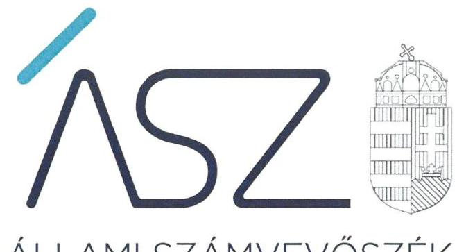
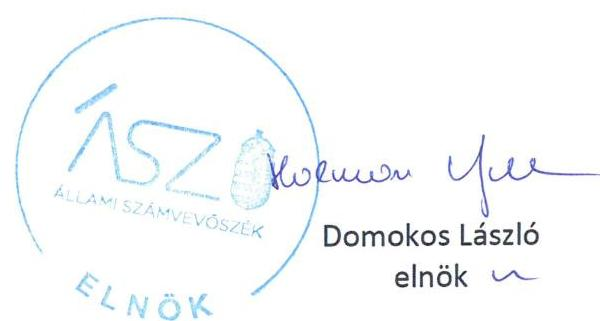
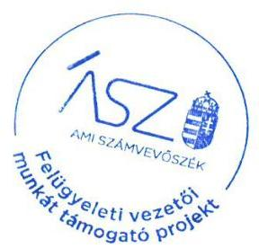

ÁLLAMI SZÁMVEVŐSZÉK

# JELENTÉS 

Nemzeti tulajdonú gazdasági társaságok ellenőrzése

Szerencsi Városüzemeltető Non-profit Kft.
2020.

20183
www.asz.hu

---

ÁLLAMI SZÁMVEVŐSZÉK

# JELENTÉS

Nemzeti tulajdonú gazdasági társaságok ellenőrzése

Szerencsi Városüzemeltető Non-profit Kft.

2020. 03. hó 13. nap

20183
www.asz.hu

---

# AZ ELLENŐRZÉST FELÜGYELTE: 

MAKKAI MÁRIA felügyeleti vezető

## AZ ELLENŐRZÉST VEZETTE ÉS A VÉGREHAJTÁSÁÉRT FELELŐS:

SALAMIN VIKTOR ellenőrzésvezető

## A PROGRAM ÖSSZEÁLLÍTÁSÁÉRT FELELŐS:

FEKETE-NAGY ANDRÁS GÁBOR ellenőrzési program készítéséért felelős vezető

TÓTPÁL SZABOLCS ellenőrzési program készítéséért felelős vezető

## IKTATÓSZÁM: EL-2863-001/2020

Jelentéseink az Országgyűlés számítógépes hálózatán és az interneten a www.asz.hu címen is olvashatóak.

TÉMASZÁM: 2513
ELLENŐRZÉS-AZONOSÍTÓ SZÁM: V082277, V085720

---

# TARTALOMJEGYZÉK 

■ ÖSSZEGZÉS ..... 5
■ AZ ELLENŐRZÉS CÉLJA ..... 6
■ AZ ELLENŐRZÉS TERÜLETE ..... 7
■ AZ ELLENŐRZÉS HÁTTERE, INDOKOLTSÁGA ..... 8
■ A JELENTÉS LÉNYEGES KÉRDÉSKÖREI ..... 9
■ AZ ELLENŐRZÉS HATÓKÖRE ÉS MÓDSZEREI ..... 10
■ MEGÁLLAPÍTÁSOK ..... 12
■ JAVASLATOK ..... 14
■ MELLÉKLETEK ..... 15
I. sz. melléklet: Értelmező szótár ..... 15
■ FÜGGELÉKEK ..... 17
I. sz. függelék: Vezetői teljesítmény értékelése ..... 17
II. sz. függelék: Észrevételek ..... 18
■ RÖVIDÍTÉSEK JEGYZÉKE ..... 25

---

.

---

# ÖSSZEGZÉS 

A Szerencsi Városüzemeltető Non-profit Kft. felett tulajdonosi jogokat gyakorló Szerencs Város Önkormányzata tulajdonosi joggyakorlása a 2017-2018. években szabályszerű volt. A Társaság vagyongazdálkodása nem biztosította a vagyonnal való elszámoltatható gazdálkodást.

## Az ellenőrzés társadalmi indokoltsága

Az Állami Számvevőszék kiemelt célja, hogy a helyi önkormányzatok gazdálkodásában rejlő pénzügyi kockázatok feltárásával, az államháztartáson kívülre nyújtott költségvetési támogatások és ingyenes vagyonjuttatások, valamint az államháztartáson kívül működő feladatellátó rendszerek ellenőrzéseivel hozzájáruljon ahhoz, hogy a közpénzeket az államháztartáson kívül működő szervezetek is átlátható, rendezett módon használják fel.

A helyi önkormányzatok tulajdona nemzeti vagyon, melynek megőrzése érdekében kiemelten fontos a nemzeti tulajdonú gazdasági társaságok ellenőrzése. Ellenőrzésüket további társadalmi elvárás is indokolja, részben a gazdálkodásuk körébe tartozó vagyon nagysága, részben az általuk ellátott közszolgáltatások, sajátos feladatellátások, mivel tevékenységükön keresztül a lakosság széles köre kerül kapcsolatba a társaságokkal. A vezetői teljesítményértékelést érintő ellenőrzések lefolytatása a téma jellege, a vezetőknek a társaság működése szempontjából meghatározó szerepe és a társadalmi érdeklődés miatt indokolt.

Az Állami Számvevőszék céljaival és a társadalmi igénnyel összhangban, a gazdasági társaságok kiemelt fontosságú szerepe miatt került sor a Szerencsi Városüzemeltető Non-profit Kft. vagyongazdálkodásának és vezető tisztségviselője teljesítményének, illetve Szerencs Város Önkormányzata tulajdonosi joggyakorlásának ellenőrzésére.

## Főbb megállapítások, következtetések, javaslatok

Szerencs Város Önkormányzata a tulajdonosi jogok gyakorlásának kereteit a 2017-2018. években a jogszabályi előírások szerint kialakította, a tulajdonosi joggyakorlás szabályszerű volt.

A Szerencsi Városüzemeltető Non-profit Kft. vagyongazdálkodási tevékenysége nem volt szabályszerű. A Társaság a mérleg tételeinek alátámasztásához a Számv. tv. előírása ellenére a 2015-2018. évekre vonatkozóan nem állított össze olyan leltárt, amely tételesen, ellenőrizhető módon tartalmazta a mérleg fordulónapján meglévő eszközöket és forrásokat mennyiségben és értékben. A Számv. tv. előírásainak megfelelő leltár hiányában az éves beszámolók részét képező mérlegek nem voltak megalapozottak, a vagyon védelme nem volt biztosított.

Az Állami Számvevőszék a jelentésben foglalt megállapítások alapján a Szerencsi Városüzemeltető Non-profit Kft. ügyvezetője és Szerencs Város Önkormányzata polgármestere részére egy-egy javaslatot fogalmazott meg.

---

# AZ ELLENŐRZÉS CÉLJA 

AZ ELLENŐRZÉS CÉLJA annak megállapítása volt, hogy a tulajdonosi joggyakorló a gazdasági társaságai feletti tulajdonosi joggyakorlás kereteit kialakította-e, tulajdonosi jogait megfelelően gyakorolta-e és kötelezettségeit teljesítette-e. Az ellenőrzés értékelte, hogy a gazdasági társaság biztosította-e a vagyon védelmét a nyilvántartások szabályszerű vezetése és a mérleg tételeinek leltárral történő alátámasztása útján, valamint szabályszerűen gondoskodott-e a használatában, kezelésében lévő nemzeti vagyon értékének megőrzéséről, gyarapításáról, hasznosításáról. Az ellenőrzés célja volt továbbá a Szerencsi Városüzemeltető Non-profit Kft. vezetője tevékenységében rejlő kockázatok azonosítása az egyes vezetői feladatok ellátásával összhangban.

---

# **AZ ELLENŐRZÉS TERÜLETE**

## **Szerencs Város Önkormányzata, Szerencsi Városüzemeltető Non-profit Korlátolt Felelősségű Társaság**

A Szerencs Város Önkormányzatának kizárólagos tulajdonában lévő Szerencsi Városüzemeltető Non-profit Kft. 2009. január 27-ei átalakulással jött létre. A Társaság1 főtevékenysége az Önkormányzat2 által üzemeltetésre átadott sportlétesítmények működtetése volt. Ezen túlmenően a Társaság élelmezési (főzőkonyha és melegítő konyha üzemeltetési), média szolgáltatási, valamint lakásgazdálkodási, épületüzemeltetési feladatokat is ellátott az ellenőrzött időszakban. A Társaság feladatellátására vonatkozó előírásokat, szabályokat üzemeltetési szerződések tartalmazták.

A Társaság az ellenőrzött időszakban nem rendelkezett vagyonkezelésbe vett vagyonnal, továbbá nem tartozott a kormányzati szektorba sorolt gazdasági társaságok közé.

Az Önkormányzatot megillető tulajdonosi jogokat a Képviselő-testület3 gyakorolta, a Társaság vonatkozásában a tulajdonosi jogok átadására nem került sor.

A Társaság jegyzett tőkéje 3,0 millió Ft volt, mely az ellenőrzött időszakban nem változott. Saját tőke rendezésére nem került sor. A Társaság – a beszámolói adatai szerint – a 2015-2017. években nyereséget nem ért el, a 2018. évben nyereségesen gazdálkodott. A Társaság az Alapító döntése alapján a 2015-2018. években könyvvizsgálót alkalmazott.

A polgármester4 személye a 2018. évben változott, a jegyző5 és az ügyvezető6 személyében az ellenőrzött időszakban változás nem volt.

---

# AZ ELLENŐRZÉS HÁTTERE, INDOKOLTSÁGA 

Az Alaptörvény ${ }^{7}$ 38. cikke alapján az állam és a helyi önkormányzatok tulajdona nemzeti vagyon. A nemzeti vagyon megőrzése, megóvása érdekében kiemelten fontos ezen nemzeti tulajdonú gazdasági társaságok ellenőrzése. Gazdálkodásuk jellemzően a közérdeklődés és a média figyelmének középpontjában áll, amihez hozzájárul a gazdálkodásuk körébe tartozó - a nemzeti vagyon részét képező - vagyon nagysága, illetve az általuk ellátott közszolgáltatások minősége és hatékonysága. Ellenőrzéseink feltárhatják, hogy a tulajdonosi felügyelet hozzájárult-e a szabályszerű gazdálkodáshoz és feladatellátáshoz.

Az ellenőrzés eredményeként meghatározhatóvá válnak a szervezet vagyongazdálkodást érintő kockázatai, ezzel lehetővé téve a kockázatok csökkentését. A megállapítások alapján megfogalmazott számvevőszéki javaslatok hasznosítása elősegítheti a meglévő hibák megszüntetését. A jó gyakorlatok bemutatásával az ÁSZ ${ }^{8}$ hozzájárulhat a követendő megoldások megismertetéséhez, terjesztéséhez.

A Kormány „jól működő állam" megteremtésével kapcsolatos céljaival összhangban van, hogy olyan vezetői teljesítményértékelési rendszer kerüljön kialakításra és működtetésre, amely hozzájárul a szervezeti teljesítmény növeléséhez, a fejlődési lehetőségek kihasználásához. Az ÁSZ a rendszer kiépítésében vállalt aktív ellenőrzési, értékelési tevékenységével kíván hozzájárulni a „jól irányított állam" megteremtéséhez.

---

# A JELENTÉS LÉNYEGES KÉRDÉSKÖREI 

1. A Társaság feletti tulajdonosi joggyakorlás megfelelt-e a jogszabályi és belső előírásoknak?
2. A Társaság vagyongazdálkodási tevékenysége szabályszerű volt-e?
3. A Társaság vezetőjének tevékenysége megfelelő volt-e?

---

# AZ ELLENŐRZÉS HATÓKÖRE ÉS MÓDSZEREI 

## Az ellenőrzés típusa

Megfelelőségi ellenőrzés.

## Az ellenőrzött időszak

A tulajdonosi joggyakorlás vonatkozásában az ellenőrzött időszak a 2017-2018. évek, az éves beszámolók elfogadása kivételével, amelyeknél az ellenőrzött időszak 2015-2018. évek.

A Társaság vagyongazdálkodása vonatkozásában az ellenőrzött időszak 2015-2018. évek.

A vezetői teljesítmény ellenőrzése esetében az ellenőrzött időszak a 2018. év.

## Az ellenőrzés tárgya

Az önkormányzati tulajdonban lévő gazdasági társaság feletti tulajdonosi joggyakorlás kialakítása és működtetése.

Önkormányzati tulajdonban lévő gazdasági társaság vagyongazdálkodása keretében a társaság használatában, kezelésében lévő nemzeti vagyon, illetve a saját vagyon tekintetében a vagyonnyilvántartások vezetése, leltára. A társaság használatában, vagyonkezelésében lévő nemzeti vagyon tekintetében a vagyon értékének megőrzése, gyarapítása, hasznosítása.

Az önkormányzati tulajdonban lévő gazdasági társaság vezetői teljesítményének értékelése. Az önkormányzati tulajdonban lévő gazdasági társaság átlátható, szabályszerű, gazdaságos, hatékony, eredményes és felelős gazdálkodásának feltételrendszere kialakítása, a belső kontrollrendszer és humánpolitikai rendszer működtetése. Az integritásszemlélet érvényesítése, illetve a felelős vagyongazdálkodás biztosítása a nemzeti vagyon megőrzése és védelme érdekében.

## Az ellenőrzött szervezet

Szerencs Város Önkormányzata és a Szerencsi Városüzemeltető Nonprofit Korlátolt Felelősségű Társaság.

## Az ellenőrzés jogalapja

Az ellenőrzés jogalapját az ÁSZ tv. ${ }^{9} 1. § (3) bekezdése és 5. § (3)-(5) bekezdései képezték.

---

# Az ellenőrzés módszerei 

Az ellenőrzést az ellenőrzési program ellenőrzési kérdései, az ellenőrzött időszakban hatályos jogszabályok, az ellenőrzés szakmai szabályok és módszertanok alapján, a nemzetközi standardok figyelembe vételével végeztük.

Az ellenőrzés ideje alatt az ellenőrzött szervezettel történő kapcsolattartást az ÁSZ SZMSZ-ének ${ }^{10}$ vonatkozó előírásai alapján biztosítottuk.
2017. január 1-től az ellenőrzés megkezdésének napjáig ellenőriztük a tulajdonosi joggyakorlás kereteinek kialakítását, a tulajdonosi joggyakorló tevékenységét a felügyelő bizottság és a független könyvvizsgáló működéséhez kapcsolódóan, valamint azt, hogy a tulajdonosi joggyakorló - amennyiben a gazdasági társaság feladatellátásához és vagyonkezeléséhez kapcsolódóan határozott meg követelményeket, elvárásokat - a nemzeti vagyon értékének megőrzése érdekében monitorozta-e azok teljesülését. 2015. január 1-től az ellenőrzés megkezdésének napjáig ellenőriztük a tulajdonosi joggyakorló részvételét az éves beszámoló elfogadására vonatkozó döntéshozatalban.

A gazdasági társaság vagyonhoz kapcsolódó nyilvántartásai vezetésének megfelelősége, valamint a nemzeti vagyon értéke megőrzésének, gyarapításának, hasznosításának szabályszerűsége 2015. és 2017-2018. évek tekintetében került ellenőrzésre. A 2015-2018. éveket érintően történt meg a lényeges dokumentumok értékelése.

A vagyonnyilvántartások és a leltár szabályszerűsége esetében az ellenőrzés azokra a legnagyobb értékű tételekre - a lényeges sokaságra - terjedt ki, melyek összértéke eléri a teljes sokaság összértékének 50%-át. A lényeges sokaságot tételesen ellenőriztük.

A vezetői teljesítmény ellenőrzési szempontjait a szabályszerűségi szempontok szerinti ellenőrzésben a jogszabályi előírások, belső utasítások, belső szabályozók, a tulajdonosi joggyakorlók elvárásai, előírásai, a helyénvalósági szempontok szerinti ellenőrzésben az ÁSZ által általánosan elfogadott, jó gyakorlat szerinti ajánlásai, értékelési kritériumai mentén kerültek meghatározásra. Az ellenőrzési kérdések szerint az összesített értékelés alapján az elért pontok az elérhető pontok minimum 70%-át elérve, a társaság vezetője tevékenységét megfelelőnek, 70% alatt nem megfelelőnek tekintette az ÁSZ.

Az ellenőrzési kérdések megválaszolásához szükséges bizonyítékok megszerzése a következő ellenőrzési eljárások alkalmazásával történt: megfigyelés, információkérés, összehasonlítás, valamint elemző eljárás. Az ellenőrzési bizonyítékként felhasználható adatforrások közé tartoztak az ellenőrzési programban felsorolt adatforrások, továbbá minden - az ellenőrzés folyamán - feltárt, az ellenőrzés szempontjából információkat tartalmazó dokumentum.

Az ellenőrzést a kérdésekre adott válaszok kiértékelésével, valamint a megjelölt adatforrások, a csatolt tanúsítványok felhasználásával, továbbá az adott időszakban hatályos jogszabályok figyelembe vételével folytattuk le.

Amennyiben a Társaság működését és gazdálkodását alapvetően meghatározó dokumentum hiánya miatt, valamely lényeges kérdéskörre vonatkozóan az ÁSZ megállapítást tett, további ellenőrzési tevékenységek az adott kérdéskörrel és az azzal szoros logikai kapcsolatban lévő kérdéskörökkel ráépülő jelleggel - nem kerültek végrehajtásra.

---

# 1. A Társaság feletti tulajdonosi joggyakorlás megfelelt-e a jogszabályi és belső előírásoknak? 

Összegző megállapítás

### 1.1. számú megállapítás

Az Önkormányzat tulajdonosi joggyakorlása szabályszerű volt.
Az Önkormányzat a tulajdonosi joggyakorlás kereteit a jogszabályi előírások szerint kialakította.

## A TULAJDONOSI JOGOK GYAKORLÁSÁNAK

RENDJÉT az Önkormányzat az Alapító okirat ${ }^{11}$-ban, a vagyongazdálkodási rendelet ${ }^{12}$-ben, az SZMSZ ${ }_{1,2}{ }^{13}$-ben, a tulajdonosi joggyakorlás módjának szabályzatában ${ }^{14}$, valamint a Társasággal kötött üzemeltetési szerződésekben kialakította.

Az Alapító ${ }^{15}$ a Társaság legfőbb szerve hatáskörének gyakorlójaként a Taktv. ${ }^{16}$ 5. § (3) bekezdése előírásai alapján megalkotta a vezető tisztségviselők, a felügyelőbizottsági tagok, az Mt. ${ }^{17}$ 208. §-ának hatálya alá eső munkavállalók javadalmazása, valamint a jogviszony megszűnése esetére biztosított juttatások módjának, mértékének elveiről, annak rendszeréről szóló szabályzatot.

Az Alapító a Társaság ügyvezetésének ellenőrzésére három tagból álló FB18-t hozott létre a Ptk. ${ }^{19}$, valamint a Taktv. előírásával összhangban. A Ptk. 3:122. § (3) bekezdésében és az Alapító okirat „12. Felügyelőbizottság" fejezet 13. pontjában előírtak ellenére az FB ügyrenddel nem rendelkezett.

Az Önkormányzat - a Bkr. ${ }^{20}$ 10. § szerinti -
 a szervezet tevékenységének, a célok megvalósításának nyomon követését biztosító rendszert kialakította.
1.2. számú megállapítás

A Társaság feletti tulajdonosi joggyakorlás szabályszerű volt.
A Társaság éves beszámolóit az Alapító a jogszabályi előírások szerint, az FB írásbeli véleménye ismeretében jóváhagyta.

Az Alapító a Ptk. és a Számv. tv. ${ }^{21}$ előírásainak megfelelően döntött a Társaság állandó könyvvizsgálójának személyéről. Az Alapító a Társaság 2015-2017. évi számviteli beszámolóját a független könyvvizsgálói jelentés birtokában hagyta jóvá.

Az Önkormányzat a Társaság feladatellátásához kapcsolódóan meghatározott követelmények teljesülését monitorozta.

---

# 2. A Társaság vagyongazdálkodási tevékenysége szabályszerű volt-e? 

Összegző megállapítás

A Társaság vagyongazdálkodási tevékenysége nem volt szabályszerű.

A vagyongazdálkodási tevékenység feltételeit a Társaság az ellenőrzött időszakban kialakította, a Számv. tv. előírása szerint rendelkezett számviteli politikával, eszközök és források értékelési szabályzattal, pénzkezelési szabályzattal, továbbá számlarenddel.

Leltárkészítési és leltározási szabályzattal a Társaság a Számv. tv. előírásai szerint rendelkezett, amely tartalmazta a leltározásra és a leltárkészítésre vonatkozó szabályokat, előírásokat.

A vagyongazdálkodás nem volt szabályszerű, mert a mérleg tételeinek alátámasztásához a Társaság a Számv. tv. 69. § (1) bekezdésének előírása ellenére a 2015-2018. évekre vonatkozóan nem állított össze olyan leltárt, amely tételesen, ellenőrizhető módon tartalmazta a mérleg fordulónapján meglévő eszközöket és forrásokat mennyiségben és értékben. Leltár hiányában a 2015-2018. évi éves beszámolók részét képező mérlegek nem voltak megalapozottak.

A könyvvizsgáló a 2015-2017. évi beszámolókat - a mérleget alátámasztó leltár hiánya ellenére - hitelesítő záradékkal látta el.

## 3. A Társaság vezetőjének tevékenysége megfelelő volt-e?

Összegző megállapítás

A Társaság ügyvezetőjének 2018. évi tevékenysége nem volt megfelelő.

A Társaság vezető tisztségviselője 2018. évi tevékenységének részletes értékelését a I. sz. Függelék tartalmazza.

---

# JAVASLATOK 

Az ÁSZ tv. 33. § (1) bekezdésében foglaltak értelmében az ellenőrzött szervezet vezetője köteles a jelentésben foglalt megállapításokhoz kapcsolódó intézkedési tervet összeállítani és azt a jelentés kézhezvételétől számított 30 napon belül az ÁSZ részére megküldeni. Amennyiben az ellenőrzött szervezet vezetője nem küldi meg határidőben az intézkedési tervet, vagy továbbra sem elfogadható intézkedési tervet küld, az Állami Számvevőszék elnöke az ÁSZ tv. 33. § (3) bekezdése a) és b) pontjaiban foglaltakat érvényesítheti.

## Szerencs Város Önkormányzata polgármesterének

1. Kezdeményezze a Társaság felügyelő bizottságánál az ügyrend elkészítését és a Társaság legfőbb szerve általi jóváhagyását.
(1.1. sz. megállapítás 3. bekezdés második mondata alapján)

## a Szerencsi Városüzemeltető Non-profit Kft. ügyvezetőjének

1. Intézkedjen az éves beszámoló mérlegtételeit alátámasztó leltár jogszabályi előírásnak megfelelő elkészítéséről.
(2. sz. megállapítás 3. bekezdés első mondata alapján)

---

# MELLÉKLETEK 

- I. SZ. MELLÉKLET: ÉRTELMEZŐ SZÓTÁR
gazdasági társaság
kormányzati szektorba sorolt egyéb szervezet
közszolgáltatás
közfeladat
nemzeti vagyon
nemzeti vagyon hasznosítása
nemzeti vagyon használója
tulajdonosi jogok gyakorlója vagyonkezelő

Ptk. 3:88. § (1) bekezdése szerint „a gazdasági társaságok üzletszerű közös gazdasági tevékenység folytatására, a tagok vagyoni hozzájárulásával létrehozott, jogi személyiséggel rendelkező vállalkozások, amelyekben a tagok a nyereségből közösen részesednek, és a veszteséget közösen viselik".
Az a szervezet, amely az Áht. alapján nem része az államháztartásnak, azonban az Európai Közösséget létrehozó szerződéshez csatolt, a túlzott hiány esetén követendő eljárásról szóló jegyzőkönyv alkalmazásáról szóló 2009. május 25-i 479/2009/EK rendelet szerint kormányzati szektorba tartozik.
Az Ebktv. ${ }^{22}$ 3. § d) pontja a következőképpen határozza meg a közszolgáltatást: „szerződéskötési kötelezettség alapján a lakosság alapvető szükségleteinek ellátására irányuló szolgáltatás, így különösen a villamos energia-, gáz-, hő-, víz-, szenny-víz- és hulladékkezelési, köztisztasági, postai és távközlési szolgáltatás, továbbá a menetrend alapján közlekedő járművekkel végzett közforgalmú személyszállítás".
Az Áht. 3/A. § (1) bekezdése alapján közfeladat a jogszabályban meghatározott állami vagy önkormányzati feladat.
Nvtv. ${ }^{23}$ 1. § (2) bekezdése szerint nemzeti vagyonba tartozik többek között: „az állam vagy a helyi önkormányzat kizárólagos tulajdonában álló dolgok, az a) pont hatálya alá nem tartozó, állam vagy a helyi önkormányzat tulajdonában lévő dolog,
az állam vagy a helyi önkormányzat tulajdonában lévő pénzügyi eszközök, továbbá az államot vagy a helyi önkormányzatot megillető társasági részesedések, az államot vagy a helyi önkormányzatot megillető bármely vagyoni érték-kel rendelkező jogosultság, amelyet jogszabály vagyoni értékű jogként nevesít
A tulajdonosi joggyakorló vagy a nemzeti vagyon használója által a nemzeti vagyon birtoklásának, használatának, hasznok szedése jogának bármely - a tulajdonjog átruházását nem eredményező - jogcímen történő átengedése, ide nem értve a vagyonkezelésbe adást, valamint a haszonélvezeti jog alapítását.
Forrás: Nvtv. 3. § (1) bekezdés 4. pont
Azon természetes személy, jogi személy vagy jogi személyiséggel nem rendelkező szervezet, aki vagy amely állami vagyon tekintetében törvény vagy szerződés alapján, a helyi önkormányzat vagyona tekintetében törvény, a helyi önkormányzat rendelete vagy szerződés alapján bármely jogcímen nemzeti vagyont birtokol, használ, szedi annak használt, kivéve a tulajdonosi joggyakorló.
Forrás: Nvtv. 3. § (1) bekezdés 11. pont
Aki a nemzeti vagyon felett az államot vagy a helyi önkormányzatot megillető tulajdonosi jogok és kötelezettségek összességének gyakorlására jogosult. (Forrás: Nvtv. 3. § (1) bekezdés 17. pontja)
az állam tulajdonában álló nemzeti vagyon tekintetében:
aa) költségvetési szerv,
ab) helyi önkormányzat, nemzetiségi önkormányzat, valamint ezek társulásai,
ac) az ab) alpontban felsoroltak fenntartása vagy irányítása alá tartozó intézmény, ad) köztestület,
ae) az állam, az aa)-ac) alpontban meghatározott személyek együtt vagy külön-külön 100%-os tulajdonában álló gazdálkodó szervezet,

---

af) az ae) alpont szerinti gazdálkodó szervezet 100%-os tulajdonában álló gazdálkodó szervezet,
ag) a törvény által kijelölt egyedileg meghatározott jogi személy.
b) a helyi önkormányzat tulajdonában álló nemzeti vagyon tekintetében:
ba) nemzetiségi önkormányzat, helyi vagy nemzetiségi önkormányzati társulás, valamint ezek fenntartása vagy irányítása alá tartozó intézmény,
bb) költségvetési szerv,
bc) köztestület,
bd) az állam, a helyi önkormányzat, a ba) alpontban meghatározott személyek együtt vagy külön-külön 100%-os tulajdonában álló gazdálkodó szervezet,
be) a bd) alpont szerinti gazdálkodó szervezet 100%-os tulajdonában álló gazdálkodó szervezet.
Forrás: Nvtv. 3. § (1) bekezdés 19. pont

---

# FÜGGELÉKEK 

- I. SZ. FÜGGELÉK: VEZETŐI TELJESÍTMÉNY ÉRTÉKELÉSE

Az ellenőrzés az önkormányzati tulajdonban lévő gazdasági társaság vezető tisztségviselőjére terjedt ki. Az ellenőrzés során a megalapozott vezetői teljesítmény értékeléséhez a vezetői feladatok közül a stratégiai irányítást, tervezést, azok megvalósítását, a társaság szabályszerű működése feltételrendszerének kialakítását, a belső kontrollrendszer, valamint a humánpolitikai rendszer működtetését, az integritás szemlélet érvényesítését, illetve a felelős vagyongazdálkodás biztosítását értékeltük.

A Szerencsi Városüzemeltető Non-profit Kft. vezetőjének teljesítményét 2018-ban nem megfelelőnek értékeltük, mert

- $\quad$ nem dolgozta ki a Társaság középtávú stratégiáját;
- $\quad$ nem működtetett a szervezet teljesítményének értékelése céljából mutatószámokon, mutatószámrendszeren alapuló szervezeti teljesítményértékelési rendszert;
- $\quad$ nem alakította ki a szervezeti integritást sértő események kezelésének eljárásrendjét;
- $\quad$ nem mérte fel és nem értékelte a szervezetet és a tevékenységet érintő kockázatokat, azok kezelésére nem intézkedett;
- $\quad$ nem működtetett a gazdálkodás, tevékenység folyamataira vonatkozó belső ellenőrzési rendszert;
- $\quad$ nem működtetett egyéni teljesítményértékelési, teljesítmény-ösztönző rendszert;
- $\quad$ nem mérte fel a szervezet működésével kapcsolatos integritási és korrupciós kockázatokat, azok csökkentése érdekében nem tett lépéseket;
- $\quad$ nem dolgozta ki a társaság menedzsmentjére, munkavállalóira és a vagyongazdálkodására vonatkozó összeférhetetlenségi előírásokat;

A megfelelően kialakított vezetői teljesítményértékelési rendszerek alapul szolgálnak a vezetői felelősség tudatosításához, és ezáltal a szervezeti teljesítmény fenntartásához, növeléséhez, a fejlődési lehetőségek kihasználásához, hozzájárulhatnak a közvagyonnal való hatékony gazdálkodáshoz.

---

A jelentéstervezetet a Számvevőszék 15 napos észrevételezésre megküldte az ellenőrzött szervezetek vezetőinek az ÁSZ tv. 29. § (1) bekezdése előírása szerint.

Az ÁSZ a jelentéstervezetet észrevételezésre megküldte Szerencs Város Önkormányzata polgármesterének és a Szerencsi Városüzemeltető Non-profit Kft. ügyvezetőjének.
A Szerencs Város Önkormányzatának polgármestere az ÁSZ tv. 29. § (2) bekezdésében foglalt észrevételezési jogával nem élt, a Szerencsi Városüzemeltető Non-profit Kft. észrevételét és az arra adott választ a jelentés alább tartalmazza.

[^0]
[^0]:    * 29. § (1) Az Állami Számvevőszék az ellenőrzési megállapításait megküldi az ellenőrzött szervezet vezetőjének vagy az általa megbízott személynek, és annak, akinek személyes felelősségét állapította meg.
    (2) Az ellenőrzött szervezet vezetője és a felelősként megjelölt személy az ellenőrzés megállapításaira tizenöt napon belül írásban észrevételt tehet.
    (3) Az Állami Számvevőszék az észrevételre a beérkezésétől számított harminc napon belül írásban válaszol. A figyelembe nem vett észrevételeket köteles a jelentésben feltüntetni, és megindokolni, hogy azokat miért nem fogadta el.

---

Szerencs Városüzemeltető Nonprofit Kft. 3900 Szerencs, Kossuth tér 1. Telefon: 20/965-78-04 Telefon/Fax: 47/777-074 Email: varosuzemelteto@szerencs.hu www.varosuzemelteto.hu

Állami Számvevőszék
Domokos László Elnök Úr részére
Székhelyén

Ikt. szám Önöknél: EL-2120-052/2020

Tárgy: észrevételek fenti számon megküldött előzetes jelentésükre

Tisztelt Elnök Úr!

Alulírott Takács Mihály István, a Szerencsi Városüzemeltető Non-profit Korlátolt Felelősségű Társaság (3900 Szerencs, Kossuth tér 1.) ügyvezetője, a fenti Társaság (továbbiakban: Társaság) képviseletében, a biztosított határidőn belül, a fenti számon megküldött előzetes jelentésre az alábbi
észrevételeket
teszem.
A jelentés a Társaság működésével kapcsolatban három érdemi felvetést tartalmazott, melyre külön-külön az alábbi észrevételeket fogalmazzuk meg.

# I. Tárgyi eszköz leltárral kapcsolatos észrevétel (jelentéstervezet 1. sz. függelék 2. bekezdés) 

E körben előre kívánjuk bocsátani, hogy Társaságunk a leltározási kötelezettségeinek általánosságban minden gazdasági évben eleget tett - valamennyi tétel vonatkozásában -, mely iratokat az ellenőrzés során megküldtük a T. Számvevőszék felé.

Kifejezetten jelezni kívánjuk, hogy a tárgyi eszközök vonatkozásában a leltárfelvétel minden esetben a korábbi leltár folyamatos, ill. év végi aktualizálásával történt meg, tehát az minden érintett évben (különösen a mérlegfordulónapon) a tényleges tárgyi eszköz adatokat tartalmazta.

Ebből következően álláspontunk szerint a mennyiségi adatok az érintett időpontokban hatályos tényleges adatoknak megfeleltek.

Ebből következően álláspontunk szerint nem állapítható meg az, hogy a mérleg - bármely érintett évben - ne lenne alátámasztott azon okból, hogy a leltár nem teljes körben és mennyiségben tartalmazta volna a tárgyi eszközöket, illetve, hogy ezen okból az nem volt tételes és ellenőrizhető a mérlegfordulónapon. Ennek okán tisztelettel kérjük a jelentéstervezet ezen megállapításainak felülvizsgálatát!

Jelezzük azt is, hogy a T. Számvevőszék jelentéstervezete nem tartalmazza a tárgyi eszköz leltárral kapcsolatos pontos kifogásokat (csak általánosságban mennyiségi és értékbeni kérdésről szól a jelentéstervezet), így ennek hiányában egyebekben érdemben jelen helyzetben nem tud Társaságunk nyilatkozatot tenni.

---

A T. Számvevőszék munkájának elősegítése érdekében azonban jelezzük, hogy - ha és amennyiben - a tárgyieszköz leltár „értékbeni" hibájaként a T. Számvevőszék az egyes leltári tételeknél az érték adat hiányát érti, annak oka az, hogy az adott tárgyi eszköz a leltárban szerepel, de ún. érték nélküli tételként.

Ez azonban nem befolyásolja a leltár valódiságát és teljességét, vagy más paraméterét.
Fentiek alapján álláspontunk az, hogy a leltározási, számviteli szabályoknak a fenti eljárás megfelelt, a rendelkezésre álló leltár a Társaság eszközeiről valós képet adott minden gazdasági évben a fentiek miatt, így a tárgyévi mérleg e körben alátámasztottnak minősül

Fentiek okán kérjük a jelentéstervezet fenti megállapításainak felülvizsgálatát!

# II. Az egyéb, mérleget alátámasztó nyilvántartások vonatkozásában (jelentéstervezet 1. sz. függelék 3. bekezdés) releváns észrevételek 

A T. Számvevőszék által leírtak alapján Társaságunk ismételten felülvizsgálta, ill. felülvizsgáltatta a beküldött dokumentumokat és álláspontunk szerint a jelentéstervezetben foglaltak nem állnak összhangban a beküldött dokumentumokkal.

Álláspontunk szerint a mérleg és az azt
 alátámasztó (gazdasági évenként megjelölt) dokumentumok között az összhang fennáll, számviteli eltérés nem tapasztalható.

Fentiek igazolására csatoljuk jelen észrevételünk mellékleteként azon - általunk a fenti dokumentumok alapján készített - iratokat, melyek a fentieket igazolják, és amelyek, ill. a Társaságunk által korábban beküldött dokumentumok alapján megállapíthatóvá teszik, hogy nem áll fenn olyan helyzet, hogy a vizsgált bármely évben az elkészült mérleg ne került volna teljes körűen alátámasztásra a számviteli szabályoknak megfelelő dokumentumokkal.

Fentiek alapján kérjük a fenti körben a jelen levelünkkel, illetve a korábbiakban csatolt dokumentumok ismételt áttekintését, és annak megállapítását, hogy e körben jogsértés nem történt.

## III. A vezetői teljesítmény értékelésével kapcsolatos észrevétel

Társaságunk az ellenőrzés során csatolta a kapcsolatos iratokat és nyilatkozatokat a tárgyi körben.
Ebből álláspontunk szerint megállapítható, hogy a Társaság - az ügyvezetői hatáskörbe tartozó - a működéshez szükséges alapdokumentumokat (pl. ellenőrzési nyomvonal, az összeférhetetlenségre is kiterjedő etikai szabályzat, kockázatkezelési szabályzat) elkészítette, azok rendelkezésre álltak, azaz teljesült, hogy az ügyvezető a stratégiai irányítási, tervezési, szabályszerű működésének biztosítására irányuló, továbbá a humánpolitikai rendszer, az integritási szemlélet, valamint a felelős vagyongazdálkodás működési feltételeit biztosította.

Álláspontunk szerint - figyelemmel például a 2020. január 28. napján kelt „Nyilatkozat" c. dokumentumban is foglaltakra is - megállapítható, hogy Társaságunk létszáma, különösen a vezető állomány kis létszáma lehetővé teszi, hogy a csatolt szabályzatok alapján kevésbé formalizált, de a jogszabályi célok elérését mindenképpen biztosító működési modell érvényesüljön a működés során, így a kifogásolt kérdésekben is.

Ezen működési modell alapjai a rendszeres heti vezetői egyeztetések, illetve az azonnali döntéseket érintő kérdésben a személyes (minden érintettre kiterjedő) megbeszélések, továbbá a rendszeres jelentések (pl. napi jelentés).

A rendszeres vezetői egyeztetések írásban dokumentálásra is kerülnek, ahogyan azt a korábban csatolt dokumentumok is igazolják.

---

Külön ki kívánjuk emelni, hogy figyelemmel arra, hogy a jogszabályi követelményekkel kapcsolatos észrevételeken kívül az általunk csatolt dokumentumok alapján a T. Számvevőszék által nem került megállapításra olyan konkrét tény, vagy körülmény, amely a jelentéstervezet II. sz. függelékében felsorolt felvetések okán konkrét problémát (pl.: összeférhetetlenség, korrupciós esemény, kockázatkezelési probléma, stb.) igazolt volna, így álláspontunk szerint a fenti rendszerek a Társaságunknál betöltötték a feladatukat.

Fentiek alapján - feltéve, hogy esetlegesen voltak is apróbb hiányosságok, amelyek azonban a vagyongazdálkodásra és a társaság jogszerű működésére, a közvagyonnal való hatékony gazdálkodásra nem voltak semmiféle kihatással - aránytalannak tartjuk azon megállapítást, miszerint a Társaság ügyvezetőjének tevékenységét 2018. év vonatkozásában a T. Számvevőszék általánosságban nem megfelelőnek értékelte. Álláspontunk szerint ez csak akkor lenne megalapozott, ha a jogszabályi vonatkozó feladatainak az ügyvezető nem tett volna általánosságban eleget, vagy ha eleget tett volna, de mégis igazolhatóak lennének tényleges a közvagyon működtetésével kapcsolatos kockázati tényállások (pl. korrupció, összeférhetetlenség, stb.). Ilyenek hiányában álláspontunk szerint a fenti megállapítás e körben nem alátámasztott, illetve árnyalásra szorul.

Ennek okán kérjük a fenti jelentés-tervezeti megállapítás felülvizsgálatát!

Végezetül Társaságunk szeretné megköszönni a Tisztelt Számvevőszék ellenőrzési munkáját, mely alapján az elkészítendő végleges jelentésben foglaltaknak megfelelően Társaságunk a jövőben még inkább meg tud felelni a vonatkozó elvárásoknak!

Szerencs, 2020. augusztus 04.

Tisztelettel:

Szerencsi Városüzemeltető Non-profit Korlátolt Felelősségű Társaság
képv.: Takács Mihály István
ügyvezető

SZERENCBI VÁROSÚZEMELTETŐ
NON-PROFIT KFT.
3000 Szerencs, Kossuth út 1.
Adószám: 20789029-2-05
F.

---

# 150 éve   a közpénzek őre 

Ikt. szám: EL-2120-057/2020.

Takács Mihály István úr
ügyvezető

Szerencsi Városüzemeltető Non-profit Korlátolt Felelősségű Társaság

## Szerencs

Tisztelt Ügyvezető Úr!

A „Nemzeti tulajdonú gazdasági társaságok ellenőrzése - Szerencsi Városüzemeltető Non-profit Kft." címmel készített számvevőszéki jelentéstervezetre tett 2020. augusztus 04-én kelt észrevételét köszönettel megkaptam.

Az Állami Számvevőszék észrevételre vonatkozó álláspontjáról a felügyeleti vezető által készített részletes tájékoztatást mellékelten megküldöm.

Tájékoztatom Ügyvezető urat, hogy a számvevőszéki jelentésben - az Állami Számvevőszékről szóló 2011. évi LXVI. törvény 29. § (3) bekezdése alapján - a figyelembe nem vett észrevételt szerepeltetjük, annak indoklásával, hogy azt az Állami Számvevőszék miért nem fogadta el.

Budapest, 2020. 08. hó 29. nap

Tisztelettel:

Melléklet: Tájékoztatás az észrevétel kezeléséről

---

# Tájékoztatás   az észrevétel kezeléséről 

A „Nemzeti tulajdonú gazdasági társaságok ellenőrzése - Szerencsi Városüzemeltető Non-profit Kft." című jelentéstervezetre 2020. augusztus 6-án érkezett észrevételt áttekintettük, annak kezelésével kapcsolatban a következő tájékoztatást adom.

Ügyvezető úr észrevételének I. és II. pontjában vitatja az Állami Számvevőszék (továbbiakban ÁSZ) Szerencsi Városüzemeltető Non-profit Kft. 2015-2018. évek mérleg alátámasztásához összeállított leltárra vonatkozó megállapítását. Tájékoztatom Ügyvezető urat, hogy az ÁSZ ellenőrzési megállapításai minden esetben az Állami Számvevőszékről szóló 2011. évi LXVI. törvénynek megfelelően az ellenőrzés során bekért és az arra nyitva álló határidőn belül rendelkezésre bocsátott dokumentumokon alapulnak, ezért az ÁSZ az észrevétel mellékleteként beküldött dokumentumokat nem értékelte.

A törvényes határidőben a Szerencsi Városüzemeltető Non-profit Kft. (továbbiakban Társaság) által az ellenőrzés rendelkezésére bocsátott dokumentumok alapján állapította meg az ÁSZ, hogy „A Társaság a mérleg tételeinek alátámasztásához a Számv. tv. előírása ellenére a 2015-2018. évekre vonatkozóan nem állított össze olyan leltárt, amely tételesen, ellenőrizhető módon tartalmazta a mérleg fordulónapján meglévő eszközöket és forrásokat mennyiségben és értékben." A dokumentumok szerint a 2015. évben a kötelezettségek, a 2016. évben a követelések és kötelezettségek, a 2017. évben a követelések, az aktív időbeli elhatárolások és a kötelezettségek, a 2018. évben pedig a tárgyi eszközökön belül a befejezetlen beruházások leltár szerinti értékei nem egyeznek meg a mérlegben szereplő értékkel. Fentiek alapján az észrevételt nem fogadjuk el, a jelentéstervezet módosítása nem indokolt.

Az észrevétel III. pontjában Ügyvezető úr aránytalannak tartja az ÁSZ 2018. év vonatkozásában, a vezetői teljesítmény értékelésével kapcsolatos megállapítását. Szerinte a Társaság - az ügyvezetői hatáskörbe tartozó - a működéshez szükséges alapdokumentumokat elkészítette, azok rendelkezésre álltak, azaz teljesült, hogy az ügyvezető a stratégiai irányítási, tervezési, szabályszerű működésének biztosítására irányuló, továbbá a humánpolitikai rendszer, az integritás szemlélet, valamint a felelős vagyongazdálkodás működési feltételeit biztosította.

Tájékoztatom Ügyvezető urat, hogy az ÁSZ ellenőrzése a rendelkezésére bocsátott dokumentumok alapján állapította meg többek között, hogy Ügyvezető úr nem dolgozta ki a Társaság középtávú stratégiáját a vonatkozó Polgármesteri Utasítás ellenére, nem adta ki a szervezeti integritást sértő események kezelésének eljárásrendjét.

---

Továbbá nem dolgozta ki a Társaság menedzsmentjére, munkavállalóira és a vagyongazdálkodására vonatkozó összeférhetetlenségi előírásokat, nem működtetett mutatószámrendszeren alapuló szervezeti teljesítményértékelési rendszert a szervezet teljesítményének értékelésére, illetve nem állt rendelkezésre Ügyvezető úr összeférhetetlenségi és vagyonnyilatkozata.

Fentiekre tekintettel Ügyvezető úr észrevételét nem fogadjuk el, a jelentéstervezet módosítása nem indokolt.

Budapest, 2020. 08. hó 29. nap

Makkai Mária s.k.

felügyeleti vezető

A kiadmány hiteles.
Gossera Gilea

---

# RÖVIDÍTÉSEK JEGYZÉKE 

${ }^{1}$ Társaság
${ }^{2}$ Önkormányzat
${ }^{3}$ Képviselő-testület
${ }^{4}$ polgármester
${ }^{5}$ jegyző
${ }^{6}$ ügyvezető
${ }^{7}$ Alaptörvény
${ }^{8}$ ÁSZ
${ }^{9}$ ÁSZ tv.
${ }^{10}$ ÁSZ SZMSZ
${ }^{11}$ Alapító okirat
${ }^{12}$ vagyongazdálkodási rendelet
${ }^{13} \mathrm{SZMSZ}_{1,2}$
${ }^{14}$ tulajdonosi joggyakorlás módjának szabályzata
${ }^{15}$ Alapító
${ }^{16}$ Taktv.
${ }^{17} \mathrm{Mt}$.
${ }^{18} \mathrm{FB}$
${ }^{19} \mathrm{Ptk}$.
${ }^{20} \mathrm{Bkr}$.
${ }^{21}$ Számv. tv.
${ }^{22}$ Ebktv.
${ }^{23} \mathrm{Nvtv}$.

Szerencsi Városüzemeltető Non-profit Korlátolt Felelősségű Társaság
Szerencs Város Önkormányzata
Szerencs Város Önkormányzatának Képviselő-testülete
Szerencs Város polgármestere
Szerencs Város Önkormányzatának jegyzője
Szerencsi Városüzemeltető Non-profit Kft. ügyvezetője
Magyarország Alaptörvénye
Állami Számvevőszék
az Állami Számvevőszékről szóló 2011. évi LXVI. törvény
az Állami Számvevőszék Szervezeti és Működési Szabályzata
Az egyszemélyes korlátolt felelősségű társaság alapító okirata
(módosításokkal egységes szerkezetben), elfogadva a 10/2017. (I.19.) Öt. Határozattal
Szerencs Város Önkormányzata 19/2012. (VIII.30.) rendelete az önkormányzat vagyonáról és a vagyongazdálkodás szabályairól egységes szerkezetben a 15/2015. (VI.25.), a 27/2015. (XII.17.), valamint az 1/2018. (II.14.) önkormányzati rendelettel

SZMSZ1: Szerencs Város Önkormányzata Képviselő-testületének 10/2011. (V.26.) rendelete szervezeti felépítésének és működésének szabályairól egységes szerkezetben
SZMSZ2: Szerencs Város Önkormányzata Képviselő-testületének 8/2018 (III. 29.) számú rendelete szervezeti és működési szabályairól egységes szerkezetben a 11/2018. (VIII. 28.) önkormányzati rendelettel
Szerencs Város Önkormányzatának az önkormányzati tulajdonú gazdasági társaságokra vonatkozó tulajdonosi joggyakorlás módjáról szóló szabályzata (2/2014. (IX.1.) sz. Polgármesteri intézkedés)
Szerencs Város Önkormányzata Képviselő-testülete
2009. évi CXXII. törvény a köztulajdonban álló gazdasági társaságok takarékosabb működéséről (hatályos: 2009. december 4-től)
2012. évi I. törvény a munka törvénykönyvéről
(hatályos: 2012. július 1-jétől)
Szerencsi Városüzemeltető Non-profit Kft. Felügyelő Bizottsága
2013. évi V. törvény a Polgári Törvénykönyvről
(hatályos: 2014. március 15-étől)
a költségvetési szervek belső kontrollrendszeréről és belső ellenőrzéséről szóló 370/2011. (XII. 31.) Korm. rendelet
2000. évi C. törvény a számvitelről
az egyenlő bánásmódról és az esélyegyenlőség előmozdításáról szóló 2003. évi CXXV. törvény
a nemzeti vagyonról szóló 2011. évi CXCVI. törvény

---

# ÁSZ 

ÁLLAMI SZÁMVEVŐSZÉK
1052 Budapest, Apáczai Cs. J. u. 10. I 1364 Budapest 4. Pf. 54 TEL: +36 14849100
email: szamvevoszek@asz.hu
web: www.asz.hu | www.aszhirportal.hu

