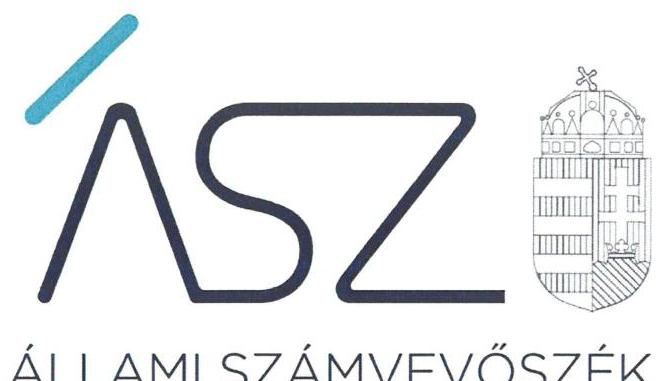
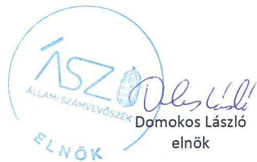
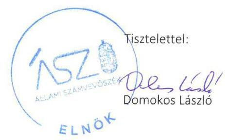
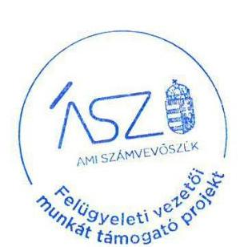

ÁLLAMI SZÁMVEVŐSZÉK

# JELENTÉS 

Nemzeti tulajdonú gazdasági társaságok ellenőrzése

Velencei-tavi Kistérségi Járóbeteg Szakellátó
Közhasznú Nonprofit Korlátolt Felelősségű Társaság
2020.

20184
www.asz.hu

---

ÁLLAMI SZÁMVEVŐSZÉK

# JELENTÉS 

Nemzeti tulajdonú gazdasági társaságok ellenőrzése

Velencei-tavi Kistérségi Járóbeteg Szakellátó
Közhasznú Nonprofit Korlátolt Felelősségű Társaság
2020. 09. hó 18. nap

20184
www.asz.hu

---

# AZ ELLENŐRZÉST FELÜGYELTE: 

MAKKAI MÁRIA felügyeleti vezető

## AZ ELLENŐRZÉST VEZETTE ÉS A VÉGREHAJTÁSÁÉRT FELELŐS:

SIPOSNÉ DÓCZI KLÁRA IBOLYA ellenőrzésvezető

## A PROGRAM ÖSSZEÁLLÍTÁSÁÉRT FELELŐS:

FEKETE-NAGY ANDRÁS GÁBOR ellenőrzési program elkészítéséért felelős vezető

TÓTPÁL SZABOLCS ellenőrzési program elkészítéséért felelős vezető

## IKTATÓSZÁM: EL-2864-001/2020

TÉMASZÁM: 2513
ELLENŐRZÉS-AZONOSÍTÓ SZÁM: V082234, V082269, V085713

---

# TARTALOMJEGYZÉK 

■ ÖSSZEGZÉS ..... 5
■ AZ ELLENŐRZÉS CÉLJA ..... 6
■ AZ ELLENŐRZÉS TERÜLETE ..... 7
■ AZ ELLENŐRZÉS HÁTTERE, INDOKOLTSÁGA ..... 8
■ A JELENTÉS LÉNYEGES KÉRDÉSKÖREI ..... 9
■ AZ ELLENŐRZÉS HATÓKÖRE ÉS MÓDSZEREI ..... 10
■ MEGÁLLAPÍTÁSOK ..... 13
■ JAVASLATOK ..... 15
■ MELLÉKLETEK ..... 17
I. sz. melléklet: Értelmező szótár ..... 17
■ FÜGGELÉKEK ..... 19
I. sz. függelék: Vezetői teljesítmény értékelése ..... 19
II. sz. függelék: Észrevételek ..... 20
■ RÖVIDÍTÉSEK JEGYZÉKE ..... 25

---

.

---

# ÖSSZEGZÉS 

A Velencei-tavi Kistérségi Járóbeteg Szakellátó Közhasznú Nonprofit Korlátolt Felelősségű Társaság felett Velence Város Önkormányzata a tulajdonosi jogait 2017-2018 években nem szabályszerűen gyakorolta. A Társaság vagyongazdálkodása 2015 - 2018 időszakban nem volt átlátható, elszámoltatható, nem volt biztositott a vagyon védelme.

## Az ellenőrzés társadalmi indokoltsága

Az Állami Számvevőszék kiemelt célja, hogy ellenőrzéseivel hozzájáruljon ahhoz, hogy a közpénzeket, illetve az ingyenesen juttatott közvagyont az államháztartáson kívül működő szervezetek is átlátható, rendezett módon használják fel.

Az állam és a helyi önkormányzatok tulajdona nemzeti vagyon, melynek megőrzése érdekében kiemelten fontos a nemzeti tulajdonú gazdasági társaságok ellenőrzése. Ellenőrzésüket további társadalmi elvárás is indokolja. Részben a gazdálkodásuk körébe tartozó vagyon nagysága, részben az általuk ellátott közszolgáltatások, sajátos feladatellátások, mivel tevékenységükön keresztül a lakosság széles köre kerül kapcsolatba a társaságokkal.

Az Állami Számvevőszék céljaival és a társadalmi igénnyel összhangban, a gazdasági társaságok kiemelt fontosságú szerepe miatt került sor a Velencei-tavi Kistérségi Járóbeteg Szakellátó Közhasznú Nonprofit Korlátolt Felelősségű Társaság vagyongazdálkodásának, a kormányzati szektor hiányára kiható elszámolásainak, illetve Velence Város Önkormányzata tulajdonosi joggyakorlásának ellenőrzésére.

## Főbb megállapítások, következtetések, javaslatok

A Társaságban minősített többségi befolyással rendelkező Velence Város Önkormányzata a tulajdonosi joggyakorlás kereteit nem szabályszerűen alakította ki. A Társaság nem rendelkezett a taggyűlés által megalkotott, a vezető tisztségviselők, a felügyelő bizottsági tagok és a vezető munkakörben dolgozó munkavállalók javadalmazására vonatkozó szabályzattal.

A Velencei-tavi Kistérségi Járóbeteg Szakellátó Közhasznú Nonprofit Korlátolt Felelősségű Társaság az ellenőrzött időszakban a számviteli törvény szerinti beszámolók mérlegtételeit leltárakkal nem támasztotta alá, ezáltal beszámolói nem voltak megalapozottak.

Az Állami Számvevőszék a jelentésben foglalt megállapítások alapján Velence Város Önkormányzata polgármesterének egy javaslatot, a Velencei-tavi Kistérségi Járóbeteg Szakellátó Közhasznú Nonprofit Korlátolt Felelősségű Társaság ügyvezetőjének kettő javaslatot fogalmazott meg.

---

# AZ ELLENŐRZÉS CÉLJA 

AZ ELLENŐRZÉS CÉLJA annak megállapítása volt, hogy a tulajdonosi joggyakorló a gazdasági társaság feletti tulajdonosi joggyakorlás kereteit kialakította-e, tulajdonosi jogait megfelelően gyakorolta-e és kötelezettségeit teljesítette-e. Az ellenőrzés célja volt továbbá annak megállapítása, hogy a gazdasági társaság biztosította-e a vagyon védelmét a nyilvántartások szabályszerű vezetése és a mérleg tételeinek leltárral történő alátámasztása útján, valamint szabályszerűen gondoskodott-e a társaság használatában, kezelésében lévő nemzeti vagyon értékének megőrzéséről, gyarapításáról, hasznosításáról, továbbá gazdálkodásának a kormányzati szektor hiányára és az államadósságra befolyással bíró elemei a jogszabályi előírásoknak megfeleltek-e és az adatszolgáltatási kötelezettségének eleget tett-e.

A vezetői teljesítményértékelés ellenőrzés célja az egyes vezetői feladatok ellátásával összhangban a vezető tevékenységében rejlő kockázatok azonosítása volt. Ezen keresztül megállapításaink, javaslataink, és tanácsaink segítik az ellenőrzött szervezet munkáját, hogy ezáltal elősegítsük a jól irányított állam működését. Az ellenőrzés támogatja a vezetőt és a tulajdonosi joggyakorlót a hiányosságok, illetve további fejlesztendő területek meghatározásában, melyek elősegítik a szabályszerű, célszerű, eredményes és hatékony működés kialakítását

---

# AZ ELLENŐRZÉS TERÜLETE 

## Velencei-tavi Kistérségi Járóbeteg Szakellátó Közhasznú Nonprofit Korlátolt Felelősségű Társaság és a tulajdonosi jogokat gyakorló Velence Város Önkormányzata

A Velencei-tavi Kistérségi Járóbeteg Szakellátó Közhasznú Nonprofit Korlátolt Felelősségű Társaságot 2008. szeptember 9-én alapították Velence, Martonvásár, Kápolnásnyék, Nadap, Pázmánd, Sukoró, Vereb és Zichyújfalu önkormányzatai. A Társaságban Velence Város Önkormányzata 99,70 \%-os tulajdonosi részesedéssel, a többi település mindegyike 0,04 \%-os tulajdoni hányaddal rendelkezett. Az ellenőrzött időszakban a Társaság jegyzett tőkéje 234 M Ft-ról 2017. március 9-én 246,5 M Ft-ra növekedett.

A Társaság fő tevékenysége a szakorvosi járóbeteg-ellátás volt. Mellette egészségmegőrzés, betegségmegelőzés, gyó-gyító- egészségügyi rehabilitációs tevékenység, központi orvosi ügyeleti ellátás képezte a feladatait. A Társaságban tulajdonos önkormányzatok a helyi önkormányzatok feladataként az Mötv. ${ }^{1}$-ben megfogalmazott, az egészségügyi alapellátást, az egészséges életmód segítését célzó szolgáltatások közfeladatokat a Társaság müködtetésével látták el. A Tulajdonosi jogokat az Önkormányzat² ${ }^{2}$ képviselőtestülete gyakorolta. A képviselő-testület döntéseiben a Polgármestert ${ }^{3}$ hatalmazta fel, hogy az Önkormányzat nevében a Társaság ${ }^{4}$ taggyűlésén döntéseit képviselje.

A Társaság más gazdasági társaságban nem rendelkezett tulajdonosi részesedéssel, nem rendelkezett vagyonkezelt vagyonnal, tevékenységét saját vagyonával látta el, a Számv. tv. ${ }^{5}$ előírásai alapján könyvvizsgálatra nem volt kötelezett.

A Társaság müködésének szabályait a Társasági szerződés ${ }_{1-4}{ }^{6}$.ben rögzítették. A Taggyűlés ${ }^{7}$ megválasztotta, és a Társasági szerződésben rögzítette, hogy az ellenőrzött időszakban a Társaság irányítási feladatait ügyvezető, ellenőrzését három tagú Felügyelőbizottság ${ }^{8}$ látta el. A Társaság számviteli beszámolóit választott Könyvvizsgáló ${ }^{9}$ auditálta, kinek személye az ellenőrzött időszakban egyszer változott. Az Ügyvezető ${ }^{10}$ megalakulása óta vezette a társaságot.

A Társaság a 2017/28. Hivatalos Értesítőben közzétett 2017.06.15-től hatályos NGM közlemény szerint kormányzati szektorba sorolt egyéb szervezet volt.

A Társaság munkavállalóinak átlagos statisztikai létszáma 2015-ben 18 fő, 2016-ban és 2017-ben 19 fő, 2018-ban 18 fő volt.

A Polgármester 2014-óta töltötte be tisztségét, a Jegyzó ${ }^{11}$ 2015-től vezette Velence Város Polgármesteri Hivatalát.

---

# AZ ELLENŐRZÉS HÁTTERE, INDOKOLTSÁGA 

Az Alaptörvény 38. cikke alapján az állam és a helyi önkormányzatok tulajdona nemzeti vagyon. A nemzeti vagyon megőrzése, megóvása érdekében kiemelten fontos ezen nemzeti tulajdonú gazdasági társaságok ellenőrzése. Gazdálkodásuk jellemzően a közérdeklődés és a média figyelmének középpontjában áll, amihez hozzájárul a gazdálkodásuk körébe tartozó - a nemzeti vagyon részét képező - vagyon nagysága, illetve az általuk ellátott közszolgáltatások minősége és hatékonysága.

Ellenőrzéseink feltárhatják, hogy a tulajdonosi felügyelet hozzájárult-e a szabályszerű gazdálkodáshoz és feladatellátáshoz.

Az ellenőrzés eredményeként meghatározhatóvá válnak a szervezet vagyongazdálkodást érintő kockázatai, ezzel lehetővé téve a kockázatok csökkentését.

A megállapítások alapján megfogalmazott számvevőszéki javaslatok hasznosítása elősegítheti a meglévő hibák megszüntetését. A jó gyakorlatok bemutatásával az ÁSZ hozzájárulhat a követendő megoldások megismertetéséhez, terjesztéséhez.

A vezetői teljesítményértékeléseket érintő ellenőrzés lefolytatása a téma jellege, a vezetőnek a társaság működése szempontjából meghatározó szerepe és a társadalmi érdeklődés miatt indokolt.

Az ÁSZ a vezetői teljesítményértékelési rendszer kiépítésében vállalt aktív ellenőrzési, értékelési tevékenységével kíván hozzájárulni a „jól irányított állam" megteremtéséhez.

A vezetők tevékenységét értékelő rendszer hozzájárul az Alaptörvény 38. cikkében foglalt, a nemzeti tulajdonban álló társaságok szabályszerű, önálló és felelős gazdálkodásához, a törvényességi, célszerűségi és eredményességi követelmények érvényesítéséhez.

---

# A JELENTÉS LÉNYEGES KÉRDÉSKÖREI 

1. A tulajdonosi jogok gyakorlása szabályszerű volt-e?
2. A gazdasági társaság vagyongazdálkodási tevékenysége szabályszerű volt-e?
3. A gazdasági társaságnak az államadósságra befolyással bíró elemei megfeleltek-e a jogszabályi előírásoknak, adatszolgáltatási kötelezettségének eleget tett-e?
4. A Társaság vezetőjének tevékenysége megfelelő volt-e?

---

# AZ ELLENŐRZÉS HATÓKÖRE ÉS MÓDSZEREI 

## Az ellenőrzés típusa

Megfelelőségi ellenőrzés.

## Az ellenőrzött időszak

A tulajdonosi joggyakorlás tekintetében az ellenőrzött időszak a 2017-2018 évekre terjedt ki az éves beszámoló jóváhagyása kivételével, amelynél az ellenőrzött időszak a 2015 -2018 évek voltak.

A gazdasági társaság vagyongazdálkodása vonatkozásában az ellenőrzött időszak 2015-2018.

Az ellenőrzött időszak a kormányzati szektorba tartozó gazdálkodás és adatszolgáltatás tekintetében 2017., a 2017. évi beszámoló jóváhagyása és közzététele tekintetében 2018. június elsejéig tartó, a 2017. évre vonatkozó adatszolgáltatás teljesítése tekintetében 2018. június 29-ig tartó időszak.

A vezetői teljesítményértékelés tekintetében az ellenőrzött időszak a 2018. év volt.

## Az ellenőrzés tárgya

Az önkormányzat tulajdonosi joggyakorlása, a meghatározó tulajdonában lévő gazdasági társaság feletti tulajdonosi joggyakorlás kialakítása és müködtetése. A Társaság vagyongazdálkodása keretében a társaság által üzemeltetett nemzeti vagyon, illetve a saját vagyon tekintetében a vagyonnyilvántartások vezetése, leltára. Valamint a társaság gazdálkodásának az államadósságra befolyással bíró elemei és a jogszabályi előírásoknak megfelelő adatszolgáltatási kötelezettségének teljesítése.

Továbbá annak ellenőrzése, hogy a társaság vezetője az általa készített középtávú és éves tervek alapján megvalósította-e a szervezet stratégiaiés teljesítménycéljait. Kialakította-e a társaság átlátható, szabályszerű, gazdaságos, hatékony, eredményes és felelős gazdálkodásának feltételrendszerét, működtetett-e belső kontrollrendszert, és humánpolitikai rendszert. Érvényesítette-e az irányítása alatt az integritásszemléletet, illetve biztosította-e a felelős vagyongazdálkodást a nemzeti vagyon megőrzése és védelme érdekében.

---

# Az ellenőrzött szervezet 

- Velencei-tavi Kistérségi Járóbeteg Szakellátó Közhasznú Nonprofit Korlátolt Felelősségű Társaság
- Velence Város Önkormányzata

## Az ellenőrzés jogalapja

Az ellenőrzés jogalapját az ÁSZ tv ${ }^{12}$. 1. § (3) bekezdése és 5. § (3)-(5) bekezdései képezik.

## Az ellenőrzés módszerei

Az ellenőrzést az ellenőrzési program ellenőrzési kérdései, az ellenőrzött időszakban hatályos jogszabályok, az ellenőrzés szakmai szabályok és módszertanok alapján, a nemzetközi standardok figyelembe vételével végeztük.

Az ellenőrzés ideje alatt az ellenőrzött szervezettel történő kapcsolattartást az ÁSZ Szervezeti és Múködési Szabályzatának vonatkozó előírásai alapján biztosítottuk.

Az ellenőrzési kérdések megválaszolásához szükséges bizonyítékok megszerzése a következő ellenőrzési eljárások alkalmazásával történt: megfigyelés, információkérés, összehasonlítás, valamint elemző eljárás. Az ellenőrzési bizonyítékként felhasználható adatforrások közé tartoztak az ellenőrzési programban felsorolt adatforrások, továbbá minden - az ellenőrzés folyamán - feltárt, az ellenőrzés szempontjából információkat tartalmazó dokumentum.

A 2017-2018. évekre vonatkozóan ellenőrizte az ÁSZ a tulajdonosi joggyakorlás kereteinek kialakítását, a tulajdonosi joggyakorló tevékenységét a felügyelő bizottság és a független könyvvizsgáló működéséhez kapcsolódóan, valamint azt, hogy a tulajdonosi joggyakorló - amennyiben a gazdasági társaság feladatellátásához és vagyonkezeléséhez kapcsolódóan határozott meg követelményeket, elvárásokat - a nemzeti vagyon értékének megőrzése érdekében monitorozta-e azok teljesülését.

Az ÁSZ a 2015-2018. évek vonatkozásában ellenőrizte a tulajdonosi joggyakorló részvételét az éves beszámoló elfogadására vonatkozó döntéshozatalban.

Az ellenőrzést a kérdésekre adott válaszok kiértékelésével, valamint a megjelölt adatforrások, a tanúsítványok felhasználásával, továbbá az adott időszakban hatályos jogszabályok figyelembe vételével folytattuk le.

A vagyonnyilvántartások és a leltár szabályszerűsége esetében az ellenőrzés azokra a legnagyobb értékű tételekre - a lényeges sokaságra - terjedt ki, melyek összértéke elérte a teljes sokaság összértékének 50\%-át. A 2015., a 2017. és a 2018. évben a lényeges sokaságot tételesen ellenőriztük.

---

A kormányzati szektorba sorolt gazdasági társaság adatszolgáltatási kötelezettségére vonatkozó jogszabályi előírások betartását az e területre vonatkozó teljes ellenőrzött időszakra értékeltük.

A vezetői teljesítmény ellenőrzés program ellenőrzési szempontjai a szabályszerűségi szempontok szerinti ellenőrzésben a jogszabályi előírások, belső utasítások, belső szabályozók, a tulajdonosi joggyakorlók elvárásai, előírásai, a helyénvalósági szempontok szerinti ellenőrzésben az ÁSZ által általánosan elfogadott, jó gyakorlat szerinti ajánlásai, értékelési kritériumai mentén kerültek meghatározásra.

Az ellenőrzési kérdések szerint az összesített értékelés alapján az elért pontok az elérhető pontok minimum 70\%-át elérve, a társaság vezetője tevékenységét megfelelőnek, 70\% alatt nem megfelelőnek tekintjük.

---

# 1. A tulajdonosi jogok gyakorlása szabályszerű volt-e? 

## Összegző megállapítás

Az Önkormányzatnak a Társaság feletti tulajdonosi joggyakorlása nem volt szabályszerű.

A Taggyűlés, mint a Társaság legfőbb szerve a Taktv. ${ }^{13} 5$. § (3) bekezdésében foglaltak ellenére nem alkotta meg a vezető tisztségviselők, a felügyelőbizottsági tagok, valamint az Mt. ${ }^{14}$ 208. § hatálya alá tartozó munkavállalók javadalmazásának, valamint jogviszonyuk megszűnése esetére biztosított juttatások módjának, mértékének elveiről, annak rendszeréről szóló szabályzatot.

Az Önkormányzat a Ptk.-ban meghatározott jogával élve részt vett a legfőbb szerv beszámoló elfogadására vonatkozó döntéshozatalában. Az Önkormányzat képviselő-testülete a Taggyűlés ülését megelőzően a számviteli törvény szerinti beszámolók elfogadásáról - a Felügyelőbizottság írásbeli véleményének és a Könyvvizsgáló jelentésének figyelembevételével döntött.

## 2. A gazdasági társaság vagyongazdálkodási tevékenysége szabályszerű volt-e?

## Összegző megállapítás

A Társaság vagyongazdálkodása nem volt szabályszerű.
A Társaság a Számv. tv. 69. § (1) bekezdés előírásai ellenére az ellenőrzött időszak egyik évében sem támasztotta alá leltárral a számviteli törvény szerinti beszámolóinak a mérlegtételeit. A Könyvvizsgáló az ellenőrzött időszak minden évében a Társaság számviteli beszámolójáról a jelentésében korlátozás nélküli záradékot adott ki.

## 3. A gazdasági társaságnak az államadósságra befolyással bíró elemei megfeleltek-e a jogszabályi előírásoknak, adatszolgáltatási kötelezettségének eleget tett-e?

## Összegző megállapítás

A Társaság a jogszabályokban előírt adatszolgáltatási kötelezettségének nem tett eleget.

A Társaság az Áht. ${ }^{15}$ 107. § (1) bekezdésében és az Ávr. ${ }^{16}$ 5. melléklete 23. sorában előírt adatszolgáltatási kötelezettségének az ellenőrzött időszakban nem tett eleget, mert az államháztartásért felelős miniszternek nem küldte meg a számviteli törvény szerinti beszámolóit, kiemelt mutatóit, költségvetési kapcsolatainak bemutatását.

---

# 4. A Társaság vezetőjének tevékenysége megfelelő volt-e? 

| Összegző megállapítás | A Társaság ügyvezetőjének 2018. évi tevékenysége nem volt |
| :-- | :-- |
|  | megfelelő. |
|  | A Társaság vezető tisztségviselője 2018. évi tevékenységének részletes ér- |
|  | tékelését az I. sz. Függelék tartalmazza. |

---

# JAVASLATOK 

Az ÁSZ tv. 33. § (1) bekezdésében foglaltak értelmében az ellenőrzött szervezet vezetője köteles a jelentésben foglalt megállapításokhoz kapcsolódó intézkedési tervet összeállítani és azt a jelentés kézhezvételétől számított 30 napon belül az ÁSZ részére megküldeni. Amennyiben az ellenőrzött szervezet vezetője nem küldi meg határidőben az intézkedési tervet, vagy továbbra sem elfogadható intézkedési tervet küld, az Állami Számvevőszék elnöke az ÁSZ tv. 33. § (3) bekezdése a) és b) pontjaiban foglaltakat érvényesítheti.

## Velence Város Önkormányzata polgármesterének

1. Kezdeményezze a Társaság legfőbb szervénél a vezető tisztségviselők, felügyelőbizottsági tagok, valamint az Mt. 208. §-ának hatálya alá eső munkavállalók javadalmazása, valamint a jogviszony megszünése esetére biztosított juttatások módjának, mértékének elveire, annak rendszerére vonatkozó szabályzat megalkotását.
(1. sz. megállapítás 1. bekezdése alapján)

## a Velencei-tavi Kistérségi Járóbeteg Szakellátó Közhasznú Nonprofit Korlátolt Felelősségú Társaság ügyvezetőjének

1. Intézkedjen a jogszabályi előírásoknak megfelelően a mérleg tételeit alátámasztó leltár elkészítéséről, amely tételesen, ellenőrizhető módon tartalmazza a mérleg fordulónapján meglévő eszközöket és forrásokat mennyiségben és értékben.
(2. sz. megállapítás 1. bekezdés első mondata alapján)
2. Intézkedjen az Áht.-ben elöirt adatszolgáltatási kötelezettség teljesitéséről.
(3. sz. megállapítás 1. bekezdése alapján)

---

.

---

# MELLÉKLETEK 

- I. SZ. MELLÉKLET: ÉRTELMEZŐ SZÓTÁR
gazdasági társaság
nonprofit gazdasági társaság
közfeladat
nemzeti vagyon
tulajdonosi jogok gyakorlója
nemzeti vagyon hasznosítása
nemzeti vagyon használója

A gazdasági társaságok üzletszerű közös gazdasági tevékenység folytatására, a tagok vagyoni hozzájárulásával létrehozott, jogi személyiséggel rendelkező vállalkozások, amelyekben a tagok a nyereségből közösen részesednek, és a veszteséget közösen viselik. Forrás: Ptk. 3:88. § (1) bekezdése
Ctv. ${ }^{17}$ 9/F. § (2) bekezdése szerint „az a gazdasági társaság minősül nonprofit gazdasági társaságnak és cégnevében az a gazdasági társaság tüntetheti fel a nonprofit jelleget, amelynek létesítő okirata tartalmazza, hogy a gazdasági társaság tevékenységéből származó nyereség a tagok között nem osztható fel, hanem az a gazdasági társaság vagyonát gyarapítja." (hatályos 2014. március 15-től)
Az Áht. 3/A. § (1) bekezdése alapján közfeladat a jogszabályban meghatározott állami vagy önkormányzati feladat.
Nvtv. ${ }^{18}$ 1. § (2) bekezdése szerint nemzeti vagyonba tartozik többek között:
„az állam vagy a helyi önkormányzat kizárólagos tulajdonában álló dolgok, az a) pont hatálya alá nem tartozó, állam vagy a helyi önkormányzat tulajdonában lévő dolog,
az állam vagy a helyi önkormányzat tulajdonában lévő pénzügyi eszközök, továbbá az államot vagy a helyi önkormányzatot megillető társasági részesedések, az államot vagy a helyi önkormányzatot megillető bármely vagyoni értékkel rendelkező jogosultság, amelyet jogszabály vagyoni értékű jogként nevesít."
Aki a nemzeti vagyon felett az államot vagy a helyi önkormányzatot megillető tulajdonosi jogok és kötelezettségek összességének gyakorlására jogosult. Forrás: Nvtv. 3. § (1) 17. pontja

A tulajdonosi joggyakorló vagy a nemzeti vagyon használója által a nemzeti vagyon birtoklásának, használatának, hasznok szedése jogának bármely - a tulajdonjog átruházását nem eredményező - jogcímen történő átengedése, ide nem értve a vagyonkezelésbe adást, valamint a haszonélvezeti jog alapítását. Forrás: Nvtv. 3. § (1) bekezdés 4. pont

Azon természetes személy, jogi személy vagy jogi személyiséggel nem rendelkező szervezet, aki vagy amely állami vagyon tekintetében törvény vagy szerződés alapján, a helyi önkormányzat vagyona tekintetében törvény, a helyi önkormányzat rendelete vagy szerződés alapján bármely jogcímen nemzeti vagyont birtokol, használ, szedi annak hasznait, kivéve a tulajdonosi joggyakorló. Forrás: Nvtv. 3. § (1) bekezdés 11. pont

---

.

---

# FÜGGELÉKEK 

- I. SZ. FÜGGELÉK: VEZETŐI TELJESÍTMÉNY ÉRTÉKELÉSE

Az ellenőrzés az önkormányzati tulajdonban lévő gazdasági társaság vezető tisztségviselőjére terjedt ki. Az ellenőrzés során a megalapozott vezetői teljesítmény értékeléséhez a vezetői feladatok közül a stratégiai irányítást, tervezést, azok megvalósítását, a társaság szabályszerű müködése feltételrendszerének kialakítását, a belső kontrollrendszer, valamint a humánpolitikai rendszer müködtetését, az integritás szemlélet érvényesitését, illetve a felelős vagyongazdálkodás biztositását értékeltük.

A Velencei-tavi Kistérségi Járóbeteg Szakellátó Közhasznú Nonprofit Korlátolt Felelősségű Társaság vezetőjének teljesítményét 2018-ban nem megfelelőnek értékeltük, mert

- nem határozta meg a társaság müködésével kapcsolatos stratégiai- és teljesítménycélokat;
- nem alakította ki a szervezeti teljestmény értékelő rendszert, ezáltal a gazdaságos, hatékony és eredményes gazdálkodás feltételrendszerét;
- a feltárt kockázatok csökkentése vonatkozásában nem müködtette a belső kontrollrendszert;
- nem alakította ki az egyéni teljesítményértékelési és teljesítmény ösztönzési rendszert, ezáltal nem valósult meg a humánpolitikai rendszer müködtetése.

Velence Város Önkormányzata figyelmébe ajánljuk, hogy a megfelelően kialakított vezetői teljesítményértékelési rendszerek alapul szolgálnak a vezetői felelősség tudatosításához, és ezáltal a szervezeti teljesítmény fenntartásához, növeléséhez, a fejlődési lehetőségek kihasználásához, a közvagyonnal való pazarló gazdálkodás megelőzéséhez, visszaszorításához.

---

A jelentéstervezetet a Számvevőszék 15 napos észrevételezésre megküldte az ellenőrzött szervezetek vezetőinek az ÁSZ tv. 29. §" (1) bekezdése előirásának megfelelően.

Az ÁSZ a jelentéstervezetet észrevételezésre megküldte Velence Város Önkormányzata polgármesterének és a Velencei-tavi Kistérségi Járóbeteg Szakellátó Közhasznú Nonprofit Korlátolt Felelősségű Társaság ügyvezetőjének.
Velence Város Önkormányzatának polgármestere az ÁSZ tv. 29. § (2) bekezdésében foglalt észrevételezési jogával nem élt, a Velencei-tavi Kistérségi Járóbeteg Szakellátó Közhasznú Nonprofit Korlátolt Felelősségü Társaság ügyvezetőjének észrevételét és az arra adott választ a jelentés alább tartalmazza.

[^0]
[^0]:    * 29. § (1) Az Állami Számvevőszék az ellenőrzési megállapításait megküldi az ellenőrzött szervezet vezetőjének vagy az általa megbízott személynek, és annak, akinek személyes felelősségét állapította meg.
    (2) Az ellenőrzött szervezet vezetője és a felelősként megjelölt személy az ellenőrzés megállapításaira tizenöt napon belül írásban észrevételt tehet.
    (3) Az Állami Számvevőszék az észrevételre a beérkezésétől számított harminc napon belül írásban válaszol. A figyelembe nem vett észrevételeket köteles a jelentésben feltüntetni, és megindokolni, hogy azokat miért nem fogadta el.

---

# SZAKORVOSI RENDELŐINTÉZET 

2481 Velence, Balatoni u. 65.

Állami Számvevőszék
1052 Budapest Apáczai Csere János u. 10.
Domokos László elnök úr részére
Tisztelt Elnök Úr!
Tel.: 22/589-515; Fax: 22/589-516
E-mail: tifakas@helmi.hu

Iktatószám: 00125-128ZAK/2020UL 30
Tárgy: Jelentéslervezet
Felügyeleti vezetői/Makkai Mária
Hiv. sz.: EL-2133-054/2020

Az elmúlt két évben a Velencei Szakorvosi Rendelőintézetet működtető Velencei-tavi Kistérségi Járóbeteg Szakellátó Közhasznú Nonprofit Kft.-nél folytatott, a „Nemzeti tulajdonú gazdasági társaságok ellenőrzése - Velencei-tavi Kistérségi Járóbeteg Szakellátó Közhasznú Nonprofit Korlátolt Felelősségủ Társaság" című Állami Számvevőszéki ellenőrzés jelentéstervezetének megállapításaira az alábbi észrevételt teszem.
1./ Gerhard Ákos polgármester úrtól származó információ szerint az Önkormányzat elkészíti a vezető tisztségviselők és a vezető munkakörben dolgozó munkavállalók javadalmazására vonatkozó szabályzatot. A Nonprofit Kft. rendelkezik a Felügyelő Bizottság működésére vonatkozó ügyrenddel, melyet a vizsgálat során a dokumentumok között feltöltöttünk.
2./ A Nonprofit Kft. a Számviteli törvény 69.§ (1) bekezdésének előírásai szerint az ellenőrzött időszak minden évében (2015. 2016. 2017. 2018.) szabályszerűen elkészített leltárral alátámasztotta számviteli törvény szerinti beszámolóinak mérlegtételeit. A vizsgálati adatbekérés során feltöltésre került az intézményi leltárok teljes dokumentációja, a leltározási jegyzőkönyvek, eszköznyilvántartások, leltározási utasítások, leltározási ütemtervek és megbízólevelek a leltározási szabályzattal együtt mind a négy évre vonatkozóan. A Nonprofit Kft. beszámolói megbízhatóak, valós képet mutatnak. (1. sz. melléklet A leltárral alátámasztott mérlegegyezőség dókumentációja 2018. 2017. 2016.)
3./ A Nonprofit Kft. az államháztartásért felelős miniszternek soron kívül megküldi a számviteli törvény szerinti beszámolóit, kiemelt mutatóit, költségvetési kapcsolatainak bemutatását.
4./ A Szakorvosi Rendelőintézet stratégiai és teljesítménycéljai már a pályázati időszakban meghatározásra kerültek. A 2008-as és 2009-es évek egészségügyi alulfinanszírozottságának ténye megkövetelte, hogy már a tervezés során szigorú szakmai, gazdasági és pénzügyi kalkulációt készítsünk. Ennek monitorozása az indulástól, 2010. augusztusió kezdve folyamatos. A Rendelőintézet finanszírozási kapacitásának kihasználtsága 2016-ra tartósan $100 \%$ fölé emelkedett úgy, hogy több hónapban a $120 \%$-ot is meghaladta. Ez a tény indokolta, hogy a betegellátás biztonságának megtartása és a rentábilis müködés fenntartása érdekében többletkapacitás kérelemmel forduljunk a Nemzeti Egészségbiztosítási Alapkezelő Többletkapacitás-befogadási Bizottságához. A stratégiai és teljesítménycélokat tartalmazó többletkapacitás kérelmünk a vizsgálati adatbekérés során feltöltésre került. (2/a melléklet. 2/b melléklet 2018. évi stratégiai és kapacitáselemzés) A szoros finanszírozásra és humán-erőforrás kapacitásra is tekintettel hasonló dokumentációt minden évre vonatkozóan készítettünk és készítünk.

A rendelőintézeti szervezeti teljesítményértékelő rendszert folyamatosan müködtetjük. A szigorú működési feltételek indokolják, hogy havi rendszerességgel elemezzük a részünkre megállapított szezonális indexnek megfelelően a teljesítményvolumen korlát szerinti német-pont, és az annak megfelelő Ft-teljesítést; az esetszámot, a német-pont/forint arányt, a TVK/TÉNY különbséget és az ebből adódó \%-os eltérést. (3. sz. melléklet)

Az egészségügyre jellemző szakemberhiány ellenére a Rendelőintézetben folyamatosan müködtetjük az egyéni teljesítményértékelő rendszert. A szakmai munka, heti rendszerességgel elkészített humán beosztás alapján müködik. ( $4 / \mathrm{a}, \mathrm{b}, \mathrm{c}$. melléklet) A NEAK-tól minden hónapban megkapott teljesítés-számok szakmák szerinti bontásban tartalmazzák az adatokat. A két dokumentáció összevetése havi rendszerességgel megtörténik.

A Velencei Szakorvosi Rendelőintézet az elmúlt évtizedben az ellátott lakosság megelégedésére végezte szakmai munkáját. Az egészségügyben szerzett több mint negyven éves tapasztalatom alapján biztos vagyok abban, hogy a közfinanszírozott rendszer teljes állami kezelésbevételével, valamint az állami és a magánszféra szigorú szétválasztásával a jövőben még gördülékenyebb lesz az egészségügy müködése.

Velence 2020. július 27.

dr. Ferencz Péter
ügyvezető

Velencei-tavi Kistérségi Járóbeteg Szakellátó Közhasznú Nonprofit Kft. 2481 Velence, Balatoni út 65. Adószám: 14458853-1-07 Cégjegyzékszám: 07-09-015167

---

# 150 éve   a közpénzek öre 

Ikt. szám: EL-2113-058/2020.

Dr. Ferencz Péter József úr
ügyvezető

Velencei-tavi Kistérségi Járóbeteg Szakellátó Közhasznú Nonprofit
Korlátolt Felelősségú Társaság
Velence

Tisztelt Ügyvezető Úr!

A „Nemzeti tulajdonú gazdasági társaságok ellenőrzése - Velencei-tavi Kistérségi Járóbeteg Szakellátó Közhasznú Nonprofit Korlátolt Felelősségú Társaság" címmel készített számvevőszéki jelentéstervezetre tett 00125-1/SZAK/2020. iktatószámú észrevételét köszönettel megkaptam.

Az Állami Számvevőszék észrevételre vonatkozó álláspontjáról a felügyeleti vezető által készített részletes tájékoztatást mellékelten megküldöm.

Tájékoztatom Ügyvezető urat, hogy a számvevőszéki jelentésben - az Állami Számvevőszékről szóló 2011. évi LXVI. törvény 29. § (3) bekezdése alapján - a figyelembe nem vett észrevételt szerepeltetjük, annak indoklásával, hogy azt az Állami Számvevőszék miért nem fogadta el.

Budapest, 2020. 08. hó 25 nap

Melléklet: Tájékoztatás az észrevétel kezeléséről

---

# Tájékoztatás 

## az észrevétel kezeléséről

A „Nemzeti tulajdonú gazdasági társaságok ellenőrzése - Velencei-tavi Kistérségi Járóbeteg Szakellátó Közhasznú Nonprofit Korlátolt Felelősségű Társaság" című jelentéstervezetre 2020. július 30-án érkezett észrevételt áttekintettük, annak kezelésével kapcsolatban a következő tájékoztatást adom.

Az Állami Számvevőszék (továbbiakban ÁSZ) ellenőrzési megállapításai minden esetben az Állami Számvevőszékről szóló 2011. évi LXVI. törvénynek megfelelően az ellenőrzés során bekért és az arra nyitva álló határidőn belül rendelkezésre bocsátott dokumentumokon alapulnak, ezért Ügyvezető úr észrevételének mellékleteként beküldött dokumentumokat az ÁSZ nem értékelte.

Az észrevétel 1. pontjában Ügyvezető Úr tájékoztatott, hogy az „Önkormányzat elkészíti a vezető tisztségviselők és a vezető munkakörben dolgozó munkavállalók javadalmazására vonatkozó szabályzatot". Az észrevételben leírtak is megerősítik az ÁSZ megállapítását, a jelentéstervezet módosítása nem indokolt.

Az észrevétel 1. pontjában továbbá az szerepel, hogy a Felügyelő Bizottság működésére vonatkozó ügyrenddel a Nonprofit Kft. rendelkezik, melyet a vizsgálat során a dokumentumok közé feltöltöttek. A jelentéstervezetben a felügyelő bizottság ügyrendjének hiányára vonatkozó megállapítás nem szerepel, ezért az észrevétel nem releváns, a jelentéstervezet módosítása nem indokolt.

Ügyvezető úr az észrevétel 2. pontjában rögzítette, hogy a Nonprofit Kft. az ellenőrzött időszak (2015.,2016.,2017.,2018.) minden évében szabályszerűen elkészített leltárral támasztotta alá a számviteli törvény szerinti beszámolóinak mérlegtételeit. Az ellenőrzés rendelkezésére bocsátott dokumentumok ismételt áttekintése után tájékoztatom Ügyvezető urat, hogy a Velencei-tavi Kistérségi Járóbeteg Szakellátó Közhasznú Nonprofit Korlátolt Felelősségű Társaság (továbbiakban Társaság) ellenőrzött időszakra vonatkozó mérlegtételeinek leltárdokumentumai csak mennyiségi adatokat tartalmaznak. Ez nem felel meg a számvitelről szóló 2000. évi C. törvény 69. § (1) bekezdésében előírtaknak, amely szerint a mérleg tételeinek alátámasztásához olyan leltárt kell összeállítani, amely tételesen, ellenőrizhető módon tartalmazza a mérleg fordulónapján meglévő eszközeit és forrásait mennyiségben és értékben. Fentiek alapján az észrevételt nem fogadjuk el, a jelentéstervezet módosítása nem indokolt.

Az észrevétel 3. pontjában Ügyvezető úr tájékoztat arról, hogy a Társaság az államháztartásért felelős miniszternek soron kívül megküldi a számviteli törvény szerinti beszámolóit, kiemelt mutatóit, költségvetési kapcsolatainak bemutatását. Ez megerősíti az ÁSZ megállapítását, ezért a jelentéstervezet módosítása nem indokolt.

---

A 4. pontban a Társaság stratégiai és teljesítménycéljaival kapcsolatban írt észrevételére tájékoztatom, hogy a rendelkezésre bocsátott és az észrevételben hivatkozott „többletkapacitási kérelem" a Társaság szakmai tevékenységével, a járóbeteg-kapacitás kiegészítésével kapcsolatos így nem feleltethető meg a Társaság egészére vonatkozó stratégiai - üzleti tervnek. Az észrevételt nem fogadjuk el, nem indokolt a jelentéstervezet módosítása.

Ügyvezető úr szervezeti és egyéni teljesítményértékelő rendszerrel kapcsolatban tett észrevételére tájékoztatom, hogy a Társaság az adatszolgáltatás során nem bocsátott az ÁSZ rendelkezésére dokumentumot, amely igazolja, hogy Ügyvezető úr a szervezet teljesítményének értékelése céljából müködtetett mutatószámokon, mutatószámrendszeren alapuló szervezeti teljesítményértékelési rendszert, illetve kialakított az egyéni teljesítményértékelési és teljesítmény ösztönzési rendszert. Fentiekre tekintettel az észrevételt nem fogadjuk el, a jelentéstervezet módosítása nem indokolt.

Budapest, 2020. 08. hó 25 nap

Makkai Mária s.k.
felügyeleti vezető

A kiadmány hiteles.

---

# RÖVIDÍTÉSEK JEGYZÉKE 

${ }^{1}$ Mötv.
${ }^{2}$ Önkormányzat
${ }^{3}$ Polgármester
${ }^{4}$ Társaság
${ }^{5}$ Számv. tv.
${ }^{6}$ Társasági szerződés
${ }^{7}$ Taggyűlés
${ }^{8}$ Felügyelőbizottság
${ }^{9}$ Könyvvizsgáló
${ }^{10}$ Ügyvezető
${ }^{11}$ Jegyző
${ }^{12}$ ÁSZ tv.
${ }^{13}$ Tak.tv
${ }^{14}$ Mt.
${ }^{15}$ Áht.
${ }^{16}$ Ávr.
${ }^{17}$ Ctv.
${ }^{18} \mathrm{Nvtv}$.
2011. évi CLXXXIX. törvény Magyarország helyi önkormányzatairól (hatályos: 2012. január 1-től)
Velence Város Önkormányzata
Velence Város Önkormányzata polgármestere
Velencei-tavi Kistérségi Járóbeteg Szakellátó Közhasznú Nonprofit Korlátolt Felelősségű Társaság
A számvitelről szóló 2000. évi C. törvény (hatályos: 2001. január 1-től)
A Velencei-tavi Kistérségi Járóbeteg Szakellátó Közhasznú Nonprofit Korlátolt Felelősségű Társaság
Társasági szerződése: hatályos: 2015. május 13-tól
Társasági szerződése: hatályos: 2016. június 22-től
Társasági szerződése: hatályos: 2017. március 19-től
Társasági szerződése: hatályos: 2017. december 14-től
A Velencei-tavi Kistérségi Járóbeteg Szakellátó Közhasznú Nonprofit Korlátolt Felelősségű Társaság. taggyűlése
A Velencei-tavi Kistérségi Járóbeteg Szakellátó Közhasznú Nonprofit Korlátolt Felelősségű Társaság felügyelőbizottsága
A Velencei-tavi Kistérségi Járóbeteg Szakellátó Közhasznú Nonprofit Korlátolt Felelősségű Társaság könyvvizsgálója
A Velencei-tavi Kistérségi Járóbeteg Szakellátó Közhasznú Nonprofit Korlátolt Felelősségű Társaság ügyvezetője
Velence Város Önkormányzata jegyzője
2011. évi LXVI. törvény az Állami Számvevőszékről (hatályos: 2011. július 1-től)
2009. évi CXXII. törvény a köztulajdonban álló gazdasági társaságok takarékosabb müködéséről (hatályos: 2009. december 4-től)
2012. évi I. törvény a munka törvénykönyvéről (hatályos: 2012. július 1-jétől)
2011. évi CXCV. törvény az államháztartásról (hatályos: 2011. december 31-től) 368/2011. (XII. 31) Korm. rendelet az államháztartásról szóló törvény végrehajtásáról
2006. évi V. törvény a cégnyilvánosságról, a bírósági cégeljárásról és a végelszámolásról (hatályos: 2006. július 1-től)
2011. évi CXCVI. törvény a nemzeti vagyonról (hatályos: 2011. december 31-től)

---

# ASZ 

ALLAMI SZAMVEVOSZEK
1052 Budapest, Apáczai Cs. J. u. 10. I 1364 Budapest 4. Pf. 54 TEL: +36 14849100
email: szamvevoszek@asz.hu
web: www.asz.hu | www.aszhirportal.hu