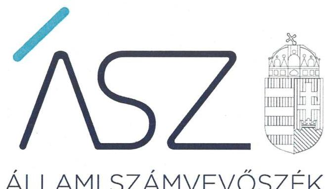
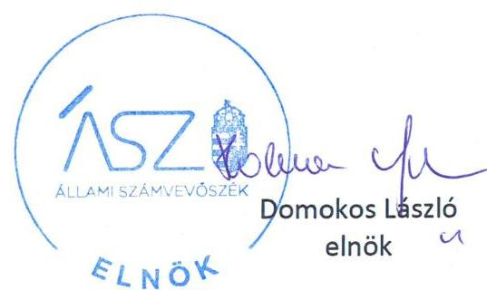

ÁLLAMI SZÁMVEVŐSZÉK

# JELENTÉS 

Nemzeti tulajdonú gazdasági társaságok ellenőrzése

Harkányi Gyógyfürdő Zártkörűen Működő Részvénytársaság
2020.

20185
www.asz.hu

---

ÁLLAMI SZÁMVEVŐSZÉK

# JELENTÉS

Nemzeti tulajdonú gazdasági társaságok ellenőrzése

Harkányi Gyógyfürdő Zártkörűen Működő Részvénytársaság

2020. 09. hó 18. nap

20185
www.asz.hu

---

# AZ ELLENŐRZÉST FELÜGYELTE: 

KLINGA LÁSZLÓ felügyeleti vezető

## AZ ELLENŐRZÉST VEZETTE ÉS A VÉGREHAJTÁSÁÉRT FELELŐS:

DR. GÁL NÓRA ellenőrzésvezető

## A PROGRAM ÖSSZEÁLLÍTÁSÁÉRT FELELŐS:

TÓTPÁL SZABOLCS osztályvezető
FEKETE-NAGY ANDRÁS GÁBOR ellenőrzési program készítéséért felelős vezető

IKTATÓSZÁM: EL-2841-001/2020
Jelentéseink az Országgyúlés számítógépes hálózatán és az interneten a www.asz.hu címen is olvashatóak.

TÉMASZÁM: 2513
ELLENŐRZÉS-AZONOSÍTÓ SZÁM: V082232; V085707

---

# TARTALOMJEGYZÉK 

■ ÖSSZEGZÉS ..... 5
■ AZ ELLENŐRZÉS CÉLJA ..... 6
■ AZ ELLENŐRZÉS TERÜLETE ..... 7
■ AZ ELLENŐRZÉS HÁTTERE, INDOKOLTSÁGA ..... 8
■ A JELENTÉS LÉNYEGES KÉRDÉSKÖREI ..... 9
■ AZ ELLENŐRZÉS HATÓKÖRE ÉS MÓDSZEREI ..... 10
■ MEGÁLLAPÍTÁSOK ..... 12
■ JAVASLATOK ..... 14
■ MELLÉKLETEK ..... 15
I. sz. melléklet: Értelmező szótár ..... 15
■ FÜGGELÉK: ÉSZREVÉTELEK ..... 17
■ RÖVIDÍTÉSEK JEGYZÉKE ..... 21

---

.

---

# ÖSSZEGZÉS 

A Harkányi Gyógyfürdő Zrt. felett tulajdonosi jogokat gyakorló Harkány Város Önkormányzata tulajdonosi joggyakorlása a 2017-2018. években szabályszerű volt. A Társaságnál a 2015-2018. években nem biztosították a vagyongazdálkodás elszámoltathatóságát.

## Az ellenőrzés társadalmi indokoltsága

Az Állami Számvevőszék kiemelt célja, hogy a helyi önkormányzatok gazdálkodásában rejlő pénzügyi kockázatok feltárásával, az államháztartáson kívülre nyújtott költségvetési támogatások és ingyenes vagyonjuttatások, valamint az államháztartáson kívül működő feladat-ellátó rendszerek ellenőrzéseivel hozzájáruljon ahhoz, hogy a közpénzeket az államháztartáson kívül működő szervezetek is átlátható, rendezett módon használják fel.

Magyarországon az önkormányzatok kötelező és önként vállalt feladataik vonatkozásában is egyre szélesebb körben alkalmazzák a költségvetésen kívüli feladatellátást, ezáltal az önkormányzati tulajdonú gazdasági társaságok is kiemelt fontosságú szerephez jutottak.

Az állam és a helyi önkormányzatok tulajdona nemzeti vagyon, melynek megőrzése érdekében kiemelten fontos a nemzeti tulajdonú gazdasági társaságok ellenőrzése. Ellenőrzésüket további társadalmi elvárás is indokolja, részben a gazdálkodásuk körébe tartozó vagyon nagysága, részben az általuk ellátott közszolgáltatások, sajátos feladatellátások, mivel tevékenységükön keresztül a lakosság széles köre kerül kapcsolatba a társaságokkal.

Az Állami Számvevőszék céljaival és a társadalmi igénnyel összhangban, a gazdasági társaságok kiemelt fontosságú szerepe miatt került sor a Harkányi Gyógyfürdő Zrt. vagyongazdálkodásának, illetve Harkány Város Önkormányzata tulajdonosi joggyakorlásának ellenőrzésére.

## Főbb megállapítások, következtetések, javaslatok

Harkány Város Önkormányzata a tulajdonosi joggyakorlás kereteit kialakította, a tulajdonosi joggyakorlása a 2017-2018. években szabályszerű volt.

A Harkányi Gyógyfürdő Zrt. vagyongazdálkodása nem volt szabályszerű, a 2015-2018. években mérlege alátámasztásához nem készített a jogszabályi előírásoknak megfelelő leltárt. A 2015-2018. évekre vonatkozóan a Társaság beszámoló készítési kötelezettségének nem tett eleget. A Társaság nem biztosította a vagyonmegőrzés és a vagyonnal történő elszámolás feltételét.

A fentiek következtében a vezető tisztségviselő tevékenysége a 2018. évben nem volt megfelelő, mivel nem biztosította a társaság gazdálkodásának átlátható működését és annak alapfeltételeit.

Az Állami Számvevőszék a jelentésben foglalt megállapítások alapján a Harkányi Gyógyfürdő Zrt. elnök-igazgatójának három javaslatot fogalmazott meg.

---

# AZ ELLENŐRZÉS CÉLJA 

AZ ELLENŐRZÉS CÉLJA annak megállapítása, hogy a tulajdonosi joggyakorló a gazdasági társaságai feletti tulajdonosi joggyakorlás kereteit kialakította-e, tulajdonosi jogait megfelelően gyakorolta-e és kötelezettségeit teljesítette-e. A gazdasági társaság biztosította-e a vagyon védelmét a nyilvántartások szabályszerű vezetése és a mérleg tételeinek leltárral történő alátámasztása útján, valamint szabályszerűen gondoskodott-e a társaság használatában, kezelésében lévő nemzeti vagyon értékének megőrzéséről, gyarapításáról, hasznosításáról.

A „jól irányított állam" megteremtésének céljaival összhangban van, hogy olyan vezetői teljesítményértékelési rendszer kerüljön kialakításra és működtetésre, amely hozzájárul a szervezeti teljesítmény növeléséhez, a fejlődési lehetőségek kihasználásához. Az ÁSZ a rendszer kiépítésében vállalt aktív ellenőrzési, értékelési tevékenységével kíván hozzájárulni a „jól irányított állam" megteremtéséhez.

---

# **AZ ELLENŐRZÉS TERÜLETE**

## **Harkány Város Önkormányzata, valamint a többségi tulajdonában lévő Harkányi Gyógyfürdő Zrt.**

A Társaság1 1997. január 1-én a Harkányi Fürdő Vállalat jogutódjaként, átalakulással jött létre. A Társaság jegyzett tőkéje az ellenőrzött időszakban nem változott, 884 millió forint volt.

A Társaság – mely az Önkormányzat2 99,94%-os többségi tulajdonában állt – látta el a gyógyfürdő üzemeltetés közfeladatot, mint az Önkormányzat önként vállalt feladatát.

A Társaság fő tevékenysége – mint egyéb humán-egészségügyi ellátás – a gyógyfürdő üzemeltetés volt. További ellátott tevékenységei: a strandfürdő működtetése, a gyógyászati, természetgyógyászati tevékenység, a gyógyvíz másodlagos hasznosítása (hévíz értékesítés, hőtermelés), valamint a vendéglátáshoz kapcsolódó bérbeadás. A Társaság által működtetett gyógyfürdő területén több mint 7500 m2 vízfelület állt a látogatók rendelkezésére, melyből 2098 m2 gyógymedence volt.

A Társaság a tevékenységét saját tulajdonában lévő, valamint az Önkormányzattól üzemeltetésre átvett eszközökkel látta el, vagyonkezelésbe kapott vagyonnal nem rendelkezett.

A Társaság vezetését egy fő vezérigazgató látta el 2016. november 25-ig, majd három fős igazgatóság létrehozásáról döntött a Társaság legfőbb szerve3. A tulajdonosi ellenőrzést öt fős Felügyelő Bizottság látta el. Kijelölt könyvvizsgálóval a Társaság 2015-2018. között rendelkezett, a könyvvizsgáló személye 2017-ben változott. Az ellenőrzött időszakban a polgármester és a jegyző személyében nem történt változás.

---

# AZ ELLENŐRZÉS HÁTTERE, INDOKOLTSÁGA 

Az Alaptörvény ${ }^{4}$ 38. cikke alapján az állam és a helyi önkormányzatok tulajdona nemzeti vagyon. A nemzeti vagyon megőrzése, megóvása érdekében kiemelten fontos ezen nemzeti tulajdonú gazdasági társaságok ellenőrzése. Gazdálkodásuk jellemzően a közérdeklődés és a média figyelmének középpontjában áll, amihez hozzájárul a gazdálkodásuk körébe tartozó - a nemzeti vagyon részét képező - vagyon nagysága, illetve az általuk ellátott közszolgáltatások minősége és hatékonysága.

Ellenőrzéseink feltárhatják, hogy a tulajdonosi felügyelet hozzájárult-e a szabályszerű gazdálkodáshoz és feladatellátáshoz. A megállapítások alapján megfogalmazott számvevőszéki javaslatok hasznosítása elősegítheti a meglévő hibák megszüntetését. A jó gyakorlatok bemutatásával az ÁSZ ${ }^{5}$ hozzájárulhat a követendő megoldások megismertetéséhez, terjesztéséhez.

Az ellenőrzés eredményeként továbbá meghatározhatóvá válnak a szervezet vagyongazdálkodást érintő kockázatai, ezzel lehetővé téve a kockázatok csökkentését. A megállapítások alapján megfogalmazott számvevőszéki javaslatok hasznosítása elősegítheti a meglévő hibák megszüntetését. A jó gyakorlatok bemutatásával az ÁSZ hozzájárulhat a követendő megoldások megismertetéséhez, terjesztéséhez.

---

# A JELENTÉS LÉNYEGES KÉRDÉSKÖREI 

1. A gazdasági társaság feletti tulajdonosi joggyakorlás megfelel-e a jogszabályi és a belső előírásoknak?
2. A gazdasági társaság vagyongazdálkodási tevékenysége szabályszerű volt-e?
3. A vezető tevékenysége megfelelő volt-e?

---

# AZ ELLENŐRZÉS HATÓKÖRE ÉS MÓDSZEREI 

## Az ellenőrzés típusa

Megfelelőségi ellenőrzés.

## Az ellenőrzött időszak

A tulajdonosi joggyakorlás vonatkozásában az ellenőrzött időszak a 2017-2018. év, az éves beszámolók elfogadása és a vagyonkezelésbe adott vagyonnal való gazdálkodás tulajdonosi ellenőrzése kivételével, amelyeknél az ellenőrzött időszak 2015-2018. évek.
A Társaság vagyongazdálkodása vonatkozásában az ellenőrzött időszak 2015-2018. évek.

A vezetői teljesítmény értékelése tekintetében az ellenőrzött időszak a 2018. év.

## Az ellenőrzés tárgya

Az önkormányzati tulajdonban (résztulajdonban) lévő gazdasági társaság feletti tulajdonosi joggyakorlás kialakítása és működtetése.

Az önkormányzati tulajdonban (résztulajdonban) lévő gazdasági társaság vagyongazdálkodása keretében a társaság használatában, kezelésében lévő nemzeti vagyon, illetve a saját vagyon tekintetében a vagyonnyilvántartások vezetése, leltára. A társaság használatában, vagyonkezelésében lévő nemzeti vagyon tekintetében a vagyon értékének megőrzése, gyarapítása, hasznosítása.

## Az ellenőrzött szervezet

Harkány Város Önkormányzata, Harkányi Gyógyfürdő Zártkörűen Működő Részvénytársaság

## Az ellenőrzés jogalapja

Az ellenőrzés jogalapját az ÁSZ tv ${ }^{6}$. 1. § (3) bekezdése, 5. § (3)-(5) bekezdései képezik.

---

# Az ellenőrzés módszerei 

Az ellenőrzést az ellenőrzési program ellenőrzési kérdései, az ellenőrzött időszakban hatályos jogszabályok, az ellenőrzés szakmai szabályok és módszertanok alapján, a nemzetközi standardok figyelembe vételével végeztük.

Az ÁSZ az ellenőrzés ideje alatt az ellenőrzött szervezettel történő kapcsolattartást az ÁSZ Szervezeti és Működési Szabályzatának vonatkozó előírásai alapján biztosította.

Az ellenőrzési kérdések megválaszolásához szükséges bizonyítékok megszerzése a Társaság vagyongazdálkodása vonatkozásában a következő ellenőrzési eljárások alkalmazásával történt: megfigyelés, információkérés, összehasonlítás, elemző eljárás. Az ellenőrzési bizonyítékként felhasználható adatforrások közé tartoznak az ellenőrzési programban felsorolt adatforrások, továbbá minden - az ellenőrzés folyamán - feltárt, az ellenőrzés szempontjából információkat tartalmazó dokumentum.

A tulajdonosi joggyakorlás vonatkozásában az ÁSZ a tulajdonosi joggyakorlás kereteinek kialakítását, a tulajdonosi joggyakorló felügyelő bizottság és független könyvvizsgáló működéséhez kapcsolódó tevékenységét ellenőrizte. Ellenőrzésre került továbbá a tulajdonosi joggyakorló éves beszámoló elfogadására vonatkozó döntéshozatalban történő részvétele.

A vezetői teljesítmény ellenőrzési szempontjait a szabályszerűségi szempontok szerinti ellenőrzésben a jogszabályi előírások, belső utasítások, belső szabályozók, a tulajdonosi joggyakorlók elvárásai, előírásai, a helyénvalósági szempontok szerinti ellenőrzésben az ÁSZ által általánosan elfogadott, jó gyakorlat szerinti ajánlásai, értékelési kritériumai mentén kerültek meghatározásra. Az ellenőrzési kérdések szerint az összesített értékelés alapján az elért pontok az elérhető pontok minimum 70 %-át elérve, a társaság vezetője tevékenységét megfelelőnek, 70 % alatt nem megfelelőnek tekintette az ÁSZ.

Az ÁSZ az ellenőrzést a kérdésekre adott válaszok kiértékelésével, valamint a megjelölt adatforrások, a csatolt tanúsítványok felhasználásával, továbbá az adott időszakban hatályos jogszabályok figyelembe vételével folytatta le.

---

# 1. A gazdasági társaság feletti tulajdonosi joggyakorlás megfelel-e a jogszabályi és a belső előírásoknak? 

Összegző megállapítás A Társaság feletti tulajdonosi joggyakorlás szabályszerű volt.
A TULAJDONOSI JOGGYAKORLÁS KERETEIT az Önkormányzat az SZMSZ ${ }^{7}$-ben, a Vagyonrendeletben ${ }^{8}$, valamint a Társaság Alapszabályában ${ }^{9}$ a Ptk. ${ }^{10}$ és az Mötv ${ }^{11}$ előírásaival összhangban kialakította.

Az Önkormányzat a Társaság feletti tulajdonosi (részvényesi) jogai meghatározott részének gyakorlását szabályszerűen, az Mötv. előírásaival összhangban adta át a Polgármesternek.

A Társaság legfőbb szerve a Taktv. ${ }^{12}$ előírásaival összhangban alkotta meg a vezető tisztségviselők, a felügyelőbizottsági tagok, az Mt. 208. §-ának hatálya alá eső munkavállalók javadalmazásáról, valamint a jogviszony megszűnése esetére biztosított juttatások módjának, mértékének elveiről, annak rendszeréről szóló szabályzatot. A 2017. évi prémium kifizetés esetében a szabályzat előírásait betartották.

Az Önkormányzat a tulajdonosi jogai érvényesítése érdekében a Bkr. ${ }^{13}$ ben foglaltaknak megfelelően kialakította - a Társaságra vonatkozóan - a szervezet tevékenységének, a célok megvalósításának nyomon követését biztosító rendszerét.

A FELÜGYELŐBIZOTTSÁG rendelkezett ügyrenddel, összhangban a Ptk. előírásával. A Felügyelőbizottság az Alapszabályban ${ }_{1,2}$ és a Ptk-ban foglaltak szerint végezte a tevékenységét.

A tulajdonosi joggyakorló a Társaságot a 2015., 2016., 2017. és 2018. években beszámoltatta a tevékenységéről.

## 2. A gazdasági társaság vagyongazdálkodási tevékenysége szabályszerű volt-e?

Összegző megállapítás A Társaság vagyongazdálkodása a 2015-2018. években nem volt szabályszerű.

A VAGYONHOZ KAPCSOLÓDÓ NYILVÁNTARTÁ-
SOK vezetésének kereteit a Társaság kialakította, az SZMSZ ${ }_{1,2},{ }^{14}$-ben, az Ügyrendben ${ }^{15}$, a Létesítménygazdálkodási szabályzatban ${ }^{16}$ és a Számviteli politikában ${ }_{1,2}{ }^{17}$ meghatározták a vagyongazdálkodással kapcsolatos feladat- és hatásköröket, felelősségi viszonyokat.

---

# LELTÁRKÉSZÍTÉSI ÉS LELTÁROZÁSI SZABÁLY- 

ZATTAL a Társaság rendelkezett az ellenőrzött időszakban, azonban a szabályzatban a Számv. tv. 69.§ (3) bekezdésében foglaltakat megsértve nem legalább három évenkénti, hanem öt évenkénti mennyiségi leltározást írt elő.

A MÉRLEG TÉTELEINEK ALÁTÁMASZTÁSÁHOZ a Társaság a Számv. tv. 69. § (1) bekezdésének előírása ellenére 2015-2018. évekre vonatkozóan nem állított össze leltárt.

BESZÁMOLÓ KÉSZÍTÉSI KÖTELEZETTSÉGÉNEK a Társaság a Számv. tv. 4. § (1) bekezdésének előírása ellenére a 2015-2018. években nem tett eleget.

## 3. A vezető tevékenysége megfelelő volt-e?

Összegző megállapítás A vezető tisztségviselő tevékenysége a 2018. évben nem volt megfelelő.

A VEZETŐ TISZTSÉGVISELŐ TEVÉKENYSÉGE a 2018. évben nem volt megfelelő, mivel nem
 gondoskodott a Számv. tv-ben előírt leltár és a beszámoló elkészítéséről.

---

# JAVASLATOK 

Az ÁSZ tv. 33. § (1) bekezdésében foglaltak értelmében az ellenőrzött szervezet vezetője köteles a jelentésben foglalt megállapításokhoz kapcsolódó intézkedési tervet összeállítani és azt a jelentés kézhezvételétől számított 30 napon belül az ÁSZ részére megküldeni. Amennyiben az ellenőrzött szervezet vezetője nem küldi meg határidőben az intézkedési tervet, vagy továbbra sem elfogadható intézkedési tervet küld, az Állami Számvevőszék elnöke az ÁSZ tv. 33. § (3) bekezdése a) és b) pontjaiban foglaltakat érvényesítheti.

## Harkányi Gyógyfürdő Zártkörűen Működő Részvénytársaság elnök-igazgatójának

1. Intézkedjen, hogy a leltárkészítési és leltározási szabályzatban a mennyiségi leltározás gyakoriságát a Számv. tv. előírásainak megfelelően határozzák meg.
(2. sz. megállapítás 2. bekezdés 2. tagmondata alapján)
2. Gondoskodjon a Számv. tv. előírásai szerint a beszámoló mérleg tételeinek leltárral való alátámasztásáról.
(2. sz. megállapítás 3. bekezdés 1. mondata alapján)
3. Gondoskodjon a beszámoló készítési kötelezettség Számv. tv.-ben előírtak szerinti teljesítéséről.
(2. sz. megállapítás 4. bekezdése alapján)

---

# MELLÉKLETEK 

- I. SZ. MELLÉKLET: ÉRTELMEZŐ SZÓTÁR
gazdasági társaság
közszolgáltatás
közfeladat
nemzeti vagyon
tulajdonosi jogok gyakorlója
vagyongazdálkodás

Ptk. 3:88. § (1) bekezdése szerint „a gazdasági társaságok üzletszerű közös gazdasági tevékenység folytatására, a tagok vagyoni hozzájárulásával létrehozott, jogi személyiséggel rendelkező vállalkozások, amelyekben a tagok a nyereségből közösen részesednek, és a veszteséget közösen viselik".
Az Ebktv. ${ }^{18}$ 3. § d) pontja a következőképpen határozza meg a közszolgáltatást: „szerződéskötési kötelezettség alapján a lakosság alapvető szükségleteinek ellátására irányuló szolgáltatás, így különösen a villamos energia-, gáz-, hő-, víz-, szennyvíz- és hulladékkezelési, köztisztasági, postai és távközlési szolgáltatás, továbbá a menetrend alapján közlekedő járművekkel végzett közforgalmú személyszállítás".
Az Áht. 3/A. § (1) bekezdése alapján közfeladat a jogszabályban meghatározott állami vagy önkormányzati feladat
Nvtv. 1. § (2) bekezdése szerint nemzeti vagyonba tartozik többek között:
„az állam vagy a helyi önkormányzat kizárólagos tulajdonában álló dolgok,
az a) pont hatálya alá nem tartozó, állam vagy a helyi önkormányzat tulajdonában lévő dolog,
az állam vagy a helyi önkormányzat tulajdonában lévő pénzügyi eszközök, továbbá az államot vagy a helyi önkormányzatot megillető társasági részesedések,
az államot vagy a helyi önkormányzatot megillető bármely vagyoni értékkel rendelkező jogosultság, amelyet jogszabály vagyoni értékű jogként nevesít
Aki a nemzeti vagyon felett az államot vagy a helyi önkormányzatot megillető tulajdonosi jogok és kötelezettségek összességének gyakorlására jogosult. (Forrás: Nvtv. 3. § (1) bekezdés 17. pontja)
A nemzeti vagyongazdálkodás feladata a nemzeti vagyon rendeltetésének megfelelő, az állam, az önkormányzat mindenkori teherbíró képességéhez igazodó, elsődlegesen a közfeladatok ellátásához és a mindenkori társadalmi szükségletek kielégítéséhez szükséges, egységes elveken alapuló, átlátható, hatékony és költségtakarékos működtetése, értékének megőrzése, állagának védelme, értéknövelő használata, hasznosítása, gyarapítása, továbbá az állam vagy a helyi önkormányzat feladatának ellátása szempontjából feleslegessé váló vagyontárgyak elidegenítése. (Forrás: Nvtv. 7. § (2) bekezdése).

---

.

---

# FÜGGELÉK: ÉSZREVÉTELEK 

A jelentéstervezetet a Számvevőszék 15 napos észrevételezésre megküldte az ellenőrzött szervezetek vezetőinek az ÁSZ tv. 29. § (1) bekezdése előírásának megfelelően.

Harkány Város Önkormányzatának polgármestere a jelentéstervezetre nem tett észrevételt. A Harkányi Gyógyfürdő Zártkörűen Működő Részvénytársaság elnök-igazgatója a jelentéstervezet megállapításaira írásban észrevételt tett.
Az ÁSZ tv. 29. § (3) bekezdésével összhangban az Állami Számvevőszék a Függelékben feltünteti az ellenőrzés megállapításaival kapcsolatban tett, figyelembe nem vett észrevételeket, és megindokolja, hogy azokat miért nem fogadta el.

[^0]
[^0]:    * 29. § (1) Az Állami Számvevőszék az ellenőrzési megállapításait megküldi az ellenőrzött szervezet vezetőjének vagy az általa megbízott személynek, és annak, akinek személyes felelősségét állapította meg.
    (2) Az ellenőrzött szervezet vezetője és a felelősként megjelölt személy az ellenőrzés megállapításaira tizenöt napon belül írásban észrevételt tehet.
    (3) Az Állami Számvevőszék az észrevételre a beérkezésétől számított harminc napon belül írásban válaszol. A figyelembe nem vett észrevételeket köteles a jelentésben feltüntetni, és megindokolni, hogy azokat miért nem fogadta el.

---

# A Harkányi Gyógyfürdő Zártkörűen Működő Részvénytársaság elnök-igazgatója által a 2020. augusztus 04-én kelt levélben tett észrevételek és azok kezelésének indokolása: 

## 1. A jelentéstervezet Főbb megállapítások, következtetések rész 2-3. bekezdésére, valamint a Megállapítások rész 3. számú megállapítására vonatkozó észrevétel

Az elnök-igazgató észrevételében leírta, hogy a Társaság nem ért egyet a jelentéstervezet azon megállapításaival, miszerint a Társaság vagyongazdálkodása nem volt szabályszerű, a 2015-18 években mérlege alátámasztásához nem készített a jogszabályi előírásoknak megfelelő leltárt, a Társaság a 2015-2018. évekre vonatkozóan beszámolási kötelezettségének nem tett eleget, nem biztosította a vagyonmegőrzés és a vagyonnal való elszámolás feltételeit. Az elnök-igazgató észrevétele szerint a fenti kötelezettségeinek a Társaság a jogszabályi előírásoknak megfelelően a vizsgált időszakban is folyamatosan és hiánytalanul eleget tett.

Az Állami Számvevőszék (továbbiakban: ÁSZ) EL-0979-003/2018. iktatószámú levele 2. számú melléklet 2. pontjában kerültek bekérésre a Harkányi Gyógyfürdő Zártkörűen Működő Részvénytársaság (továbbiakban: Társaság) mérlegtételeit alátámasztó 2015., 2016., 2017. évre vonatkozó leltárak. Az adatszolgáltatás teljesítése során a Társaság által beküldött dokumentumok (főkönyvi számonkénti összesítők, kimutatások) nem támasztják alá a leltározás tényleges megtörténtét, a leltár megnevezését, a leltár forduló napját, a leltárfelvétel helyét és időpontját, leltárfelvevők nevét és aláírását nem tartalmazzák.

Az ÁSZ EL-2107-002/2019. iktatószámú levelében (3A melléklet 2. pont) a 2018. évi beszámolót alátámasztó leltárak bekérésére került sor. A kapcsolódó adatszolgáltatás során a Társaság által rendelkezésre bocsátott dokumentumok (leltárak, nyilvántartások, kimutatások) a leltárfelvétel helyét és időpontját, leltárfelvevők nevét és aláírását nem tartalmazzák, nem támasztják alá a leltározás tényleges megtörténtét. Az ismételten megküldött 2016. és 2017. évi beszámolót alátámasztó leltár dokumentumok megegyeznek a fenti, az ÁSZ EL-0979-003/2018. iktatószámú levelével kapcsolatos adatszolgáltatás során megküldött dokumentumokkal.

A Társaság 2015-2017. évi számviteli beszámolói az ÁSZ EL-0979-003/2018. iktatószámú levele 2. számú melléklet 3. pontjában kerültek bekérésre. Az adatszolgáltatás teljesítése során feltöltött dokumentumok a számvitelről szóló 2000. évi C. törvény 20. § (6) bekezdésében előírtakkal ellentétben nem tartalmazták a vállalkozó képviseletére jogosult személy aláírását.

Az ÁSZ EL-2107-002/2019. iktatószámú levele 3C számú melléklet 2. pontjában kérte a 2018. évi számviteli beszámoló megküldését. Az adatszolgáltatás teljesítése során a Társaság 2015-2017. évi - a vállalkozó képviseletére jogosult aláírását nem tartalmazó - beszámolókat küldött az ÁSZ részére, 2018. évi beszámolót nem bocsátott az ellenőrzés rendelkezésére.

Elnök-igazgató észrevételében hivatkozott ÁSZ EL-2107-003/2019 iktatószámú adatbekérő levél 2B melléklet 5. pontjában az ügyvezetés és a felügyelőbizottság részére megküldött, az üzleti terv teljesüléséről szóló beszámolók, tájékoztatók kerültek bekérésre. A Társaság az adatszolgáltatás részeként 2018. évi beszámolót is rendelkezésre bocsátott, mely azonban a vállalkozó képviseletére jogosult személy aláírását nem tartalmazta.

Az ÁSZ a vezetői teljesítményt minősítő megállapítását az EL-2107-003/2019. iktatószámú adatbekérő levél 2.B mellékletében bekért és megküldött dokumentumok kiértékelése alapján tette meg. Az ÁSZ ellenőrzés a 2015-2018. évi beszámolók Képviselő-testület általi elfogadását nem kifogásolta, azzal összefüggésben az 1. megállapítás utolsó bekezdésében megállapítást tett.

Az ÁSZ az ellenőrzési megállapításait az egyéb ellenőrzést végző szervek ellenőrzési megállapításaitól függetlenül, kizárólag az ÁSZ tv. 28. § (2) bekezdésben meghatározott adatszolgáltatási időszakon belül megküldött, teljességi és hitelességi nyilatkozattal alátámasztott dokumentumokra alapozva teszi. Az ÁSZ részére átadott dokumentumok, adatok hitelességéért, valódiságáért, hiánytalanságáért és hatályosságáért 2018. augusztus 23-án, 2018. december 18-án, 2019. január 11-én, 2019. december 02-án és 2020. január 29-én kelt teljességi és hitelességi nyilatkozatokban teljes felelősséget vállaltak.

---

Az ellenőrzött időszakot követő intézkedésre vonatkozó tájékoztatás a jelentéstervezet megállapítását nem befolyásolja. A számvevőszéki jelentésekben foglalt megállapításokhoz kapcsolódó intézkedéseit az Állami Számvevőszékről szóló 2011. évi LXVI. törvény 33. § (1) bekezdése szerinti intézkedési tervében szerepeltetheti.

A fentiekre tekintettel a jelentéstervezet megállapítása helytálló, módosítása nem indokolt.

---

.

---

# RÖVIDÍTÉSEK JEGYZÉKE 

${ }^{1}$ Társaság
${ }^{2}$ Önkormányzat
${ }^{3}$ Legfőbb szerv
${ }^{4}$ Alaptörvény
${ }^{5}$ ÁSZ
${ }^{6}$ Ász tv.
${ }^{7}$ SZMSZ
${ }^{8}$ Vagyonrendelet
${ }^{9}$ Alapszabály
${ }^{10}$ Ptk
${ }^{11}$ Mötv
${ }^{12}$ Tak. tv.
${ }^{13}$ Bkr.
${ }^{14} \mathrm{SZMSZ}_{1,2}$.
${ }^{15}$ Ügyrend
${ }^{16}$ Létesítménygazdálkodási szabályzat
${ }^{17}$ Számviteli Politika ${ }_{1,2}$
${ }^{18}$ Ebktv.

Harkányi Gyógyfürdő Zártkörűen Működő Részvénytársaság
Harkány Város Önkormányzata
a Harkányi Gyógyfürdő Zrt. a Ptk. 3:268.§ (1) bekezdése szerinti Közgyűlése
Magyarország Alaptörvénye (2011. április 25.)
Állami Számvevőszék
2011. évi LXVI. törvény az Állami Számvevőszékről

Harkány Város Önkormányzat Képviselőtestületének 26/2016. (XII. 27.) rendelete a Szervezeti és Működési Szabályzatról
Harkány Város Önkormányzat Képviselőtestületének 20/2016. (X. 04.) rendelete Harkány Város Önkormányzatának vagyonáról, és a vagyontárgyak feletti tulajdonosi jogok gyakorlásáról
Harkányi Gyógyfürdő Zrt. Alapszabálya, módosításokkal egységes szerkezetbe foglalva.
a Polgári Törvénykönyvről szóló 2013. évi V. törvény
Magyarország helyi önkormányzatairól szóló 2011. évi CLXXXIX. tv.
A köztulajdonban álló gazdasági társaságok takarékosabb működéséről szóló 2009. évi CXXII. törvény

A költségvetési szervek belső kontrollrendszeréről és belső ellenőrzéséről szóló 370/2011. (XII. 31.) Korm. rendelet
Harkányi Gyógyfürdő Zrt. Szervezeti és Működési Szabályzata; SZMSZ ${ }_{1}$ hatályos:2013.05.29- 2017.12.29; SZMSZ ${ }_{2}$ hatályos:2017.12.29-től.
Harkányi Gyógyfürdő Zrt. Igazgatóságának Ügyrendje, hatályos: 2017. 01.20. napjától.
Harkányi Gyógyfürdő Zrt. Létesítménygazdálkodási szabályzata, hatályos: 2017. 03.09. napjától.

Harkányi Gyógyfürdő Zrt. Számviteli Politikája, Számviteli Politika ${ }_{1}$ hatályos: 2014.10.30.-2017.02.05.; Számviteli Politika ${ }_{2}$ hatályos: 2017. 02.06-től.
az egyenlő bánásmódról és az esélyegyenlőség előmozdításáról szóló 2003. évi CXXV. törvény

---

# ASZ 

ÁLLAMI SZÁMVEVŐSZÉK
1052 Budapest, Apáczai Cs. J. u. 10. I 1364 Budapest 4. Pf. 54 TEL: +36 14849100
email: szamvevoszek@asz.hu
web: www.asz.hu | www.aszhirportal.hu

