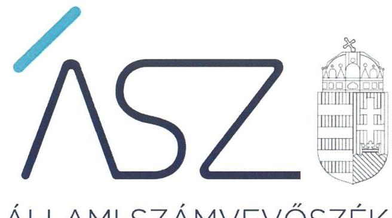
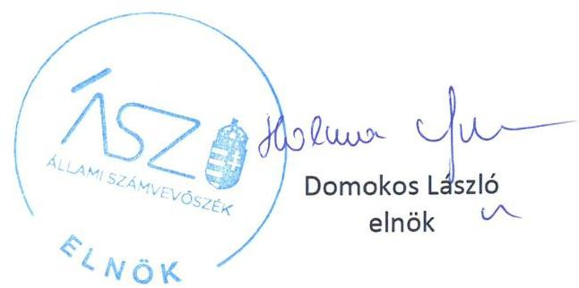

ÁLLAMI SZÁMVEVŐSZÉK

# JELENTÉS 

Nemzeti tulajdonú gazdasági társaságok ellenőrzése

Nyírbátori Városfejlesztő és Múködtető Kft.
2020.

20186
www.asz.hu

---

ÁLLAMI SZÁMVEVŐSZÉK

# JELENTÉS

Nemzeti tulajdonú gazdasági társaságok ellenőrzése

Nyírbátori Városfejlesztő és Működtető Kft.

2020.
09. hó 18. nap

20186
www.asz.hu

---

# AZ ELLENŐRZÉST FELÜGYELTE: 

KLINGA LÁSZLÓ felügyeleti vezető

## AZ ELLENŐRZÉST VEZETTE ÉS A VÉGREHAJTÁSÁÉRT FELELŐS:

SALAMIN VIKTOR ellenőrzésvezető

## A PROGRAM ÖSSZEÁLLÍTÁSÁÉRT FELELŐS:

FEKETE-NAGY ANDRÁS GÁBOR ellenőrzési program készítéséért felelős vezető

TÓTPÁL SZABOLCS osztályvezető

IKTATÓSZÁM: EL-2867-001/2020
Jelentéseink az Országgyúlés számítógépes hálózatán és az interneten a www.asz.hu címen is olvashatóak.

TÉMASZÁM: 2513
ELLENŐRZÉS-AZONOSÍTÓ SZÁM: V082276, V085719

---

# TARTALOMJEGYZÉK 

■ ÖSSZEGZÉS ..... 5
■ AZ ELLENŐRZÉS CÉLJA ..... 6
■ AZ ELLENŐRZÉS TERÜLETE ..... 7
■ AZ ELLENŐRZÉS HÁTTERE, INDOKOLTSÁGA ..... 8
■ A JELENTÉS LÉNYEGES KÉRDÉSKÖREI ..... 9
■ AZ ELLENŐRZÉS HATÓKÖRE ÉS MÓDSZEREI ..... 10
■ MEGÁLLAPÍTÁSOK ..... 13
■ JAVASLATOK ..... 15
■ MELLÉKLETEK ..... 17
I. sz. melléklet: Értelmező szótár ..... 17
■ FÜGGELÉK: ÉSZREVÉTELEK ..... 19
■ RÖVIDÍTÉSEK JEGYZÉKE ..... 21

---

.

---

# ÖSSZEGZÉS 

A Nyírbátori Városfejlesztő és Müködtető Kft. felett tulajdonosi jogokat gyakorló Nyírbátor Város Önkormányzata tulajdonosi joggyakorlása a 2017-2018. években szabályszerű volt. A Társaság vagyongazdálkodása a 2015-2018. években nem volt szabályszerű, ezért müködésének átláthatósága és elszámoltathatósága nem volt biztosított.

## Az ellenőrzés társadalmi indokoltsága

Az Állami Számvevőszék kiemelt célja, hogy a helyi önkormányzatok gazdálkodásában rejlő pénzügyi kockázatok feltárásával, az államháztartáson kívülre nyújtott költségvetési támogatások és ingyenes vagyonjuttatások, valamint az államháztartáson kívül múködő feladatellátó rendszerek ellenőrzéseivel hozzájáruljon ahhoz, hogy a közpénzeket az államháztartáson kívül múködő szervezetek is átlátható, rendezett módon használják fel.

A helyi önkormányzatok tulajdona nemzeti vagyon, melynek megőrzése érdekében kiemelten fontos a nemzeti tulajdonú gazdasági társaságok ellenőrzése. Ellenőrzésüket további társadalmi elvárás is indokolja, részben a gazdálkodásuk körébe tartozó vagyon nagysága, részben az általuk ellátott közszolgáltatások, sajátos feladatellátások, mivel tevékenységükön keresztül a lakosság széles köre kerül kapcsolatba a társaságokkal. A vezetői teljesítményértékelést érintő ellenőrzések lefolytatása a téma jellege, a vezetőknek a társaság múködése szempontjából meghatározó szerepe és a társadalmi érdeklődés miatt indokolt.

Az Állami Számvevőszék céljaival és a társadalmi igénnyel összhangban, a gazdasági társaságok kiemelt fontosságú szerepe miatt került sor a Nyírbátori Városfejlesztő és Múködtető Kft. vagyongazdálkodásának és vezető tisztségviselője teljesítményének, illetve Nyírbátor Város Önkormányzata tulajdonosi joggyakorlásának ellenőrzésére.

## Főbb megállapítások, következtetések, javaslatok

Nyírbátor Város Önkormányzata a tulajdonosi jogok gyakorlásának kereteit a 2017-2018. években a jogszabályi előírások szerint kialakította, a tulajdonosi joggyakorlás szabályszerű volt.

Nyírbátor Város polgármestere az ellenőrzött időszakot követően a feltárt hiányosságot felszámolta, intézkedett a Felügyelő bizottság ügyrendjének az Alapító által történő jóváhagyásáról.

A Nyírbátori Városfejlesztő és Múködtető Kft. vagyongazdálkodási tevékenysége nem volt szabályszerű. A Nyírbátori Városfejlesztő és Múködtető Kft. a mérleg tételeinek alátámasztásához a Számv. tv. előírása ellenére a 20152018. évekre vonatkozóan nem állított össze olyan leltárt, amely tételesen, ellenőrizhető módon tartalmazta a mérleg fordulónapján meglévő eszközöket és forrásokat mennyiségben és értékben. A Számv. tv. előírásainak megfelelő leltár hiányában a 2015-2018. évi éves beszámolók részét képező mérlegek nem voltak megalapozottak, a vagyon védelme nem volt biztosított.

Az Állami Számvevőszék a jelentésben foglalt megállapítások alapján a Nyírbátori Városfejlesztő és Múködtető Kft. ügyvezetőjének, valamint Nyírbátor Város Önkormányzata polgármestere részére egy-egy javaslatot fogalmazott meg.

---

# AZ ELLENŐRZÉS CÉLJA 

AZ ELLENŐRZÉS CÉLJA annak megállapítása, hogy a tulajdonosi joggyakorló a gazdasági társaságai feletti tulajdonosi joggyakorlás kereteit kialakította-e, tulajdonosi jogait megfelelően gyakorolta-e és kötelezettségeit teljesítette-e. Az ellenőrzés értékeli, hogy a gazdasági társaság biztosította-e a vagyon védelmét a nyilvántartások szabályszerű vezetése és a mérleg tételeinek leltárral történő alátámasztása útján, valamint szabályszerűen gondoskodott-e a használatában, kezelésében lévő nemzeti vagyon értékének megőrzéséről, gyarapításáról, hasznosításáról. Az ellenőrzés célja volt továbbá a Nyírbátori Városfejlesztő és Működtető Kft. vezetője tevékenységében rejlő kockázatok azonosítása az egyes vezetői feladatok ellátásával összhangban.

---

# **AZ ELLENŐRZÉS TERÜLETE**

## **Nyírbátor Város Önkormányzata és a kizárólagos tulajdonában lévő Nyírbátori Városfejlesztő és Működtető Korlátolt Felelősségű Társaság**

Nyírbátor Város Önkormányzata a Nyírbátori Városfejlesztő és Működtető Korlátolt Felelősségű Társaságot 2010-ben hozta létre a Sárkány Wellness Gyógy- és Strandfürdő, valamint a Kemping üzemeltetési feladatai ellátására. A Társaság1 feladatai Inkubátorház és Szolgáltató Központ, valamint Látogató Központ működtetési, lakás- és helyiséggazdálkodási, piacüzemeltetési, táv-hőszolgáltatási, hulladékszállítási, valamint kulturális, sport és közművelődési közfeladatokkal bővültek.

Az ellenőrzött időszakban a Társaság kizárólagos tulajdonosa az Önkormányzat2 volt. A tulajdonosi jogokat a Képviselőtestület3 gyakorolta. A Társaságnál három fő Felügyelő bizottság4 működött.

A Társaság jegyzett tőkéje 2015. december 31-én 20,0 M Ft, 2016. december 31-én 40,0 M Ft, 2018. év végén 10,0 M Ft volt. Az átlagos statisztikai állományi létszám a 2015. évi 35 főről 2018-ra 89 főre változott.

A Társaság az ellenőrzött időszakban vagyonkezelésbe vett vagyonnal nem rendelkezett, kormányzati szektorba sorolt egyéb szervezetnek nem minősült, más gazdasági társaságban részesedése nem volt. A Társaságnál – amely a 2015-2016. években a könyvvizsgálati kötelezettség alól a Számv. tv.5 alapján mentesült, 2017-től arra kötelezett volt – az ellenőrzött időszakban független könyvvizsgáló megválasztására sor került. A Társaság az Önkormányzat közfeladat ellátása érdekében használt önkormányzati tulajdonú eszközöket nem hasznosította tovább.

A Társaságnál 2015. január 1. és május 31. között egy, június 1-jétől kettő ügyvezető tevékenykedett, mindkét ügyvezető képviseleti módja önálló volt. Az ellenőrzött időszakban az ügyvezetők6 és a könyvvizsgáló7 személyében változás nem történt. Az Önkormányzatnál a polgármester8 személye nem, a jegyző9 személye 2018. december 1-jétől változott.

---

# AZ ELLENŐRZÉS HÁTTERE, INDOKOLTSÁGA 

Az Alaptörvény ${ }^{10}$ 38. cikke alapján az állam és a helyi önkormányzatok tulajdona nemzeti vagyon. A nemzeti vagyon megőrzése, megóvása érdekében kiemelten fontos ezen nemzeti tulajdonú gazdasági társaságok ellenőrzése. Gazdálkodásuk jellemzően a közérdeklődés és a média figyelmének középpontjában áll, amihez hozzájárul a gazdálkodásuk körébe tartozó - a nemzeti vagyon részét képező - vagyon nagysága, illetve az általuk ellátott közszolgáltatások minősége és hatékonysága. Ellenőrzéseink feltárhatják, hogy a tulajdonosi felügyelet hozzájárult-e a szabályszerű gazdálkodáshoz és feladatellátáshoz.

Az ellenőrzés eredményeként meghatározhatóvá válnak a szervezet vagyongazdálkodást érintő kockázatai, ezzel lehetővé téve a kockázatok csökkentését. A megállapítások alapján megfogalmazott számvevőszéki javaslatok hasznosítása elősegítheti a meglévő hibák megszüntetését. A jó gyakorlatok bemutatásával az ÁSZ ${ }^{11}$ hozzájárulhat a követendő megoldások megismertetéséhez, terjesztéséhez.

A Kormány „jól múködő állam" megteremtésével kapcsolatos céljaival összhangban van, hogy olyan vezetői teljesítményértékelési rendszer kerüljön kialakításra és múködtetésre, amely hozzájárul a szervezeti teljesítmény növeléséhez, a fejlődési lehetőségek kihasználásához. Az ÁSZ a rendszer kiépítésében vállalt aktív ellenőrzési, értékelési tevékenységével kíván hozzájárulni a „jól irányított állam" megteremtéséhez.

---

# A JELENTÉS LÉNYEGES KÉRDÉSKÖREI 

1. A Társaság feletti tulajdonosi joggyakorlás megfelelt-e a jogszabályi és belső előírásoknak?
2. A Társaság vagyongazdálkodási tevékenysége szabályszerü volt-e?

---

# AZ ELLENŐRZÉS HATÓKÖRE ÉS MÓDSZEREI 

## Az ellenőrzés típusa

Megfelelőségi ellenőrzés.

## Az ellenőrzött időszak

A tulajdonosi joggyakorlás vonatkozásában az ellenőrzött időszak a 20172018. évek, az éves beszámolók elfogadása kivételével, amelyeknél az ellenőrzött időszak 2015-2018. évek.

A Társaság vagyongazdálkodása vonatkozásában az ellenőrzött időszak 2015-2018. évek.

A vezetői teljesítmény ellenőrzése esetében az ellenőrzött időszak a 2018. év.

## Az ellenőrzés tárgya

Az önkormányzati tulajdonban lévő gazdasági társaság feletti tulajdonosi joggyakorlás kialakítása és múködtetése.

Önkormányzati tulajdonban lévő gazdasági társaság vagyongazdálkodása keretében a társaság használatában, kezelésében lévő nemzeti vagyon, illetve a saját vagyon tekintetében a vagyonnyilvántartások vezetése, leltára. A társaság használatában, vagyonkezelésében lévő nemzeti vagyon tekintetében a vagyon értékének megőrzése, gyarapítása, hasznosítása.

Az önkormányzati tulajdonban lévő gazdasági társaság vezetői teljesítményének értékelése. Az önkormányzati tulajdonban lévő gazdasági társaság átlátható, szabályszerű, gazdaságos, hatékony, eredményes és felelős gazdálkodásának feltételrendszere kialakítása, a belső kontrollrendszer és humánpolitikai rendszer múködtetése. Az integritásszemléletet érvényesítése, illetve a felelős vagyongazdálkodás biztosítása a nemzeti vagyon megőrzése és védelme érdekében.

## Az ellenőrzött szervezet

Nyírbátor Város Önkormányzata és a Nyírbátori Városfejlesztő és Múködtető Korlátolt Felelősségű Társaság.

## Az ellenőrzés jogalapja

Az ellenőrzés jogalapját az ÁSZ tv. ${ }^{12} 1 . \S$ (3) bekezdése és 5. § (3)-(5) bekezdései képezték.

---

# Az ellenőrzés módszerei 

Az ellenőrzést az ellenőrzési program ellenőrzési kérdései, az ellenőrzött időszakban hatályos jogszabályok, az ellenőrzés szakmai szabályok és módszertanok alapján, a nemzetközi standardok figyelembe vételével végeztük.

Az ellenőrzés ideje alatt az ellenőrzött szervezettel történő kapcsolattartást az ÁSZ SZMSZ-ének ${ }^{13}$ vonatkozó előírásai alapján biztosítottuk.
2017. január 1-től 2018. december 31-ig ellenőriztük a tulajdonosi joggyakorlás kereteinek kialakítását, a tulajdonosi joggyakorló tevékenységét a felügyelő bizottság és a független könyvvizsgáló működéséhez kapcsolódóan, valamint azt, hogy a tulajdonosi joggyakorló - amennyiben a gazdasági társaság feladatellátásához és vagyonkezeléséhez kapcsolódóan határozott meg követelményeket, elvárásokat - a nemzeti vagyon értékének megőrzése érdekében monitorozta-e azok teljesülését. 2015. január 1-től az ellenőrzés megkezdésének napjáig ellenőriztük a tulajdonosi joggyakorló részvételét az éves beszámoló elfogadására vonatkozó döntéshozatalban.

A gazdasági társaság vagyonhoz kapcsolódó nyilvántartásai vezetésének megfelelősége, valamint a nemzeti vagyon értéke megőrzésének, gyarapításának, hasznosításának szabályszerűsége 2015. és 2017-2018. évek tekintetében került ellenőrzésre. A 2015-2018. éveket érintően történt meg a lényeges dokumentumok értékelése.

A vagyonnyilvántartások és a leltár szabályszerűsége esetében az ellenőrzés azokra a legnagyobb értékű tételekre - a lényeges sokaságra terjedt ki, melyek összértéke eléri a teljes sokaság összértékének 50\%-át. A lényeges sokaságot tételesen ellenőriztük.

A vezetői teljesítmény ellenőrzési szempontjait a szabályszerűségi szempontok szerinti ellenőrzésben a jogszabályi előírások, belső utasítások, belső szabályozók, a tulajdonosi joggyakorlók elvárásai, előírásai, a helyénvalósági szempontok szerinti ellenőrzésben az ÁSZ által általánosan elfogadott, jó gyakorlat szerinti ajánlásai, értékelési kritériumai mentén kerültek meghatározásra. Az ellenőrzési kérdések szerint az összesített értékelés alapján az elért pontok az elérhető pontok minimum 70\%-át elérve, a társaság vezetője tevékenységét megfelelőnek, 70\% alatt nem megfelelőnek tekintette az ÁSZ.

Az ellenőrzési kérdések megválaszolásához szükséges bizonyítékok megszerzése a következő ellenőrzési eljárások alkalmazásával történt: megfigyelés, információkérés, összehasonlítás, lényeges sokaságból egyszerű véletlen mintavétel, valamint elemző eljárás. Az ellenőrzési bizonyítékként felhasználható adatforrások közé tartoztak az ellenőrzési programban felsorolt adatforrások, továbbá minden - az ellenőrzés folyamán - feltárt, az ellenőrzés szempontjából információkat tartalmazó dokumentum.

Az ellenőrzést a kérdésekre adott válaszok kiértékelésével, valamint a megjelölt adatforrások, a csatolt tanúsítványok felhasználásával, továbbá az adott időszakban hatályos jogszabályok figyelembe vételével folytattuk le.

Amennyiben a Társaság működését és gazdálkodását alapvetően meghatározó dokumentum hiánya miatt, valamely lényeges kérdéskörre vonatkozóan az ÁSZ megállapítást tett, további ellenőrzési tevékenységek az

---

adott kérdéskörrel és az azzal szoros logikai kapcsolatban lévő kérdéskörökkel - ráépülő jelleggel - nem kerültek végrehajtásra.

---

# 1. A Társaság feletti tulajdonosi joggyakorlás megfelelt-e a jogszabályi és belső előírásoknak? 

Összegző megállapítás

Az Önkormányzat tulajdonosi joggyakorlása a 2017-2018. években szabályszerű volt.

A TULAJDONOSI JOGOK GYAKORLÁSÁNAK RENDJÉT a Társaság felett az Önkormányzat az Alapító okirat ${ }^{14}$-ban, az SZMSZ ${ }^{15}$-ben és a vagyonrendeletben ${ }^{16}$ kialakította.

Az Alapító ${ }^{17}$ a Taktv. ${ }^{18}$ 5. § (3) bekezdésének előírása szerint megalkotta a vezető tisztségviselők, a felügyelő bizottsági tagok, az Mt. ${ }^{19}$ 208. §-ának hatálya alá eső munkavállalók javadalmazásáról, valamint a jogviszony megszűnése esetére biztosított juttatások módjának, mértékének elveiről, annak rendszeréről szóló szabályzatot.

Az Alapító a Társaság ügyvezetésének ellenőrzésére három tagból álló Felügyelő bizottságot hozott létre a Ptk. ${ }^{20}$ és a Taktv. előírásával összhangban. A Felügyelő bizottság az Alapító által jóváhagyott ügyrenddel a Ptk. 3:122. § (3) bekezdésének előírása ellenére nem rendelkezett.

Az Önkormányzat - a Bkr. ${ }^{21}$ 10. § szerinti - a szervezet tevékenységének, a célok megvalósításának nyomon követését biztosító rendszert kialakította.

A SZÁMVITELI BESZÁMOLÓT az Alapító a jogszabályi előírások szerint jóváhagyta, az eredmény felosztásáról döntött. A döntéshez a Felügyelő bizottság és a könyvvizsgáló jelentése rendelkezésre állt.

A Társaság 2016-ban gazdálkodását veszteséggel zárta, melynek következtében a saját tőke a jegyzett tőke fele alá csökkent. A könyvvizsgáló - a kialakult tőkehelyzetre tekintettel - figyelemfelhívással élt. Az Alapító a tőkehelyzet rendezése érdekében 2017. május 31-én - a Ptk.-ban foglaltak szerint - döntött a törzstőke 30,0 M Ft-tal történő leszállításáról.

Az Önkormányzat a Társaság feladatellátásához kapcsolódóan meghatározott követelmények teljesülését monitorozta. A Társaság üzleti terveit, szakmai beszámolóit jóváhagyta. Az Önkormányzat belső ellenőrzése a Társaságot az ellenőrzött időszakban többször ellenőrizte.

---

# 2. A Társaság vagyongazdálkodási tevékenysége szabályszerű volt-e? 

Összegző megállapítás

A Társaság vagyongazdálkodási tevékenysége a 2015-2018. években nem volt szabályszerű.

A VAGYONGAZDÁLKODÁSI TEVÉKENYSÉG FELTÉTELEIT a Társaság a 2015. évben nem alakította ki, 2016-2018. években kialakította. A Társaság 2015. évben a Számv. tv. 14. § (5) bekezdés a) pontja előírása ellenére nem rendelkezett eszközök és források leltárkészítési és leltározási szabályzatával. A 2016-2018. években a Társaság a Számv. tv. előírása szerint rendelkezett eszközök és források leltárkészítési és leltározási szabályzatával, az tartalmazta a leltározásra és leltárkészítésre vonatkozó szabályokat, előírásokat.

A VAGYONGAZDÁLKODÁS nem volt szabályszerű. A Társaság 2015. és 2017. években a jogszabályi előírások ellenére nem állított össze leltárt. A mérleg tételeinek alátámasztásához a Társaság a Számv. tv. 69. § (1) bekezdésének előírása ellenére 2016. és 2018. évekre vonatkozóan nem állított össze olyan leltárt, amely tételesen, ellenőrizhető módon tartalmazta a mérleg fordulónapján meglévő eszközöket és forrásokat menynyiségben és értékben. Leltárak hiányában a 2015-2018. évi éves beszámolók részét képező mérlegek nem voltak megalapozottak.

A könyvvizsgáló a 2015-2018. évi beszámolókat - a mérleget alátámasztó leltár hiánya ellenére - hitelesítő záradékkal látta el.

---

# JAVASLATOK 

Az ÁSZ tv. 33. § (1) bekezdésében foglaltak értelmében az ellenőrzött szervezet vezetője köteles a jelentésben foglalt megállapításokhoz kapcsolódó intézkedési tervet összeállítani és azt a jelentés kézhezvételétől számított 30 napon belül az ÁSZ részére megküldeni. Amennyiben az ellenőrzött szervezet vezetője nem küldi meg határidőben az intézkedési tervet, vagy továbbra sem elfogadható intézkedési tervet küld, az Állami Számvevőszék elnöke az ÁSZ tv. 33. § (3) bekezdése a) és b) pontjaiban foglaltakat érvényesítheti.

## Nyírbátori Városfejlesztő és Müködtető Korlátolt Felelősségű Társaság ügyvezetőjének

1. Intézkedjen az ellenőrzött időszakot követően készítendő beszámoló mérleg tételeinek alátámasztásához a Számv. tv.-ben elöírtaknak megfelelő leltár összeállításáról.
(2. sz. megállapítás 2. bekezdés 2. és 3. mondata alapján)

## Nyírbátor Város Önkormányzata polgármesterének

1. Kezdeményezze, hogy az Alapitó a Ptk. elöírásainak megfelelően hagyja jóvá a Felügyelő bizottság ügyrendjét.
(1. sz. megállapítás 3. bekezdés 2. mondata alapján)

---

.

---

# MELLÉKLETEK 

- I. SZ. MELLÉKLET: ÉRTELMEZŐ SZÓTÁR
gazdasági társaság
kormányzati szektorba sorolt egyéb szervezet
közszolgáltatás
közfeladat
nemzeti vagyon
nemzeti vagyon használója
tulajdonosi jogok gyakorlója

Ptk. 3:88. § (1) bekezdése szerint „a gazdasági társaságok üzletszerű közös gazdasági tevékenység folytatására, a tagok vagyoni hozzájárulásával létrehozott, jogi személyiséggel rendelkező vállalkozások, amelyekben a tagok a nyereségből közösen részesednek, és a veszteséget közösen viselik".
Az a szervezet, amely az Áht. alapján nem része az államháztartásnak, azonban az Európai Közösséget létrehozó szerződéshez csatolt, a túlzott hiány esetén követendő eljárásról szóló jegyzőkönyv alkalmazásáról szóló 2009. május 25-i 479/2009/EK rendelet szerint kormányzati szektorba tartozik.
Az Ebktv. ${ }^{22}$ 3. § d) pontja a következőképpen határozza meg a közszolgáltatást: „szerződéskötési kötelezettség alapján a lakosság alapvető szükségleteinek ellátására irányuló szolgáltatás, így különösen a villamos energia-, gáz-, hő-, víz-, szennyvíz- és hulladékkezelési, köztisztasági, postai és táv-közlési szolgáltatás, továbbá a menetrend alapján közlekedő járművekkel végzett közforgalmú személyszállítás".
Az Áht. 3/A. § (1) bekezdése alapján közfeladat a jogszabályban meghatározott állami vagy önkormányzati feladat.
Nvtv. ${ }^{23}$ 1. § (2) bekezdése szerint nemzeti vagyonba tartozik többek között:
„az állam vagy a helyi önkormányzat kizárólagos tulajdonában álló dolgok,
az a) pont hatálya alá nem tartozó, állam vagy a helyi önkormányzat tulajdonában lévő dolog,
az állam vagy a helyi önkormányzat tulajdonában lévő pénzügyi eszközök, továbbá az államot vagy a helyi önkormányzatot megillető társasági részesedések,
az államot vagy a helyi önkormányzatot megillető bármely vagyoni érték-kel rendelkező jogosultság, amelyet jogszabály vagyoni értékű jogként nevesít.
A tulajdonosi joggyakorló vagy a nemzeti vagyon használója által a nemzeti vagyon birtoklásának, használatának, hasznok szedése jogának bármely - a tulajdonjog átruházását nem eredményező - jogcímen történő átengedése, ide nem értve a vagyonkezelésbe adást, valamint a haszonélvezeti jog alapítását.
(Forrás: Nvtv. 3. § (1) bekezdés 4. pont)
Azon természetes személy, jogi személy vagy jogi személyiséggel nem rendelkező szervezet, aki vagy amely állami vagyon tekintetében törvény vagy szerződés alapján, a helyi önkormányzat vagyona tekintetében törvény, a helyi önkormányzat rendelete vagy szerződés alapján bármely jogcímen nemzeti vagyont birtokol, használ, szedi annak hasznait, kivéve a tulajdonosi joggyakorló.
(Forrás: Nvtv. 3. § (1) bekezdés 11. pont)
Aki a nemzeti vagyon felett az államot vagy a helyi önkormányzatot megillető tulajdonosi jogok és kötelezettségek összességének gyakorlására jogosult.
(Forrás: Nvtv. 3. § (1) bekezdés 17. pont)

---

.

---

# FÜGGELÉK: ÉSZREVÉTELEK 

A jelentéstervezetet a Számvevőszék 15 napos észrevételezésre megküldte az ellenőrzött szervezetek vezetőinek az ÁSZ tv. 29. §* (1) bekezdése előírásának megfelelően.

A Nyirbátori Városfejlesztő és Müködtető Korlátolt Felelősségü Társaság ügyvezetője a jelentéstervezet megállapításaira írásban észrevételt tett.
Az ÁSZ tv. 29. § (3) bekezdésével összhangban az ÁSZ a Függelékben feltünteti az ellenőrzés megállapításaival kapcsolatban tett, figyelembe nem vett észrevételeket, és megindokolja, hogy azokat miért nem fogadta el.

[^0]
[^0]:    * 29. § (1) Az Állami Számvevőszék az ellenőrzési megállapításait megküldi az ellenőrzött szervezet vezetőjének vagy az általa megbízott személynek, és annak, akinek személyes felelősségét állapította meg.
    (2) Az ellenőrzött szervezet vezetője és a felelősként megjelölt személy az ellenőrzés megállapításaira tizenöt napon belül írásban észrevételt tehet.
    (3) Az Állami Számvevőszék az észrevételre a beérkezésétől számított harminc napon belül írásban válaszol. A figyelembe nem vett észrevételeket köteles a jelentésben feltüntetni, és megindokolni, hogy azokat miért nem fogadta el.

---

A számvevőszéki jelentéstervezet megállapításaival kapcsolatban az ügyvezető által 2020. augusztus 7-én tett (az Állami Számvevőszékhez 2020. augusztus 12-én érkezett) el nem fogadott észrevételek és azok kezelésének indokolása.

1. A 2015. évi eszközök és források leltárkészítési és leltározási szabályzatával kapcsolatban tett észrevétel (Jelentéstervezet 2. sz. megállapítás 1. bekezdése)
Az ügyvezető észrevételében vitatta a jelentéstervezet azon megállapítását, miszerint a Társaság 2015. évben a Számv. tv. 14. § (5) bekezdés a) pontja előírása ellenére nem rendelkezett eszközök és források leltárkészítési és leltározási szabályzatával

Az ÁSZ az adatbekérő levélben kérte a Társaság 2015., 2016. és 2017. évben hatályos eszközök és források leltárkészítési és leltározási szabályzatát. A 2018. augusztus 24-én kelt teljességi és hitelességi nyilatkozattal alátámasztott módon a 2015., 2016. és 2017. évi eszközök és források leltárkészítési és leltározási szabályzata megküldésre került.

A beküldött dokumentum ismételt felülvizsgálata során megállapítottuk, hogy a Társaság a 2015. évben a Számv. tv. 14. § (5) bekezdés a) pontja előírása ellenére nem rendelkezett hiteles, aláírt eszközök és források leltárkészítési és leltározási szabályzatával.

# 2. A leltárral kapcsolatban tett észrevétel (Jelentéstervezet 2. sz. megállapítás 4. bekezdése) 

Az ügyvezető észrevételében vitatta a jelentéstervezet 2015-2018. évi leltár hiányosságára vonatkozó megállapítását.

Az ÁSZ az adatbekérő levélben kérte a Társaság 2015., 2016. és 2017. évre, valamint - külön adatbekérő levélben a 2018. évi mérleg tételeit vonatkozó mérleg tételeit alátámasztó leltárak átadását. A beküldött dokumentum ismételt felülvizsgálata során megállapítottam, hogy a Társaság 2018. augusztus 24-én kelt teljességi és hitelességi nyilatkozata szerint a 2015. és 2017. évekre vonatkozóan években a Számv. tv. 69. § (1) bekezdésében foglaltak ellenére a mérleg alátámasztásához nem állított össze leltárt, a mérleg tételeit alátámasztó leltárt nem adott át az ellenőrzés részére.

Az ügyvezető észrevételében elismerte, hogy a 2016. és 2018. évekre csak a tárgyi eszközök leltárát küldte meg az ellenőrzés részére, amit a 2019. december 3-án kelt teljességi és hitelességi nyilatkozattal is alátámasztott.

Az ügyvezető a teljességi és hitelességi nyilatkozataiban kijelentette, hogy az átadott dokumentumok, adatok hitelességéért, valódiságáért, hiánytalanságáért és hatályosságáért teljes felelősséget vállal. Az ÁSZ ellenőrzési megállapításait az ellenőrzési adatbekérés során határidőben átadott, hiteles dokumentumok alapján teszi meg.

---

# RÖVIDÍTÉSEK JEGYZÉKE 

${ }^{1}$ Társaság
${ }^{2}$ Önkormányzat
${ }^{3}$ Képviselő-testület
${ }^{4}$ Felügyelő bizottság
${ }^{5}$ Számv. tv.
${ }^{6}$ ügyvezetők
${ }^{7}$ könyvvizsgáló
${ }^{8}$ polgármester
${ }^{9}$ jegyző
${ }^{10}$ Alaptörvény
${ }^{11}$ ÁSZ
${ }^{12}$ ÁSZ tv.
${ }^{13}$ ÁSZ SZMSZ
${ }^{14}$ Alapító okirat ${ }_{1,2}$

## ${ }^{15}$ SZMSZ

${ }^{16}$ Vagyonrendelet
${ }^{17}$ Alapító
${ }^{18}$ Taktv.
${ }^{19} \mathrm{Mt}$.
${ }^{20} \mathrm{Ptk}$.
${ }^{21} \mathrm{Bkr}$.
${ }^{22}$ Ebktv.
${ }^{23} \mathrm{Nvtv}$.

Nyírbátori Városfejlesztő és Működtető Korlátolt Felelősségű Társaság
Nyírbátor Város Önkormányzata
Nyírbátor Város Önkormányzatának Képviselő-testülete
a Nyírbátori Városfejlesztő és Működtető Korlátolt Felelősségű Társaság Felügyelő Bizottsága
a számvitelről szóló 2000. évi C. törvény
a Nyírbátori Városfejlesztő és Működtető Korlátolt Felelősségű Társaság ügyvezetői
a Nyírbátori Városfejlesztő és Működtető Kft. könyvvizsgálója
Nyírbátor Város Önkormányzatának polgármestere
Nyírbátor Város Önkormányzatának jegyzője
Magyarország Alaptörvénye
Állami Számvevőszék
az Állami Számvevőszékről szóló 2011. évi LXVI. törvény
az Állami Számvevőszék Szervezeti és Működési Szabályzata
Nyírbátori Városfejlesztő és Működtető Korlátolt Felelősségű Társaság Alapító okirata a módosításokkal egységes szerkezetben
Alapító okirat1 (Nyírbátor Város Önkormányzata Képviselő-testületének 83/2017. (X. 04) önkormányzati határozata döntése értelmében hatályos 2017. X. 4-től)

Alapító okirat2 (Nyírbátor Város Önkormányzata Képviselő-testületének 55/2018. (V. 30) önkormányzati határozata döntése értelmében hatályos 2018. V. 30-tól)

Nyírbátor Város Önkormányzata Képviselő-testületének 19/2014. (XII. 04) önkormányzati rendelete a képviselő-testület szervezeti és működési szabályzatáról
Nyírbátor Város Önkormányzata Képviselő-testületének 4/2013. (III. 07.) önkormányzati rendelete az önkormányzat vagyonáról
Nyírbátor Város Önkormányzatának Képviselő-testülete, mint a társaság legfőbb szerve
a köztulajdonban álló gazdasági társaságok takarékosabb müködéséről szóló 2009. évi CXXII. törvény
a munka törvénykönyvéről szóló 2012. évi I. törvény
a Polgári Törvénykönyvről szóló 2013. évi V. törvény
(hatályos: 2014. március 15-étől)
a költségvetési szervek belső kontrollrendszeréről és belső ellenőrzéséről szóló 370/2011. (XII. 31.) Korm. rendelet
az egyenlő bánásmódról és az esélyegyenlőség előmozdításáról szóló 2003. évi CXXV. törvény
a nemzeti vagyonról szóló 2011. évi CXCVI. törvény

---

# ASZ 

ALLAMI SZAMVEVOSZEK
1052 Budapest, Apáczai Cs. J. u. 10. I 1364 Budapest 4. Pf. 54 TEL: +36 14849100
email: szamvevoszek@asz.hu
web: www.asz.hu | www.aszhirportal.hu