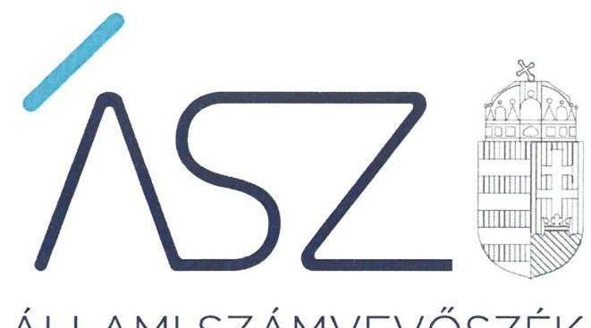
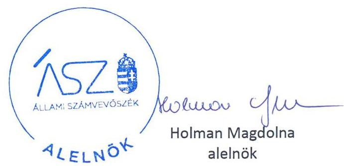

ÁLLAMI SZÁMVEVŐSZÉK

# JELENTÉS 

## Pártok gazdálkodása

A költségvetési támogatásban részesülő pártok 2017-2018. évi gazdálkodása törvényességének ellenőrzése a Magyar Szocialista Pártnál

2020.

20188
www.asz.hu

---

ÁLLAMI SZÁMVEVŐSZÉK

# JELENTÉS

## Pártok gazdálkodása

A költségvetési támogatásban részesülő pártok 2017-2018. évi gazdálkodása törvényességének ellenőrzése a Magyar Szocialista Pártnál

2020. 09. 24.

20188
www.asz.hu

---

|  | AZ ELLENŐRZÉST FELÜGYELTE: |
| :--: | :--: |
|  | DR. BENEDEK MÁRIA felügyeleti vezető |
|  | AZ ELLENŐRZÉST VEZETTE ÉS A VÉGREHAJTÁSÁÉRT FELELŐS: |
|  | DR. PELLEI TAMÁS ellenőrzésvezető |
|  | A PROGRAM ÖSSZEÁLLÍTÁSÁÉRT FELELŐS: |
|  | BERTALAN RUDOLF felelős vezető |
|  | A TÉMÁHOZ KAPCSOLÓDÓ KORÁBBI SZÁMVEVŐSZÉKI JELENTÉSEK: |
|  | - címe: Jelentés a költségvetési támogatásban részesülő pártok 2015-2016. évi gazdálkodása törvényességének ellenőrzéséről a Magyar Szocialista Pártnál |
|  | - sorszáma: 18013 |
| Jelentéseink az Országgyúlés számítógépes hálózatán és az interneten a www.asz.hu címen is olvashatóak. | - címe: Jelentés a költségvetési támogatásban részesülő pártok 2013-2014. évi gazdálkodása törvényességének ellenőrzéséről - Magyar Szocialista Párt |
|  | - sorszáma: 17094 |
|  | IKTATÓSZÁM: EL-2885-001/2020. |
|  | TÉMASZÁM: 2520 |
|  | ELLENŐRZÉS-AZONOSÍTÓ SZÁM: V086401 |

---

# TARTALOMJEGYZÉK 

■ ÖSSZEGZÉS ..... 5
■ AZ ELLENŐRZÉS CÉLJA ..... 6
■ AZ ELLENŐRZÉS TERÜLETE ..... 7
■ AZ ELLENŐRZÉS HÁTTERE, INDOKOLTSÁGA ..... 8
■ A JELENTÉS LÉNYEGES KÉRDÉSKÖREI ..... 9
■ AZ ELLENŐRZÉS HATÓKÖRE ÉS MÓDSZEREI ..... 10
■ MEGÁLLAPÍTÁSOK ..... 12
■ JAVASLATOK ..... 15
■ MELLÉKLETEK ..... 17
I. sz. melléklet: Fogalomtár ..... 17
■ FÜGGELÉK: ÉSZREVÉTELEK ..... 19
■ RÖVIDÍTÉSEK JEGYZÉKE ..... 21

---

.

---

# ÖSSZEGZÉS 

A Magyar Szocialista Párt gazdálkodásának törvényessége a 2017-2018. években biztosított volt. A Magyar Szocialista Párt a 2017-2018. évi pénzügyi kimutatásait nem a jogszabályi előírások szerint készítette el, így azok nem mutattak megbízható és valós összképet a párt bevételeiről és kiadásairól.

## Az ellenőrzés társadalmi indokoltsága

A pártok az állampolgárok egyesülési szabadsága alapján létrehozott olyan szervezetek, amelyek kereteket nyújtanak a népakarat kialakításához és kinyilvánításához, a politikai életben való állampolgári részvételhez.

A politikai élet tisztasága érdekében törvény állapítja meg a pártok vagyonára és gazdálkodására vonatkozó szabályokat. Az egyesülési jog alapján létrejövő más szervezetekhez képest szűkebb körben határozza meg azt a gazdasági tevékenységet, amelyet a párt végezhet, biztosítja azonban a pártok részére azt a jogosultságot, hogy az állami költségvetésből támogatásban részesüljenek. A pártok gazdálkodását a politikai élet tisztasága érdekében rendszeresen indokolt ellenőrizni, ezért törvényi előírás alapján az Állami Számvevőszék a költségvetési támogatást kapott pártok gazdálkodását kétévente ellenőrzi.

A pártokkal szembeni társadalmi elvárás a törvényt tisztelő, jogkövető magatartás, mivel a párt képviselői a jogállamiságot megtestesítő törvényhozó hatalom részei. Mindezekre tekintettel fokozott társadalmi veszélyességet hordoz egy párt elszámoltathatóságának hiánya, elszámolási kötelezettségének nem teljesítése.

## Főbb megállapítások, következtetések, javaslatok

A Magyar Szocialista Párt gazdálkodásának törvényessége biztosított volt. A gazdálkodására vonatkozó számviteli kereteket és a belső szabályozásokat a jogszabályi előírások szerint kialakította, a könyvvezetési és nyilvántartási rendszerét az előírások szerint működtette.

A Magyar Szocialista Párt a 2017. évi és a 2018. évi pénzügyi kimutatásait nem a jogszabályi előírások szerint készítette el, a pénzügyi kimutatások elkészítése során nem érvényesült a következetesség és a valódiság elve. A 2017-2018. évi pénzügyi kimutatásait a jogszabály által előírt határidőben tette közzé a Magyar Közlöny mellékletét képező Hivatalos Értesítőben és a saját honlapján.

A Magyar Szocialista Párt a működéséhez juttatott forrásokat, költségvetési támogatásokat a 2017. évben szabályszerűen, a 2018. évben nem szabályszerűen számolta el, mert az elszámolásra szabályszerűen kiállított bizonylatok hiányában került sor. Az előzőekből adódóan a Magyar Szocialista Párt a 2018. évben nem biztosította a központi költségvetési támogatások elszámolásának szabályszerűségét. A kiadások kifizetése a jogszabályok és a belső szabályzatok előírásai szerint történtek.

Az Állami Számvevőszék az intézkedések megtétele céljából a Magyar Szocialista Párt elnökének két javaslatot fogalmazott meg.

---

# AZ ELLENŐRZÉS CÉLJA 

AZ ELLENŐRZÉS CÉLJA annak értékelése, hogy a Magyar Szocialista Párt által közzétett pénzügyi kimutatások a törvényi előírásoknak megfeleltek-e, a könyvvezetés és gazdálkodás során betartották-e a vonatkozó jogszabályi és belső előírásokat; a párt a működéséhez szabályszerűen igénybe vehető forrásokat használt-e fel.

---

# AZ ELLENŐRZÉS TERÜLETE 

## Magyar Szocialista Párt

Az Magyar Szocialista Párt 1989. november 21-én létrejött olyan egyesület, amely nyilvántartott tagsággal rendelkezett és a nyilvántartásba vételét végző bíróság előtt kinyilvánította, hogy a Párttörvény ${ }^{1}$ rendelkezéseit magára nézve kötelezőnek ismeri el a Párttörvény 1. § -a alapján. Az Alapszabály² szerint az Magyar Szocialista Párt működésének célja, hogy elősegítse Magyarországon a szociális biztonság és a demokrácia megvalósítását. A Magyar Szocialista Párt legfőbb döntéshozó szerve a Kongresszus ${ }^{3}$ volt, működését a KPEB ${ }^{4}$ támogatta. A Magyar Szocialista Párt a 2017. január 1-jét követően az ellenőrzött időszakban az Alapszabályát nem módosította, így a 2013. évi CLXXVII. törvény ${ }^{5}$ 11. § (1) bekezdésének előírást figyelembe véve - a Ptk. ${ }^{6}$ előírásaival összefüggésben - a létesítő okiratának tartalmi felülvizsgálatára nem volt kötelezett. A Magyar Szocialista Párt jelenlegi elnöke 2018. június óta tölti be tisztségét.

A Magyar Szocialista Párt a 2017-2018. évi pénzügyi kimutatásaiban a 2017-2018. évi költségvetési törvény ${ }^{7}$ szerint jóváhagyott és a Párttörvény 4. § (4) bekezdése előírása alapján csökkentett központi költségvetésből származó támogatás 2017. évi 423,9 M Ft-os, illetve 2018. évi 354,1 M Ft-os összegét mutatta ki.

A Magyar Szocialista Párt a 2017. évi pénzügyi kimutatásában 567,6 M Ft bevételt, valamint 353,7 M Ft kiadást, a 2018. évi pénzügyi kimutatásában 879,6 M Ft bevételt, valamint 783,2 M Ft kiadást számolt el. A Magyar Szocialista Párt a 2018. év végén 329,6 M Ft hosszú lejáratú kötelezettség állománnyal rendelkezett, ebből 52,2 M Ft az MFB által ingatlanvásárláshoz nyújtott hitel volt.

A Magyar Szocialista Párt gazdasági társaságot nem alapított, a Táncsics Mihály Alapítványát 2003. évben hozta létre.

---

# AZ ELLENŐRZÉS HÁTTERE, INDOKOLTSÁGA 

Az ÁSZ tv. ${ }^{8}$ 5. § (11) bekezdés a) pontja, valamint a Párttörvény 10. § (1) bekezdése alapján a pártok gazdálkodása törvényességének ellenőrzésére az ÁSZ ${ }^{9}$ jogosult. Törvényi előírás alapján az ÁSZ kétévente ellenőrzi azoknak a pártoknak a gazdálkodását, amelyek rendszeres költségvetési támogatásban részesültek.

Az ÁSZ legutóbb a Magyar Szocialista Párt 2015-2016. évi gazdálkodásának törvényességét ellenőrizte.

A gazdálkodás szabályszerűségének, a felhasznált közpénzek nagyságának bemutatásával a társadalom objektív képet alkothat a pártok működéséről. Az ellenőrzés megállapításai a gazdálkodás megfelelőségének bemutatásával elősegíthetik, hogy a törvényalkotók konkrét lépéseket tegyenek a pártok finanszírozására vonatkozó szabályozások megváltoztatása, átláthatóbbá, ellenőrizhetőbbé tétele irányába. Az ellenőrzés rámutat a pártok gazdálkodásával kapcsolatos jó gyakorlatokra és szabálytalanságokra. A hiányosságok, szabálytalanságok feltárása, az ennek kapcsán megfogalmazott megállapítások elősegíthetik a törvényi rendelkezések megsértésének szankcionálását.

---

# A JELENTÉS LÉNYEGES KÉRDÉSKÖREI 

1. A Magyar Szocialista Párt gazdálkodásának törvényessége biztosított volt-e?
2. A Magyar Szocialista Párt pénzügyi kimutatása megfelelt-e a jogszabályi előírásoknak, közzétételi kötelezettségét szabályszerűen teljesítette-e?
3. A Magyar Szocialista Párt könyvvezetése és gazdálkodása során a vonatkozó jogszabályi rendelkezéseket és belső előírásokat betartotta-e?

---

# AZ ELLENŐRZÉS HATÓKÖRE ÉS MÓDSZEREI 

## Az ellenőrzés típusa

Szabályszerűségi ellenőrzés.

## Az ellenőrzött időszak

2017-2018. évek.

## Az ellenőrzés tárgya

A Magyar Szocialista Párt ellenőrzése során az ellenőrzés tárgyát képezte a 2017. és a 2018. évre vonatkozó pénzügyi kimutatás elkészítésére, jóváhagyására, közzétételére, a párt könyvvezetésére, gazdálkodására, ennek keretében a számviteli szabályozás kialakítására, a bizonylati rend, bizonylati fegyelem betartására, egyéb gazdálkodási, ellenőrzési és pénzügyiszámviteli informatikai feladatok ellátására irányuló tevékenységek. Az ellenőrzés tárgya volt még a források elszámolása és felhasználása, valamint a vagyon jogszabályi előírásoknak megfelelő hasznosítása.

Az ellenőrzés kiterjedt minden olyan körülményre és adatra, amely az ÁSZ jogszabályban meghatározott feladatainak teljesítéséhez, valamint a program végrehajtása folyamán felmerült újabb összefüggések feltárásához szükséges volt.

## Az ellenőrzött szervezet

Magyar Szocialista Párt

## Az ellenőrzés jogalapja

Az ellenőrzés jogalapját az ÁSZ tv. 5. § (11) bekezdés a) pontja, a Párttörvény 4. § (4)-(5) bekezdései, valamint 10. § (1), (3)-(4) bekezdései képezték.

## Az ellenőrzés módszerei

Az ÁSZ ellenőrzésére az ellenőrzési program szempontjai, az ellenőrzött időszakban hatályos jogszabályok, az ellenőrzés általános szakmai szabá-

---

lyai, az ellenőrzésre irányadó ÁSZ módszertanok figyelembevételével került sor. A közpénzekkel való felelős gazdálkodás segítésére irányuló javaslatok kidolgozásakor a hatályos jogszabályok irányadóak.

Az ellenőrzés ideje alatt a Magyar Szocialista Párttal történő kapcsolattartást az ÁSZ SZMSZ ${ }^{10}$-ének vonatkozó előírásai alapján biztosította az ÁSZ.

Az ellenőrzés céljának eléréséhez szükséges bizonyítékok megszerzése a Magyar Szocialista Párt által rendelkezésre bocsátott dokumentumokra, adatokra alapozva közvetlen, részletes elemzés, megfigyelés, szemrevételezés, információkérés, megerősítés, valamint elemző eljárás útján történt. Az ellenőrzési bizonyítékként felhasználható adatforrások közé tartoztak egyrészt az ellenőrzési program részletes szempontjainál felsorolt adatforrások, másrészt minden egyéb - az ellenőrzés folyamán feltárt, az ellenőrzés szempontjából információt tartalmazó - dokumentum.

Az ellenőrzés lefolytatásához a Magyar Szocialista Párt az ÁSZ által kért dokumentumok megküldésével szolgáltatott adatokat, amelyek valódiságát és teljes körűségét a Magyar Szocialista Párt vezetője által tett teljességi és hitelességi nyilatkozatnak kellett igazolnia. A rendelkezésre bocsátott adatok, információk kontrollja az ellenőrzés keretében történt.

Az ÁSZ a tételes ellenőrzés mellett statisztikai alapú mintavételezést és értékelést alkalmazott. A minták kiválasztása rétegzett mintavételezéssel történt. A hozzájárulások, adományok és egyéb bevételek, valamint a személyi juttatások (működési kiadáson belül), eszközbeszerzések és a működési kiadások további tételei, politikai tevékenység kiadásai, egyéb kiadások mintatételeinek értékelése „szabályszerű", ha a minta ellenőrzésének eredménye alapján 95%-os bizonyossággal a teljes sokaságban az átlagos hibaarány nem haladta meg a 10%-ot, „nem szabályszerű, ha nagyobb volt, mint 10 %. Abban az esetben, ha a teljes sokaság tekintetében a 10%-os hibaarányhoz való viszony megítélésének megbízhatósága nem érte el a 95%-ot, annak elérése érdekében az értékelés további szempontokkal egészült ki, a feltárt hibák értéke is figyelembe vételre került.

---

# 1. A Magyar Szocialista Párt gazdálkodásának törvényessége biztosított volt-e? 

Összegző megállapítás

### 1.1. számú megállapítás

1.2. számú megállapítás

A Magyar Szocialista Párt gazdálkodásának törvényessége a 2017-2018. években biztosított volt.

A Magyar Szocialista Párt gazdálkodására vonatkozó belső szabályozások a jogszabályi előírásoknak megfeleltek.

Az MSZP ${ }^{11}$ a Számv. tv. ${ }^{12}$ előírása szerint rendelkezett Számviteli politika ${ }_{1,2}{ }^{13}$-vel, melynek keretében elkészítette a Leltározási szabályzat ${ }^{14}$, az Értékelési szabályzat ${ }_{1,2}{ }^{15}$-t és a Pénzkezelési szabályzat ${ }_{1,2}{ }^{16}$-t. A Számv. tv. előírásai alapján elkészítette a Számlarendet ${ }^{17}$.

Az MSZP az Értékelési szabályzat ${ }_{1,2}$ 4. pontjában a Párttörvény 4. § (5) bekezdés szerint a nem pénzbeli vagyoni hozzájárulás értékének meghatározását előírta.

A Ptk. előírása szerint elkészített Alapszabály tartalmazta a gazdálkodással kapcsolatos folyamatokat, a kapcsolódó feladat- és hatásköröket, felelősségi viszonyokat. Az Alapszabály mellékletét képező Gazdálkodási szabályzat ${ }^{18}$ előírásának megfelelően a pártigazgató és a KPEB elnöke kiadmányozta a gazdálkodással kapcsolatos belső
 szabályzatokat.

Az MSZP könyvvezetése, nyilvántartási rendszere megfelelt a jogszabályi előírásoknak.

Az MSZP a Leltározási szabályzatában előírtak alapján a 2017-2018. években a leltárfelvételt egyeztetéssel elvégezte és kiértékelte.

Az MSZP a nyilvántartási, könyvvezetési rendszerét oly módon továbbrészletezte, hogy az megfelelt a Számv. tv. és a Kftv. ${ }^{19} 9 . \S$ (1) bekezdésében foglalt előírásoknak.

Az MSZP ellenőrzési rendszere az előírásoknak megfelelően működött.

Az MSZP a pénztárellenőrzést a Pénzkezelési szabályzat ${ }_{1,2}$-ban meghatározott gyakorisággal végezte. Az Alapszabályban előírt ellenőrzési feladatok ellátását biztosító KPEB az MSZP pénzügyi beszámolásával kapcsolatos feladatait dokumentáltan elvégezte és munkájáról a Kongresszusnak beszámolt.

---

# 2. A Magyar Szocialista Párt pénzügyi kimutatása megfelelt-e a jogszabályi előírásoknak, közzétételi kötelezettségét szabályszerűen teljesítette-e? 

Összegző megállapítás

Az MSZP 2017-2018. évi pénzügyi kimutatásai nem feleltek meg a jogszabályi előírásoknak, közzétételi kötelezettségét határidőben teljesítette.
2.1. számú megállapítás

Az MSZP 2017-2018. évi pénzügyi kimutatásai nem feleltek meg a jogszabályi előírásoknak.

Az MSZP a Párttörvényben előírt szerkezetben készítette el a 2017. és 2018. évi pénzügyi kimutatásait, melyet az Alapszabály szerint a Kongresszus elfogadott. A Párttörvényben foglaltak szerint a magyar állampolgár természetes személyek 500 ezer Ft összeghatár feletti befizetéseit a pénzügyi kimutatásaiban az MSZP a hozzájárulást adó megnevezésével és az összeg megjelölésével feltüntette.

Az MSZP a pénzügyi kimutatások adatait a Számv. tv. 4. § (1) bekezdésének előírása ellenére a könyvvezetéssel nem támasztotta alá, mert:
$\longrightarrow$ a pénzügyi kimutatások „Eszközbeszerzés" során a Számlarend 3. pontja 1. számlaosztálynál, valamint a Számviteli politika ${ }_{2} 2/B$. mellékletében előírtakkal ellentétben nem mutatott ki kiadást annak ellenére, hogy a főkönyvi nyilvántartásában a 2017. évre 12,9 M Ft, a 2018. évre 1,8 M Ft-ot eszközbeszerzést rögzített,
$\longrightarrow$ Az MSZP a 2017-2018. évi pénzügyi kimutatásait önellenőrzés keretében pontosította, azonban a pontosított pénzügyi kimutatásában rögzített összes kiadás összege a számviteli politika 2/B. és 2/C. mellékletében rögzítettek ellenére továbbra sem egyezett meg a főkönyvi kivonatokban kimutatott összegekkel,
2.2. számú megállapítás

Az MSZP a 2017-2018. évekre vonatkozó pénzügyi kimutatásainak közzétételét határidőben teljesítette.

A 2017-2018. évi pénzügyi kimutatásokat a KPEB előzetes véleményezése után az MSZP a Párttörvény előírásának megfelelően, a tárgyévet követő év május 31-ig a Hivatalos Értesítőben ${ }^{20}$ és a saját honlapján ${ }^{21}$ közzétette.

---

# 3. A Magyar Szocialista Párt könyvvezetése és gazdálkodása során a vonatkozó jogszabályi rendelkezéseket és belső előírásokat betartotta-e? 

Összegző megállapítás

Az MSZP a 2017. évi könyvvezetése és gazdálkodása során a vonatkozó jogszabályi rendelkezéseket, belső előírásokat betartotta. A 2018. évi bevételek elszámolása során a jogszabályi rendelkezéseket, belső előírásokat nem tartotta be.
3.1. számú megállapítás

Az MSZP a bevételeket a 2017. évben szabályszerűen, a 2018. évben nem szabályszerűen számolta el.

Az MSZP a működéséhez juttatott forrásokat a 2017. évben a Számv. tv. előírása alapján számolta el.

Az MSZP bevételeinek elszámolása a 2018. évben nem volt szabályszerű, mert a Gazdálkodási szabályzat ${ }^{22}$ IV. 4. pontja szerinti utalványozási rendben foglaltak ellenére a 2018. évi bevételek könyvviteli elszámolását közvetlenül alátámasztó bankbizonylatokon a Számv. tv. 167. § (1) bekezdés c) pontja szerint nem szerepelt az utalványozó személy aláírása.
3.2. számú megállapítás

Az MSZP a gazdálkodással összefüggő tevékenységének keretében a 2017-2018. évi kiadások kifizetése során a jogszabályok és a belső szabályzatok előírásait betartotta.

Az MSZP a 2017. és a 2018. évi kiadásainak elszámolása szabályszerű volt, a kifizetések elszámolása során a Számv. tv., a Munka tv. ${ }^{23}$, az Szja tv. ${ }^{24}$, valamint a belső szabályzatok előírásait betartotta.
3.3. számú megállapítás

Az MSZP 2017-2018. évi működése során a vagyon használata a törvényi előírásoknak megfelelt.

Az MSZP a vagyonnal való gazdálkodásának szabályait az Alapszabályban és az SZMSZ ${ }_{1,2}$-ben ${ }^{25}$ rögzítette, az ingó és ingatlanvagyon értékesítése, hasznosítása során a Párttörvény, a Vagyon tv. ${ }^{26}$, a Számv. tv., az Alapszabály, az SZMSZ ${ }_{1,2}$ és a Számviteli politika ${ }_{1,2}$ előírásait betartotta.

---

# JAVASLATOK 

Az ÁSZ tv. 33. § (1) bekezdésében foglaltak értelmében az ellenőrzött szervezet vezetője köteles a jelentésben foglalt megállapításokhoz kapcsolódó intézkedési tervet összeállítani és azt a jelentés kézhezvételétől számított 30 napon belül az ÁSZ részére megküldeni. Amennyiben az ellenőrzött szervezet vezetője nem küldi meg határidőben az intézkedési tervet, vagy továbbra sem elfogadható intézkedési tervet küld, az Állami Számvevőszék elnöke az ÁSZ tv. 33. § (3) bekezdése a) és b) pontjaiban foglaltakat érvényesítheti.

## Az MSZP Elnökének

1. Intézkedjen, hogy a pénzügyi kimutatás készítése során minden esetben érvényesüljenek a Számv. tv. előírásai
(2.1. számú megállapítás 2. bekezdése alapján)
2. Intézkedjen a Számv. tv. és a Gazdálkodási szabályzat előírása alapján a bevételek könyvviteli elszámolását közvetlenül alátámasztó bizonylatokon az utalványozó személy aláírásának szerepeltetéséről.
(3.1. számú megállapítás 2. bekezdés 2. tagmondata alapján)

---

.

---

# MELLÉKLETEK 

- I. SZ. MELLÉKLET: FOGALOMTÁR
pénzügyi kimutatás
költségvetési támogatás
nem pénzbeli támogatás

A Párttörvény 9. § (1) bekezdésében meghatározott, a törvény 1. számú melléklete szerinti pénzügyi kimutatás (hatályos 2014. május 6-ától), amelyet a pártok kötelesek minden év május 31-ig a Magyar Közlönyben, valamint saját honlappal rendelkező pártok a honlapjukon is közzétenni.
Az államháztartás alrendszerei terhére nyújtott pénzbeli vagy nem pénzbeli juttatás, amelyet a támogató nem elsősorban ellenszolgáltatás ellenében, de konkrét program megvalósítása vagy meghatározott időszakban a támogatott szervezet működtetése érdekében nyújt. (Civil tv. 2. § 15. pont)
Vagyoni értékkel rendelkező forgalomképes dolog, szellemi alkotás, illetve vagyoni értékű jog részben vagy egészében, véglegesen vagy ideiglenesen, teljesen vagy részben ingyenesen történő átruházása vagy átengedése, illetve szolgáltatás biztosítása. (Civil tv. 2. § 25. pont)

---

.

---

# FÜGGELÉK: ÉSZREVÉTELEK 

A jelentéstervezetet a Számvevőszék 15 napos észrevételezésre megküldte az ellenőrzött szervezet vezetőjének az ÁSZ tv. 29. § (1) bekezdése előírásának megfelelően.

A Magyar Szocialista Párt elnöke a jelentéstervezet megállapításaira észrevételt tett. Az ÁSZ tv. 29. § (3) bekezdésével összhangban az ÁSZ a Függelékben feltünteti a jelentéstervezet megállapításaival kapcsolatban tett, figyelembe nem vett észrevételeket, és megindokolja, hogy azokat miért nem fogadta el.

1. A Magyar Szocialista Párt (továbbiakban: MSZP) elnöke észrevételt tett a számvevőszéki jelentéstervezet (továbbiakban: jelentéstervezet) 4., 16., 18. és 20. oldalai oldalszámozásával kapcsolatban, mely szerint „a részükre megküldött jelentéstervezet ezeket az oldalakat nem tartalmazza és a tartalomjegyzék alapján arra a következtetésre jutottak, hogy a hiányzó oldalak szöveges tartalommal nem bírnak". Tényként indokolt rögzíteni, hogy ezek az oldalak a jelentéstervezetben semmilyen szöveget nem tartalmazó oldalak. Erre való tekintettel az Állami Számvevőszék (továbbiakban: ÁSZ) ezt nem tekinti észrevételnek.
2. Az MSZP elnöke észrevételt tett a jelentéstervezet 2.1. megállapítás 2. bekezdése 1. franciabekezdésében foglaltakra, mely szerint az MSZP a pénzügyi kimutatások adatait a számvitelről szóló 2000. évi C. törvény (továbbiakban: Számv. tv.) 4. § (1) bekezdésének előírása ellenére a könyvvezetéssel nem támasztotta alá, mert: a pénzügyi kimutatások „Eszközbeszerzés" során a Számlarend 3. pontja 1. számlaosztálynál, valamint a Számviteli politika ${ }_{2}$ 2/B. mellékletében előírtakkal ellentétben nem mutatott ki kiadást annak ellenére, hogy a főkönyvi nyilvántartásában a 2017. évre 12,9 M Ft, a 2018. évre 1,8 M Ft eszközbeszerzést rögzített.

Az MSZP elnöke levelében - elismerve az ÁSZ által megállapított, feltárt hibákat - előadta, hogy intézkedett a feltárt szabálytalanság, hiányosság kijavítása érdekében, ugyanis „az MSZP a 2019. évi pénzügyi kimutatás elkészítése során már kiemelt figyelmet fordított az Eszközbeszerzés sor tartalmának pontos, elkülönített megjelenítésére". A fent leírtak alapján az ÁSZ az MSZP észrevételét nem veszi figyelembe, a számvevőszéki jelentéstervezetben szereplő 2.1. sz. megállapítás 2. bekezdés első francia bekezdése és az MSZP elnökének címzett 1. javaslat módosítása nem indokolt.
3. Az MSZP elnöke észrevételt tett a jelentéstervezet 3.1. sz. megállapítás 2. bekezdésében foglaltakra, mely szerint az MSZP bevételeinek elszámolása a 2018. évben nem volt szabályszerű, mert a Gazdálkodási szabályzat IV. 4. pontja szerinti utalványozási rendben foglaltak ellenére a 2018. évi bevételek könyvviteli elszámolását közvetlenül alátámasztó bankbizonylatokon a Számv. tv. 167. § (1) bekezdés c) pontja szerint nem szerepelt az utalványozó személy aláírása.

Az MSZP elnöke észrevételében kifejtette, hogy „Az MSZP bevételeinek elszámolása a 2018. gazdálkodási évben is, a 2017. évhez hasonlóan történt. A Gazdálkodási Szabályzat IV. 4. pontja a pártigazgató feladat és hatáskörét

[^0]
[^0]:    * 29. § (1) Az Állami Számvevőszék az ellenőrzési megállapításait megküldi az ellenőrzött szervezet vezetőjének vagy az általa megbízott személynek, és annak, akinek személyes felelősségét állapította meg.
    (2) Az ellenőrzött szervezet vezetője és a felelősként megjelölt személy az ellenőrzés megállapításaira tizenöt napon belül írásban észrevételt tehet.
    (3) Az Állami Számvevőszék az észrevételre a beérkezésétől számított harminc napon belül írásban válaszol. A figyelembe nem vett észrevételeket köteles a jelentésben feltüntetni, és megindokolni, hogy azokat miért nem fogadta el.

---

részletezi, melynek a) pontja leírja, hogy a pártigazgató utalványozási joga az Országos Központ vonatkozásában áll fenn. A területi szövetségek és helyi szervezetek gazdálkodását a Gazdálkodási Szabályzat IV. 6 és 7. pontja szabályozza, melynek értelmében kötelezettségvállalásra, utalványozásra a területi szövetségek esetében a területi szövetség elnöke jogosult, vagy akit ő erre meghatalmaz, helyi szervezet esetében pedig a helyi szervezet elnöke, vagy akit ő erre meghatalmaz. Az erre vonatkozó utalványozási rendek, aláírás minták a második körös adatszolgáltatás alkalmával a 3. pontban megjelölt, A sarkalatosnak nem minősülő pénzügyi és gazdálkodási szabályozások ponthoz kerültek feltöltésre megyénként...... megye aláírók.pdf fájlnévvel."

Az elnök jelezte továbbá, hogy „A 2018. évi bevételek mintatételekhez kapcsolódó adatszolgáltatásunk áttekintése során nem találtunk olyan bankbizonylatot, melyről az utalványozó aláírása hiányzott volna. Megjegyezni kívánjuk, ugyanakkor azt is, hogy jelen tudásunk szerint a bevételek utalványozását sem a számviteli törvény, sem pedig a Párt Gazdálkodási szabályzata nem írja elő. Álláspontunk szerint tehát a Magyar Szocialista Párt bevételeinek elszámolása - tekintettel, hogy az a 2017-es évhez viszonyítottan semmiben, így az utalványozás tekintetében sem különbözik - a 2018. évben is szabályszerű volt".

Az ÁSZ ellenőrzésére az ellenőrzési program szempontjai, az ellenőrzött időszakban hatályos jogszabályok, az ellenőrzés általános szakmai szabályai, az ellenőrzésre irányadó ÁSZ módszertanok figyelembevételével került sor. Az ellenőrzés lefolytatásához az MSZP által rendelkezésre bocsátott adatok, információk kontrollja az ellenőrzés keretében történt.

Az EL-1643-013/2019. iktatószámú adatbekérő levélben az ÁSZ kérte az ellenőrzéshez megküldeni az MSZP sarkalatosnak nem minősülő pénzügyi és gazdálkodási tárgyú szabályozását (többek között az utalványozási, aláírási rendet és jogosultságot meghatározó/gazdálkodási szabályozást), valamint az EL-1643-039/2019. iktatószámú adatbekérő levélben az ellenőrzésre kiválasztott többek között 18 db 2018. évi bevételi mintatétel vonatkozásában az alátámasztó bevételi, könyvelési- és alapbizonylatokat. Az MSZP által az adatszolgáltatásra biztosított határidőben rendelkezésére bocsátott dokumentumok felülvizsgálata során az ÁSZ az alábbiakat állapította meg.

Az MSZP 2016. október 12-től hatályos Gazdálkodási szabályzata IV. fejezetének - észrevételben hivatkozott - 6. és 7. pontjai
 valóban tartalmaznak szabályozást a területi szövetségek és helyi szervezetek gazdálkodására vonatkozóan, de konkrétan az utalványozáshoz kapcsolódó előírások - a jelentéstervezet ellenőrzési megállapításában foglaltakkal összhangban - a Gazdálkodási szabályzat IV. fejezet 4. pontjában találhatóak meg. Az ellenőrzési adatszolgáltatás során szintén az ÁSZ rendelkezésére bocsátott, 2017. június 1-től hatályos MSZP pénzkezelési szabályzat 3.3 pontja előírása szerint az „utalványozók azok a személyek, akik a pártnál a kiadások kifizetését, a bevételek beszedését, vagy elszámolását elrendelhetik", azaz a belső szabályozás szerint a bevételek beszedése esetén is szükséges az utalványozás elvégzése.

Szabályozási tény, hogy a Számv. tv. 167. § (1) bekezdése a könyvviteli elszámolást - a bevételi és kiadási gazdasági műveletet egyaránt magában foglaló - közvetlenül alátámasztó bizonylatok általános alaki és tartalmi kellékeit tartalmazza, így a Számv. tv. 167. § (1) bekezdés c) pontjában többek között előírt utalványozó személy aláírása sem minősíthető kizárólag a kiadási tételek esetében alkalmazandó kelléknek.

A minták kiválasztása rétegzett mintavételezéssel történt. A hozzájárulások, adományok és egyéb bevételek, valamint a személyi juttatások (működési kiadáson belül), eszközbeszerzések és a működési kiadások további tételei, politikai tevékenység kiadásai, egyéb kiadások mintatételeinek értékelése „szabályszerű", ha a minta ellenőrzésének eredménye alapján 95%-os bizonyossággal a teljes sokaságban az átlagos hibaarány nem haladta meg a 10%-ot, „nem szabályszerű", ha nagyobb volt, mint 10%.

A fent leírtak alapján a 2018. évi bevételi mintatételekhez az MSZP által megküldött dokumentumok felülvizsgálata során az ÁSZ megállapította, hogy a 2018. évi bevételi mintatételek ellenőrzésének eredménye alapján - a bevételek könyvviteli elszámolását közvetlenül alátámasztó bizonylatokon az utalványozó személy aláírásának hiánya miatt - 95%-os bizonyossággal a teljes sokaságban az átlagos hibaarány meghaladta a 10%-ot, így annak értékelése nem szabályszerű.

Hangsúlyozni indokolt, hogy az MSZP a bevételeket a 2017. évben (a kiválasztott mintatételekhez beküldött alátámasztó bevételi, könyvelési- és alapbizonylatok értékelése alapján) a Számv. tv. előírásai szerint számolta el.

A fent leírtak alapján az ÁSZ az MSZP észrevételét nem veszi figyelembe, a számvevőszéki jelentéstervezetben szereplő 3.1. sz. megállapítás 2. bekezdése és az MSZP elnökének címzett 2. javaslat módosítása nem indokolt.

---

# RÖVIDÍTÉSEK JEGYZÉKE 

${ }^{1}$ Párttörvény
${ }^{2}$ Alapszabály
${ }^{3}$ Kongresszus
${ }^{4}$ KPEB
${ }^{5}$ 2013. évi CLXXVII. törvény
${ }^{6}$ Ptk.
${ }^{7}$ 2017. évi költségvetési törvény
2018. évi költségvetési törvény
${ }^{8}$ ÁSZ tv.
${ }^{9}$ ÁSZ
${ }^{10}$ ÁSZ SZMSZ
${ }^{11}$ MSZP
${ }^{12}$ Számv. tv.
${ }^{13}$ Számviteli politika ${ }_{1,2}$
${ }^{14}$ Leltározási szabályzat
${ }^{15}$ Értékelési szabályzat ${ }_{1,2}$
${ }^{16}$ Pénzkezelési szabályzat ${ }_{1,2}$
${ }^{17}$ Számlarend
${ }^{18}$ Gazdálkodási szabályzat
${ }^{19} \mathrm{Kftv}$.
${ }^{20}$ Hivatalos Értesítő
${ }^{21}$ saját honlap
1989. évi XXXIII. törvény a pártok működéséről és gazdálkodásáról (hatályos 1989. október 30-ától)
Magyar Szocialista Párt Alapszabálya (módosításokkal egységes szerkezetben, jóváhagyva: 2016. június 25.)
Magyar Szocialista Párt legfőbb döntéshozó szerve
Magyar Szocialista Párt gazdálkodását, vagyonkezelését és pénzügyeit ellenőrző testület
A Polgári törvénykönyvről szóló 2013. évi V törvény hatálybalépésével összefüggő átmeneti és felhatalmazó rendelkezésekről szóló 2013. évi CLXXVII. törvény (hatályos: 2014. március 15-étől)
A Polgári Törvénykönyvről szóló 2013. évi V. törvény (hatályos: 2014. március 15-étől)
2016. évi XC. törvény Magyarország 2017. évi központi költségvetéséről (hatályos: 2017. január 1-jétől)
2017. évi C. törvény Magyarország 2018. évi központi költségvetéséről (hatályos: 2018. január 1-jétől)
Az Állami Számvevőszékéről szóló 2011. évi LXVI. törvény (hatályos: 2011. július 1-jétől)
Állami Számvevőszék
Állami Számvevőszék Szervezeti és Működési Szabályzata
Magyar Szocialista Párt
A számvitelről szóló 2000. évi C. törvény (hatályos: 2001. január 1-étől)
Számviteli politika1: Az MSZP számviteli politikája (hatályos: 2016. július 1-jétől, aktualizálva 2017. május 15-én)
Számviteli politika2: Az MSZP számviteli politikája (hatályos: 2016. július 1-jétől, aktualizálva 2018. május 30-án és 2018. június 20-án)
Az MSZP Leltározási és selejtezési szabályzata (hatályos: 2015. január 1-jétől)
Értékelési szabályzat ${ }_{1}$ : Az MSZP Értékelési szabályzata
(hatályos: 2015. január 1-jétől)
Értékelési szabályzat ${ }_{2}$ : Az MSZP Értékelési szabályzata
(hatályos: 2015. január 1-jétől, aktualizálva 2018. május 30-án)
Pénzkezelési szabályzat ${ }_{1}$ : Az MSZP Pénzkezelési szabályzata
(hatályos: 2015. január 1-jétől, aktualizálva 2016. január 1-én és
2017. június 1-én)

Pénzkezelési szabályzat ${ }_{2}$ : Az MSZP Pénzkezelési szabályzata
(hatályos: 2015. január 1-jétől, aktualizálva 2018. szeptember 15-én)
Az MSZP Számlarendje (hatályos: 2016. január 1-jétől)
3. melléklet a Magyar Szocialista Párt Alapszabályához
(hatályos: 2016. október 12-étől)
Az országgyűlési képviselők választása kampány költségeinek átláthatóvá tételéről szóló 2013. évi LXXXVII. törvény (hatályos: 2013. június 21-étől)
Magyar Közlöny melléklete
https://mszp.hu/

---

${ }^{22}$ Gazdálkodási szabályzat
${ }^{23}$ Munka tv.
${ }^{24}$ Szja tv.
${ }^{25} \mathrm{SZMSZ}_{1}$
SZMSZ ${ }_{2}$
${ }^{26}$ Vagyon tv.

Magyar Szocialista Párt Alapszabályának 3. számú melléklete Gazdálkodási Szabályzata (hatályos: 2016. október 12-től)
A munka törvénykönyvéről szóló 2012. évi I. törvény (hatályos: 2012. január 6-tól)
A személyi jövedelemadóról szóló 1995. évi CXVII. törvény (hatályos: 1996. január 1-jétől)
Magyar Szocialista Párt Országos Központja Szervezeti és Működési Szabályzata (érvényes: 2012. április 18-ától - 2016. január 1-ig)
Magyar Szocialista Párt Országos Központja Szervezeti és Működési Szabályzata (érvényes: 2018. augusztus 28-ától)
Az állami vagyonról szóló 2007. évi CVI. törvény (hatályos: 2007. szeptember 17-étől)

---

# ASZ 

ÁLLAMI SZÁMVEVŐSZÉK
1052 Budapest, Apáczai Cs. J. u. 10. I 1364 Budapest 4. Pf. 54 TEL: +36 14849100
email: szamvevoszek@asz.hu
web: www.asz.hu | www.aszhirportal.hu
