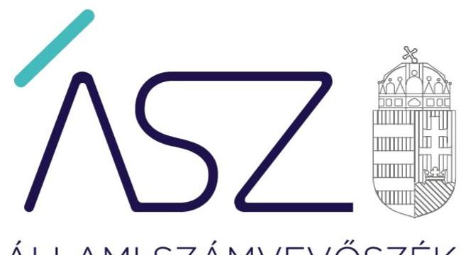
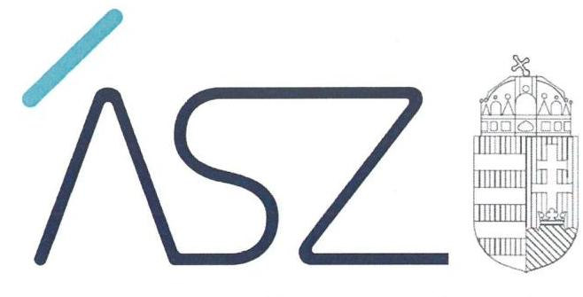
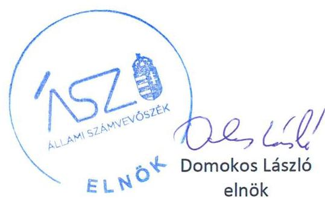
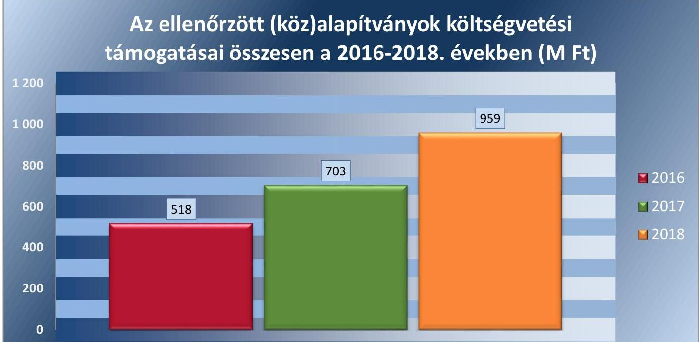
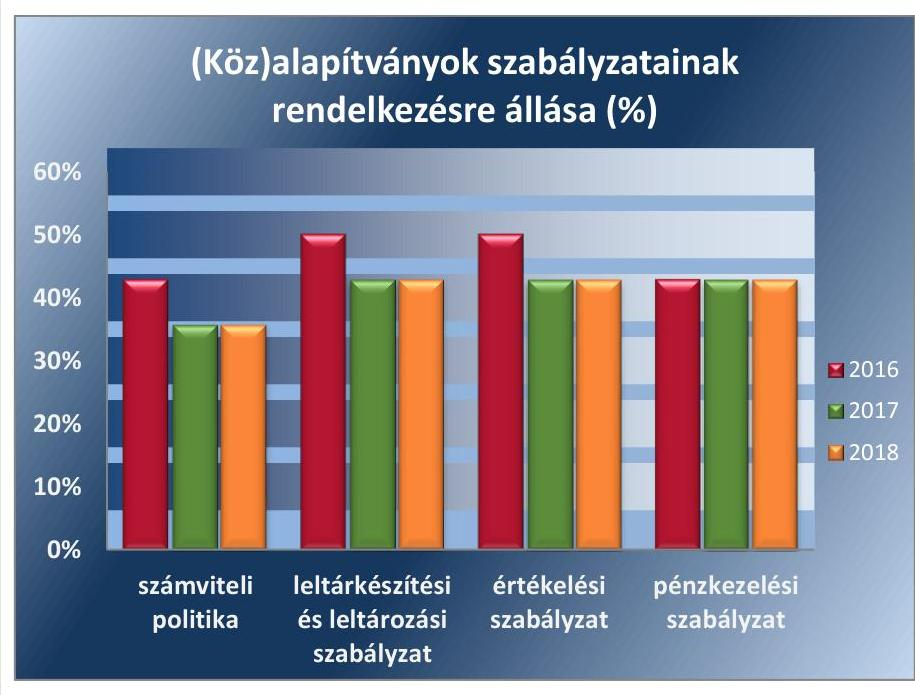
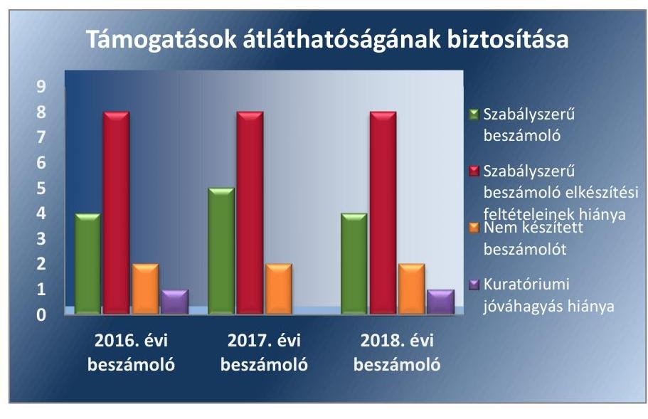

ÁLLAMI SZÁMVEVŐSZÉK

# JELENTÉS 

(Köz)alapítványok ellenőrzése
(Köz)alapítványok ellenőrzése
2020.

20189
www.asz.hu

---

ÁLLAMI SZÁMVEVŐSZÉK

# JELENTÉS

(Köz)alapítványok ellenőrzése

(Köz)alapítványok ellenőrzése

2020.
12. hó 15. nap

20189
www.asz.hu

---

# AZ ELLENŐRZÉST FELÜGYELTE: 

HOLMAN MAGDOLNA JULIANNA felügyeleti vezető
DR. NAGY IMRE felügyeleti vezető

AZ ELLENŐRZÉST VEZETTE ÉS A VÉGREHAJTÁSÁÉRT FELELŐS:
PETŐ KRISZTINA ellenőrzésvezető
SZAPPANOS JÚLIA ellenőrzésvezető

A PROGRAM ÖSSZEÁLLÍTÁSÁÉRT FELELŐS:
FEKETE-NAGY ANDRÁS GÁBOR program összeállításáért felelős vezető

Jelentéseink az Országgyülés számítógépes hálózatán és az interneten a www.asz.hu címen is olvashatóak.

IKTATÓSZÁM: EL-2886-001/2020.
TÉMASZÁM: 2506
ELLENŐRZÉS-AZONOSÍTÓ SZÁM: V085025; V085027-V085040

---

# TARTALOMJEGYZÉK 

■ ÖSSZEGZÉS ..... 5
■ AZ ELLENŐRZÉS CÉLJA ..... 7
■ AZ ELLENŐRZÉS TERÜLETE ..... 8
■ AZ ELLENŐRZÉS HÁTTERE, INDOKOLTSÁGA ..... 9
■ A JELENTÉS LÉNYEGES KÉRDÉSKÖREI ..... 10
■ AZ ELLENŐRZÉS HATÓKÖRE ÉS MÓDSZEREI ..... 11
■ MEGÁLLAPÍTÁSOK ..... 13
■ JAVASLATOK ..... 16
■ MELLÉKLETEK ..... 17
I. sz. melléklet: Ellenőrzött (Köz)alapítványok kockázati területeinek értékelése ..... 17
II. sz. melléklet: Értelmező szótár ..... 18
■ FÜGGELÉKEK ..... 19
I. sz. függelék a jelentéshez ..... 19
II. sz. függelék: Észrevételek ..... 20
■ RÖVIDÍTÉSEK JEGYZÉKE ..... 23

---

.

---

# ÖSSZEGZÉS 

A szabályszerű gazdálkodás alapvető feltételeit, a költségvetési támogatás felhasználásának átláthatóságát és elszámoltathatóságát az Állami Gondoskodásban Élő és Veszélyeztetett Fiatalok Támogatásáért Alapítvány, a Jász-Nagykun-Szolnok Megye "Esély" Szociális Közalapítvány és a „Kortárs Balettért" Alapítvány biztosította. Tizenegy (köz)alapítvány gazdálkodásának átláthatósága és a közpénzekkel történő elszámoltathatósága magas kockázatú volt. A Bolyai Műhely Alapítvány esetében nem álltak fenn az ellenőrizhetőség feltételei.

## Az ellenőrzés társadalmi indokoltsága

Törvényben deklaráltak szerint a közpénzekkel gazdálkodó minden szervezet köteles a nyilvánosság előtt elszámolni a közpénzekre vonatkozó gazdálkodásával. A közpénzeket és a nemzeti vagyont az átláthatóság és a közélet tisztaságának elve szerint kell kezelni. A közpénzekre és a nemzeti vagyonra vonatkozó adatok közérdekű adatok.

Az alapítványok, mint az alapító által az alapító okiratban meghatározott tartós cél megvalósítására létrehozott jogi személyek tevékenységüket az alapító által juttatott vagyon kezelésével, felhasználásával látják el. Az alapítványok működésükre és szakmai tevékenységük ellátására államháztartási forrásból nyújtott támogatásban vagy az államháztartásból ingyenes vagyonjuttatásban részesülhetnek.

Jelen ellenőrzés 15 (köz)alapítvány gazdálkodásának lényeges területeire terjedt ki. A (köz)alapítványok kockázatelemzés alapján kerültek kiválasztásra, nem reprezentálják a hazai (köz)alapítványokat. Az ellenőrzés hozzájárulhat az alapítványok ellenőrzésének nagyobb lefedettségéhez, támogatja a közpénzek felhasználásának és a közvagyon használatának szabályszerűségét, célszerűségét.

Az alapítványok ellenőrzésével az Állami Számvevőszék hozzájárul ahhoz, hogy a közpénzeket az államháztartáson kívüli szervezetek is ellenőrizhető, átlátható és elszámoltatható módon használják fel a feladatellátásuk során. Kockázatot jelent, ha az alapítványok nem alakítanak ki olyan számviteli nyilvántartási rendszert, amelyből a támogatások és az azok felhasználására vonatkozó információk elkülönítetten jelentek meg. Az elkülönítés hiánya következtében nem átlátható a közpénzek felhasználása, a felhasználás rendeltetésszerűsége.

A felhasznált támogatások átláthatóságának, a közpénzekkel való gazdálkodás elszámoltathatóságának értékelésével az Állami Számvevőszék előmozdítja, hogy a társadalom objektív képet alkothasson az alapítványok működéséről.

## Főbb megállapítások, következtetések, javaslatok

Az ellenőrzés a kiválasztott (köz)alapítványok gazdálkodásának lényeges területeit értékelte, amelynek kockázati értékelését az I. sz. melléklet tartalmazza.

Az ellenőrzött időszakban három (köz)alapítvány (Állami Gondoskodásban Élő és Veszélyeztetett Fiatalok Támogatásáért Alapítvány, Jász-Nagykun-Szolnok Megye "Esély" Szociális Közalapítvány, „Kortárs Balettért" Alapítvány) jogkövető magatartása következtében az Állami Számvevőszék az ellenőrzése során gazdálkodásukban az ellenőrzött időszak minden évében alacsony kockázatot azonosított. Ezek a (köz)alapítványok kialakították a szabályszerű gazdálkodás alapvető feltételeit, összeállították éves számviteli beszámolójukat, továbbá gondoskodtak a támogatások szabályszerű elkülönítéséről a 2016-2018. években.

A (köz)alapítványok közül a gazdálkodás összesített értékelése alapján tizenegy (köz)alapítvány gazdálkodása minősült magas kockázatúnak az ellenőrzött években.

A 15 (köz)alapítványból 8 (Arany János Alapítvány, Egyedülálló Szülők Klubja Alapítvány, "Folklór" Kulturális Közalapítvány, JELENKOR Alapítvány, Kis Virtuózok Alapítvány, Teleki László Alapítvány, TermészetBÜVÁR Alapítvány és Fogadj Örökbe Egy Macit Alapítvány) esetében a számviteli szabályozottság hiányában nem álltak fenn a szabályszerű számviteli beszámoló elkészítésének és a közpénzekkel való gazdálkodásnak átlátható, elszámoltatható feltételei. Az alapvető számviteli szabályzatok nélkül a közpénzekkel való gazdálkodás szabályozási keretei nem voltak biztosítottak. Az Állami Számvevőszék által 2019-ben készített, Az alapítványok ellenőrzési tapasztalatai című elemzés is mind jellegében, mind arányában ugyanazon szabálytalanságokat állapította meg, mint jelen ellenőrzésünk. Jellemző hiányosság volt, hogy az alapítványok nem rendelkeztek számviteli szabályzatokkal. Ezek a hiányosságok felvetették annak kockázatát, hogy a számviteli elszámolások nem egységesen és teljes körűen történtek, valamint a rendszerek nem alkalmasak pontos, megbízható és valós információkat tartalmazó beszámolók összeállítására.

2016-2018-ban az Egyedülálló Szülők Klubja Alapítvány, 2017-2018-ban a Kárpát-medencei Tehetségkutató Alapítvány a beszámoló készítési kötelezettségének nem tett eleget, 2016-ban a Dr. Hilscher Rezső Szociális Közalapítvány, 2018-ban a Makovecz Imre Alapítvány számviteli beszámolóját a kuratórium elfogadása nélkül tette közzé. A kuratóriumok az éves beszámoló elkészítésével és elfogadásával számolnak el a rájuk bízott vagyonnal, számviteli beszámoló, illetve kuratóriumi jóváhagyás hiányában nem volt biztosított a működéshez és szakmai feladatellátáshoz nyújtott közpénzek átláthatósága és elszámoltathatósága. Ezen szervezetek esetében magas annak a kockázata, hogy a kapott támogatásokat nem szabályszerűen használják fel és a közpénzeket nem kezelik átláthatóan.

Kiemelten magas kockázatú besorolást kapott a Bolyai Műhely Alapítvány, mert esetében nem álltak fenn az ellenőrzés lefolytathatóságának feltételei. A tényről az Állami Számvevőszékről szóló 2011. évi LXVI. törvényben kapott felhatalmazás alapján az illetékes hatóságot tájékoztattuk.

Az Állami Számvevőszék az intézkedések megtétele céljából a (köz)alapítványok részére egy javaslatot fogalmazott meg.

---

# AZ ELLENŐRZÉS CÉLJA 

Az ellenőrzés célja annak megállapítása volt, hogy az alapítvány/közalapítvány szabályszerű gazdálkodásához, a költségvetési támogatás felhasználásához biztosítottak voltak-e az alapvető feltételek, az alapítvány a közpénzekből kapott támogatásokhoz kapcsolódó nyilvántartások kialakítása során biztosította-e az elszámoltathatóságot és az átláthatóságot.

---

# AZ ELLENŐRZÉS TERÜLETE 

## (Köz)alapítványok ellenőrzése

Az ÁSZ ${ }^{1}$ ellenőrzése az átlátható és elszámoltatható közpénzfelhasználás elősegítése érdekében olyan (köz)alapítványok gazdálkodását értékelte, amelyeket korábban még nem ellenőrzött.

Az ellenőrzésre kijelölt 12 alapítvány és 3 közalapítvány az ellenőrzött időszak mindhárom évében részesült - nem normatív - költségvetési támogatásban, a támogatás összege évről-évre nőtt. A költségvetésből kapott támogatások összege 2016-2018. években mintegy 2180 millió Ft volt.

## Az ellenőrzött (köz)alapítványok költségvetési támogatásai összesen a 2016-2018. években (M Ft)

Forrás: https://www.birosag.hu/civil-szervezetek-nevegyzeke alapján
Hat (köz)alapítvány esetében a folyósított támogatás az ellenőrzött időszak több évében is meghaladta az ötvenmillió forintot, amely az Civil tv. ${ }^{2}$ 53/A. § (1) bekezdése alapján jelentős költségvetési támogatásnak minősült.

Az alapítványok közül egy (Jász-Nagykun-Szolnok Megye „Esély" Szociális Közalapítvány) tartozott ESA körbe ${ }^{3}$.

---

# AZ ELLENŐRZÉS HÁTTERE, INDOKOLTSÁGA 

Az ÁSZ stratégiájában rögzített célkitűzése, hogy az államháztartáson kívülre nyújtott költségvetési támogatás és vagyonjuttatás ellenőrzésével hozzájáruljon ahhoz, hogy a közpénzeket a civil szervezetek is átlátható módon és célszerűen használják fel.

Az alapítványok, mint az alapító által az alapító okiratban meghatározott tartós cél megvalósítására létrehozott jogi személyek tevékenységüket az alapító által juttatott vagyon kezelésével, felhasználásával látják el. Az alapítványok működésükre és szakmai tevékenységük ellátására államháztartási forrásból nyújtott támogatásban vagy az államháztartásból ingyenes vagyonjuttatásban részesülhetnek.

Társadalmi elvárás a közpénzek értékelvű, rendeltetésszerű felhasználása, a közpénzekből nyújtott támogatások átláthatóságának megteremtése. Az ÁSZ az államháztartásból támogatásban részesült alapítványoknál ellenőrizte a közpénzekkel való gazdálkodás alapvető szabályozási kereteit, a nyilvántartások vezetését, a beszámolási kötelezettség teljesítését.

A közpénzek felhasználásának és a köztulajdon használatának nyilvánossága és ellenőrizhetősége érdekében az alapítvány nyilvántartási (könyvvezetési) rendszerét köteles oly módon továbrészletezni, hogy abból a vonatkozó külön jogszabályban meghatározott adatok rendelkezésre álljanak.

Az ellenőrzés eredményeinek célzott felhasználói a nyilvánosság, a jogalkotó, továbbá az alapítványok alapítói és szervei. Az ellenőrzés eredményeképp a törvényalkotás számára tapasztalatok állnak rendelkezésre az alapítványok gazdálkodása szabályozásához. Az ellenőrzött szervezetek szintjén gazdálkodásuk vonatkozásában a hiányosságok, szabálytalanságok feltárása, az ennek kapcsán megfogalmazott megállapítások elősegíthetik az alapítványok szabályszerű gazdálkodását. Az ellenőrzés a társadalom számára információt szolgáltat arról, hogy az alapítványok a közpénzek szabályszerű felhasználásának feltételeit kialakították-e.

---

# A JELENTÉS LÉNYEGES KÉRDÉSKÖREI 

1.     - A (köz)alapítványnál kialakították-e a közpénzekkel való gazdálkodás alapvető szabályozási kereteit?
2.     - A (köz)alapítvány biztosította-e a 2016-2018. években felhasznált támogatások átláthatóságát?
3.     - Az államháztartásból kapott és 2016-2018. években felhasznált költségvetési támogatásokról vezetett nyilvántartás biztosította-e a közpénzekkel való gazdálkodás elszámoltathatóságát?

---

# AZ ELLENŐRZÉS HATÓKÖRE ÉS MÓDSZEREI 

## Az ellenőrzés típusa

Megfelelőségi ellenőrzés.

## Az ellenőrzött időszak

2016-2018. évek

## Az ellenőrzés tárgya

A (köz)alapítvány gazdálkodása alapvető szabályozási kereteinek megléte, a 2016-2018. évi beszámolási kötelezettség teljesítésének ellenőrzése. Kiterjedt továbbá az ellenőrzés a központi költségvetésből kapott támogatással és 2016-2018. évi felhasználásával kapcsolatosan vezetett nyilvántartás ellenőrzésére.

## Az ellenőrzött szervezetek

Költségvetési támogatásban részesült, költségvetési támogatást felhasználó (köz)alapítványok az I. sz. melléklet szerint.

## Az ellenőrzés jogalapja

ÁSZ tv. ${ }^{4} 1. §$ (3) és 5. § (3) bekezdései.

## Az ellenőrzés módszerei

Az ellenőrzést az ellenőrzött időszakban hatályos jogszabályok, az ellenőrzés szakmai szabályai, a jelen ellenőrzésre irányadó ÁSZ módszertanok, az ellenőrzési programban foglalt értékelési szempontok szerint hajtotta végre az ÁSZ. Az ellenőrzést az ÁSZ a program kérdéseire adott válaszok kiértékelésével, valamint a programban ismertetett ellenőrzési kérdések, kritériumok, adatforrások között megjelölt adatforrások, továbbá az adott időszakban hatályos jogszabályok figyelembevételével folytatta le.

A kockázatértékelésen alapuló, új módszertanú ellenőrzés a pénzügyi gazdálkodás lényeges területeire terjedt ki, és súlypontok meghatározásával lehetőséget biztosított a kockázatok beazonosítására.

A kockázati területek értékelése alapján kerültek besorolásra az egyes alapítványok alacsony vagy magas kockázatú kategóriákba.

---

Az ellenőrzés ideje alatt az ellenőrzött szervezettel történő kapcsolattartás az ÁSZ szervezeti és működési szabályzatának vonatkozó előírásai alapján volt biztosított.

---

# MEGÁLLAPÍTÁSOK 

## 1. A (köz)alapítványnál kialakították-e a közpénzekkel való gazdálkodás alapvető szabályozási kereteit?

Összegző megállapítás

Hat (köz)alapítvány kialakította, nyolc (köz)alapítvány nem alakította ki a közpénzekkel való gazdálkodás alapvető szabályozási feltételeit az ellenőrzött időszakban. A Bolyai Műhely Alapítvány esetében az ellenőrizhetőség feltételei nem álltak fenn.

A GAZDÁLKODÁS SZABÁLYOZOTTSÁGA A 2016-2018. ÉVEKBEN hat (köz)alapítvány esetében nem bizonyult kockázatosnak. A hat (köz)alapítvány biztosította a szabályszerű gazdálkodás alapvető feltételeit. Nyolc (köz)alapítvány nem alakította ki a közpénzekkel való gazdálkodás alapvető szabályozási kereteit.

A (köz)alapítványoknál a Számv. tv. ${ }^{5}$ által meghatározott szabályzatok rendelkezésre állására vonatkozó adatokat az 1. ábra szemlélteti.
1. ábra

Forrás: ÁSZ szerkesztés
Az Egyedülálló Szülők Klubja Alapítvány, JELENKOR Alapítvány, a Kis Virtuózok Alapítvány, a Teleki László Alapítvány, valamint a TermészetBÜVÁR Alapítvány a 2016-2018. években a Számv. tv. 14. § (3) bekezdésében előírtak ellenére nem alakította ki számviteli politikáját, nem rendelkezett a Számv. tv. 14. § (5) bekezdés a), b) és d) pontja szerinti leltárkészítési és leltározási, eszközök és források értékelési, valamint pénzkezelési szabályzattal.

---

Az Arany János Alapítvány a 2016. évben a Számv. tv. 14. § (3) bekezdésében előírtak ellenére nem alakította ki számviteli politikáját, a Számv. tv. 14. § (5) bekezdés a), b) pontjában előírtak ellenére nem készítette el annak keretében az eszközök és a források leltárkészítési és leltározási szabályzatát, valamint az eszközök és a források értékelési szabályzatát. A 2016-2018. években nem készített a Számv. tv. 14. § (5) bekezdés d) pontjában előírtak ellenére pénzkezelési szabályzatot.

A 2016-2018. években a "Folklór" Kulturális Közalapítvány nem
 készítette el a számviteli politika keretében az eszközök és a források leltárkészítési és leltározási szabályzatát a Számv. tv. 14. § (5) bekezdés a) pontjában előírtak ellenére.

A 2016-2018. években a Fogadj Örökbe Egy Macit Alapítvány a Számv. tv. 14. § (5) bekezdés b) pontjában foglaltak ellenére nem készítette el a számviteli politika keretében az eszközök és források értékelési szabályzatát.

# 2. A (köz)alapítvány biztosította-e a 2016-2018. években felhasznált támogatások átláthatóságát? 

Összegző megállapítás

A felhasznált támogatások átláthatóságát a 2016. évben öt, a 2017. évben hat, a 2018. évben öt (köz)alapítvány biztosította.

Az ellenőrzött időszakban az Állami Gondoskodásban Élő és Veszélyeztetett Fiatalok Támogatásáért Alapítvány, a Jász-Nagykun-Szolnok Megye "Esély" Szociális Közalapítvány és a „Kortárs Balettért" Alapítvány biztosította a felhasznált támogatások átláthatóságát. Ezen (köz)alapítványok az éves számviteli beszámolóikat szabályszerűen letétbe helyezték és közzétették.

Számviteli szabályozottság hiányában nyolc (köz)alapítványnál nem álltak fenn a szabályszerű számviteli beszámoló elkészítésének feltételei.

2016-ban a Dr. Hilscher Rezső Szociális Közalapítvány, 2018-ban a Makovecz Imre Alapítvány számviteli beszámolóját - a Civil tv. 30. § (1) bekezdésében előírtak ellenére - a jóváhagyásra jogosult testület (kuratórium) elfogadása nélkül tette közzé, így nem igazolták, hogy az általuk kapott költségvetési támogatást a célnak megfelelően használták fel.

A Kárpát-medencei Tehetségkutató Alapítvány által rendelkezésre bocsátott dokumentumok, valamint a nyilatkozata alapján 2016-ban a Számv. tv. 20. § (6) és a 224/2000. (XII. 19.) Korm. rendelet ${ }^{6}$ 6. § (1) bekezdésében előírtak ellenére az éves beszámolót részét képező mérleget, eredménykimutatást és kiegészítő mellékletet a képviseletre jogosult személy nem írta alá. A 2017-2018. évekre vonatkozóan a Számv. tv. 4. § (1) bekezdésében, a Civil tv. 28. § (1) bekezdésében, valamint a 479/2016. (XII. 28.) Korm. rendelet ${ }^{7}$ 7. § (1) bekezdésében előírtak ellenére a számviteli beszámolási kötelezettségét nem teljesítette.

Az Egyedülálló Szülők Klubja Alapítvány nyilatkozata alapján a 2016-2018. évekre vonatkozóan a Számv. tv. 4. § (1) bekezdésében, a Civil tv. 28. § (1) bekezdésében, valamint a 2016. december 31-ig hatályos 224/2000. (XII. 19.) Korm. rendelet 6. § (1) bekezdésében és a 2017. január 1-jétől hatályos 479/2016. (XII. 28.) Korm. rendelet 7. § (1) bekezdésében előírtak ellenére a számviteli beszámolási kötelezettségét nem teljesítette.

A felhasznált támogatás átláthatósága biztosításának értékelését a 2. ábra szemlélteti.
2. ábra

Forrás: ÁSZ szerkesztés

# 3. Az államháztartásból kapott és 2016-2018. években felhasznált költségvetési támogatásokról vezetett nyilvántartás biztosította-e a közpénzekkel való gazdálkodás elszámoltathatóságát? 

Összegző megállapítás

A 2016-2018. években három (köz)alapítványnál biztosították a közpénzekkel való gazdálkodás elszámoltathatóságát.

HÁROM (KÖZ)ALAPÍTVÁNY alakított ki olyan szabályszerű számviteli nyilvántartási rendszert az ellenőrzött években, amelyből a támogatások és az azok felhasználására vonatkozó információk elkülönítetten jelentek meg (Állami Gondoskodásban Élő és Veszélyeztetett Fiatalok Támogatásáért Alapítvány, Jász-Nagykun-Szolnok Megye "Esély" Szociális Közalapítvány, „Kortárs Balettért" Alapítvány).

Számviteli szabályozás, valamint számviteli beszámoló hiánya következtében a 2016-2018. években kilenc (köz)alapítvány nem biztosította a közpénzekkel való elszámoltathatóság feltételeit.

Két (köz)alapítvány (Dr. Hilscher Rezső Szociális Közalapítvány, Makovecz Imre Alapítvány) a Civil tv. 20. § (4) bekezdésben foglaltak ellenére nem vezetett olyan elkülönített számviteli nyilvántartást a 2016-2018. években, amely alapján támogatásonként megállapítható és ellenőrizhető a kapott költségvetési támogatások felhasználása.

---

# JAVASLATOK 

Az ÁSZ tv. 33. § (1) bekezdésében foglaltak értelmében az ellenőrzött szervezet vezetője köteles a jelentésben foglalt megállapításokhoz kapcsolódó intézkedési tervet összeállítani és azt a jelentés kézhezvételétől számított 30 napon belül az ÁSZ részére megküldeni. Amennyiben az ellenőrzött szervezet vezetője nem küldi meg határidőben az intézkedési tervet, vagy továbbra sem elfogadható intézkedési tervet küld, az Állami Számvevőszék elnöke az ÁSZ tv. 33. § (3) bekezdése a) és b) pontjaiban foglaltakat érvényesítheti.

## az Arany János Alapítvány kuratóriuma elnökének

1. Intézkedjen a jogszabályi előirásnak megfelelően a pénzkezelési szabályzat elkészítéséről.
(1. megállapítás 4. bekezdésének 2. mondata alapján)

---

# MELLÉKLETEK

I. SZ. MELLÉKLET: ELLENŐRZÖTT (KÖZ)ALAPÍTVÁNYOK KOCKÁZATI TERÜLETEINEK ÉRTÉKELÉSE

|  (Köz)alapítvány megnevezése, székhelye | Gazdálkodás szabályozottságának kockázati értékelése |  |  |  | Támogatások átláthatóságának kockázati értékelése |  |  |  | Közpénzekkel való elszámoltathatóság kockázati értékelése |  |  |  | Összesített kockázati értékelés |   |
| --- | --- | --- | --- | --- | --- | --- | --- | --- | --- | --- | --- | --- | --- | --- |
|   | 2016 | 2017 | 2018 | 2016 | 2017 | 2018 | 2016 | 2017 | 2018 | 2016 | 2017 | 2018 |  |   |
|  Állami Gondoskodásban Élő és Veszélyeztetett Fiatalok Támogatásáért (ÁGOTA) Alapítvány (Szeged) |  |  |  |  |  |  |  |  |  |  |  |  |  |   |
|  Arany János Alapítvány (Budapest) |  |  |  |  |  |  |  |  |  |  |  |  |  |   |
|  Bolyai Múhely Alapítvány (Budapest) |  |  |  |  |  |  |  |  |  |  |  |  |  |   |
|  Dr. Hilscher Rezső Szociális Közalapítvány (Miskolc) |  |  |  |  |  |  |  |  |  |  |  |  |  |   |
|  Egyedülálló Szülők Klubja Alapítvány (Alsómocsolád) |  |  |  |  |  |  |  |  |  |  |  |  |  |   |
|  Fogadj Örökbe Egy Macit Alapítvány (Budapest) |  |  |  |  |  |  |  |  |  |  |  |  |  |   |
|  „Folklór" Kulturális Közalapítvány (Jászberény) |  |  |  |  |  |  |  |  |  |  |  |  |  |   |
|  Jász-Nagykun-Szolnok Megye "Esély" Szociális Közalapítvány (Szolnok) |  |  |  |  |  |  |  |  |  |  |  |  |  |   |
|  JELENKOR Alapítvány (Pécs) |  |  |  |  |  |  |  |  |  |  |  |  |  |   |
|  Kárpát-medencei Tehetségkutató Alapítvány (Budapest) |  |  |  |  |  |  |  |  |  |  |  |  |  |   |
|  Kis Virtuózok Alapítvány (Budapest) |  |  |  |  |  |  |  |  |  |  |  |  |  |   |
|  „Kortárs Balettért" Alapítvány (Szeged) |  |  |  |  |  |  |  |  |  |  |  |  |  |   |
|  Makovecz Imre Alapítvány (Budapest) |  |  |  |  |  |  |  |  |  |  |  |  |  |   |
|  Teleki László Alapítvány (Budapest) |  |  |  |  |  |  |  |  |  |  |  |  |  |   |
|  TermészetBÜVÁR Alapítvány (Budapest) |  |  |  |  |  |  |  |  |  |  |  |  |  |   |

Jelmagyarázat: Alacsony kockázati Magas kockázati Kiemelten magas kockázati

---

# II. SZ. MELLÉKLET: ÉRTELMEZŐ SZÓTÁR 

alapítvány

Költségvetési támogatás
közalapítvány

Az alapítvány az alapító által az alapító okiratban meghatározott tartós cél folyamatos megvalósítására létrehozott jogi személy. Az alapító az alapító okiratban meghatározza az alapítványnak juttatott vagyont és az alapítvány szervezetét. Alapítvány nem alapítható gazdasági-vállalkozási tevékenység folytatására. Az alapítvány az alapítványi cél megvalósításával közvetlenül összefüggő gazdasági tevékenység végzésére jogosult. Alapítvány nem lehet korlátlan felelősségű tagja más jogalanynak, nem létesíthet alapítványt és nem csatlakozhat alapítványhoz. (Forrás: Ptk. ${ }^{8}$ 3:378. §, 3:379. § (1)-(3) bekezdés)
Az államháztartás alrendszerei terhére nyújtott pénzbeli vagy nem pénzbeli juttatás, amelyet a támogató nem elsősorban ellenszolgáltatás ellenében, de konkrét program megvalósítása vagy meghatározott időszakban a támogatott szervezet működtetése érdekében nyújt. Költségvetési támogatás különösen: a pályázat útján, valamint egyedi döntéssel kapott költségvetési támogatás; az Európai Unió strukturális alapjaiból, illetve a Kohéziós Alapból származó, a költségvetésből juttatott támogatás; az Európai Unió költségvetéséből vagy más államtól, nemzetközi szervezettől származó támogatás és a személyi jövedelemadó meghatározott részének az adózó rendelkezése szerint felajánlott összege. (Forrás: Civil tv. 2. § 15. pont)
A közalapítvány olyan alapítvány, amelyet az Országgyúlés, a Kormány, valamint a helyi önkormányzat vagy kisebbségi önkormányzat képviselő-testülete közfeladat ellátásának folyamatos biztosítása céljából hozhatott létre 2006. augusztus 24-ig. Ezt követően ezek a szervezetek alapítványt nem alapíthattak, kivéve a Kormányt, amely 2016. október 20-tól hozhat létre alapítványt. Törvény közalapítvány létrehozását kötelezővé teheti. Közfeladatnak minősült az állami, helyi önkormányzati vagy kisebbségi önkormányzati feladat, amelynek ellátásáról törvény vagy önkormányzati rendelet alapján az államnak vagy az önkormányzatnak kell gondoskodnia. A közalapítvány létrehozása nem érintette az államnak, illetve az önkormányzatnak a feladat ellátására vonatkozó kötelezettségét. Közalapítvány alapítására jogosult szerv alapítványt csak közalapítványként hozhatott létre. Közalapítvány csak olyan gazdálkodó szervezetben vehet részt, amelyben legalább többségi irányítást biztosító befolyással rendelkezik, és amelyben felelőssége nem haladja meg vagyoni hozzájárulása mértékét. A közalapítvány által létrehozott gazdálkodó szervezet további gazdálkodó szervezetet nem alapíthat, és gazdálkodó szervezetben részesedést nem szerezhet. Közalapítvány létesítése esetén az alapító okiratban a kezelő szervet is meg kell jelölni, vagy ilyen célra külön szervezet - ideértve a kezelő szerv ellenőrzésére jogosult szervet is - létrehozásáról kell gondoskodni. (Forrás: a Polgári Törvénykönyvről szóló 1959. évi IV. törvény 74/G. § (1)-(2), (4) és (5) bekezdései, 2006. évi LXV. törvény ${ }^{9} 1$. §-a alapján)

---

# FÜGGELÉKEK 

- I. SZ. FÜGGELÉK A JELENTÉSHEZ

Az Állami Számvevőszék az ellenőrzések során feltárt tényekhez kapcsolódó további körülmények tisztázására
 eszközrendszerrel nem rendelkezik. Amennyiben az ellenőrzésen túlmutatóan indokoltnak látszik az ellenőrzés során feltárt körülmények további vizsgálata, az Állami Számvevőszék törvényi felhatalmazás alapján az ellenőrzés által feltárt körülményeket továbbítja a hatáskörrel rendelkező szervnek a szükséges intézkedések megtétele, eljárások lefolytatása érdekében.

## Számviteli beszámoló hiánya

Az Egyedülálló Szülők Klubja Alapítvány teljességi és hitelességi nyilatkozata szerint a 2016. évben a Civil tv. 28. § (1) bekezdésében, valamint a 224/2000. (XII. 19.) Korm. rendelet 6. § (1) bekezdésében előírt éves beszámoló készítési kötelezettségének nem tett eleget. Továbbá a 2017-2018. években a Civil tv. 28. § (1) bekezdésében, valamint a 479/2016. (XII. 28.) Korm. rendelet 7. § (1) bekezdésében előírt éves beszámoló készítési kötelezettségnek sem tett eleget.
Ennek hiányában az Egyedülálló Szülők Klubja Alapítvány nem számolt el a működéséről, vagyoni, pénzügyi és jövedelmi helyzetéről, a közfeladatokra kapott költségvetési támogatások felhasználásáról. A beszámolóként közzétett adatai megbízhatósága nem igazolt.
Az eset konkrét körülményeinek feltárására a Nemzeti Adó- és Vámhivatal rendelkezik hatáskörrel.

---

A jelentéstervezetet a Számvevőszék 15 napos észrevételezésre megküldte az ellenőrzött szervezetek vezetőinek az ÁSZ tv. 29. § (1) bekezdése előírása szerint.

A Bolyai Műhely Alapítvány, az Egyedülálló Szülők Klubja Alapítvány, a Kárpát-medencei Tehetségkutató Alapítvány, a Kis Virtuózok Alapítvány, valamint a Teleki László Alapítvány a jelentéstervezet megállapításaira észrevételt tett. Az Alapítványok, Közalapítvány figyelembe nem vett észrevételeit és az elutasítás indokát a függelék tartalmazza.
Az Állami Gondoskodásban Élő és Veszélyeztetett Fiatalok Támogatásáért Alapítvány, az Arany János Alapítvány, a Dr. Hilscher Rezső Szociális Közalapítvány, a Fogadj Örökbe Egy Macit Alapítvány, a „Folklór" Kulturális Közalapítvány, a Jász-Nagykun-Szolnok Megye "Esély" Szociális Közalapítvány, a JELENKOR Alapítvány, a „Kortárs Balettért" Alapítvány, a Makovecz Imre Alapítvány, valamint a TermészetBÚVÁR Alapítvány kuratóriuma elnökei a jelentéstervezetre nem tettek észrevételt.

[^0]
[^0]:    * 29. § (1) Az Állami Számvevőszék az ellenőrzési megállapításait megküldi az ellenőrzött szervezet vezetőjének vagy az általa megbízott személynek, és annak, akinek személyes felelősségét állapította meg.
    (2) Az ellenőrzött szervezet vezetője és a felelősként megjelölt személy az ellenőrzés megállapításaira tizenöt napon belül írásban észrevételt tehet.
    (3) Az Állami Számvevőszék az észrevételre a beérkezésétől számított harminc napon belül írásban válaszol. A figyelembe nem vett észrevételeket köteles a jelentésben feltüntetni, és megindokolni, hogy azokat miért nem fogadta el.

---

Az Állami Számvevőszék (továbbiakban: ÁSZ) az ellenőrzési megállapításait az ellenőrzött szervezet közreműködési kötelezettsége keretében, az ellenőrzési adatszolgáltatás során a részére törvényi határidőben rendelkezésre bocsátott, az ellenőrzött szervezet által Teljességi és hitelességi nyilatkozattal alátámasztott hiteles dokumentumokra alapozva fogalmazta meg.

# Bolyai Műhely Alapítvány 

Az Alapítvány társelnöke észrevételt tett a számvevőszéki ellenőrzés adatbekérésével kapcsolatban.
Az ÁSZ EL-2195-001/2019 iktatószámú 2019. november 13-án kelt, az Alapítvány székhelye címére (1118, Budapest, Örs vezér tér 11. fsz. 1.) postára adott adatbekérő levelét az Alapítvány nem vette át. Székhelyén az Alapítvány nem volt elérhető. A Polgári Törvénykönyvről szóló 2013. évi V. törvény III. könyv 3:7. §-a szerint „a jogi személy székhelye a jogi személy bejegyzett irodája, ahol a jogi személynek biztosítania kell a részére címzett jognyilatkozatok fogadását és a jogi személy jogszabályban meghatározott iratainak elérhetőségét".
Az ÁSZ az ellenőrzési megállapításait az Állami Számvevőszékről szóló 2011. évi LXVI. törvény (továbbiakban: ÁSZ tv.) 28. § (2) bekezdésben meghatározott adatszolgáltatási időszakon belül megküldött, teljességi és hitelességi nyilatkozattal alátámasztott dokumentumokra alapozva teszi. Az Alapítvány esetében az ellenőrizhetőség feltételei nem álltak fenn.

A fentiekre tekintettel a jelentéstervezetben foglalt értékelés helytálló, módosítása nem indokolt.

## Egyedülálló Szülők Klubja Alapítvány

Az Alapítvány elnöke észrevételt tett a számvevőszéki jelentéstervezet közpénzekkel való gazdálkodás alapvető szabályozási feltételeinek kialakítására, valamint a beszámoló készítési kötelezettség teljesítésére vonatkozó megállapítására.
Az ÁSZ az EL-2188-001/2019. iktatószámú adatbekérő levélben kérte többek között a Számviteli politikát és annak keretében a jogszabályok alapján elkészítendő szabályzatok (eszközök és források leltárkészítési és leltározási szabályzata, eszközök és források értékelési szabályzata, pénzkezelési szabályzat) dokumentumait (3. számú melléklet, Dokumentumok jegyzéke 2. pont), valamint az Alapítvány képviseletére jogosult által aláírt, az ellenőrzött időszakot lefedő számviteli beszámolóit a mellékletekkel együtt (3. számú melléklet, Dokumentumok jegyzéke 4. pont).
Az adatbekérő levél átvételét tanúsító tértivevény szerint az Alapítvány 2019. november 18-án vette át az adatbekérő levelet. A 2020. január 9-én kelt, az Alapítvány elnöke által is aláírt helyszíni adatbetekintési jegyzőkönyv szerint az adatszolgáltatásra rendelkezésre álló időintervallum alatt, 2019. november 19. - 2019. november 25. között az Elektronikus Adatszolgáltatási Rendszer elérésével kapcsolatban problémát nem jelzett, adatokat nem szolgáltatott sem elektronikusan, sem postai úton. Az adatbekérő levél az Alapítvány székhelyére került megküldésre.
A Polgári Törvénykönyvről szóló 2013. évi V. törvény III. könyv 3:7. §-a szerint „a jogi személy székhelye a jogi személy bejegyzett irodája, ahol a jogi személynek biztosítania kell a részére címzett jognyilatkozatok fogadását és a jogi személy jogszabályban meghatározott iratainak elérhetőségét". Az Alapítvány kuratóriumi elnöke által 2020. január 9-én aláírt Teljességi és hitelességi nyilatkozatban foglaltak szerint az az ÁSZ által bekért adatokra, dokumentumokra vonatkozóan teljes körű információt tartalmaz. Az ÁSZ az ellenőrzési megállapításait az ellenőrzött szervezet közreműködési kötelezettsége keretében, a törvényi határidőben rendelkezésre bocsátott, az ellenőrzött szervezet által Teljességi és hitelességi nyilatkozattal alátámasztott, hiteles dokumentumokra alapozva fogalmazta meg.
Mindezek alapján a jelentéstervezet kapcsolódó megállapítása helytálló, így a jelentéstervezet módosítása nem indokolt.

## Kárpát-medencei Tehetségkutató Alapítvány

Az Alapítvány elnöke észrevételt tett a számvevőszéki jelentéstervezet felhasznált támogatások átláthatóságának biztosítására vonatkozó megállapítására.
Az ÁSZ az adatbekérés során az Alapítvány képviseletére jogosult által aláírt, ellenőrzött időszakot lefedő számviteli beszámolóit a mellékletekkel együtt az EL-2190-001/2019. iktatószámú adatbekérő levél 3. számú mellékletében, a dokumentumjegyzék 4. pontjában kérte. A tértivevény tanúsága szerint az Alapítvány 2019. november 18-án vette át az adatbekérő levelet. Az adatszolgáltatás megtörtént, a bekért adatokra vonatkozó teljességi és hitelességi nyilatkozatot 2019. november 21-én írta alá a felelős vezető.

---

Az ÁSZ az ÁSZ tv. 28. § (1)-(2) bekezdései alapján az ellenőrzés során kizárólag az adatszolgáltatásra rendelkezésre álló határidőn belül megküldött dokumentumokra és a teljességi és hitelességi nyilatkozat adataira alapozva teszi meg ellenőrzési megállapításait. Az Alapítvány képviseletére jogosult által aláírt számviteli beszámolók az adatszolgáltatásra rendelkezésre álló határidőn belül nem kerültek megküldésre az ÁSZ részére, ezt észrevételében a Kuratórium elnöke is alátámasztotta. A törvényes határidőn túl - így az ellenőrzési megállapításokra vonatkozó észrevételek mellékleteként - megküldött dokumentumokat az ÁSZ nem értékeli.

Mivel az előbbiek alapján az Alapítvány részéről adatszolgáltatás nem történt, az észrevétel elfogadása, a jelentéstervezet módosítása nem indokolt.

# Kis Virtuózok Alapítvány 

Az Alapítvány elnöke észrevételt tett a számvevőszéki jelentéstervezet számviteli politikával és a kapcsolódó szabályzatokkal összefüggésben tett megállapítására.
Az ÁSZ az EL-2185-001/2020. iktatószámú adatbekérő levélben kérte 2016-2018. időszakra vonatkozóan a Kis Virtuózok Alapítvány számviteli politikájának és az annak keretében a jogszabályi előírások alapján elkészítendő szabályzatoknak (eszközök és források leltárkészítési és leltározási szabályzata, eszközök és források értékelési szabályzata, pénzkezelési szabályzat) az átadását. Az Alapítvány elnöke által 2019. december 23-án kiállított teljességi és hitelességi nyilatkozattal alátámasztott módon az adatbekérő levél kapcsolódó pontjához a KVA_szamvitali_politika.pdf elektronikus adat került átadásra.

Az átadott file nem minősül hiteles dokumentumnak, mivel a kapcsolódó szabályzatok aláírására jogosult személy aláírását nem tartalmazza. Az EL-2185-001/2020. iktatószámú adatbekérő levélben hangsúlyoztuk, hogy a 3. számú mellékletben felsorolt aláírt és hiteles dokumentumok átadását kérjük.

Az Állami Számvevőszék megállapításait a részére határidőben megküldött, hiteles dokumentumokra alapozva teszi meg.

A fentiek alapján a jelentéstervezet kapcsolódó megállapítása helytálló, így a jelentéstervezet módosítása nem indokolt.

## Teleki László Alapítvány

Az Alapítvány elnöke észrevételt tett a számvevőszéki jelentéstervezet közpénzekkel való gazdálkodás alapvető szabályozási feltételeinek kialakítására vonatkozó megállapítására.
Az Alapítvány által az ÁSZ rendelkezésére bocsátott dokumentumok vizsgálata alapján megállapítottuk, hogy az Alapítvány 2016-2018. évekre vonatkozó Számviteli politikái és az azok keretében elkészítendő kapcsolódó szabályzatok (Leltározási szabályzat, Értékelési szabályzat és Pénzkezelési szabályzat) nem tartalmazta az Alapítvány képviselőjének aláírását, jóváhagyását. A szabályzatokat nem az Alapítvány képviseletére jogosult személy írta alá. A szabályzatokat, amint azt az Alapítvány elnöke az észrevételében is elismerte, dr. Diószegi László, az Alapítványi Iroda ügyvezető igazgatója hagyta jóvá.

A számvitelről szóló 2000. évi C. törvény 14. § (12) bekezdése szerint a „számviteli politika elkészítéséért, módosításáért a gazdálkodó képviseletére jogosult személy felelős". Az Alapítványi Iroda ügyvezető igazgatója képviseleti joggal nem rendelkezik a bíróság közhiteles nyilvántartásának adatai szerint.

A fentiek alapján a jelentéstervezet kapcsolódó megállapítása helytálló, így a jelentéstervezet módosítása nem indokolt.

---

# RÖVIDÍTÉSEK JEGYZÉKE 

${ }^{1}$ ÁSZ
${ }^{2}$ Civil tv.
${ }^{3}$ ESA kör
${ }^{4}$ ÁSZ tv.
${ }^{5}$ Számv. tv.
${ }^{6}$ 224/2000. (XII. 19.) Korm. rendelet
${ }^{7}$ 479/2016. (XII. 28.) Korm. rendelet
${ }^{8}$ Ptk.
${ }^{9}$ 2006. évi LXV. törvény

Állami Számvevőszék
2011. évi CLXXV. törvény az egyesülési jogról, a közhasznú jogállásról, valamint a civil szervezetek működéséről és támogatásáról
Az ESA körbe tartozó szervezet az államháztartásról szóló 2011. évi CXCV. törvény alapján nem része az államháztartásnak, azonban az Európai Közösséget létrehozó szerződéshez csatolt, a túlzott hiány esetén követendő eljárásról szóló jegyzőkönyv alkalmazásáról szóló, 2009. május 25-i 479/2009/EK tanácsi rendelet szerint a kormányzati szektorba tartozik, gazdálkodása és adósságállománya befolyással van az európai uniós módszertan szerint számított államháztartási hiányra és államadósságra.
2011. évi LXVI. törvény az Állami Számvevőszékről
2000. évi C. törvény a számvitelről
a számviteli törvény szerinti egyes egyéb szervezetek beszámolókészítési és könyvvezetési kötelezettségének sajátosságairól szóló 224/2000. (XII. 19.) Korm. rendelet (hatályos: 2016. december 31-ig)
a számviteli törvény szerinti egyes egyéb szervezetek beszámoló készítési és könyvvezetési kötelezettségének sajátosságairól szóló 479/2016. (XII. 28.) Korm. rendelet (hatályos: 2017. január 1-jétől)
2013. évi V. törvény a Polgári Törvénykönyvről
2006. évi LXV. törvény az államháztartásról szóló 1992. évi XXXVIII. törvény és egyes kapcsolódó törvények módosításáról

---

# ASZ 

ÁLLAMI SZÁMVEVŐSZÉK
1052 Budapest, Apáczai Cs. J. u. 10. I 1364 Budapest 4. Pf. 54 TEL: +36 14849100
email: szamvevoszek@asz.hu
web: www.asz.hu | www.aszhirportal.hu

