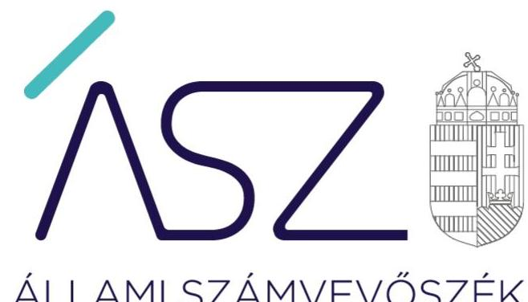
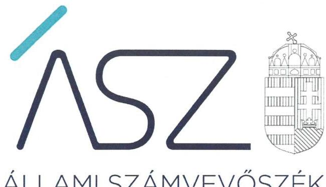
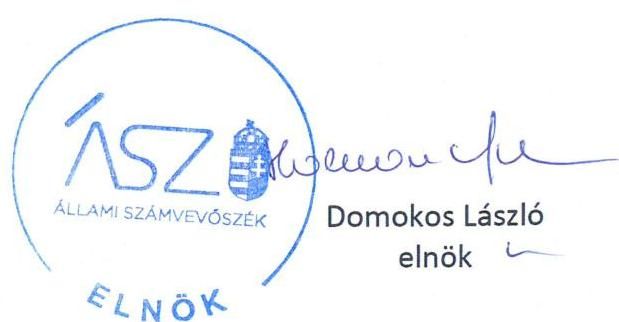

ÁLLAMI SZÁMVEVŐSZÉK

# JELENTÉS 

Nemzeti tulajdonú gazdasági társaságok ellenőrzése

PRO KULTÚRA SOPRON Nonprofit Korlátolt Felelősségű Társaság
2020.

20190
www.asz.hu

---

ÁLLAMI SZÁMVEVŐSZÉK

# JELENTÉS

Nemzeti tulajdonú gazdasági társaságok ellenőrzése

PRO KULTÚRA SOPRON Nonprofit Korlátolt Felelősségű Társaság

2020. 03. hó 23. nap

20190
www.asz.hu

---

# AZ ELLENŐRZÉST FELÜGYELTE: 

KLINGA LÁSZLÓ felügyeleti vezető

## AZ ELLENŐRZÉST VEZETTE ÉS A VÉGREHAJTÁSÁÉRT FELELŐS:

DR. GÁL NÓRA ellenőrzésvezető

## A PROGRAM ÖSSZEÁLLÍTÁSÁÉRT FELELŐS:

TÓTPÁL SZABOLCS osztályvezető
FEKETE-NAGY ANDRÁS ellenőrzési program készítéséért felelős vezető

IKTATÓSZÁM: : EL-2889-001/2020.
TÉMASZÁM: 2513
ELLENŐRZÉS-AZONOSÍTÓ SZÁM: V082244, V085705

---

# TARTALOMJEGYZÉK 

■ ÖSSZEGZÉS ..... 5
■ AZ ELLENŐRZÉS CÉLJA ..... 6
■ AZ ELLENŐRZÉS TERÜLETE ..... 7
■ AZ ELLENŐRZÉS HÁTTERE, INDOKOLTSÁGA ..... 8
■ A JELENTÉS LÉNYEGES KÉRDÉSKÖREI ..... 9
■ AZ ELLENŐRZÉS HATÓKÖRE ÉS MÓDSZEREI ..... 10
■ MEGÁLLAPÍTÁSOK ..... 13
■ JAVASLATOK ..... 17
■ MELLÉKLETEK ..... 19
I. sz. melléklet: Értelmező szótár ..... 19
■ FÜGGELÉK: ÉSZREVÉTELEK ..... 21
■ RÖVIDÍTÉSEK JEGYZÉKE ..... 27

---

.

---

# ÖSSZEGZÉS 

A PRO KULTÚRA SOPRON Nonprofit Kft. felett tulajdonosi jogokat gyakorló Sopron Megyei Jogú Város Önkormányzata tulajdonosi joggyakorlása a 2017-2018. években nem volt szabályszerű. A Társaság vagyongazdálkodása a 2015-2017. években nem volt szabályszerű, a 2018. évben szabályszerű volt.

## Az ellenőrzés társadalmi indokoltsága

Az Állami Számvevőszék kiemelt célja, hogy a helyi önkormányzatok gazdálkodásában rejlő pénzügyi kockázatok feltárásával, az államháztartáson kívülre nyújtott költségvetési támogatások és ingyenes vagyonjuttatások, valamint az államháztartáson kívül múködő feladat-ellátó rendszerek ellenőrzéseivel hozzájáruljon ahhoz, hogy a közpénzeket az államháztartáson kívül múködő szervezetek is átlátható, rendezett módon használják fel.

Magyarországon az önkormányzatok kötelező és önként vállalt feladataik vonatkozásában is egyre szélesebb körben alkalmazzák a költségvetésen kívüli feladatellátást, ezáltal az önkormányzati tulajdonú gazdasági társaságok is kiemelt fontosságú szerephez jutottak.

Az állam és a helyi önkormányzatok tulajdona nemzeti vagyon, melynek megőrzése érdekében kiemelten fontos a nemzeti tulajdonú gazdasági társaságok ellenőrzése. Ellenőrzésüket további társadalmi elvárás is indokolja, részben a gazdálkodásuk körébe tartozó vagyon nagysága, részben az általuk ellátott közszolgáltatások, sajátos feladatellátások, mivel tevékenységükön keresztül a lakosság széles köre kerül kapcsolatba a társaságokkal.

Az Állami Számvevőszék céljaival és a társadalmi igénnyel összhangban, a gazdasági társaságok kiemelt fontosságú szerepe miatt került sor a PRO KULTÚRA SOPRON Nonprofit Kft. vagyongazdálkodásának, illetve Sopron Megyei Jogú Város Önkormányzata tulajdonosi joggyakorlásának ellenőrzésére.

## Főbb megállapítások, következtetések, javaslatok

Sopron Megyei Jogú Város Önkormányzata tulajdonosi joggyakorlása a 2017-2018. években nem volt szabályszerű, mert a Társaság felügyelőbizottsága a jogszabályi előírással ellentétesen nem rendelkezett Ügyrenddel.

Sopron Megyei Jogú Város Önkormányzata polgármestere az ellenőrzött időszakot követően a feltárt hiányosságokat felszámolta és intézkedett a Felügyelő bizottság ügyrendjének megállapításáról és az Alapító okiratban előírt gyakoriságú ülésezéséről.

A PRO KULTÚRA SOPRON Nonprofit Kft. vagyongazdálkodása a 2015-2017. években nem volt szabályszerű. A Társaság a beszámoló mérlegtételeinek alátámasztásához nem készített a jogszabályi előírásoknak megfelelő leltárt. A Társaság, mint kormányzati szektorba sorolt gazdasági társaság az adósságot keletkeztető ügyleteit szabálytalanul, az államháztartásért felelős miniszter hozzájárulása nélkül kötötte meg, továbbá nem tett eleget a 2015. és 2017. évre vonatkozóan a jogszabályban előírt adatszolgáltatási kötelezettségének. 2018-ban a Társaság a beszámolót szabályszerű leltárral alátámasztotta.

Az Állami Számvevőszék a jelentésben foglalt megállapítások alapján Sopron Megyei Jogú Önkormányzata polgármesterének kettő, a PRO KULTÚRA SOPRON Nonprofit Kft. ügyvezetőjének hat javaslatot fogalmazott meg.

---

# AZ ELLENŐRZÉS CÉLJA 

AZ ELLENŐRZÉS CÉLJA annak megállapítása, hogy a tulajdonosi joggyakorló a gazdasági társaságai feletti tulajdonosi joggyakorlás kereteit kialakította-e, tulajdonosi jogait megfelelően gyakorolta-e és kötelezettségeit teljesítette-e. A gazdasági társaság biztosította-e a vagyon védelmét a nyilvántartások szabályszerű vezetése és a mérleg tételeinek leltárral történő alátámasztása útján, valamint szabályszerűen gondoskodott-e a társaság használatában, kezelésében lévő nemzeti vagyon értékének megőrzéséről, gyarapításáról, hasznosításáról. A kormányzati szektorba sorolt nemzeti tulajdonban (résztulajdonban) lévő gazdasági társaságok gazdálkodásának a kormányzati szektor hiányára és az államadósságra befolyással bíró elemei a jogszabályi előírásoknak megfeleltek-e és ezen gazdasági társaságok az adatszolgáltatási kötelezettségüknek eleget tettek-e.

Az ellenőrzés célja volt még a gazdasági társaság vezetője tevékenységében rejlő kockázatok azonosítása az egyes vezetői feladatok ellátásával összhangban.

---

# AZ ELLENŐRZÉS TERÜLETE 

## Sopron Megyei Jogú Város Önkormányzata, valamint a kizárólagos tulajdonában lévő PRO KULTÚRA SOPRON Nonprofit Kft.

A Társaság ${ }^{1}$ 2009. január 19-én átalakulással az 1996. évben alapított Pro Kultúra Sopron Színházi és Kulturális Közhasznú Társaság jogutódjaként jött létre. Az Önkormányzat² kizárólagos tulajdonában lévő Társaság feladata volt a kulturális szolgáltatási közfeladatok ellátása, fő tevékenysége az előadó-művészet volt. Színházakat múködtetett, hangversenyeket, kulturális programokat, rendezvényeket szervezett.

A törzstőkéjének összege az ellenőrzött időszakban 38,41 millió forint volt. Az Mötv. ${ }^{3}$ szerinti kulturális szolgáltatás körében végzett közhasznú tevékenysége keretében az alábbi az Önkormányzat SZMSZ ${ }^{4}$-ében önként vállalt feladatokat közfeladatokat látta el: kulturális programok szervezése, a Soproni Petőfi Színház, Liszt Ferenc Konferencia és Kulturális Központ, illetve egyéb helyszínek, valamint a Soproni Liszt Ferenc Szimfonikus Zenekar múködtetése.

A Társaság vagyonkezelésbe kapott vagyonnal nem rendelkezett, az átlagos állományi létszám 2018-ban 95 fő volt.

A Társaság az ellenőrzött időszakban a kormányzati szektorba sorolt gazdasági társaságok közé tartozott.

Az ellenőrzött időszakban a polgármester személyében nem történt változás. A Társaság ügyvezetőjének személye az ellenőrzött időszak alatt egy alkalommal, 2016. december 22. napjától változott. A Társaság Felügyelő Bizottsága 3 főből állt. A Társaság az ellenőrzött időszakban könyvvizsgálatra kötelezett volt és rendelkezett könyvvizsgálóval.

---

# AZ ELLENŐRZÉS HÁTTERE, INDOKOLTSÁGA 

Az Alaptörvény ${ }^{5}$ 38. cikke alapján az állam és a helyi önkormányzatok tulajdona nemzeti vagyon. A nemzeti vagyon megőrzése, megóvása érdekében kiemelten fontos ezen nemzeti tulajdonú gazdasági társaságok ellenőrzése. Gazdálkodásuk jellemzően a közérdeklődés és a média figyelmének középpontjában áll, amihez hozzájárul a gazdálkodásuk körébe tartozó - a nemzeti vagyon részét képező - vagyon nagysága, illetve az általuk ellátott közszolgáltatások minősége és hatékonysága.

Ellenőrzéseink feltárhatják, hogy a tulajdonosi felügyelet hozzájárult-e a szabályszerű gazdálkodáshoz és feladatellátáshoz. A megállapítások alapján megfogalmazott számvevőszéki javaslatok hasznosítása elősegítheti a meglévő hibák megszüntetését. A jó gyakorlatok bemutatásával az ÁSZ ${ }^{6}$ hozzájárulhat a követendő megoldások megismertetéséhez, terjesztéséhez.

Az ellenőrzés eredményeként továbbá meghatározhatóvá válnak a szervezet vagyongazdálkodást érintő kockázatai, ezzel lehetővé téve a kockázatok csökkentését. A megállapítások alapján megfogalmazott számvevőszéki javaslatok hasznosítása elősegítheti a meglévő hibák megszüntetését. A jó gyakorlatok bemutatásával az ÁSZ hozzájárulhat a követendő megoldások megismertetéséhez, terjesztéséhez.

Az Európai Közösséget létrehozó szerződéshez csatolt, a túlzott hiány esetén követendő eljárásról szóló jegyzőkönyv alkalmazásáról megalkotott 2009. május 25-i 479/2009/EK Rendelet II. fejezet 3. cikk (1) bekezdése alapján a tagállamok évente kétszer teljesítenek adatszolgáltatást a Bizottság (Eurostat) részére a tervezett és tényleges kormányzati hiányukról és államadósságuk szintjéről. Az adatszolgáltatás teljesítéséhez kapcsolódóan - összhangban a hivatkozott, és egyéb európai uniós jogszabályokkal nemcsak az államháztartás, hanem az államháztartáson kívüli, kormányzati szektorba sorolt egyéb szervezetek adatait is figyelembe kell venni, tekintettel arra, hogy mindkét terület gazdálkodása befolyásolja a kormányzati szektor hiányát, az államadósság mértékét.

A „jól irányított állam" megteremtésével kapcsolatos célokkal összhangban van, hogy olyan vezetői teljesítményértékelési rendszer kerüljön kialakításra és működtetésre, amely hozzájárul a szervezeti teljesítmény növeléséhez, a fejlődési lehetőségek kihasználásához. Az ÁSZ a rendszer kiépítésében vállalt aktív ellenőrzési, értékelési tevékenységével kíván hozzájárulni a „jól irányított állam" megteremtéséhez.

---

# A JELENTÉS LÉNYEGES KÉRDÉSKÖREI 

1.     - A gazdasági társaság feletti tulajdonosi joggyakorlás megfelel-e a jogszabályi és a belső elöírásoknak?
2.     - A gazdasági társaság vagyongazdálkodási tevékenysége szabályszerű volt-e?
3.     - A kormányzati szektorba sorolt gazdasági társaság gazdálkodásának a kormányzati szektor hiányára és az államadósságra befolyással bíró elemei megfeleltek-e a jogszabályi elöírásoknak, az adatszolgáltatási kötelezettségének eleget tett-e?
4. A vezető tevékenysége megfelelő volt-e?

---

# AZ ELLENŐRZÉS HATÓKÖRE ÉS MÓDSZEREI 

## Az ellenőrzés típusa

Megfelelőségi ellenőrzés.

## Az ellenőrzött időszak

A tulajdonosi joggyakorlás vonatkozásában az ellenőrzött időszak a 20172018. év, az éves beszámolók elfogadása és a vagyonkezelésbe adott vagyonnal való gazdálkodás tulajdonosi ellenőrzése kivételével, amelyeknél az ellenőrzött időszak 2015-2018. évek.

A Társaság vagyongazdálkodása vonatkozásában az ellenőrzött időszak a 2015-2018. évek, kivéve a kormányzati szektorba sorolt nemzeti tulajdonban lévő gazdasági társaságra vonatkozó egyes kötelezettségek teljesítésének ellenőrzése, mely a 2015. és 2017. évekre terjedt ki.

A vezetői teljesítmény értékelése tekintetében az ellenőrzött időszak a 2018. év.

## Az ellenőrzés tárgya

Az önkormányzati tulajdonban lévő gazdasági társaság feletti tulajdonosi joggyakorlás kialakítása és múködtetése.

Az önkormányzati tulajdonban lévő gazdasági társaság vagyongazdálkodása keretében a társaság használatában, kezelésében lévő nemzeti vagyon, illetve a saját vagyon tekintetébe a vagyonnyilvántartások vezetése, leltára. A társaság használatában, vagyonkezelésében lévő nemzeti vagyon tekintetében a vagyon értékének megőrzése, gyarapítása, hasznosítása.

Kormányzati szektorba sorolt nemzeti tulajdonban lévő gazdasági társaság gazdálkodásának a kormányzati szektor hiányára és az államadósságra befolyással bíró elemei és a jogszabályi előírásoknak megfelelő adatszolgáltatási kötelezettségük teljesítése.

A vezetői teljesítmény értékelése vonatkozásában, hogy a vezető kiala-kította-e a társaság átlátható, szabályszerű, gazdaságos, hatékony, eredményes és felelős gazdálkodásának feltételrendszerét, érvényesítette-e az integritás szemléletet.

## Az ellenőrzött szervezet

Sopron Megyei Jogú Város Önkormányzata, PRO KULTÚRA SOPRON Nonprofit Korlátolt Felelősségű Társaság

---

# Az ellenőrzés jogalapja 

Az ellenőrzés jogalapját az ÁSZ tv. ${ }^{7}$ 1. § (3) bekezdése, 5. § (3)(5) bekezdései képezik.

## Az ellenőrzés módszerei

Az ellenőrzést az ellenőrzési program ellenőrzési kérdései, az ellenőrzött időszakban hatályos jogszabályok, az ellenőrzés szakmai szabályok és módszertanok alapján, a nemzetközi standardok figyelembe vételével végeztük.

Az ellenőrzés ideje alatt az ellenőrzött szervezettel történő kapcsolattartást az ÁSZ Szervezeti és Múködési Szabályzatának vonatkozó előírásai alapján biztosítottuk.

Az ellenőrzési kérdések megválaszolásához szükséges bizonyítékok megszerzése a Társaság vagyongazdálkodása vonatkozásában a következő ellenőrzési eljárások alkalmazásával történt: megfigyelés, információkérés, összehasonlítás, elemző eljárás. Az ellenőrzési bizonyítékként felhasználható adatforrások közé tartoznak az ellenőrzési programban felsorolt adatforrások, továbbá minden - az ellenőrzés folyamán - feltárt, az ellenőrzés szempontjából információkat tartalmazó dokumentum.

A vagyonnyilvántartások és a leltár szabályszerűsége esetében az ellenőrzés azokra a legnagyobb értékű tételekre - a lényeges sokaságra - terjedt ki, melyek összértéke eléri a teljes sokaság összértékének 50\%-át. A 2015., 2017. és 2018. évek esetében a lényeges sokaságot tételesen ellenőriztük. A 2015-2018. évekre történt meg a lényeges dokumentumok, ennek keretében a leltározáshoz kapcsolódó dokumentumok, valamint a mérleg tételeit alátámasztó leltár értékelése.

A tulajdonosi joggyakorlás vonatkozásában az ÁSZ a tulajdonosi joggyakorlás kereteinek kialakítását, a tulajdonosi joggyakorló felügyelő bizottság és független könyvvizsgáló működéséhez kapcsolódó tevékenységét ellenőrizte. Ellenőrzésre került továbbá a tulajdonosi joggyakorló éves beszámoló elfogadására vonatkozó döntéshozatalban történő részvétele.

A vezetői teljesítmény ellenőrzési szempontjait a szabályszerűségi szempontok szerinti ellenőrzésben a jogszabályi előírások, belső utasítások, belső szabályozók, a tulajdonosi joggyakorlók elvárásai, előírásai, a helyénvalósági szempontok szerinti ellenőrzésben az ÁSZ által általánosan elfogadott, jó gyakorlat szerinti ajánlásai, értékelési kritériumai mentén kerültek meghatározásra. Az ellenőrzési kérdések szerint az összesített értékelés alapján az elért pontok az elérhető pontok minimum 70\%-át elérve, a társaság vezetője tevékenységét megfelelőnek, 70\% alatt nem megfelelőnek tekintette az ÁSZ.

Az ellenőrzés során az ellenőrzött kormányzati szektorba sorolt gazdasági társaság gazdálkodásának az államadósságra, továbbá a kormányzati szektor hiányára befolyással bíró gazdasági eseményei elszámolásának megfelelősége 2015. és 2017. évek tekintetében kerül ellenőrzésre. A kormányzati szektorba sorolt gazdasági társaságok adatszolgáltatási kötelezettségére vonatkozó jogszabályi előírások betartását a teljes ellenőrzött időszakra vonatkozóan értékeltük.

---

A kormányzati szektorba sorolt szervezet 2015. és 2017. évi adósságot keletkeztető ügyleteinek szabályszerűsége esetében az ellenőrzés azokra a legnagyobb értékű tételekre - a lényeges sokaságra - terjedt ki, melyek összértéke eléri a teljes sokaság összértékének 50\%-át. A lényeges sokaság esetében tételes ellenőrzésre került sor.

Az ellenőrzést a kérdésekre adott válaszok kiértékelésével, valamint a megjelölt adatforrások, a csatolt tanúsítványok felhasználásával, továbbá az adott időszakban hatályos jogszabályok figyelembe vételével folytattuk le.

---

# 1. A gazdasági társaság feletti tulajdonosi joggyakorlás megfelel-e a jogszabályi és a belső előírásoknak? 

Összegző megállapítás

A Társaság feletti tulajdonosi joggyakorlás a 2017-2018. években nem volt szabályszerű.

A TULAJDONOSI JOGGYAKORLÁS KERETEIT az Alapító ${ }^{8}$ az SZMSZ-ben, a Vagyonrendeletben ${ }^{9}$, valamint a Társaság Alapító Okiratá $1,2,3,4,5$-ban ${ }^{10}$ a jogszabályi előírásokkal összhangban kialakította.

Az Alapító a Társaság Alapító Okiratában, a Közszolgáltatási szerződés ${ }_{1,}{ }^{11,12}$-ben, valamint a Fenntartói megállapodásban ${ }^{13}$, az Nvtv. ${ }^{14}$ előírásai szerint meghatározta a Társaság tevékenységével kapcsolatos elvárásokat és követelményeket. A Társaság közfeladatainak ellátásához szükséges ingatlanokat és ingóságokat Használatba adási szerződés ${ }_{1,2}{ }^{15}{ }^{16}$ keretében bocsátotta rendelkezésre. A Használatba adási szerződés ${ }_{1,2}$-ben az ingatlanvagyon megőrzése, értékének, állagának védelme, értéknövelő használata és hasznosítása érdekében rendelkeztek a használatba adó és a használó kötelezettségeiről, figyelemmel az Nvtv.-ben foglaltakra.

A Társaság Alapítója a Taktv. ${ }^{17}$ előírásaival összhangban alkotta meg a vezető tisztségviselők, a felügyelőbizottsági tagok, az Mt. ${ }^{18}$ 208. §-ának hatálya alá eső munkavállalók javadalmazásáról, valamint a jogviszony megszűnése esetére biztosított juttatások módjának, mértékének elveiről, annak rendszeréről szóló szabályzatot.

Az Alapító a tulajdonosi jogai érvényesítése érdekében a Bkr. ${ }^{19}$-ben foglaltaknak megfelelően kialakította a Társaság tevékenységének, a célok megvalósításának nyomon követését biztosító rendszerét.

A FELÜGYELŐBIZOTTSÁG ${ }^{20}$ a Ptk. ${ }^{21}$ 3:122. § (3) bekezdésének előírásai ellenére nem rendelkezett ügyrenddel. A 2017. és 2018. évben a Felügyelő Bizottság mindössze kettő alkalommal ülésezett, figyelmen kívül hagyva az Alapító okirat V. fejezetének 3. pontjának D) alpontjában foglaltakat, mely szerint negyedévente legalább egy alkalommal ülésezik a Bizottság.

A SZÁMVITELI BESZÁMOLÓK ELFOGADÁSÁRÓL, valamint az adózott eredmény felosztásáról a Társaság Alapítója döntött, figyelemmel a Ptk. előírásaira. A döntéshez a Felügyelőbizottság és a könyvvizsgáló jelentése rendelkezésre állt.

---

# 2. A gazdasági társaság vagyongazdálkodási tevékenysége szabályszerű volt-e? 

Összegző megállapítás

A Társaság vagyongazdálkodási tevékenysége a 2015-2017. években a leltár hiányossága miatt nem volt szabályszerű, a 2018. évben szabályszerű volt.

A VAGYONHOZ KAPCSOLÓDÓ NYILVÁNTARTÁSOK vezetésének kereteit a Társaság kialakította, a Társaság SZMSZ $1,2,3^{22}$-ében, az Ügyvezetői utasításban ${ }^{23}$, Számviteli politikában $1,2,3^{24}$ meghatározták a vagyongazdálkodással kapcsolatos feladat- és hatásköröket, felelősségi viszonyokat, összhangban az Alapító okirat $1,2,3,4,5$-ban foglaltakkal.

A Társaság a tulajdonában lévő tárgyi eszközeiről a számviteli nyilvántartásait a 2015.,2017. és 2018. években szabályszerűen, a Számv. tv. ${ }^{25}$ előírásait figyelembe véve vezette.

## LELTÁRKÉSZÍTÉSI ÉS LELTÁROZÁSI SZABÁLY-

ZATTAL a Társaság rendelkezett az ellenőrzött időszakban a Számv. tv. előírásainak megfelelően. A Szabályzat tartalmazta a leltározásra és leltárkészítésre vonatkozó szabályokat, előírásokat.

A MÉRLEG TÉTELEINEK ALÁTÁMASZTÁSÁHOZ a Társaság a Számv. tv. 69. § (1) bekezdésének előírása ellenére 2015-2017. évekre vonatkozóan nem állított össze olyan leltárt, amely tételesen, ellenőrizhető módon tartalmazta a mérleg fordulónapján meglévő eszközeit értékben. A Társaság könyvvizsgálója a 2015-2017. évi beszámolókról korlátozás nélküli véleményt adott. 2018-ban a leltár összeállítása a Számv. tv. 69. § (1) bekezdésének előírásai szerint megtörtént.

A VAGYONELEMEK HASZNOSÍTÁSA a Társaságnál az Nvtv. előírásaival összhangban történt, a bérleti szerződéseket az Nvtv. 11. § (10) bekezdésében foglaltakkal összhangban kötötték meg.

## 3. A kormányzati szektorba sorolt gazdasági társaság gazdálkodásának a kormányzati szektor hiányára és az államadósságra befolyással bíró elemei megfeleltek-e a jogszabályi előírásoknak, az adatszolgáltatási kötelezettségének eleget tett-e?

Összegző megállapítás

A Társaság általi adósságot keletkeztető ügyletek megkötése 2015-ben és 2017-ben nem volt szabályszerű, ezzel kapcsolatos adatszolgáltatási kötelezettségének nem tett eleget.

AZ ADÓSSÁGOT KELETKEZTETŐ ÜGYLETEKET a Társaság nem a jogszabályi előírásoknak megfelelően kötötte meg az ellenőrzött időszakban, mivel az államháztartáson kívüli szervezettel kö-

---

tendő, naptári éven túli futamidejű adósságot keletkeztető ügyletek megkötéséhez nem rendelkezett az államháztartásért felelős miniszter előzetes hozzájárulásával, megsértve a Stabilitási tv. ${ }^{26} 9 . \S$ (1) bekezdésében foglaltakat.

A Társaság az ellenőrzött időszakban az adósságot keletkeztető ügyletei alapján keletkezett kötelezettségeit szabályszerűen, a Számv. tv. előírásainak figyelembe vételével tartotta nyilván, ugyanakkor egy gépjármú beszerzés finanszírozásához kapcsolódó, könyvviteli elszámolást alátámasztó számviteli bizonylat - líingszerződés - megőrzéséről a Társaság nem gondoskodott, megsértve a Számv. tv. 169. § (2) bekezdésében foglaltakat.

ADATSZOLGÁLTATÁSI KÖTELEZETTSÉGÉNEK a Társaság nem tett eleget, mivel a 2015. és 2017. évi éves beszámolóit és az azokról készített könyvvizsgálói jelentéseket nem küldte meg az államháztartásért felelős miniszter részére, figyelmen kívül hagyva az Áht. ${ }^{27}$ 109. § (8) bekezdésre tekintettel az Ávr. ${ }^{28} 5$. mellékletének 23. pontjában foglaltakat 2015. és 2017. években, valamint az Ávr. 5. mellékletének 24. pontjában foglaltakat 2015. évben.

# 4. A vezető tevékenysége megfelelő volt-e? 

## Összegző megállapítás

A vezető tisztségviselő tevékenysége a 2018. évben nem volt megfelelő.

A VEZETŐ TISZTSÉGVISELŐ nem dolgozta ki a Társaság középtávú stratégiáját. Nem múködtetett a szervezet teljesítményének értékelése céljából mutatószámokon, mutatószámrendszeren alapuló szervezeti teljesítményértékelési rendszert. Nem elemezte a bevételek növelését, a kiadások csökkentését célzó lehetőségeket.

Nem működtetett a vezetést támogató információs/kontrolling rendszert és a gazdálkodás, tevékenység folyamataira vonatkozó belső ellenőrzési rendszert.

Nem működtetett egyéni teljesítményértékelési, teljesítmény-ösztönző rendszert.

A vezető tisztségviselő a Bkr. 54/A. §-ban foglaltakra tekintettel a Társaság, mint kormányzati szektorba sorolt egyéb szervezet vonatkozásában köteles volt a Bkr. 1-10. §-aiban foglaltak alkalmazására.

A Bkr. 7. § (2) bekezdésébe foglalt előírások ellenére azonban nem múködtette az integrált kockázatkezelési rendszert, nem mérte fel és nem értékelte a szervezetet és a tevékenységet érintő kockázatokat.

A Bkr. 6. § (3) bekezdésébe foglalt előírás ellenére nem gondoskodott a szervezet feladatellátásának egészére kiterjedő ellenőrzési nyomvonal kidolgozásáról.

A vezető tisztségviselő irányítása alatt a Társaságnál nem érvényesült az integritás szemlélet. Nem adta ki a szervezeti integritást sértő események kezelésének eljárásrendjét, amivel nem tett eleget a Bkr. 6. § (4) bekezdésében foglaltaknak. Nem mérte fel a szervezet múködésével kapcsolatos integritási és korrupciós kockázatokat sem. Továbbá a

---

Vagyonnyil. tv. ${ }^{29} 3 . \S$ (3) c) és ea) bekezdése ellenében nem állt rendelkezésre a vezető vagyonnyilatkozata.

A fenti hiányosságok miatt a vezető tisztségviselő nem biztosította a Társaság átlátható müködését és annak alapfeltételeit.

---

# JAVASLATOK 

Az ÁSZ tv. 33. § (1) bekezdésében foglaltak értelmében az ellenőrzött szervezet vezetője köteles a jelentésben foglalt megállapításokhoz kapcsolódó intézkedési tervet összeállítani és azt a jelentés kézhezvételétől számított 30 napon belül az ÁSZ részére megküldeni. Amennyiben az ellenőrzött szervezet vezetője nem küldi meg határidőben az intézkedési tervet, vagy továbbra sem elfogadható intézkedési tervet küld, az Állami Számvevőszék elnöke az ÁSZ tv. 33. § (3) bekezdése a) és b) pontjaiban foglaltakat érvényesítheti.

## PRO KULTÚRA SOPRON Nonprofit Kft. ügyvezetőjének

1. Intézkedjen az adósságot keletkeztető ügyletek Stabilitási tv. előirásai szerinti megkötéséről.
(3. sz. megállapítás 1. bekezdése alapján)
2. Intézkedjen a könyvviteli elszámolást közvetlenül és közvetetten alátámasztó számviteli bizonylatok Számv. tv.-ben elöirtak szerinti megőrzéséről.
(3. sz. megállapítás 2. bekezdés 2. tagmondata alapján)
3. Intézkedjen az Ávr.-ben elöirt adatszolgáltatási kötelezettség teljesitéséről.
(3. sz. megállapítás 3. bekezdése alapján)
4. Gondoskodjon az integrált kockázatkezelési rendszer Bkr. szerinti müködtetéséről.
(4. sz. megállapítás 5. bekezdése alapján)
5. Gondoskodjon az ellenőrzési nyomvonal Bkr. szerinti elkészitéséről.
(4. sz. megállapítás 6. bekezdése alapján)
6. Gondoskodjon a Bkr.-ben elöirtaknak megfelelően a szervezeti integritást sértő események kezelése eljárásrendjének szabályozásáról
(4. sz. megállapítás 7. bekezdés 2. mondata alapján)

---

# Sopron Megyei Jogú Város Önkormányzata polgármesterének 

1. Kezdeményezze, hogy a Felügyelő Bizottság állapítsa meg ügyrendjét a Ptk.-ban elöirtaknak megfelelöen.
(1. sz. megállapítás 5. bekezdés 1. mondata alapján)
2. Kezdeményezze, hogy a Felügyelő Bizottság az Alapitó okiratban elöirt gyakorisággal ülésezzen.
(1. sz. megállapítás 5. bekezdés 2. mondata alapján)

---

# MELLÉKLETEK 

- I. SZ. MELLÉKLET: ÉRTELMEZŐ SZÓTÁR
gazdasági társaság
kormányzati szektorba sorolt egyéb szervezet
közfeladat
közszolgáltatás
nemzeti vagyon
nemzeti vagyon hasznosítása
nemzeti vagyon használója
nonprofit gazdasági társaság
tulajdonosi jogok gyakorlója

A gazdasági társaságok üzletszerű közös gazdasági tevékenység folytatására, a tagok vagyoni hozzájárulásával létrehozott, jogi személyiséggel rendelkező vállalkozások, amelyekben a tagok a nyereségből közösen részesednek, és a veszteséget közösen viselik.
Forrás: Ptk. 3:88. § (1) bekezdése
Az a szervezet, amely az Áht. alapján nem része az államháztartásnak, azonban az Európai Közösséget létrehozó szerződéshez csatolt, a túlzott hiány esetén követendő eljárásról szóló jegyzőkönyv alkalmazásáról szóló 2009. május 25-i 479/2009/EK rendelet szerint a kormányzati szektorba tartozik
Az Áht. 3/A. § (1) bekezdése alapján közfeladat a jogszabályban meghatározott állami vagy önkormányzati feladat.
Az Ebktv. ${ }^{30}$ 3. § d) pontja a következőképpen határozza meg a közszolgáltatást: „szerződéskötési kötelezettség alapján a lakosság alapvető szükségleteinek ellátására irányuló szolgáltatás, így különösen a villamos energia-, gáz-, hő-, víz-, szenny-víz- és hulladékkezelési, köztisztasági, postai és távközlési szolgáltatás, továbbá a menetrend alapján közlekedő járművekkel végzett közforgalmú személyszállítás".
Nvtv. 1. § (2) bekezdése szerint nemzeti vagyonba tartozik többek között:„az állam vagy a helyi önkormányzat kizárólagos tulajdonában álló dolgok,az a) pont hatálya alá nem tartozó, állam vagy a helyi önkormányzat tulajdonában lévő dolog,az állam vagy a helyi önkormányzat tulajdonában lévő pénzügyi eszközök, továbbá az államot vagy a helyi önkormányzatot megillető társasági részesedések,az államot vagy a helyi önkormányzatot megillető bármely vagyoni értékkel rendelkező jogosultság, amelyet jogszabály vagyoni értékű jogként nevesít."
A tulajdonosi joggyakorló vagy a nemzeti vagyon használója által a nemzeti vagyon birtoklásának, használatának, hasznok szedése jogának bármely - a tulajdonjog átruházását nem eredményező - jogcímen történő átengedése, ide nem értve a vagyonkezelésbe adást, valamint a haszonélvezeti jog alapítását.
Forrás: Nvtv. 3. § (1) bekezdés 4. pont
Azon természetes személy, jogi személy vagy jogi személyiséggel nem rendelkező szervezet, aki vagy amely állami vagyon tekintetében törvény vagy szerződés alapján, a helyi önkormányzat vagyona tekintetében törvény, a helyi önkormányzat rendelete vagy szerződés alapján bármely jogcímen nemzeti vagyont birtokol, használ, szedi annak hasznait, kivéve a tulajdonosi joggyakorló.
Forrás: Nvtv. 3. § (1) bekezdés 11. pont
az a gazdasági társaság minősül nonprofit gazdasági társaságnak és cégnevében az a gazdasági társaság tüntetheti fel a nonprofit jelleget, amelynek létesítő okirata tartalmazza, hogy a gazdasági társaság tevékenységéből származó nyereség a tagok között nem osztható fel, hanem az a gazdasági társaság vagyonát gyarapítja.
Forrás: Ctv. ${ }^{31}$ 9/F. § (2) bekezdés
Aki a nemzeti vagyon felett az államot vagy a helyi önkormányzatot megillető tulajdonosi jogok és kötelezettségek összességének gyakorlására jogosult
Forrás: Nvtv. 3. § (1) 17. pontja

---

.

---

# FÜGGELÉK: ÉSZREVÉTELEK 

A jelentéstervezetet a Számvevőszék 15 napos észrevételezésre megküldte az ellenőrzött szervezetek vezetőinek az ÁSZ tv. 29. §* (1) bekezdése előírásának megfelelően.

A PRO KULTÚRA SOPRON Nonprofit Korlátolt Felelősségü Társaság ügyvezetője és Sopron Megyei Jogú Város Önkormányzatának polgármestere a jelentéstervezet megállapításaira írásban észrevételt tett.
Az ÁSZ tv. 29. § (3) bekezdésével összhangban az ÁSZ a Függelékben feltünteti az ellenőrzés megállapításaival kapcsolatban tett, figyelembe nem vett észrevételeket, és megindokolja, hogy azokat miért nem fogadta el.

[^0]
[^0]:    * 29. § (1) Az Állami Számvevőszék az ellenőrzési megállapításait megküldi az ellenőrzött szervezet vezetőjének vagy az általa megbízott személynek, és annak, akinek személyes felelősségét állapította meg.
    (2) Az ellenőrzött szervezet vezetője és a felelősként megjelölt személy az ellenőrzés megállapításaira tizenöt napon belül írásban észrevételt tehet.
    (3) Az Állami Számvevőszék az észrevételre a beérkezésétől számított harminc napon belül írásban válaszol. A figyelembe nem vett észrevételeket köteles a jelentésben feltüntetni, és megindokolni, hogy azokat miért nem fogadta el.

---

A számvevőszéki jelentéstervezet megállapításaival kapcsolatban a PRO KULTÚRA SOPRON Nonprofit Kft. ügyvezetője által 2020. augusztus 5-én tett (az Állami Számvevőszékhez 2020. augusztus 7-én érkezett) el nem fogadott észrevételek és azok kezelésének indokolása.

1. A leltárral kapcsolatban tett megállapításra érkezett észrevétel (Jelentéstervezet 2. megállapítás 4. bekezdés)

Az ügyvezető észrevételében vitatta a jelentéstervezet 2015-2017. évi leltár hiányosságára vonatkozó megállapítását. Ennek alátámasztására kifejtette, hogy a Társaság a 2015-2017. években a beszámoló mérlegadatainak alátámasztására elvégezte a mérlegben kimutatható minden eszköz és forrás teljes körű leltározását. Jelezte, hogy a 2015-2017. évekre vonatkozóan kizárólag az Állami Számvevőszék megkeresésének megfelelő adatokat bocsátotta rendelkezésre, de ezeket meghaladóan teljes körűen rendelkezésre állnak a leltárak, leltározási ütemtervek, amelyek meghatározzák a mennyiségi felvétellel leltározandó eszközök csoportjainak és leltári körzeteknek a kijelölését, valamint a leltározás végrehajtásában résztvevő személyeket, felelősöket és határidőket.

Az EL-0933-003/2018. iktatószámú adatbekérő levélben kértük a Társaság mérleg tételeit alátámasztó 2015-2017. évi leltárak átadását. A 2018. augusztus 22-én kelt teljességi és hitelességi nyilatkozattal alátámasztott módon 20152017. évi leltár dokumentumok kerültek átadásra. Az átadott 2015-2017. évi leltár dokumentáció nem felelt meg a Számv. tv. 69. § (1) bekezdésében foglalt előírásoknak, mivel a tárgyi eszközök vonatkozásában ellenőrizhető módon nem tartalmazta a Társaságnak a mérleg fordulónapján meglévő eszközeit értékben (fordulónapi nettó érték).

Az ügyvezető a 2018. augusztus 22-én kelt teljességi és hitelességi nyilatkozatában kijelentette, hogy az átadott dokumentumok, adatok hitelességéért, valódiságáért, hiánytalanságáért és hatályosságáért teljes felelősséget vállal. Az Állami Számvevőszék ellenőrzési megállapításait az ellenőrzési adatbekérés során határidőben átadott, hiteles dokumentumok alapján teszi meg.

# 2. Az adósságot keletkeztető ügyletekhez beszerzendő hozzájárulásokkal kapcsolatban tett észrevétel (Jelentéstervezet 3. megállapítás 1. bekezdés) 

Az ügyvezető észrevételében jelezte, hogy a Társaság az ellenőrzött időszakban három nyilt végú pénzügyi lízing szerződéssel rendelkezett, amely szerződésekre vonatkozóan a Társaság a Stabilitási tv. 9. § (1) bekezdése alapján intézkedett ezen adósságot keletkeztető ügyletekhez az államháztartásért felelős miniszter hozzájárulásának beszerzése iránt. Az államháztartásért felelős miniszter tájékoztatását igazoló levelet észrevételéhez mellékelte.

Az EL-1351-020/2019. iktatószámú adatbekérő levelekben kértük a Társaság ellenőrzésre kiválasztott mintatételei vonatkozásában az államháztartásért felelős miniszter által jóváhagyott kérelem, illetve az államháztartásért felelős miniszter engedélyének átadását.

A 2019. június 28-án kelt teljességi és hitelességi nyilatkozatokkal alátámasztott módon a Társaság három éven túli lízingszerződés tekintetében a Stabilitási tv. 9. § (1) bekezdése szerinti, az államháztartásért felelős miniszter előzetes hozzájárulását tanúsító dokumentumot nem nyújtott be, helyette az ügyvezető 2019. június 27-én kelt nyilatkozatában jelezte, hogy az ellenőrzött időszakban az államháztartásért felelős miniszter által jóváhagyott kérelemmel, illetve kapcsolódó engedéllyel nem rendelkeznek. Az észrevételben hivatkozott dokumentum az előzetes hozzájárulás pótolására nem alkalmas, mivel abban utólag, több mint egy éves késéssel került tájékoztatásra az államháztartásért felelős miniszter a naptári éven túli futamidejű adósságot keletkeztető ügylet megkötéséről, előzetes hozzájárulás bekérése helyett.

## 3. A számviteli bizonylatok megőrzésével kapcsolatban tett észrevétel (Jelentéstervezet 3. megállapítás 2. bekezdés 2. tagmondata)

Az ügyvezető észrevételében jelezte, hogy az ellenőrzött időszakban a három nyilt végú lizingszerződés vonatkozásában a gépjármú beszerzés finanszírozásához kapcsolódó, könyvviteli elszámolást alátámasztó számviteli bizonylatokkal teljeskörűen rendelkeztek, azonban az adatbeküldés során adminisztrációs hiba miatt a Társaság az NPG 856 forgalmi rendszámú gépjármú lizingszerződése helyett az NBD 181 forgalmi rendszámú gépjármú lizing szerződését töltötte fel ismételten. A helyes lizingszerződést észrevételéhez mellékelve megküldte.

---

Az EL-1351-020/2019. iktatószámú adatbekérő levelekben kértük a Társaság ellenőrzésre kiválasztott mintatételei vonatkozásában az adósságot keletkeztető ügylet dokumentumainak átadását. A 2019. június 28 -án kelt teljességi és hitelességi nyilatkozatokkal alátámasztott módon a NPG 856 forgalmi rendszámú gépjármű lizingszerződése - az észrevételben is elismert módon - nem került benyújtásra. Az ügyvezető a 2019. június 28 -án kelt teljességi és hitelességi nyilatkozatában kijelentette, hogy az átadott dokumentumok, adatok hitelességéért, valódiságáért, hiánytalanságáért és hatályosságáért teljes felelősséget vállal. Az Állami Számvevőszék ellenőrzési megállapításait az ellenőrzési adatbekérés során határidőben átadott, hiteles dokumentumok alapján teszi meg.

# 4. Az adatszolgáltatási kötelezettségek teljesítésével kapcsolatban tett megállapításra érkezett észrevétel (Jelentéstervezet 3. megállapítás 3. bekezdése) 

Az ügyvezető észrevételében részletesen bemutatta, hogy a Társaság az ellenőrzött időszak vonatkozásában hogyan tett eleget adatszolgáltatási kötelezettségeinek. Ennek keretében az ellenőrzés során tett megállapításhoz kapcsolódva jelezte, hogy a Társaság intézkedett a 2015. és 2017. évi éves beszámolóinak és az azokról készített könyvvizsgálói jelentéseknek az államháztartásért felelős miniszter részére történő megküldése iránt. Az észrevételéhez mellékelte a beszámolók és könyvvizsgálói jelentések megküldéséről szóló értesítő levelet.

Az EL-1351-001/2018. iktatószámú adatbekérő levélben kértük a 2015-2017. évek vonatkozásában a kormányzati szektorba sorolt szervezetek részére az Áht. és az Ávr. által előírt adatszolgáltatások dokumentumai, továbbá az adatszolgáltatások megküldésének időpontját igazoló dokumentumok átadását. A 2018. december 27 -én kelt teljességi és hitelességi nyilatkozattal alátámasztott módon a kapcsolódó dokumentum átadására nem került sor.

Az észrevételében hivatkozott dokumentumban az ügyvezető a 2020. augusztus 5 -én kelt levél mellékleteként, pótlólagosan küldi meg az államháztartásért felelős miniszternek a 2015-2017. évekről készített Számv. tv. szerinti beszámolóit és a kapcsolódó könyvvizsgálói jelentéseket.

Az ügyvezető a 2018. december 27-én kelt teljességi és hitelességi nyilatkozatában kijelentette, hogy az átadott dokumentumok, adatok hitelességéért, valódiságáért, hiánytalanságáért és hatályosságáért teljes felelősséget vállal. Az Állami Számvevőszék ellenőrzési megállapításait az ellenőrzési adatbekérés során határidőben átadott, hiteles dokumentumok alapján teszi meg.

## 5. A vezető tisztségviselő tevékenységének minősítésével kapcsolatban tett észrevétel (Jelentéstervezet 4. megállapítás összegző mondata)

Az ügyvezető észrevételében részletesen bemutatta a Társaság 2018. évi szabályozási és müködési környezetét, valamint kiemelte az egyes területeken a Társaság jogszabályi előirásoknak való megfelelőségét, ezzel próbálva rávilágítani vezető tisztségviselő minőségben végzett munkájának megfelelő voltára.

A vezetői teljesítményt minősítő megállapításunkat az EL-2105-005/2019. iktatószámú adatbekérő levél 2.8 mellékletében bekért és a 2020. január 29-én kelt teljességi és hitelességi nyilatkozattal bizonyíthatóan megküldött dokumentumok kiértékelése alapján tettük meg. A megállapított hiányosságok megszüntetésére a benyújtott észrevétel szerint az ügyvezető az ellenőrzött időszakot követően tett intézkedéseket, de ez a 2018. év vonatkozásában tett megállapításokat nem befolyásolja.
6. Az integrált kockázatkezelési rendszer müködtetésével kapcsolatban tett észrevétel (Jelentéstervezet 4. megállapítás 5. bekezdése)

Az ügyvezető levelében jelezte, hogy a Társaságnál 2019. november 4. napjától kezdődő hatállyal 2172/2019. iktatószámon kiadásra került az Integrált kockázatkezelésre vonatkozó szabályzat és annak hatálybalépéséről szóló ügyvezetői utasítás, amelyeket csatoltan megküldtek.

Az ügyvezető az ellenőrzés folyamán az ellenőrzés kapcsolódó adatbekérésére nemleges nyilatkozatot tett. Az integrált kockázatkezelési rendszer müködtetésével kapcsolatban a jelentéstervezetben rögzített hiányosság megszüntetésére az ellenőrzött időszakon kívül megtett intézkedéséről nyújtott tájékoztatását köszönettel vettük.

---

7. A Társaság ellenőrzési nyomvonalával kapcsolatban tett észrevétel (Jelentéstervezet 4. megállapítás 6. bekezdése)

Az ügyvezető levelében jelezte, hogy a Társaságnál hatályban lévő - észrevételéhez csatolt - ügyvezetői utasítás megítélése szerint tartalmazza azon elemeket, amelyek a szervezet összes folyamatában rejlő müködési kockázat feltárására alkalmasak, mert tartalmazzák a szervezet folyamatainak ismeretét, müködtetését. Jelezte továbbá, hogy a Társaság részletes folyamat leírását és az ellenőrzési nyomvonal elkészítését megkezdték.

Az ügyvezető az ellenőrzés folyamán az ellenőrzés kapcsolódó adatbekérésére tett nyilatkozata szerint a Társaság nem rendelkezett külön dokumentumban rögzített ellenőrzési nyomvonallal. A szervezet feladatellátásának egészére kiterjedő ellenőrzési nyomvonallal kapcsolatban a jelentéstervezetben rögzített hiányosság megszüntetésére az ellenőrzött időszakon kívül megtett intézkedéséről nyújtott tájékoztatását köszönettel vettük.
8. A szervezeti integritást sértő események kezelésének eljárásrendjével kapcsolatban tett észrevétel (Jelentéstervezet 4. megállapítás 7. bekezdése 2. mondata)

Az ügyvezető levelében jelezte, hogy a Társaságnál 2019. november 12. napjától kezdődő hatállyal 2208/2019. iktatószámon kiadásra került az integritást sértő események kezelésének eljárásrendje és annak hatálybalépéséről szóló ügyvezetői utasítás, amelyeket csatoltan megküldtek.

Az ügyvezető az ellenőrzés folyamán az ellenőrzés kapcsolódó adatbekérésére nemleges nyilatkozatot tett. A szervezeti integritást sértő események kezelésének eljárásrendjével kapcsolatban a jelentéstervezetben rögzített hiányosság megszüntetésére az ellenőrzött időszakon kívül megtett intézkedéséről nyújtott tájékoztatását köszönettel vettük.

---

A számvevőszéki jelentéstervezet megállapításaival kapcsolatban Sopron Megyei Jogú Város Önkormányzatának polgármestere által 2020. augusztus 6-án tett (az Állami Számvevőszékhez 2020. augusztus 11-én érkezett) el nem fogadott észrevételek és azok kezelésének indokolása.

1. A polgármester tájékoztatását a Felügyelőbizottság ügyrendjének megállapításával és a Felügyelőbizottság Alapító okiratban előírt gyakoriságú ülésezésével kapcsolatban a jelentéstervezetben rögzített hiányosság megszüntetésére az ellenőrzött időszakon kívül megtett intézkedéséről köszönettel vettük.
2. A 2019. június 28-án kelt teljességi és hitelességi nyilatkozatokkal alátámasztott módon a Társaság három éven túli lízingszerződés tekintetében a Stabilitási tv. 9. § (1) bekezdése szerinti, az államháztartásért felelős miniszter előzetes hozzájárulását tanúsító dokumentumot nem nyújtott be, helyette a Társaság ügyvezetője 2019. június 27-én kelt nyilatkozatában jelezte, hogy az ellenőrzött időszakban az államháztartásért felelős miniszter által jóváhagyott kérelemmel, illetve kapcsolódó engedéllyel nem rendelkeznek. Az észrevételben hivatkozott dokumentum az előzetes hozzájárulás pótolására nem alkalmas, mivel abban utólag, több mint egy éves késéssel kerül tájékoztatásra az államháztartásért felelős miniszter a naptári éven túli futamidejű adósságot keletkeztető ügylet megkötéséről, előzetes hozzájárulás bekérése helyett.
3. Az EL-1351-020/2019. iktatószámú adatbekérő levelekben kértük a Társaság ellenőrzésre kiválasztott mintatételei vonatkozásában az adósságot keletkeztető ügylet dokumentumainak átadását. A 2019. június 28-án kelt teljességi és hitelességi nyilatkozatokkal alátámasztott módon a NPG 856 forgalmi rendszámú gépjármú lízingszerződése - az észrevételben is elismert módon - nem került benyújtásra.
A Társaság ügyvezetője 2019. június 28-án kelt teljességi és hitelességi nyilatkozatában kijelentette, hogy az átadott dokumentumok, adatok hitelességéért, valódiságáért, hiánytalanságáért és hatályosságáért teljes felelősséget vállal. Az Állami Számvevőszék ellenőrzési megállapításait az ellenőrzési adatbekérés során határidőben átadott, hiteles dokumentumok alapján teszi meg.
4. Az EL-1351-001/2018. iktatószámú adatbekérő levélben kértük a Társaságtól a 2015-2017. évek vonatkozásában a kormányzati szektorba sorolt szervezetek részére az Áht. és az Ávr. által előírt adatszolgáltatások dokumentumai, továbbá az adatszolgáltatások megküldésének időpontját igazoló dokumentumok átadását. A 2018. december 27-én kelt teljességi és hitelességi nyilatkozattal alátámasztott módon a kapcsolódó dokumentum átadására nem került sor. Az észrevételében hivatkozott dokumentumban a Társaság ügyvezetője a 2020. augusztus 5-én kelt levele mellékleteként, pótlólagosan küldi meg az államháztartásért felelős miniszternek a 2015-2017. évekről készített Számv. tv. szerinti beszámolóit és a kapcsolódó könyvvizsgálói jelentéseket.
5. A polgármester tájékoztatását a jelentéstervezet 4. 5. és 6. javaslatával kapcsolatban a hiányosság megszüntetésére a Társaságnak az ellenőrzött időszakon kívül megtett intézkedéséről nyújtott tájékoztatását köszönettel vettük.

---

.

---

# RÖVIDÍTÉSEK JEGYZÉKE 

${ }^{1}$ Társaság
${ }^{2}$ Önkormányzat
${ }^{3}$ Mötv.
${ }^{4}$ SZMSZ
${ }^{5}$ Alaptörvény
${ }^{6}$ ÁSZ
${ }^{7}$ ÁSZ törvény
${ }^{8}$ Alapító
${ }^{9}$ Vagyonrendelet
${ }^{10}$ Alapító okirat
${ }^{11}$ Közszolgáltatási szerződés ${ }_{1}$
${ }^{12}$ Közszolgáltatási szerződés ${ }_{2}$
${ }^{13}$ Fenntartói megállapodás
${ }^{14}$ Nvtv.
${ }^{15}$ Használatba adási szerződés ${ }_{1}$
${ }^{16}$ Használatba adási szerződés ${ }_{2}$
${ }^{17}$ Taktv.
${ }^{18} \mathrm{Mt}$.
${ }^{19} \mathrm{Bkr}$.
${ }^{20}$ Felügyelőbizottság
${ }^{21}$ Ptk.
${ }^{22}$ Társaság SZMSZ ${ }_{1,2,3,4}$ e

PRO KULTÚRA SOPRON Nonprofit Korlátolt Felelősségű Társaság
Sopron Megyei Jogú Város Önkormányzata
2011. évi CLXXXIX. törvény Magyarország helyi önkormányzatairól
Sopron Megyei Jogú Város Önkormányzatának Szervezeti és Müködési Szabályzatáról szóló, a Sopron Megyei Jogú Város Önkormányzat Közgyűlésének 1/2015.(II.26.) önkormányzati rendelte
Magyarország Alaptörvénye (2011. április 25.)
Állami Számvevőszék
2011. évi LXVI. törvény az Állami Számvevőszékről

Sopron Megyei Jogú Város Önkormányzat Közgyűlése, mint a társaság legfőbb szerve
Sopron Megyei Jogú Város Önkormányzata vagyonáról, a vagyon feletti tulajdonosi jogok gyakorlásának és a vagyon kezelésének szabályozásáról szóló, a Sopron Megyei Jogú Város Önkormányzat Közgyűlésének 3/2013.(III. 4.) önkormányzati rendelte
PRO KULTÚRA SOPRON Nonprofit Kft. Alapító okirata; Alapító okirat1 hatályos: 2014.10.31.-2015.04.14.; Alapító okirat2 hatályos:2015.04.15-2016.08.29.; Alapító okirat3 hatályos: 2016.08.30.-2016.12.21.; Alapító okirat4 hatályos:2016.12.22.; Alapító okirat5 hatályos:2018.06.28.
Sopron Megyei Jogú Város Önkormányzata és a PRO KULTÚRA SOPRON Nonprofit Kft. között 2016. március 31-én létrejött, 60.344-1/2016. számú Közszolgáltatási szerződés
Sopron Megyei Jogú Város Önkormányzata és a PRO KULTÚRA SOPRON Nonprofit Kft. között 2017. május 10-én létrejött, 60.411-2/2017. számú, többször módosított Közszolgáltatási szerződés
Sopron Megyei Jogú Város Önkormányzata és a PRO KULTÚRA SOPRON Nonprofit Kft. között 2015. október 29-én létrejött, majd többször módosított Fenntartói megállapodás
a nemzeti vagyonról szól 2011. évi CXCVI. törvény
Sopron Megyei Jogú Város Önkormányzata és a PRO KULTÚRA SOPRON Nonprofit Kft. között 2018. április 26-án létrejött VI/59201-11/2018. számú Használatba adási szerződés
Sopron Megyei Jogú Város Önkormányzata és a PRO KULTÚRA SOPRON Nonprofit Kft. között 2018. április 27-én létrejött VI/59201-8/2018. számú Használatba adási szerződés
a köztulajdonban álló gazdasági társaságok takarékosabb müködéséről szóló 2009. évi CXXII. törvény
a munka törvénykönyvéről szóló 2012. évi I. törvény
a költségvetési szervek belső kontrollrendszeréről és belső ellenőrzéséről szóló 370/2011. (XII. 31.) Korm. rendelet
a PRO KULTÚRA SOPRON Nonprofit Kft. Felügyelőbizottsága
a Polgári Törvénykönyvről szóló 2013. évi V. törvény
PRO KULTÚRA SOPRON Nonprofit Kft. Szervezeti és Müködési Szabályzata; SZMSZ ${ }_{1}$ hatályos:2014.05.01-2015.04.30; SZMSZ ${ }_{2}$ hatályos:2015.05.01-2016.08.01; SZMSZ ${ }_{3}$ hatályos:2016.09.01-től.

---

${ }^{23}$ Ügyvezetői utasítás
${ }^{24}$ Számviteli Politika ${ }_{1,2,3}$
${ }^{25}$ Számv. tv.
${ }^{26}$ Stabilitási tv.
${ }^{27}$ Áht.
${ }^{28}$ Ávr.
${ }^{29}$ Vagyonnyil. tv.
${ }^{30}$ Ebktv.
${ }^{31}$ Ctv.

PRO KULTÚRA SOPRON Nonprofit Kft. Ügyvezetői utasítása, hatályos 2016. 09.01-től

PRO KULTÚRA SOPRON Nonprofit Kft. Számviteli Politikája, Számviteli Politika ${ }_{1}$ hatályos: 2015.12.31-ig; Számviteli Politika ${ }_{2}$ hatályos: 2016.01.01-től. Számviteli Politika ${ }_{3}$ hatályos: 2018.01.01-től
a Számvitelről szóló 2000. évi C. törvény
Magyarország gazdasági stabilitásáról szóló 2011. évi CXCIV. törvény
az államháztartásról szóló 2011. évi CXCV törvény
368/2011. (XII. 31.) Korm. rendelet az államháztartásról szóló törvény végrehajtásáról
az egyes vagyonnyilatkozat-tételi kötelezettségekről szóló 2007. évi CLII. törvény egyenlő bánásmódról és az esélyegyenlőség előmozdításáról szóló 2003. évi CXXV. törvény
a cégnyilvánosságról, a bírósági cégeljárásról és a végelszámolásról szóló 2006. évi V. törvény

---

# ASZ 

ALLAMI SZAMVEVOSZEK
1052 Budapest, Apáczai Cs. J. u. 10. I 1364 Budapest 4. Pf. 54 TEL: +36 14849100
email: szamvevoszek@asz.hu
web: www.asz.hu | www.aszhirportal.hu