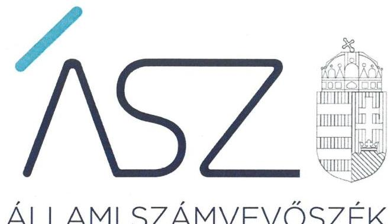
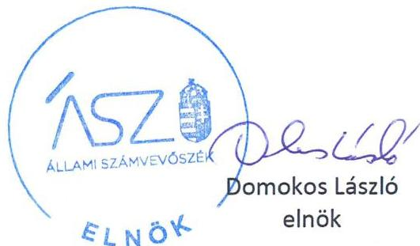
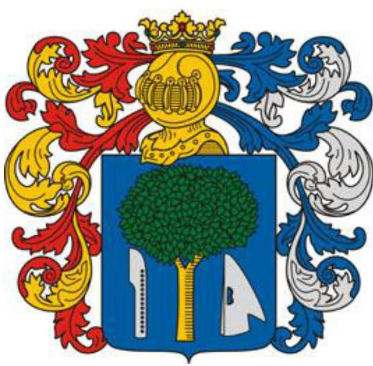

ÁLLAMI SZÁMVEVŐSZÉK

# JELENTÉS 

Nemzeti tulajdonú gazdasági társaságok ellenőrzése

Nyíradonyi Vagyonkezelő, Kereskedelmi és Szolgáltató Korlátolt Felelősségű Társaság
2020.

20191
www.asz.hu

---

# JELENTÉS

Nemzeti tulajdonú gazdasági társaságok ellenőrzése

Nyíradonyi Vagyonkezelő, Kereskedelmi és Szolgáltató Korlátolt Felelősségű Társaság

2020. 09. hó 29. nap

20191
www.asz.hu

---

# AZ ELLENŐRZÉST FELÜGYELTE: 

KLINGA LÁSZLÓ felügyeleti vezető

## AZ ELLENŐRZÉST VEZETTE ÉS A VÉGREHAJTÁSÁÉRT FELELŐS:

SALAMIN VIKTOR ellenőrzésvezető

## A PROGRAM ÖSSZEÁLLÍTÁSÁÉRT FELELŐS:

FEKETE-NAGY ANDRÁS GÁBOR ellenőrzési program készítéséért felelős vezető

TÓTPÁL SZABOLCS osztályvezető

IKTATÓSZÁM: EL-2890-001/2020.
TÉMASZÁM: 2513
ELLENŐRZÉS-AZONOSÍTÓ SZÁM: V082275, V085716

---

# TARTALOMJEGYZÉK 

■ ÖSSZEGZÉS ..... 5
■ AZ ELLENŐRZÉS CÉLJA ..... 6
■ AZ ELLENŐRZÉS TERÜLETE ..... 7
■ AZ ELLENŐRZÉS HÁTTERE, INDOKOLTSÁGA ..... 8
■ A JELENTÉS LÉNYEGES KÉRDÉSKÖREI ..... 9
■ AZ ELLENŐRZÉS HATÓKÖRE ÉS MÓDSZEREI ..... 10
■ MEGÁLLAPÍTÁSOK ..... 12
■ JAVASLATOK ..... 14
■ MELLÉKLETEK ..... 15
I. sz. melléklet: Értelmező szótár ..... 15
■ FÜGGELÉK: ÉSZREVÉTELEK ..... 17
■ RÖVIDÍTÉSEK JEGYZÉKE ..... 19

---

.

---

# ÖSSZEGZÉS 

A Nyíradonyi Vagyonkezelő, Kereskedelmi és Szolgáltató Korlátolt Felelősségű Társaság felett tulajdonosi jogokat gyakorló Nyíradony Város Önkormányzata tulajdonosi joggyakorlása a 2017-2018. években nem volt szabályszerű. A Társaság vagyongazdálkodása a 2015-2018. években nem volt szabályszerű, így az átláthatóságot és az elszámoltathatóságot nem biztositotta.

## Az ellenőrzés társadalmi indokoltsága

Az Állami Számvevőszék kiemelt célja, hogy a helyi önkormányzatok gazdálkodásában rejlő pénzügyi kockázatok feltárásával, az államháztartáson kívülre nyújtott költségvetési támogatások és ingyenes vagyonjuttatások, valamint az államháztartáson kívül működő feladatellátó rendszerek ellenőrzéseivel hozzájáruljon ahhoz, hogy a közpénzeket az államháztartáson kívül működő szervezetek is átlátható, rendezett módon használják fel.

A helyi önkormányzatok tulajdona nemzeti vagyon, melynek megőrzése érdekében kiemelten fontos a nemzeti tulajdonú gazdasági társaságok ellenőrzése. Ellenőrzésüket további társadalmi elvárás is indokolja, részben a gazdálkodásuk körébe tartozó vagyon nagysága, részben az általuk ellátott közszolgáltatások, sajátos feladatellátások, mivel tevékenységükön keresztül a lakosság széles köre kerül kapcsolatba a társaságokkal.

Az Állami Számvevőszék céljaival és a társadalmi igénnyel összhangban, a gazdasági társaságok kiemelt fontosságú szerepe miatt került sor a Nyíradonyi Vagyonkezelő, Kereskedelmi és Szolgáltató Kft. vagyongazdálkodásának, illetve Nyíradony Város Önkormányzata tulajdonosi joggyakorlásának ellenőrzésére.

## Főbb megállapítások, következtetések, javaslatok

Nyíradony Város Önkormányzata a tulajdonosi jogok gyakorlásának kereteit nem a jogszabályi előírások szerint alakította ki, mivel a javadalmazási szabályzatot nem alkotta meg, továbbá a Felügyelő bizottság nem rendelkezett jóváhagyott ügyrenddel, 2018. májusától Felügyelő bizottságot nem működtetett. A tulajdonosi joggyakorlás nem volt szabályszerű, mert az Alapító a Társaság 2015-2018. évi beszámolójáról a Felügyelő bizottság írásbeli jelentése nélkül döntött.

A Nyíradonyi Vagyonkezelő, Kereskedelmi és Szolgáltató Korlátolt Felelősségű Társaság vagyongazdálkodási tevékenysége nem volt szabályszerű. A mérleg tételeinek alátámasztásához a Társaság a jogszabály előírása ellenére a 2015-2018. évekre vonatkozóan nem állított össze leltárt, amely tételesen, ellenőrizhető módon tartalmazta a mérleg fordulónapján meglévő eszközöket és forrásokat mennyiségben és értékben. Leltár hiányában a 2015-2018. évi éves beszámolók részét képező mérlegek nem voltak megalapozottak, a vagyon védelme nem volt biztosított.

Az Állami Számvevőszék a jelentésben foglalt megállapítások alapján a Nyíradonyi Vagyonkezelő, Kereskedelmi és Szolgáltató Korlátolt Felelősségű Társaság ügyvezetőjének két javaslatot, Nyíradony Város Önkormányzata polgármestere részére négy javaslatot fogalmazott meg.

---

# AZ ELLENŐRZÉS CÉLJA 

AZ ELLENŐRZÉS CÉLJA annak megállapítása volt, hogy a tulajdonosi joggyakorló a gazdasági társaságai feletti tulajdonosi joggyakorlás kereteit kialakította-e, tulajdonosi jogait megfelelően gyakorolta-e és kötelezettségeit teljesítette-e. Az ellenőrzés értékelte, hogy a gazdasági társaság biztosította-e a vagyon védelmét a nyilvántartások szabályszerű vezetése és a mérleg tételeinek leltárral történő alátámasztása útján, valamint szabályszerűen gondoskodott-e a használatában, kezelésében lévő nemzeti vagyon értékének megőrzéséről, gyarapításáról, hasznosításáról.

---

# **AZ ELLENŐRZÉS TERÜLETE**

## **Nyíradony Város Önkormányzata, valamint a kizárólagos tulajdonában lévő Nyíradonyi Vagyonkezelő, Kereskedelmi és Szolgáltató Korlátolt Felelősségű Társaság**

Nyíradony Város Önkormányzata a Nyíradonyi Vagyonkezelő, Kereskedelmi és Szolgáltató Korlátolt Felelősségű Társaságot 1994-ben alapította Nyíradonyi Víz- és Csatornamű Üzemviteli Korlátolt Felelősségű Társaság néven. A Társaság1 főtevékenysége ingatlankezelés volt.

A Társaság az ellenőrzött években az Önkormányzat2 kötelező és önként vállalt önkormányzati feladatainak ellátásában működött közre, melyet a 2013. március 1-jén kötött feladatellátási-feladatátvállalási szerződés alapján végzett. A Társaság tevékenységi körébe tartozott többek között az Önkormányzat tulajdonában álló ingatlanok fenntartásával és üzemeltetésével kapcsolatos feladatok ellátása, lakás- és nem lakáscélú ingatlanok bérbeadása azok karbantartásával, állagmegóvásával, településfejlesztési és településrendezési, intézményi gyermekétkeztetési feladatok. A Társaság további feladata volt a Harangi Imre Rendezvénycsarnok és a Nyíradonyi Európa Parkban található létesítmény komplexummal, illetve a Városi Sportpályával kapcsolatos üzemeltetési tevékenység. A Társaság közreműködött az Önkormányzat verseny és tömegsport feladatainak ellátásában, a kistermelői, őstermelői áruértékesítési lehetőségek biztosításában.

Az ellenőrzött időszakban a Társaság kizárólagos tulajdonosa az Önkormányzat volt. A tulajdonosi jogokat a Képviselő-testület3 gyakorolta. A Társaságnál – 2018. április 30-áig – három fős Felügyelő bizottság4 működött.

A Társaság jegyzett tőkéje 200,0 M Ft volt, amely az ellenőrzött időszakban nem változott.

A Társaság az ellenőrzött időszakban vagyonkezelésbe vett vagyonnal nem rendelkezett, kormányzati szektorba sorolt egyéb szervezetnek nem minősült, más gazdasági társaságban részesedése nem volt. A Társaság az Önkormányzat közfeladat ellátása érdekében használt önkormányzati tulajdonú eszközöket nem hasznosította tovább. A Számv.5 tv. 155. § (2) bekezdésének előírása értelmében könyvvizsgálatra kötelezett volt, éves beszámolóit független könyvvizsgáló auditálta. Az ügyvezető6 és a könyvvizsgáló7 személyében változás nem történt. Az Önkormányzatnál a polgármester8 személye nem, a jegyző9 személye 2018-ban változott.

---

# AZ ELLENŐRZÉS HÁTTERE, INDOKOLTSÁGA 

Az Alaptörvény ${ }^{10}$ 38. cikke alapján az állam és a helyi önkormányzatok tulajdona nemzeti vagyon. A nemzeti vagyon megőrzése, megóvása érdekében kiemelten fontos ezen nemzeti tulajdonú gazdasági társaságok ellenőrzése. Gazdálkodásuk jellemzően a közérdeklődés és a média figyelmének középpontjában áll, amihez hozzájárul a gazdálkodásuk körébe tartozó - a nemzeti vagyon részét képező - vagyon nagysága, illetve az általuk ellátott közszolgáltatások minősége és hatékonysága. Ellenőrzéseink feltárhatják, hogy a tulajdonosi felügyelet hozzájárult-e a szabályszerű gazdálkodáshoz és feladatellátáshoz.

Az ellenőrzés eredményeként meghatározhatóvá válnak a szervezet vagyongazdálkodást érintő kockázatai, ezzel lehetővé téve a kockázatok csökkentését. A megállapítások alapján megfogalmazott számvevőszéki javaslatok hasznosítása elősegítheti a meglévő hibák megszüntetését. A jó gyakorlatok bemutatásával az ÁSZ ${ }^{11}$ hozzájárulhat a követendő megoldások megismertetéséhez, terjesztéséhez.

---

# A JELENTÉS LÉNYEGES KÉRDÉSKÖREI 

1.     - A Társaság feletti tulajdonosi joggyakorlás megfelelt-e a jogszabályi és belső előírásoknak?
2.     - A Társaság vagyongazdálkodási tevékenysége szabályszerü volt-e?

---

# AZ ELLENŐRZÉS HATÓKÖRE ÉS MÓDSZEREI 

## Az ellenőrzés típusa

Megfelelőségi ellenőrzés.

## Az ellenőrzött időszak

A tulajdonosi joggyakorlás vonatkozásában az ellenőrzött időszak a 20172018. évek, az éves beszámolók elfogadása kivételével, amelyeknél az ellenőrzött időszak 2015-2018. évek.

A Társaság vagyongazdálkodása vonatkozásában az ellenőrzött időszak 2015-2018. évek.

## Az ellenőrzés tárgya

Az önkormányzati tulajdonban lévő gazdasági társaság feletti tulajdonosi joggyakorlás kialakítása és múködtetése.

Önkormányzati tulajdonban lévő gazdasági társaság vagyongazdálkodása keretében a társaság használatában, kezelésében lévő nemzeti vagyon, illetve a saját vagyon tekintetében a vagyonnyilvántartások vezetése, leltára. A társaság használatában, vagyonkezelésében lévő nemzeti vagyon tekintetében a vagyon értékének megőrzése, gyarapítása, hasznosítása.

## Az ellenőrzött szervezet

Nyíradony Város Önkormányzata és a Nyíradonyi Vagyonkezelő, Kereskedelmi és Szolgáltató Korlátolt Felelősségű Társaság.

## Az ellenőrzés jogalapja

Az ellenőrzés jogalapját az ÁSZ tv. ${ }^{12} 1 . \S$ (3) bekezdése és 5. § (3)-(5) bekezdései képezték.

## Az ellenőrzés módszerei

Az ellenőrzést az ellenőrzési program ellenőrzési kérdései, az ellenőrzött időszakban hatályos jogszabályok, az ellenőrzés szakmai szabályok és módszertanok alapján, a nemzetközi standardok figyelembe vételével végeztük.

---

Az ellenőrzés ideje alatt az ellenőrzött szervezettel történő kapcsolattartást az ÁSZ SZMSZ-ének ${ }^{13}$ vonatkozó előírásai alapján biztosítottuk.
2017. január 1-től 2018. december 31-ig ellenőriztük a tulajdonosi joggyakorlás kereteinek kialakítását, a tulajdonosi joggyakorló tevékenységét a felügyelő bizottság és a független könyvvizsgáló működéséhez kapcsolódóan, valamint azt, hogy a tulajdonosi joggyakorló - amennyiben a gazdasági társaság feladatellátásához és vagyonkezeléséhez kapcsolódóan határozott meg követelményeket, elvárásokat - a nemzeti vagyon értékének megőrzése érdekében monitorozta-e azok teljesülését. 2015. január 1jétől az ellenőrzés megkezdésének napjáig ellenőriztük a tulajdonosi joggyakorló részvételét az éves beszámoló elfogadására vonatkozó döntéshozatalban.

A gazdasági társaság vagyonhoz kapcsolódó nyilvántartásai vezetésének megfelelősége, valamint a nemzeti vagyon értéke megőrzésének, gyarapításának, hasznosításának szabályszerűsége 2015. és 2017-2018. évek tekintetében került ellenőrzésre. A 2015-2018. éveket érintően történt meg a lényeges dokumentumok értékelése.

A vagyonnyilvántartások és a leltár szabályszerűsége esetében az ellenőrzés azokra a legnagyobb értékű tételekre - a lényeges sokaságra terjedt ki, melyek összértéke eléri a teljes sokaság összértékének 50\%-át. A lényeges sokaságot tételesen ellenőriztük.

Az ellenőrzési kérdések megválaszolásához szükséges bizonyítékok megszerzése a következő ellenőrzési eljárások alkalmazásával történt: megfigyelés, információkérés, összehasonlítás, lényeges sokaságból egyszerű véletlen mintavétel, valamint elemző eljárás. Az ellenőrzési bizonyítékként felhasználható adatforrások közé tartoztak az ellenőrzési programban felsorolt adatforrások, továbbá minden - az ellenőrzés folyamán - feltárt, az ellenőrzés szempontjából információkat tartalmazó dokumentum.

Az ellenőrzést a kérdésekre adott válaszok kiértékelésével, valamint a megjelölt adatforrások, a csatolt tanúsítványok felhasználásával, továbbá az adott időszakban hatályos jogszabályok figyelembe vételével folytattuk le.

Amennyiben a Társaság múködését és gazdálkodását alapvetően meghatározó dokumentum hiánya miatt, valamely lényeges kérdéskörre vonatkozóan az ÁSZ megállapítást tett, további ellenőrzési tevékenységek az adott kérdéskörrel és az azzal szoros logikai kapcsolatban lévő kérdéskörökkel - ráépülő jelleggel - nem kerültek végrehajtásra.

---

# MEGÁLLAPÍTÁSOK 

## 1. A Társaság feletti tulajdonosi joggyakorlás megfelelt-e a jogszabályi és belső előírásoknak?

Összegző megállapítás Az Önkormányzat tulajdonosi joggyakorlása 2017-2018. években nem volt szabályszerű.

A TULAJDONOSI JOGOK GYAKORLÁSÁNAK KE-
RETEIT a Társaság felett az Önkormányzat az Alapító okirat ${ }^{14}$-ban, az
SZMSZ ${ }^{15}$-ben, továbbá a Feladatellátási-feladatátvállalási szerződés ${ }^{16}$-ben
kialakította.

A FELÜGYELŐ BIZOTTSÁG a Ptk. ${ }^{17}$ 3:122. § (3) bekezdésének előírása ellenére a 2017-2018. években nem rendelkezett ügyrenddel. Az Alapító ${ }^{18}$ a Felügyelő bizottság megbízásának lejártát követően annak tagjait nem jelölte ki, ezért a Társaság 2018. május 1-jétől az ellenőrzött időszak végéig - a Taktv. ${ }^{19} 4 . \S$ (1) bekezdésében foglaltakat megsértve - felügyelő bizottság nélkül működött.

Az Alapító a Taktv. 5. § (3) bekezdésének előírása ellenére nem alkotta meg a vezető tisztségviselők, a felügyelő bizottsági tagok, az Mt. ${ }^{20}$ 208. §ának hatálya alá eső munkavállalók javadalmazásáról, valamint a jogviszony megszűnése esetére biztosított juttatások módjának, mértékének elveiről, annak rendszeréről szóló szabályzatot.

A SZÁMVITELI BESZÁMOLÓ JÓVÁHAGYÁSÁRÓL az Alapító a 2015-2018. években a könyvvizsgáló írásos jelentésének birtokában, de a Ptk. 3:120. § (2) bekezdésében előírtak ellenére a 2015-2018. években Felügyelő Bizottság írásbeli jelentése nélkül döntött.

## 2. A Társaság vagyongazdálkodási tevékenysége szabályszerű volt-e?

## Összegző megállapítás

A Társaság vagyongazdálkodási tevékenysége 2015-2018. években nem volt szabályszerű.

A VAGYONNYILVÁNTARTÁSI TEVÉKENYSÉG FELTÉTELEIT a Társaság az ellenőrzött időszakban nem szabályszerűen alakította ki, mivel a Számv. tv. 161. § (1) bekezdés előírása ellenére számlarenddel a 2015-2018. években nem rendelkezett. Az Eszközök és források leltározási és leltárkészítési szabályzat ${ }^{21}$-ával a Társaság a Számv. tv. előírásai szerint rendelkezett, az tartalmazta a leltározásra és leltárkészítésre vonatkozó szabályokat, előírásokat.

A VAGYONGAZDÁLKODÁS nem volt szabályszerű, mert a számviteli beszámoló mérlegtételeinek alátámasztásához a Társaság a 2015-2018. évekre vonatkozóan nem állított össze a Számv. tv. 69. § (1)

---

bekezdésének előírása szerinti leltárt, amely tételesen, ellenőrizhető módon tartalmazta a mérleg fordulónapján meglévő eszközöket és forrásokat mennyiségben és értékben. A 2015., 2016. és 2017. években a tárgyi eszközök mérlegsor leltár szerinti értéke nem egyezett meg a mérlegben szereplő értékkel. A 2018. évben a tárgyi eszközök mérlegsort leltár nem támasztotta alá, továbbá a követelések és a rövid lejáratú kötelezettségek leltár szerinti értéke nem egyezett meg a mérlegben szereplő értékkel. Szabályszerű leltár hiányában a 2015-2018. évi éves beszámolók részét képező mérlegek nem voltak megalapozottak.

A könyvvizsgáló a 2015-2018. évi beszámolókat - a mérleget alátámasztó leltár hiánya ellenére - hitelesítő záradékkal látta el.

---

# JAVASLATOK 

Az ÁSZ tv. 33. § (1) bekezdésében foglaltak értelmében az ellenőrzött szervezet vezetője köteles a jelentésben foglalt megállapításokhoz kapcsolódó intézkedési tervet összeállítani és azt a jelentés kézhezvételétől számított 30 napon belül az ÁSZ részére megküldeni. Amennyiben az ellenőrzött szervezet vezetője nem küldi meg határidőben az intézkedési tervet, vagy továbbra sem elfogadható intézkedési tervet küld, az Állami Számvevőszék elnöke az ÁSZ tv. 33. § (3) bekezdése a) és b) pontjaiban foglaltakat érvényesítheti.

## Nyíradonyi Vagyonkezelő, Kereskedelmi és Szolgáltató Korlátolt Felelősségű Társaság ügyvezetőjének

1. Gondoskodjon a Számv. tv.-ben elöirt számlarend elkészitéséröl.
(2. sz. megállapítás 1. bekezdés 1. mondat 2. tagmondata alapján)
2. Gondoskodjon az ellenőrzött időszakot követően készítendő beszámoló mérleg tételeinek alátámasztásához a Számv. tv.-ben elöirtak szerinti leltár összeállításáról.
(2. sz. megállapítás 2. bekezdés 1. mondat 2. tagmondata alapján)

## Nyíradony Város Önkormányzata polgármesterének

1. Intézkedjen arról, hogy a Felügyelő Bizottság rendelkezzen az Alapító által jóváhagyott ügyrenddel a Ptk.-ban elöirtaknak megfelelően.
(1. sz. megállapítás 2. bekezdés 1. mondata alapján)
2. Intézkedjen a Felügyelő Bizottság tagjainak Taktv.-ben elöirtak szerinti kijelöléséről.
(1. sz. megállapítás 2. bekezdés 2. mondata alapján)
3. Intézkedjen a Taktv.-ben elöirt, a vezető tisztségviselők, felügyelő bizottsági tagok, Mt. 208. §-ának hatálya alá eső munkavállalók javadalmazásáról, valamint a jogviszony megszünése esetére biztositott juttatások módjának, mértékének elveiről, annak rendszeréről szóló szabályzat megalkotásáról.
(1. sz. megállapítás 3. bekezdése alapján)
4. Intézkedjen arról, hogy az Alapító a Ptk.-ban elöirtaknak megfelelően, a Felügyelő Bizottság írásbeli jelentésének birtokában döntsön a Társaság számviteli beszámolójáról.
(1. sz. megállapítás 4. bekezdés 2. tagmondata alapján)

---

# MELLÉKLETEK 

- I. SZ. MELLÉKLET: ÉRTELMEZŐ SZÓTÁR
gazdasági társaság
közszolgáltatás
közfeladat
nemzeti vagyon
nemzeti vagyon hasznosítása
nemzeti vagyon használója
tulajdonosi jogok gyakorlója

Ptk. 3:88. § (1) bekezdése szerint „a gazdasági társaságok üzletszerű közös gazdasági tevékenység folytatására, a tagok vagyoni hozzájárulásával létrehozott, jogi személyiséggel rendelkező vállalkozások, amelyekben a tagok a nyereségből közösen részesednek, és a veszteséget közösen viselik".
Az Ebktv. ${ }^{22}$ 3. § d) pontja a következőképpen határozza meg a közszolgáltatást: „szerződéskötési kötelezettség alapján a lakosság alapvető szükségleteinek ellátására irányuló szolgáltatás, így különösen a villamos energia-, gáz-, hő-, víz-, szennyvíz- és hulladékkezelési, köztisztasági, postai és táv-közlési szolgáltatás, továbbá a menetrend alapján közlekedő járművekkel végzett közforgalmú személyszállítás".
Az Áht. 3/A. § (1) bekezdése alapján közfeladat a jogszabályban meghatározott állami vagy önkormányzati feladat.
Nvtv. ${ }^{23}$ 1. § (2) bekezdése szerint nemzeti vagyonba tartozik többek között:
„az állam vagy a helyi önkormányzat kizárólagos tulajdonában álló dolgok,
az a) pont hatálya alá nem tartozó, állam vagy a helyi önkormányzat tulajdonában lévő dolog,
az állam vagy a helyi önkormányzat tulajdonában lévő pénzügyi eszközök, továbbá az államot vagy a helyi önkormányzatot megillető társasági részesedések,
az államot vagy a helyi önkormányzatot megillető bármely vagyoni érték-kel rendelkező jogosultság, amelyet jogszabály vagyoni értékű jogként nevesít
A tulajdonosi joggyakorló vagy a nemzeti vagyon használója által a nemzeti vagyon birtoklásának, használatának, hasznok szedése jogának bármely - a tulajdonjog átruházását nem eredményező - jogcímen történő átengedése, ide nem értve a vagyonkezelésbe adást, valamint a haszonélvezeti jog alapítását.
Forrás: Nvtv. 3. § (1) bekezdés 4. pont
Azon természetes személy, jogi személy vagy jogi személyiséggel nem rendelkező szervezet, aki vagy amely állami vagyon tekintetében törvény vagy szerződés alapján, a helyi önkormányzat vagyona tekintetében törvény, a helyi önkormányzat rendelete vagy szerződés alapján bármely jogcímen nemzeti vagyont birtokol, használ, szedi annak hasznait, kivéve a tulajdonosi joggyakorló.
Forrás: Nvtv. 3. § (1) bekezdés 11. pont
Aki a nemzeti vagyon felett az államot vagy a helyi önkormányzatot megillető tulajdonosi jogok és kötelezettségek összességének gyakorlására jogosult. (Forrás: Nvtv. 3. § (1) bekezdés 17. pontja)

---

.

---

# FÜGGELÉK: ÉSZREVÉTELEK 

A jelentéstervezetet a Számvevőszék 15 napos észrevételezésre megküldte az ellenőrzött szervezetek vezetőinek az ÁSZ tv. 29. §* (1) bekezdése előírásának megfelelően.

A jelentéstervezet megállapításaira a polgármester és az ügyvezető sem tett észrevételt.

[^0]
[^0]:    * 29. § (1) Az Állami Számvevőszék az ellenőrzési megállapításait megküldi az ellenőrzött szervezet vezetőjének vagy az általa megbízott személynek, és annak, akinek személyes felelősségét állapította meg.
    (2) Az ellenőrzött szervezet vezetője és a felelősként megjelölt személy az ellenőrzés megállapításaira tizenöt napon belül írásban észrevételt tehet.
    (3) Az Állami Számvevőszék az észrevételre a beérkezésétől számított harminc napon belül írásban válaszol. A figyelembe nem vett észrevételeket köteles a jelentésben feltüntetni, és megindokolni, hogy azokat miért nem fogadta el.

---

.

---

# RÖVIDÍTÉSEK JEGYZÉKE 

${ }^{1}$ Társaság
${ }^{2}$ Önkormányzat
${ }^{3}$ Képviselő-testület
${ }^{4}$ Felügyelő bizottság
${ }^{5}$ Számv. tv
${ }^{6}$ ügyvezető
${ }^{7}$ könyvvizsgáló
${ }^{8}$ polgármester
${ }^{9}$ jegyző
${ }^{10}$ Alaptörvény
${ }^{11}$ ÁSZ
${ }^{12}$ ÁSZ tv.
${ }^{13}$ ÁSZ SZMSZ
${ }^{14}$ Alapító okirat
${ }^{15}$ SZMSZ
${ }^{16}$ Feladatellátási-feladatátvállalási szerződés
${ }^{17}$ Ptk.
${ }^{18}$ Alapító
${ }^{19}$ Taktv.
${ }^{20} \mathrm{Mt}$.
${ }^{21}$ Eszközök és források leltárkészítési és leltározási szabályzata
${ }^{22}$ Ebktv.
${ }^{23} \mathrm{Nvtv}$.

Nyíradonyi Vagyonkezelő, Kereskedelmi és Szolgáltató Korlátolt Felelősségű Társaság
Nyíradony Város Önkormányzata
Nyíradony Város Önkormányzatának Képviselő-testülete
a Nyíradonyi Vagyonkezelő, Kereskedelmi és Szolgáltató Korlátolt Felelősségű Társaság Felügyelő Bizottsága
a számvitelről szóló 2000. évi C. törvény
a Nyíradonyi Vagyonkezelő, Kereskedelmi és Szolgáltató Korlátolt Felelősségű Társaság ügyvezetője
a Nyíradonyi Vagyonkezelő, Kereskedelmi és Szolgáltató Korlátolt Felelősségű
Társaság könyvvizsgálója
Nyíradony Város Önkormányzatának polgármestere
Nyíradony Város Önkormányzatának jegyzője
Magyarország Alaptörvénye
Állami Számvevőszék
az Állami Számvevőszékről szóló 2011. évi LXVI. törvény
az Állami Számvevőszék Szervezeti és Müködési Szabályzata
a Nyíradonyi Vagyonkezelő, Kereskedelmi és Szolgáltató Korlátolt Felelősségű Társaság Alapító okirata
Nyíradony Város Önkormányzatának 12/2014. (XI. 13.) számú rendelete az Önkormányzat és szervei Szervezeti és Müködési Szabályzatról, valamint annak módosításai
Nyíradony Város Önkormányzata és a Nyíradonyi Vagyonkezelő Kft. között 2013.03.01-jén létrejött szerződés
a Polgári Törvénykönyvről szóló 2013. évi V. törvény
Nyíradony Város Önkormányzata Képviselő-testülete, mint a társaság legfőbb szerve
a köztulajdonban álló gazdasági társaságok takarékosabb müködéséről szóló 2009. évi CXXII. törvény
a munka törvénykönyvéről szóló 2012. évi I. törvény
a Nyíradonyi Vagyonkezelő, Kereskedelmi és Szolgáltató Korlátolt Felelősségű Társaság eszközök és források leltárkészítési és leltározási szabályzata (hatályos 2015. január 1-jétől)
az egyenlő bánásmódról és az esélyegyenlőség előmozdításáról szóló 2003. évi CXXV. törvény
a nemzeti vagyonról szóló 2011. évi CXCVI. törvény

---

# ASZ 

ALLAMI SZAMVEVOSZEK
1052 Budapest, Apáczai Cs. J. u. 10. I 1364 Budapest 4. Pf. 54 TEL: +36 14849100
email: szamvevoszek@asz.hu
web: www.asz.hu | www.aszhirportal.hu