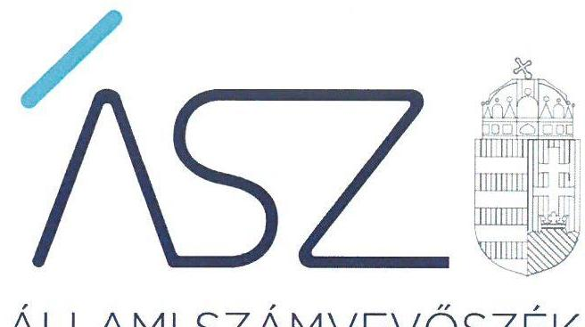
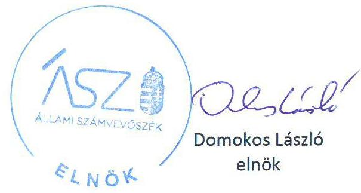

ÁLLAMI SZÁMVEVŐSZÉK

# JELENTÉS 

Nemzeti tulajdonú gazdasági társaságok ellenőrzése

Téti Kistérségi Gyógyítóház Közhasznú Nonprofit Korlátolt Felelősségű Társaság
2020.

20192
www.asz.hu

---

ÁLLAMI SZÁMVEVŐSZÉK

# JELENTÉS 

Nemzeti tulajdonú gazdasági társaságok ellenőrzése

Téti Kistérségi Gyógyítóház Közhasznú Nonprofit Korlátolt Felelősségű Társaság
2020. 10. hó 14. nap

20192
www.asz.hu

---

# AZ ELLENŐRZÉST FELÜGYELTE: 

KAKAS SÁNDOR felügyeleti vezető

## AZ ELLENŐRZÉST VEZETTE ÉS A VÉGREHAJTÁSÁÉRT FELELŐS:

ÓDOR ZOLTÁN TAMÁS ellenőrzésvezető

## A PROGRAM ÖSSZEÁLLÍTÁSÁÉRT FELELŐS:

TÓTPÁL SZABOLCS osztályvezető
FEKETE-NAGY ANDRÁS GÁBOR ellenőrzési program elkészítéséért felelős vezető

## IKTATÓSZÁM: EL-2888-001/2020

Jelentéseink az Országgyúlés számítógépes hálózatán és az interneten a www.asz.hu címen is olvashatóak.

TÉMASZÁM: 2478
ELLENŐRZÉS-AZONOSÍTÓ SZÁM: V082233, V085711

---

# TARTALOMJEGYZÉK 

■ ÖSSZEGZÉS ..... 5
■ AZ ELLENŐRZÉS CÉLJA ..... 6
■ AZ ELLENŐRZÉS TERÜLETE ..... 7
■ AZ ELLENŐRZÉS HÁTTERE, INDOKOLTSÁGA ..... 8
■ A JELENTÉS LÉNYEGES KÉRDÉSKÖREI ..... 9
■ AZ ELLENŐRZÉS HATÓKÖRE ÉS MÓDSZEREI ..... 10
■ MEGÁLLAPÍTÁSOK ..... 12
■ JAVASLATOK ..... 14
■ MELLÉKLETEK ..... 15
I. sz. melléklet: Értelmező szótár ..... 15
■ FÜGGELÉKEK ..... 17
I. sz. függelék: Vezetői teljesítmény értékelése ..... 17
II. sz. függelék: Észrevételek ..... 18
■ RÖVIDÍTÉSEK JEGYZÉKE ..... 19

---

.

---

# ÖSSZEGZÉS 

Tét Város Önkormányzata tulajdonosi jogait 2015-2018 években nem szabályszerűen gyakorolta a Téti Kistérségi Gyógyítóház Közhasznú Nonprofit Korlátolt Felelősségű Társaság vonatkozásában.
A Téti Kistérségi Gyógyítóház Közhasznú Nonprofit Korlátolt Felelősségű Társaság vagyongazdálkodása a 2015-2018. években nem volt szabályszerű, így az átláthatóságot és az elszámoltathatóságot, valamint a nemzeti vagyon megőrzését nem biztosította.

## Az ellenőrzés társadalmi indokoltsága

Az Állami Számvevőszék kiemelt célja, hogy a helyi önkormányzatok gazdálkodásában rejlő pénzügyi kockázatok feltárásával, az államháztartáson kívülre nyújtott költségvetési támogatások és ingyenes vagyonjuttatások, valamint az államháztartáson kívül múködő feladatellátó rendszerek ellenőrzéseivel hozzájáruljon ahhoz, hogy a közpénzeket az államháztartáson kívül múködő szervezetek is átlátható, rendezett módon használják fel.

Magyarországon az önkormányzatok kötelező és önként vállalt feladataik vonatkozásában is egyre szélesebb körben alkalmazzák a költségvetésen kívüli feladatellátást, ezáltal - a nonprofit szervezetek mellett - az önkormányzati tulajdonú gazdasági társaságok is kiemelt fontosságú szerephez jutottak.

Az önkormányzati többségi tulajdonban álló gazdaságok ellenőrzése kiemelt jelentőségű, mivel múködésük hatással van a tulajdonos önkormányzat gazdálkodására.

Téten 2015-2018 között a Téti Kistérségi Gyógyítóház Közhasznú Nonprofit Korlátolt Felelősségű Társaság közfeladatokat látott el, Tét Város Önkormányzatával kötött megállapodás keretében, tevékenységén keresztül a lakosság széles köre kerülhet kapcsolatba a Társasággal és az általa nyújtott szolgáltatásokkal ezért is indokolt, az Állami Számvevőszék által folytatott ellenőrzés.

## Főbb megállapítások, következtetések, javaslatok

Tét Város Önkormányzata tulajdonosi joggyakorlása a 2015-2018. években nem volt szabályszerű, mivel nem gondoskodott 2016. május 30. és 2017. május 22. közötti időszakban Felügyelőbizottság kijelöléséről, valamint a Felügyelőbizottság múködési idejében nem rendelkezett ügyrenddel. A Felügyelőbizottság nem készített írásos jelentést a Társaság éves beszámolóiról, így a Taggyűlés az ellenőrzött években a Társaság éves beszámolóit a Felügyelőbizottság írásbeli jelentése nélkül fogadta el.

A Téti Kistérségi Gyógyítóház Közhasznú Nonprofit Korlátolt Felelősségű Társaság vagyongazdálkodási tevékenysége nem volt szabályszerű. A 2015. évben Társaság a Számv. tv. szerinti leltár készítési kötelezettségének nem tett eleget, 2016-2018. években a számviteli beszámolók mérlegtételeit nem támasztotta alá a Számv. tv. előírásai szerinti leltárral, ezért az egyszerűsített éves beszámolói nem voltak megalapozottak, így nem volt igazolt, hogy a Társaság beszámolóiban szereplő tételek a valóságban is megtalálhatóak, a közvagyonba tartozó eszközök közfeladat ellátásához rendelkezésre álltak.

Az Állami Számvevőszék Tét Város Önkormányzata polgármesterének kettő, a Téti Kistérségi Gyógyítóház Közhasznú Nonprofit Korlátolt Felelősségű Társaság ügyvezetőjének egy javaslatot fogalmazott meg.

---

# AZ ELLENŐRZÉS CÉLJA 

AZ ELLENŐRZÉS CÉLJA annak megállapítása volt, hogy a tulajdonosi joggyakorló a gazdasági társaságai feletti tulajdonosi joggyakorlás kereteit kialakította-e, tulajdonosi jogait megfelelően gyakorolta-e és kötelezettségeit teljesítette-e, továbbá annak megállapítása, hogy a gazdasági társaság biztosította-e a vagyon védelmét a nyilvántartások szabályszerű vezetése és a mérleg tételeinek leltárral történő alátámasztása útján, valamint szabályszerűen gondoskodott-e a társaság használatában, kezelésében lévő nemzeti vagyon értékének megőrzéséről, gyarapításáról, hasznosításáról. További cél volt a Téti Kistérségi Gyógyítóház Közhasznú Nonprofit Korlátolt Felelősségű Társaság vezetője tevékenységében rejlő kockázatok azonosítása és az egyes vezetői feladatainak értékelése.

---

# AZ ELLENŐRZÉS TERÜLETE 

## Téti Kistérségi Gyógyítóház Közhasznú Nonprofit Korlátolt Felelősségű Társaság és a többségi tulajdonosi jogokat gyakorló Tét Város Önkormányzata

A Téti Kistérségi Gyógyítóház Közhasznú Nonprofit Korlátolt Felelősségű Társaságot a tulajdonosi jogokat gyakorló Tét Város Önkormányzata és 18 térségi önkormányzat¹ 2009. augusztus 6-án alapította.

A Társaság ${ }^{2}$ jegyzett tőkéje - 15,9 millió Ft - az Önkormányzat ${ }^{3}$ minősített többségű befolyást biztosító 94,3\%-os és a térségi önkormányzatok 5,7\%-os tulajdoni részaránya az ellenőrzött időszakban nem változott.

A Társaság legfőbb szerve a Taggyűlés ${ }^{4}$ melyben az Önkormányzat, mint tulajdonosi joggyakorló a többi tulajdonossal együtt képviseltette magát.

A Társaság főtevékenysége szakorvosi járóbeteg-ellátás, mint közhasznú tevékenység volt, melyet a Mötv. ${ }^{5}$ 13. § (1) bekezdésének 4. pontja szerint közfeladatként látott el.

A Társaság az ellenőrzött időszakban saját vagyonával gazdálkodott, vagyonkezelt vagyonnal nem rendelkezett, koncessziós szerződést nem kötött. A Társaságnak nem volt másik gazdasági társaságban tulajdoni részesedése.

A Társaság az ellenőrzött időszakban nem tartozott a kormányzati szektorba sorolt egyéb szervezetek közé.

A Társaság a Számv. tv. ${ }^{6}$ előírása alapján könyvvizsgálatra nem volt kötelezett, számviteli beszámolói felülvizsgálatára könyvvizsgálót nem bízott meg.

A Társaság ügyvezetőjének személye az ellenőrzés időszaka alatt nem változott, a jelenlegi ügyvezető tisztségét 2013. május 29-től látja el, a polgármester személye az ellenőrzött időszak alatt nem változott.

A Társaságnál 2016. május 29-ig és 2017. május 23-től három tagú Felügyelő Bizottság múködött.

A Társaság által foglalkoztatottak száma 2015. évben 17 fő volt, ez 2018. évre 18 főre változott.

---

# AZ ELLENŐRZÉS HÁTTERE, INDOKOLTSÁGA 

Az Alaptörvény ${ }^{7}$ 38. cikke alapján az állam és a helyi önkormányzatok tulajdona nemzeti vagyon. A nemzeti vagyon megőrzése, megóvása érdekében kiemelten fontos ezen nemzeti tulajdonú gazdasági társaságok ellenőrzése. Gazdálkodásuk jellemzően a közérdeklődés és a média figyelmének középpontjában áll, amihez hozzájárul a gazdálkodásuk körébe tartozó - a nemzeti vagyon részét képező - vagyon nagysága, illetve az általuk ellátott közszolgáltatások minősége és hatékonysága. Ellenőrzéseink feltárhatják, hogy a tulajdonosi felügyelet hozzájárult-e a szabályszerű gazdálkodáshoz és feladatellátáshoz.

Az ellenőrzés eredményeként meghatározhatóvá válnak a szervezet vagyongazdálkodást érintő kockázatai, ezzel lehetővé téve a kockázatok csökkentését. A megállapítások alapján megfogalmazott számvevőszéki javaslatok hasznosítása elősegítheti a meglévő hibák megszüntetését. A jó gyakorlatok bemutatásával az ÁSZ ${ }^{8}$ hozzájárulhat a követendő megoldások megismertetéséhez, terjesztéséhez.

A Kormány „jól múködő állam" megteremtésével, kapcsolatos céljaival összhangban van, hogy olyan vezetői teljesítményértékelési rendszer kerüljön kialakításra és múködtetésre, amely hozzájárul a szervezeti teljesítmény növeléséhez, a fejlődési lehetőségek kihasználásához. Az ÁSZ a rendszer kiépítésében vállalt aktív ellenőrzési, értékelési tevékenységével kíván hozzájárulni a „jól irányított állam" megteremtéséhez.

---

# A JELENTÉS LÉNYEGES KÉRDÉSKÖREI 

1. A gazdasági társaság feletti tulajdonosi joggyakorlás megfelel-e a jogszabályi és belső előírásoknak?
2. A Társaság vagyongazdálkodási tevékenysége szabályszerü volt-e?
3. A Társaság vezetőjének tevékenysége megfelelő volt-e?

---

# AZ ELLENŐRZÉS HATÓKÖRE ÉS MÓDSZEREI 

## Az ellenőrzés típusa

Megfelelőségi ellenőrzés.

## Az ellenőrzött időszak

A tulajdonosi joggyakorlás vonatkozásában az ellenőrzött időszak a 2017-2018. évek, az éves beszámolók elfogadása és tulajdonosi ellenőrzése kivételével, amelyeknél az ellenőrzött időszak a 2015-2018. évek.

A Társaság vagyongazdálkodása vonatkozásában az ellenőrzött időszak a 2015-2018. évek.

A vezetői teljesítmény értékelés tekintetében az ellenőrzött időszak a 2018. év.

## Az ellenőrzés tárgya

Az önkormányzat többségi tulajdonában lévő gazdasági társaság feletti tulajdonosi joggyakorlás kialakítása és múködtetése.

Önkormányzati többségi tulajdonban lévő gazdasági társaság vagyongazdálkodása, saját vagyona tekintetében a vagyonnyilvántartások vezetése, leltára. A társaság használatában, vagyonkezelésében lévő nemzeti vagyon tekintetében a vagyon értékének megőrzése, gyarapítása, hasznosítása.

Az önkormányzati többségi tulajdonban lévő gazdasági társaság vezetői teljesítményének értékelése. Az önkormányzati tulajdonban lévő gazdasági társaság átlátható, szabályszerű, gazdaságos, hatékony, eredményes és felelős gazdálkodásának feltételrendszerének kialakítása, a belső kontrollrendszer és humánpolitikai rendszer múködtetése, integritási és korrupciós, valamint a szervezetet és a tevékenységet érintő kockázatok csökkentése.

## Az ellenőrzött szervezet

Téti Kistérségi Gyógyítóház Közhasznú Nonprofit Korlátolt Felelősségű Társaság, valamint Tét Város Önkormányzata.

## Az ellenőrzés jogalapja

Az ellenőrzés jogalapját az ÁSZ tv. 1. § (3) bekezdése és 5. § (3)-(5) bekezdései képezték.

---

# Az ellenőrzés módszerei 

Az ellenőrzést az ellenőrzési program ellenőrzési kérdései, az ellenőrzött időszakban hatályos jogszabályok, az ellenőrzés szakmai szabályok és módszertanok alapján, a nemzetközi standardok figyelembe vételével végezte az ÁSZ.

Az ellenőrzés ideje alatt az ellenőrzött szervezettel történő kapcsolattartást az ÁSZ Szervezeti és Múködési Szabályzatának vonatkozó előírásai alapján biztosította az ÁSZ.

Az ÁSZ a tulajdonosi joggyakorlás kereteinek kialakítását, a tulajdonosi joggyakorló tevékenységét a felügyelő bizottság múködéséhez kapcsolódóan ellenőrizte, valamint azt, hogy a tulajdonosi joggyakorló - amennyiben a gazdasági társaság feladatellátásához kapcsolódóan határozott meg követelményeket, elvárásokat - a nemzeti vagyon értékének megőrzése érdekében monitorozta-e azok teljesülését

A gazdasági társaság vagyonhoz kapcsolódó nyilvántartásai vezetésének megfelelősége, a mérleg tételeinek leltárral való alátámasztottsága, valamint a nemzeti vagyon értéke megőrzésének, gyarapításának, hasznosításának szabályszerűsége a 2015. és a 2017-2018. évek tekintetében került ellenőrzésre. A 2015-2018. éveket érintően történt meg a lényeges dokumentumok értékelése.

A vagyonnyilvántartások és a leltár szabályszerűsége esetében az ellenőrzés azokra a legnagyobb értékű tételekre - a lényeges sokaságra - terjedt ki, melyek összértéke eléri a teljes sokaság összértékének 50\%-át. A lényeges sokaságot tételesen ellenőrizte az ÁSZ.

A vezetői teljesítmény értékelése tekintetében a program ellenőrzési szempontjait a szabályszerűségi szempontok szerinti ellenőrzésben a jogszabályi előírások, belső utasítások, belső szabályozók, a tulajdonosi joggyakorlók elvárásai, előírásai, a helyénvalósági szempontok szerinti ellenőrzésben az ÁSZ által általánosan elfogadott, jó gyakorlat szerinti ajánlásai, értékelési kritériumai mentén kerültek meghatározásra. Az ellenőrzési kérdések szerint az összesített értékelés alapján az elért pontok az elérhető pontok minimum 70\%-át elérve, a társaság vezetője tevékenységét megfelelőnek, 70\% alatt nem megfelelőnek értékelte az ÁSZ.

Az ellenőrzési kérdések megválaszolásához szükséges bizonyítékok megszerzése a Társaság vonatkozásában a következő ellenőrzési eljárások alkalmazásával történt: megfigyelés, információkérés, összehasonlítás, elemző eljárás. Az ellenőrzési bizonyítékként felhasználható adatforrások közé tartoznak az ellenőrzési programban felsorolt adatforrások, továbbá minden - az ellenőrzés folyamán - feltárt, az ellenőrzés szempontjából információkat tartalmazó dokumentum. Az ÁSZ az ellenőrzést a kérdésekre adott válaszok kiértékelésével, valamint a megjelölt adatforrások, a csatolt tanúsítványok felhasználásával, továbbá az adott időszakban hatályos jogszabályok figyelembe vételével folytatta le.

---

# MEGÁLLAPÍTÁSOK 

## 1. A gazdasági társaság feletti tulajdonosi joggyakorlás megfelel-e a jogszabályi és belső előírásoknak?

Összegző megállapítás

A Társaság feletti tulajdonosi joggyakorlás a 2015-2018. években nem volt szabályszerű.

A TÁRSASÁG TAGGYŰLÉSE megalkotta a Társaság Javadalmazási szabályzatát ${ }^{9}$, mely a Taktv. ${ }^{10}$-ben előírtak alapján rendelkezett a vezető tisztségviselők, felügyelőbizottsági tagok, valamint az Mt. ${ }^{11}$ 208. §ának hatálya alá eső munkavállalók javadalmazásáról, a jogviszony megszűnése esetére biztosított juttatások módjának, mértékének elveiről, annak rendszeréről.

A Taggyűlés a Taktv. 4. § (1) bekezdésben előírtakkal ellentétben nem gondoskodott 2016. május 30. és 2017. május 22. közötti időszakban Felügyelőbizottság kijelöléséről.

A FELÜGYELŐBIZOTTSÁG működése az ellenőrzött időszakban 2016. május 29-ig és 2017. május 23-tól, nem volt szabályszerű, mert a Ptk. ${ }^{12}$ 3:122. § (3) bekezdése ellenére nem rendelkezett ügyrenddel. A felügyelőbizottság a Társaság egyszerűsített éves beszámolóiról nem készített írásos jelentést, így a Taggyűlés a Társaság egyszerűsített éves beszámolóit, az ellenőrzött években a Ptk. 3:120. § (2) bekezdésének előírása ellenére a Felügyelőbizottság írásbeli jelentése nélkül fogadta el.

## 2. A Társaság vagyongazdálkodási tevékenysége szabályszerű volt-e?

Összegző megállapítás

A Társaság vagyongazdálkodási tevékenysége a 2015-2018. években nem volt szabályszerű.

## LELTÁRKÉSZÍTÉSI ÉS LELTÁROZÁSI SZABÁLY-

ZATTAL ${ }_{1-4}{ }^{13}$ a Társaság rendelkezett a Számv. tv. előírásainak megfelelően, amely tartalmazta a leltározásra és a leltárkészítésre vonatkozó szabályokat, előírásokat.

## VAGYONGAZDÁLKODÁSI TEVÉKENYSÉG KERETEIT a 2015 - 2017. években a Társaság nem alakította ki, mivel a Társaság nem rendelkezett a Számv. tv. 14. § (3) bekezdése ellenére számviteli politikával, a Számv. tv. 14. § (5) bekezdés b) pontjában előírt értékelési szabályzattal, a Számv. tv. 14. § (5) bekezdés d) pontjában előírt pénzkezelési szabályzattal és a Számv. tv. 161. § (1) bekezdés előírásait megsértve számlarenddel. A Társaság a vagyongazdálkodás kereteit a 2018. évtől a Számv. tv. előírásai szerint, szabályszerűen alakította ki.

---

A TÁRSASÁG VAGYONGAZDÁLKODÁSA a 2015-2018. években nem volt szabályszerű. A Társaság a Számv. tv. 69. § (1) bekezdés szerinti leltár készítési kötelezettségének a 2015. évben nem tett eleget. A 2016-2018. években a Társaság a beszámoló elkészítéséhez, mérlegtételeinek alátámasztásához a Számv. tv. 69. § (1) bekezdésének előírása ellenére nem állított össze szabályszerű leltárt, mert a tárgyi eszközök mérleg tételeit mennyiségben és értékben, tételesen és ellenőrizhető módon nem támasztotta alá leltárral.

# 3. A Társaság vezetőjének tevékenysége megfelelő volt-e? 

## Összegző megállapítás A vezető teljesítménye a 2018. évben nem volt megfelelő.

A Társaság vezetőjének tevékenysége a 2018. évben nem volt megfelelő, a vezető tisztségviselő nem biztosította a társaság gazdálkodásának átlátható múködését és annak alapfeltételeit a nemzeti vagyon megőrzése és védelme érdekében. A részleteket a II. számú Függelék tartalmazza.

---

# JAVASLATOK 

Az ÁSZ tv. 33. § (1) bekezdésében foglaltak értelmében az ellenőrzött szervezet vezetője köteles a jelentésben foglalt megállapításokhoz kapcsolódó intézkedési tervet összeállítani és azt a jelentés kézhezvételétől számított 30 napon belül az ÁSZ részére megküldeni. Amennyiben az ellenőrzött szervezet vezetője nem küldi meg határidőben az intézkedési tervet, vagy továbbra sem elfogadható intézkedési tervet küld, az Állami Számvevőszék elnöke az ÁSZ tv. 33. § (3) bekezdése a) és b) pontjaiban foglaltakat érvényesítheti.

## a Téti Kistérségi Gyógyítóház Közhasznú Nonprofit Korlátolt Felelősségű Társaság ügyvezetőjének

1. Az ellenőrzött időszakot követően gondoskodjon a mérlegtételek alátámasztásához a Számv. tv. 69. § (1) bekezdésének megfelelő leltár öszszeállításáról.
(2. sz. megállapítás 3. bekezdés 3. mondata alapján)

## Tét Város Önkormányzata polgármesterének

1. Kezdeményezze, hogy a Felügyelőbizottság állapítsa meg az ügyrendjét a jogszabályi előírásnak megfelelően.
(1. sz. megállapítás 3. bekezdés 1. mondata alapján)
2. Kezdeményezze, hogy az ellenőrzött időszakot követően a Taggyülés a Társaság éves beszámolóiról a Felügyelőbizottság írásbeli jelentése birtokában döntsön a jogszabályi előírásnak megfelelően.
(1. sz. megállapítás 3. bekezdés 2. mondata alapján)

---

# MELLÉKLETEK 

- I. SZ. MELLÉKLET: ÉRTELMEZŐ SZÓTÁR
gazdasági társaság
koncessziós szerződés
közszolgáltatás
közfeladat
nemzeti vagyon
nemzeti vagyon használója
tulajdonosi jogok gyakorlója vagyonkezelő

Ptk. 3:88. § (1) bekezdése szerint „a gazdasági társaságok üzletszerű közös gazdasági tevékenység folytatására, a tagok vagyoni hozzájárulásával létrehozott, jogi személyiséggel rendelkező vállalkozások, amelyekben a tagok a nyereségből közösen részesednek, és a veszteséget közösen viselik".
Az 1991. évi XVI. tv. alapján a kizárólagos állami, önkormányzati vagy önkormányzati társulási tulajdon hatékony működtetésének, valamint a kizárólagosan az állam vagy az önkormányzat hatáskörébe utalt tevékenységek gyakorlásának egyik lehetséges útja mindezek koncessziós szerződés alapján való átengedése
Az Ebktv. ${ }^{14}$ 3. § d) pontja a következőképpen határozza meg a közszolgáltatást: „szerződéskötési kötelezettség alapján a lakosság alapvető szükségleteinek ellátására irányuló szolgáltatás, így különösen a villamosenergia-, gáz-, hő-, víz-, szennyvíz- és hulladékkezelési, köztisztasági, postai és távközlési szolgáltatás, továbbá a menetrend alapján közlekedő járművekkel végzett közforgalmú személyszállítás".
Az Áht. 3/A. § (1) bekezdése alapján közfeladat a jogszabályban meghatározott állami vagy önkormányzati feladat
Nvtv. 1. § (2) bekezdése szerint nemzeti vagyonba tartozik többek között:
„az állam vagy a helyi önkormányzat kizárólagos tulajdonában álló dolgok,
az a) pont hatálya alá nem tartozó, állam vagy a helyi önkormányzat tulajdonában lévő do$\log$,
az állam vagy a helyi önkormányzat tulajdonában lévő pénzügyi eszközök, továbbá az államot vagy a helyi önkormányzatot megillető társasági részesedések,
az államot vagy a helyi önkormányzatot megillető bármely vagyoni értékkel rendelkező jogosultság, amelyet jogszabály vagyoni értékű jogként nevesít
A tulajdonosi joggyakorló vagy a nemzeti vagyon használója által a nemzeti vagyon birtoklásának, használatának, hasznok szedése jogának bármely - a tulajdonjog átruházását nem eredményező - jogcímen történő átengedése, ide nem értve a vagyonkezelésbe adást, valamint a haszonélvezeti jog alapítását.
Forrás: Nvtv. 3. § (1) bekezdés 4. pont
Azon természetes személy, jogi személy vagy jogi személyiséggel nem rendelkező szervezet, aki vagy amely állami vagyon tekintetében törvény vagy szerződés alapján, a helyi önkormányzat vagyona tekintetében törvény, a helyi önkormányzat rendelete vagy szerződés alapján bármely jogcímen nemzeti vagyont birtokol, használ, szedi annak használt, kivéve a tulajdonosi joggyakorló.
Forrás: Nvtv. 3. § (1) bekezdés 11. pont
Aki a nemzeti vagyon felett az államot vagy a helyi önkormányzatot megillető tulajdonosi jogok és kötelezettségek összességének gyakorlására jogosult. (Forrás: Nvtv. 3. § (1) bekezdés 17. pontja)
az állam tulajdonában álló nemzeti vagyon tekintetében:
aa) költségvetési szerv,
ab) helyi önkormányzat, nemzetiségi önkormányzat, valamint ezek társulásai,
ac) az ab) alpontban felsoroltak fenntartása vagy irányítása alá tartozó intézmény,
ad) köztestület,
ae) az állam, az aa)-ac) alpontban meghatározott személyek együtt vagy külön-külön 100\%-os tulajdonában álló gazdálkodó szervezet,
af) az ae) alpont szerinti gazdálkodó szervezet 100\%-os tulajdonában álló gazdálkodó szervezet,
ag) a törvény által kijelölt egyedileg meghatározott jogi személy.

---

b) a helyi önkormányzat tulajdonában álló nemzeti vagyon tekintetében:
ba) nemzetiségi önkormányzat, helyi vagy nemzetiségi önkormányzati társulás, valamint ezek fenntartása vagy irányítása alá tartozó intézmény,
bb) költségvetési szerv,
bc) köztestület,
bd) az állam, a helyi önkormányzat, a ba) alpontban meghatározott személyek együtt vagy külön-külön 100\%-os tulajdonában álló gazdálkodó szervezet,
be) a bd) alpont szerinti gazdálkodó szervezet 100\%-os tulajdonában álló gazdálkodó szervezet.
Forrás: Nvtv. 3. § (1) bekezdés 19. pont
vagyonkezelői jog
A vagyonkezelő köteles a vagyontárgy állagának megóvásáról, jó karbantartásáról, működtetéséről gondoskodni, jogszabályban és szerződésben előírt más kötelezettségét teljesíteni, valamint a vagyontárgyat jogszabályban vagy szerződésben meghatározott célnak megfelelően használni. A vagyonkezelő - a központi költségvetési szervek és a kizárólag közfeladatot ellátó nem központi költségvetési szerv vagyonkezelők kivételével - köteles díjat fizetni, jogszabályban és szerződésben előírt más kötelezettségét teljesíteni, valamint a vagyontárgyat jogszabályban vagy szerződésben meghatározott célnak megfelelően használni. Amennyiben a vagyonkezelő ezen kötelezettségeinek nem tesz eleget, a tulajdonosi joggyakorló jogosult a szerződést azonnali hatállyal felmondani.
Forrás: Vtv. 27. § (2), (2a) bekezdés
vagyongazdálkodás
A nemzeti vagyongazdálkodás feladata a nemzeti vagyon rendeltetésének megfelelő, az állam, az önkormányzat mindenkori teherbíró képességéhez igazodó, elsődlegesen a közfeladatok ellátásához és a mindenkori társadalmi szükségletek kielégítéséhez szükséges, egységes elveken alapuló, átlátható, hatékony és költségtakarékos müködtetése, értékének megőrzése, állagának védelme, értéknövelő használata, hasznosítása, gyarapítása, továbbá az állam vagy a helyi önkormányzat feladatának ellátása szempontjából feleslegessé váló vagyontárgyak elidegenítése. (Forrás: Nvtv. 7. § (2) bekezdése).

---

# FÜGGELÉKEK 

- I. SZ. FÜGGELÉK: VEZETŐI TELJESÍTMÉNY ÉRTÉKELÉSE

Az ellenőrzés az önkormányzati tulajdonban lévő gazdasági társaság vezető tisztségviselőjére terjedt ki. Az ellenőrzés során a megalapozott vezetői teljesítmény értékeléséhez a vezetői feladatok közül a stratégiai irányítást, tervezést, azok megvalósítását, a társaság szabályszerű müködése feltételrendszerének kialakítását, a belső kontrollrendszer, valamint a humánpolitikai rendszer müködtetését, az integritás szemlélet érvényesítését, illetve a felelős vagyongazdálkodás biztosítását értékeltük.

A Téti Kistérségi Gyógyítóház Közhasznú Nonprofit Korlátolt Felelősségű Társaság vezetőjének teljesítményét 2018-ban nem megfelelőnek értékeltük, mert
— nem dolgozta ki a Társaság középtávú stratégiáját,

- nem dolgozta ki a társaság stratégiájának/feladatainak végrehajtását szolgáló éves a 2018. évi (üzleti) tervet,
- nem müködtetett mutatószámokon, mutatószámrendszeren alapuló szervezeti teljesítményértékelési rendszert,
— nem adta ki a szervezeti integritást sértő események kezelésének eljárásrendjét,
— nem müködtetett a vezetést támogató információs/kontrolling rendszert,
— nem mérte fel és nem értékelte a szervezetet és a tevékenységet érintő kockázatokat,
— nem határozta meg a belső szabályzataiban a társaság a vagyongazdálkodással kapcsolatos fel-adat- és hatásköröket, felelősségi viszonyokat (különösen az engedélyezésre, jóváhagyásra, döntések meghozatalára vonatkozóan,
— nem müködtetett egyéni teljesítményértékelési, és teljesítmény-ösztönző rendszert,
— nem mérte fel a szervezet müködésével kapcsolatos integritási és korrupciós kockázatokat,
— nem dolgozta ki a társaság menedzsmentjére, munkavállalóira és a vagyongazdálkodására vonatkozó összeférhetetlenségi előírásokat,
— nem állt rendelkezésre a vezető jogszabályi előírások szerinti összeférhetetlenségi nyilatkozata és vagyonnyilatkozata,
— nem elemezte a bevételek növelését és kiadások csökkentését célzó lehetőségeket.

A megfelelően kialakított vezetői teljesítményértékelési rendszerek alapul szolgálnak a vezetői felelősség tudatosításához, és ezáltal a szervezeti teljesítmény fenntartásához, növeléséhez, a fejlődési lehetőségek kihasználásához, hozzájárulhatnak a közvagyonnal való hatékony gazdálkodáshoz.

---

# - II. SZ. FÜGGELÉK: ÉSZREVÉTELEK 

A jelentéstervezetet a Számvevőszék 15 napos észrevételezésre megküldte az ellenőrzött szervezetek vezetőinek az ÁSZ tv. 29. § (1) bekezdése előirásának megfelelően.

A Téti Kistérségi Gyógyítóház Közhasznú Nonprofit Korlátolt Felelősségű Társaság ügyvezetője és Tét Város Önkormányzatának polgármestere a jelentéstervezet megállapításaira nem tett észrevételt.

---

# RÖVIDÍTÉSEK JEGYZÉKE 

${ }^{1} 18$ kistérségi önkormányzat

Rábacsécsény Községi Önkormányzat, Rábaszentmihály Községi Önkormányzat, Gyarmat Községi Önkormányzat, Mórichida Község Önkormányzata, Kajárpéc Községi Önkormányzat, Győrszemere Községi Önkormányzat, Egyed Község Képviselőtestülete, Mérges Községi Önkormányzat, Bodonhely Község Önkormányzata, Kisbabot Községi Önkormányzat, Felpéc Község Önkormányzata, Csikvánd Község Önkormányzata, Árpás Község Önkormányzata, Rábaszentmiklós Község Önkormányzata, Gyömöre Község Önkormányzata, Szerecseny Község Önkormányzata, Tényő Község Önkormányzata, Sobor Község Önkormányzata
Téti Kistérségi Gyógyítóház Közhasznú Nonprofit Korlátolt Felelősségű Társaság Tét Város Önkormányzata
a Téti Kistérségi Gyógyítóház Közhasznú Nonprofit Kft. taggyűlése
2011. évi CLXXXIX. törvény Magyarország helyi önkormányzatairól
a számvitelről szóló 2000. évi C. törvény
Magyarország Alaptörvénye
Állami Számvevőszék
Téti Kistérségi Gyógyítóház Nonprofit Kft Javadalmazási szabályzata. Hatályos 2015. január 27-től
2009. évi CXXII. törvény a köztulajdonban álló gazdasági társaságok takarékosabb müködéséről
2012. évi I. törvény a munka törvénykönyvéről
2013. évi V. törvény a polgári törvénykönyvről
Téti Kistérségi Gyógyítóház Nonprofit Kft Leltározási szabályzatai, hatályosak:
1 - 2015. január 1 - 2015 december 31
2 - 2016. január 1 - 2016 december 31
3 - 2017. január 1 - 2017 december 31
4 - 2018. január 1-től
egyenlő bánásmódról és az esélyegyenlőség előmozdításáról szóló 2003. évi
CXXV. törvény

---

# ASZ 

ALLAMI SZAMVEVOSZEK
1052 Budapest, Apáczai Cs. J. u. 10. I 1364 Budapest 4. Pf. 54 TEL: +36 14849100
email: szamvevoszek@asz.hu
web: www.asz.hu | www.aszhirportal.hu