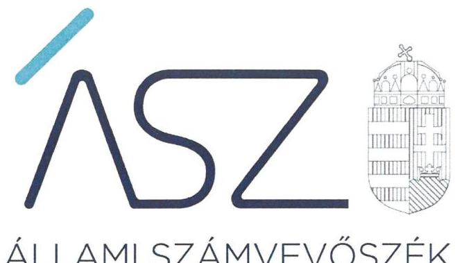
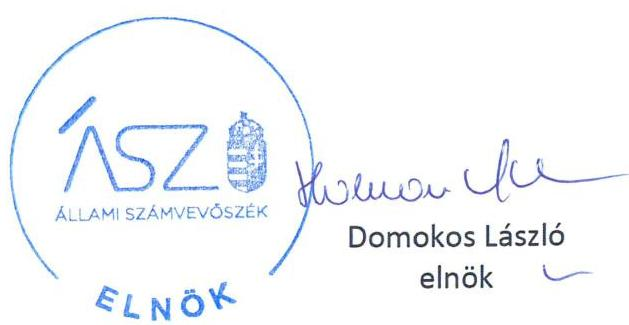
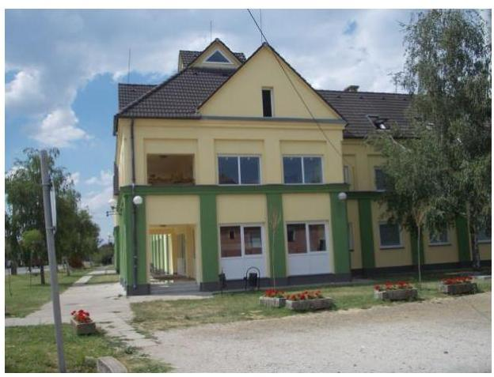

ÁLLAMI SZÁMVEVŐSZÉK

# JELENTÉS 

Nemzeti tulajdonú gazdasági társaságok ellenőrzése

Derecskei Városgazdálkodási Nonprofit Korlátolt Felelősségű Társaság
2020.

20193
www.asz.hu

---

ÁLLAMI SZÁMVEVŐSZÉK

# JELENTÉS

Nemzeti tulajdonú gazdasági társaságok ellenőrzése

Derecskei Városgazdálkodási Nonprofit Korlátolt Felelősségű Társaság

2020. 09. hó 29. nap

20193
www.asz.hu

---

# AZ ELLENŐRZÉST FELÜGYELTE: 

KAKAS SÁNDOR felügyeleti vezető

## AZ ELLENŐRZÉST VEZETTE ÉS A VÉGREHAJTÁSÁÉRT FELELŐS:

ÓDOR ZOLTÁN TAMÁS ellenőrzésvezető

## A PROGRAM ÖSSZEÁLLÍTÁSÁÉRT FELELŐS:

FEKETE-NAGY ANDRÁS GÁBOR projektvezető

IKTATÓSZÁM EL-2894-001/2020
TÉMASZÁM: 2478
ELLENŐRZÉS-AZONOSÍTÓ SZÁM: V082271, V085721

---

# TARTALOMJEGYZÉK 

■ ÖSSZEGZÉS ..... 5
■ AZ ELLENŐRZÉS CÉLJA ..... 6
■ AZ ELLENŐRZÉS TERÜLETE ..... 7
■ AZ ELLENŐRZÉS HÁTTERE, INDOKOLTSÁGA ..... 8
■ A JELENTÉS LÉNYEGES KÉRDÉSKÖREI ..... 9
■ AZ ELLENŐRZÉS HATÓKÖRE ÉS MÓDSZEREI ..... 10
■ MEGÁLLAPÍTÁSOK ..... 12
■ JAVASLATOK ..... 14
■ MELLÉKLETEK ..... 15
I. sz. melléklet: Értelmező szótár ..... 15
■ FÜGGELÉKEK ..... 17
I. sz. függelék: Vezetői teljesítmény értékelése ..... 17
II. sz. függelék: Észrevételek ..... 18
■ RÖVIDÍTÉSEK JEGYZÉKE ..... 19

---

.

---

# ÖSSZEGZÉS 

A Derecskei Városgazdálkodási Nonprofit Korlátolt Felelősségű Társaság vagyongazdálkodása a 2015 -2018. évben nem volt szabályszerű, így az átláthatóságot és az elszámoltathatóságot, valamint a nemzeti vagyon megőrzését nem biztosította.

## Az ellenőrzés társadalmi indokoltsága

Az Állami Számvevőszék kiemelt célja, hogy a helyi önkormányzatok gazdálkodásában rejlő pénzügyi kockázatok feltárásával, az államháztartáson kívülre nyújtott költségvetési támogatások és ingyenes vagyonjuttatások, valamint az államháztartáson kívül múködő feladatellátó rendszerek ellenőrzéseivel hozzájáruljon ahhoz, hogy a közpénzeket az államháztartáson kívül múködő szervezetek is átlátható, rendezett módon használják fel.

Magyarországon az önkormányzatok kötelező és önként vállalt feladataik vonatkozásában is egyre szélesebb körben alkalmazzák a költségvetésen kívüli feladatellátást, ezáltal - a nonprofit szervezetek mellett - az önkormányzati tulajdonú gazdasági társaságok is kiemelt fontosságú szerephez jutottak.

Az önkormányzati többségi tulajdonban álló gazdaságok ellenőrzése kiemelt jelentőségű, mivel múködésük hatással van a tulajdonos önkormányzat gazdálkodására.

Derecskén 2015-2018 között a Derecskei Városgazdálkodási Nonprofit Korlátolt Felelősségű Társaság közfeladatokat látott el, Derecske Város Önkormányzatával kötött megállapodás keretében, tevékenységén keresztül a lakosság széles köre kerülhet kapcsolatba a Társasággal és az általa nyújtott szolgáltatásokkal ezért is indokolt az Állami Számvevőszék által folytatott ellenőrzés.

## Főbb megállapítások, következtetések, javaslatok

Derecske Város Önkormányzata tulajdonosi joggyakorlása szabályszerű volt, azonban a Derecskei Városgazdálkodási Nonprofit Korlátolt Felelősségű Társaság felügyelőbizottsága nem rendelkezett ügyrenddel.

A Derecskei Városgazdálkodási Nonprofit Korlátolt Felelősségű Társaság vagyongazdálkodási tevékenysége nem volt szabályszerű, a 2015-2018. években a számviteli beszámolók mérlegtételeit nem támasztotta alá a Számv. tv. előírásai szerinti leltárral, ezért az éves beszámolói nem voltak megalapozottak. Szabályszerű leltár hiányában nem volt igazolt, hogy a Társaság beszámolóiban szereplő tételek a valóságban is megtalálhatóak, a közvagyonba tartozó eszközök közfeladat ellátásához rendelkezésre álltak.

Az Állami Számvevőszék a Derecskei Városgazdálkodási Nonprofit Korlátolt Felelősségű Társaság ügyvezetőjének kettő, míg Derecske Város Önkormányzata polgármesterének egy javaslatot fogalmazott meg.

---

# AZ ELLENŐRZÉS CÉLJA 

Az ellenőrzés célja annak megállapítása volt, hogy a tulajdonosi joggyakorló a gazdasági társaságai feletti tulajdonosi joggyakorlás kereteit kialakította-e, tulajdonosi jogait megfelelően gyakorolta-e és kötelezettségeit teljesítettee, továbbá annak megállapítása, hogy a gazdasági társaság biztosította-e a vagyon védelmét a nyilvántartások szabályszerű vezetése és a mérleg tételeinek leltárral történő alátámasztása útján, valamint szabályszerűen gon-doskodott-e a társaság használatában, kezelésében lévő nemzeti vagyon értékének megőrzéséről, gyarapításáról, hasznosításáról. További cél volt a vezetői tevékenységben rejlő kockázatok azonosítása és az egyes vezetői feladatok értékelése.

---

# **AZ ELLENŐRZÉS TERÜLETE**

## **Derecskei Városgazdálkodási Nonprofit Korlátolt Felelősségű Társaság és a tulajdonosi jogokat gyakorló Derecske Város Önkormányzata**

A Derecskei Városgazdálkodási Nonprofit Kft.-t Derecske Város Önkormányzata 2009. június 10-én alapította. A Társaság1 az ellenőrzött időszakban az Önkormányzat2 kizárólagos tulajdonában állt.

A Társaság jegyzett tőkéje alapításkor 124,63 millió Ft volt, amely az ellenőrzött időszak végéig nem változott.

A Társaság Alapító okirat3 1-2-ban meghatározott főtevékenysége egyéb vendéglátás, ezen belül önkormányzati intézményekben közétkeztetés biztosítása, mint közhasznú tevékenység volt, amelyet közfeladatként látott el.

A Társaság az ellenőrzött időszakban saját vagyonával gazdálkodott, vagyonkezelt vagyonnal nem rendelkezett, koncessziós szerződést nem kötött. A Társaságnak nem volt másik gazdasági társaságban tulajdoni részesedése.

A Társaság az ellenőrzött időszakban nem tartozott a kormányzati szektorba sorolt egyéb szervezetek közé.

A Társaság a Számv. tv.4 előírása alapján könyvvizsgálatra kötelezett volt.

A Társaság ügyvezetőjének személye az ellenőrzés időszaka alatt nem változott, a jelenlegi ügyvezető tisztségét 2013. február 14-től látja el, a polgármester személye az ellenőrzött időszak alatt nem változott.

A Társaságnál három tagú Felügyelő Bizottság működött, egyikük személye 2018. május 31-án változott.

A Társaság által foglalkoztatottak átlagos statisztikai létszáma 2015. évben 31 fő volt, ez 2018. évre 36 főre változott.

---

# AZ ELLENŐRZÉS HÁTTERE, INDOKOLTSÁGA 

Az Alaptörvény ${ }^{5}$ 38. cikke alapján az állam és a helyi önkormányzatok tulajdona nemzeti vagyon. A nemzeti vagyon megőrzése, megóvása érdekében kiemelten fontos ezen nemzeti tulajdonú gazdasági társaságok ellenőrzése. Gazdálkodásuk jellemzően a közérdeklődés és a média figyelmének középpontjában áll, amihez hozzájárul a gazdálkodásuk körébe tartozó - a nemzeti vagyon részét képező - vagyon nagysága, illetve az általuk ellátott közszolgáltatások minősége és hatékonysága. Ellenőrzéseink feltárhatják, hogy a tulajdonosi felügyelet hozzájárult-e a szabályszerű gazdálkodáshoz és feladatellátáshoz.

Az ellenőrzés eredményeként meghatározhatóvá válnak a szervezet vagyongazdálkodást érintő kockázatai, ezzel lehetővé téve a kockázatok csökkentését. A megállapítások alapján megfogalmazott számvevőszéki javaslatok hasznosítása elősegítheti a meglévő hibák megszüntetését. A jó gyakorlatok bemutatásával az ÁSZ ${ }^{6}$ hozzájárulhat a követendő megoldások megismertetéséhez, terjesztéséhez.

A Kormány „jól múködő állam" megteremtésével, kapcsolatos céljaival összhangban van, hogy olyan vezetői teljesítményértékelési rendszer kerüljön kialakításra és múködtetésre, amely hozzájárul a szervezeti teljesítmény növeléséhez, a fejlődési lehetőségek kihasználásához. Az ÁSZ a rendszer kiépítésében vállalt aktív ellenőrzési, értékelési tevékenységével kíván hozzájárulni a „jól irányított állam" megteremtéséhez.

---

# A JELENTÉS LÉNYEGES KÉRDÉSKÖREI 

1. A gazdasági társaság feletti tulajdonosi joggyakorlás megfelel-e a jogszabályi és belső előírásoknak?
2. A Társaság vagyongazdálkodási tevékenysége szabályszerü volt-e?
3. A Társaság vezetőjének tevékenysége megfelelő volt-e?

---

# AZ ELLENŐRZÉS HATÓKÖRE ÉS MÓDSZEREI 

## Az ellenőrzés típusa

Megfelelőségi ellenőrzés.

## Az ellenőrzött időszak

A tulajdonosi joggyakorlás vonatkozásában az ellenőrzött időszak a 20172018. évek, az éves beszámolók elfogadása és tulajdonosi ellenőrzése kivételével, amelyeknél az ellenőrzött időszak 2015 - 2018. évek.

A Társaság vagyongazdálkodása vonatkozásában az ellenőrzött időszak 2015 - 2018. évek.

A vezetői teljesítmény értékelése vonatkozásában az ellenőrzött időszak a 2018. év.

## Az ellenőrzés tárgya

Az önkormányzat 100\%-os tulajdonában lévő gazdasági társaság feletti tulajdonosi joggyakorlás kialakítása és múködtetése.

Önkormányzati tulajdonban lévő gazdasági társaság vagyongazdálkodása, saját vagyona tekintetében a vagyonnyilvántartások vezetése, leltára.

Az ellenőrzött önkormányzati tulajdonban lévő gazdasági társaság vezető tisztségviselője.

## Az ellenőrzött szervezet

Derecskei Városgazdálkodási Nonprofit Korlátolt Felelősségű Társaság Derecske Város Önkormányzata.

## Az ellenőrzés jogalapja

Az ellenőrzés jogalapját az ÁSZ tv. 1. § (3) bekezdése és 5. § (3)-(5) bekezdései képezték.

---

# Az ellenőrzés módszerei 

Az ellenőrzést az ellenőrzési program ellenőrzési kérdései, az ellenőrzött időszakban hatályos jogszabályok, az ellenőrzés szakmai szabályok és módszertanok alapján, a nemzetközi standardok figyelembe vételével végezte az ÁSZ.

Az ellenőrzés ideje alatt az ellenőrzött szervezettel történő kapcsolattartást az ÁSZ Szervezeti és Múködési Szabályzatának vonatkozó előírásai alapján biztosította az ÁSZ.

Az ellenőrzés lefolytatásához a társaság az ÁSZ által kért dokumentumok elektronikus megküldésével szolgáltatott adatokat. A rendelkezésre bocsátott adatok, információk kontrollja az ellenőrzés keretében történt.

Az ÁSZ a tulajdonosi joggyakorlás kereteinek kialakítását, a tulajdonosi joggyakorló tevékenységét a felügyelő bizottság és a független könyvvizsgáló múködéséhez kapcsolódóan ellenőrizte, valamint azt, hogy a tulajdonosi joggyakorló - amennyiben a gazdasági társaság feladatellátásához kapcsolódóan határozott meg követelményeket, elvárásokat - a nemzeti vagyon értékének megőrzése érdekében monitorozta-e azok teljesülését.

A gazdasági társaság vagyonhoz kapcsolódó nyilvántartásai vezetésének megfelelősége, a mérleg tételeinek leltárral való alátámasztottsága, valamint a nemzeti vagyon értéke megőrzésének, gyarapításának, hasznosításának szabályszerűsége került ellenőrzésre. A lényeges dokumentumok értékelése a teljes ellenőrzött időszakot érintőén történt meg. A vagyonnyilvántartások és a leltár szabályszerűsége esetében az ellenőrzés azokra a legnagyobb értékű tételekre - a lényeges sokaságra - terjedt ki, melyek összértéke elérte a teljes sokaság összértékének 50\%-át. A lényeges sokaságot tételesen ellenőrizte az ÁSZ.

A vezetői teljesítmény értékelése tekintetében a program ellenőrzési szempontjait a szabályszerűségi szempontok szerinti ellenőrzésben a jogszabályi előírások, belső utasítások, belső szabályozók, a tulajdonosi joggyakorlók elvárásai, előírásai, a helyénvalósági szempontok szerinti ellenőrzésben az ÁSZ által általánosan elfogadott, jó gyakorlat szerinti ajánlásai, értékelési kritériumai mentén kerültek meghatározásra. Az ellenőrzési kérdések szerint az összesített értékelés alapján az elért pontok az elérhető pontok minimum 70\%-át elérve, a társaság vezetője tevékenységét megfelelőnek, 70\% alatt nem megfelelőnek tekintette az ÁSZ.

Az ellenőrzési kérdések megválaszolásához szükséges bizonyítékok megszerzése a Társaság vonatkozásában a következő ellenőrzési eljárások alkalmazásával történt: megfigyelés, információkérés, összehasonlítás, elemző eljárás. Az ellenőrzési bizonyítékként felhasználható adatforrások közé tartoznak az ellenőrzési programban felsorolt adatforrások, továbbá minden - az ellenőrzés folyamán - feltárt, az ellenőrzés szempontjából információkat tartalmazó dokumentum. Az ÁSZ az ellenőrzést a kérdésekre adott válaszok kiértékelésével, valamint a megjelölt adatforrások, a csatolt tanúsítványok felhasználásával, továbbá az adott időszakban hatályos jogszabályok figyelembe vételével folytatta le.

---

# 1. A gazdasági társaság feletti tulajdonosi joggyakorlás megfelel - a jogszabályi és belső előírásoknak? 

Összegző megállapítás Az Önkormányzat tulajdonosi joggyakorlása szabályszerű volt.

A TÁRSASÁG FELETTI TULAJ DONOSI JOGGYAKORLÁS KERETEIT az Önkormányzat az Alapító okirat ${ }_{1-4}$-ban az Önkormányzati SzMSz-ben, valamint Vagyonrendeletben ${ }^{8}$ a Mötv. ${ }^{9}$, az Nvtv. ${ }^{10}$ és a Ptk. ${ }^{11}$ előírásai szerint alakította ki.

Az Alapító ${ }^{12}$ az Alapító Okirat ${ }_{1-4}$-ban, a közszolgáltatási szerződésekben ${ }^{13}$ határozta meg a Társaság feladatait, valamint tevékenységére vonatkozó elvárásait, követelményeit.

Az Alapító a Taktv. ${ }^{14}$ előírása szerint megalkotta a Javadalmazási szabályzatot ${ }^{15}$.

## A TULAJ DONOSI JOGGYAKORLÁSSAL KAPCSOLATBAN az Alapító az Alapító okirat rendelkezései szerint kijelölte a Társaság vezető tisztségviselőjét, a Felügyelőbizottság ${ }^{16}$ tagjait, valamint a könyvvizsgálót ${ }^{17}$, továbbá a Ptk. és a Taktv. előírásainak eleget téve meghatározta a Felügyelőbizottság feladatait, hatáskörét, azonban a Felügyelőbizottság múködése az ellenőrzött időszakban nem volt szabályszerű, mert a Ptk. 3:122. § (3) bekezdése ellenére nem rendelkezett ügyrenddel.

Az Alapító a Társaság 2015-2018. évi egyszerűsített éves beszámolóit, a Ptk. a Számv. tv. és az Alapító okirat előírásai alapján a Felügyelőbizottság írásbeli jelentése birtokában fogadta el.

## 2. A Társaság vagyongazdálkodási tevékenysége szabályszerű volt-e?

Összegző megállapítás

A Társaság vagyongazdálkodása a 2015-2018. években nem volt szabályszerű.

## LELTÁRKÉSZÍTÉSI ÉS LELTÁROZÁSI SZABÁLY-

ZATTAL $1-2^{18}$ a Társaság rendelkezett az ellenőrzött időszakban a Számv. tv. előírásainak megfelelően.

A Társaság a jogszabályi előírásokkal összhangban megalkotta Számviteli politikáját ${ }_{1-2}{ }^{19}$, Számlarendjét ${ }_{1-2}{ }^{20}$ A Számlarend2 a Számv. tv. 161.§ (2) bekezdés a) pontban előírtak ellenére nem tartalmazta minden alkalmazásra kijelölt számla számjelét és megnevezését, így a Számv. tv. 161.§ (1) bekezdésével ellentétben nem biztosította törvényben előírt beszámoló elkészítését.

---

A TÁRSASÁG VAGYONGAZDÁLKODÁSA 2015-2018. években nem volt szabályszerű.

A Társaság mérlegtételeinek alátámasztásához a Számv. tv. 69. § (1) bekezdésének előírása ellenére 2015 - 2018. évekre vonatkozóan nem állított össze szabályszerű leltárt, amely tételesen, ellenőrizhető módon tartalmazta a mérleg fordulónapján meglévő eszközöket és forrásokat mennyiségben és értékben.

# 3. A Társaság vezetőjének tevékenysége megfelelő volt-e? 

## Összegző megállapítás

A Társaság ügyvezetőjének 2018. évi tevékenysége nem volt megfelelő.

A Társaság vezetőjének tevékenysége a 2018. évben nem volt megfelelő, a vezető tisztségviselő nem biztosította a társaság gazdálkodásának átlátható múködését és annak alapfeltételeit a nemzeti vagyon megőrzése és védelme érdekében. A részleteket az I. számú függelék tartalmazza.

---

# JAVASLATOK 

Az ÁSZ tv. 33. § (1) bekezdésében foglaltak értelmében az ellenőrzött szervezet vezetője köteles a jelentésben foglalt megállapításokhoz kapcsolódó intézkedési tervet összeállítani és azt a jelentés kézhezvételétől számított 30 napon belül az ÁSZ részére megküldeni. Amennyiben az ellenőrzött szervezet vezetője nem küldi meg határidőben az intézkedési tervet, vagy továbbra sem elfogadható intézkedési tervet küld, az Állami Számvevőszék elnöke az ÁSZ tv. 33. § (3) bekezdése a) és b) pontjaiban foglaltakat érvényesítheti.

## a Derecskei Városgazdálkodási Nonprofit Korlátolt Felelősségű Társaság ügyvezetőjének

1. Gondoskodjon a jogszabályi előírásnak megfelelő számlarend elkészítéséről.
(2. sz. megállapítás 2. bekezdés 2. mondata alapján)
2. Az ellenőrzött időszakot követően gondoskodjon a mérlegtételek alátámasztásához a Számv. tv. 69. § (1) bekezdésének megfelelő leltár öszszeállításáról.
(2. sz. megállapítás 4. kezdése alapján)

## Derecske Város Önkormányzata polgármesterének

1. Kezdeményezze, hogy a Felügyelőbizottság állapítsa meg az ügyrendjét a jogszabályi előírásnak megfelelően.
(1. sz. megállapítás 4. bekezdés 1. mondat 3. tagmondata alapján)

---

# MELLÉKLETEK 

- I. SZ. MELLÉKLET: ÉRTELMEZŐ SZÓTÁR
gazdasági társaság
koncessziós szerződés
közszolgáltatás
közfeladat
nemzeti vagyon
nemzeti vagyon használója
tulajdonosi jogok gyakorlója
vagyonkezelő

Ptk. 3:88. § (1) bekezdése szerint „a gazdasági társaságok üzletszerű közös gazdasági tevékenység folytatására, a tagok vagyoni hozzájárulásával létrehozott, jogi személyiséggel rendelkező vállalkozások, amelyekben a tagok a nyereségből közösen részesednek, és a veszteséget közösen viselik".
Az 1991. évi XVI. tv. alapján a kizárólagos állami, önkormányzati vagy önkormányzati társulási tulajdon hatékony működtetésének, valamint a kizárólagosan az állam vagy az önkormányzat hatáskörébe utalt tevékenységek gyakorlásának egyik lehetséges útja mindezek koncessziós szerződés alapján való átengedése
Az Ebktv. ${ }^{21}$ 3. § d) pontja a következőképpen határozza meg a közszolgáltatást: „szerződéskötési kötelezettség alapján a lakosság alapvető szükségleteinek ellátására irányuló szolgáltatás, így különösen a villamosenergia-, gáz-, hő-, víz-, szennyvíz- és hulladékkezelési, köztisztasági, postai és távközlési szolgáltatás, továbbá a menetrend alapján közlekedő járművekkel végzett közforgalmú személyszállítás".
Az Áht. 3/A. § (1) bekezdése alapján közfeladat a jogszabályban meghatározott állami vagy önkormányzati feladat
Nvtv. 1. § (2) bekezdése szerint nemzeti vagyonba tartozik többek között:
„az állam vagy a helyi önkormányzat kizárólagos tulajdonában álló dolgok,
az a) pont hatálya alá nem tartozó, állam vagy a helyi önkormányzat tulajdonában lévő do$\log$,
az állam vagy a helyi önkormányzat tulajdonában lévő pénzügyi eszközök, továbbá az államot vagy a helyi önkormányzatot megillető társasági részesedések,
az államot vagy a helyi önkormányzatot megillető bármely vagyoni értékkel rendelkező jogosultság, amelyet jogszabály vagyoni értékű jogként nevesít
A tulajdonosi joggyakorló vagy a nemzeti vagyon használója által a nemzeti vagyon birtoklásának, használatának, hasznok szedése jogának bármely - a tulajdonjog átruházását nem eredményező - jogcímen történő átengedése, ide nem értve a vagyonkezelésbe adást, valamint a haszonélvezeti jog alapítását.
Forrás: Nvtv. 3. § (1) bekezdés 4. pont
Azon természetes személy, jogi személy vagy jogi személyiséggel nem rendelkező szervezet, aki vagy amely állami vagyon tekintetében törvény vagy szerződés alapján, a helyi önkormányzat vagyona tekintetében törvény, a helyi önkormányzat rendelete vagy szerződés alapján bármely jogcímen nemzeti vagyont birtokol, használ, szedi annak hasznait, kivéve a tulajdonosi joggyakorló.
Forrás: Nvtv. 3. § (1) bekezdés 11. pont
Aki a nemzeti vagyon felett az államot vagy a helyi önkormányzatot megillető tulajdonosi jogok és kötelezettségek összességének gyakorlására jogosult. (Forrás: Nvtv. 3. § (1) bekezdés 17. pontja)
az állam tulajdonában álló nemzeti vagyon tekintetében:
aa) költségvetési szerv,
ab) helyi önkormányzat, nemzetiségi önkormányzat, valamint ezek társulásai,
ac) az ab) alpontban felsoroltak fenntartása vagy irányítása alá tartozó intézmény,
ad) köztestület,
ae) az állam, az aa)-ac) alpontban meghatározott személyek együtt vagy külön-külön 100\%os tulajdonában álló gazdálkodó szervezet,
af) az ae) alpont szerinti gazdálkodó szervezet 100\%-os tulajdonában álló gazdálkodó szervezet,
ag) a törvény által kijelölt egyedileg meghatározott jogi személy.
b) a helyi önkormányzat tulajdonában álló nemzeti vagyon tekintetében:

---

ba) nemzetiségi önkormányzat, helyi vagy nemzetiségi önkormányzati társulás, valamint ezek fenntartása vagy irányítása alá tartozó intézmény,
bb) költségvetési szerv,
bc) köztestület,
bd) az állam, a helyi önkormányzat, a ba) alpontban meghatározott személyek együtt vagy külön-külön 100\%-os tulajdonában álló gazdálkodó szervezet,
be) a bd) alpont szerinti gazdálkodó szervezet 100\%-os tulajdonában álló gazdálkodó szervezet.
Forrás: Nvtv. 3. § (1) bekezdés 19. pont
vagyonkezelői jog
A vagyonkezelő köteles a vagyontárgy állagának megóvásáról, jó karbantartásáról, múködtetéséről gondoskodni, jogszabályban és szerződésben előírt más kötelezettségét teljesíteni, valamint a vagyontárgyat jogszabályban vagy szerződésben meghatározott célnak megfelelően használni. A vagyonkezelő - a központi költségvetési szervek és a kizárólag közfeladatot ellátó nem központi költségvetési szerv vagyonkezelők kivételével - köteles díjat fizetni, jogszabályban és szerződésben előírt más kötelezettségét teljesíteni, valamint a vagyontárgyat jogszabályban vagy szerződésben meghatározott célnak megfelelően használni. Amennyiben a vagyonkezelő ezen kötelezettségeinek nem tesz eleget, a tulajdonosi joggyakorló jogosult a szerződést azonnali hatállyal felmondani.
Forrás: Vtv. 27. § (2), (2a
vagyongazdálkodás
A nemzeti vagyongazdálkodás feladata a nemzeti vagyon rendeltetésének megfelelő, az állam, az önkormányzat mindenkori teherbíró képességéhez igazodó, elsődlegesen a közfeladatok ellátásához és a mindenkori társadalmi szükségletek kielégítéséhez szükséges, egységes elveken alapuló, átlátható, hatékony és költségtakarékos múködtetése, értékének megőrzése, állagának védelme, értéknövelő használata, hasznosítása, gyarapítása, továbbá az állam vagy a helyi önkormányzat feladatának ellátása szempontjából feleslegessé váló vagyontárgyak elidegenítése. (Forrás: Nvtv. 7. § (2) bekezdése).

---

# FÜGGELÉKEK 

- I. SZ. FÜGGELÉK: VEZETŐI TELJESÍTMÉNY ÉRTÉKELÉSE

Az ellenőrzés az önkormányzati tulajdonban lévő gazdasági társaság vezető tisztségviselőjére terjedt ki. Az ellenőrzés során a megalapozott vezetői teljesítmény értékeléséhez a vezetői feladatok közül a stratégiai irányítást, tervezést, azok megvalósítását, a társaság szabályszerű müködése feltételrendszerének kialakítását, a belső kontrollrendszer, valamint a humánpolitikai rendszer müködtetését, az integritás szemlélet érvényesítését, illetve a felelős vagyongazdálkodás biztosítását értékeltük.

A Derecskei Városgazdálkodási Nonprofit Kft. vezetőjének teljesítményét 2018-ban nem megfelelőnek értékeltük, mert
$\longrightarrow$ Nem dolgozta ki a Társaság középtávú stratégiáját;
$\longrightarrow$ Nem müködtetett mutatószámokon, mutatószámrendszeren alapuló szervezeti teljesítményértékelési rendszert;
$\longrightarrow$ Nem müködtetett a vezetést támogató információs/kontrolling rendszert;
$\longrightarrow$ Nem müködtetett egyéni teljesítményértékelési, és teljesítmény-ösztönző rendszert;
$\longrightarrow$ Nem dolgozta ki a társaság menedzsmentjére, munkavállalóira és a vagyongazdálkodására vonatkozó összeférhetetlenségi előírásokat;
$\longrightarrow$ Nem állt rendelkezésre a vezető jogszabályi előírások szerinti összeférhetetlenségi nyilatkozata és vagyonnyilatkozata;
$\longrightarrow$ Nem elemezte a bevételek növelését és kiadások csökkentését célzó lehetőségeket;

Mindezek alapján a Derecskei Városgazdálkodási Nonprofit Kft vezetőjének tevékenysége a 2018. évben nem volt megfelelő, a vezető tisztségviselő nem biztosította a társaság gazdálkodásának átlátható müködését és annak alapfeltételeit a nemzeti vagyon megőrzése és védelme érdekében.

A megfelelően kialakított vezetői teljesítményértékelési rendszerek alapul szolgálnak a vezetői felelősség tudatosításához, és ezáltal a szervezeti teljesítmény fenntartásához, növeléséhez, a fejlődési lehetőségek kihasználásához, hozzájárulhatnak a közvagyonnal való hatékony gazdálkodáshoz.

---

# II. SZ. FÜGGELÉK: ÉSZREVÉTELEK 

A jelentéstervezetet a Számvevőszék 15 napos észrevételezésre megküldte az ellenőrzött szervezetek vezetőinek az ÁSZ tv. 29. §* (1) bekezdése előírásának megfelelően.

Az ellenőrzött szervezetek vezetői a jelentéstervezet megállapításaira nem tettek észrevételt.

[^0]
[^0]:    * 29. § (1) Az Állami Számvevőszék az ellenőrzési megállapításait megküldi az ellenőrzött szervezet vezetőjének vagy az általa megbízott személynek, és annak, akinek személyes felelősségét állapította meg.
    (2) Az ellenőrzött szervezet vezetője és a felelősként megjelölt személy az ellenőrzés megállapításaira tizenöt napon belül írásban észrevételt tehet.
    (3) Az Állami Számvevőszék az észrevételre a beérkezésétől számított harminc napon belül írásban válaszol. A figyelembe nem vett észrevételeket köteles a jelentésben feltüntetni, és megindokolni, hogy azokat miért nem fogadta el.

---

# RÖVIDÍTÉSEK JEGYZÉKE 

${ }^{1}$ Társaság
${ }^{2}$ Önkormányzat
${ }^{3}$ Alapító okirat ${ }_{1}$

Alapító okirat ${ }_{2}$

Alapító okirat ${ }_{3}$

Alapító okirat ${ }_{4}$

${ }^{4}$ Számv. tv.
${ }^{5}$ Alaptörvény
${ }^{6}$ ÁSZ
${ }^{7}$ SZMSZ
${ }^{8}$ Vagyongazdálkodási rendelet
${ }^{9}$ Mötv.
${ }^{10}$ Nvtv.
${ }^{11}$ Ptk.
${ }^{12}$ Alapító
${ }^{13}$ Közszolgáltatási szerződések
${ }^{14}$ Taktv.

Derecskei Városgazdálkodási Nonprofit Korlátolt Felelősségű Társaság
Derecske Város Önkormányzata
A Derecskei Városgazdálkodási Nonprofit Korlátolt Felelősségű Társaság 2014.04.29. napján kelt Alapító okirata (egységes szerkezetben a 2014.04.29. napján kelt módosításokkal)
A Derecskei Városgazdálkodási Nonprofit Korlátolt Felelősségű Társaság 2018.05.31. napján kelt Alapító okirata (egységes szerkezetben a 2018.05.31. napján kelt módosításokkal)
A Derecskei Városgazdálkodási Nonprofit Korlátolt Felelősségű Társaság 2014.04.29. napján kelt Alapító okirata (egységes szerkezetben a 2014.04.29. napján kelt módosításokkal) bevezető részét és az 1.1. pontját módosító Alapító okirat módosítás
A Derecskei Városgazdálkodási Nonprofit Korlátolt Felelősségű Társaság 2018.05.31. napján kelt Alapító okirata (egységes szerkezetben a 2018.05.31. napján kelt módosításokkal) 2. pontját módosító Alapokirat módosítás
A számvitelről szóló 2000. évi C. törvény
Magyarország Alaptörvénye
Állami Számvevőszék
Derecske Város Önkormányzata Képviselő-Testületének 11/2013. (III.29.) önkormányzati rendelete az Önkormányzat Szervezeti és Müködési Szabályzatáról
Derecske Város Önkormányzata Képviselő-testületének 13/2012. (III.30.) önkormányzati rendelete az önkormányzat vagyonáról és a vagyongazdálkodás szabályairól.
2011. évi CLXXXIX. törvény Magyarország helyi önkormányzatairól
2011. évi CXCVI. törvény a nemzeti vagyonról
2013. évi V. törvény a Polgári Törvénykönyvről
A Társaság alapítója a Derecske Város Önkormányzata, mint a társaság legfőbb szerve
Közszolgáltatási szerződés: Önkormányzat tulajdonában lévő ingatlanok üzemeltetésére, karbantartására, hasznosítására 2014.01.01-én kötött, 2014. 04.30-án egységes szerkezetbe foglalt szerződés. Módosításai: 2015.05.29., 2015.12.18., 2016.05.05., 2017.03.03., 2017.06.01.

Közszolgáltatási szerződés: Derecske Város közigazgatási területén keletkező nem közművel összegyűjtött háztartási szennyvíz begyűjtésére irányuló kötelező közszolgáltatás ellátásáról szóló 2013.11.30-án kelt szerződés
Közszolgáltatási szerződés: Gyermek- és diákétkeztetés ellátására irányuló 2016.12.30-án kötött szerződés. Módosítás: 2017.12.22.

Közszolgáltatási szerződés: Kösvilágítási közszolgáltatásról szóló 2016.04.21én kötött szerződés. Módosítás: 2017.04.21.
Közszolgáltatási szerződés: Szociális étkeztetés közszolgáltatásáról szóló 2016.11.02-án és 2017.12.22-én kötött szerződések
2009. évi CXXII. törvény a köztulajdonban álló gazdasági társaságok takarékosabb müködéséről.

---

${ }^{15}$ Javadalmazási szabályzat
${ }^{16}$ Felügyelőbizottság
${ }^{17}$ könyvvizsgáló
${ }^{18}$ Eszközök és források leltározási szabályzata ${ }_{1}$

Eszközök és források leltározási szabályzata ${ }_{2}$
${ }^{19}$ Számviteli politika
${ }^{20}$ Számlarend $_{1}$
Számlarend $_{2}$
${ }^{21}$ Ebktv.

Derecskei Városgazdálkodási Nonprofit Korlátolt Felelősségű Társaság Javadalmazási szabályzata (hatályos: 2010.01.28-tól)
Derecskei Városgazdálkodási Nonprofit Korlátolt Felelősségű Társaság. Felügyelőbizottsága
Derecskei Városgazdálkodási Nonprofit Korlátolt Felelősségű Társaság. könyvvizsgálója
Derecskei Városgazdálkodási Nonprofit Korlátolt Felelősségű Társaság Eszközök és források leltározási szabályzata (hatályos: 2014.01.01-től)
Derecskei Városgazdálkodási Nonprofit Korlátolt Felelősségű Társaság Eszközök és források leltározási szabályzata (hatályos: 2016.01.01-től)
Számviteli politika (hatályos: 2009.01.01-től)
Számviteli politika2 (hatályos: 2016.01.01-től)
Számlarend (hatályos 2009.01.01-től)
Számlarend (hatályos 2016.01.01-től)
egyenlő bánásmódról és az esélyegyenlőség előmozdításáról szóló 2003. évi
CXXV. törvény

---

# ASZ 

ALLAMI SZAMVEVOSZEK
1052 Budapest, Apáczai Cs. J. u. 10. I 1364 Budapest 4. Pf. 54 TEL: +36 14849100
email: szamvevoszek@asz.hu
web: www.asz.hu | www.aszhirportal.hu