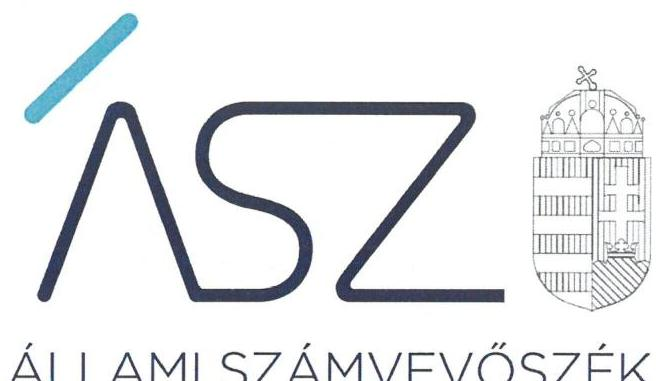
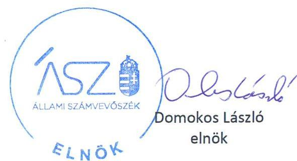
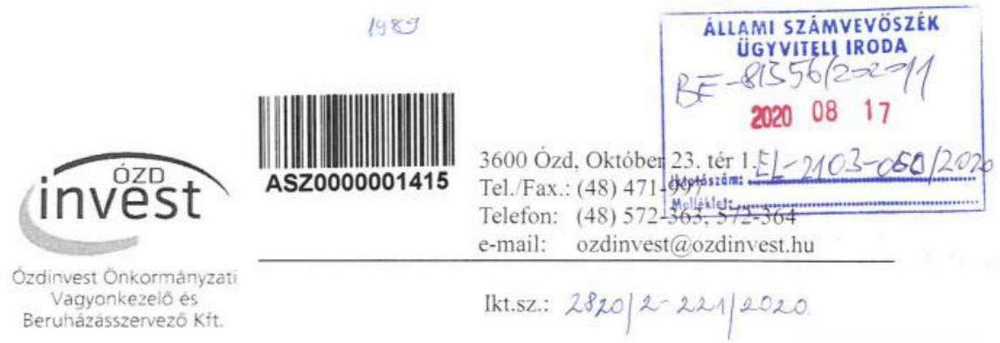
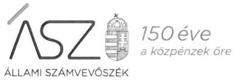
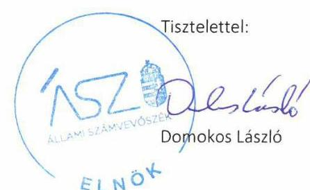
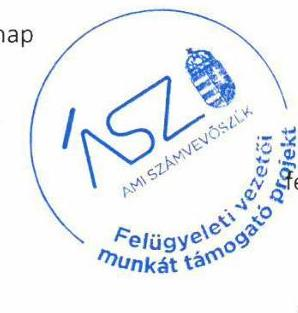

ÁLLAMI SZÁMVEVŐSZÉK

# JELENTÉS 

Nemzeti tulajdonú gazdasági társaságok ellenőrzése

ÓZDINVEST Önkormányzati Vagyonkezelő és Beruházásszervező
Korlátolt Felelősségű Társaság
2020.

20194
www.asz.hu

---

ÁLLAMI SZÁMVEVŐSZÉK

# JELENTÉS

Nemzeti tulajdonú gazdasági társaságok ellenőrzése

ÓZDINVEST Önkormányzati Vagyonkezelő és Beruházásszervező
Korlátolt Felelősségű Társaság

2020. 03. hó 23. nap

20194
www.asz.hu

---

# AZ ELLENŐRZÉST FELÜGYELTE: 

KAKAS SÁNDOR felügyeleti vezető

## AZ ELLENŐRZÉST VEZETTE ÉS A VÉGREHAJTÁSÁÉRT FELELŐS:

DR. PELLEI TAMÁS ellenőrzésvezető

A PROGRAM ÖSSZEÁLLÍTÁSÁÉRT FELELŐS:
TÓTPÁL SZABOLCS osztályvezető
FEKETE-NAGY ANDRÁS projektvezető

IKTATÓSZÁM: EL-2901-001/2020.
TÉMASZÁM: 2478
ELLENŐRZÉS-AZONOSÍTÓ SZÁM: V082239, V085703
Jelentéseink az Országgyúlés számítógépes hálózatán és az interneten a www.asz.hu címen is olvashatóak.

---

# TARTALOMJEGYZÉK 

■ ÖSSZEGZÉS ..... 5
■ AZ ELLENŐRZÉS CÉLJA ..... 6
■ AZ ELLENŐRZÉS TERÜLETE ..... 7
■ AZ ELLENŐRZÉS HÁTTERE, INDOKOLTSÁGA ..... 8
■ A JELENTÉS LÉNYEGES KÉRDÉSKÖREI ..... 9
■ AZ ELLENŐRZÉS HATÓKÖRE ÉS MÓDSZEREI ..... 10
■ MEGÁLLAPÍTÁSOK ..... 12
■ JAVASLATOK ..... 15
■ MELLÉKLETEK ..... 17
I. sz. melléklet: Értelmező szótár ..... 17
■ FÜGGELÉK: ÉSZREVÉTELEK ..... 19
■ RÖVIDÍTÉSEK JEGYZÉKE ..... 29

---

.

---

# ÖSSZEGZÉS 

Az ÓZDINVEST Önkormányzati Vagyonkezelő és Beruházásszervező Korlátolt Felelősségű Társaság vagyongazdálkodása a 2015-2018. években nem volt szabályszerű, ezért müködésének átláthatósága és elszámoltathatósága, továbbá a nemzeti vagyonnal való felelős gazdálkodás nem volt biztositott.

## Az ellenőrzés társadalmi indokoltsága

Az Állami Számvevőszék kiemelt célja, hogy ellenőrzéseivel hozzájáruljon ahhoz, hogy a közpénzeket, illetve az ingyenesen juttatott közvagyont az államháztartáson kívül működő szervezetek is átlátható, rendezett módon használják fel.

Az állam és a helyi önkormányzatok tulajdona nemzeti vagyon, melynek megőrzése érdekében kiemelten fontos a nemzeti tulajdonú gazdasági társaságok ellenőrzése. Ellenőrzésüket további társadalmi elvárás is indokolja. Részben a gazdálkodásuk körébe tartozó vagyon nagysága, részben az általuk ellátott közszolgáltatások, sajátos feladatellátások, mivel tevékenységükön keresztül a lakosság széles köre kerül kapcsolatba a társaságokkal. Az önkormányzati tulajdonú gazdasági társaságok vezetői teljesítményértékelését érintő ellenőrzések lefolytatása a téma jellege, a vezetőknek a társaság működése szempontjából meghatározó szerepe és a társadalmi érdeklődés miatt indokolt.

Az Állami Számvevőszék céljaival és a társadalmi igénnyel összhangban, a gazdasági társaságok kiemelt fontosságú szerepe miatt került sor az ÓZDINVEST Önkormányzati Vagyonkezelő és Beruházásszervező Korlátolt Felelősségű Társaság vagyongazdálkodásának, illetve az Ózd Város Önkormányzata tulajdonosi joggyakorlásának ellenőrzésére.

## Főbb megállapítások, következtetések, javaslatok

Ózd Város Önkormányzata a tulajdonosi jogait szabályszerűen gyakorolta.
Az ÓZDINVEST Önkormányzati Vagyonkezelő és Beruházásszervező Korlátolt Felelősségű Társaság a jogszabályi előírásnak megfelelően rendelkezett leltározási szabályzattal, azonban beszámoló mérlegtételeinek alátámasztásához nem készített a jogszabályi előírásoknak megfelelő leltárt. Szabályszerű leltár hiányában az egyszerűsített éves beszámolói nem voltak megalapozottak, így a valódiság elve, mint számviteli alapelv nem érvényesült, az ÓZDINVEST Önkormányzati Vagyonkezelő és Beruházásszervező Korlátolt Felelősségű Társaság nem biztosította a nemzeti vagyonnal való elszámoltathatóságának feltételeit.

Az ÓZDINVEST Önkormányzati Vagyonkezelő és Beruházásszervező Korlátolt Felelősségű Társaság a jogszabályi előírások ellenére a 2015. és a 2017. évi tárgyi eszközeinek bekerülési értékét nem az eszközök megszerzése érdekében felmerült összegben állapította meg.

Az Állami Számvevőszék a jelentésben foglalt megállapítások alapján az ÓZDINVEST Önkormányzati Vagyonkezelő és Beruházásszervező Korlátolt Felelősségű Társaság ügyvezetője részére kettő javaslatot fogalmazott meg.

---

# AZ ELLENŐRZÉS CÉLJA 

AZ ELLENŐRZÉS CÉLJA annak megállapítása volt, hogy az Alapító ${ }^{1}$ a gazdasági társasága feletti tulajdonosi joggyakorlás kereteit kialakította-e, tulajdonosi jogait megfelelően gyakorolta-e és kötelezettségeit teljesítettee. Az ellenőrzés értékelte, hogy a gazdasági társaság biz-tosította-e a vagyon védelmét a nyilvántartások szabályszerű vezetése és a mérleg tételeinek leltárral történő alátámasztása útján, valamint szabályszerűen gondoskodott-e a gazdasági társaság használatában, kezelésében lévő nemzeti vagyon értékének megőrzéséről, gyarapításáról, hasznosításáról. Az ellenőrzés célja volt továbbá az

ÖZDINVEST Önkormányzati Vagyonkezelő és Beruházásszervező Korlátolt Felelősségű Társaság vezetője tevékenységében rejlő kockázatok azonosítása az egyes vezetői feladatok ellátásával összhangban.

---

# AZ ELLENŐRZÉS TERÜLETE 

## Ózd Város Önkormányzata és a kizárólagos tulajdonában lévő ÓZDINVEST Önkormányzati Vagyonkezelő és Beruházásszervező Korlátolt Felelősségű Társaság

Az Alapító 100\%-os tulajdonában álló társasága az ÓZDINVEST Önkormányzati Vagyonkezelő és Beruházásszervező Korlátolt Felelősségű Társaság, amelynek jegyzet tőkéje 2016. augusztus 1-től az Őzdi Vízmú Kft.-nek a Társaságba² történő beolvadása miatt 15,66 millió Ft-ról 30 millió Ft-ra változott.

A Társaság fő tevékenysége az ingatlankezelés volt. A Társaság az ingatlankezelésen kívül többek között ellátta Ózd város vezetékes gázvagyonának kezelését, illetve végrehajtotta Ózd város gázellátási programját, továbbá a piacfelügyeleti és temetőgondnoksági feladatokat is megvalósított.

A Társaság az Önkormányzattal ${ }^{3}$ megkötött üzemeltetési szerződés ${ }_{1-5}{ }^{4}$ alapján látta el többek között a lakáscélú ingatlanok üzemeltetésével kapcsolatos, valamint a piacfelügyeleti és temetőgondnoksági feladatokat. A Társaság gondoskodott Ózd város vezetékes gázellátásának megvalósításáról és a gázvagyon kezelésével kapcsolatos tevékenységének ellátásáról.

A Társaság a gázközmú vagyon kezelését a vagyonkezelési szerződés ${ }_{1}^{5}$ alapján végezte. A nem lakáscélú ingatlanok és az ingatlanokhoz kapcsolódó vagyonelemek kezelését a vagyonkezelési szerződés ${ }_{2}^{6}$ alapján látta el 2016. december 31-éig. 2017. január 1-jétől a nem lakáscélú ingatlanok és az ingatlanokhoz kapcsolódó vagyonelemeket az Önkormányzat üzemeltetésbe adta át a Társaság részére a 2016. december 15én módosított üzemeltetési szerződés ${ }_{1}$ keretében.

A Társaság foglalkoztatottainak száma 2015. december 31-ről 2018. december 31-re 60 főről 45 főre változott, az Alapító okirat ${ }_{1-5}{ }^{7}$ szerint az ügyvezető személyben az ellenőrzött időszakban történt változás. A Társaság a Számv. tv. ${ }^{8}$ előírása szerint könyvvizsgálatra volt kötelezett. A Társaság nem rendelkezett tulajdonosi részesedéssel más gazdasági társaságban.

A Társaság nem minősült kormányzati szektorba sorolt egyéb szervezetnek.

---

# AZ ELLENŐRZÉS HÁTTERE, INDOKOLTSÁGA 

Az Alaptörvény ${ }^{9}$ 38. cikke alapján az állam és a helyi önkormányzatok tulajdona nemzeti vagyon. A nemzeti vagyon megőrzése, megóvása érdekében kiemelten fontos ezen nemzeti tulajdonú gazdasági társaságok ellenőrzése. Gazdálkodásuk jellemzően a közérdeklődés és a média figyelmének középpontjában áll, amihez hozzájárul a gazdálkodásuk körébe tartozó - a nemzeti vagyon részét képező - vagyon nagysága, illetve az általuk ellátott közszolgáltatások minősége és hatékonysága. Ellenőrzéseink feltárhatják, hogy a tulajdonosi felügyelet hozzájárult-e a szabályszerű gazdálkodáshoz és feladatellátáshoz.

Az ellenőrzés eredményeként meghatározhatóvá válnak a szervezet vagyongazdálkodást érintő kockázatai, ezzel lehetővé téve a kockázatok csökkentését. A megállapítások alapján megfogalmazott számvevőszéki javaslatok hasznosítása elősegítheti a meglévő hibák megszüntetését. A jó gyakorlatok bemutatásával az ÁSZ ${ }^{10}$ hozzájárulhat a követendő megoldások megismertetéséhez, terjesztéséhez.

A Kormány „jól múködő állam" megteremtésével kapcsolatos céljaival összhangban van, hogy olyan vezetői teljesítményértékelési rendszer kerüljön kialakításra és múködtetésre, amely hozzájárul a szervezeti teljesítmény növeléséhez, a fejlődési lehetőségek kihasználásához. Az ÁSZ a rendszer kiépítésében vállalt aktív ellenőrzési, értékelési tevékenységével kíván hozzájárulni a „jól múködő állam" megteremtéséhez.

---

# A JELENTÉS LÉNYEGES KÉRDÉSKÖREI 

1. A Társaság feletti tulajdonosi joggyakorlás megfelelt-e a jogszabályi és belső előírásoknak?
2. A Társaság vagyongazdálkodási tevékenysége szabályszerü volt-e?
3. A vezető teljesítménye megfelelő volt-e?

---

# AZ ELLENŐRZÉS HATÓKÖRE ÉS MÓDSZEREI 

## Az ellenőrzés típusa

Megfelelőségi ellenőrzés.

## Az ellenőrzött időszak

A tulajdonosi joggyakorlás vonatkozásában az ellenőrzött időszak a 20172018. évek, az éves beszámolók elfogadása kivételével, amelyeknél az ellenőrzött időszak 2015-2018. évek.

A Társaság vagyongazdálkodása vonatkozásában az ellenőrzött időszak 2015-2018. évek.

A vezetői teljesítmény ellenőrzése esetében az ellenőrzött időszak a 2018. év.

## Az ellenőrzés tárgya

Az önkormányzati tulajdonban lévő gazdasági társaság feletti tulajdonosi joggyakorlás kialakítása és múködtetése.

Önkormányzati tulajdonban lévő gazdasági társaság vagyongazdálkodása keretében a Társaság használatában, kezelésében lévő nemzeti vagyon, illetve a saját vagyon tekintetében a vagyonnyilvántartások vezetése, leltára. A Társaság használatában lévő nemzeti vagyon tekintetében a vagyon értékének megőrzése, gyarapítása, hasznosítása.

Az önkormányzati tulajdonban lévő gazdasági társaság átlátható, szabályszerű, gazdaságos, hatékony, eredményes és felelős gazdálkodásának feltételrendszere kialakítása, a belső kontrollrendszer és humánpolitikai rendszer múködtetése. Az integritásszemléletet érvényesítése, illetve a felelős vagyongazdálkodás biztosítása a nemzeti vagyon megőrzése és védelme érdekében.

## Az ellenőrzött szervezet

- Özd Város Önkormányzata
- ÖZDINVEST Önkormányzati Vagyonkezelő és Beruházásszervező Korlátolt Felelősségű Társaság

---

# Az ellenőrzés jogalapja 

Az ellenőrzés jogalapját az ÁSZ tv. ${ }^{11}$ 1. § (3) bekezdése és 5. § (3)-(5) bekezdései képezték.

## Az ellenőrzés módszerei

Az ellenőrzést az ellenőrzési program ellenőrzési kérdései, az ellenőrzött időszakban hatályos jogszabályok, az ellenőrzés szakmai szabályok és módszertanok alapján, a nemzetközi standardok figyelembe vételével végezte az ÁSZ.

Az ellenőrzés ideje alatt az ellenőrzött szervezettel történő kapcsolattartást az ÁSZ SZMSZ-ének ${ }^{12}$ vonatkozó előírásai alapján biztosította az ÁSZ.

A gazdasági társaság vagyonhoz kapcsolódó nyilvántartásai vezetésének megfelelősége, a mérleg tételeinek leltárral való alátámasztottsága, valamint a nemzeti vagyon értékmegőrzésének, hasznosításának szabályszerűsége 2015. és 2017-2018. évek tekintetében került ellenőrzésre. A 2015-2018. éveket érintően történt meg a lényeges dokumentumok értékelése.

A vagyonnyilvántartások és a leltár szabályszerűsége esetében az ellenőrzés azokra a legnagyobb értékű tételekre - a lényeges sokaságra terjedt ki, melyek összértéke eléri a teljes sokaság összértékének 50\%-át. A lényeges sokaságot tételesen ellenőrizte az ÁSZ.

A vezetői teljesítmény ellenőrzési szempontjait a szabályszerűségi szempontok szerinti ellenőrzésben a jogszabályi előírások, belső utasítások, belső szabályozók, a tulajdonosi joggyakorlók elvárásai, előírásai, a helyénvalósági szempontok szerinti ellenőrzésben az ÁSZ által általánosan elfogadott, jó gyakorlat szerinti ajánlásai, értékelési kritériumai mentén kerültek meghatározásra. Az ellenőrzési kérdések szerint az összesített értékelés alapján az elért pontok az elérhető pontok minimum 70\%-át elérve, a társaság vezetője tevékenységét megfelelőnek, 70\% alatt nem megfelelőnek tekintette az ÁSZ.

Az ellenőrzési kérdések megválaszolásához szükséges bizonyítékok megszerzése a következő ellenőrzési eljárások alkalmazásával történt: megfigyelés, információkérés, összehasonlítás, elemző eljárás. Az ellenőrzési bizonyítékként felhasználható adatforrások közé tartoznak az ellenőrzési programban felsorolt adatforrások, továbbá minden - az ellenőrzés folyamán - feltárt, az ellenőrzés szempontjából információkat tartalmazó dokumentum.

Az ÁSZ az ellenőrzést a kérdésekre adott válaszok kiértékelésével, valamint a megjelölt adatforrások, a csatolt tanúsítványok felhasználásával, továbbá az adott időszakban hatályos jogszabályok figyelembe vételével folytatta le.

---

# MEGÁLLAPÍTÁSOK 

## 1. A Társaság feletti tulajdonosi joggyakorlás megfelelt-e a jogszabályi és belső előírásoknak?

Összegző megállapítás A Társaság feletti tulajdonosi joggyakorlás szabályszerű volt.
A TULAJDONOSI JOGOK GYAKORLÁSÁNAK KERETEIT az Alapító a Vagyonrendeletben ${ }^{13}$, az SZMSZ ${ }_{1-2}{ }^{14}$-ben, valamint az Alapító okiratban ${ }_{3-5}$ az Nvtv. ${ }^{15}$, a Ptk. ${ }^{16}$ és az Mötv. ${ }^{17}$ előírásai alapján alakította ki. A vagyonkezelt és az üzemeltetésre átadott eszközökkel kapcsolatos kötelezettségeket a vagyonkezelési szerződés ${ }_{1-2}$ és az üzemeltetési szerződés ${ }_{1-5}$ tartalmazta.

AZ ALAPÍTÓ megalkotta a Javadalmazási szabályzat ${ }_{1,2}{ }^{18}$-ot. A Taktv. ${ }^{19}$ 5. § (3) bekezdésében előírtak ellenére a Javadalmazási szabályzat ${ }_{1}$ nem tartalmazta az Mt. ${ }^{20}$ 208. §-ának hatálya alá tartozó munkavállalók javadalmazásának, valamint a jogviszony megszűnése esetére biztosított juttatások módjának, mértékének elveit. A 2018. december 1-jétől hatályos Javadalmazási szabályzat ${ }_{2}$-ot a Társaság legfőbb szerve a Taktv. előírása szerint alkotta meg.

AZ ÜZLETI TERVEIT a Társaság az ellenőrzött időszakban elkészítette, amelyet az Alapító határozatával elfogadott.

A FELÜGYELŐ BIZOTTSÁG ${ }^{21}$ tevékenységéhez kapcsolódóan a tulajdonosi joggyakorlás szabályszerű volt. A Felügyelő Bizottság létrehozása megfelelt a Ptk. és a Taktv. előírásainak. A Felügyelő Bizottság ügyrendjét az Alapító határozatával elfogadta.

A TÁRSASÁG EGYSZERŰSÍTETT ÉVES BESZÁMOLÓIT az Alapító a Ptk. előírásainak megfelelően a felügyelő bizottság és a könyvvizsgáló jelentésének birtokában fogadta el.

## 2. A Társaság vagyongazdálkodási tevékenysége szabályszerű volt-e?

Összegző megállapítás A Társaság vagyongazdálkodása - a vagyonkezelésben és üzemeltetésben lévő eszközök kivételével - nem volt szabályszerű.

A VAGYONGAZDÁLKODÁS FELTÉTELEIT a Társaság szabályszerűen kialakította, mivel a Számv. tv. előírásai alapján rendelkezett számviteli szabályzatokkal. A Társaság rendelkezett a Számv. tv. előírása szerint Számlarenddel ${ }_{1-5}{ }^{22}$.

---

A Társaság a belső szabályzataiban rögzítette a saját és vagyonkezelt vagyon nyilvántartás vezetésének szabályait, továbbá a kapcsolódó fel-adat- és hatásköröket, felelősségi viszonyokat.

LELTÁROZÁSI SZABÁLYZATTAL ${ }^{23}$ a Társaság a Számv. tv. előírásának megfelelően rendelkezett, amely tartalmazta a leltározásra és a leltárkészítésre vonatkozó szabályokat, előírásokat.

A VAGYONGAZDÁLKODÁS nem volt szabályszerű, mert a Társaság:

- a 2015-2018. években a Számv. tv. 69. § (1) bekezdés előírása ellenére a könyvek üzleti év végi zárásához, a beszámoló elkészítéséhez, a mérleg tételeinek alátámasztásához nem állított össze leltárt, amely tételesen, ellenőrizhető módon tartalmazta a Társaságnak a mérleg fordulónapján meglévő eszközeit és forrásait mennyiségben és értékben, mivel a Társaság a Számv. tv. 69. § (3) bekezdés és a leltározási szabályzat 1.2 pontjában foglalt előírása ellenére a 20152017. évekre vonatkozóan a saját tulajdonú tárgyi eszközök és a készletek esetében, a 2018. évre vonatkozóan a saját tulajdonú tárgyi eszközök esetében a leltárba bekerülő adatok valódiságáról mennyiségi felvétellel nem győződött meg,
- a 2018. évben a Számv. tv. 69. § (2) bekezdésében foglalt előírás ellenére az immateriális javak és a tárgyi eszközök tekintetében a főkönyvi könyvelés és az analitikus nyilvántartások közötti egyeztetést nem végezte el,
- a Számv. tv. 47. § (1) bekezdés előírása ellenére a 2015. évi és a 2017. évi eszközbeszerzései esetében a bekerülési értéket nem az eszközök megszerzése érdekében felmerült összegben állapította meg.
A Társaság a vagyonkezelésben és üzemeltetésben lévő eszközök esetében a leltárba bekerülő adatok valódiságáról mennyiségi felvétellel évente meggyőződött, amely megfelelt a Számv. tv., a vagyonkezelési szerződés $1-2$ és az üzemeltetési szerződés $1-5$ elöírásainak.

Az ellenőrzött időszakban a Társaság a Számv. tv. és a Vagyonrendelet előírásai szerint a kezelésbe vett önkormányzati vagyon részét képező eszközöket a mérlegben eszközként mutatta ki, valamint a kiegészítő mellékletben a mérlegtételek szerinti megbontásban bemutatta. A Társaság a vagyonkezelt vagyonhoz kapcsolódó nyilvántartásait a Számv. tv., illetve az Nvtv., valamint a vagyonkezelési szerződés $1-2$ előírásainak megfelelően vezette, a saját és a vagyonkezelésre átvett eszközök elkülönítéséről gondoskodott, a vagyonkezelésbe vett vagyonelemek köre után az Mótv.-ben előírt visszapótlási kötelezettségét teljesítette. A vagyonkezelt eszközök továbbhasznosítására nem került sor.

A Társaság az ellenőrzött időszakban az üzemeltetésbe vett nemzeti vagyon továbbhasznosítása során betartotta az Nvtv. és a Számv. tv. előírásait.

---

# 3. A vezető teljesítménye megfelelő volt-e? 

## Összegző megállapítás

A vezető teljesítménye a 2018. évben nem volt megfelelő.
A Társaság vezetőjének tevékenysége a 2018. évben nem volt megfelelő, a vezető tisztségviselő nem biztosította a társaság átlátható múködését és annak alapfeltételeit a nemzeti vagyon megőrzése és védelme érdekében.

Az ellenőrzés értékelése alapján a Társaság vezetője a 2018. évben nem múködtetett vezetést támogató információs/kontrolling rendszert, valamint egyéni teljesítményértékelési, és teljesítmény-ösztönző rendszert, továbbá nem dolgozta ki a társaság menedzsmentjére, munkavállalóira és a vagyongazdálkodására vonatkozó összeférhetetlenségi előírásokat, nem állt rendelkezésre a vezető jogszabályi előírások szerinti vagyonnyilatkozata. A Társaság vezetőjének irányítása alatt nem mérték fel és nem értékelték a szervezetet és a tevékenységet érintő kockázatokat.

---

# JAVASLATOK 

Az ÁSZ tv. 33. § (1) bekezdésében foglaltak értelmében az ellenőrzött szervezet vezetője köteles a jelentésben foglalt megállapításokhoz kapcsolódó intézkedési tervet összeállítani és azt a jelentés kézhezvételétől számított 30 napon belül az ÁSZ részére megküldeni. Amennyiben az ellenőrzött szervezet vezetője nem küldi meg határidőben az intézkedési tervet, vagy továbbra sem elfogadható intézkedési tervet küld, az Állami Számvevőszék elnöke az ÁSZ tv. 33. § (3) bekezdése a) és b) pontjaiban foglaltakat érvényesítheti.

## az ÓZDINVEST Önkormányzati Vagyonkezelő és Beruházásszervező Korlátolt Felelősségű Társaság ügyvezetőjének

1. Az ellenőrzött időszakot követően gondoskodjon a mérlegtételek alátámasztásához a Számv. tv. 69. § (1) bekezdésének megfelelő leltár öszszeállításáról.
(2. megállapítás 4. bekezdés 1. francia bekezdése alapján)
2. Az ellenőrzött időszakot követően gondoskodjon a fökönyvi könyvelés és az analitikus nyilvántartások adatai közötti egyeztetés elvégzéséről a jogszabályi előírásnak megfelelően.
(2. megállapítás 4. bekezdés 2. francia bekezdése alapján)

---

.

---

# MELLÉKLETEK 

- I. SZ. MELLÉKLET: ÉRTELMEZŐ SZÓTÁR
gazdasági társaság
nemzeti vagyon
tulajdonosi jogok gyakorlója
vagyongazdálkodás
nonprofit gazdasági társaság

Ptk. 3:88. § (1) bekezdése szerint „a gazdasági társaságok üzletszerű közös gazdasági tevékenység folytatására, a tagok vagyoni hozzájárulásával létrehozott, jogi személyiséggel rendelkező vállalkozások, amelyekben a tagok a nyereségből közösen részesednek, és a veszteséget közösen viselik".
Nvtv. 1. § (2) bekezdése szerint nemzeti vagyonba tartozik többek között:
„az állam vagy a helyi önkormányzat kizárólagos tulajdonában álló dolgok,
az a) pont hatálya alá nem tartozó, állam vagy a helyi önkormányzat tulajdonában lévő do$\log$,
az állam vagy a helyi önkormányzat tulajdonában lévő pénzügyi eszközök, továbbá az államot vagy a helyi önkormányzatot megillető társasági részesedések,
az államot vagy a helyi önkormányzatot megillető bármely vagyoni érték-kel rendelkező jogosultság, amelyet jogszabály vagyoni értékű jogként nevesít
Aki a nemzeti vagyon felett az államot vagy a helyi önkormányzatot megillető tulajdonosi jogok és kötelezettségek összességének gyakorlására jogosult. (Forrás: Nvtv. 3. § (1) bekezdés 17. pontja)
A nemzeti vagyongazdálkodás feladata a nemzeti vagyon rendeltetésének megfelelő, az állam, az önkormányzat mindenkori teherbíró képességéhez igazodó, elsődlegesen a közfeladatok ellátásához és a mindenkori társadalmi szükségletek kielégítéséhez szükséges, egységes elveken alapuló, átlátható, hatékony és költségtakarékos működtetése, értékének megőrzése, állagának védelme, értéknövelő használata, hasznosítása, gyarapítása, továbbá az állam vagy a helyi önkormányzat feladatának ellátása szempontjából feleslegessé váló vagyontárgyak elidegenítése.
Forrás: Nvtv. 7. § (2) bekezdése.
az a gazdasági társaság minősül nonprofit gazdasági társaságnak és cégnevében az a gazdasági társaság tüntetheti fel a nonprofit jelleget, amelynek létesítő okirata tartalmazza, hogy a gazdasági társaság tevékenységéből származó nyereség a tagok között nem osztható fel, hanem az a gazdasági társaság vagyonát gyarapítja.
Forrás: A cégnyilvánosságról, a bírósági cégeljárásról és a végelszámolásról szóló 2006. évi V. törvény 9/F. § (2) bekezdés.

---

.

---

# FÜGGELÉK: ÉSZREVÉTELEK 

A jelentéstervezetet a Számvevőszék 15 napos észrevételezésre megküldte az ellenőrzött szervezetek vezetőinek az ÁSZ tv. 29. §* (1) bekezdése előírásának megfelelően.

Ózd Város Önkormányzatának polgármestere nem élt az ÁSZ tv. 29. § (2) bekezdésében foglalt észrevételezési jogával, az ÓZDINVEST Önkormányzati Vagyonkezelő és Beruházásszervező Korlátolt Felelősségű Társaság ügyvezetője a jelentéstervezet megállapításaira a törvényes határidőn belül észrevételt tett.
Az ÓZDINVEST Önkormányzati Vagyonkezelő és Beruházásszervező Korlátolt Felelősségű Társaság ügyvezetője észrevételét és az arra adott választ a függelék tartalmazza.

[^0]
[^0]:    * 29. § (1) Az Állami Számvevőszék az ellenőrzési megállapításait megküldi az ellenőrzött szervezet vezetőjének vagy az általa megbízott személynek, és annak, akinek személyes felelősségét állapította meg.
    (2) Az ellenőrzött szervezet vezetője és a felelősként megjelölt személy az ellenőrzés megállapításaira tizenöt napon belül írásban észrevételt tehet.
    (3) Az Állami Számvevőszék az észrevételre a beérkezésétől számított harminc napon belül írásban válaszol. A figyelembe nem vett észrevételeket köteles a jelentésben feltüntetni, és megindokolni, hogy azokat miért nem fogadta el.

---

Özdinvest Önkormányzati Vagyonkezelő és Beruházasszervező Kft.

T. ALLAMI SZÁMVEVŐSZÉK

Budapest 4.
Pf. 54

1 3 6 4

Tárgy: Észrevétel megküldése
Hiv.sz.: EL-2103-057/2020.

A fenti számú levelükre hivatkozva az alábbi észrevétellel kívánunk élni az ÖZDINVEST Kft. ellenőrzésével kapcsolatos számvevőszéki jelentéstervezetre.

1. A Társaság vagyongazdálkodási tevékenységének szabályszerűsége

A jelentéstervezet rögzíti, hogy a 2015-2018. években a Társaság nem állított össze leltárt, illetve a leltárba bekerülő adatok valódiságáról mennyiségi felvétellel nem győződött meg, 2018. évben a főkönyvi könyvelés és az analitikus nyilvántartások közötti egyeztetést nem végezte el, valamint a 2015. és 2017. évi eszközbeszerzései tekintetében a bekerülési értéket nem az eszközök megszerzése érdekében felmerült összegben állapította meg.

Társaságunk a 2019. január 17-én kelt adatkérésük alapján a 2A. sz. mellékletben feltüntetett 21. d. ponthoz feltöltötte a kért mennyiségi feltárfelvételi íveket az elektronikus rendszeren keresztül 2016., 2017. és 2018. évekre vonatkozóan. A feltöltés sikerességéről a visszaigazoló email-t megkaptuk, önök pedig nem jelezték, hogy a feltöltéssel bármilyen probléma lett volna (mint ahogy egyes szerződések esetében visszajeleztek). Minderre tekintettel Társaságunk számára nem állapítható meg, miért írják jelentéstervezetükben, hogy nem történt meg a mennyiségi felvétel.

Társaságunknak nem áll módjában a főkönyvi könyvelés és analitikus nyilvántartások közötti egyeztetés elvégzése, tekintettel arra, hogy az immateriális javak és tárgyi eszközök vonatkozásában a könyvelést a tulajdonos Özd Város Önkormányzata végzi és a főkönyvi adatok is az önkormányzatnál állnak rendelkezésre. Társaságunk csupán üzemeltetője az immateriális javaknak és tárgyi eszközöknek, nem tulajdonosa, ezért a főkönyvi adatokkal ezen tételek tekintetében nem mi rendelkezünk. Kérjük szíveskedjenek ezt jelentésük elkészítésénél figyelembe venni.

A jelentéstervezet további megállapítása, hogy Társaságunk a 2015. és 2017. évi

---

eszközbeszerzéseinél a bekerülési értéket nem az eszközök megszerzése érdekében felmerült összegben állapította meg. Társaságunk a számvitelról szóló 2000. évi C. törvény 47. §-a alapján az eszközök beszerzésekor a járulékos költségeket is ráaktiválja az adott eszközre, azonban vannak olyan beruházások, melyeknél nem merült fel járulékos költség:

1. A következő eszközök esetében nem merültek fel járulékos költségek az üzembe helyezés időpontjáig: NE300057, EG300644, EG300947, EG300954, melyek a tényleges beszerzési értéken kerültek nyilvántartásba.
2. A következő eszközök üzembe helyezéséhez járulékos költségek is kapcsolódnak (pl. szállitási- vagy postaköltség stb.): NE300052, EG300641, EG300694, MJ300084, EG300911, EG300940, EG300943.
3. Társaságunk a lakások bérbeadását adómentesen végzi, azonban egyes eszközök vegyes használatban vannak az áfás és adómentes tevékenységek között. Ezekben az esetekben arányositással a vissza nem igényelhető áfát is ráaktiváljuk a tárgyi eszközökre, ezek a következők voltak: EG300710, EG300920, EG300921.
4. Az EB300912, EB300938 és az EB300969-es nyilvántartási számú tárgyi eszközök kis értékủ eszközök. Társaságunk könyvelési programjának tárgyi eszközökre vonatkozó moduljában lehetőség van csoportos nyilvántartásra, aminek a segítségével egy nyilvántartási számon tudjuk ugyanazon eszközt nyilvántartani, melyeknek megegyezik az értéke. Az érték alapján nagy értékűnek tünik, de az EB300912 4 db, az EB300938 4 db és a EB300969 12 db eszközt takar.
Az eltéréseket a fentiekben feltüntetett körülmények okozzák, nem Társaságunk könyvelési hiányosságai, ezért kérjük, szíveskedjenek ezen tényeket figyelembe venni a jelentés elkészítésénél.

# 2. A vezetöi teljesitmény megfelelösége 

A jelentéstervezet rögzíti, hogy a Társaság vezetője 2018. évben nem múködtetett vezetést támogató információs/kontrolling rendszert, valamint egyéni teljesítményértékelési és teljesítmény-ösztönző rendszert, továbbá nem dolgozta ki a társaság menedzsmentjére, munkavállalóira és a vagyongazdálkodására vonatkozó összeférhetetlenségi előírásokat, nem állt rendelkezésre a vezető jogszabályi előírások szerinti vagyonnyilatkozata. A Társaság vezetőjének irányítása alatt nem mérték fel és nem értékelték a szervezeteket és a tevékenységet érintő kockázatokat. Mindezekért a Társaság vezetőjének tevékenységét 2018. évre nem megfelelőnek minősítették.

Társaságunk a 2020. február 4-én kelt nyilatkozataiban kijelentette, hogy nem tartozik a költségvetési szervek belső kontrollrendszeréről és belső ellenőrzéséről szóló 370/2011. (XII.31.) Korm.rendelet hatálya alá. A rendelet hatálya alá kizárólag az alábbi szervezetek tartoznak:

1. az államháztartásról szóló 2011. évi CXCV. törvény (a továbbiakban: Áht.) 3. §-ában felsoroltakra az állam és a törvény által az államháztartás központi alrendszerébe sorolt köztestületek kivételével:
„3. § (1) Az államháztartás központi és önkormányzati alrendszerből áll.
(2) Az államháztartás központi alrendszerébe tartozik
a) az állam,
b) a központi költségvetési szerv,
c) a törvény által az államháztartás központi alrendszerébe sorolt köztestület, és
d) a c) pont szerinti köztestület által irányított köztestületi költségvetési szerv.
(3) Az államháztartás önkormányzati alrendszerébe tartozik

---

a) a helyi önkormányzat,
b) a helyi nemzetiségi önkormányzat és az országos nemzetiségi önkormányzat (a továbbiakban együtt: nemzetiségi önkormányzat),
c) a Magyarország helyi önkormányzatairól szóló 2011. évi CLXXXIX. törvény (a továbbiakban: Mötv.) és a nemzetiségek jogairól szóló 2011. évi CLXXIX. törvény (a továbbiakban: Njt.) szerint létrehozott társulás, valamint a területfejlesztésről és a területrendezésről szóló törvény alapján létrejött területfejlesztési önkormányzati társulás (a továbbiakban együtt: társulás),
d) a térségi fejlesztési tanács, és
e) az a)-d) pontban foglaltak által irányított költségvetési szerv"
2. a térségi fejlesztési tanács munkaszervezetére,
3. a kormányzati szektorba sorolt egyéb szervezetekre - a köztulajdonban álló gazdasági társaságok takarékosabb müködéséről szóló 2009. évi CXXII. törvény 7/J. § (1) bekezdésének a hatálya alá tartozó köztulajdonban álló gazdasági társaságok, valamint a Magyar Nemzeti Bank és annak felügyelete alá tartozó gazdasági társságok kivételével:
„7/J. § (1) Azon köztulajdonban álló gazdasági társaság - a Magyar Nemzeti Bank és annak felügyelete alá tartozó köztulajdonban álló gazdasági társaság kivételével -, amely esetében a tárgyévet megelőző két üzleti évben a mérlegforduló napján a következő három mutatóérték közül legalább kettő a társaság elfogadott (egyszerüsített) éves beszámolója, vagy - amennyiben konszolidált éves beszámolót is készít - a konszolidált éves beszámolója alapján meghaladja az alábbi határértéket:
a) a mérlegfőösszeg a 600 millió forintot,
b) az éves nettó árbevétel az 1200 millió forintot,
c) az átlagosan foglalkoztatottak száma a 100 föt,
az e §-ban meghatározottak szerint belső kontrollrendszert müködtet."
4. jogszabály alapján a költségvetési szervek belső kontrollrendszerére és belső ellenőrzésére vonatkozó szabályokat alkalmazó más szervre, szervezetre.

E rendelet 3. §-a előírja, hogy a költségvetési szerv vezetője köteles belső kontrollrendszer keretében az alábbi folyamatokat müködtetni:
a) kontrollkörnyezet,
$b$ integrált kockázatkezelési rendszer,
c) kontrolltevékenységek,
d) információs és kommunikációs rendszer, és
e) nyomon követési rendszer (monitoring).

Szintén nyilatkoztuk, hogy nem tartozunk az államigazgatási szervek integritásirányitási rendszeréről és az érdekérvényesitők fogadásának rendjéről szóló 50/2013. (II.25.) Korm.rendelet hatálya alá sem. A rendelet hatálya alá kizárólag az alábbi szervek tartoznak: „1. § E rendelet hatálya a Kormány, valamint a Kormány tagjának irányítása vagy felügyelete alatt álló államigazgatási szervekre, és azok munkatársaira terjed ki, a rendvédelmi szervek és a Katonai Nemzetbiztonsági Szolgálat kivételével."

E rendelet 3. § (1) bekezdése előírja, hogy az államigazgatási szerveknél a hivatali szerv vezetőjének milyen, az államigazgatási szerv müködésével kapcsolatos integritási és korrupciós kockázatokat felmérő rendszert kell müködtetnie.

A 2020. 02.03-án érkezett adatkérésükben a vezetői teljesítmény ellenőrzése modul keretén belül feltett 69 db kérdés túlnyomó része a fenti két kormányrendelet hatálya alá tartozó

---

államigazgatási, költségvetési szervekre vonatkoztatható. Társaságunk azért nyilatkozott nemlegesen a kérdések tekintetében, mivel nem képezi kötelezettségünket a rendeletekben elóírt folyamatok, rendszerek müködtetése, ezért kérem, hogy szíveskedjenek felülvizsgálni a vezetői teljesítmény értékelésére vonatkozó megállapításaikat.

A vagyonnyilatkozat tételi kötelezettség kérdését áttekintettük a tulajdonos önkormányzattal és arra a megállapításra jutottunk, hogy az egyes vagyonnyilatkozat-tételi kötelezettségekről szóló 2007. évi CLII. törvény értelmében szükséges vagyonnyilatkozatot tenni. Ezzel kapcsolatosan a szabályzatot elkészítjük és a vagyonnyilatkozat-tételi kötelezettség hatálya alá eső munkavállalókat kötelezzük a nyilatkozat megtételére, illetve ezt a vezető tisztségviselő is benyújtja a tulajdonos önkormányzat részére.

Társaságunk az Állami Számvevőszék 1. pontban foglalt javaslatát elfogadja, az ellenőrzött időszakot követően is elkészítjük a megfelelő leltárakat. A tervezet 2. pontjában foglalt javaslatban foglaltakat a fentiekben részletezett indokok alapján nem tudjuk teljesíteni, mivel az üzemeltetésbe átvett immateriális javak és tárgyi eszközök főkönyvi adatai nem Társaságunknál, hanem a tulajdonosnál vannak, így az egyeztetést Társaságunk nem tudja elvégezni.

Kérjük T. Címet, hogy végleges jelentésük elkészítésénél szíveskedjenek az észrevételünkben foglaltakat figyelembe venni.

Ó z d, 2020. augusztus 12.

Tisztelettel

dr. Tóth Andrea
ügyvezető

Kapják:
(1) Címzett
2. PH Pénzügyi és Gazdasági Osztály
3. Irattár

---

ILLAMI SZÁMVEVÓSZÉK

Ikt. szám: EL-2103-061/2020.

Dr. Tóth Andrea
ügyvezető
ÓZDINVEST Önkormányzati Vagyonkezelő és Beruházásszervező
Korlátolt Felelősségű Társaság
Özd

Tisztelt Ügyvezető Úrhölgy!

A „Nemzeti tulajdonú gazdasági társaságok ellenőrzése - ÓZDINVEST Önkormányzati Vagyonkezelő és Beruházásszervező Korlátolt Felelősségű Társaság" címmel készített számvevőszéki jelentéstervezetre a 2020. augusztus 12-én kelt, 2820/2-221/2020. iktatószámú levélben megküldött észrevételeit megkaptam.

Az Állami Számvevőszék észrevételekre vonatkozó álláspontjáról a felügyeleti vezető által készített részletes tájékoztatást csatoltan megküldöm.

Tájékoztatom Ügyvezető úrhölgyet, hogy a számvevőszéki jelentésben - az Állami Számvevőszékről szóló 2011. évi LXVI. törvény 29. § (3) bekezdése alapján - a figyelembe nem vett észrevételeket szerepeltetjük az elutasítás indokának feltüntetésével.

Budapest, 2020. 03. hónap 07. nap

Melléklet: Tájékoztatás az észrevételek kezeléséről

---

# Tájékoztatás az észrevételek kezeléséről 

A „Nemzeti tulajdonú gazdasági társaságok ellenőrzése - ÓZDINVEST Önkormányzati Vagyonkezelő és Beruházásszervező Korlátolt Felelősségű Társaság" címú jelentéstervezetre (továbbiakban: jelentéstervezet) a 2020. augusztus 12-én kelt, 2820/2-221/2020. iktatószámú levelében megküldött észrevételeit áttekintettem. Az észrevételek kezeléséről az alábbi tájékoztatást adom.

1. A jelentéstervezet 1. számú javaslatára (2. megállapítás 4. bekezdés 1. francia bekezdés megállapítására) vonatkozó észrevételével kapcsolatban

Úgyvezető úrhölgy észrevétele szerint a jelentéstervezet megállapítása tartalmazza, hogy a 20152018. években az ÓZDINVEST Önkormányzati Vagyonkezelő és Beruházásszervező Korlátolt Felelősségű Társaság (továbbiakban: Társaság) nem állított össze leltárt, illetve a leltárba bekerülő adatok valódiságáról mennyiségi felvétellel nem győződött meg. Ügyvezető úrhölgy észrevételében leírja, hogy a kapcsolódó adatkérés alapján feltöltötte a kért mennyiségi leltárfelvételi íveket az elektronikus rendszeren keresztül a 2016., 2017. és 2018. évekre vonatkozóan. Leírja továbbá, hogy a Társaság csupán üzemeltetője az immateriális javaknak és tárgyi eszközöknek, nem tulajdonosa, ezért a főkönyvi adatokkal ezen tételek tekintetében nem rendelkeznek.
A jelentéstervezet megállapítja, hogy a Társaság a vagyonkezelésben és üzemeltetésben lévő eszközök esetében a leltárba bekerülő adatok valódiságáról mennyiségi felvétellel évente meggyőződött, amely megfelelt a számvitelről szóló 2000. évi C. törvény (továbbiakban: Számv. tv.), a vagyonkezelési szerződés és az üzemeltetési szerződés előírásainak. A jelentéstervezet megállapítja ugyanakkor, hogy a Társaság a Számv. tv. 69. § (3) bekezdés és a leltározási szabályzat 1.2 pontjában foglalt előírása ellenére a 2015-2017. évekre vonatkozóan a saját tulajdonú tárgyi eszközök és a készletek esetében, a 2018. évre vonatkozóan a saját tulajdonú tárgyi eszközök esetében a leltárba bekerülő adatok valódiságáról mennyiségi felvétellel nem győződött meg. A Társaság által az adatszolgáltatás keretében az ellenőrzés rendelkezésére bocsátott dokumentumokat felülvizsgáltuk és megállapítottuk, hogy a mennyiségi leltárfelvétel dokumentumai a 2015-2017. évekre vonatkozóan a saját tulajdonú tárgyi eszközök és a készletek esetében, a 2018. évre vonatkozóan a saját tulajdonú tárgyi eszközök esetében nem kerültek átadásra.

A fentiek alapján az észrevételt nem fogadjuk el, a jelentéstervezet kapcsolódó megállapítása helytálló, módosítása nem indokolt.
2. A jelentéstervezet 2. számú javaslatára (2. megállapítás 4. bekezdés 2. francia bekezdés megállapítására) vonatkozó észrevételével kapcsolatban
Úgyvezető úrhölgy észrevételében leírja, hogy a Társaságnak nem áll módjában a főkönyvi könyvelés és analitikus nyilvántartások közötti egyeztetés elvégzése, tekintettel arra, hogy az immateriális javak és tárgyi eszközök vonatkozásában a könyvelést a tulajdonos Ózd Város Önkormányzata (továbbiakban: Önkormányzat) végzi és a főkönyvi adatok is az Önkormányzatnál állnak rendelkezésre.
A Számv. tv. 69. § (2) bekezdésének előírása alapján a Számv. tv. 69. § (1) bekezdésében meghatározott leltárkészítési kötelezettség teljesítése keretében a vállalkozónak a főkönyvi könyvelés és az analitikus nyilvántartások adatai közötti egyeztetést az üzleti év mérlegfordulónapjára vonatkozóan el kell

---

végeznie. A Társaság által az ellenőrzés rendelkezésére bocsátott dokumentumokat felülvizsgáltuk és megállapítottuk, hogy a jelentéstervezet megállapítása, miszerint a Társaság a 2018. évben a Számv. tv. 69. § (2) bekezdésében foglalt előírás ellenére az immateriális javak és a tárgyi eszközök tekintetében a főkönyvi könyvelés és az analitikus nyilvántartások közötti egyeztetést nem végezte el, helytálló. Az Állami Számvevőszék (továbbiakban: ÁSZ) adatbekérésére érkezett, a Társaság által az ellenőrzés rendelkezésére bocsátott 2018. évi beszámolójának mérlegében szerepeltetett immateriális javakat és tárgyi eszközöket, ezáltal az észrevételben szereplő eszköz csoportok vonatkozásában is terhelte a Társaságot a Számv. tv. 69. § (2) bekezdése szerinti egyeztetési kötelezettség. Az ÁSZ az EL-2103-005/2019. iktatószámú levelében bekérte a Társaság 2018. évi leltározásához kapcsolódóan a főkönyvi könyvelés és az analitikus nyilvántartások adatai közötti egyeztetés dokumentumait, amelyre Ügyvezető úrhölgy 2020. február 10-én kelt teljességi és hitelességi nyilatkozata alapján nem bocsátott az ellenőrzés rendelkezésére olyan dokumentumot, amely a főkönyvi könyvelés és az analitikus nyilvántartás adatai közötti egyeztetést igazolta volna. Ügyvezető úrhölgy az ÁSZ rendelkezésére bocsátott, 2020. február 5-én kelt, észrevételében jelzettekkel azonos tartalmú nyilatkozatában kijelentette, hogy a főkönyvi könyvelés és az analitikus nyilvántartás adatai közötti egyeztetésre vonatkozó dokumentumokkal nem rendelkeznek, tekintettel arra, hogy azok Özd Város Önkormányzata főkönyvében vannak nyilvántartva. Ügyvezető úrhölgy észrevételében, valamint 2020. február 5-én kelt nyilatkozatában szereplő állítás nem helytálló, mert a Társaság 2018. évi főkönyvi kivonata tartalmazza a Társaság immateriális javai és tárgyi eszközei főkönyvi számláinak adatait.

A fentiek alapján az észrevételt nem fogadjuk el, a jelentéstervezet kapcsolódó megállapítása helytálló, módosítása nem indokolt.

# 3. A jelentéstervezet 2. megállapítás 4. bekezdés 3. francia bekezdés megállapítására vonatkozó észrevételével kapcsolatban 

Ügyvezető úrhölgy észrevételében leírja, hogy a jelentéstervezet szerint a Társaság a 2015. és 2017. évi eszközbeszerzéseinél a bekerülési értéket nem az eszközök megszerzése érdekében felmerült összegben állapította meg. Kifejti, hogy az aktiválási jegyzőkönyvekben meghatározott aktiválási érték milyen körülmények miatt térhet el az adatszolgáltatás során az ellenőrzés rendelkezésére bocsátott bizonylatok értékétől.
Az ÁSZ ellenőrzési megállapításait kizárólag az Állami Számvevőszékről szóló 2011. évi LXVI. törvény (továbbiakban: ÁSZ tv.) 28. § (2) bekezdésben meghatározott adatszolgáltatási időszakon belül megküldött, teljességi és hitelességi nyilatkozattal alátámasztott dokumentumokra alapozva teszi meg. A Társaság által az adatszolgáltatás keretében az ellenőrzés rendelkezésére bocsátott dokumentumokat felülvizsgáltuk és megállapítottuk, hogy az MJ300084, EG300710, EB300912, EB300938, EG300920, EG300921 eszközazonosítóval rendelkező eszközök esetében Ügyvezető úrhölgy 2019. április 3-án kelt teljességi és hitelességi nyilatkozata szerint az ellenőrzés rendelkezésére bocsátott számlák nem támasztották alá az üzembe helyezési okmányok szerinti bekerülési értékeket. Jelzett eszközök esetében Ügyvezető úrhölgy észrevételében szereplő, az eszközök számlázott nettó vételárának és az üzembe helyezési okmányon szereplő bekerülési érték közötti eltérés igazolására az üzembe helyezésig felmerült járulékos költségek számláit, az arányosítással vissza nem igényelhető ÁFA aktivált részét alátámasztó dokumentumokat az ellenőrzés során nem bocsátották az ÁSZ rendelkezésére, azokat az üzembe helyezési okmányok sem részletezik. Mindezek alapján a jelentéstervezet megállapítása, miszerint a Társaság vagyongazdálkodása nem volt szabályszerű, mert a Társaság a Számv. tv. 47. § (1) bekezdés előírása ellenére a 2015. évi és a 2017. évi eszközbeszerzései

---

esetében a bekerülési értéket nem az eszközök megszerzése érdekében felmerült összegben állapította meg, helytálló.
A fentiek alapján az észrevételt nem fogadjuk el, a jelentéstervezet kapcsolódó megállapítása helytálló, módosítása nem indokolt.

# 4. A jelentéstervezet 3. számú megállapítására vonatkozó észrevételével kapcsolatban 

Ügyvezető úrhölgy észrevételében leírja, hogy a Társaság nem tartozik a költségvetési szervek belső kontrollrendszeréről és belső ellenőrzéséről szóló 370/2011. (XII.31.) Korm. rendelet hatálya alá, továbbá nem tartozik az államigazgatási szervek integritásirányítási rendszeréről és az érdekérvényesítők fogadásának rendjéről szóló 50/2013. (11.25.) Korm. rendelet hatálya alá sem, azonban az adatkérésben a vezetői teljesítmény ellenőrzése modul keretén belül feltett kérdések túlnyomó része a fenti két kormányrendelet hatálya alá tartozó államigazgatási, költségvetési szervekre vonatkoztatható. A Társaság azért nyilatkozott nemlegesen a kérdések tekintetében, mivel nem képezik kötelezettségét a rendeletekben előírt folyamatok, rendszerek müködtetése.
Ügyvezető úrhölgy leírja továbbá, hogy a vagyonnyilatkozat tételi kötelezettség kérdését áttekintették a tulajdonos önkormányzattal és arra a megállapításra jutottak, hogy az egyes vagyonnyilatkozat-tételi kötelezettségekről szóló 2007. évi CLII. törvény értelmében a kapcsolatos szabályzatot elkészítik és a vagyonnyilatkozat-tételi kötelezettség hatálya alá eső munkavállalókat kötelezik a nyilatkozat megtételére, illetve ezt a vezető tisztségviselő is benyújtja a tulajdonos önkormányzat részére.
Észrevételére tájékoztatom, hogy a „Nemzeti tulajdonú gazdasági társaságok ellenőrzése - Vezetői teljesítmény ellenőrzése modul" című ellenőrzési programhoz kapcsolódó helyénvalósági kritériumokat az ÁSZ 2019. november 13-án hozta nyilvánosságra a honlapján, az ellenőrzöttek számára a https://www.asz.hu/hu/ellenorzotteknek elérési útvonalon hozzáférhetőek. A helyénvalósági kritériumok az Alaptörvényben és a nemzeti vagyonról szóló 2011. évi CXCVI. törvényben megfogalmazott, a nemzeti vagyonnal történő gazdálkodási elvek (törvényesség, célszerűség, eredményesség, átláthatóság, jövedelmezőség, hatékonyság, felelős gazdálkodás, vagyonérték megőrzés, vagyonvédelem) érvényesítéséhez kapcsolódóan kerültek megfogalmazásra.
Ügyvezető úrhölgy észrevételében a jelentéstervezet vagyonnyilatkozatra vonatkozó megállapítását nem vitatta, azzal kapcsolatban vállalta az egyes vagyonnyilatkozat-tételi kötelezettségekről szóló 2007. évi CLII. törvény előírásoknak való megfelelést, amelyhez kapcsolódó intézkedéseiről észrevételében tájékoztatta az ÁSZ-t.
Az ÁSZ ellenőrzési megállapításait kizárólag az ÁSZ tv. 28. § (2) bekezdésben meghatározott adatszolgáltatási időszakon belül megküldött, teljességi és hitelességi nyilatkozattal alátámasztott dokumentumokra alapozva teszi meg.
A fentiek alapján az észrevételt nem fogadjuk el, a jelentéstervezet kapcsolódó megállapítása helytálló, módosítása nem indokolt.

Budapest, 2020. 05 hónap 0 ? nap

Kakas Sándor
delügyeleti vezető s.k.

A kiadmány hiteles

---

.

---

# RÖVIDÍTÉSEK JEGYZÉKE 

${ }^{1}$ Alapító
${ }^{2}$ Társaság
${ }^{3}$ Önkormányzat
${ }^{4}$ üzemeltetési szerződés ${ }_{1-5}$
${ }^{5}$ vagyonkezelési szerződés ${ }_{2}$
${ }^{6}$ vagyonkezelési szerződés ${ }_{1}$
${ }^{7}$ Alapító okirat ${ }_{1-5}$

[^0]Özd Város Önkormányzata Képviselő-testülete
ÖZDINVEST Önkormányzati Vagyonkezelő és Beruházásszervező Korlátolt Felelősségű Társaság
Özd Város Önkormányzata
üzemeltetési szerződés: Özd Város Önkormányzata és az ÖZDINVEST Önkormányzati Vagyonkezelő és Beruházásszervező Korlátolt Felelősségű Társaság között 2008. július 1-jén megkötött, 2016. december 15-én módosított üzemeltetési szerződés
üzemeltetési szerződés: Özd Város Önkormányzata és az ÖZDINVEST Önkormányzati Vagyonkezelő és Beruházásszervező Korlátolt Felelősségű Társaság között 2008. december 31-én megkötött üzemeltetési szerződés üzemeltetési szerződés: Özd Város Önkormányzata és az ÖZDINVEST Önkormányzati Vagyonkezelő és Beruházásszervező Korlátolt Felelősségű Társaság között 2011. június 1-jén megkötött üzemeltetési szerződés üzemeltetési szerződés: Özd Város Önkormányzata és az ÖZDINVEST Önkormányzati Vagyonkezelő és Beruházásszervező Korlátolt Felelősségű Társaság között 2012. július 20-án megkötött üzemeltetési szerződés üzemeltetési szerződés: Özd Város Önkormányzata és az ÖZDINVEST Önkormányzati Vagyonkezelő és Beruházásszervező Korlátolt Felelősségű Társaság között 2015. június 23-án megkötött üzemeltetési szerződés
Özd Város Önkormányzata és az ÖZDINVEST Önkormányzati Vagyonkezelő és Beruházásszervező Korlátolt Felelősségű Társaság között 2009. december 22-én létrejött vagyonkezelési szerződés
Özd Város Önkormányzata és az ÖZDINVEST Önkormányzati Vagyonkezelő és Beruházásszervező Korlátolt Felelősségű Társaság között 2008. július 1-jén létrejött vagyonkezelési szerződés
Alapító okirat1: Módosításokkal egységes szerkezetbe foglalt Alapító Okirat az ÖZDINVEST Önkormányzati Vagyonkezelő és Beruházásszervező Korlátolt Felelősségű Társaság létrehozásáról (kelt: 2015. április 23-án)
Alapító okirat2: Módosításokkal egységes szerkezetbe foglalt Alapító Okirat az ÖZDINVEST Önkormányzati Vagyonkezelő és Beruházásszervező Korlátolt Felelősségű Társaság létrehozásáról (kelt: 2015. május 28-án)
Alapító okirat3: Módosításokkal egységes szerkezetbe foglalt Alapító Okirat az ÖZDINVEST Önkormányzati Vagyonkezelő és Beruházásszervező Korlátolt Felelősségű Társaság létrehozásáról (kelt: 2015. július 17-én)
Alapító okirat4: Módosításokkal egységes szerkezetbe foglalt Alapító Okirat ÖZDINVEST Önkormányzati Vagyonkezelő és Beruházásszervező Korlátolt Felelősségű Társaság létrehozásáról (kelt: 2017. június 30-án)
Alapító okirat5: Módosításokkal egységes szerkezetbe foglalt Alapító Okirat ÖZDINVEST Önkormányzati Vagyonkezelő és Beruházásszervező Korlátolt Felelősségű Társaság létrehozásáról (kelt: 2018. február 8-án)
A számvitelről szóló 2000. évi C. törvény (hatályos: 2001. január 1-től)
Magyarország Alaptörvénye (hatályos: 2012. január 1-jétől)
Állami Számvevőszék
Az Állami Számvevőszékről szóló 2011. évi LXVI. törvény (hatályos: 2011. július 1jétől)

[^0]:    ${ }^{8}$ Számv. tv.
    ${ }^{9}$ Alaptörvény
    ${ }^{10}$ ÁSZ
    ${ }^{11}$ ÁSZ tv.

---

${ }^{12}$ ÁSZ SZMSZ
${ }^{13}$ Vagyonrendelet
${ }^{14} \mathrm{SZMSZ}_{1,2}$
${ }^{15}$ Nvtv.
${ }^{16}$ Ptk.
${ }^{17}$ Mötv.
${ }^{18}$ Javadalmazási Szabályzat ${ }_{1,2}$

Az Állami Számvevőszék Szervezeti és Múködési Szabályzata
Özd Város Önkormányzata Képviselő Testületének 3/2013. (II.27.) önkormányzati rendelete Özd város Önkormányzatának tulajdonáról és a vagyongazdálkodás főbb szabályairól (hatályos: 2016. április 30-ától)
SZMSZ1: Özd Város Önkormányzata Képviselő-testületének 4/2013. (II.27.) önkormányzati rendelete Özd város Önkormányzata Képviselő-testületének Szervezeti és Müködési Szabályzatáról (hatályos: 2013. február 28-ától)
SZMSZ2: Özd Város Önkormányzata Képviselő-testületének 2/2018. (III.26.) önkormányzati rendelete Özd város Önkormányzata Képviselő-testületének Szervezeti és Müködési Szabályzatáról (hatályos: 2018. április 15-étől)
A nemzeti vagyonról szóló 2011. évi CXCVI. törvény (hatályos: 2012. január 1-től)
A Polgári Törvénykönyvről szóló 2013. évi V. törvény (hatályos: 2014. március 15 -től)
Magyarország helyi önkormányzatairól szóló 2011. évi CLXXXIX. törvény (hatályos: 2012. január 1-től)
Javadalmazási szabályzat ${ }_{1}$ : Özd Város Önkormányzata többségi befolyása alatt álló gazdálkodó szervezetei vezető tisztségviselőinek (ügyvezetői) és felügyelő bizottsági tagjainak javadalmazási elveiről (hatályos: 2013. március 29-étől)
Javadalmazási szabályzat ${ }_{2}$ : Özd Város Önkormányzatának Képviselő testülete 128/2018. (XI. 15.) számú határozatával elfogadott, a vezető tisztségviselők, felügyelő bizottsági tagok és az Mt. 208. §-ának hatálya alá tartózó munkavállalók javadalmazása, valamint a jogviszony megszűnése esetére biztosított juttatások módjának, mértékének elveiről szóló javadalmazási szabályzat (hatályos: 2018. december 1-jétől)
A köztulajdonban álló gazdasági társaságok takarékosabb müködéséről szóló 2009. évi CXXII. törvény (hatályos: 2009. november 26-ától)

A munka törvénykönyvéről szóló 2012. évi I. törvény (hatályos: 2012. július 1-jétől)
ÖZDINVEST Önkormányzati Vagyonkezelő és Beruházásszervező Korlátolt Felelősségű Társaság felügyelő bizottsága
Számlarend ${ }_{1}$ : ÖZDINVEST Önkormányzati Vagyonkezelő és Beruházásszervező Korlátolt Felelősségű Társaság Számlarend, Számlatükör (hatályos: 2015. január 1-jétől 2015. december 31-éig)
Számlarend ${ }_{2}$ : ÖZDINVEST Önkormányzati Vagyonkezelő és Beruházásszervező Korlátolt Felelősségű Társaság Számlarend, Számlatükör (hatályos: 2016. január 1-jétől 2016. július 31-éig)
Számlarend ${ }_{3}$ : ÖZDINVEST Önkormányzati Vagyonkezelő és Beruházásszervező Korlátolt Felelősségű Társaság Számlarend, Számlatükör (hatályos: 2016. augusztus 1-jétől 2016. december 31-éig)
Számlarend ${ }_{4}$ : ÖZDINVEST Önkormányzati Vagyonkezelő és Beruházásszervező Korlátolt Felelősségű Társaság Számlarend, Számlatükör (hatályos: 2017. január 1-jétől 2017. december 31-éig)
Számlarend ${ }_{5}$ : ÖZDINVEST Önkormányzati Vagyonkezelő és Beruházásszervező Korlátolt Felelősségű Társaság Számlarend, Számlatükör (hatályos: 2018. január 1-jétől)
ÖZDINVEST Önkormányzati Vagyonkezelő és Beruházásszervező Korlátolt Felelősségű Társaság Leltározási Szabályzat (hatályos: 2008. január 1-jétől)

---

# ASZ 

ALLAMI SZAMVEVOSZEK
1052 Budapest, Apáczai Cs. J. u. 10. I 1364 Budapest 4. Pf. 54 TEL: +36 14849100
email: szamvevoszek@asz.hu
web: www.asz.hu | www.aszhirportal.hu