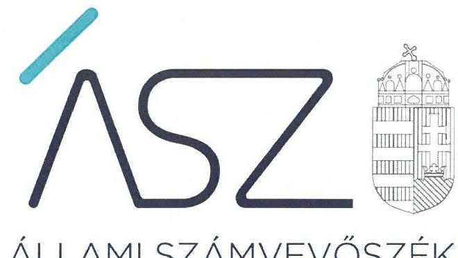
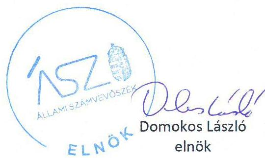
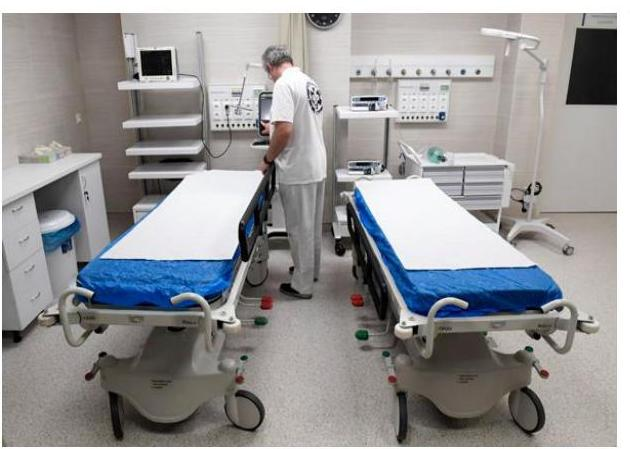
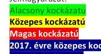

ÁLLAMI SZÁMVEVŐSZÉK

# JELENTÉS 

## Központi költségvetési szervek ellenőrzése

A központi költségvetési szervek (kórházak) kockázatértékelésen alapuló ellenőrzése
2020.

20195
www.asz.hu

---

ÁLLAMI SZÁMVEVŐSZÉK

# JELENTÉS

## Központi költségvetési szervek ellenőrzése

A központi költségvetési szervek (kórházak) kockázatértékelésen alapuló ellenőrzése

2020. 10. hó 15 nap

20195
www.asz.hu

---

# AZ ELLENŐRZÉST FELÜGYELTE: 

VARGA EDIT felügyeleti vezető
TÓTH MARIANNA felügyeleti vezető

AZ ELLENŐRZÉST VEZETTE ÉS A VÉGREHAJTÁSÁÉRT FELELŐS:
HOFMEISTER LÁSZLÓ ellenőrzésvezető

A PROGRAM ÖSSZEÁLLÍTÁSÁÉRT FELELŐS:
BERTALAN RUDOLF GYULA projektvezető

IKTATÓSZÁM: EL-2900-001/2020.
TÉMASZÁM: 2522
ELLENŐRZÉS-AZONOSÍTÓ SZÁM: V086602

---

# TARTALOMJEGYZÉK 

■ ÖSSZEGZÉS ..... 5
■ AZ ELLENŐRZÉS CÉLJA ..... 7
■ AZ ELLENŐRZÉS TERÜLETE ..... 8
■ AZ ELLENŐRZÉS HÁTTERE, INDOKOLTSÁGA ..... 9
■ A JELENTÉS LÉNYEGES KÉRDÉSKÖREI ..... 10
■ AZ ELLENŐRZÉS HATÓKÖRE ÉS MÓDSZEREI ..... 11
■ MEGÁLLAPÍTÁSOK ..... 13
■ JAVASLATOK ..... 16
■ MELLÉKLETEK ..... 21
I. sz. melléklet: Értelmező szótár ..... 21
II. sz. melléklet: Az ellenőrzött egészségügyi intézmények gazdálkodási területeinek kockázati értékelése a 2015-2017 években ..... 22
III. sz. melléklet: Az ellenőrzött egészségügyi intézmények gazdálkodási területeinek kockázati értékelése a 2017 évet követően ..... 24
IV. sz. melléklet: Az ellenőrzött egészségügyi intézményeknél tett ellenőrzési megállapítások ..... 26
■ FÜGGELÉK: ÉSZREVÉTELEK ..... 31
■ RÖVIDÍTÉSEK JEGYZÉKE ..... 37

---

.

---

# ÖSSZEGZÉS 

Az ellenőrzött 41 egészségügyi intézmény közül 29 intézmény vezetője gondoskodott a gazdálkodásban fennálló kockázatok kezeléséről a 2017. évet követően. Ezáltal igazolták a közpénzekkel való átlátható és elszámoltatható gazdálkodás feltételeinek kialakítását. 12 intézmény esetében intézkedések szükségesek a kockázatok mérséklése érdekében.

## Az ellenőrzés társadalmi indokoltsága

Az ellenőrzés hozzájárulhat az egészségügyi intézmények ellenőrzésének nagyobb lefedettségéhez, támogatja a közpénzek felhasználásának és a közvagyon használatának szabályszerűségét, célszerűségét.

A központi alrendszer részét képező egészségügyi intézmények alapvető közfeladatot látnak el és jelenős mértékű állami vagyont kezelnek. A központi költségvetésből az egyik legjelentősebb kiadást az egészségügyi ellátásokra fordított kiadások jelentik, amelyekből a kórházak kapják a legtöbb támogatást. A költségvetési szervként működő egészségügyi intézmények szabályszerű működése meghatározó jelentőségű a központi költségvetés egyensúlya és a nemzeti vagyon védelme szempontjából. Az egészségügyi ellátások költsége folyamatosan a társadalmi érdeklődés középpontjában áll.

A központi alrendszerhez tartozó egészségügyi feladatokat ellátó költségvetési szervek gazdálkodásának folyamatos figyelemmel kísérése által az Állami Számvevőszék betölti a legfőbb gazdasági ellenőrző szerv küldetését.

## Főbb megállapítások, következtetések, javaslatok

Az ellenőrzés a kiválasztott egészségügyi intézmények gazdálkodásának lényeges területeit értékelte, melynek kockázati értékelését a II. melléklet tartalmazza. Az ellenőrzött egészségügyi intézmények vezetői által jelzett intézkedések alapján 29 intézmény gazdálkodásának kockázatai csökkentek.

Valamennyi ellenőrzött egészségügyi intézménynél előforduló szabálytalanság volt, hogy nem biztosították a költségvetési előirányzatokkal való szabályszerű gazdálkodást, mert a kötelezettségvállalásokról szóló nyilvántartást nem a jogszabály által előírt tartalommal vezették, valamint két egészségügyi intézmény a rendelkezésre álló előirányzat mértékét meghaladóan vállalt kötelezettséget. Az előirányzatokkal való szabályszerű gazdálkodás érdekében 34 egészségügyi intézmény tett lépéseket a 2017. évet követően.

A második leggyakrabban előforduló szabálytalanságot az éves költségvetési beszámolót alátámasztó leltár hiánya jelentette. A 2017. évben 25 egészségügyi intézmény az éves költségvetési beszámolóban szereplő mérlegtételeket nem támasztotta alá leltárral, így ezen intézmények éves költségvetési beszámolója nem volt megalapozott, nem igazolt, hogy az intézmények éves beszámolójában szereplő tételek a valóságban is megtalálhatók voltak, ezáltal a vagyon védelme nem volt biztosított. A leltározással kapcsolatban feltárt kockázatokat 14 intézmény csökkentette a 2017. évet követően.

Az ellenőrzött intézmények közül 12 kapott közepes kockázatú minősítést. Ezen egészségügyi intézmények összeállították a vagyon elsődleges védelmét jelentő leltárral alátámasztott éves költségvetési beszámolójukat, ugyanakkor a gazdálkodás más lényeges területein kockázatokat hordozott gazdálkodásuk.

Az ellenőrzött időszak egy-egy évében négy intézmény beszámolási kötelezettségének teljesítése hordozott magas kockázatot, de a 2017. évben éves költségvetési beszámolójukat már szabályszerű leltárral támasztották alá.

A kontrollkörnyezet kialakítása a 2017. évben 28 egészségügyi intézménynél minősült magas kockázatúnak a gazdálkodásra vonatkozó szabályzók hiányosságai miatt, így nem biztosították a szabályszerű közpénzfelhasználás feltételeit ezen intézmények esetében. A kontrollkörnyezet szabályszerű kialakításáról a 2017. évet követően 25 intézmény gondoskodott.

---

Integrált kockázatkezelési rendszert 15 egészségügyi intézmény nem alakított ki, így ezen intézmények vezetői nem rendelkeztek információkkal a gazdálkodásban rejlő kockázatokról és ezek negatív hatásairól a szabályszerű gazdálkodás szempontjából. Mind a 15 egészségügyi intézmény a 2017. évet követően lépéseket tett az integrált kockázatkezelési rendszer kialakítása, ezáltal a gazdálkodási kockázatok feltárásának érdekében.

A 2017. évre kis mértékben javult az egészségügyi intézmények szabályozottsága, ugyanakkor a kockázatkezelési rendszer kialakítása, a beszámolási kötelezettség teljesítése, valamint az előirányzatokkal való gazdálkodás területén további intézkedések voltak szükségesek a szabályszerű működés eléréséhez.

Magas kockázatot hordoz továbbra is az Állami Szívkórház Balatonfüred, a Bonyhádi Kórház és Rendelőintézet, a Gróf Esterházy Kórház és Rendelőintézeti Szakrendelő, a Károlyi Sándor Kórház, a Magyar Honvédség Egészségügyi Központ, a Mátrai Gyógyintézet, a Nagykőrösi Rehabilitációs Szakkórház és Rendelőintézet, a Nyírő Gyula Országos Pszichiátriai és Addiktológiai Intézet, a Parádfürdői Állami Kórház, a Selye János Kórház valamint a Somogy Megyei Kaposi Mór Oktató Kórháza gazdálkodása.

Továbbra is közepes kockázati minősítésű a MÁV Kórház és Rendelőintézet, Szolnok gazdálkodása.

Az Állami Számvevőszék a jelentésben foglalt megállapítások alapján 12 intézmény vezetője részére fogalmazott meg javaslatot, amelyekre az érintetteknek 30 napon belül intézkedési tervet kell készíteniük.

---

# AZ ELLENŐRZÉS CÉLJA 

Az ellenőrzés célja annak megállapítása volt, hogy az egészségügyi intézmények igazgatói megteremtették-e a közpénzekkel, valamint az állami vagyonnal való átlátható, elszámoltatható, felelős és korrupciómentes gazdálkodás garanciáit.

---

# **AZ ELLENŐRZÉS TERÜLETE**

## **Egészségügyi intézmények**

Az ellenőrzés a központi költségvetési szervek körébe tartozó 41 egészségügyi intézményre terjedt ki. Az ellenőrzött szervezetek felett a 2015-2017. évek közötti időszakban az irányítószervi hatásköröket az Emberi Erőforrások Minisztériuma gyakorolta az emberi erőforrások minisztere útján.

Az ellenőrzött időszakon belül szervezeti átalakításra – a Békés Megyei Központi Kórház (amely 2016. április 1-jén jött létre a Gyulán működő Békés Megyei Pándy Kálmán Kórház és a békéscsabai Dr. Réthy Pál Kórház összevonásával) kivételével – nem került sor.

Az ellenőrzött szervezetek különböző típusú egészségügyi szolgáltatásokat – jellemzően fekvő- és járóbeteg diagnosztikus és terápiás szakorvosi ellátásokat – végeztek az ellátási területi kötelezettségük szerint.

A közfeladatok tekintetében az ellenőrzött szervezetek finanszírozási feladatait az Emberi Erőforrások Minisztériuma irányítása alá tartozó Országos Egészségbiztosítási Pénztár látta el 2016. december 31-ig. Ezt követően e feladatok ellátását a Nemzeti Egészségbiztosítási Alapkezelő végezte.

---

# AZ ELLENŐRZÉS HÁTTERE, INDOKOLTSÁGA 

Az államháztartás központi alrendszerébe tartozó egészségügyi intézmények vagyona a nemzeti vagyon része. Az Alaptörvény is rögzíti, hogy a vagyonnal való gazdálkodás célja a közérdek szolgálata, alapvető rendeltetése a közfeladatok ellátásának biztosítása. A közpénzek felhasználásában meghatározó, központi alrendszerbe tartozó, gyógyító és megelőző ellátást nyújtó intézmények pénzügyi és vagyongazdálkodási tevékenységük és feladatellátásuk súlya miatt jelentős hatást gyakorolnak a költségvetés egyensúlyának fenntartására. Hatással vannak továbbá a vagyonkezelésbe kapott állami vagyonnal való gazdálkodás minőségére.

---

# A JELENTÉS LÉNYEGES KÉRDÉSKÖREI 

1.- Az egészségügyi intézmények biztosították-e a gazdálkodás alapvető feltételeit?
2.- Az egészségügyi intézmények gazdálkodásuk során biztosítot-ták-e az átláthatóságot?
3.- Az egészségügyi intézmények előirányzatokkal való gazdálkodása szabályszerű volt-e?

---

# AZ ELLENŐRZÉS HATÓKÖRE ÉS MÓDSZEREI 

## Az ellenőrzés típusa

Megfelelőségi ellenőrzés.

## Az ellenőrzött időszak

A 2015-2017. évek, a költségvetési jelentés kötelező egyezőségeinek, valamint a maradvány-kimutatás ellenőrzése esetén a 2017. év.

## Az ellenőrzés tárgya

Az egészségügyi intézmények gazdálkodásának szabályozottsága, valamint a beszámoló készítés és a maradvány elszámolás szabályszerűségének ellenőrzése volt.

## Az ellenőrzött szervezetek

A II. mellékletben szereplő egészségügyi intézmények.

## Az ellenőrzés jogalapja

Az ÁSZ tv. ${ }^{1}$ 1. § (3) bekezdés, továbbá az 5. § (2)-(3) bekezdései és a (4) bekezdés a) pontja, valamint az Áht. ${ }^{2}$ 61. § (2) bekezdése.

## Az ellenőrzés módszerei

Jelen ellenőrzés 41 egészségügyi intézmény gazdálkodásának lényeges területeire terjedt ki. Az egészségügyi intézmények kockázatelemzés alapján kerültek kiválasztásra, nem reprezentálják a hazai egészségügyi intézményeket.

Az ellenőrzésre az ellenőrzött időszakban hatályos jogszabályok, az ellenőrzés szakmai szabályai, a jelen ellenőrzésre irányadó ÁSZ ${ }^{3}$ módszertanok, az ellenőrzési programban foglalt értékelési szempontok szerint került sor.

Az ellenőrzést az ÁSZ az ellenőrzési program kérdéseire adott válaszok kiértékelésével, valamint az ellenőrzési programban ismertetett ellenőrzési kérdések, kritériumok, adatforrások között megjelölt adatforrások, továbbá az adott időszakban hatályos jogszabályok figyelembevételével folytatta le.

---

Az ellenőrzés az egészségügyi intézmények gazdálkodásának lényeges területeire terjedt ki, amelyek a következők voltak:
$\longrightarrow$ a kontrollkörnyezet kialakítása,
$\longrightarrow$ kontrolltevékenységek kialakítása
$\longrightarrow$ a kockázatkezelési rendszer kialakítása,
$\longrightarrow$ a beszámolási kötelezettség teljesítése,
$\longrightarrow$ az előirányzatokkal való gazdálkodás.
Az ellenőrzött szervezetek kockázati besorolása alacsony, közepes, vagy magas kategóriába a lényeges területek értékelése alapján történt.

Az ellenőrzés ideje alatt az ÁSZ az ellenőrzött szervezetekkel történő kapcsolattartást az ÁSZ szervezeti és működési szabályzatának vonatkozó előírásai alapján biztosította. Az ellenőrzés kiterjedt minden olyan körülményre és adatra, amely az ÁSZ jogszabályban meghatározott feladatainak teljesítéséhez, valamint a program végrehajtása folyamán felmerült újabb összefüggések feltárásához szükséges.

Az ellenőrzött egészségügyi intézmények vezetői számára figyelemfelhívó levél került megküldésre a 2017. évre vonatkozó szabálytalanságokról, az ÁSZ tv. előírásával összhangban 15 nap állt rendelkezésükre az ebben foglaltak elbírálására, valamint a megfelelő intézkedés meghozatalára.

Az ellenőrzött egészségügyi intézmények vezetői által a figyelemfelhívó levélre adott válaszok alapján az ÁSZ értékelte a 2017. évre vonatkozóan feltárt kockázatok intézményi kezelését. Amennyiben az ellenőrzött egészségügyi intézmény vezetője 2018. január 1-jét követően már intézkedett, vagy az ellenőrzési megállapítások alapján intézkedéseket fogalmazott meg a szabálytalanság megszűntetése érdekében az ÁSZ a gazdálkodás adott lényeges területén korábban fennálló kockázatról megállapította, hogy azt mérsékelték. A 2018. január 1-jét követő intézkedések hatására bekövetkezett változásokra, vagy az intézkedések elmaradására vonatkozó megállapítások a jelentéstervezetben nagyobb betűtípussal jelöltek.

Egyéb esetben az ellenőrzött egészségügyi intézmények összesített kockázati értékelésének meghatározása az ellenőrzött időszakra vonatkozóan alkalmazott módszertan szerint történt.

---

# 1. Az egészségügyi intézmények biztosították-e a gazdálkodás alapvető feltételeit? 

Összegző megállapítás

Az ellenőrzött egészségügyi intézmények nem biztosították a szabályszerű gazdálkodás alapvető feltételeit az ellenőrzött időszakban. A 2017. évet követően négy intézménynél maradtak fenn kockázatok a belső kontrollrendszer egyes elemei vonatkozásában.

SZERVEZETI ÉS MŰKÖDÉSI SZABÁLYZATTAL az egészségügyi intézmények rendelkeztek, ugyanakkor 14 intézmény nem szerepeltette a szabályzatában a Vnytv. ${ }^{4} 4 . \S$ a) pontja ellenére a vagyon-nyilatkozat-tételi kötelezettséggel járó munkaköröket. A 2017. évet követően az egészségügyi intézmények gondoskodtak a vagyon-nyilatkozat-tételi kötelezettséggel járó munkakörök szervezeti és múködési szabályzatban való szerepeltetéséről.

A SZÁMVITELI POLTIKÁT az Áhsz. ${ }^{5}$ 50. § (1) bekezdésben és a Számv. tv. ${ }^{6} 14 . \S$ (3) bekezdésében előírtak ellenére nem alakította ki a 2015-2016. években négy, a 2017. évben egy egészségügyi intézmény. Ezen intézmény a 2017. évet követően sem intézkedett a szabálytalanság megszűntetéséről. A számviteli politika keretében az eszközök és források leltárkészítési és leltározási szabályzatát, valamint az eszközök és források értékelési szabályzatát a Számv. tv. 14. § (5) bekezdés a) és b) pontja rendelkezésének ellenére két egészségügyi intézmény az ellenőrzött időszak egyik évében sem készítette el. Az eszközök és források leltárkészítési és leltározási szabályzatának hiánya mindkét intézménynél a 2017. évet követően is fennállt. Az eszközök és források értékelési szabályzatának elkészítéséről a 2017. évet követően egy egészségügyi intézmény intézkedett, ugyanakkor egy intézmény nem gondoskodott az előírások szerinti szabályozás kialakításáról.

A GAZDÁLKODÁS RÉSZLETES RENDJÉNEK SZABÁLYOZÁSÁRÓL két egészségügyi intézmény vezetője nem intézkedett az Áht. 10. § (5) bekezdésében foglaltak ellenére az ellenőrzött időszakban. Közülük egy intézmény gondoskodott a 2017. évet követően a gazdálkodás részletes rendjének kialakításáról.

A KONTROLLTEVÉKENYSÉGEK FELTÉTELEINEK KIALAKÍTÁSA öt ellenőrzött egészségügyi intézménynél nem volt

---

szabályszerű. Az Ávr. ${ }^{7}$ 60. § (3) bekezdésében foglalt rendelkezések ellenére a gazdálkodási jogkörök gyakorlására jogosult személyekről és aláírásmintájukról szóló nyilvántartás naprakész vezetéséről a 2015-2016. években öt, a 2017. évben két egészségügyi intézmény vezetője nem gondoskodott. A 2017. évet követően egy intézmény intézkedett kontrolltevékenységek feltételeinek kialakításáról.

INTEGRÁLT KOCKÁZATKEZELÉSI RENDSZERT a Bkr. ${ }^{8}$ 3. § b) pontja előírásának ellenére 15 ellenőrzött egészségügyi intézmény nem alakított ki az ellenőrzött időszakban, 12 egészségügyi intézmény pedig határidőn túl alakította azt ki. A 2017. évet követően mind a 15 intézmény gondoskodott az integrált kockázatkezelési rendszer kialakításáról.

# 2. Az egészségügyi intézmények gazdálkodásuk során biztosítot-ták-e az átláthatóságot? 

Összegző megállapítás

Az ellenőrzött egészségügyi intézmények nem biztosították a gazdálkodás átláthatóságát az éves költségvetési beszámoló leltárral való alátámasztásának hiányában. A 2017. évet követően 11 intézménynél maradtak fenn kockázatok a beszámolási kötelezettség teljesítése terén.

LELTÁRRAL NEM TÁMASZTOTTA ALÁ éves költségvetési beszámolója mérlegtételeit az Áhsz. 5. § (1) bekezdés, az Áhsz. 22. § (1)-(2) bekezdései, valamint a Számv. tv. 69. § (1) bekezdés előírásai ellenére 26 egészségügyi intézmény a 2015. évben, 27 intézmény a 2016. évben és 25 intézmény a 2017. évben. Ezáltal az intézmények éves költségvetési beszámolója nem volt megalapozott. A 2017. évet követően a 25 intézményből 14 tett lépéseket a szabályszerű leltár elkészítése érdekében.

ÉVES KÖLTSÉGVETÉSI BESZÁMOLÓT az Áhsz. 5. § (1) bekezdésében foglaltak ellenére nem készített egy egészségügyi intézmény a 2015-2016. évekre, két intézmény pedig a 2017. évre vonatkozóan. Közülük az egyik intézmény a 2017. évet követően gondoskodott a jogszabály szerinti éves költségvetési beszámoló elkészítéséről.

---

# 3. Az egészségügyi intézmények előirányzatokkal való gazdálkodása szabályszerű volt-e? 

Összegző megállapítás Az ellenőrzött egészségügyi intézmények nem gazdálkodtak szabályszerűen az előirányzatokkal. A 2017. évet követően hét intézmény esetében maradtak fenn kockázatok az előirányzatokkal való gazdálkodás vonatkozásában.

A KÖTELEZETTSÉGVÁLLALÁSOK NYILVÁNTARTÁSA az Áhsz. 39. § (3) bekezdésben foglaltak ellenére nem felelt meg az Áhsz. 14. melléklet II. 4. e-h) pontokban meghatározott előírásoknak az ellenőrzött egészségügyi intézményeknél.

Két egészségügyi intézmény 2017. évi módosított előirányzatának értéke a költségvetési jelentésben kisebb értékű volt, mint a költségvetési évben esedékes érték, valamint a végleges kötelezettségvállalások értéke, ezáltal megsértette az Áhsz. 17. melléklet 1. a) pontjában szereplő rendelkezést. Ezen két intézmény a szabad előirányzat mértékét meghaladóan vállalt kötelezettséget a 2017. évben az Áht. 36. § (1) bekezdés előírásával szemben.

A 41 ellenőrzött intézmény közül 34 tett lépéseket az előirányzatokkal való szabályszerű gazdálkodás érdekében.

---

# JAVASLATOK 

Az ÁSZ tv. 33. § (1) bekezdésében foglaltak értelmében az ellenőrzött szervezet vezetője köteles a jelentésben foglalt megállapításokhoz kapcsolódó intézkedési tervet összeállítani és azt a jelentés kézhezvételétől számított 30 napon belül az ÁSZ részére megküldeni. Amennyiben az ellenőrzött szervezet vezetője nem küldi meg határidőben az intézkedési tervet, vagy továbbra sem elfogadható intézkedési tervet küld, az Állami Számvevőszék elnöke az ÁSZ tv. 33. § (3) bekezdése a) és b) pontjaiban foglaltakat érvényesítheti.

## Állami Szívkórház Balatonfüred föigazgatójának

1. Intézkedjen az éves költségvetési beszámoló mérlegtételei értékének alátámasztásához a jogszabályi előirásnak megfelelő leltár összeállításáról.
(IV. számú melléklet érintett ellenőrzöttre vonatkozó megállapítás 1. bekezdése alapján)

## Bonyhádi Kórház és Rendelőintézet föigazgatójának

1. Intézkedjen a gazdálkodás részletes rendjének jogszabályi előirásnak megfelelő szabályozásáról.
(IV. számú melléklet érintett ellenőrzöttre vonatkozó megállapítás 2. bekezdése alapján)
2. Intézkedjen az éves költségvetési beszámoló mérlegtételei értékének alátámasztásához a jogszabályi előirásnak megfelelő leltár összeállításáról.
(IV. számú melléklet ellenőrzöttre vonatkozó megállapítás 5. bekezdése alapján)
3. Intézkedjen a kötelezettségvállalások Áhsz. előirásainak megfelelő tartalmú részletező nyilvántartásának vezetéséről.
(IV. számú melléklet érintett ellenőrzöttre vonatkozó megállapítás 6. bekezdése alapján

## Gróf Esterházy Kórház és Rendelőintézeti Szakrendelő föigazgatójának

1. Intézkedjen az éves költségvetési beszámoló mérlegtételei értékének alátámasztásához a jogszabályi előirásnak megfelelő leltár összeállításáról.
(IV. számú melléklet érintett ellenőrzöttre vonatkozó megállapítás 1. bekezdése alapján)

---

2. Intézkedjen a kötelezettségvállalások Áhsz. előírásainak megfelelő tartalmú részletező nyilvántartásának vezetéséről.
(IV. számú melléklet érintett ellenőrzöttre vonatkozó megállapítás 2. bekezdése alapján)

# Károlyi Sándor Kórház föigazgatójának 

1. Intézkedjen az éves költségvetési beszámoló mérlegtételei értékének alátámasztásához a jogszabályi előírásnak megfelelő leltár összeállításáról.
(IV. számú melléklet érintett ellenőrzöttre vonatkozó megállapítás 1. bekezdése alapján)
2. Intézkedjen a kötelezettségvállalások Áhsz. előírásainak megfelelő tartalmú részletező nyilvántartásának vezetéséről.
(IV. számú melléklet érintett ellenőrzöttre vonatkozó megállapítás 2. bekezdése alapján)

## Magyar Honvédség Egészségügyi Központ föigazgatójának

1. Intézkedjen a jogszabályi előírásoknak megfelelő számviteli politika elkészítéséről.
(IV. számú melléklet érintett ellenőrzöttre vonatkozó megállapítás 1. bekezdés 1. mondata alapján)
2. Intézkedjen a jogszabályi előírásoknak megfelelő eszközök és források leltárkészítési és leltározási szabályzatának elkészítéséről.
(IV. számú melléklet érintett ellenőrzöttre vonatkozó megállapítás 1. bekezdés 2. mondata alapján)
3. Intézkedjen a jogszabályi előírásoknak megfelelő eszközök és források értékelési szabályzatának elkészítéséről.
(IV. számú melléklet érintett ellenőrzöttre vonatkozó megállapítás 1. bekezdés 2. mondata alapján
4. Intézkedjen a jogszabályi előírásoknak megfelelő költségvetési beszámoló elkészítéséről.
(IV. számú melléklet érintett ellenőrzöttre vonatkozó megállapítás 2. bekezdése alapján)
5. Intézkedjen az éves költségvetési beszámoló mérlegtételei értékének alátámasztásához a jogszabályi előírásnak megfelelő leltár összeállításáról.
(IV. számú melléklet érintett ellenőrzöttre vonatkozó megállapítás 3. bekezdése alapján)

## Mátrai Gyógyintézet föigazgatójának

1. Intézkedjen az éves költségvetési beszámoló mérlegtételei értékének alátámasztásához a jogszabályi előírásnak megfelelő leltár összeállításáról.
(IV. számú melléklet érintett ellenőrzöttre vonatkozó megállapítás 1. bekezdése alapján)

---

2. Intézkedjen a kötelezettségvállalások Áhsz. előirásainak megfelelő tartalmú részletező nyilvántartásának vezetéséről.
(IV. számú melléklet érintett ellenőrzöttre vonatkozó megállapítás 2. bekezdése alapján)

# Nagykörösi Rehabilitációs Szakkórház és Rendelőintézet föigazgatójának 

1. Intézkedjen az éves költségvetési beszámoló mérlegtételei értékének alátámasztásához a jogszabályi előirásnak megfelelő leltár összeállításáról.
(IV. számú melléklet érintett ellenőrzöttre vonatkozó megállapítás 1. bekezdése alapján)

## Nyírő Gyula Országos Pszichiátriai és Addiktológiai Intézet föigazgatójának

1. Intézkedjen az éves költségvetési beszámoló mérlegtételei értékének alátámasztásához a jogszabályi előirásnak megfelelő leltár összeállításáról.
(IV. számú melléklet érintett ellenőrzöttre vonatkozó megállapítás 1. bekezdése alapján)

## Parádfürdői Állami Kórház föigazgatójának

1. Intézkedjen az éves költségvetési beszámoló mérlegtételei értékének alátámasztásához a jogszabályi előirásnak megfelelő leltár összeállításáról.
(IV. számú melléklet érintett ellenőrzöttre vonatkozó megállapítás 1. bekezdése alapján)
2. Intézkedjen a kötelezettségvállalások Áhsz. előirásainak megfelelő tartalmú részletező nyilvántartásának vezetéséről.
(IV. számú melléklet érintett ellenőrzöttre vonatkozó megállapítás 2. bekezdése alapján)

## Selye János Kórház föigazgatójának

1. Intézkedjen naprakész nyilvántartás vezetéséről a teljesítésigazolásra jogosult személyekről és aláírás-mintájukról.
(IV. számú melléklet érintett ellenőrzöttre vonatkozó megállapítás 1. bekezdése alapján)
2. Intézkedjen az éves költségvetési beszámoló mérlegtételei értékének alátámasztásához a jogszabályi előirásnak megfelelő leltár összeállításáról.
IV. számú melléklet érintett ellenőrzöttre vonatkozó megállapítás 2. bekezdése alapján)

---

# Somogy Megyei Kaposi Mór Oktató Kórház föigazgatójának 

1. Intézkedjen az éves költségvetési beszámoló mérlegtételei értékének alátámasztásához a jogszabályi előírásnak megfelelő leltár összeállításáról.
(IV. számú melléklet érintett ellenőrzöttre vonatkozó megállapítás 1. bekezdése alapján)
2. Intézkedjen a kötelezettségvállalások Áhsz. előírásainak megfelelő tartalmú részletező nyilvántartásának vezetéséről.
(IV. számú melléklet érintett ellenőrzöttre vonatkozó megállapítás 2. bekezdése alapján)

## MÁV Kórház és Rendelőintézet, Szolnok föigazgatójának

1. Intézkedjen a jogszabályi előírásoknak megfelelő eszközök és források leltárkészítési és leltározási szabályzatának elkészítéséről.
(IV. számú melléklet érintett ellenőrzöttre vonatkozó megállapítás 1. bekezdése alapján)
2. Intézkedjen az Áht. előírásának betartására, hogy kötelezettségvállalásra csak a szabad előirányzat mértékéig kerüljön sor.
(IV. számú melléklet érintett ellenőrzöttre vonatkozó megállapítás 2. bekezdése alapján)

---

.

---

# MELLÉKLETEK 

- I. SZ. MELLÉKLET: ÉRTELMEZŐ SZÓTÁR
átláthatóság
belső kontrollrendszer
egészségügyi intézmények
elszámoltathatóság
integrált kockázatkezelési rendszer
integritás
kockázat
kockázatelemzés
kockázatkezelési rendszer

Előfeltétele az elszámoltathatóságnak, a célok elérése érdekében folytatott tevékenységekről, folyamatokról a fontos információk közzé- vagy hozzáférhetővé legyenek téve (Forrás: NGM, 2017)
A belső kontrollrendszer a kockázatok kezelése és tárgyilagos bizonyosság megszerzése érdekében kialakított folyamatrendszer, amely azt a célt szolgálja, hogy a működés és gazdálkodás során a tevékenységeket szabályszerűen, gazdaságosan, hatékonyan, eredményesen hajtsák végre, az elszámolási kötelezettségeket teljesítsék, megvédjék az erőforrásokat a veszteségektől, károktól és nem rendeltetésszerű használattól. (Forrás: Áht. 69. § (1) bekezdése)
A különböző egészségügyi feladatokat ellátó szervezetek, amelyek közé tartoznak a kórházak, a rendelőintézetek, az intézetek, valamint az Országos Közegészségügyi Központ (jogelődje az Országos Közegészségügyi Intézet)
A vezető vagy a munkatárs felelős a tevékenységéért, az érintettek pedig jogosultak számon kérni azt, hogy a tevékenység valóban az ő érdekükben, és az elvártnak megfelelően történt (Forrás: NGM, 2017)
Olyan folyamatalapú kockázatkezelési rendszer, amely a szervezet minden tevékenységére kiterjed, egységes módszertan és eljárások alkalmazásával, a szervezet célkitűzéseinek és értékeinek figyelembevételével biztosítja a szervezet kockázatainak teljes körű azonosítását, azok meghatározott kritériumok szerinti értékelését, valamint a kockázatok kezelésére vonatkozó intézkedési terv elkészítését és az abban foglaltak nyomon követését. (Forrás: Bkr. 2. § m) pontja, 2016. október 1-jétől)
Az integritás az elvek, értékek, cselekvések, módszerek, intézkedések konzisztenciáját jelenti, vagyis olyan magatartásmódot, amely meghatározott értékeknek megfelel. (Forrás: Nemzetgazdasági Minisztérium: Magyarországi államháztartási belső kontroll standardok Útmutató 1.6.1. pontja, 2012. december)
A kockázat annak a valószínűségét jelenti, hogy egy vagy több esemény vagy intézkedés nem kívánt módon befolyásolja a rendszer működését, céljainak megvalósulását. (Forrás: Javaslatok a korrupciós kockázatok kezelésére - Kockázatkezelési és ellenőrzési módszertan 35. oldal, ÁSZ)
Objektív módszer az ellenőrizendő területek kiválasztására, mely meghatározza a költségvetési szerv tevékenységében és belső kontrollrendszerében rejlő kockázatokat. (Forrás: Bkr. 2. § I) pont)
Olyan irányítási eszközök és módszerek összessége, melynek elemei a szervezeti célok elérését veszélyeztető tényezők (kockázatok) azonosítása, elemzése, csoportosítása, nyomon követése, valamint szükség esetén a kockázati kitettség mérséklése. (Forrás: Bkr. 2. § m) pontja, 2016. szeptember 30-ig)

---

### *Mellékletek*

### **II. SZ. MELLÉKLET: AZ ELLENŐRZÖTT EGÉSZSÉGÜGYI INTÉZMÉNYEK GAZDÁLKODÁSI TERÜLETEINEK KOCKÁZATI ÉRTÉKELÉSE A 2015-2017 ÉVEKBEN**

|  Sorszám | Kórház megnevezése | Kontrollkörnyezet kialakítása | Kontrolltevékenységek kialakítása | Kockázatkezelési rendszer kialakítása | Beszámolási kötelezettség teljesítése | Előirányzatokkal való gazdálkodás | Összesített kockázati értékelés  |
| --- | --- | --- | --- | --- | --- | --- | --- |
|   |  | 2015. | 2016. | 2017. | 2015. | 2016. | 2017.  |
|  1. | Állami Szívkórház Balatonfüred |  |  |  |  |  |   |
|  2. | Almási Balogh Pál Kórház (Özd) |  |  |  |  |  |   |
|  3. | Batthyány Kázmér Szakkórház (Kisbér) |  |  |  |  |  |   |
|  4. | Békés Megyei Központi Kórház* |  |  |  |  |  |   |
|  5. | Bonyhádi Kórház és Rendelőintézet |  |  |  |  |  |   |
|  6. | Csolnoky Ferenc Kórház (Veszprém) |  |  |  |  |  |   |
|  7. | Csongrád Megyei Mellkási Betegségek Szakkórháza |  |  |  |  |  |   |
|  8. | Csornai Margit Kórház |  |  |  |  |  |   |
|  9. | Deák Jenő Kórház (Tapolca) |  |  |  |  |  |   |
|  10. | Dombóvári Szent Lukács Kórház |  |  |  |  |  |   |
|  11. | Dr. Kenessey Albert Kórház- Rendelőintézet (Balassagyarmat) |  |  |  |  |  |   |
|  12. | Fejér Megyei Szent György Egyetemi Oktató Kórház |  |  |  |  |  |   |
|  13. | Gróf Esterházy Kórház és Rendelőintézeti Szakrendelő (Pápa) |  |  |  |  |  |   |
|  14. | Hévízgyógyfürdő és Szent András Reumakórház |  |  |  |  |  |   |
|  15. | Jászberényi Szent Erzsébet Kórház |  |  |  |  |  |   |
|  16. | Kanizsai Dorottya Kórház |  |  |  |  |  |   |
|  17. | Károlyi Sándor Kórház (Budapest) |  |  |  |  |  |   |
|  18. | Koch Róbert Kórház és Rendelőintézet (Edelény) |  |  |  |  |  |   |
|  19. | Lumniczer Sándor Kórház-Rendelőintézet (Kapuvár) |  |  |  |  |  |   |
|  20. | Magyar Honvédség Egészségügyi Központ (Budapest) |  |  |  |  |  |   |

**Mellékletek**

**2016. március 31-ig Megyei Pándy Kálmán Kórház és Dr. Réthy Pál Kórház**

**Jelmegyezést**

**Közepes kockázati**

**Megyei kockázati**

**2015. kockázat**

**2016. kockázat**

**2017. kockázat**

**2018. kockázat**

**2019. kockázat**

**2020. kockázat**

**2021. kockázat**

**2022. kockázat**

**2023. kockázat**

**2024. kockázat**

**2025. kockázat**

**2026. márius 31-ig Megyei Pándy Kálmán Kórház és Dr. Réthy Pál Kórház**

---

|  Sorszám | Kórház megnevezése | Kontrollkörnyezet kialakítása | Kontrolltevékenységek kialakítása | Kockázatkezelési rendszer kialakítása | Beszámolási kötelezettség teljesítése | Előirányzatokkal való gazdálkodás | Összesített kockázati értékelés  |
| --- | --- | --- | --- | --- | --- | --- | --- |
|   |  | 2015. | 2016. | 2017. | 2017. | 2016. | 2017.  |
|  21. | Magyar Imre Kórház (Ajka) |  |  |  |  |  |   |
|  22. | Margit Kórház Pásztó |  |  |  |  |  |   |
|  23. | Markusovszky Egyetemi Oktatókórház (Szombathely) |  |  |  |  |  |   |
|  24. | Mátrai Gyógyintézet (Gyöngyös) |  |  |  |  |  |   |
|  25. | MÁV Kórház és Rendelőintézet, Szolnok |  |  |  |  |  |   |
|  26. | Mohácsi Kórház |  |  |  |  |  |   |
|  27. | Nagyatádi Kórház |  |  |  |  |  |   |
|  28. | Nagykőrösi Rehabilitációs Szakkórház és Rendelőintézet |  |  |  |  |  |   |
|  29. | Nyírő Gyula Országos Pszichiátriai és Addiktológiai Intézet (Budapest) |  |  |  |  |  |   |
|  30. | Országos Reumatológiai és Fizioterápiás Intézet (Budapest) |  |  |  |  |  |   |
|  31. | Országos Vérellátó Szolgálat (Budapest) |  |  |  |  |  |   |
|  32. | Paratifúrdői Állami Kórház |  |  |  |  |  |   |
|  33. | Petz Aladár Megyei Oktató Kórház, Győr |  |  |  |  |  |   |
|  34. | Selye János Kórház (Komárom) |  |  |  |  |  |   |
|  35. | Siófoki Kórház- Rendelőintézet |  |  |  |  |  |   |
|  36. | Somogy Megyei Kaposi Mór Oktató Kórház |  |  |  |  |  |   |
|  37. | Szent Imre Kórház (Budapest) |  |  |  |  |  |   |
|  38. | Szent László Kórház (Budapest) |  |  |  |  |  |   |
|  39. | Szent Margit Kórház (Budapest) |  |  |  |  |  |   |
|  40. | Toldy Ferenc Kórház és Rendelőintézet (Cegléd) |  |  |  |  |  |   |
|  41. | Zirci Erzsébet Kórház- Rendelőintézet |  |  |  |  |  |   |

---

|  Sorszám | Kórház megnevezése | Kontrollkörnyezet
kialakítása | Kontrolltevékeny
ségek kialakítása | Kockázatkezelési
rendszer kialakí
tása | Beszámolási köte
lezettség teljesí
tése | Előirányzatokkal
való gazdálkodás | Összesített
kockázati
értékelés | Változás a 2017. évi kockázati
értékeléshez képest  |
| --- | --- | --- | --- | --- | --- | --- | --- | --- |
|  1. | Állami Szívkórház Balatonfüred |  |  |  |  |  |  |   |
|  2. | Almási Balogh Pál Kórház (Özd) |  |  |  |  |  |  |   |
|  3. | Batthyány Kázmér Szakkörház (Kisbér) |  |  |  |  |  |  |   |
|  4. | Békés Megyei Központi Kórház* |  |  |  |  |  |  |   |
|  5. | Bonyhádi Kórház és Rendelőintézet |  |  |  |  |  |  |   |
|  6. | Csolnoky Ferenc Kórház (Veszprém) |  |  |  |  |  |  |   |
|  7. | Csongrád Megyei Mellkasi Betegségek
Szakkórháza |  |  |  |  |  |  |   |
|  8. | Csornai Margit Kórház |  |  |  |  |  |  |   |
|  9. | Deák Jenő Kórház (Tapolca) |  |  |  |  |  |  |   |
|  10. | Dombóvári Szent Lukács Kórház |  |  |  |  |  |  |   |
|  11. | Dr. Kenessey Albert Kórház- Rendelőinté
zet (Balassagyarmat) |  |  |  |  |  |  |   |
|  12. | Fejér Megyei Szent György Egyetemi Ok
tató Kórház |  |  |  |  |  |  |   |
|  13. | Gróf Esterházy Kórház és Rendelőintézeti
Szakrendelő (Pápa) |  |  |  |  |  |  |   |
|  14. | Hévizgyógyfürdő és Szent András Reuma- |  |  |  |  |  |  |   |
|  15. | Jászberényi Szent Erzsébet Kórház |  |  |  |  |  |  |   |
|  16. | Kanizsai Dorottya Kórház |  |  |  |  |  |  |   |
|  17. | Károlyi Sándor Kórház (Budapest) |  |  |  |  |  |  |   |
|  18. | Koch Róbert Kórház és Rendelőintézet
(Edelény) |  |  |  |  |  |  |   |
|  19. | Lumniczer Sándor Kórház-Rendelőintézet
(Kapuvár) |  |  |  |  |  |  |   |
|  20. | Magyar Honvédség Egészségügyi Központ
(Budapest) |  |  |  |  |  |  |   |

- 2016. március 31-ig Megyei Pándy Kálmán Kórház és Dr. Réthy Pál Kórház

---

|  Sorszám | Kórház megnevezése | Kontrollkömyezet kialakítása | Kontrolltevékenységek kialakítása | Kockázatkezelési rendszer kialakítása | Beszámolási kötelezettség teljesítése | Előirányzatokkal való gazdálkodás | Összesített kockázati értékelés | Változás a 2017. évi kockázati értékeléshez képest  |
| --- | --- | --- | --- | --- | --- | --- | --- | --- |
|  21. | Magyar Imre Kórház (Ajka) | Javoli | Nincs változás | Javoli | Javoli | Alacsony | Javoli |   |
|  22. | Margit Kórház Pásztó | Nincs változás | Nincs változás | Nincs változás | Javoli | Javoli | Alacsony | Javoli  |
|  23. | Markusovszky Egyetemi Oktatókórház (Szombathely) | Javoli | Nincs változás | Nincs változás | Javoli | Javoli | Alacsony | Javoli  |
|  24. | Mátrai Gyógyintézet (Gyöngyös) | Nincs változás | Nincs változás | Javoli | Nincs változás | Nincs változás | Magas | Nincs változás  |
|  25. | MÁV Kórház és Rendelőintézet, Szolnok | Nincs változás | Nincs változás | Nincs változás | Nincs változás | Nincs változás | Közepes | Nincs változás  |
|  26. | Mohácsi Kórház | Javoli | Javoli | Nincs változás | Javoli | Javoli | Alacsony | Javoli  |
|  27. | Nagyatádi Kórház | Javoli | Nincs változás | Javoli | Javoli | Javoli | Alacsony | Javoli  |
|  28. | Nagykőrösi Rehabilitációs Szakkórház és Rendelőintézet | Javoli | Nincs változás | Javoli | Nincs változás | Javoli | Magas | Nincs változás  |
|  29. | Nyírő Gyula Országos Pszichiátriai és Addiktológiai Intézet (Budapest) | Nincs változás | Nincs változás | Nincs változás | Nincs változás | Javoli | Magas | Nincs változás  |
|  30. | Országos Reumatológiai és Fizioterápiás Intézet (Budapest) | Javoli | Nincs változás | Nincs változás | Nincs változás | Javoli | Alacsony | Javoli  |
|  31. | Országos Vérellátó Szolgálat (Budapest) | Nincs változás | Nincs változás | Nincs változás | Nincs változás | Javoli | Alacsony | Javoli  |
|  32. | Parádfürdői Állami Kórház | Javoli | Nincs változás | Javoli | Nincs változás | Nincs változás | Magas | Nincs változás  |
|  33. | Petz Aladár Megyei Oktató Kórház, Győr | Nincs változás | Nincs változás | Nincs változás | Javoli | Javoli | Alacsony | Javoli  |
|  34. | Selye János Kórház (Komárom) | Javoli | Nincs változás | Javoli | Nincs változás | Javoli | Magas | Nincs változás  |
|  35. | Siófoki Kórház- Rendelőintézet | Javoli | Nincs változás | Nincs változás | Nincs változás | Javoli | Alacsony | Javoli  |
|  36. | Somogy Megyei Kaposi Mór Oktató Kórház | Javoli | Nincs változás | Nincs változás | Nincs változás | Nincs változás | Magas | Nincs változás  |
|  37. | Szent Imre Kórház (Budapest) | Javoli | Nincs változás | Javoli | Nincs változás | Javoli | Alacsony | Javoli  |
|  38. | Szent László Kórház (Budapest) | Javoli | Nincs változás | Nincs változás | Nincs változás | Javoli | Alacsony | Javoli  |
|  39. | Szent Margit Kórház (Budapest) | Javoli | Nincs változás | Nincs változás | Javoli | Javoli | Alacsony | Javoli  |
|  40. | Toldy Ferenc Kórház és Rendelőintézet (Cegléd) | Nincs változás | Nincs változás | Javoli | Nincs változás | Javoli | Alacsony | Javoli  |
|  41. | Zirci Erzsébet Kórház- Rendelőintézet | Javoli | Nincs változás | Nincs változás | Nincs változás | Javoli | Alacsony | Javoli  |

---

# Mérsékelték a kockázatot az ellenőrzött időszakot követően az alábbi egészségügyi intézmények 

- Almási Balogh Pál Kórház
- Batthyány Kázmér Szakkórház
- Békés Megyei Központi Kórház
- Csolnoky Ferenc Kórház
- Csongrád Megyei Mellkasi Betegségek Szakkórháza
- Csornai Margit Kórház
- Deák Jenő Kórház
- Dombóvári Szent Lukács Kórház
- Dr. Kenessey Albert Kórház- Rendelőintézet
- Fejér Megyei Szent György Egyetemi Oktató Kórház
- Hévígyógyfürdő és Szent András Reumakórház
- Jászberényi Szent Erzsébet Kórház
- Kanizsai Dorottya Kórház
- Koch Róbert Kórház és Rendelőintézet
- Lumniczer Sándor Kórház-Rendelőintézet
- Magyar Imre Kórház
- Margit Kórház Pásztó
- Markusovszky Egyetemi Oktatókórház
- Mohácsi Kórház
- Nagyatádi Kórház
- Országos Reumatológiai és Fizioterápiás Intézet
- Országos Vérellátó Szolgálat
- Petz Aladár Megyei Oktató Kórház, Győr
- Siófoki Kórház- Rendelőintézet
- Szent Imre Kórház
- Szent László Kórház
- Szent Margit Kórház
- Toldy Ferenc Kórház és Rendelőintézet
- Zirci Erzsébet Kórház- Rendelőintézet

## Magas kockázatú egészségügyi intézmények

## Állami Szívkórház Balatonfüred

Leltárral az ellenőrzött időszakban az egészségügyi intézmény a mérlegtételek értékét nem támasztotta alá az Áhsz. 5. § (1) bekezdésében, a

---

22. § (1)-(2) bekezdéseiben, valamint a Számv. tv. 69. § (1) bekezdésében előírtak ellenére.

# Bonyhádi Kórház és Rendelőintézet 

Az egészségügyi intézmény az Áhsz. 50. § (1) bekezdésben és a Számv. tv. 14. § (3) bekezdésben előírt számviteli politikát nem készítette el a 20152016. években. Az eszközök és források leltárkészítési és leltározási szabályzatával, az eszközök és források értékelési szabályzatával, pénzkezelési szabályzattal, önköltségszámítás rendjére vonatkozó szabályzattal a Számv. tv. 14. § (5) bekezdés rendelkezése ellenére a 2015-2016. években nem rendelkezett.

Az egészségügyi intézmény vezetője az Áht. 10. § (5) bekezdésében foglaltak ellenére nem intézkedett a gazdálkodás részletes rendje szabályozásáról.

Az egészségügyi intézmény az Ávr. 60. § (3) bekezdésében szereplő rendelkezés ellenére nem rendelkezett a kötelezettségvállalásra, pénzügyi ellenjegyzésre, teljesítésigazolásra, érvényesítésre, utalványozásra jogosult személyekről és aláírás-mintájukról vezetett naprakész nyilvántartással a 2015-2016. években.

Integrált kockázatkezelési rendszert a Bkr. 3. § b) pontjában szereplő rendelkezés ellenére 2017. október 31-ig nem alakított ki az egészségügyi intézmény.

Leltárral az ellenőrzött időszakban az egészségügyi intézmény a mérlegtételek értékét nem támasztotta alá az Áhsz. 5. § (1) bekezdésében, a 22. § (1)-(2) bekezdéseiben, valamint a Számv. tv. 69. § (1) bekezdésében előírtak ellenére.

Az egészségügyi intézmény nem gondoskodott az ellenőrzött időszakban az Áhsz. 39. § (3) bekezdésben foglaltak ellenére a kötelezettségvállalások részletező nyilvántartásának az Áhsz. 14. melléklet II. 4. e-h) pontokban meghatározott tartalommal történő vezetéséről.

## Gróf Esterházy Kórház és Rendelőintézeti Szakrendelő

Leltárral az ellenőrzött időszakban az egészségügyi intézmény a mérlegtételek értékét nem támasztotta alá az Áhsz. 5. § (1) bekezdésében, a 22. § (1)-(2) bekezdéseiben, valamint a Számv. tv. 69. § (1) bekezdésében előírtak ellenére.

Az egészségügyi intézmény nem gondoskodott az ellenőrzött időszakban az Áhsz. 39. § (3) bekezdésben foglaltak ellenére a kötelezettségvállalások részletező nyilvántartásának az Áhsz. 14. melléklet II. 4. e) és h) pontokban meghatározott tartalommal történő vezetéséről.

## Károlyi Sándor Kórház

Leltárral az ellenőrzött időszakban az egészségügyi intézmény a mérlegtételek értékét nem támasztotta alá az Áhsz. 5. § (1) bekezdésében, a 22. § (1)-(2) bekezdéseiben, valamint a Számv. tv. 69. § (1) bekezdésében előírtak ellenére.

---

Az egészségügyi intézmény nem gondoskodott az ellenőrzött időszakban az Áhsz. 39. § (3) bekezdésben foglaltak ellenére a kötelezettségvállalások részletező nyilvántartásának az Áhsz. 14. melléklet II. 4. h) pontban meghatározott tartalommal történő vezetéséről.

# Magyar Honvédség Egészségügyi Központ 

Az egészségügyi intézmény az Áhsz. 50. § (1) bekezdésben és a Számv. tv. 14. § (3) bekezdésben előírt számviteli politikát nem készítette el. Az eszközök és források leltárkészítési és leltározási szabályzatával, az eszközök és források értékelési szabályzatával a Számv. tv. 14. § (5) bekezdés a) és b) pontja rendelkezése ellenére nem rendelkezett.

Az Áhsz. 5. § (1) bekezdés ellenére a 2017. évi költségvetési beszámolóját nem készítette el.

Leltárral az ellenőrzött időszakban az egészségügyi intézmény a mérlegtételek értékét nem támasztotta alá az Áhsz. 5. § (1) bekezdésében, a 22. § (1)-(2) bekezdéseiben, valamint a Számv. tv. 69. § (1) bekezdésében előírtak ellenére.

## Mátrai Gyógyintézet

Leltárral az ellenőrzött időszakban az egészségügyi intézmény a mérlegtételek értékét nem támasztotta alá az Áhsz. 5. § (1) bekezdésében, a 22. § (1)-(2) bekezdéseiben, valamint a Számv. tv. 69. § (1) bekezdésében előírtak ellenére.

Az egészségügyi intézmény nem gondoskodott az ellenőrzött időszakban az Áhsz. 39. § (3) bekezdésben foglaltak ellenére a kötelezettségvállalások részletező nyilvántartásának az Áhsz. 14. melléklet II. 4. h) pontban meghatározott tartalommal történő vezetéséről.

## Nagykörösi Rehabilitációs Szakkórház és Rendelőintézet

Leltárral az ellenőrzött időszakban az egészségügyi intézmény a mérlegtételek értékét nem támasztotta alá az Áhsz. 5. § (1) bekezdésében, a 22. § (1)-(2) bekezdéseiben, valamint a Számv. tv. 69. § (1) bekezdésében előírtak ellenére.

## Nyírő Gyula Országos Pszichiátriai és Addiktológiai Intézet

Leltárral az ellenőrzött időszakban az egészségügyi intézmény a mérlegtételek értékét nem támasztotta alá az Áhsz. 5. § (1) bekezdésében, a 22. § (1)-(2) bekezdéseiben, valamint a Számv. tv. 69. § (1) bekezdésében előírtak ellenére.

## Parádfürdői Állami Kórház

Leltárral az ellenőrzött időszakban az egészségügyi intézmény a mérlegtételek értékét nem támasztotta alá az Áhsz. 5. § (1) bekezdésében, a

---

22. § (1)-(2) bekezdéseiben, valamint a Számv. tv. 69. § (1) bekezdésében előírtak ellenére.

Az egészségügyi intézmény nem gondoskodott az ellenőrzött időszakban az Áhsz. 39. § (3) bekezdésben foglaltak ellenére a kötelezettségvállalások részletező nyilvántartásának az Áhsz. 14. melléklet II. 4. h) pontban meghatározott tartalommal történő vezetéséről.

# Selye János Kórház 

Az egészségügyi intézmény az Ávr. 60. § (3) bekezdésében szereplő rendelkezés ellenére nem rendelkezett a teljesítésigazolásra jogosult személyekről és aláírás-mintájukról vezetett naprakész nyilvántartással a 2015-2017. években.

Leltárral az ellenőrzött időszakban az egészségügyi intézmény a mérlegtételek értékét nem támasztotta alá az Áhsz. 5. § (1) bekezdésében, a 22. § (1)-(2) bekezdéseiben, valamint a Számv. tv. 69. § (1) bekezdésében előírtak ellenére.

## Somogy Megyei Kaposi Mór Oktató Kórház

Leltárral az ellenőrzött időszakban az egészségügyi intézmény a mérlegtételek értékét nem támasztotta alá az Áhsz. 5. § (1) bekezdésében, a 22. § (1)-(2) bekezdéseiben, valamint a Számv. tv. 69. § (1) bekezdésében előírtak ellenére.

Az egészségügyi intézmény nem gondoskodott az ellenőrzött időszakban az Áhsz. 39. § (3) bekezdésben foglaltak ellenére a kötelezettségvállalások részletező nyilvántartásának az Áhsz. 14. melléklet II. 4. e-h) pontokban meghatározott tartalommal történő vezetéséről.

## Közepes kockázatú egészségügyi intézmény

## MÁV Kórház és Rendelőintézet, Szolnok

Eszközök és források leltárkészítési és leltározási szabályzatával a Számv. tv. 14. § (5) bekezdés a) pontja rendelkezése ellenére nem rendelkezett az egészségügyi intézmény.

Az egészségügyi intézmény a 2017. évben az Áht. 36. § (1) bekezdését megsértve a szabad előirányzat mértékét meghaladóan vállalt kötelezettséget.

---

.

---

# FÜGGELÉK: ÉSZREVÉTELEK 

A jelentéstervezetet a Számvevőszék 15 napos észrevételezésre megküldte az ellenőrzött szervezetek vezetőinek az ÁSZ tv. 29. §7 (1) bekezdése előírásának megfelelően.

Az ÁSZ tv.-ben meghatározott határidőn belül a Gróf Esterházy Kórház és Rendelőintézeti Szakrendelő, a Mátrai Gyógyintézet, Nagykőrösi Rehabilitációs Szakkórház és Rendelőintézet, a Parádfürdői Állami Kórház, a Selye János Kórház, valamint a Somogy Megyei Kaposi Mór Oktató Kórház föigazgatói tettek észrevételt. Az intézmények figyelembe nem vett észrevételeit és az arra adott választ a függelék tartalmazza.
A Károlyi Sándor Kórház, a MÁV Kórház és Rendelőintézet, Szolnok, a Békés Megyei Központi Kórház, a Csolnoky Ferenc Kórház, a Fejér Megyei Szent György Egyetemi Oktató Kórház, az Országos Vérellátó Szolgálat, a Szent Imre Kórház, valamint a Szent Margit Kórház föigazgatói arról tájékoztatták az Állami Számvevőszék elnökét, hogy a jelentéstervezet megállapításaira nem tesznek észrevételt.
A további 27 ellenőrzött szervezettől a jelentéstervezetre nem érkezett észrevétel.

[^0]
[^0]:    ${ }^{5}$ 29. § (1) Az Állami Számvevőszék az ellenőrzési megállapításait megküldi az ellenőrzött szervezet vezetőjének vagy az általa megbízott személynek, és annak, akinek személyes felelősségét állapította meg.
    (2) Az ellenőrzött szervezet vezetője és a felelősként megjelölt személy az ellenőrzés megállapításaira tizenöt napon belül írásban észrevételt tehet.
    (3) Az Állami Számvevőszék az észrevételre a beérkezésétől számított harminc napon belül írásban válaszol. A figyelembe nem vett észrevételeket köteles a jelentésben feltüntetni, és megindokolni, hogy azokat miért nem fogadta el.

---

Az Állami Számvevőszék (továbbiakban: ÁSZ) az ellenőrzési megállapításait az ellenőrzött szervezet közreműködési kötelezettsége keretében, az ellenőrzési adatszolgáltatás során a részére törvényi határidőben rendelkezésre bocsátott, az ellenőrzött szervezet által Teljességi és hitelességi nyilatkozattal alátámasztott hiteles dokumentumokra alapozva fogalmazta meg.

# Gróf Esterházy Kórház és Rendelőintézeti Szakrendelő 

A Kórház főigazgatója észrevételt tett a számvevőszéki jelentéstervezet mérlegtételek értékének leltárral való alátámasztottságára vonatkozó megállapítására.

A Kórház főigazgatója észrevételében kijelentette, hogy az éves beszámoló mérlegtételeinek értékét főkönyvi szám szerint leltárral alátámasztották, azonban a mérleghez csatolt dokumentum elnevezését pontosítani fogják a jövőben a korábbi „Mérlegmelléklet" megnevezés helyett „Mérlegtételek leltára" elnevezésre.

Az ÁSZ EL-2032-001/2019. iktatószámú levelében bekérte a Kórház 2015-2017. évekre vonatkozó aláírt és hiteles mennyiségi felvétellel történő leltározást igazoló dokumentumait, az egyeztetéssel történő leltározást igazoló dokumentumokat, leltározási utasításokat, leltározás záró jegyzőkönyveit, a leltár eltérések dokumentumait. A Kórház főigazgatójának 2019. október 3-án kelt nyilatkozata szerint a kért dokumentumokat az ellenőrzés rendelkezésére bocsátotta. A Kórház főigazgatójának nyilatkozata szerint megküldött leltárfelvételi íveket, leltár kiértékelő dokumentumokat megvizsgáltuk és megállapítottuk, hogy azok 2015-2017. évekre vonatkozóan a Kórház készleteire és tárgyi eszközeire vonatkozóan tartalmaznak adatokat. A Kórház 2015-2017. évi beszámolóinak további mérlegtételeinek (pénzeszközök, követelések, egyéb sajátos elszámolások, aktív időbeli elhatárolások, saját tőke, kötelezettségek, passzív időbeli elhatárolások) leltározását igazoló dokumentumokat nem bocsátottak az ellenőrzés rendelkezésére. Mindez alapján a Kórház a számvitelről szóló 2000. évi C. törvény (továbbiakban: Számv. tv.) 69. § (1) bekezdés, valamint az államháztartás számviteléről szóló 4/2013. (I. 11.) Korm. rendelet (továbbiakban: Áhsz.) 5. § (1) bekezdés és 22. § (1) bekezdés előírásai ellenére nem állított össze 2015-2017. években olyan leltárat, amely tételesen és ellenőrizhető módon tartalmazza a mérlegében szereplő eszközöket és forrásokat.

A Kórház főigazgatója nyilatkozott az adatszolgáltatás során arról, hogy az ÁSZ részére átadott dokumentumok, adatok megbízhatóak, és a bekért adatokra, dokumentumokra vonatkozóan teljes körű információt tartalmaznak.

Fentiekre tekintettel a jelentéstervezet kapcsolódó megállapítása helytálló, így a jelentéstervezet módosítása nem indokolt.

## Mátrai Gyógyintézet

A Kórház főigazgatója észrevételt tett a számvevőszéki jelentéstervezet mérlegtételek értékének leltárral való alátámasztottságára és a kötelezettségvállalások részletező nyilvántartásának vezetésére vonatkozó megállapításaira.

A Kórház főigazgatója észrevételében kijelentette, hogy a vizsgált években tételesen elkészítették a mérleget alátámasztó leltári dokumentációt, a leltárak szabályszerűen kerültek összeállításra. Az egyeztetéssel történő leltározás elnevezésű pdf dokumentum, amit az ellenőrzés során az ÁSZ rendelkezésére bocsátottak, teljes körűen, külön-külön tartalmazza a mérlegtételek értékének leltárral történő alátámasztását. A Kórház főigazgatója a jelentéstervezet kötelezettségvállalás nyilvántartására vonatkozó megállapítására azt az észrevételt tette, hogy a Kórház a könyoviteli programja kötelezettségvállalás moduljában vezeti a kötelezettségvállalások nyilvántartását, amit 2015-2017. évekre vonatkozóan az ellenőrzés rendelkezésére bocsátottak. Észrevétele szerint az Áhsz. 14. melléklet II. 4. h) pontja szerinti végleges, vagy nem végleges jellege, megfelel a programból előállított lista „TíPUS" oszlopában lévő adatoknak, a pénzügyi teljesítési adatok könyvviteli számlákon történő elszámolásának időpontja egyenlő a „DÁTUM" oszlopban lévő adatokkal, valamint a könyvviteli számlák megnevezése a „KERETNEV" oszlopában lévő adatokkal, így a Kórház kötelezettségvállalások nyilvántartása a vizsgált időszakban megfelelt az előírásoknak.

Az ÁSZ EL-2042-001/2019. iktatószámú levelében bekérte a Kórház 2015-2017. évekre vonatkozó aláírt és hiteles, mennyiségi felvétellel történő leltározást igazoló dokumentumait, az egyeztetéssel történő leltározást igazoló dokumentumokat, leltározási utasításokat, leltározás záró jegyzőkönyveit, a leltár eltérések dokumentumait, valamint a kötelezettségvállalásokról vezetett nyilvántartásait. A Kórház főigazgatójának 2019. október 4-én kelt nyilatkozata szerint a kért dokumentumokat az ellenőrzés rendelkezésére bocsátotta.

---

A Kórház főigazgatójának nyilatkozata szerint megküldött leltárfelvételi íveket és az egyeztetéssel történő leltározás dokumentumait megvizsgáltuk és megállapítottuk, hogy 2015-2017. évekre vonatkozóan a Kórház saját tőkéjének mérlegsorába tartozó tételek egyeztetéssel történő leltározását igazoló dokumentumokat nem bocsátottak az ellenőrzés rendelkezésére: a nemzeti vagyon induláskori értéke (G/I), felhalmozott eredmény (G/IV) és mérleg szerinti eredmény (G/VI) vonatkozásában. A Kórház főigazgatójának észrevételében szereplő dokumentum a Kórház saját tőkéjének mérlegsorához kapcsolódóan kizárólag a nemzeti vagyon változásai (G/II) mérlegsorhoz kapcsolódó egyeztetést igazolja. Mindez alapján a Kórház a Számv. tv. 69. § (1) bekezdés, valamint az Áhsz. 5. § (1) bekezdés és 22. § (1) bekezdés előírásai ellenére nem állított össze 2015-2017. években olyan leltárat, amely tételesen és ellenőrizhető módon tartalmazza a mérlegében szereplő forrásokat.

Az ellenőrzés rendelkezésére bocsátott 2015-2017. évi kötelezettségvállalások nyilvántartásainak vizsgálata során megállapítottuk, hogy azok nem tartalmazták a pénzügyi teljesítési adatok könyvviteli számlákon történő elszámolásához kapcsolódóan a könyvviteli számlák megnevezését. A Kórház főigazgatójának észrevételében a könyvviteli számlák megnevezéseként a Kórház kötelezettségvállalás nyilvántartásának „KERETNEV" oszlopában szereplő adatokat jelölte meg, holott azok az Áhsz. 14. melléklet II. 4. g) pontjában meghatározott pénzügyi teljesítések egységes rovatrend szerinti besorolásának részeként az Áhsz. 15. mellékletében meghatározott egységes rovatrend szerinti rovatok megnevezését tartalmazzák, nem pedig a könyvviteli számlák Áhsz. 51. § (1) bekezdésében és az Áhsz. 16. mellékletében meghatározott egységes számlakeret szerinti könyvviteli számlák megnevezését. Mindezek alapján a Kórház az Áhsz. 39. § (3) bekezdés előírása ellenére nem gondoskodott a 2015-2017. években a kötelezettségvállalások részletező nyilvántartásának az Áhsz. 14. melléklet II. 4. h) pontban meghatározott tartalommal történő vezetéséről.

A Kórház főigazgatója nyilatkozott az adatszolgáltatás során arról, hogy az ÁSZ részére átadott dokumentumok, adatok megbízhatóak, és a bekért adatokra, dokumentumokra vonatkozóan teljes körű információt tartalmaznak.

Fentiekre tekintettel a jelentéstervezet kapcsolódó megállapításai helytállóak, így a jelentéstervezet módosítása nem indokolt.

# Nagykőrösi Rehabilitációs Szakkórház és Rendelőintézet 

A Kórház főigazgatója észrevételt tett a számvevőszéki jelentéstervezet mérlegtételek értékének leltárral való alátámasztottságára vonatkozó megállapítására.

A Kórház főigazgatója észrevételében kijelentette, hogy az ellenőrzés rendelkezésére bocsátották a Kórház 20152017. évi leltározási dokumentumait.

Az ÁSZ EL-2046-001/2019. iktatószámú levelében bekérte a Kórház 2015-2017. évekre vonatkozó aláírt és hiteles mennyiségi felvétellel történő leltározást igazoló dokumentumait, az egyeztetéssel történő leltározást igazoló dokumentumokat, leltározási utasításokat, leltározás záró jegyzőkönyveit, a leltár eltérések dokumentumait. A Kórház főigazgatójának 2019. október 2-án kelt nyilatkozata szerint a kért dokumentumokat az ellenőrzés rendelkezésére bocsátotta. A Kórház főigazgatójának nyilatkozata szerint megküldött leltárfelvételi íveket és az egyeztetéssel történő leltározás dokumentumait megvizsgáltuk és megállapítottuk, hogy 2015-2017. évekre vonatkozóan a Kórház saját tőkéjének mérlegsorába tartozó tételek egyeztetéssel történő leltározását igazoló dokumentumokat nem bocsátottak az ellenőrzés rendelkezésére. Mindez alapján a Kórház a Számv. tv. 69. § (1) bekezdés, valamint az Áhsz. 5. § (1) bekezdés és 22. § (1) bekezdés előírásai ellenére nem állított össze 2015-2017. években olyan leltárat, amely tételesen és ellenőrizhető módon tartalmazza a mérlegében szereplő forrásokat.

A Kórház főigazgatója nyilatkozott az adatszolgáltatás során arról, hogy az ÁSZ részére átadott dokumentumok, adatok megbízhatóak, és a bekért adatokra, dokumentumokra vonatkozóan teljes körű információt tartalmaznak.

Fentiekre tekintettel a jelentéstervezet kapcsolódó megállapítása helytálló, így a jelentéstervezet módosítása nem indokolt.

---

# Parádfürdői Állami Kórház 

A Kórház főigazgatója észrevételt tett a számvevőszéki jelentéstervezet mérlegtételek értékének leltárral való alátámasztottságára és a kötelezettségvállalások részletező nyilvántartásának vezetésére vonatkozó megállapításaira.
A Kórház főigazgatója észrevételében kijelentette, hogy 2015-2017. években a mérlegtételek alátámasztása leltárral teljes körűen megtörtént, azt az év végi audit során a könyvvizsgáló is ellenőrizte. A kötelezettségvállalások nyilvántartására vonatkozó észrevételében a Kórház főigazgatója elismeri, hogy az ellenőrzés rendelkezésére olyan nyilvántartásokat bocsátottak, amelyek nem tartalmazták valamennyi, az Áhsz. 14. melléklet II. 4. h) pontja szerinti adatot.
Az ÁSZ EL-2050-001/2019. iktatószámú levelében bekérte a Kórház 2015-2017. évekre vonatkozó aláírt és hiteles, mennyiségi felvétellel történő leltározást igazoló dokumentumait, az egyeztetéssel történő leltározást igazoló dokumentumokat, leltározási utasításokat, leltározás záró jegyzőkönyveit, a leltár eltérések dokumentumait, valamint a kötelezettségvállalásokról vezetett nyilvántartásait. A Kórház főigazgatójának 2019. október 3-án kelt nyilatkozata szerint a kért dokumentumokat az ellenőrzés rendelkezésére bocsátotta.

A Kórház főigazgatójának nyilatkozata szerint megküldött leltárfelvételi íveket és az egyeztetéssel történő leltározás dokumentumait megvizsgáltuk és megállapítottuk, hogy 2015-2017. évekre vonatkozóan a Kórház saját tőkéjének mérlegsorába tartozó tételek egyeztetéssel történő leltározását igazoló dokumentumokat nem bocsátottak az ellenőrzés rendelkezésére. Mindez alapján a Kórház a Számv. tv. 69. § (1) bekezdés, valamint az Áhsz. 5. § (1) bekezdés és 22. § (1) bekezdés előírásai ellenére nem állított össze 2015-2017. években olyan leltárat, amely tételesen és ellenőrizhető módon tartalmazza a mérlegében szereplő forrásokat.

Az ellenőrzés rendelkezésére bocsátott 2015-2017. évi kötelezettségvállalások nyilvántartásainak vizsgálata során megállapítottuk, hogy azok nem tartalmazták a pénzügyi teljesítési adatok könyvviteli számlákon történő elszámolásához kapcsolódóan a könyvviteli számlák megnevezését, amit a Kórház főigazgatója észrevételében is megerősít. Mindezek alapján a Kórház az Áhsz. 39. § (3) bekezdés előírása ellenére nem gondoskodott a 2015-2017. években a kötelezettségvállalások részletező nyilvántartásának az Áhsz. 14. melléklet II. 4. h) pontban meghatározott tartalommal történő vezetéséről.

A Kórház főigazgatója nyilatkozott az adatszolgáltatás során arról, hogy az ÁSZ részére átadott dokumentumok, adatok megbízhatóak, és a bekért adatokra, dokumentumokra vonatkozóan teljes körű információt tartalmaznak.

Fentiekre tekintettel a jelentéstervezet kapcsolódó megállapításai helytállóak, így a jelentéstervezet módosítása nem indokolt.

## Selye János Kórház

A Kórház főigazgatója észrevételt tett a számvevőszéki jelentéstervezet teljesítésigazolásra jogosult személyekről és aláírás-mintájukról vezetett nyilvántartásra vonatkozó megállapítására.
A Kórház főigazgatója észrevételében kijelentette, hogy a Kórház 2015. évtől folyamatos, naprakész nyilvántartást vezet a teljesítésigazolásokra jogosult személyekről és aláírás-mintájukról.
Az ÁSZ EL-2052-001/2019. iktatószámú levelében bekérte a Kórház 2015-2017. évekre vonatkozó aláírt és hiteles, a kötelezettségvállalásra, pénzügyi ellenjegyzésre, teljesítés igazolására, érvényesítésre, utalványozásra jogosult személyekről és aláírás-mintájukról vezetett nyilvántartást. A Kórház főigazgatójának 2019. október 3-án kelt nyilatkozata szerint a kért dokumentumokat az ellenőrzés rendelkezésére bocsátotta. A Kórház főigazgatójának nyilatkozata szerint megküldött dokumentumokat megvizsgáltuk és megállapítottuk, hogy azok a Kórház utalványozási, kötelezettségvállalási, ellenjegyzési, érvényesítési és banki aláírási jogkört gyakorló személyek és aláírás-mintájuk nyilvántartását tartalmazzák. A jelzett dokumentumok és a Kórház főigazgatójának nyilatkozata szerint az ellenőrzés rendelkezésére bocsátott többi dokumentum nem tartalmazza a teljesítésigazolásra jogosult személyekről és aláírás-mintájukról vezetett nyilvántartást. Mindez alapján a Kórház az államháztartásról szóló törvény végrehajtásáról szóló 368/2011. (XII. 31.) Korm. rendelet 60. § (3) bekezdés előírása ellenére a 2015-2017. években a teljesítés igazolására jogosult személyekről és aláírás-mintájukról nem vezetett nyilvántartást.

A Kórház főigazgatója nyilatkozott az adatszolgáltatás során arról, hogy az ÁSZ részére átadott dokumentumok, adatok megbízhatóak, és a bekért adatokra, dokumentumokra vonatkozóan teljes körű információt tartalmaznak.

---

Fentiekre tekintettel a jelentéstervezet kapcsolódó megállapítása helytálló, így a jelentéstervezet módosítása nem indokolt.

# Somogy Megyei Kaposi Mór Oktató Kórház 

A Kórház főigazgatója észrevételt tett a számvevőszéki jelentéstervezet mérlegtételek értékének leltárral való alátámasztottságára és a kötelezettségvállalások részletező nyilvántartásának vezetésére vonatkozó megállapításaira.

A Kórház főigazgatója észrevételében kijelentette, hogy a Kórház a jelzett időszakban rendelkezett az éves költségvetési beszámoló mérlegtételei értékének alátámasztásához szükséges leltárral, illetve a kötelezettségvállalásokat részletező nyilvántartással.

Az ÁSZ EL-2054-001/2019. iktatószámú levelében bekérte a Kórház 2015-2017. évekre vonatkozó aláírt és hiteles, mennyiségi felvétellel történő leltározást igazoló dokumentumait, az egyeztetéssel történő leltározást igazoló dokumentumokat, leltározási utasításokat, leltározás záró jegyzőkönyveit, a leltár eltérések dokumentumait, valamint a kötelezettségvállalásokról vezetett nyilvántartásait. A Kórház főigazgatójának 2019. október 3-án kelt nyilatkozata szerint a kért dokumentumokat az ellenőrzés rendelkezésére bocsátotta.

A Kórház főigazgatójának nyilatkozata szerint megküldött leltárfelvételi íveket és az egyeztetéssel történő leltározás dokumentumait megvizsgáltuk és megállapítottuk, hogy 2015-2017. évekre vonatkozóan a Kórház saját tőkéjének mérlegsorába tartozó tételek egyeztetéssel történő leltározását igazoló dokumentumokat nem bocsátottak az ellenőrzés rendelkezésére. Mindez alapján a Kórház a Számv. tv. 69. § (1) bekezdés, valamint az Áhsz. 5. § (1) bekezdés és 22. § (1) bekezdés előírásai ellenére nem állított össze 2015-2017. években olyan leltárat, amely tételesen és ellenőrizhető módon tartalmazza a mérlegében szereplő forrásokat.

Az ellenőrzés rendelkezésére bocsátott 2015-2017. évi kötelezettségvállalások nyilvántartásainak vizsgálata során megállapítottuk, hogy azok a kötelezettségvállalások főkönyvi feladásait tartalmazták. A megküldött dokumentumok nem tartalmazták a kötelezettségvállalások pénzügyi teljesítési határidőit dátum szerint; azok módosulásait (pl. fizetési határidő változása, utólag kapott engedmények stb.), az azokat tanúsító dokumentum megnevezését, iktatószámát, keltét, a pénzügyi ellenjegyzésre vonatkozó adatokat, ha pénzügyi ellenjegyzés szükséges; a pénzügyi teljesítések dátumát, összegét, az utalványozás jogszabály szerinti dokumentumának azonosításához szükséges adatokat; továbbá azok végleges vagy nem végleges jellegét, végleges kötelezettségvállalás, más fizetési kötelezettség esetén annak módosulásai, a pénzügyi teljesítési adatok könyvviteli számlákon történő elszámolásának időpontjait és a könyvviteli számlák megnevezését. Mindezek alapján a Kórház az Áhsz. 39. § (3) bekezdés előírása ellenére 20152017. években nem rendelkezett az Áhsz. 14. melléklet II. 4. e-h) pontjaiban meghatározott tartalmú kötelezettségvállalások részletező nyilvántartásával.

A Kórház főigazgatója nyilatkozott az adatszolgáltatás során arról, hogy az ÁSZ részére átadott dokumentumok, adatok megbízhatóak, és a bekért adatokra, dokumentumokra vonatkozóan teljes körű információt tartalmaznak.

Fentiekre tekintettel a jelentéstervezet kapcsolódó megállapításai helytállóak, így a jelentéstervezet módosítása nem indokolt.

---

.

---

# RÖVIDÍTÉSEK JEGYZÉKE 

${ }^{1}$ ÁSZ tv.
${ }^{2}$ Áht.
${ }^{3}$ ÁSZ
${ }^{4}$ Vnytv.
${ }^{5}$ Áhsz.
${ }^{6}$ Számv. tv.
${ }^{7}$ Ávr.
${ }^{8}$ Bkr.
az Állami Számvevőszékről szóló LXVI. törvény (hatályos 2011. július 1-jétől)
2011. évi CXCV. törvény az államháztartásról (hatályos 2011. január 31-től)

Állami Számvevőszék
2007. évi CLII. törvény az egyes vagyonnyilatkozat-tételi kötelezettségekről (hatályos 2007. december 7-től)
4/2013. (I. 11.) Korm. rendelet az államháztartás számviteléről (hatályos 2014. január 1-jétől)
2000. évi C. törvény a számvitelről (hatályos 2001. január 1-jétől)

368/2011. (XII. 31.) Korm. rendelet az államháztartásról szóló törvény végrehajtásáról (hatályos 2012. január 1-jétől)
370/2011. (XII. 31.) Korm. rendelet a költségvetési szervek belső kontrollrendszeréről és belső ellenőrzéséről (hatályos 2012. január 1-jétől)

---

# ASZ 

ALLAMI SZAMVEVOSZEK
1052 Budapest, Apáczai Cs. J. u. 10. I 1364 Budapest 4. Pf. 54 TEL: +36 14849100
email: szamvevoszek@asz.hu
web: www.asz.hu | www.aszhirportal.hu