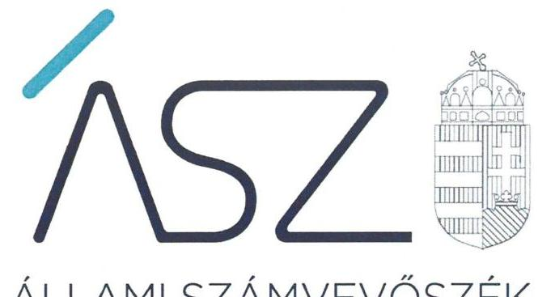
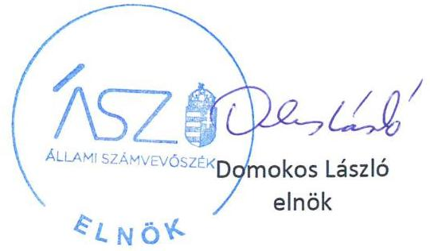

ÁLLAMI SZÁMVEVŐSZÉK

# JELENTÉS 

Nemzeti tulajdonú gazdasági társaságok ellenőrzése

Ózdi Kommunikációs Nonprofit Korlátolt Felelősségű Társaság
2020.

20196
www.asz.hu

---

ÁLLAMI SZÁMVEVŐSZÉK

# JELENTÉS

Nemzeti tulajdonú gazdasági társaságok ellenőrzése

Ózdi Kommunikációs Nonprofit Korlátolt Felelősségű Társaság

2020. 09. hó 29. nap

20196
www.asz.hu

---

# AZ ELLENŐRZÉST FELÜGYELTE: 

KAKAS SÁNDOR felügyeleti vezető

## AZ ELLENŐRZÉST VEZETTE ÉS A VÉGREHAJTÁSÁÉRT FELELŐS:

DR. PELLEI TAMÁS ellenőrzésvezető

A PROGRAM ÖSSZEÁLLÍTÁSÁÉRT FELELŐS:
TÓTPÁL SZABOLCS és FEKETE-NAGY ANDRÁS felelős vezető

IKTATÓSZÁM: EL-2898-001/2020
TÉMASZÁM: 2478
ELLENŐRZÉS-AZONOSÍTÓ SZÁM: V082241, V085702
Jelentéseink az Országgyúlés számítógépes hálózatán és az interneten a www.asz.hu címen is olvashatóak.

---

# TARTALOMJEGYZÉK 

■ ÖSSZEGZÉS ..... 5
■ AZ ELLENŐRZÉS CÉLJA ..... 6
■ AZ ELLENŐRZÉS TERÜLETE ..... 7
■ AZ ELLENŐRZÉS HÁTTERE, INDOKOLTSÁGA ..... 8
■ A JELENTÉS LÉNYEGES KÉRDÉSKÖREI ..... 9
■ AZ ELLENŐRZÉS HATÓKÖRE ÉS MÓDSZEREI ..... 10
■ MEGÁLLAPÍTÁSOK ..... 12
■ JAVASLATOK ..... 14
■ MELLÉKLETEK ..... 15
I. sz. melléklet: Értelmező szótár ..... 15
■ FÜGGELÉKEK ..... 17
I. sz. függelék a jelentéshez ..... 17
II. sz. függelék a jelentéshez ..... 18
III. sz. függelék: Észrevételek ..... 19
■ RÖVIDÍTÉSEK JEGYZÉKE ..... 23

---

.

---

# ÖSSZEGZÉS 

Az Ózdi Kommunikációs Nonprofit Korlátolt Felelősségű Társaság vagyongazdálkodása a 2015-2018. években nem volt szabályszerű, ezért müködésének átláthatósága és elszámoltathatósága, továbbá a nemzeti vagyonnal való felelős gazdálkodás nem volt biztosított.

## Az ellenőrzés társadalmi indokoltsága

Az Állami Számvevőszék kiemelt célja, hogy ellenőrzéseivel hozzájáruljon ahhoz, hogy a közpénzeket, illetve az ingyenesen juttatott közvagyont az államháztartáson kívül működő szervezetek is átlátható, rendezett módon használják fel.

Az állam és a helyi önkormányzatok tulajdona nemzeti vagyon, melynek megőrzése érdekében kiemelten fontos a nemzeti tulajdonú gazdasági társaságok ellenőrzése. Ellenőrzésüket további társadalmi elvárás is indokolja. Részben a gazdálkodásuk körébe tartozó vagyon nagysága, részben az általuk ellátott közszolgáltatások, sajátos feladatellátások, mivel tevékenységükön keresztül a lakosság széles köre kerül kapcsolatba a társaságokkal. Az önkormányzati tulajdonú gazdasági társaságok vezetői teljesítményértékelését érintő ellenőrzések lefolytatása a téma jellege, a vezetőknek a társaság működése szempontjából meghatározó szerepe és a társadalmi érdeklődés miatt indokolt.

Az Állami Számvevőszék céljaival és a társadalmi igénnyel összhangban, a gazdasági társaságok kiemelt fontosságú szerepe miatt került sor az Ózdi Kommunikációs Nonprofit Korlátolt Felelősségű Társaság vagyongazdálkodásának, illetve az Ózd Város Önkormányzata tulajdonosi joggyakorlásának ellenőrzésére.

## Főbb megállapítások, következtetések, javaslatok

Ózd Város Önkormányzata a tulajdonosi jogait szabályszerűen gyakorolta.
Az Ózdi Kommunikációs Nonprofit Korlátolt Felelősségű Társaság a jogszabályi előírásnak megfelelően rendelkezett leltározási szabályzattal, azonban a jogszabályi előírásokban foglaltak ellenére a 2015-2018. évekre vonatkozó mérlege alátámasztásához nem készített leltárt. A leltár hiányában az egyszerűsített éves beszámolók nem voltak megalapozottak, így a valódiság elve, mint számviteli alapelv nem érvényesült, az Ózdi Kommunikációs Nonprofit Korlátolt Felelősségű Társaság nem biztosította a nemzeti vagyonnal való elszámoltathatóságának feltételeit.

Az Ózdi Kommunikációs Nonprofit Korlátolt Felelősségű Társaság a jogszabályi előírások ellenére a 2015. évi tárgyi eszköz beszerzéseinek elszámolását számlával nem támasztotta alá, továbbá a 2017. évi értékcsökkenést sem számolta el szabályszerűen.

Az Állami Számvevőszék a jelentésben foglalt megállapítások alapján az Ózdi Kommunikációs Nonprofit Korlátolt Felelősségű Társaság ügyvezetője részére kettő javaslatot fogalmazott meg.

---

# AZ ELLENŐRZÉS CÉLJA 

AZ ELLENŐRZÉS CÉLJA annak megállapítása volt, hogy az Alapító ${ }^{1}$ a gazdasági társaságai feletti tulajdonosi joggyakorlás kereteit kialakította-e, tulajdonosi jogait megfelelően gyakorolta-e és kötelezettségeit teljesí-tette-e. Az ellenőrzés értékelte, hogy a gazdasági társaság biztosította-e a vagyon védelmét a nyilvántartások szabályszerű vezetése és a mérleg tételeinek leltárral történő alátámasztása útján, valamint szabályszerűen gondosko-dott-e a gazdasági társaság használatában, kezelésében lévő nemzeti vagyon értékének megőrzéséről, gyarapításáról, hasznosításáról. Az ellenőrzés célja volt továbbá az

Özdi Kommunikációs Nonprofit Korlátolt Felelősségű Társaság vezetője tevékenységében rejlő kockázatok azonosítása az egyes vezetői feladatok ellátásával összhangban.

---

# AZ ELLENŐRZÉS TERÜLETE 

## Ózd Város Önkormányzata és a kizárólagos tulajdonában lévő Ózdi Kommunikációs Nonprofit Kft.

Ózd Város Önkormányzata az Ózdi Kommunikációs Nonprofit Korlátolt Felelősségű Társaság kizárólagos tulajdonosa, amely 2009. január 22. napján átalakulással jött létre 4,0 millió forint jegyzett tőkével. A Társaság ${ }^{2}$ jogelődje az Ózdi Városi Televízió Közhasznú Társaság volt.

A Társaság főbb tevékenységi körei a film-, videó-, televízióműsor-gyártás, a rádióműsor-szolgáltatás, a folyóirat, időszaki kiadvány kiadása, és a televízió-műsor összeállítása, szolgáltatása volt. A Társaság biztosította Ózd város lakossága számára a közszolgálati műsorszolgáltatást, továbbá a szórakoztató és szolgáltató műsorok sugárzását, valamint a havonta megjelenő helyi időszaki kiadványt, lapot. A Társaság feladatát főként az Önkormányzat ${ }^{3}$ részéről biztosított működési forrásból, támogatásokból, illetve projektek, pályázatok nyilvánosságának biztosítására vonatkozó vállalkozási szerződésekből befolyó bevételekből látta el.

A Társaság üzemeltette az Önkormányzat tulajdonában lévő rádió- és televízió műsorszórás céljára szolgáló adótornyot, valamint a hozzá tartozó kiszolgáló helyiségeket, amelyeket az Önkormányzat a Társaság részére határozatlan időre a használatba adott. Az Önkormányzat a Társasággal vagyonkezelési szerződést nem kötött, a Társaság vagyonkezelt eszközzel nem rendelkezett.

A Társaság foglalkoztatottainak száma 2015. december 31-ről 2018. december 31-re 15 főről 13 főre változott, az ügyvezető személyben az ellenőrzött időszakban nem történt változás. A Társaság a Számv. tv. ${ }^{4}$ szerint nem volt könyvvizsgálatra kötelezett. A Társaság 300 ezer forint összegű részvényt birtokolt az ellenőrzött időszakban a Hálózatos Televíziók Zrt.ben.

A Társaság nem minősült kormányzati szektorba sorolt egyéb szervezetnek.

---

# AZ ELLENŐRZÉS HÁTTERE, INDOKOLTSÁGA 

Az Alaptörvény ${ }^{5}$ 38. cikke alapján az állam és a helyi önkormányzatok tulajdona nemzeti vagyon. A nemzeti vagyon megőrzése, megóvása érdekében kiemelten fontos ezen nemzeti tulajdonú gazdasági társaságok ellenőrzése. Gazdálkodásuk jellemzően a közérdeklődés és a média figyelmének középpontjában áll, amihez hozzájárul a gazdálkodásuk körébe tartozó - a nemzeti vagyon részét képező - vagyon nagysága, illetve az általuk ellátott közszolgáltatások minősége és hatékonysága. Ellenőrzéseink feltárhatják, hogy a tulajdonosi felügyelet hozzájárult-e a szabályszerű gazdálkodáshoz és feladatellátáshoz.

Az ellenőrzés eredményeként meghatározhatóvá válnak a szervezet vagyongazdálkodást érintő kockázatai, ezzel lehetővé téve a kockázatok csökkentését. A megállapítások alapján megfogalmazott számvevőszéki javaslatok hasznosítása elősegítheti a meglévő hibák megszüntetését. A jó gyakorlatok bemutatásával az ÁSZ ${ }^{6}$ hozzájárulhat a követendő megoldások megismertetéséhez, terjesztéséhez.

A Kormány „jól irányított állam" megteremtésével kapcsolatos céljaival összhangban van, hogy olyan vezetői teljesítményértékelési rendszer kerüljön kialakításra és működtetésre, amely hozzájárul a szervezeti teljesítmény növeléséhez, a fejlődési lehetőségek kihasználásához. Az ÁSZ a rendszer kiépítésében vállalt aktív ellenőrzési, értékelési tevékenységével kíván hozzájárulni a „jól működő állam" megteremtéséhez.

---

# A JELENTÉS LÉNYEGES KÉRDÉSKÖREI 

1. A Társaság feletti tulajdonosi joggyakorlás megfelelt-e a jogszabályi és belső előírásoknak?
2. A Társaság vagyongazdálkodási tevékenysége szabályszerü volt-e?
3. A vezető teljesítménye megfelelő volt-e?

---

# AZ ELLENŐRZÉS HATÓKÖRE ÉS MÓDSZEREI 

## Az ellenőrzés típusa

Megfelelőségi ellenőrzés.

## Az ellenőrzött időszak

A tulajdonosi joggyakorlás vonatkozásában az ellenőrzött időszak a 20172018. évek, az éves beszámolók elfogadása kivételével, amelyeknél az ellenőrzött időszak 2015-2018. évek.

A Társaság vagyongazdálkodása vonatkozásában az ellenőrzött időszak 2015-2018. évek.

A vezetői teljesítmény ellenőrzése esetében az ellenőrzött időszak a 2018. év.

## Az ellenőrzés tárgya

Az önkormányzati tulajdonban lévő gazdasági társaság feletti tulajdonosi joggyakorlás kialakítása és múködtetése.

Önkormányzati tulajdonban lévő gazdasági társaság vagyongazdálkodása keretében a Társaság használatában, kezelésében lévő nemzeti vagyon, illetve a saját vagyon tekintetében a vagyonnyilvántartások vezetése, leltára. A Társaság használatában lévő nemzeti vagyon tekintetében a vagyon értékének megőrzése, gyarapítása, hasznosítása.

Az önkormányzati tulajdonban lévő gazdasági társaság átlátható, szabályszerű, gazdaságos, hatékony, eredményes és felelős gazdálkodásának feltételrendszere kialakítása, a belső kontrollrendszer és humánpolitikai rendszer múködtetése. Az integritásszemléletet érvényesítése, illetve a felelős vagyongazdálkodás biztosítása a nemzeti vagyon megőrzése és védelme érdekében.

## Az ellenőrzött szervezet

- Özd Város Önkormányzata
- Özdi Kommunikációs Nonprofit Korlátolt Felelősségű Társaság

## Az ellenőrzés jogalapja

Az ellenőrzés jogalapját az ÁSZ tv. ${ }^{7}$ 1. § (3) bekezdése és 5. § (3)-(5) bekezdései képezték.

---

# Az ellenőrzés módszerei 

Az ellenőrzést az ellenőrzési program ellenőrzési kérdései, az ellenőrzött időszakban hatályos jogszabályok, az ellenőrzés szakmai szabályok és módszertanok alapján, a nemzetközi standardok figyelembe vételével végezte az ÁSZ.

Az ellenőrzés ideje alatt az ellenőrzött szervezettel történő kapcsolattartást az ÁSZ SZMSZ-ének ${ }^{8}$ vonatkozó előírásai alapján biztosította az ÁSZ.

A gazdasági társaság vagyonhoz kapcsolódó nyilvántartásai vezetésének megfelelősége, a mérleg tételeinek leltárral való alátámasztottsága, valamint a nemzeti vagyon értékmegőrzésének, hasznosításának szabályszerűsége 2015-2018. évek tekintetében került ellenőrzésre. A 2015-2018. éveket érintően történt meg a lényeges dokumentumok értékelése.

A vagyonnyilvántartások és a leltár szabályszerűsége esetében az ellenőrzés azokra a legnagyobb értékű tételekre - a lényeges sokaságra terjedt ki, melyek összértéke eléri a teljes sokaság összértékének 50\%-át. A lényeges sokaságot tételesen ellenőrizte az ÁSZ.

A vezetői teljesítmény ellenőrzési szempontjait a szabályszerűségi szempontok szerinti ellenőrzésben a jogszabályi előírások, belső utasítások, belső szabályozók, a tulajdonosi joggyakorlók elvárásai, előírásai, a helyénvalósági szempontok szerinti ellenőrzésben az ÁSZ által általánosan elfogadott, jó gyakorlat szerinti ajánlásai, értékelési kritériumai mentén kerültek meghatározásra. Az ellenőrzési kérdések szerint az összesített értékelés alapján az elért pontok az elérhető pontok minimum 70\%-át elérve, a társaság vezetője tevékenységét megfelelőnek, 70\% alatt nem megfelelőnek tekintette az ÁSZ.

Az ellenőrzési kérdések megválaszolásához szükséges bizonyítékok megszerzése a következő ellenőrzési eljárások alkalmazásával történt: megfigyelés, információkérés, összehasonlítás, elemző eljárás. Az ellenőrzési bizonyítékként felhasználható adatforrások közé tartoznak az ellenőrzési programban felsorolt adatforrások, továbbá minden - az ellenőrzés folyamán - feltárt, az ellenőrzés szempontjából információkat tartalmazó dokumentum.

Az ÁSZ az ellenőrzést a kérdésekre adott válaszok kiértékelésével, valamint a megjelölt adatforrások, a csatolt tanúsítványok felhasználásával, továbbá az adott időszakban hatályos jogszabályok figyelembe vételével folytatta le.

Amennyiben a Társaság múködését és gazdálkodását alapvetően meghatározó dokumentum hiánya miatt, valamely lényeges kérdéskörre vonatkozóan az ÁSZ megállapítást tett, további ellenőrzési tevékenységek az adott kérdéskörrel és az azzal szoros logikai kapcsolatban lévő kérdéskörökkel - ráépülő jelleggel - nem kerültek végrehajtásra.

---

# 1. A Társaság feletti tulajdonosi joggyakorlás megfelelt-e a jogszabályi és belső előírásoknak? 

Összegző megállapítás A Társaság feletti tulajdonosi joggyakorlás szabályszerű volt.
A TULAJDONOSI JOGOK GYAKORLÁSÁNAK KE-
RETEIT az Alapító a Vagyonrendeletben ${ }^{9}$, az SZMSZ ${ }_{1-2}{ }^{10}$-ben, valamint
az Alapító okirat ${ }_{1-2}$-ban ${ }^{11}$ az Nvtv. ${ }^{12}$, a Ptk. ${ }^{13}$ és az Mötv. ${ }^{14}$ előírásai alapján
alakította ki. Az Alapító okirat ${ }_{2}$-ban rögzítette a tulajdonos részére fenntartott alapítói (döntési) jogokat.

AZ ALAPÍTÓ megalkotta a Javadalmazási szabályzat ${ }_{1,2}{ }^{15}$-ot. A Taktv. ${ }^{16}$ 5. § (3) bekezdésében előírtak ellenére a Javadalmazási szabályzat ${ }_{1}$ nem tartalmazta az Mt. ${ }^{17}$ 208. §-ának hatálya alá tartozó munkavállalók javadalmazásának, valamint a jogviszony megszűnése esetére biztosított juttatások módjának, mértékének elveit. A 2018. december 1-jétől hatályos Javadalmazási szabályzat ${ }_{2}$-ot az Alapító a Taktv. előírása szerint alkotta meg.

AZ ÜZLETI TERVEIT a Társaság az ellenőrzött időszakban elkészítette, amelyet az Alapító határozatával elfogadott.

A FELÜGYELŐ BIZOTTSÁG ${ }^{18}$ tevékenységéhez kapcsolódóan a tulajdonosi joggyakorlás szabályszerű volt. A Felügyelő Bizottság létrehozása megfelelt a Ptk. és a Taktv. előírásainak. A Felügyelő Bizottság ügyrendjét az Alapító határozatával elfogadta.

A TÁRSASÁG EGYSZERŰSÍTETT ÉVES BESZÁMOLÓIT az Alapító a Ptk. előírásainak megfelelően a felügyelő bizottság írásbeli jelentésének birtokában fogadta el. Az Alapító okiratban ${ }_{1-2}$ foglaltakkal összhangban határozataival elfogadta a Társaság 2015-2018. évi közhasznúsági mellékleteit is, amelyeket a felügyelő bizottság véleményezett.

## 2. A Társaság vagyongazdálkodási tevékenysége szabályszerű volt-e?

Összegző megállapítás A Társaság vagyongazdálkodási tevékenysége nem volt szabályszerű.

A VAGYONGAZDÁLKODÁS FELTÉTELEIT a Társaság szabályszerűen kialakította, mivel a Számv. tv. előírásai alapján rendelkezett számviteli szabályzatokkal. A Társaság rendelkezett a Számv. tv. előírása szerint Számlarenddel ${ }^{19}$.

---

LELTÁROZÁSI SZABÁLYZATTAL ${ }^{20}$ a Társaság a Számv. tv. előírásának megfelelően rendelkezett, amely tartalmazta a leltározásra és a leltárkészítésre vonatkozó szabályokat, előírásokat.

# A VAGYONGAZDÁLKODÁS NEM VOLT SZABÁLYSZERŰ, mert 

- a Társaság a Számv. tv. 69. § (1) bekezdésének előírása ellenére a mérlegtételek alátámasztásához 2015-2018. évekre vonatkozóan nem állított össze leltárt, amely tételesen, ellenőrizhető módon tartalmazta a mérleg fordulónapján meglévő eszközöket és forrásokat mennyiségben és értékben. A leltár hiányában a 2015-2018. évi egyszerűsített éves beszámolók részét képező mérlegek nem voltak megalapozottak;
- a 2018. évben a Számv. tv. 69. § (2) bekezdésében foglalt előírás ellenére az immateriális javak és a tárgyi eszközök tekintetében a főkönyvi könyvelés és az analitikus nyilvántartások közötti egyeztetést nem végezte el,
- a Társaság a 2015. évi 3,79 millió forint összegű tárgyi eszköz beszerzéssel kapcsolatos kiadást a Számv. tv. 165. § (2) bekezdésében előírtak ellenére bizonylat hiányában rögzítette számviteli nyilvántartásában;
- a 2017. évi az eszközök bekerülési értékének meghatározása a Számv. tv. előírásai alapján történt, azonban az értékcsökkenésének elszámolása a 2017. évben nem felelt meg a Számv. tv. 52. § (1) bekezdés előírásának, mivel a Társaság az értékcsökkenést nem a bekerülési érték után számolta el.

## 3. A vezető teljesítménye megfelelő volt-e?

## Összegző megállapítás A vezető teljesítménye a 2018. évben nem volt megfelelő.

A Társaság vezetőjének tevékenysége a 2018. évben nem volt megfelelő, a vezető tisztségviselő nem biztosította a társaság gazdálkodásának átlátható múködését és annak alapfeltételeit a nemzeti vagyon megőrzése és védelme érdekében. A részletes megállapításokat a II. számú függelék tartalmazza.

---

# JAVASLATOK 

Az ÁSZ tv. 33. § (1) bekezdésében foglaltak értelmében az ellenőrzött szervezet vezetője köteles a jelentésben foglalt megállapításokhoz kapcsolódó intézkedési tervet összeállítani és azt a jelentés kézhezvételétől számított 30 napon belül az ÁSZ részére megküldeni. Amennyiben az ellenőrzött szervezet vezetője nem küldi meg határidőben az intézkedési tervet, vagy továbbra sem elfogadható intézkedési tervet küld, az Állami Számvevőszék elnöke az ÁSZ tv. 33. § (3) bekezdése a) és b) pontjaiban foglaltakat érvényesítheti.

## az Ózdi Kommunikációs Nonprofit Korlátolt Felelősségű Társaság ügyvezetőjének

1. Az ellenőrzött időszakot követően gondoskodjon a mérlegtételek alátámasztásához a Számv. tv. 69. § (1) bekezdésének megfelelő leltár öszszeállításáról.
(2. megállapítás 3. bekezdés 1. francia bekezdése alapján)
2. Az ellenőrzött időszakot követően gondoskodjon a fökönyvi könyvelés és az analitikus nyilvántartások adatai közötti egyeztetés elvégzéséről a jogszabályi előírásnak megfelelően.
(2. megállapítás 3. bekezdés 2. francia bekezdése alapján)

---

# MELLÉKLETEK 

- I. SZ. MELLÉKLET: ÉRTELMEZŐ SZÓTÁR
gazdasági társaság
nemzeti vagyon
tulajdonosi jogok gyakorlója
vagyongazdálkodás
nonprofit gazdasági társaság

Ptk. 3:88. § (1) bekezdése szerint „a gazdasági társaságok üzletszerű közös gazdasági tevékenység folytatására, a tagok vagyoni hozzájárulásával létrehozott, jogi személyiséggel rendelkező vállalkozások, amelyekben a tagok a nyereségből közösen részesednek, és a veszteséget közösen viselik".
Nvtv. 1. § (2) bekezdése szerint nemzeti vagyonba tartozik többek között:
„az állam vagy a helyi önkormányzat kizárólagos tulajdonában álló dolgok,
az a) pont hatálya alá nem tartozó, állam vagy a helyi önkormányzat tulajdonában lévő do$\log$,
az állam vagy a helyi önkormányzat tulajdonában lévő pénzügyi eszközök, továbbá az államot vagy a helyi önkormányzatot megillető társasági részesedések,
az államot vagy a helyi önkormányzatot megillető bármely vagyoni érték-kel rendelkező jogosultság, amelyet jogszabály vagyoni értékű jogként nevesít
Aki a nemzeti vagyon felett az államot vagy a helyi önkormányzatot megillető tulajdonosi jogok és kötelezettségek összességének gyakorlására jogosult. (Forrás: Nvtv. 3. § (1) bekezdés 17. pontja)
A nemzeti vagyongazdálkodás feladata a nemzeti vagyon rendeltetésének megfelelő, az állam, az önkormányzat mindenkori teherbíró képességéhez igazodó, elsődlegesen a közfeladatok ellátásához és a mindenkori társadalmi szükségletek kielégítéséhez szükséges, egységes elveken alapuló, átlátható, hatékony és költségtakarékos működtetése, értékének megőrzése, állagának védelme, értéknövelő használata, hasznosítása, gyarapítása, továbbá az állam vagy a helyi önkormányzat feladatának ellátása szempontjából feleslegessé váló vagyontárgyak elidegenítése.
Forrás: Nvtv. 7. § (2) bekezdése.
az a gazdasági társaság minősül nonprofit gazdasági társaságnak és cégnevében az a gazdasági társaság tüntetheti fel a nonprofit jelleget, amelynek létesítő okirata tartalmazza, hogy a gazdasági társaság tevékenységéből származó nyereség a tagok között nem osztható fel, hanem az a gazdasági társaság vagyonát gyarapítja.
Forrás: A cégnyilvánosságról, a bírósági cégeljárásról és a végelszámolásról szóló 2006. évi V. törvény 9/F. § (2) bekezdés.

---

.

---

# FÜGGELÉKEK 

- I. SZ. FÜGGELÉK A JELENTÉSHEZ

Az Állami Számvevőszék az ellenőrzések során feltárt tényekhez kapcsolódó további körülmények tisztázására eszközrendszerrel nem rendelkezik. Amennyiben az ellenőrzésen túlmutatóan indokoltnak látszik az ellenőrzés során feltárt körülmények további vizsgálata, az Állami Számvevőszék törvényi felhatalmazás alapján az ellenőrzés által feltárt körülményeket továbbítja a hatáskörrel rendelkező szervnek a szükséges intézkedések megtétele, eljárások lefolytatása érdekében.

A Társaság a 2015. évben három darab, összesen 3790360 forint összegű tárgyi eszköz beszerzés elszámolását nem támasztotta alá számviteli bizonylattal, a beszerzés adatait a Számv. tv. 165. § (2) bekezdésében foglalt előírások ellenére bizonylat nélkül jegyezte be a számviteli (könyvviteli) nyilvántartásába.

Mindezek alapján nem igazolt, hogy a kiadások a Társaság feladatellátását szolgálták, valamint, hogy a kifizetéshez valós teljesítés kapcsolódott, ezért nem zárható ki a szabálytalan kifizetések miatt a vagyoni hátrány okozása.

Az eset konkrét körülményeinek felderítésére a nyomozóhatóság rendelkezik hatáskörrel.

---

Az ellenőrzés az önkormányzati tulajdonban lévő gazdasági társaság vezető tisztségviselőjére terjedt ki. Az ellenőrzés során a megalapozott vezetői teljesítmény értékeléséhez a vezetői feladatok közül a stratégiai irányítást, tervezést, azok megvalósítását, a társaság szabályszerű müködése feltételrendszerének kialakítását, a belső kontrollrendszer, valamint a humánpolitikai rendszer müködtetését, az integritás szemlélet érvényesítését, illetve a felelős vagyongazdálkodás biztositását értékeltük.

Az ellenőrzés értékelése alapján a Társaság vezetője a 2018. évben nem dolgozta ki a Társaság középtávú stratégiáját, a szervezet teljesítményének értékelése céljából nem müködtetett mutatószámokon, mutatószámrendszeren alapuló szervezeti teljesítményértékelési rendszert, továbbá a Társaság menedzsmentjére, munkavállalóira és a vagyongazdálkodására vonatkozó összeférhetetlenségi előírásokat. A Társaság vezetője nem müködtetett a vezetést támogató információs/kontrolling rendszert, egyéni teljesítményértékelési, és teljesít-mény-ösztönző rendszert, továbbá nem állt az ellenőrzés rendelkezésre a vezető jogszabályi előírások szerinti vagyonnyilatkozata. A Társaság vezetőjének irányítása alatt nem mérték fel és nem értékelték a szervezetet és a tevékenységet érintő kockázatokat. A Társaságnál a 2018. évi mérleget alátámasztó leltározással összefüggésben a leltározást nem rendelte el a Társaság vezetője.

Mindezek alapján a Társaság vezetőjének tevékenysége a 2018. évben nem volt megfelelő, a vezető tisztségviselő nem biztositotta a társaság gazdálkodásának átlátható müködését és annak alapfeltételeit a nemzeti vagyon megőrzése és védelme érdekében.

A megfelelően kialakított vezetői teljesítményértékelési rendszerek alapul szolgálnak a vezetői felelősség tudatosításához, és ezáltal a szervezeti teljesítmény fenntartásához, növeléséhez, a fejlődési lehetőségek kihasználásához, hozzájárulhatnak a közvagyonnal való hatékony gazdálkodáshoz.

---

A jelentéstervezetet a Számvevőszék 15 napos észrevételezésre megküldte az ellenőrzött szervezetek vezetőinek az ÁSZ tv. 29. $\xi^{+}$(1) bekezdése előírásának megfelelően.

Az Ózdi Kommunikációs Nonprofit Kft. ügyvezetője a jelentéstervezet megállapításaira írásban észrevételt tett.
Az ÁSZ tv. 29. § (3) bekezdésével összhangban az ÁSZ a Függelékben feltünteti az ellenőrzés megállapításaival kapcsolatban tett, figyelembe nem vett észrevételeket, és megindokolja, hogy azokat miért nem fogadta el.

[^0]
[^0]:    * 29. § (1) Az Állami Számvevőszék az ellenőrzési megállapításait megküldi az ellenőrzött szervezet vezetőjének vagy az általa megbízott személynek, és annak, akinek személyes felelősségét állapította meg.
    (2) Az ellenőrzött szervezet vezetője és a felelősként megjelölt személy az ellenőrzés megállapításaira tizenöt napon belül írásban észrevételt tehet.
    (3) Az Állami Számvevőszék az észrevételre a beérkezésétől számított harminc napon belül írásban válaszol. A figyelembe nem vett észrevételeket köteles a jelentésben feltüntetni, és megindokolni, hogy azokat miért nem fogadta el.

---

A számvevőszéki jelentéstervezet megállapításaival kapcsolatban az ügyvezető által 2020. augusztus 13-án tett (az Állami Számvevőszékhez 2020. augusztus 17-én érkezett) el nem fogadott észrevételek és azok kezelésének indokolása.

# 1. A jelentéstervezet 1. számú javaslatára (2. megállapítás 3. bekezdés 1. francia bekezdés megállapítására) vonatkozó észrevételével kapcsolatban 

Az ügyvezető észrevételében leírta, hogy az ellenőrzés rendelkezésére bocsátott leltárak csupán a leltárak mennyiségi felvételének kivonatait tartalmazzák, azonban kijelenti, hogy a leltárak a vonatkozó években rendelkezésre állnak, amelynek alátámasztására észrevételéhez csatolta azokat.

Az Állami Számvevőszék (továbbiakban: ÁSZ) az EL-0925-003/2018. és EL-2102-004/2019. iktatószámú leveleiben bekérte az Őzdi Kommunikációs Nonprofit Korlátolt Felelősségű Társaság (továbbiakban: Társaság) 2015-2018. évekre vonatkozó aláírt és hiteles leltárait, amit Ügyvezető úr 2018. augusztus 22-én és 2019. november 28-án kelt nyilatkozatai szerint az ellenőrzés rendelkezésére bocsátott. Ügyvezető úr nyilatkozatai szerint megküldött leltárfelvételi íveket és leltárakat megvizsgáltam és megállapítottam, hogy azokról hiányoznak a leltár készítők és a leltározásban résztvevők aláírásai, amelynek okán azok nem minősülnek hiteles dokumentumoknak, így azokat az ÁSZ nem értékelte ellenőrzési bizonyítékként.

Az ÁSZ ellenőrzési megállapításait kizárólag az Állami Számvevőszékről szóló 2011. évi LXVI. törvény (továbbiakban: ÁSZ tv.) 28. § (2) bekezdésben meghatározott adatszolgáltatási időszakon belül megküldött, teljességi és hitelességi nyilatkozattal alátámasztott dokumentumokra alapozva teszi. Ügyvezető úr nyilatkozott az adatszolgáltatás során arról, hogy az ÁSZ részére átadott dokumentumok, adatok megbízhatóak, és a bekért adatokra, dokumentumokra vonatkozóan teljes körű információt tartalmaznak.

A fent leírtakra tekintettel az észrevételt nem fogadjuk el, a jelentéstervezet megállapításai helytállóak, módosításuk nem indokolt.

## 2. A jelentéstervezet 2. számú javaslatára (2. megállapítás 3. bekezdés 2. francia bekezdés megállapítására) vonatkozó észrevételével kapcsolatban

Az ügyvezető észrevételében jelezte, hogy a Társaság a beszámoló készítésekor, valamint a gazdasági év közben folyamatosan végzi a főkönyvi könyvelés és az analitikus nyilvántartások közötti egyeztetést. A Társaság a könyvviteli munka megerősítésére és annak ellenőrzésére a jövőben könyvvizsgálatot is igénybe fog venni.

A számvitelről szóló 2000. évi C. törvény (továbbiakban: Számv tv.) 69. § (2) bekezdésének előírása alapján a Számv tv. 69. § (1) bekezdésében meghatározott leltárkészítési kötelezettség teljesítése keretében a vállalkozónak a főkönyvi könyvelés és az analitikus nyilvántartások adatai közötti egyeztetést az üzleti év mérlegfordulónapjára vonatkozóan el kell végeznie.

Az ÁSZ az EL-2102-005/2019. iktatószámú levelében bekérte a Társaság 2018. évre vonatkozó főkönyvi könyvelés és az analitikus nyilvántartások közötti egyeztetés aláírt és hiteles dokumentumait, amit Ügyvezető úr 2019. január 29-én kelt nyilatkozata szerint az ellenőrzés rendelkezésére bocsátott. Ügyvezető úr nyilatkozata szerint megküldött dokumentumot megvizsgáltam és megállapítottam, hogy az tartalmát tekintve összesítő kimutatás az immateriális javak és tárgyi eszközök 2018. évi állomány változásáról a Társaság 1-es számlaosztályba tartozó főkönyvi számláira vonatkozóan, amely nem tartalmazza az analitikus nyilvántartásokkal való egyeztetésre vonatkozó információkat. A kimutatás nem tartalmazza a leltározásban résztvevők és a leltár felelős aláírásait sem, amelynek okán azok nem minősülnek hiteles dokumentumoknak, így azt az ÁSZ nem értékelte ellenőrzési bizonyítékként.

Az ÁSZ ellenőrzési megállapításait kizárólag az ÁSZ tv. 28. § (2) bekezdésben meghatározott adatszolgáltatási időszakon belül megküldött, teljességi és hitelességi nyilatkozattal alátámasztott dokumentumokra alapozva teszi. Ügyvezető úr nyilatkozott az adatszolgáltatás során arról, hogy az ÁSZ részére átadott dokumentumok, adatok megbízhatóak, és a bekért adatokra, dokumentumokra vonatkozóan teljes körű információt tartalmaznak.

A fent leírtakra tekintettel az észrevételt nem fogadjuk el, a jelentéstervezet megállapításai helytállóak, módosításuk

---

nem indokolt.

# 3. A jelentéstervezet I. számú függelékére tett észrevételével kapcsolatban 

Az ügyvezető észrevételében jelezte, hogy a 2015. évben beszerzett tárgyi eszközök elszámolására számviteli bizonylatok (számlák) alapján került sor. Észrevételében elismeri, hogy az ellenőrzés során adminisztrációs hiba miatt a jelentéstervezet I. számú függelékében szereplő tételek vonatkozásában számlákat nem bocsátottak az ÁSZ rendelkezésére. A vonatkozó számlákat észrevételéhez csatolta.

Az ÁSZ EL-0925-041/2019. iktatószámú levelében bekérte az észrevételben hivatkozott beruházásokhoz kapcsolódó számlákat. Ügyvezető úr 2019. április 3-án kelt nyilatkozata szerint az ÁSZ részére átadott dokumentumok, adatok megbízhatóak, és a bekért adatokra, dokumentumokra vonatkozóan teljes körű információt tartalmaznak. Az ellenőrzés rendelkezésére bocsátott dokumentumok vizsgálata során megállapítottam, hogy a jelentéstervezet I. sz. függelékében szereplő három tétel esetében rendelkezésre bocsátott megrendelés, szállítólevél, illetve előlegbekérő levél nem minősülnek a tárgyi eszköz beszerzés elszámolását alátámasztó bizonylatnak, ezért a Társaság a Számv. tv. 165. § (2) bekezdés előírása ellenére ezen beszerzések adatait bizonylat nélkül jegyezte be a számviteli (könyvviteli) nyilvántartásába. Az ÁSZ erre a tényre alapozta azon következtetését, miszerint nem igazolt, hogy a kiadások a Társaság feladatellátását szolgálták, valamint, hogy a kifizetéshez valós teljesítés kapcsolódott, ezért nem zárható ki a szabálytalan kifizetések miatt a vagyoni hátrány okozása.

Az ÁSZ ellenőrzési megállapításait kizárólag az ÁSZ tv. 28. § (2) bekezdésben meghatározott adatszolgáltatási időszakon belül megküldött, teljességi és hitelességi nyilatkozattal alátámasztott dokumentumokra alapozva teszi.

A fent leírtakra tekintettel az észrevételt nem fogadjuk el, a jelentéstervezet módosítása nem indokolt.

---

.

---

# RÖVIDÍTÉSEK JEGYZÉKE 

${ }^{1}$ Alapító
${ }^{2}$ Társaság
${ }^{3}$ Önkormányzat
${ }^{4}$ Számv. tv.
${ }^{5}$ Alaptörvény
${ }^{6}$ ÁSZ
${ }^{7}$ ÁSZ tv.
${ }^{8}$ ÁSZ SZMSZ
${ }^{9}$ Vagyonrendelet
${ }^{10} \mathrm{SZMSZ}_{1,2}$
${ }^{11}$ Alapító okirat ${ }_{1,2}$

[^0]Özd Város Önkormányzata Képviselő-testülete
Özdi Kommunikációs Nonprofit Korlátolt Felelősségű Társaság
Özd Város Önkormányzata
A számvitelről szóló 2000. évi C. törvény (hatályos: 2001. január 1-től)
Magyarország Alaptörvénye (hatályos: 2012. január 1-jétől)
Állami Számvevőszék
Az Állami Számvevőszékről szóló 2011. évi LXVI. törvény
(hatályos: 2011. július 1-jétől)
Az Állami Számvevőszék Szervezeti és Működési Szabályzata
Özd Város Önkormányzata Képviselő Testületének 3/2013. (II.27.) önkormányzati rendelete Özd város Önkormányzatának tulajdonáról és a vagyongazdálkodás főbb szabályairól (hatályos: 2016. április 30-ától)
SZMSZ1: Özd Város Önkormányzata Képviselő-testületének 4/2013. (II.27.) önkormányzati rendelete Özd város Önkormányzata Képviselő-testületének Szervezeti és Múködési Szabályzatáról (hatályos: 2013. február 28-ától)
SZMSZ2: Özd Város Önkormányzata Képviselő-testületének 2/2018. (III.26.) önkormányzati rendelete Özd város Önkormányzata Képviselő-testületének Szervezeti és Múködési Szabályzatáról (hatályos: 2018. április 15-étől)
Alapító okirat1: Az Özdi Kommunikációs Nonprofit Kft. alapító okiratának, az Alapító, Özd Város Önkormányzata Képviselő-testülete a 185/2015. (VII.17.) 186/2015. (VII.17.) - 187/2015. (VII.17.) számú határozatainak megfelelő módosítással egységes szerkezetbe foglalt szövege
(hatályos: 2015. július 18-ától)
Alapító okirat2: Az Özdi Kommunikációs Nonprofit Kft. alapító okiratának, az Alapító, Özd Város Önkormányzata Képviselő-testülete a 63/2016. (III.30.) 64/2016. (III. 30.) - 65/2016. (III.30.) számú határozatainak megfelelő módosítással egységes szerkezetbe foglalt szövege
(hatályos: 2016. március 30-ától)
A nemzeti vagyonról szóló 2011. évi CXCVI. törvény (hatályos: 2012. január 1-től)
A Polgári Törvénykönyvről szóló 2013. évi V. törvény
(hatályos: 2014. március 15-től)
Magyarország helyi önkormányzatairól szóló 2011. évi CLXXXIX. törvény (hatályos: 2012. január 1-től)
Javadalmazási szabályzat1: Özd Város Önkormányzata többségi befolyása alatt álló gazdálkodó szervezetei vezető tisztségviselőinek (úgyvezetői) és felügyelő bizottsági tagjainak javadalmazási elveiről (hatályos: 2013. március 29-étől)
Javadalmazási szabályzat2: Özd Város Önkormányzatának Képviselő testülete 128/2018. (XI. 15.) számú határozatával elfogadott, a vezető tisztségviselők, felügyelő bizottsági tagok és az Mt. 208. §-ának hatálya alá tartózó munkavállalók javadalmazása, valamint a jogviszony megszűnése esetére biztosított juttatások módjának, mértékének elveiről szóló javadalmazási szabályzat (hatályos: 2018. december 1-jétől)
A köztulajdonban álló gazdasági társaságok takarékosabb múködéséről szóló 2009. évi CXXII. törvény (hatályos: 2009. november 26-ától)
A munka törvénykönyvéről szóló 2012. évi I. törvény
(hatályos: 2012. július 1-jétől)

[^0]:    ${ }^{1}$ Alapító
    ${ }^{2}$ Társaság
    ${ }^{3}$ Önkormányzat
    ${ }^{4}$ Számv. tv.
    ${ }^{5}$ Alaptörvény
    ${ }^{6}$ ÁSZ
    ${ }^{7}$ ÁSZ tv.
    ${ }^{8}$ ÁSZ SZMSZ
    ${ }^{9}$ Vagyonrendelet
    ${ }^{10} \mathrm{SZMSZ}_{1,2}$
    ${ }^{11}$ Alapító okirat ${ }_{1,2}$

    12 Nvtv.
    ${ }^{13}$ Ptk.
    ${ }^{14}$ Mötv.
    ${ }^{15}$ Javadalmazási Szabályzat ${ }_{1,2}$

---

${ }^{18}$ Felügyelő bizottság
${ }^{19}$ Számlarend
${ }^{20}$ leltározási szabályzat

Özdi Kommunikációs Nonprofit Kft. felügyelő bizottsága
Özdi Kommunikációs Nonprofit Kft. Számlarend (hatályos: 2015. január 1-jétől)
Özdi Kommunikációs Nonprofit Kft. Leltározási Szabályzat
(hatályos: 2015. január 1-jétől)

---

# ASZ 

ALLAMI SZAMVEVOSZEK
1052 Budapest, Apáczai Cs. J. u. 10. I 1364 Budapest 4. Pf. 54
TEL: +36 14849100
email: szamvevoszek@asz.hu
web: www.asz.hu | www.aszhirportal.hu