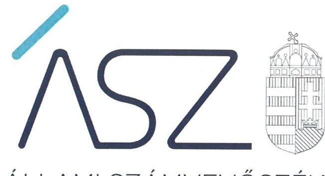

ÁLLAMI SZÁMVEVŐSZÉK

# JELENTÉS 

Nemzeti tulajdonú gazdasági társaságok ellenőrzése

KISVÁRDAI KÖZMŰ Szolgáltató Korlátolt Felelősségű Társaság
2020.

20198
www.asz.hu

---

ÁLLAMI SZÁMVEVŐSZÉK

# JELENTÉS

Nemzeti tulajdonú gazdasági társaságok ellenőrzése

KISVÁRDAI KÖZMŰ Szolgáltató Korlátolt Felelősségű Társaság

2020.
*cs.* hó *23.* nap

20198
www.asz.hu

Domokos László
elnök

ELNÖK

---

# AZ ELLENŐRZÉST FELÜGYELTE: 

KAKAS SÁNDOR felügyeleti vezető

## AZ ELLENŐRZÉST VEZETTE ÉS A VÉGREHAJTÁSÁÉRT FELELŐS:

ÓDOR ZOLTÁN TAMÁS ellenőrzésvezető

## A PROGRAM ÖSSZEÁLLÍTÁSÁÉRT FELELŐS:

FEKETE-NAGY ANDRÁS GÁBOR projektvezető

IKTATÓSZÁM EL-2896-001/2020
TÉMASZÁM: 2478
ELLENŐRZÉS-AZONOSÍTÓ SZÁM: V082274, V085710

---

# TARTALOMJEGYZÉK 

■ ÖSSZEGZÉS ..... 5
■ AZ ELLENŐRZÉS CÉLJA ..... 6
■ AZ ELLENŐRZÉS TERÜLETE ..... 7
■ AZ ELLENŐRZÉS HÁTTERE, INDOKOLTSÁGA ..... 8
■ A JELENTÉS LÉNYEGES KÉRDÉSKÖREI ..... 9
■ AZ ELLENŐRZÉS HATÓKÖRE ÉS MÓDSZEREI ..... 10
■ MEGÁLLAPÍTÁSOK ..... 12
■ JAVASLATOK ..... 14
■ MELLÉKLETEK ..... 15
I. sz. melléklet: Értelmező szótár ..... 15
■ FÜGGELÉKEK ..... 17
I. sz. függelék: Vezetői teljesítmény értékelése ..... 17
II. sz. függelék: Észrevételek ..... 18
■ RÖVIDÍTÉSEK JEGYZÉKE ..... 21

---

.

---

# ÖSSZEGZÉS 

A KISVÁRDAI KÖZMŰ Szolgáltató Korlátolt Felelősségű Társaság vagyongazdálkodása a 2015-2017. években szabályszerű volt, a 2018. évben nem volt szabályszerű, így a 2018. évben az átláthatóságot és az elszámoltathatóságot, valamint a nemzeti vagyon megőrzését nem biztosította.

## Az ellenőrzés társadalmi indokoltsága

Az Állami Számvevőszék kiemelt célja, hogy a helyi önkormányzatok gazdálkodásában rejlő pénzügyi kockázatok feltárásával, az államháztartáson kívülre nyújtott költségvetési támogatások és ingyenes vagyonjuttatások, valamint az államháztartáson kívül működő feladatellátó rendszerek ellenőrzéseivel hozzájáruljon ahhoz, hogy a közpénzeket az államháztartáson kívül működő szervezetek is átlátható, rendezett módon használják fel.

Magyarországon az önkormányzatok kötelező és önként vállalt feladataik vonatkozásában is egyre szélesebb körben alkalmazzák a költségvetésen kívüli feladatellátást, ezáltal - a nonprofit szervezetek mellett - az önkormányzati tulajdonú gazdasági társaságok is kiemelt fontosságú szerephez jutottak.

Az önkormányzati többségi tulajdonban álló gazdaságok ellenőrzése kiemelt jelentőségű, mivel működésük hatással van a tulajdonos önkormányzat gazdálkodására.

Kisvárdán 2015-2018 között a KISVÁRDAI KÖZMŰ Szolgáltató Korlátolt Felelősségű Társaság közfeladatokat látott el, Kisvárda Város Önkormányzatával kötött megállapodás keretében, tevékenységén keresztül a lakosság széles köre kerülhet kapcsolatba a Társasággal és az általa nyújtott szolgáltatásokkal ezért is indokolt, az Állami Számvevőszék által folytatott ellenőrzés.

## Főbb megállapítások, következtetések, javaslatok

Kisvárda Város Önkormányzata a tulajdonosi joggyakorlás kereteit a jogszabályi előírásokat követve alakította ki, a tulajdonosi jogait szabályszerűen gyakorolta.

A Társaság vagyongazdálkodása a 2015 -2017. években szabályszerű volt. A 2018. évben számviteli beszámoló mérlegtételeit nem támasztotta alá a Számv. tv. előírásai szerinti leltárral, ezért a 2018. évi beszámolója nem volt megalapozott. Szabályszerű leltár hiányában, 2018-ban nem volt igazolt, hogy a Társaság beszámolóiban szereplő tételek a valóságban is megtalálhatóak, a közvagyonba tartozó eszközök közfeladat ellátásához rendelkezésre álltak.

Az Állami Számvevőszék a KISVÁRDAI KÖZMŰ Szolgáltató Nonprofit Korlátolt Felelősségű Társaság ügyvezetőjének egy javaslatot fogalmazott meg.

---

# AZ ELLENŐRZÉS CÉLJA 

Az ellenőrzés célja annak megállapítása volt, hogy a tulajdonosi joggyakorló a gazdasági társaságai feletti tulajdonosi joggyakorlás kereteit kialakította-e, tulajdonosi jogait megfelelően gyakorolta-e és kötelezettségeit teljesítette-e, továbbá annak megállapítása, hogy a gazdasági társaság biztosította-e a vagyon védelmét a nyilvántartások szabályszerű vezetése és a mérleg tételeinek leltárral történő alátámasztása útján, valamint szabályszerűen gondoskodott-e a társaság használatában, kezelésében lévő nemzeti vagyon értékének megőrzéséről, gyarapításáról, hasznosításáról. További cél volt a KISVÁRDAI KÖZMŰ Szolgáltató Korlátolt Felelősségű Társaság vezetője tevékenységében rejlő kockázatok azonosítása és az egyes vezetői feladatainak értékelése.

---

# AZ ELLENŐRZÉS TERÜLETE 

## KISVÁRDAI KÖZMŰ Szolgáltató Korlátolt Felelősségű Társaság és a tulajdonosi jogokat gyakorló Kisvárda Város Önkormányzata

KISVÁRDAI KÖZMŰ Szolgáltató Korlátolt Felelősségű Társaságot 2011. június 23-án a Kisvárda Város Önkormányzata alapította. A Társaság az ellenőrzött időszakban az Önkormányzat ${ }^{1}$ kizárólagos tulajdonában állt.

A Társaság ${ }^{2}$ fő tevékenysége az Alapító okiratban ${ }^{3}$ és a Közszolgáltatási szerződésben ${ }^{4}$ meghatározott, a Mötv. ${ }^{5}$ 13. § (1) bekezdésének 20. pontja szerinti távhő szolgáltatás volt, amelyet közfeladatként látott el.

A Társaság jegyzett tőkéje az ellenőrzött időszak alatt 20,0 millió Ft volt.

A Társaság az ellenőrzött időszakban saját vagyonával gazdálkodott, vagyonkezelt vagyonnal nem rendelkezett, koncessziós szerződést nem kötött. A Társaságnak nem volt másik gazdasági társaságban tulajdoni részesedése.

A Társaság az ellenőrzött időszakban nem tartozott a kormányzati szektorba sorolt egyéb szervezetek közé.

A Társaság a Számv. tv. ${ }^{6}$ előírása alapján könyvvizsgálatra nem volt kötelezett, azonban az Alapító okiratban döntöttek könyvvizsgáló megbízásáról.

A Társaság ügyvezetőjének személye az ellenőrzés időszaka alatt nem változott, a jelenlegi ügyvezető tisztségét 2011. június 23-tól látja el, a polgármester személye az ellenőrzött időszak alatt nem változott.

A Társaságnál az Alapító okiratnak megfelelően három tagú Felügyelő Bizottság működött.

A Társaság által foglalkoztatottak száma 2018. évben 10 fő volt.

---

# AZ ELLENŐRZÉS HÁTTERE, INDOKOLTSÁGA 

Az Alaptörvény ${ }^{7}$ 38. cikke alapján az állam és a helyi önkormányzatok tulajdona nemzeti vagyon. A nemzeti vagyon megőrzése, megóvása érdekében kiemelten fontos ezen nemzeti tulajdonú gazdasági társaságok ellenőrzése. Gazdálkodásuk jellemzően a közérdeklődés és a média figyelmének középpontjában áll, amihez hozzájárul a gazdálkodásuk körébe tartozó - a nemzeti vagyon részét képező - vagyon nagysága, illetve az általuk ellátott közszolgáltatások minősége és hatékonysága. Ellenőrzéseink feltárhatják, hogy a tulajdonosi felügyelet hozzájárult-e a szabályszerű gazdálkodáshoz és feladatellátáshoz.

Az ellenőrzés eredményeként meghatározhatóvá válnak a szervezet vagyongazdálkodást érintő kockázatai, ezzel lehetővé téve a kockázatok csökkentését. A megállapítások alapján megfogalmazott számvevőszéki javaslatok hasznosítása elősegítheti a meglévő hibák megszüntetését. A jó gyakorlatok bemutatásával az ÁSZ ${ }^{8}$ hozzájárulhat a követendő megoldások megismertetéséhez, terjesztéséhez.

A Kormány „jól működő állam" megteremtésével, kapcsolatos céljaival összhangban van, hogy olyan vezetői teljesítményértékelési rendszer kerüljön kialakításra és működtetésre, amely hozzájárul a szervezeti teljesítmény növeléséhez, a fejlődési lehetőségek kihasználásához. Az ÁSZ a rendszer kiépítésében vállalt aktív ellenőrzési, értékelési tevékenységével kíván hozzájárulni a „jól irányított állam" megteremtéséhez.

---

# A JELENTÉS LÉNYEGES KÉRDÉSKÖREI 

1. A gazdasági társaság feletti tulajdonosi joggyakorlás megfelel-e a jogszabályi és belső előírásoknak?
2. A Társaság vagyongazdálkodási tevékenysége szabályszerű volt-e?
3. A Társaság vezetőjének tevékenysége megfelelő volt-e?

---

# AZ ELLENŐRZÉS HATÓKÖRE ÉS MÓDSZEREI 

## Az ellenőrzés típusa

Megfelelőségi ellenőrzés.

## Az ellenőrzött időszak

A tulajdonosi joggyakorlás vonatkozásában az ellenőrzött időszak a 2017-2018. évek, az éves beszámolók elfogadása és tulajdonosi ellenőrzése kivételével, amelyeknél az ellenőrzött időszak a 2015 - 2018. évek.
A Társaság vagyongazdálkodása vonatkozásában az ellenőrzött időszak a 2015 - 2018. évek.
Vezető modul tekintetében az ellenőrzött időszak a 2018. év.

## Az ellenőrzés tárgya

Az önkormányzat 100%-os tulajdonában lévő gazdasági társaság feletti tulajdonosi joggyakorlás kialakítása és működtetése.

Önkormányzati tulajdonban lévő gazdasági társaság vagyongazdálkodása, saját vagyona tekintetében a vagyonnyilvántartások vezetése, leltára. A társaság használatában, vagyonkezelésében lévő nemzeti vagyon tekintetében a vagyon értékének megőrzése, gyarapítása, hasznosítása.

Az önkormányzati tulajdonban lévő gazdasági társaság vezetői teljesítményének értékelése. Az önkormányzati tulajdonban lévő gazdasági társaság átlátható, szabályszerű, gazdaságos, hatékony, eredményes és felelős gazdálkodásának feltételrendszerének kialakítása, a belső kontrollrendszer és humánpolitikai rendszer működtetése, integritási és korrupciós, valamint a szervezetet és a tevékenységet érintő kockázatok csökkentése.

## Az ellenőrzött szervezet

KISVÁRDAI KÖZMŰ Szolgáltató Korlátolt Felelősségű Társaság, Kisvárda Város Önkormányzata.

## Az ellenőrzés jogalapja

Az ellenőrzés jogalapját az ÁSZ tv. 1. § (3) bekezdése és 5. § (3)-(5) bekezdései képezték.

---

# Az ellenőrzés módszerei 

Az ellenőrzést az ellenőrzési program ellenőrzési kérdései, az ellenőrzött időszakban hatályos jogszabályok, az ellenőrzés szakmai szabályok és módszertanok alapján, a nemzetközi standardok figyelembe vételével végezte az ÁSZ.

Az ellenőrzés ideje alatt az ellenőrzött szervezettel történő kapcsolattartást az ÁSZ Szervezeti és Működési Szabályzatának vonatkozó előírásai alapján biztosította az ÁSZ.

Az ÁSZ a tulajdonosi joggyakorlás kereteinek kialakítását, a tulajdonosi joggyakorló tevékenységét a felügyelő bizottság és a független könyvvizsgáló működéséhez kapcsolódóan ellenőrizte, valamint azt, hogy a tulajdonosi joggyakorló - amennyiben a gazdasági társaság feladatellátásához kapcsolódóan határozott meg követelményeket, elvárásokat - a nemzeti vagyon értékének megőrzése érdekében monitorozta-e azok teljesülését.

A gazdasági társaság vagyonhoz kapcsolódó nyilvántartásai vezetésének megfelelősége, a mérleg tételeinek leltárral való alátámasztottsága, valamint a nemzeti vagyon értéke megőrzésének, gyarapításának, hasznosításának szabályszerűsége került ellenőrzésre. A lényeges dokumentumok értékelése a teljes ellenőrzött időszakot érintően történt meg. A vagyonnyilvántartások és a leltár szabályszerűsége esetében az ellenőrzés azokra a legnagyobb értékű tételekre - a lényeges sokaságra - terjedt ki, melyek összértéke elérte a teljes sokaság összértékének 50%-át. A 2017. év esetében a lényeges sokaságot tételesen ellenőrizte az ÁSZ.

A vezetői teljesítmény értékelése tekintetében a program ellenőrzési szempontjait a szabályszerűségi szempontok szerinti ellenőrzésben a jogszabályi előírások, belső utasítások, belső szabályozók, a tulajdonosi joggyakorlók elvárásai, előírásai, a helyénvalósági szempontok szerinti ellenőrzésben az ÁSZ által általánosan elfogadott, jó gyakorlat szerinti ajánlásai, értékelési kritériumai mentén kerültek meghatározásra. Az ellenőrzési kérdések szerint az összesített értékelés alapján az elért pontok az elérhető pontok minimum 70%-át elérve, a társaság vezetője tevékenységét megfelelőnek, 70% alatt nem megfelelőnek értékelte az ÁSZ.

Az ellenőrzési kérdések megválaszolásához szükséges bizonyítékok megszerzése a Társaság vonatkozásában a következő ellenőrzési eljárások alkalmazásával történt: megfigyelés, információkérés, összehasonlítás, elemző eljárás. Az ellenőrzési bizonyítékként felhasználható adatforrások közé tartoznak az ellenőrzési programban felsorolt adatforrások, továbbá minden - az ellenőrzés folyamán - feltárt, az ellenőrzés szempontjából információkat tartalmazó dokumentum. Az ÁSZ az ellenőrzést a kérdésekre adott válaszok kiértékelésével, valamint a megjelölt adatforrások, a csatolt tanúsítványok felhasználásával, továbbá az adott időszakban hatályos jogszabályok figyelembe vételével folytatta le.

---

# 1. A gazdasági társaság feletti tulajdonosi joggyakorlás megfelel-e a jogszabályi és belső előírásoknak? 

Összegző megállapítás: Az Önkormányzat tulajdonosi joggyakorlása szabályszerű volt.

A TÁRSASÁG FELETTI TULAJDONOSI JOGGYAKORLÁS KERETEIT az Önkormányzat az Alapító okiratban, az Önkormányzati SzMSz3-2${ }^{9}$-ben, valamint Vagyonrendeletben ${ }^{10}$ az Mötv., az Nvtv. ${ }^{11}$ és a Ptk. ${ }^{12}$ előírásai szerint alakította ki.

Az Önkormányzat az Alapító Okiratban és a Távhő Közszolgáltatási szerződésben ${ }^{13}$ határozta meg a Társaság tevékenységére vonatkozó elvárásait, követelményeit.

Az Alapító ${ }^{14}$ a Taktv. ${ }^{15}$ előírása szerint elkészítette a Javadalmazási szabályzatot ${ }^{16}$.

A TULAJDONOSI JOGGYAKORLÁSSAL KAPCSOLATBAN az Alapító megválasztotta a Társaság vezető tisztségviselőjét, a Felügyelőbizottság ${ }^{17}$ tagjait, valamint a könyvvizsgálót, továbbá a Ptk. és a Taktv. előírásainak eleget téve meghatározta a Felügyelőbizottság feladatait, hatáskörét, ügyrendjét a jogszabályi előírásoknak megfelelően jóváhagyta.

Az Alapító a Társaság 2015-2018. évi egyszerűsített éves beszámolóit a Ptk., a Számv. tv. előírásai alapján a Felügyelőbizottság és a könyvvizsgáló írásbeli jelentései birtokában fogadta el.

## 2. A Társaság vagyongazdálkodási tevékenysége szabályszerű volt-e?

Összegző megállapítás: A Társaság vagyongazdálkodási tevékenysége a 2015-2017. években szabályszerű volt, a 2018. évben nem volt szabályszerű.

LELTÁRKÉSZÍTÉSI ÉS LELTÁROZÁSI SZABÁLYZATTAL 1-2${ }^{18}$ a Társaság az ellenőrzött időszakban a Számv. tv. előírásainak megfelelően rendelkezett, amely tartalmazta a leltározásra és a leltárkészítésre vonatkozó szabályokat, előírásokat. Vagyonnyilvántartás kereteit a Társaság szabályszerűen alakította ki, a Számv. tv. előírása szerint rendelkezett Számviteli politikával 1-3${ }^{19}$, a Számlarenddel 1-4${ }^{20}$ és Értékelési szabályzattal 1-2${ }^{21}$.

---

A TÁRSASÁG VAGYONGAZDÁLKODÁSA a 2015-2017. években szabályszerű volt, a 2018. évben nem volt szabályszerű.

A Társaság
 a 2015-2017. évre vonatkozó beszámoló mérlegtételeit a Számv. tv. előírásai alapján összeállított leltárral támasztotta alá. A 2018. évre vonatkozóan a Társaság beszámolója elkészítéséhez mérlegtételeit a Számv. tv. 69. § (1) bekezdésében foglaltak ellenére – a mérleg fordulónapján meglévő eszközöket és forrásokat mennyiségben és értékben tételesen, ellenőrizhető módon tartalmazó – leltárral nem támasztotta alá.

# 3. A Társaság vezetőjének tevékenysége megfelelő volt-e? 

## Összegző megállapítás

A Társaság ügyvezetőjének 2018. évi tevékenysége nem volt megfelelő.

A Társaság vezetőjének tevékenysége a 2018. évben nem volt megfelelő, a vezető tisztségviselő nem biztosította a társaság gazdálkodásának átlátható működését és annak alapfeltételeit a nemzeti vagyon megőrzése és védelme érdekében. A részleteket a I. számú függelék tartalmazza.

---

# JAVASLATOK 

Az ÁSZ tv. 33. § (1) bekezdésében foglaltak értelmében az ellenőrzött szervezet vezetője köteles a jelentésben foglalt megállapításokhoz kapcsolódó intézkedési tervet összeállítani és azt a jelentés kézhezvételétől számított 30 napon belül az ÁSZ részére megküldeni. Amennyiben az ellenőrzött szervezet vezetője nem küldi meg határidőben az intézkedési tervet, vagy továbbra sem elfogadható intézkedési tervet küld, az Állami Számvevőszék elnöke az ÁSZ tv. 33. § (3) bekezdése a) és b) pontjaiban foglaltakat érvényesítheti.

## a KISVÁRDAI KÖZMŰ Szolgáltató Korlátolt Felelősségű Társaság ügyvezetőjének

1. Az ellenőrzött időszakot követően gondoskodjon a mérlegtételek alátámasztásához a Számv. tv. 69. § (1) bekezdésének megfelelő leltár összeállításáról.
(2. sz. megállapítás 3. bekezdés 2. mondata alapján)

---

# MELLÉKLETEK 

- I. SZ. MELLÉKLET: ÉRTELMEZŐ SZÓTÁR
gazdasági társaság
koncessziós szerződés
közszolgáltatás
közfeladat
nemzeti vagyon
nemzeti vagyon használója
tulajdonosi jogok gyakorlója
vagyonkezelő

Ptk. 3:88. § (1) bekezdése szerint „a gazdasági társaságok üzletszerű közös gazdasági tevékenység folytatására, a tagok vagyoni hozzájárulásával létrehozott, jogi személyiséggel rendelkező vállalkozások, amelyekben a tagok a nyereségből közösen részesednek, és a veszteséget közösen viselik".
Az 1991. évi XVI. tv. alapján a kizárólagos állami, önkormányzati vagy önkormányzati társulási tulajdon hatékony működtetésének, valamint a kizárólagosan az állam vagy az önkormányzat hatáskörébe utalt tevékenységek gyakorlásának egyik lehetséges útja mindezek koncessziós szerződés alapján való átengedése.
Az Ebktv. ${ }^{22}$ 3. § d) pontja a következőképpen határozza meg a közszolgáltatást: „szerződéskötési kötelezettség alapján a lakosság alapvető szükségleteinek ellátására irányuló szolgáltatás, így különösen a villamosenergia-, gáz-, hő-, víz-, szennyvíz- és hulladékkezelési, köztisztasági, postai és távközlési szolgáltatás, továbbá a menetrend alapján közlekedő járművekkel végzett közforgalmú személyszállítás".
Az Áht. 3/A. § (1) bekezdése alapján közfeladat a jogszabályban meghatározott állami vagy önkormányzati feladat.
Nvtv. 1. § (2) bekezdése szerint nemzeti vagyonba tartozik többek között:
„az állam vagy a helyi önkormányzat kizárólagos tulajdonában álló dolgok,
az a) pont hatálya alá nem tartozó, állam vagy a helyi önkormányzat tulajdonában lévő dolog,
az állam vagy a helyi önkormányzat tulajdonában lévő pénzügyi eszközök, továbbá az államot vagy a helyi önkormányzatot megillető társasági részesedések,
az államot vagy a helyi önkormányzatot megillető bármely vagyoni értékkel rendelkező jogosultság, amelyet jogszabály vagyoni értékű jogként nevesít."
A tulajdonosi joggyakorló vagy a nemzeti vagyon használója által a nemzeti vagyon birtoklásának, használatának, hasznok szedése jogának bármely – a tulajdonjog átruházását nem eredményező – jogcímen történő átengedése, ide nem értve a vagyonkezelésbe adást, valamint a haszonélvezeti jog alapítását.
Forrás: Nvtv. 3. § (1) bekezdés 4. pont
Azon természetes személy, jogi személy vagy jogi személyiséggel nem rendelkező szervezet, aki vagy amely állami vagyon tekintetében törvény vagy szerződés alapján, a helyi önkormányzat vagyona tekintetében törvény, a helyi önkormányzat rendelete vagy szerződés alapján bármely jogcímen nemzeti vagyont birtokol, használ, szedi annak hasznát, kivéve a tulajdonosi joggyakorló.
Forrás: Nvtv. 3. § (1) bekezdés 11. pont
Aki a nemzeti vagyon felett az államot vagy a helyi önkormányzatot megillető tulajdonosi jogok és kötelezettségek összességének gyakorlására jogosult. (Forrás: Nvtv. 3. § (1) bekezdés 17. pontja)
az állam tulajdonában álló nemzeti vagyon tekintetében:
aa) költségvetési szerv,
ab) helyi önkormányzat, nemzetiségi önkormányzat, valamint ezek társulásai,
ac) az ab) alpontban felsoroltak fenntartása vagy irányítása alá tartozó intézmény,
ad) köztestület,
ae) az állam, az aa)-ac) alpontban meghatározott személyek együtt vagy külön-külön 100%-os tulajdonában álló gazdálkodó szervezet,
af) az ae) alpont szerinti gazdálkodó szervezet 100%-os tulajdonában álló gazdálkodó szervezet,
ag) a törvény által kijelölt egyedileg meghatározott jogi személy.
b) a helyi önkormányzat tulajdonában álló nemzeti vagyon tekintetében:

---

ba) nemzetiségi önkormányzat, helyi vagy nemzetiségi önkormányzati társulás, valamint ezek fenntartása vagy irányítása alá tartozó intézmény,
bb) költségvetési szerv,
bc) köztestület,
bd) az állam, a helyi önkormányzat, a ba) alpontban meghatározott személyek együtt vagy külön-külön 100%-os tulajdonában álló gazdálkodó szervezet,
be) a bd) alpont szerinti gazdálkodó szervezet 100%-os tulajdonában álló gazdálkodó szervezet.
Forrás: Nvtv. 3. § (1) bekezdés 19. pont
vagyonkezelői jog
A vagyonkezelő köteles a vagyontárgy állagának megóvásáról, jó karbantartásáról, működtetéséről gondoskodni, jogszabályban és szerződésben előírt más kötelezettségét teljesíteni, valamint a vagyontárgyat jogszabályban vagy szerződésben meghatározott célnak megfelelően használni. A vagyonkezelő – a központi költségvetési szervek és a kizárólag közfeladatot ellátó nem központi költségvetési szerv vagyonkezelők kivételével – köteles díjat fizetni, jogszabályban és szerződésben előírt más kötelezettségét teljesíteni, valamint a vagyontárgyat jogszabályban vagy szerződésben meghatározott célnak megfelelően használni. Amennyiben a vagyonkezelő ezen kötelezettségeinek nem tesz eleget, a tulajdonosi joggyakorló jogosult a szerződést azonnali hatállyal felmondani.
Forrás: Vtv. 27. § (2), (2a)
vagyongazdálkodás
A nemzeti vagyongazdálkodás feladata a nemzeti vagyon rendeltetésének megfelelő, az állam, az önkormányzat mindenkori teherbíró képességéhez igazodó, elsődlegesen a közfeladatok ellátásához és a mindenkori társadalmi szükségletek kielégítéséhez szükséges, egységes elveken alapuló, átlátható, hatékony és költségtakarékos működtetésé, értékének megőrzése, állagának védelme, értéknövelő használata, hasznosítása, gyarapítása, továbbá az állam vagy a helyi önkormányzat feladatának ellátása szempontjából feleslegessé váló vagyontárgyak elidegenítése. (Forrás: Nvtv. 7. § (2) bekezdése).

---

# FÜGGELÉKEK 

- I. SZ. FÜGGELÉK: VEZETŐI TELJESÍTMÉNY ÉRTÉKELÉSE

Az ellenőrzés az önkormányzati tulajdonban lévő gazdasági társaság vezető tisztségviselőjére terjedt ki. Az ellenőrzés során a megalapozott vezetői teljesítmény értékeléséhez a vezetői feladatok közül a stratégiai irányítást, tervezést, azok megvalósítását, a társaság szabályszerű működése feltételrendszerének kialakítását, a belső kontrollrendszer, valamint a humánpolitikai rendszer működtetését, az integritás szemlélet érvényesítését, illetve a felelős vagyongazdálkodás biztosítását értékeltük.

A KISVÁRDAI KÖZMŰ Szolgáltató Korlátolt Felelősségű Társaság vezetőjének teljesítményét 2018-ban nem megfelelőnek értékeltük, mert

- Nem dolgozta ki a Társaság középtávú stratégiáját;
- Nem működtetett egyéni teljesítményértékelési, és teljesítmény-ösztönző rendszert;
- Nem szolgáltatott adatot, illetve nem számolt be a tulajdonosi joggyakorló felé az előírt gyakorisággal és tartalommal a rábízott feladatok ellátásáról, annak eredményességéről;
- Nem adta ki a szervezeti integritást sértő események kezelésének eljárásrendjét;
- Nem mérte fel és nem értékelte a szervezetet és a tevékenységet érintő kockázatokat;
- Nem mérte fel a szervezet működésével kapcsolatos integritási és korrupciós kockázatokat;

Mindezek alapján a KISVÁRDAI KÖZMŰ Szolgáltató Korlátolt Felelősségű Társaság vezetőjének tevékenysége a 2018. évben nem volt megfelelő, a vezető tisztségviselő nem biztosította a társaság gazdálkodásának átlátható működését és annak alapfeltételeit a nemzeti vagyon megőrzése és védelme érdekében.

A megfelelően kialakított vezetői teljesítményértékelési rendszerek alapul szolgálnak a vezetői felelősség tudatosításához, és ezáltal a szervezeti teljesítmény fenntartásához, növeléséhez, a fejlődési lehetőségek kihasználásához, hozzájárulhatnak a közvagyonnal való hatékony gazdálkodáshoz.

---

A jelentéstervezetet a Számvevőszék 15 napos észrevételezésre megküldte az ellenőrzött szervezetek vezetőinek az ÁSZ tv. 29. § (1) bekezdése előírásának megfelelően.

A KISVÁRDAI KÖZMŰ Szolgáltató Korlátolt Felelősségű Társaság ügyvezetője és Kisvárda Város Önkormányzata polgármestere a jelentéstervezet megállapításaira észrevételt tettek.
Az ÁSZ tv. 29. § (3) bekezdésével összhangban az Állami Számvevőszék a Függelékben feltünteti az ellenőrzés megállapításaival kapcsolatban tett, figyelembe nem vett észrevételeket, és megindokolja, hogy azokat miért nem fogadta el.
A KISVÁRDAI KÖZMŰ Szolgáltató Korlátolt Felelősségű Társaság (továbbiakban: Társaság) ügyvezetője által a 2020. augusztus 10-én kelt levélben tett észrevételek és azok kezelésének indokolása

1. A jelentéstervezet 2. sz. megállapítás 3. bekezdés 2. mondatára és a kapcsolódó 1. számú javaslatra vonatkozó észrevételével kapcsolatban

A Társaság ügyvezetője észrevételében leírta, hogy a Társaság a 2018. év zárásához, a beszámoló elkészítéséhez, a mérleg tételeinek alátámasztásához elkészítette a 2018. évi leltárát, amely tételesen, ellenőrizhető módon tartalmazta a mérleg fordulónapján meglévő eszközöket és forrásokat mennyiségben és értékben, ennek megfelelően elvégezték a főkönyvi könyvelés és az analitikus nyilvántartások adatai közötti egyeztetést is. A leltározást a Társaság leltárkészítési és leltározási szabályzatában meghatározott módon elvégezték. Az Állami Számvevőszék részére az adatbekérő levélben kért 2018. évi mérlegtételeket alátámasztó leltárhoz kapcsolódó adatállományokat 2019. december 2-án feltöltötték az Elektronikus Adatszolgáltatási Rendszerbe, az erről szóló visszaigazoló email-t és a teljességi és hitelességi nyilatkozatot az észrevételhez mellékelten megküldte.

A Társaság ügyvezetőjét tájékoztattuk, hogy az Állami Számvevőszék az EL-2110-006/2019. iktatószámú levelében kérte be a Társaságtól a 2018. évre vonatkozó leltárhoz kapcsolódó aláírt és hiteles dokumentumokat.

Az Állami Számvevőszék ellenőrzési megállapításait kizárólag az ÁSZ tv. 28. § (2) bekezdésben meghatározott adatszolgáltatási időszakon belül megküldött, teljességi és hitelességi nyilatkozattal alátámasztott dokumentumokra alapozva teszi meg. A Társaság ügyvezetője nyilatkozott az adatszolgáltatás során arról, hogy az Állami Számvevőszék részére átadott dokumentumok, adatok megbízhatóak, és a bekért adatokra, dokumentumokra vonatkozóan teljes

[^0]
[^0]:    * 29. § (1) Az Állami Számvevőszék az ellenőrzési megállapításait megküldi az ellenőrzött szervezet vezetőjének vagy az általa megbízott személynek, és annak, akinek személyes felelősségét állapította meg.
    (2) Az ellenőrzött szervezet vezetője és a felelősként megjelölt személy az ellenőrzés megállapításaira tizenöt napon belül írásban észrevételt tehet.
    (3) Az Állami Számvevőszék az észrevételre a beérkezésétől számított harminc napon belül írásban válaszol. A figyelembe nem vett észrevételeket köteles a jelentésben feltüntetni, és megindokolni, hogy azokat miért nem fogadta el.

---

körű információt tartalmaznak. A Társaság ügyvezetője észrevételéhez mellékelt dokumentumok azonosak az adatszolgáltatás során átadottakkal.

A számvitelről szóló 2000. évi C. törvény (továbbiakban: Számv. tv.) 69. § (2) bekezdésének előírása szerint a Számv. tv. 69. § (1) bekezdésében meghatározott leltárkészítési kötelezettség teljesítése keretében a vállalkozónak a főkönyvi könyvelés és az analitikus nyilvántartások adatai közötti egyeztetést az üzleti év mérlegfordulónapjára vonatkozóan el kell végeznie.

A 2019. december 2-án teljességi és hitelességi nyilatkozattal az ellenőrzés rendelkezésére bocsátott 2018. évre vonatkozó leltárak nem voltak teljeskörűek, a Társaság 2018. évi mérlegtételeit maradéktalanul nem támasztották alá. Az átadott dokumentumok felülvizsgálata alapján megállapításra került, hogy a mérlegben szereplő összegek csak a 38 Pénzeszközök, a 391 Bevételek aktív időbeli elhatárolása és a 482 Költségek, ráfordítások passzív időbeli elhatárolása számlák esetében voltak leltárral alátámasztva. Az előzőek alapján a Társaság 2018. évre vonatkozóan a Számv. tv. 69. § (1)-(2) bekezdései előírása ellenére nem rendelkezett a mérleg fordulónapján meglévő eszközeit és forrásait mennyiségben és értékben tételesen, ellenőrizhető módon alátámasztó leltárral.

A fent leírtakra tekintettel az észrevételt nem fogadtuk el, a jelentéstervezet megállapítása helytálló, így módosítása nem volt indokolt.
2. A vezető tisztségviselő tevékenységének minősítésével kapcsolatban megküldött intézkedési tervvel kapcsolatban

A Társaság ügyvezetője a vezetői teljesítmény értékelését tartalmazó I. sz. Függelékhez kapcsolódóan intézkedési tervet készített.

Tájékoztattuk a
 Társaság ügyvezetőjét, hogy az intézkedési tervben nem a jelentéstervezet Javaslatok részében szereplő javaslatra és az azt megalapozó megállapításra vonatkozóan fogalmazott meg intézkedést, ezért az nem volt elfogadható.

# A Kisvárda Város Önkormányzata (továbbiakban: Önkormányzat) polgármestere által a 2020. augusztus 10-én kelt levélben tett észrevételek és azok kezelésének indokolása 

## 1. A jelentéstervezet 2. sz. megállapítására vonatkozó észrevételével kapcsolatban

Az Önkormányzat polgármestere észrevételében leírta, hogy a Társaság ügyvezetője a 2018. év zárásához, a beszámoló elkészítéséhez, a mérleg tételeinek alátámasztásához elkészítette a 2018. évi leltárát, amely tételesen, ellenőrizhető módon tartalmazta a mérleg fordulónapján meglévő eszközöket és forrásokat mennyiségben és értékben, ennek megfelelően elvégezték a főkönyvi könyvelés és az analitikus nyilvántartások adatai közötti egyeztetést is. A Társaság a leltározást a leltárkészítési és leltározási szabályzatában meghatározott módon elvégezte, az Állami Számvevőszék részére a 2018. évi mérlegtételeket alátámasztó leltárhoz kapcsolódó adatállományokat 2019. december 2-án feltöltötte az Elektronikus Adatszolgáltatási Rendszerbe. Az ügyvezető a Társaság 2018. évi beszámolóját megküldte a képviselő testületnek, amely azt elfogadta. A képviselő testület erről szóló határozatát az adatszolgáltatás során feltöltötték az Elektronikus Adatszolgáltatási Rendszerbe.

Az Önkormányzat polgármesterét tájékoztattuk, hogy az Állami Számvevőszék ellenőrzési megállapításait kizárólag az ÁSZ tv. 28. § (2) bekezdésben meghatározott adatszolgáltatási időszakon belül megküldött, teljességi és hitelességi nyilatkozattal alátámasztott dokumentumokra alapozva teszi meg. Az ügyvezető nyilatkozott az adatszolgáltatás során arról, hogy az Állami Számvevőszék részére átadott dokumentumok, adatok megbízhatóak, és a bekért adatokra, dokumentumokra vonatkozóan teljes körű információt tartalmaznak.

A Számv. tv. 69. § (2) bekezdésének előírása szerint a Számv. tv. 69. § (1) bekezdésében meghatározott leltárkészítési kötelezettség teljesítése keretében a vállalkozónak a főkönyvi könyvelés és az analitikus nyilvántartások adatai közötti egyeztetést az üzleti év mérlegfordulónapjára vonatkozóan el kell végeznie.

---

A Társaság ügyvezetője által 2019. december 2-án teljességi és hitelességi nyilatkozattal az ellenőrzés rendelkezésére bocsátott 2018. évre vonatkozó leltárak nem voltak teljeskörűek, a Társaság 2018. évi mérlegtételeit maradéktalanul nem támasztották alá. Az átadott dokumentumok felülvizsgálata alapján megállapításra került, hogy a mérlegben szereplő összegek csak a 38 Pénzeszközök, a 391 Bevételek aktív időbeli elhatárolása és a 482 Költségek, ráfordítások passzív időbeli elhatárolása számlák esetében voltak leltárral alátámasztva. Az előzőek alapján a Társaság 2018. évre vonatkozóan a Számv. tv. 69. § (1)-(2) bekezdései előírása ellenére nem rendelkezett a mérleg fordulónapján meglévő eszközeit és forrásait mennyiségben és értékben tételesen, ellenőrizhető módon alátámasztó leltárral.

A fent leírtakra tekintettel az észrevételt nem fogadtuk el, a jelentéstervezet megállapítása helytálló, módosítása nem volt indokolt.

# 2. A jelentéstervezet 3. sz. megállapítására vonatkozó észrevételével kapcsolatban 

Az Önkormányzat polgármestere észrevételében megküldte a vezetői teljesítmény értékelését tartalmazó I. sz. Függelékhez kapcsolódóan az ügyvezető által készített intézkedési tervet.

Tájékoztattuk az Önkormányzat polgármesterét, hogy az ügyvezető az intézkedési tervben nem a jelentéstervezet Javaslatok részében szereplő javaslatra és az azt megalapozó megállapításra vonatkozóan fogalmazott meg intézkedést, ezért az nem volt elfogadható.

---

# RÖVIDÍTÉSEK JEGYZÉKE 

${ }^{1}$ Önkormányzat
${ }^{2}$ Társaság
${ }^{3}$ Alapító okirat
${ }^{4}$ Távhő Közszolgáltatási szerződés
${ }^{5}$ Mötv.
${ }^{6}$ Számv.tv.
${ }^{7}$ Alaptörvény
${ }^{8}$ ÁSZ
${ }^{9}$ Önkormányzati SzMSz1

Önkormányzati SzMSz2
${ }^{10}$ Vagyongazdálkodási rendelet
${ }^{11}$ Nvtv.
${ }^{12}$ Ptk.
${ }^{13}$ Távhő Közszolgáltatási Szerződés
${ }^{14}$ Alapító
${ }^{15}$ Taktv
${ }^{16}$ Javadalmazási szabályzat
${ }^{17}$ Felügyelőbizottság
${ }^{18}$ Leltározási szabályzat1
Leltározási szabályzat2
${ }^{19}$ Számviteli politika1
Számviteli politika2
Számviteli politika3
${ }^{20}$ Számlarend1
Számlarend2
Számlarend3
Számlarend4

Kisvárda Város Önkormányzata
KISVÁRDAI KÖZMŰ Szolgáltató Korlátolt Felelősségű Társaság
a Társaság 2012. március 30. keltezésű Alapító okirata
Távhő Közszolgáltatási szerződés a Kisvárda Város Önkormányzata és a KISVÁRDAI KÖZMŰ Szolgáltató Korlátolt Felelősségű Társaság között (kelt: 2015.10.29-én, módosítva: 2015.11.12-én, és 2015.12.10-én)
2011. évi CLXXXIX. törvény Magyarország helyi önkormányzatairól

A számvitelről szóló 2000. évi C. törvény
Magyarország Alaptörvénye
Állami Számvevőszék
Kisvárda Város Önkormányzata Képviselő-Testületének 5/2013. (III.28.) önkormányzati rendelete az Önkormányzati Képviselőtestület és Szervei Szervezeti és Működési Szabályzatáról, hatályos: 2016. április 09. naptól 2017. október 24. napig
Kisvárda Város Önkormányzata Képviselő-Testületének 5/2013. (III.28.) önkormányzati rendelete az Önkormányzati Képviselőtestület és Szervei Szervezeti és Működési Szabályzatáról, hatályos: 2016. 2017. október 24. naptól 2018. december 21. napig

Kisvárda Város Önkormányzata Képviselő-Testületének 11/2011.(V.12.) önkormányzati rendelete az önkormányzat vagyonáról és a vagyongazdálkodás szabályairól (egységes szerkezetben)
2011. évi CXCVI. törvény a nemzeti vagyonról
2013. évi V. törvény a Polgári Törvénykönyvről

Az Önkormányzat és a Társaság között létrejött, 2015. december 10. napján módosításokkal egységes szerkezetbe foglalt szerződése
Kisvárda Város Önkormányzata, mint a társaság legfőbb szerve
2009. évi CXXII. törvény a köztulajdonban álló gazdasági társaságok takarékosabb működéséről.
KISVÁRDAI KÖZMŰ Szolgáltató Korlátolt Felelősségű Társaság javadalmazási szabályzata, hatályos: 2012. december 15. napjától
KISVÁRDAI KÖZMŰ Szolgáltató Korlátolt Felelősségű Társaság Felügyelőbizottsága
KISVÁRDAI KÖZMŰ Szolgáltató Korlátolt Felelősségű Társaság Leltározási szabályzata (Hatályos: 2012. 07.01-től)
KISVÁRDAI KÖZMŰ Szolgáltató Korlátolt Felelősségű Társaság Leltározási szabályzata (Hatályos: 2018. 01.01-től)
Számviteli politika (Hatályos: 2015. 01. 01-től)
Számviteli politika (Hatályos: 2016. 01. 01-től)
Számviteli politika (Hatályos: 2017. 01. 01-től)
Számlarend (Hatályos: 2015. 01. 01-től)
Számlarend (Hatályos: 2016. 01. 01-től)
Számlarend (Hatályos: 2017. 01. 01-től)
Számlarend (Hatályos 2018. 01.01 naptól)

---

${ }^{21}$ Értékelési szabályzat ${ }_{1}$
Értékelési szabályzat ${ }_{2}$
${ }^{22}$ Ebktv.

Értékelési szabályzat (Hatályos: 2015. 01.01-től)
Értékelési szabályzat (Hatályos: 2016. 01.01-től)
egyenlő bánásmódról és az esélyegyenlőség előmozdításáról szóló 2003. évi CXXV. törvény

---

# ASZ 

ÁLLAMI SZÁMVEVŐSZÉK
1052 Budapest, Apáczai Cs. J. u. 10. I 1364 Budapest 4. Pf. 54 TEL: +36 14849100
email: szamvevoszek@asz.hu
web: www.asz.hu | www.aszhirportal.hu

