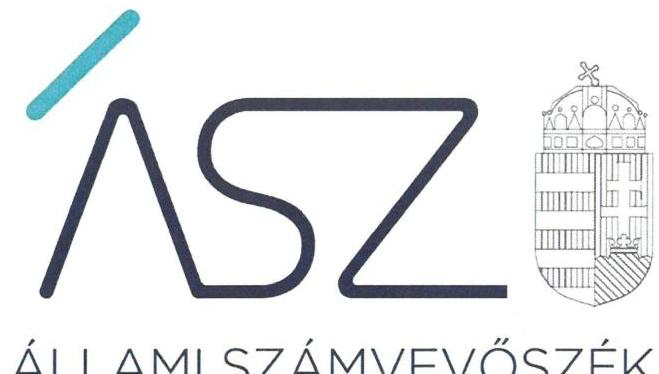
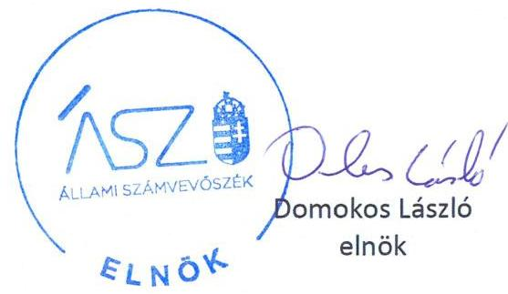
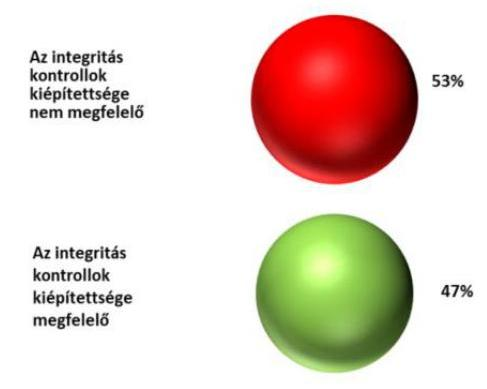
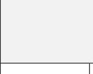

ÁLLAMI SZÁMVEVŐSZÉK

# JELENTÉS 

## Községi, nagyközségi önkormányzatok integritásának ellenőrzése

12 közös önkormányzati hivatal, valamint a közös hivatalokat múködtető 96 községi önkormányzat integritásának ellenőrzése
2020.

20199
www.asz.hu

---

ÁLLAMI SZÁMVEVŐSZÉK

# JELENTÉS

Községi, nagyközségi önkormányzatok integritásának ellenőrzése

12 közös önkormányzati hivatal, valamint a közös hivatalokat működtető 96 községi önkormányzat integritásának ellenőrzése

2020. 09. hó 25. nap

2019. www.asz.hu

---

# AZ ELLENŐRZÉST FELÜGYELTE: 

HOLMAN MAGDOLNA JULIANNA felügyeleti vezető
SALAMON ILDIKÓ felügyeleti vezető

AZ ELLENŐRZÉST VEZETTE ÉS A VÉGREHAJTÁSÁÉRT FELELŐS:
MAROZSÁN LÁSZLÓNÉ ellenőrzésvezető
DR. CSERNYÁK SZABOLCS ellenőrzésvezető
DR. TÓTH VIKTÓRIA ellenőrzésvezető
DR. DOMOKOS MAGDOLNA ellenőrzésvezető

A PROGRAM ÖSSZEÁLLÍTÁSÁÉRT FELELŐS:
SALAMON ILDIKÓ tervezési vezető

Jelentéseink az Országgyúlés számítógépes hálózatán és az interneten a www.asz.hu címen is olvashatóak.

IKTATÓSZÁM: EL-2917-001/2020.
TÉMASZÁM: 2485
ELLENŐRZÉS-AZONOSÍTÓ SZÁM: V0829222-V0829329

---

# TARTALOMJEGYZÉK 

■ ÖSSZEGZÉS ..... 5
■ AZ ELLENŐRZÉS CÉLJA ..... 8
■ AZ ELLENŐRZÉS TERÜLETE ..... 9
■ AZ ELLENŐRZÉS HÁTTERE, INDOKOLTSÁGA ..... 10
■ A JELENTÉS LÉNYEGES KÉRDÉSKÖREI ..... 11
■ AZ ELLENŐRZÉS HATÓKÖRE ÉS MÓDSZEREI ..... 12
■ MEGÁLLAPÍTÁSOK ..... 14
■ MELLÉKLETEK ..... 25
I. sz. melléklet: Értelmező szótár ..... 25
II. sz. melléklet: Ellenőrzött közös önkormányzati hivatalok és önkormányzatok ..... 27
III. sz. melléklet: Összefoglaló az önkormányzatok alapvető integritási kontrolljának értékeléséről ..... 29
IV. sz. melléklet: Intézkedést igénylő megállapítások ..... 33
■ FÜGGELÉK: ÉSZREVÉTELEK ..... 35
■ RÖVIDÍTÉSEK JEGYZÉKE ..... 45

---

.

---

# ÖSSZEGZÉS 

Az Állami Számvevőszék a nyolc önkormányzat alkotta összesen 12 közös önkormányzati hivatal és a hozzájuk tartozó, összesen 96 községi önkormányzat integritási kontrolljainak kialakítását ellenőrizte. A 12 közös önkormányzati hivatal háromnegyedénél, továbbá az őket müködtető 96 önkormányzat mintegy felénél nem volt biztositott a jogszabályok által elöirt alapvető integritáskontrollok kiépitése, ezáltal a feladatellátásuk és a döntéshozataluk során nem voltak védettek a korrupcióval szemben.

## Az ellenőrzés társadalmi indokoltsága

Az állampolgárok számára számos közszolgáltatást, hatósági tevékenységet települési önkormányzataik nyújtanak, ezért nélkülözhetetlen, hogy az önkormányzatok döntéshozatali folyamatai a korrupciós kockázatoktól védettek legyenek, továbbá, hogy az önkormányzati szervezeti célok érvényesülését megfelelő etikai rendszer is biztosítsa. Az ÁSZ ${ }^{1}$ Integritás felméréseiben az önkormányzatokat általában is kockázatosabb intézménycsoportként azonosította be. A kisebb méretű települési önkormányzatok integritása fokozottan veszélyeztetett, mert kontrollkörnyezetük, integritási infrastruktúrájuk - az ÁSZ Integritás felmérésének eredményei alapján is - kevésbé kiépített.

Az ÁSZ ellenőrzése rámutat a kisebb méretű, közös önkormányzati hivatalt működtető községi önkormányzatok integritási kontrolljainak gyenge pontjaira, hogy ezáltal a kontrollok kiépítettsége javuljon, az önkormányzatok integritási veszélyeztetettsége középtávon csökkenjen.

## Értékelések, következtetések

Az önkormányzatok és közös önkormányzati hivatalok szabályos, átlátható és elszámoltatható működésének alapvető feltétele, hogy a képviselő-testületek és az önkormányzati hivatalok rendelkezzenek a jogszabályban előírt tartalmú szervezeti és működési szabályzattal, amely alapvető integritási kontrollként rögzíti a felelősségi viszonyokat, a működés és a feladatellátás részletes belső rendjét és módját, továbbá az önkormányzati képviselő-testület tagjainak és az önkormányzati hivatal köztisztviselőinek a vagyonnyilatkozat tételéhez szükséges alapvető szabályozási kereteit, követelményét. Az önkormányzat képviselő testületének szervezeti és működési szabályzata rögzíti többek között a képviselő-testület üléseinek rendjét, a döntéshozatal részletes szabályait, az önkormányzat szerveinek jogállását, feladat és hatásköreit, valamint az önkormányzati képviselökre vonatkozó magatartási szabályokat.

A nyolc községi önkormányzat által alkotott összesen 12 közös önkormányzati hivatalhoz tartozó összesen 96 önkormányzat 47\%-ánál a képviselő-testület nem rendelkezett szervezeti és müködési szabályzattal az ellenőrzött teljes időszakban. Az önkormányzatok 53\%-ánál nem határozták meg a vagyonnyilatkozat-tételre kötelezettek körét.

A feladatellátás és a döntéshozatal részletes belső rendjét, módját és felelősségi viszonyokat, továbbá a vagyongyarapodás ellenőrzéséhez szükséges követelményeket rögzítő szervezeti és működési keretek szabályszerű kialakítása hiányában az önkormányzatok 53\%-ánál nem volt biztosított a teljes 2018. évben a szabályos, átlátható és elszámoltatható müködés alapvető feltétele, ezáltal az önkormányzatok közpénzfelhasználása során a korrupció elleni védelme sem.

1. ábra: A jogszabály által előírt, alapvető integritás kontrollok kiépítettsége az ellenőrzött önkormányzatok arányában

---

A közös önkormányzati hivatalok vonatkozásában a korrupciós kockázatok elleni védelemhez szükséges, jogszabály által előírt alapvető integritási kontrollok megfelelő kiépítettségét a szervezeti és működési szabályok, továbbá a szervezeti integritást sértő események kezelésének és az integrált kockázatkezelés eljárásrendjének a szabályszerű kialakítása szolgálja.

A közös önkormányzati hivatal szervezeti és működési szabályzata a jogszabályban előírt tartalomnak megfelelően kell, hogy rögzítse a működés és a feladatellátás részletes belső rendjét és módját, a felelősségi viszonyokat, így többek között a közös önkormányzati hivatal szervezeti felépítésének és működési rendjének kereteit, a hivatal szervezeti egységeit, a hivatali szervezetben a nevesített munkakörökhöz tartozó feladat és hatásköröket, a helyettesítés rendjét, a vagyonnyilatkozat tételére kötelezett köztisztviselők körét.

A 12 közös önkormányzati hivatal egyharmada nem rendelkezett szabályszerű szervezeti és működési szabályzattal a teljes ellenőrzött időszakban. A feladatellátás részletes belső rendjét, módját és felelősségi viszonyokat rögzítő szervezeti és működési keretek szabályszerű kialakítása hiányában az érintett közös önkormányzati hivatalok jegyzői nem biztosították a szabályos, átlátható és elszámoltatható működés alapvető feltételeit, ezáltal a közös önkormányzati hivatalok korrupció elleni védelme sem volt biztosított a közpénzfelhasználásuk és a nemzeti vagyonnal való gazdálkodásuk során.

A közös önkormányzati hivatalnál a szervezeti integritást sértő események kezelésének eljárásrendje biztosítja az integritási kontrollok kiépítettsége szempontjából alapvető szabályozási keretet az önkormányzati hivatalt érintő integritást sértő események kezelése vonatkozásában a felmerülő korrupciós kockázatok mérsékléséhez.

A 12 közös önkormányzati hivatal kétharmadánál a közös önkormányzati hivatal jegyzője nem szabályozta a szervezeti integritást sértő események kezelésének eljárásrendjét a teljes ellenőrzött időszakban. Ezáltal nem biztosították az integritást sértő események kezeléséhez a korrupciós kockázatokat mérséklő kontrollok megfelelő kiépítését.

Az integrált kockázatkezelés eljárásrend biztosítja az integritási kontrollok kiépítettsége szempontjából alapvető szabályozási keretet az önkormányzati hivatalt érintő integritási és korrupciós kockázatok azonosításához, kezeléséhez és mérsékléséhez.

A 12 közös önkormányzati hivatal felénél a jegyző nem szabályozta az integrált kockázatkezelés eljárásrendjét az ellenőrzött időszakban. Mivel az érintett közös önkormányzati hivatal jegyzője nem határozta meg a közös önkormányzati hivatal működéséhez kapcsolódó korrupciós kockázatok kezelésének kereteit, továbbá a működésében felmerülő kockázatos területeket, folyamatokat a szervezet minden tevékenységére kiterjedően, következésképpen nem tette meg a szükséges intézkedéseket a korrupciós kockázatok mérséklésére. Az elkészített eljárásrendek minden közös önkormányzati hivatalnál megfeleltek a jogszabályi előírásnak.

A 12 közös önkormányzati hivatal negyedénél biztosították a jegyzők, a jogszabály által előírt alapvető integritási kontrollok megfelelő kiépítését, mivel az ellenőrzött időszak egészére vonatkozóan szabályszerűen megteremtették az önkormányzati hivatal korrupció elleni védelméhez szükséges alapvető szervezeti és működési kereteket. Biztosították továbbá a szervezeti integritást sértő események kezeléséhez a korrupciós kockázatokat mérséklő kontrollok szabályszerű kiépítését és a meghatározták a szervezet minden tevékenységére kiterjedően a korrupciós kockázatok kezelésére vonatkozó szabályokat.

Ezeknél a hivataloknál a jogszabály által előírt alapvető integritási kontrollok megfelelő kiépítésén túl további lépéseket tettek az integritási elvek érvényesítése érdekében további kontrollok kiépítésére. Ennek keretében a jegyzők gondoskodtak arról, hogy az etikai elvárások az önkormányzati hivatali szervezet minden szintjén meghatározásra kerüljenek, továbbá gondoskodtak a panasz és közérdekű bejelentések kezelő rendszerének működtetéséhez szükséges integritási kontrollok kiépítéséről. Főszabályként előírták továbbá a közös hivatal beszerzési szabályzatában a közbeszerzési értékhatár alatti beszerzések esetén a legalább három ajánlat bekérését. Az érintett közös önkormányzati hivatalok jegyzői ezáltal gondoskodtak a beszerzések integritási kockázatainak mérsékléséről, valamint hozzájárultak ezzel a közös önkormányzati hivatalok közpénzekkel, nemzeti vagyonnal való gazdálkodása során az átláthatóság és a közbizalom erősítéséhez.

---

Az ellenőrzés megállapította, hogy a 96 önkormányzat mintegy felénél és az általuk múködtetett 12 közös önkormányzati hivatal háromnegyedénél a szervezeti integritás és az elszámoltathatóság alapvető követelményei nem teljesültek, az ellenőrzés során értékelt integritáskontrollok nem biztosították az ellenőrzött önkormányzatok és közös önkormányzati hivatalok jelentős részének a védelmét a korrupciós kockázatokkal szemben.

A III. melléklet az alapvető integritási kontroll kialakításának az összegző értékelését mutatja be a 96 községi önkormányzat vonatkozásában.

Az egyes önkormányzatok, közös önkormányzati hivatalok integritásának értékeléséből adódóan megfogalmazott azon megállapításoknak az összesítését, amelyek az ellenőrzött szervezetek részéről további intézkedést igényelnek, a IV. melléklet tartalmazza.

---

# AZ ELLENŐRZÉS CÉLJA 

AZ ELLENŐRZÉS CÉLJA annak értékelése volt, hogy az ellenőrzött szervezetek a feladatellátásuk nyomán jelentkező integritási kockázatokat megfelelően felmérték-e, a kockázatokat mérséklő integritáskontrollokat kiépítették-e, és a kontrolleszközök kiterjedtek-e a kockázatos folyamatokra, területekre.

---

# **AZ ELLENŐRZÉS TERÜLETE**

## **Közös hivatallal rendelkező községi önkormányzatok**

A községi önkormányzatok integritásának ellenőrzése a 8 önkormányzat által alapított, összesen 12 önkormányzati hivatalra és a közös önkormányzati hivatalt működtető valamennyi, összesen 96 községi önkormányzatra terjedt ki. Az önkormányzatok jellemző adatait az 1. táblázat mutatja.

A települések állandó lakosainak átlagos száma 2018. évben 393 fő volt. Az önkormányzatok képviselő-testülete átlagosan 5 főből állt, az önkormányzatok bizottságai nem önkormányzati képviselő taggal jellemzően nem rendelkeztek.

Az önkormányzatok összevont költségvetési beszámoló szerint teljesített 2018. évi költségvetési bevételeinek átlagos összege 136 587 ezer Ft, költségvetési kiadásainak átlagos öszszege 113 927 ezer Ft, a 2018. évi könyvviteli mérleg szerinti vagyon átlagos értéke 421 050 ezer Ft volt.

1. táblázat

|  AZ ELLENŐRZÖTT ÖNKORMÁNYZATOK JELLEMZŐ ADATAI |  |   |
| --- | --- | --- |
|  Mégnevezés | maximum érték | minimum érték  |
|  Állandó lakosok száma (2018. december 31.), fő | 1 643 | 27  |
|  Képviselő-testület tagjainak száma (2018. december 31.), fő | 7 | 2  |
|  Állandó bizottságok száma, darab | 3 | 0  |
|  A bizottságok nem önkormányzati képviselő tagjainak száma (2018. december 31.), fő | 2 | 0  |
|  Az önkormányzatok összevont költségvetési beszámoló szerint teljesített évi költségvetési bevételei (2018), ezer Ft | 707 005 | 21 879  |
|  Az önkormányzatok összevont költségvetési beszámoló szerint teljesített évi költségvetési kiadásai (2018), ezer Ft | 509 017 | 17 091  |
|  A könyvviteli mérleg szerinti vagyon (2018), ezer Ft | 3 048 585 | 32 438  |

*Forrás: Ellenőrzött önkormányzatok által szolgáltatott adatok*

---

# AZ ELLENŐRZÉS HÁTTERE, INDOKOLTSÁGA 

Az ÁSZ önálló integritási ellenőrzési módszertana a kontrollok kiépítettségén túl, azok kiterjedését is értékelte a kockázatos folyamatokra, valamint olyan integritási eszközöket is ellenőrzött, amelyeket nemzetközi jó gyakorlatok alapoznak meg.

Az ÁSZ ellenőrzése rámutat a kisebb méretű, önálló hivatallal rendelkező, illetve közös önkormányzati hivatalt működtető községi önkormányzatok integritási kontrolljainak gyenge pontjaira, hogy ezáltal a kontrollok kiépítettsége javuljon, az önkormányzatok integritási veszélyeztetettsége középtávon csökkenjen.

Az ellenőrzés várható hasznosulása több szinten valósul meg. Az ellenőrzés az ellenőrzöttek számára visszajelzést ad az integritás kontrollok kialakításáról, illetve azok hiányosságairól, javaslataival hozzájárul az integritás megerősítéséhez. Az ellenőrzések megállapításait más önkormányzatok is hasznosíthatják a megfelelő integritás környezet kialakításához. A társadalom számára az ellenőrzések visszajelzést adnak az önkormányzatok integritásáról. Az ellenőrzések átláthatóvá teszik az ellenőrzöttek integritási mechanizmusainak múködését.

---

# A JELENTÉS LÉNYEGES KÉRDÉSKÖREI 

1. Megfelelő-e az ellenőrzött önkormányzatoknál az alapvető integritási kontrollok kiépitettsége?
2. Megfelelő-e az ellenőrzött közös önkormányzati hivataloknál az alapvető integritási kontrollok kiépitettsége?

---

# AZ ELLENŐRZÉS HATÓKÖRE ÉS MÓDSZEREI 

## Az ellenőrzés típusa

Megfelelőségi ellenőrzés.

## Az ellenőrzött időszak

2018. év

## Az ellenőrzés tárgya

Az ellenőrzött önkormányzatok és közös önkormányzati hivatalok integritási kontrolljainak kiépítettsége, a kontroll eszközök kiterjedése a kockázatos folyamatokra, területekre.

## Az ellenőrzött szervezet

A 8 önkormányzat által közös önkormányzati hivatalt alapító összesen 96 községi önkormányzat, valamint a gazdálkodási feladataikat ellátó 12 közös önkormányzati hivatal.

Az ellenőrzött szervezeteket a II. melléklet tartalmazza.

## Az ellenőrzés jogalapja

Az ÁSZ törvény² 1. § (3) bekezdésének megfelelően az ÁSZ általános hatáskörrel végzi a közpénzekkel és az állami és önkormányzati vagyonnal való felelős gazdálkodás ellenőrzését. Az ÁSZ törvény 5. § (6) bekezdése alapján ellenőrzése során értékeli a belső kontrollrendszer múködését.

## Az ellenőrzés módszerei

Az ellenőrzést a nemzetközi standardokat irányadónak tekintve, az ellenőrzési program szempontjai, kérdései, az ellenőrzött időszakban hatályos jogszabályok, az ellenőrzés szakmai szabályok és módszertanok figyelembevételével végezte az ÁSZ. Az ellenőrzés ideje alatt az ellenőrzött szervezetekkel történő kapcsolattartás az ÁSZ SZMSZ ${ }^{5}$-ének vonatkozó előírásai alapján volt biztosított. Az ellenőrzési kérdések megválaszolásához szükséges bizonyítékok megszerzése az ellenőrzöttek által rendelkezésre bocsátott dokumentumokra, adatokra, valamint az általuk közzétett honlapon fellelhető információkra alapozva megfigyelés, szemle (szemrevételezés)

---

kérdésfeltevés (információkérés), valamint elemző eljárással történt. Az ellenőrzési bizonyítékként felhasználható adatforrások közé az ellenőrzési program részletes szempontjainál felsorolt adatforrások tartoztak.

Az ellenőrzés lefolytatásához az önkormányzatok és közös önkormányzati hivatalok az ÁSZ által kért dokumentumok elektronikus megküldésével szolgáltattak adatokat. A rendelkezésre bocsátott adatok, információk kontrollja az ellenőrzés keretében történt meg.

Helyénvalósági kritériumok alapján azokat az ellenőrzési kérdéseket értékelte az ÁSZ, amelyek esetében nem állt rendelkezésre jogszabályi előírás, ugyanakkor a megfelelő integritás kontrollok kialakítása érdekében szükséges a kérdés közös önkormányzati hivatalok általi kezelése. A meghatározott helyénvalósági kritériumokat olyan „jó gyakorlatok" beazonosításával alapozta meg az ÁSZ, amelyek nemzetközi és hazai sztenderdekben, útmutatókban található iránymutatások, követelmények, meghatározások.

Az ellenőrzés során az önkormányzatok és a közös önkormányzati hivatalok integritás kontrolljai kialakításának értékelése három szinten történt:
minden önkormányzat és közös önkormányzati hivatal vonatkozásában szabályszerűségi kritérium volt az integritás alapú szervezeti kultúra kialakításának előfeltételeként, a szabályszerű működés alapvető feltételeit meghatározó szervezeti és működési szabályzat jogszabályban előírt tartalomnak megfelelő megléte;
minden közös önkormányzati hivatal vonatkozásában szabályszerűségi kritérium volt az integritási kontrollok kiépítése szempontjából alapvető szabályzatok - a szervezeti integritást sértő események kezelésének, valamint az integrált kockázatkezelés eljárásrendjének jogszabályban előírt tartalomnak megfelelő megléte;
a jogszabályok által előírt alapvető integritási kontrollokat kialakító közös önkormányzati hivatal vonatkozásában a számvevőszéki ellenőrzés helyénvalósági kritériumként értékelte az etikai elvárások meghatározását, továbbá a közbeszerzési értékhatárt el nem érő beszerzésekre vonatkozóan legalább három ajánlat bekéréséről rendelkező szabályzat, valamint a közérdekű bejelentések és panaszok kezelésére vonatkozó szabályozás meglétét.

---

# 1. Megfelelő-e az ellenőrzött önkormányzatoknál az alapvető integritási kontrollok kiépítettsége? 

Összegző megállapítás

Az ellenőrzött 96 önkormányzat közül 51 önkormányzatnál nem biztosították az alapvető integritási kontrollok kiépítését a szabályszerű szervezeti és múködési keretek kialakításának hiányában a 2018-évben.

Az ellenőrzött 96 önkormányzat közül 21 önkormányzat képviselő-testülete az Mötv. 53. § (1) bekezdésében foglaltak ellenére nem rendelkezett SZMSZ-szel a 2018. évben. További 24 önkormányzat csak a 2018. év egy részében rendelkezett SZMSZ-szel.

A Vnytv4. 4. § d) pontjában előírtak ellenére 51 önkormányzatnál nem került meghatározásra az önkormányzatnál vagyonnyilatkozat-tételre kötelezettek köre, mivel vagy nem rendelkeztek SZMSZ-szel vagy az SZMSZek nem tartalmazták az erre vonatkozó szabályozást. Ezáltal a korrupció elleni védelem biztosításához szükséges alapvető követelmények kialakítása nem történt meg.

51 önkormányzat képviselő-testülete rendelkezett a teljes 2018. évben az Mötv. ${ }^{5}$ előírásainak megfelelően a múködés és a feladatellátás részletes belső rendjét és módját, a felelőségi viszonyokat rögzítő SZMSZ6-szel.

A szabályszerű SZMSZ-szel rendelkező önkormányzatok megteremtették a közpénzfelhasználás és a nemzeti vagyonnal való gazdálkodás korrupció elleni védelméhez szükséges alapvető szervezeti kereteket, illetve biztosították a szabályos, átlátható múködés alapvető feltételeit.

---

Az ellenőrzött időszakban SZMSZ-szel nem rendelkező önkormányzatok a 2. táblázat mutatja be.
2. táblázat

# A 2018. ÉVRE VONATKOZÓAN SZMSZ-SZEL NEM RENDELKEZŐ ÖNKORMÁNYZATOK 

| Sorszám | Önkormányzat megnevezése | Az önkormányzat SZMSZ-szel nem rendelkezett |
| :--: | :--: | :--: |
| 1. | Irota Község Önkormányzata | 2018. év |
| 2. | Krasznokvajda Község Önkormányzata | 2018. 01.01-06.12. között |
| 3. | Büttös Község Önkormányzata | 2018. 01.01-06.13 között |
| 4. | Csenyéte Község Önkormányzata | 2018. 01.01-06.14. között |
| 5. | Felsőgagy Község Önkormányzata | 2018. 01.01-06.14. között |
| 6. | Gagyapáti Község Önkormányzata | 2018. 01.01-06.13. között |
| 7. | Keresztéte Község Önkormányzata | 2018. 01.01-06.16. között |
| 8. | Kány Község Önkormányzata | 2018. 01.01-06.13. között |
| 9. | Perecse Község Önkormányzata | 2018. 01.01-06.13. között |
| 10. | Mikóháza Községi Önkormányzat | 2018. 01.01-05.02. között |
| 11. | Alsóberecki Község Önkormányzata | 2018. 01.01-08.14 között |
| 12. | Alsóregmec Község Önkormányzata | 2018. 01.01-04.27. között |
| 13. | Felsőberecki Község Önkormányzata | 2018. 01.01-05.31. között |
| 14. | Füzér Község Önkormányzata | 2018. 01.01-03.20. között |
| 15. | Hollóháza Község Önkormányzata | 2018. 01.01-05.31. között |
| 16. | Pusztafalu Község Önkormányzata | 2018. 01.01-05.31. között |
| 17. | Vilyvitány Község Önkormányzata | 2018. 01.01-04.27. között |
| 18. | Szalaszend Község Önkormányzata | 2018. 01.01-03.02. között |
| 19. | Alsógagy Község Önkormányzata | 2018. 01.01-02.22. között |
| 20. | Baktakék Községi Önkormányzat | 2018. 01.01-05.12. között |
| 21. | Beret Község Önkormányzata | 2018. 01.01-02.27. között |
| 22. | Detek Község Önkormányzata | 2018. 01.01-03.01. között |
| 23. | Fáj Községi Önkormányzat | 2018. 01.01-03.01. között |
| 24. | Litka Község Önkormányzata | 2018. 01.01-03.01. között |
| 25. | Szemere Község Önkormányzata | 2018. 01.01-02.28. között |
| 26. | Kőszegdoroszló Község Önkormányzata | 2018. év |
| 27. | Zánka Község Önkormányzata | 2018. év |
| 28. | Balatoncsicsó Község Önkormányzata | 2018. év |
| 29. | Monoszló Község Önkormányzata | 2018. év |
| 30. | Szentantalfa Község Önkormányzata | 2018. év |
| 31. | Szentjakabfa Község Önkormányzata | 2018. év |
| 32. | Tagyon Község Önkormányzata | 2018. év |
| 33. | Öbudavár Község Önkormányzata | 2018. év |
| 34. | Baktüttös Község Önkormányzata | 2018. év |
| 35. | Pusztaederics Község Önkormányzata | 2018. év |
| 36. | Szentkozmadombja Község Önkormányzata | 2018. év |
| 37. | Tófej Község Önkormányzata | 2018. év |
| 38. | Zalatárnok Község Önkormányzata | 2018. év |
| 39. | Borsodszirák Község Önkormányzata | 2018. év |
| 40. | Damak Község Önkormányzata | 2018. év |
| 41. | Hangács Község Önkormányzata | 2018. év |
| 42. | Lak Községi Önkormányzat | 2018. év |
| 43. | Nyomár Község Önkormányzata | 2018. év |
| 44. | Tomor Község Önkormányzata | 2018. év |
| 45. | Hegymeg Község Önkormányzata | 2018. év |

---

# 2. Megfelelő-e az ellenőrzött közös önkormányzati hivataloknál az alapvető integritási kontrollok kiépítettsége? 

Összegző megállapítás

Az ellenőrzött 12 közös önkormányzati hivatal közül 9 önkormányzati hivatalnál nem biztosították a jogszabályokban előírt alapvető integritás kontrollok szabályszerű kiépítését a 2018. évben.

Négy közös önkormányzati hivatalnál nem alakították ki a szabályos, átlátható és elszámoltatható múködés alapvető feltételeit.

Az ellenőrzött 12 közös önkormányzati hivatal közül egy közös önkormányzati hivatal az Áht ${ }^{7}$. 10. § (5) bekezdésben foglaltak ellenére nem rendelkezett SZMSZ-szel a 2018. évre vonatkozóan, további egy hivatalnak 2018. május 23 -tól volt jóváhagyott SZMSZ-e. Ezeknél a közös önkormányzati hivataloknál a múködés és feladatellátás részletes belső rendje, módja és felelősségi viszonyok rögzítésének hiányában a szabályos, átlátható és elszámoltatható múködés alapvető feltételei hiányoztak.

További két közös önkormányzati hivatalnál a hivatali SZMSZ nem felelt meg a vonatkozó jogszabályi előírásoknak, mivel a jegyző többek között nem határozta meg az SZMSZ-ben a vagyonnyilatkozat tételre kötelezettek körét, ezáltal nem gondoskodott a korrupció elleni védelem, az átlátható múködés alapvető követelményeinek kialakításáról.

A 2018. évben az ellenőrzött 12 közös önkormányzati hivatal közül nyolc önkormányzati hivatalnál a jegyzők a korrupció elleni védelemhez szükséges alapvető szervezeti kereteket kialakították, a felelősségi viszonyokat meghatározták, ezáltal biztosították a szabályos, átlátható és elszámoltatható múködés alapvető feltételeit.

---

Az ellenőrzött 12 közös önkormányzati hivatal SZMSZ-ének kialakítására vonatkozó összesített értékelését a 3. táblázat mutatja be.
3. táblázat

# A KÖZÖS ÖNKORMÁNYZATI HIVATALOK ÉRTÉKELÉSE AZ SZMSZ KIALAKÍTÁSÁRA VONATKOZÓAN 

| Sor-   szám | Közös önkormányzati hivatal megnevezése | SZMSZ-szel nem rendelkezett | AzSZMSZ   nem volt szabályszert) | AzSZMSZ   szabályszert̂ volt |
| :--: | :--: | :--: | :--: | :--: |
| 1. | Erzsébeti Közös Önkormányzati Hivatal |  |  | $\checkmark$ |
| 2. | Királyegyházai Közös Önkormányzati Hivatal |  |  | $\checkmark$ |
| 3. | Újpetrei Közös Önkormányzati Hivatal | $\begin{gathered} 2018.01 .01 .-05 .22 . \\ \text { között } \end{gathered}$ |  | $\begin{gathered} 2018.05 .23 .-12 .31 . \\ \text { között } \end{gathered}$ |
| 4. | Borsodsziráki Közös Önkormányzati Hivatal | 2018. év |  |  |
| 5. | Kishutai Közös Önkormányzati Hivatal |  |  | $\checkmark$ |
| 6. | Krasznokvajdai Közös Önkormányzati Hivatal |  |  | $\checkmark$ |
| 7. | Mikóházai Közös Önkormányzati Hivatal |  |  | $\checkmark$ |
| 8. | Szalaszendi Közös Önkormányzati Hivatal |  | X |  |
| 9. | Lukácsházi Közös Önkormányzati Hivatal |  | X |  |
| 10. | Zánkai Közös Önkormányzati Hivatal |  | X |  |
| 11. | Baki Közös Önkormányzati Hivatal |  | X |  |
| 12. | Nagykapornaki Közös Önkormányzati Hivatal |  |  | $\checkmark$ |

Forrás: ÁszZ
Az ellenőrzött időszakban nem a jogszabálynak megfelelő tartalmú SZMSZ-szel múködött két közös önkormányzati hivatal, mely SZMSZ-eknek a tartalmi értékelését a 4. táblázat tartalmazza.
4. táblázat

Az SZMSZ-ben megsértett jogszabályhely

Ávr8. 13. § (1) bekezdés c) és e) pontjának és a Vnytv. 4. § a) pont előírásai

Áv. 13. § (1) bekezdés c) és e) pontjának és a Vnytv. 4. § a) pont előírásai

A 2018. évben nem a jogszabálynak megfelelő SZMSZ-szel rendelkező közös önkormányzati hivatalok SZMSZ-ének tartalmi értékelése

A Lukácsházi Közös Önkormányzati Hivatal SZMSZ-e az Ávr. előírásai ellenére nem tartalmazta a kormányzati funkció szerinti besorolt alaptevékenységek megjelölését, a közös önkormányzati hivatal szervezeti ábráját, a gazdasági szervezet megnevezését, továbbá a Vnytv. előirása ellenére a vagyonnyilatkozat-tételi kötelezettséggel járó munkaköröket abban nem határozták meg.

A Baki Közös Önkormányzati Hivatal SZMSZ-e az Ávr. előírásai ellenére nem tartalmazta a kormányzati funkció szerinti besorolt alaptevékenységek megjelölését, a gazdasági szervezet megnevezését, továbbá a Vnytv. előirása ellenére a vagyonnyilatkozat-tételi kötelezettséggel járó munkaköröket abban nem határozták meg.

Forrás: ÁszZ
2.2. számú megállapítás

## Nyolc közös önkormányzati hivatalnál a jegyzők nem biztosították a szervezeti integritást sértő események kezeléséhez a korrupciós kockázatokat mérséklő kontrollok szabályszerű kiépítését a teljes ellenőrzött időszakban.

Az ellenőrzött 12 közös önkormányzati hivatal közül öt önkormányzati hivatalnak a jegyzője nem szabályozta a Bkr ${ }^{9}$. 2016. október 1-jétől hatályos 6. § (4) és (4a) bekezdésének előírásai alapján a szervezeti integritást sértő események kezelésének eljárásrendjét a 2018. évre vonatkozóan. Három közös önkormányzati hivatalnál pedig a jegyzők év közben készítették el az eljárásrendeket.

A Bkr. által előírt eljárásrend hiányában az érintett közös önkormányzati hivatalok jegyzői a teljes ellenőrzött időszakban nem biztosították az integritást sértő események kezelése vonatkozásában a korrupciós kockázatokat mérséklő kontrollok kiépítéséhez az alapvető szabályozási kereteket.

---

Az ellenőrzött 12 közös önkormányzati hivatal közül négy önkormányzati hivatalnál a jegyzők - a Bkr. előírásainak megfelelő, szabályszerű eljárásrend biztosításával - kialakították a közös önkormányzati hivatal 2018. évi múködése során felmerülő korrupciós kockázatokat mérséklő kontrollok meghatározásához szükséges alapvető feltételeket. Az év közben elkészített eljárásrendek is megfeleltek a Bkr. előírásának

Az ellenőrzött 12 közös önkormányzati hivatal szervezeti integritást sértő események kezelésének eljárásrendje kialakítására vonatkozó összesített értékelését az 5. táblázat mutatja be.
5. táblázat

# A KÖZÖS ÖNKORMÁNYZATI HIVATALOK ÉRTÉKELÉSE A SZERVEZETI INTEGRITÁST SÉRTŐ ESEMÉNYEK KEZELÉSÉNEK ELJÁRÁSRENDJÉRE VONATKOZÓAN 

| Sor-   szám | Közös önkormányzati hivatal megnevezése | Az eljárásrenddel nem rendelkezett | Az eljárásrendje   szabályszeti) volt |
| :--: | :--: | :--: | :--: |
| 1. | Erzsébeti Közös Önkormányzati Hivatal | 2018. év |  |
| 2. | Királyegyházai Közös Önkormányzati Hivatal |  | $\checkmark$ |
| 3. | Újpetrei Közös Önkormányzati Hivatal | 2018. 01.01.-03.19. között | 2018. 03.20.-12.31. között |
| 4. | Borsodsziráki Közös Önkormányzati Hivatal | 2018. 01.01.-01.30. között | 2018. 02.01.-12.31. között |
| 5. | Kishutai Közös Önkormányzati Hivatal |  | $\checkmark$ |
| 6. | Krasznokvajdai Közös Önkormányzati Hivatal | 2018. év |  |
| 7. | Mikóházai Közös Önkormányzati Hivatal |  | $\checkmark$ |
| 8. | Szalaszendi Közös Önkormányzati Hivatal | 2018. év |  |
| 9. | Lukácsházi Közös Önkormányzati Hivatal | 2018. 01.01-08.31. között | 2018. 09.01-12.31. között |
| 10. | Zánkai Közös Önkormányzati Hivatal | 2018. év |  |
| 11. | Baki Közös Önkormányzati Hivatal |  | $\checkmark$ |
| 12. | Nagykapornaki Közös Önkormányzati Hivatal | 2018. év |  |

Forrás: ÁSZ
2.3. számú megállapítás

Hat közös önkormányzati hivatalnál a jegyző nem határozta meg a közös önkormányzati hivatal múködéséhez kapcsolódó kockázatok kezelésének kereteit a szervezet minden tevékenységére kiterjedően a teljes 2018. évre vonatkozóan.

Az ellenőrzött 12 közös önkormányzati hivatal közül négy közös önkormányzati hivatalnál a jegyző nem szabályozta a Bkr. 2016. október 1-jétől hatályos 6. § (4) bekezdésének előírása alapján az integrált kockázatkezelés eljárásrendjét a 2018. évre vonatkozóan. További két hivatalnál a jegyzők a 2018. év során készítették el a közös önkormányzati hivatalra vonatkozó eljárásrendet. Így a Bkr. által előírt integrált kockázatkezelési eljárásrend hiányában a közös önkormányzati hivatalok közül 6 hivatalnak a jegyzői nem azonosították be a közös önkormányzati hivatal múködésében felmerülő kockázatokat, folyamatokat, ezáltal a korrupciós kockázatok mérséklésére nem tették meg a szervezet minden tevékenységére kiterjedő szükséges intézkedést a teljes ellenőrzött időszakban.

Az integrált kockázatkezelési eljárásrendet az ellenőrzött időszakban szabályozó önkormányzati hivataloknál az eljárásrend kialakítása a Bkr. előírásának megfelelő volt.

A szabályszerű eljárásrenddel rendelkező közös önkormányzati hivataloknál a jegyzők a szervezet minden tevékenységére vonatkozóan meghatározták a közös önkormányzati hivatal múködéséhez kapcsolódóan a felmerülő korrupciós kockázatokat, kialakították a szükséges intézkedésekre

---

vonatkozó szabályokat, ezáltal biztosították a korrupciós kockázatok kezelésének az átláthatóságát a szervezet minden tevékenységében.

Az ellenőrzött 12 közös önkormányzati hivatal integrált kockázatkezelés eljárásrendjének kialakítására vonatkozó összesített értékelését az 6. táblázat mutatja be.
6. táblázat

# A KÖZÖS ÖNKORMÁNYZATI HIVATALOK ÉRTÉKELÉSE AZ INTEGRÁLT KOCKÁZATKEZELÉS ELJÁRÁSRENDJÉRE VONATKOZÓAN 

| Sör-   szám | Közös önkormányzati hivatal   megnevezése | Az eljárásrendjé   nem rendelkezett | Az eljárásrendje   szabályszertú volt |
| :--: | :--: | :--: | :--: |
| 1. | Erzsébeti Közös Önkormányzati Hivatal | 2018. év |  |
| 2. | Királyegyházai Közös Önkormányzati Hivatal |  | $\checkmark$ |
| 3. | Újpetrei Közös Önkormányzati Hivatal | 2018. év |  |
| 4. | Borsodsziráki Közös Önkormányzati Hivatal |  | $\checkmark$ |
| 5. | Kishutai Közös Önkormányzati Hivatal |  | $\checkmark$ |
| 6. | Krasznokvajdai Közös Önkormányzati Hivatal | 2018. év |  |
| 7. | Mikóházai Közös Önkormányzati Hivatal |  | $\checkmark$ |
| 8. | Szalaszendi Közös Önkormányzati Hivatal |  | $\checkmark$ |
| 9. | Lukácsházi Közös Önkormányzati Hivatal | 2018. 01.01.-08.31. között | 2018. 09.01.-12.31. között |
| 10. | Zánkai Közös Önkormányzati Hivatal | 2018. év |  |
| 11. | Baki Közös Önkormányzati Hivatal | 2018.01.01. -06.30. között | 2018. 07.01.-12.31. között |
| 12. | Nagykapornaki Közös Önkormányzati Hivatal |  | $\checkmark$ |

## 2.4. számú megállapítás

Három közös önkormányzati hivatalnál biztosították a jegyző́k a jogszabály által előírt alapvető integritási kontrollok kiépítését, valamint gondoskodtak az integritási elvek érvényesítése érdekében további kontrollok kiépítéséről.

Az ellenőrzött 12 közös önkormányzati hivatal közül három önkormányzati hivatalnál a jegyző́k biztosították a jogszabály által előírt alapvető integritási kontrollok megfelelő kiépítését, mivel a közös önkormányzati hivatalok rendelkeztek az ellenőrzött időszak egészére vonatkozóan szabályszerű SZMSZ-szel, továbbá az ellenőrzött időszakban hatályos Bkr.-nek megfelelő szervezeti integritást sértő események kezelésének, valamint integrált kockázatkezelés eljárásrendjével. Ezáltal a közös önkormányzati hivatalok jegyzői az ellenőrzött időszak egészére vonatkozóan megteremtették az önkormányzati hivatalok korrupció elleni védelméhez szükséges alapvető szervezeti és múködési kereteket, valamint biztosították a szervezeti integritást sértő események kezeléséhez a korrupciós kockázatokat mérséklő kontrollok szabályszerű kiépítését, továbbá a szervezet minden tevékenységére kiterjedően meghatározták a korrupciós kockázatok kezelésére vonatkozó szabályokat.

Az érintett közös önkormányzati hivatalok jegyzői a jogszabály által előírt alapvető integritási kontrollok megfelelő kiépítésén túl gondoskodtak az integritási elvek érvényesítése érdekében további kontrollok kiépítéséről:
$\longrightarrow$ meghatározták az etikai elvárásokat az önkormányzati hivatali szervezet minden szintjén,
$\longrightarrow$ kiépítették a panasz és közérdekú bejelentéseket kezelő rendszerek múködtetéséhez szükséges integritási kontrollokat,
$\longrightarrow$ a közös önkormányzati hivatal beszerzési szabályzatában főszabályként előírták a közbeszerzési értékhatár alatti beszerzések esetén a

---

legalább három ajánlat bekérését, így gondoskodtak a közpénzfelhasználás és a nemzeti vagyonnal való gazdálkodás során a beszerzések integritási kockázatainak mérsékléséről.
Az ellenőrzött időszakban az alapvető integritás kontrollok kiépítését biztosító közös önkormányzati hivatalokat a 7. táblázat mutatja be.
7. táblázat

# A 2018. ÉVBEN AZ ALAPVETŐ INTEGRITÁS KONTROLLOK KIÉPÍTÉSÉT BIZTOSÍTÓ KÖZÖS ÖNKORMÁNYZATI HIVATALOK 

| Sorszám | Közös önkormányzati hivatal megnevezése | A közös önkormányzati hivatal jegyzője biztosította a jogszabály által előírt alapvető integritás-kontrollok kiépítését | A közös önkormányzati hivatal jegyzője gondoskodott az integritás elvek érvényesítése érdekében további kontrollok kiépítéséről |
| :--: | :--: | :--: | :--: |
| 1. | Királyegyházai Közös Önkormányzati Hivatal | $\checkmark$ | $\checkmark$ |
| 2. | Kishutai Közös Önkormányzati Hivatal | $\checkmark$ | $\checkmark$ |
| 3. | Mikóházai Közös Önkormányzati Hivatal | $\checkmark$ | $\checkmark$ |

---

# JAVASLATOK 

Az ÁSZ tv. 33. § (1) bekezdésében foglaltak értelmében az ellenőrzött szervezet vezetője köteles a jelentésben foglalt megállapításokhoz kapcsolódó intézkedési tervet összeállítani és azt a jelentés kézhezvételétől számított 30 napon belül az ÁSZ részére megküldeni. Amennyiben az ellenőrzött szervezet vezetője nem küldi meg határidőben az intézkedési tervet, vagy továbbra sem elfogadható intézkedési tervet küld, az Állami Számvevőszék elnöke az ÁSZ tv. 33. § (3) bekezdése a) és b) pontjaiban foglaltakat érvényesítheti.

| Irota Község Önkormányzata | Kőszegdoroszló Község Önkormányzata | Balatoncsicsó Község Önkormányzata |
| :--: | :--: | :--: |
| Szentkozmadombja Község Önkormányzata | Zánka Község Önkormányzata | Monoszló Község Önkormányzata |
| Tófej Község Önkormányzata | Öbudavár Község Önkormányzata | Szentantalfa Község Önkormányzata |
| Borsodszirák Község Önkormányzata | Damak Község Önkormányzata | Hangács Község Önkormányzata |
| Zalatárnok Község Önkormányzata | Baktüttös Község Önkormányzata | Szentjakabfa Község Önkormányzata |
| Hegymeg Község Önkormányzata | Lak Községi Önkormányzat | Nyomár Község Önkormányzata |
| Tagyon Község Önkormányzata | Pusztaederics Község Önkormányzata | Tomor Község Önkormányzata |
| polgármesterének |  |  |

1. Intézkedjen, hogy az önkormányzat képviselő-testülete a jogszabályi előírásoknak megfelelően rendelkezzen a müködésének részletes szabályait meghatározó szervezeti és müködési szabályzattal.
(IV. számú melléklet 3. pontja alapján)

---

| Mikóháza Községi Önkormányzat | Alsóberecki Községi Önkormányzata | Alsóregmec Községi Önkormányzata |
| :--: | :--: | :--: |
| Felsőberecki Községi Önkormányzata | Hollóháza Községi Önkormányzata | Pusztafalu Község Önkormányzata |
| Vilyvitány Község Önkormányzata | Litka Község Önkormányzata | Újpetre Község Önkormányzata |
| Ivánbattyán Község Önkormányzata | Kiskassa Község Önkormányzata | Palkonya Község Önkormányzata |
| Peterd Község Önkormányzata | Pécsdevecser Község Önkormányzata | - |
| polgármesterének |  |  |

1. Intézkedjen, hogy az önkormányzat képviselő-testületének szervezeti és müködési szabályzatában a törvényi előirásoknak megfelelően meghatározásra kerüljön a vagyonnyilatkozat tételre kötelezettek köre.
(IV. számú melléklet 4. pontja alapján)

| Borsodsziráki Közös Önkormányzati Hivatal | - | - |
| :--: | :--: | :--: |
| közös önkormányzati hivatala jegyzőjének |  |  |

1. Intézkedjen, annak érdekében, hogy a jogszabályi elöírásoknak megfelelően az önkormányzati közös hivatal rendelkezzen szervezeti és müködési szabályzattal.
(IV. számú melléklet 1. pontja alapján)

| Lukácsházi Közös Önkormányzati Hivatal | Baki Közös Önkormányzati Hiva-   tal | - |
| :--: | :--: | :--: |
| közös önkormányzati hivatala jegyzőjének |  |  |

1. Intézkedjen, hogy a közös hivatal szervezeti és müködési szabályzata feleljen meg a jogszabályi elöírásoknak.
(IV. számú melléklet 2. pontja alapján)

---

| Erzsébeti Közös Önkormányzati   Hivatal | Krasznokvajdai Közös Önkor-   mányzati Hivatal | Zánkai Közös Önkormányzati Hi-   vatal |
| :--: | :--: | :--: |
| Nagykapornaki Közös Önkor-   mányzati Hivatal | Szalaszendi Közös Önkormány-   zati Hivatal | - |
| közös önkormányzati hivatala jegyzőjének |  |  |

1. Intézkedjen a Bkr. elöírásai szerint a szervezeti integritást sértő események kezelésének eljárásrendje szabályozásáról.
(IV. számú melléklet 5. pontja alapján)

| Erzsébeti Közös Önkormányzati   Hivatal | Krasznokvajdai Közös Önkor-   mányzati Hivatal | Zánkai Közös Önkormányzati Hi-   vatal |
| :--: | :--: | :--: |
| Újpetrei Közös Önkormányzati   Hivatal | - | - |
| közös önkormányzati hivatala jegyzőjének |  |  |

1. Intézkedjen a Bkr. elöírásai szerint az integrált kockázatkezelés eljárásrendjének szabályozásáról.
(IV. számú melléklet 6. pontja alapján)

---

.

---

# MELLÉKLETEK 

## I. SZ. MELLÉKLET: ÉRTELMEZŐ SZÓTÁR

Etikai, erkölcsi

Helyi önkormányzat

Integritás

Integritási kockázatok

Integrált Kockázatkezelési rendszer

Költségvetési szerv vezetője

A társadalom szempontjából helyesnek tartott emberi, vagy valamely hivatásrendhez kötődő magatartást, cselekedeteket meghatározó, jogon kívüli normák összessége.
A helyi önkormányzat jogi személy. Az önkormányzati feladatok ellátását a képvi-selő-testület és szervei biztosítják. A képviselő-testület szervei: a polgármester, a főpolgármester, a megyei közgyűlés elnöke, a képviselő-testület bizottságai, a részönkormányzat testülete, az önkormányzati hivatal, a megyei önkormányzati hivatal, a közös önkormányzati hivatal, a jegyző, továbbá a társulás. A képviselő-testület feladatkörébe tartozó közszolgáltatások ellátására - jogszabályban meghatározottak szerint - költségvetési szervet, a polgári rendtartásról szóló törvény szerinti gazdálkodó szervezetet, nonprofit szervezetet és egyéb szervezetet alapíthat, továbbá szerződést köthet természetes és jogi személlyel vagy jogi személységgel nem rendelkező szervezettel. (Forrás: Mötv. 41. § (1), (2), (6) bekezdései)
Az integritás egy személy vagy szervezet azon minőségi ismérve, jellemzője, amely a szervezet vagy a társadalom tagjai által elfogadott morális értékek, standardok és szabályok szerinti cselekvés/működés minőségére utal. A jogalkotó az integritás nemzetközileg elfogadott definícióit figyelembe véve létrehozta a közszféra egyes intézményei számára kötelező integritás fogalmat. A Nemzetgazdasági Minisztérium által 2017-ben kiadott „Magyarországi államháztartási belső kontroll standardok Útmutató" a következőképpen definiálja az integritást: Az „integritás" - egyik gyakran használt jelentése szerint - az elvek, értékek, cselekvések, módszerek, intézkedések konzisztenciáját jelenti, vagyis olyan magatartásmódot, amely meghatározott értékeknek megfelel. Integritás-irányítási rendszer bevezetése a szervezetben a szervezethez rendelt közfeladatok integritás szempontú ellátását, az érték alapú múködéssel (integritással) összefüggő szervezeti követelmények következetes érvényesítését jelenti.
Integritási kockázatnak minősül a szervezet célkitűzéseit, értékeit, elveit sértő vagy veszélyeztető visszaélés, szabálytalanság, vagy egyéb esemény lehetősége. A korrupciós kockázat olyan integritási kockázat, amely korrupciós cselekmény bekövetkezésének lehetőségét jelenti. Minden korrupciós kockázat egyben integritási kockázat is.
Olyan folyamatalapú kockázatkezelési rendszer, amely a szervezet minden tevékenységére kiterjed, egységes módszertan és eljárások alkalmazásával, a szervezet célkitűzéseinek és értékeinek figyelembevételével biztosítja a szervezet kockázatainak teljes körű azonosítását, azok meghatározott kritériumok szerinti értékelését, valamint a kockázatok kezelésére vonatkozó intézkedési terv elkészítését és az abban foglaltak nyomon követését;
helyi önkormányzat esetén a jegyző, főjegyző (Forrás: Bkr. 2. § n) pont nb) alpont

---

| Mellékletek |  |
| :--: | :--: |
| Közös önkormányzati hivatal | Olyan önkormányzati hivatal, amelyet azon járáson belüli községi önkormányzatok hoztak létre, amelyek közigazgatási területét legfeljebb egy település közigazgatási területe választja el egymástól és a községek lakosságszáma nem haladja meg a kétezer főt. A kétezer fő lakosságszámot meghaladó település is tartozhat közös önkormányzati hivatalhoz. A közös önkormányzati hivatalhoz tartozó települések összlakosságszáma legalább kétezer fő, vagy a közös hivatalhoz tartozó települések száma legalább hét. Közös önkormányzati hivatal létrehozásáról vagy megszüntetéséről az érintett települési önkormányzatok képviselő-testületei az általános önkormányzati választások napját követő hatvan napon belül állapodnak meg. |
| Önkormányzati hivatal | a polgármesteri hivatal és a közös önkormányzati hivatal (Forrás: Áht. 1. § 18. pont) |
| Székhely önkormányzat | Abban az esetben, ha a közös önkormányzati hivatalt működtető települések egyike város, akkor a város a székhelytelepülés. Egyéb esetekben a székhelytelepülést a közös önkormányzati hivatalhoz tartozó önkormányzatok képviselő-testületei határozzák meg. |
| Tag önkormányzat | a közös önkormányzati hivatalhoz tartozó, székhelytelepülésnek nem minősülő helyi önkormányzat |

---

# Mellekletek 

II. SZ. MELLÉKLET: ELLENŐRZÖTT KÖZÖS ÖNKORMÁNYZATI HIVATALOK ÉS ÖNKORMÁNYZATOK

Erzsébeti Közös Önkormányzati Hivatal
Erzsébet Község Önkormányzat Kátoly Község Önkormányzat
Erdősmecske Község Önkormányzata Kékesd Község Önkormányzat
Fazekasboda Község Önkormányzata Nagypall Község Önkormányzata
Geresdlak Község Önkormányzata Szellő Község Önkormányzat

## Királyegyházai Közös Önkormányzati Hivatal

Királyegyháza Községi Önkormányzat Sumony Községi Önkormányzat
Gerde Község Önkormányzata Szabadszentkirály Község Önkormányzata
Gyöngyfa Községi Önkormányzat Szentdénes Község Önkormányzat
Pécsbagota Község Önkormányzata Velény Község Önkormányzata

## Újpetrei Közös Önkormányzati Hivatal

Újpetre Község Önkormányzata Palkonya Község Önkormányzata
Ivánbattyán Község Önkormányzata Peterd Község Önkormányzata
Kiskassa Község Önkormányzata Pécsdevecser Község Önkormányzata
Kistótfalu Község Önkormányzata Vokány Község Önkormányzata

## Borsodszirák Közös Önkormányzati Hivatal

Borsodszirák Község Önkormányzata Irota Község Önkormányzata
Damak Község Önkormányzata
Hakgács Község Önkormányzata
Hegymeg Község Önkormányzata
Község Önkormányzata
Kosztószig Önkormányzata
Hegymeg Község Önkormányzata

## Kiskutai Közös Önkormányzati Hivatal

Kishuta Községi Önkormányzat Füzérradvány Községi Önkormányzat
Felsőregmec Község Önkormányzata Kovácsvágás Községi Önkormányzat
Filkeháza Községi Önkormányzat Nagyhuta Községi Önkormányzat
Füzérkajata Községi Önkormányzat Vágáshuta Községi Önkormányzat

## Krasznokvajdai Közös Önkormányzati Hivatal

Krasznokvajda Község Önkormányzata Gagyapáti Község Önkormányzata
Büttös Község Önkormányzata
Keresztéte Község Önkormányzata
Csenyéte Község Önkormányzata
Kány Község Önkormányzata
Felsőgagy Község Önkormányzata
Perecse Község Önkormányzata

## Mikóházai Közös Önkormányzati Hivatal

Mikóháza Községi Önkormányzat Füzér Község Önkormányzata
Alsóberecki Község Önkormányzata
Hollóháza Község Önkormányzata
Alsóregmec Község Önkormányzata
Pusztafalu Község Önkormányzata
Felsőberecki Község Önkormányzata
Vilyvitány Község Önkormányzata

## Szalaszendi Közös Önkormányzati Hivatal

Szalaszend Község Önkormányzata
Detek Község Önkormányzata
Fáj Községi Önkormányzat
Baktakék Községi Önkormányzat
Litka Község Önkormányzata
Beret Község Önkormányzata
Szemere Község Önkormányzata

## Lukácsházi Közös Önkormányzati Hivatal

Lukácsháza Község Önkormányzata
Kőszegpaty Község Önkormányzata
Kőszegszerdahely Község Önkormányzata
Gyöngyósfalu Község Önkormányzata
Nemescsó Község Önkormányzata
Kőszegdoroszló Község Önkormányzata
Pusztacsó Község Önkormányzata

---

| Zánkai Közös Önkormányzati Hivatal |  |
| :--: | :--: |
| Zánka Község Önkormányzata | Szentantalfa Község Önkormányzata |
| Balatoncsicsó Község Önkormányzata | Szentjakabfa Község Önkormányzata |
| Balatonszepezd Község Önkormányzata | Tagyon Község Önkormányzata |
| Monoszló Község Önkormányzata | Óbudavár Község Önkormányzata |
| Baki Közös Önkormányzati Hivatal |  |
| Bak Község Önkormányzata | Sárhida Község Önkormányzata |
| Baktúttós Község Önkormányzata | Szentkozmadombja Község Önkormányzata |
| Bocfölde Község Önkormányzata | Tófej Község Önkormányzata |
| Pusztaederics Község Önkormányzata | Zalatárnok Község Önkormányzata |
| Nagykapornaki Közös Önkormányzati Hivatal |  |
| Nagykapornak Község Önkormányzata | Nemesrádó Község Önkormányzata |
| Almásháza Község Önkormányzata | Orbányosfa Község Önkormányzata |
| Bezeréd Község Önkormányzata | Padár Község Önkormányzata |
| Misefa Község Önkormányzata | Tilaj Község Önkormányzata |

---

# Mellekletek 

III. SZ. MELLÉKLET: ÖSSZEFOGLALÓ AZ ÖNKORMÁNYZATOK ALAPVETŐ INTEGRITÁSI KONTROLLJÁNAK ÉRTÉKELÉSÉRŐL

## Jelmagyarázat:

Szabályzat rendelkezésre áll és tartalmát tekintve szabályszerű
Szabályzat nem áll rendelkezésre
A szabályzat rendelkezésre áll, de abban nem határozták meg a vagyonnyilatkozat tételre kötelezettek körét

| A jogszabályok által előírt alapvető integritás kontroll kiépítettsége az önkormányzatoknál | Az önkormányzat a teljes ellenőrzött időszakban az Mötv. 53. § (1) bekezdésével összhangban rendelkezett-e SZMSZ-szel? Amennyiben rendelkezett, az tartalmában a jogszabályi előlrások alapján szabályszerű volt-e? |
| :--: | :--: |
|  | Erzsébet Község Önkormányzat |
|  | Erdősmecske Község Önkormányzata |
|  | Fazekasboda Község Önkormányzata |
|  | Geresdlak Község Önkormányzata |
|  | Kátoly Község Önkormányzat |
|  | Kékesd Község Önkormányzat |
|  | Nagypall Község Önkormányzata |
|  | Szellő Község Önkormányzat |
|  | Királyegyháza Községi Önkormányzat |
|  | Gerde Község Önkormányzata |
|  | Gyöngyfa Községi Önkormányzat |
|  | Pécsbagota Község Önkormányzata |
|  | Sumony Községi Önkormányzat |
|  | Szabadszentkirály Község Önkormányzata |
|  | Szentdénes Község Önkormányzat |
|  | Velény Község Önkormányzata |
|  | Újpetre Község Önkormányzata |
|  | Ivánbattyán Község Önkormányzata |
|  | Kiskassa Község Önkormányzata |
|  | Kistótfalu Község Önkormányzata |
|  | Palkonya Község Önkormányzata |
|  | Peterd Község Önkormányzata |
|  | Pécsdevecser Község Önkormányzata |
|  | Vokány Község Önkormányzata |

---

|  | A jogszabályok által előírt alapvető integritás kontroll kiépítettsége az önkormányzatoknál | Az önkormányzat a teljes ellenőrzött időszakban az Mötv. 53. § (1) bekezdésével összhangban rendelkezett-e SZMSZ-szel? Amennyiben rendelkezett, az tartalmában a jogszabályi előírások alapján szabályszerű volt-e? |
| :--: | :--: | :--: |
|  | Borsodszirák Község Önkormányzata |  |
|  | Damak Község Önkormányzata |  |
|  | Hangács Község Önkormányzata |  |
|  | Hegymeg Község Önkormányzata |  |
|  | Irota Község Önkormányzata |  |
|  | Lak Községi Önkormányzat |  |
|  | Nyomár Község Önkormányzata |  |
|  | Tomor Község Önkormányzata |  |
|  | Kishuta Községi Önkormányzat |  |
|  | Felsőregmec Község Önkormányzata |  |
|  | Filkeháza Községi Önkormányzat |  |
|  | Füzérkajata Községi Önkormányzat |  |
|  | Füzérradvány Községi Önkormányzat |  |
|  | Kovácsvágás Községi Önkormányzat |  |
|  | Nagyhuta Községi Önkormányzat |  |
|  | Vágáshuta Községi Önkormányzat |  |
|  | Krasznokvajda Község Önkormányzata |  |
|  | Büttös Község Önkormányzata |  |
|  | Csenyéte Község Önkormányzata |  |
|  | Felsőgagy Község Önkormányzata |  |
|  | Gagyapáti Község Önkormányzata |  |
|  | Keresztéte Község Önkormányzata |  |
|  | Kány Község Önkormányzata |  |
|  | Perecse Község Önkormányzata |  |
|  | Mikóháza Községi Önkormányzat |  |
|  | Alsóberecki Község Önkormányzata |  |
|  | Alsóregmec Község Önkormányzata |  |
|  | Felsőberecki Község Önkormányzata |  |
|  | Füzér Község Önkormányzata |  |
|  | Hollóháza Község Önkormányzata |  |
|  | Pusztafalu Község Önkormányzata |  |
|  | Vilyvitány Község Önkormányzata |  |

---

|  | A jogszabályok által elóirt alapvető integritás kontroll kiépitttsége az önkormányzatoknál | Az önkormányzat a teljes ellenőrzött időszakban az Mötv. 53. § (1) bekezdésével összhangban rendelkezett-e SZMSZ-szel? Amennyiben rendelkezett, az tartalmában a jogszabályi elóírások alapján szabályszerű volt-e? |
| :--: | :--: | :--: |
| Szalaszendi Közös Önkormányzati Hivatal | Szalaszend Község Önkormányzata |  |
|  | Alsógagy Község Önkormányzata |  |
|  | Baktakék Községi Önkormányzat |  |
|  | Beret Község Önkormányzata |  |
|  | Detek Község Önkormányzata |  |
|  | Fáj Községi Önkormányzat |  |
|  | Litka Község Önkormányzata |  |
|  | Szemere Község Önkormányzata |  |
| Lukácsházi Közös Önkormányzati Hivatal | Lukácsháza Község Önkormányzata |  |
|  | Cák Község Önkormányzata |  |
|  | Gyöngyösfalu Község Önkormányzata |  |
|  | Kőszegdoroszló Község Önkormányzata |  |
|  | Kőszegpaty Község Önkormányzata |  |
|  | Kőszegszerdahely Község Önkormányzata |  |
|  | Nemescsó Község Önkormányzata |  |
|  | Pusztacsó Község Önkormányzata |  |
|  | Zánka Község Önkormányzata |  |
|  | Balatoncsicsó Község Önkormányzata |  |
|  | Balatonszepezd Község Önkormányzata |  |
|  | Monoszló Község Önkormányzata |  |
|  | Szentantalfa Község Önkormányzata |  |
|  | Szentjakabfa Község Önkormányzata |  |
|  | Tagyon Község Önkormányzata |  |
|  | Óbudavár Község Önkormányzata |  |
| Baki Közös Önkormányzati Hivatal | Bak Község Önkormányzata |  |
|  | Baktüttös Község Önkormányzata |  |
|  | Bocfölde Község Önkormányzata |  |
|  | Pusztaederics Község Önkormányzata |  |
|  | Sárhida Község Önkormányzata |  |
|  | Szentkozmadombja Község Önkormányzata |  |
|  | Tófej Község Önkormányzata |  |
|  | Zalatárnok Község Önkormányzata |  |

---

| A jogszabályok által előírt alapvető integritás kontroll kiépítettsége az önkormányzatoknál | Az önkormányzat a teljes ellenőrzött időszakban az Mötv. 53. § (1) bekezdésével összhangban rendelkezett-e SZMSZ-szel? Amennyiben rendelkezett, az tartalmában a jogszabályi előírások alapján szabályszerű volt-e? |
| :--: | :--: |
| Nagykapornak Község Önkormányzata |  |
| Almásháza Község Önkormányzata |  |
| Bezeréd Község Önkormányzata |  |
| Misefa Község Önkormányzata |  |
| Nemesrádó Község Önkormányzata |  |
| Orbányosfa Község Önkormányzata |  |
| Padár Község Önkormányzata |  |
| Tilaj Község Önkormányzata |  |

---

| 1. A közös önkormányzati hivatal az Áht. 10. § (5) bekezdésében foglaltak ellenére nem rendelkezett szervezeti és müködési szabályzattal. |  |  |
| :--: | :--: | :--: |
| Borsodsziráki Közös Önkormányzati Hi-   vatal | — | — |
| 2. A közös önkormányzati hivatal szervezeti és müködési szabályzata nem felelt meg az Ávr. és a Vnytv. előírásainak. |  |  |
| Lukácsházi Közös Önkormányzati Hi-   vatal | Baki Közös Önkormányzati Hivatal | — |
| 3. Az önkormányzat képviselő-testülete a Mötv. 53. § (1) bekezdésében foglaltak ellenére nem rendelkezett szervezeti és müködési szabályzattal. |  |  |
| Irota Község Önkormányzata | Köszegdoroszló Község Önkormányzata | Balatoncsicsó Község Önkormányzata |
| Szentkozmadombja Község Önkormányzata | Zánka Község Önkormányzata | Monoszló Község Önkormányzata |
| Tófej Község Önkormányzata | Óbudavár Község Önkormányzata | Szentantalfa Község Önkormányzata |
| Borsodszirák Község Önkormányzata | Damak Község Önkormányzata | Hangács Község Önkormányzata |
| Zalatárnok Község Önkormányzata | Baktüttös Község Önkormányzata | Szentjakabfa Község Önkormányzata |
| Hegymeg Község Önkormányzata | Lak Községi Önkormányzat | Nyomár Község Önkormányzata |
| Tagyon Község Önkormányzata | Pusztaederics Község Önkormányzata | Tomor Község Önkormányzata |
| 4. Az önkormányzat képviselő-testületének szervezeti és müködési szabályzatában nem került meghatározásra a Vnytv. 4. § d) bekezdésében előírtak ellenére a vagyonnyilatkozattételre kötelezettek köre |  |  |
| Mikóháza Községi Önkormányzat | Alsóberecki Községi Önkormányzata | Alsóregmec Községi Önkormányzata |
| Felsőberecki Községi Önkormányzata | Hollóháza Községi Önkormányzata | Pusztafalu Község Önkormányzata |
| Vilyvitány Község Önkormányzata | Litka Község Önkormányzata | Újpetre Község Önkormányzata |
| Ivánbattyán Község Önkormányzata | Kiskassa Község Önkormányzata | Palkonya Község Önkormányzata |
| Peterd Község Önkormányzata | Pécsdevecser Község Önkormányzata | — |
| 5. A közös önkormányzati hivatalok jegyzői a Bkr. 6. § (4) bekezdésében előírtak ellenére nem szabályozták a szervezeti integritást sértő események kezelésének eljárásrendjét |  |  |
| Erzsébeti Közös Önkormányzati Hivatal | Krasznokvajdai Közös Önkormányzati Hivatal | Zánkai Közös Önkormányzati Hivatal |
| Nagykapornaki Közös Önkormányzati Hi-   vatal | Szalaszendi Közös Önkormányzati Hi-   vatal | — |
| 6. A közös önkormányzati hivatalok jegyzői a Bkr. 6. § (4) bekezdésében előírtak ellenére nem szabályozták az integrált kockázatkezelés eljárásrendjét |  |  |
| Erzsébeti Közös Önkormányzati Hivatal | Krasznokvajdai Közös Önkormányzati Hivatal | Zánkai Közös Önkormányzati Hivatal |
| Újpetrei Közös Önkormányzati Hivatal | — | — |

---

.

---

# FÜGGELÉK: ÉSZREVÉTELEK 

A jelentéstervezetet a Számvevőszék 15 napos észrevételezésre megküldte az ellenőrzött szervezetek vezetőinek az ÁSZ tv. 29. $\left.\int^{\circ}\right(1)$ bekezdése elöírásának megfelelően.

Baktüttös Község Önkormányzata polgármestere, Balatoncsicsó Község Önkormányzata polgármestere, Borsodszirák Község Önkormányzata polgármestere, a Borsodsziráki Közös Önkormányzati Hivatal jegyzője, Hangács Község Önkormányzata polgármestere, Hegymeg Község Önkormányzata polgármestere, Irota Község Önkormányzata polgármestere, Köszegdoroszló Község Önkormányzata polgármestere, Lak Községi Önkormányzat polgármestere, Monoszló Község Önkormányzata polgármestere, Nyomár Község Önkormányzata polgármestere, Óbudavár Község Önkormányzata polgármestere, Pusztaederics Község Önkormányzata polgármestere, Szentantalfa Község Önkormányzata polgármestere, Szentjakabfa Község Önkormányzata polgármestere, Tagyon Község Önkormányzata polgármestere, Tófej Község Önkormányzata polgármestere, Tomor Község Önkormányzata polgármestere, valamint Zánka Község Önkormányzata polgármestere a jelentéstervezet megállapításaira észrevételt tett. Az Önkormányzatok, Közös Önkormányzati Hivatal figyelembe nem vett észrevételeit és az elutasítás indokát a függelék tartalmazza.

[^0]
[^0]:    * 29. § (1) Az Állami Számvevőszék az ellenőrzési megállapításait megküldi az ellenőrzött szervezet vezetőjének vagy az általa megbízott személynek, és annak, akinek személyes felelősségét állapította meg.
    (2) Az ellenőrzött szervezet vezetője és a felelősként megjelölt személy az ellenőrzés megállapításaira tizenöt napon belül írásban észrevételt tehet.
    (3) Az Állami Számvevőszék az észrevételre a beérkezésétől számított harminc napon belül írásban válaszol. A figyelembe nem vett észrevételeket köteles a jelentésben feltüntetni, és megindokolni, hogy azokat miért nem fogadta el.

---

Az Állami Számvevőszék (továbbiakban: ÁSZ) az ellenőrzési megállapításait az ellenőrzött szervezet közreműködési kötelezettsége keretében, az ellenőrzési adatszolgáltatás során a részére törvényi határidőben rendelkezésre bocsátott, az ellenőrzött szervezet által Teljességi és hitelességi nyilatkozattal alátámasztott hiteles dokumentumokra alapozva fogalmazta meg.

# Baktüttös Község Önkormányzata 

Az Önkormányzat polgármestere észrevételt tett a számvevőszéki jelentéstervezet IV. melléklet 3. pontjában foglalt, a szervezeti és múködési szabályzattal kapcsolatos megállapítással kapcsolatban.
Az ÁSZ az EL-1983-003/2019. iktatószámú adatbekérő levélben kérte Baktüttös Község Önkormányzata (továbbiakban: Önkormányzat) 2018. évben hatályos önkormányzati szervezeti és múködési szabályzatáról szóló önkormányzati rendelet átadását. Az Önkormányzat polgármestere a 2019. szeptember 29-i keltezésű teljességi és hitelességi nyilatkozattal - amelyben az átadott dokumentumok, adatok megbízhatóságáról és teljes körűségéről nyilatkozott „Baktüttös Község Önkormányzata Képviselő-testületének 1/2015. (II.10.) önkormányzati rendelete az Önkormányzat Szervezeti és Működési Szabályzatáról" elnevezésű adatot adta át. Az ÁSZ ellenőrzési megállapításait az adatszolgáltatás során, a részére törvényi határidőben rendelkezésre bocsátott, a teljességi és hitelességi nyilatkozatban feltüntetett, hiteles dokumentumok alapján tette meg.
Magyarország helyi önkormányzatairól szóló 2011. évi CLXXXIX. törvény (továbbiakban: Mötv.) 51. § (1) bekezdése szerint „A helyi önkormányzat képviselő-testülete által megalkotott rendeletet a polgármester és a jegyző írja alá." Ezen túl a közfeladatot ellátó szervek iratkezelésének általános követelményeiről szóló 335/2005. (XII. 29.) Korm. rendelet (továbbiakban: kormányrendelet) 53. § (1) bekezdése a hiteles kiadmánnyal szemben támasztott követelményekről rendelkezik. Az ellenőrzés részére átadott adat (1/2015. (II.10.) önkormányzati rendelet) nem felel meg sem az Mötv., sem a kormányrendelet hivatkozott bekezdése előírásainak, mivel azon sem aláírás, sem a szerv hivatalos bélyegzőlenyomata nem szerepel.
Mindezek alapján az ellenőrzött szervezet vezetője nem igazolta, hogy 2018. évben az Önkormányzat képviselő-testülete rendelkezett a Magyarország helyi önkormányzatairól szóló 2011. évi CLXXXIX. törvény 53. § (1) bekezdése szerinti szervezeti és múködési szabályzattal.

A fentiekre tekintettel a jelentéstervezetben foglalt értékelés helytálló, módosítása nem indokolt.

## Balatoncsicsó Község Önkormányzata

Az Önkormányzat polgármestere észrevételt tett a számvevőszéki jelentéstervezet IV. melléklet 3. pontjában foglalt, a szervezeti és múködési szabályzattal kapcsolatos megállapítással kapcsolatban.
Az ÁSZ az EL-1982-003/2019. iktatószámú adatbekérő levélben kérte Balatoncsicsó Község Önkormányzata (továbbiakban: Önkormányzat) 2018. évben hatályos önkormányzati SZMSZ-ről szóló önkormányzati rendelet átadását. Az Önkormányzat polgármesterének 2019. szeptember 4-én kelt teljességi és hitelességi nyilatkozata szerint az SZMSZ az Állami Számvevőszék részére átadására került.
Az Önkormányzat Szervezeti és Működési Szabályzatáról szóló önkormányzati rendelet ismételt felülvizsgálata során megállapítottuk, hogy az a közfeladatot ellátó szervek iratkezelésének általános követelményeiről szóló 335/2005. (XII. 29.) Korm. rendelet 53. § (1) bekezdésének előírásaiban foglaltaknak nem felel meg, nem tekinthető hiteles kiadmánynak, és így nem igazolt, hogy az Önkormányzat képviselő-testülete rendelkezett a Magyarország helyi önkormányzatairól szóló 2011. évi CLXXXIX törvény 53. § (1) bekezdése szerinti szervezeti és múködési szabályzattal. Az ÁSZ az ellenőrzési megállapításait az adatszolgáltatás során a részére törvényi határidőben rendelkezésre bocsátott dokumentumokra alapozva fogalmazza meg. Az Önkormányzat polgármestere 2019. szeptember 4-én kelt teljességi és hitelességi nyilatkozata szerint az ÁSZ részére átadott dokumentumok, adatok megbízhatóak, és a bekért adatokra, dokumentumokra vonatkozóan teljes körű információt tartalmaznak. Az Állami Számvevőszék ellenőrzési megállapításait az ellenőrzési adatbekérés során határidőben átadott, a teljességi és hitelességi nyilatkozatban feltüntetett, hiteles dokumentumok alapján teszi meg.
Mindezek alapján a jelentéstervezet kapcsolódó megállapítása helytálló, így a jelentéstervezet módosítása nem indokolt.

---

# Borsodszirák Község Önkormányzata 

Az Önkormányzat polgármestere észrevételt tett a számvevőszéki jelentéstervezet IV. melléklet 3. pontjában foglalt, a szervezeti és múködési szabályzattal kapcsolatos megállapítással kapcsolatban.
Az ÁSZ az EL-1972-003/2019. iktatószámú adatbekérő levélben kérte Borsodszirák Község Önkormányzata (továbbiakban: Önkormányzat) 2018. évben hatályos önkormányzati SZMSZ-ről szóló önkormányzati rendelet átadását. Az Önkormányzat polgármesterének 2019. szeptember 5-én kelt teljességi és hitelességi nyilatkozata szerint az SZMSZ az Állami Számvevőszék részére átadására került.
Az Önkormányzat Szervezeti és Működési Szabályzatáról szóló önkormányzati rendelet ismételt felülvizsgálata során megállapítottuk, hogy annak 2018. február 16-ai állapota került az ÁSZ részére átadásra. A dokumentumon a kiadmányozási joggal rendelkező személy saját kezű aláírása és aláírása mellett a szerv hivatalos bélyegzőlenyomata, ezek hiányában a kiadmányozási joggal rendelkező személy neve melletti „s.k." jelzés sem szerepel, ezért a Szervezeti és Múködési Szabályzat hitelesítése nem felel meg a közfeladatot ellátó szervek iratkezelésének általános követelményeiről szóló 335/2005. (XII. 29.) Korm. rendelet 53. § (1) bekezdés a)-b) pontjaiban foglalt előírásoknak. Fentiekre való tekintettel a beküldött dokumentum nem hiteles dokumentum, ezért az Önkormányzat nem igazolta, hogy az önkormányzat képviselő-testülete rendelkezett Magyarország helyi önkormányzatairól szóló 2011. évi CLXXXIX. törvény 53. § (1) bekezdése szerinti szervezeti és múködési szabályzattal.
Az Állami Számvevőszék ellenőrzési megállapításait az ellenőrzési adatbekérés során határidőben átadott, a teljességi és hitelességi nyilatkozatban feltüntetett, hiteles dokumentumok alapján teszi meg. Az Önkormányzat polgármesterének 2019. szeptember 5-én kelt teljességi és hitelességi nyilatkozata szerint az ÁSZ részére átadott dokumentumok, adatok megbízhatóak, és a bekért adatokra, dokumentumokra vonatkozóan teljes körű információt tartalmaznak.
Mindezek alapján a jelentéstervezet kapcsolódó megállapítása helytálló, így a jelentéstervezet módosítása nem indokolt.

## Borsodsziráki Közös Önkormányzati Hivatal

A Közös Önkormányzati Hivatal jegyzője észrevételt tett a számvevőszéki jelentéstervezet IV. melléklet 1. pontjában foglalt, a szervezeti és múködési szabályzattal kapcsolatos megállapítással kapcsolatban.
Az ÁSZ az EL-1972-001/2019. iktatószámú adatbekérő levélben kérte a Borsodsziráki Közös Önkormányzati Hivatal 2018. évben hatályos önkormányzati hivatali SZMSZ-e és annak elfogadásáról szóló képviselő testületi határozat(ok) átadását. A 2019. szeptember 5-én kelt teljességi és hitelességi nyilatkozattal alátámasztott módon átadott „KÖZÖS ÖNK. SZMSZ.pdf" file nem hiteles dokumentumot tartalmazott, mivel nem szerepelt rajta a Borsodsziráki Közös Önkormányzati Hivatal jegyzőjének, mint a költségvetési szerv vezetőjének aláírása, továbbá ugyanezen file-ban csatolt önkormányzati képviselőtestületi határozatok 2013. évben keltek, így a nem hiteles dokumentum záradék részében hivatkozott 2014. és 2015. évi módosítások önkormányzati képviselőtestületi jóváhagyást nem bizonyítják.
Fentiekre való tekintettel a beküldött nem hiteles dokumentum a Borsodsziráki Közös Önkormányzati Hivatal 2018. évben hatályos önkormányzati hivatali SZMSZ-eként nem volt elfogadható, így a Borsodsziráki Közös Önkormányzati Hivatal az államháztartásról szóló 2011. évi CXCV. törvény 10. § (5) bekezdésében foglaltak ellenére nem rendelkezett szervezeti és múködési szabályzattal.
A Borsodsziráki Közös Önkormányzati Hivatal jegyzője a 2019. szeptember 5-én kelt teljességi és hitelességi nyilatkozatában kijelentette, hogy az átadott dokumentumok, adatok hitelességéért, valódiságáért, hiánytalanságáért és hatályosságáért teljes felelősséget vállalt. Az ÁSZ az ellenőrzési megállapításait az adatszolgáltatás során a részére törvényi határidőben rendelkezésre bocsátott dokumentumokra alapozva fogalmazza meg.
Mindezek alapján a jelentéstervezet kapcsolódó megállapítása helytálló, így a jelentéstervezet módosítása nem indokolt.

## Hangács Község Önkormányzata

Az Önkormányzat polgármestere észrevételt tett a számvevőszéki jelentéstervezet IV. melléklet 3. pontjában foglalt, a szervezeti és múködési szabályzattal kapcsolatos megállapítással kapcsolatban.
Az ÁSZ az EL-1972-004/2019. iktatószámú adatbekérő levélben kérte Hangács Község Önkormányzata (továbbiakban: Önkormányzat) 2018. évben hatályos önkormányzati SZMSZ-ről szóló önkormányzati rendelet átadását. Az Önkormányzat polgármesterének 2019. szeptember 5-én kelt teljességi és hitelességi nyilatkozata szerint az SZMSZ az Állami Számvevőszék részére átadására került.

---

Az Önkormányzat Szervezeti és Működési Szabályzatáról szóló önkormányzati rendelet ismételt felülvizsgálata során megállapítottuk, hogy annak 2018. február 8-ai állapota került az ÁSZ részére átadásra. A dokumentumon a kiadmányozási joggal rendelkező személy saját kezű aláírása és aláírása mellett a szerv hivatalos bélyegzőlenyomata, ezek hiányában a kiadmányozási joggal rendelkező személy neve melletti „s.k." jelzés sem szerepel, ezért a Szervezeti és Múködési Szabályzat hitelesítése nem felel meg a közfeladatot ellátó szervek iratkezelésének általános követelményeiről szóló 335/2005. (XII. 29.) Korm. rendelet 53. § (1) bekezdés a)-b) pontjaiban foglalt előírásoknak. Fentiekre való tekintettel a beküldött dokumentum nem hiteles dokumentum, ezért az Önkormányzat nem igazolta, hogy az önkormányzat képviselő-testülete rendelkezett Magyarország helyi önkormányzatairól szóló 2011. évi CLXXXIX. törvény 53. § (1) bekezdése szerinti szervezeti és működési szabályzattal.
Az Állami Számvevőszék ellenőrzési megállapításait az ellenőrzési adatbekérés során határidőben átadott, a teljességi és hitelességi nyilatkozatban feltüntetett, hiteles dokumentumok alapján teszi meg. Az Önkormányzat polgármesterének 2019. szeptember 5-én kelt teljességi és hitelességi nyilatkozata szerint az ÁSZ részére átadott dokumentumok, adatok megbízhatóak, és a bekért adatokra, dokumentumokra vonatkozóan teljes körű információt tartalmaznak.

Mindezek alapján a jelentéstervezet kapcsolódó megállapítása helytálló, így a jelentéstervezet módosítása nem indokolt.

# Hegymeg Község Önkormányzata 

Az Önkormányzat polgármestere észrevételt tett a számvevőszéki jelentéstervezet IV. melléklet 3. pontjában foglalt, a szervezeti és múködési szabályzattal kapcsolatos megállapítással kapcsolatban.
Az ÁSZ az EL-1972-005/2019. iktatószámú adatbekérő levélben kérte Hegymeg Község Önkormányzata (továbbiakban: Önkormányzat) 2018. évben hatályos önkormányzati szervezeti és múködési szabályzatáról szóló (továbbiakban: SZMSZ) önkormányzati rendelet átadását. Az Önkormányzat polgármestere a 2019. szeptember 5-i keltezésű teljességi és hitelességi nyilatkozattal - amelyben az átadott dokumentumok, adatok megbízhatóságáról és teljes körűségéről nyilatkozott - az „SZMSZ HEGYMEG.pdf" elnevezésű dokumentumot adta át. Az Állami Számvevőszék ellenőrzési megállapításait az ellenőrzési adatbekérés során határidőben átadott, a teljességi és hitelességi nyilatkozatban feltüntetett, hiteles dokumentumok alapján tette meg.
A közfeladatot ellátó szervek iratkezelésének általános követelményeiről szóló 335/2005. (XII. 29.) Korm. rendelet (továbbiakban: kormányrendelet) 53. § (1) bekezdése rendelkezik a hiteles kiadmánnyal szemben támasztott követelményekről. Az ellenőrzés részére „SZMSZ HEGYMEG.pdf" elnevezéssel átadott dokumentum hitelesítése nem felel meg

- sem a kormányrendelet 53. § (1) bekezdés a) pontja előírásának, mivel a dokumentumon nem szerepel a kiadmányozási joggal rendelkező személy saját kezű aláírása és a szerv hivatalos bélyegzőlenyomata;
- sem a kormányrendelet 53. § (1) bekezdés b) pontja előírásának, mivel a dokumentumon a hitelesítésre felhatalmazott személy saját kezű aláírása és a szerv hivatalos bélyegzőlenyomata mellett, a kiadmányozási joggal rendelkező személy neve mellett nem szerepel az „s. k." jelzés.
Mindezek alapján az ellenőrzött szervezet vezetője nem igazolta, hogy az Önkormányzat képviselő-testülete rendelkezett a Magyarország helyi önkormányzatairól szóló 2011. évi CLXXXIX. törvény 53. § (1) bekezdése szerinti szervezeti és múködési szabályzattal.

Mindezek alapján a jelentéstervezet kapcsolódó megállapítása helytálló, így a jelentéstervezet módosítása nem indokolt.

## Irota Község Önkormányzata

Az Önkormányzat polgármestere észrevételt tett a számvevőszéki jelentéstervezet IV. melléklet 3. pontjában foglalt, a szervezeti és múködési szabályzattal kapcsolatos megállapítással kapcsolatban.
Az ÁSZ az EL-1972-006/2019. iktatószámú adatbekérő levélben kérte Irota Község Önkormányzata (továbbiakban: Önkormányzat) 2018. évben hatályos önkormányzati szervezeti és működési szabályzatáról szóló (továbbiakban: SZMSZ) önkormányzati rendelet átadását. Az Önkormányzat polgármestere a 2019. szeptember 5-i keltezésű teljességi és hitelességi nyilatkozattal - amelyben az átadott dokumentumok, adatok megbízhatóságáról és teljes körűségéről nyilatkozott - az „SZMSZ IROTA.pdf" elnevezésű dokumentumot adta át. Az Állami Számvevőszék ellenőrzési megállapításait az ellenőrzési adatbekérés során határidőben átadott, a teljességi és hitelességi nyilatkozatban feltüntetett, hiteles dokumentumok alapján tette meg.

---

A közfeladatot ellátó szervek iratkezelésének általános követelményeiről szóló 335/2005. (XII. 29.) Korm. rendelet (továbbiakban: kormányrendelet) 53. § (1) bekezdése rendelkezik a hiteles kiadmánnyal szemben támasztott követelményekről. Az ellenőrzés részére „SZMSZ IROTA.pdf" elnevezéssel átadott dokumentum hitelesítése nem felel meg

- sem a kormányrendelet 53. § (1) bekezdés a) pontja előírásának, mivel a dokumentumon nem szerepel a kiadmányozási joggal rendelkező személy saját kezű aláírása és a szerv hivatalos bélyegzőlenyomata;
- sem a kormányrendelet 53. § (1) bekezdés b) pontja előírásának, mivel a dokumentumon a hitelesítésre felhatalmazott személy saját kezű aláírása és a szerv hivatalos bélyegzőlenyomata mellett, a kiadmányozási joggal rendelkező személy neve mellett nem szerepel az „s. k." jelzés.
Mindezek alapján az ellenőrzött szervezet vezetője nem igazolta, hogy az Önkormányzat képviselő-testülete rendelkezett a Magyarország helyi önkormányzatairól szóló 2011. évi CLXXXIX. törvény 53. § (1) bekezdése szerinti szervezeti és müködési szabályzattal.

Mindezek alapján a jelentéstervezet kapcsolódó megállapítása helytálló, így a jelentéstervezet módosítása nem indokolt.

# Köszegdoroszló Község Önkormányzata 

Az Önkormányzat polgármestere észrevételt tett a számvevőszéki jelentéstervezet IV. melléklet 3. pontjában foglalt, a szervezeti és müködési szabályzattal kapcsolatos megállapítással kapcsolatban.
Az ÁSZ az EL-1981-005/2019. iktatószámú adatbekérő levélben kérte Kőszegdoroszló Község Önkormányzata 2018. évben hatályos önkormányzati SZMSZ-ről szóló önkormányzati rendelet átadását. Az Önkormányzat polgármesterének 2019. szeptember 6-án kelt teljességi és hitelességi nyilatkozata szerint SZMSZ átadására nem került sor. Az Önkormányzat polgármestere a 2019. szeptember 6-én kelt teljességi és hitelességi nyilatkozatában kijelentette, hogy a nyilatkozat mellékletében felsorolt, átadott dokumentumok, adatok hitelességéért, valódiságáért, hiánytalanságáért és hatályosságáért teljes felelősséget vállal. Az Állami Számvevőszék ellenőrzési megállapításait az ellenőrzési adatbekérés során határidőben átadott, a teljességi és hitelességi nyilatkozatban feltüntetett, hiteles dokumentumok alapján teszi meg.

Mindezek alapján a jelentéstervezet kapcsolódó megállapítása helytálló, így a jelentéstervezet módosítása nem indokolt.

## Lak Községi Önkormányzat

Az Önkormányzat polgármestere észrevételt tett a számvevőszéki jelentéstervezet IV. melléklet 3. pontjában foglalt, a szervezeti és müködési szabályzattal kapcsolatos megállapítással kapcsolatban.
Az ÁSZ az EL-1972-007/2019. iktatószámú adatbekérő levélben kérte Lak Községi Önkormányzat (továbbiakban: Önkormányzat) 2018. évben hatályos önkormányzati szervezeti és müködési szabályzatáról szóló (továbbiakban: SZMSZ) önkormányzati rendelet átadását. Az Önkormányzat polgármestere a 2019. szeptember 5-i keltezésű teljességi és hitelességi nyilatkozattal - amelyben az átadott dokumentumok, adatok megbízhatóságáról és teljes körűségéről nyilatkozott - az „SZMSZ LAK.pdf" elnevezésű dokumentumot adta át. Az Állami Számvevőszék ellenőrzési megállapításait az ellenőrzési adatbekérés során határidőben átadott, a teljességi és hitelességi nyilatkozatban feltüntetett, hiteles dokumentumok alapján tette meg.
A közfeladatot ellátó szervek iratkezelésének általános követelményeiről szóló 335/2005. (XII. 29.) Korm. rendelet (továbbiakban: kormányrendelet) 53. § (1) bekezdése rendelkezik a hiteles kiadmánnyal szemben támasztott követelményekről. Az ellenőrzés részére „SZMSZ LAK.pdf" elnevezéssel átadott dokumentum hitelesítése nem felel meg

- sem a kormányrendelet 53. § (1) bekezdés a) pontja előírásának, mivel a dokumentumon nem szerepel a kiadmányozási joggal rendelkező személy saját kezű aláírása és a szerv hivatalos bélyegzőlenyomata;
- sem a kormányrendelet 53. § (1) bekezdés b) pontja előírásának, mivel a dokumentumon a hitelesítésre felhatalmazott személy saját kezű aláírása és a szerv hivatalos bélyegzőlenyomata mellett, a kiadmányozási joggal rendelkező személy neve mellett nem szerepel az „s. k." jelzés.
Mindezek alapján az ellenőrzött szervezet vezetője nem igazolta, hogy az Önkormányzat képviselő-testülete rendelkezett a Magyarország helyi önkormányzatairól szóló 2011. évi CLXXXIX. törvény 53. § (1) bekezdése szerinti szervezeti és müködési szabályzattal.

---

Mindezek alapján a jelentéstervezet kapcsolódó megállapítása helytálló, így a jelentéstervezet módosítása nem indokolt.

# Monoszló Község Önkormányzata 

Az Önkormányzat polgármestere észrevételt tett a számvevőszéki jelentéstervezet IV. melléklet 3. pontjában foglalt, a szervezeti és múködési szabályzattal kapcsolatos megállapítással kapcsolatban.
Az ÁSZ az EL-1982-005/2019. iktatószámú adatbekérő levélben kérte Monoszló Község Önkormányzata (továbbiakban: Önkormányzat) 2018. évben hatályos önkormányzati szervezeti és múködési szabályzatáról (továbbiakban: SZMSZ) szóló önkormányzati rendeletének átadását. Az Önkormányzat polgármestere a 2019. szeptember 5-i keltezésú teljességi és hitelességi nyilatkozattal - amelyben az átadott dokumentumok, adatok megbízhatóságáról és teljes körűségéről nyilatkozott - a „Monoszló SZMSZ.pdf" elnevezésű dokumentumot adta át. Az Állami Számvevőszék ellenőrzési megállapításait az ellenőrzési adatbekérés során határidőben átadott, a teljességi és hitelességi nyilatkozatban feltüntetett, hiteles dokumentumok alapján tette meg.
A „Monoszló SZMSZ.pdf" elnevezésű „Monoszló Község Önkormányzata Képviselő-testületének 1/2015. (II.25.) önkormányzati rendelete Monoszló Község Önkormányzata Szervezeti és Múködési Szabályzatáról (Módosításokkal egységes szerkezetbe foglalva 2017. május 31.)" dokumentum szerint annak kihirdetésére, két évvel korábban 2015. február 25-én került sor.
Ezen túl a „Monoszló SZMSZ.pdf" elnevezésű dokumentum nem tartalmazza többek között Magyarország helyi önkormányzatairól szóló 2011. évi CLXXXIX. törvény (továbbiakban: Mötv.) 53. § (1) bekezdés b) pontja alapján a kép-viselő-testület átruházott hatásköreinek felsorolását, az Mötv. 53. § (1) bekezdés k) pontja alapján a jegyzőnek a jogszabálysértő döntések, múködés jelzésére irányuló kötelezettségét, valamint az egyes vagyonnyilatkozat-tételi kötelezettségekről szóló 2007. évi CLII. törvény 4. § d) pontja előírása alapján az Önkormányzatnál vagyonnyilatkozattételre kötelezettek körét. Mindezek alapján az Önkormányzat nem rendelkezik az Mötv. 53. § (1) bekezdésében előírt SZMSZ-szel.

Mindezek alapján a jelentéstervezet kapcsolódó megállapítása helytálló, így a jelentéstervezet módosítása nem indokolt.

## Nyomár Község Önkormányzata

Az Önkormányzat polgármestere észrevételt tett a számvevőszéki jelentéstervezet IV. melléklet 3. pontjában foglalt, a szervezeti és múködési szabályzattal kapcsolatos megállapítással kapcsolatban.
Az ÁSZ az EL-1972-008/2019. iktatószámú adatbekérő levélben kérte Nyomár Község Önkormányzata (továbbiakban: Önkormányzat) 2018. évben hatályos önkormányzati szervezeti és múködési szabályzatáról szóló (továbbiakban: SZMSZ) önkormányzati rendelet átadását. Az Önkormányzat polgármestere a 2019. szeptember 5-i keltezésű teljességi és hitelességi nyilatkozattal - amelyben az átadott dokumentumok, adatok megbízhatóságáról és teljes körűségéről nyilatkozott - az „SZMSZ NYOMAR.pdf" elnevezésű dokumentumot adta át. Az Állami Számvevőszék ellenőrzési megállapításait az ellenőrzési adatbekérés során határidőben átadott, a teljességi és hitelességi nyilatkozatban feltüntetett, hiteles dokumentumok alapján tette meg.
A közfeladatot ellátó szervek iratkezelésének általános követelményeiről szóló 335/2005. (XII. 29.) Korm. rendelet (továbbiakban: kormányrendelet) 53. § (1) bekezdése rendelkezik a hiteles kiadmánnyal szemben támasztott követelményekről. Az ellenőrzés részére „SZMSZ NYOMAR.pdf" elnevezéssel átadott dokumentum hitelesítése nem felel meg

- sem a kormányrendelet 53. § (1) bekezdés a) pontja előírásának, mivel a dokumentumon nem szerepel a kiadmányozási joggal rendelkező személy saját kezű aláírása és a szerv hivatalos bélyegzőlenyomata;
- sem a kormányrendelet 53. § (1) bekezdés b) pontja előírásának, mivel a dokumentumon a hitelesítésre felhatalmazott személy saját kezű aláírása és a szerv hivatalos bélyegzőlenyomata mellett, a kiadmányozási joggal rendelkező személy neve mellett nem szerepel az „s. k." jelzés.
Mindezek alapján az ellenőrzött szervezet vezetője nem igazolta, hogy az Önkormányzat képviselő-testülete rendelkezett a Magyarország helyi önkormányzatairól szóló 2011. évi CLXXXIX. törvény 53. § (1) bekezdése szerinti szervezeti és múködési szabályzattal.

Mindezek alapján a jelentéstervezet kapcsolódó megállapítása helytálló, így a jelentéstervezet módosítása nem indokolt.

---

# Óbudavár Község Önkormányzata 

Az Önkormányzat polgármestere észrevételt tett a számvevőszéki jelentéstervezet IV. melléklet 3. pontjában foglalt, a szervezeti és múködési szabályzattal kapcsolatos megállapítással kapcsolatban.
Az ÁSZ az EL-1982-009/2019. iktatószámú adatbekérő levélben kérte Óbudavár Község Önkormányzata (továbbiakban: Önkormányzat) 2018. évben hatályos önkormányzati szervezeti és múködési szabályzatáról szóló (továbbiakban: SZMSZ) önkormányzati rendelet átadását. Az Önkormányzat polgármestere a 2019. szeptember 4-i keltezésű teljességi és hitelességi nyilatkozattal - amelyben az átadott dokumentumok, adatok megbízhatóságáról és teljes körűségéről nyilatkozott - az „Obudavár SZMSZ.pdf" elnevezésű dokumentumot adta át. Az Állami Számvevőszék ellenőrzési megállapításait az ellenőrzési adatbekérés során határidőben átadott, a teljességi és hitelességi nyilatkozatban feltüntetett, hiteles dokumentumok alapján tette meg.
A közfeladatot ellátó szervek iratkezelésének általános követelményeiről szóló 335/2005. (XII. 29.) Korm. rendelet (továbbiakban: kormányrendelet) 53. § (1) bekezdése rendelkezik a hiteles kiadmánnyal szemben támasztott követelményekről. Az ellenőrzés részére „Obudavár SZMSZ.pdf" elnevezéssel átadott dokumentum hitelesítése nem felel meg a kormányrendelet 53. § (1) bekezdés b) pontja előírásának, mivel a dokumentumon a szerv hivatalos bélyegzőlenyomata nem szerepel.
Mindezek alapján az ellenőrzött szervezet vezetője nem igazolta, hogy az Önkormányzat képviselő-testülete rendelkezett a Magyarország helyi önkormányzatairól szóló 2011. évi CLXXXIX. törvény 53. § (1) bekezdése szerinti szervezeti és múködési szabályzattal.

Mindezek alapján a jelentéstervezet kapcsolódó megállapítása helytálló, így a jelentéstervezet módosítása nem indokolt.

## Pusztaederics Község Önkormányzata

Az Önkormányzat polgármestere észrevételt tett a számvevőszéki jelentéstervezet IV. melléklet 3. pontjában foglalt, a szervezeti és múködési szabályzattal kapcsolatos megállapítással kapcsolatban.
Az ÁSZ az EL-1983-005/2019. iktatószámú adatbekérő levélben kérte Pusztaederics Község Önkormányzata (továbbiakban: Önkormányzat) 2018. évben hatályos önkormányzati szervezeti és múködési szabályzatáról szóló önkormányzati rendelet átadását. Az Önkormányzat polgármestere a 2019. szeptember 20-i keltezésű teljességi és hitelességi nyilatkozattal - amelyben az átadott dokumentumok, adatok megbízhatóságáról és teljes körűségéről nyilatkozott - „Pusztaederics Község Önkormányzata Képviselő-testületének 8/2014. (XII.30.) önkormányzati rendelete az Önkormányzat Szervezeti és Müködési Szabályzatáról" elnevezésű adatot adta át. Az Állami Számvevőszék ellenőrzési megállapításait az adatszolgáltatás során, a részére törvényi határidőben rendelkezésre bocsátott, a teljességi és hitelességi nyilatkozatban feltüntetett, hiteles dokumentumok alapján tette meg.
Magyarország helyi önkormányzatairól szóló 2011. évi CLXXXIX. törvény (továbbiakban: Mötv.) 51. § (1) bekezdése szerint „A helyi önkormányzat képviselő-testülete által megalkotott rendeletet a polgármester és a jegyző írja alá." Ezen túl a közfeladatot ellátó szervek iratkezelésének általános követelményeiről szóló 335/2005. (XII. 29.) Korm. rendelet (továbbiakban: kormányrendelet) 53. § (1) bekezdése a hiteles kiadmánnyal szemben támasztott követelményekről rendelkezik. Az ellenőrzés részére átadott adat (8/2014. (XII.30.) önkormányzati rendelet) nem felel meg sem az Mötv., sem a kormányrendelet hivatkozott bekezdése előírásainak, mivel azon sem aláírás, sem a szerv hivatalos bélyegzőlenyomata nem szerepel.
Mindezek alapján az ellenőrzött szervezet vezetője nem igazolta, hogy 2018. évben az Önkormányzat képviselő-testülete rendelkezett az Mötv. 53. § (1) bekezdése szerinti szervezeti és múködési szabályzattal.
Mindezek alapján a jelentéstervezet kapcsolódó megállapítása helytálló, így a jelentéstervezet módosítása nem indokolt.

## Szentantalfa Község Önkormányzata

Az Önkormányzat polgármestere észrevételt tett a számvevőszéki jelentéstervezet IV. melléklet 3. pontjában foglalt, a szervezeti és múködési szabályzattal kapcsolatos megállapítással kapcsolatban.
Az ÁSZ az EL-1982-006/2019. iktatószámú adatbekérő levélben kérte Szentantalfa Község Önkormányzata (továbbiakban: Önkormányzat) 2018. évben hatályos önkormányzati SZMSZ-ről szóló önkormányzati rendelet átadását. Az Önkormányzat polgármesterének 2019. szeptember 4-én kelt teljességi és hitelességi nyilatkozata szerint az SZMSZ az Állami Számvevőszék részére átadására került.

---

Az Önkormányzat Szervezeti és Működési Szabályzatáról szóló önkormányzati rendelet ismételt felülvizsgálata során megállapítottuk, hogy azon Szentantalfa Község polgármesterének aláírása „s.k." jelzéssel szerepel, a Zánkai Közös Önkormányzati Hivatal jegyzője aláírását tartalmazza, azonban bélyegzőlenyomatot nem tartalmaz. Ezért a Szervezeti és Múködési Szabályzat hitelesítése nem felel meg a közfeladatot ellátó szervek iratkezelésének általános követelményeiről szóló 335/2005. (XII. 29.) Korm. rendelet 53. § (1) bekezdésének előírásaiban foglaltaknak. Fentiekre való tekintettel a beküldött nem hiteles dokumentum az Önkormányzat 2018. évben hatályos önkormányzati SZMSZeként nem volt elfogadható, így az Önkormányzat a Magyarország helyi önkormányzatairól szóló 2011. évi CLXXXIX. törvény 53. § (1) bekezdése szerinti szervezeti és müködési szabályzattal nem rendelkezett.
Az ÁSZ az ellenőrzési megállapításait az adatszolgáltatás során a részére törvényi határidőben rendelkezésre bocsátott dokumentumokra alapozva fogalmazza meg. Az Önkormányzat polgármestere 2019. szeptember 4-én kelt teljességi és hitelességi nyilatkozata szerint az ÁSZ részére átadott dokumentumok, adatok megbízhatóak, és a bekért adatokra, dokumentumokra vonatkozóan teljes körű információt tartalmaznak. Az Állami Számvevőszék ellenőrzési megállapításait az ellenőrzési adatbekérés során határidőben átadott, a teljességi és hitelességi nyilatkozatban feltüntetett, hiteles dokumentumok alapján teszi meg.

Mindezek alapján a jelentéstervezet kapcsolódó megállapítása helytálló, így a jelentéstervezet módosítása nem indokolt.

# Szentjakabfa Község Önkormányzata 

Az Önkormányzat polgármestere észrevételt tett a számvevőszéki jelentéstervezet IV. melléklet 3. pontjában foglalt, a szervezeti és múködési szabályzattal kapcsolatos megállapítással kapcsolatban.
Az ÁSZ az EL-1982-007/2019. iktatószámú adatbekérő levélben kérte Szentjakabfa Község Önkormányzata (továbbiakban: Önkormányzat) 2018. évben hatályos önkormányzati SZMSZ-ről szóló önkormányzati rendelet átadását. Az Önkormányzat polgármesterének 2019. szeptember 4-én kelt teljességi és hitelességi nyilatkozata szerint az SZMSZ az Állami Számvevőszék részére átadására került.
Az Önkormányzat Szervezeti és Múködési Szabályzatáról szóló önkormányzati rendelet ismételt felülvizsgálata során megállapítottuk, hogy az a közfeladatot ellátó szervek iratkezelésének általános követelményeiről szóló 335/2005. (XII. 29.) Korm. rendelet 53. § (1) bekezdésének előírásaiban foglaltaknak nem felel meg, nem tekinthető hiteles kiadmánynak, és így nem igazolt, hogy az Önkormányzat képviselő-testülete rendelkezett a Magyarország helyi önkormányzatairól szóló 2011. évi CLXXXIX törvény 53. § (1) bekezdése szerinti szervezeti és müködési szabályzattal. Az ÁSZ az ellenőrzési megállapításait az adatszolgáltatás során a részére törvényi határidőben rendelkezésre bocsátott dokumentumokra alapozva fogalmazza meg. Az Önkormányzat polgármestere 2019. szeptember 4-én kelt teljességi és hitelességi nyilatkozata szerint az ÁSZ részére átadott dokumentumok, adatok megbízhatóak, és a bekért adatokra, dokumentumokra vonatkozóan teljes körű információt tartalmaznak. Az Állami Számvevőszék ellenőrzési megállapításait az ellenőrzési adatbekérés során határidőben átadott, a teljességi és hitelességi nyilatkozatban feltüntetett, hiteles dokumentumok alapján teszi meg.

Mindezek alapján a jelentéstervezet kapcsolódó megállapítása helytálló, így a jelentéstervezet módosítása nem indokolt.

## Tagyon Község Önkormányzata

Az Önkormányzat polgármestere észrevételt tett a számvevőszéki jelentéstervezet IV. melléklet 3. pontjában foglalt, a szervezeti és müködési szabályzattal kapcsolatos megállapítással kapcsolatban.
Az ÁSZ az EL-1982-008/2019. iktatószámú adatbekérő levélben kérte Tagyon Község Önkormányzata (továbbiakban: Önkormányzat) 2018. évben hatályos önkormányzati SZMSZ-ről szóló önkormányzati rendelet átadását. Az Önkormányzat polgármesterének 2019. szeptember 4-én kelt teljességi és hitelességi nyilatkozata szerint az SZMSZ az Állami Számvevőszék részére átadására került.
Az Önkormányzat Szervezeti és Múködési Szabályzatáról szóló önkormányzati rendelet ismételt felülvizsgálata során megállapítottuk, hogy az a közfeladatot ellátó szervek iratkezelésének általános követelményeiről szóló 335/2005. (XII. 29.) Korm. rendelet 53. § (1) bekezdésének előírásaiban foglaltaknak nem felel meg, nem tekinthető hiteles kiadmánynak, és így nem igazolt, hogy az Önkormányzat képviselő-testülete rendelkezett a Magyarország helyi önkormányzatairól szóló 2011. évi CLXXXIX törvény 53. § (1) bekezdése szerinti szervezeti és müködési szabályzattal.

---

Az ÁSZ az ellenőrzési megállapításait az adatszolgáltatás során a részére törvényi határidőben rendelkezésre bocsátott dokumentumokra alapozva fogalmazza meg. Az Önkormányzat polgármestere 2019. szeptember 4-én kelt teljességi és hitelességi nyilatkozata szerint az ÁSZ részére átadott dokumentumok, adatok megbízhatóak, és a bekért adatokra, dokumentumokra vonatkozóan teljes körű információt tartalmaznak. Az Állami Számvevőszék ellenőrzési megállapításait az ellenőrzési adatbekérés során határidőben átadott, a teljességi és hitelességi nyilatkozatban feltüntetett, hiteles dokumentumok alapján teszi meg.

Mindezek alapján a jelentéstervezet kapcsolódó megállapítása helytálló, így a jelentéstervezet módosítása nem indokolt.

# Tófej Község Önkormányzata 

Az Önkormányzat polgármestere észrevételt tett a számvevőszéki jelentéstervezet IV. melléklet 3. pontjában foglalt, a szervezeti és müködési szabályzattal kapcsolatos megállapítással kapcsolatban.
Az ÁSZ az EL-1983-008/2019. iktatószámú adatbekérő levélben kérte Tófej Község Önkormányzata (továbbiakban: Önkormányzat) 2018. évben hatályos önkormányzati szervezeti és működési szabályzatáról szóló önkormányzati rendelet átadását. Az Önkormányzat polgármestere a 2019. szeptember 20-i keltezésű teljességi és hitelességi nyilatkozattal - amelyben az átadott dokumentumok, adatok megbízhatóságáról és teljes körűségéről nyilatkozott - „Tófej Község Önkormányzata Képviselő-testületének 8/2014. (XII.31.) önkormányzati rendelete az Önkormányzat Szervezeti és Müködési Szabályzatáról" elnevezésű adatot adta át. Az Állami Számvevőszék ellenőrzési megállapításait az adatszolgáltatás során, a részére törvényi határidőben rendelkezésre bocsátott, a teljességi és hitelességi nyilatkozatban feltüntetett, hiteles dokumentumok alapján tette meg.
Magyarország helyi önkormányzatairól szóló 2011. évi CLXXXIX. törvény (továbbiakban: Mötv.) 51. § (1) bekezdése szerint „A helyi önkormányzat képviselő-testülete által megalkotott rendeletet a polgármester és a jegyző írja alá." Ezen túl a közfeladatot ellátó szervek iratkezelésének általános követelményeiről szóló 335/2005. (XII. 29.) Korm. rendelet (továbbiakban: kormányrendelet) 53. § (1) bekezdése a hiteles kiadmánnyal szemben támasztott követelményekről rendelkezik. Az ellenőrzés részére átadott adat (8/2014. (XII.31.) önkormányzati rendelet) nem felel meg sem az Mötv., sem a kormányrendelet hivatkozott bekezdése előírásainak, mivel azon sem aláírás, sem a szerv hivatalos bélyegzőlenyomata nem szerepel.
Mindezek alapján az ellenőrzött szervezet vezetője nem igazolta, hogy 2018. évben az Önkormányzat képviselő-testülete rendelkezett az Mötv. 53. § (1) bekezdése szerinti szervezeti és müködési szabályzattal.

Mindezek alapján a jelentéstervezet kapcsolódó megállapítása helytálló, így a jelentéstervezet módosítása nem indokolt.

## Tomor Község Önkormányzata

Az Önkormányzat polgármestere észrevételt tett a számvevőszéki jelentéstervezet IV. melléklet 3. pontjában foglalt, a szervezeti és müködési szabályzattal kapcsolatos megállapítással kapcsolatban.
Az ÁSZ az EL-1972-009/2019. iktatószámú adatbekérő levélben kérte Tomor Község Önkormányzata (továbbiakban: Önkormányzat) 2018. évben hatályos önkormányzati szervezeti és működési szabályzatáról szóló (továbbiakban: SZMSZ) önkormányzati rendelet átadását. Az Önkormányzat polgármestere a 2019. szeptember 5-i keltezésű teljességi és hitelességi nyilatkozattal - amelyben az átadott dokumentumok, adatok megbízhatóságáról és teljes körűségéről nyilatkozott - az „SZMSZ TOMOR.pdf" elnevezésű dokumentumot adta át. Az Állami Számvevőszék ellenőrzési megállapításait az ellenőrzési adatbekérés során határidőben átadott, a teljességi és hitelességi nyilatkozatban feltüntetett, hiteles dokumentumok alapján tette meg.
A közfeladatot ellátó szervek iratkezelésének általános követelményeiről szóló 335/2005. (XII. 29.) Korm. rendelet (továbbiakban: kormányrendelet) 53. § (1) bekezdése rendelkezik a hiteles kiadmánnyal szemben támasztott követelményekről. Az ellenőrzés részére „SZMSZ TOMOR.pdf" elnevezéssel átadott dokumentum hitelesítése nem felel meg

- sem a kormányrendelet 53. § (1) bekezdés a) pontja előírásának, mivel a dokumentumon nem szerepel a kiadmányozási joggal rendelkező személy saját kezű aláírása és a szerv hivatalos bélyegzőlenyomata;
- sem a kormányrendelet 53. § (1) bekezdés b) pontja előírásának, mivel a dokumentumon a hitelesítésre felhatalmazott személy saját kezű aláírása és a szerv hivatalos bélyegzőlenyomata mellett, a kiadmányozási joggal rendelkező személy neve mellett nem szerepel az „s. k." jelzés.

---

Mindezek alapján az ellenőrzött szervezet vezetője nem igazolta, hogy az Önkormányzat képviselő-testülete rendelkezett a Magyarország helyi önkormányzatairól szóló 2011. évi CLXXXIX. törvény 53. § (1) bekezdése szerinti szervezeti és működési szabályzattal.

Mindezek alapján a jelentéstervezet kapcsolódó megállapítása helytálló, így a jelentéstervezet módosítása nem indokolt.

# Zánka Község Önkormányzata 

Az Önkormányzat polgármestere észrevételt tett a számvevőszéki jelentéstervezet IV. melléklet 3. pontjában foglalt, a szervezeti és múködési szabályzattal kapcsolatos megállapítással kapcsolatban.
Az ÁSZ az EL-1982-002/2019. iktatószámú adatbekérő levélben kérte Zánka Község Önkormányzata (továbbiakban: Önkormányzat) 2018. évben hatályos önkormányzati SZMSZ-ről szóló önkormányzati rendelet átadását. Az Önkormányzat polgármesterének 2019. szeptember 5-én kelt teljességi és hitelességi nyilatkozata szerint az SZMSZ az Állami Számvevőszék részére átadására került.
Az Önkormányzat Szervezeti és Működési Szabályzatáról szóló önkormányzati rendelet ismételt felülvizsgálata során megállapítottuk, hogy az a közfeladatot ellátó szervek iratkezelésének általános követelményeiről szóló 335/2005. (XII. 29.) Korm. rendelet 53. § (1) bekezdésének előírásaiban foglaltaknak nem felel meg, nem tekinthető hiteles kiadmánynak, és így nem igazolt, hogy az Önkormányzat képviselő-testülete rendelkezett a Magyarország helyi önkormányzatairól szóló 2011. évi CLXXXIX törvény 53. § (1) bekezdése szerinti szervezeti és működési szabályzattal. Az ÁSZ az ellenőrzési megállapításait az adatszolgáltatás során a részére törvényi határidőben rendelkezésre bocsátott dokumentumokra alapozva fogalmazza meg. Az Önkormányzat polgármestere 2019. szeptember 4-én kelt teljességi és hitelességi nyilatkozata szerint az ÁSZ részére átadott dokumentumok, adatok megbízhatóak, és a bekért adatokra, dokumentumokra vonatkozóan teljes körű információt tartalmaznak. Az Állami Számvevőszék ellenőrzési megállapításait az ellenőrzési adatbekérés során határidőben átadott, a teljességi és hitelességi nyilatkozatban feltüntetett, hiteles dokumentumok alapján teszi meg.

Mindezek alapján a jelentéstervezet kapcsolódó megállapítása helytálló, így a jelentéstervezet módosítása nem indokolt.

---

# RÖVIDÍTÉSEK JEGYZÉKE 

${ }^{1}$ ÁSZ
${ }^{2}$ ÁSZ. törvény
${ }^{3}$ ÁSZ SZMSZ
${ }^{4}$ Vnytv.
${ }^{5}$ Mötv.
${ }^{6}$ SZMSZ
${ }^{7}$ Áht
${ }^{8}$ Ávr.
${ }^{9}$ Bkr.

Állami Számvevőszék
az Állami Számvevőszékről szóló 2011. évi LXVI. törvény (hatályos: 2011. július 1-jétől)
Az Állami Számvevőszék Szervezeti és Működési Szabályzata
egyes vagyonnyilatkozat-tételi kötelezettségekről szóló 2007. évi CLII. törvény (hatályos: 2007. december 7-től)
Magyarország helyi önkormányzatairól szóló 2011. évi CLXXXIX. törvény (hatályos: 2012. január 1-től)
szervezeti és múködési szabályzat
az államháztartásról szóló 2011. évi CXCV. törvény (hatályos 2012. január 1-jétől) 368/2011. (XII.31.) Korm. rendelet az államháztartásról szóló törvény végrehajtásáról (hatályos: 2012. január 1-től)
a költségvetési szervek belső kontrollrendszeréről és belső ellenőrzéséről szóló 370/2011. (XII.31.) Korm. rendelet (hatályos: 2012. január 1-jétől)

---

# ASZ 

ALLAMI SZAMVEVOSZEK
1052 Budapest, Apáczai Cs. J. u. 10. I 1364 Budapest 4. Pf. 54 TEL: +36 14849100
email: szamvevoszek@asz.hu
web: www.asz.hu | www.aszhirportal.hu