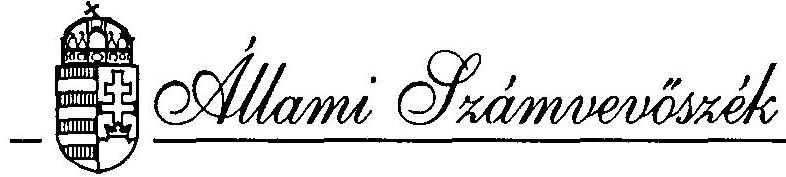
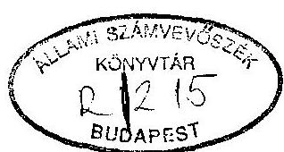
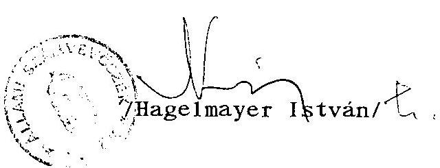
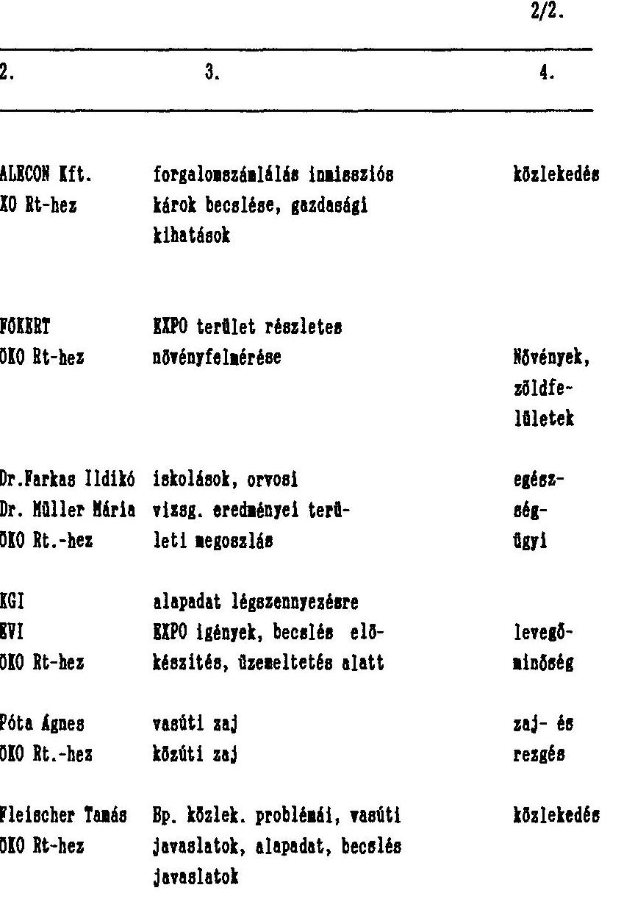

#  

## JELENTÉS

a környezetvédelmi követelmények érvényesüléséről az 1996. évi Világkiállítás előkészítése során

---

A vizsgálatot vezette:

Krucsai Balázs
osztályvezető főtandcsos

A vizsgálatot végezte:

Karsainé Dömsödi Éva
Pallós Gáborné
számvevö
számvevő tandcsos

---

T A R T A L O M J E G Y Z É K
O1da1
I. BEVEZETÉS ..... 1
11. ÖSSZEFOGLALÓ MEGÁLLAPÍTÁSOK, KÖVETKEZTETÉSEK ÉS JAVASLATOK ..... 3
111. RÉSZLETES MEGÁLLAPÍTÁSOK ..... 9

1. Kísérletek a környezeti hatások átfogó és komp- lex felmérésére. ..... 9
2. A környezetvédelmi követelmények érvényesitése a Világkiállítás által érintett kerületek rész- letes rendezési tervében. ..... 15
3. Együttmüködés a környezetvédelmi feladatok megoldásában. ..... 17
4. A Világkiállítási Programiroda és a Fővárosi Önkormányzat egyedi erőfeszitései a környezet- v( lelmi feladatok megoldására. ..... 20
5. A környezetvédelmi feladatok megoldására for- ditott pénzeszközök és azok hasznolulása. ..... 29

---

# J E L E N T É S 

a környezetvédelmi követelmények érvényesüléséröl az 1996. évi Világkiállítás elökészitése során

## 1 .

## B EVEZETÉS

A társadalomban ismétlődően felmerülő igény, hogy a környezetvédelmi követelmények érvényesítése a beruházások megvalósítása során nagyobb szerephez jusson, minőségi változás történjen ebben az elmúlt évtizedek sokszor környezetromboló, környezeti értékeket háttérbe szorító fejlesztéseihez képest.

A Világkiállítás megrendezése és látogatóinak fogadása az évtized legnagyobb volumenű (1990. évi áron közel 50 Mrd Ft összegű) építészeti és infrastrukturális beruházások megvalósítását teszi szükségessé. E létesítmények kivitelezésével kapcsolatos tevékenységek a Főváros - s föleg egyes érintett térségeinek - környezeti állapotában, átmenetíleg vagy tartósan, jelentős változásokat okozhatnak. A gondokat növeli, hogy ezek a tevékenységek

---

idöben és térben egyaránt koncentrálódnak. A kiállítás nyitvatartása idején viszont a megnövekedő idegenforgalom környezetterhelő hatásait kell "elviselhető" keretek között tartani. A fóvárosiak jogos igénye és a rendezôk kötelessége, hogy a várható környezetterhelő hatásokat elózetesen fe1mérjék és azok ismeretében - a környezeti ártalmak és károsodások megelózésére vagy mérséklésére törekedve - döntsenek a megvalósítás módozatairól.

A környezet védelmével kapcsolatos kötelezettségek egy részét elsősorban a beruházások megvalósításához közvetlenül kötődő kötelezettségeket - az érvényes jogszabályok egyértelmüen rögzítik. Nincs azonban és a program egyedi jellege miatt valószinüleg nem is lehetséges törvényi szabályozás arról, hogy az ilyen sokrétü, idöben és térben koncentrálódó, s így egymás hatásait gyakran felerősitő tevékenységek környezetet érintő következményeit hogyan kell kezelni.

A jogi szabályozás hiánya azonban nem adhat felmentést a feladat megoldása alól. A témával összefüggő hazai kutatások, a nemzetközi tapasztalatok és az ezekre épülő szakmai ajánlások, irányelvek megfelelő támpontokat adnak e sajátos feladat megoldásához. Alapvető szempontként hangsúlyozzák: a környezeti hatások vizsgálata a tervezés minél korábbi fázisában kapcsolódik be a döntési folyamatba, annál hatékonyabb segítséget nyújthat a rossz döntések elkerüléséhez.

A vizsgálat célja ezért annak megállapítása volt, hogy a Világkiállítás megrendezéséért felelős kormányzati szervek (Világkiállítási Programiroda ) és a Fővárosi Önkormányzat hivatali szervei a kiállítás, illetve az ahhoz kapcsolódó beruházások

---

előkészítése és megvalósítása során hogyan gondoskodnak az érintett környezet megóvásáról, további káros terhelésének mérsékléséröl. Tervezett intézkedéseik összhangban vannak e az érvényes jogszabályi előírásokkal és a megoldandó feladatokkal, s e célokra fordított pénzeszközök milyen hatékonysággal segítik a jobb emberi környezet kialakítását.

Az előbbiekböl kitűnik, hogy a vizsgálat súlypontját a döntéselőkészítési folyamat és a hozott döntések környezetvédelmi követelmények érvényesítése szempontjából történő értékelése képezte. A Világkiállításra való felkészülés jelenlegi szakaszában e kérdések tisztázásának van - a közvetett gazdasági kihatásokat tekintve is - meghatározó jelentősége.

A vizsgálat az 1992-93. években végzett előkészítő munkálatokra, illetve megállapodásokra és szerződésekre terjedt ki. A vizsgálati megállapítások e munkálatok dokumentumainak feldolgozására és értékelésére épülnek.

# II. 

Összefoglaló megállapítások, következtetések és javaslatok

A Világkiállítás előkészítéséért és megrendezéséért felelős állami, kormányzati szervek és a Fővárosi Önkormányzat a hazai gyakorlatban eddig tapasztaltaknál jóval nagyobb figyelmet forditottak a környezet megóvására, az esetleges környezetterhelések mérséklésére. Már a törvénye1őkészítés szakaszában kezdeményező lépéseket tettek az érintett területek környezeti állapo-

---

tának felmérésére és a várhatóan jelentkező környezetlerhelések prognosztizálására. A Világkiállításról szóló törvény 1991 . decemberi elfogadásáig összesen 8 ilyen jellegủ tanulmány és elemzés készült. (1. sz. melléklet)

Ezek a tanulmányok és elemzések - a döntése1őkészités adott szakaszához igazodóan - elsősorban a kiállítás helyszinének kiválasztásához szolgáltattak környezetvédelmi szempontból mérlegelendő információkat, követelményeket. A helyszín kiválasztásának döntéselőkészitő folyamatában tehát a környezetvédelmi szempontok jelen voltak, a törvényben foglalt döntés azok ismeretében született meg.

A törvény elfogadását követően is kísérletek történtek az elfogadott helyszínen és a kapcsolódó területeken várhatóan jelentkező környezetterhelö hatások komplex felmérésére és a szükséges intézkedéseket megalapozó értékelésére.A Fővárosi Önkormányzat 1992. év elején az ÖKO Rt-től megrendelte a Főváros érintett területeire vonatkozó Környezeti Hatástanulmány elkészitését. 1992. közepén a Környezetvédelmi és Területfejlesztési Minisztérium is megkisérelte az érintettek (Világkiállítási Programiroda, Fővárosi Önkormányzat, minisztériumok) környezetvédelemmel kapcsolatos tevékenységének összehangolását, a megoldandó feladatok és a szükséges intézkedések egyeztetését. Ez a törekvés azonban elhalt. A Világkiállítási Programiroda nem képviseltette magát ezeken a megbeszéléseken. Igy egy-két találkozó után azok abba maradtak.

Idöközben a kiállítás pénzügyi kérdései kerültek elötérbe. 1992 októberére a Világkiállítások Nemzetközi Irodája (BIE) részére be kellett nyújtani a Világkiállítás finanszírozási modelljét.

---

Ennek előkészítése érdekében a Programíroda és a Fővárosi Önkormányzat által létrehozott szakértői munkacsoportokban megkezdödtek az egyeztetö tárgyalások a törvény által jóváhagyott 17 milliárd forint költségvetési juttatás beruházási célok közötti felosztásáról. Az erről folyó, gyakorlatilag 1993 decemberéig elhúzódó viták a környezetvédelemmel kapcsolatos kérdéseket erösen háttérbe szorították.

Az ÖKO Rt. Környezeti Hatástanulmánya 1992 novemberére elkészült és azt az érintettek megkapták (föbb elemeiről a 2. és a 3.sz. melléklet ad áttekintést). A további cselekvés számára szakértők szerint is jó kiindulási alapul szolgáló hatástanulmány közös megvitatására, a szükséges következtetések levonására és a fokozatosan konkretizálódó beruházási programokhoz igazodó aktualizálására és pontosítására azonban nem került sor. Ennek következtében kihasználatlan maradt egy olyan lehetőség, ame1y módot adott volna arra, hogy a várható környezetterhelések kritikus elemeit és területeit már a tervezés fázisában feltárják és a szükséges intézkedéseket meghatározzák.

A Világkiállítás által érintett kerületek részletes rendezési terveiben is jól érzékelhető e lehetőség kihasz:álásának hiánya. Környezetvédelmi fejezeteik a megszokott, vizsgálattal megalapozott konkrét intézkedéseket nélkülöző, tartalommal készültek.

A környezetvédelem ügyének egységes (a Föváros érintett térségeire kiterjedö) és összehangolt kezelése helyett kialakult és a mai napig is érvényesül az a - környezeti hatások eredményes kezelésére szerintünk alkalmatlan - szemlélet és gyakorlat, ame1y szerint a Világkiállítás helyszinéért a Föbiztos, a Föváros fogadóképességének megteremtésért pedig a Fövárosi Önkormányzat felelös. A törvény által létrehozott Világkiállítási Ta-

---

nács a környezetvédelem témakörével önálló napirendi pontként nem foglalkozott, összehangoló és koordináló szerepe e tekintetben nem érvényesült. Ilyen módon mindkét fél a maga útját járva, egymással csak alkalomszerüen egyeztetve, egyedi megoldásokat alkalmazva igyekszik a környezet megóvásáról gondoskodni.

A Világkiállítási Programiroda - melynek apparátusa csak fokozatosan épült ki - kezdetben több, a környezetvédelmi kérdéseket általános elvi szinten kezelö anyagot (környezetvédelmi vezérelvek, stratégiai terv, megvalósulási környezeti hatásvizsgálat módszere, stb.) dolgoztatott ki. Ezek a nagyobb részt magas dijazásban részesülő külföldi szakértök által összeállitott tanulmányok - a hazai viszonyok és adottságok alapos ismeretének és feldolgozásának hiányában - csak elméleti és módszertani segitséget nyújtottak az Irodának a feladat kezeléséhez. (Megjegyezzük, hogy a témával foglalkozó hazai szakemberek számára új ismereteket érdemben nem tartalmaztak).

A gyakorlati tennivalók szempontjából jóval konkrétabb és hatékonyabb eligazítást nyújtanak azok a felmérések, intézkedési programok, amelyek egy-egy részterületen jelentkezo feladatok megoldását célozzák. Ilyenek például: az ingatlanhasznosítás céljára kijelölt telkek talajmechanikai és alapozási viszonyainak feltárása, az EXPO területén végzett komplex talajmechanikai vizsgálat, a fák, zöldfelületek programja, a kiviteli tervek környezetvédelmi fejezetéhez kidolgozott, a tervezök részére kiadott szempontok és azok számonkérése a tervek zsürizésekor, stb.

---

A Fövárosi Önkormányzat - ame1y jól felkészült szakapparátussal rendelkezik - környezetvédelemmel kapcsolatos tevékenysége a kezdetektől fogva célraorientáltabb, gyakorlatiasabb volt. Már az előzetes környezeti hatásvizsgálat ÖKO Rt-ve1 való elkészíttetése is a feladatok és a felelősség közös vállalását célozta.

A hatásvizsgálatok közös elvégzésének meghiúsulása után az önkormányzat Környezetvéde1mi Bizottsága a Környezetvéde1mi Ügyosztállyal együttmüködve szervezte tovább a munkát. Ennek keretében több, a Főváros kritikus környezeti problémáinak megoldását cé1zó, a Főváros környezeti állapotát javító intézkedést, rendelet-tervezetet készített elő. Ilyenek: a turisztikai felkészítési program, a parkok-fasorok rekonstrukciós programja, a parkolási koncepció és rendelet-tervezet, a levegőtisztasággal kapcsolatos szmog-rendelet tervezet és intézkedési terv, a kiemelt közcélú zöldterületekról szóló rendelet, zöldvéde1mi ren-de1et-tervezet, szelektív szemétgyüjtési program, a környezetkímélő "zöld" buszok forgalomba állítása, stb.

A szakmailag is jól megalapozott intézkedések megvalósítását elsősorban a finanszírozási források hiánya akadályozza, de nehezíti a sok áttétel1e1 müködő, viszony1ag lassú döntési mechanizmus is.

A kifejezetten környezetvéde1mi feladatok megoldását szo1gáló ráfordítások összege a Világkiállítási Programirodánál mintegy 160 millió forintra becsülhető. A Fövárosi Önkormányzatnál ezek nagyságrendjét - ilyen jellegű nyilvántartás hiányában - a vizsgálat még felbecsülni sem tudta. A Programirodánál vizsgált ráfordítások hasznosulásáról teljeskörü értéke1és ma még nem adha-

---

tó. Túlnyomó részükről azonban megállapítható, hogy azok indokoltak és a teljesítményekkel arányosak voltak. Elszámolásuk és kifizetésük szabályszerű. A külföldi szakértők foglalkoztatására és a különböző tanulmányok készitésére forditott kiadások megfelelő hasznosulása azonban kétséges.

A megszokottnál nagyobb figyelem és a felelős szervek által végzett sokrétű munka - összehangolatlansága ellenére - reményt nyújthat arra, hogy a Világkiállítás előkészítése és megrendezése során a Fóváros lakosságát súlyosan terhelő és a kiállítás sikeres lebonyolítását is zavaró környezeti ártalmak nem keletkeznek. E remények valóra váltásához azonban - a már elhatározott környezetjavító intézkedések maradéktalan végrehajtása mellett - a beruházások megvalósításával, a nagyszámú látogatók közlekedtetésével, stb. kapcsolatos környezeti hatások folyamatos vizsgálatára és a szükséges intézkedések haladéktalan megtételére lenne szükség.

A vizsgálat tapasztalatai alapján - az előbbiekben említett, ma még nem kizárható súlyos környezetterhelések hatékony megelőzése érdekében is - kiemelten fontosnak tartjuk, hogy a Világkiállításért felelös kormányzati szervek és a Fóvárosi Önkormányzat együttmüködése az eddigieknél tartalmasabbá és rendszeresebbé váljék. Ennek keretében célszerű lenne, ha az érintett szervek (Világkiállitási Programiroda, Fóvárosi Önkormányzat, Környezetvédelmi Felügyelőség, minisztériumok, stb.) a beruházások és a közlekedésszervezési intézkedések környezeti hatásait még a kiviteli tervek jóváhagyása előtt rendszeresen értékelnék és a szükségessé váló intézkedéseket közösen meghatároznák.

E feladat megoldásának intézményes, jogilag nem feltétlenül szabályozott, kereteként a Világkiállítás Főbiztosának és Budapest Föpolgármestcrének Közös Operatív Környezetvédelmi Bizottság létrehozását és múködtetését javasoljuk.

---

# 111. 

## Részletes megállapítások

1. Kísérletek a környezeti hatások átfogó és komplex felmérésére

A Világkiállítás elökészitéséért és megrendezéséért felelös szervek több ízben is kísérletet tettek az érintett területek környezeti állapotának felmérésére és a várhatóan jelentkező környezetterhelések prognosztizálására. Ezek a kisérletek azonban csak részeredményeket hoztak, nem voltak alkalmasak arra, hogy egy szakmailag megalapozott és összehangolt cselekvési program kiinduló alapját képezzék.
1.1. A Főpolgármesteri Hivatal Környezetvédelmi U̇gyosztálya 1992. május 10 -én 5,2 millió forint tervezési dí ellenében megrendelte az ÖKO Rt-nél az EXPO új koncepciójának elözetes és részletes környezeti hatásvizsgálatát (KHV). A szerződés részletes, jól kidolgozott tematikára épül, ame1y abból indul ki, hogy a környezetvédelmi problémák - a Föváros és az EXPO kölcsönhatásai miatt - csak komplexen kezelhetök.

A május 28 -ára vállalt elözetes hatásvizsgálat a Föváros egészére koncentrálva tárta fel a környezetvédelmi szempontból súlyponti problémákat az Általános Rendezési Terv (ÁRT) és a május 30-ra elkészülő területi Részletes Rendezési Tervek (RRT) környezetvédelmi munkarészeinek kritikai értékelésével. A november végére elkészített részletes KHV az elözetes vizsgálatban felvetett súlyponti problémákat, a környezeti elemenkénti hatásfolyamatokat elemezte az EXPO közvetlen helyszínére és a Föváros egészére vonatkozóan.

---

A fejlesztési elképzelések azonban ekkor még nem voltak elég konkrétak. Ez szolgálhat magyarázatul arra, hogy a "feltételek, javaslatok" címü fejezet még túl általános és sok az előző anyaęból átvett munkarész. A környezeti problémákat enyhítő fejlesztési elképzelések kidolgozatlanok.

Az összefoglaló tanulmányt összesen 13 db mellékletkötet egészíti ki, melyekben a közlekedés, levegőminőség, ímisszió, növényzet, gyermekegészségügy, zajvédelem, vízgazdálkodás, hulladékkezelés helyzetét dolgozták fel igen részletesen és a környezetvédelmi feladatokat vázolták.

E szakmai körökben is jó kiindulási alapként elismert dokumentum érintett szervek közötti megvitatására és értékelésére, a további munkálatok irányainak egyeztetésére azonban nem került sor. Ezért hasznosulása nem minösíthetö.
1.2. A Közlekedési Hírközlési és Vízügyi Minisztérium (KHVM) az 1991. évi Világkiállitási törvény és a városrendezési tervek elfogadása után saját hatáskörében olyan kutatási programot kezdeményezett, amely a szállításból eredő környezeti terhelések mérséklésére feltárja a lehetséges megoldásokat. A témavízsgálat előkészítésébe a VKPI bekapcsolódott. A kutatás költségeire a fedezetet az OMFB biztosította 1.000.000, - Ft összegben.

A KHVM meghívta a VKPI-t az 1992. október 28-án tartott témainditó megbeszélésre, ahol a Programiroda bejelentette igényeit az EXPO területen lévő KÉV Betongyár megtartására, a pesti és a budai oldalon 1-1 kiszolgáló iparvágány üzemben tartására, valamint a vízi szállítási lehetőségek preferálására.

---

A megbeszélésen kōrvonalazott kutatási feladat alapján a Közlekedéstudományi Intézet 1993 márciusára elkészítette "A Világkiállítással összefüggő szállítások következtében fellépő közúti forgalomnövekedés, illetve a tehergépjármüvek által okozott környezeti ártalmak csökkentése "címü tanulmányt. Megvitatására 1993. március 22 -én a KHVM-ben került sor. A résztvevők megállapították, hogy "a kutatási munka a pénzügyi keret kimerülése következtében mélyebb elemzést nem tett lehetővé". Feltárta azonban azokat a problémákat, ame lyek részletesebb elemzése szükséges. A VKPI a tanulmány tel jes dokumentációját 1993. május 12 -én kapta kézhez. Felkérésére a Budapesti Müszaki Egyetem útépítési tanszéke a tanulmányt véleményezte, azt alapvetően helytállónak minösítette. Megállapította, hogy tanulmány a teherforgalomra vonatkozó elözetes KHV, ame ly a közúti környezeti terhelés alapadatait, az építőanyaggyártók szállítási lehetőségeit tartalmazza. Az EXPO építkezésekről meglévő korlátozott információk alapján becsült szállítási feladatokra környezetkímélö vasúti és vízi szállítási alternativ javaslatokat mutat be. A tanulmány azonban nem tér ki az EXPO üzemeltetése során megnövekedö személyi és gépkocsiforgalomból, illetve tömegközlekedésböl eredő környezeti többletterhelések elemzésére.

E munka továbbfolytatásáról és hasznosulásáról értéke1hető dokumentumokat a vizsgálat nem kapott.
1.3. A Világkiállítási Programiroda 1992 júliustól - 1993 június végéig három szerződéssel, de gyakorlatilag folyamatosan alkalmazott osztrák szakértöket (Gerhard Felt1 és Eugen Semrau) szaktanácsadói tevékenység végzésére - jellemzően marketing, szervezés, szerződés-előkészítés, kapcsolatkié-

---

pítés témakörökben. A szakértői szerződés egyik pontja szerint feladatuk: "Az EXPO' 96. környezetbarát tervezéséhez és lebonyolításához vezérelvek kidolgozása" volt.

A szerződés tel jes összege 1992. szeptember 1. 1992. december 22. közötti munkavégzésre 13.944.790, - Ft volt, melybôl a környezetvédelmi munkára felhasznált összeg nem különíthető el. A szakértői tevékenység díjazása véleményünk szerint magas. Havi 20 munkanapot feltételezve a napi szaktanácsadói tevékenység díjazása 174.310, - Ft-ot tesz ki, a dologi kiadások (utazás, szállás, helyi közlekedés) teljes költségtérítése mellett.

A környezetvédelmi vezérelveket tartalmazó 10 oldalas anyag a nemzetközi gyakorlatban alkalmazott átfogó, általános szempontokat tartalmaz. Többek között a forgalom tömegközlekedésre való hangsúlyáthelyezését, a tervezői, kivitelezői és üzemeltetői szerződésekbe "környezetvédelmi záradék" beépítését, stb. javasolja. Ez utóbbi a gyakorlatban is megvalósult.
1.4. A Világkiállítási Programiroda és a De Leuw Cather International Limited /DLC/ szaktanácsadó szakvállalat között 1992. október 2-án szerződés jött létre a környezetre vonatkozó szaktanácsadói tevékenység elvégzésére.

A "nemzetközi színvonal biztosítása" érdekében bevont külföldi szakértő kiválasztását nem elözte meg ajánlatkérés, minösités. A külföldi konzultáns cégeket

---

ajánló KTM javaslatban szereplő cégek egyikét sem alka1mazták. A telefaxon történt üzenetváltásokból kitünik, hogy a szerződés tartalmát, feltételeit, az elvégzendó munka témakörét maga a szaktanácsadó határozt a meg. A DLC szakértó részletes szakmai önéletrajzából kiderül, hogy széleskörü nemzetközi referenciákkal rendelkezik, de tevékenységének eredményességére, elfogadására, illetve hasznosulására vonatkozóan nincs információ.

A DLC szakértője a vonatkozó szerződésben leírt feladatát 1992. október 25. - 1992. november 6. közötti időszakban végezte el. Munkájának eredménye az "EXPO' 96. Stratégiai Terv a környezeti hatások vizsgálatához" címü tanulmány. Ennek elkészitéséhez:

- a VKPI által rendelkezésre bocsátott elözményanyagok,
- a kiállítás megrendezésében érintett szervezetekkel, illetve a KTM-ben folytatott tárgyalások információi,
- a munkavégzés alatt rendelkezésre álló -VKPI által biztosított - magyar szaktanácsadók közremüködése szolgált segítségül.

Az 1992. november 5-re elkészült Stratégiai Tervet az EXPO, 96. Kft. 3 hónap elteltével, 1993. január 22. - 1993. február 8. között megküldte az érintett szervezetek számára véleményezés céljából.

A Környezetvédelmi Felügyelöség 1993. február 11-i levelében a Stratégiai Tervet "akciótervnek" minösítette, kiegészítésére és az EXPO környezeti hatásvizsgálatának elvégzéséhez több javaslatot tett . A Stratégiai Tervben leírt célkitüzésekkel egyetértett.

---

A Föpolgármesteri Hivatal Környezetvédelmi Úgyosztálya véleményét - amely a Hivatal álláspontja is - a föváros EXPO biztosa 1993. február 15-én kelt levelében küldte meg a VKPI-nek. Szerintük a Stratégiai Terv saját kitüzött céljainak nem felel meg, csak az eddigi ismereteket összegezi, szóhasználata idegen a magyar szaknyelvtől. A "környezetértékelési kritériumok"-ban a tanulmány környezeti hatótényezőket, szempontokat sorol fel. Javasolták a tanulmány átdolgozását úgy, hogy jobban illeszkedjen a magyar valósághoz, jelezték egyeztetési, konzultációs készségüket.

A Stratégiai Terv kidolgozását azonban nem követte részletes környezeti alapállapot felmérés és hatástanulmány kidolgozása sem, ellentétben az előkészítésekor jelzett célokkal.
1.5. Az EXPO' 96. Kft. 1993. március 30-ra összeállította a "Zöld-EXPO' 96." elözetes környezetvédelmi szempont rendszert. Az anyag az előzőekben ismertetett tanulmányok alapján összefoglalja az előkészítő tervezés és a kivitelezés során figyelembe veendő környezetvédelmi feltételeket. Az elkészült anyag VKPI- EXPO' 96. Kft. közötti belsö egyeztetése és véleményeztetése elhúzódott. Az EXPO' 96 Kft. 1993. november 15 -én - tehát 7 hónap elteltével - küldte meg azt a tervezö vállalatoknak, hogy tervezöi munkájuk során a benne foglalt környezetvédelmi szempontokat vegyék figyelembe.

---

2. A környezetvédelmi követelmények érvényesitése a Világkiállítás által érintett kerületek részletes rendezési tervében

A IX. és a XI. kerület részletes rendezési terve a törvényben megállapított határidóig (1992. május 30.) elkészült. E tervek környezet- és természetvédelmi fejezete azonban nem felel meg a 9007/1983. ÉV11 közlemény I/B. 2.2. pontjában foglalt követelményeknek. Nem tartalmaz környezetvédelmi vizsgálattal megalapozott intézkedéseket, szabályozó előírásokat, mindössze a problémák megoldásának igénylését rögzíti.
2.1. A VÁTI 1991 augusztusában kapott megbizást Budapest Főváros Fópolgármesteri Hivatalától, hogy készítse el a Dél-Budapesti Városközpont általános (ÁRT) és a két érintett kerület (IX. és XI. kerület) részletes rendezési tervét (RRT).

Az Általános Redezési Tervet munkaközi tervként 1992. feb-ruár-március folyamán - a Fópolgármesteri Hivatal Városfejlesztési Ugyosztály közvetítésével - az illetékes ügyosztályokkal (közmű, közlekedés, környezetvédelem, stb.) véleményeztették. A véleményekből következtetni lehet arra, hogy számos, a Főváros egészét érintő fejlesztési kérdésben (pl.: városszerkezet fejlesztési lehetőségei, szennyvíztisztítás megoldási lehetőségei, stb.) nincs döntés, nincs koncepció. A Környezetvédelmi Ugyosztály 1992. március 10-i - a Környezetvédelmi Felügyelőség véleményét is tükröző levelében ki is fejti, hogy a programtervezet olyan nagyvonalú, hogy környezetvédelmi vonatkozásai értékelhetetlenek.

---

2.2. A Részletes Rendezési Tervek nyilvánosságra hozatalát követően számos környezetvédelmi indíttatású - elsősorban XI. kerületi - lakossági felszólalás, demonstráció, petícióbenyújtás volt a túlzottnak minősített beépítés, a Lágymányosi híd forgalmi terve, a zöldterületek csökkenése, stb. miatt. Emellett már 1993 márciusra körvonalazódott, hogy a környezetvédelmi és az EXPO jóváhagyott rendezési tervét érintő kérdések szükségszerűen az RRT-k módosításával rendezhetők.
2.3. 1993. április 4-re elkészült az EXPO Beépítési Terv első változata (a Masterplan Draft 1.) amelyet a VKPI és az EXPO' 96. Kft. műszaki szakértői a Részletes Rendezési Tervvel egyeztettek. Miután a két terv nem bizonyult kompatibilisnek, további viták támadtak a kerületekkel ügyviteli kérdésekben és az RRT-ben szereplő fogalom meghatározások értelmezésében (bruttó alapterület, épületjellegủ létesítmény, látványterv, stb.). A VKPI ezért szükségesnek tartotta az RRT-k módosítását. 1993. október 15 -én levélben kérte fel a IX. kerületi Önkormányzatot - a költségek átvállalásával - a módosítás végrehajtására. November 12 -én levélben értesítették az Önkormányzatot, hogy a VKPI megbizta VÁTI Rt-t a módosítás előkészítésével.

A IX. kerületi önkormányzati testület 1993. november 23-án - elsősorban a Lágymányosi híd forgalmi kapcsolataira vonatkozó kiegészítésekkel - jóváhagyta a módosító rendeletet.

A Világkiállítási Tanács 8/14/1993. (XII.20.) sz. határozatával elfogadta a Világkiállítás főbiztosának előterjesztését a IX. és XI. kerületi RRT -ek világkiállítási területre vonatkozó módosításainak jóváhagyásáról.

---

2.4. Az RRT-módosítások a környezetvédelmi munkarészeket nem érintették, annak ellenére, hogy a XI. kerületi Képviselőtestület több, a környezeti paraméterek javítását, illetve a helyi természeti értékek (Lágymányosi öböl, zöldfelületek aránya, stb.) megóvását célzó határozatot is hozott. A kerületi környezetvédő megmozdulások kérései is csak részben jutottak kifejezésre a módosítás közlekedésfejlesztési fejezetében.
3. Együttmüködés a környezetvédelmi feladatok megoldásában

A Világkiállításról szóló törvény jóváhagyását követöen történt néhány kezdeményezés ellenére az érintett felek között rendszeres és érdeml együttmüködés a környezetvédelmi feladatok megoldásában nem alakult ki. Az információk cseréje is többnyire eseti jellegủ volt.
3.1. A területileg illetékes Közép-Dunavölgyi Környezetvédelmi Felügyelöség 1991. május 3-án a Világkiállítás Kormánybiztosának irt levelében kezdeményezte, hogy már a tervezés korai szakaszában rendszeresen lássák el információkkal a Felügyelöséget:
"...annak érdekében, hogy a Világkiállítás várható környezeti hatásait összefüggéseiben tudják vizsgálni és komplex módon értéke1ni..."

A Felügyelőség bevonása az előkészítő munkálatokba és megfelelő információkkal való ellátása azonban nem történt meg. Az intézmény igazgatója még az 1992. július 21-i

---

beszámolójában is arról tájékoztatta a környezetvédelmi és területfejlesztési minisztert, hogy a Felügyelőséget a kiállítás megrendezéséért felelős szervek hivatalosan még nem keresték meg. Mindössze annyi történt, hogy a VKPI felkérte a Felügyelőséget vegyen részt a kiállitási terület Környezeti Hatásvizsgálatának elkészítésében. Ezt a Felügyelőség -tekintettel arra, hogy hatóságként véleményeznie kell az elkészült anyagot - nem vállalhatta.

A fent említett beszámolójában a Felügyelőség ismételten kezdeményezte a beruházásokkal kapcsolatos információk részére történő megküldését. Ez azonban - az előirt egyedi véleményezéseket kivéve - a mai napig sem történt meg.
3.2. A Fövárosi Önkormányzat által megrende1t és az ÖKO Rt. által elkészített előzetes Környezeti Hatásvizsgálat birtokában a KTM 1992. július 30-án az EXPO előkészítésével kapcsolatos környezetvédelmi kérdések áttekintésére a VKPI, az EXPO Iroda, a Környezetvédelmi Úgyosztály és a budapesti környezetvédelmi felügyelöség meghívásával egyeztető tárgyalást tartott. Ezen a VKPI képviselöje nem vett részt.
3.3. Az ÖKO Rt. 1992. július 30-án telefaxon megküldte a VKPI részére a "Világkiállítás megvalósításának, müködésének és a létesítmények utóhasznosításának környezeti problémái a Fövárosban" címü összeállítás. A megküldött anyagra a VKPI nem reagált.

---

3.4. A környezetvédelmi miniszter 1992. augusztus 17-én kelt levelében felhívta a Fóbiztos figyelmét az EXPO-val kapcsolatos környezeti alapállapot -felvételezés hiányára. Tájékoztatta a Fóbiztost, hogy kijelölte a minisztériumban az EXPO környezetvédelmi koordinátorát és megküldte az 1992. július 30-i egyeztető tárgyalás emlékeztetőjét is.

A Világkiállítás Fóbiztosa 1992. augusztus 31-i levelében közölte a környezetvédelmi és területfejlesztési miniszterrel, hogy a környezeti hatásvizsgálatot külföldi szakértővel kívánják elkészíttetni.
3.5. A Főváros és a VKPI "egyezkedése" 1992. augusztus 6-tól szakmai munkabizottságokban folyt. A munkabizottságokban az illetékes ügyosztály, a fővárosi közüzemi vállalatok, a tervezők és állandó tagként az EXPO Iroda, a VKPI és a Környezetvédelmi Ügyosztály képviselői vettek részt.

A szakértői egyeztetések témája a két RRT alapján a 80 ha világkiállítási terület működéséhez szükséges infrastruktúra tételes számbavétele, azok költségeinek szakértői becslésen alapuló elöirányzata, a fejlesztési tételek szükségességének minösitése és a beruházó nevesítésére tett javaslat meghatározása volt. Az egyeztetések nem hozták a remélt eredményt, a VKPI és az EXPO Iroda a fejlesztési tételek szükségességében és a beruházó nevesítésében nem tudott megállapodni Ezeken a megbeszéléseken a környezetvédelmi kérdések - a szakágazati beruházásokhoz kapcsolódva - csak érintőlegesen merülttek fel.

Az együttmüködés hiányosságaiból eredő problémák kialakulásában, az információáran. ás lassúságában, akadozásában, az elöfordult párhuzamos tevékenységekben minden érintett fél közrejátszott.

---

4. A Világkiállítási Programiroda és a Fövárosi Önkormányzat egyedi erőfeszítései a környezetvédelmi feladatok megoldására

# 4.1. A Világkiállítási Programiroda intézkedései 

### 4.1.1. Buda-Észak 36 ha-os terület komplex talajvizsgálatának elvégeztetése

A talajvizsgálat előkészítése 1992 novemberében kezdődött. A vizsgálatot lebonyolító EXPO. 96. Kft. versenytárgyalási felhívást küldött 33 előminősített szervezet részére 1993 márciusban. A felhívásra 12 pályázat érkezett. Ezek közül 6 tagú bíráló bizottság összehasonlító értékeléssel a GEXPO KKT. (MÁV Hídépítő Kft. - Soletanche Kft. - MÉLYÉPTERV Góclok Kft.) 18.529.100,- Ft +ÁFA összegủ ajánlatát választotta ki. A szerződést 1993. május 24-én írták alá.

A vizsgálati dokumentációt - amely külön radiológiai vizsgálatot is tartalmaz - az EXPO' 96 Kft. 1993. augusztus 30-án kapta meg. A Budapesti Müszaki Egyetem szakvéleménye szerint a vizsgálat kivitelezése, eredményei elfogadhatók. A Környezetvédelmi Felügyelőség is úgy foglalt állást, hogy a környezet jelenlegi állapota ellenére a Világkiállítás létesítményei megépíthetők. A környezetvédelmi adottságok azonban az átlagosnál kedvezötlenebbek. Ezért az egyedi építkezéseknél külön mérni kell a tényleges hatásokat az alapozási viszonyok tisztázására.

---

Ennek megfelelően a GEXPO KKT egyik "tagja", a MÉLYÉPTERV Kultúrmérnöki Kft. elkészítette az Osztrák Nemzeti Pavilon Területismertetó Talajmechanikai Szakvéleményét 1993. november 1-re. Ez az anyag lényegében az osztrák pavilon területére esö fúrási adatok, vizsgálati eredmények "kigyüjtése" a teljes területre vonatkozó anyagból. A megállapítások, javaslatok megegyeznek az általános vizsgálati eredményekkel, a konkrét területre vonatkozó részletesebb talaj és feltöltés vizsgálati eredményeket, szennyezettségi adatokat nem tartalmaz. Kiköti a szakvélemény, hogy kiviteli tervek készítéséhez nem használható fel a dokumentáció.

A komplex talajvizsgálat eredményeinek 1993 novemberében tartott ismertetőjét a tervező vállalatok képviselöi hiányolták az anyagból azokat az ajánlásokat, ame1yeket figyelembe véve - a mért eredményeket hasznositva - alakíthatnák a készülö terveket.

A komplex talajvizsgálat az egyetlen olyan részletes környezeti hatástanulmány az EXPO területéről, amely alapos felmérést jelent a feltöltött, talaj környezetszennyező elemeiröl.
4.1.2. Az EXPO terület beépítésére vonatkozó Master Plan (MP) első tervezete a FÖMTERV-vel szerződés 1993. június 23ra készült el. Az EXPO' 96. Kft- né megtartott tervbírálati tárgyaláson kérték a tervezőt, hogy dolgozza ki a MP terv környezetvédelmi munkarészét a teljes EXPO területre vonatkozóan.

---

Az 1993. augusztusára elkészült környezetrendezési karakterterv a követendö általános irányelveket, a környezeti problémák szempont rendszerét foglalja magába. Javasolja, hogy a környezetvédelmi dokumentációk tartalmazzanak vígazdálkodással, ökológiával, levegőminőséggel, zaj és rezgésekkel, és energia kérdésekkel foglalkozó fejezeteket. Gyakorlatilag teljes mértékben a Stratégiai tervre támaszkodva felsorolja az említett környezeti tényezők vizsgálatára vonatkozó szempontokat. Ajánlásokat tesz a zöldfelületek, a környezetalakító térburkolatok szempontjaira, a telepített fákkal szemben támasztott követelményekre. Konkrét környezetrendezési-alakítási intézkedéseket a kiegészítés sem tartalmaz.

A Master Plan müszaki terveiben foglalt környezetvédelmi fejezetek részletes feldolgozása alapján megállapítható volt, hogy a tervezés jelenlegi fázisában - részletes környezeti hatásvizsgálat hiányában - a tervezők sem tudnak konkrétabb környezetvédelmi tervfejezeteket összeállítani. Ez az oka annak, hogy az egyedi tervekben a "Zöld EXPO" környezetvédelmi szempontrendszer szándékaínak érvényesítése, a tervbírálatokon tett észrevételek ellenére nem teljes mértékben eredményes, többszöri tervmódosításokra is sor került.
4.1.3. Környezetvédelmi - környezetfejlesztési szempontból is kiemelkedik a fák, zöldfelületek védelme és telepítése, amelyet önálló kertész szakember irányításával készítenek elö.

Az EXPO környezetvédelmi koncepciója szellemében a Világkiállítási terület mintegy $25 \%$-án zöldfelület lesz,

---

dúsan telepített lombos fákkal, örökzöldekkel. Az EXPO, 96. Kft. 1993. július 26-án vállalkozói tenderfelhívást tett közzé a törvényben meghatározott világkiállítási terület körtereín elültetendő lombos fák beszerzésére. Ebben rögzítették a faigényeket fajtánként, mennyiségben, a törzskörméret, a törzsmagasság és az ültetés helyének meghatározásával. Határidőre 5 pályázat érkezett be. Az ajánlott növényeket a biráló bizottság a faiskolákban helyszíni szemlén megtekintette. Az ajánlatok értékelését a kertészeti szakértök nagy körültekintéssel végezték el. Az eredményhirdetésre 1993. október 14-én került sor. Négy faiskola ajánlatából válogatva összesen 2.855 db lombos fát kötöttek le előnevelésre. A fák kiültetése a területre a kiállítás müszaki kivitelezési munkáitól függően 1994. november 1. és 1995. december 1. között történik.

A Világkiállítás területén található faállomány felmérésére, minösitésére számos tanulmány és terv készült. Favéde1mi - fakivágási tervek is több változatban készültek a területet megosztva központi tér, tervezett utak környezetére, körgyürűn belüli - kívüli területekre. Ezeket az előzetes tervanyagokat tanulmányozva megállapítottuk, hogy a tervek nem rögzítették pontosan a terület növényállományának adatait, ezért volt szükség - a müszaki előkészítés függvényében - a fafe1mérési tervek ismétlődő aktualizálására.
4.1.4. A Buda-Észak terület talajában felfedezett, háborús eredetű robbanószereket feltárták és a Honvédelmi Minisztérium, az ÁSZ Kft. és a SWIETELSKY útvasút Kft. közreműködésével elvégezték a terület robbanószer-mentesítését.

---

A talaj feltöltött jellege miatt azonban a robbanószer feltárás esetleg nem teljeskörü, ezért minden terepszint alatti munkánál tüzszerész állandó felügyelete szükséges.
4.1.5. A Környezetvédelmi Stratégiai Terv egyik pontja a területtisztitás az épitkezés megkezdése előtt. Ennek keretében a SWIETELSKY Útvasút Kft. 1993 április - június hónapban elvégezte a Buda-Észak területen lévő törmelék, felszíni hulladék elszállitását. A megbízást a vállalat versenytárgyalás útján nyerte el. Ez a tevékenység az épitkezés megkezdésének feltétele, a munka jelentésben helytelenül szerepel a vizuális hatások között.
4.1.6. A Lágymányosi záportározó védett kisállatainak mentésére akciót kezdeményezett az EXPO $96^{\circ} \mathrm{Kft}$. Az akció során 1993 április és június között más élőhelyre telepítettek több száz természetvédelmi értéket képező kisállatot. A munkát diákok ingyen végezték.

# 4. 2. A Fövárosi Önkormányzat intézkedései 

4.2.1. A Fövárosi Közgyülés Környezetvédelmi Bizottsága lehetöségei keretei között (véleményezés, állásfoglalás) 1991 óta napirenden tartja az előkészités és megvalósitás környezeti feltételeit. A világkiállítási törvény hatálybalépését követően a 3/1992. sz. (III. 6.) Állásfoglalásban 10 pontban határozták meg a Világkiállítás esetén szükséges környezetvédelmi beruházások és intézkedések körét.
A Bizottság alelnöke ekkor kezdeményezte elöször operativ környezetvédelmi munkacsoport létrehozását.

---

4.2.2. A Fővárosi Közgyűlés 1992. december 3-i ülésén határozta e1, hogy a Világkiállítás következtében megnövekvő turistaforgalom fogadása és a városkép javítása érdekében idegenforgalmi - városfejlesztési programot kell kidolgozni, s azt a Közgyűléssel elfogadtatni.

A Főpolgármesteri Hivatal EXPO Iroda 1993. január 12-én kötött vállalkozási szerződést a generáltervező FŐBER Kft-ve1 "A Főváros fogadóképességének megteremtése és turisztikai felkészitésének programja az 1996. évi Világkiállításra" címme1.

A programot az ÁRT kidolgozásában is résztvevő jelentő́s tervező szervezetek az ügyosztályok és a VKPI bevonásával tervezték elkészíteni. A VKPI a 11 munkaközi konzultációból mindössze 4 alkalommal volt jelen.

A szerződés tartalmilag átgondolt, kellően részletezett, a feladatok jól meghatározottak. A részhatáridőket és a felelősök megnevezését is tartalmazzák. A megbizás külön pontban kitér a környezetvédelmi szempontok alfejezetenkénti elemzésének szükségességére.

A generáltervező április 26-án szállította le a tervdokumentációt és nyújtotta be bruttó 10 millió forintos számláját. Az idegenforgalmi program a rendelkezésre álló turisztikai adatok és a VKPI által feltételezett látogatóforgalmi adatok elemzéséből indul ki és adottságként keze1i a 17 m1lliárd központi költségvetési keretből megvalósuló, a Főváros 1993-94. évi programjában elöirányzott, valamint a két érintett kerület RRT-ben szereplő beruházásokat. Célul tüzte ki, hogy a város egy jól körülhatá-

---

rolt -a turistaforgalom által látogatott - belsö zónájában (elsődlegesen a Belváros, Várnegyed, Margitsziget, Városliget és az EXPO környezete) a közlekedés feltételei, a környezeti körülmények (burkolatok, homlokzatok, köztisztaság, növényzet, utca berendezések, stb.) érzékelhetően javuljanak.

A feladatokat a program, a Fövárosi EXPO Iroda március 23-i kérésének megfelelően 3 igényszintre bontotta:

- nélkülözhetetlennek tekintett,
- indokoltnak nyilvánított és
- előnyösnek ítélhető fejlesztések meghatározásával.

A nélkülözhetetlennek tekintett fejlesztések és intézkedések költségigénye összességében mintegy 19 milliárd forint felhasználását igényli folyóáron. A források tekintetében állami költségvetési, önkormányzati költségvetési és kisebb részben magán-befektetői források bevonásával számoltak.

A felkért bíráló - dr. Vidor Ferenc professzor - összefoglaló véleménye szerint a tanulmányok igen bőséges információt adnak a jelenlegi helyzetröl és a Világkiállítás időpontjára vonatkozó elvárásokról. A vizsgálatok eredményei alapul szolgálhatnak a sürgős, megalapozottságot igény lő döntésekhez. A feladatok szükségességének megitélése, rangsorolása, a tanulmányok szerzőinek szakmai felkészültségére utal és legfeljebb egy-egy részletében vitatható.

---

4.2.3. A környezeti hatások szempontjából kiemelt jelentőségủ az idegenforgalmi program részeként elkészített "Budapest közlekedési rendszerének fejlesztése" címú terv dokumentáció. Megállapítottuk azonban, hogy a környezetvédelmi munkarész önálló életet élve, elkülönülten jelenik meg, kevés adatot tartalmaz és általános érvényü következtetéseket von le, illetve a további vizsgálatok, tervezések szükségességét hangsúlyozza.
"Az egyidöben zajló építkezések batásai" címủ fejezet tartalmazza az egyes létesítmények önálló megépítésére vonatkozó becsült időtartamot, kritikus munkákat, forgalom-e1terelési igényeket. Az egyidejü hatások elemzése helyett szempont-felsorolások (finanszirozási nehézség, egyéb egyidejű építkezések, építőipari kapacitás-becslés, stb.) következnek, melyek alapján a tervezők további vizsgálatai még szükségesek.

A "Várható környezeti hatások" fejezet azzal a végső mondanivalóval zár, hogy az építések környezeti hatásait az építési dokumentációkban ke11 kidolgozni, a területenkénti környezeti hatások értékelése pedig az intézkedések elhatározása után történhet.

A programot a Fövárosi Közgyûlés 1993. június 23-24-i ülésén tárgyalta meg és határozattal fogadta el. A határozat egyebek mellett "felkéri a főpolgármestert, hogy készítsen programot a budapestiek életkörülményeit - a Világkiállítás ép,tése és nyitvatartása alatt - hátrányosan befolyásoló tényezők elkerülésére." Ennek kidolgozása és jóváhagyása jelenleg folyamatban van.

---

4.2.4. A Környezetvédelmi Ügyosztály 1992. szeptebmer 15-re kidolgozta a VKPI és a Föváros között kötendö megállapodásba beépítendö környezetvédelmi feltételeket. 11yenek: közlekedési korlátozás, ipari háttérhatások csökkentése, Duna-vizminöség javítása, zöldfelületek védelme, hulla-dék-elhelyezés megoldása, csomagolástechnikai elöírások, stb. A Közgyülés által 1993. december 23-án jóváhagyott megállapodásba e kritériumokból semmi nem került be.
4.2.5. A Környezetvédelmi Ügyosztály 1992-ben kidolgozta a zöld-felület-védelmi rendeletet, felmérte a Föváros klemelt zöldfelületeit és javaslatot tett a legnagyobb igénybevételü zöldfelületek fogadóképessé tételére. Ennek alapján készült el a 14/1993. (IV. 30.) ÖNK. rendelet, melynek melléklete a kerületek területén, de a Föváros kezelésében lévő kiemelt, közcélú zöldterületek felsorolása. A Fövárosi Közgyúlés április 29-i határozatával inditotta el a "Parkok-fasorok rekonstrukciója" címủ projektet. A rekonstrukciók ütemezését, a Világkiállítást figyelembevevő prioritásokat, a szerződés bonyolítását az Ügyosztály végzi. 1993-ban a beruházási engedélyokirat szerint 100 millió forintot fordíthattak a projektre, 1994-ben is hasonló forrás-keretre lehet számítani.

Az 1993. évi beruházási programot és kiviteli tervet, valamint az építési munkákat a FÖKERT készítette, illetve végezte. A rendelkezésre álló összeget a Jászai Mari tér, Hild tér, József nádor tér, Egyetem tér és a Nagykörúti (VIII-IX. ker.), Szilágyi E. körúti fasorok rekonstrukciójára forditották.

---

A Környezetvédelmi Ügyosztály által kötött szerződésekröl (tervezési, kivitelezési) megállapítottuk, hogy a kivitelezők kiválasztása nem versenytárgyalás keretében történt. Az Ügyosztály a versenytárgyalások elhagyását idöhiánnyal és azzal indokolta, hogy az önkormányzat tulajdonában lévő kivitelezők tulajdonosi ellenőrzése kellő biztositékot jelent a megfelelő árakon történő szinvona1as munkavégzésre.

Általános az a tapasztalat, hogy a döntési folyamat rendkivül lassú, a szándék megjelenése és a kiviteli tervdokumentáció elfogadása között - mivel többször is közgyűlési határozatot igényel - hónapok telnek el, a szakmai egyeztetések pedig még tovább növelhetik ezt az idót.
5. A környezetvédelmi feladatok megoldására forditott pénzeszközök és azok hasznosulása

A Világkiállítás előkészitésével és megvalósitásával kapcsolatos felmérések, tanulmányok és tervek különbözö mértékben foglalkoznak a környezetvédelemmel. Egyesek kifejezetten környezetvédelmi célzatuak, mig mások közvetett módon szolgálják az EXPO előkészités környezetvédelmi megalapozását. A vizsgálók a környezetvédelemhez szorosan kapcsolódó ráfordításokat igyekeztek megközelítően felmérni és értéke1ni.

A Fövárosi Önkormányzatnál - ilyen nyilvántartások hiányában - e ráfordítások nagyságát még megközelítő becsléssel sem sikerült megállapítani. Így azok tartalmi és szabályossági vizsgálata nem volt elvégezhető.

---

A Világkiállítási Programirodánál (illetve az EXPO. 96. Kft-nél) a környezetvédelmi feladatok megvalósításához közvetlenül kapcsolódó ráfordítások 1992-93-ban kereken 160 millió forintot tettek ki. Ennek főbb összetevőit a következő összeállítás szemlélteti.
I. Környezeti tanulmányok,
(koncepció, szakértői
tevékenység, szabály-
zat, szakvélemény,
növényfelmérés, nö-
vénykisérletek) szerző-
déses összegei. . . . . . . . . . . . . . 11:505:710:-Ft . . . 7 \% . . .
II. Környezeti alapállapot
felmérés,
(komplex talajmechanikai
vizsgálat, fa állomány
felmérés, favédelem)
szerződés összcgei. . . . . . . . . . 22:900:000:-Ft . . . 14\%.
III. Müszaki megvalósítás
feltételei megterem-
tésének (robbanoszermente-
sités, tömelék - hulladék
elszállítás, állat men-
tés, favásárlások, fa-
kivágás kiviteli terve)
szerződéses összegei. . . . . . . . 127:101:122:-Ft . . . 79 \% .
Konkrét környezetvédelmi
feladatokra felhasznált
szerződéses összegek
161.506 .832 .- Ft $100 \%$
(1+11+111) ÖSSZESEN:

---

A környezeti tanulmányokra forditott kiadások (I) között a legjelentősebb tétel a kiállítási szabályzat kidolgoztatása 6.500 ezer forintért. Ez meghatározó mértékü környezetvédelmi szabályzat részt tartalmaz, azonban a teljes összegböl az erre forditott költségrész nem különithetö el egyértelmüen. Jelentősége miatt soroltuk ebbe a kategóriába. A környezetvédelmi Stratégiai Terv elkészitése kereken 1 millió forintba került.

Nem soroltuk e kategóriába a környezetvédelmi vezérelveket kidolgozó osztrák szakértők (Semrau) mintegy 13 millió forintos - dijazását, mivel környezetvédelmi része feltehetőleg alacsony mértékü.

A Környezeti alapállapot felmérését célzó vizsgálatok ráfordításából (II) az EXPO terület komplex talajmechnikai vizsgálata, a környezeti sugárzásmérés, az osztrák pavilon talajvizsgálata és a talajagresszivitás vizsgálata együttesen 19.167. ezer forintot, ( $84 \%$-ot) képvise1. További 4 szerződés a területen található fákra vonatkozó fafe1mérés - favédelem - fakivágás témakörben köttetett, 3.733. ezer forint értékben.

A müszaki megvalósítás költségei (III) a konkrét környezetvédelmi célú ráfordítások legnagyobb hányadát képezik. Ezen belüla fák-zöldfelületek kialakítását célzó 90.210 ezer forintos ráfordítás a legmagasabb összeg. A kiállítási területen elültetésre kerülő fák beszerezésére, illetve gondozására eddig összesen 88.734 ezer forintot forditottak. A robbanószer mentesítés költsége 10.351 ezer forint, míg a veszélyes hulladékok, törmelékek, szemét elszállítására, tehát a területtisztításra összesen 26.481 ezer forint- ot költöttek. Kevésbé számottevö, de pozitivan értékelhető a kisállatmentési akció 49 ezer forintos költsége.

---

Az ismertetett intézkedések elősgeitik a VKPI és az EXPO' 96. Kft. azon törekvésének megvalósulását, hogy a kiállítási terület komfortos legyen, környezeténél kedvezőbb zöldfelületi arányaival emelje a terület tájképi értékét, továbbá mérsékelje a por- és légszennyeződések környezetkárosító hatását.

A Világkiállítási Programirodánál, illetve az EXPO, 96 Kft-nél a helyszíni ellenőrzés során megvizsgáltuk az ellenőrzési témakörhöz kapcsolódó tanulmányok, müszaki tervek dokumentációit és mintavételes eljárással a kapcsolódó szerzödéseket. A vizsgált dokumentációk fő adatait a 4.sz. mellékletben foglaltuk össze. A Világkiállítási Alapot kezelö Állami Fejlesztési Intézetnél (ÁFI) ugyancsak mintavételes eljárással ellenőriztük (a 71 vizsgált tervdokumentáció mintegy felénél) a pénzkifizetések lebonyolítását, szabályosságát.

Megállapitottuk, hogy a szerződéskötések, a teljesítés igazolások és a pénzügyi teljesítések a vonatkozó jogszabályok betartásával történtek. Törvénysértést, vagy kirívó szabálytalanságot nem tapasztaltunk.

Néhány esetben nagyobb gondossággal kiküszöbölhető formai hibákat állapitottunk meg. Így például: a szerződés aláírása és a munka megkezdése több napos vagy 1-2 hetes átfedéssel tör.ént; nem kellő alapossággal előkészített szerződést rövid időszak alatt 3-5 alkalommal is módosították, a teljesítés igazolás és kifizetés között néhány napos határidő túllépés volt, stb.

Meg kell jegyeznünk, hogy a pénzügyi feladatok szabályos lebonyolítására az ÁFI munkatársai nagy gondot fordítanak, folyamatos pénzügyi szabályossági ellenőrzést végeznek, segítik az EXPO' 96 Kft . témafelelőseit is a tapasztalt formai hibák tisztázásában, kijavításában. Az ÁFI és az EXPO' 96 Kft között a kapcsolat jószándékú, rendszeres, nélkülözi a hivatali sablonokat.

---

A Világkiállítás helyszinével kapcsolatos eddig elvégzett környezetvédelmi munkák ráfordításainak hasznosulása néhány területen - többek között megalapozottnak tekinthető "mércék" hiányában - ma még teljeskörűen nem értékelhető. Főként a környezetvédelmi témájú tanulmányok külföldi szakértőkkel való kidolgoztatásának hatékonysága látszik kétségesnek. Az ezzel kapcsolatos külföldi összehasonlítások sem adnak, a lényegesen eltérő ár- és bérrendszer miatt is, megfelelő eligazítást a minősítéshez. Ezekre mintegy 12 millió forintot költöttek. E téren az egymást átfedő témakörökben kötött szerződések, a hazaihoz képest viszonylag magas szakértői díjak és a csak általános elméleti eligazítást nyújtó teljesítmények utalnak nem kellően takarékos gazdálkodásra.

A ráfordítások zöme (mintegy 150 millió forint) azonban a müszaki megvalósítás alapfeltételeinek megteremtését szolgálta és minden kétséget kizáróan szükséges volt, megfelelően hasznosult. Az elvégzett munkák és a tervezett intézkedések hozzájárulnak ahhoz, hogy a Világkiállítás látogatói komfortos és kellemes környezetben érezhessék magukat.

Budapest, 1994. június hó

Me11éklet: 26 oldal

---

# M E L L É K L E T E K 

a V-34-32/1993-94. sz. jelentéshez

1. sz. melléklet: A világkiállítási törvény elfogadását megelôzően készült EXPO' 96 környezetvéde1mi tanu1mányok
2. sz. melléklet: Az ÖKO Rt. által készített részletes Környezeti Hatásvizsgálat dokumentumai (1992. november)
3. sz. melléklet: A Világkiállítási és a kapcsolódó fejlesztések hatásfolyamatai (Az ÖKO Rt.által 1992. novemberében készített Környezeti Hatástanulmány szerint)
4. sz. melléklet: A vizsgálat során tanulmányozott és feldolgozott dokumentumok összefog1aló adatai
5. sz. melléklet: A Világkiállítás Főbiztosának és Budapest Főpolgármesterének véleménye a jelentésről

---

Allami Számvevőszék

1.ns. melléklet a V-34-32/1993-94. as. jelenténhez A Világkiállitási törvény elfogadását megelőzően készült KIPO'96 környezetvédelmi tanulmányok

1/1.

|  Gor-
szám | Megnevezése | Keletkezés
Időpontja | Készítője | Témáköre  |
| --- | --- | --- | --- | --- |
|  1. | 2. | 3. | 4. | 5.  |
|  1. | Adatszolgáltatás a Bécs-Bp. Világ-
kiállítás mérnöki előkészítéséhez
A-B kötet | 1990.
március | EDV-EV
EDVIZIG | Viz-Szennyvíz-
Duna-kikötők
Földtan
talajmechanika  |
|  2. | A Bécs-Bp. Világkiállítás Dél-Bp-i
helyszín mérnöki előkészítése (22
vállalat közreműködésével) sokkö-
tetes tanulmány | 1990.
március | PONTKRV | Köplekedés
Közművek, posta
Megvalósíthatóság  |
|  3. | A Világkiállítás hatására Bp-en
keletkező, szilárd települési bul-
ladékok mennyiségi és minőségi
prognosztizálása és ártalmatlan-
títani lehetőségeinek vizsgála-
ta a rendezvényre vonatkozó KRT
elkészítéséhez (Tanulmány) | 1991.
április | VATI
ALLOCOED
Beruházás-
szervező és
Telephely-
forgalmi Kft. | Hulladék mennyiség
Hulladékfeldolgozás  |
|  4. | " A látvány köztulajdon" Vizuális-
esztétikai vizsgálat és Tájképi
totenciál meghatározás Lágymá-
nyos és Kozak-Csepol térségében. | 1991.
április | Kertészeti és
Slemiszeripari
Egyetem | Látványterv
Tájképvizsgálat  |

---

| 1. | 2. | 3. | 4. | 5. |
| :--: | :--: | :--: | :--: | :--: |
| 5. | Bécs-Bp. Világkiállitás telepítési helyének környezetállapota Tanulnány | 1991.   április | EGI   XVI | Talajvizsgálat, vegyi jellemzők Levegöminőség, jó alapadatok   Viz-szennyvíz   A kiáll. várható környezeti következménye   Vizuális-esztétika-viziköruyezet   Javasolja: általános EHT-k MONITORING rendszer kell! zöldfelületek tervezése |
| 6. | A Világkiállításhoz kapcsolódó fővárosi fejlesztések előzetes környezeti hatástanulnánya | 1991.   május | EGI | lakossági attitód   energiaellátás   szennyvíz   hajóforgalom   hulladék   Javasolja: környezetvédelmi szempontok beépítése   tervkiírásban ! |
| 7. | Dél-Bp. Városközpont (Világkiállitási övezet) Rendezési Terv. A rendezési program környezetvédelmi munka része | 1991.   szeptember | Környezeti   Rendszerfej-   lesztő és Ta-   nácsadó Kft.   (GKO Rt. elődje) | Jó FONTENY forgalomterhelési adatok   csatornázás, hulladékadatok (VATI)   mérőhálozat kiépítése-talaj-levegö-zaj!   átfogó közlekedésfejlesztési koncepció   Tájvédelem | rendezési terv |

---

| 1. | 2. | 3. | 4. |  |  |
| :--: | :--: | :--: | :--: | :--: | :--: |
| 8. | A Világkiállitás új koncepciójához kapcsolódó környezeti hatások elôzetes felmérése (I-II. kötet + öszzefoglaló) | 1991.   nzeptember | Környezeti   Rendszerfej-   lenztő és   Tanácsadó   Kft. (OEO Rt   elődje) | Talaj   Viz-szennyviz   Talaj-lovagö-zaj BORITORING rendszer!   Közlekedés   Spitett környezet   Tájvédelem | elôzetes   ERT |

---

# 2.mz. melléklet a 

V-34-32/1993-94. jelentéshez
Az 080 Bt.által készített részletes Környezeti Hatásvizsgálat dokumentumai (1992. november)
2/1.

|  | Készitője | Témaköre | Jellege |
| :-- | :-- | :-- | :-- |
| Megnevezése |  |  |  |
| 1. | 2. | 3. | 4. |

A Dél-Bp-i Városközpont és az
KZPO új koncepciójának környezeti hatásvizsgálata (végleges
környezeti hatásvizsgálat)

Az összefogalaló mellékletei:

1. A Budapesti KZPO-val kapcsolatos közlekedési-környezetvédelmi feladatok II.r.
2. Budapest általános levegőminőségi helyzete
3. A Tervezési területi inmisziói

080 Bt.
080 Bt.
Környezeti hatótényezők
hatásfolyamatok, összefüggések-
kapcsolatrendszer, javaslatok
átfogó KHT.
összefoglaló
CALBCON
Internati-
onal Kft.
Hungary
(080 Bt.-hez)
CALBCON
Ift.
(080 Bt.-hez)
2.ajterhelés, Levegőszennyezettség, adatok, felmérések
előzetes
közlekedés
alapadatok, becslés 1996-ra
KZPO és közlekedés
levegöminőség
alapadatok, becslés a várható hatásokra
levegö-
minőség

---

4. A Budapesti KXPO-val kapcsolatos közlekedési-környezetvédelmi feladatok
5. Növényértékelés a Bp-i KXPO területre és környékére
6. Gyermegegészségügyi felmérés Lágyaányos Kelenföld (15.3.) XHV melléklete, Tanulmány
7. Az KXPO-val kapcsolatos levegöminőségvédelmi feladatok
8. Zajvédelem
9. Budapest Közlekedése - I.

---

1. Budapest Közlekedése - II.
2. Zöldfelületek
3. A Hatásvizsgálat "Viz" fejezetének megalapozása.
4. Hulladékkezelés

| Miklóssy Endre | k0al. zaj és levagó hatásai, bidak |
| :-- | :-- |
| OKO Rt-hez | parkolás, tömegközlek javaslatai |

| Dr. Kocsis László | zöld fel. felmérés | növények, |
| :-- | :-- | :-- |
| OKO RT-hez | hatáselemzés | zöldfelüle-   tek |

| Dr. Szabó Sándor | Duna vizminőség adatok | Viz |
| :-- | :-- | :-- |
| OKO Rt-hez | Vizpart rekreációs |  |
|  | lebetöségek elemzése |  |

| Nagy István | KZPO-n keletkezó hulladék | Hulladék |
| :-- | :-- | :-- |
| 0KO Rt-hez | becslése adatok, feldolgozási jav. |  |

---

# A VILAGKIALLITASI ES A KAPCSOLODO FEJLEBZTSSEK HATASFOLYAMATAI

(Az OKO Rt. által 1992. nevezberében készített Környezeti Hatástanulmány szerint)

|  Térzcyerti hitis nevezzer | Etenziteti
érintett cíve | Térzési
érintett cíve | Az ajtási fenntartási hitis
töltetési elvételek  |
| --- | --- | --- | --- |
|  1. Gyúlterés, hentés
(teregészeregyesés,
szíj- és rengételezés) | Levegé (L) | Tf, T, Ef,
Z-T, Tsi, E | Eteretl
- Továletos belül fűlőjesen (elegíten)
- A tervzetei továbbá puszta (tartószete)
- A távéres egész továletvíz (tartószete, elvett tartószete)  |
|  2. Az egyes sötétben
a-b. 1 feszülési elvételek
c. 1 feszülési sötétbe | Levegé | Tf, T, Ef,
Z-T, Tsi, E | Eteretl
- Továletos belül feszülési elvételek erőlített tartószete
- A távéres egész továletvíz (tartószete, elvett tartószete-tartószete)
- A távéres egésztére (tartószete)  |
|  3. Eszendődi vízszszefeszés,
szorúti létesítésével
a. 1 feszülési tétesítés
b. 1 új építésével segít! | Levegé | Tf, T, Ef,
Z-T, Tsi, E | Tartós
- A távéres egész továletvíz (továgyalá) átutal belyezőket (tartós)
- A továletos belül fesz szefszési kisztrálószedvétel (tartós)
- A távéres egésztére (tartószete)  |
|  4. Szecszerű kibocsátás | Felzelsé víz
(FF) | T, Ef, E | Tartós
Az Egyes továletvíz csak kisztrálott szecszerűek továletesek
a feszítés, így tartószete!  |
|  5. Bajtáforgalos elvételek | Felzelsé víz | T, B-T, E | Eteretl
Bajpályosítési feszítés (továletvíz-tartószete)
A távéltató létesítő forgalos elvét alá továletesen
teregzésbevíz (tartós lehet)  |
|  6. Elítési létesítés és bérítés | Felzelsé víz |  | SZÜRZES (A felállás ostorú hótíz segítettek kisztrálószed kisztrálószete)  |
|  7. Toválet biztosítás vált. | Eglé (E) | Ef, B-T, E | Tartós
Szelcészés sötétfelület erőre biztosításával (továletvíz) tehető  |
|  8. Szemét, távadék, szomszr-
zett (alsó) elkezdés | Eglé |  | Tartós
- Továletos belül (tartós tavaszti felhuttást az elkélegeket)  |
|  9. Szegyezéssés | Eglé | B-T, E | Tartós
SZÜRZES  |
|  10. új építésének építését és
bére | Eglé | Tef, B-T, E | Tartós
Felzeles elvett vízel továletére (tartós, aírt elvester tartószete-vé
teknt)  |
|  11. Bálintót kezeltszés | Eglé | L, Tef, Ef, E | Tartós
E bálintótkezeltszési pontot segelölésével (toválet)
KAPSZES hatást a távérzetei bálintótkezeltszési segelölésével bekezdése
felhuttást  |
|  12. Bíró létesítésének kizéve
13. kitére, ponteredérés | Szléfelület
(EL) | E | Tartós
- Továletos belül tartószete, ide a fát kivizetés (továletvíz)
- A távérzetez elvett (továletvíz)  |
|  14. Szléfelület létesítés, pontralás | Szléfelület | L, B-T, E | Tartós
Létesítés (továletvíz), pontralás (továletvíz), (A sötétfelület) létesítésük
bocsátás az Egyes távérzete (tartós)  |
|  15. Segítési elvett segzetelez,
álló segítettek | Bíró elvett
(EL) | L, B-T, E | Tartós
Segítési érzésre kisztrálószed (tartószete)  |
|  16. Tálpocztus építésére | Bíró elvett
Telspülés (E) | L, B-T, Ef, E | Eteretl
TÉRZES  |
|  17. Felújítéltítés sötétben | Telspülés | E | Eteretl
TÉRZES (Egész pontrész tétesítés)  |
|  18. Eszendődi vízszszefeszés,
előbennemíté | Telspülés | E | Tartós
Eva tudjuk elnézíteni - kellenev kiavartálni kiavartalá  |
|  19. új építésével
a. 1 építése
b. 1 léte | Túl | E | Eteretl
Tartós
Az Feszélytól feszítés (tartós vagy tartószete?)  |

---

# A VILAGKIALLITASI ES A KAPCSOLODG FEJLESETESEK HATASFOLYAMATAI

(Az OKO Rt. által 1993. novemberében készített Sörnyezeti Hatsástanulmány szerint)

|  Sólfőzemú | I bőszülési költségi adóterületi költségre előírt bátétszámolást  |
| --- | --- |
|  1. 1. Gyítészés | forgalmazatnán, törv és félővíz bátétszínek, katt és nyertt gyüleltet elad megvíz szépet bátétszámolás.  |
|  2. 2. Forgalmazatnán | a fesz esettét és a bátétszám belső szélúztal gyüleltettszámolás bátétszínek tgl. bátéts- és bátétszátt, bátétszerzőit, csomásínek, szív.  |
|  3. 3. Forgalmazatnán | forgalmazatnán, törv és félővíz bátétszínek, 3-5 csatátna bátétszátt bátétszíne, a létesített segédítési a partnáltszíneket tgl. partnáltszíneket bátétszíne (g) bátétszátt bátétszíne, a forgalmazatnán és a báté-, bátétszáttbátétszátt bátétszátt tsz szédítési, szívéti bátétt, feszültszáttbát bátétszátt bátétszíne  |
|  4. 4. Bátétszátt | a szél bátétszátt és szédítési a szív, bátétt szédítési a szédítési bátétszáttbátétszátt bátétszíne a szédítési szédítési szédítési bátétszíne  |
|  5. Legeszítési vízszszátt | a szédítési bátétszátt és szédítési bátétszíne, bátétt feljétszátt szédítési, segédítési szédítési bátétszíne  |
|  6. 6. Szeszerzés bátétszátt | csat a feszcsi grókéles segédítési szédítési bátétszátt bátétszíne  |
|  7. 7. Szédítési bátétszátt | a bátétszátt és segédítési bátétszátt bátétszíne a bátétszátt és bátétszátt szédítési bátétszíne  |
|  8. 8. Szédítési bátétszátt és bátétszátt | feszcsi, szédítési szédítési bátétszátt bátétszíne  |
|  9. 9. Szédítési bátétszátt és bátétszátt | előírt a feszcsi szédítési bátétszátt bátétszíne bátétszátt bátétszíne, csat a feszcsi grókéles segédítési szédítési bátétszíne a bátétszátt és bátétt bátétszíne és bátétszíne bátétszíne bátétszíne, szétgész szédítési, szív.  |
|  10. 11. Szédítési bátétszátt és bátétszátt | pozitív bátétszerzői segédítési bátétszátt bátétszíne bátétszíne  |
|  11. Szédítési bátétszátt és bátétszátt | feszcsi bátétszerzői segédítési bátétszátt bátétszíne bátétszíne  |
|  12. 12. Szédítési bátétszátt és bátétszátt | feszcsi bátétszerzői segédítési bátétszátt bátétszíne bátétszíne  |
|  13. Szédítési bátétszátt és bátétszátt | szédítési bátétszerzői segédítési bátétszátt bátétszíne bátétszíne bátétszíne bátétszíne bátétszíne  |
|  14. Szédítési bátétszátt és bátétszátt | szédítési bátétszerzői segédítési bátétszátt bátétszíne bátétszíne bátétszíne bátétszíne bátétszíne bátétszíne  |
|  15. Szédítési bátétszátt és bátétszátt | bátétszátt és bátétszátt bátétszíne bátétszíne bátétszíne bátétszíne bátétszíne bátétszíne bátétszíne  |
|  16. Szédítési bátétszátt és bátétszátt | bátétszátt és bátétszátt bátétszíne bátétszíne bátétszíne bátétszíne bátétszíne bátétszíne bátétszíne  |
|  17. Szédítési bátétszátt és bátétszátt | bátétszátt és bátétszátt bátétszíne bátétszíne bátétszíne bátétszíne bátétszíne bátétszíne bátétszíne bátétszíne bátétszíne  |
|  18. Szédítési bátétszátt és bátétszátt | pozitív bátétszerzői bátétt, szegedítési bátétszátt és bátétt bátétszíne bátétszíne bátétszíne bátétszíne bátétszíne bátétszíne bátétszíne bátétszíne bátétszíne bátétszíne bátétszíne bátétszíne bátétszíne bátétszíne bátétszíne bátétszíne bátétszíne bátétszíne bátétszíne bátétszíne bátétszíne bátétszíne bátétszíne bátétszíne bátétszíne bátétszíne bátétszíne bátétszíne bátétszíne bátétszíne bátétszíne bátétszíne bátétszíne bátétszíne bátétszíne bátétszíne bátétszíne bátétszíne bátétszíne bátétszíne bátétszíne bátétszíne bátétszíne bátétszíne bátétszíne bátétszíne bátétszíne bátétszíne bátétszíne bátétszíne bátétszíne bátétszíne bátétszíne bátétszíne bátétszíne bátétszíne bátétszíne bátétszíne bátétszíne bátétszíne bátétszíne bátétszíne bátétszíne bátétszíne bátétszíne bátétszíne bátétszíne bátétszíne bátétszíne bátétszíne bátétszíne bátétszíne bátétszíne bátétszíne bátétszíne bátétszíne bátétszíne bátétszíne bátétszíne bátétszíne bátétszíne bátétszíne bátétszíne bátétszíne bátétszíne bátétszíne bátétszíne bátétszíne bátétszíne bátétszíne bátétszíne bátétszíne bátétszíne bátétszíne bátétszíne bátétszíne bátétszíne bátétszíne bátétszíne bátétszíne bátétszíne bátétszíne bátétszíne bátétszíne bátétszíne bátétszíne bátétszíne bátétszíne bátétszíne bátétszíne bátétszíne bátétszíne bátétszíne bátétszíne bátétszíne bátétszíne bátétszíne bátétszíne bátétszíne bátétszíne bátétszíne bátétszíne bátétszíne bátétszíne bátétszíne bátétszíne bátétszíne bátétszíne bátétszíne bátétszíne bátétszíne bátétszíne bátétszíne bátétszíne bátétszíne bátétszíne bátétszíne bátétszíne bátétszíne bátétszíne bátétszíne bátétszíne bátétszíne bátétszíne bátétszíne bátétszíne bátétszíne bátétszíne bátétszíne bátétszíne bátétszíne bátétszíne bátétszíne bátétszíne bátétszíne bátétszíne bátétszíne bátétszíne bátétszíne bátétszíne bátétszíne bátétszíne bátétszíne bátétszíne bátétszíne bátétszíne bátétszíne bátétszíne bátétszíne bátétszíne bátétszíne bátétszíne bátétszíne bátétszíne bátétszíne bátétszíne bátétszíne bátétszíne bátétszíne bátétszíne bátétszíne bátétszíne bátétszíne bátétszíne bátétszíne bátétszíne bátétszíne bátétszíne bátétszíne bátétszíne bátétszíne bátétszíne bátétszíne bátétszíne bátétszíne bátétszíne bátétszíne bátétszíne bátétszíne bátétszíne bátétszíne bátétszíne bátétszíne bátétszíne bátétszíne bátétszíne bátétszíne bátétszíne bátétszíne bátétszíne bátétszíne bátétszíne bátétszíne bátétszíne bátétszíne bátétszíne bátétszíne bátétszíne bátétszíne bátétszíne bátétszíne bátétszíne bátétszíne bátétszíne bátétszíne bátétszíne bátétszíne bátétszíne bátétszíne bátétszíne bátétszíne bátétszíne bátétszíne bátétszíne bátétszíne bátétszíne bátétszíne bátétszíne bátétszíne bátétszíne bátétszíne bátétszíne bátétszíne bátétszíne bátétszíne bátétszíne bátétszíne bátétszíne bátétszíne bátétszíne bátétszíne bátétszíne bátétszíne bátétszíne bátétszíne bátétszíne bátétszíne bátétszíne bátétszíne bátétszíne bátétszíne bátétszíne bátétszíne bátétszíne bátétszíne bátétszíne bátétszíne bátétszíne bátétszíne bátétszíne bátétszíne bátétszíne bátétszíne bátétszíne bátétszíne bátétszíne bátétszíne bátétszíne bátétszíne bátétszíne bátétszíne bátétszíne bátétszíne bátétszíne bátétszíne bátétszíne bátétszíne bátétszíne bátétszíne bátétszíne bátétszíne bátétszíne bátétszíne bátétszíne bátétszíne bátétszíne bátétszíne bátétszíne bátétszíne bátétszíne bátétszíne bátétszíne bátétszíne bátétszíne bátétszíne bátétszíne bátétszíne bátétszíne bátétszíne bátétszíne bátétszíne bátétszíne bátétszíne bátétszíne bátétszíne bátétszíne bátétszíne bátétszíne bátétszíne bátétszíne bátétszíne bátétszíne bátétszíne bátétszíne bátétszíne bátétszíne bátétszíne bátétszíne bátétszíne bátétszíne bátétszíne bátétszíne bátétszíne bátétszíne bátétszíne bátétszíne bátétszíne bátétszíne bátétszíne bátétszíne bátétszíne bátétszíne bátétszíne bátétszíne bátétszíne bátétszíne bátétszíne bátétszíne bátétszíne bátétszíne bátétszíne bátétszíne bátétszíne bátétszíne bátétszíne bátétszíne bátétszíne bátétszíne bátétszíne bátétszíne bátétszíne bátétszíne bátétszíne bátétszíne bátétszíne bátétszíne bátétszíne bátétszíne bátétszíne bátétszíne bátétszíne bátétszíne bátétszíne bátétszíne bátétszíne bátétszíne bátétszíne bátétszíne bátétszíne bátétszíne bátétszíne bátétszíne bátétszíne bátétszíne bátétszíne bátétszíne bátétszíne bátétszíne bátétszíne bátétszíne bátétszíne bátétszíne bátétszíne bátétszíne bátétszíne bátétszíne bátétszíne bátétszíne bátétszíne bátétszíne bátétszíne bátétszíne bátétszíne bátétszíne bátétszíne bátétszíne bátétszíne bátétszíne bátétszíne bátétszíne bátétszíne bátétszíne bátétszíne bátétszíne bátétszíne bátétszíne bátétszíne bátétszíne bátétszíne bátétszíne bátétszíne bátétszíne bátétszíne bátétszíne bátétszíne bátétszíne bátétszíne bátétszíne bátétszíne bátétszíne bátétszíne bátétszíne bátétszíne bátétszíne bátétszíne bátétszíne bátétszíne bátétszíne bátétszíne bátétszíne bátétszíne bátétszíne bátétszíne bátétszíne bátétszíne bátétszíne bátétszíne bátétszíne bátétszíne bátétszíne bátétszíne bátétszíne bátétszíne bátétszíne bátétszíne bátétszíne bátétszíne bátétszíne bátétszíne bátétszíne bátétszíne bátétszíne bátétszíne bátétszíne bátétszíne bátétszíne bátétszíne bátétszíne bátétszíne bátétszíne bátétszíne bátétszíne bátétszíne bátétszíne bátétszíne bátétszíne bátétszíne bátétszíne bátétszíne bátétszíne bátétszíne bátétszíne bátétszíne bátétszíne bátétszíne bátétszíne bátétszíne bátétszíne bátétszíne bátétszíne bátétszíne bátétszíne bátétszíne bátétszíne bátétszíne bátétszíne bátétszíne bátétszíne bátétszíne bátétszíne bátétszíne bátétszíne bátétszíne bátétszíne bátétszíne bátétszíne bátétszíne bátétszíne bátétszíne bátétszíne bátétszíne bátétszíne bátétszíne bátétszíne bátétszíne bátétszíne bátétszíne bátétszíne bátétszíne bátétszíne bátétszíne bátétszíne bátétszíne bátétszíne bátétszíne bátétszíne bátétszíne bátétszíne bátétszíne bátétszíne bátétszíne bátétszíne bátétszíne bátétszíne bátétszíne bátétszíne bátétszíne bátétszíne bátétszíne bátétszíne bátétszíne bátétszíne bátétszíne bátétszíne bátétszíne bátétszíne bátétszíne bátétszíne bátétszíne bátétszíne bátétszíne bátétszíne bátétszíne bátétszíne bátétszíne bátétszíne bátétszíne bátétszíne bátétszíne bátétszíne bátétszíne bátétszíne bátétszíne bátétszíne bátétszíne bátétszíne bátétszíne bátétszíne bátétszíne bátétszíne bátétszíne bátétszíne bátétszíne bátétszíne bátétszíne bátétszíne bátétszíne bátétszíne bátétszíne bátétszíne bátétszíne bátétszíne bátétszíne bátétszíne bátétszíne bátétszíne bátétszíne bátétszíne bátétszíne bátétszíne bátétszíne bátétszíne bátétszíne bátétszíne bátétszíne bátétszíne bátétszíne bátétszíne bátétszíne bátétszíne bátétszíne bátétszíne bátétszíne bátétszíne bátétszíne bátétszíne bátétszíne bátétszíne bátétszíne bátétszíne bátétszíne bátétszíne bátétszíne bátétszíne bátétszíne bátétszíne bátétszíne bátétszíne bátétszíne bátétszíne bátétszíne bátétszíne bátétszíne bátétszíne bátétszíne bátétszíne bátétszíne bátétszíne bátétszíne bátétszíne bátétszíne bátétszíne bátétszíne bátétszíne bátétszíne bátétszíne bátétszíne bátétszíne bátétszíne bátétszíne bátétszíne bátétszíne bátétszíne bátétszíne bátétszíne bátétszíne bátétszíne bátétszíne bátétszíne bátétszíne bátétszíne bátétszíne bátétszíne bátétszíne bátétszíne bátétszíne bátétszíne bátétszíne bátétszíne bátétszíne bátétszíne bátétszíne bátétszíne bátétszíne bátétszíne bátétszíne bátétszíne bátétszíne bátétszíne bátétszíne bátétszíne bátétszíne bátétszíne bátétszíne bátétszíne bátétszíne bátétszíne bátétszíne bátétszíne bátétszíne bátétszíne bátétszíne bátétszíne bátétszíne bátétszíne bátétszíne bátétszíne bátétszíne bátétszíne bátétszíne bátétszíne bátétszíne bátétszíne bátétszíne bátétszíne bátétszíne bátétszíne bátétszíne bátétszíne bátétszíne bátétszíne bátétszíne bátétszíne bátétszíne bátétszíne bátétszíne bátétszíne bátétszíne bátétszíne bátétszíne bátétszíne bátétszíne bátétszíne bátétszíne bátétszíne bátétszíne bátétszíne bátétszíne bátétszíne bátétszíne bátétszíne bátétszíne bátétszíne bátétszíne bátétszíne bátétszíne bátétszíne bátétszíne bátétszíne bátétszíne bátétszíne bátétszíne bátétszíne bátétszíne bátétszíne bátétszíne bátétszíne bátétszíne bátétszíne bátétszíne bátétszíne bátétszíne bátétszíne bátétszíne bátétszíne bátétszíne bátétszíne bátétszíne bátétszíne bátétszíne bátétszíne bátétszíne bátétszíne bátétszíne bátétszíne bátétszíne bátétszíne bátétszíne bátétszíne bátétszíne bátétszíne bátétszíne bátétszíne bátétszíne bátétszíne bátétszíne bátétszíne bátétszíne bátétszíne bátétszíne bátétszíne bátétszíne bátétszíne bátétszíne bátétszíne bátétszíne bátétszíne bátétszíne bátétszíne bátétszíne bátétszíne bátétszíne bátétszíne bátétszíne bátétszíne bátétszíne bátétszíne bátétszíne bátétszíne bátétszíne bátétszíne bátétszíne bátétszíne bátétszíne bátétszíne bátétszíne bátétszíne bátétszíne bátétszíne bátétszíne bátétszíne bátétszíne bátétszíne bátétszíne bátétszíne bátétszíne bátétszíne bátétszíne bátétszíne bátétszíne bátétszíne bátétszíne bátétszíne bátétszíne bátétszíne bátétszíne bátétszíne bátétszíne bátétszíne bátétszíne bátétszíne bátétszíne bátétszíne bátétszíne bátétszíne bátétszíne bátétszíne bátétszíne bátétszíne bátétszíne bátétszíne bátétszíne bátétszíne bátétszíne bátétszíne bátétszíne bátétszíne bátétszíne bátétszíne bátétszíne bátétszíne bátétszíne bátétszíne bátétszíne bátétszíne bátétszíne bátétszíne bátétszíne bátétszíne bátétszíne bátétszíne bátétszíne bátétszíne bátétszíne bátétszíne bátétszíne bátétszíne bátétszíne bátétszíne bátétszíne bátétszíne bátétszíne bátétszíne bátétszíne bátétszíne bátétszíne bátétszíne bátétszíne bátétszíne bátétszíne bátétszíne bátétszíne bátétszíne bátétszíne bátétszíne bátétszíne bátétszíne bátétszíne bátétszíne bátétszíne bátétszíne bátétszíne bátétszíne bátétszíne bátétszíne bátétszíne bátétszíne bátétszíne bátétszíne bátétszíne bátétszíne bátétszíne bátétszíne bátétszíne bátétszíne bátétszíne bátétszíne bátétszíne bátétszíne bátétszíne bátétszíne bátétszíne bátétszíne bátétszíne bátétszíne bátétszíne bátétszíne bátétszíne bátétszíne bátétszíne bátétszíne bátétszíne bátétszíne bátétszíne bátétszíne bátétszíne bátétszíne bátétszíne bátétszíne bátétszíne bátétszíne bátétszíne bátétszíne bátétszíne bátétszíne bátétszíne bátétszíne bátétszíne bátétszíne bátétszíne bátétszíne bátétszíne bátétszíne bátétszíne bátétszíne bátétszíne bátétszíne bátétszíne bátétszíne bátétszíne bátétszíne bátétszíne bátétszíne bátétszíne bátétszíne bátétszíne bátétszíne bátétszíne bátétszíne bátétszíne bátétszíne bátétszíne bátétszíne bátétszíne bátétszíne bátétszíne bátétszíne bátétszíne bátétszíne bátétszíne bátétszíne bátétszíne bátétszíne bátétszíne bátétszíne bátétszíne bátétszíne bátétszíne bátétszíne bátétszíne bátétszíne bátétszíne bátétszíne bátétszíne bátétszíne bátétszíne bátétszíne bátétszíne bátétszíne bátétszíne bátétszíne bátétszíne bátétszíne bátétszíne bátétszíne bátétszíne bátétszíne bátétszíne bátétszíne bátétszíne bátétszíne bátétszíne bátétszíne bátétszíne bátétszíne bátétszíne bátétszíne bátétszíne bátétszíne bátétszíne bátétszíne bátétszíne bátétszíne bátétszíne bátétszíne bátétszíne bátétszíne bátétszíne bátétszíne bátétszíne bátétszíne bátétszíne bátétszíne bátétszíne bátétszíne bátétszíne bátétszíne bátétszíne bátétszíne bátétszíne bátétszíne bátétszíne bátétszíne bátétszíne bátétszíne bátétszíne bátétszíne bátétszíne bátétszíne bátétszíne bátétszíne bátétszíne bátétszíne bátétszíne bátétszíne bátétszíne bátétszíne bátétszíne bátétszíne bátétszíne bátétszíne bátétszíne bátétszíne bátétszíne bátétszíne bátétszíne bátétszíne bátétszíne bátétszíne bátétszíne bátétszíne bátétszíne bátétszíne bátétszíne bátétszíne bátétszíne bátétszíne bátétszíne bátétszíne bátétszíne bátétszíne bátétszíne bátétszíne bátétszíne bátétszíne bátétszíne bátétszíne bátétszíne bátétszíne bátétszíne bátétszíne bátétszíne bátétszíne bátétszíne bátétszíne bátétszíne bátétszíne bátétszíne bátétszíne bátétszíne bátétszíne bátétszíne bátétszíne bátétszíne bátétszíne bátétszíne bátétszíne bátétszíne bátétszíne bátétszíne bátétszíne bátétszíne bátétszíne bátétszíne bátétszíne bátétszíne bátétszíne bátétszíne bátétszíne bátétszíne bátétszíne bátétszíne bátétszíne bátétszíne bátétszíne bátétszíne bátétszíne bátétszíne bátétszíne bátétszíne bátétszíne bátétszíne bátétszíne bátétszíne bátétszíne bátétszíne bátétszíne bátétszíne bátétszíne bátétszíne bátétszíne bátétszíne bátétszíne bátétszíne bátétszíne bátétszíne bátétszíne bátétszíne bátétszíne bátétszíne bátétszíne bátétszíne bátétszíne bátétszíne bátétszíne bátétszíne bátétszíne bátétszíne bátétszíne bátétszíne bátétszíne bátétszíne bátétszíne bátétszíne bátétszíne bátétszíne bátétszíne bátétszíne bátétszíne bátétszíne bátétszíne bátétszíne bátétszíne bátétszíne bátétszíne bátétszíne bátétszíne bátétszíne bátétszíne bátétszíne bátétszíne bátétszíne bátétszíne bátétszíne bátétszíne bátétszíne bátétszíne bátétszíne bátétszíne bátétszíne bátétszíne bátétszíne bátétszíne bátétszíne bátétszíne bátétszíne bátétszíne bátétszíne bátétszíne bátétszíne bátétszíne bátétszíne bátétszíne bátétszíne bátétszíne bátétszíne bátétszíne bátétszíne bátétszíne bátétszíne bátétszíne bátétszíne bátétszíne bátétszíne bátétszíne bátétszíne bátétszíne bátétszíne bátétszíne bátétszíne bátétszíne bátétszíne bátétszíne bátétszíne bátétszíne bátétszíne bátétszíne bátétszíne bátétszíne bátétszíne bátétszíne bátétszíne bátétszíne bátétszíne bátétszíne bátétszíne bátétszíne bátétszíne bátétszíne bátétszíne bátétszíne bátétszíne bátétszíne bátétszíne bátétszíne bátétszíne bátétszíne bátétszíne bátétszíne bátétszíne bátétszíne bátétszíne bátétszíne bátétszíne bátétszíne bátétszíne bátétszíne bátétszíne bátétszíne bátétszíne bátétszíne bátétszíne bátétszíne bátétszíne bátétszíne bátétszíne bátétszíne bátétszíne bátétszíne bátétszíne bátétszíne bátétszíne bátétszíne bátétszíne bátétszíne bátétszíne bátétszíne bátétszíne bátétszíne bátétszíne bátétszíne bátétszíne bátétszíne bátétszíne bátétszíne bátétszíne bátétszíne bátétszíne bátétszíne bátétszíne bátétszíne bátétszíne bátétszíne bátétszíne bátétszíne bátétszíne bátétszíne bátétszíne bátétszíne bátétszíne bátétszíne bátétszíne bátétszíne bátétszíne bátétszíne bátétszíne bátétszíne bátétszíne bátétszíne bátétszíne bátétszíne bátétszíne bátétszíne bátétszíne bátétszíne bátétszíne bátétszíne bátétszíne bátétszíne bátétszíne bátétszíne bátétszíne bátétszíne bátétszíne bátétszíne bátétszíne bátétszíne bátétszíne bátétszíne bátétszíne bátétszíne bátétszíne bátétszíne bátétszíne bátétszíne bátétszíne bátétszíne bátétszíne bátétszíne bátétszíne bátétszíne bátétszíne bátétszíne bátétszíne bátétszíne bátétszíne bátétszíne bátétszíne bátétszíne bátétszíne bátétszíne bátétszíne bátétszíne bátétszíne bátétszíne bátétszíne bátétszíne bátétszíne bátétszíne bátétszíne bátétszíne bátétszíne bátétszíne bátétszíne bátétszíne bátétszíne bátétszíne bátétszíne bátétszíne bátétszíne bátétszíne bátétszíne bátétszíne bátétszíne bátétszíne bátétszíne bátétszíne bátétszíne bátétszíne bátétszíne bátétszíne bátétszíne bátétszíne bátétszíne bátétszíne bátétszíne bátétszíne bátétszíne bátétszíne bátétszíne bátétszíne bátétszíne bátétszíne bátétszíne bátétszíne bátétszíne bátétszíne bátétszíne bátétszíne bátétszíne bátétszíne bátétszíne bátétszíne bátétszíne bátétszíne bátétszíne bátétszíne bátétszíne bátétszíne bátétszíne bátétszíne bátétszíne bátétszíne bátétszíne bátétszíne bátétszíne bátétszíne bátétszíne bátétszíne bátétszíne bátétszíne bátétszíne bátétszíne bátétszíne bátétszíne bátétszíne bátétszíne bátétszíne bátétszíne bátétszíne bátétszíne bátétszíne bátétszíne bátétszíne bátétszíne bátétszíne bátétszíne bátétszíne bátétszíne bátétszíne bátétszíne bátétszíne bátétszíne bátétszíne bátétszíne bátétszíne bátétszíne bátétszíne bátétszíne bátétszíne bátétszíne bátétszíne bátétszíne bátétszíne bátétszíne bátétszíne bátétszíne bátétszíne bátétszíne bátétszíne bátétszíne bátétszíne bátétszíne bátétszíne bátétszíne bátétszíne bátétszíne bátétszíne bátétszíne bátétszíne bátétszíne bátétszíne bátétszíne bátétszíne bátétszíne bátétszíne bátétszíne bátétszíne bátétszíne bátétszíne bátétszíne bátétszíne bátétszíne bátétszíne bátétszíne bátétszíne bátétszíne bátétszíne bátétszíne bátétszíne bátétszíne bátétszíne bátétszíne bátétszíne bátétszíne bátétszíne bátétszíne bátétszíne bátétszíne bátétszíne bátétszíne bátétszíne bátétszíne bátétszíne bátétszíne bátétszíne bátétszíne bátétszíne bátétszíne bátétszíne bátétszíne bátétszíne bátétszíne bátétszíne bátétszíne bátétszíne bátétszíne bátétszíne bátétszíne bátétszíne bátétszíne bátétszíne bátétszíne bátétszíne bátétszíne bátétszíne bátétszíne bátétszíne bátétszíne bátétszíne bátétszíne bátétszíne bátétszíne bátétszíne bátétszíne bátétszíne bátétszíne bátétszíne bátétszíne bátétszíne bátétszíne bátétszíne bátétszíne bátétszíne bátétszíne bátétszíne bátétszíne bátétszíne bátétszíne bátétszíne bátétszíne bátétszíne bátétszíne bátétszíne bátétszíne bátétszíne bátétszíne bátétszíne bátétszíne bátétszíne bátétszíne bátétszíne bátétszíne bátétszíne bátétszíne bátétszíne bátétszíne bátétszíne bátétszíne bátétszíne bátétszíne bátétszíne bátétszíne bátétszíne bátétszíne bátétszíne bátétszíne bátétszíne bátétszíne bátétszíne bátétszíne bátétszíne bátétszíne bátétszíne bátétszíne bátétszíne bátétszíne bátétszíne bátétszíne bátétszíne bátétszíne bátétszíne bátétszíne bátétszíne bátétszíne bátétszíne bátétszíne bátétszíne bátétszíne bátétszíne bátétszíne bátétszíne bátétszíne bátétszíne bátétszíne bátétszíne bátétszíne bátétszíne bátétszíne bátétszíne bátétszíne bátétszíne bátétszíne bátétszíne bátétszíne bátétszíne bátétszíne bátétszíne bátétszíne bátétszíne bátétszíne bátétszíne bátétszíne bátétszíne bátétszíne bátétszíne bátétszíne bátétszíne bátétszíne bátétszíne bátétszíne bátétszíne bátétszíne bátétszíne bátétszíne bátétszíne bátétszíne bátétszíne bátétszíne bátétszíne bátétszíne bátétszíne bátétszíne bátétszíne bátétszíne bátétszíne bátétszíne bátétszíne bátétszíne bátétszíne bátétszíne bátétszíne bátétszíne bátétszíne bátétszíne bátétszíne bátétszíne bátétszíne bátétszíne bátétszíne bátétszíne bátétszíne bátétszíne bátétszíne bátétszíne bátétszíne bátétszíne bátétszíne bátétszíne bátétszíne bátétszíne bátétszíne bátétszíne bátétszíne bátétszíne bátétszíne bátétszíne bátétszíne bátétszíne bátétszíne bátétszíne bátétszíne bátétszíne bátétszíne bátétszíne bátétszíne bátétszíne bátétszíne bátétszíne bátétszíne bátétszíne bátétszíne bátétszíne bátétszíne bátétszíne bátétszíne bátétszíne bátétszíne bátétszíne bátétszíne bátétszíne bátétszíne bátétszíne bátétszíne bátétszíne bátétszíne bátétszíne bátétszíne bátétszíne bátétszíne bátétszíne bátétszíne bátétszíne bátétszíne bátétszíne bátétszíne bátétszíne bátétszíne bátétszíne bátétszíne bátétszíne bátétszíne bátétszíne bátétszíne bátétszíne bátétszíne bátétszíne bátétszíne bátétszíne bátétszíne bátétszíne bátétszíne bátétszíne bátétszíne bátétszíne bátétszíne bátétszíne bátétszíne bátétszíne bátétszíne bátétszíne bátétszíne bátétszíne bátétszíne bátétszíne bátétszíne bátétszíne bátétszíne bátétszíne bátétszíne bátétszíne bátétszíne bátétszíne bátétszíne bátétszíne bátétszíne bátétszíne bátétszíne bátétszíne bátétszíne bátétszíne bátétszíne bátétszíne bátétszíne bátétszíne bátétszíne bátétszíne bátétszíne bátétszíne bátétszíne bátétszíne bátétszíne bátétszíne bátétszíne bátétszíne bátétszíne bátétszíne bátétszíne bátétszíne bátétszíne bátétszíne bátétszíne bátétszíne bátétszíne bátétszíne bátétszíne bátétszíne bátétszíne bátétszíne bátétszíne bátétszíne bátétszíne bátétszíne bátétszíne bátétszíne bátétszíne bátétszíne bátétszíne bátétszíne bátétszíne bátétszíne bátétszíne bátétszíne bátétszíne bátétszíne bátétszíne bátétszíne bátétszíne bátétszíne bátétszíne bátétszíne bátétszíne bátétszíne bátétséz bátétszíne bátétszíne bátétszíne bátétszíne bátétséz bátétséz bátétséz bátétséz bátétséz bátétséz bátétséz bátétséz bátétséz bátétséz bátétséz bátétséz bátétséz bátétséz bátétséz bátétséz bátétséz bátétséz bátétséz bátétséz bátétséz bátétséz bátétséz bátétséz bátétséz bátétséz bátétséz bátétséz bátétséz bátétséz bátétséz bátétséz bátétséz bátétséz bátétséz bátétséz bátétséz bátétséz bátétséz bátétséz

---

# A VILASKYALLITASI ES A KAPCOLODO PEJLESEYESEK HAYASFOLYAMATAI

## 1. KAPCOLODO PEJLESEYESEK HAYASFOLYAMATAI

### 1.1. Gyilassio

#### a.1 Silikatilastis kiai.

#### b.1 Gyilassiokiai

#### c.1 Gyilassiokiai kiai.

#### d.1 Kiusilastis

#### e.1 Kiusilastis kiai.

#### f. Gyilassiokiai kiai.

#### g. Gyilassiokiai kiai.

#### h. Gyilassiokiai kiai.

#### i. Gyilassiokiai kiai.

#### j. Gyilassiokiai kiai.

#### k. Gyilassiokiai kiai.

#### l. Gyilassiokiai kiai.

#### m. Gyilassiokiai kiai.

#### n. Gyilassiokiai kiai.

#### o. Gyilassiokiai kiai.

#### p. Gyilassiokiai kiai.

#### q. Gyilassiokiai kiai.

#### r. Gyilassiokiai kiai.

#### s. Gyilassiokiai kiai.

#### t. Gyilassiokiai kiai.

#### u. Gyilassiokiai kiai.

#### v. Gyilassiokiai kiai.

#### w. Gyilassiokiai kiai.

#### x. Gyilassiokiai kiai.

#### y. Gyilassiokiai kiai.

#### z. Gyilassiokiai kiai.

#### z. Gyilassiokiai kiai.

#### z. Gyilassiokiai kiai.

#### z. Gyilassiokiai kiai.

#### z. Gyilassiokiai kiai.

#### z. Gyilassiokiai kiai.

#### z. Gyilassiokiai kiai.

#### z. Gyilassiokiai kiai.

#### z. Gyilassiokiai kiai.

#### z. Gyilassiokiai kiai.

#### z. Gyilassiokiai kiai.

#### z. Gyilassiokiai kiai.

#### z. Gyilassiokiai kiai.

#### z. Gyilassiokiai kiai.

#### z. Gyilassiokiai kiai.

#### z. Gyilassiokiai kiai.

#### z. Gyilassiokiai kiai.

#### z. Gyilassiokiai kiai.

#### z. Gyilassiokiai kiai.

#### z. Gyilassiokiai kiai.

#### z. Gyilassiokiai kiai.

#### z. Gyilassiokiai kiai.

#### z. Gyilassiokiai kiai.

#### z. Gyilassiokiai kiai.

#### z. Gyilassiokiai kiai.

#### z. Gyilassiokiai kiai.

#### z. Gyilassiokiai kiai.

#### z. Gyilassiokiai kiai.

#### z. Gyilassiokiai kiai.

#### z. Gyilassiokiai kiai.

#### z. Gyilassiokiai kiai.

---

# A VILAGRIALLITASI ES A KAPCSOLODO FELLESZTESEK HATASFOLYAMATAI 

(Aa OKO Ht. által 1992. novemberéhen hésztott Környezeti Hatástanulmány szerint)

Környezet elem
LEVÉGO
Légszennyezettség

Térületen belül:

- közlekedési
(Soroksári út, Csepelí
gerincöt, stb)
Terület peremén:
- ipari
(Kelenföldi Hőerőmú, Cse-
pel Múvek, Fémüafonó, stb)
- kommunális

Zaj és rezgés

Területen belül:

- közlekedési

Terület peremén:

- ipari

Az állapot minösitése

Nagyforgalmi utak mentén erős emisszió, a budapesti viszonylathan közepes. határérték túllépések az utak mentén gyakoriak

Igen erős emisszió, többszörös határérték túllépés (pl. Kelenföldi Hőerómú)
Nem kiemelkedó
Igen súlyos határérték túllépések a föforgalmi utak mentén és a pályaudvar mellett

A mérés nappal átl. 70-75, éjjel átl. 65-70 dB értéket mutatott
Nem kiemelkedó

VIZ
Felszini

Felszin alatti

Területen:

- kommunális szennyvíz bevezetés
Terület peremén:
- ipari

Duna az integrált vizminósités szerint II. osztályú.
a bakteriológiai mutató és a nehézfés szennyezettség rosszabb (IV.oszt.)
A Lágymányosi öböl és a Ráckevei-Soroksári Dunaág helyzete szintén rosszabb

Területen belül:

- közlekedési
(volt MAV pu., stb)
- Csepeli iszaplerakó

Talajvíz közepesen szennyezett
(A délebbre fekvö csepeli ivóvízbázis veszélyeztetettnek tekinthető)
Terület peremén:

- ipari

FOLD
Talaj

Hulladék
ZOLOFELÜLETEK

Területen belül:

- ipari
(környezö ipari üzesek
légnzennyezése kiülepedés
morán, volt MAV pu.)
- Csepeli iszap lerakó

Hulladék és szemétlerakás

Akt. közepes szennyezettségú,
volt MAV pu.-on fémszennyezettség
Vegyes iszap - közte veszélyes hulladéknak minösíthető is van
Kisebb veszélyeztető tényező, de foltokban megjelenik
A kiállítási területen értékes. idős fák, facsoportok vannak
A tágabb térségben túlterhelt, kis kiterjedésú zöldfelületek találhatók
Területhamználati értelemben ellentmondás van az adottságok és a városperemi alacsony intenzitású használat között
Esztétikailag igen erösen lepusztult, degradált a terület

---

|  4.82. melléklet a |  |  |  |  |  |   |
| --- | --- | --- | --- | --- | --- | --- |
|  V-34-32/1993-94. jelentéshez |  |  |  |  |  |   |
|  4/1. |  |  |  |  |  |   |
|  4/1. |  |  |  |  |  |   |
|  Sor
szám | A megvizsgált anyagok, szerződések témaköre, tanulmányok megnevezése, terv dokumentáció tartalma | Keletkezés időpontja | Készítője | Beruházási jelzőszáma | Szerződéses összeg vagy kifizetés | Megjegyzés  |
|  1. | 2. | 3. | 4. | 5. | 6. | 7.  |
|  1. | A Világkiállítással összefüggő szállítások következtében fellépő közúti forgalomnővekedés ill. a tehergépjárművek által okozott környezeti ártalmak csökkentése | 1992. október 1993. április | TTI
Közlekedéstu-
dományi Inté-
zet
THANGOBG | - | - | 1.000.000.- Ft OMFB
támogatás  |
|  2. | Tájékoztató a beépítendő területi talajmechanikai és alapozási viszonyairól. A Bp. Világkiállítási területi PESTI OLDAL építési telkeinek hasznosítási pályázatához | 1993.
február | MK-GZI
Mérnöki Kft.
Kiadja:VKPI | - | - |   |
|  3. | Alapvető elképzelések a "Világkiállítás és környezet" témára vonatkozóan: KXPO' 96 környezetbarát tervezéshez és lebonyolításához vezérelvek kidolgozása | 1992.
szeptember | Dr. Eugen Semrau
Dr. Berhard Feltl | 8906-3-003
8906-3-002
VKF 1413/4/92.
VKF 1413/4-2/92
(mód) | 13.944.790.- | Osztárk II. szerződés
A környezetvédelmi témára felhasznált összeg nem különíthető el egyértelműen  |

---

|  1. | 2. | 3. | 4. | 5. | 6. | 7.  |
| --- | --- | --- | --- | --- | --- | --- |
|  4. | STRATNGIAI TERV a KOrnyezeti határok
vizsgálatához. Klözetes Környezeti
Hatástanulmány | 1992.
november | De Lenw Cather
International
Ltd. | 8906-3-004
8906-3-904 | 872.177.-
132.952.- | A szerződéses önszeg a
jelzett kifizetésnél ma-
gassbb volt.  |
|  5.a. | Szakértól dij kOrnyezetvédelmi ha-
tásvizsgálathoz | 1992.
november | TEV | 8906-4-834 | 120.000.- |   |
|  b, | Szakértés | 1992.
december | TEV | 8906-4-835 | 180.000.- |   |
|  6. | "Az 1996. évi Világkiállítás Bp. XI.
ker. területén a környezetvédelmi
munkák alapjainak megteremtése" c.
Tanulmány | 1992.
november | B.M.K.
Alt.Geod.TSZ. | 8906-4-811 | 150.000.- |   |
|  7. | Buda-Øszak közmõ genplánja
Tájértékelési javaslat | 1993.
május | FONTREV | 8909-4-01 | 1.200.000.- | Tsz.: 21.93.122  |
|  8. | Tájértékelés | 1993.
május | LAKOTREV | 8909-4-802 | 83.000.- | Tsz.: 93.025  |
|  9. | Peet- Øszak Genplan
KOrnyezetrendezési Karakterterv | 1993.
március | FONTREV Rt. | 8908-4-010 | 1.000.000.- | Tsz.: 21.92.054  |

---

|  1. | 2. | 3. | 4. | 5. | 6. | 7.  |
| --- | --- | --- | --- | --- | --- | --- |
|  10. | Past- feszak köznũ genplan | 1993. | FONTKRV 2t | 8908-4-018 | 150.000 .- | Tsz.; 21.93.423  |
|   |  | szeptember |  |  |  |   |
|  11. | Védett állatok mentése | 1993. | ELTE | 8906-4-832 | 39.384 .- | Stratégia: 5.2.2  |
|   | szervezési dij /ELTE/ | május | Varangy |  | 20.000 .- | 12 mérnõknap saját  |
|   |  | június | Akciócsoport |  |  | ráfordítás  |
|  12. | Buda- feszak robbanószer men- | 1993. | HM. | 8915-4-002 | 10.351 .000 .- | Stratégia: 5.2.8  |
|   | tesítés | május | SWIKTKLGKY |  |  | 6 mérnõknap saját  |
|   |  |  | ASZ. Ift. |  |  | ráfordítás  |
|  13. | Veszélyes hulladék ártalmatlanitása | 1993. | Környezetvé- | 8915-4-807 | 210.000 .- | Stratégia.: 5.2.6.  |
|   |  | június | delmi Ift. |  |  | 5 mérnõknap saját  |
|   |  |  |  |  |  | ráfordítás  |
|  14. | Buda- feszak törmelék elkezállítás (és falvédelem) | 1993. | SWIKTKLGKY | 8915-1-001 | 25.122 .000 .- |   |
|   |  | május | OTVASOT Ift. |  |  |   |
|  15. | Buda-ftszak területen szükséges | 1993. | SWIKTKLGKY | 8915-1-002 | 1.149 .000 .- |   |
|   | betonbontás, szemétszállítás | május | OTVASOT Ift. |  |  |   |
|  16. | Az KIPO kiállítási területen élő | 1993. | - | - | - | Stratégia : 5.2.11.  |
|   | hajléktalanok elhelyezése | május |  |  |  | 5 mérnõknap saját  |
|   |  |  |  |  |  | ráfordítás  |

---

|  1. | 2. | 3. | 4. | 5. | 6. | 7.  |
| --- | --- | --- | --- | --- | --- | --- |
|  17. | Világkiállítás különleges szabályzat kidolgozása (Környezetvédelmi fejezettel) | 1993. október | HUUGKIPO Rt | 8906-4-031 | 6.500 .000 .- | Tárcaközi egyeztetési program elökészitééére alapanyag
BIK elfogadásra szabályzat kidolgozása
Szerződéses összeg keretösszeg, 70 \%-ban kifizetve most.  |
|  18. | Buda-Øszak 36 Ha-os terület komplex talajvizsgálata | 1993.
szeptember | GKIPO KIT.
Mélyépterv
Kulturmérnôki | 8915-1005 | 18.529 .000 .- |   |
|  19. | A környezeti sugárzás dózisteljesitményének és a talajgáz radon aktivitás koncentrációjának mérése az KIPO Buda-Øszak területén | 1993.
szeptember | OSSKI | 8915-4-010 | 350.000 .- |   |
|  20. | Szakértöi vélemény Altalános talajmechanikai Szakvélemény | 1993.
november | BME | 8952-4-003 | 200.000 .- |   |
|  21. | Osztrák nemzeti pavilon Területlemertetö talajmechanikai és környezetvédelmi szakvélemény | 1993.
november | Mélyépterv
Kulturménôki | 8958-4-001 | 120.000 .- |   |

---

|  1. | 2. | 3. | 4. | 5. | 6. | 7.  |
| --- | --- | --- | --- | --- | --- | --- |
|  22. | Buda-Øszak terület belaő vezetékek
tervezéséhez alapodatok
Talajmechanika. Környezeti Disz-
pozíció | 1993.
augusztus | FONTURV
LAKOTURV | 8909-4-027 | 1.540.000.- | Tsz.: 1.540.000.-  |
|  23. | Pesti Dunapart Városép. Talajag.
reaszivitás, tömöríthetőségi vize-
gálata | 1993.
május | Mélyépterv
Zulturménöki Zft. | 8908-4-016 | 168.000.- |   |
|  24. | Pest-Øszak Ot-Ţözmő Talajmechanikai
szakvélemény | 1993.
január | FONTURV Rt | 8902-4-810 | 218.000.- | Tsz.: 31.92.458
a teljes tervezési
díjból a szakvélemény
80.e.Ft.  |
|  25. | Master- Plan első tervezet | 1993.
június | FONTURV Rt. | 8931-4-002 | 1.500.000.- | Tsz.: 50.93.212  |
|  26. | Master-Plan Környzetvédelmi
Munkarész és összhang vizsgálat | 1993.
augusztus | FONTURV Rt. | 8931-4-009 | 650.000.- | Tsz.: 21.93.328  |
|  27. | Master- Plan tömbök út és vezeték-
hálózat vázlatterve. Környezet ren-
dezési vázlatterv | 1993.
szeptember | FONTURV Rt. | 8931-4-001 | 1.600.000.- | Tsz.: 50.93.212/1  |
|  28. | Master- Plan - RRT módosítás elő-
készítése Buda- Øszak | 1993.
szeptember | VATI | 8931-4-010 | 1.650.000.- |   |

---

|  1. | 2. | 3. | 4. | 5. | 6. | 7.  |
| --- | --- | --- | --- | --- | --- | --- |
|  29. | Muster- Plan Alátámasztó vizsgálat az Aszaki-kaputérségére | 1993.
szeptember | POMTERRV Rt. | 8931-4-006 | 1.500 .000 .- | Tsz.: 90.93 .218  |
|  30. | Alátámasztó vizsgálat az Aszaki-
kapu térségében kiegészitő vizs-
gálata | 1994.
januar | POMTERRV Rt. | 8931-4-012 | 800.000 .- | Tsz.: 13.93 .431  |
|  31. | Buda-Déli kapu, Mádorkerti úti vasúti híd és gyalogaluljáró átépítési tanulmányterv | 1993.
julius | POMTERRV Rt. | 8931-4-007 | 1.056 .000 .- | Tsz.: 14.93 .308  |
|  32. | Déli kapu és környezete. Kapu és Parkoló Tanulmányterv | 1993.
szeptember | POMTERRV Rt. | 8931-4-008 | 1.440 .000 .- | Tsz.: 14.93 .309  |
|  33. | KIPO-Master-Plan alátámasztó vizsgálat. Déli kapu és térsége kiegészitő vizsgálat | 1993.
december | POMTERRV Rt. | 8902-4-013 | 1.400 .000 .- | Tsz.: 50.93 .454  |
|  34. | KIPO helyszílt külső forgalmi kapcsolataainak vizsgálata Xutatás-fejlesztési Tanulmány | 1993.
március | POMTERRV Rt. | 8902-4-011 | 1.500 .000 .- | Tsz.: 13.92 .250
Xifizetve szerződés
I. fejezetére:
1.000. e. Ft.

Máradék a szerződött összegben:500.e.Ft  |

---

|  1. | 2. | 3. | 4. | 5. | 6. | 7.  |
| --- | --- | --- | --- | --- | --- | --- |
|  35. | Kiegészítő forgalontechnikai és
Környezetvédelmi tervek
Buda-Øszak, Pest-Øszak | 1993.
szeptember | POMTERY Rt. | 8908-4-014 | 220.000.- | Tsz.: 12.93.357  |
|  36. | KIPO közlekedéstervezés látogatóforgalom eloszlása és hatása
Tanulmány | 1993.
szeptember | POMTERY Rt. | 8931-4-005 | 800.000.- | Tsz.: 90.93.217  |
|  37. | KIPO látogatóforgalom kapcsolat
vizsgálata | 1993.
december | POMTERY Rt. | 8931-4-011 | 600.000.- | Tsz.: 12.93.401  |
|  38. | ELTE Szakki és Déli tömbjének elvi építési engedély és tenderdokumentáció | 1993.
október | EOSTI Rt.
Iparterv Rt. | 8952-4-005 | 318.000.000.- |   |
|  39. | Buda- Szak Rakparti út kialakítás
Infrastruktúra tervei | 1993.
július | POMTERY Rt. | 8916-4-001 | 1.200.000.- | Tsz.: 14.93.267  |
|  40. | Buda-Øszak Rakparti út engedélyezési terve (Környezetvédelmi fejezettel) | 1993.
július | POMTERY Rt. | 8916-4-002 | 1.300.000.- | Tsz.: 14.93.265  |
|  41. | Buda-Øszak Kerékpárutak engedélyterve |  | PRODRBE KPT. | 8909-4-017 | 650.000.- |   |

---

|  1. | 2. | 3. | 4. | 5. | 6. | 7.  |
| --- | --- | --- | --- | --- | --- | --- |
|  42. | Pest-észak 1.sz. TOMB Vágányok hely- | 1993. | FONTENY Rt. | 8915-4-005 | 676.000.- | Tsz.: 13.93.315  |
|   | zetések vizsgálata | október |  |  |  |   |
|  43. | Világkiállítási terület építkezés | 1993. | FONTENY Rt. | 8915-4-007 | 750.000.- | Tsz.: 13.93.405  |
|   | kiszolgálása iparvágánnyal. Tanul- | november |  |  |  |   |
|   | mányterv továbbtervezésre |  |  |  |  |   |
|  44. | Pest-Vállalkozói terület építkezés | 1993. | FONTENY Rt. | 8915-4-009 | 520.000.- | Tsz.: 13.93.404  |
|   | kiszolgálása MAV Iparvágánnyal | november |  |  |  |   |
|   | Tanulmányterv továbbtervezésre |  |  |  |  |   |
|  45. | Csepelí HAV+MAV Vágányhálózat közötti | 1993. | FONTENY Rt. | 8915-4-011 | 1.437.000.- | Tsz.: 13.93.442  |
|   | üzemi kapcsolat | december |  |  |  |   |
|  46. | Buda-észak vegyes forgalmi utak | 1994. | FONTENY Rt | 8909-4-008 | 748.000.- | Tsz.: 93.015  |
|   | Karakterterve | 05.20. hi |  |  |  | LAXOTENY -nél  |
|  Mészaki tervek, tanulmányok |  |  |  |  |  |   |
|  Összesen: (1-46-ig) |  | 1992-93. év jelzett szerződései: |  |  | 420.346.303.- Ft |   |

---

|  FAX - zöldfelületek
Szerződések dokumentációk megnevezése |  |  |  |  |   |
| --- | --- | --- | --- | --- | --- |
|  1. 2. | 3. | 4. | 5. | 6 | 7.  |
|  47. Az 1996. évi Világkiálítás Hp. XI. ker. területén található faállomány felmérése és minősítése. Tanulmány | 1992. augusztus | Szerzői Jogvédő
Hivatal /BMK munkaközösség/ | 8906-4-834 | 423.750.- | AFA mentes
T/22434. az. szerződés
VUF-1140-24-92.  |
|  48. KIPO Buda-Øszak módosított földmunka és favédelmi terv-központi tér fa-védelmi-fakivágási terv | 1993. február | FOMTRNV Bt. | 8902-4-013 | 400.000 .- | Tsz.: 11.93.055
AFA: 100.000 .- Ft
VUF-1040-11/93.02.02.  |
|  49. Huda-Øszak kerítésterv, Környezetrendezési karakterterv, favédelmi terv körgyűrűn kívüli területre | 1993. február | FOMTRNV Bt. | 8902-4-014 | 1.500 .000 .- | Tsz.: 21.93.067. keret-szerződés, 5-ször módosított AFA: 118.500 .- Ft
VUF-1040-34/93.02.17.  |
|  50. KIPO perenterületek előfásítási kiviteli terve I-II-III-IV ütem | 1992. október | LAKOTERV | 8902-4-016 | 500.000 .- | Tsz.: 92.076
AFA: 125.000 .-Ft
VUF-1140-25/92.10.06.
Módosítva: 1992. 10.20.
Kredeti: 950.000 .-
$+237.500 \mathrm{AFA}$
alapadatok hiányoztak a
teljesítéshez  |

---

| 1. | 2. | 3. | 4. | 5. | 6. | 7. |
| :--: | :--: | :--: | :--: | :--: | :--: | :--: |
| 51. | Pent-ǔszak útépitési engedélyterv Kertészeti konzultáció, környezetrendezési karakterterv | 1993.   február | FONTKRV Rt. | $8913-4-001$ | $1.400 .000 .-$ | Tsz.: 11.92 .454 |
| 52. | Buda-ǔszak terület központi tér és útjai. Meglévő fák bemérése földmunka tervhez | 1993.   április | FONTKRV Rt. | $8913-4-002$ | 710.000 .- | Tsz.: 11.93 .024 |
| 53. | Buda-ǔszak kiszolgáló rendezvényterület útépitési engedélyterve   Meglévő fák bemérése földmunka tervhez | 1993.   április | FONTKRV Rt. | $8913-4-003$ | $1.320 .000 .-$ | Tsz.: 11.93 .025 |
| 54. | Fevásárlás, gondozás, áltetés | 1993.   január | PRKKKK V. | $8905-1-002$ | $6.500 .000 .-$ | 200 db. koros ezüsthárs és 35 db lomhos fa Gondozás költségei 'áltetéskor elszámolva |
| 55. | Kzüsthársak gondozása 1993. évben | 1994.   január | PRKKKK V. | - | 325.000 .- | éves gondozási dij |
| 56. | KIPO területén 35 db koros fa, díszfa áltetése, gondozása | 1992.   december | PRKKKK V. | $8905-1-802$ | 855.000 .- | Kiválasztott növényeket 1 évig gondozzák |

---

|  1. | 2. | 3. | 4. | 5. | 6. | 7.  |
| --- | --- | --- | --- | --- | --- | --- |
|  57. | Világkiállitás Buda-észak kör- | 1993. | FOKERT | 8915-1-003 | 1.123.000.- | Tsz.: S/2798, AFA:  |
|   | gyúrú által határolt területen | május |  |  |  | 112.300.-Ft.  |
|   | található élő fák minősítése, |  |  |  |  | Szerződés érvényes:  |
|   | áttelepíthetősége (központi |  |  |  |  | 1994. 03.31-ig  |
|   | tér) fakivágás |  |  |  |  | Felmérés: LAKOTERV 1993.  |
|   |  |  |  |  |  | 05.04.-én kelt  |
|   |  |  |  |  |  | Tájértékelés: hely-  |
|   |  |  |  |  |  | szinrajza alapján.  |
|   |  |  |  |  |  | Kredeti szerz.: 533.000.-  |
|   |  |  |  |  |  | + AFA /1993.05.12/  |
|   |  |  |  |  |  | Szerz. mód.: többlet:  |
|   |  |  |  |  |  | 590.000.-+AFA /1993.10.20./  |
|   |  |  |  |  |  | Módosítást KXPO'96 Eft.  |
|   |  |  |  |  |  | nem írta alá  |
|  58. | Rászoruló fák egyszeri beöntözése | 1993. | FOKERT | 8915-1-008 | 314.100.- | 31.410.-Ft AFA  |
|   |  | október |  |  |  | Kredeti összeg 351 eft  |
|   |  |  |  |  |  | + AFA, tételes felmérés  |
|   |  |  |  |  |  | alapján végzett munka miatt  |
|   |  |  |  |  |  | csökkent a kifizetett összeg  |

---

|  1. | 2. | 3. | 4. | 5. | 6. | 7.  |
| --- | --- | --- | --- | --- | --- | --- |
|  59. | Buda-ñszak fakivágási munkák
I. útam | 1993.
október | FOLKRT | 8915-1-014 | 182.681.- | 18.268.-Ft AFA
FOLKRT 8/2798 munaszáma
Kredeti szerz. 6: 118.000.-Ft
AFA, Szerz. mod: 1994.01.10.
Felmerült többletmunkák miatt
71.011.-Ft+AFA többlet.  |
|  60. | Master-Plan Környezettery | 1993.
szeptember | Kecskés Tibor | 8931-4-807 | 60.000.- | VEPI megrendelésre
82/63/69 számlára kiegyenlítve  |
|  61. | Master-Plan- Domborzat
Faállomány értékelése | 1993.
szeptember | Karádióabor | 8931-4-808 | 40.000.- | VEPI megrendelésre
M5-291-892 számlára kiegyenlítve  |
|  62. | KIPO helyszin és környékének fásítása "LOMBOS FA" tender | 1993.
nov. 10.
1993.
nov. 11. | Alsótekesesi
Falskola Eft. | 8920-4-001 | 25.836.100.- | eredeti szerződés
635 db fa
5.430.000.-
módosítás pótlólagos
novényigényre 490 db fa
Szerződésszám: 76  |
|  63. | KIPO helyszin és környékének fásítása "LOMBOS FA" tener | 1993.
nov. 10.
1993.
nov. 11. | PENNOR
Kert és Parképítő V. | 8920-4-002 | 13.955.800.- | eredeti szerződés:sz. 75
344 db fa
4.155.000.-
Módosítás pótlólagos
novényigényre 258 db fa  |

---

| 1. | 2. | 3. | 4. | 5. | 6. | 7. |
| :--: | :--: | :--: | :--: | :--: | :--: | :--: |
| 64. | KIPO helyszin és kôrnnyékének fásítása "LOMBOS FA" tender | 1993.   nov 10.   1993.   nov. 11. | OKOPLANT KPT.   SILVANUS   csoport | $8920-4-003$ | 17.988.297.-   3.784.092.- | Kredeti szerzödés   522 db fa   Módosítás pótlólagos   növényigényre 136 db fa   Szerződés sz.: 77. |
| 65. | KIPO helyszin és kôrnnyékének fásítása "LOMBOS FA" tender | 1993.   nov. 10.   1993.   nov. 11. | FOKERT | $8920-4-004$ | 9.119.468.-   1.112.200.- | Kredeti szerzödés   420 db fa   Módosítás pótlólagos   növényigényre 50 db fa   Szerződés sz.: 74. |
| 66. | Buda-Êszak területén fák jelölése táblával | 1993. | FOKERT | $8920-4-005$ | 154.000 .- | faállomány azonosítására |
| 67. | Buda-Êszak, Pest-Êszak zöldterületi tervezés. Növényigény meghatározása   Tanulmány | 1993.   november   28-30. | LAKOTKKV | $8920-4-006$ | 120.000 .- | Tsz. 93.104   VKF 1408-93/1790   elötervi anyag a "cserje   parkfa" tenderkiírásához |
| 68. | Buda-Êszak útépítéssel érintett területek favédelmi-fakivágási engedélyezési terve | 1993.   november | LAKOTKKV | $8902-4-014$ | - | Tsz.: 93.067 keret-   szerződés terhére készült   el /lásd. 3. sorszám alatt/ |

---

| 1. | 2. | 3. | 4. | 5. | 6. | 7. |
| --- | --- | --- | --- | --- | --- | --- |
| 69. | Buda- Kazak talajvizsgálat tesztnövényekkel | 1993. december | POERRY | 8915-4-017 | 446.081.- | VEF 1567/93 feltöltött talaj vizsgálata talajcsere igény meghatározására |
| 70. | Buda-Kazak talajvizsgálat tesztnövényekkel | 1993. december | GASAD   Termelő és Szolg. Szövetkezeti Rt. | 8915-4-018 | 146.500.- | VEF 1567/93 feltöltött talaj vizsgálata talajcsere igény meghatározásához |
| 71. | "Vattázó" nyérfák kísérleti permetezése | 1993. december | Pest megyei Növényegészségügyi és Talajvédelmi Allomás | 8915-4-019 | 246.250.- | A vattázás megakadályozására kísérlet |
|  | Fák-zöldfelületek Oszzesen (47-71-ig) : |  | 1992 - 93. év jelzett szerződései |  | 98.145.319.- |  |

A megvizsgált dokumentációk mindösszesen:
1992 - 93. év jelzett szerződései:
518.491.622.-