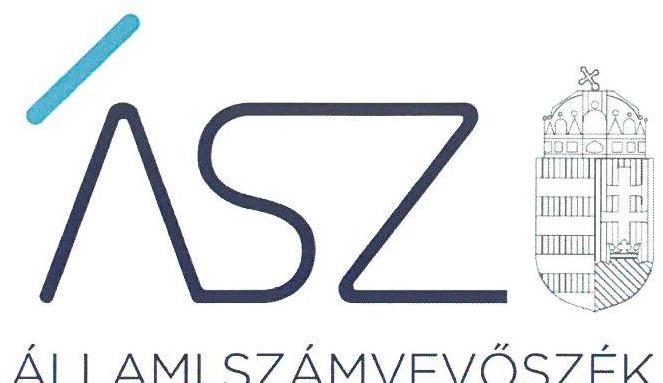
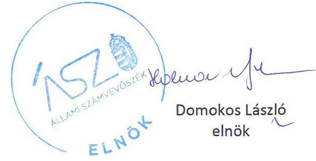

ÁLLAMI SZÁMVEVŐSZÉK

# JELENTÉS 

Nemzeti tulajdonú gazdasági társaságok ellenőrzése

Gyulai Várszínház Nonprofit Kft.
2020.

20200
www.asz.hu

---

ÁLLAMI SZÁMVEVŐSZÉK

# JELENTÉS

Nemzeti tulajdonú gazdasági társaságok ellenőrzése

Gyulai Várszínház Nonprofit Kft.

2020.
10. hó 14. nap

20200
www.asz.hu

---

# AZ ELLENŐRZÉST FELÜGYELTE: 

KLINGA LÁSZLÓ felügyeleti vezető

## AZ ELLENŐRZÉST VEZETTE ÉS A VÉGREHAJTÁSÁÉRT FELELŐS:

ÓDOR ZOLTÁN TAMÁS ellenőrzésvezető

## A PROGRAM ÖSSZEÁLLÍTÁSÁÉRT FELELŐS:

TÓTPÁL SZABOLCS osztályvezető
FEKETE-NAGY ANDRÁS GÁBOR ellenőrzési program elkészítéséért felelős vezető

## IKTATÓSZÁM: EL-2921-001/2020

Jelentéseink az Országgyűlés számítógépes hálózatán és az interneten a www.asz.hu címen is olvashatóak.

TÉMASZÁM: 2478
ELLENŐRZÉS-AZONOSÍTÓ SZÁM: V082251, V82263, V085717

---

# TARTALOMJEGYZÉK 

■ ÖSSZEGZÉS ..... 5
■ AZ ELLENŐRZÉS CÉLJA ..... 6
■ AZ ELLENŐRZÉS TERÜLETE ..... 7
■ AZ ELLENŐRZÉS HÁTTERE, INDOKOLTSÁGA ..... 8
■ A JELENTÉS LÉNYEGES KÉRDÉSKÖREI ..... 9
■ AZ ELLENŐRZÉS HATÓKÖRE ÉS MÓDSZEREI ..... 10
■ MEGÁLLAPÍTÁSOK ..... 13
■ JAVASLATOK ..... 15
■ MELLÉKLETEK ..... 17
I. sz. melléklet: Értelmező szótár ..... 17
■ FÜGGELÉKEK ..... 19
I. sz. függelék: Vezetői teljesítmény értékelése ..... 19
II. sz. függelék: Észrevételek ..... 20
■ RÖVIDÍTÉSEK JEGYZÉKE ..... 23

---

.

---

# ÖSSZEGZÉS 

A Gyulai Várszínház Nonprofit Kft. vagyongazdálkodása a 2015-2018. években nem volt szabályszerű, nem biztosította a vagyonnal való elszámoltatható gazdálkodást.

## Az ellenőrzés társadalmi indokoltsága

Az Állami Számvevőszék kiemelt célja, hogy a helyi önkormányzatok gazdálkodásában rejlő pénzügyi kockázatok feltárásával, az államháztartáson kívülre nyújtott költségvetési támogatások és ingyenes vagyonjuttatások, valamint az államháztartáson kívül működő feladatellátó rendszerek ellenőrzéseivel hozzájáruljon ahhoz, hogy a közpénzeket az államháztartáson kívül működő szervezetek is átlátható, rendezett módon használják fel.

Magyarországon az önkormányzatok kötelező és önként vállalt feladataik vonatkozásában is egyre szélesebb körben alkalmazzák a költségvetésen kívüli feladatellátást, ezáltal - a nonprofit szervezetek mellett - az önkormányzati tulajdonú gazdasági társaságok is kiemelt fontosságú szerephez jutottak.

A helyi önkormányzatok tulajdona nemzeti vagyon, melynek megőrzése érdekében kiemelten fontos a nemzeti tulajdonú gazdasági társaságok ellenőrzése. Ellenőrzésüket további társadalmi elvárás is indokolja, részben a gazdálkodásuk körébe tartozó vagyon nagysága, részben az általuk ellátott közszolgáltatások, sajátos feladatellátások, mivel tevékenységükön keresztül a lakosság széles köre kerül kapcsolatba a társaságokkal. A vezetői teljesítményértékelést érintő ellenőrzések lefolytatása a téma jellege, a vezetőknek a társaság működése szempontjából meghatározó szerepe és a társadalmi érdeklődés miatt indokolt.

Az Állami Számvevőszék céljaival és a társadalmi igénnyel összhangban, a gazdasági társaságok kiemelt fontosságú szerepe miatt került sor a Gyulai Várszínház Nonprofit Korlátolt Felelősségű Társaság vagyongazdálkodásának és vezető tisztségviselőjének teljesítményének, illetve Gyula Város Önkormányzata tulajdonosi joggyakorlásának ellenőrzésére.

## Főbb megállapítások, következtetések, javaslatok

A Gyula Város Önkormányzatának a Gyulai Várszínház Nonprofit Kft. feletti tulajdonosi joggyakorlása a 2017-2018. években szabályszerű volt.

A Gyulai Várszínház Nonprofit Kft. vagyongazdálkodási tevékenysége nem volt szabályszerű, a 2015. évben a Társaság a számviteli törvény szerinti leltárkészítési kötelezettségének nem tett eleget, a 2016-2018. években a számviteli beszámolók mérlegtételeit nem támasztotta alá szabályszerű leltárral, ezért az éves beszámolói nem voltak megalapozottak. Leltár hiányában nem volt igazolt, hogy az ellenőrzött években a Társaság beszámolóiban szereplő tételek a valóságban is megtalálhatóak voltak.

A vezető tisztségviselő tevékenysége a 2018. évben nem volt megfelelő, mivel nem biztosította a Társaság gazdálkodásának átlátható működését és annak alapfeltételeit.

Az Állami Számvevőszék a Gyulai Várszínház Nonprofit Kft. ügyvezetőjének három javaslatot fogalmazott meg.

---

# AZ ELLENŐRZÉS CÉLJA 

Az ellenőrzés célja annak megállapítása volt, hogy a tulajdonosi joggyakorló a gazdasági társaságai feletti tulajdonosi joggyakorlás kereteit kialakította-e, tulajdonosi jogait megfelelően gyakorolta-e és kötelezettségeit teljesítette-e, továbbá annak megállapítása, hogy a gazdasági társaság biztosította-e a vagyon védelmét a nyilvántartások szabályszerű vezetése és a mérleg tételeinek leltárral történő alátámasztása útján, valamint szabályszerűen gondoskodott-e a társaság használatában, kezelésében lévő nemzeti vagyon értékének megőrzéséről, gyarapításáról, hasznosításáról. További cél volt annak megítélése, hogy a gazdasági társaság gazdálkodásának a kormányzati szektor hiányára és az államadósságra befolyással bíró elemei megfeleltek-e a jogszabályi előírásoknak. Az ellenőrzés célja volt még a társaság vezetőjének tevékenységében rejlő kockázatok azonosítása az egyes vezetői feladatok ellátásával összhangban.

---

# AZ ELLENŐRZÉS TERÜLETE 

## Gyulai Várszínház Nonprofit Kft. és a kizárólagos tulajdonosi jogokat gyakorló Gyula Város Önkormányzata

Gyula Város Önkormányzata 2015. március 26-án alapította a Gyulai Várszínház Nonprofit Kft.-t. A Társaság ${ }^{1}$ az ellenőrzött időszakban az Önkormányzat² kizárólagos tulajdonában állt.

A Társaság jegyzett tőkéje alapításkor 3,0 millió Ft volt, amelyet az Alapító ${ }^{3}$ 2017. január 26-i döntése alapján 9,6 millió Ft-ra felemelt, és ezt követően az ellenőrzött időszak végéig nem változott.

A Társaság Alapító okirat ${ }^{4}{ }_{1-3}$-ban közhasznú főtevékenységként az előadó-művészet került rögzítésre, amelyet közfeladatként látott el.

A Társaság az ellenőrzött időszakban saját vagyonával gazdálkodott, vagyonkezelt vagyonnal nem rendelkezett, koncessziós szerződést nem kötött. A Társaságnak nem volt másik gazdasági társaságban tulajdoni részesedése.

A Társaság a 2017. június 15-én és a 2018. január 25-én kiadott NGM közlemény ${ }^{5}$ és az Áht. ${ }^{6}$ 109. §. (8) bekezdés alapján kormányzati szektorba sorolt egyéb szervezetek közé tartozott.

A Társaság a Számv. tv. ${ }^{7}$ előírása alapján könyvvizsgálatra nem volt kötelezett.

A Társaság ügyvezetőjének személye az ellenőrzés időszaka alatt kétszer változott, a jelenlegi ügyvezető tisztségét 2017. november 1-jétől látja el, a polgármester személye az ellenőrzött időszak alatt nem változott.

A Társaságnál három tagú Felügyelőbizottság ${ }^{8}$ működött.
A Társaság által foglalkoztatottak átlagos statisztikai létszáma 2015. évben 17 fő volt, 2018. évre 9 főre csökkent.

---

# AZ ELLENŐRZÉS HÁTTERE, INDOKOLTSÁGA 

Az Alaptörvény ${ }^{9}$ 38. cikke alapján az állam és a helyi önkormányzatok tulajdona nemzeti vagyon. A nemzeti vagyon megőrzése, megóvása érdekében kiemelten fontos ezen nemzeti tulajdonú gazdasági társaságok ellenőrzése. Gazdálkodásuk jellemzően a közérdeklődés és a média figyelmének középpontjában áll, amihez hozzájárul a gazdálkodásuk körébe tartozó - a nemzeti vagyon részét képező - vagyon nagysága, illetve az általuk ellátott közszolgáltatások minősége és hatékonysága. Ellenőrzéseink feltárhatják, hogy a tulajdonosi felügyelet hozzájárult-e a szabályszerű gazdálkodáshoz és feladatellátáshoz.

Az ellenőrzés eredményeként meghatározhatóvá válnak a szervezet vagyongazdálkodást érintő kockázatai, ezzel lehetővé téve a kockázatok csökkentését. A megállapítások alapján megfogalmazott számvevőszéki javaslatok hasznosítása elősegítheti a meglévő hibák megszüntetését. A jó gyakorlatok bemutatásával az ÁSZ ${ }^{10}$ hozzájárulhat a követendő megoldások megismertetéséhez, terjesztéséhez.

A Kormány „jól működő állam" megteremtésével, kapcsolatos céljaival összhangban van, hogy olyan vezetői teljesítményértékelési rendszer kerüljön kialakításra és működtetésre, amely hozzájárul a szervezeti teljesítmény növeléséhez, a fejlődési lehetőségek kihasználásához. Az ÁSZ a rendszer kiépítésében vállalt aktív ellenőrzési, értékelési tevékenységével kíván hozzájárulni a „jól irányított állam" megteremtéséhez.

Az Európai Közösséget létrehozó szerződéshez csatolt, a túlzott hiány esetén követendő eljárásról szóló jegyzőkönyv alkalmazásáról megalkotott 2009. május 25-i 479/2009/EK Rendelet II. fejezet 3. cikk (1) bekezdése alapján a tagállamok évente kétszer teljesítenek adatszolgáltatást a Bizottság (Eurostat) részére a tervezett és tényleges kormányzati hiányukról és államadósságuk szintjéről. Az adatszolgáltatás teljesítéséhez kapcsolódóan - összhangban a hivatkozott, és egyéb európai uniós jogszabályokkal - nemcsak az államháztartás, hanem az államháztartáson kívüli, kormányzati szektorba sorolt egyéb szervezetek adatait is figyelembe kell venni, tekintettel arra, hogy mindkét terület gazdálkodása befolyásolja a kormányzati szektor hiányát, az államadósság mértékét.

---

# A JELENTÉS LÉNYEGES KÉRDÉSKÖREI 

1.     - A gazdasági társaság feletti tulajdonosi joggyakorlás megfelel-e a jogszabályi és belső előírásoknak?
2.     - A Társaság vagyongazdálkodási tevékenysége szabályszerű volt-e?
3.     - A Társaság gazdálkodásának a kormányzati szektor hiányára és az államadósságra befolyással bíró elemei megfeleltek-e a jogszabályi előírásoknak?
4. A Társaság vezetőjének tevékenysége megfelelő volt-e?

---

# AZ ELLENŐRZÉS HATÓKÖRE ÉS MÓDSZEREI 

## Az ellenőrzés típusa

Megfelelőségi ellenőrzés.

## Az ellenőrzött időszak

A tulajdonosi joggyakorlás vonatkozásában az ellenőrzött időszak a 2017-2018. évek, az éves beszámolók elfogadása és tulajdonosi ellenőrzése kivételével, amelyeknél az ellenőrzött időszak a 2015-2018. évek.

A Társaság vagyongazdálkodása vonatkozásában az ellenőrzött időszak a 2015-2018. évek.

A Társaság a kormányzati szektor hiányára és az államadósságra befolyással bíró elemei vonatkozásában az ellenőrzött időszak a 2015-2017. évek.

A vezetői teljesítmény ellenőrzése esetében az ellenőrzött időszak a 2018. év.

## Az ellenőrzés tárgya

Az önkormányzat 100%-os tulajdonában lévő gazdasági társaság feletti tulajdonosi joggyakorlás kialakítása és működtetése.

Önkormányzati tulajdonban lévő gazdasági társaság vagyongazdálkodása, saját vagyona tekintetében a vagyonnyilvántartások vezetése, leltára, továbbá a kormányzati szektorba sorolt nemzeti tulajdonban lévő gazdasági társaság gazdálkodásának a kormányzati szektor hiányára és az államadósságra befolyással bíró elemei és a jogszabályi előírásoknak megfelelő adatszolgáltatási kötelezettségük teljesítése.

Az önkormányzati tulajdonban lévő gazdasági társaság vezetői teljesítményének értékelése. Az önkormányzati tulajdonban lévő gazdasági társaság átlátható, szabályszerű, gazdaságos, hatékony, eredményes és felelős gazdálkodásának feltételrendszerének kialakítása, a belső kontrollrendszer és humánpolitikai rendszer működtetése, integritási és korrupciós, valamint a szervezetet és a tevékenységet érintő kockázatok csökkentése.

## Az ellenőrzött szervezet

- Gyula Város Önkormányzata,
- Gyulai Várszínház Nonprofit Kft.

---

# Az ellenőrzés jogalapja 

Az ellenőrzés jogalapját az ÁSZ tv. ${ }^{11}$ 1. § (3) bekezdése és 5. § (3)-(5) bekezdései képezték.

## Az ellenőrzés módszerei

Az ellenőrzést az ellenőrzési program ellenőrzési kérdései, az ellenőrzött időszakban hatályos jogszabályok, az ellenőrzés szakmai szabályok és módszertanok alapján, a nemzetközi standardok figyelembe vételével végezte az ÁSZ.

Az ellenőrzés ideje alatt az ellenőrzött szervezettel történő kapcsolattartást az ÁSZ Szervezeti és Működési Szabályzatának vonatkozó előírásai alapján biztosította az ÁSZ.

A tulajdonosi joggyakorlás kereteinek kialakítását, a tulajdonosi joggyakorló tevékenységét 2017. január 1-től 2018. december 31-éig ellenőrizte az ÁSZ a felügyelőbizottság és a független könyvvizsgáló működéséhez kapcsolódóan, valamint azt, hogy a tulajdonosi joggyakorló - amennyiben a gazdasági társaság feladatellátásához kapcsolódóan határozott meg követelményeket, elvárásokat - a nemzeti vagyon értékének megőrzése érdekében monitorozta-e azok teljesülését.

A gazdasági társaság vagyonhoz kapcsolódó nyilvántartásai vezetésének megfelelősége, valamint a nemzeti vagyon értéke megőrzésének, gyarapításának, hasznosításának szabályszerűsége a 2015. és a 2017-2018. évek tekintetében került ellenőrzésre. A 2015-2018. éveket érintően történt meg a lényeges dokumentumok értékelése.

A vagyonnyilvántartások és a leltár szabályszerűsége esetében az ellenőrzés azokra a legnagyobb értékű tételekre - a lényeges sokaságra - terjedt ki, melyek összértéke eléri a teljes sokaság összértékének 50%-át. A 2015. és a 2017. évek esetében a lényeges sokaságot tételesen ellenőrizte az ÁSZ.

A vezetői teljesítmény értékelése tekintetében a program ellenőrzési szempontjait a szabályszerűségi szempontok szerinti ellenőrzésben a jogszabályi előírások, belső utasítások, belső szabályozók, a tulajdonosi joggyakorlók elvárásai, előírásai, a helyénvalósági szempontok szerinti ellenőrzésben az ÁSZ által általánosan elfogadott, jó gyakorlat szerinti ajánlásai, értékelési kritériumai mentén kerültek meghatározásra. Az ellenőrzési kérdések szerint az összesített értékelés alapján az elért pontok az elérhető pontok minimum 70%-át elérve, a társaság vezetője tevékenységét megfelelőnek, 70% alatt nem megfelelőnek értékelte az ÁSZ.

A gazdasági társaság gazdálkodásának az államadósságra, továbbá a kormányzati szektor hiányára befolyással bíró gazdasági eseményei elszámolásának megfelelősége a 2017. év tekintetében került ellenőrzésre, míg a kormányzati szektorba sorolt gazdasági társaság adatszolgáltatási kötelezettségére vonatkozó jogszabályi előírások betartását a 2017. évre vonatkozóan értékelte az ÁSZ.

Az ellenőrzési kérdések megválaszolásához szükséges bizonyítékok megszerzése a Társaság vonatkozásában a következő ellenőrzési eljárások
 alkalmazásával történt: megfigyelés, információkérés, összehasonlítás,

---

elemző eljárás. Az ellenőrzési bizonyítékként felhasználható adatforrások közé tartoznak az ellenőrzési programban felsorolt adatforrások, továbbá minden - az ellenőrzés folyamán - feltárt, az ellenőrzés szempontjából információkat tartalmazó dokumentum. Az ÁSZ az ellenőrzést a kérdésekre adott válaszok kiértékelésével, valamint a megjelölt adatforrások, a csatolt tanúsítványok felhasználásával, továbbá az adott időszakban hatályos jogszabályok figyelembe vételével folytatta le.

---

# 1. A gazdasági társaság feletti tulajdonosi joggyakorlás megfelel-e a jogszabályi és belső előírásoknak? 

Összegző megállapítás Az Önkormányzat tulajdonosi joggyakorlása szabályszerű volt.

A TÁRSASÁG FELETTI TULAJDONOSI JOGGYAKORLÁS KERETEIT az Önkormányzat az Alapító okirat ${ }_{1-3}$-ban az Önkormányzati $\mathrm{SzMSz}^{12}$-ben, Költségvetési rendelet ${ }_{1-2}{ }^{13}$-ben valamint Vagyonrendeletben ${ }^{14}$ a Mötv. ${ }^{15}$, az Nvtv. ${ }^{16}$ és a Ptk. ${ }^{17}$ előírásai szerint alakította ki.

Az Alapító a Taktv. ${ }^{18}$ előírásai alapján megalkotta a vezető tisztségviselők, a felügyelőbizottsági tagok, az Mt. ${ }^{19}$ 208. §-ának hatálya alá eső munkavállalók javadalmazása, valamint a jogviszony megszűnése esetére biztosított juttatások módjának, mértékének elveiről, annak rendszeréről szóló Javadalmazási szabályzatot ${ }_{1-2}{ }^{20}$.

Az Alapító az Alapító okirat ${ }_{1-3}$ rendelkezései szerint kijelölte a Társaság vezető tisztségviselőjét, a Felügyelőbizottság tagjait, valamint a Ptk. és a Taktv. előírásainak eleget téve meghatározta a Felügyelőbizottság feladatait, hatáskörét, ügyrendjét a jogszabályi előírásoknak megfelelően jóváhagyta.

Az Alapító a Társaság 2015-2018. évi egyszerűsített éves beszámolóit, a Ptk., a Számv. tv. és az Alapító okirat előírásai alapján a Felügyelőbizottság írásbeli jelentése ismeretében fogadta el.

Az Önkormányzat - a Bkr. ${ }^{21}$ 10. § szerinti - a szervezet tevékenységének, a célok megvalósításának nyomon követését biztosító rendszert kialakította.

## 2. A Társaság vagyongazdálkodási tevékenysége szabályszerű volt-e?

Összegző megállapítás

A Társaság vagyongazdálkodási tevékenysége a 2015-2018. években nem volt szabályszerű.

## LELTÁRKÉSZÍTÉSI ÉS LELTÁROZÁSI SZABÁLY-

ZATTAL1-3 ${ }^{22}$ a Társaság a Számv. tv. előírásainak megfelelően rendelkezett az ellenőrzött időszakban, amely tartalmazta a leltározásra és a leltárkészítésre vonatkozó szabályokat, előírásokat.

VAGYONGAZDÁLKODÁSI TEVÉKENYSÉG FELTÉTELEIT a Társaság 2015. és 2016. években nem alakította ki, mert a Számv. tv. 14. § (3) bekezdésében előírtakkal ellentétben nem rendelkezett számviteli politikával - a Leltárkészítési és leltározási szabályzat kivételével -, az annak keretében elkészítendő számviteli szabályzatokkal, valamint a Számv. tv. 161. § (1) bekezdésében foglalt előírás ellenére nem rendelkezett számlarenddel. A Társaság 2017. január 1-jétől szabályszerűen kialakította vagyongazdálkodása feltételeit, a Számv. tv. előírásai alapján rendelkezett Számviteli politikával ${ }^{23}$, és az annak keretében elkészítendő számviteli szabályzatokkal, valamint a Számlarend ${ }^{24}$ kialakítása megfelel a Számv. tv. előírásainak.

A TÁRSASÁG VAGYONGAZDÁLKODÁSA a 2015-2018. években nem volt szabályszerű.

A Társaság a Számv. tv. 69. § (1) bekezdés szerinti leltárkészítési kötelezettségének a 2015. évben nem tett eleget. A 2016-2018. években a Társaság a beszámoló elkészítéséhez, mérlegtételeinek alátámasztásához a Számv. tv. 69. § (1) bekezdésének előírása ellenére nem állított össze szabályszerű leltárt, amely tételesen, ellenőrizhető módon tartalmazta a mérleg fordulónapján meglévő eszközöket és forrásokat mennyiségben és értékben.

# 3. A Társaság gazdálkodásának a kormányzati szektor hiányára és az államadósságra befolyással bíró elemei megfeleltek-e a jogszabályi előírásoknak? 

## Összegző megállapítás

A Társaság adatszolgáltatási kötelezettségének a 2017. évben nem tett eleget.

A Társaság éves beszámolóját nem küldte meg az államháztartásért felelős miniszter részére, ezzel nem tett eleget adatszolgáltatási kötelezettségének, figyelmen kívül hagyva az Áht. 107. § (1) bekezdésre tekintettel az Ávr. ${ }^{25}$ 5. mellékletének 23. pontjában foglaltakat.

## 4. A Társaság vezetőjének tevékenysége megfelelő volt-e?

## Összegző megállapítás

A Társaság ügyvezetőjének 2018. évi tevékenysége nem volt megfelelő.

A Társaság vezetőjének tevékenysége a 2018. évben nem volt megfelelő, a vezető tisztségviselő nem biztosította a társaság gazdálkodásának átlátható működését és annak alapfeltételeit a nemzeti vagyon megőrzése és védelme érdekében.

A Bkr. 6. § (1) bekezdés c) pontja alapján nem alakított ki olyan kontrollkörnyezetet, amelyben meghatározottak, ismertek és elfogadottak az etikai elvárások a szervezet minden szintjén.

A részleteket a II. számú függelék tartalmazza.

---

# JAVASLATOK 

Az ÁSZ tv. 33. § (1) bekezdésében foglaltak értelmében az ellenőrzött szervezet vezetője köteles a jelentésben foglalt megállapításokhoz kapcsolódó intézkedési tervet összeállítani és azt a jelentés kézhezvételétől számított 30 napon belül az ÁSZ részére megküldeni. Amennyiben az ellenőrzött szervezet vezetője nem küldi meg határidőben az intézkedési tervet, vagy továbbra sem elfogadható intézkedési tervet küld, az Állami Számvevőszék elnöke az ÁSZ tv. 33. § (3) bekezdése a) és b) pontjaiban foglaltakat érvényesítheti.

## Gyulai Várszínház Nonprofit Kft. ügyvezetőjének

1. Gondoskodjon az ellenőrzött időszakot követően a mérleg tételeit alátámasztó Számv. tv. előírásai szerinti leltár összeállításáról.
(2.sz. megállapítás 4. bekezdése alapján)
2. Intézkedjen az Áht.-ban előírt, Ávr. szerinti adatszolgáltatási kötelezettség teljesítéséről.
(3. sz. megállapítás 1. bekezdése alapján)
3. Gondoskodjon a kontrollkörnyezet tekintetében az etikai elvárások Bkr. szerinti kialakításáról.
(4. sz. megállapítás 2. bekezdése alapján)

---

.

---

# MELLÉKLETEK 

- I. SZ. MELLÉKLET: ÉRTELMEZŐ SZÓTÁR
gazdasági társaság
koncessziós szerződés
közszolgáltatás
közfeladat
nemzeti vagyon
nemzeti vagyon használója
tulajdonosi jogok gyakorlója
vagyongazdálkodás

Ptk. 3:88. § (1) bekezdése szerint „a gazdasági társaságok üzletszerű közös gazdasági tevékenység folytatására, a tagok vagyoni hozzájárulásával létrehozott, jogi személyiséggel rendelkező vállalkozások, amelyekben a tagok a nyereségből közösen részesednek, és a veszteséget közösen viselik".
Az 1991. évi XVI. tv. alapján a kizárólagos állami, önkormányzati vagy önkormányzati társulási tulajdon hatékony működtetésének, valamint a kizárólagosan az állam vagy az önkormányzat hatáskörébe utalt tevékenységek gyakorlásának egyik lehetséges útja mindezek koncessziós szerződés alapján való átengedése
Az Ebktv. ${ }^{26}$ 3. § d) pontja a következőképpen határozza meg a közszolgáltatást: „szerződéskötési kötelezettség alapján a lakosság alapvető szükségleteinek ellátására irányuló szolgáltatás, így különösen a villamosenergia-, gáz-, hő-, víz-, szennyvíz- és hulladékkezelési, köztisztasági, postai és távközlési szolgáltatás, továbbá a menetrend alapján közlekedő járművekkel végzett közforgalmú személyszállítás".
Az Áht. 3/A. § (1) bekezdése alapján közfeladat a jogszabályban meghatározott állami vagy önkormányzati feladat
Nvtv. 1. § (2) bekezdése szerint nemzeti vagyonba tartozik többek között:
„az állam vagy a helyi önkormányzat kizárólagos tulajdonában álló dolgok,
az a) pont hatálya alá nem tartozó, állam vagy a helyi önkormányzat tulajdonában lévő dolog,
az állam vagy a helyi önkormányzat tulajdonában lévő pénzügyi eszközök, továbbá az államot vagy a helyi önkormányzatot megillető társasági részesedések,
az államot vagy a helyi önkormányzatot megillető bármely vagyoni értékkel rendelkező jogosultság, amelyet jogszabály vagyoni értékű jogként nevesít
A tulajdonosi joggyakorló vagy a nemzeti vagyon használója által a nemzeti vagyon birtoklásának, használatának, hasznok szedése jogának bármely - a tulajdonjog átruházását nem eredményező - jogcímen történő átengedése, ide nem értve a vagyonkezelésbe adást, valamint a haszonélvezeti jog alapítását.
(Forrás: Nvtv. 3. § (1) bekezdés 4. pont)
Azon természetes személy, jogi személy vagy jogi személyiséggel nem rendelkező szervezet, aki vagy amely állami vagyon tekintetében törvény vagy szerződés alapján, a helyi önkormányzat vagyona tekintetében törvény, a helyi önkormányzat rendelete vagy szerződés alapján bármely jogcímen nemzeti vagyont birtokol, használ, szedi annak használt, kivéve a tulajdonosi joggyakorló.
(Forrás: Nvtv. 3. § (1) bekezdés 11. pont)
Aki a nemzeti vagyon felett az államot vagy a helyi önkormányzatot megillető tulajdonosi jogok és kötelezettségek összességének gyakorlására jogosult. (Forrás: Nvtv. 3. § (1) bekezdés 17. pontja)
A nemzeti vagyongazdálkodás feladata a nemzeti vagyon rendeltetésének megfelelő, az állam, az önkormányzat mindenkori teherbíró képességéhez igazodó, elsődlegesen a közfeladatok ellátásához és a mindenkori társadalmi szükségletek kielégítéséhez szükséges, egységes elveken alapuló, átlátható, hatékony és költségtakarékos működtetése, értékének megőrzése, állagának védelme, értéknövelő használata, hasznosítása, gyarapítása, továbbá az állam vagy a helyi önkormányzat feladatának ellátása szempontjából feleslegessé váló vagyontárgyak elidegenítése. (Forrás: Nvtv. 7. § (2) bekezdése).

---

.

---

# FÜGGELÉKEK 

- I. SZ. FÜGGELÉK: VEZETŐI TELJESÍTMÉNY ÉRTÉKELÉSE

Az ellenőrzés az önkormányzati tulajdonban lévő gazdasági társaság vezető tisztségviselőjére terjedt ki. Az ellenőrzés során a megalapozott vezetői teljesítmény értékeléséhez a vezetői feladatok közül a stratégiai irányítást, tervezést, azok megvalósítását, a társaság szabályszerű működése feltételrendszerének kialakítását, a belső kontrollrendszer, valamint a humánpolitikai rendszer működtetését, az integritás szemlélet érvényesítését, illetve a felelős vagyongazdálkodás biztosítását értékeltük.

A Gyulai Várszínház Nonprofit Kft. vezetőjének teljesítményét 2018-ban nem megfelelőnek értékeltük, mert:

- nem dolgozta ki a Társaság középtávú stratégiáját;
- nem határozta meg az etikai elvárásokat és nem biztosította az etikai elvárások érvényesítését;
- nem határozta meg a belső szabályzataiban a társaság a vagyongazdálkodással kapcsolatos feladat- és hatásköröket, felelősségi viszonyokat (különösen az engedélyezésre, jóváhagyásra, döntések meghozatalára vonatkozóan);
- nem dolgozta ki a társaság menedzsmentjére, munkavállalóira és a vagyongazdálkodására vonatkozó összeférhetetlenségi előírásokat;
- nem állt rendelkezésre a vezető jogszabályi előírások szerinti összeférhetetlenségi nyilatkozata és vagyonnyilatkozata;
- a Társaság nem rendelkezett a 2018. évi mérleget alátámasztó leltározással összefüggésben a leltározás elrendelését alátámasztó dokumentummal.

A megfelelően kialakított vezetői teljesítményértékelési rendszerek alapul szolgálnak a vezetői felelősség tudatosításához, és ezáltal a szervezeti teljesítmény fenntartásához, növeléséhez, a fejlődési lehetőségek kihasználásához, hozzájárulhatnak a közvagyonnal való hatékony gazdálkodáshoz.

---

A jelentéstervezetet a Számvevőszék 15 napos észrevételezésre megküldte az ellenőrzött szervezetek vezetőinek az ÁSZ tv. 29. § (1) bekezdése előírása szerint.

Gyula Város Önkormányzatának polgármestere a jelentéstervezetre nem tett észrevételt. A Gyulai Várszínház Nonprofit Kft. ügyvezetője a jelentéstervezet megállapításaira írásban észrevételt tett.
Az ÁSZ tv. 29. § (3) bekezdésével összhangban az ÁSZ a Függelékben feltünteti az ellenőrzés megállapításaival kapcsolatban tett, figyelembe nem vett észrevételeket, és megindokolja, hogy azokat miért nem fogadta el.

[^0]
[^0]:    * 29. § (1) Az Állami Számvevőszék az ellenőrzési megállapításait megküldi az ellenőrzött szervezet vezetőjének vagy az általa megbízott személynek, és annak, akinek személyes felelősségét állapította meg.
    (2) Az ellenőrzött szervezet vezetője és a felelősként megjelölt személy az ellenőrzés megállapításaira tizenöt napon belül írásban észrevételt tehet.
    (3) Az Állami Számvevőszék az észrevételre a beérkezésétől számított harminc napon belül írásban válaszol. A figyelembe nem vett észrevételeket köteles a jelentésben feltüntetni, és megindokolni, hogy azokat miért nem fogadta el.

---

A számvevőszéki jelentéstervezet megállapításaival kapcsolatban a Gyulai Várszínház Nonprofit Kft. ügyvezetője által 2020. augusztus 18-án tett (az Állami Számvevőszékhez 2020. augusztus 24-én érkezett) el nem fogadott észrevételek és azok kezelésének indokolása.

1. A leltározással kapcsolatban tett észrevétel (2. sz. megállapítás 4. bekezdése és a kapcsolódó 1. számú javaslat)

Az ügyvezető észrevétele szerint a Társaság minden évben elkészítette a mérlegtételeit alátámasztó leltárt, azonban csak a leltárösszesítő jelentést küldték meg az ÁSZ részére. Jelezte, hogy amennyiben arra lehetőség van, a részletes leltárt utólagosan rendelkezésre bocsátják.

Az ÁSZ az EL-2117-005/2019. iktatószámú levelében kérte be a Társaságtól a 2016-2018. évekre a leltározáshoz kapcsolódó dokumentumait: leltározási ütemterv, leltározási elrendelő, leltáregyeztetés, kiértékelés, mennyiségi leltárfelvétel, a főkönyvi könyvelés és az analitikus nyilvántartások közötti egyeztetés aláírt és hiteles dokumentumait.

Az ÁSZ ellenőrzési megállapításait kizárólag az ÁSZ tv. 28. § (2) bekezdésben meghatározott adatszolgáltatási időszakon belül megküldött, teljességi és hitelességi nyilatkozattal alátámasztott dokumentumokra alapozva teszi meg. Ügyvezető úr nyilatkozott az adatszolgáltatás során
 arról, hogy az ÁSZ részére átadott dokumentumok, adatok megbízhatóak, és a bekért adatokra, dokumentumokra vonatkozóan teljes körű információt tartalmaznak.

A Számv. tv. 69. § (1) bekezdésében meghatározott leltárkészítési kötelezettség teljesítése keretében a vállalkozónak a főkönyvi könyvelés és az analitikus nyilvántartások adatai közötti egyeztetést az üzleti év mérleg-fordulónapjára vonatkozóan el kell végeznie.

Az ügyvezető észrevételében elismerte, hogy a 2019. december 2-án teljességi és hitelességi nyilatkozattal az ellenőrzés rendelkezésére bocsátott dokumentumok nem tekinthetők teljes körű, a beszámoló sorait maradéktalanul alátámasztó leltárnak. A megküldött dokumentumok áttekintése alapján megállapítottam, hogy a leltárként átadott dokumentumok a beszámoló eszközoldalának soraihoz tartalmaztak kimutatásokat, a 2016. évben a forrásokhoz is. Azonban az átadott kimutatásokban szereplő összegek nem voltak analitikával alátámasztva.

Az előzőek alapján a Társaság az ellenőrzött időszakra vonatkozóan a Számv. tv. 69. § (1) bekezdése előírása ellenére nem rendelkezett a mérleg fordulónapján meglévő eszközeit és forrásait mennyiségben és értékben tételesen, ellenőrizhető módon alátámasztó leltárral, nem végezte el a főkönyvi könyvelés és analitikus nyilvántartás adatai közötti egyeztetést.

# 2. A vezető tisztségviselő tevékenységére tett megállapítással kapcsolatos észrevétel 

Az ügyvezető észrevételében leírta, hogy helytálló a jelentéstervezet megállapítása, miszerint az ellenőrzött időszakban három ügyvezető is ellátta a Társaság irányítási feladatait. A Társaság 2015-ben történt megalapítása után az akkori ügyvezető elkezdte kialakítani a szabályzatokat, irányította a működést, miközben súlyos betegséggel küzdött. 2016-ban bekövetkezett halála után kiderült, hogy az elkészült szabályzatokat már nem írta alá. Miután a Társaság ezt a hibát feltárta, a kinevezett második ügyvezető a kinevezése előtt már elkészült szabályzatokat aláírta, a kinevezését megelőző dátumokkal, mivel más lehetőséget nem láttak azok hatályba helyezésére. Ügyvezető úr a jelentéstervezet II. sz. Függelékében a vezetői teljesítmény értékeléseként tett megállapításokhoz kapcsolódóan leírta, hogy a Társaságnak valóban nincs írásba foglalt középtávú stratégiája. Jelezte továbbá, hogy a Társaság szabályzatai biztosítják a belső kontrollrendszer működését. Etikai elvárásokra, összeférhetetlenségre önálló szabályzatokkal nem rendelkeznek, de több hatályos szabályzatukban szerepelnek etikai, összeférhetetlenségi előírások. Leírta továbbá, hogy összeférhetetlenségi, vagyonnyilatkozat-tételi kötelezettségét évente teljesítette, a nyilatkozatok az alapító önkormányzatnál letétbe vannak helyezve.

A vezetői teljesítményt minősítő megállapításunkat az EL-2117-005/2019. iktatószámú adatbekérő levél 2.B mellékletében és a 2020. január 19-én kelt teljességi és hitelességi nyilatkozattal bizonyíthatóan megküldött dokumentumok kiértékelése alapján tettük meg. A vezető tevékenységében rejlő kockázatok azonosítása a megküldött ellenőrzési program helyénvalósági kritériumainak értékelésén alapult. A helyénvalósági kritériumokat az Állami Számvevőszék a honlapján közzétette.

---

Az ÁSZ a jelentéstervezet 4. sz. megállapítását és a II. sz. Függelékben leírt ellenőrzési megállapításait kizárólag az ÁSZ tv. 28. § (2) bekezdésben meghatározott adatszolgáltatási időszakon belül megküldött, teljességi és hitelességi nyilatkozattal alátámasztott dokumentumokra alapozva tette meg. Az ügyvezető nyilatkozott az adatszolgáltatás során arról, hogy az ÁSZ részére átadott dokumentumok, adatok megbízhatóak, és a bekért adatokra, dokumentumokra vonatkozóan teljes körű információt tartalmaznak.

---

# RÖVIDÍTÉSEK JEGYZÉKE 

${ }^{1}$ Társaság
${ }^{2}$ Önkormányzat
${ }^{3}$ Alapító
${ }^{4}$ Alapító Okirat ${ }_{1}$
Alapító Okirat ${ }_{2}$
Alapító Okirat ${ }_{3}$
${ }^{5}$ NGM közlemény
${ }^{6}$ Áht.
${ }^{7}$ Számv. tv.
${ }^{8}$ Felügyelőbizottság
${ }^{9}$ Alaptörvény
${ }^{10}$ ÁSZ
${ }^{11}$ ÁSZ tv.
${ }^{12}$ önkormányzati SZMSZ
${ }^{13}$ Költségvetési rendelet ${ }_{1}$

Költségvetési rendelet ${ }_{2}$
${ }^{14}$ vagyonrendelet
${ }^{15}$ Mötv.
${ }^{16}$ Nvtv.
${ }^{17}$ Ptk.
${ }^{18}$ Taktv.
${ }^{19}$ Mt.
${ }^{20}$ Javadalmazási Szabályzat ${ }_{1}$

Javadalmazási Szabályzat ${ }_{2}$
${ }^{21}$ Bkr.
${ }^{22}$ Leltárkészítési és Leltározási Szabályzat ${ }_{1}$

Leltárkészítési és Leltározási Szabályzat ${ }_{2}$
Leltárkészítési és Leltározási Szabályzat ${ }_{3}$
${ }^{23}$ Számviteli politika

Gyulai Várszínház Nonprofit Kft.
Gyula Város Önkormányzata
Gyula Város Önkormányzatának Képviselő Testülete, mint a társaság legfőbb szerve
a Társaság 2015. március 26-án kelt Alapító Okirata
a Társaság 2017. január 26-án kelt Alapító Okirata
a Társaság 2017. október 19-én kelt Alapító Okirata
a nemzetgazdasági miniszter közleménye a kormányzati szektorba sorolt egyéb szervezetekről.
2011. évi CXCV. törvény az államháztartásról (hatályos: 2012. január 1-jétől)
a számvitelről szóló 2000. évi C. törvény
Gyulai Várszínház Nonprofit Kft. Felügyelőbizottsága
Magyarország Alaptörvénye
Állami Számvevőszék
Állami Számvevőszékről szóló 2011. évi LXVI. törvény
2/2013. (I. 25.) önkormányzati rendelet Gyula Város Önkormányzata Képviselőtestületének és szerveinek Szervezeti és Működési Szabályzatáról
Gyula Város Önkormányzata Képviselő-testületének 5/2017. (I. 27.)
önkormányzati rendelete a 2017. évi költségvetésről
Gyula Város Önkormányzata Képviselő-testületének 3/2017. (I. 26.)
önkormányzati rendelete a 2018. évi költségvetésről
Gyula Város Önkormányzata Képviselő-testületének 31/2013. (XII. 23.)
önkormányzati rendelete
2011. évi CLXXXIX. törvény Magyarország helyi önkormányzatairól
2011. évi CXCVI. törvény a nemzeti vagyonról
2013. évi V. törvény a Polgári Törvénykönyvről
2009. évi CXXII. törvény a köztulajdonban álló gazdasági társaságok takarékosabb működéséről
2012. évi I. törvény a munka törvénykönyvéről (hatályos: 2012. július 1-jétől)

Gyula Város Önkormányzata többségi befolyása alatt álló gazdasági társaságok Javadalmazási Szabályzata (hatályos: 2013. november 21-étől)
Gyula Város Önkormányzata többségi befolyása alatt álló gazdasági társaságok Javadalmazási Szabályzata (hatályos: 2018. december 13-ától)
a költségvetési szervek belső kontrollrendszeréről és belső ellenőrzéséről szóló 370/2011. (XII. 31.) Korm. rendelet
Gyulai Várszínház Nonprofit Kft. Leltárkészítési és leltározási szabályzata (hatályos: 2015. január 1-jétől)
Gyulai Várszínház Nonprofit Kft. Leltárkészítési és leltározási szabályzata (hatályos: 2016. január 1-jétől)
Gyulai Várszínház Nonprofit Kft. Leltárkészítési és leltározási szabályzata (hatályos: 2017. szeptember 18-ától)
Gyulai Várszínház Nonprofit Kft. Számviteli politikája
(hatályos: 2017. január 1-jétől)

---

${ }^{24}$ Számlarend
${ }^{25}$ Ávr.
${ }^{26}$ Ebktv.

Gyulai Várszínház Nonprofit Kft. Számlarendje (hatályos: 2017. január 1-jétől)
368/2011. (XII. 31.) Korm. rendelet az államháztartásról szóló törvény végrehajtásáról (hatályos: 2012. január 1-jétől)
egyenlő bánásmódról és az esélyegyenlőség előmozdításáról szóló 2003. évi CXXV. törvény

---

# ASZ 

ÁLLAMI SZÁMVEVŐSZÉK
1052 Budapest, Apáczai Cs. J. u. 10. I 1364 Budapest 4. Pf. 54 TEL: +36 14849100
email: szamvevoszek@asz.hu
web: www.asz.hu | www.aszhirportal.hu

