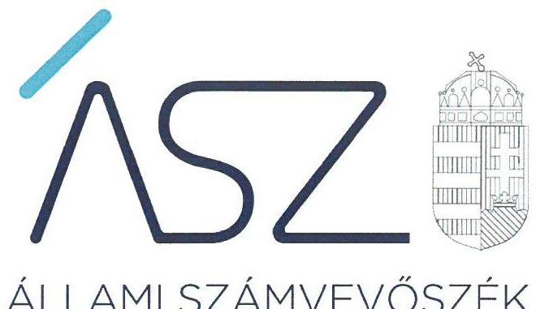
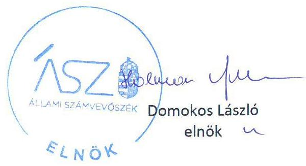

ÁLLAMI SZÁMVEVŐSZÉK

# JELENTÉS 

Nemzeti tulajdonú gazdasági társaságok ellenőrzése

Kiskőrösi Önkormányzat Kommunális Szolgáltató Nonprofit Korlátolt Felelősségű Társaság
2020.

20201
www.asz.hu

---

ÁLLAMI SZÁMVEVŐSZÉK

# JELENTÉS

Nemzeti tulajdonú gazdasági társaságok ellenőrzése

Kiskőrösi Önkormányzat Kommunális Szolgáltató Nonprofit Korlátolt Felelősségű Társaság

2020. 10. hó 14. nap

2021. www.asz.hu

---

# AZ ELLENŐRZÉST FELÜGYELTE: 

KLINGA LÁSZLÓ felügyeleti vezető

## AZ ELLENŐRZÉST VEZETTE ÉS A VÉGREHAJTÁSÁÉRT FELELŐS:

ÓDOR ZOLTÁN TAMÁS ellenőrzésvezető

## A PROGRAM ÖSSZEÁLLÍTÁSÁÉRT FELELŐS:

TÓTPÁL SZABOLCS osztályvezető

FEKETE-NAGY ANDRÁS GÁBOR ellenőrzési program készítéséért felelős vezető

## IKTATÓSZÁM: EL-2940-001/2020

Jelentéseink az Országgyúlés számítógépes hálózatán és az interneten a www.asz.hu címen is olvashatóak.

TÉMASZÁM: 2478

ELLENŐRZÉS-AZONOSÍTÓ SZÁM: V082273, V085709

---

# TARTALOMJEGYZÉK 

■ ÖSSZEGZÉS ..... 5
■ AZ ELLENŐRZÉS CÉLJA ..... 6
■ AZ ELLENŐRZÉS TERÜLETE ..... 7
■ AZ ELLENŐRZÉS HÁTTERE, INDOKOLTSÁGA ..... 8
■ A JELENTÉS LÉNYEGES KÉRDÉSKÖREI ..... 9
■ AZ ELLENŐRZÉS HATÓKÖRE ÉS MÓDSZEREI ..... 10
■ MEGÁLLAPÍTÁSOK ..... 12
■ JAVASLATOK ..... 14
■ MELLÉKLETEK ..... 15
I. sz. melléklet: Értelmező szótár ..... 15
■ FÜGGELÉKEK ..... 17
I. sz. függelék: Vezetői teljesítmény értékelése ..... 17
II. sz. függelék: Észrevételek ..... 18
■ RÖVIDÍTÉSEK JEGYZÉKE ..... 21

---

.

---

# ÖSSZEGZÉS 

A Kiskőrösi Önkormányzat Kommunális Szolgáltató Nonprofit Korlátolt Felelősségű Társaság felett tulajdonosi jogokat gyakorló Kiskőrös Város Önkormányzata tulajdonosi joggyakorlása a 2017-2018 években nem volt szabályszerű. A Kiskőrösi Önkormányzat Kommunális Szolgáltató Nonprofit Korlátolt Felelősségű Társaság vagyongazdálkodása a 20152018. években nem volt szabályszerű, így az átláthatóságot és az elszámoltathatóságot nem biztosította.

## Az ellenőrzés társadalmi indokoltsága

Az Állami Számvevőszék kiemelt célja, hogy a helyi önkormányzatok gazdálkodásában rejlő pénzügyi kockázatok feltárásával, az államháztartáson kívülre nyújtott költségvetési támogatások és ingyenes vagyonjuttatások, valamint az államháztartáson kívül működő feladatellátó rendszerek ellenőrzéseivel hozzájáruljon ahhoz, hogy a közpénzeket az államháztartáson kívül működő szervezetek is átlátható, rendezett módon használják fel.

Magyarországon az önkormányzatok kötelező és önként vállalt feladataik vonatkozásában is egyre szélesebb körben alkalmazzák a költségvetésen kívüli feladatellátást, ezáltal - a nonprofit szervezetek mellett - az önkormányzati tulajdonú gazdasági társaságok is kiemelt fontosságú szerephez jutottak.

A helyi önkormányzatok tulajdona nemzeti vagyon, melynek megőrzése érdekében kiemelten fontos a nemzeti tulajdonú gazdasági társaságok ellenőrzése. Ellenőrzésüket további társadalmi elvárás is indokolja, részben a gazdálkodásuk körébe tartozó vagyon nagysága, részben az általuk ellátott közszolgáltatások, sajátos feladatellátások, mivel tevékenységükön keresztül a lakosság széles köre kerül kapcsolatba a társaságokkal. A vezetői teljesítményértékelést érintő ellenőrzések lefolytatása a téma jellege, a vezetőknek a társaság működése szempontjából meghatározó szerepe és a társadalmi érdeklődés miatt indokolt.

Az Állami Számvevőszék céljaival és a társadalmi igénnyel összhangban, a gazdasági társaságok kiemelt fontosságú szerepe miatt került sor a Kiskőrösi Önkormányzat Kommunális Szolgáltató Nonprofit Korlátolt Felelősségű Társaság vagyongazdálkodásának és vezető tisztségviselője teljesítményének, illetve Kiskőrös Város Önkormányzata tulajdonosi joggyakorlásának ellenőrzésére.

## Főbb megállapítások, következtetések, javaslatok

Kiskőrös Város Önkormányzata tulajdonosi joggyakorlása a 2017-2018. években nem volt szabályszerű, mivel a javadalmazással összefüggő szabályzatának tartalma nem terjedt ki a jogviszony megszűnése esetén biztosított juttatások módjára és mértékére, továbbá a felügyelőbizottság ügyrenddel nem rendelkezett.

Kiskőrös Város Önkormányzatának polgármestere az ellenőrzött időszakot követően a feltárt hiányosságokat felszámolta és intézkedett Kiskőrösi Önkormányzat Kommunális Szolgáltató Nonprofit Kft. javadalmazási szabályzatának megalkotásáról és a Felügyelő bizottság ügyrendjének előírásoknak megfelelő megállapításáról.

A Kiskőrösi Önkormányzat Kommunális Szolgáltató Nonprofit Korlátolt Felelősségű Társaság vagyongazdálkodási tevékenysége nem volt szabályszerű, a 2015-2018. években a számviteli beszámolók mérlegtételeit nem támasztotta alá a Számv. tv. előírásai szerinti leltárral, ezért az egyszerűsített éves beszámolói nem voltak megalapozottak. Szabályszerű leltár hiányában nem volt igazolt, hogy a Társaság beszámolóiban szereplő tételek a valóságban is megtalálhatóak, a közvagyonba tartozó eszközök közfeladat ellátásához rendelkezésre álltak.

A vezető tisztségviselő tevékenysége a 2018. évben nem volt megfelelő, mivel nem biztosította a társaság gazdálkodásának átlátható múködését és annak alapfeltételeit.

Az Állami Számvevőszék Kiskőrös Város Önkormányzata polgármesterének kettő, a Kiskőrösi Önkormányzat Kommunális Szolgáltató Nonprofit Kft. ügyvezetőjének kettő javaslatot fogalmazott meg.

---

# AZ ELLENŐRZÉS CÉLJA 

Az ellenőrzés célja annak megállapítása volt, hogy a tulajdonosi joggyakorló a gazdasági társaságai feletti tulajdonosi joggyakorlás kereteit kialakította-e, tulajdonosi jogait megfelelően gyakorolta-e és kötelezettségeit teljesí-tette-e, továbbá annak megállapítása, hogy a gazdasági társaság biztosította-e a vagyon védelmét a nyilvántartások szabályszerű vezetése és a mérleg tételeinek leltárral történő alátámasztása útján, valamint szabályszerűen gondoskodott-e a társaság használatában, kezelésében lévő nemzeti vagyon értékének megőrzéséről, gyarapításáról, hasznosításáról. További cél volt a Kiskőrösi Önkormányzat Kommunális Szolgáltató Nonprofit Korlátolt Felelősségű Társaság vezetője tevékenységében rejlő kockázatok azonosítása és az egyes vezetői feladatainak értékelése.

---

# AZ ELLENŐRZÉS TERÜLETE

## Kiskőrösi Önkormányzat Kommunális Szolgáltató Nonprofit Korlátolt Felelősségű Társaság és a kizárólagos tulajdonosi jogokat gyakorló Kiskőrös Város Önkormányzata

A Kiskőrösi Önkormányzat Kommunális Szolgáltató Korlátolt Felelősségű Társaságot 1991. január 1-én Kiskőrös Város Önkormányzata alapította. A Társaság az ellenőrzött időszakban az Önkormányzat kizárólagos tulajdonában állt.

A Társaság1 létrejöttének célja az Önkormányzatnak2 a helyi közszolgáltatások körében a Mötv.3 13. § (1) bekezdésében felsorolt, egyes feladatainak4 ellátása. A Társaság Alapító okirat51-2-ban meghatározott főtevékenysége nem veszélyes hulladék gyűjtése. A Társaság jegyzett tőkéje az ellenőrzött időszak alatt 25,0 millió Ft volt.

Az Önkormányzat 2018. február 14. napján alapítói döntéssel a Társaságot nonprofit korlátolt felelősségű társasággá alakította.

A Társaság az ellenőrzött időszakban saját vagyonával gazdálkodott, vagyonkezelt vagyonnal nem rendelkezett, koncessziós szerződést nem kötött. A Társaságnak nem volt másik gazdasági társaságban tulajdoni részesedése.

A Társaság az ellenőrzött időszakban nem tartozott a kormányzati szektorba sorolt egyéb szervezetek közé.

A Társaság ügyvezetőjének személye az ellenőrzés időszaka alatt nem változott, a jelenlegi ügyvezető tisztségét 2015. január 1-től látja el, a polgármester személye az ellenőrzött időszak alatt nem változott.

A Társaságnál az Alapító okiratnak megfelelően három tagú Felügyelőbizottság működött.

A Társaság által foglalkoztatottak száma 2018-ban 32 fő volt.

---

# AZ ELLENŐRZÉS HÁTTERE, INDOKOLTSÁGA 

Az Alaptörvény ${ }^{6} 38$. cikke alapján az állam és a helyi önkormányzatok tulajdona nemzeti vagyon. A nemzeti vagyon megőrzése, megóvása érdekében kiemelten fontos ezen nemzeti tulajdonú gazdasági társaságok ellenőrzése. Gazdálkodásuk jellemzően a közérdeklődés és a média figyelmének középpontjában áll, amihez hozzájárul a gazdálkodásuk körébe tartozó - a nemzeti vagyon részét képező - vagyon nagysága, illetve az általuk ellátott közszolgáltatások minősége és hatékonysága. Ellenőrzéseink feltárhatják, hogy a tulajdonosi felügyelet hozzájárult-e a szabályszerű gazdálkodáshoz és feladatellátáshoz.

Az ellenőrzés eredményeként meghatározhatóvá válnak a szervezet vagyongazdálkodást érintő kockázatai, ezzel lehetővé téve a kockázatok csökkentését. A megállapítások alapján megfogalmazott számvevőszéki javaslatok hasznosítása elősegítheti a meglévő hibák megszüntetését. A jó gyakorlatok bemutatásával az ÁSZ ${ }^{7}$ hozzájárulhat a követendő megoldások megismertetéséhez, terjesztéséhez.

A Kormány „jól irányított állam" megteremtésével, kapcsolatos céljaival összhangban van, hogy olyan vezetői teljesítményértékelési rendszer kerüljön kialakításra és múködtetésre, amely hozzájárul a szervezeti teljesítmény növeléséhez, a fejlődési lehetőségek kihasználásához. Az ÁSZ a rendszer kiépítésében vállalt aktív ellenőrzési, értékelési tevékenységével kíván hozzájárulni a „jól irányított állam" megteremtéséhez.

---

# A JELENTÉS LÉNYEGES KÉRDÉSKÖREI 

1. A gazdasági társaság feletti tulajdonosi joggyakorlás megfelel-e a jogszabályi és belső előírásoknak?
2. A Társaság vagyongazdálkodási tevékenysége szabályszerü volt-e?
3. A Társaság vezetőjének tevékenysége megfelelő volt-e?

---

# AZ ELLENŐRZÉS HATÓKÖRE ÉS MÓDSZEREI 

## Az ellenőrzés típusa

Megfelelőségi ellenőrzés.

## Az ellenőrzött időszak

A tulajdonosi joggyakorlás vonatkozásában az ellenőrzött időszak a 20172018. évek, az éves beszámolók elfogadása és tulajdonosi ellenőrzése kivételével, amelyeknél az ellenőrzött időszak a 2015 - 2018. évek.

A Társaság vagyongazdálkodása vonatkozásában az ellenőrzött időszak a 2015 - 2018. évek.

A vezetői teljesítmény ellenőrzése esetében az ellenőrzött időszak a 2018. év.

## Az ellenőrzés tárgya

Az önkormányzat 100\%-os tulajdonában lévő gazdasági társaság feletti tulajdonosi joggyakorlás kialakítása és múködtetése.

Önkormányzati tulajdonban lévő gazdasági társaság vagyongazdálkodása, saját vagyona tekintetében a vagyonnyilvántartások vezetése, leltára. A társaság használatában, vagyonkezelésében lévő nemzeti vagyon tekintetében a vagyon értékének megőrzése, gyarapítása, hasznosítása.

Az önkormányzati tulajdonban lévő gazdasági társaság vezetői teljesítményének értékelése. Az önkormányzati tulajdonban lévő gazdasági társaság átlátható, szabályszerű, gazdaságos, hatékony, eredményes és felelős gazdálkodásának feltételrendszerének kialakítása, a belső kontrollrendszer és humánpolitikai rendszer múködtetése, integritási és korrupciós, valamint a szervezetet és a tevékenységet érintő kockázatok csökkentése.

## Az ellenőrzött szervezet

- Kiskőrösi Önkormányzat Kommunális Szolgáltató Nonprofit Korlátolt Felelősségű Társaság
- Kiskőrös Város Önkormányzata

## Az ellenőrzés jogalapja

Az ellenőrzés jogalapját az ÁSZ tv6. 1. § (3) bekezdése és 5. § (3)-(5) bekezdései képezték.

---

# Az ellenőrzés módszerei 

Az ellenőrzést az ellenőrzési program ellenőrzési kérdései, az ellenőrzött időszakban hatályos jogszabályok, az ellenőrzés szakmai szabályok és módszertanok alapján, a nemzetközi standardok figyelembe vételével végezte az ÁSZ.

Az ellenőrzés ideje alatt az ellenőrzött szervezettel történő kapcsolattartást az ÁSZ Szervezeti és Múködési Szabályzatának vonatkozó előírásai alapján biztosította az ÁSZ.

A tulajdonosi joggyakorlás kereteinek kialakítását, a tulajdonosi joggyakorló tevékenységét 2017. január 1-től 2018. december 31-éig ellenőrizte az ÁSZ a felügyelő bizottság és a független könyvvizsgáló múködéséhez kapcsolódóan, valamint azt, hogy a tulajdonosi joggyakorló - amennyiben a gazdasági társaság feladatellátásához kapcsolódóan határozott meg követelményeket, elvárásokat - a nemzeti vagyon értékének megőrzése érdekében monitorozta-e azok teljesülését.

A gazdasági társaság vagyonhoz kapcsolódó nyilvántartásai vezetésének megfelelősége, valamint a nemzeti vagyon értéke megőrzésének, gyarapításának, hasznosításának szabályszerűsége a 2015. és a 2017-2018. évek tekintetében került ellenőrzésre. A 2015-2018. éveket érintően történt meg a lényeges dokumentumok értékelése.

A vagyonnyilvántartások és a leltár szabályszerűsége esetében az ellenőrzés azokra a legnagyobb értékű tételekre - a lényeges sokaságra - terjedt ki, melyek összértéke eléri a teljes sokaság összértékének 50\%-át. A 2015. és a 2017. évek esetében a lényeges sokaságot tételesen ellenőrizte az ÁSZ.

A vezetői teljesítmény értékelése tekintetében a program ellenőrzési szempontjait a szabályszerűségi szempontok szerinti ellenőrzésben a jogszabályi előírások, belső utasítások, belső szabályozók, a tulajdonosi joggyakorlók elvárásai, előírásai, a helyénvalósági szempontok szerinti ellenőrzésben az ÁSZ által általánosan elfogadott, jó gyakorlat szerinti ajánlásai, értékelési kritériumai mentén kerültek meghatározásra. Az ellenőrzési kérdések szerint az összesített értékelés alapján az elért pontok az elérhető pontok minimum 70\%-át elérve, a társaság vezetője tevékenységét megfelelőnek, 70\% alatt nem megfelelőnek értékelte az ÁSZ.

Az ellenőrzési kérdések megválaszolásához szükséges bizonyítékok megszerzése a Társaság vonatkozásában a következő ellenőrzési eljárások alkalmazásával történt: megfigyelés, információkérés, összehasonlítás, elemző eljárás. Az ellenőrzési bizonyítékként felhasználható adatforrások közé tartoztak az ellenőrzési programban felsorolt adatforrások, továbbá minden - az ellenőrzés folyamán - feltárt, az ellenőrzés szempontjából információkat tartalmazó dokumentum. Az ÁSZ az ellenőrzést a kérdésekre adott válaszok kiértékelésével, valamint a megjelölt adatforrások, a csatolt tanúsítványok felhasználásával, továbbá az adott időszakban hatályos jogszabályok figyelembe vételével folytatta le.

---

# 1. A gazdasági társaság feletti tulajdonosi joggyakorlás megfelel-e a jogszabályi és belső előírásoknak? 

Összegző megállapítás Az Önkormányzat tulajdonosi joggyakorlása 2017-2018. évben nem volt szabályszerű.

A TÁRSASÁG FELETTI TULAJDONOSI JOGGYAKORLÁS KERETEIT az Önkormányzat az Alapító okirat ${ }_{1-2}$-ban az Önkormányzati $\mathrm{SzMSz}_{1-2}{ }^{9}$-ben, valamint Vagyonrendeletben ${ }^{10}$ a Mötv. ${ }^{11}$, az Nvtv. ${ }^{12}$ és a Ptk. ${ }^{13}$ előírásai szerint alakította ki.

Az Önkormányzat az Alapító Okirat ${ }_{1-2}$ ban, az üzleti tervekben, valamint a Megállapodásban ${ }^{14}$, határozta meg a Társaság tevékenységére vonatkozó elvárásait, követelményeit.

Az Alapító ${ }^{15}$ megalkotta a Társaság Javadalmazási szabályzatát ${ }^{16}$, azonban a Taktv ${ }^{17}$. 5. § (3) bekezdés előírásának ellenére az nem tartalmazta a jogviszony megszűnése esetén biztosított juttatások módjának és mértékének elveit, azok rendszerét.

AZ ALAPÍTÓ kijelölte a Társaság vezető tisztségviselőjét, a Felügyelőbizottság tagjait, valamint a könyvvizsgálót, továbbá a Ptk. és a Taktv. előírásainak eleget téve meghatározta a Felügyelőbizottság feladatait, hatáskörét. A Felügyelőbizottság múködése az ellenőrzött időszakban nem volt szabályszerű, mivel a Ptk.3:122.§ (3) bekezdése ellenére nem rendelkezett ügyrenddel.

Az Alapító a Társaság a 2015-2018. évi egyszerűsített éves beszámolóit, a Ptk., a Számv. tv. ${ }^{18}$ és az Alapító okirat előírásai alapján a Felügyelőbizottság írásbeli jelentése birtokában fogadta el.

Az Önkormányzat - a Bkr. ${ }^{19}$ 10. § szerinti - a szervezet tevékenységének, a célok megvalósításának nyomon követését biztosító rendszert kialakította.

## 2. A Társaság vagyongazdálkodási tevékenysége szabályszerű volt-e?

Összegző megállapítás

A Társaság vagyongazdálkodási tevékenysége a 2015-2018. években nem volt szabályszerű.

## LELTÁRKÉSZÍTÉSI ÉS LELTÁROZÁSI SZABÁLY-

ZATTAL ${ }^{20}$ a Társaság rendelkezett az ellenőrzött időszakban a Számv. tv. előírásainak megfelelően, amely tartalmazta a leltározásra és a leltárkészítésre vonatkozó szabályokat, előírásokat.

---

A Társaság a vagyonnyilvántartás kereteit nem szabályszerűen alakította ki, mert nem rendelkezett Számv. tv. 14. § (5) bekezdés b) pontjában meghatározott eszközök és források értékelési szabályzatával.

A TÁRSASÁG VAGYONGAZDÁLKODÁSA a 2015-2018. években nem volt szabályszerű.

A Társaság a beszámoló elkészítéséhez, mérlegtételeinek alátámasztásához a Számv. tv. 69. § (1) bekezdésének előírása ellenére 2015 - 2018. évekre vonatkozóan nem állított össze szabályszerű leltárt, amely tételesen, ellenőrizhető módon tartalmazza a mérleg fordulónapján meglévő eszközöket és forrásokat mennyiségben és értékben.

# 3. A Társaság vezetőjének tevékenysége megfelelő volt-e? 

## Összegző megállapítás

A Társaság ügyvezetőjének 2018. évi tevékenysége nem volt megfelelő.

A Társaság vezetőjének tevékenysége a 2018. évben nem volt megfelelő, a vezető tisztségviselő nem biztosította a társaság gazdálkodásának átlátható múködését és annak alapfeltételeit a nemzeti vagyon megőrzése és védelme érdekében. A részleteket a I. számú függelék tartalmazza.

---

# JAVASLATOK 

Az ÁSZ tv. 33. § (1) bekezdésében foglaltak értelmében az ellenőrzött szervezet vezetője köteles a jelentésben foglalt megállapításokhoz kapcsolódó intézkedési tervet összeállítani és azt a jelentés kézhezvételétől számított 30 napon belül az ÁSZ részére megküldeni. Amennyiben az ellenőrzött szervezet vezetője nem küldi meg határidőben az intézkedési tervet, vagy továbbra sem elfogadható intézkedési tervet küld, az Állami Számvevőszék elnöke az ÁSZ tv. 33. § (3) bekezdése a) és b) pontjaiban foglaltakat érvényesítheti.

## Kiskőrösi Önkormányzat Kommunális Szolgáltató Nonprofit Kft. ügyvezetőjének

1. Intézkedjen a Számv. tv.-ben elöirt eszközök és források értékelési szabályzatának elkészitéséről.
(2. sz. megállapítás 2. bekezdése alapján)
2. Intézkedjen az ellenőrzött időszakot követően a beszámoló mérleg tételeinek alátámasztásához a Számv. tv.-ben elöírtaknak megfelelő leltár összeállításáról.
(2. sz. megállapítás 4. bekezdése alapján)

## Kiskőrös Város Önkormányzata polgármesterének

1. Kezdeményezze az Alapitónál a Taktv.-ben elöirt tartalmú javadalmazási szabályzat megalkotását.
(1. sz. megállapítás 3. bekezdése alapján)
2. Kezdeményezze, hogy a Felügyelőbizottság a Ptk. elöírásainak megfelelően állapítsa meg ügyrendjét.
(1. sz. megállapítás 4. bekezdés 2. mondata alapján)

---

# MELLÉKLETEK 

- I. SZ. MELLÉKLET: ÉRTELMEZŐ SZÓTÁR
gazdasági társaság
koncessziós szerződés
közszolgáltatás
közfeladat
nemzeti vagyon
nemzeti vagyon hasznosítása
nemzeti vagyon használója
vagyongazdálkodás

Ptk. 3:88. § (1) bekezdése szerint „a gazdasági társaságok üzletszerű közös gazdasági tevékenység folytatására, a tagok vagyoni hozzájárulásával létrehozott, jogi személyiséggel rendelkező vállalkozások, amelyekben a tagok a nyereségből közösen részesednek, és a veszteséget közösen viselik".
Az 1991. évi XVI. tv. alapján a kizárólagos állami, önkormányzati vagy önkormányzati társulási tulajdon hatékony működtetésének, valamint a kizárólagosan az állam vagy az önkormányzat hatáskörébe utalt tevékenységek gyakorlásának egyik lehetséges útja mindezek koncessziós szerződés alapján való átengedése
Az Ebktv. ${ }^{21}$ 3. § d) pontja a következőképpen határozza meg a közszolgáltatást: „szerződéskötési kötelezettség alapján a lakosság alapvető szükségleteinek ellátására irányuló szolgáltatás, így különösen a villamosenergia-, gáz-, hő-, víz-, szennyvíz- és hulladékkezelési, köztisztasági, postai és távközlési szolgáltatás, továbbá a menetrend alapján közlekedő járművekkel végzett közforgalmú személyszállítás".
Az Áht. 3/A. § (1) bekezdése alapján közfeladat a jogszabályban meghatározott állami vagy önkormányzati feladat
Nvtv. 1. § (2) bekezdése szerint nemzeti vagyonba tartozik többek között:
„az állam vagy a helyi önkormányzat kizárólagos tulajdonában álló dolgok,
az a) pont hatálya alá nem tartozó, állam vagy a helyi önkormányzat tulajdonában lévő do$\log$,
az állam vagy a helyi önkormányzat tulajdonában lévő pénzügyi eszközök, továbbá az államot vagy a helyi önkormányzatot megillető társasági részesedések,
az államot vagy a helyi önkormányzatot megillető bármely vagyoni értékkel rendelkező jogosultság, amelyet jogszabály vagyoni értékű jogként nevesít
A tulajdonosi joggyakorló vagy a nemzeti vagyon használója által a nemzeti vagyon birtoklásának, használatának, hasznok szedése jogának bármely - a tulajdonjog átruházását nem eredményező - jogcímen történő átengedése, ide nem értve a vagyonkezelésbe adást, valamint a haszonélvezeti jog alapítását.
Forrás: Nvtv. 3. § (1) bekezdés 4. pont
Azon természetes személy, jogi személy vagy jogi személyiséggel nem rendelkező szervezet, aki vagy amely állami vagyon tekintetében törvény vagy szerződés alapján, a helyi önkormányzat vagyona tekintetében törvény, a helyi önkormányzat rendelete vagy szerződés alapján bármely jogcímen nemzeti vagyont birtokol, használ, szedi annak használt, kivéve a tulajdonosi joggyakorló.
Forrás: Nvtv. 3. § (1) bekezdés 11. pont
Aki a nemzeti vagyon felett az államot vagy a helyi önkormányzatot megillető tulajdonosi jogok és kötelezettségek összességének gyakorlására jogosult. (Forrás: Nvtv. 3. § (1) bekezdés 17. pontja)
A nemzeti vagyongazdálkodás feladata a nemzeti vagyon rendeltetésének megfelelő, az állam, az önkormányzat mindenkori teherbíró képességéhez igazodó, elsődlegesen a közfeladatok ellátásához és a mindenkori társadalmi szükségletek kielégítéséhez szükséges, egységes elveken alapuló, átlátható, hatékony és költségtakarékos működtetése, értékének megőrzése, állagának védelme, értéknövelő használata, hasznosítása, gyarapítása, továbbá az állam vagy a helyi önkormányzat feladatának ellátása szempontjából feleslegessé váló vagyontárgyak elidegenítése. (Forrás: Nvtv. 7. § (2) bekezdése).

---

.

---

# FÜGGELÉKEK 

■ I. SZ. FÜGGELÉK: VEZETŐI TELJESÍTMÉNY ÉRTÉKELÉSE

Az ellenőrzés az önkormányzati tulajdonban lévő gazdasági társaság vezető tisztségviselőjére terjedt ki. Az ellenőrzés során a megalapozott vezetői teljesítmény értékeléséhez a vezetői feladatok közül a stratégiai irányítást, tervezést, azok megvalósítását, a társaság szabályszerű müködése feltételrendszerének kialakítását, a belső kontrollrendszer, valamint a humánpolitikai rendszer müködtetését, az integritás szemlélet érvényesítését, illetve a felelős vagyongazdálkodás biztosítását értékeltük.

A Kiskőrösi Önkormányzat Kommunális Szolgáltató Nonprofit Korlátolt Felelősségű Társaság vezetőjének teljesítményét 2018-ban nem megfelelőnek értékeltük, mert
— nem dolgozta ki a Társaság középtávú stratégiáját;

- nem müködtetett a vezetést támogató információs/kontrolling rendszert;
- nem mérte fel és nem értékelte a szervezetet és a tevékenységet érintő kockázatokat;
- nem határozta meg a belső szabályzataiban a társaság vagyongazdálkodással kapcsolatos feladatás hatáskörét, felelősségi viszonyokat (különösen az engedélyezésre, jóváhagyásra, döntések meghozatalára vonatkozóan);
- nem müködtetett egyéni teljesítményértékelési, és teljesítmény-ösztönző rendszert;
- nem mérte fel a szervezet müködésével kapcsolatos integritási és korrupciós kockázatokat,
- nem dolgozta ki a társaság menedzsmentjére, munkavállalóira és a vagyongazdálkodására vonatkozó összeférhetetlenségi előírásokat;
- nem állt rendelkezésre a vezető jogszabályi előírások szerinti összeférhetetlenségi nyilatkozata és vagyonnyilatkozata;
- a Társaság nem rendelkezett a 2018. évi mérleget alátámasztó leltározással összefüggésben a leltározás elrendelését alátámasztó dokumentummal.

A megfelelően kialakított vezetői teljesítményértékelési rendszerek alapul szolgálnak a vezetői felelősség tudatosításához, és ezáltal a szervezeti teljesítmény fenntartásához, növeléséhez, a fejlődési lehetőségek kihasználásához, hozzájárulhatnak a közvagyonnal való hatékony gazdálkodáshoz.

---

A jelentéstervezetet a Számvevőszék 15 napos észrevételezésre megküldte az ellenőrzött szervezet vezetőjének az ÁSZ tv. 29. §* (1) bekezdése előírásának megfelelően.

Kiskőrös Város Önkormányzatának polgármestere írásban jelezte, hogy a jelentéstervezet megállapításaira nem tesz észrevételt. A Kiskőrösi Önkormányzat Kommunális Szolgáltató Nonprofit Korlátolt Felelősségű Társaság ügyvezetője a jelentéstervezet megállapításaira írásban észrevételt tett.
Az ÁSZ tv. 29. § (3) bekezdésével összhangban az Állami Számvevőszék a Függelékben feltünteti az ellenőrzés megállapításaival kapcsolatban tett, figyelembe nem vett észrevételeket, és megindokolja, hogy azokat miért nem fogadta el.

[^0]
[^0]:    * 29. § (1) Az Állami Számvevőszék az ellenőrzési megállapításait megküldi az ellenőrzött szervezet vezetőjének vagy az általa megbízott személynek, és annak, akinek személyes felelősségét állapította meg.
    (2) Az ellenőrzött szervezet vezetője és a felelősként megjelölt személy az ellenőrzés megállapításaira tizenöt napon belül írásban észrevételt tehet.
    (3) Az Állami Számvevőszék az észrevételre a beérkezésétől számított harminc napon belül írásban válaszol. A figyelembe nem vett észrevételeket köteles a jelentésben feltüntetni, és megindokolni, hogy azokat miért nem fogadta el.

---

A számvevőszéki jelentéstervezet megállapításaival kapcsolatban a Kiskőrösi Önkormányzat Kommunális Szolgáltató Nonprofit Korlátolt Felelősségű Társaság ügyvezetője által a 2020. augusztus 17-én tett (az Állami Számvevőszékhez 2020. augusztus 26-án érkezett) el nem fogadott észrevételek és azok kezelésének indokolása.

# 1. Az eszközök és források értékelési szabályzatának elkészítésére vonatkozó észrevétel 

Az ügyvezető észrevételében jelezte, hogy az eszközök és források értékelési szabályzattal Társaságuk rendelkezett, azonban nem került felcsatolásra az ellenőrzés során. Az eszközök és források értékelési szabályzatát pótlólag megküldték.

Az ÁSZ az EL-1058-016/2018. és EL-2109-005/2019. iktatószámú adatbekérő levélben kérte a Társaság ellenőrzött időszakra vonatkozó eszközök és források értékelési szabályzat megküldését. Az ügyvezető észrevételében nem vitatta, elismerte, hogy az ÁSZ részére eszközök és források értékelési szabályzatot nem adott át. A Társaság ügyvezetője 2019. január 11-én és 2019. január 29-én kelt teljességi és hitelességi nyilatkozatában kijelentette, hogy az átadott dokumentumok, adatok hitelességéért, valódiságáért, hiánytalanságáért és hatályosságáért teljes felelősséget vállal. Az ÁSZ ellenőrzési megállapításait az ellenőrzési adatbekérés során határidőben átadott, hiteles dokumentumok alapján teszi meg.

A fentiek alapján a jelentéstervezet kapcsolódó megállapítása helytálló, módosítása nem indokolt.

## 2. A beszámoló mérleg tételeinek alátámasztásához szükséges leltár összeállításával kapcsolatban érkezett észrevétel

Az ügyvezető az észrevételében jelezte, hogy a Társaság beszámolóinak mérlegtételeit alátámasztó leltárakat az EL-1058-016/2018. iktatószámú adatbekérő levél kapcsán 2019. január 11-én megküldték. A kapcsolódó Teljességi és Hitelességi nyilatkozat a bekért adatokra vonatkozóan az alábbi sorszámok alatt tartalmazta: 3. sorszám - Leltár_2015.pdf, 3.1 sorszám - Leltár_2016.pdf, valamint 3.2 sorszám - Leltár_2017.pdf. A 2018_Leltár.pdf-et az EL-2109-005/2019. iktatószámú adatbekérő levél kapcsán a 2020. január 29-én beküldött Teljessségi és Hitelességi nyilatkozat a bekért adatokra vonatkozóan az 1.1.25.1 sorszám alatt tartalmazta. Tájékoztatást adott arról, hogy az ellenőrzés során megküldött, fentebb felsorolt leltárakat a beszámolók elkészítésének idején a KÖRÖSKOM Nonprofit Kft. könyvvizsgálója vizsgálta és elfogadta.

A Társaság által beküldött dokumentumok ismételt felülvizsgálata során az ÁSZ megállapította, hogy az átadott 20152018. évi leltári dokumentáció nem felel meg a számvitelről szóló 2000. évi C. törvény (továbbiakban: Számv. tv.) 69. § (1) bekezdésében foglalt előírásoknak, mivel 2015. évben a kötelezettségek, 2017. évben a követelések, kötelezettségek, 2018. évben a követelések, aktív időbeli elhatárolások, kötelezettségek esetében tételesen, ellenőrizhető módon nem tartalmazza a Társaságnak a mérleg fordulónapján meglévő eszközeit és forrásait mennyiségben és értékben. A Társaság ügyvezetője a 2019. január 11-én és 2020. január 29-én kelt teljességi és hitelességi nyilatkozatában kijelentette, hogy az átadott dokumentumok, adatok hitelességéért, valódiságáért, hiánytalanságáért és hatályosságáért teljes felelősséget vállal. Az ÁSZ ellenőrzési megállapításait az ellenőrzési adatbekérés során határidőben átadott, hiteles dokumentumok alapján teszi meg.

A fentiek alapján a jelentéstervezet kapcsolódó megállapítása helytálló, módosítása nem indokolt.

## 3. A 2018. évi mérleget alátámasztó leltározással összefüggésben a leltározás elrendelését alátámasztó dokumentummal kapcsolatban érkezett észrevétel

Az ügyvezető az észrevételében jelezte, hogy a Társaság hogy a „Vezetői teljesítmény ellenőrzése modul" keretében az EL-2109-005/2019. iktatószámú adatbekérő levélben kért - leltározáshoz kapcsolódó dokumentumok, leltározási ütemterv, leltározási elrendelő - dokumentumokat 2020. január 29-én megküldték. A Teljességi és Hitelességi nyilatkozat bekért adatokra vonatkozó mellékletében 1.1.21.1.1 sorszámon csatolták a Leltár utasítás.pdf elnevezésű dokumentumot. A dokumentum tartalma: Leltárutasítás és leltározási ütemterv a 2018. évi vagyonmegállapító leltár végrehajtására."

A Társaság által beküldött dokumentumok ismételt felülvizsgálata során az ÁSZ megállapította, hogy a 2018. évi vagyonmegállapító leltár elrendelésének igazolására megküldött „Leltárutasítás és leltározási ütemterv" nem tartalmaz

---

minden eszköz és forrás leltározása tekintetében előírásokat. Abban csak a tárgyi eszközök és készletek leltározásával összefüggésben határoztak meg feladatokat, a többi vagyonelem tekintetében nem. Ebből következően a beküldött „Leltárutasítás és leltározási ütemterv" nem tekinthető a 2018. évi mérleget alátámasztó leltár elrendelését alátámasztó dokumentumnak.

A Társaság ügyvezetője a 2020. január 29-én kelt teljességi és hitelességi nyilatkozatában kijelentette, hogy az átadott dokumentumok, adatok hitelességéért, valódiságáért, hiánytalanságáért és hatályosságáért teljes felelősséget vállal. Az ÁSZ ellenőrzési megállapításait az ellenőrzési adatbekérés során határidőben átadott, hiteles dokumentumok alapján teszi meg.

A fentiek alapján a jelentéstervezet kapcsolódó megállapítása helytálló, módosítása nem indokolt.

---

# RÖVIDÍTÉSEK JEGYZÉKE 

${ }^{1}$ Társaság
${ }^{2}$ Önkormányzat
${ }^{3}$ Mötv.
${ }^{4}$ Vegyes feladatok
${ }^{5}$ Alapító okirat ${ }_{1}$

Alapító okirat ${ }_{2}$
${ }^{6}$ Alaptörvény
${ }^{7}$ ÁSZ
${ }^{8}$ ÁSZ tv
${ }^{9} \mathrm{SzMSz}_{1}$

SzMSz $_{2}$
${ }^{10}$ Vagyongazdálkodási rendelet
${ }^{11}$ Mötv.
${ }^{12}$ Nvtv.
${ }^{13}$ Ptk.
${ }^{14}$ Megállapodás
${ }^{15}$ Alapító
${ }^{16}$ Javadalmazási szabályzat
${ }^{17}$ Taktv.
${ }^{18}$ Számv.tv.
${ }^{19}$ Bkr.
${ }^{20}$ Leltározási szabályzat
${ }^{21}$ Ebktv.

Kiskőrösi Önkormányzat Kommunális Szolgáltató Korlátolt Felelősségű Társaság Kiskőrös Város Önkormányzata
Magyarország helyi önkormányzatairól szóló 2011. évi CLXXXIX. törvény településfejlesztés, településrendezés ; településüzemeltetés ; környezetegészségügy ; helyi környezet- és természetvédelem, vízgazdálkodás, vízkárelháritás; honvédelem, polgári védelem, katasztrófavédelem, helyi közfoglalkoztatás; a kistermelők, őstermelők számára - jogszabályban meghatározott termékeik - értékesítési lehetőségeinek biztosítása, ideértve a hétvégi árusítás lehetőségét is
A Társaság Alaptó okirata (módosításokkal egységes szerkezetbe foglalt, hatályos: 2015. december 16. napjától 2018. február 14. napjáig)
A Társaság Alaptó okirata (módosításokkal egységes szerkezetbe foglalt, hatályos: 2018. február 14. napjától)
Magyarország Alaptörvénye
Állami Számvevőszék
Állami Számvevőszékről szóló 2011. évi LXVI. törvény
Kiskőrös Város Önkormányzata Képviselő Testületének 24/2013. (XII.19.) rendelete az önkormányzat szervezeti és müködési szabályzatáról, egységes szerkezetbe foglalva a 12/2017.(VI.15.) önk.r., valamint a 21/2017.(X.26.) önk.r. módosításaival, hatályos 2018. 02. 15-ig
Kiskőrös Város Önkormányzata Képviselő Testületének 24/2013. (XII.19.) rendelete az önkormányzat szervezeti és müködési szabályzatáról, egységes szerkezetbe foglalva a 4/2018.(II.15.) önk.r., valamint a 10/2018.(VI.21.) önk.r. módosításaival, hatályos 2018. 02. 15-től
Kiskőrös Város Önkormányzata Képviselő-Testületének 26/2012.(XII.19.) önk.rendelete az önkormányzati vagyonról, a vagyon hasznosításáról 2011. évi CLXXXIX. törvény Magyarország helyi önkormányzatairól 2011. évi CXCVI. törvény a nemzeti vagyonról
2013. évi V. törvény a Polgári Törvénykönyvről
az Önkormányzat és a Társaság között 2011. november 4. napján létrejött megállapodás a piac fenntartói és üzemeltetői feladatainak ellátásáról
Kiskőrös Város Önkormányzatának képviselő testülete
Kiskőrösi Önkormányzat Kommunális Szolgáltató Nonprofit Kft javadalmazási szabályzata (Hatályos: 2009.11.31-től)
2009. évi CXXII. törvény a köztulajdonban álló gazdasági társaságok takarékosabb müködéséről (hatályos: 2009. december 4-től)
A számvitelről szóló 2000. évi C. törvény
a költségvetési szervek belső kontrollrendszeréről és belső ellenőrzéséről szóló 370/2011. (XII. 31.) Korm. rendelet
Kiskőrösi Önkormányzat Kommunális Szolgáltató Nonprofit Kft. Leltározási szabályzata (Hatályos: 2015.01.01-től)
egyenlő bánásmódról és az esélyegyenlőség előmozdításáról szóló 2003. évi CXXV. törvény

---

# ASZ 

ALLAMI SZAMVEVOSZEK
1052 Budapest, Apáczai Cs. J. u. 10. I 1364 Budapest 4. Pf. 54 TEL: +36 14849100
email: szamvevoszek@asz.hu
web: www.asz.hu | www.aszhirportal.hu