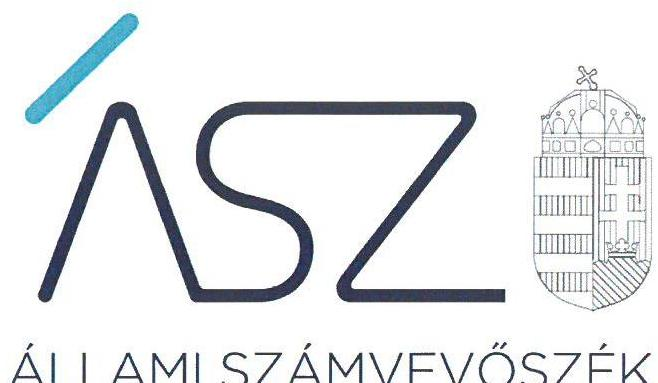
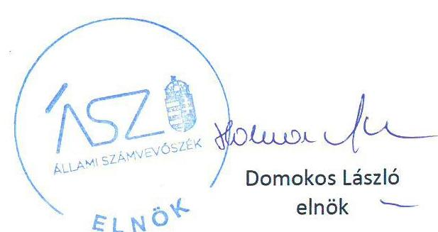
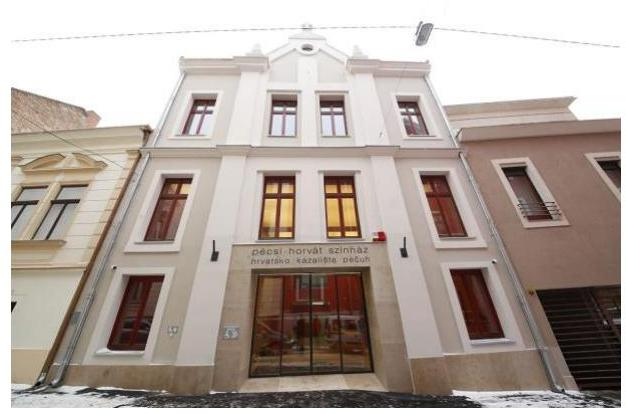

ÁLLAMI SZÁMVEVŐSZÉK

# JELENTÉS 

Nemzeti tulajdonú gazdasági társaságok ellenőrzése

Pécsi Horvát Színház Nonprofit Korlátolt Felelősségű Társaság
2020.

20202
www.asz.hu

---

# JELENTÉS

Nemzeti tulajdonú gazdasági társaságok ellenőrzése

Pécsi Horvát Színház Nonprofit Korlátolt Felelősségű Társaság

2020.
10. hó 14. nap

20202
www.asz.hu

---

# AZ ELLENŐRZÉST FELÜGYELTE: 

KLINGA LÁSZLÓ felügyeleti vezető

## AZ ELLENŐRZÉST VEZETTE ÉS A VÉGREHAJTÁSÁÉRT FELELŐS:

JOÓ ERIKA ellenőrzésvezető
DR. PELLEI TAMÁS ellenőrzésvezető
ÁRPÁSI TIBOR ellenőrzésvezető

## A PROGRAM ÖSSZEÁLLÍTÁSÁÉRT FELELŐS:

TÓTPÁL SZABOLCS osztályvezető

FEKETE-NAGY ANDRÁS GÁBOR projektvezető

Jelentéseink az Országgyúlés számítógépes hálózatán és az interneten a www.asz.hu címen is olvashatóak.

IKTATÓSZÁM: EL-2941-001/2020
TÉMASZÁM: 2478
ELLENŐRZÉS-AZONOSÍTÓ SZÁM: V082252, V085722

---

# TARTALOMJEGYZÉK 

■ ÖSSZEGZÉS ..... 5
■ AZ ELLENŐRZÉS CÉLJA ..... 6
■ AZ ELLENŐRZÉS TERÜLETE ..... 7
■ AZ ELLENŐRZÉS HÁTTERE, INDOKOLTSÁGA ..... 8
■ A JELENTÉS LÉNYEGES KÉRDÉSKÖREI ..... 9
■ AZ ELLENŐRZÉS HATÓKÖRE ÉS MÓDSZEREI ..... 10
■ MEGÁLLAPÍTÁSOK ..... 13
■ JAVASLATOK ..... 15
■ MELLÉKLETEK ..... 17
I. sz. melléklet: Fogalomtár ..... 17
■ FÜGGELÉKEK ..... 19
I. sz. függelék: Vezetői teljesítmény értékelése ..... 19
II. sz. függelék: Észrevételek ..... 20
■ RÖVIDÍTÉSEK JEGYZÉKE ..... 23

---

.

---

# ÖSSZEGZÉS 

Pécs Megyei Jogú Város Önkormányzata a Pécsi Horvát Színház Nonprofit Korlátolt Felelősségű Társaság feletti tulajdonosi jogait 2017-2018-ban szabályszerűen, az Országos Horvát Önkormányzat nem szabályszerűen gyakorolta 2018-ban. A Társaság vagyongazdálkodása a 2015-2018. években nem volt szabályszerű, így a vagyonnal való gazdálkodás során a nemzeti vagyon megőrzése, elszámoltathatósága nem volt biztosított.

## Az ellenőrzés társadalmi indokoltsága

Az Állami Számvevőszék kiemelt célja, hogy a helyi önkormányzatok gazdálkodásában rejlő pénzügyi kockázatok feltárásával, az államháztartáson kívül működő feladatellátó rendszerek ellenőrzéseivel hozzájáruljon ahhoz, hogy a közpénzeket, illetve az ingyenesen juttatott közvagyont az államháztartáson kívül működő szervezetek is átlátható, rendezett módon használják fel.

A helyi önkormányzatok tulajdona nemzeti vagyon, melynek megőrzése, megóvása érdekében kiemelten fontos a nemzeti tulajdonú gazdasági társaságok ellenőrzése. Ellenőrzésüket további társadalmi elvárás is indokolja, részben a gazdálkodásuk körébe tartozó vagyon nagysága, részben az általuk ellátott közszolgáltatások, sajátos feladatellátások, mivel tevékenységükön keresztül a lakosság széles köre kerül kapcsolatba a társaságokkal. A vezetői teljesítményértékelést érintő ellenőrzések lefolytatása a téma jellege, a vezetőknek a társaság működése szempontjából meghatározó szerepe és a társadalmi érdeklődés miatt indokolt.

Az Állami Számvevőszék céljaival és a társadalmi igénnyel összhangban, a gazdasági társaságok kiemelt fontosságú szerepe miatt került sor a Pécsi Horvát Színház Nonprofit Korlátolt Felelősségű Társaság vagyongazdálkodásának és vezető tisztségviselője teljesítményének, illetve a Pécs Megyei Jogú Város Önkormányzata, majd az Országos Horvát Önkormányzat kizárólagos tulajdonában álló tulajdonosi joggyakorlásának ellenőrzésére.

## Főbb megállapítások, következtetések, javaslatok

Pécs Megyei Jogú Város Önkormányzata tulajdonosi jogait szabályszerűen gyakorolta 2017-2018. években. Az Országos Horvát Önkormányzat tulajdonosi joggyakorlása nem volt szabályszerű, mivel a Pécsi Horvát Színház Nonprofit Korlátolt Felelősségű Társaság 2018. évi egyszerűsített éves beszámolóját a felügyelőbizottság írásbeli jelentése nélkül fogadta el.

A Pécsi Horvát Színház Nonprofit Korlátolt Felelősségű Társaság vagyongazdálkodása nem volt szabályszerű, mert 2015-2016. évekre vonatkozóan beszámoló készítési kötelezettségének nem tett eleget. A Pécsi Horvát Színház Nonprofit Korlátolt Felelősségű Társaság a 2015-2018. évi mérlegtételeit nem támasztotta alá a jogszabályi előírásoknak megfelelő leltárral. A Pécsi Horvát Színház Nonprofit Korlátolt Felelősségű Társaság 2017-2018. évi beszámolói nem voltak megalapozottak, nem érvényesült a valódiság számviteli alapelve.

A vezető tisztségviselő tevékenysége 2018. évben nem volt megfelelő, mivel nem biztosította a társaság gazdálkodásának átlátható működését és annak alapfeltételeit.

Az Állami Számvevőszék a jelentésben foglalt megállapítások alapján az Országos Horvát Önkormányzat elnökének egy, a Pécsi Horvát Színház Nonprofit Korlátolt Felelősségű Társaság ügyvezetőjének egy javaslatot fogalmazott meg.

---

# AZ ELLENŐRZÉS CÉLJA 

AZ ELLENŐRZÉS CÉLJA annak megállapítása volt, hogy a tulajdonosi joggyakorló a gazdasági társasága feletti tulajdonosi joggyakorlás kereteit kialakította-e, tulajdonosi jogait megfelelően gyakorolta-e és kötelezettségeit teljesítette-e, továbbá annak megállapítása, hogy a gazdasági társaság biztosította-e a vagyon védelmét a nyilvántartások szabályszerű vezetése és a mérleg tételeinek leltárral történő alátámasztása útján, valamint szabályszerűen gondoskodott-e a társaság használatában lévő nemzeti vagyon értékének megőrzéséről, gyarapításáról, hasznosításáról. Az ellenőrzés célja volt még a gazdasági társaság vezetője tevékenységében rejlő kockázatok azonosítása az egyes vezetői feladatok ellátásával összhangban.

---

# AZ ELLENŐRZÉS TERÜLETE 

## Pécs Megyei Jogú Város Önkormányzata, az Országos Horvát Önkormányzat és a Pécsi Horvát Színház Nonprofit Korlátolt Felelősségű Társaság

Pécs Megyei Jogú Város Önkormányzata 2015. április 1-én alapította a kizárólagos tulajdonában álló Pécsi Horvát Színház Nonprofit Korlátolt Felelősségű Társaságot. A Társaság ${ }^{1}$ fő tevékenysége a Pécsi Horvát Színház működtetése volt. Feladata magyar és horvát nyelvű színházi előadások létrehozása, kisebbségi, főleg horvát szerzők műveinek bemutatása Pécs városában, külföldön és magyarországi horvátok lakta településeken, valamint horvát és más nemzetiségi kulturális rendezvények szervezése, a színházi kultúra népszerűsítése. 2018. december 20-tól a Társaság 100 %-os üzletrészének tulajdonosa az Országos Horvát Önkormányzat.

A Társaság a feladatait 2018. december 19-ig a PMJVÖ²-vel kötött vagyonkezelési megállapodás ${ }^{3}$ alapján vagyonkezelésre átvett ingatlanokban és ingó vagyontárgyakkal, illetve saját eszközeivel látta el. A Társaság működését a PMJVÖ a Fenntartói-közszolgáltatási szerződésben ${ }^{4}$ foglaltak szerint támogatta. A Társaság a feladatait 2018. december 20-tól az $\mathrm{OHO}^{5}$-vel kötött Közszolgáltatói szerződésben ${ }^{6}$ foglaltak szerint, ingyenesen használatba kapott eszközökkel és saját eszközeivel végezte, vagyonkezelt vagyonnal nem rendelkezett.

A Társaság gazdálkodása 2015-2016., 2018. években nyereséges, 2017. évben veszteséges volt. A Társaság saját tőkéjének összege 2015-2018. években meghaladta a 3 M-Ft-os jegyzett tőke összegét. A Társaság más gazdasági társaságban tulajdoni részesedéssel nem rendelkezett.

Az ügyvezető ${ }^{7}$ személye az ellenőrzött időszakban nem változott. A Társaságnál 3 tagú felügyelőbizottság ${ }^{8}$ működött. A Társaság könyvvizsgálójának ${ }^{9}$ személye az ellenőrzött időszakban nem változott.

A Társaság az ellenőrzött időszakban nem minősült kormányzati szektorba sorolt egyéb gazdálkodó szervezetnek.

A polgármester ${ }^{10}$ és a jegyző ${ }^{11}$, illetve az ÖHO ${ }^{12}$ elnöke személyében az ellenőrzött időszakban nem volt változás.

---

# AZ ELLENŐRZÉS HÁTTERE, INDOKOLTSÁGA 

Az Alaptörvény ${ }^{13}$ 38. cikke alapján az állam és a helyi önkormányzatok tulajdona nemzeti vagyon. A nemzeti vagyon megőrzése, megóvása érdekében kiemelten fontos ezen nemzeti tulajdonú gazdasági társaságok ellenőrzése. Gazdálkodásuk jellemzően a közérdeklődés és a média figyelmének középpontjában áll, amihez hozzájárul a gazdálkodásuk körébe tartozó - a nemzeti vagyon részét képező - vagyon nagysága, illetve az általuk ellátott közszolgáltatások minősége és hatékonysága.

Az ÁSZ ${ }^{14}$ ellenőrzései feltárhatják, hogy a tulajdonosi felügyelet hozzá-járult-e a szabályszerű gazdálkodáshoz és feladatellátáshoz. Az ellenőrzés eredményeként meghatározhatóvá válnak a gazdasági társaság vagyongazdálkodást érintő kockázatai, ezzel lehetővé téve a kockázatok csökkentését. A megállapítások alapján megfogalmazott számvevőszéki javaslatok hasznosítása elősegítheti a meglévő hibák megszüntetését. A jó gyakorlatok bemutatásával az ÁSZ hozzájárulhat a követendő megoldások megismertetéséhez, terjesztéséhez.

A Kormány „jól irányított állam" megteremtésével kapcsolatos céljaival összhangban van, hogy olyan vezetői teljesítményértékelési rendszer kerüljön kialakításra és működtetésre, amely hozzájárul a szervezeti teljesítmény növeléséhez, a fejlődési lehetőségek kihasználásához. Az ÁSZ a rendszer kiépítésében vállalt aktív ellenőrzési, értékelési tevékenységével kíván hozzájárulni a „jól irányított állam" megteremtéséhez.

---

# A JELENTÉS LÉNYEGES KÉRDÉSKÖREI 

1. A Társaság feletti tulajdonosi joggyakorlás megfelelt-e az előírásoknak?
2. A Társaság vagyongazdálkodása szabályszerű volt-e?
3. A Társaság vezetőjének tevékenysége megfelelő volt-e?

---

# AZ ELLENŐRZÉS HATÓKÖRE ÉS MÓDSZEREI 

## Az ellenőrzés típusa

Megfelelőségi ellenőrzés.

## Az ellenőrzött időszak

A tulajdonosi joggyakorlás tekintetében az ellenőrzött időszak a 2017-2018. évek az éves beszámolók elfogadása kivételével, amelynél az ellenőrzött időszak a 2015-2018. évek.

A társaság vagyongazdálkodási tevékenységét illetően az ellenőrzött időszak a 2015-2018. évek.

A társaság vezetője teljesítménye tekintetében az ellenőrzött időszak a 2018. év.

## Az ellenőrzés tárgya

A Pécsi Horvát Színház Nonprofit Korlátolt Felelősségű Társaság feletti tulajdonosi joggyakorlás kialakítása és működtetése.

A Pécsi Horvát Színház Nonprofit Korlátolt Felelősségű Társaság vagyongazdálkodási tevékenysége, a társaság használatában lévő nemzeti vagyon, illetve a saját vagyona tekintetében a vagyonnyilvántartások vezetése, leltára, a nemzeti vagyon értékének megőrzése, gyarapítása, hasznosítása.

A Pécsi Horvát Színház Nonprofit Korlátolt Felelősségű Társaság vezetői teljesítményének értékelése. A gazdasági társaság átlátható, szabályszerű, gazdaságos, hatékony, eredményes és felelős gazdálkodása feltételrendszerének kialakítása, a belső kontrollrendszer és humánpolitikai rendszer működtetése. Az integritásszemlélet érvényesítése, illetve a felelős vagyongazdálkodás biztosítása a nemzeti vagyon megőrzése és védelme érdekében.

## Az ellenőrzött szervezet

Pécs Megyei Jogú Város Önkormányzata
Országos Horvát Önkormányzat
Pécsi Horvát Színház Nonprofit Korlátolt Felelősségű Társaság

---

# Az ellenőrzés jogalapja 

Az ellenőrzés jogszabályi alapját az ÁSZ tv. ${ }^{15} 1. \S$ (3) bekezdése és 5. § (3) - (5) bekezdései képezték.

## Az ellenőrzés módszerei

Az ÁSZ az ellenőrzést az ellenőrzési program ellenőrzési kérdései, az ellenőrzött időszakban hatályos jogszabályok, az ellenőrzés szakmai szabályok és módszertanok alapján, a nemzetközi standardok figyelembe vételével végezte.

Az ellenőrzés ideje alatt az ellenőrzött szervezettel történő kapcsolattartást az ÁSZ Szervezeti és Működési Szabályzatának vonatkozó előírásai alapján biztosította az ÁSZ.

Az ÁSZ a 2017-2018. évek vonatkozásában ellenőrizte a tulajdonosi joggyakorlás kereteinek kialakítását, a tulajdonosi joggyakorló tevékenységét a felügyelő bizottság és a független könyvvizsgáló működéséhez kapcsolódóan, valamint azt, hogy a tulajdonosi joggyakorló - amennyiben a gazdasági társaság feladatellátásához kapcsolódóan határozott meg követelményeket, elvárásokat - a nemzeti vagyon értékének megőrzése érdekében monitorozta-e azok teljesülését. Az ÁSZ a 2015-2018. évekre terjedő teljes ellenőrzött időszakra ellenőrizte a tulajdonosi joggyakorló részvételét az éves beszámoló elfogadására vonatkozó döntéshozatalban.

A gazdasági társaság vagyonhoz kapcsolódó nyilvántartásai vezetésének megfelelősége, valamint a nemzeti vagyon értéke megőrzésének, gyarapításának, hasznosításának szabályszerűsége 2015. és 2017-2018. évek tekintetében került ellenőrzésre. A 2015-2018. éveket érintően történt meg a lényeges dokumentumok értékelése, kiemelten a mérleg tételeinek leltárral való alátámasztottsága.

A vagyonnyilvántartások és a leltár, valamint a nemzeti vagyon kezelésének szabályszerűsége esetében az ellenőrzés azokra a legnagyobb értékű tételekre - a lényeges sokaságra - terjedt ki, melyek összértéke elérte a teljes sokaság összértékének 50\%-át. A 2015. és 2017-2018. évek esetében a lényeges sokaságot tételesen ellenőrizte az ÁSZ.

2018-ra vonatkozóan a vezetői teljesítmény ellenőrzési szempontjait a szabályszerűségi szempontok szerinti ellenőrzésben a jogszabályi előírások, belső utasítások, belső szabályozók, a tulajdonosi joggyakorlók elvárásai, előírásai, a helyénvalósági szempontok szerinti ellenőrzésben az ÁSZ által általánosan elfogadott, jó gyakorlat szerinti ajánlásai, értékelési kritériumai mentén kerültek meghatározásra. Az ellenőrzési kérdések szerint az összesített értékelés alapján az elért pontok az elérhető pontok minimum 70\%-át elérve, a társaság vezetője tevékenységét megfelelőnek, 70\% alatt nem megfelelőnek tekintette az ÁSZ.

Az ellenőrzési kérdések megválaszolásához szükséges bizonyítékok megszerzése a következő ellenőrzési eljárások alkalmazásával történt: megfigyelés, információkérés, összehasonlítás, lényeges sokaságból mintavétel, valamint elemző eljárás. Az ellenőrzési bizonyítékként felhasználható adatforrások közé tartoztak az ellenőrzési programban felsorolt adatforrások, továbbá minden - az ellenőrzés folyamán - feltárt, az ellenőrzés

---

szempontjából információkat tartalmazó dokumentum. Az ellenőrzést a kérdésekre adott válaszok kiértékelésével, valamint a megjelölt adatforrások, a csatolt tanúsítványok felhasználásával, továbbá az adott időszakban hatályos jogszabályok figyelembe vételével folytatta le az ÁSZ.

Amennyiben a gazdasági társaság működését és gazdálkodását alapvetően meghatározó dokumentum hiánya miatt, valamely lényeges kérdéskörre vonatkozóan az ÁSZ megállapítást tett, további ellenőrzési tevékenységek az
 adott kérdéskörrel és az azzal szoros logikai kapcsolatban lévő kérdéskörökkel - ráépülő jelleggel - nem kerültek végrehajtásra.

---

# 1. A Társaság feletti tulajdonosi joggyakorlás megfelelt-e az előírásoknak? 

Összegző megállapítás

A PMJVÖ tulajdonosi jogait szabályszerűen gyakorolta, az OHÖ tulajdonosi joggyakorlása nem volt szabályszerű.

Az Alapító ${ }_{1}{ }^{16}$ tulajdonosi joggyakorlása szabályszerű volt a 2018. december 19-ig terjedő időszakban. A tulajdonosi joggyakorlás kereteit az Alapító az Mtv. ${ }^{17}$, az Nvtv. ${ }^{18}$, illetve a Ptk. ${ }^{19}$ előírásainak megfelelően a Közgyűlés SZMSZ-ében ${ }^{20}$, a Vagyonrendeletben ${ }^{21}$, illetve a Társaság Alapító okiratában ${ }^{22}$ határozta meg.

Az Alapító ${ }_{1}$ megalkotta a Taktv. ${ }^{23}$ előírásaival összhangban lévő, a vezető tisztségviselők, a felügyelőbizottság tagjai és az Mt. ${ }^{24} 208. § hatálya alá tartozó munkavállalók javadalmazásáról, valamint a jogviszony megszűnése esetére biztosított juttatások módjának, mértékének elveiről, annak rendszeréről szóló javadalmazási szabályzatot ${ }^{25}$.

Az Alapító ${ }_{1}$ a Ptk. és az Alapító okirat előírásaival összhangban megválasztotta a Társaság vezető tisztségviselőjét, kijelölte a felügyelőbizottság tagjait, elfogadta annak ügyrendjét ${ }^{26}$, kijelölte a könyvvizsgálót.

Az Alapító ${ }_{1}$ a Társaságot a 2015., 2016. és 2017. években beszámoltatatta a tevékenységéről.

Az Alapító ${ }_{1}$ - a Bkr. ${ }^{27} 10. § szerinti - a szervezet tevékenységének, a célok megvalósításának nyomon követését biztosító rendszert kialakította, a Társaság tevékenységének nyomon követését, a vagyonkezelésbe adott nemzeti vagyonnal való gazdálkodást az üzleti tervek elfogadása, a felügyelőbizottság működése, rendszeres beszámolások előírása útján biztosította. Az Alapító ${ }_{1}$ az Áht. ${ }^{28}$-ban foglalt lehetőség alapján belső ellenőrzéseket hajtott végre 2017-2018. évek tekintetében a Társaságnál.

Az Alapító ${ }_{2}$ tulajdonosi joggyakorlása nem volt szabályszerű, mert a Társaság 2018. évi egyszerűsített éves beszámolóját a Ptk. 3:120. § (2) bekezdésében foglaltak ellenére a felügyelőbizottság írásbeli jelentése nélkül fogadta el.

Az Alapító ${ }_{2}$ az Njt. ${ }^{29}$ előírásaival összhangban megalkotott ÖHO SZMSZ-ben ${ }^{30}$ határozta meg a tulajdonosi joggyakorlásának kereteit.

## 2. A Társaság vagyongazdálkodása szabályszerű volt-e?

## Összegző megállapítás

A Társaság vagyongazdálkodása a 2015-2018. években nem volt szabályszerű.

A Társaság az ellenőrzött években rendelkezett a Számv. tv. előírásának megfelelő Leltározási szabályzattal ${ }^{31}$, amely tartalmazta a leltározásra és a

---

leltár összeállítására vonatkozó szabályokat, előírásokat. A vagyonkezelésre átvett vagyon elkülönített nyilvántartásáról a Társaság a Számlarendben ${ }^{32}$ rendelkezett. A saját vagyon, a vagyonkezelésbe vett vagyon, illetve a használatra átvett vagyon nyilvántartása megfelelt a Számv. tv.-ben, a Vagyonkezelési megállapodásban és a Leltározási szabályzatban foglalt előírásoknak. A vagyonkezelt eszközök nyilvántartása a 2015., 2017-2018. években szabályszerű volt.

A Társaság 2015. és 2016. évre vonatkozóan a Számv. tv. 4. § (1) bekezdése előírása ellenére beszámoló készítési kötelezettségének nem tett eleget, mivel a Számv. tv. 20. § (6) bekezdését megsértve a beszámoló mérlege és eredménykimutatása a Társaság képviseletére jogosult személy aláírását nem tartalmazta. A 2017-2018. évek tekintetében a Társaság szabályszerűen tett eleget beszámoló készítési kötelezettségének.

A Társaság a könyvek üzleti év végi zárásához, a beszámoló elkészítéséhez, a mérleg tételeinek alátámasztásához a Számv. tv. 69. § (1) bekezdésében foglaltak ellenére nem állított össze - a mérleg fordulónapján meglévő eszközöket és forrásokat mennyiségben és értékben tételesen, ellenőrizhető módon tartalmazó - leltárt a 2015-2018. évekre, mert azok 2015-2018-ban nem tartalmazták a saját tőke elemeit, 2015-2017-ben a hosszú lejáratú kötelezettségeket.

A Társaság az Alapító okirat, a Vagyonkezelési megállapodás, a Fenntartható közszolgáltatási szerződés, illetve a Közszolgáltatási szerződés előírásainak megfelelően gondoskodott a nemzeti vagyon használatáról. A Társaság a vagyonkezelésében lévő ingatlanokon beruházást, felújítást nem végzett, a vagyonkezelt eszközök továbbhasznosítására nem került sor.

# 3. A Társaság vezetőjének tevékenysége megfelelő volt-e? 

## Összegző megállapítás

A Társaság ügyvezetőjének 2018. évi tevékenysége nem volt megfelelő.

A Társaság vezető tisztségviselője 2018-ban nem biztosította a Társaság gazdálkodásának átlátható működését és annak alapfeltételeit a nemzeti vagyon megőrzése és védelme érdekében. A részletes értékelést az I. sz. Függelék tartalmazza.

---

# JAVASLATOK 

Az ÁSZ tv. 33. § (1) bekezdésében foglaltak értelmében az ellenőrzött szervezet vezetője köteles a jelentésben foglalt megállapításokhoz kapcsolódó intézkedési tervet összeállítani és azt a jelentés kézhezvételétől számított 30 napon belül az ÁSZ részére megküldeni. Amennyiben az ellenőrzött szervezet vezetője nem küldi meg határidőben az intézkedési tervet, vagy továbbra sem elfogadható intézkedési tervet küld, az Állami Számvevőszék elnöke az ÁSZ tv. 33. § (3) bekezdése a) és b) pontjaiban foglaltakat érvényesítheti.

## Pécsi Horvát Színház Nonprofit Korlátolt Felelősségű Társaság ügyvezetőjének

1. Gondoskodjon az ellenőrzött időszakot követően a Számv. tv. előírásai szerint a beszámoló mérleg tételeinek teljes körű leltárral való alátámasztásáról.
(2. sz. megállapítás 3. bekezdése alapján)

## Országos Horvát Önkormányzat elnökének

1. Intézkedjen az ellenőrzött időszakot követően arról, hogy az Alapító a Ptk.-ban előírtaknak megfelelően, a Felügyelő Bizottság írásbeli jelentésének birtokában döntsön a Társaság számviteli beszámolójáról.
(1. sz. megállapítás 6. bekezdés 2. tagmondata alapján)

---

.

---

# MELLÉKLETEK 

- I. SZ. MELLÉKLET: FOGALOMTÁR
gazdasági társaság
kormányzati szektorba sorolt egyéb szervezet
közszolgáltatás
közfeladat
nemzeti vagyon
nemzeti vagyon hasznosítása
tulajdonosi jogok gyakorlója
vagyonkezelői jog

A gazdasági társaságok üzletszerű közös gazdasági tevékenység folytatására, a tagok vagyoni hozzájárulásával létrehozott, jogi személyiséggel rendelkező vállalkozások, amelyekben a tagok a nyereségből közösen részesednek, és a veszteséget közösen viselik. (Forrás: Ptk. 3:88. § (1) bekezdése)
Az a szervezet, amely az Áht. alapján nem része az államháztartásnak, azonban az Európai Közösséget létrehozó szerződéshez csatolt, a túlzott hiány esetén követendő eljárásról szóló jegyzőkönyv alkalmazásáról szóló 2009. május 25-i 479/2009/EK rendelet ${ }^{33}$ szerint a kormányzati szektorba tartozik.
Az Ebktv. ${ }^{34} 3. § d) pontja a következőképpen határozza meg a közszolgáltatást: „szerződéskötési kötelezettség alapján a lakosság alapvető szükségleteinek ellátására irányuló szolgáltatás, így különösen a villamos energia-, gáz-, hő-, víz-, szennyvíz- és hulladékkezelési, köztisztasági, postai és távközlési szolgáltatás, továbbá a menetrend alapján közlekedő járművekkel végzett közforgalmú személyszállítás".
Az Áht. 3/A. § (1) bekezdése alapján közfeladat a jogszabályban meghatározott állami vagy önkormányzati feladat.
Nvtv. ${ }^{35} 1. § (2) bekezdése szerint nemzeti vagyonba tartozik többek között:
„az állam vagy a helyi önkormányzat kizárólagos tulajdonában álló dolgok,
az a) pont hatálya alá nem tartozó, állam vagy a helyi önkormányzat tulajdonában lévő dolog,
az állam vagy a helyi önkormányzat tulajdonában lévő pénzügyi eszközök, továbbá az államot vagy a helyi önkormányzatot megillető társasági részesedések,
az államot vagy a helyi önkormányzatot megillető bármely vagyoni értékkel rendelkező jogosultság, amelyet jogszabály vagyoni értékű jogként nevesít."
A tulajdonosi joggyakorló vagy a nemzeti vagyon használója által a nemzeti vagyon birtoklásának, használatának, hasznok szedése jogának bármely - a tulajdonjog átruházását nem eredményező - jogcímen történő átengedése, ide nem értve a vagyonkezelésbe adást, valamint a haszonélvezeti jog alapítását.
Forrás: Nvtv. 3. § (1) bekezdés 4. pont
Aki a nemzeti vagyon felett az államot vagy a helyi önkormányzatot megillető tulajdonosi jogok és kötelezettségek összességének gyakorlására jogosult. (Forrás: Nvtv. 3. § (1) bekezdés 17. pontja)
A vagyonkezelő köteles a vagyontárgy állagának megóvásáról, jó karbantartásáról, működtetéséről gondoskodni, jogszabályban és szerződésben előírt más kötelezettségét teljesíteni, valamint a vagyontárgyat jogszabályban vagy szerződésben meghatározott célnak megfelelően használni. A vagyonkezelő - a központi költségvetési szervek és a kizárólag közfeladatot ellátó nem központi költségvetési szerv vagyonkezelők kivételével - köteles díjat fizetni, jogszabályban és szerződésben előírt más kötelezettségét teljesíteni, valamint a vagyontárgyat jogszabályban vagy szerződésben meghatározott célnak megfelelően használni. Amennyiben a vagyonkezelő ezen kötelezettségeinek nem tesz eleget, a tulajdonosi joggyakorló jogosult a szerződést azonnali hatállyal felmondani. (Forrás: Vtv. ${ }^{36} 27. § (2), (2a) bekezdések)

---

.

---

# FÜGGELÉKEK 

- I. SZ. FÜGGELÉK: VEZETŐI TELJESÍTMÉNY ÉRTÉKELÉSE

A Pécsi Horvát Színház Nonprofit Korlátolt Felelősségű Társaság vezetőjének teljesítményét 2018-ban nem megfelelőnek értékelte az ÁSZ, mert

- $\quad$ nem dolgozta ki a Társaság középtávú stratégiáját;
- $\quad$ nem működtetett a szervezet teljesítményének értékelése céljából mutatószámokon, mutatószámrendszeren alapuló szervezeti teljesítményértékelési rendszert;
- $\quad$ nem adta ki a szervezeti integritást sértő események kezelésének eljárásrendjét;
- $\quad$ nem működtetett a vezetést támogató információs/kontrolling rendszert;
- az irányítása alatt nem mérték fel és nem értékelték a szervezetet és a tevékenységet érintő kockázatokat, azok kezelésére nem tett intézkedéseket;
- $\quad$ nem működtetett a gazdálkodás, tevékenység folyamataira vonatkozó belső ellenőrzési rendszert;
- $\quad$ nem működtetett egyéni teljesítményértékelési, teljesítményösztönző rendszert;
- $\quad$ nem mérte fel a szervezet működésével kapcsolatos integritási és korrupciós kockázatokat, azok csökkentése érdekében nem tett lépéseket;
- $\quad$ nem dolgozta ki a társaság menedzsmentjére, munkavállalóira és a vagyongazdálkodására vonatkozó összeférhetetlenségi előírásokat;
- $\quad$ nem állt rendelkezésre a vezető jogszabályi előírások szerinti összeférhetetlenségi nyilatkozata és vagyonnyilatkozata;
- $\quad$ nem elemezte a bevételek növelését, a kiadások csökkentését célzó lehetőségeket.

---

A jelentéstervezetet a Számvevőszék 15 napos észrevételezésre megküldte az ellenőrzött szervezetek vezetőinek az ÁSZ tv. 29. § (1) bekezdése előírásának megfelelően.

A jelentéstervezetre Pécs Megyei Jogú Város Önkormányzatának polgármestere nem tett észrevételt.

A Pécsi Horvát Színház Nonprofit Korlátolt Felelősségű Társaság ügyvezetője és az Országos Horvát Önkormányzat elnöke a jelentéstervezet megállapításaira írásban észrevételt tettek.

Az ÁSZ tv. 29. § (3) bekezdésével összhangban az ÁSZ a Függelékben feltünteti az ellenőrzés megállapításaival kapcsolatban tett, figyelembe nem vett észrevételeket, és megindokolja, hogy azokat miért nem fogadta el.

[^0]
[^0]:    * 29. § (1) Az Állami Számvevőszék az ellenőrzési megállapításait megküldi az ellenőrzött szervezet vezetőjének vagy az általa megbízott személynek, és annak, akinek személyes felelősségét állapította meg.
    (2) Az ellenőrzött szervezet vezetője és a felelősként megjelölt személy az ellenőrzés megállapításaira tizenöt napon belül írásban észrevételt tehet.
    (3) Az Állami Számvevőszék az észrevételre a beérkezésétől számított harminc napon belül írásban válaszol. A figyelembe nem vett észrevételeket köteles a jelentésben feltüntetni, és megindokolni, hogy azokat miért nem fogadta el.

---

A számvevőszéki jelentéstervezet megállapításaival kapcsolatban a Pécsi Horvát Színház Nonprofit Korlátolt Felelősségű Társaság ügyvezetője által 2020. augusztus 17-én tett (az Állami Számvevőszékhez 2020. augusztus 26-án érkezett) el nem fogadott észrevételek és azok kezelésének indokolása.

# 1. A Társaság vagyongazdálkodása szabályszerűségére tett megállapításra tett észrevétel 

Az ügyvezető észrevételében jelezte, hogy a 2015. évi beszámoló elektronikus űrlap nem tartalmaz aláírási helyet, a papír alapú kiegészítő mellékleten és közhasznúsági jelentésen szerepel aláírása. Kifejtette, hogy a 2016. évi beszámoló munkapéldánya került beküldésre az ÁSZ részére, azonban rendelkeznek aláírt példánnyal.

Az ÁSZ az EL-0952-003/2018. iktatószámú adatbekérő levél 2. sz. melléklet 3. pontjában kérte a Társaság ellenőrzött időszakra vonatkozó, aláírt és hiteles számviteli törvény szerinti beszámolói megküldését. Az ügyvezető észrevételében nem vitatta, elismerte, hogy az ÁSZ részére az adatszolgáltatás során beküldött 2015. és 2016. évi beszámoló űrlapok nem tartalmazták aláírását.

A Társaság által beküldött dokumentumok felülvizsgálata során az ÁSZ megállapította, hogy a dokumentumok a Társaság 2015. január 1. és 2015. december 31. közötti, valamint 2016. január 1. és 2016. december 31. közötti időszakra vonatkozó
 egyszerűsített éves beszámolói elektronikus űrlapjai, annak kiegészítő mellékletei, a közhasznúsági jelentések, valamint a beszámolókhoz kapcsolódó független könyvvizsgálói jelentések és a felügyelőbizottsági jegyzőkönyvek. A mérleget és az eredménykimutatást tartalmazó elektronikus iratokat az ügyvezető aláírásával egyik évben sem hitelesítette.

## 2. A mérleg tételeinek leltárral való alátámasztásának hiányára tett megállapításra tett észrevétel

Az ügyvezető észrevételében jelezte, hogy a mérleg tételeinek alátámasztásához a 2015-2018. évekre vonatkozóan a saját tőke elemeit pótlólag elkészítették. Kifejtette, hogy a mérlegben a hosszú lejáratú kötelezettségek között szereplő vagyonkezelt eszközök nettó értékéről részletes nyilvántartással rendelkeznek, amely az adatszolgáltatás során az ÁSZ részére nem került csatolásra.

Az ÁSZ az EL-0952-003/2018. iktatószámú adatbekérő levél 2. sz. melléklet 2. pontjában, továbbá az EL-2122005/2019. iktatószámú adatbekérő levél 3A. sz. melléklet 2. pontjában kérte a mérleg tételeit alátámasztó, aláírt és hiteles leltárak megküldését.

Az ügyvezetőnek a jelentéstervezetben rögzített, a mérlegtételek leltárral való alátámasztottsága hiányosság megszüntetésére az ellenőrzött időszakon kívül megtett intézkedéséről nyújtott tájékoztatását köszönettel vettük. Az ügyvezető észrevételében nem vitatta, elismerte, hogy az ÁSZ részére az adatszolgáltatás során a hosszú lejáratú kötelezettségeket tartalmazó nyilvántartást nem küldték be.

## 3. A vezető tisztségviselő tevékenységének minősítésével kapcsolatban tett észrevétel

Az ügyvezető észrevételében jelezte, hogy a köztulajdonban álló gazdasági társaságok takarékosabb működéséről szóló 2009. évi CXXII. törvény előírásai 2020. július 1-jétől teszik kötelezővé az I. Függelékben szereplő egyes feladatok ellátását, a törvény 7/J § kritériumai alapján a Társaságra nézve nem kötelezőek.

A vezetői teljesítményt minősítő megállapításunkat az EL-2122-006/2019. iktatószámú adatbekérő levél 2.B mellékletében bekért és a 2020. január 29-én kelt teljességi és hitelességi nyilatkozattal bizonyíthatóan megküldött dokumentumok kiértékelése alapján tettük meg. Ezen dokumentumok alapján megállapítottuk, hogy az ügyvezető 2018. évben - többek között - nem működtetett a szervezet teljesítményének értékelése céljából mutatószámokon, mutatószámrendszeren alapuló szervezeti teljesítményértékelési rendszert, nem működtetett a vezetést támogató információs/kontrolling rendszert; az irányítása alatt nem mérték fel és nem értékelték a szervezetet és a tevékenységet érintő kockázatokat, azok kezelésére nem tett intézkedéseket, nem működtetett egyéni teljesítményértékelési, teljesítmény-ösztönző rendszert.

---

A számvevőszéki jelentéstervezet megállapításaival kapcsolatban az Országos Horvát Önkormányzat elnöke által 2020. augusztus 18-án tett (az Állami Számvevőszékhez 2020. augusztus 24-én érkezett) el nem fogadott észrevételek és azok kezelésének indokolása.

# A Társaság feletti tulajdonosi joggyakorlásra tett megállapításra tett észrevétel 

Az elnök észrevételében vitatta a jelentéstervezet tulajdonosi joggyakorlás hiányosságára vonatkozó megállapítását. Ennek alátámasztására kifejtette, hogy az OHÖ 2019. május 19-ei ülésén tulajdonosi jogkörben megtárgyalta a Társaság 2018. évi egyszerűsített éves beszámolóját.

Az ÁSZ ellenőrzési megállapításait az ÁSZ tv. 28. § (2) bekezdése alapján az ellenőrzött szervezet által az ellenőrzéséhez kapcsolódóan, az ellenőrzés lefolytatásához a törvényi határidőben rendelkezésre bocsátott, a teljességi és hitelességi nyilatkozatban feltüntetett dokumentumokra alapozza. A teljességi és hitelességi nyilatkozatuk szerint az ÁSZ részére átadott dokumentumok, adatok megbízhatóak, és a bekért adatokra, dokumentumokra vonatkozóan teljes körű információt tartalmaznak. Az észrevételhez mellékletként csatolt, az ÁSZ részére az adatszolgáltatásra biztosított törvényi határidőn kívül megküldött, utólag rendelkezésre bocsátott dokumentumokat az ÁSZ nem értékelte.

Az ÁSZ az EL-2122-001/2019. iktatószámú adatbekérő levél 2. melléklet 1.2 pontjában kérte a Társaság ellenőrzött időszakra vonatkozó számviteli beszámolóját jóváhagyó döntés megküldését.

Az OHÖ által beküldött dokumentumok felülvizsgálata során az ÁSZ megállapította, hogy a „1.1_Beszámoló jóváhagyása.pdf" dokumentum az OHÖ 2019. május 19-i ülésének határozati kivonata a Társaság 2018. évi egyszerűsített éves beszámolójának elfogadásáról. Az OHÖ beküldte továbbá az ÁSZ részére a „1.1_Beszámoló jóváhagyása mell._01.pdf" dokumentumot, amely a Társaság 2018. január 1-2018. december 31. közötti időszakra vonatkozó egyszerűsített éves beszámolója, annak kiegészítő melléklete, a közhasznúsági jelentés, valamint a beszámolóhoz kapcsolódó független könyvvizsgálói jelentés. Az OHÖ a beküldött dokumentumokat a 2019. október 29-i keltezésű, 404-3/24-2019. iktatószámú kísérőlevéllel megküldött Teljességi és hitelességi nyilatkozattal támasztotta alá.

Az OHÖ a beküldött dokumentumokkal nem igazolta, hogy a Társaság 2018. évi beszámolójáról, mint tulajdonosi joggyakorló a felügyelőbizottság írásbeli jelentésének birtokában döntött.

---

# RÖVIDÍTÉSEK JEGYZÉKE 

${ }^{1}$ Társaság
${ }^{2}$ PMJVÖ
${ }^{3}$ Vagyonkezelési megállapodás
${ }^{4}$ Fenntartói közszolgáltatási szerződés
${ }^{5}$ OHÖ
${ }^{6}$ Közszolgáltatási szerződés
${ }^{7}$ ügyvezető
${ }^{8}$ felügyelőbizottság
${ }^{9}$ könyvvizsgáló
${ }^{10}$ polgármester
${ }^{11}$ jegyző
${ }^{12}$ elnök
${ }^{13}$ Alaptörvény
${ }^{14}$ ÁSZ
${ }^{15}$ ÁSZ tv.
${ }^{16}$ Alapító ${ }_{1,2}$

[^0]Pécsi Horvát Színház Nonprofit Korlátolt Felelősségű Társaság
Pécs Megyei Jogú Város Önkormányzata
Pécs Megyei Jogú Város Önkormányzata és a Társaság között létrejött megállapodás vagyonkezelői jog alapításáról (hatályos 2015. április 1. és 2018. augusztus 31. között)
Pécs Megyei Jogú Város Önkormányzata és a Társaság által előadó-művészeti nemzetiségi közszolgáltatás ellátására, az előadó-művészeti szolgáltatások támogatására kötött szerződés (hatályos 2015. április 1-től 2018. december 15-ig)
Országos Horvát Önkormányzat
az Országos Horvát Önkormányzat és a Társaság között előadó-művészeti nemzetiségi közszolgáltatás ellátására létrejött szerződés (hatályos 2018. december 20-tól)
a Társaság ügyvezetője
a Társaság felügyelőbizottsága
a Társaság könyvvizsgálója
Pécs Megyei Jogú Város Önkormányzata polgármestere
Pécs Megyei Jogú Város Önkormányzata Polgármesteri Hivatala jegyzője
Országos Horvát Önkormányzat elnöke
Magyarország Alaptörvénye (hatályos: 2012. január 1-jétől)
Állami Számvevőszék
2011. évi LXVI. törvény az Állami Számvevőszékről (hatályos: 2011. július 1-től)
a Társaság alapítója
Alapító; Pécs Megyei Jogú Város Önkormányzata Közgyűlése mint a Társaság legfőbb szerve (hatályos 2015. április 1-től 2018. december 19-ig)
Alapító; Országos Horvát Önkormányzat Közgyűlése mint a Társaság legfőbb szerve (hatályos 2018. december 20-tól)
2011. évi CLXXXIX. törvény Magyarország helyi önkormányzatairól (hatályos 2012. január 1-től)
2011. évi CXCVI. törvény a nemzeti vagyonról (hatályos 2011. december 31-től)
2013. évi V. törvény a Polgári Törvénykönyvről (hatályos 2014. március 15-től)

Pécs Megyei Jogú Város Önkormányzata Közgyűlésének 18/2013. (V. 22.) önkormányzati rendelete Pécs Megyei Jogú Város Önkormányzat Közgyűlésének Szervezeti és Működési Szabályzatáról (hatályos 2013. május 23-tól)
Pécs Megyei Jogú Város Önkormányzata Közgyűlésének 11/2012. (II. 24.) önkormányzati rendelete az Önkormányzat vagyonával kapcsolatos tulajdonosi jogok gyakorlásának szabályairól (hatályos 2012. március 1-től)
a Társaság Alapító okirata
Alapító okirat1 (hatályos 2015. április 1-től)
Alapító okirat2 (hatályos 2015. június 25-től)
Alapító okirat3 (hatályos 2018. június 21-től)
Alapító okirat4 (hatályos 2018. december 14-től)
2009. évi CXXII. törvény a köztulajdonban álló gazdasági társaságok takarékosabb működéséről (hatályos: 2009. december 4-től)
2012. évi I. törvény a munka törvénykönyvéről (hatályos: 2012. július 1-től)

[^0]:    ${ }^{23}$ Taktv.
    ${ }^{24} \mathrm{Mt}$.

---

${ }^{25}$ Javadalmazási szabályzat
${ }^{26}$ felügyelőbizottság ügyrendje
${ }^{27}$ Bkr.
${ }^{28}$ Áht.
${ }^{29} \mathrm{Njt}$.
${ }^{30}$ OHÖ SzMSz
${ }^{31}$ Leltározási szabályzat
${ }^{32}$ Számlarend
${ }^{33}$ 479/2009/EK rendelet
${ }^{34}$ Ebktv.
${ }^{35}$ Nvtv.
${ }^{36} \mathrm{Vtv}$.
a Társaság javadalmazási szabályzata (hatályos: 2015. április 1-től)
a Társaság felügyelőbizottságának ügyrendje (hatályos 2015. február 26-tól)
a költségvetési szervek belső kontrollrendszeréről és belső ellenőrzéséről szóló 370/2011. (XII. 31.) Korm. rendelet
2011. évi CXCV. törvény az államháztartásról (hatályos 2011. december 31-étől)
2011. évi CLXXIX. törvény a nemzetiségek jogairól (hatályos 2011. december 20-tól)
az Országos Horvát Önkormányzat Közgyűlésének többször módosított 127/2014. (XI. 8.) sz. OHÖ határozata az Országos Horvát Önkormányzat Szervezeti és Működési Szabályzatáról (hatályos 2014. november 8-tól)
a Társaság eszközök és források leltározási szabályzata (hatályos 2015. április 1-től) a Társaság számlarendje (hatályos 2015. április 1-től)
a Tanács 479/2009/EK rendelete az Európai Közösséget létrehozó szerződéshez csatolt, a túlzott hiány esetén követendő eljárásról szóló jegyzőkönyv alkalmazásáról 2003. évi CXXV. törvény az egyenlő bánásmódról és az esélyegyenlőség előmozdításáról (hatályos: 2004. január 27-től)
2011. évi CXCVI. törvény a nemzeti vagyonról (hatályos: 2011. december 31-től) 2007. évi CVI. törvény az állami vagyonról (hatályos: 2007. szeptember 25-től)

---

# ASZ 

ÁLLAMI SZÁMVEVŐSZÉK
1052 Budapest, Apáczai Cs. J. u. 10. I 1364 Budapest 4. Pf. 54 TEL: +36 14849100
email: szamvevoszek@asz.hu
web: www.asz.hu | www.aszhirportal.hu
