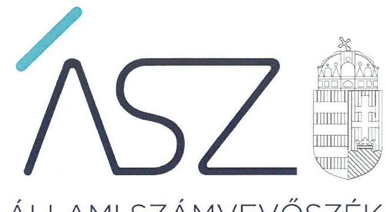
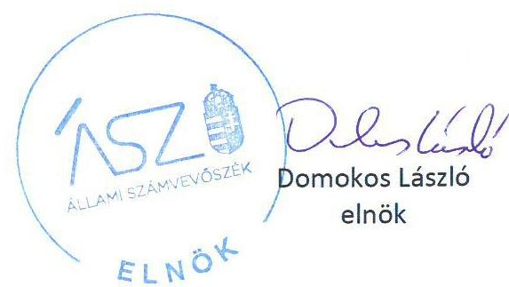
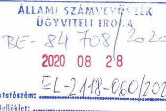
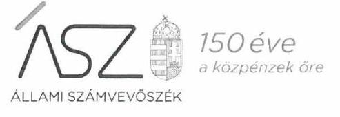
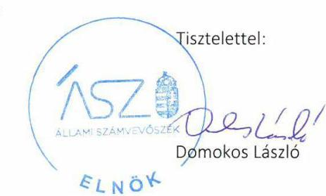
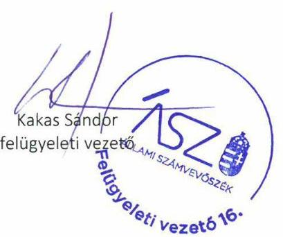

ÁLLAMI SZÁMVEVŐSZÉK

# JELENTÉS

Nemzeti tulajdonú gazdasági társaságok ellenőrzése

Móricz Zsigmond Színház Nonprofit Kft.

2020.

20203
www.asz.hu

---

ÁLLAMI SZÁMVEVŐSZÉK

# JELENTÉS

Nemzeti tulajdonú gazdasági társaságok ellenőrzése

Móricz Zsigmond Színház Nonprofit Kft.

2020. 11. hó 17. nap

2020. 11. www.asz.hu

---

# AZ ELLENŐRZÉST FELÜGYELTE: 

KAKAS SÁNDOR felügyeleti vezető

## AZ ELLENŐRZÉST VEZETTE ÉS A VÉGREHAJTÁSÁÉRT FELELŐS:

ÓDOR ZOLTÁN TAMÁS ellenőrzésvezető

## A PROGRAM ÖSSZEÁLLÍTÁSÁÉRT FELELŐS:

TÓTPÁL SZABOLCS osztályvezető

FEKETE-NAGY ANDRÁS GÁBOR ellenőrzési program elkészítéséért felelős vezető

## IKTATÓSZÁM: EL-2939-001/2020

TÉMASZÁM: 2478

ELLENŐRZÉS-AZONOSÍTÓ SZÁM: V082247, V82260, V085718

---

# TARTALOMJEGYZÉK 

■ ÖSSZEGZÉS ..... 5
■ AZ ELLENŐRZÉS CÉLJA ..... 6
■ AZ ELLENŐRZÉS TERÜLETE ..... 7
■ AZ ELLENŐRZÉS HÁTTERE, INDOKOLTSÁGA ..... 8
■ A JELENTÉS LÉNYEGES KÉRDÉSKÖREI ..... 9
■ AZ ELLENŐRZÉS HATÓKÖRE ÉS MÓDSZEREI ..... 10
■ MEGÁLLAPÍTÁSOK ..... 12
■ JAVASLATOK ..... 14
■ MELLÉKLETEK ..... 15
I. sz. melléklet: Értelmező szótár ..... 15
■ FÜGGELÉK: ÉSZREVÉTELEK ..... 17
■ RÖVIDÍTÉSEK JEGYZÉKE ..... 23

---

.

---

# ÖSSZEGZÉS 

A nyíregyházi Móricz Zsigmond Színház Nonprofit Kft. vagyongazdálkodása a 2015., a 2017. és a 2018. években nem volt szabályszerű, így az elszámoltathatóságot és a nemzeti vagyon megőrzését nem biztosította.

## Az ellenőrzés társadalmi indokoltsága

Az Állami Számvevőszék kiemelt célja, hogy a helyi önkormányzatok gazdálkodásában rejlő pénzügyi kockázatok feltárásával, az államháztartáson kívülre nyújtott költségvetési támogatások és ingyenes vagyonjuttatások, valamint az államháztartáson kívül múködő feladatellátó rendszerek ellenőrzéseivel hozzájáruljon ahhoz, hogy a közpénzeket az államháztartáson kívül múködő szervezetek is átlátható, rendezett módon használják fel.

Magyarországon az önkormányzatok kötelező és önként vállalt feladataik vonatkozásában is egyre szélesebb körben alkalmazzák a költségvetésen kívüli feladatellátást, ezáltal - a nonprofit szervezetek mellett - az önkormányzati tulajdonú gazdasági társaságok is kiemelt fontosságú szerephez jutottak.

A helyi önkormányzatok tulajdona nemzeti vagyon, melynek megőrzése érdekében kiemelten fontos a nemzeti tulajdonú gazdasági társaságok ellenőrzése. Ellenőrzésüket további társadalmi elvárás is indokolja, részben a gazdálkodásuk körébe tartozó vagyon nagysága, részben az általuk ellátott közszolgáltatások, sajátos feladatellátások, mivel tevékenységükön keresztül a lakosság széles köre kerül kapcsolatba a társaságokkal. A vezetői teljesítményértékelést érintő ellenőrzések lefolytatása a téma jellege, a vezetőknek a társaság múködése szempontjából meghatározó szerepe és a társadalmi érdeklődés miatt indokolt.

Az Állami Számvevőszék céljaival és a társadalmi igénnyel összhangban, a gazdasági társaságok kiemelt fontosságú szerepe miatt került sor a Móricz Zsigmond Színház Nonprofit Kft. vagyongazdálkodásának és vezető tisztségviselője teljesítményének, illetve Nyíregyháza Megyei Jogú Város Önkormányzata tulajdonosi joggyakorlásának ellenőrzésére.

## Főbb megállapítások, következtetések, javaslatok

Nyíregyháza Megyei Jogú Város Közgyűlése a tulajdonosi joggyakorlás kereteit a jogszabályi előírásokat követve alakította ki, a javadalmazással összefüggő szabályzatát megalkotta. A tulajdonosi jogok gyakorlása szabályszerű volt.

A Móricz Zsigmond Színház Nonprofit Kft vagyongazdálkodási tevékenysége nem volt szabályszerű a 2015. és 2017-2018. években, mivel a számviteli beszámolók mérlegtételeit nem támasztotta alá szabályszerű leltárral, ezért az éves beszámolói nem voltak megalapozottak. Leltár hiányában nem volt igazolt, hogy ezekben az években a Társaság beszámolóiban szereplő tételek a valóságban is megtalálhatóak, a közvagyonba tartozó eszközök közfeladat ellátásához rendelkezésre állnak. A Társaság vagyongazdálkodása 2016. évben szabályszerű volt.

Az Állami Számvevőszék a Móricz Zsigmond Színház Nonprofit Kft. ügyvezetőjének kettő javaslatot fogalmazott meg.

---

# AZ ELLENŐRZÉS CÉLJA 

AZ ELLENŐRZÉS CÉLJA annak megállapítása volt, hogy a tulajdonosi joggyakorló a gazdasági társaságai feletti tulajdonosi joggyakorlás kereteit kialakította-e, tulajdonosi jogait megfelelően gyakorolta-e és kötelezettségeit teljesítette-e, továbbá annak megállapítása, hogy a gazdasági társaság biztosította-e a vagyon védelmét a nyilvántartások szabályszerű vezetése és a mérleg tételeinek leltárral történő alátámasztása útján, valamint szabályszerűen gondoskodott-e a társaság használatában, kezelésében lévő nemzeti vagyon értékének megőrzéséről, gyarapításáról, hasznosításáról. Az ellenőrzés célja volt annak megítélése is, hogy a gazdasági társaság gazdálkodásának a kormányzati szektor hiányára és az államadósságra befolyással bíró elemei megfeleltek-e a jogszabályi előírásoknak. További cél volt a vezetői tevékenységben rejlő kockázatok azonosítása és az egyes vezetői feladatok értékelése, a vezető és a tulajdonosi joggyakorló támogatása a hiányosságok, illetve további fejlesztendő területek meghatározásában, melyek elősegítik a szabályszerű, célszerű, eredményes és hatékony működés kialakítását.

---

# AZ ELLENŐRZÉS TERÜLETE 

## Móricz Zsigmond Színház Nonprofit Kft. és a kizárólagos tulajdonosi jogokat gyakorló Nyíregyháza Megyei Jogú Város Önkormányzata

Nyíregyháza Megyei Jogú Város Önkormányzata 2013. május 2-án alapította a Móricz Zsigmond Színház Nonprofit Kft.-t a megszüntetett önálló Móricz Zsigmond Színház költségvetési szerv utódszervezeteként. A Társaság ${ }^{1}$ az ellenőrzött időszakban az Önkormányzat² kizárólagos tulajdonában állt.

A Társaság jegyzett tőkéje alapításkor 53,0 millió Ft volt, amely az ellenőrzött időszak végéig nem változott.

A Társaság Alapító okiratai ${ }^{3}$ 1-3-ban közhasznú főtevékenységként az előadó-művészet került rögzítésre, amelyet közfeladatként látott el.

A Társaság az ellenőrzött időszakban saját vagyonával gazdálkodott, vagyonkezelt vagyonnal nem rendelkezett, koncessziós szerződést nem kötött. A Társaságnak nem volt másik gazdasági társaságban tulajdoni részesedése.

A Társaság a 2015. december 30-án kiadott NGM közlemény ${ }^{4}$ és az Áht. ${ }^{5}$ 109. §. (8) bekezdés alapján, kormányzati szektorba sorolt egyéb szervezetek közé tartozott.

A Társaság a Számv. tv. ${ }^{6}$ előírása alapján könyvvizsgálatra kötelezett volt.

A Társaság ügyvezetőjének személye az ellenőrzés időszaka alatt kétszer változott, a jelenlegi ügyvezető tisztségét 2016. február 10-től látja el, a polgármester személye az ellenőrzött időszak alatt nem változott.

A Társaságnál három tagú Felügyelő Bizottság múködött, személyük és létszámuk az ellenőrzési időszak alatt nem változott

A Társaság által foglalkoztatottak száma 2018. évben 106 fő volt.

---

# AZ ELLENŐRZÉS HÁTTERE, INDOKOLTSÁGA 

Az Alaptörvény ${ }^{7}$ 38. cikke alapján az állam és a helyi önkormányzatok tulajdona nemzeti vagyon. A nemzeti vagyon megőrzése, megóvása érdekében kiemelten fontos ezen nemzeti tulajdonú gazdasági társaságok ellenőrzése. Gazdálkodásuk jellemzően a közérdeklődés és a médiafigyelmének középpontjában áll, amihez hozzájárul a gazdálkodásuk körébe tartozó vagyon nagysága, illetve az általuk ellátott közszolgáltatások minősége és hatékonysága. Ellenőrzéseink feltárhatják, hogy a tulajdonosi felügyelet hozzájárult-e a szabályszerű gazdálkodáshoz és feladatellátáshoz.

Az ellenőrzés eredményeként meghatározhatóvá válnak a szervezet vagyongazdálkodást érintő kockázatai, ezzel lehetővé téve a kockázatok csökkentését. A megállapítások alapján megfogalmazott számvevőszéki javaslatok hasznosítása elősegítheti a meglévő hibák megszüntetését. A jó gyakorlatok bemutatásával az ÁSZ hozzájárulhat a követendő megoldások megismertetéséhez, terjesztéséhez.

A Kormány „jól múködő állam" megteremtésével kapcsolatos céljaival összhangban van, hogy olyan vezetői teljesítményértékelési rendszer kerüljön kialakításra és múködtetésre, amely hozzájárul a szervezeti teljesítmény növeléséhez, a fejlődési lehetőségek kihasználásához. Az ÁSZ a rendszer kiépítésében vállalt aktív ellenőrzési, értékelési tevékenységével kíván hozzájárulni a „jól irányított állam" megteremtéséhez.

---

# A JELENTÉS LÉNYEGES KÉRDÉSKÖREI 

1.     - A gazdasági társaság feletti tulajdonosi joggyakorlás megfelel-e a jogszabályi és belső előírásoknak?
2.     - A Társaság vagyongazdálkodási tevékenysége szabályszerü volt-e?
3.     - A Társaság gazdálkodásának a kormányzati szektor hiányára és az államadósságra befolyással bíró elemei megfeleltek-e a jogszabályi előírásoknak?
4. A Társaság vezetőjének tevékenysége megfelelő volt-e?

---

# AZ ELLENŐRZÉS HATÓKÖRE ÉS MÓDSZEREI 

## Az ellenőrzés típusa

Megfelelőségi ellenőrzés.

## Az ellenőrzött időszak

A tulajdonosi joggyakorlás vonatkozásában az ellenőrzött időszak a 20172018 évek, az éves beszámolók elfogadása és tulajdonosi ellenőrzése kivételével, amelyeknél az ellenőrzött időszak 2015-2018. évek.

A Társaság vagyongazdálkodása vonatkozásában az ellenőrzött időszak 2015-2018. évek.

A Társaság a kormányzati szektor hiányára és az államadósságra befolyással bíró elemei vonatkozásában az ellenőrzött időszak 2015-2017. évek.

A vezetői teljesítmény értékelése tekintetében az ellenőrzött időszak 2018. év.

## Az ellenőrzés tárgya

Az önkormányzat 100\%-os tulajdonában lévő gazdasági társaság feletti tulajdonosi joggyakorlás kialakítása és múködtetése.

Önkormányzati tulajdonban lévő gazdasági társaság vagyongazdálkodása, saját vagyona tekintetében a vagyonnyilvántartások vezetése, leltára, továbbá a kormányzati szektorba sorolt nemzeti tulajdonban lévő gazdasági társaság gazdálkodásának a kormányzati szektor hiányára és az államadósságra befolyással bíró elemei és a jogszabályi előírásoknak megfelelő adatszolgáltatási kötelezettségük teljesítése.

Az önkormányzati tulajdonban lévő gazdasági társaság vezetői teljesítményének értékelése. Az önkormányzati tulajdonban lévő gazdasági társaság átlátható, szabályszerű, gazdaságos, hatékony, eredményes és felelős gazdálkodásának feltételrendszerének kialakítása, a belső kontrollrendszer és humánpolitikai rendszer múködtetése, integritási és korrupciós, valamint a szervezetet és a tevékenységet érintő kockázatok csökkentése

## Az ellenőrzött szervezet

- Nyíregyháza Megyei Jogú Város Önkormányzata,
- Móricz Zsigmond Színház Nonprofit Kft.

---

# Az ellenőrzés jogalapja 

Az ellenőrzés jogalapját az ÁSZ tv. 1. § (3) bekezdése és 5. § (3)-(5) bekezdései képezték.

## Az ellenőrzés módszerei

Az ellenőrzést az ellenőrzési program ellenőrzési kérdései, az ellenőrzött időszakban hatályos jogszabályok, az ellenőrzés szakmai szabályok és módszertanok alapján, a nemzetközi standardok figyelembe vételével végezte az ÁSZ.

Az ellenőrzés ideje alatt az ellenőrzött szervezettel történő kapcsolattartást az ÁSZ Szervezeti és Múködési Szabályzatának vonatkozó előírásai alapján biztosította az ÁSZ.

Az ÁSZ a tulajdonosi joggyakorlás kereteinek kialakítását, a tulajdonosi joggyakorló tevékenységét a felügyelő bizottság és a független könyvvizsgáló múködéséhez kapcsolódóan ellenőrizte, valamint azt, hogy a tulajdonosi joggyakorló - amennyiben a gazdasági társaság feladatellátásához kapcsolódóan határozott meg követelményeket, elvárásokat - a nemzeti vagyon értékének megőrzése érdekében monitorozta-e azok teljesülését.

A gazdasági társaság vagyonhoz kapcsolódó nyilvántartásai vezetésének megfelelősége, valamint a nemzeti vagyon értéke megőrzésének, gyarapításának, hasznosításának szabályszerűsége a 2015. és a 2017-2018. évek tekintetében került ellenőrzésre. A 2015-2018. éveket érintően történt meg a lényeges dokumentumok értékelése.

A vagyonnyilvántartások és a leltár szabályszerűsége esetében az ellenőrzés azokra a legnagyobb értékű tételekre - a lényeges sokaságra - terjedt ki, melyek összértéke eléri a teljes sokaság összértékének 50\%-át. A lényeges sokaságot tételesen ellenőrizte az ÁSZ.

A vezetői teljesítmény értékelése tekintetében a program ellenőrzési szempontjait a szabályszerűségi szempontok szerinti ellenőrzésben a jogszabályi előírások, belső utasítások, belső szabályozók, a tulajdonosi joggyakorlók elvárásai, előírásai, a helyénvalósági szempontok szerinti ellenőrzésben az ÁSZ által általánosan elfogadott, jó gyakorlat szerinti ajánlásai, értékelési kritériumai mentén kerültek meghatározásra. Az ellenőrzési kérdések szerint az összesített értékelés alapján az elért pontok az elérhető pontok minimum 70\%-át elérve, a társaság vezetője tevékenységét megfelelőnek, 70\% alatt nem megfelelőnek értékelte az ÁSZ.

Az ellenőrzési kérdések megválaszolásához szükséges bizonyítékok megszerzése a Társaság vonatkozásában a következő ellenőrzési eljárások alkalmazásával történt: megfigyelés, információkérés, összehasonlítás, elemző eljárás. Az ellenőrzési bizonyítékként felhasználható adatforrások közé tartoznak az ellenőrzési programban felsorolt adatforrások, továbbá minden - az ellenőrzés folyamán - feltárt, az ellenőrzés szempontjából információkat tartalmazó dokumentum. Az ÁSZ az ellenőrzést a kérdésekre adott válaszok kiértékelésével, valamint a megjelölt adatforrások, a csatolt tanúsítványok felhasználásával, továbbá az adott időszakban hatályos jogszabályok figyelembe vételével folytatta le.

---

# 1. A gazdasági társaság feletti tulajdonosi joggyakorlás megfelel-e a jogszabályi és belső előírásoknak? 

Összegző megállapítás

Az Önkormányzat tulajdonosi joggyakorlása a 2015-2018. években szabályszerű volt.

A TÁRSASÁG FELETTI TULAJDONOSI JOGGYAKORLÁS KERETEIT az Önkormányzat az Alapító okirat ${ }_{1-3}$-ban az Önkormányzati SzMSz ${ }^{8}$-ben, valamint Vagyonrendeletben ${ }^{9}$ a Mótv. ${ }^{10}$, az Nvtv. ${ }^{11}$ és a Ptk. ${ }^{12}$ előírásai szerint alakította ki.

Az Önkormányzat az Alapító Okirat ${ }_{1-3}$-ban, a közszolgáltatási szerződés ${ }^{13}{ }_{1-2}$-ben és a fenntartói megállapodásban ${ }^{14}$, valamint a haszonkölcsön szerződésben ${ }^{15}$ határozta meg a Társaság tevékenységére vonatkozó elvárásait, követelményeit.

Az Alapító ${ }^{16}$ a Taktv. ${ }^{17}$ előírásai alapján megalkotta a vezető tisztségviselők, a felügyelőbizottsági tagok, az Mt. ${ }^{18}$ 208. §-ának hatálya alá eső munkavállalók javadalmazása, valamint a jogviszony megszűnése esetére biztosított juttatások módjának, mértékének elveiről, annak rendszeréről szóló Javadalmazási szabályzatot ${ }^{19}$.

A TULAJDONOSI JOGGYAKORLÁSSAL KAPCSOLATBAN az Alapító az Alapító okirat rendelkezései szerint kijelölte a Társaság vezető tisztségviselőjét, a Felügyelőbizottság ${ }^{20}$ tagjait, valamint a könyvvizsgálót ${ }^{21}$, továbbá a Ptk. és a Taktv. előírásainak eleget téve meghatározta a Felügyelőbizottság feladatait, hatáskörét, ügyrendjét a jogszabályi előírásoknak megfelelően jóváhagyta.

Az Alapító a Társaság a 2015-2018. évi éves beszámolóit, a Ptk., a Számv. tv. és az Alapító okirat előírásai alapján a Felügyelőbizottság írásbeli jelentése birtokában fogadta el.

## 2. A Társaság vagyongazdálkodási tevékenysége szabályszerű volt-e?

Összegző megállapítás

A Társaság vagyongazdálkodási tevékenysége 2016. év kivételével nem volt szabályszerű.

## LELTÁRKÉSZÍTÉSI ÉS LELTÁROZÁSI SZABÁLY-

ZATTAL a Társaság a Számv. tv. 14. § (5) bekezdés a) pontja előírása ellenére 2016.07.31-ig nem rendelkezett. A Társaság 2016.08.01-jétől rendelkezett a Számv. tv. előírásainak megfelelő Leltárkészítési és leltározási szabályzattal ${ }^{22}$, amely tartalmazta a leltározásra és a leltárkészítésre vonatkozó szabályokat, előírásokat.

---

# A VAGYONGAZDÁLKODÁSI TEVÉKENYSÉG KERE- 

TEIT a Társaság kialakította, a Számv. tv. előírása szerint rendelkezett a Számviteli politikával ${ }_{1-2}{ }^{23}$ a Számlarenddel ${ }^{24}{ }_{1-2}$, Értékelési szabályzattal ${ }^{25}{ }_{1-2}$.

A TÁRSASÁG VAGYONGAZDÁLKODÁSA 2016. év kivételével nem volt szabályszerű. A Társaság a mérleg tételeit nem támasztotta alá szabályszerűen leltárral, mivel a Társaság 2016.08.01-jéig nem rendelkezett a Számv. tv. 14. § (5) bekezdés a) pontja szerinti eszközök és a források leltárkészítési és leltározási szabályzatával és ennek hiányában nem tett eleget a Számv. tv. 69. § (1) bekezdésében előírtaknak 2015. év vonatkozásában.

A 2017. és a 2018. évekre vonatkozóan Társaság mérlegtételeinek alátámasztásához a Számv. tv. 69. § (1) bekezdésének előírása ellenére nem állított össze leltárt, amely valamennyi mérlegtétel esetében tételesen, ellenőrizhető módon tartalmazta a mérleg fordulónapján meglévő eszközöket és forrásokat mennyiségben és értékben. A 2016. évben mérlegét szabályos leltárral támasztotta alá.

## 3. A Társaság gazdálkodásának a kormányzati szektor hiányára és az államadósságra befolyással bíró elemei megfeleltek-e a jogszabályi előírásoknak?

## Összegző megállapítás

A Társaság nem tartotta be az adatszolgáltatási kötelezettségére vonatkozó jogszabályi előírásokat.

A Társaság éves beszámolóját nem küldte meg az államháztartásért felelős miniszter részére, ezzel nem tett eleget adatszolgáltatási kötelezettségének, figyelmen kívül hagyva az Áht. 107. § (1) bekezdésre tekintettel az Ávr. ${ }^{26}$ 5. mellékletének 23. pontjában foglaltakat.

## 4. A Társaság vezetőjének tevékenysége megfelelő volt-e?

## Összegző megállapítás

A Társaság ügyvezetőjének 2018. évi tevékenysége nem volt megfelelő.

A vagyongazdálkodás területén feltárt szabálytalanságok miatt a vezetői tevékenység 2018-ban nem volt megfelelő.

---

# JAVASLATOK 

Az ÁSZ tv. 33. § (1) bekezdésében foglaltak értelmében az ellenőrzött szervezet vezetője köteles a jelentésben foglalt megállapításokhoz kapcsolódó intézkedési tervet összeállítani és azt a jelentés kézhezvételétől számított 30 napon belül az ÁSZ részére megküldeni. Amennyiben az ellenőrzött szervezet vezetője nem küldi meg határidőben az intézkedési tervet, vagy továbbra sem elfogadható intézkedési tervet küld, az Állami Számvevőszék elnöke az ÁSZ tv. 33. § (3) bekezdése a) és b) pontjaiban foglaltakat érvényesítheti.

## a Móricz Zsigmond Színház Nonprofit Kft. ügyvezetőjének

1. Az ellenőrzött időszakot követően gondoskodjon a mérlegtételek alátámasztásához a Számv. tv. 69. § (1) bekezdésének megfelelő leltár öszszeállításáról.
(2. sz. megállapítás 4. bekezdés 1. mondata alapján)
2. Tegyen eleget a jogszabályi előírás szerinti adatszolgáltatási kötelezettségének.
(3. sz. megállapítás 1. bekezdése alapján)

---

# MELLÉKLETEK 

- I. SZ. MELLÉKLET: ÉRTELMEZŐ SZÓTÁR
gazdasági társaság
koncessziós szerződés
közszolgáltatás
közfeladat
nemzeti vagyon
nemzeti vagyon használója
tulajdonosi jogok gyakorlója
vagyonkezelő

Ptk. 3:88. § (1) bekezdése szerint „a gazdasági társaságok üzletszerű közös gazdasági tevékenység folytatására, a tagok vagyoni hozzájárulásával létrehozott, jogi személyiséggel rendelkező vállalkozások, amelyekben a tagok a nyereségből közösen részesednek, és a veszteséget közösen viselik".
Az 1991. évi XVI. tv. alapján a kizárólagos állami, önkormányzati vagy önkormányzati társulási tulajdon hatékony működtetésének, valamint a kizárólagosan az állam vagy az önkormányzat hatáskörébe utalt tevékenységek gyakorlásának egyik lehetséges útja mindezek koncessziós szerződés alapján való átengedése
Az Ebktv. ${ }^{27}$ 3. § d) pontja a következőképpen határozza meg a közszolgáltatást: „szerződéskötési kötelezettség alapján a lakosság alapvető szükségleteinek ellátására irányuló szolgáltatás, így különösen a villamosenergia-, gáz-, hő-, víz-, szennyvíz- és hulladékkezelési, köztisztasági, postai és távközlési szolgáltatás, továbbá a menetrend alapján közlekedő járművekkel végzett közforgalmú személyszállítás".
Az Áht. 3/A. § (1) bekezdése alapján közfeladat a jogszabályban meghatározott állami vagy önkormányzati feladat
Nvtv. 1. § (2) bekezdése szerint nemzeti vagyonba tartozik többek között:
„az állam vagy a helyi önkormányzat kizárólagos tulajdonában álló dolgok,
az a) pont hatálya alá nem tartozó, állam vagy a helyi önkormányzat tulajdonában lévő do$\log$,
az állam vagy a helyi önkormányzat tulajdonában lévő pénzügyi eszközök, továbbá az államot vagy a helyi önkormányzatot megillető társasági részesedések,
az államot vagy a helyi önkormányzatot megillető bármely vagyoni értékkel rendelkező jogosultság, amelyet jogszabály vagyoni értékű jogként nevesít
A tulajdonosi joggyakorló vagy a nemzeti vagyon használója által a nemzeti vagyon birtoklásának, használatának, hasznok szedése jogának bármely - a tulajdonjog átruházását nem eredményező - jogcímen történő átengedése, ide nem értve a vagyonkezelésbe adást, valamint a haszonélvezeti jog alapítását.
Forrás: Nvtv. 3. § (1) bekezdés 4. pont
Azon természetes személy, jogi személy vagy jogi személyiséggel nem rendelkező szervezet, aki vagy amely állami vagyon tekintetében törvény vagy szerződés alapján, a helyi önkormányzat vagyona tekintetében törvény, a helyi önkormányzat rendelete vagy szerződés alapján bármely jogcímen nemzeti vagyont birtokol, használ, szedi annak használt, kivéve a tulajdonosi joggyakorló.
Forrás: Nvtv. 3. § (1) bekezdés 11. pont
Aki a nemzeti vagyon felett az államot vagy a helyi önkormányzatot megillető tulajdonosi jogok és kötelezettségek összességének gyakorlására jogosult. (Forrás: Nvtv. 3. § (1) bekezdés 17. pontja)
az állam tulajdonában álló nemzeti vagyon tekintetében:
aa) költségvetési szerv,
ab) helyi önkormányzat, nemzetiségi önkormányzat, valamint ezek társulásai,
ac) az ab) alpontban felsoroltak fenntartása vagy irányítása alá tartozó intézmény,
ad) köztestület,
ae) az állam, az aa)-ac) alpontban meghatározott személyek együtt vagy külön-külön 100\%os tulajdonában álló gazdálkodó szervezet,
af) az ae) alpont szerinti gazdálkodó szervezet 100\%-os tulajdonában álló gazdálkodó szervezet,
ag) a törvény által kijelölt egyedileg meghatározott jogi személy.

---

b) a helyi önkormányzat tulajdonában álló nemzeti vagyon tekintetében:
ba) nemzetiségi önkormányzat, helyi vagy nemzetiségi önkormányzati társulás, valamint ezek fenntartása vagy irányítása alá tartozó intézmény,
bb) költségvetési szerv,
bc) köztestület,
bd) az állam, a helyi önkormányzat, a ba) alpontban meghatározott személyek együtt vagy külön-külön 100\%-os tulajdonában álló gazdálkodó szervezet,
be) a bd) alpont szerinti gazdálkodó szervezet 100\%-os tulajdonában álló gazdálkodó szervezet.
Forrás: Nvtv. 3. § (1) bekezdés 19. pont
vagyonkezelői jog
A vagyonkezelő köteles a vagyontárgy állagának megóvásáról, jó karbantartásáról, működtetéséről gondoskodni, jogszabályban és szerződésben előírt más kötelezettségét teljesíteni, valamint a vagyontárgyat jogszabályban vagy szerződésben meghatározott célnak megfelelően használni. A vagyonkezelő - a központi költségvetési szervek és a kizárólag közfeladatot ellátó nem központi költségvetési szerv vagyonkezelők kivételével - köteles díjat fizetni, jogszabályban és szerződésben előírt más kötelezettségét teljesíteni, valamint a vagyontárgyat jogszabályban vagy szerződésben meghatározott célnak megfelelően használni. Amennyiben a vagyonkezelő ezen kötelezettségeinek nem tesz eleget, a tulajdonosi joggyakorló jogosult a szerződést azonnali hatállyal felmondani.
Forrás: Vtv. 27. § (2), (2a
vagyongazdálkodás
A nemzeti vagyongazdálkodás feladata a nemzeti vagyon rendeltetésének megfelelő, az állam, az önkormányzat mindenkori teherbíró képességéhez igazodó, elsődlegesen a közfeladatok ellátásához és a mindenkori társadalmi szükségletek kielégítéséhez szükséges, egységes elveken alapuló, átlátható, hatékony és költségtakarékos múködtetése, értékének megőrzése, állagának védelme, értéknövelő használata, hasznosítása, gyarapítása, továbbá az állam vagy a helyi önkormányzat feladatának ellátása szempontjából feleslegessé váló vagyontárgyak elidegenítése. (Forrás: Nvtv. 7. § (2) bekezdése).

---

# FÜGGELÉK: ÉSZREVÉTELEK 

A jelentéstervezetet a Számvevőszék 15 napos észrevételezésre megküldte az ellenőrzött szervezetek vezetőinek az ÁSZ tv. 29. §* (1) bekezdése előírásának megfelelően.

Nyíregyháza Megyei Jogú Város Önkormányzatának polgármestere nem élt az ÁSZ tv. 29.§ (2) bekezdésében foglalt észrevételezési jogával, a Móricz Zsigmond Színház Nonprofit Kft. ügyvezetője a jelentéstervezet megállapításaira határidőn belül észrevételt tett.
A Móricz Zsigmond Színház Nonprofit Kft. ügyvezetője észrevételét és az arra adott választ a függelék tartalmazza.

[^0]
[^0]:    * 29. § (1) Az Állami Számvevőszék az ellenőrzési megállapításait megküldi az ellenőrzött szervezet vezetőjének vagy az általa megbízott személynek, és annak, akinek személyes felelősségét állapította meg.
    (2) Az ellenőrzött szervezet vezetője és a felelősként megjelölt személy az ellenőrzés megállapításaira tizenöt napon belül írásban észrevételt tehet.
    (3) Az Állami Számvevőszék az észrevételre a beérkezésétől számított harminc napon belül írásban válaszol. A figyelembe nem vett észrevételeket köteles a jelentésben feltüntetni, és megindokolni, hogy azokat miért nem fogadta el.

---

# ÁLLAMI SZÁMVEVŐSZÉK 

### 1052. Budapest

Apáczai Csere János utca 10.

Iktatószám: EL-2118-057/2020
Témaszám:2478
Ellenőrzés azonosítószám: V082247, V82260, V085718
Tisztelt Állami Számvevőszék!

MÓRICZ ZSIGMOND SZÍNHÁZ NONPROFIT KFT.
440- N-086/000/1, B-1000000/100/12
TELEFON: +36 42311535 , FAX: +36 42311535 , FAX:
E MORICZ@MORICZSZINHAZ.HU?

ASZ0000001463

A fenti számú, ellenőrzések kapcsán az ellenőrzési jelentéstervezetre a Móricz Zsigmond Színház Nonprofit Kft. vagyongazdálkodásának és vezető tisztségviselője teljesítményének ellenőrzésre során feltárt hiányosságokra az alábbi észrevételeket tesszük:

1. A társaságot 2013. május 2-án alapította a Nyíregyháza megyei Jogú Város Önkormányzata, és természetesen valamennyi szabályzat elkészült, így az Eszközök és források leltárkészítési és leltározási szabályzata is. A vizsgált 2015. évben a 2013. augusztus 01-től hatályos Eszközök és források leltárkészítési és leltározási szabályzata volt érvényben, de tévesen a dokumentumok bekérésekor hatályos szabályzatot küldtük meg Önök részére. A 2013-ban kelt, 2015-ben még hatályos szabályzat rendelkezésre áll irattárunkban.
2. Társaságunk 3 évente készít tényleges mennyiségi felvétellel leltárt, a többi időszakban a mérlegsorok alátámasztását az analitikák és főkönyv egyeztetésével végzi. Az egyeztetést dokumentáljuk, és a beszámolók mellett megőrizzük, azonban számba véve az Önöknek megküldött dokumentumokat, sajnos hiányosan kerültek feltöltésre, székhelyünkön rendelkezésre állnak.
3. Az Ávr. 5. mellékletének 23. pontjában foglaltak szerinti adatszolgáltatási kötelezettségünket igazoló e-maileket megküldtük Önök részére, az elküldött dokumentumok abban fel vannak sorolva, ezeket sajnálatos módon nem csatoltuk a feltöltés során.

Nyíregyháza, 2020. augusztus 24.

---

ELNÖK

Ikt. szám: EL-2118-061/2020.

Kirják Róbert
ügyvezető

Móricz Zsigmond Színház Nonprofit Kft.

# Nyíregyháza 

Tisztelt Ügyvezető Úr!
A „Nemzeti tulajdonú gazdasági társaságok ellenőrzése - Móricz Zsigmond Színház Nonprofit Kft." címmel készített számvevőszéki jelentéstervezetre a 2020. augusztus 24-én kelt levélben megküldött észrevételeit megkaptam.
Az Állami Számvevőszék észrevételekre vonatkozó álláspontjáról a felügyeleti vezető által készített részletes tájékoztatást csatoltan megküldöm.

Tájékoztatom Ügyvezető urat, hogy a számvevőszéki jelentésben - az Állami Számvevőszékről szóló 2011. évi LXVI. törvény 29. § (3) bekezdése alapján - a figyelembe nem vett észrevételeket szerepeltetjük az elutasítás indokának feltüntetésével.

Budapest, 2020. 03. hónap 17. nap

Melléklet: Tájékoztatás az észrevételek kezeléséről

---

# Tájékoztatás az észrevételek kezeléséről 

A „Nemzeti tulajdonú gazdasági társaságok ellenőrzése - Móricz Zsigmond Színház Nonprofit Kft." című jelentéstervezetre (továbbiakban: jelentéstervezet) 2020. augusztus 24-én kelt levelében megküldött észrevételeit áttekintettem. Az észrevételek kezeléséről az alábbi tájékoztatást adom.

1. Az eszközök és források leltárkészítési és leltározási szabályzatával kapcsolatban tett megállapításra érkezett észrevétel (Jelentéstervezet 2. megállapítás 1. bekezdés)
Ügyvezető úr észrevételében foglaltakra válaszolva tájékoztatom, hogy az Állami Számvevőszék az EL-0927-003/2018 iktatószámú adatbekérő levélben kérte a Móricz Zsigmond Színház Nonprofit Kft. (továbbiakban: Társaság) 2015., 2016. és 2017. évben hatályos eszközök és források leltárkészítési és leltározási szabályzatát. Az Ügyvezető úr által aláírt, 2018. augusztus 22-én kelt teljességi és hitelességi nyilatkozattal alátámasztott módon a 2016. augusztus 1-jétől hatályos eszközök és források leltárkészítési és leltározási szabályzata került megküldésre az Állami Számvevőszék részére, amit Ügyvezető úr az észrevételében is megerősít.
Ügyvezető úr 2018. augusztus 22-én kelt teljességi és hitelességi nyilatkozatában kijelentette, hogy az átadott dokumentumok, adatok hitelességéért, valódiságáért, hiánytalanságáért és hatályosságáért teljes felelősséget vállal. Az Állami Számvevőszék ellenőrzési megállapításait az ellenőrzési adatbekérés során határidőben átadott, hiteles dokumentumok alapján teszi meg.
A fentiekre tekintettel az észrevételt nem fogadjuk el, így a jelentéstervezet kapcsolódó megállapításának módosítása nem indokolt.
2. A 2015., 2017. és 2018. évi leltárral kapcsolatban tett megállapításra érkezett észrevétel (Jelentéstervezet 2. megállapítás 3-4. bekezdés)
Ügyvezető úr észrevételében foglaltakra válaszolva tájékoztatom, hogy az Állami Számvevőszék az EL-0927-003/2018. és EL-2118-004/2019. iktatószámú adatbekérő levélben kérte a Társaság 2015., 2016., 2017. és 2018. évre vonatkozó mérleg tételeit alátámasztó leltárak átadását.
Ügyvezető úr észrevételében elismerte, hogy nem bocsátottak az Állami Számvevőszék részére teljes körű leltárt. A beküldött dokumentumok ismételt felülvizsgálata során megállapítottam, hogy a Társaság 2015., 2017. és 2018. évben a számvitelről szóló 2000. évi C. törvény 69. § (1) bekezdésében foglaltak ellenére a mérleg tételeit leltárral tételesen, ellenőrizhető módon nem támasztotta alá.
Ügyvezető úr a 2018. augusztus 22-én és 2019. december 2-án kelt teljességi és hitelességi nyilatkozatában kijelentette, hogy az átadott dokumentumok, adatok hitelességéért, valódiságáért, hiánytalanságáért és hatályosságáért teljes felelősséget vállal. Az Állami Számvevőszék ellenőrzési megállapításait az ellenőrzési adatbekérés során határidőben átadott, hiteles dokumentumok alapján teszi meg.
A fentiekre tekintettel az észrevételt nem fogadjuk el, így a jelentéstervezet kapcsolódó megállapításának módosítása nem indokolt.
3. Az adatszolgáltatási kötelezettségek teljesítésével kapcsolatban tett megállapításra érkezett észrevétel (Jelentéstervezet 3. megállapítás 1. bekezdése)

---

Ügyvezető úr észrevételében foglaltakra válaszolva tájékoztatom, hogy az Állami Számvevőszék az EL-1345-001/2018. iktatószámú adatbekérő levélben kérte a 2015-2017. évek vonatkozásában a kormányzati szektorba sorolt szervezetek részére az államháztartásról szóló 2011. évi CXCV törvényben és az államháztartásról szóló törvény végrehajtásáról szóló 368/2011. (XII.31.) Korm. rendeletben előírt adatszolgáltatások dokumentumai, továbbá az adatszolgáltatások megküldésének időpontját igazoló dokumentumok átadását. A 2018. december 28-án kelt teljességi és hitelességi nyilatkozattal alátámasztott módon az adatszolgáltatás teljesítéséről email üzenet került átadásra, azonban az email üzenet mellékletét képező kapcsolódó dokumentum nem került beküldésre.

Ügyvezető úr 2018. december 28-án kelt teljességi és hitelességi nyilatkozatában kijelentette, hogy az átadott dokumentumok, adatok hitelességéért, valódiságáért, hiánytalanságáért és hatályosságáért teljes felelősséget vállal. Az Állami Számvevőszék ellenőrzési megállapításait az ellenőrzési adatbekérés során határidőben átadott, hiteles dokumentumok alapján teszi meg.
A fentiekre tekintettel az észrevételt nem fogadjuk el, így a jelentéstervezet kapcsolódó megállapításának módosítása nem indokolt.

Budapest, 2020. 03. hónap 17. nap

---

.

---

# RÖVIDÍTÉSEK JEGYZÉKE 

${ }^{1}$ Társaság
${ }^{2}$ Önkormányzat
${ }^{3}$ Alapító Okirat ${ }_{1}$
Alapító Okirat2
Alapító Okirat3
${ }^{4}$ NGM közlemény
${ }^{5}$ Áht.
${ }^{6}$ Számv.tv.
${ }^{7}$ Alaptörvény
${ }^{8}$ önkormányzati SZMSZ
${ }^{9}$ vagyonrendelet
${ }^{10}$ Mötv.
${ }^{11}$ Nvtv.
${ }^{12}$ Ptk.
${ }^{13}$ közszolgáltatási szerződés
közzzolgáltatási szerződés
${ }^{14}$ fenntartói megállapodás
${ }^{15}$ haszonkölcsön szerződés
${ }^{16}$ Alapító
${ }^{17}$ Taktv.
${ }^{18} \mathrm{Mt}$.
${ }^{19}$ Javadalmazási Szabályzat
${ }^{20}$ Felügyelőbizottság
${ }^{21}$ könyvvizsgáló
${ }^{22}$ Leltárkészítési és Leltározási Szabályzat
${ }^{23}$ Számviteli politika
Számviteli politika
${ }^{24}$ Számlarend
Számlarend
${ }^{25}$ Értékelési szabályzat ${ }_{1}$
Értékelési szabályzat ${ }_{2}$

Móricz Zsigmond Színház Nonprofit Kft.
Nyíregyháza Megyei Jogú Város Önkormányzata
a Társaság 2015.07.01-jén kelt Alapító Okirata
a Társaság 2016.02.01-jén kelt Alapító Okirata
a Társaság 2018.10.15-én kelt Alapító Okirata
a nemzetgazdasági miniszter közleménye a kormányzati szektorba sorolt egyéb szervezetekről, Hivatalos Értesítő 2017. évi 28. szám, 2017.06.15.
2011. évi CXCV. törvény az államháztartásról (hatályos: 2012.01.01-től)

A számvitelről szóló 2000. évi C. törvény
Magyarország Alaptörvénye
9/2011 (III.10) önkormányzati rendelet Nyíregyháza Megyei Jogú Város Közgyűlése és Szervei Szervezeti és Müködési Szabályzatáról
48/2012 (XII.14.) önkormányzati rendelet Nyíregyháza Megyei Jogú Város Önkormányzata vagyonának meghatározásáról, a vagyon feletti tulajdonjog gyakorlásának módjáról
2011. évi CLXXXIX. törvény Magyarország helyi önkormányzatairól
2011. évi CXCVI. törvény a nemzeti vagyonról
2013. évi V. törvény a Polgári Törvénykönyvről
az Önkormányzat és a Társaság által 2014.12.01-jén kötött közszolgáltatási szerződés
az Önkormányzat és a Társaság által 2017.10.26-án kötött közszolgáltatási szerződés és fenntartói megállapodás
az Önkormányzat és a Társaság által 2014.12.31-én kötött fenntartói megállapodás
az Önkormányzat és a Társaság által 2013.07.28-án megkötött haszonkölcsön szerződés, mely 2014.12.01-jén módosításra került
Nyíregyháza Megyei Jogú Város Közgyűlése
2009. évi CXXII. törvény a köztulajdonban álló gazdasági társaságok takarékosabb müködéséről (hatályos: 2009.12.04-től)
2012. évi I. törvény a munka törvénykönyvéről (hatályos: 2012.07.01-től)

Móricz Zsigmond Színház Nonprofit Kft. Javadalmazási Szabályzata (hatályos: 2013.07.01-től)
Móricz Zsigmond Színház Nonprofit Kft. Felügyelőbizottsága
Móricz Zsigmond Színház Nonprofit Kft. könyvvizsgálója
Móricz Zsigmond Színház Nonprofit Kft. Leltárkészítési és Leltározási Szabályzata (hatályos: 2016.08.01-től)
Számviteli politika1 (hatályos: 2013.05.02-től)
Számviteli politika2 (hatályos: 2017.01.02-től)
Számlarend (hatályos: 2015.01.01-től)
Számlarend (hatályos: 2016.03.01-től)
Eszközök és források értékelési szabályzata (hatályos: 2013.08.01-től)
Eszközök és források értékelési szabályzata (hatályos: 2017.01.01-től)

---

${ }^{26}$ Ávr.
${ }^{27}$ Ebktv.
368/2011. (XII. 31.) Korm. rendelet az államháztartásról szóló törvény végrehajtásáról (hatályos: 2012.01.01-től)
egyenlő bánásmódról és az esélyegyenlőség előmozdításáról szóló 2003. évi CXXV. törvény

---

# ASZ 

ALLAMI SZAMVEVOSZEK
1052 Budapest, Apáczai Cs. J. u. 10. I 1364 Budapest 4. Pf. 54 TEL: +36 14849100
email: szamvevoszek@asz.hu
web: www.asz.hu | www.aszhirportal.hu