ÁLLAMI SZÁMVEVŐSZÉK

# JELENTÉS

## 2019. évi zárszámadás

Magyarország 2019. évi központi költségvetése végrehajtásának ellenőrzése

2020.

20204
T/13098/1
www.asz.hu

---

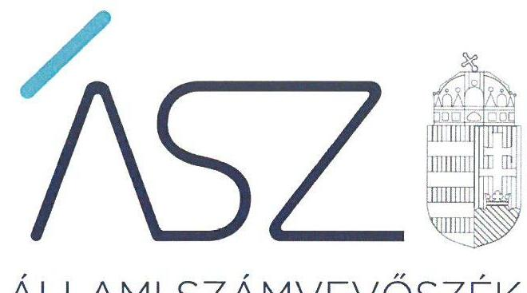

ÁLLAMI SZÁMVEVŐSZÉK

# JELENTÉS

## 2019. évi zárszámadás

Magyarország 2019. évi központi költségvetése végrehajtásának ellenőrzése

2020.  hó 65. nap

20204
T/13098/1
www.asz.hu

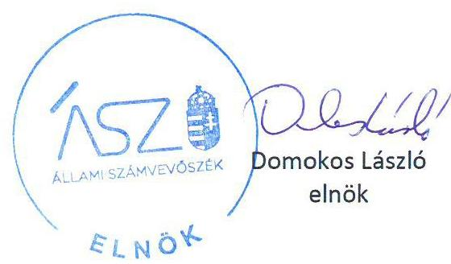

---

|  | AZ ELLENŐRZÉST FELÜGYELTE: |
| :-- | :-- |
|  | PETŐ KRISZTINA felügyeleti vezető |
|  | AZ ELLENŐRZÉST VEZETTE ÉS A VÉGREHAJTÁSÁÉRT FELELŐS: |
|  | DR. SIMON JÓZSEF ellenőrzésvezető |
|  | A PROGRAM ÖSSZEÁLLÍTÁSÁÉRT FELELŐS: |
|  | HORVÁTH TÍMEA az ellenőrzési program készítéséért felelős vezető |
|  | A TÉMÁHOZ KAPCSOLÓDÓ KORÁBBI SZÁMVEVŐSZÉKI JELENTÉSEK: |
|  | - címe: Jelentés Magyarország 2018. évi központi |
|  | költségvetése végrehajtásának ellenőrzéséről |
|  | - sorszáma: 19197 |
| Jelentéseink az Országgyűlés | - címe: Jelentés Magyarország 2017. évi központi |
| számítógépes | költségvetése végrehajtásának ellenőrzéséről |
| hálózatán és az interneten a | - sorszáma: 18275 |
| www.asz.hu címen is |  |
| olvashatóak. |  |
|  | IKTATÓSZÁM: EL-2546-4746/2020 |
|  | TÉMASZÁM: 2534 |
|  | ELLENŐRZÉS-AZONOSÍTÓ SZÁM: V0878 |

---

# TARTALOMJEGYZÉK 

■ ÖSSZEGZÉS ..... 5
■ AZ ELLENŐRZÉS CÉLJA ..... 7
■ AZ ELLENŐRZÉS TERÜLETE ..... 8
■ AZ ELLENŐRZÉS HÁTTERE, INDOKOLTSÁGA ..... 10
■ A JELENTÉS LÉNYEGES KÉRDÉSKÖREI ..... 11
■ AZ ELLENŐRZÉS HATÓKÖRE ÉS MÓDSZEREI ..... 12
■ MEGÁLLAPÍTÁSOK ..... 15
■ MELLÉKLETEK ..... 27
I. sz. melléklet: Értelmező szótár ..... 27
II. sz. melléklet: A belső kontrollrendszer értékelése ..... 29
III. sz. melléklet: Az integritás kontroll rendszer értékelése ..... 31
IV. sz. melléklet: Ellenőrzött fejezetek és szervezetek ..... 32
■ FÜGGELÉKEK ..... 37
I. sz. függelék: Az ellenőrzött szervezetek ÁSZ által el nem fogadott észrevételei ..... 37
II. sz. függelék: Az Országgyűlés felé beszámolásra kötelezett intézmények összefoglaló értékelése ..... 40
III. sz. függelék: Tájékoztatás a figyelemfelhívó levelekről ..... 44
■ RÖVIDÍTÉSEK JEGYZÉKE ..... 45

---

.

---

# ÖSSZEGZÉS 

A 2019. évi zárszámadási törvényjavaslatban szereplő teljesített költségvetési bevételi és kiadási adatok megbízhatóak. A zárszámadási törvényjavaslat szerkezete és tartalma a jogszabályi előírásokkal összhangban van. A 2019. év során a hiányra és az államadósságra vonatkozó törvényi szabályok teljesültek. A 2019. évi központi költségvetés végrehajtásában jog- és hatáskörrel rendelkezők a 2019. évi költségvetésben meghatározott pénzügyi keretek között szabályszerűen gazdálkodtak a közpénzekkel.

## Az ellenőrzés társadalmi indokoltsága

Magyarország Alaptörvénye rögzíti a kiegyensúlyozott, átlátható és fenntartható költségvetési gazdálkodás elvét, továbbá előírja, hogy a közpénzekkel gazdálkodó szervezetek kötelesek a nyilvánosság előtt elszámolni. A hiány és az államadósság alakulására több jogszabályi követelmény is vonatkozik, amelyek teljesítését a központi költségvetés végrehajtásáról szóló törvényjavaslat keretében szükséges bemutatni. Az Állami Számvevőszék törvényi kötelezettségének eleget téve minden évben ellenőrzi a központi költségvetés végrehajtásáról szóló törvényjavaslatot, amelynek keretében a központi alrendszer egészének bevételi és kiadási adatainak megbízhatóságát, valamint a hiány és az államadósság alakulására vonatkozó előírások betartását értékeli.

A zárszámadás ellenőrzése kiemelten támogatja a közpénzügyek átláthatóságát azáltal, hogy a központi költségvetés, ezen belül a központi és a fejezeti kezelésű előirányzatok, a társadalombiztosítás pénzügyi alapjai, az elkülönített állami pénzalapok, valamint az államháztartás központi alrendszerébe tartozó költségvetési szervek bevételi és kiadási előirányzatai teljesítésének ellenőrzésén keresztül a központi alrendszer egésze bevételi és kiadási adatainak megbízhatóságáról ad számot. A törvényben előírt ellenőrzési kötelezettség végrehajtása, a zárszámadásról adott számvevőszéki értékelés támogatja az Országgyűlést a költségvetés végrehajtására vonatkozó törvényjavaslat megalapozott elfogadását. Ezáltal az Állami Számvevőszék hozzájárul az elszámoltathatóság és az átláthatóság követelményének érvényesüléséhez, az ellenőrzött szervezetek közpénzekkel való felelős gazdálkodásához, és egyidejűleg tájékoztatja erről a széleskörű közvéleményt.

## Főbb megállapítások

A 2019. évi zárszámadási törvényjavaslatban az államháztartás központi alrendszerébe tartozó központi és fejezeti kezelésű előirányzatok, a központi költségvetési szervek, a társadalombiztosítás pénzügyi alapjai, továbbá az elkülönített állami pénzalapok bevételi és kiadási előirányzatainak teljesítési adatai megbízhatóak és szabályszerűek voltak. A 2019. évi zárszámadási törvényjavaslatban szereplő bevételi és kiadási adatok valósághűek.

A 2019. évi zárszámadási törvényjavaslatot a jogszabályi előírások szerinti szerkezetben készítette el a Pénzügyminisztérium. A 2019. évi zárszámadási törvényjavaslat a jogszabályi előírások által meghatározott kötelező tartalmi elemeket tartalmazza.

Az államháztartás központi alrendszerének pénzforgalmi hiánya a bruttó hazai termék 2,4%-a volt, amely 1,0 százalékponttal alacsonyabb az előző évihez képest. A kormányzati szektor uniós módszertan szerinti hiánya a bruttó hazai termék 2,0%-a volt, ezáltal - az előző évekhez hasonlóan - teljesült az Európai Unió által előírt kritérium. A hiánymutatók alakulása szempontjából kedvező hatást jelentett a bruttó hazai termék 4,6%-os növekedése, valamint a költségvetés bevételeinek a tervezettet 10,0%-kal meghaladó teljesítése. A kiadási oldalon a hiánymutatókra kedvező hatást gyakorolt, hogy a kiadások tervezett összegéhez viszonyított növekedése nagyságrendileg összhangban volt a bevételeknél tapasztalt növekedési ütemmel.

A jogszabályok által előírt adósságszabályok teljesültek, mivel a kormányzati szektor államadósságának bruttó hazai termék arányában kifejezett értéke a 2019. év során az előző év december 31-i 68,1%-ról 64,0%-ra mérséklődött.

---

A 2019. évben tovább csökkent a kormányzati szektor uniós módszertan szerinti államadósságának a bruttó hazai termék arányában kifejezett értéke, amely a 2018. év végi 69,1%-ról 65,4%-ra mérséklődött.

A 2019. évi bevételi és kiadási előirányzatok teljesítési adatait a központi alrendszerre vonatkozóan és ezek minősítését az 1. ábra mutatja be.
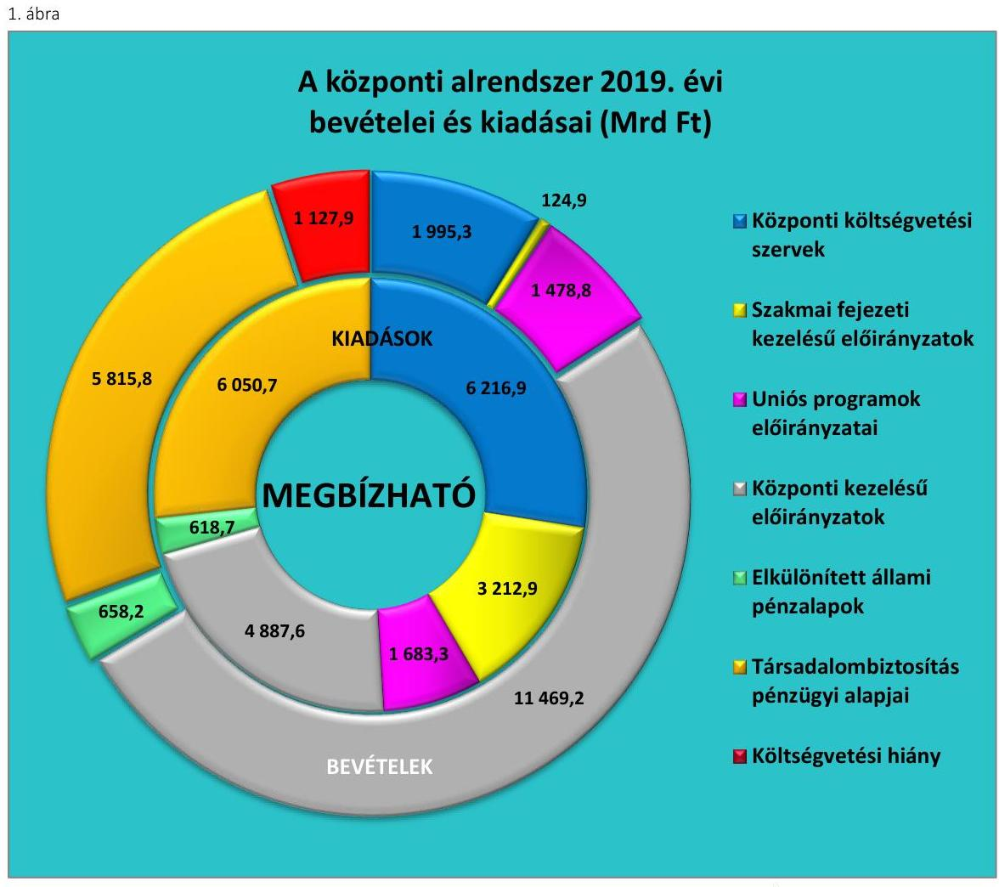

Forrás: 2019. évi zárszámadási törvényjavaslat alapján Állami Számvevőszék szerkesztés

---

# AZ ELLENŐRZÉS CÉLJA 

Az ellenőrzés célja a zárszámadási törvényjavaslat megfelelőségének és az abban szereplő adatok megbízhatóságának ellenőrzésével ésszerű bizonyosság szerzése volt arról, hogy
$\longrightarrow$ a zárszámadási törvényjavaslat tartalma, szerkezete megfelel-e a jogszabályi előírásoknak;
$\longrightarrow$ az Alaptörvény ${ }^{1}$ és a Stabilitási tv. ${ }^{2}$ államadósságra vonatkozó előírásai érvényesültek-e, az államháztartás központi alrendszerében a hiány alakulása megfelelt-e a Kvtv. ${ }^{3}$ előírásainak;
$\longrightarrow$ az államháztartás bevételeit a Kvtv.-ben rögzítettekkel összhangban, a közpénzekkel való gazdálkodás jogszabályi követelményeinek megfelelően használták-e fel, a törvényjavaslat valósághűen mutatja-e be a költségvetés végrehajtására vonatkozó pénzügyi adatokat, információkat;
$\longrightarrow$ a központi költségvetés bevételi és kiadási előirányzatainak teljesítése megfelelt-e a jogszabályi előírásoknak és tartalmaz-e lényeges hibát;
$\longrightarrow$ a költségvetés végrehajtásában jog- és hatáskörrel rendelkezők a 2019. évi költségvetésben meghatározott pénzügyi keretek között szabályszerűen gazdálkodtak-e a közpénzekkel.

Az ellenőrzés kiterjedt a 2020. évi költségvetési folyamatok nyomon követésére, kiemelten az államadósság alakulására ható tényezők monitoringjára is.

---

# **AZ ELLENŐRZÉS TERÜLETE**

## **2019. évi zárszámadás – Magyarország 2019. évi központi költségvetése végrehajtásának ellenőrzése**

A központi és szakmai fejezeti kezelésű előirányzatok, a költségvetési szervek, a TB Alapok^{4} (E. Alap^{5} és Ny. Alap^{6}), valamint az ELKA^{7} esetében a költségvetés végrehajtásáról és a vagyoni helyzetről az Áht.^{8} előírásai szerint éves költségvetési beszámolót szükséges készíteni. Az éves költségvetési beszámolók alapján a Pénzügyminisztérium évente, az elfogadott költségvetéssel összehasonlítható módon zárszámadási törvényjavaslatot készít.

A Kincstár^{9} az Áhsz.^{10} előírásai szerint az éves költségvetési beszámolók adataiból a zárszámadási törvényjavaslat Országgyűlés elé terjesztésének időpontját megelőző 30. napig, azaz augusztus 31-ig az államháztartás központi alrendszeréről összevont (konszolidált) beszámolót készít.

A 2019. évben a Kvtv. alapján az államháztartás központi alrendszerének tervezett bevételi főösszege 19 580,4 Mrd Ft, kiadási főösszege 20 578,8 Mrd Ft, amelyek alapján a tervezett pénzforgalmi hiánya 998,4 Mrd Ft volt. A 2019. évben a központi alrendszer teljesített bevételi főösszege 21 542,2 Mrd Ft, kiadási főösszege 22 670,1 Mrd Ft volt, így a központi alrendszer tényleges pénzforgalmi hiánya 1 127,9 Mrd Ft-ot tett ki.

A zárszámadási törvényjavaslat alapján a 2019. évben a központi alrendszeren belül a központi költségvetés, a társadalombiztosítási alapok és az elkülönített állami pénzalapok bevételeit, illetve kiadásait a 2. ábra szemlélteti. A központi alrendszer hiányának összetételét az 1. táblázat mutatja be.

1. táblázat

|  A KÖZPONTI ALRENDSZER 2019. ÉVI PÉNZFORGALMI HIÁNYA (MRD FT) |  |  |  |  |   |
| --- | --- | --- | --- | --- | --- |
|  Megnevezés |  | Összeg |  |  |   |
|  Központi alrendszer hiánya |  | 1 127,9 |  |  |   |
|  Ezen belül: |  |  |  |  |   |
|  Központi költségvetés hiánya |  | 932,5 |  |  |   |
|  TB Alapok hiánya |  | 234,9 |  |  |   |
|  ELKA többlete |  | 39,5 |  |  |   |
|  Forrás: 2019. évi zárszámadási törvényjavaslat |  |  |  |  |   |

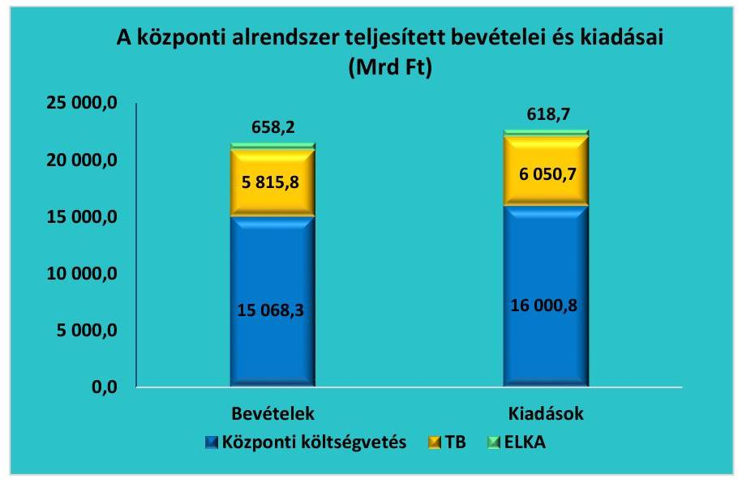

*Forrás: 2019. évi zárszámadási törvényjavaslat*

---

A közpénzek védelme, felelős felhasználása kapcsán kulcsfontosságú a belső kontrollrendszer, valamint az integritás kontrollok kiépítettsége, működtetése. Ennek ellenőrzése elősegíti, hogy az ellenőrzött szervezetek működésük és gazdálkodásuk során feladataikat szabályszerűen, gazdaságosan, hatékonyan és eredményesen lássák el, továbbá, hogy elszámolási kötelezettségüket teljesítsék.

A belső kontrollrendszer értékelése, valamint az integritás kontrollkörnyezet értékelése azokra a kontrollokra terjedt ki, amelyek alapvető fontosságúak a közpénzek védelme szempontjából és támogatják a vezetést abban, hogy a szervezet megfeleljen a vonatkozó jogszabályi előírásoknak. A belső kontrollrendszer értékelését a II. számú melléklet, az integritás kontrollkörnyezet értékelését a III. számú melléklet tartalmazza.

---

# AZ ELLENŐRZÉS HÁTTERE, INDOKOLTSÁGA 

Az Alaptörvény rendelkezései szerint a központi költségvetés végrehajtásának ellenőrzését az ÁSZ ${ }^{11}$ végzi. A zárszámadási ellenőrzés végrehajtása az ÁSZ tv. ${ }^{12}$ előírása alapján az ÁSZ éves gyakorisággal elvégzendő feladata.

Az ÁSZ törvényi kötelezettségének teljesítésével hozzájárul ahhoz, hogy az Országgyűlés a zárszámadási törvény elfogadásával kapcsolatban megalapozott döntést hozzon. Az ellenőrzés célja teljes és objektív képet adni a 2019. évi zárszámadási törvényjavaslatban szereplő adatok megbízhatóságáról. Az ÁSZ megállapításaival az ellenőrzöttek közpénzekkel való felelős gazdálkodását is elősegíti.

---

# A JELENTÉS LÉNYEGES KÉRDÉSKÖREI 

1. A zárszámadási törvényjavaslat tartalma, szerkezete összhangban volt-e a jogszabályi előírásokkal, érvényesültek-e az Alaptörvény és a Stabilitási törvény államadósságra vonatkozó előírásai, továbbá az államháztartás központi alrendszerében a hiány a törvényi előírások szerint alakult-e?
2. A zárszámadási törvényjavaslat valósághűen mutatja-e be a költségvetés végrehajtására vonatkozó pénzügyi adatokat, információkat, az abban szereplő bevételi és kiadási előirányzatok teljesítési adatai megbízhatóak-e?
3. A központi alrendszer bevételi és kiadási előirányzatainak teljesítése, az előirányzatok módosítása, a költségvetési maradvány megállapítása és az éves költségvetési beszámolók összeállítása során betartották-e a jogszabályi előírásokat?

---

# AZ ELLENŐRZÉS HATÓKÖRE ÉS MÓDSZEREI 

## Az ellenőrzés típusa

Megfelelőségi ellenőrzés.

## Az ellenőrzött időszak

2019. év.

## Az ellenőrzés tárgya

A zárszámadási ellenőrzés során az ÁSZ a zárszámadási törvényjavaslat megfelelőségét és az abban szereplő adatok megbízhatóságát ellenőrizte. Az ÁSZ valamennyi ellenőrzött területen (központi kezelésű előirányzatok; központi költségvetési szervek; fejezeti kezelésű előirányzatok, uniós és kapcsolódó költségvetési támogatások; ELKA; TB Alapok) a gazdálkodás és az előirányzat-felhasználás megfelelőségét (szabályszerűségét), a költségvetési gazdálkodásra vonatkozó szabályokkal való összhangját ellenőrizte.

## Az ellenőrzött szervezetek

A PM ${ }^{13}$, Kincstár, NAV ${ }^{14}$, ÁKK Zrt.
 ${ }^{15}$, ÁEEK ${ }^{16}$, Eximbank, ${ }^{17}$ KAVOSZ, ${ }^{18}$ központi előirányzatok, TB Alapok (Nyugdíjbiztosítás Alap, Egészségbiztosítás Alap), ELKA, a mintavételezéssel kiválasztott fejezeti kezelésű előirányzatok és kezelő szerveik. Az alkotmányos fejezetek (OGYH ${ }^{19}$, KEH $^{20}$, AB $^{21}$, AJBH $^{22}$, Ügyészségek, Bíróságok, $\mathrm{OBH}^{23}$, Kúria), az $\mathrm{OGY}^{24}$ részére a tevékenységükről beszámolásra kötelezett intézmények ( $\mathrm{KH}^{25}$, NAIH $^{26}$, EBH $^{27}$, MEKS $\mathrm{H}^{28}$, $\mathrm{NVI}^{29}$, NEBH $^{30}$, NÉBIH $^{31}$, $\mathrm{GVH}^{32}$, $\mathrm{KSH}^{33}$, $\mathrm{MTA}^{34}$, $\mathrm{MMA}^{35}$, NKFIH $^{36}$ ), továbbá a mintavételezéssel kiválasztott központi alrendszerbe tartozó intézmények. Az ellenőrzött szervezeteket a IV. számú melléklet tartalmazza.

## Az ellenőrzés jogalapja

Az ellenőrzés lefolytatásának jogalapját az ÁSZ tv. 5. § (7) bekezdése képezte.

## Az ellenőrzés módszerei

Az ellenőrzést az ÁSZ az ellenőrzési program szempontjai, az ellenőrzött időszakban hatályos jogszabályok, az ellenőrzés szakmai szabályok és módszertanok figyelembevételével végezte.

---

Az ellenőrzés ideje alatt az ellenőrzött szervezettel történő kapcsolattartás az ÁSZ SZMSZ ${ }^{37}$-ének vonatkozó előírásai alapján történt.

Az ÁSZ az ellenőrzés végrehajtása során a dokumentum-alapú megközelítési módszereket alkalmazta, amely biztosította, hogy az ellenőrzési megállapítások bizonyítékokon, az ellenőrzött időszakban keletkezett, illetve rendelkezésre álló dokumentumokon alapuljanak, biztosítva az ellenőrzött szervezetek azonos szempontú, objektív minősítését.

Az ellenőrzési bizonyítékként felhasználható adatforrások közé tartoztak egyrészt az ellenőrzési program részletes szempontjainál felsorolt adatforrások, másrészt az ellenőrzés folyamán feltárt, az ellenőrzés szempontjából információt tartalmazó dokumentumok. Az ellenőrzési kérdések megválaszolásához szükséges bizonyítékok megszerzése az ellenőrzött szervezetek által rendelkezésre bocsátott dokumentumokra, adatokra alapozva megfigyelés, szemle (szemrevételezés), kérdésfeltevés (információkérés), mintavételezés, valamint elemző eljárás útján történt.

A mintavételezés statisztikai módszere biztosította, hogy az ÁSZ megalapozott értékelést tudjon adni a központi költségvetés bevételi és kiadási előirányzatainak jogszabályi előírások szerinti teljesítéséről, lényegességi hibáiról, valamint a törvényjavaslatban szereplő költségvetés végrehajtására vonatkozó adatok, információk megbízhatóságáról.

A központi költségvetési szervek bevételi és kiadási adatainak ellenőrzése pénzegység alapú mintavétel alkalmazásával történt.

A minta elemszámának meghatározására az Országgyűlés felé beszámolásra kötelezett intézmények és a TB Alapok esetében szervezetenként külön-külön történt, az eredendő és a kontroll kockázat szintje alapján, amelyet a 2. táblázat mutat be.
2. táblázat

# A MINTA ELEMSZÁM MEGHATÁROZÁSÁT BEFOLYÁSOLÓ TÉNYEZŐK AZ ORSZÁGGYŰLÉS FELÉ BESZÁMOLÁSRA KÖTELEZETT INTÉZMÉNYEK ÉS A TB ALAPOK ESETÉBEN 

| Eredendő kockázat értékelése | Bekö kontrollrendszer összevont értékelése | A mintavételez ellenőrzéstől várt konfidencia szint legkisebb értéke |
| :--: | :--: | :--: |
| Nem nagy | Megfelelő | 45,0\% |
|  | Részben megfelelő | 67,0\% |
|  | Nem megfelelő, vagy nem volt kontroll teszt | 95,0\% |
| Nagy | Megfelelő | 67,0\% |
|  | Részben megfelelő | 80,0\% |
|  | Nem megfelelő, vagy nem volt kontroll teszt | 95,0\% |

Forrás: ÁSZ
Az alkotmányos fejezetek intézményeinek összevont kiadási és bevételi adatállományaiból területenként rétegezett mintavétellel 150-150 elemű minta kiválasztására és értékelésére került sor.

A központi költségvetés összes egyéb intézménye esetében két lépcsős mintavételi eljárást alkalmazott az ÁSZ az intézmények bevételi és kiadási adataiból történő pénzegység alapú mintavételhez. Az egyéb intézmények esetén külön réteget alkottak az 5 legnagyobb bevételi, illetve kiadási főösszeggel rendelkező intézmények.

---

A fejezeti kezelésű előirányzatok teljesített kiadásainak és bevételeinek ellenőrzése rétegzett mintavétellel történt. A kiadások egyesített adatbázisából 200 elemű, a bevételek egyesített adatbázisából 150 elemű minta kiválasztására és értékelésére került sor.

A központi kezelésű előirányzatokon belül az állami kezességek, garanciák és viszontgaranciák, az állami vagyonnal, a Nemzeti Földalappal, valamint a tulajdonosi joggyakorlással kapcsolatos bevételek és kiadások, valamint a helyi önkormányzatok támogatásai, illetve a települési és területi nemzetiségi önkormányzatok támogatása előirányzatok terhére teljesített kifizetések esetén pénzegység alapú mintavételt alkalmazott az ÁSZ. A Nemzeti Család- és Szociálpolitikai Alap cím keretében folyósított támogatásokat és ellátásokat az ÁSZ rétegzett pénzegység alapú mintavétellel ellenőrizte.

A mintatételek kiértékelése során az ÁSZ 95,0%-os megbízhatóság mellett megbecsülte az egyes mintavételi területeken előforduló hibák összegének felső korlátját. Az ÁSZ a zárszámadási törvényjavaslat megbízhatóságát befolyásoló összes hiba összegét viszonyította a lényegességi küszöbértékhez, amelyet mind a központi alrendszer egésze, mind pedig az egyes részterületek tekintetében a bevételi, illetve kiadási főösszeg (teljesítési adat) 2,0%-ában határozott meg.

Az ÁSZ azon területeken (NAV adóbevételek, illetve Kincstár által teljesített kiutalások), ahol nagyfokú automatizmus működik, mintavétel helyett tesztelési eljárást alkalmazott. A tesztelési eljárás az elszámolásokban szereplő állításokat alátámasztó kontrollok folyamatos és eredményes működésének vizsgálatát jelentette. Az adatok tesztelése során háromelemű, véletlenszerűen kiválasztott tétel ellenőrzésére került sor. A tesztelési eljárás a központi kezelésű előirányzatok közül a következőkre terjedt ki: a Pártok és pártalapítványok, a Közszolgálati médiaszolgáltatás, a Közszolgáltatások ellentételezése, a Vállalkozások folyó támogatása, a Mecseki uránbányászok baleseti járadékainak és egyéb kártérítési kötelezettségeinek átvállalása, a Szociálpolitikai menetdíj támogatás, a K-600 hírrendszer, a Peres ügyek, a Kormányzati rendkívüli kiadások, a Garancia és hozzájárulás a társadalombiztosítási ellátásokhoz, a Lakástámogatások, a Diákhitel tartozás csökkentésének támogatása, a Diákhitel 2 konstrukció kamattámogatása.

---

# MEGÁLLAPÍTÁSOK 

## 1. A zárszámadási törvényjavaslat tartalma, szerkezete összhangban volt-e a jogszabályi előírásokkal, érvényesültek-e az Alaptörvény és a Stabilitási törvény államadósságra vonatkozó előírásai, továbbá az államháztartás központi alrendszerében a hiány a törvényi előírások szerint alakult-e?

Összegző megállapítás

A törvényjavaslat tartalma és szerkezete összhangban volt a jogszabályi előírásokkal. Az államháztartás központi alrendszerének hiányára és az államadósságra vonatkozó törvényi előírások érvényesültek.
1.1. számú megállapítás

A zárszámadási törvényjavaslat összeállítása szabályszerű volt, tartalma összhangban volt a jogszabályi előírásokkal.

A ZÁRSZÁMADÁSI TÖRVÉNYJAVASLAT szerkezete és tartalma összhangban volt a jogszabályi előírásokkal. A törvényjavaslat a törvényi előírások szerint tartalmazza:

- a költségvetési mérleget alrendszerenként és összevontan, közgazdasági és funkcionális tagolásban;
- a Stabilitási tv. szerinti államadósságot és a központi költségvetés adósságállományának változását;
- a költségvetési hiány finanszírozásának módját;
- az államháztartás központi alrendszere és a kormányzati szektorba sorolt egyéb szervezetek tekintetében a nem teljesítő hitelkövetelések állományát;
- az állami és az önkormányzati garancia- és kezességvállalások állományát.
A zárszámadási törvényjavaslat az elfogadott költségvetéssel összehasonlítható szerkezetben készült.

A PM az Áht. és az Ávr. ${ }^{38}$ előírásai szerint szabályzatban rendelkezett a zárszámadási törvényjavaslat készítésére vonatkozó módszertani elvekről, a beszámolási keretrendszerről, az elvégzendő feladatokról és azok ütemezéséről.

A zárszámadási törvényjavaslat tartalmára vonatkozó jogszabályi előírások teljesítéséhez szükséges KGR K11 ${ }^{39}$, KAR ${ }^{40}$ és AHAB ${ }^{41}$ informatikai rendszerek esetében megfelelő volt az elektronikus információs rendszerek adatainak sértetlenségét, hitelességét, megfelelőségét befolyásoló főbb kontrollok kiépítettsége és működése.

---

### 1.2. számú megállapítás

A kormányzati szektor hiánya és az államadósság a jogszabályi előírások szerint alakult.

|  3. táblázat |  |   |
| --- | --- | --- |
|  A KÖZPONTI ALRENDSZER |  |   |
|  PÉNZFORGALMI HIÁNYA A GDP %-BAN |  |   |
|  Megnevezés | 2018. | 2019.  |
|  Hiány a GDP %-ban | $3,4 \%$ | $2,4 \%$  |
|  Forrás: 2019. évi zárszámadási törvényjavaslat |  |   |

1. táblázat

A KONSZOLIDÁLT, STABILITÁSI TV. SZERINTI ÁLLAMADÓSSÁG ALAKULÁSA A 2018. ÉS A 2019. ÉVEKBEN (MRD FT)

|   | 2018. | 2019.  |
| --- | --- | --- |
|  Államadósság | 29501,3 | 30388,3  |

Forrás: 2019. évi zárszámadási törvényjavaslat

AZ ÁLLAMHÁZTARTÁS központi alrendszerének hiánya folyó áron, pénzforgalmi szemléletben 1 127,9 Mrd Ft összegben teljesült, ami a 2019. évi GDP ${ }^{42}$ 2,4%-a. A központi alrendszer GDP-hez viszonyított hiánya a 2019. évben az előző évhez képest 1,0 százalékponttal alacsonyabb volt. A GDP a 2018. évi 43 347,0 Mrd Ft-ról 2019-re 47 514,0 Mrd Ft-ra növekedett.

Az államháztartás központi alrendszerének hiányát a 2018. és 2019. években a 3. ábra szemlélteti, és az adott évi nominális GDP-hez viszonyított arányát a 3. táblázat tartalmazza. 3. ábra

A központi alrendszer pénzforgalmi hiánya a 2018. és 2019. években (Mrd Ft)

|  1500,0 |   |
| --- | --- |
|  1200,0 |   |
|  900,0 |   |
|  600,0 |   |
|  300,0 |   |
|  0,0 |   |

2018. 2019. 2019.

Forrás: 2019. évi zárszámadási törvényjavaslat

A központi alrendszer hiányának értékéhez a módosítás nélkül túlléphető kiadási előirányzatok Kvtv.-ben tervezettnél 112,5 Mrd Ft-tal nagyobb összegű teljesítése is hozzájárult, amely a teljesített pénzforgalmi hiány 10,0%-át tette ki. Az elkülönített állami pénzalapok a tervezett 12,7 Mrd Ft hiánnyal szemben 39,5 Mrd Ft többlettel zárták az évet. A társadalombiztosítási alapok hiánya 234,9 Mrd Ft volt.

A Stabilitási tv. szerinti államadósság mutató a 2018. évi 68,1%-ról 2019. év végére 64,0%-ra mérséklődött, amely teljesítette az Alaptörvényben és a Stabilitási tv.-ben foglalt, az államadósság GDP-hez viszonyított arányának csökkenését előíró követelményt.

Az államadósság előző évi GDP-hez viszonyított arányát a 4. ábra tartalmazza. A konszolidált, Stabilitási tv. szerinti államadósságot a 4. táblázat szemlélteti.

---

#### 5. táblázat

|  A KORMÁNYZATI SZEKTOR UNIÓS MÓDSZERTAN SZERINTI HIÁNYA A 2018. ÉS A 2019. ÉVEKBEN (MRD FT) |  |  |   |
| --- | --- | --- | --- |
|   | 2018. | 2019. |   |
|  Hiány | 917,3 | 972,5 |   |
|  Forrás: 2019. évi zárszámadási törvényjavaslat, 2020. október havi GDP jelentés |  |  |   |

#### 6. táblázat

|  A KORMÁNYZATI SZEKTOR UNIÓS MÓDSZERTAN SZERINTI GDP ARÁNYOS HIÁNYA 2,0%-on teljesült, amely összhangban van a 3,0% alatti értéket előíró maastrichti kritériummal. A kormányzati szektor uniós módszertan szerinti hiányát az 5. táblázat, annak GDP-hez viszonyított arányát az 5. ábra szemlélteti. |  |  |   |
| --- | --- | --- | --- |
|   | 2018. | 2019. |   |
|  Adósság | 29 962,6 | 31 077,5 |   |
|  Forrás: 2019. évi zárszámadási törvényjavaslat, 2020. október havi GDP jelentés |  |  |   |

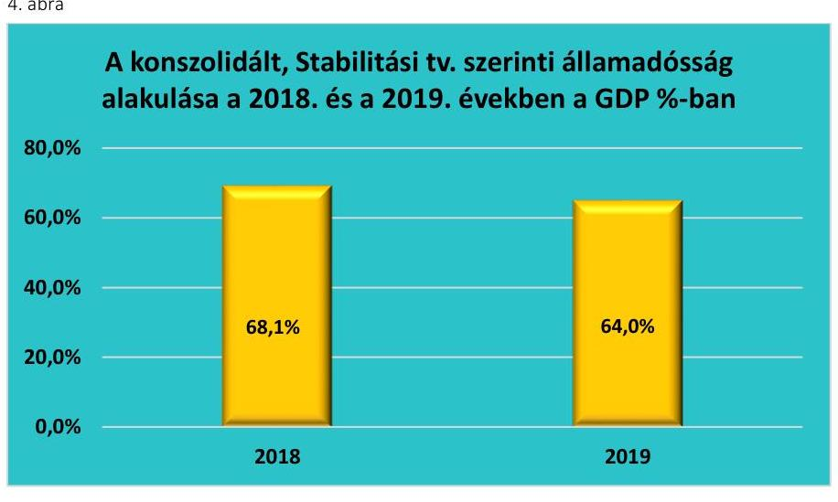

*Forrás: 2019. évi zárszámadási törvényjavaslat*

#### A KORMÁNYZATI SZEKTOR UNIÓS MÓDSZERTAN SZERINTI GDP ARÁNYOS HIÁNYA 2,0%-on teljesült, amely összhangban van a 3,0% alatti értéket előíró maastrichti kritériummal. A kormányzati szektor uniós módszertan szerinti hiányát az 5. táblázat, annak GDP-hez viszonyított arányát az 5. ábra szemlélteti.

#### 5. ábra

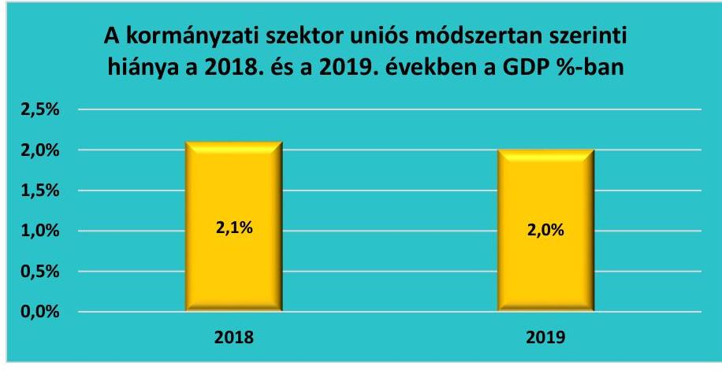

*Forrás: 2019. évi zárszámadási törvényjavaslat, 2020. október havi GDP jelentés*

#### A KORMÁNYZATI SZEKTOR UNIÓS MÓDSZERTAN SZERINTI KONSZOLIDÁLT BRUTTÓ ADÓSSÁGA

(névértéken) a 2019. év végén a GDP 65,4%-a, 31 077,5 Mrd Ft volt. A 2019. évi adósságráta a 2018. évi adósságrátához képest kedvezőbben teljesült. Az adósságráta mérséklődése további közeledést jelentett a maastrichti kritériumok között szereplő, az államadósság-rátára vonatkozóan meghatározott 60,0%-os szinthez. A kormányzati szektor uniós módszertan szerinti adósságát a 6. táblázat, a GDP-hez viszonyított arányát a 6. ábra szemlélteti.

---

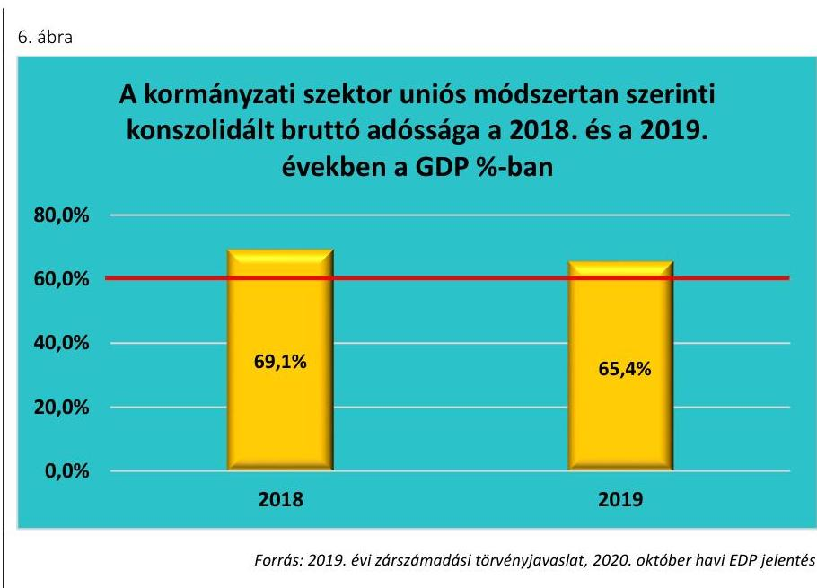

# 2. A
 zárszámadási törvényjavaslat valósághűen mutatja-e be a költségvetés végrehajtására vonatkozó pénzügyi adatokat, információkat, az abban szereplő bevételi és kiadási előirányzatok teljesítési adatai megbízhatóak-e?

|  Összegző megállapítás |  |  |  |  |  |  |  |  |  |  |  |  |  |  |  |  |  |   |
| --- | --- | --- | --- | --- | --- | --- | --- | --- | --- | --- | --- | --- | --- | --- | --- | --- | --- | --- |
|  2.1. számú megállapítás |  |  |  |  |  |  |  |  |  |  |  |  |  |  |  |  |  |   |
|  7. táblázat |  |  |  |  |  |  |  |  |  |  |  |  |  |  |  |  |  |   |
|   |  |  |  |  |  |  |  |  |  |  |  |  |  |  |  |  |  | A KÖZPONTI KEZELÉSŰ ELŐIRÁNYZATOK BEVÉTELEI ÉS KIADÁSAI A 2019. ÉVBEN (MRD FT)  |
|   |  |  |  |  |  |  |  |  |  |  |  |  |  |  |  |  |  |   |
|   |  |  |  |  |  |  |  |  |  |  |  |  |  |  |  |  |  |   |
|   |  |  |  |  |  |  |  |  |  |  |  |  |  |  |  |  |  |   |
|  Központi kezelésű előirányzatok összesen |  |  |  |  |  |  |  |  |  |  |  |  |  |  |  |  |  |   |
|  Ezen belül: |  |  |  |  |  |  |  |  |  |  |  |  |  |  |  |  |  |  |   |
|  Adó- és adójellegű bevételek |  |  |  |  |  |  |  |  |  |  |  |  |  |  |  |  |  |  |   |
|  Önkormányzatok támogatása |  |  |  |  |  |  |  |  |  |  |  |  |  |  |  |  |  |  |   |
|  Adósságszolgálat |  |  |  |  |  |  |  |  |  |  |  |  |  |  |  |  |  |  |   |
|  Kezesség |  |  |  |  |  |  |  |  |  |  |  |  |  |  |  |  |  |  |   |
|  Nemzeti Család- és Szociálpolitikai Alap |  |  |  |  |  |  |  |  |  |  |  |  |  |  |  |  |  |  |   |
|  Állami vagyon |  |  |  |  |  |  |  |  |  |  |  |  |  |  |  |  |  |  |   |
|  Forrás: 2019. évi zárszámadási törvényjavaslat |  |  |  |  |  |  |  |  |  |  |  |  |  |  |  |  |  |  |   |

# 2. A zárszámadási törvényjavaslat valósághűen mutatja-e be a költségvetés végrehajtására vonatkozó pénzügyi adatokat, információkat, az abban szereplő bevételi és kiadási előirányzatok teljesítési adatai megbízhatóak-e?

|  Összegző megállapítás |  |  |  |  |  |  |  |  |  |  |  |  |  |  |  |  |  |   |
| --- | --- | --- | --- | --- | --- | --- | --- | --- | --- | --- | --- | --- | --- | --- | --- | --- | --- | --- |
|  2.1. számú megállapítás |  |  |  |  |  |  |  |  |  |  |  |  |  |  |  |  |  |   |
|  7. táblázat |  |  |  |  |  |  |  |  |  |  |  |  |  |  |  |  |  |   |
|   |  |  |  |  |  |  |  |  |  |  |  |  |  |  |  |  |  | A KÖZPONTI KEZELÉSŰ ELŐIRÁNYZATOK BEVÉTELEI ÉS KIADÁSAI A 2019. ÉVBEN (MRD FT)  |
|   |  |  |  |  |  |  |  |  |  |  |  |  |  |  |  |  |  |   |
|   |  |  |  |  |  |  |  |  |  |  |  |  |  |  |  |  |  |   |
|   |  |  |  |  |  |  |  |  |  |  |  |  |  |  |  |  |  |   |
|  Központi kezelésű előirányzatok összesen |  |  |  |  |  |  |  |  |  |  |  |  |  |  |  |  |  |   |
|  Ezen belül: |  |  |  |  |  |  |  |  |  |  |  |  |  |  |  |  |  |  |   |
|  Adó- és adójellegű bevételek |  |  |  |  |  |  |  |  |  |  |  |  |  |  |  |  |  |  |   |
|  Önkormányzatok támogatása |  |  |  |  |  |  |  |  |  |  |  |  |  |  |  |  |  |  |   |
|  Adósságszolgálat |  |  |  |  |  |  |  |  |  |  |  |  |  |  |  |  |  |  |   |
|  Kezesség |  |  |  |  |  |  |  |  |  |  |  |  |  |  |  |  |  |  |   |
|  Nemzeti Család- és Szociálpolitikai Alap |  |  |  |  |  |  |  |  |  |  |  |  |  |  |  |  |  |  |   |
|  Állami vagyon |  |  |  |  |  |  |  |  |  |  |  |  |  |  |  |  |  |  |   |
|  Forrás: 2019. évi zárszámadási törvényjavaslat |  |  |  |  |  |  |  |  |  |  |  |  |  |  |  |  |  |  |   |

# 3. A zárszámadási törvényjavaslat a költségvetés végrehajtására vonatkozó pénzügyi adatokat, információkat valósághűen mutatja be, az abban szereplő bevételi és kiadási előirányzatok teljesítési adatai megbízhatóak.

|  A központi költségvetésben szereplő központi kezelésű előirányzatok teljesítési adatai megbízhatóak. |  |  |  |  |  |  |  |  |  |  |  |  |  |  |  |  |  |  |   |
| --- | --- | --- | --- | --- | --- | --- | --- | --- | --- | --- | --- | --- | --- | --- | --- | --- | --- | --- |

 | --- | --- | --- | --- | --- | --- | --- | --- |
|  A központi kezelésű előirányzatok bevételi és kiadási teljesítési adatai együttesen megbízhatóak. A központi kezelésű előirányzatok bevételeinek és kiadásainak alakulását a 7. táblázat mutatja be. |  |  |  |  |  |  |  |  |  |  |  |  |  |  |  |  |  |  |   |
|  A teszteléssel érintett központosított adó- és adójellegű bevételek és központi kezelésű előirányzatok keretében teljesített kiadások megbízhatóak. A teszteléssel ellenőrzött központi kiadási előirányzatok esetén a teljesítés együttesen 529,8 Mrd Ft volt. |  |  |  |  |  |  |  |  |  |  |  |  |  |  |  |  |  |  |   |
|  Az adósságszolgálattal kapcsolatos kiadások megbízhatóak, e kiadások esetében az ellenőrzés nem tárt fel megbízhatósági hibát. |  |  |  |  |  |  |  |  |  |  |  |  |  |  |  |  |  |  |   |
|  Az állami vagyonnal kapcsolatos bevételek és kiadások megbízhatóak, az állami vagyonnal kapcsolatos bevételeknél feltárt megbízhatósági hibák összértéke nem haladta meg a lényegességi szintet. |  |  |  |  |  |  |  |  |  |  |  |  |  |  |  |  |  |  |   |
|  Az állam által vállalt kezesség és viszontgarancia érvényesítésével összefüggő bevételek és kiadásainak alakulására. |  |  |  |  |  |  |  |  |  |  |  |  |  |  |  |  |  |  |   |

---

2.2. számú megállapítás
2.3. táblázat

A szakmai fejezeti kezelésű előirányzatok bevételeinek, kiadásainak alakulása 2019. évben (Mrd Ft)

|  | Bevétel | Kiadás |
| :-- | :--: | :--: |
| Terv adat | 27,6 | 2753,2 |
| Tény adat | 124,9 | 3212,9 |

Kiadások teljesítése megbízható, nem tárt fel az ellenőrzés megbízhatósági hibát.

## A helyi és a nemzetiségi önkormányzatok

támogatásaival kapcsolatos kiadások teljesítése megbízható, a megállapított megbízhatósági hibák összértéke nem érte el a lényegességi szintet.

## A Nemzeti Család- és Szociálpolitikai

Alap családi támogatások (családi pótlék, iskoláztatási támogatás, nevelési ellátás és gyermeknevelési támogatás) jogcím terhére teljesített kiadások esetében az ellenőrzés megbízhatósági hibákat állapított meg. A megbízhatóság jelentős javulása várható az ellenőrzés által feltárt hibák kijavításával.

## A központi költségvetés részét képező fejezeti kezelésű előirányzatok teljesítési adatai megbízhatóak.

A fejezeti kezelésű előirányzatok bevételi és kiadási előirányzatainak teljesítési adatai megbízhatóak. A szakmai fejezeti kezelésű előirányzatok kiadásait és bevételeit a 8. táblázat tartalmazza.

A szakmai fejezeti kezelésű előirányzatok bevételeinek összetételét a 7. ábra szemlélteti.
7. ábra

A szakmai fejezeti kezelésű előirányzatok bevételei a 2019. évben (Mrd Ft)
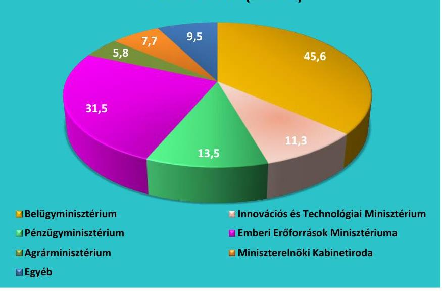

A szakmai fejezeti kezelésű előirányzatok kiadásainak összetételét az alábbi 8. ábra szemlélteti:

---

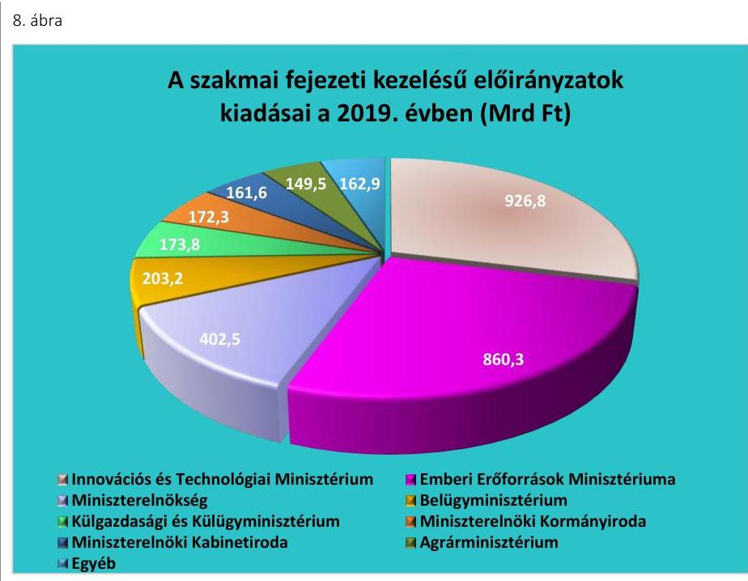

*Forrás: 2019. évi zárszámadási törvényjavaslat*

**Az uniós fejlesztések** fejezet kiadási előirányzatainak teljesítése a jogszabályi előírásokkal összhangban történt, a teljesített kiadások adatai megbízhatóak. A 2019. évi teljesítési adatokat a 9. táblázat tartalmazza.

1. táblázat

|  Az utalmazás | Adat  |
| --- | --- |
|  2014-2020. közötti kohéziós politikai operatív programok | 1 127,1  |
|  Egyéb uniós programok kiadási előirányzatai | 297,2  |
|  Vidékfejlesztési és halászati programok 2014 – 2020. | 209,3  |
|  Nemzeti Stratégiai Referenciakeret | 30,6  |
|  Európai Területi Együttműködés (2014-2020.) | 18,7  |
|  Egyéb uniós előirányzatok* | 0,4  |
|  Uniós fejlesztések fejezet teljesített kiadásai összesen: | 1 683,3  |

**2.3. számú megállapítás**

*Forrás: 2019. évi zárszámadási törvényjavaslat*

Az uniós fejlesztésekhez kapcsolódóan a 2014-2020 közötti kohéziós politikai operatív programok kiadásai esetében az ellenőrzés által feltárt megbízhatósági hibák az uniós fejlesztési előirányzatok keretében kifizetett kiadások megbízhatóságát nem befolyásolták.

**A központi költségvetési intézmények által teljesített bevételek és kiadások adatai megbízhatóak.**

**A központi költségvetés intézményei** bevételi és kiadási előirányzatainak teljesítési adatai megbízhatóak.

---

Az OGY felé beszámolásra kötelezett intézmények és az alkotmányos fejezetek intézményei bevételi és kiadási adatai megbízhatóak. Az alkotmányos fejezetek intézményei bevételei esetében feltárt megbízhatósági hibák összértéke nem haladta meg a lényegességi szintet.

Az egyéb költségvetési intézmények bevételeinél és kiadásainál az ellenőrzés során feltárt megbízhatósági hibák összértéke nem haladta meg a lényegességi szintet.

A központi költségvetés intézményei bevételi és kiadási előirányzatainak teljesítési adatait a 10. táblázat mutatja be.
10. táblázat

A központi költségvetési intézmények bevételei és kiadásai a 2019. évben (Mrd Ft)

|  | OGY felé   beszámoló   intézmények | Alkotmányos   fejezetek   intézményei | Egyéb   intézmények | Mindösszesen |
| :-- | :--: | :--: | :--: | :--: |
| Bevétel | 34,9 | 8,3 | 1952,1 | 1995,3 |
| Kiadás | 88,5 | 231,8 | 5896,6 | 6216,9 |

Forrás: Intézményi beszámolók alapján ÁSZ szerkesztés
2.4. számú megállapítás

A TB Alapok bevételi és kiadási előirányzatainak teljesítési adatai megbízhatóak.

A TB alapok bevételi és kiadási előirányzatainak teljesítése megbízható.

A TB Alapok bevételi és kiadási előirányzatainak teljesítését alaponkénti megoszlásban a 9. ábra mutatja be.
9. ábra
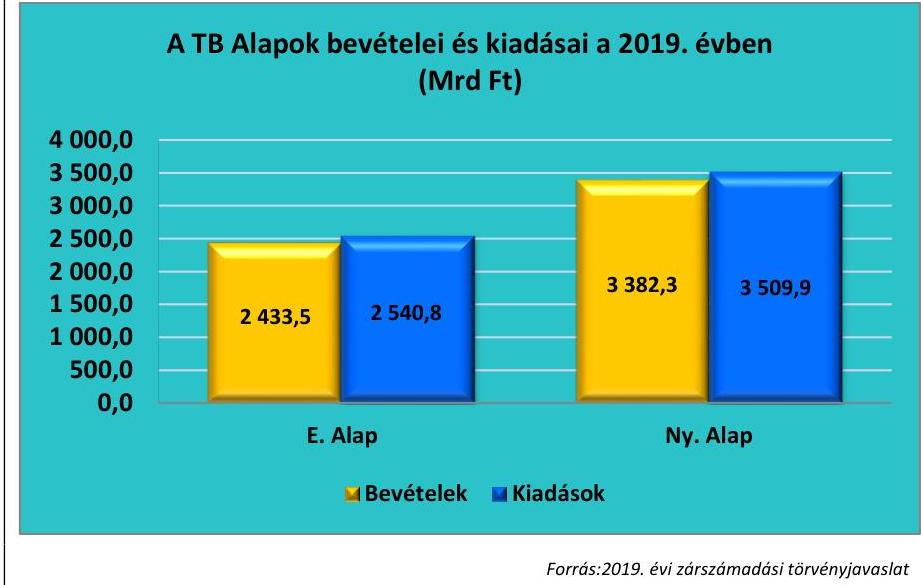

# 2.5. számú megállapítás 

Az ELKA bevételi és kiadási előirányzatainak teljesítési adatai megbízhatóak.

Az ELKA (BGA ${ }^{44}$, KNPA $^{45}$, NEFA $^{46}$, NKA $^{47}$, NKFIA $^{48}$ ) bevételi előirányzatainak teljesítése, kiadási előirányzatainak felhasználása megbízható, megbízhatósági hibát nem tárt fel az ellenőrzés.

Az ELKA bevételeit és kiadásait a 10. ábra és 11. táblázat mutatja be:

---

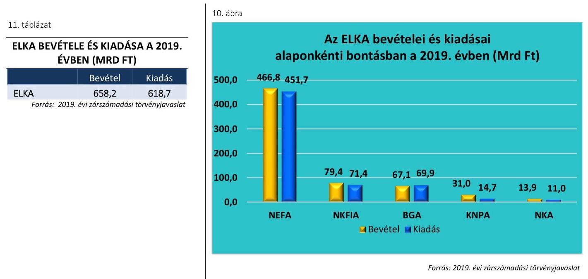

*Forrás: 2019. évi zárszámadási törvényjavaslat*

# 3. A központi alrendszer bevételi és kiadási előirányzatainak teljesítése, az előirányzatok módosítása, a költségvetési maradvány megállapítása és az éves költségvetési beszámolók összeállítása során betartották-e a jogszabályi előírásokat?

|  Összegző megállapítás | A központi alrendszer bevételi és kiadási előirányzatainak teljesítése, az előirányzatok módosítása, a költségvetési maradvány megállapítása és az éves költségvetési beszámolók összeállítása során betartották a jogszabályi előírásokat.  |
| --- | --- |
|  3.1. számú megállapítás | A központi költségvetés részét képező központi kezelésű bevételi és kiadási előirányzatok teljesítése során a jogszabályi előírások szerint jártak el.  |

**Az adósságszolgálattal** kapcsolatos forintban és devizában fennálló adósság kamat és egyéb kiadásainak, valamint bevételeinek elszámolása a jogszabályi előírások betartásával történt.

**Az állami vagyonnal** kapcsolatos bevételek és a kiadások teljesítése az Áht., az Ávr., a Vtv.49 előírásai szerint történt.

**Az állam által vállalt kezesség és viszontgarancia** érvényesítésével összefüggő bevételek és kiadások teljesítése szabályszerű volt.

**A helyi és a nemzetiségi önkormányzatok** támogatásaival kapcsolatos kiadások teljesítése a jogszabályi előírásokkal összhangban történt.

---

### 3.2. számú megállapítás

12. táblázat

## XLII. A költségvetés közvetlen bevételei és kiadásai fejezet uniós bevételekkel kapcsolatos 2019. évi teljesítési adatai (Mrd Ft)

|  Megnevezés | Adat  |
| --- | --- |
|  Uniós programok bevételei | 1251,4  |
|  Egyéb uniós bevételek | 227,4  |

Forrás: 2019. évi zárszámadási törvényjavaslat

## A Nemzeti Család- és Szociálpolitikai

Alap terhére teljesített családi támogatások (családi pótlék, iskoláztatási támogatás, nevelési ellátás és gyermeknevelési támogatás) jogcím terhére teljesített kiadások esetében az ellenőrzés megbízhatósági hibákat állapított meg. A megbízhatóság jelentős javulása várható az ellenőrzés által feltárt hibák kijavításával.

A költségvetési tartalékok képzése és felhasználása a jogszabályi előírások betartásával történt. A Rendkívüli Kormányzati Intézkedésekre, a céltartalékokra, az Országvédelmi Alappra és a Beruházás Előkészítési Alappra elkülönített központi tartalékok rendelkezésre bocsátása a jogszabályokban előírt célok szerint történt, az előirányzatok elszámolása szabályszerű volt.

A központi költségvetés részét képező fejezeti kezelésű előirányzatok teljesítése, az előirányzatok módosítása, a költségvetési maradvány megállapítása és az éves költségvetési beszámolók összeállítása során betartották a jogszabályi előírásokat.

## A szakmai fejezeti kezelésű előirányzatok keretében a kiadások teljesítése, felhasználása és kimutatása során betartották a jogszabályi előírásokat. A bevételi előirányzatok teljesítése és elszámolása szabályszerű volt. Az elszámolásokat hiteles és megbízható számviteli bizonylattal támasztották alá és a teljesített bevételeket a jogszabályi előírások szerinti nyilvántartási számlákon számolták el.

Az előirányzatok évközi módosításait az Áht. és az Ávr. előírásai alapján, szabályszerűen hajtották végre. A saját hatáskörben végrehajtott előirányzat módosításokról az Ávr.-ben előírt határidőn belül tájékoztatták a Kincstárt.

Az éves költségvetési beszámolók elkészítése az Áhsz. előírásaival összhangban történt. A maradvány kimutatásokat a jogszabályi rendelkezések szerint állították össze.

Az uniós fejlesztések fejezet pénzügyi forrásainak 2019. évi lekötése a Kvtv. előírásai szerint, szabályszerűen valósult meg.

A 2014-2020 programozási időszakban finanszírozott kohéziós politikai operatív programok, valamint az EMVA ${ }^{50}$-ból, az EHA ${ }^{51}$-ból, az EMGA ${ }^{52}$-ból finanszírozott Vidékfejlesztési Program, és Magyar Halgazdálkodási Operatív Program forrásainak felhasználása során betartották a jogszabályi előírásokat. A támogatások elbírálása, a támogatási szerződések megkötése, a kedvezményezettek felé teljesített kifizetések elszámolása a jogszabályi előírásokkal összhangban történt.

A XIV. fejezet alatti Belügyi Alapok képzése és igénybevétele a Kvtv. és az 514/2014 EU rendelet ${ }^{53}$ előírásaival összhangban történt.

A költségvetés közvetlen bevételei és kiadásai fejezet uniós bevételekkel kapcsolatos 2019. évi teljesítési adatait a 12. táblázat szemlélteti.

---

### 3.3. számú megállapítás

A központi költségvetés intézményei bevételi és kiadási előirányzatainak teljesítése, az előirányzatok módosítása, a költségvetési maradvány megállapítása és az éves költségvetési beszámolók összeállítása során betartották a jogszabályi előírásokat.

Az OGY felé beszámolásra kötelezett intézmények bevételeinek és kiadásainak elszámolása szabályszerű volt.

Az intézmények az előirányzat-módosításra és a költségvetési maradvány kimutatásra vonatkozóan az Áht., az Ávr. és az Áhsz. előírásait betartották. Az éves költségvetési beszámoló részét képező mérleget, eredmény-kimutatást és kiegészítő mellékletet a jogszabályi előírásokkal összhangban állították össze.

Az alkotmányos fejezetek intézményei bevételeinek és a kiadásainak teljesítése szabályszerű volt. Az előirányzat módosításra vonatkozó jogszabályi előírásokat betartották és a maradvány kimutatást szabályszerű analitikával alátámasztották.

Az éves költségvetési beszámolókat, valamint annak részét képező költségvetési jelentéseket és maradvány kimutatásokat szabályszerűen állították össze.

## A központi költségvetés egyéb intézményei

bevételeinek és kiadásainak teljesítése szabályszerű volt.

Az előirányzat módosítások az Áhsz. és a Számv. tv. ${ }^{54}$ előírásaival összhangban történtek.

A központi költségvetés egyéb intézményei a maradvány-kimutatásokat az Áhsz. szerint előírt formában készítették el. A költségvetési beszámolóban kimutatott kötelezettségvállalással terhelt maradvány összegét a részletező nyilvántartás az Áhsz.-ben előírtak ellenére nem minden esetben támasztotta alá.
3.4. számú megállapítás

A TB Alapok bevételi és kiadási előirányzatainak teljesítése, az előirányzatok módosítása, a költségvetési maradvány megállapítása és az éves költségvetési beszámolók összeállítása során betartották a jogszabályi előírásokat.

A TB alapok bevételi és kiadási előirányzatainak teljesítése szabályszerű.

 volt.

A TB Alapok bevételi és kiadási előirányzatainak módosítása és a kötelezettségvállalással terhelt maradványának megállapítása a jogszabályi előírások szerint történt. A költségvetési beszámolót és annak részét képező mérleget, eredmény-kimutatást és kiegészítő mellékletet a Kincstár, illetve a NEAK az Áhsz. és a Számv. tv. előírásainak megfelelően készítette el.

A TB Alapok éves költségvetési beszámolóját és vagyonának alakulását az alapkezelők szabályszerűen, az Áhsz. és a Számv. tv. előírásaival összhangban lévő leltárral támasztották alá.

---

# 3.5. számú megállapítás 

Az ELKA bevételi és kiadási előirányzatainak teljesítése, az előirányzatok módosítása és az éves költségvetési beszámolók összeállítása során betartották a jogszabályi előírásokat.

AZ ELKA kiadási előirányzatai terhére teljesített kifizetések szabályszerűek voltak.

Az ELKA alapok az előirányzatok módosítását a jogszabályi előírások szerint hajtották végre. A kötelezettségvállalással terhelt maradványok megállapítása az Ávr. és az Áhsz. előírásai szerint történt.

Szabályszerűséget nem befolyásoló hibaként fordult elő a KNPA esetében, hogy a saját hatáskörben végrehajtott előirányzat-módosításról a tájékoztatást a jogszabály által előírt határidőt követően küldte meg a Kincstár részére.

Az éves költségvetési beszámolókat az alapkezelők a jogszabályi előírásoknak megfelelően állították össze. A NEFA-t, az NKA-t és az NKFIA-t megillető, NAV által beszedett adó- és járulékbevételekről készített adatszolgáltatások az előírt határidők betartásával az alapkezelők rendelkezésére álltak.

---

.

---

# MELLÉKLETEK 

- I. SZ. MELLÉKLET: ÉRTELMEZŐ SZÓTÁR
államadósság-mutató
államháztartás központi
alrendszere
belső kontrollrendszer

EDP jelentések

Elkülönített Állami
Pénzalapok
európai uniós forrás
fejezetet irányító szerv
fejezeti kezelésű előirányzat

Az államadósság-mutató olyan százalékban kifejezett, egy tizedesig kerekített hányados, amely számlálójában az államháztartás központi alrendszerének, az államháztartás önkormányzati alrendszerének, és a kormányzati szektorba sorolt egyéb szervezetek egymással szembeni kötelezettségek kiszűrésével számított (konszolidált) adósságának, nevezőjében a nemzeti és regionális számlák európai rendszeréről szóló tanácsi rendeletben meghatározottak szerint számított bruttó hazai terméknek a Stabilitási törvény szerinti értéke szerepel. (Forrás: Stabilitási tv. 2. § (1))

Az államháztartás központi és önkormányzati alrendszerből áll. Az államháztartás központi alrendszerébe tartozik az állam, a központi költségvetési szerv, a törvény által az államháztartás központi alrendszerébe sorolt köztestület, illetve az e köztestület által irányított köztestületi költségvetési szerv. (Forrás: Áht. 3. §)
A belső kontrollrendszer a kockázatok kezelése és tárgyilagos bizonyosság megszerzése érdekében kialakított folyamatrendszer, amely azt a célt szolgálja, hogy a működés és gazdálkodás során a tevékenységeket szabályszerűen, gazdaságosan, hatékonyan, eredményesen hajtsák végre, az elszámolási kötelezettségeket teljesítsék, megvédjék az erőforrásokat a veszteségektől, károktól és nem rendeltetésszerű használattól. (Forrás: Áht. 69. § (1) bekezdése)
Az Európai Unió Túlzott Hiány Eljárása (Excessive Deficit Procedure = EDP) keretében a tagországok évente kétszer adatszolgáltatásban (EDP Jelentés) jelentik a kormányzati szektor két kiemelt mutatójának: a kormányzati szektor hiányának és adósságának alakulását. Annak érdekében, hogy az uniós konvergencia kritériumok által meghatározott mutatók és az államháztartási mutatók módszertani megkülönböztetése egyértelmű legyen, az Áht. a kormányzati szektor hiánya, illetve adóssága elnevezéseket használja. A Konvergencia Programban használatos mutatók módszertana megegyezik az EDP jelentésével. (Forrás: PM honlap szerinti definíció)
Az elkülönített állami pénzalapok a közfeladatok ellátása során az állam nevében beszedendő költségvetési bevételek és teljesítendő költségvetési kiadások alapszerű elszámolására szolgálnak. Elkülönített állami pénzalapot közfeladat részben vagy egészben államháztartáson kívüli forrásból történő ellátásának biztosítása céljából törvény hozhat létre. Ide tartozik a Nemzeti Foglalkoztatási Alap, a Bethlen Gábor Alap, a Központi Nukleáris Pénzügyi Alap, a Nemzeti Kulturális Alap, valamint a Nemzeti Kutatási, Fejlesztési és Innovációs Alap. (Forrás: Áht. 6/A. § (5) bekezdés, Kvtv. 10. §)
Az Európai Unió költségvetéséből, az Európai Gazdasági Térség Európai Unión kívüli tagállamának költségvetéséből, valamint a Svájci Hozzájárulás programból származó forrás. (Forrás: Áht. 1. § 7. pont)
A fejezetet irányító szerv látja el a központi kezelésű előirányzatokhoz, a fejezeti kezelésű előirányzatokhoz, az elkülönített állami pénzalapokhoz és a társadalombiztosítás pénzügyi alapjaihoz kapcsolódó tervezési, gazdálkodási, ellenőrzési, adatszolgáltatási és beszámolási feladatokat. A fejezetet irányító szerveket az Ávr. 1. sz. melléklete határozza meg. (Forrás: Áht. 6/B. § (1) bekezdés, Ávr. 6. §)
A fejezeti kezelésű előirányzatok a fejezetet irányító szerv sajátos szakmai, ágazati feladatai ellátása, vagy az államnak a fejezethez tartozó költségvetési szervek tevékenységével kapcsolatban felmerülő, illetve szakmailag ahhoz kapcsolódó

---

|  | sajátos kötelezettségei teljesítése során felmerülő költségvetési bevételek és költségvetési kiadások elszámolására szolgálnak. (Forrás: Áht. 6/A. § (3) bek.) |
| :--: | :--: |
| integritás | Az integritás az elvek, értékek, cselekvések, módszerek, intézkedések konzisztenciáját jelenti, vagyis olyan magatartásmódot, amely meghatározott értékeknek megfelel. (Forrás: ÁSZ integritás honlap, NGM Államháztartási belső kontroll standardok és gyakorlati útmutató 1.4. pontja, 2017. szeptember) |
| Kincstári Egységes Számla | A Magyar Államkincstár a Magyar Nemzeti Banknál Kincstári Egységes Számla elnevezésű számlával rendelkezik. A Kincstári Egységes Számla az államháztartás központi alrendszerébe tartozó jogi személyek és előirányzatok részére végzett fizetési-számlavezetési tevékenységgel összefüggő pénzforgalom lebonyolítását szolgálja. (Forrás: Áht. 77. §, 79. §) |
| kockázatkezelési rendszer (integrált) | Olyan folyamatalapú kockázatkezelési rendszer, amely a szervezet minden tevékenységére kiterjed, egységes módszertan és eljárások alkalmazásával, a szervezet célkitűzéseinek és értékeinek figyelembevételével biztosítja a szervezet kockázatainak teljes körű azonosítását, azok meghatározott kritériumok szerinti értékelését, valamint a kockázatok kezelésére vonatkozó intézkedési terv elkészítését és az abban foglaltak nyomon követését. (Forrás: Bkr. ${ }^{55}$ 2. § m) pontja 2016. október 1-jétől) |
| konszolidált adósság | Az államháztartás önkormányzati alrendszerének, és a kormányzati szektorba sorolt egyéb szervezetek egymással szembeni kötelezettségek kiszűrésével számított adóssága. (Forrás: Stabilitási törvény 2. § (1) bekezdés a) pont) |
| kontrollkörnyezet | Olyan kontrollkörnyezet, amelyben világos a szervezeti struktúra, a folyamatok átláthatóak, egyértelműek a felelősségi, hatásköri viszonyok és feladatok, meghatározottak, ismertek és elfogadottak az etikai elvárások a szervezet minden szintjén, átlátható a humánerőforrás-kezelés, biztosított a szervezeti célok és értékek irányában való elkötelezettség fejlesztése és elősegítése. (Forrás: Bkr. 6. § (1) bekezdés) |
| kontrolltevékenységek | Azok a szervezeten belüli tevékenységek, amelyek biztosítják a kockázatok kezelését, hozzájárulnak a szervezet céljainak eléréséhez és erősítik a szervezet integritását. (Forrás: Bkr. 8. §) |
| Konvergencia Program | A Kormány által évente elfogadott, adott időszakra vonatkozó gazdaságpolitikai célokat, makrogazdasági előrejelzéseket, az államháztartás egyenlege és az államadósság alakulására, az államháztartás folyamataira és rendszerére vonatkozó prognózisokat, követelményeket tartalmazó dokumentum, amely a költségvetési fegyelem biztosításának feltételrendszerét rögzíti. (Forrás: Magyarország Konvergencia Programja) |
| költségvetési bevételi és kiadási előirányzatok | A központi költségvetésről szóló törvényben a költségvetési bevételi előirányzatok és a költségvetési kiadási előirányzatok központi kezelésű előirányzatként, fejezeti kezelésű előirányzatként, társadalombiztosítás pénzügyi alapjai előirányzataiként, elkülönített állami pénzalapok előirányzataiként, az államháztartás központi alrendszerébe tartozó költségvetési szervek előirányzataiként jelennek meg. (Forrás: Áht. 6/A. § (1) bekezdés) |
| Maastrichti hiány és adósság | A Maastrichti Szerződés konvergencia-kritériumainak megfelelő hiány (3\%) és adósságráta (60\%) a GDP-hez viszonyítva. |
| monitoring rendszer | A szervezet tevékenységének, a célok megvalósításának nyomon követését biztosító rendszer, amely az operatív tevékenységek keretében megvalósuló folyamatos és eseti nyomon követésből, valamint az operatív tevékenységektől független belső ellenőrzésből állhat. (Forrás: Bkr. 10. §) |

---

# II. SZ. MELLÉKLET: A BELSŐ KONTROLLRENDSZER ÉRTÉKELÉSE 

A 2019. évi zárszámadás keretében az ÁSZ a kontrollkörnyezet megfelelőségét az alkotmányos fejezetek intézményei, a fejezeti kezelésű előirányzatok, az elkülönített állami pénzalapok, a központi költségvetés egyéb intézményei tekintetében, továbbá a teljes belső kontrollrendszer értékelését az OGY felé beszámolásra kötelezett intézmények és a TB Alapok esetében végezte el.
A kontrollkörnyezet, illetve a belső kontrollrendszer megfelelőségének megítéléséhez az ÁSZ az alábbi kategóriákat alkalmazta:

- „megfelelő" minősítésű, ha az ellenőrzés értékelése alapján a megfelelőség elérte a 80,0\%-os értéket;
- „nem megfelelő", ha a százalékos érték nem érte el a 80,0\%-ot.

A kontrollkörnyezet kialakítása az alkotmányos intézmények és a fejezeti kezelésű előirányzatok mindegyikénél megfelelő volt.

Az ELKA kezelő szervei közül az EMET ${ }^{56}$ esetében a kontrollkörnyezet kialakítása a Számv. tv. és az Áhsz. előírásai ellenére a számviteli politika és annak keretében elkészítendő szabályzatok, valamint a számlarend hiánya miatt nem volt megfelelő.
A központi költségvetés 62 ellenőrzött egyéb intézménye közül 9 esetében a kontrollkörnyezet kialakítása nem volt megfelelő (ATOMMAG ${ }^{57}$, HumanRI ${ }^{58}$, JavorkaSZKI ${ }^{59}$, MAGYKUTI ${ }^{60}$, NEMZBIO ${ }^{61}$, SMGyermV ${ }^{62}$, SMSzerO ${ }^{63}$, SzombSZKI ${ }^{64}$, VasMSZC ${ }^{65}$ ). Jellemző hiányosságként fordult elő a kontrollkörnyezet szabályozásában, hogy:

- a Számv. tv. és az Áhsz. előírásai ellenére az intézmények nem rendelkeztek számviteli politikával, illetve annak keretében elkészítendő szabályzatokkal, valamint számlarenddel;
- az Áht. előírásai ellenére nem rendelkeztek az arra jogosult által jóváhagyott, hatályos SZMSZ-szel;
- a Bkr. előírásai ellenére nem rendelkeztek az integrált kockázatkezelési rendszer működtetési szabályait tartalmazó szabályzattal.
A kontrollkörnyezet megfelelőségének minősítését az M1. ábra mutatja be.
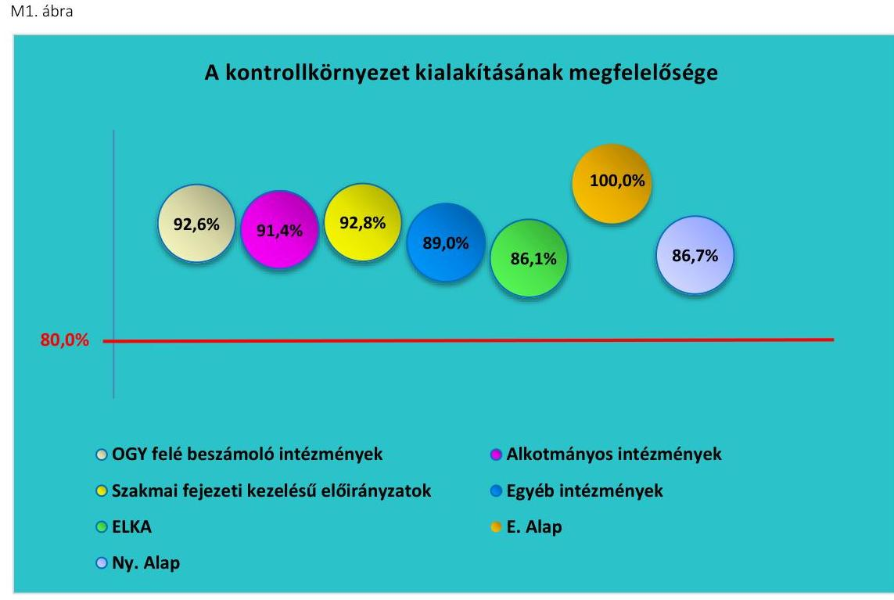

Forrás: ÁSZ kimutatás

---

A TB Alapok és az OGY felé beszámolásra kötelezett intézmények esetében a belső kontrollrendszer egészének minősítése megfelelő értékelést kapott. E szervezetek rendelkeztek a működésüket meghatározó szabályzatokkal, valamint a szabályszerű gazdálkodást meghatározó számviteli szabályzatokkal. Elkészítették a gazdálkodási jogkörök gyakorlására vonatkozó eljárásrendet, az integrált kockázatkezelési eljárásrendet, illetve rendelkeztek ellenőrzési nyomvonallal.

A belső kontrollrendszer összevont - és ezen belül az egyes pillérek - megfelelőségének minősítését az M2. ábra tartalmazza.

M2. ábra
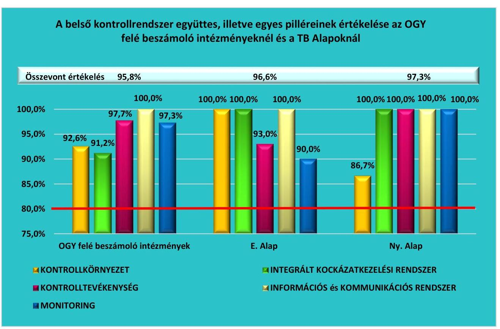

Forrás: ÁSZ kimutatás

---

# - III. SZ. MELLÉKLET: AZ INTEGRITÁS KONTROLL RENDSZER ÉRTÉKELÉSE 

Az integritás szemlélet kialakítását és működtetését az ÁSZ a 2019. évi zárszámadás keretében a költségvetési intézmények és a TB Alapok esetében minősítette. Az integritás kontrollok értékelése az intézmények esetében intézménytípusonként összevontan, míg a TB Alapok esetében az Egészségbiztosítási Alap és a Nyugdíjbiztosítási Alap kezelő szervei vonatkozásában történt. Az integritás kontrollok értékelési területei közé tartozott a szervezeti kultúra, a kockázatkezelési rendszer működtetése, a belső szabályozottság és a belső ellenőrzési rendszerek.
Az integritás szemlélet kialakítása megfelelőségének megítéléséhez az ÁSZ az alábbi kategóriákat alkalmazta:

- „kiváló", amennyiben az elért pontszám és a maximálisan elérhető pontszám aránya 80\% és 100\% közötti;
- „megfelelő", ha az arány 79\% és 60\% közötti volt;
- „fejlesztendő", ha az elért pontszám 60\% alatti volt.

Az ellenőrzött intézmények között „fejlesztendő" minősítéssel rendelkező intézmény az integritás szemlélet kialakítása és működtetése vonatkozásában nem volt.

A 62 ellenőrzött központi költségvetési egyéb intézmény közül 8 intézmény az integritási kontrollok összevont értékelése alapján „Megfelelő" minősítést kapott (DebrSZKI ${ }^{66}$, HumanRI, JavorkaSZKI, KeszRend ${ }^{67}$, MAGYKUTI, NEMZBIO, TataSZC ${ }^{68}$ és a VasMSZI). Jellemző hiányosságként fordult elő, hogy

- a Bkr. előírása ellenére nem rendelkeztek az integrált kockázatkezelési rendszer működtetésének szabályait tartalmazó szabályzattal, illetve a tevékenységben rejlő és a szervezeti célokkal összefüggő kockázatokat nem mérték fel;
- az Áht. előírása ellenére nem rendelkeztek hatályos szervezeti és működési szabályzattal.

Az integritás szemlélet érvényesülésének összevont értékelését intézménytípusonként az M3. ábra mutatja be.
M3. ábra
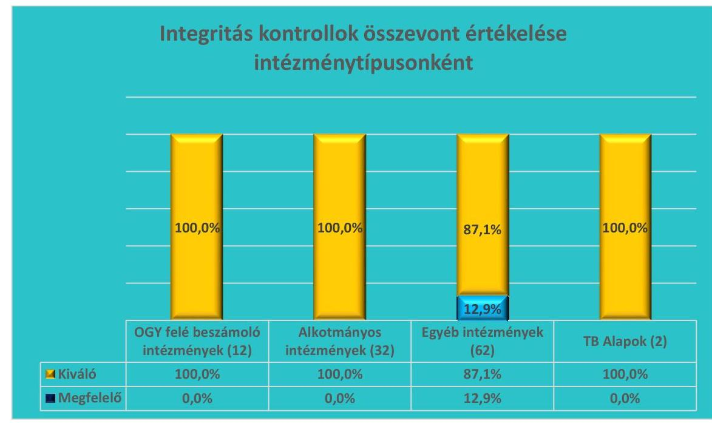

Forrás: ÁSZ kimutatás

---

# IV. SZ. MELLÉKLET: ELLENŐRZÖTT FEJEZETEK ÉS SZERVEZETEK 

## Országgyülés felé beszámolásra kötelezett intézmények

| Egyenlő Bánásmód Hatóság | Gazdasági Versenyhivatal |
 | Közbeszerzési Hatóság |
| :--: | :--: | :--: |
| Központi Statisztikai Hivatal | Magyar Energetikai és Közmű-szabályozási Hivatal | Magyar Művészeti Akadémia |
| Magyar Tudományos Akadémia | Nemzeti Adatvédelmi és Információszabadság Hatóság | Nemzeti Élelmiszerláncbiztonsági Hivatal |
| Nemzeti Emlékezet Bizottságának Hivatala | Nemzeti Kutatási, Fejlesztési és Innovációs Hivatal | Nemzeti Választási Iroda |
| Alkotmányos fejezetek intézményei |  |  |
| Alapvető Jogok Biztosának Hivatala | Alkotmánybíróság | Balassagyarmati Törvényszék |
| Budapest Környéki Törvényszék | Debreceni Ítélőtábla | Debreceni Törvényszék |
| Egri Törvényszék | Fővárosi Ítélőtábla | Fővárosi Törvényszék |
| Győri Ítélőtábla | Győri Törvényszék | Gyulai Törvényszék |
| Kaposvári Törvényszék | Kecskeméti Törvényszék | Köztársasági Elnöki Hivatal |
| Kúria | Legfőbb Ügyészség | Miskolci Törvényszék |
| Nyíregyházi Törvényszék | Országgyűlés Hivatala | Országos Bírósági Hivatal |
| Pécsi Ítélőtábla | Pécsi Törvényszék | Szegedi Ítélőtábla |
| Szegedi Törvényszék | Szekszárdi Törvényszék | Székesfehérvári Törvényszék |
| Szolnoki Törvényszék | Szombathelyi Törvényszék | Tatabányai Törvényszék |
| Veszprémi Törvényszék | Zalaegerszegi Törvényszék |  |
| Pejezeti kezelésű előirányzatok |  |  |
| Agrárminisztérium | Belügyminisztérium | Emberi Erőforrások Minisztériuma |
| Gazdasági Versenyhivatal | Honvédelmi Minisztérium | Igazságügyi Minisztérium |
| Innovációs és Technológiai Minisztérium | Központi Statisztikai Hivatal | Köztársasági Elnöki Hivatal |
| Külgazdasági és Külügyminisztérium | Legfőbb Ügyészség | Magyar Művészeti Akadémia |
| Magyar Tudományos Akadémia | Miniszterelnökség | Miniszterelnöki Kabinetiroda |
| Miniszterelnöki Kormányiroda | Nemzeti Kutatási, Fejlesztési és Innovációs Hivatal | Nemzeti Választási Iroda |
| Országgyűlés Hivatala | Országos Bírósági Hivatal | Pénzügyminisztérium |

---

| Központi kezelésű és az állami vagyonnal kapcsolatos bevételi és kiadási előirányzatok |  |  |
| :--: | :--: | :--: |
| Agrárminisztérium | Agrár-Vállalkozási Hitelgarancia Alapítvány | Államadósság Kezelő Központ Zrt. |
| Állami Egészségügyi Ellátó Központ | Baranya Megyei Kormányhivatal | Bács-Kiskun Megyei Kormányhivatal |
| Belügyminisztérium | Békés Megyei Kormányhivatal | Bethlen Gábor Alapkezelő Zrt. |
| Borsod-Abaúj-Zemplén Megyei Kormányhivatal | Budapest Főváros Kormányhivatala | Csongrád Megyei Kormányhivatal* |
| Emberi Erőforrások Minisztériuma | Emberi Erőforrás Támogatáskezelő | Fejér Megyei Kormányhivatal |
| Garantiqa Hitelgarancia Zrt. | Győr-Moson-Sopron Megyei Kormányhivatal | Hajdú-Bihar Megyei Kormányhivatal |
| Heves Megyei Kormányhivatal | Innovációs és Technológiai Minisztérium | Jász-Nagykun-Szolnok Megyei Kormányhivatal |
| KAVOSZ Vállalkozásfejlesztési Zrt. | Komárom-Esztergom Megyei Kormányhivatal | Központi Statisztikai Hivatal |
| Külgazdasági és Külügyminisztérium | Magyar Államkincstár | Magyar Bányászati és Földtani Szolgálat |
| Magyar Exporthitel Biztosító Zrt. | Magyar Export Import Bank Zrt. | Magyar Fejlesztési Bank Zrt. |
| Magyar Nemzeti Vagyonkezelő Zrt. | Miniszterelnökség | Miniszterelnöki Kormányiroda |
| Nemzeti Adó- és Vámhivatal | Nemzeti Egészségbiztosítási Alapkezelő | Nemzeti Eszközkezelő Zrt. |
| Nemzeti Földügyi Központ | Nemzeti Útdijfizetési Szolgáltató Zrt | Nógrád Megyei Kormányhivatal. |
| Pest Megyei Kormányhivatal | Pénzügyminisztérium | Somogy Megyei Kormányhivatal |
| Szabolcs-Szatmár-Bereg Megyei Kormányhivatal | Tolna Megyei Kormányhivatal | Vas Megyei Kormányhivatal |
| Zala Megyei Kormányhivatal |  |  |
| Elkülönített állami pénzalapok és kezelő szerveik |  |  |
| Bethlen Gábor Alap -   Bethlen Gábor Alapkezelő Zrt. | Központi Nukleáris Pénzügyi Alap Innovációs és Technológiai Minisztérium | Nemzeti Foglalkoztatási Alap Pénzügyminisztérium |
| Nemzeti Kulturális Alap -   Emberi Erőforrás Támogatáskezelő | Nemzeti Kutatási, Fejlesztési és   Innovációs Alap - Nemzeti Kutatási,   Fejlesztési és Innovációs Hivatal |  |
| Társadalombiztosítási alapok |  |  |
| Magyar Államkincstár | Nemzeti Egészségbiztosítási Alapkezelő |  |
| A központi költségvetés egyéb intézményei |  |  |
| Állatorvostudományi Egyetem** | Alsó-Duna-Völgyi Vízügyi Igazgatóság | AM Kelet-Magyarországi Agrárképző Központ, Mezőgazdasági Szakgimnázium, Szakközépiskola és Kollégium*** |
| AM Közép-Magyarországi Agrárszakértő Központ, Bercsényi Miklós Élelmiszeripari Szakgimnázium, Szakközépiskola és Kollégium**** | Atommagkutató Intézet | Bábolna Nemzeti Ménesbirtok |

---

| Bácsborsódi "Őszi Napfény" Integrált Szociális Intézmény | Baranya Megyei Kormányhivatal | Berettyóújfalui Tankerületi Központ |
| :--: | :--: | :--: |
| Budapest Főváros Kormányhivatala | Debreczeni Márton Mezőgazdasági és Élelmiszeripari Szakgimnázium és Szakközépiskola***** | Dunaújvárosi Egyetem |
| Emberi Erőforrások Minisztériuma Rákospalotai Javítóintézete és Központi Speciális Gyermekotthona | Emberi Erőforrások Minisztériuma Speciális Gyermekotthoni Központ, Általános Iskola és Szakiskola | Eötvös Lóránd Kutatási Hálózat Titkársága |
| Eszterházy Károly Egyetem | Győr-Moson-Sopron Megyei Alpokalja Szociális Központ | Győr-Moson-Sopron Megyei Büntetés-végrehajtási Intézet |
| Hatvani Tankerületi Központ | Hortobágyi Nemzeti Park Igazgatóság | Jász-Nagykun-Szolnok Megyei Gyermekvédelmi Központ és Területi Gyermekvédelmi Szakszolgálat |
| Jávorka Sándor Mezőgazdasági és Élelmiszeripari Szakgimnázium, Szakközépiskola és Kollégium****** | Kalocsai Fegyház és Börtön | Kazincbarcikai Tankerületi Központ |
| Kelet-Pesti Tankerületi Központ | Készenléti Rendőrség | Kiskunhalasi Országos Büntetés-végrehajtási Intézet |
| Kiss Ferenc Erdészeti Szakgimnázium | Komárom-Esztergom Megyei Integrált Szociális Intézmény | Kormányzati Ellenőrzési Hivatal |
| Kormányzati Informatikai Fejlesztési Ügynökség | Közép-Dunántúli Vízügyi Igazgatóság | Közép-Pesti Tankerületi Központ |
| Központi Statisztikai Hivatal   Népességtudományi Kutató Intézet | Liget Otthon Fogyatékos Személyek Ápoló, Gondozó Otthona | Magyar Mezőgazdasági   Múzeum és Könyvtár |
| Magyar Nemzeti Múzeum | Magyarságkutató Intézet | Mátészalkai Tankerületi Központ |
| Nemzeti Biodiverzitás- és Génmegőrzési Központ | Nemzeti Humánreprodukciós Intézet | Nemzeti Örökség Intézete |
| Néprajzi Múzeum | Roth Gyula Erdészeti, Faipari, Kertészeti, Környezetvédelmi Szakgimnázium, Szakközépiskola és Kollégium****** | Salgótarjáni Tankerületi Központ |
| Somogy Megyei Dr. Takács Imre Szociális Otthon | Somogy Megyei Gyermekvédelmi Központ és Területi Gyermekvédelmi Szakszolgálat | Somogy Megyei II. Rákóczi Ferenc Gyermekotthon |
| Somogy Megyei Szeretet Szociális Otthon | Székesfehérvári Szakképzési Centrum | Szépművészeti Múzeum |
| Szombathelyi Élelmiszeripari és Földmérési Szakgimnázium, Szakközépiskola és Kollégium****** | Szombathelyi Tankerületi Központ | Tatabányai Szakképzési Centrum |
| Tatabányai Tankerületi Központ | Tolna Megyei Integrált Szociális Intézmény | Tolna Megyei Kormányhivatal |
| Tököli Országos Büntetés-végrehajtási Intézet | Vas Megyei Egyesített Szociális Intézmény | Vas Megyei Szakképzési Centrum |
| Vas Megyei Szakosított Szociális Intézmény | Veszprémi Tankerületi Központ |  |

*: A Csongrád Megyei Kormányhivatal jogutóda 2020. június 4-től a Csongrád-Csanád Megyei Kormányhivatal.
**: Az Állatorvostudományi Egyetem költségvetési szervi jogállása 2020. július 31-én megszűnt.

---

*** : Az AM Kelet-Magyarországi Agrárképző Központ, Mezőgazdasági Szakgimnázium, Szakközépiskola és Kollégium jogutóda 2020. június 30-tól a Déli Agrárszakképzési Centrum.
****: Az AM Közép-Magyarországi Agrárszakértő Központ, Bercsényi Miklós Élelmiszeripari Szakgimnázium, Szakközépiskola és Kollégium jogutóda 2020. június 30-tól a Közép-magyarországi Agrárszakképzési Centrum.
***** : A Debreczeni Márton Mezőgazdasági és Élelmiszeripari Szakgimnázium és Szakközépiskola jogutóda 2020. június 30-tól az Északi Agrárszakképzési Centrum.
****** : A Jávorka Sándor Mezőgazdasági és Élelmiszeripari Szakgimnázium, Szakközépiskola és Kollégium és a Szombathelyi Élelmiszeripari és Földmérési Szakgimnázium, Szakközépiskola és Kollégium jogutóda 2020. június 30-tól a Kisalföldi Agrárszakképzési Centrum.

---

.

---

# FÜGGELÉKEK 

- I. SZ. FÜGGELÉK: AZ ELLENŐRZÖTT SZERVEZETEK ÁSZ ÁLTAL EL NEM FOGADOTT ÉSZREVÉTELEI

A jelentéstervezetet a Számvevőszék 15 napos észrevételezésre megküldte az ellenőrzött szervezetek vezetőinek az ÁSZ tv. 29. § (1) bekezdése előírásának megfelelően.

Az ÁSZ tv. 29. § (3) bekezdésével összhangban az ÁSZ a Függelékben feltünteti az ellenőrzés megállapításaival kapcsolatban tett, figyelembe nem vett észrevételeket, és megindokolja, hogy azokat miért nem fogadta el.

[^0]
[^0]:    * 29. § (1) Az Állami Számvevőszék az ellenőrzési megállapításait megküldi az ellenőrzött szervezet vezetőjének vagy az általa megbízott személynek, és annak, akinek személyes felelősségét állapította meg.
    (2) Az ellenőrzött szervezet vezetője és a felelősként megjelölt személy az ellenőrzés megállapításaira tizenöt napon belül írásban észrevételt tehet.
    (3) Az Állami Számvevőszék az észrevételre a beérkezésétől számított harminc napon belül írásban válaszol. A figyelembe nem vett észrevételeket köteles a jelentésben feltüntetni, és megindokolni, hogy azokat miért nem fogadta el.

---

# INNOVÁCIÓS ÉS TECHNOLÓGIAI MINISZTÉRIUM 

## Észrevétel:

A miniszter észrevételében jelezte, hogy a Tatabányai Szakképzési Centrum a Bkr. előírásainak megfelelően rendelkezett integrált kockázatkezelési rendszer működtetésének szabályait tartalmazó szabályzattal, továbbá felmérték a szervezet tevékenységében rejlő és a szervezeti célokkal összefüggő kockázatokat. Észrevétele szerint a Tatabányai Szakképzési Centrum az Áht. előírásával összhangban rendelkezett szervezeti és működési szabályzattal.

## Az észrevétel el nem fogadásának indoklása:

A számvevőszéki jelentéstervezetben a tevékenységben rejlő és a szervezeti célokkal összefüggő kockázatok felmérésének hiányára vonatkozó megállapítás a Tatabányai Szakképzési Centrumra nem vonatkozik.

A rendelkezésre bocsátott szervezeti és működési szabályzat az értékelt időszakban nem volt hatályban. A rendelkezésre bocsátott integrált kockázatkezelési eljárásrend hatályba lépésének napja 2019. november 13-a, így az ellenőrzött időszak több mint 10 hónapjában a Tatabányai Szakképzési Centrum nem rendelkezett a hivatkozott szabályzattal.

## KÉSZENLÉTI RENDŐRSÉG

## Észrevétel:

A Készenléti Rendőrség vezetője észrevételében kifejtette, hogy a Készenléti Rendőrség rendelkezett és jelenleg is rendelkezik szervezeti és működési szabályzattal, továbbá az integrált kockázatkezelési rendszer működtetésének szabályait tartalmazó szabályzatokkal.

## Az észrevétel el nem fogadásának indoklása:

A Készenléti Rendőrség a 2019. február 14-től hatályos szervezeti és működési szabályzatot bocsátotta az ÁSZ rendelkezésére, amelynek hatálya a 2019. január 1. - 2019. február 13. közötti időszakra nem terjedt ki. Az észrevétellel ellentétben az ÁSZ nem az integrált kockázatkezelési rendszer szabályzat hiányát kifogásolta, hanem nem bocsátottak olyan dokumentumot az ellenőrzés rendelkezésére, amely igazolta volna, hogy a Készenléti Rendőrség az integrált kockázatkezelési eljárásrendjének 2. számú mellékletében előírt módon, valamint a Bkr. 7. § (2) bekezdésében foglaltakkal összhangban a tevékenységében rejlő és a szervezeti célokkal összefüggő kockázatokat felmérte volna a 2019. évre vonatkozóan.

## LIGET OTTHON FOGYATÉKOS SZEMÉLYEK ÁPOLÓ, GONDOZÓ OTTHONA

## Észrevétel:

Az intézményvezető észrevételében jelezte, hogy az ÁSZ részére feltöltésre került a Szociális és Gyermekvédelmi Főigazgatóság számviteli politikája, amelynek hatálya kiterjedt intézményükre is, külön számviteli politika készítésére nem kötelezett.

## Az észrevétel el nem fogadásának indoklása:

A Liget Otthon az ellenőrzés rendelkezésére nem bocsátott olyan számviteli politikát, amely hatályos volt a 2019. évben. Az SZGYF és az intézmény közötti, a gazdálkodást érintő feladatok megosztásáról szóló megállapodásban foglaltak szerint a Liget Otthonnak olyan számviteli politikával kellett volna rendelkeznie a 2019. évben, amelyet a helyi sajátosságoknak megfelelően a Liget Otthon intézményvezetője készített el és az SZGYF hagyott jóvá.

---

# MAGYAR ÁLLAMKINCSTÁR 

## Észrevétel:

Az elnök észrevételében jelezte, hogy rendelkezett a Nyugdíjbiztosítási Alap ellátási területre vonatkozó számlarenddel.

## Az észrevétel el nem fogadásának indoklása:

A Magyar Államkincstár nem bocsátott az ellenőrzés rendelkezésére olyan hiteles dokumentumot, amely igazolta volna, hogy a Nyugdíjbiztosítási Alap ellátási területre vonatkozóan hatályos számlarenddel rendelkezett a 2019. évben.

## PÉNZÜGYMINISZTÉRIUM

## Észrevétel:

A miniszter észrevételében jelezte, hogy a központi költségvetési szervek 2019. évi költségvetési beszámolójában kimutatott kötelezettségvállalással terhelt maradvány összegének nem kell megegyeznie az Áhsz. 14. melléklet II. Kötelezettségvállalások, más fizetési kötelezettségek nyilvántartásában szereplő adatokkal. Eltérést okozhatnak olyan bevételi elemek (például az Ávr. 150. § (1) bekezdés d)-f) pontja
 szerinti bevételek), amelyekkel kapcsolatban a költségvetési szerv a mérlegforduló napon még nem rendelkezhetett kötelezettségvállalással, és így az Ávr. 56. § (1) bekezdésében előírt, az Áhsz. szerinti nyilvántartásba vétel sem történhetett meg.

## Az észrevétel el nem fogadásának indoklása:

A megállapítással érintett két ellenőrzött szervezet esetében a költségvetési beszámolókban kimutatott kötelezettségvállalással terhelt maradványok összege és a részletező nyilvántartásokban kimutatott összegek közötti eltéréseket nem az Ávr. 150. § (1) bekezdésének d)-f) pontjában foglalt bevételi elemek okozták.

---

# KÖZBESZERZÉSI HATÓSÁG (I. ORSZÁGGYŰLÉS, 5. CÍM) 

A Közbeszerzési Hatóság belső kontrollrendszere szabályszerűen, az Áht., az Ávr. és a Bkr. előírásai szerint került kiépítésre. Az integritás kontrollok megteremtették az integritás szemlélet érvényesülésének, a korrupciós kockázatok kezelésének feltételeit.

Az intézmény bevételi és kiadási adatai megbízhatóak voltak, bevételeinek és kiadásainak elszámolása szabályszerű volt.

Az intézmény az előirányzat-módosításra és a költségvetési maradvány kimutatásra vonatkozóan az Áht., az Ávr. és az Áhsz. előírásait betartotta. A beszámoló részét képező mérleget, eredmény-kimutatást és kiegészítő mellékletet a jogszabályi előírásokkal összhangban állították össze. A beszámoló kötelező egyezőségeire vonatkozó Áhsz. előírások érvényesültek.

## NEMZETI ADATVÉDELMI ÉS INFORMÁCIÓSZABADSÁG HATÓSÁG (I. ORSZÁGGYŰLÉS, 21. CÍM)

A Nemzeti Adatvédelmi és Információszabadság Hatóság belső kontrollrendszere szabályszerűen, az Áht., az Ávr. és a Bkr. előírásai szerint került kiépítésre. Az integritás kontrollok megteremtették az integritás szemlélet érvényesülésének, a korrupciós kockázatok kezelésének feltételeit.

Az intézmény bevételi és kiadási adatai megbízhatóak voltak, bevételeinek és kiadásainak elszámolása szabályszerű volt.

Az intézmény az előirányzat-módosításra és a költségvetési maradvány kimutatásra vonatkozóan az Áht., az Ávr. és az Áhsz. előírásait betartotta. A beszámoló részét képező mérleget, eredmény-kimutatást és kiegészítő mellékletet a jogszabályi előírásokkal összhangban állították össze. A beszámoló kötelező egyezőségeire vonatkozó Áhsz. előírások érvényesültek.

## EGYENLŐ BÁNÁSMÓD HATÓSÁG (I. ORSZÁGGYŰLÉS, 22. CÍM)

Az Egyenlő Bánásmód Hatóság belső kontrollrendszere szabályszerűen, az Áht., az Ávr. és a Bkr. előírásai szerint került kiépítésre. Az integritás kontrollok megteremtették az integritás szemlélet érvényesülésének, a korrupciós kockázatok kezelésének feltételeit.

Az intézmény bevételi és kiadási adatai megbízhatóak voltak, bevételeinek és kiadásainak elszámolása szabályszerű volt.

Az intézmény az előirányzat-módosításra és a költségvetési maradvány kimutatásra vonatkozóan az Áht., az Ávr. és az Áhsz. előírásait betartotta. A beszámoló részét képező mérleget, eredmény-kimutatást és kiegészítő mellékletet a jogszabályi előírásokkal összhangban állították össze. A beszámoló kötelező egyezőségeire vonatkozó Áhsz. előírások érvényesültek.

## MAGYAR ENERGETIKAI ÉS KÖZMŰ-SZABÁLYOZÁSI HIVATAL (I. ORSZÁGGYŰLÉS, 23. CÍM)

A Magyar Energetikai és Közmű-szabályozási Hivatal belső kontrollrendszere szabályszerűen, az Áht., az Ávr. és a Bkr. előírásai szerint került kiépítésre. Az integritás kontrollok megteremtették az integritás szemlélet érvényesülésének, a korrupciós kockázatok kezelésének feltételeit.

Az intézmény bevételi és kiadási adatai megbízhatóak voltak, bevételeinek és kiadásainak elszámolása szabályszerű volt.

Az intézmény az előirányzat-módosításra és a költségvetési maradvány kimutatásra vonatkozóan az Áht., az Ávr. és az Áhsz. előírásait betartotta. A beszámoló részét képező mérleget, eredmény-kimutatást és kiegészítő mellékletet a jogszabályi előírásokkal összhangban állították össze. A beszámoló kötelező egyezőségeire vonatkozó Áhsz. előírások érvényesültek.

---

# NEMZETI EMLÉKEZET BIZOTTSÁGÁNAK HIVATALA (I. ORSZÁGGYŰLÉS, 25. CÍM) 

A Nemzeti Emlékezet Bizottságának Hivatala belső kontrollrendszere szabályszerűen, az Áht., az Ávr. és a Bkr. előírásai szerint került kiépítésre. Az integritás kontrollok megteremtették az integritás szemlélet érvényesülésének, a korrupciós kockázatok kezelésének feltételeit.

Az intézmény bevételi és kiadási adatai megbízhatóak voltak, bevételeinek és kiadásainak elszámolása szabályszerű volt.

Az intézmény az előirányzat-módosításra és a költségvetési maradvány kimutatásra vonatkozóan az Áht., az Ávr. és az Áhsz. előírásait betartotta, a beszámoló részét képező mérleget, eredmény-kimutatást és kiegészítő mellékletet a jogszabályi előírásokkal összhangban állította össze. A beszámoló kötelező egyezőségeire vonatkozó Áhsz. előírások érvényesültek.

## NEMZETI ÉLELMISZERLÁNC-BIZTONSÁGI HIVATAL (XII. FÖLDMŰVELÉSÜGYI MINISZTÉRIUM, 2. CÍM)

A Nemzeti Élelmiszerlánc-biztonsági Hivatal belső kontrollrendszere szabályszerűen, az Áht., az Ávr. és a Bkr. előírásai szerint került kiépítésre. Az integritás kontrollok megteremtették az integritás szemlélet érvényesülésének, a korrupciós kockázatok kezelésének feltételeit.

Az intézmény bevételi és kiadási adatai megbízhatóak voltak, bevételeinek és kiadásainak elszámolása szabályszerű volt.

Az intézmény az előirányzat-módosításra és a költségvetési maradvány kimutatásra vonatkozóan az Áht., az Ávr. és az Áhsz. előírásait betartotta, a beszámoló részét képező mérleget, eredmény-kimutatást és kiegészítő mellékletet a jogszabályi előírásokkal összhangban állította össze. Az Áhsz. kötelező egyezőségekre vonatkozó előírásai érvényesültek.

## GAZDASÁGI VERSENYHIVATAL (XXX. GAZDASÁGI VERSENYHIVATAL FEJEZET)

A Gazdasági Versenyhivatal belső kontrollrendszere szabályszerűen, az Áht., az Ávr. és a Bkr. előírásai szerint került kiépítésre. Az integritás kontrollok megteremtették az integritás szemlélet érvényesülésének, a korrupciós kockázatok kezelésének feltételeit.

Az intézmény bevételi és kiadási adatai megbízhatóak voltak, bevételeinek és kiadásainak elszámolása szabályszerű volt.

## GAZDASÁGI VERSENYHIVATAL FEJEZETI KEZELÉSŰ ELŐIRÁNYZATOK (XXX. GAZDASÁGI VERSENYHIVATAL FEJEZET, 2. CÍM)

A fejezeti kezelésű előirányzat belső kontrollkörnyezetének kialakítása szabályszerűen történt. A fejezeti kezelésű előirányzatról készített költségvetési jelentés az Áhsz. előírásai szerint, főkönyvi kivonattal alátámasztva tartalmazta a bevételek és kiadások teljesítési adatait. A maradvány kimutatásokat a jogszabályi előírások alapján állították össze, a kötelezettségvállalással terhelt maradvány összege megegyezett az analitikus nyilvántartásban szereplő adatokkal, azokat dokumentumok igazolták.

## KÖZPONTI STATISZTIKAI HIVATAL (XXXI. KÖZPONTI STATISZTIKAI HIVATAL FEJEZET)

A Központi Statisztikai Hivatal belső kontrollrendszere szabályszerűen, az Áht., az Ávr. és a Bkr. előírásai szerint került kiépítésre. Az integritás kontrollok megteremtették az integritás szemlélet érvényesülésének, a korrupciós kockázatok kezelésének feltételeit.

Az intézmény bevételi és kiadási adatai megbízhatóak voltak, bevételeinek és kiadásainak elszámolása szabályszerű volt.

Az intézmény az előirányzat-módosításra, átcsoportosításra, és a költségvetési maradvány kimutatásra vonatkozóan az Áht., az Ávr. és az Áhsz. előírásait betartotta, a beszámoló részét képező mérleget, eredménykimutatást és kiegészítő mellékletet a jogszabályi előírásokkal összhangban állította össze. Az Áhsz. kötelező egyezőségekre vonatkozó előírásai érvényesültek.

---

# KÖZPONTI STATISZTIKAI HIVATAL FEJEZETI KEZELÉSŰ ELŐIRÁNYZATOK (XXXI. KÖZPONTI STATISZTIKAI HIVATAL FEJEZET, 6. CÍM) 

A fejezeti kezelésű előirányzatról készített költségvetési jelentés az Áhsz. előírásai szerint, főkönyvi kivonattal alátámasztva tartalmazta a bevételek és kiadások teljesítési adatait. A maradvány kimutatásokat a jogszabályi előírások alapján állították össze, a kötelezettségvállalással terhelt maradvány összege megegyezett az analitikus nyilvántartásban szereplő adatokkal, azokat dokumentumok igazolták.
MAGYAR TUDOMÁNYOS AKADÉMIA (XXXIII. MAGYAR TUDOMÁNYOS AKADÉMIA FEJEZET 1. CÍM)
A Magyar Tudományos Akadémia belső kontrollrendszere szabályszerűen, az Áht., az Ávr. és a Bkr. előírásai szerint került kiépítésre. Az integritás kontrollok megteremtették az integritás szemlélet érvényesülésének, a korrupciós kockázatok kezelésének feltételeit.

Az intézmény bevételi és kiadási adatai megbízhatóak voltak, bevételeinek és kiadásainak elszámolása szabályszerű volt.

Az intézmény az előirányzat-módosításra és a költségvetési maradvány kimutatásra vonatkozóan az Áht., az Ávr. és az Áhsz. előírásait betartotta, a beszámoló részét képező mérleget, eredmény-kimutatást és kiegészítő mellékletet a jogszabályi előírásokkal összhangban állította össze. Az Áhsz. kötelező egyezőségekre vonatkozó előírásai érvényesültek.
MAGYAR TUDOMÁNYOS AKADÉMIA FEJEZETI KEZELÉSŰ ELŐIRÁNYZATOK (XXXIII. MAGYAR TUDOMÁNYOS AKADÉMIA FEJEZET, 6. CÍM)

A fejezeti kezelésű előirányzatról készített költségvetési jelentés az Áhsz. előírásai szerint, főkönyvi kivonattal alátámasztva tartalmazta a bevételek és kiadások teljesítési adatait. A maradvány kimutatásokat a jogszabályi előírások alapján állították össze, a kötelezettségvállalással terhelt maradvány összege megegyezett az analitikus nyilvántartásban szereplő adatokkal, azokat dokumentumok igazolták.

## XXXIV. MAGYAR MŰVÉSZETI AKADÉMIA 1. CÍM

A Magyar Művészeti Akadémia belső kontrollrendszere szabályszerűen, az Áht., az Ávr. és a Bkr. előírásai szerint került kiépítésre. Az integritás kontrollok megteremtették az integritás szemlélet érvényesülésének, a korrupciós kockázatok kezelésének feltételeit.

Az intézmény bevételi és kiadási adatai megbízhatóak voltak, bevételeinek és kiadásainak elszámolása szabályszerű volt.

Az intézmény az előirányzat-módosításra és a költségvetési maradvány kimutatásra vonatkozóan az Áht., az Ávr. és az Áhsz. előírásait betartotta, a beszámoló részét képező mérleget, eredmény-kimutatást és kiegészítő mellékletet a jogszabályi előírásokkal összhangban állította össze. Az Áhsz. kötelező egyezőségekre vonatkozó előírásai érvényesültek.
MAGYAR MŰVÉSZETI AKADÉMIA FEJEZETI KEZELÉSŰ ELŐIRÁNYZATOK (XXXIV. MAGYAR MŰVÉSZETI AKADÉMIA FEJEZET, 4. CÍM)

A fejezeti kezelésű előirányzatról készített költségvetési jelentés az Áhsz. előírásai szerint, főkönyvi kivonattal alátámasztva tartalmazta a bevételek és kiadások teljesítési adatait. A maradvány kimutatásokat a jogszabályi előírások alapján állították össze, a kötelezettségvállalással terhelt maradvány összege megegyezett az analitikus nyilvántartásban szereplő adatokkal, azokat dokumentumok igazolták.
NEMZETI KUTATÁSI, FEJLESZTÉSI ÉS INNOVÁCIÓS HIVATAL (XXXV. NEMZETI KUTATÁSI, FEJLESZTÉSI ÉS INNOVÁCIÓS HIVATAL 1. CÍM)

A Nemzeti Kutatási, fejlesztési és Innovációs Hivatal belső kontrollrendszere szabályszerűen, az Áht., az Ávr. és a Bkr. előírásai szerint került kiépítésre. Az integritás kontrollok megteremtették az integritás szemlélet érvényesülésének, a korrupciós kockázatok kezelésének feltételeit.

Az intézmény bevételi és kiadási adatai megbízhatóak voltak, bevételeinek és kiadásainak elszámolása szabályszerű volt.

---

Az intézmény az előirányzat-módosításra és a költségvetési maradvány kimutatásra vonatkozóan az Áht., az Ávr. és az Áhsz. előírásait betartotta, a beszámoló részét képező mérleget, eredmény-kimutatást és kiegészítő mellékletet a jogszabályi előírásokkal összhangban állította össze. Az Áhsz. kötelező egyezőségekre vonatkozó előírásai érvényesültek.

NEMZETI KUTATÁSI, FEJLESZTÉSI ÉS INNOVÁCIÓS HIVATAL FEJEZETI KEZELÉSŰ ELŐIRÁNYZATOK (XXXV. NEMZETI KUTATÁSI, FEJLESZTÉSI ÉS INNOVÁCIÓS HIVATAL FEJEZET, 2. CÍM)

A fejezeti kezelésű előirányzatról készített költségvetési jelentés az Áhsz. előírásai szerint, főkönyvi kivonattal alátámasztva tartalmazta a bevételek és kiadások teljesítési adatait. A maradvány kimutatásokat a jogszabályi előírások alapján állították össze, a kötelezettségvállalással terhelt maradvány összege megegyezett az analitikus nyilvántartásban szereplő adatokkal, azokat dokumentumok igazolták.

---

# - III. SZ. FÜGGELÉK: TÁJÉKOZTATÁS A FIGYELEMFELHÍVÓ LEVELEKRŐL 

A 2019. évi központi költségvetés végrehajtásának ellenőrzése során feltárt szabályszerűségi hibák kijavítására az Állami Számvevőszék elnöke figyelemfelhívó levélben szólította fel az érintett intézmények vezetőit. A figyelemfelhívó levélben foglaltakat az ÁSZ törvény előírásai szerint az ellenőrzött szervezet vezetőjének tizenöt napon belül szükséges elbírálnia, a megfelelő intézkedést megtennie, és a megtett intézkedésekről az Állami Számvevőszék elnökét értesítenie.

Az ellenőrzés során feltárt szabálytalanságok kapcsán összesen 41 ellenőrzött szervezet vezetője részére került sor figyelemfelhívó levél megküldésére. A figyelemfelhívásokban rögzített szabálytalanságok a számvitel, a könyvvezetés, a kötelezettségvállalás, valamint a kifizetést megelőző kontrollok működésének témaköreit érintették.

Az ellenőrzés során feltárt, a figyelemfelhívó levelekben rögzített hibák a lényegességi szintet nem érték el, így a zárszámadási törvényjavaslatban szereplő adatok megbízhatóságát, a központi költségvetés egésze végrehajtásának szabályszerűségét nem befolyásolták.

---

# RÖVIDÍTÉSEK JEGYZÉKE 

${ }^{1}$ Alaptörvény
${ }^{2}$ Stabilitási tv.
${ }^{3}$ Kvtv.
${ }^{4}$ TB Alapok
${ }^{5}$ E. Alap
${ }^{6}$ Ny. Alap
${ }^{7}$ ELKA
${ }^{8}$ Áht.
${ }^{9}$ Kincstár
${ }^{10}$ Áhsz.
${ }^{11}$ ÁSZ
${ }^{12}$ ÁSZ. tv.
${ }^{13}$ PM
${ }^{14}$ NAV
${ }^{15}$ ÁKK Zrt.
${ }^{16}$ ÁEEK
${ }^{17}$ Eximbank
${ }^{18}$ KAVOSZ
${ }^{19}$ OGYH
${ }^{20}$ KEH
${ }^{21} \mathrm{AB}$
${ }^{22}$ AJBH
${ }^{23} \mathrm{OBH}$
${ }^{24}$ OGY
${ }^{25} \mathrm{KH}$
${ }^{26}$ NAIH
${ }^{27}$ EBH
${ }^{28}$ MEKSzH
${ }^{29}$ NVI
${ }^{30}$ NEBH
${ }^{31}$ NÉBIH
${ }^{32}$ GVH
${ }^{33} \mathrm{KSH}$
${ }^{34}$ MTA
${ }^{35}$ MMA
${ }^{36}$ NKFIH
${ }^{37}$ ÁSZ SZMSZ

Magyarország Alaptörvénye (hatályos: 2011. április 25-től)
2011. évi CXCIV. törvény Magyarország gazdasági stabilitásáról (hatályos: 2011. december 31-étől)
2018. évi L. törvény Magyarország 2019. évi központi költségvetéséről (hatályos: 2018. november 1-jétől)

Társadalombiztosítási Alapok: Nyugdíjbiztosítási Alap és Egészségbiztosítási Alap
Egészségbiztosítási Alap
Nyugdíjbiztosítási Alap
Elkülönített Állami Pénzalapok
2011. évi CXCV. törvény az államháztartásról (hatályos: 2011. december 31-től)

Magyar Államkincstár
4/2013. (I. 11.) Korm.
 rendelet az államháztartás számviteléről (hatályos: 2014. január 1-jétől)
Állami Számvevőszék
2011. évi LXVI. törvény az Állami Számvevőszékről (hatályos: 2011. július 1-jétől)

Pénzügyminisztérium
Nemzeti Adó- és Vámhivatal
Államadósság Kezelő Központ Zártkörűen Működő Részvénytársaság
Állami Egészségügyi Ellátó Központ
Magyar Export Import Bank Zrt.
KAVOSZ Vállalkozásfejlesztési Zrt.
Országgyűlés Hivatala
Köztársasági Elnöki Hivatal
Alkotmánybíróság
Alapvető Jogok Biztosának Hivatala
Országos Bírósági Hivatal
Országgyűlés
Közbeszerzési Hatóság
Nemzeti Adatvédelmi és Információszabadság Hatóság
Egyenlő Bánásmód Hatóság
Magyar Energetikai és Közmű-szabályozási Hivatal
Nemzeti Választási Iroda
Nemzeti Emlékezet Bizottságának Hivatala
Nemzeti Élelmiszerlánc-biztonsági Hivatal
Gazdasági Versenyhivatal
Központi Statisztikai Hivatal
Magyar Tudományos Akadémia
Magyar Művészeti Akadémia
Nemzeti Kutatási, Fejlesztési és Innovációs Hivatal
Állami Számvevőszék Szervezeti és Működési Szabályzata (hatályos: 2020. január 1-jétől)

---

| ${ }^{38}$ Ávr. | 368/2011. (XII. 31.) Korm. rendelet - az államháztartásról szóló törvény végrehajtásáról (hatályos: 2012. január 1-jétől) |
| :--: | :--: |
| ${ }^{39}$ KGR K11 | Költségvetés Gazdálkodási Rendszer K11 adatgyűjtő-beszámoló rendszer |
| ${ }^{40} \mathrm{KAR}$ | Költségvetési Adatcserélő Rendszer |
| ${ }^{41}$ AHAB | Államháztartási Adatbázis |
| ${ }^{42}$ GDP | Bruttó hazai termék |
| ${ }^{43}$ EGT | Európai Gazdasági Térség |
| ${ }^{44}$ BGA | Bethlen Gábor Alap |
| ${ }^{45}$ KNPA | Központi Nukleáris Pénzügyi Alap |
| ${ }^{46}$ NEFA | Nemzeti Foglalkoztatási Alap |
| ${ }^{47}$ NKA | Nemzeti Kulturális Alap |
| ${ }^{48}$ NKFIA | Nemzeti Kutatási, Fejlesztési és Innovációs Alap |
| ${ }^{49}$ Vtv. | 2007. évi CVI. törvény az állami vagyonról (hatályos: 2007. szeptember 25-től) |
| ${ }^{50}$ EMVA | Európai Mezőgazdasági Vidékfejlesztési Alap |
| ${ }^{51}$ EHA | Európai Halászati Alap |
| ${ }^{52}$ EMGA | Európai Mezőgazdasági Garancia Alap |
| ${ }^{53}$ 514/2014 EU rendelet | az Európai Parlament és a Tanács 514/2014/EU rendelete (2014. április 16.) a Menekültügyi, a Migrációs és az Integrációs alapra, valamint a rendőrségi együttműködés, a bűnmegelőzés és a bűnözés elleni küzdelem, valamint a válságkezelés pénzügyi támogatására szolgáló eszközre vonatkozó általános rendelkezések megállapításáról |
| ${ }^{54}$ Számv. tv. | 2000. évi C. törvény a számvitelről (hatályos: 2001. január 1-jétől) |
| ${ }^{55}$ Bkr. | a költségvetési szervek belső kontrollrendszeréről és belső ellenőrzéséről szóló 370/2011. (XII. 31.) Korm. rendelet |
| ${ }^{56}$ EMET | Emberi Erőforrás Támogatáskezelő |
| ${ }^{57}$ ATOMMAG | Atommagkutató Intézet |
| ${ }^{58}$ HumanRI | Nemzeti Humánreprodukciós Intézet |
| ${ }^{59}$ JavorkaSZKI | Jávorka Sándor Mezőgazdasági és Élelmiszeripari Szakgimnázium, Szakközépiskola és Kollégium |
| ${ }^{60}$ MAGYKUTI | Magyarságkutató Intézet |
| ${ }^{61}$ NEMZBIO | Nemzeti Biodiverzitás- és Génmegőrzési Központ |
| ${ }^{62}$ SMGyermV | Somogy Megyei Gyermekvédelmi Központ és Területi Gyermekvédelmi Szakszolgálat |
| ${ }^{63}$ SMSzerO | Somogy Megyei Szeretet Szociális Otthon |
| ${ }^{64}$ SzombSZKI | Szombathelyi Élelmiszeripari és Földmérési Szakgimnázium, Szakközépiskola és Kollégium |
| ${ }^{65}$ VasMSZC | Vas Megyei Szakképzési Centrum |
| ${ }^{66}$ DebrSZKI | Debreczeni Márton Mezőgazdasági és Élelmiszeripari Szakgimnázium és Szakközépiskola |
| ${ }^{67}$ KeszRend | Készenléti Rendőrség |
| ${ }^{68}$ TataSZC | Tatabányai Szakképzési Centrum |

---

# ASZ 

ÁLLAMI SZÁMVEVŐSZÉK
1052 Budapest, Apáczai Cs. J. u. 10. I 1364 Budapest 4. Pf. 54 TEL: +36 14849100
email: szamvevoszek@asz.hu
web: www.asz.hu | www.aszhirportal.hu
