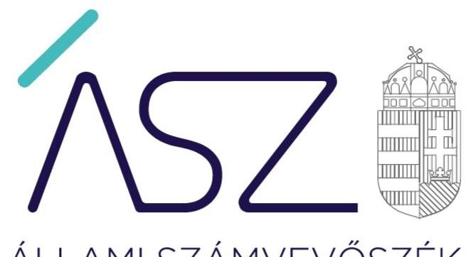

ÁLLAMI SZÁMVEVŐSZÉK

# JELENTÉS 

## Utóellenőrzések

Kockázatértékelésen alapuló utóellenőrzések
2020.

20205
www.asz.hu

---

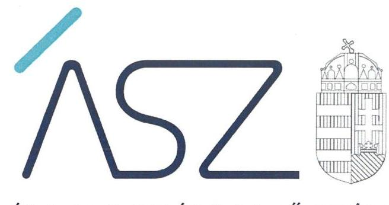

ÁLLAMI SZÁMVEVŐSZÉK

# JELENTÉS 

## Utóellenőrzések

Kockázatértékelésen alapuló utóellenőrzések
2020. 11. hó 25. nap

20205
www.asz.hu
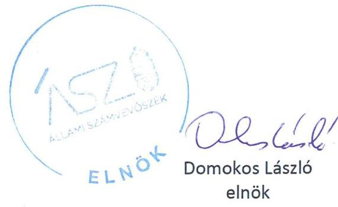

---

# AZ ELLENŐRZÉST FELÜGYELTE: 

VARGA EDIT felügyeleti vezető

## AZ ELLENŐRZÉST VEZETTE ÉS A VÉGREHAJTÁSÁÉRT FELELŐS:

HUDÁK KATALIN ellenőrzésvezető

## A PROGRAM ÖSSZEÁLLÍTÁSÁÉRT FELELŐS:

GÖRGÉNYI GÁBOR osztályvezető

## A TÉMÁHOZ KAPCSOLÓDÓ KORÁBBI SZÁMVEVŐSZÉKI JELENTÉSEK:

- címe: Nem állami humánszolgáltatók ellenőrzése A humánszolgáltatást nyújtó államháztartáson kívüli köznevelési intézmények, szolgáltatók fenntartói központi költségvetésből kapott támogatásai felhasználásának ellenőrzése
Tehetséges Más Fogyatékosokért Oktatási Alapítvány 2017.
- sorszáma: 17161
- címe: Nem állami humánszolgáltatók ellenőrzése A humánszolgáltatást nyújtó államháztartáson kívüli köznevelési intézmények, szolgáltatók fenntartói központi költségvetésből kapott támogatásai felhasználásának ellenőrzése Hibó Tamás Művészeti Alapítvány 2017.
- sorszáma: 17159
- címe: Nem állami humánszolgáltatók ellenőrzése A humánszolgáltatást nyújtó államháztartáson kívüli köznevelési intézmények, szolgáltatók fenntartói központi költségvetésből kapott támogatásai felhasználásának ellenőrzése
Művészetért Közalapítvány 2017.
- sorszáma: 17126
- címe: Alapítványok ellenőrzése Alapítványok/közalapítványok gazdálkodásának ellenőrzése
MÁV Szimfonikusok Zenekari Alapítvány 2017.
- sorszáma: 17166

---

| - címe: | Alapítványok ellenőrzése   Alapítványok/közalapítványok gazdálkodásának ellenőrzése   Budapesti Fesztiválzenekar Alapítvány 2017. |
| :--: | :--: |
| - sorszáma: | 17229 |
| - címe: | Állami tulajdonú gazdasági társaságok   Az állami tulajdonban (résztulajdonban) lévő gazdálkodó szervezetek vagyonmegőrzési és gazdálkodási tevékenységének ellenőrzése   Filharmónia Magyarország Koncert és Fesztiválszervező Nonprofit Kft. 2018. |
| - sorszáma: | 18010 |
| - címe: | Az önkormányzatok gazdasági társaságai   Az önkormányzatok többségi tulajdonában lévő gazdasági társaság gazdálkodásának ellenőrzése   MartonSport Nonprofit Kft. 2018. |
| - sorszáma: | 18159 |
| - címe: | Az önkormányzatok gazdasági társaságai   Az önkormányzatok többségi tulajdonában lévő gazdasági társaság gazdálkodásának ellenőrzése   Sárvíz Kistérségi Járóbeteg Szakellátó és Egészségügyi Szolgáltató Közhasznú Nonprofit Kft. 2018. |
| - sorszáma: | 18118 |
| - címe: | Nem állami humánszolgáltatók ellenőrzése   A humánszolgáltatást nyújtó államháztartáson kívüli köznevelési intézmények, szolgáltatók fenntartói központi költségvetésből kapott támogatásai felhasználásának ellenőrzése   Sziltop Oktatási Nonprofit Közhasznú Kft. 2017. |
| - sorszáma: | 17162 |
| - címe: | Nem állami humánszolgáltatók ellenőrzése   A humánszolgáltatást nyújtó államháztartáson kívüli köznevelési intézmények, szolgáltatók fenntartói központi költségvetésből kapott támogatásai felhasználásának ellenőrzése   Rockenbauer Felsőoktatási Közhasznú Nonprofit Korlátolt Felelősségű Társaság 2017. |
| - sorszáma: | 17158 |

---

.

---

# TARTALOMJEGYZÉK 

■ ÖSSZEGZÉS ..... 7
■ AZ ELLENŐRZÉS CÉLJA ..... 8
■ AZ ELLENŐRZÉS TERÜLETE ..... 9
■ AZ ELLENŐRZÉS HÁTTERE, INDOKOLTSÁGA ..... 10
■ A JELENTÉS LÉNYEGES KÉRDÉSKÖRE ..... 11
■ AZ ELLENŐRZÉS HATÓKÖRE ÉS MÓDSZEREI ..... 12
■ MEGÁLLAPÍTÁSOK ..... 14
■ MELLÉKLETEK ..... 15
I. sz. melléklet: Ellenőrzött szervezetek kockázati szintű értékelése ..... 15
II. sz. melléklet: Az ellenőrzött szervezetekre vonatkozó egyedi ellenőrzési megállapítások ..... 16
III. sz. melléklet: Fogalomtár ..... 19
■ FÜGGELÉKEK ..... 21
I. sz. függelék a jelentéshez ..... 21
II. sz. függelék: Észrevételek ..... 22
■ RÖVIDÍTÉSEK JEGYZÉKE ..... 31

---

.

---

# ÖSSZEGZÉS 

A kockázatelemzés alapján kiválasztott tíz szervezet közül hat szervezet esetén a feltárt hibák kijavításának hiánya miatt nem volt biztosított a szabályszerű működés, ezáltal nem járultak hozzá a közpénzügyi helyzet javításához. Négy szervezet intézkedéseinek hatására javult a gazdálkodás átláthatósága és elszámoltathatósága.

## Az ellenőrzés társadalmi indokoltsága

Az Állami Számvevőszék stratégiájában célul tűzte ki a számvevőszéki munka hasznosulásának javítását. Ezzel összhangban ellenőrzi, hogy az ellenőrzött szervezetek megvalósították-e a korábbi, Állami Számvevőszék ellenőrzései során feltárt hibák, hiányosságok és szabálytalanságok megszüntetése céljából elkészített intézkedési tervekben foglaltakat. A rendszeres utóellenőrzések hozzájárulnak a szükséges intézkedések tényleges végrehajtásához, ezáltal a közpénzügyek rendezettségének javulásához.

Az Állami Számvevőszék kiemelt célja, hogy az alapítványok, gazdasági társaságok működésében, gazdálkodásában rejlő kockázatok feltárásával, ellenőrzésével is hozzájáruljon a közpénzek átlátható, rendezett módon való felhasználásához.

Jelen utóellenőrzés 5 alapítvány és 5 gazdasági társaság belső szabályozottságának és működésének lényeges területeit értékelte, a kiválasztott szervezetek nem reprezentálják a hazai alapítványokat és gazdasági társaságokat.

## Főbb megállapítások, következtetések

Az utóellenőrzés a 10 ellenőrzött szervezet közül 6 szervezet esetében állapította meg, hogy nőtt a szabálytalan működés kockázata. Az összesített értékelés alapján három alapítvány és három gazdasági társaság esetében nőtt a kockázat a számviteli beszámolóval, valamint egyes számviteli szabályzatokkal kapcsolatos hiányosságok miatt, így nem volt biztosított a közpénz szabályos felhasználása.

Két alapítvány és két gazdasági társaság működési kockázatai csökkentek, mivel kialakították a közpénzekkel való gazdálkodás alapvető szabályozási kereteit, biztosították a 2018. évben felhasznált támogatások átláthatóságát, továbbá az államháztartásból kapott és 2018. évben felhasznált költségvetési támogatásokról vezetett nyilvántartásaik biztosították a közpénzekkel való gazdálkodás elszámoltathatóságát.

---

# AZ ELLENŐRZÉS CÉLJA 

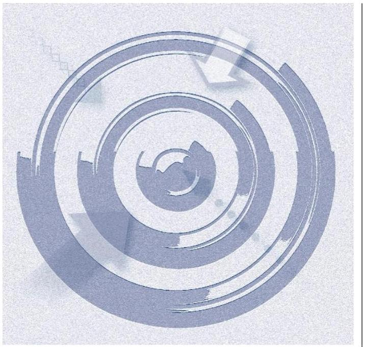

Az ellenőrzés célja annak kockázatalapú értékelése, hogy a kormányzati szektorba sorolt, vagy a Bkr. ${ }^{1}$ hatálya alá nem tartozó szervezet az intézkedési tervek végrehajtásával hasznosította-e az ÁSZ² jelentésben a hiányosságok megszüntetése, illetve a kockázatok kezelése érdekében megfogalmazott javaslatokat.

Javult-e a közpénzügyi helyzet és az ÁSZ ellenőrzési megállapításai hasznosultak-e.

---

# AZ ELLENŐRZÉS TERÜLETE 

## Utóellenőrzések (harmadik szakasz)

Az ellenőrzés azokra a kormányzati szektorba sorolt, vagy a Bkr. hatálya alá nem tartozó gazdasági társaságokra és alapítványokra terjedt ki, amelyeknél az utóellenőrzésre kijelölt számvevőszéki jelentésben foglalt megállapításokhoz kapcsolódó, az ellenőrzött szervezet vezetője által készített intézkedési tervben meghatározott feladatok végrehajtásának határideje 2018. december 31-én lejárt.

Jelen kockázatalapú utóellenőrzés az átlátható és elszámoltatható közpénzfelhasználás érdekében 5 alapítvány és 5 gazdasági társaság belső szabályozottságának és működési tevékenységének lényeges területeit értékelte.

---

# AZ ELLENŐRZÉS HÁTTERE, INDOKOLTSÁGA 

Az Állami Számvevőszék az ÁSZ törvényben ${ }^{3}$ kapott felhatalmazás alapján, ellenőrzési programok végrehajtása keretében ellenőrzi a közpénzt és a nemzeti vagyont kezelő és felhasználó szervezeteket. Az ellenőrzések tapasztalatairól készült jelentéseiben az ÁSZ a szervezet szabályszerű működésének visszaállítása érdekében fogalmaz meg javaslatokat. A szervezetek intézkedési terveinek végrehajtásával javul a közpénzügyi helyzet és hasznosul az ÁSZ ellenőrzési tevékenysége. A közpénzzel és a nemzeti vagyonnal történő felelős gazdálkodás érvényre jutása érdekében készített intézkedési tervben foglaltak megvalósítását az ÁSZ utóellenőrzések keretében ellenőrizheti.

Az ellenőrzött szervezet szintjén az utóellenőrzés feltárja, hogy a szervezet az intézkedések végrehajtásával hasznosította-e a korábbi ellenőrzési jelentésben a hiányosságok megszüntetése, illetve a kockázatok kezelése érdekében megfogalmazott javaslatokat, illetve az intézkedések végrehajtása elmaradásának következtében továbbra is fennálló szabálytalanság esetén értékeli a közpénzek, közvagyon veszélyeztetettségét. Az alapítványok és gazdasági társaságok közfeladat ellátására kapott támogatásban részesülhetnek.

Az ÁSZ szintjén az utóellenőrzés visszacsatolást ad az ellenőrzési jelentések hasznosulásáról.

---

# A JELENTÉS LÉNYEGES KÉRDÉSKÖRE 

- Csökkent-e az ellenőrzött szervezet szabálytalan működésének kockázata?

---

# AZ ELLENŐRZÉS HATÓKÖRE ÉS MÓDSZEREI 

## Az ellenőrzés típusa

Megfelelőségi ellenőrzés.

## Az ellenőrzött időszak

2018. év

## Az ellenőrzés tárgya

Az érintett számvevőszéki jelentésben foglalt megállapításokhoz kapcsolódó - az ellenőrzött szervezet vezetője által készített - intézkedési tervben meghatározott feladatok végrehajtásának kockázatalapú ellenőrzése.

## Az ellenőrzött szervezetek

Az ellenőrzés a kormányzati szektorba sorolt, vagy a Bkr. hatálya alá nem tartozó alapítványoknál és gazdasági társaságoknál végzett ellenőrzésekről készült jelentésben foglalt megállapításokhoz kapcsolódó intézkedésekre kötelezett - I. sz. mellékletben felsorolt - szervezetekre terjed ki.

## Az ellenőrzés jogalapja

Az ÁSZ tv. 1. § (3) bekezdés és 33. § (7) bekezdés.

## Az ellenőrzés módszerei

Az ellenőrzés az ellenőrzött időszakban hatályos jogszabályok, az ellenőrzés szakmai szabályai, a jelen ellenőrzésre irányadó ÁSZ módszertanok, az ellenőrzési programban foglalt értékelési szempontok szerint, önállóan vagy ellenőrzéshez kapcsolódóan, annak részeként került végrehajtásra.

Az ellenőrzés ideje alatt az ellenőrzött szervezettel történő kapcsolattartás az ÁSZ SZMSZ-ének vonatkozó előírásai alapján kerül biztosításra.

Az utóellenőrzés megállapításai az ÁSZ rendelkezésére álló dokumentumok, valamint az ÁSZ adatbekérése szerint, az ellenőrzött szervezetek által rendelkezésre bocsátott dokumentumok, adatok alapján kerültek megfogalmazásra.

---

Az ellenőrzési kérdések megválaszolásához szükséges bizonyítékok megszerzése az ellenőrzött által rendelkezésre bocsátott dokumentumokra, adatokra alapozva megfigyelés, szemle (szemrevételezés) kérdésfeltevés (információkérés), valamint elemző eljárás alkalmazásával történt. Az ellenőrzési bizonyítékként felhasználható adatforrások közé tartoztak egyrészt az ellenőrzési program részletes szempontjainál felsorolt adatforrások, másrészt minden - az ellenőrzés folyamán feltárt, az ellenőrzés szempontjából információt tartalmazó - dokumentum.

Az ellenőrzés kiterjedt minden olyan körülményre és adatra, amely az ÁSZ jogszabályban meghatározott feladataiban, valamint a program végrehajtása folyamán felmerült újabb összefüggések feltárásához szükséges volt.

Az ÁSZ az utóellenőrzés során kockázati értékelésen alapuló ellenőrzési megközelítés alkalmazásával azt ellenőrizte, hogy az ÁSZ által kockázatosnak jelölt területeken feltárt hibák kijavítása megtörtént-e, csökkent-e a szervezet szabálytalan működésének kockázata.

Jelen ellenőrzés során, egy ellenőrzött vonatkozásában az ÁSZ nem tárt fel lényeges hiányosságot a bekért lényeges dokumentumok ellenőrzése alapján, ezért tanúsítványban hívta fel az ellenőrzött figyelmét az intézkedési tervben vállalt feladatok végrehajtására, annak céljával, hogy az ÁSZ meggyőződjön arról, hogy csökkentek-e a korábban feltárt hiányosságokból eredő kockázatok.

---

# Csökkent-e az ellenőrzött szervezet szabálytalan működésének kockázata? 

Összegző megállapítás

A kiválasztott tíz szervezet közül hat szervezet esetében nőtt a szabálytalan működés kockázata a közpénzekkel való gazdálkodással kapcsolatos hiányosság, szabálytalanság miatt. Négy szervezet intézkedett a működési szabálytalanság megszüntetéséről, így a kockázatokat csökkentették.

Az ellenőrzött tíz szervezet közül hat szervezetnél a szabálytalan működés kockázatának növekedését az alábbi szabálytalanságok okozták:
$\longrightarrow$ egy szervezet nem tett eleget a Számv. tv ${ }^{5}$. 4. § (1) bekezdésében és a Civil tv ${ }^{6}$. 28. § (1) bekezdésében foglaltaknak, mert nem készítette el a 2018. évi számviteli beszámolót;
$\longrightarrow$ egy szervezetnél a jóváhagyásra jogosult kuratórium a Civil tv. 30. § (1) bekezdésének előírása ellenére nem hagyta jóvá a 2018. évi számviteli beszámolót. Jóváhagyott számviteli beszámoló hiányában a szervezet nem rendelkezett a Számv. tv. 4. § (1) bekezdése előírása ellenére számviteli beszámolóval.
$\longrightarrow$ egy szervezetnél a jóváhagyásra jogosult legfőbb szerv a Ptk. ${ }^{7}$ 3:109. § (2) bekezdésének előírása ellenére nem hagyta jóvá a 2018. évi számviteli beszámolót. Jóváhagyott számviteli beszámoló hiányában a szervezet nem rendelkezett a Számv. tv. 4. § (1) bekezdése előírása ellenére számviteli beszámolóval, valamint az értékelési szabályzat ${ }^{8}$ intézkedési terv szerinti kiegészítését a Számv. tv. 50. § (4) bekezdésében foglaltak ellenére nem hajtotta végre;
$\longrightarrow$ egy szervezet 2018. évben nem rendelkezett a Számv. tv. 161. § (1) bekezdésében előírt számlarenddel;
$\longrightarrow$ egy szervezet 2018. évben nem rendelkezett leltárkészítési és leltározási szabályzattal ${ }^{9}$, ami ellentétes a Számv. tv. 14. § (5) bekezdés a) pontjával;
$\longrightarrow$ egy szervezet a 2018. évi számviteli beszámoló mérlegtételeit a Számv. tv. 69. § (1) bekezdésében foglaltak és az Intézkedési tervében vállaltak ellenére sem támasztotta alá leltárral.
Négy szervezet esetében csökkent a szabálytalan működés kockázata, mivel intézkedtek a belső szabályozottság terén megállapított hiányosságok megszüntetésével a szabályszerű gazdálkodás feltételeinek kialakításáról, továbbá megszüntették a gazdálkodás terén feltárt szabálytalanságokat is.

---

# MELLÉKLETEK

I. SZ. MELLÉKLET: ELLENŐRZÖTT SZERVEZETEK KOCKÁZATI SZINTŰ ÉRTÉKELÉSE

|  Sorszám | Ellenőrzött szervezet | Kockázati értékelés  |
| --- | --- | --- |
|  1. | Tehetséges Más Fogyatékosokért Oktatási Alapítvány | Csökkent  |
|  2. | Hibó Tamás Művészeti Alapítvány | Csökkent  |
|  3. | Sziltop Oktatási Nonprofit Közhasznú Korlátolt Felelősségű Társaság | Csökkent  |
| 

 4. | Rockenbauer Felsőoktatási Közhasznú Nonprofit Korlátolt Felelősségű
Társaság | Csökkent  |
|  5. | Művészetért Közalapítvány | Nőtt  |
|  6. | MÁV Szimfonikusok Zenekari Alapítvány | Nőtt  |
|  7. | Budapesti Fesztiválzenekar Alapítvány | Nőtt  |
|  8. | Filharmónia Magyarország Koncert és Fesztiválszervező Nonprofit
Korlátolt Felelősségű Társaság | Nőtt  |
|  9. | MartonSport Nonprofit Kft. | Nőtt  |
|  10. | Sárvíz Kistérségi Járóbeteg Szakellátó és Egészségügyi Szolgáltató Köz-
hasznú Nonprofit Kft. | Nőtt  |

---

# Nőtt az ellenőrzött szervezetek szabálytalan működésének kockázata 

Három alapítvány a számviteli beszámolási kötelezettség hiánya, a számviteli beszámoló legfőbb szerv általi jóváhagyásának hiánya és a számviteli szabályzat elkészítésének hiánya miatt, három gazdasági társaság pedig a számviteli beszámoló legfőbb szerv általi jóváhagyásának hiánya, a számviteli szabályzat elkészítésének hiánya, a számviteli szabályzat kiegészítésének hiánya és a számviteli beszámoló szabályszerű könyvvezetéssel történő alátámasztásának hiánya miatt nem biztosította a közpénzekkel való szabályos gazdálkodás elszámoltathatóságát. Az alábbi szervezetek esetében nőtt a szabálytalan működés kockázata.
$\longrightarrow$ Művészetért Közalapítvány
$\longrightarrow$ MÁV Szimfonikusok Zenekari Alapítvány
$\longrightarrow$ Budapesti Fesztiválzenekar Alapítvány
$\longrightarrow$ Filharmónia Magyarország Koncert és Fesztiválszervező Nonprofit Korlátolt Felelősségű Társaság
$\longrightarrow$ MartonSport Nonprofit Kft.
$\longrightarrow$ Sárvíz Kistérségi Járóbeteg Szakellátó és Egészségügyi Szolgáltató Közhasznú Nonprofit Kft.

## Művészetért Közalapítvány

A közalapítvány a számviteli politikáját a Számv. tv.-ben foglaltaknak megfelelően kiegészítette és a számlarendjét összehangolta a Civilszr. ${ }^{10}$ előírásaival, a belső szabályozottsággal kapcsolatos korábbi hiányosságokat megszüntette.

A közalapítvány a Számv. tv. 4. § (1) bekezdés és a Civil tv. 28. § (1) bekezdés szerinti számviteli beszámolóval nem rendelkezett, így a működési tevékenységgel kapcsolatos hiányosságot nem szüntette meg.

## MÁV Szimfonikusok Zenekari Alapítvány

Az alapítvány a számviteli politikájába beépítette a Civil tv.-ben foglalt előírásokat, a belső szabályozottsággal kapcsolatos hiányosságokat megszüntette. Az alapítvány a számlarend, a főkönyvi nyilvántartás és a könyvelési kartonok alapján a közfeladat ellátására kapott támogatás elkülönített nyilvántartására vonatkozóan feltárt szabálytalanságot megszüntette, így eleget tett a Civil tv. rendelkezésének.

Az alapítvány számviteli beszámolóval nem rendelkezett a számviteli beszámoló Kuratóriumi jóváhagyásának hiánya miatt, megsértve a Számv. tv. 4. § (1) bekezdése és a Civil tv. 30. § (1) bekezdése előírásait, így a működési tevékenységgel kapcsolatos hiányosságot nem szüntette meg.

---

# Budapesti Fesztiválzenekar Alapítvány 

Az alapítványnál a működési tevékenységgel kapcsolatban hiányosságok nem merültek fel.

Az alapítvány a belső szabályozottsággal kapcsolatos hiányosságokat nem szüntette meg, mert a Számv. tv. 161. § (1) bekezdése ellenére nem rendelkezett számlarenddel.

## Filharmónia Magyarország Koncert és Fesztiválszervező Nonprofit Korlátolt Felelősségű Társaság

A társaság a számviteli politikáját összhangba hozta a Számv. tv. előírásaival, azonban az értékelési szabályzatát nem egészítette ki a Számv. tv. 50. § (4) bekezdésében előírtaknak megfelelően, a térítés nélkül kapott eszközök bekerülési értékének meghatározására vonatkozóan, emiatt a belső szabályozottsággal kapcsolatos hiányosságokat nem szüntette meg.

A társaság számviteli beszámolóval nem rendelkezett a számviteli beszámoló legfőbb szerv általi jóváhagyásának hiánya miatt, megsértve a Ptk. 3:109. § (2) bekezdés előírását, így a működési tevékenységgel kapcsolatos hiányosságot nem szüntette meg.

## MartonSport Nonprofit Kft.

A társaság a számviteli beszámolóját a Számv. tv. előírásai alapján elkészítette, azt az alapító önkormányzat határozattal jóváhagyta. A társaság leltárt elrendelő utasítással és záró jegyzőkönyvvel rendelkezett az ellenőrzött időszakban, a működési tevékenységgel kapcsolatos hiányosságot megszüntette.

A társaság a számlarendjét a Számv. tv. előírásainak megfelelően kiegészítette, azonban a Számv. tv. 14. § (5) bekezdés a) pontjában előírt leltárkészítési és leltározási szabályzattal nem rendelkezett, emiatt a belső szabályozottsággal kapcsolatos hiányosságokat nem szüntette meg.

## Sárvíz Kistérségi Járóbeteg Szakellátó és Egészségügyi Szolgáltató Közhasznú Nonprofit Kft.

A társaság az intézkedési terv szabályzókra vonatkozó feladatait maradéktalanul teljesítette, ezzel a belső szabályozottsággal kapcsolatos hiányosságokat megszüntette.

A társaság a Számv. tv. előírásai alapján a számviteli beszámolóját elkészítette, azt a taggyűlés határozattal elfogadta. A 2018. évi mérleg tételeit alátámasztó leltár összeállításához kapcsolódó leltározást elrendelő utasítással és záró jegyzőkönyvvel nem rendelkezett, a számviteli beszámoló mérlegtételeit a Számv. tv. 69. § (1) bekezdésében foglaltak és az intézkedési tervében vállaltak ellenére sem támasztotta alá leltárral, így a működési tevékenységgel kapcsolatos hiányosságok nem kerültek megszüntetésre.

---

# Csökkent az ellenőrzött szervezetek szabálytalan működésének kockázata 

Két alapítvány és két gazdasági társaság esetén csökkent a szabálytalan működés kockázata, mert kialakították a közpénzekkel való gazdálkodás alapvető szabályozási kereteit és biztosították a közpénzekkel való gazdálkodás elszámoltathatóságát.
— Tehetséges Más Fogyatékosokért Oktatási Alapítvány
— HIBÓ TAMÁS MŰVÉSZETI ALAPÍTVÁNY
— Sziltop Oktatási Közhasznú Nonprofit Korlátolt Felelősségű Társaság
— Rockenbauer Felsőoktatási Közhasznú Nonprofit Korlátolt Felelősségű Társaság

---

Bkr. hatálya alá tartozó szervezetek

Bkr. hatálya alá nem tartozó szervezetek
felelős vezető
intézkedési terv
a kormányzati szektorba sorolt egyéb szervezetek

A Bkr. hatálya kiterjed:
a) az államháztartásról szóló 2011. évi CXCV. törvény (a továbbiakban: Áht.) 3. §-ában felsoroltakra az állam és a törvény által az államháztartás központi alrendszerébe sorolt köztestületek kivételével,
b) a térségi fejlesztési tanács munkaszervezetére,
c) az a) pontban meghatározottak által alapított szervekre, szervezetekre, ha azok tulajdonosi jogokat vagy vagyonkezelői jogot gyakorolnak,
d) a kormányzati szektorba sorolt egyéb szervezetekre és
e) jogszabály alapján a költségvetési szervek belső kontrollrendszerére és belső ellenőrzésére vonatkozó szabályokat alkalmazó más szervre, szervezetre. (Bkr. 1. § (2) bekezdés a-e) pontok)
A Bkr. 1. § (2) bekezdés a-e) pontokban fel nem sorolt jogi személyek, különösen:
a) gazdasági társaságok: üzletszerű közös gazdasági tevékenység folytatására, a tagok vagyoni hozzájárulásával létrehozott, jogi személyiséggel rendelkező vállalkozások [Ptk. 3:88. § (1) bekezdés];
b) alapítványok: az alapító által az alapító okiratban meghatározott tartós cél folyamatos megvalósítására létrehozott jogi személyek [Ptk. 3:88. § (1) bekezdés]
A számvevőszéki jelentésben foglalt megállapításokhoz kapcsolódó intézkedési terv összeállításáért felelős ellenőrzött szervezet első számú vezetője (ÁSZ tv. 33. § (1) bekezdés)
Az ellenőrzött szervezet vezetője köteles a számvevőszéki jelentésben foglalt megállapításokhoz kapcsolódó intézkedési tervet összeállítani. (ÁSZ tv. 33. § (1) bekezdés)
Az Áht. ${ }^{11}$ 3. § (2) és (3) bekezdésében foglaltakon kívül az Európai Közösséget létrehozó szerződéshez csatolt, a túlzott hiány esetén követendő eljárásról szóló jegyzőkönyv alkalmazásáról szóló 2009. május 25-i 479/2009/EK rendelet (a továbbiakban: 479/2009/EK rendelet) szerint a kormányzati szektorba sorolt szervezet. (Áht. 1. § 12. pont)

---

.

---

# FÜGGELÉKEK 

- I. SZ. FÜGGELÉK A JELENTÉSHEZ

Az Állami Számvevőszék az ellenőrzések során feltárt tényekhez kapcsolódó további körülmények tisztázására eszközrendszerrel nem rendelkezik. Amennyiben az ellenőrzésen túlmutatóan indokoltnak látszik az ellenőrzés során feltárt körülmények további vizsgálata, az Állami Számvevőszék törvényi felhatalmazás alapján az ellenőrzés által feltárt körülményeket továbbítja a hatáskörrel rendelkező szervnek a szükséges intézkedések megtétele, eljárások lefolytatása érdekében.

1. A MÁV Szimfonikusok Zenekari Alapítvány - a teljességi és hitelességi nyilatkozata, valamint az ellenőrzés rendelkezésére adott dokumentumai alapján - 2018. évi számviteli beszámolóját a Civil tv. 30. § (1) bekezdésében foglaltak ellenére az alapítvány kuratóriuma nem hagyta jóvá.
Ennek hiányában a beszámolóként közzétett adatok - ezek között a közpénzfelhasználásra vonatkozó adatok - megbízhatósága nem igazolt.
Az eset konkrét körülményeinek feltárására az illetékes törvényszék rendelkezik hatáskörrel.
2. A Filharmónia Magyarország Koncert és Fesztiválszervező Nonprofit Korlátolt Felelősségű Társaság - a teljességi és hitelességi nyilatkozata, valamint az ellenőrzés rendelkezésére adott dokumentumai alapján - 2018. évi számviteli beszámolóját a Ptk. 3:109. § (2) bekezdésében előírtak ellenére a társaság legfőbb szerve nem hagyta jóvá.
Ennek hiányában a beszámolóként közzétett adatok - ezek között a közpénzfelhasználásra vonatkozó adatok - megbízhatósága nem igazolt.
Az eset konkrét körülményeinek feltárására az illetékes törvényszék cégbírósága rendelkezik hatáskörrel.

---

A jelentéstervezetet a Számvevőszék 15 napos észrevételezésre megküldte az ellenőrzött szervezetek vezetőinek az ÁSZ tv. 29. § (1) bekezdés előírásának megfelelően.

Az ÁSZ tv.-ben meghatározott határidőn belül a MÁV Szimfonikusok Zenekari Alapítvány kuratóriumi elnöke és a MartonSport Nonprofit Korlátolt Felelősségű Társaság ügyvezetője tett észrevételt. A MÁV Szimfonikusok Zenekari Alapítvány kuratóriumi elnökének és a MartonSport Nonprofit Korlátolt Felelősségű Társaság ügyvezetőjének észrevételeit és az azokra adott válaszokat a függelék tartalmazza.
A Sárvíz Kistérségi Járóbeteg Szakellátó és Egészségügyi Szolgáltató Közhasznú Nonprofit Korlátolt Felelősségű Társaság ügyvezetője arról tájékoztatta az Állami Számvevőszék elnökét, hogy a jelentéstervezet megállapításaira nem tesz észrevételt.
A további 7 ellenőrzött szervezettől a jelentéstervezetre nem érkezett észrevétel.

[^0]
[^0]:    * 29. § (1) Az Állami Számvevőszék az ellenőrzési megállapításait megküldi az ellenőrzött szervezet vezetőjének vagy az általa megbízott személynek, és annak, akinek személyes felelősségét állapította meg.
    (2) Az ellenőrzött szervezet vezetője és a felelősként megjelölt személy az ellenőrzés megállapításaira tizenöt napon belül írásban észrevételt tehet.
    (3) Az Állami Számvevőszék az észrevételre a beérkezésétől számított harminc napon belül írásban válaszol. A figyelembe nem vett észrevételeket köteles a jelentésben feltüntetni, és megindokolni, hogy azokat miért nem fogadta el.

---

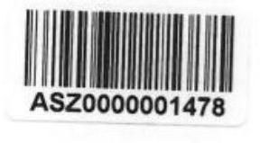

Állami Számvevőszék
1364 Budapest 4. Pf. 54.

Domokos László
elnök

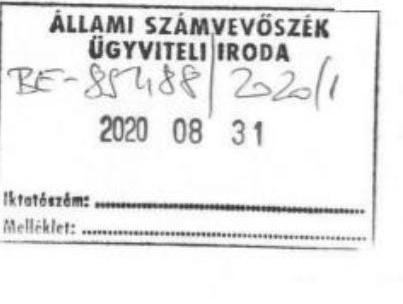

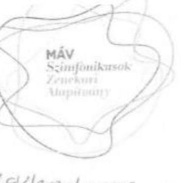

Tárgy észrevétel „utóellenőrzés jelentéstervezet”-re
Ikt. szám: EL-2449-045/2020

Ügyintéző: Kling Magdolna
gazdasági vezető
70 336 1166

Tisztelt Hivatal!

A megküldött jelentéstervezettel kapcsolatban az alábbi észrevételt tesszük:

Az utóellenőrzés során online feltöltött 2018. évi beszámolót Fenyő Gábor, a kuratórium
elnöke írta alá.

A beszámolót a kuratórium jóváhagyta.

Csatoltan küldjük a 2019. május 8-án tartott kuratóriumi ülés jegyzőkönyvét annak
mellékleteivel, melynek 3. napirendi pontjában került sor a 2018. évi beszámoló
elfogadására.

Kérjük szépen az utóellenőrzésről készülő jelentés elkészítésekor a fentieket figyelembe
venni.

Budapest, 2020. augusztus 25.

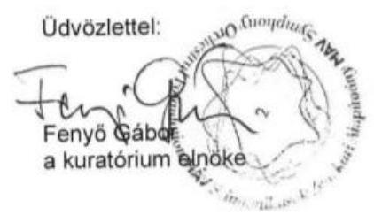

MÁV SZIMFONIKUSOK
ZENEKARI ALAPÍTVÁNY

SZÖNÉKI H-1087 Budapest, Kerepesi út 15.
LITTELEZÉS KÖN H-1088 Budapest, Múzeum utca 11.
TELEKSIKUSKI 136 1 338 2664 741 136 1 338 4085
E-MAIL office@maxzenelur.hu
MÚR www.maxzenelur.hu

KAN BARK

TELEKSIKUSKI 10200971-21521573 00000000
SZT IBAN 1029 1040 1000 4953 5756 5650 1038
KIC KERZELSZTÓ 001810216
AJÓSZÖN 18058721-242
SZT- KERZELSZTÓ 1018058721

---

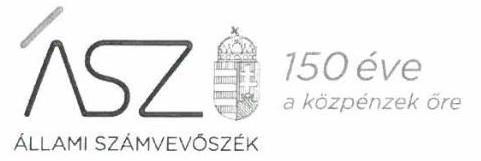

Ikt. szám: EL-2449-055/2020.

Fenyő Gábor úr
kuratóriumi elnök
MÁV Szimfonikusok Zenekari Alapítvány

# Budapest 

Tisztelt Elnök Úr!

Az „Utóellenőrzések" címmel készített számvevőszéki jelentéstervezetre a 2020. augusztus 25-én kelt, LEV/2020/000028. számú levélben megküldött észrevételét megkaptam.

Az Állami Számvevőszék az észrevételre vonatkozó álláspontjáról a felügyeleti vezető által készített részletes tájékoztatást csatoltan megküldöm.

Tájékoztatom Elnök urat, hogy a számvevőszéki jelentésben - az Állami Számvevőszékről szóló 2011. évi LXVI. törvény 29. § (3) bekezdése alapján - a figyelembe nem vett észrevételeket szerepeltetjük az elutasítás indokának feltüntetésével.

Budapest, 2020. 09. hónap AA. nap
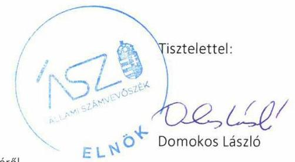

Melléklet: Tájékoztatás az észrevételek kezeléséről

---

# Tájékoztatás az észrevételek kezeléséről 

Az „Utóellenőrzések" című jelentéstervezet (továbbiakban: jelentéstervezet) MÁV Szimfonikusok Zenekari Alapítványra (továbbiakban: Alapítvány) vonatkozó megállapítására a 2020. augusztus 25-én kelt, LEV/2020/000028. számú levelében megküldött észrevételét áttekintettem. Az észrevétel kezeléséről az alábbi tájékoztatást adom.

A jelentéstervezet II. számú melléklet Alapítványra vonatkozó részének 2. bekezdése és az I. számú függelék 1. pontja megállapítására vonatkozó észrevételével kapcsolatban
Elnök úr észrevételében leírta, hogy az utóellenőrzés során az Állami Számvevőszék (továbbiakban: ÁSZ) rendelkezésére bocsátották az Alapítvány 2018. évi beszámolóját, amit a kuratórium elnöke aláírt. A beszámolót a kuratórium jóváhagyta. Elnök úr észrevételének alátámasztására, annak mellékleteként csatolta a vonatkozó kuratóriumi ülés jegyzőkönyvét.
Az ÁSZ az EL-2448-005/2020. iktatószámú levelében bekérte az Alapítvány kuratóriuma által jóváhagyott, aláírt és hiteles 2018. évi beszámolóját, amit Elnök

 úr 2020. március 5-én kelt nyilatkozata szerint az ellenőrzés rendelkezésére bocsátott. Elnök úr nyilatkozata szerint megküldött 2018. évi alapítványi beszámolót megvizsgáltam és megállapítottam, hogy annak aláírása a kuratórium elnöke részéről megtörtént, azonban az nem tartalmazza az Alapítvány 2018. évi beszámolójának jóváhagyásáról szóló kuratóriumi döntést. Az alapítványi beszámoló elfogadásáról szóló döntés nem szerepel Elnök úr 2020. március 5-én kelt teljességi és hitelességi nyilatkozatában, megállapítottam, hogy az nem került átadásra az ÁSZ részére az adatszolgáltatás során. Mindezek alapján az Alapítvány nem igazolta, hogy rendelkezik az Alapítvány kuratóriuma által jóváhagyott 2018. évi beszámolóval.
Az ÁSZ ellenőrzési megállapításait kizárólag az Állami Számvevőszékről szóló 2011. évi LXVI. törvény 28. § (2) bekezdésben meghatározott adatszolgáltatási időszakon belül megküldött, teljességi és hitelességi nyilatkozattal alátámasztott dokumentumokra alapozva teszi. Elnök úr nyilatkozott az adatszolgáltatás során arról, hogy az ÁSZ részére átadott dokumentumok, adatok megbízhatóak, és a bekért adatokra, dokumentumokra vonatkozóan teljes körű információt tartalmaznak.
A fent leírtakra tekintettel az észrevételt nem fogadjuk el, a jelentéstervezet megállapításai helytállóak, módosításuk nem indokolt.

Budapest, 2020. 00 hónap AA nap
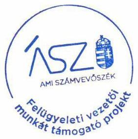

Varga Edit
felügyeleti vezető s.k.

Uacoca Gila
A kiadmány hiteles

---

# Állami Számvevőszék 

Budapest
Apáczai Csere János utca 10. 1364 .

Domokos László
Elnök Úr
részére

## 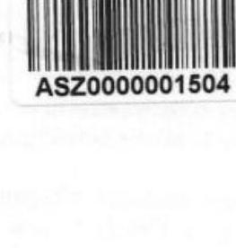

ÁLLAMI SZÁMVEVŐSZÉK
$\mathrm{SE}-8 \mathrm{Y} 77 \mathrm{C} / 20 \mathrm{~b} / \mathrm{l}$
Érkezett: 2020 SZFF 07.
Iktatószám:
Melléklet:

Iktatószám: EL-2449-045/2020.

Tisztelt Elnök Úr!

Hivatkozással a fenti iktatószámú, „Utóellenőrzések" tárgyában készült számvevőszéki jelentéstervezetre előzetesen szeretném megköszönni az Állami Számvevőszék munkatársai által elvégzett munkát.

Észrevételeinket az alábbiakban foglaljuk össze:
Ellenőrzési megállapítás:
A Társaság a számviteli beszámolóját a Számv. tv. előírásai alapján elkészítette, azt az alapító önkormányzat határozatával jóváhagyta. A Társaság leltárt elrendelő utasítással és záró jegyzőkönyvvel rendelkezett az ellenőrzött időszakban, a működési tevékenységgel kapcsolatos hiányosságokat megszüntette.
A Társaság a számlarendjét a Számv. tv. előírásainak megfelelően kiegészítette, azonban a Számv.tv. 14. § (5) bekezdés előírt leltárkészítési és leltározási szabályzattal nem rendelkezett, emiatt a belső szabályozottsággal kapcsolatos hiányosságokat nem szüntette meg.
$\rightarrow$ Észrevétel:
Az ellenőrzési megállapítás második bekezdés utolsó mondatát elfogadni nem tudjuk tekintettel arra, hogy leltárkészítési és leltározási szabályzattal Társaságunk folyamatosan rendelkezett és rendelkezik jelenleg is, azt a jelen ellenőrzéshez is felöltöttük az ÁSZ ellenőrzési felületére, melyet az ún. teljességi nyilatkozat 1.1.2.1. sorszámmal tartalmaz.
A 18159 sorszámú ellenőrzési jelentés 2. pont 3. bekezdése szerint:
„2014-2015. években a Számv. tv. 14. § (5) bekezdés a) pontja előírásai ellenére nem készítette el az eszközök és a források leltárkészítési és leltározási szabályzatát, valamint a Számv. tv. 14. § (d) pontja előírásai ellenére nem készítette el a pénzkezelési szabályzatot. A Leltározási szabályzatot és a Pénzkezelési szabályzatot 2016. január 1-jével léptette hatályba."
A végleges számvevőszéki jelentés kapcsán az intézkedési terv készítési kötelezettségnek társaságunk eleget tett, az Állami Számvevőszéknek történt megküldés előtt határozatával jóváhagyta 2018.12.05. napján.
2018. évben valamennyi szabályzat módosításra került, melyet maradéktalanul megküldtünk Önöknek.

---

Amennyiben a jelen utóellenőrzéshez megküldött - 2019. január 1. napjától hatályos - leltározási és leltárkészítési szabályzatot nem veszik figyelembe, úgy sem helytálló az utóellenőrzési jelentés megfogalmazása, mely szerint a leltárkészítési és leltározási szabályzattal nem rendelkeztünk, hiszen 2018.12.31-ig a 2016. január 1. napjától hatályos szabályzat volt érvényben.

Kérem a T. Elnök urat, az észrevételünket vizsgálják meg és mérlegeljék, továbbá amennyiben azokat elfogadják, úgy a jelentés-tervezetet ennek megfelelően módosítani szíveskedjenek különös tekintettel arra, hogy kockázati kitettsége a Társaságnak nem nőtt, hiszen Önök is megállapították, hogy a működési tevékenységgel kapcsolatos hiányosságot megszüntettük, a szabályozottságot rendbe tettük még anno az alapellenőrzés idején is, hiszen az ellenőrzött időszak utolsó évére vonatkozó szabályzat már akkor rendelkezésükre lett bocsátva.

Martonvásár, 2020. augusztus 28.

Tisztelettel

MartonSport Nonprofit Kft. 2462 Martonvásár, Budai út 13. Adószám:24901084-2-07
Cégj.sz.: 07-09-024940
Tóth Balázs
MartonSport Nonprofit Kft.
ügyvezető

---

# 150 éve   0 közzénekek öre 

Ikt. szám: EL-2449-058/2020.

Tóth Balázs Károly úr
ügyvezető
MartonSport Nonprofit Korlátolt Felelősségű Társaság

## Martonvásár

Tisztelt Ügyvezető Úr!

Az „Utóellenőrzések" címmel készített számvevőszéki jelentéstervezetre a 2020. augusztus 28-án kelt levélben megküldött észrevételét megkaptam.

Az Állami Számvevőszék az észrevételre vonatkozó álláspontjáról a felügyeleti vezető által készített részletes tájékoztatást csatoltan megküldöm.

Tájékoztatom Ügyvezető urat, hogy a számvevőszéki jelentésben - az Állami Számvevőszékről szóló 2011. évi LXVI. törvény 29. § (3) bekezdése alapján - a figyelembe nem vett észrevételeket szerepeltetjük az elutasítás indokának feltüntetésével.

Budapest, 2020. 09. hónap 22. nap

Melléklet: Tájékoztatás az észrevételek kezeléséről
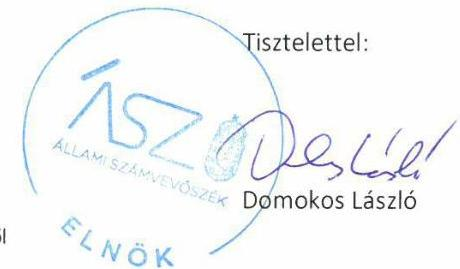

---

# Tájékoztatás az észrevételek kezeléséről 

Az „Utóellenőrzések" című jelentéstervezet (továbbiakban: jelentéstervezet) MartonSport Nonprofit Korlátolt Felelősségű Társaságra (továbbiakban: Társaság) vonatkozó megállapítására a 2020. augusztus 28-án kelt levelében megküldött észrevételét áttekintettem. Az észrevétel kezeléséről az alábbi tájékoztatást adom.

A jelentéstervezet II. számú mellékletének a Társaság leltározási és leltárkészítés szabályzatával kapcsolatos megállapítására vonatkozó észrevételével kapcsolatban
Úgyvezető úr észrevételében leírta, hogy a jelentéstervezetnek a Társaság leltározási és leltárkészítési szabályzattal kapcsolatos megállapítását nem fogadják el, mivel a Társaság leltárkészítési és leltározási szabályzattal rendelkezett és rendelkezik jelenleg is, és azt az Állami Számvevőszék (továbbiakban: ÁSZ) rendelkezésére bocsátották, az a teljességi és hitelességi nyilatkozatukban szerepel. Az ÁSZ 18159. számú jelentése megállapította, hogy a Társaság 2016. január 1-jével léptette hatályba, amely 2018. évben is érvényben volt.
Az ÁSZ 18159. számú jelentése megállapította - ahogy az Ügyvezető úr észrevételében is szerepel, hogy a Társaság 2016. január 1-jével léptette hatályba leltározási szabályzatát. A jelentés megállapítja továbbá, hogy a Társaság 2016. január 1-jétől hatályos leltározási szabályzatában a Számv. tv. 69. § (3) bekezdés előírásai ellenére nem határozta meg a leltározás gyakoriságának időszakát.
Az ÁSZ az EL-2448-003/2020. iktatószámú levelében bekérte a Társaság 2018. évben hatályos, aláírt és hiteles eszközök és források leltárkészítési és leltározási szabályzatát, továbbá felhívta Ügyvezető úr figyelmét, hogy amennyiben a bekért dokumentumot az ÁSZ egy korábbi ellenőrzéséhez már megküldte, úgy annak jelen utóellenőrzésben való felhasználhatóságáról és annak 2018. évre vonatkozó érvényességéről lehetősége van nyilatkozatot tenni.
Ügyvezető úr 2020. március 5-én kelt teljességi és hitelességi nyilatkozata szerint nem küldte meg a Társaság 2016. január 1-jétől hatályos - a korábbi ellenőrzés során az ÁSZ rendelkezésére bocsátott - leltározási szabályzatát, továbbá annak felhasználhatóságáról és 2018. évre vonatkozó érvényességéről nem nyilatkozott.
Ügyvezető úr teljességi és hitelességi nyilatkozata szerint megküldött eszközök és források leltárkészítési és leltározási szabályzatának vizsgálata során megállapításra került, hogy az 2019. január 1-jével lépett hatályba, így az 2018. évre vonatkozóan nem igazolta az ÁSZ 18159. számú jelentésében megfogalmazott szabályozási hiányosság megszüntetését. Ügyvezető úrnak a Társaság korábbi leltározási szabályzatának felhasználhatóságáról, illetve annak 2018. évre vonatkozó érvényességéről szóló nyilatkozata hiányában az ÁSZ az ellenőrzés során a Társaság 2016. január 1-jétől hatályos leltározási szabályzatát ellenőrzési bizonyítékként nem vette figyelembe. Mindezek alapján a Társaság 2018. évben nem rendelkezett a számvitelről szóló 2000. évi C. törvény 14. § (5) bekezdés a) pontjában előírt leltárkészítési és leltározási szabályzattal.
Az ÁSZ ellenőrzési megállapításait kizárólag az Állami Számvevőszékről szóló 2011. évi LXVI. törvény 28. § (2) bekezdésben meghatározott adatszolgáltatási időszakon belül megküldött, teljességi és hitelességi nyilatkozattal alátámasztott dokumentumokra alapozva teszi. Ügyvezető úr nyilatkozott az

---

adatszolgáltatás során arról, hogy az ÁSZ részére átadott dokumentumok, adatok megbízhatóak, és a bekért adatokra, dokumentumokra vonatkozóan teljes körű információt tartalmaznak.

A fent leírtakra tekintettel az észrevételt nem fogadjuk el, a jelentéstervezet megállapítása helytálló, módosítása nem indokolt.

Budapest, 2020. 08. hónap 22. nap
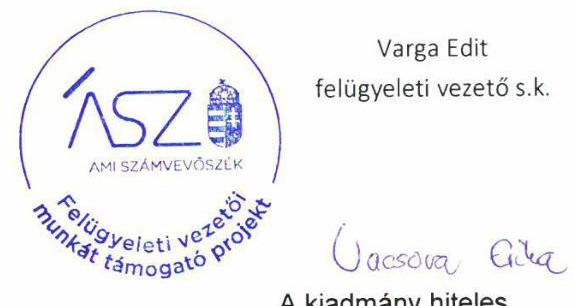

---

# RÖVIDÍTÉSEK JEGYZÉKE 

${ }^{1}$ Bkr.
${ }^{2}$ ÁSZ
${ }^{3}$ ÁSZ törvény
${ }^{4}$ ÁSZ SZMSZ
${ }^{5}$ Számv. tv.
${ }^{6}$ Civil tv.
${ }^{7}$ Ptk.
${ }^{8}$ Értékelési szabályzat
${ }^{9}$ Leltárkészítési és leltározási szabályzat
${ }^{10}$ Civil szr.
${ }^{11}$ Áht.
a költségvetési szervek belső kontrollrendszeréről és belső ellenőrzéséről szóló 370/2011. (XII.31.) Korm. rendelet
Állami Számvevőszék
az Állami Számvevőszékről szóló 2011. évi LXVI. törvény
Az Állami Számvevőszék Szervezeti és Működési Szabályzata
a számvitelről 2000. évi C. törvény
az egyesülési jogról, a közhasznú jogállásról, valamint a civil szervezetek működéséről és támogatásáról szóló 2011. évi CLXXV. törvény
a Polgári Törvénykönyvről szóló 2013. évi V. törvény
Eszközök és források értékelési szabályzata
Eszközök és források leltárkészítési és leltározási szabályzata
479/2016. (XII. 28.) Korm. rendelet a számviteli törvény szerinti egyes egyéb szervezetek beszámoló készítési és könyvvezetési kötelezettségének sajátosságairól
az államháztartásról szóló 2011. évi CXCV. törvény

---

# ASZ 

ÁLLAMI SZÁMVEVŐSZÉK
1052 Budapest, Apáczai Cs. J. u. 10. I 1364 Budapest 4. Pf. 54 TEL: +36 14849100
email: szamvevoszek@asz.hu
web: www.asz.hu | www.aszhirportal.hu

