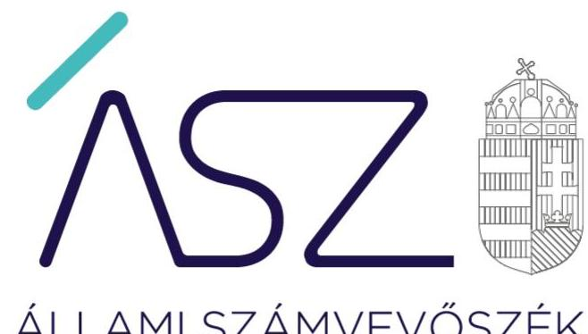
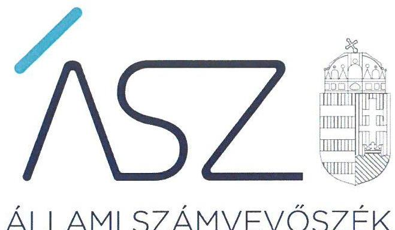

ÁLLAMI SZÁMVEVŐSZÉK

# JELENTÉS 

Nemzeti tulajdonú gazdasági társaságok ellenőrzése

Szolnoki Szigligeti Színház Nonprofit Korlátolt Felelősségű Társaság
2020.

20206
www.asz.hu

---

ÁLLAMI SZÁMVEVŐSZÉK

# JELENTÉS

Nemzeti tulajdonú gazdasági társaságok ellenőrzése

Szolnoki Szigligeti Színház Nonprofit Korlátolt Felelősségű Társaság

2020.
10. hó 14. nap

20206
www.asz.hu

Domokos László
elnök

---

# AZ ELLENŐRZÉST FELÜGYELTE: 

KLINGA LÁSZLÓ felügyeleti vezető

## AZ ELLENŐRZÉST VEZETTE ÉS A VÉGREHAJTÁSÁÉRT FELELŐS:

JOÓ ERIKA ellenőrzésvezető
DR. PELLEI TAMÁS ellenőrzésvezető
ÁRPÁSI TIBOR ellenőrzésvezető

## A PROGRAM ÖSSZEÁLLÍTÁSÁÉRT FELELŐS:

TÓTPÁL SZABOLCS osztályvezető

FEKETE-NAGY ANDRÁS GÁBOR projektvezető

Jelentéseink az Országgyúlés számítógépes hálózatán és az interneten a www.asz.hu címen is olvashatóak.

IKTATÓSZÁM: EL-2944-001/2020
TÉMASZÁM: 2478
ELLENŐRZÉS-AZONOSÍTÓ SZÁM: V082250, V082279, V085723

---

# TARTALOMJEGYZÉK 

■ ÖSSZEGZÉS ..... 5
■ AZ ELLENŐRZÉS CÉLJA ..... 6
■ AZ ELLENŐRZÉS TERÜLETE ..... 7
■ AZ ELLENŐRZÉS HÁTTERE, INDOKOLTSÁGA ..... 8
■ A JELENTÉS LÉNYEGES KÉRDÉSKÖREI ..... 9
■ AZ ELLENŐRZÉS HATÓKÖRE ÉS MÓDSZEREI ..... 10
■ MEGÁLLAPÍTÁSOK ..... 13
■ MELLÉKLETEK ..... 15
I. sz. melléklet: Fogalomtár ..... 15
■ FÜGGELÉKEK ..... 17
I. sz. függelék: Vezetői teljesítmény értékelése ..... 17
II. sz. függelék: Észrevételek ..... 18
■ RÖVIDÍTÉSEK JEGYZÉKE ..... 19

---

.

---

# ÖSSZEGZÉS 

Szolnok Megyei Jogú Város Önkormányzata a Szolnoki Szigligeti Színház Nonprofit Korlátolt Felelősségű Társaság feletti tulajdonosi jogait szabályszerűen gyakorolta. A Szolnoki Szigligeti Színház Nonprofit Korlátolt Felelősségű Társaság a vagyonnal való gazdálkodás során biztosította az átláthatóságot és az elszámoltathatóságot.

## Az ellenőrzés társadalmi indokoltsága

Az Állami Számvevőszék kiemelt célja, hogy a helyi önkormányzatok gazdálkodásában rejlő pénzügyi kockázatok feltárásával, az államháztartáson kívül működő feladatellátó rendszerek ellenőrzéseivel hozzájáruljon ahhoz, hogy a közpénzeket, illetve az ingyenesen juttatott közvagyont az államháztartáson kívül működő szervezetek is átlátható, rendezett módon használják fel.

A helyi önkormányzatok tulajdona nemzeti vagyon, melynek megőrzése, megóvása érdekében kiemelten fontos a nemzeti tulajdonú gazdasági társaságok ellenőrzése. Ellenőrzésüket további társadalmi elvárás is indokolja, részben a gazdálkodásuk körébe tartozó vagyon nagysága, részben az általuk ellátott közszolgáltatások, sajátos feladatellátások, mivel tevékenységükön keresztül a lakosság széles köre kerül kapcsolatba a társaságokkal. A vezetői teljesítményértékelést érintő ellenőrzések lefolytatása a téma jellege, a vezetőknek a társaság működése szempontjából meghatározó szerepe és a társadalmi érdeklődés miatt indokolt.

Az Állami Számvevőszék céljaival és a társadalmi igénnyel összhangban, a gazdasági társaságok kiemelt fontosságú szerepe miatt került sor a Szolnoki Szigligeti Színház Nonprofit Korlátolt Felelősségű Társaság vagyongazdálkodásának, gazdálkodásának a kormányzati szektor hiányára, az államadósságra gyakorolt hatásának, valamint vezető tisztségviselője teljesítményének, illetve Szolnok Megyei Jogú Város Önkormányzata tulajdonosi joggyakorlásának ellenőrzésére.

## Főbb megállapítások, következtetések

A Szolnoki Szigligeti Színház Nonprofit Korlátolt Felelősségű Társaság feletti tulajdonosi joggyakorlás kereteit a tulajdonosi joggyakorló Szolnok Megyei Jogú Város Önkormányzata a jogszabályoknak és belső szabályzatainak megfelelően alakította ki, a tulajdonosi jogait szabályszerűen gyakorolta.

A Szolnoki Szigligeti Színház Nonprofit Korlátolt Felelősségű Társaság vagyongazdálkodása szabályszerű volt, a számviteli beszámolói mérlegét leltárral alátámasztotta, a beszámolók megalapozottak voltak. A vagyon nyilvántartása, állományba vétele szabályszerű volt.

A Szolnoki Szigligeti Színház Nonprofit Korlátolt Felelősségű Társaságnak 2017. évre vonatkozóan a kormányzati szektor hiányára befolyással bíró eleme, adósságot keletkeztető ügylete nem volt, a társaság adatszolgáltatási kötelezettségének eleget tett.

---

# AZ ELLENŐRZÉS CÉLJA 

AZ ELLENŐRZÉS CÉLJA annak megállapítása, hogy a tulajdonosi joggyakorló a gazdasági társasága feletti tulajdonosi joggyakorlás kereteit kialakította-e, tulajdonosi jogait megfelelően gyakorolta-e és kötelezettségeit teljesítette-e, továbbá a gazdasági társaság biztosította-e a vagyon védelmét a nyilvántartások szabályszerű vezetése és a mérleg tételeinek leltárral történő alátámasztása útján, valamint szabályszerűen gondoskodott-e a társaság használatában lévő nemzeti vagyon értékének megőrzéséről, gyarapításáról, hasznosításáról. Az ellenőrzés célja továbbá annak megítélése, hogy a kormányzati szektorba sorolt nemzeti tulajdonban lévő gazdasági társaság gazdálkodásának a kormányzati szektor hiányára és az államadósságra befolyással bíró elemei a jogszabályi előírásoknak megfeleltek-e és a gazdasági társaság az adatszolgáltatási kötelezettségének eleget tett-e. Az ellenőrzés célja volt még a gazdasági társaság vezetője tevékenységében rejlő kockázatok azonosítása az egyes vezetői feladatok ellátásával összhangban.

---

# AZ ELLENŐRZÉS TERÜLETE 

## Szolnok Megyei Jogú Város Önkormányzata és a kizárólagos tulajdonában lévő Szolnoki Szigligeti Színház Nonprofit Korlátolt Felelősségű Társaság

Szolnok Megyei Jogú Város Önkormányzata 2015. február 26-án alapította a kizárólagos tulajdonában álló Szolnoki Szigligeti Színház Nonprofit Korlátolt Felelősségű Társaságot. A Társaság ${ }^{1}$ fő tevékenysége az Önkormányzattal ${ }^{2}$ kötött Közszolgáltatási szerződésben ${ }^{3}$ foglaltak szerint a Szigligeti Színház szakmai feladatainak ellátása 2015. április 1-től. Feladata Szolnok város sokszínű és színvonalas színházi életének biztosítása, hazai és külföldi szerzők színpadi műveinek bemutatása, színházi rendezvények biztosítása.

A Társaság vagyonkezelésbe vett vagyonnal nem rendelkezett, feladatait a Vagyonhasznosítási szerződés ${ }^{4}$ alapján használatba kapott önkormányzati tulajdonú eszközökkel és saját vagyonával látta el. A Társaság működését az Önkormányzat a Fenntartói megállapodásban ${ }^{5}$ foglaltak szerint támogatta. A Társaság jegyzett tőkéje 3 M Ft volt, amit meghaladott a saját tőke összege az ellenőrzött években. A Társaság más gazdasági társaságban tulajdoni részesedéssel nem rendelkezett.

Az ügyvezető ${ }^{6}$ személye az ellenőrzött időszakban nem változott. A Társaságnál 3 tagú felügyelőbizottság ${ }^{7}$ működött. Az Önkormányzat az Alapító okiratban ${ }^{8}$ kijelölte a könyvvizsgálót ${ }^{9}$. Az ellenőrzött időszakban a polgármester ${ }^{10}$ és a Jegyzö ${ }^{11}$ személye nem változott.

A Társaság az NGM ${ }^{12}$ közleménye alapján 2017. június 15-től kormányzati szektorba sorolt egyéb szervezetnek minősült.

---

# AZ ELLENŐRZÉS HÁTTERE, INDOKOLTSÁGA 

Az Alaptörvény ${ }^{13}$ 38. cikke alapján az állam és a helyi önkormányzatok tulajdona nemzeti vagyon. A nemzeti vagyon megőrzése, megóvása érdekében kiemelten fontos ezen nemzeti tulajdonú gazdasági társaságok ellenőrzése. Gazdálkodásuk jellemzően a közérdeklődés és a média figyelmének középpontjában áll, amihez hozzájárul a gazdálkodásuk körébe tartozó - a nemzeti vagyon részét képező - vagyon nagysága, illetve az általuk ellátott közszolgáltatások minősége és hatékonysága.

Az ÁSZ ${ }^{14}$ ellenőrzései feltárhatják, hogy a tulajdonosi felügyelet hozzájárult-e a szabályszerű gazdálkodáshoz és feladatellátáshoz. Az ellenőrzés eredményeként meghatározhatóvá válnak a gazdasági társaság vagyongazdálkodást érintő kockázatai, ezzel lehetővé téve a kockázatok csökkentését. A megállapítások alapján megfogalmazott számvevőszéki javaslatok hasznosítása elősegítheti a meglévő hibák megszüntetését. A jó gyakorlatok bemutatásával az ÁSZ hozzájárulhat a követendő megoldások megismertetéséhez, terjesztéséhez.

Az Európai Közösséget létrehozó szerződéshez csatolt, a túlzott hiány esetén követendő eljárásról szóló jegyzőkönyv alkalmazásáról megalkotott 2009. május 25-i 479/2009/EK Rendelet II. fejezet 3. cikk (1) bekezdése alapján a tagállamok évente kétszer teljesítenek adatszolgáltatást a Bizottság (Eurostat) részére a tervezett és tényleges kormányzati hiányukról és államadósságuk szintjéről. Az adatszolgáltatás teljesítéséhez kapcsolódóan - összhangban a hivatkozott, és egyéb európai uniós jogszabályokkal - nemcsak az államháztartás, hanem az államháztartáson kívüli, kormányzati szektorba sorolt egyéb szervezetek adatait is figyelembe kell venni, tekintettel arra, hogy mindkét terület gazdálkodása befolyásolja a kormányzati szektor hiányát, az államadósság mértékét.

A Kormány „jól irányított állam" megteremtésével kapcsolatos céljaival összhangban van, hogy olyan vezetői teljesítményértékelési rendszer kerüljön kialakításra és működtetésre, amely hozzájárul a szervezeti teljesítmény növeléséhez, a fejlődési lehetőségek kihasználásához. Az ÁSZ a rendszer kiépítésében vállalt aktív ellenőrzési, értékelési tevékenységével kíván hozzájárulni a „jól irányított állam" megteremtéséhez.

---

# A JELENTÉS LÉNYEGES KÉRDÉSKÖREI 

1. A Társaság feletti tulajdonosi joggyakorlás megfelelt-e az előírásoknak?
2. A Társaság vagyongazdálkodása szabályszerű volt-e?
3. A Társaság gazdálkodásának a kormányzati szektor hiányára és az államadósságra befolyással bíró elemei megfeleltek-e a jogszabályi előírásoknak, az adatszolgáltatási kötelezettségének eleget tett-e?
4. A Társaság vezetőjének tevékenysége megfelelő volt-e?

---

# AZ ELLENŐRZÉS HATÓKÖRE ÉS MÓDSZEREI 

## Az ellenőrzés típusa

Megfelelőségi ellenőrzés.

## Az ellenőrzött időszak

A tulajdonosi joggyakorlás tekintetében az ellenőrzött időszak a 2017-2018. évek az éves beszámolók elfogadása kivételével, amelynél az ellenőrzött időszak a 2015-2018. évek.

A társaság vagyongazdálkodási tevékenységét illetően az ellenőrzött időszak a 2015-2018. évek.

A kormányzati szektorba sorolt nemzeti tulajdonban lévő gazdasági társaságra vonatkozó egyes kötelezettségek teljesítésének ellenőrzése a 2017. június 15. és december 31. közötti időszakra terjedt ki. Az adatszolgáltatási kötelezettségére vonatkozó jogszabályi előírások betartását 2017. évre vonatkozóan értékelte az ÁSZ.

A vezetői teljesítmény ellenőrzése esetében az ellenőrzött időszak a 2018. év.

## Az ellenőrzés tárgya

A Szolnoki Szigligeti Színház Nonprofit Korlátolt Felelősségű Társaság feletti tulajdonosi joggyakorlás kialakítása és működtetése.

A Szolnoki Szigligeti Színház Nonprofit Korlátolt Felelősségű Társaság vagyongazdálkodási tevékenysége, a társaság használatában lévő nemzeti vagyon, illetve a saját vagyona tekintetében a vagyonnyilvántartások vezetése, leltára, a nemzeti vagyon értékének megőrzése, gyarapítása, hasznosítása.

A Szolnoki Szigligeti Színház Nonprofit Korlátolt Felelősségű Társaság gazdálkodásának a kormányzati szektor hiányára és az államadósságra befolyással bíró elemei és a jogszabályi előírásoknak megfelelő adatszolgáltatási kötelezettség teljesítése.

A Szolnoki Szigligeti Színház Nonprofit Korlátolt Felelősségű Társaság vezetői teljesítményének értékelése. A gazdasági társaság átlátható, szabályszerű, gazdaságos, hatékony, eredményes és felelős gazdálkodása feltételrendszerének kialakítása, a belső kontrollrendszer és humánpolitikai rendszer működtetése. Az integritásszemlélet érvényesítése, illetve a felelős vagyongazdálkodás biztosítása a nemzeti vagyon megőrzése és védelme érdekében.

---

# Az ellenőrzött szervezet 

$\longrightarrow$ Szolnok Megyei Jogú Város Önkormányzata
$\longrightarrow$ Szolnoki Szigligeti Színház Nonprofit Korlátolt Felelősségű Társaság

## Az ellenőrzés jogalapja

Az ellenőrzés jogszabályi alapját az ÁSZ tv. ${ }^{15} 1$. § (3) bekezdése és 5. § (3) - (5) bekezdései képezték.

## Az ellenőrzés módszerei

Az ÁSZ az ellenőrzést az ellenőrzési program ellenőrzési kérdései, az ellenőrzött időszakban hatályos jogszabályok, az ellenőrzés szakmai szabályok és módszertanok alapján, a nemzetközi standardok figyelembe vételével végezte.

Az ellenőrzés ideje alatt az ellenőrzött szervezettel történő kapcsolattartást az ÁSZ Szervezeti és Működési Szabályzatának vonatkozó előírásai alapján biztosította az ÁSZ.

Az ÁSZ a 2017-2018. évek vonatkozásában ellenőrizte a tulajdonosi joggyakorlás kereteinek kialakítását, a tulajdonosi joggyakorló tevékenységét a felügyelő bizottság és a független könyvvizsgáló működéséhez kapcsolódóan, valamint azt, hogy a tulajdonosi joggyakorló - amennyiben a gazdasági társaság feladatellátásához kapcsolódóan határozott meg követelményeket, elvárásokat - a nemzeti vagyon értékének megőrzése érdekében monitorozta-e azok teljesülését. Az ÁSZ a 2015-2018. évekre terjedő teljes ellenőrzött időszakra ellenőrizte a tulajdonosi joggyakorló részvételét az éves beszámoló elfogadására vonatkozó döntéshozatalban.

A gazdasági társaság vagyonhoz kapcsolódó nyilvántartásai vezetésének megfelelősége, a nemzeti vagyon értéke megőrzésének, gyarapításának, hasznosításának szabályszerűsége 2015. és 2017-2018. évek tekintetében került ellenőrzésre. A 2015-2018. éveket érintően történt meg a lényeges dokumentumok értékelése, kiemelten a mérleg tételeinek leltárral való alátámasztottsága.

A vagyonnyilvántartások és a leltár szabályszerűsége esetében az ellenőrzés azokra a legnagyobb értékű tételekre - a lényeges sokaságra - terjedt ki, melyek összértéke eléri a teljes sokaság összértékének 50%-át. A 2015. és 2017-2018. évek esetében a lényeges sokaságot tételesen ellenőrizte az ÁSZ.

A gazdasági társaság gazdálkodásának az államadósságra, továbbá a kormányzati szektor hiányára befolyással bíró gazdasági eseményei elszámolásának megfelelősége a 2017. év tekintetében került ellenőrzésre, míg a kormányzati szektorba sorolt gazdasági társaság adatszolgáltatási kötelezettségére vonatkozó jogszabályi előírások betartását a 2017. évre vonatkozóan értékelte az ÁSZ.

---

2018-ra vonatkozóan a vezetői teljesítmény ellenőrzési szempontjait a szabályszerűségi szempontok szerinti ellenőrzésben a jogszabályi előírások, belső utasítások, belső szabályozók, a tulajdonosi joggyakorlók elvárásai, előírásai, a helyénvalósági szempontok szerinti ellenőrzésben az ÁSZ által általánosan elfogadott, jó gyakorlat szerinti ajánlásai, értékelési kritériumai mentén kerültek meghatározásra. Az ellenőrzési kérdések

 szerint az összesített értékelés alapján az elért pontok az elérhető pontok minimum 70%-át elérve, a társaság vezetője tevékenységét megfelelőnek, 70% alatt nem megfelelőnek tekintette az ÁSZ.

Az ellenőrzési kérdések megválaszolásához szükséges bizonyítékok megszerzése a következő ellenőrzési eljárások alkalmazásával történt: megfigyelés, információkérés, összehasonlítás, lényeges sokaságból mintavétel, valamint elemző eljárás. Az ellenőrzési bizonyítékként felhasználható adatforrások közé tartoztak az ellenőrzési programban felsorolt adatforrások, továbbá minden - az ellenőrzés folyamán - feltárt, az ellenőrzés szempontjából információkat tartalmazó dokumentum. Az ellenőrzést a kérdésekre adott válaszok kiértékelésével, valamint a megjelölt adatforrások, a csatolt tanúsítványok felhasználásával, továbbá az adott időszakban hatályos jogszabályok figyelembe vételével folytatta le az ÁSZ.

Amennyiben a gazdasági társaság működését és gazdálkodását alapvetően meghatározó dokumentum hiánya miatt, valamely lényeges kérdéskörre vonatkozóan az ÁSZ megállapítást tett, további ellenőrzési tevékenységek az adott kérdéskörrel és az azzal szoros logikai kapcsolatban lévő kérdéskörökkel - ráépülő jelleggel - nem kerültek végrehajtásra.

---

# 1. A Társaság feletti tulajdonosi joggyakorlás megfelelt-e az előírásoknak? 

Összegző megállapítás A tulajdonosi joggyakorlás szabályszerű volt 2015-2018-ban.

A TULAJDONOSI JOGGYAKORLÁS KERETEIT az Alapító ¹⁶ az Mötv. ¹⁷, az Nvtv ¹⁸., illetve a Ptk. ¹⁹ előírásainak megfelelően a Vagyonrendeletben ²⁰, a Közgyűlés SZMSZ-ében ²¹, illetve a Társaság Alapító okiratában határozta meg.

Az Alapító megalkotta a Taktv. ²² előírásaival összhangban lévő, a vezető tisztségviselők, a felügyelőbizottság tagjai és az Mt. ²³ 208. § hatálya alá tartozó munkavállalók javadalmazásáról, valamint a jogviszony megszűnése esetére biztosított juttatások módjának, mértékének elveiről, annak rendszeréről szóló javadalmazási szabályzatot ²⁴.

A TULAJDONOSI JOGOK GYAKORLÁSA során az Alapító a Ptk. és az Alapító okirat előírásaival összhangban megválasztotta a Társaság vezető tisztségviselőjét, kijelölte a felügyelőbizottság tagjait, elfogadta annak ügyrendjét ²⁵, kijelölte a könyvvizsgálót ²⁶. Az Alapító a Társaság 2015-2018. évi éves beszámolóit a Ptk., a Számv. tv. ²⁷ és az Alapító okirat előírásainak megfelelően a felügyelőbizottság és a könyvvizsgáló írásbeli jelentésének birtokában fogadta el.

## 2. A Társaság vagyongazdálkodása szabályszerű volt-e?

Összegző megállapítás A Társaság vagyongazdálkodása szabályszerű volt a 2015-2018. években.

A TÁRSASÁG az ellenőrzött években rendelkezett a Számv. tv. előírásának megfelelő Leltározási szabályzattal ²⁸, amely tartalmazta a leltározásra és a leltár összeállítására vonatkozó szabályokat, előírásokat. A saját vagyon, illetve a használatra átvett vagyon nyilvántartása megfelelt a Számv. tv.-ben és a Leltározási szabályzatban foglalt előírásoknak. A Társaság 2015-ben és 2017-2018-ban a tárgyi eszközök üzembe helyezését bizonylattal alátámasztotta, az eszközök besorolása, bekerülési értékének meghatározása, az értékcsökkenés elszámolása a Számv. tv., a Számviteli politika ²⁹, az Értékelési szabályzat ³⁰ és a Számlarend ³¹ előírásainak megfelelően történt.

A VAGYONGAZDÁLKODÁS szabályszerű volt, a 2015-2018. évi beszámolók mérlegének tételeit a Társaság a Számv. tv. előírásának megfelelő leltárral támasztotta alá.

---

A Számv. tv. és a Leltározási szabályzat előírásának megfelelően a mennyiségi felvételezést igénylő eszközök leltározása az előírt gyakorisággal, mennyiségi felvétellel megtörtént.

# 3. A Társaság gazdálkodásának a kormányzati szektor hiányára és az államadósságra befolyással bíró elemei megfeleltek-e a jogszabályi előírásoknak, az adatszolgáltatási kötelezettségének eleget tett-e? 

Összegző megállapítás
A Társaságnak 2017. évre vonatkozóan a kormányzati hiányt befolyásoló tétele nem volt, adatszolgáltatási kötelezettségének eleget tett.

A TÁRSASÁGNAK a kormányzati szektor hiányára, az államadósságra befolyással bíró eleme, adósságot keletkeztető ügylete 2017. évben nem volt. A Társaság a 2017. évre vonatkozó adatszolgáltatási kötelezettségét teljesítette.

## 4. A Társaság vezetőjének tevékenysége megfelelő volt-e?

Összegző megállapítás
A Társaság ügyvezetőjének tevékenysége 2018-ban megfelelő volt.

A TÁRSASÁG vezető tisztségviselője 2018-ban biztosította a társaság gazdálkodásának átlátható működését és annak alapfeltételeit a nemzeti vagyon megőrzése és védelme érdekében. A részletes értékelést az I. sz. Függelék tartalmazza.

---

# MELLÉKLETEK 

- I. SZ. MELLÉKLET: FOGALOMTÁR
gazdasági társaság
kormányzati szektorba sorolt egyéb szervezet
közszolgáltatás
közfeladat
nemzeti vagyon
nonprofit gazdasági társaság
tulajdonosi jogok gyakorlója

A gazdasági társaságok üzletszerű közös gazdasági tevékenység folytatására, a tagok vagyoni hozzájárulásával létrehozott, jogi személyiséggel rendelkező vállalkozások, amelyekben a tagok a nyereségből közösen részesednek, és a veszteséget közösen viselik. (Forrás: Ptk. 3:88. § (1) bekezdése)
Az a szervezet, amely az Áht. alapján nem része az államháztartásnak, azonban az Európai Közösséget létrehozó szerződéshez csatolt, a túlzott hiány esetén követendő eljárásról szóló jegyzőkönyv alkalmazásáról szóló 2009. május 25-i 479/2009/EK rendelet ³² szerint a kormányzati szektorba tartozik.
Az Ebktv. ³³ 3. § d) pontja a következőképpen határozza meg a közszolgáltatást: „szerződéskötési kötelezettség alapján a lakosság alapvető szükségleteinek ellátására irányuló szolgáltatás, így különösen a villamos energia-, gáz-, hő-, víz-, szenny-víz- és hulladékkezelési, köztisztasági, postai és távközlési szolgáltatás, továbbá a menetrend alapján közlekedő járművekkel végzett közforgalmú személyszállítás".
Az Áht. 3/A. § (1) bekezdése alapján közfeladat a jogszabályban meghatározott állami vagy önkormányzati feladat.
Nvtv. 1. § (2) bekezdése szerint nemzeti vagyonba tartozik többek között: „az állam vagy a helyi önkormányzat kizárólagos tulajdonában álló dolgok, az a) pont hatálya alá nem tartozó, állam vagy a helyi önkormányzat tulajdonában lévő dolog,
az állam vagy a helyi önkormányzat tulajdonában lévő pénzügyi eszközök, továbbá az államot vagy a helyi önkormányzatot megillető társasági részesedések, az államot vagy a helyi önkormányzatot megillető bármely vagyoni értékkel rendelkező jogosultság, amelyet jogszabály vagyoni értékű jogként nevesít."
Az a gazdasági társaság minősül nonprofit gazdasági társaságnak és cégnevében az a gazdasági társaság tüntetheti fel a nonprofit jelleget, amelynek létesítő okirata tartalmazza, hogy a gazdasági társaság tevékenységéből származó nyereség a tagok között nem osztható fel, hanem az a gazdasági társaság vagyonát gyarapítja Aki a nemzeti vagyon felett az államot vagy a helyi önkormányzatot megillető tulajdonosi jogok és kötelezettségek összességének gyakorlására jogosult. (Forrás: Nvtv. 3. § (1) bekezdés 17. pontja)

---

.

---

# FÜGGELÉKEK 

I. SZ. FÜGGELÉK: VEZETŐI TELJESÍTMÉNY ÉRTÉKELÉSE

A Szolnoki Szigligeti Színház Nonprofit Korlátolt Felelősségű Társaság vezetőjének teljesítményét 2018-ban megfelelőnek értékelte az ÁSZ, mert

- kidolgozta a Társaság középtávú stratégiáját, az annak végrehajtását szolgáló éves üzleti tervet;
- működtetett a szervezet teljesítményének értékelése céljából mutatószámokon, mutatószámrendszeren alapuló szervezeti teljesítményértékelési rendszert;
- kialakította a Társaság szervezeti, működési rendjét;
- kiadta a szervezeti integritást sértő események kezelésének eljárásrendjét;
- működtetett a vezetést támogató információs/kontrolling rendszert;
- irányítása alatt felmérték és értékelték a szervezetet és a tevékenységet érintő kockázatokat, a felmért kockázatok kezelésére intézkedéseket tettek;
- meghatározta a vagyongazdálkodással kapcsolatos feladat- és hatásköröket, felelősségi viszonyokat (különösen az engedélyezésre, jóváhagyásra, döntések meghozatalára vonatkozóan) a Társaság belső szabályzataiban;
- a gazdálkodás, tevékenység folyamataira vonatkozó belső ellenőrzési rendszert működtetett;
- felmérte a szervezet működésével kapcsolatos integritási és korrupciós kockázatokat;
- kidolgozta a társaság menedzsmentjére, munkavállalóira és a vagyongazdálkodására vonatkozó összeférhetetlenségi előírásokat;
- rendelkezésre állt a jogszabályi előírások szerinti összeférhetetlenségi nyilatkozata és vagyonnyilatkozata;
- beszámolt és adatot szolgáltatott a tulajdonosi joggyakorló felé az előírt gyakorisággal és tartalommal a rábízott feladatok ellátásáról, annak eredményességéről;
- elemezte a bevételek növelését, a kiadások csökkentését célzó lehetőségeket.

---

A jelentéstervezetet a Számvevőszék 15 napos észrevételezésre megküldte az ellenőrzött szervezetek vezetőinek az ÁSZ tv. 29. § (1) bekezdése előírása szerint.

A Szolnoki Szigligeti Színház Nonprofit Korlátolt Felelősségű Társaság ügyvezetője, illetve Szolnok Megyei Jogú Város Önkormányzata polgármestere írásban jelezte, hogy a jelentéstervezet megállapításaira nem tesz észrevételt.

[^0]
[^0]:    * 29. § (1) Az Állami Számvevőszék az ellenőrzési megállapításait megküldi az ellenőrzött szervezet vezetőjének vagy az általa megbízott személynek, és annak, akinek személyes felelősségét állapította meg.
    (2) Az ellenőrzött szervezet vezetője és a felelősként megjelölt személy az ellenőrzés megállapításaira tizenöt napon belül írásban észrevételt tehet.
    (3) Az Állami Számvevőszék az észrevételre a beérkezésétől számított harminc napon belül írásban válaszol. A figyelembe nem vett észrevételeket köteles a jelentésben feltüntetni, és megindokolni, hogy azokat miért nem fogadta el.

---

# RÖVIDÍTÉSEK JEGYZÉKE 

¹ Társaság
² Önkormányzat
³ Közszolgáltatási szerződés
⁴ Vagyonhasznosítási szerződés
⁵ Fenntartói megállapodás
⁶ ügyvezető
⁷ felügyelőbizottság
⁸ Alapító okirat
⁹ könyvvizsgáló
¹⁰ polgármester
¹¹ jegyző
¹² NGM
¹³ Alaptörvény
¹⁴ ÁSZ
¹⁵ ÁSZ tv.
¹⁶ Alapító
¹⁷ Mötv.
¹⁸ Nvtv.
¹⁹ Ptk.
²⁰ Vagyonrendelet
²¹ SzMSz
²² Taktv.
²³ Mt.
²⁴ javadalmazási szabályzat
²⁵ felügyelőbizottság ügyrendje
²⁶ könyvvizsgáló
²⁷ Számv. tv.
²⁸ Leltározási szabályzat
²⁹ Számviteli politika
³⁰ Értékelési szabályzat
³¹ Számlarend

Szolnoki Szigligeti Színház Nonprofit Korlátolt Felelősségű Társaság
Szolnok Megyei Jogú Város Önkormányzata
az Önkormányzat és a Társaság által előadó-művészeti közszolgáltatás ellátására kötött szerződés (hatályos 2015. április 1. és 2020. december 31. között)
az Önkormányzat és a Társaság között az Önkormányzat tulajdonát képező ingatlanok és a hozzájuk tartozó ingó vagyon hasznosítására létrejött szerződés (hatályos 2015. március 31-től)
az Önkormányzat és a Társaság között a Társaság előadó-művészeti tevékenysége, a Társaság által nyújtott művészeti, kulturális szolgáltatások támogatása érdekében létrejött megállapodás (hatályos 2015. április 1-től)
a Társaság ügyvezetője
a Társaság felügyelőbizottsága
a Társaság Alapító okirata (hatályos 2015. február 26-tól)
a Társaság könyvvizsgálója
Szolnok Megyei Jogú Város Önkormányzata polgármestere
Szolnok Megyei Jogú Város Polgármesteri Hivatala jegyzője
Nemzetgazdasági Minisztérium
Magyarország Alaptörvénye (hatályos: 2012. január 1-jétől)
Állami Számvevőszék
2011. évi LXVI. törvény az Állami Számvevőszékről (hatályos 2011. július 1-től)

Szolnok Megyei Jogú Város Önkormányzatának Közgyűlése mint a Társaság legfőbb szerve
2011. évi CLXXXIX. törvény Magyarország helyi önkormányzatairól (hatályos 2012. január 1-től)
2011. évi CXCVI. törvény a nemzeti vagyonról (hatályos 2011. december 31-től)
2013. évi V. törvény a Polgári Törvénykönyvről (hatályos 2014. március 15-től)

Szolnok Megyei Jogú Város Közgyűlésének többször módosított 25/2003. (VII. 9.) önkormányzati rendelete Szolnok Megyei Jogú Város Önkormányzata vagyonáról és a vagyonnal való gazdálkodás egyes szabályairól (hatályos 2003. augusztus 1-től)
Szolnok Megyei Jogú Város Közgyűlésének többször módosított 7/2014. (II.28.) önkormányzati rendelete Szolnok Megyei Jogú Város Önkormányzata Szervezeti és Működési Szabályzatáról (hatályos 2014. március 1-től)
2009. évi CXXII. törvény a köztulajdonban álló gazdasági társaságok takarékosabb működéséről (hatályos 2009. december 4-től)
2012. évi I. törvény a munka törvénykönyvéről (hatályos 2012. július 1-től)
a Társaság Javadalmazási Szabályzata (hatályos 2017. június 29-től)
a Társaság felügyelőbizottságának ügyrendje (hatályos 2015. február 26-tól)
a Társaság könyvvizsgálója
2000. évi C. törvény a számvitelről (hatályos 2001. január 1-től)
a Társaság leltározási szabályzata (hatályos 2015. április 1-től)
a Társaság számviteli politikája (hatályos 2015. április 1-től)
a Társaság eszközök és források értékelési szabályzata (hatályos 2015. április 1-től)
a Társaság számlarendje

---

számlarend: (hatályos 2015. április 1-től)
számlarend: (hatályos 2016. január 1-től)
számlarend: (hatályos 2017. január 1-től)
a Tanács 479/2009/EK rendelete az Európai Közösséget létrehozó szerződéshez csatolt, a túlzott hiány esetén követendő eljárásról szóló jegyzőkönyv alkalmazásáról 2003. évi CXXV. törvény az egyenlő bánásmódról és az esélyegyenlőség előmozdításáról (hatályos 2004. január 27-től)

---

# ÁSZ 

ÁLLAMI SZÁMVEVŐSZÉK
1052 Budapest, Apáczai Cs. J. u. 10. I 1364 Budapest 4. Pf. 54 TEL: +36 14849100
email: szamvevoszek@asz.hu
web: www.asz.hu | www.aszhirportal.hu

