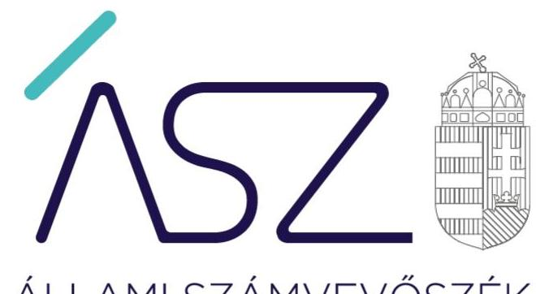
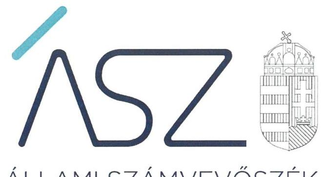
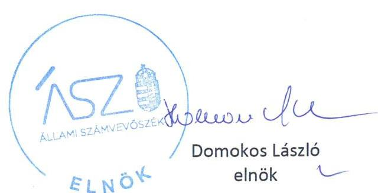
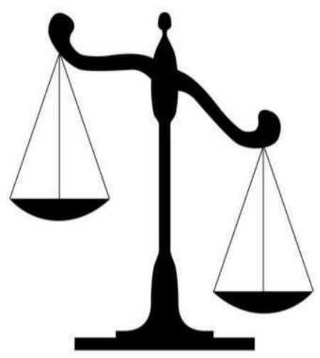

ÁLLAMI SZÁMVEVŐSZÉK

# JELENTÉS

A költségvetési támogatásban részesülő pártalapítványok 2017-2018. évi gazdálkodása törvényességének ellenőrzése

Új Köztársaságért Alapítvány

2020.

20207
www.asz.hu

---

ÁLLAMI SZÁMVEVŐSZÉK

# JELENTÉS

A költségvetési támogatásban részesülő pártalapítványok 2017-2018. évi gazdálkodása törvényességének ellenőrzése

Új Köztársaságért Alapítvány

2020. 11. hó 24. nap

20207
www.asz.hu

---

# AZ ELLENŐRZÉST FELÜGYELTE: 

KAKAS SÁNDOR felügyeleti vezető

## AZ ELLENŐRZÉST VEZETTE ÉS A VÉGREHAJTÁSÁÉRT FELELŐS:

GÁL MAGDOLNA ellenőrzésvezető

## A PROGRAM ÖSSZEÁLLÍTÁSÁÉRT FELELŐS:

BERTALAN RUDOLF GYULA projektvezető

## A TÉMÁHOZ KAPCSOLÓDÓ KORÁBBI SZÁMVEVŐSZÉKI JELENTÉSEK:

- címe: Jelentés - A költségvetési támogatásban részesülő pártalapítványok 2015-2016. évi gazdálkodása törvényességének ellenőrzése - Új Köztársaságért Alapítvány
- sorszáma: 18173

IKTATÓSZÁM: EL-2963-001/2020
TÉMASZÁM: 2521
ELLENŐRZÉS-AZONOSÍTÓ SZÁM: V086504

---

# TARTALOMJEGYZÉK 

- ÖSSZEGZÉS ..... 5
- AZ ELLENŐRZÉS CÉLJA ..... 7
- AZ ELLENŐRZÉS TERÜLETE ..... 8
- AZ ELLENŐRZÉS HÁTTERE, INDOKOLTSÁGA ..... 9
- AZ ELLENŐRZÉS LÉNYEGES KÉRDÉSKÖREI. ..... 10
- AZ ELLENŐRZÉS HATÓKÖRE ÉS MÓDSZEREI ..... 11
MELLÉKLETEK ..... 13
I. sz. melléklet: Értelmező szótár ..... 13
FÜGGELÉKEK ..... 15
I. sz. függelék a jelentéshez ..... 15
II. sz. függelék: Észrevételek ..... 18
- RÖVIDÍTÉSEK JEGYZÉKE ..... 21

---

.

---

# ÖSSZEGZÉS 

Az Új Köztársaságért Alapítvány nem igazolta a 2017-2018. évi gazdálkodásáról közzétett adatok valódiságát. Az Új Köztársaságért Alapítvány a központi költségvetésből kapott támogatások felhasználásának átláthatóságát és elszámoltathatóságát nem biztosította, a közpénzekkel nem számolt el szabályszerűen.

## Az ellenőrzés társadalmi indokoltsága

A Párt tv. ${ }^{1}$ 9/A § (1) bekezdése alapján a politikai kultúra fejlesztése érdekében tudományos, ismeretterjesztő, kutatási, oktatási tevékenység folytatása céljából létrehozott pártalapítványok gazdálkodása törvényességének ellenőrzése - Pártalapítványi tv. ${ }^{2}$ 4. § (2) bekezdése értelmében - az ÁSZ ${ }^{3}$ feladata. E törvény 4. § (4) bekezdése alapján az ÁSZ kétévente - kötelező jelleggel - ellenőrzi azoknak a pártalapítványoknak a gazdálkodását, amelyek állami költségvetési támogatásban részesültek.

Az ÁSZ, mint az Országgyűlés ellenőrző szerve a pártalapítványok gazdálkodása törvényességének/szabályszerűségének értékelésével hozzájárul ahhoz, hogy a társadalom objektív képet alkothasson a pártalapítványok működéséről. A jelentésben foglalt megállapítások, következtetések és javaslatok alapján a törvényalkotók konkrét lépéseket tehetnek a pártalapítványokra vonatkozó szabályozások megváltoztatása, átláthatóbbá, ellenőrizhetőbbé tétele irányába. Az ellenőrzött szervezetek szintjén a hiányosságok, szabálytalanságok feltárása, az ennek kapcsán megfogalmazott megállapítások elősegíthetik a pártalapítványok szabályszerű gazdálkodását.

Az ÁSZ stratégiájában megfogalmazta, hogy az államháztartáson kívülre nyújtott költségvetési támogatások és az ingyenes vagyonjuttatás ellenőrzésével hozzájárul ahhoz, hogy a közpénzeket a civil szervezetek is átlátható módon használják fel. A pártalapítványok gazdálkodása szabályszerűségének bemutatásával az ellenőrzés értékteremtő módon járul hozzá az ÁSZ stratégiai céljainak megvalósításához, a nyilvánosság megfelelő tájékoztatásához.

Az ÁSZ 2018. évben ellenőrizte a Pártalapítvány ${ }^{4}$ 2015-2016. évi gazdálkodását.

## Főbb megállapítások, következtetések

Az Alaptörvény ${ }^{5}$ 39. cikk (2) bekezdése értelmében a Pártalapítvány köteles a nyilvánosság előtt elszámolni a közpénzekre vonatkozó gazdálkodásával, továbbá köteles a közpénzeket az átláthatóság elve szerint kezelni. A Pártalapítvány a Pártalapítványi tv. 3/A. § alapján köteles a tevékenységéről jelentést készíteni.

A Pártalapítvány a 2017. évben 40,2 millió Ft, a 2018. évben 58,1 millió Ft, az ellenőrzött időszakban összesen 98,3 millió Ft költségvetési támogatásban részesült. A kapott költségvetési támogatás felhasználásáról a Pártalapítványt elszámolási kötelezettség terheli.

A Pártalapítvány a 2017. és 2018. évekre vonatkozóan közzétett, az éves tevékenységéről szóló jelentései esetében a gazdálkodásáról közölt adatok valódiságát nem igazolta, így a központi költségvetési támogatások felhasználásával kapcsolatos - a Pártalapítványi tv. 3/A. § (3) bekezdés b) pontjában előírt - elszámolási kötelezettségének nem tett eleget. A Pártalapítvány nem igazolta továbbá, hogy a költségvetési támogatást kizárólag a Párt tv. 9/A. § (1) bekezdésében meghatározott célra használta fel. Ezáltal a Pártalapítvány 2017-2018. évi gazdálkodásának törvényessége és a költségvetési támogatások felhasználása nem volt átlátható és elszámoltatható, a Pártalapítvány a közpénzekkel nem gazdálkodott a nyilvánosság számára is átlátható módon. A Pártalapítványnál nem álltak fenn a törvényes gazdálkodáshoz és a közpénzek törvényes felhasználásához szükséges feltételek, így indokolt a gazdálkodás törvényességének helyreállítása.

Mivel a Pártalapítványnál nem álltak fenn a törvényes gazdálkodáshoz és a közpénzek törvényes felhasználásához szükséges feltételek, ezért az ÁSZ az ellenőrzés során vagyonmegóvási intézkedést (költségvetési támogatás felfüggesztése) kezdeményezett a gazdálkodás törvényességének helyreállítása érdekében. Az ÁSZ intézkedése hatására a

---

Pártalapítvány 2019-re vonatkozóan az ellenőrzött időszakot követően dokumentumokkal igazolta, hogy a közpénzek rendeltetésellenes felhasználásának kockázata csökkent. Az ÁSZ részére rendelkezésre bocsátott dokumentumok szerint azonban a 2019. évi egyszerűsített éves beszámoló alátámasztásához készített leltár nem tartalmazta minden mérlegsor alátámasztását (óvadék, kaució, költségvetési befizetési kötelezettségek, különféle rövid lejáratú egyéb kötelezettségek). A beszámoló mérlegtételeinek alátámasztása érdekében a jövőben a kuratórium elnökének intézkednie szükséges.

---

# AZ ELLENŐRZÉS CÉLJA 

Az ellenőrzés célja annak megállapítása volt, hogy a pártalapítvány törvényesen gazdálkodott-e, az éves számviteli beszámolók és a pártalapítvány tevékenységéről szóló éves jelentések a jogszabályi előírásoknak megfeleltek-e, a könyvvezetés és gazdálkodás során a vonatkozó jogszabályi rendelkezéseket és belső előírásokat betartották-e. Az ellenőrzés célja továbbá annak értékelése volt, hogy az előző számvevőszéki jelentésben foglalt megállapításokkal összhangban készített intézkedési tervben meghatározott feladatokat az ellenőrzött szervezet végrehaj-totta-e.

---

# AZ ELLENŐRZÉS TERÜLETE 

## Új Köztársaságért Alapítvány

Az ellenőrzés a Párt tv. alapján a politikai kultúra fejlesztése érdekében tudományos, ismeretterjesztő, kutatási, oktatási tevékenység folytatása céljából, a Ptk. ${ }^{6}$ szerinti létesítő/alapító okiraton alapuló bírósági nyilvántartásba vétellel létrejött pártalapítvány gazdálkodására terjedt ki.

A pártalapítvány törvényes gazdálkodásának (könyvvezetése, beszámolása, jelentéstétele) szabályait alapvetően a Pártalapítványi tv.-en túl a Számv. tv. ${ }^{7}$ és a Számviteli vhr. ${ }^{8}$ határozza meg.

A Demokratikus Koalíció - a Párt tv.-ben és a Pártalapítványi tv.-ben biztosított lehetőséggel élve - 2014-ben megalapította az Új Köztársaságért Alapítványt. A Pártalapítványt a Fővárosi Törvényszék a 2014. december 10-én jogerőre emelkedett végzésével vette nyilvántartásba.

A Pártalapítvány alapító okirat ${ }^{9}$ szerinti célja: a politikai kultúra fejlesztése érdekében történő politikai képzés, kutatás, tudományos és ismeretterjesztő tevékenység támogatása. Az induló vagyon összegét az Alapító ${ }^{10} 200$ ezer Ft-ban határozta meg, amely az ellenőrzött időszakban változatlan maradt. A Pártalapítvány által készített, és a Magyar Közlöny mellékletét képező Hivatalos Értesítő 2018. június 21-i számában, illetve a 2019. évi június 28-i számában közzétett éves jelentései szerint a Pártalapítvány 2017. évben 40,2 millió Ft, 2018. évben 58,1 millió Ft költségvetési támogatásban részesült.

Az ÁSZ 2018. évben ellenőrizte a Pártalapítvány 2015-2016. évi gazdálkodásának törvényességét. Az ellenőrzés megállapításait a 18173. számú számvevőszéki jelentés tartalmazza.

A Pártalapítványt az ÁSZ a 2019. szeptember 9-én kelt levelében tájékoztatta a Pártalapítvány 2017-2018. évi gazdálkodása törvényességi ellenőrzésének előkészítéséről, és ezzel egy időben a Pártalapítványt adatszolgáltatásra hívta fel. Az ÁSZ az adatszolgáltatásra felhívó levélben tájékoztatta a Pártalapítványt a közreműködési kötelezettségéről. A Pártalapítvány az ellenőrzéshez megküldött teljességi és hitelességi nyilatkozatában azt közölte, hogy a gazdálkodására vonatkozó adatainak teljes körűségét nem tudja igazolni.

---

# AZ ELLENŐRZÉS HÁTTERE, INDOKOLTSÁGA 

Társadalmi elvárás a közpénzek értékelvű, rendeltetésszerű felhasználása, a közpénzekből nyújtott támogatások átláthatóságának megteremtése, amelyhez az ÁSZ az államháztartásból nyújtott támogatások ellenőrzésével kíván hozzájárulni. A Párt tv. 9/A § (1) bekezdése alapján a politikai kultúra fejlesztése érdekében tudományos, ismeretterjesztő, kutatási, oktatási tevékenység folytatása céljából létrehozott pártalapítványok gazdálkodása törvényességének ellenőrzése - Pártalapítványi tv. 4. § (2) bekezdése értelmében - az ÁSZ feladata. E törvény 4. § (4) bekezdése alapján az ÁSZ kétévente - kötelező jelleggel - ellenőrzi azoknak a pártalapítványoknak a gazdálkodását, amelyek állami költségvetési támogatásban részesültek.

Az ÁSZ, mint az Országgyűlés ellenőrző szerve a pártalapítványok gazdálkodása törvényességének/szabályszerűségének értékelésével hozzájárul ahhoz, hogy a társadalom objektív képet alkothasson a pártalapítványok működéséről. Az ellenőrzés eredményeinek célzott felhasználói a nyilvánosság, a jogalkotó, továbbá a pártalapítványok esetén azok alapítója és szervei. A jelentésben foglalt megállapítások, következtetések és javaslatok alapján a törvényalkotók konkrét lépéseket tehetnek a pártalapítványokra vonatkozó szabályozások megváltoztatása, átláthatóbbá, ellenőrizhetőbbé tétele irányába. Az ellenőrzött szervezetek szintjén a hiányosságok, szabálytalanságok feltárása, az ennek kapcsán megfogalmazott megállapítások elősegíthetik a pártalapítványok szabályszerű gazdálkodását.

Az ÁSZ tv. 33. § (1) bekezdése értelmében az ellenőrzött szervezet vezetője köteles a jelentésben foglalt megállapításokhoz kapcsolódó intézkedési tervet összeállítani, és azt a jelentés kézhezvételétől számított harminc napon belül az ÁSZ részére megküldeni.

Az ÁSZ tv. 33. § (6) bekezdése értelmében, amennyiben az ÁSZ elnöke az ellenőrzés során feltárt jogszabálysértő gyakorlat, illetve a vagyon rendeltetésellenes vagy pazarló felhasználásának megszüntetése érdekében figyelemfelhívó levéllel fordult az ellenőrzött szerv vezetőjéhez, az abban foglaltakat az ellenőrzött szerv vezetője köteles elbírálni, a megfelelő intézkedést megtenni és erről az ÁSZ elnökét értesíteni.

Az ÁSZ által befogadott intézkedési tervben foglaltak megvalósítását az ÁSZ tv. 33. § (7) bekezdésében foglaltak alapján - az ÁSZ utóellenőrzés keretében ellenőrizheti. Az utóellenőrzések keretében - az intézkedések értékelése során - az ÁSZ figyelembe veszi az ellenőrzött szervezetek müködési feltételeiben, valamint a jogszabályi előírásokban bekövetkezett változásokat.

---

# AZ ELLENŐRZÉS LÉNYEGES KÉRDÉSKÖREI 

1.     - A Pártalapítvány gazdálkodásának törvényessége biztositott volt-e?
2.     - A Pártalapítvány könyvvezetése és gazdálkodása során a vonatkozó jogszabályi rendelkezéseket és belső előirásokat betartották-e?
3.     - A Pártalapítvány tevékenységéről szóló éves jelentések, az éves számviteli beszámolók a jogszabályi elöírásoknak megfelel-tek-e?
4.     - A Pártalapítvány az intézkedési tervben meghatározott feladatokat végrehajtotta-e?

---

# AZ ELLENŐRZÉS HATÓKÖRE ÉS MÓDSZEREI 

## Az ellenőrzés típusa

Szabályszerűségi ellenőrzés.

## Az ellenőrzött időszak

2017-2018. évek.

## Az ellenőrzés tárgya

Az ellenőrzés tárgyát képezi a pártalapítvány gazdálkodása, a könyvvezetés szabályozása és gyakorlata szabályszerűsége, az éves számviteli beszámolókra és az alapítvány tevékenységéről szóló éves jelentésekre vonatkozó kötelezettség teljesítése, valamint a gazdálkodáshoz kapcsolódó ellenőrzések javaslatainak hasznosítására irányuló tevékenység.

Az ellenőrzés kiterjedt minden olyan körülményre és adatra, amely az ÁSZ jogszabályban meghatározott feladatainak teljesítéséhez, valamint a program végrehajtása folyamán felmerült újabb összefüggések feltárásához szükséges.

## Az ellenőrzött szervezet

Új Köztársaságért Alapítvány

## Az ellenőrzés jogalapja

Az ÁSZ tv. 1. § (3) bekezdése, 5. § (3) bekezdése, 33. § (7) bekezdése, a Pártalapítványi tv. 4. § (2) és (4) bekezdései.

## Az ellenőrzés módszerei

Az ellenőrzést az ÁSZ az Ellenőrzési program szempontjai, az ellenőrzött időszakban hatályos jogszabályok, a jelen ellenőrzésre irányadó ÁSZ módszertan figyelembe vételével végezte el.

Az ellenőrzés ideje alatt az ellenőrzött szervezettel történő kapcsolattartás az ÁSZ SZMSZ ${ }^{11}$-ének vonatkozó előírásai alapján történt.

Az ellenőrzési bizonyítékként felhasználható adatforrások közé tartoztak egyrészt az ellenőrzési program részletes szempontjainál felsorolt

---

adatforrások, másrészt minden egyéb - az ellenőrzés folyamán feltárt, az ellenőrzés szempontjából információt tartalmazó - dokumentum.

Az ellenőrzést az ÁSZ az ellenőrzött szervezet által rendelkezésre bocsátott dokumentumokra, adatokra alapozta. A rendelkezésre bocsátott adatok, információk kontrollja az ellenőrzés keretében történt.

---

# MELLÉKLETEK 

- I. SZ. MELLÉKLET: ÉRTELMEZŐ SZÓTÁR
alapítvány
gazdasági-vállalkozási tevékenység
költségvetésből juttatott/nyújtott forrás/támogatás
pártalapítvány

Az alapítvány az alapító által az alapító okiratban meghatározott tartós cél folyamatos megvalósítására létrehozott jogi személy. Az alapító az alapító okiratban meghatározza az alapítványnak juttatott vagyont és az alapítvány szervezetét. Alapítvány nem alapítható gaz-dasági-vállalkozási tevékenység folytatására. Az alapítvány az alapítványi cél megvalósításával közvetlenül összefüggő gazdasági tevékenység végzésére jogosult. Alapítvány nem lehet korlátlan felelősségű tagja más jogalanynak, nem létesíthet alapítványt és nem csatlakozhat alapítványhoz. (Forrás: Ptk. 3:378. §, 3:379. § (1) - (3) bekezdés)
A jövedelem- és vagyonszerzésre irányuló vagy azt eredményező, üzletszerűen végzett gazdasági tevékenység, kivéve az adomány (ajándék) elfogadását, a létesítő okiratban meghatározott cél szerinti tevékenységet (ideértve a közhasznú tevékenységet is), - 2015. november 28 -tól - a pénzeszközök betétbe, értékpapírba, társasági részesedésbe történő elhelyezését és az ingatlan megszerzését, használatának átengedését és átruházását. (Forrás: Ectv. 2. § 11. pont.)
a pártalapítványoknak a Párt tv. 9/A. § (1) bekezdése és a Pártalapítványi tv. 1. § előírásainak értelmében, az éves költségvetési törvények szerint - jellemzően az 1. számú melléklet I. Országgyűlés fejezet 9. Pártalapítványok támogatás címen - az állami költségvetésből juttatott forrás/támogatás.
az államháztartás központi alrendszeréből - a Tb alap kivételével - ellenérték nélkül, pénzben nyújtott költségvetési támogatás (Forrás: Áht. ${ }^{12}$ 1. § 14. pont)
a politikai kultúra fejlesztése érdekében, tudományos, ismeretterjesztő, kutatási és oktatási tevékenység folytatása céljából pártok által létrehozott, külön jogszabályban - a Pártalapítványi tv. 1. § és 3. § (1) bekezdése - meghatározott, jogi személynek minősülő egyéb szervezet, speciális jogállású alapítvány (Forrás: Párt tv. 9/A. § (1) bekezdés, Pártalapítványi tv. 1. §, Ectv. 1. § (2) bekezdés, 2. § 6. c) pont, Számv. tv. 3. § (1) bekezdése 4. pont, Számviteli vhr. 2. § (1) bekezdés I) pont)

---

.

---

# FÜGGELÉKEK 

- I. SZ. FÜGGELÉK A JELENTÉSHEZ

Az Állami Számvevőszék az ellenőrzések során feltárt tényekhez kapcsolódó további körülmények tisztázására eszközrendszerrel nem rendelkezik. Amennyiben az ellenőrzésen túlmutatóan indokoltnak látszik az ellenőrzés során feltárt körülmények további vizsgálata, az Állami Számvevőszék törvényi felhatalmazás alapján az ellenőrzés által feltárt körülményeket továbbítja a hatáskörrel rendelkező szervnek a szükséges intézkedések megtétele, eljárások lefolytatása érdekében.
A közpénzek felhasználásának átláthatósága és elszámoltathatósága érdekében kiemelten fontos, hogy a rendszeres költségvetési támogatásban részesülő gazdálkodó szervezetek közöttük a pártalapítványok is - betartsák a törvényi előírásokat.
Az Új Köztársaságért Alapítvány a 2017-2018. évi gazdálkodására vonatkozó éves jelentéseit a Magyar Közlöny mellékletét képező Hivatalos Értesítőben közzé tette. Az ellenőrzéshez megküldött teljességi és hitelességi nyilatkozatában azt közölte, hogy gazdálkodására vonatkozó adatainak teljes körüségét nem tudja igazolni. Ezért a közzétett jelentései nem mutatnak valós képet a bevételeiről és kiadásairól.
Az Új Köztársaságért Alapítvány a 2017. évben 40,2 millió Ft, a 2018. évben 58,1 millió Ft költségvetési támogatásban részesült.
Az Új Köztársaságért Alapítványnál a 2017-2018. évi gazdálkodás törvényessége és a költségvetési támogatások felhasználása nem volt átlátható és elszámoltatható.
I. Az Új Köztársaságért Alapítvány az ellenőrzött időszakban nem igazolta, hogy:

1. a Számv. tv. 14. § (3) és (5) bekezdése szerint kialakította a számviteli politikát, és annak keretében elkészítette az eszközök és a források leltárkészítési és leltározási szabályzatát, az eszközök és a források értékelési szabályzatát és a pénzkezelési szabályzatot, továbbá a Számv. tv. 161. § (1) bekezdése szerinti számlarendet elkészítette,
2. a Számv. tv. 161/A. § (2) bekezdése előirása szerint a közpénzek felhasználásának és a köztulajdon használatának nyilvánossága és ellenőrizhetősége érdekében a gazdálkodó nyilvántartási (könyvvezetési) rendszerét továbbrészletezte oly módon, hogy abból a vonatkozó külön jogszabályban meghatározott adatok rendelkezésre álljanak,
3. a tevékenysége ráfordításainak felhasználása, kifizetése, elszámolása során a Számv. tv. 167. § (1) bekezdésében foglaltak számviteli bizonylatra vonatkozó előírásait betartotta,
4. a Számv.tv. 15. § (3) bekezdésében előírtak szerint a könyvvitelben rögzített és az éves tevékenységéről szóló jelentésekben szereplő tételek a valóságban is megtalálhatók, bizonyíthatók, kívülállók által is megállapíthatók,

---

5. a Számv. tv. 69. § (1) bekezdésében foglaltak szerint a könyvek üzleti év végi zárásához, a beszámoló elkészitéséhez, a mérleg tételeinek alátámasztásához összeállított leltárt, amely tételesen, ellenőrizhető módon tartalmazza a mérleg fordulónapján meglévő eszközeit és forrásait mennyiségben és értékben.

Mindezek alapján az Új Köztársaságért Alapítvány nem igazolta, hogy a gazdálkodására vonatkozó belső szabályozása megfelelt a jogszabályi előírásoknak, továbbá, hogy a könyvviteli nyilvántartásának adatai alátámasztják a Pártalapítványi tv. 3/A. § (1) bekezdésében előirt és a Magyar Közlöny mellékletét képező Hivatalos Értesítőben közzétett, 2017. és 2018. évi tevékenységéről szóló éves jelentései és az azok részét képező számviteli beszámolói adatait. Az elszámoltathatóság hiánya miatt nem igazolt továbbá, hogy az Új Köztársaságért Alapítvány betartotta a költségvetési támogatások felhasználásához kapcsolódó törvényi előírásokat.
Ez felveti, hogy a közzétett éves jelentések a jogszabályi előírások ellenére nem valós adatokat tartalmaznak, nem mutatnak megbizható és valós összképet a pártalapítvány bevételeiről és kiadásairól, továbbá törvényellenesen nincsenek valós számlák és pénzügyi teljesitések a közzétett éves jelentések adatai mögött.
II. Az Új Köztársaságért Alapítvány a Pártalapítványi törvény vonatkozásában nem igazolta, hogy az ellenőrzött időszakban betartotta:
6. a Pártalapítványi tv. 3. § (3) bekezdését, amely szerint a Pártalapítvány támogatást csak egyértelmüen azonosítható személytől fogadott el, illetve, hogy a támogatás nyújtása az azt nyújtó személy fizetési számlájáról a Pártalapítvány pénzforgalmi számlájára átutalással történt,
7. a Pártalapítványi tv. 3. § (4) bekezdését, amely szerint a Pártalapítvány a számára támogatást nyújtó személy azonosításához szükséges adatokat és a támogatás öszszegét a támogatás beérkezését követő harminc napon belül a Pártalapítvány honlapján közzétette, ha a támogatás összege az ötszázezer forintot, vagy külföldről származó támogatás összege a százezer forintnak megfelelő értéket meghaladja.
Az Új Köztársaságért Alapítvány nem igazolta, hogy az ellenőrzött időszakban a költségvetési támogatást kizárólag a Párt tv. 9/A. § (1) bekezdésében meghatározott célokkal összhangban használta fel.

Mindezek alapján az Új Köztársaságért Alapítvány nem igazolta, hogy, a támogatásokat, adományokat szabályszerüen fogadta el, valamint a költségvetési támogatásokat kizárólag a Pártalapítványi tv.-ben meghatározott célra használta fel.
Ez felveti, hogy az Új Köztársaságért Alapítvány a Pártalapítványi törvényben előírtakat megsértve tiltott módon fogadott el támogatást, valamint a költségvetési támogatást nem megengedett célra használta fel.

---

Az Új Köztársaságért Alapítvány nem igazolta továbbá, hogy a 2015-2016. évi gazdálkodása törvényességének ellenőrzéséről szóló 18173. számú számvevőszéki jelentésben megfogalmazott javaslatok alapján készített, három pontból álló intézkedési tervében vállalt feladatokat végrehajtotta.
Magyarország Alaptörvénye 39. cikk (1) bekezdése kimondja, hogy „A központi költségvetésből csak olyan szervezet részére nyújtható támogatás, vagy teljesíthető szerződés alapján kifizetés, amelynek tulajdonosi szerkezete, felépitése, valamint a támogatás felhasználására irányuló tevékenysége átlátható." A 39. cikk (2) bekezdése továbbá rögzíti, hogy „A közpénzekkel gazdálkodó minden szervezet köteles a nyilvánosság előtt elszámolni a közpénzekre vonatkozó gazdálkodásával. A közpénzeket és a nemzeti vagyont az átláthatóság és a közélet tisztaságának elve szerint kell kezelni."
Az Új Köztársaságért Alapítvány magatartása sérti Magyarország Alaptörvénye 39. cikk (1) és (2) bekezdésében szabályozott átláthatóság és közélet tisztaságának elve érvényesülését. Az Új Köztársaságért Alapítvány gazdálkodására vonatkozó kötelezettségei körében tapasztalt súlyos törvénysértések miatt a közérdek jogi úton történő védelmét az Ügyészségen keresztül kell gyakorolni. Az Ügyészség az Alaptörvény szerint a közérdek alkotmányos védelmezője.
A fentiekben részletezettek alapján az ügyészi törvényességi felügyelet és a közérdek védelme tekintetében az Ügyészség járhat el.

---

A jelentéstervezetet a Számvevőszék 15 napos észrevételezésre megküldte az ellenőrzött szervezet vezetőjének az ÁSZ tv. 29. § (1) bekezdése előírásának megfelelően.

Az Új Köztársaság Alapítvány elnöke a jelentéstervezet megállapításaira észrevételt tett. Az ÁSZ tv. 29. § (3) bekezdésével összhangban az ÁSZ a Függelékben feltünteti a jelentéstervezet megállapításaival kapcsolatban tett, figyelembe nem vett észrevételeket, és megindokolja, hogy azokat miért nem fogadta el.
Az Új Köztársaság Alapítvány kuratóriumi elnöke által a 2020. szeptember 10-én kelt levélben tett észrevételek és azok kezelésének indokolása:

Az Új Köztársaságért Alapítvány elnöke 2020. szeptember 10-ei keltezésű levelében az ÁSZ korábbi ellenőrzéséről, továbbá a Pártalapítvány által bérelt budapesti ingatlanban lévő tűzeset körülményeiről, a tűzesetet követő helyreállítási és pótlási folyamatról adott tájékoztatást. Ezeket az ÁSZ nem tekinti észrevételnek. A Pártalapítvány elnökének levelében a korábban az ÁSZ-nak átadott pénzügyi iratok és adatok kiadására vonatkozó megkeresésről szóló szövegrészeket sem tekinti az ÁSZ észrevételnek, mivel a Pártalapítvány az ÁSZ-hoz nem küldött - a korábban az ÁSZ-nak átadott pénzügyi iratok és adatok kiadására vonatkozó - megkeresést. Továbbá sem az észrevételben hivatkozott ÁSZ módszertani részt, sem a Pártalapítvány elnökének címzett javaslatot „A költségvetési támogatásban részesülő pártalapítványok 2017-2018. évi gazdálkodása törvényességének ellenőrzése - Új Köztársaságért Alapítvány" című számvevőszéki jelentéstervezet (a továbbiakban: jelentéstervezet) nem tartalmazta.

Az Új Köztársaságért Alapítvány elnöke észrevételt tett az adatok, dokumentumok ÁSZ rendelkezésére bocsátásával, valamint a teljességi és hitelességi nyilatkozattal kapcsolatban. Továbbá észrevételt tett a jelentéstervezet összegző megállapításaira, az ÁSZ ellenőrzései során felhasználandó bizonyítékokról szóló, az ÁSZ honlapján nyilvánosan elérhető módszertani útmutatóval kapcsolatban, az ÁSZ ellenőrzési módszereire, az ellenőrzési programra, valamint a mintavételes ellenőrzésre és a Függelékben leírtakra vonatkozóan.

Az Állami Számvevőszék ellenőrzési megállapításait az Állami Számvevőszékről szóló 2011. évi LXVI. törvény (továbbiakban: ÁSZ tv.) 28. § (2) bekezdése alapján az ellenőrzött szervezet által az ellenőrzéséhez kapcsolódóan, az ellenőrzés lefolytatásához a törvényi határidőben rendelkezésre bocsátott, a teljességi és hitelességi nyilatkozatban feltüntetett dokumentumokra alapozza.

A Pártalapítvány elnöke az ellenőrzéshez megküldött teljességi és hitelességi nyilatkozatban azt közölte, hogy a gazdálkodására vonatkozó adatainak teljes körűségét nem tudja igazolni.

[^0]
[^0]:    * 29. § (1) Az Állami Számvevőszék az ellenőrzési megállapításait megküldi az ellenőrzött szervezet vezetőjének vagy az általa megbízott személynek, és annak, akinek személyes felelősségét állapította meg.
    (2) Az ellenőrzött szervezet vezetője és a felelősként megjelölt személy az ellenőrzés megállapításaira tizenöt napon belül írásban észrevételt tehet.
    (3) Az Állami Számvevőszék az észrevételre a beérkezésétől számított harminc napon belül írásban válaszol. A figyelembe nem vett észrevételeket köteles a jelentésben feltüntetni, és megindokolni, hogy azokat miért nem fogadta el.

---

Az ÁSZ tv. 28. § (1) bekezdése alapján az ÁSZ ellenőrzéseinek lefolytatása érdekében az ellenőrzött szervezet közremúködésre köteles. Az ellenőrzött szervezet közremúködési kötelezettsége magában foglalja az ÁSZ tv. 28. § (2) bekezdés szerinti kötelezettséget, amely szerint a közremúködésre felhívott szervezet az ÁSZ részére az ellenőrzés lefolytatása érdekében szükséges adatokat és dokumentumokat a törvényi határidőben rendelkezésre bocsátja, illetve a szükséges tájékoztatást megadja.

A Pártalapítvány által a 2017. és 2018. évekre vonatkozóan elkészített és a Magyar Közlöny mellékletét képező hivatalos értesítőben nyilvánosságra hozott éves jelentései és az azok részét képező számviteli beszámolóiban szereplő adatokat alátámasztó alapvető dokumentumok ÁSZ általi bekérésére a 2019. szeptember 9-én kelt, EL-1656001/2019. iktatószámú adatbekérő levél (a továbbiakban: adatbekérő levél) keretében került sor. Az adatbekérő levelet a Pártalapítvány 2019. szeptember 17-én vette át. Az ÁSZ a hivatkozott adatbekérő levelének 4. számú mellékletében tájékoztatta a Pártalapítvány elnökét, hogy a kért dokumentumokat teljességi és hitelességi nyilatkozattal kell az ÁSZ rendelkezésére bocsátani, illetve az adatbekérő levelében felhívta a figyelmét arra, hogy „... a teljességi és hitelességi nyilatkozat az ellenőrzött szervezet első számú vezetőjének nyilatkozata az ÁSZ részére átadott dokumentumok teljeskörűségéről".

A Pártalapítvány elnöke, mint a közreműködésre felhívott szervezet első számú vezetője sem elektronikus úton, sem postai úton nem adott az ÁSZ részére - az adatbekérő levélben az ellenőrzés lefolytatása érdekében az ellenőrzés során kért - olyan teljességi és hitelességi nyilatkozatot, amelyben az ÁSZ részére átadott dokumentumok teljeskörűségéről nyilatkozott volna. A Pártalapítvány az ellenőrzéshez megküldött teljességi és hitelességi nyilatkozatában azt közölte, hogy a gazdálkodására vonatkozó adatainak teljes körűségét nem tudja igazolni. A Pártalapítvány nem biztosította az ellenőrzés részére átadott dokumentumok, adatok teljeskörűségét, hitelességét, megbízhatóságát és valódiságát, így azoknak az ÁSZ ellenőrzése során bizonyítékként történő felhasználását.

A pártok működéséről és gazdálkodásáról szóló 1989. évi XXXIII. törvény 9/A § (1) bekezdése alapján a pártalapítványok gazdálkodása törvényességének ellenőrzése a pártok működését segítő tudományos, ismeretterjesztő, kutatási, oktatási tevékenységet végző alapítványokról szóló 2003. évi XLVII. törvény 4. § (2) bekezdése értelmében az ÁSZ feladata. A Pártalapítványi tv. 4. § (4) bekezdése alapján az ÁSZ kétévente ellenőrzi azoknak a pártalapítványoknak a gazdálkodását, amelyek állami költségvetési támogatásban részesültek. A Pártalapítványnál az ÁSZ ellenőrzésére az ellenőrzési program szempontjai, az ellenőrzött időszakban hatályos jogszabályok, az ellenőrzés általános szakmai szabályai, az ellenőrzésre irányadó ÁSZ módszertanok figyelembevételével került sor. Ezen szempontokat, valamint az ellenőrzés során felhasználható bizonyítékok körét és azok értékelésének módszereit mind a Pártalapítvány elnöke részére az EL-1656-010/2019. iktatószámú, 2019. november 28-i keltezésű kiértesítő levél mellékleteként megküldött EL-1834-001/2019. iktatószámú ellenőrzési program (a továbbiakban: ellenőrzési program), mind a jelentéstervezet tartalmazta.

Az ÁSZ az ellenőrzés végrehajtása során az ÁSZ tv. 24. §-ában előírtaknak megfelelően, a jogszabályok, az ellenőrzési program, az ellenőrzési szakmai szabályok és azok nyilvános elnöki normái, valamint az adott ellenőrzési programban meghatározott módszerek szerint járt el. Így megállapításai alátámasztottak, a következtetések okszerűek és megalapozottak.

Az észrevételben hivatkozott, 2017. augusztus 29-én kelt, az ÁSZ ellenőrzései során felhasználandó bizonyítékokról szóló, az ÁSZ honlapján nyilvánosan elérhető módszertani útmutató értelmében az ellenőrzési bizonyítékoknak megbízhatónak kell lenniük. Megbízhatónak tekinti az ÁSZ ellenőrzése szempontjából azon bizonyítékokat, amely kétséget kizáróan bizonyítják a benne foglaltakat. Az ellenőrzött szervezettől beszerzett adatok és dokumentumok hitelességét az ÁSZ kellő szakmai gondosság és szakmai szkepticizmusának fenntartása mellett ellenőrzi és validálja. A megbízhatónak minősített papír alapú és elektronikus adatokat és dokumentumokat az ÁSZ ellenőrzése során akkor használhatja fel, amennyiben az ellenőrzött szervezetnél arra jogosult személy által tett teljességi és hitelességi nyilatkozat kapcsolódik hozzá.

A Pártalapítvány által rendelkezésre bocsátott adatok, információk kontrollja - a módszertani útmutatóban foglaltak alapján - az ellenőrzés keretében történt.

---

A Pártalapítvány a Pártalapítványi tv. 3/A. § (5) bekezdése alapján köteles ugyanezen törvény (1) bekezdésben meghatározott jelentését a tárgyévet követő évben, legkésőbb június 30 -áig a Magyar Közlöny mellékleteként megjelenő Hivatalos Értesítőben, továbbá saját honlapján közzétenni, a nyilvánosság előtt elszámolni. Az elszámoltathatóság egyik alapvető feltétele, hogy a pártalapítványnál rendelkezésre kell állnia mindazoknak a dokumentumoknak, amelyek a Számv. tv. és a Pártalapítványi tv. előírásai szerinti szabályok betartásának ellenőrizhetőségét biztosítják.

Az ÁSZ tv. és a Pártalapítványi tv. előírásai alapján a Pártalapítványnak kellett bizonyítania a gazdálkodására vonatkozó éves jelentéseiben közölt adatok megbízhatóságát, valódiságát, valamint biztosítania az éves beszámoló összeállításához felhasznált, azt alátámasztó dokumentumok rendelkezésre állását és hitelességét, amely kötelezettségének a Pártalapítvány nem tett eleget. A Pártalapítvány által tett nyilatkozat szerint az átadott adatok nem teljeskörűek. Így a Számv. tv. által előírt zártság és alapelvek érvényesülésének hiánya, a Pártalapítvány működését és gazdálkodását alapvetően meghatározó dokumentumok hiánya, valamint a módszertani előírások miatt nem kerülhetett sor a mintavételes ellenőrzés lefolytatására. A Pártalapítvány nem igazolta, hogy kizárólag a jogszabályban engedélyezett forrásokból gazdálkodott, és nem vett igénybe tiltott támogatást. A fentiekben kifejtettek felvetik, hogy a közzétett, gazdálkodására vonatkozó éves jelentések a jogszabályi előírások ellenére nem valós adatokat tartalmaznak, nem mutatnak megbízható és valós összképet a Pártalapítvány bevételeiről és kiadásairól, továbbá törvényellenesen nincsenek valós számlák és pénzügyi teljesítések a közzétett pénzügyi kimutatások adatai mögött. Így a közpénzek felhasználásának átláthatóságát és elszámoltathatóságát a Pártalapítvány nem biztosította.

A fent leírtak alapján a Pártalapítvány az ÁSZ rendelkezésére bocsátott - a 2017. és 2018. évekre vonatkozóan elkészített és a Magyar Közlöny mellékletét képező Hivatalos Értesítőben nyilvánosságra hozott - az éves tevékenységéről szóló jelentéseiben szereplő adatok esetében nem igazolta azok valódiságát, ezáltal a központi költségvetési és az egyéb támogatások felhasználásával kapcsolatos elszámolási kötelezettségének nem tett eleget.

A tárgyi számvevőszéki jelentéstervezet Függelékének rendeltetése az ellenőrzés során feltárt tények alapján a Pártalapítvány törvényes működésének rendjét sértő, a Pártalapítvány gazdálkodási tevékenységében tanúsított törvénysértő magatartás bemutatása. A Függelék bemutatja, hogy a Pártalapítvány jogszabálysértő magatartásával a 20172018. éveket érintően a főbb, a gazdálkodás törvényességének alapját jelentő jogszabályi előírásokat nem tartotta be.

Mindezek alapján az ÁSZ az ellenőrzését a vonatkozó törvényi előírások, eljárási szabályok, az ellenőrzésre irányadó ÁSZ módszertani előírások együttesének keretei között teljes körűen lefolytatta.

A fent leírtak alapján az ÁSZ a Pártalapítvány észrevételeit nem vette figyelembe, a számvevőszéki jelentéstervezetben szereplő megállapítások módosítása nem volt indokolt.

---

# RÖVIDÍTÉSEK JEGYZÉKE 

${ }^{1}$ Párt tv.
${ }^{2}$ Pártalapítványi tv.
${ }^{3}$ ÁSZ
${ }^{4}$ Pártalapítvány
${ }^{5}$ Alaptörvény
${ }^{6}$ Ptk.
${ }^{7}$ Számv. tv.
${ }^{8}$ Számviteli vhr.
${ }^{9}$ Alapító okirat
${ }^{10}$ Alapító
${ }^{11}$ ÁSZ SZMSZ
${ }^{12}$ Áht.
1989. évi XXXIII. törvény a pártok működéséről és gazdálkodásáról 2003. évi XLVII. törvény a pártok müködését segítő tudományos, ismeretterjesztő, kutatási, oktatási tevékenységet végző alapítványokról Állami Számvevőszék Új Köztársaságért Alapítvány Magyarország Alaptörvénye (2011. április 25.) 2013. évi V. törvény a Polgári Törvénykönyvről 2000. évi C. törvény a számvitelről 479/2016. (XII. 28.) Korm. rendelet a számviteli törvény szerinti egyes egyéb szervezetek beszámoló készítési és könyvvezetési kötelezettségének sajátosságairól (hatályos: 2017. január 1-jétől)
Új Köztársaságért Alapítvány Alapító Okirata (hatályos: 2014. október 1-jétől) Demokratikus Koalíció
Állami Számvevőszék Szervezeti és Működési Szabályzata
2011. évi CXCV. törvény az államháztartásról

---

# ASZ 

ALLAMI SZAMVEVOSZEK
1052 Budapest, Apáczai Cs. J. u. 10. I 1364 Budapest 4. Pf. 54 TEL: +36 14849100
email: szamvevoszek@asz.hu
web: www.asz.hu | www.aszhirportal.hu