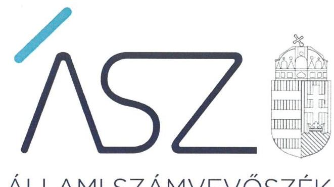
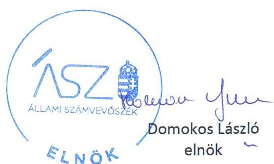
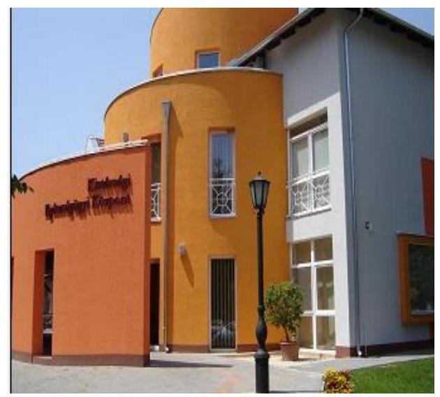

ÁLLAMI SZÁMVEVŐSZÉK

# JELENTÉS 

Nemzeti tulajdonú gazdasági társaságok ellenőrzése

MÓRA-VITÁL Térségi Egészségmegőrző és Szociális Nonprofit Közhasznú Korlátolt
Felelősségű Társaság
2020.

20208
www.asz.hu

---

ÁLLAMI SZÁMVEVŐSZÉK

# JELENTÉS

Nemzeti tulajdonú gazdasági társaságok ellenőrzése

MÓRA-VITÁL Térségi Egészségmegőrző és Szociális Nonprofit Közhasznú Korlátolt Felelősségű Társaság

2020. 10. hó 22. nap

2020. 10. hó 22. nap

2020. 2. 10. nap

www.asz.hu

---

# AZ ELLENŐRZÉST FELÜGYELTE: 

KLINGA LÁSZLÓ felügyeleti vezető
SALAMON ILDIKÓ felügyeleti vezető
AZ ELLENŐRZÉST VEZETTE ÉS A VÉGREHAJTÁSÁÉRT FELELŐS:
DR. PELLEI TAMÁS ellenőrzésvezető
KLINGA LÁSZLÓ ellenőrzésvezető
A PROGRAM ÖSSZEÁLLÍTÁSÁÉRT FELELŐS:
TÓTPÁL SZABOLCS osztályvezető
FEKETE-NAGY ANDRÁS ellenőrzési program készítéséért felelős vezető

Jelentéseink az Országgyülés számítógépes hálózatán és az interneten a www.asz.hu címen is olvashatóak.

IKTATÓSZÁM: EL-2966-001/2020
TÉMASZÁM: 2513
ELLENŐRZÉS-AZONOSÍTÓ SZÁM: V082237, V082265, V085704

---

# TARTALOMJEGYZÉK 

■ ÖSSZEGZÉS ..... 5
■ AZ ELLENŐRZÉS CÉLJA ..... 6
■ AZ ELLENŐRZÉS TERÜLETE ..... 7
■ AZ ELLENŐRZÉS HÁTTERE, INDOKOLTSÁGA ..... 8
■ A JELENTÉS LÉNYEGES KÉRDÉSKÖREI ..... 9
■ AZ ELLENŐRZÉS HATÓKÖRE ÉS MÓDSZEREI ..... 10
■ MEGÁLLAPÍTÁSOK ..... 13
■ JAVASLATOK ..... 15
■ MELLÉKLETEK ..... 17
I. sz. melléklet: Értelmező szótár ..... 17
■ FÜGGELÉKEK ..... 19
I. sz. függelék: Vezetői teljesítmény értékelése ..... 19
II. sz. függelék: Észrevételek ..... 20
■ RÖVIDÍTÉSEK JEGYZÉKE ..... 25

---

.

---

# ÖSSZEGZÉS 

A MÓRA-VITÁL Térségi Egészségmegőrző és Szociális Nonprofit Közhasznú Korlátolt Felelősségű Társaság felett tulajdonosi jogokat gyakorló Mórahalom Városi Önkormányzat a 2017-2018. években a tulajdonosi jogait nem szabályszerűen gyakorolta. A MÓRA-VITÁL Térségi Egészségmegőrző és Szociális Nonprofit Közhasznú Korlátolt Felelősségű Társaság vagyongazdálkodása a 2015-2016. években és a 2018. évben nem volt szabályszerű, így az átláthatóságot és az elszámoltathatóságot nem biztosította.

## Az ellenőrzés társadalmi indokoltsága

Az Állami Számvevőszék kiemelt célja, hogy a helyi önkormányzatok gazdálkodásában rejlő pénzügyi kockázatok feltárásával, az államháztartáson kívülre nyújtott költségvetési támogatások és ingyenes vagyonjuttatások, valamint az államháztartáson kívül működő feladat-ellátó rendszerek ellenőrzéseivel hozzájáruljon ahhoz, hogy a közpénzeket az államháztartáson kívül működő szervezetek is átlátható, rendezett módon használják fel.

A helyi önkormányzatok tulajdona nemzeti vagyon, melynek megőrzése érdekében kiemelten fontos a nemzeti tulajdonú gazdasági társaságok ellenőrzése. Ellenőrzésüket további társadalmi elvárás is indokolja, részben a gazdálkodásuk körébe tartozó vagyon nagysága, részben az általuk ellátott közszolgáltatások, sajátos feladatellátások, mivel tevékenységükön keresztül a lakosság széles köre kerül kapcsolatba a társaságokkal. A vezetői teljesítményértékelést érintő ellenőrzések lefolytatása a téma jellege, a vezetőknek a társaság működése szempontjából meghatározó szerepe és a társadalmi érdeklődés miatt indokolt.

Az Állami Számvevőszék céljaival és a társadalmi igénnyel összhangban, a gazdasági társaságok kiemelt fontosságú szerepe miatt került sor a MÓRA-VITÁL Térségi Egészségmegőrző és Szociális Nonprofit Közhasznú Korlátolt Felelősségű Társaság vagyongazdálkodásának és vezető tisztségviselőjének teljesítményének, illetve a Mórahalom Városi Önkormányzat tulajdonosi joggyakorlásának ellenőrzésére.

## Főbb megállapítások, következtetések, javaslatok

Mórahalom Városi Önkormányzat a tulajdonosi jogait nem szabályszerűen gyakorolta, mivel a javadalmazási szabályzatot nem alkotta meg és a felügyelő bizottság tagjainak számát nem a jogszabályi előírásnak megfelelően határozta meg.

A MÓRA-VITÁL Térségi Egészségmegőrző és Szociális Nonprofit Közhasznú Korlátolt Felelősségű Társaságnál a vagyongazdálkodás nem volt szabályszerű, mert a jogszabályi előírás ellenére a 2015-2016. évekre, valamint a 2018. évre vonatkozóan nem állított össze leltárt, ezért az éves beszámolói nem voltak megalapozottak, így a valódiság elve, mint számviteli alapelv nem érvényesült, nem biztosította a nemzeti vagyonnal való elszámoltathatóságának feltételeit.

A MÓRA-VITÁL Térségi Egészségmegőrző és Szociális Nonprofit Közhasznú Korlátolt Felelősségű Társaság, mint kormányzati szektorba sorolt nemzeti tulajdonban lévő gazdasági társaság nem tett eleget a jogszabályokban előírt adatszolgáltatási kötelezettségének.

A vezető tisztségviselő tevékenysége a 2018. évben nem volt megfelelő, mivel nem biztosította a MÓRA-VITÁL Térségi Egészségmegőrző és Szociális Nonprofit Közhasznú Korlátolt Felelősségű Társaság gazdálkodásának átlátható működését és annak alapfeltételeit.

Az Állami Számvevőszék a jelentésben foglalt megállapítások alapján a MÓRA-VITÁL Térségi Egészségmegőrző és Szociális Nonprofit Közhasznú Korlátolt Felelősségű Társaság ügyvezetőjének három javaslatot, Mórahalom Városi Önkormányzat polgármestere részére két javaslatot fogalmazott meg.

---

# AZ ELLENŐRZÉS CÉLJA 

AZ ELLENŐRZÉS CÉLJA annak megállapítása, hogy a tulajdonosi joggyakorló a gazdasági társaságai feletti tulajdonosi joggyakorlás kereteit kialakította-e, tulajdonosi jogait megfelelően gyakorolta-e és kötelezettségeit teljesítette-e, továbbá a gazdasági társaság biztosította-e a vagyon védelmét a nyilvántartások szabályszerű vezetése és a mérleg tételeinek leltárral történő alátámasztása útján, valamint szabályszerűen gondoskodott-e a társaság használatában, kezelésében lévő nemzeti vagyon értékének megőrzéséről, gyarapításáról, hasznosításáról. Az ellenőrzés célja továbbá annak megítélése, hogy a kormányzati szektorba sorolt nemzeti tulajdonban lévő gazdasági társaság gazdálkodásának a kormányzati szektor hiányára és az államadósságra befolyással bíró elemei a jogszabályi előírásoknak megfeleltek-e és a gazdasági társaság az adatszolgáltatási kötelezettségének eleget tett-e. Az ellenőrzés célja volt még a MÓRA-VITÁL Térségi Egészségmegőrző és Szociális Nonprofit Közhasznú Korlátolt Felelősségű Társaság vezetőjének tevékenységében rejlő kockázatok azonosítása az egyes vezetői feladatok ellátásával összhangban.

---

# AZ ELLENŐRZÉS TERÜLETE 

## Mórahalom Városi Önkormányzat és a kizárólagos tulajdonában lévő MÓRA-VITÁL Térségi Egészségmegőrző és Szociális Nonprofit Közhasznú Korlátolt Felelősségű Társaság

A MÓRA-VITÁL Térségi Egészségmegőrző és Szociális Nonprofit Közhasznú Korlátolt Felelősségű Társaság 100% önkormányzati tulajdonban álló gazdasági társaság, tulajdonosa a Mórahalom Városi Önkormányzat. Az Önkormányzat ¹ Mórahalom és környéke lakossága részére a népegészségügyi tevékenység, mint közfeladathoz kapcsolódóan, a járóbeteg ellátás biztosítására, valamint az ezt elősegítő tevékenységek folytatására - a MÓRA-VITÁL Térségi Egészségmegőrző és Szociális Közhasznú Társaság jogutódjaként - 2009. május 15-én alapította a Társaság²-ot. A Társaság a jegyzett tőkéjének összege az ellenőrzött időszakban 75724 E Ft volt.

A közfeladatot ellátó Társaság fő tevékenységi köre általános járóbeteg-ellátás volt, amelyet Mórahalom és térsége 26 ezer fős lakossága részére nyújtott.

A Társaság a tevékenységeit az Önkormányzattól bérleti szerződés ¹⁻³⁴ keretében használatba vett ingatlanokban, saját és az Önkormányzattól bérleti szerződéssel²-⁴ bérbevett eszközökkel és berendezésekkel végezte. Az Önkormányzat a 2017. december 19. napján létrejött Megállapodás ⁴ alapján a bérleti szerződésekkel¹⁻⁴ átadott eszközöket üzemeltetésbe adta át a Társaság részére. Az Önkormányzat a Társasággal vagyonkezelési szerződést nem kötött, a Társaság vagyonkezelt eszközzel nem rendelkezett.

A Társaság a Számv. tv. ⁵ előírása alapján könyvvizsgálatra volt kötelezett.

A Társaságnál az ellenőrzött időszakban ügyvezető személye két alkalommal változott, az ügyvezető 2017. december 1-től tölti be a tisztségét. Az ellenőrzött időszakban a polgármester ⁶ személye nem változott, a jegyző ⁷ 2015. március 1-től látja el feladatait.

A Társaság a 2013. december 16-ától hatályos NGM ⁸ közlemény szerint kormányzati szektorba sorolt egyéb szervezetnek minősült.

---

# AZ ELLENŐRZÉS HÁTTERE, INDOKOLTSÁGA 

Az Alaptörvény ⁹ 38. cikke alapján az állam és a helyi önkormányzatok tulajdona nemzeti vagyon. A nemzeti vagyon megőrzése, megóvása érdekében kiemelten fontos ezen nemzeti tulajdonú gazdasági társaságok ellenőrzése. Gazdálkodásuk jellemzően a közérdeklődés és a média figyelmének középpontjában áll, amihez hozzájárul a gazdálkodásuk körébe tartozó - a nemzeti vagyon részét képező - vagyon nagysága, illetve az általuk ellátott közszolgáltatások minősége és hatékonysága. Ellenőrzéseink feltárhatják, hogy a tulajdonosi felügyelet hozzájárult-e a szabályszerű gazdálkodáshoz és feladatellátáshoz.

Az ellenőrzés eredményeként meghatározhatóvá válnak a szervezet vagyongazdálkodást érintő kockázatai, ezzel lehetővé téve a kockázatok csökkentését. A megállapítások alapján megfogalmazott számvevőszéki javaslatok hasznosítása elősegítheti a meglévő hibák megszüntetését. A jó gyakorlatok bemutatásával az ÁSZ ¹⁰ hozzájárulhat a követendő megoldások megismertetéséhez, terjesztéséhez.

Az Európai Közösséget létrehozó szerződéshez csatolt, a túlzott hiány esetén követendő eljárásról szóló jegyzőkönyv alkalmazásáról megalkotott 2009. május 25-i 479/2009/EK Rendelet II. fejezet 3. cikk (1) bekezdése alapján a tagállamok évente kétszer teljesítenek adatszolgáltatást a Bizottság (Eurostat) részére a tervezett és tényleges kormányzati hiányukról és államadósságuk szintjéről. Az adatszolgáltatás teljesítéséhez kapcsolódóan - összhangban a hivatkozott, és egyéb európai uniós jogszabályokkal - nemcsak az államháztartás, hanem az államháztartáson kívüli, kormányzati szektorba sorolt egyéb szervezetek adatait is figyelembe kell venni, tekintettel arra, hogy mindkét terület gazdálkodása befolyásolja a kormányzati szektor hiányát, az államadósság mértékét.

A „jól irányított állam" megteremtésével kapcsolatos célokkal összhangban van, hogy olyan vezetői teljesítményértékelési rendszer kerüljön kialakításra és működtetésre, amely hozzájárul a szervezeti teljesítmény növeléséhez, a fejlődési lehetőségek kihasználásához. Az ÁSZ a rendszer kiépítésében vállalt aktív ellenőrzési, értékelési tevékenységével kíván hozzájárulni a „jól irányított állam" megteremtéséhez.

---

# A JELENTÉS LÉNYEGES KÉRDÉSKÖREI 

1.     - A Társaság feletti tulajdonosi joggyakorlás megfelelt-e a jogszabályi és belső előírásoknak?
2.     - A Társaság vagyongazdálkodási tevékenysége szabályszerű volt-e?
3.     - A Társaság gazdálkodásának a kormányzati szektor hiányára és az államadósságra befolyással bíró elemei megfeleltek-e a jogszabályi előírásoknak, az adatszolgáltatási kötelezettségének eleget tett-e?
4.     - A vezető tisztségviselő tevékenysége a 2018. évben megfelelő volt-e?

---

# AZ ELLENŐRZÉS HATÓKÖRE ÉS MÓDSZEREI 

## Az ellenőrzés típusa

Megfelelőségi ellenőrzés.

## Az ellenőrzött időszak

A tulajdonosi joggyakorlás vonatkozásában az ellenőrzött időszak a 2017-2018. évek, az éves beszámolók elfogadása kivételével, amelyeknél az ellenőrzött időszak a 2015-2018. évek.

A Társaság vagyongazdálkodása vonatkozásában az ellenőrzött időszak a 2015-2018. évek. A kormányzati szektorba sorolt nemzeti tulajdonban lévő gazdasági társaságra vonatkozó egyes kötelezettségek teljesítésének ellenőrzése a 2015. és 2017. évekre terjedt ki. Az adatszolgáltatási kötelezettségére vonatkozó jogszabályi előírások betartását a teljes ellenőrzött időszakra vonatkozóan értékelte az ÁSZ.

A vezetői teljesítmény ellenőrzése esetében az ellenőrzött időszak a 2018. év.

## Az ellenőrzés tárgya

Az önkormányzati tulajdonban lévő gazdasági társaság feletti tulajdonosi joggyakorlás kialakítása és működtetése.

Az önkormányzati tulajdonban lévő gazdasági társaság vagyongazdálkodása keretében a társaság használatában, kezelésében lévő nemzeti vagyon, illetve a saját vagyon tekintetében a vagyonnyilvántartások vezetése, leltára. A társaság használatában, vagyonkezelésében lévő nemzeti vagyon tekintetében a vagyon értékének megőrzése, gyarapítása, hasznosítása.

A kormányzati szektorba sorolt nemzeti tulajdonban lévő gazdasági társaság gazdálkodásának a kormányzati szektor hiányára és az államadósságra befolyással bíró elemei és a jogszabályi előírásoknak megfelelő adatszolgáltatási kötelezettség teljesítése.

Az önkormányzati tulajdonban lévő gazdasági társaság vezetői teljesítményének értékelése. Az önkormányzati tulajdonban lévő gazdasági társaság átlátható, szabályszerű, gazdaságos, hatékony, eredményes és felelős gazdálkodásának feltételrendszere kialakítása, a belső kontrollrendszer és humánpolitikai rendszer működtetése. Az integritásszemlélet érvényesítése, illetve a felelős vagyongazdálkodás biztosítása a nemzeti vagyon megőrzése és védelme érdekében.

---

# Az ellenőrzött szervezet 

$\longrightarrow$ Mórahalom Városi Önkormányzat
$\longrightarrow$ MÓRA-VITÁL Térségi Egészségmegőrző és Szociális Nonprofit Közhasznú Korlátolt Felelősségű Társaság

## Az ellenőrzés jogalapja

Az ellenőrzés jogalapját az ÁSZ tv. ¹¹ 1. § (3) bekezdése és 5. § (3)-(5) bekezdései képezték.

## Az ellenőrzés módszerei

Az ellenőrzést az ellenőrzési program ellenőrzési kérdései, az ellenőrzött időszakban hatályos jogszabályok, az ellenőrzés szakmai szabályok és módszertanok alapján, a nemzetközi standardok figyelembe vételével végeztük.

Az ellenőrzés ideje alatt az ellenőrzött szervezettel történő kapcsolattartást az ÁSZ SZMSZ ¹²-ének vonatkozó előírásai alapján biztosítottuk.

A tulajdonosi joggyakorlás kereteinek kialakítását, a tulajdonosi joggyakorló tevékenységét 2017. január 1-től 2018. december 31-éig ellenőrizte az ÁSZ a felügyelő bizottság és a független könyvvizsgáló működéséhez kapcsolódóan, valamint azt, hogy a tulajdonosi joggyakorló - amennyiben a gazdasági társaság feladatellátásához kapcsolódóan határozott meg követelményeket, elvárásokat - a nemzeti vagyon értékének megőrzése érdekében monitorozta-e azok teljesülését.

A
 gazdasági társaság vagyonhoz kapcsolódó nyilvántartásai vezetésének megfelelősége, valamint a nemzeti vagyon értéke megőrzésének, gyarapításának, hasznosításának szabályszerűsége 2015. és 2017-2018. évek tekintetében került ellenőrzésre. A 2015-2018. éveket érintően történt meg a lényeges dokumentumok értékelése.

A vagyonnyilvántartások és a leltár szabályszerűsége esetében az ellenőrzés azokra a legnagyobb értékű tételekre - a lényeges sokaságra - terjedt ki, melyek összértéke eléri a teljes sokaság összértékének 50%-át. A lényeges sokaságot tételesen ellenőrizte az ÁSZ.

A vezetői teljesítmény ellenőrzési szempontjait a szabályszerűségi szempontok szerinti ellenőrzésben a jogszabályi előírások, belső utasítások, belső szabályozók, a tulajdonosi joggyakorlók elvárásai, előírásai, a helyénvalósági szempontok szerinti ellenőrzésben az ÁSZ által általánosan elfogadott, jó gyakorlat szerinti ajánlásai, értékelési kritériumai mentén kerültek meghatározásra. Az ellenőrzési kérdések szerint az összesített értékelés alapján az elért pontok az elérhető pontok minimum 70%-át elérve, a társaság vezetője tevékenységét megfelelőnek, 70% alatt nem megfelelőnek tekintette az ÁSZ.

Az ellenőrzési kérdések megválaszolásához szükséges bizonyítékok megszerzése a Társaság vonatkozásában a következő ellenőrzési eljárások alkalmazásával történt: megfigyelés, információkérés, összehasonlítás,

---

elemző eljárás. Az ellenőrzési bizonyítékként felhasználható adatforrások közé tartoznak az ellenőrzési programban felsorolt adatforrások, továbbá minden - az ellenőrzés folyamán - feltárt, az ellenőrzés szempontjából információkat tartalmazó dokumentum. Az ÁSZ az ellenőrzést a kérdésekre adott válaszok kiértékelésével, valamint a megjelölt adatforrások, a csatolt tanúsítványok felhasználásával, továbbá az adott időszakban hatályos jogszabályok figyelembe vételével folytatta le.

Amennyiben a Társaság működését és gazdálkodását alapvetően meghatározó dokumentum hiánya miatt, valamely lényeges kérdéskörre vonatkozóan az ÁSZ megállapítást tett, további ellenőrzési tevékenységek az adott kérdéskörrel és az azzal szoros logikai kapcsolatban lévő kérdéskörökkel - ráépülő jelleggel - nem kerültek végrehajtásra.

---

# 1. A Társaság feletti tulajdonosi joggyakorlás megfelelt-e a jogszabályi és belső előírásoknak? 

Összegző megállapítás A tulajdonosi joggyakorlás nem volt szabályszerű.
Az Alapító¹³ - előterjesztés hiányában - a Taktv.¹⁴ 5. § (3) bekezdés előírása ellenére nem alkotta meg a vezető tisztségviselők, felügyelő bizottsági tagok, az Mt.¹⁵ 208. §-ának hatálya alá eső munkavállalók javadalmazása, valamint a jogviszony megszűnése esetére biztosított juttatások módjának, mértékének elveiről, annak rendszeréről szóló szabályzatot.

A Felügyelő Bizottság tevékenységéhez kapcsolódóan az Alapító tulajdonosi joggyakorlása nem volt szabályszerű, mert a felügyelő bizottság tagjainak számát a Taktv. 4. § (2) bekezdésben foglalt előírás ellenére Alapítói okirat¹⁶ három fő helyett öt főben határozta meg.

Az Alapító megválasztotta a Társaság vezető tisztségviselőit, valamint a Számv. tv. alapján kijelölte a független könyvvizsgálót. A Képviselőtestület a Társaság 2015-2018. évekre vonatkozó beszámolóit a Ptk.¹⁷ és a Számv. tv. előírásának megfelelően a felügyelő bizottság és a könyvvizsgáló írásbeli jelentésének birtokában fogadta el.

## 2. A Társaság vagyongazdálkodási tevékenysége szabályszerű volt-e?

## Összegző megállapítás A Társaság vagyongazdálkodása nem volt szabályszerű.

Leltározási szabályzattal¹⁸ a Társaság a Számv. tv. előírásának megfelelően rendelkezett, amely tartalmazta a leltározásra és a leltárkészítésre vonatkozó szabályokat, előírásokat.

A vagyongazdálkodás nem volt szabályszerű, mivel a Társaság a 2015-2016. évekre, valamint a 2018. évre vonatkozóan a Számv. tv. 69. § (1) bekezdés előírásai ellenére a könyvek üzleti év végi zárásához, a beszámoló elkészítéséhez, a mérleg tételeinek alátámasztásához nem állított össze leltárt, amely tételesen, ellenőrizhető módon tartalmazta a Társaságnak a mérleg fordulónapján meglévő valamennyi eszközeit és forrásait mennyiségben és értékben.

A Társaság a 2017. évre vonatkozó beszámoló mérlegtételeinek alátámasztásához a Számv. tv. előírása alapján összeállította a leltárt.

---

# 3. A Társaság gazdálkodásának a kormányzati szektor hiányára és az államadósságra befolyással bíró elemei megfeleltek-e a jogszabályi előírásoknak, az adatszolgáltatási kötelezettségének eleget tett-e? 

## Összegző megállapítás

A Társaság a kormányzati hiányt befolyásoló tételekről elkülönített nyilvántartást nem vezetett, adatszolgáltatási kötelezettségének nem tett eleget.

A Társaság a Számv. tv. 161/A. § (2) bekezdésében foglalt előírás ellenére a Stabilitási tv.¹⁹ 3. § (1) bekezdésében meghatározott államadósságot keletkeztető ügyletekről és azok értékéről nyilvántartást nem vezetett.

A Társaság a 2015-2017. években nem tett eleget az Áht.²⁰ 13. § (3) és az Áht. 107. § (1) bekezdéseiben, valamint az Ávr.²¹ 167/M. § (1) bekezdése alapján az Ávr. 5. számú mellékletének 23. pontjában előírt, számviteli beszámoló bemutatásával kapcsolatos adatszolgáltatási kötelezettségének.

## 4. A vezető tisztségviselő tevékenysége a 2018. évben megfelelő volt-e?

Összegző megállapítás A Társaság vezető tisztségviselőjének tevékenysége a 2018. évben nem volt megfelelő.

A Társaság vezetőjének teljesítményét 2018-ban nem megfelelőnek értékeltük, mert:
⟶ a Bkr.²² 7. § (1)-(2) bekezdéseiben foglalt előírások ellenére nem működtette az integrált kockázatkezelési rendszert, nem mérte fel és nem állapította meg a szervezetet és a tevékenységet érintő kockázatokat.
A vezető tisztségviselő tevékenységére vonatkozó további megállapításokat az I. számú Függelék tartalmazza.

---

# JAVASLATOK 

Az ÁSZ tv. 33. § (1) bekezdésében foglaltak értelmében az ellenőrzött szervezet vezetője köteles a jelentésben foglalt megállapításokhoz kapcsolódó intézkedési tervet összeállítani és azt a jelentés kézhezvételétől számított 30 napon belül az ÁSZ részére megküldeni. Amennyiben az ellenőrzött szervezet vezetője nem küldi meg határidőben az intézkedési tervet, vagy továbbra sem elfogadható intézkedési tervet küld, az Állami Számvevőszék elnöke az ÁSZ tv. 33. § (3) bekezdése a) és b) pontjaiban foglaltakat érvényesítheti.

## MÓRA-VITÁL Térségi Egészségmegőrző és Szociális Nonprofit Közhasznú Korlátolt Felelősségű Társaság ügyvezetőjének

1. Intézkedjen az ellenőrzött időszakot követően készítendő beszámoló mérleg tételeinek alátámasztásához a Számv. tv-ben előírtaknak megfelelő leltár összeállításáról.
(2. sz. megállapítás 2. bekezdése alapján)
2. Intézkedjen az Áht.-ban előírt, Ávr. szerinti adatszolgáltatási kötelezettség teljesítéséről.
(3. sz. megállapítás 2. bekezdése alapján)
3. Gondoskodjon az integrált kockázatkezelési rendszer Bkr. szerinti működtetéséről.
(4. sz. megállapítás 1. bekezdés 1. francia bekezdése alapján)

## Mórahalom Városi Önkormányzat polgármesterének

1. Kezdeményezze az Alapítónál a Taktv.-ben előírt, a Társaság vezető tisztségviselői, a felügyelő bizottsági tagok, valamint az Mt. 208. §-ának hatálya alá eső munkavállalók javadalmazása, valamint a jogviszony megszűnése esetére biztosított juttatások módjának, mértékének elveire, annak rendszerére vonatkozó szabályzat megalkotását.
(1. sz. megállapítás 1. bekezdése alapján)
2. Kezdeményezze, hogy az Alapító a Taktv. előírásainak megfelelően határozza meg a felügyelő bizottság tagjainak számát.
(1. sz. megállapítás 2. bekezdése alapján)

---

.

---

# MELLÉKLETEK 

- I. SZ. MELLÉKLET: ÉRTELMEZŐ SZÓTÁR
gazdasági társaság
nemzeti vagyon
tulajdonosi jogok gyakorlója
vagyongazdálkodás
kormányzati szektorba sorolt egyéb szervezet

Ptk. 3:88. § (1) bekezdése szerint „a gazdasági társaságok üzletszerű közös gazdasági tevékenység folytatására, a tagok vagyoni hozzájárulásával létrehozott, jogi személyiséggel rendelkező vállalkozások, amelyekben a tagok a nyereségből közösen részesednek, és a veszteséget közösen viselik".
Nvtv.²³ 1. § (2) bekezdése szerint nemzeti vagyonba tartozik többek között:
„az állam vagy a helyi önkormányzat kizárólagos tulajdonában álló dolgok,
az a) pont hatálya alá nem tartozó, állam vagy a helyi önkormányzat tulajdonában lévő dolog,
az állam vagy a helyi önkormányzat tulajdonában lévő pénzügyi eszközök, továbbá az államot vagy a helyi önkormányzatot megillető társasági részesedések,
az államot vagy a helyi önkormányzatot megillető bármely vagyoni érték-kel rendelkező jogosultság, amelyet jogszabály vagyoni értékű jogként nevesít
Aki a nemzeti vagyon felett az államot vagy a helyi önkormányzatot megillető tulajdonosi jogok és kötelezettségek összességének gyakorlására jogosult. (Forrás: Nvtv. 3. § (1) bekezdés 17. pontja)
A nemzeti vagyongazdálkodás feladata a nemzeti vagyon rendeltetésének megfelelő, az állam, az önkormányzat mindenkori teherbíró képességéhez igazodó, elsődlegesen a közfeladatok ellátásához és a mindenkori társadalmi szükségletek kielégítéséhez szükséges, egységes elveken alapuló, átlátható, hatékony és költségtakarékos működtetése, értékének megőrzése, állagának védelme, értéknövelő használata, hasznosítása, gyarapítása, továbbá az állam vagy a helyi önkormányzat feladatának ellátása szempontjából feleslegessé váló vagyontárgyak elidegenítése. (Forrás: Nvtv. 7. § (2) bekezdése).
Az a szervezet, amely az Áht. alapján nem része az államháztartásnak, azonban az Európai Közösséget létrehozó szerződéshez csatolt, a túlzott hiány esetén követendő eljárásról szóló jegyzőkönyv alkalmazásáról szóló 2009. május 25-i 479/2009/EK rendelet szerint kormányzati szektorba tartozik.

---

.

---

# FÜGGELÉKEK 

- I. SZ. FÜGGELÉK: VEZETŐI TELJESÍTMÉNY ÉRTÉKELÉSE

Az ellenőrzés az önkormányzati tulajdonban lévő gazdasági társaság vezető tisztségviselőjére terjedt ki. Az ellenőrzés során a megalapozott vezetői teljesítmény értékeléséhez a vezetői feladatok közül a stratégiai irányítást, tervezést, azok megvalósítását, a társaság szabályszerű működése feltételrendszerének kialakítását, a belső kontrollrendszer, valamint a humánpolitikai rendszer működtetését, az integritás szemlélet érvényesítését, illetve a felelős vagyongazdálkodás biztosítását értékeltük.
A MÓRA-VITÁL Térségi Egészségmegőrző és Szociális Nonprofit Közhasznú Korlátolt Felelősségű Társaság vezetőjének teljesítményét 2018-ban nem megfelelőnek értékeltük, mert:

- nem dolgozta ki a Társaság középtávú stratégiáját;
- nem dolgozta ki a társaság menedzsmentjére, munkavállalóira és a vagyongazdálkodására vonatkozó összeférhetetlenségi előírásokat;
- nem rendelkezett a társaság a 2018. évi mérleget alátámasztó leltározással összefüggésben a leltározás elrendelését alátámasztó dokumentummal.
A megfelelően kialakított vezetői teljesítményértékelési rendszerek alapul szolgálnak a vezetői felelősség tudatosításához, és ezáltal a szervezeti teljesítmény fenntartásához, növeléséhez, a fejlődési lehetőségek kihasználásához, hozzájárulhatnak a közvagyonnal való hatékony gazdálkodáshoz.

---

A jelentéstervezetet a Számvevőszék 15 napos észrevételezésre megküldte az ellenőrzött szervezetek vezetőinek az ÁSZ tv. 29. § (1) bekezdése előírása szerint.

Mórahalom Városi Önkormányzat polgármestere és a MÓRA-VITÁL Térségi Egészségmegőrző és Szociális Nonprofit Közhasznú Korlátolt Felelősségű Társaság ügyvezetője a jelentéstervezet megállapításaira írásban észrevételt tett.
Az ÁSZ tv. 29. § (3) bekezdésével összhangban az ÁSZ a Függelékben feltünteti az ellenőrzés megállapításaival kapcsolatban tett, figyelembe nem vett észrevételeket, és megindokolja, hogy azokat miért nem fogadta el.

[^0]
[^0]:    * 29. § (1) Az Állami Számvevőszék az ellenőrzési megállapításait megküldi az ellenőrzött szervezet vezetőjének vagy az általa megbízott személynek, és annak, akinek személyes felelősségét állapította meg.
    (2) Az ellenőrzött szervezet vezetője és a felelősként megjelölt személy az ellenőrzés megállapításaira tizenöt napon belül írásban észrevételt tehet.
    (3) Az Állami Számvevőszék az észrevételre a beérkezésétől számított harminc napon belül írásban válaszol. A figyelembe nem vett észrevételeket köteles a jelentésben feltüntetni, és megindokolni, hogy azokat miért nem fogadta el.

---

A számvevőszéki jelentéstervezet megállapításaival kapcsolatban Mórahalom Városi Önkormányzat polgármestere által 2020. szeptember 4-én tett (az Állami Számvevőszékhez 2020. szeptember 11-én érkezett) el nem fogadott észrevételek és azok el nem fogadásának indokolása.

# 1. A jelentéstervezet 1. számú megállapítás 1. bekezdésére és a kapcsolódó 1. számú javaslatra vonatkozó, javadalmazási szabályzattal kapcsolatos észrevétel

A polgármester észrevétele szerint Mórahalom Városi Önkormányzat Képviselő-testülete a 347/2019. (IX. 26.) Kt. számú határozatával megalkotta a Társaság vonatkozásában „a vezető tisztségviselők, felügyelő bizottsági tagok, valamint a Munka Törvénykönyve 208. §-ának hatálya alá tartozó munkavállalók javadalmazására, jogviszonyuk megszűnése esetére biztosított juttatások módjának, mértékének elveire, annak rendszerére vonatkozó szabályzatát (együttesen: Javadalmazási Szabályzatot)", amelyet teljességi és hitelességi nyilatkozattal az ÁSZ rendelkezésére bocsátottak az ellenőrzés során.

Az ÁSZ ellenőrzési megállapításait - az ellenőrzési programban és a jelentéstervezetben rögzítetteknek megfelelően - az ellenőrzött időszakra vonatkozóan fogalmazta meg.

A 2019. október 28-án kelt teljességi és hitelességi nyilatkozattal az ellenőrzés rendelkezésére bocsátott Javadalmazási szabályzatot - ahogy azt a polgármester észrevételében
 is megerősítette - a Képviselőtestület a 2019. szeptember 26-i ülésén, az ellenőrzött 2017-2018. éveket követően fogadta el, így az az ellenőrzött időszakra megfogalmazott megállapításokat nem módosítja.
2. A jelentéstervezet 1. számú megállapítás 2. bekezdésére és a kapcsolódó 2. számú javaslatra vonatkozó, a felügyelő bizottsági tagok számával kapcsolatos észrevétel

A polgármester észrevétele szerint a Társaság felügyelő bizottságának öt fővel történő működését a cég széleskörű tevékenysége indokolta. A felügyelő bizottság tagjai közül csak az elnök részesült díjazásban, a többi tag díjazás nélkül végezte feladatát. Mórahalom Város Polgármesterének 107/2020. (V. 7.) számú PM határozata alapján a Társaság felügyelő bizottságának létszáma a Taktv. előírásainak megfelelően három tagúra csökkent, mely változást az illetékes Szegedi Törvényszék Cégbírósága a cégnyilvántartáson átvezette.

Köszönettel vettük a polgármester tájékoztatását az ellenőrzött időszakot követően megtett intézkedéseiről. Észrevételében az ellenőrzés - ellenőrzött időszakra vonatkozó - megállapítását nem vitatta, ezért a jelentéstervezet módosítása nem volt indokolt. Az ellenőrzési megállapítás a jogszabályi előírások betartására vonatkozott, a felügyelő bizottság létszámának indokoltságára, tagjainak díjazására nem tett megállapítást.

---

A számvevőszéki jelentéstervezet megállapításaival kapcsolatban a MÓRA-VITÁL Térségi Egészségmegőrző és Szociális Nonprofit Közhasznú Korlátolt Felelősségű Társaság ügyvezetője által 2020. szeptember 4-én tett (az Állami Számvevőszékhez 2020. szeptember 11-én érkezett) el nem fogadott észrevételek és azok el nem fogadásának indokolása.

# 1. A jelentéstervezet 2. számú megállapítás 2. bekezdésére és a kapcsolódó 1. számú javaslatra vonatkozó, a 2015-2016. és 2018. évi leltárakkal kapcsolatos észrevétel 

Az ügyvezető észrevétele szerint a Társaság a 2015-2016. évre, valamint a 2018. évre vonatkozó leltárait a 2018. augusztus 22-én, a 2019. december 2-án és a 2020. január 29-én kelt teljességi és hitelességi nyilatkozatokkal az ÁSZ rendelkezésére bocsátotta.

Az ÁSZ ellenőrzési megállapításait az ÁSZ tv. 28. § (2) bekezdésben meghatározott adatszolgáltatási időszakon belül megküldött, teljességi és hitelességi nyilatkozattal alátámasztott dokumentumokra alapozva teszi meg. Az ügyvezető nyilatkozott az adatszolgáltatás során arról, hogy az ÁSZ részére átadott dokumentumok, adatok megbízhatóak, és a bekért adatokra, dokumentumokra vonatkozóan teljes körű információt tartalmaznak.

A 2018. augusztus 22-én, a 2019. december 2-án és a 2020. január 29-én kelt teljességi és hitelességi nyilatkozatokkal az ellenőrzés rendelkezésére bocsátott leltárak ismételten felülvizsgálatra kerültek. A 2015-2016. években a Társaság a főkönyvi könyvelés és az analitikus nyilvántartások adatai közötti egyeztetést az üzleti év mérlegforduló napjára vonatkozóan, dokumentumokkal alátámasztott módon nem végezte el, illetve a leltár nem támasztotta alá a mérleget, mivel a kötelezettségek /rövid lejáratú kötelezettségek esetében eltért a leltár szerinti és a mérleg szerinti érték. A 2018. évben a mérleg fordulónapjára vonatkozóan elvégzett egyeztetéses leltár szerinti érték nem egyezett meg a beszámolóban szereplő értékkel az Eredménytartalék esetében. Mindemellett a 2015-2016. években a befektetett pénzügyi eszközök, a követelések, a pénzeszközök, az aktív és passzív időbeli elhatárolások, a saját tőke és a kötelezettségek leltára, a 2018. évben a saját tőke leltára nem felelt meg a Számv. tv. 69. § (1) bekezdés előírásának, mert a beszámoló készítését követően készültek.
2. A jelentéstervezet 3. számú megállapítás 1. bekezdésére és a 2. bekezdéséhez kapcsolódó 2. számú javaslatra vonatkozó, az államadósságot keletkeztető ügylettel és az adatszolgáltatási kötelezettséggel kapcsolatos észrevétel

Az ügyvezető észrevétele szerint a Stabilitási tv. 3. § (1) bekezdése alapján államadósságot keletkeztető ügylete a Társaságnak nincs, és nem is volt, erre vonatkozóan teljességi és hitelességi nyilatkozattal nemleges nyilatkozatot adtak az ellenőrzés során. A 2. számú javaslattal kapcsolatban jelezte, hogy az Áht.-ban előírt, az Ávr. szerinti adatszolgáltatási kötelezettségüknek 2015-2019. évre vonatkozóan a Pénzügyminisztérium felé 2020. szeptember 2-án eleget tettek, és ezt követően az adatszolgáltatást a Társaság a jogszabályi előírásoknak megfelelően minden évben teljesíteni fogja.

Az ügyvezető 2018. december 20-i keltezéssel három nemleges nyilatkozatot adott az ellenőrzés részére. Az ellenőrzés megállapította, hogy - első nyilatkozatával ellentétben - a Társaság 2013. december 16-tól hatályos NGM közlemény alapján, az ellenőrzött időszak kezdetétől, 2015. január 1-jétől, folyamatosan kormányzati szektorba sorolt egyéb szervezet volt. Ennek figyelembevételével a másik két nyilatkozat sem tartalmazott egyértelmű választ az ellenőrzési adatbekérésben foglaltakra, így az ellenőrzés - nyilvántartás hiányában - tényszerűen állapította meg, hogy a Társaság nem vezetett nyilvántartást a kormányzati hiányt befolyásoló tételekről.

Köszönettel vettük az ügyvezető tájékoztatását az Áht.-ban előírt, Ávr. szerinti adatszolgáltatási kötelezettségük teljesítésével kapcsolatban, azonban az ellenőrzött időszakon kívül megtett intézkedései az ellenőrzött időszakra vonatkozó megállapítást nem módosítják.

## 3. A jelentéstervezet 4. számú megállapítására és a kapcsolódó 3. számú javaslatra vonatkozó, az integrált kockázatkezelési rendszerrel kapcsolatos észrevétel

Az ügyvezető észrevétele szerint a Társaság a belső kontrollrendszerről szóló, 2018. szeptember 27-én kelt szabályzatát teljességi és hitelességi nyilatkozattal az ÁSZ rendelkezésére bocsátotta.

A belső kontrollrendszerről szóló szabályzat preambulumában megjelölték, hogy a Társaság a belső kontrollrendszerről szóló szabályzatát a Bkr. rendelkezéseivel összhangban alkotta meg. A szabályzat II. fejezete tartalmazta az integrált kockázatkezelés rendszeréről szóló szabályokat, a 2. számú melléklete tartalmazta a Társaság kockázatelemzését, és az integrált kockázatkezelési intézkedési tervet. Az ügyvezető észrevételében leírt szabályzatot az ÁSZ az ellenőrzés során figyelembe vette. A jelentéstervezet észrevételében hivatkozott megállapítása azonban nem a szabályozás kialakítására, hanem az integrált kockázatkezelési rendszer működtetésének, a szervezetet és a tevékenységet érintő integritási és korrupciós kockázatok felmérésének és értékelésének a hiányára vonatkozott.

# 4. A jelentéstervezet I. Függelékére vonatkozó, a vezető teljesítményének értékelésével kapcsolatos észrevétel 

Az ügyvezető észrevétele szerint a Társaság középtávú stratégiájával kapcsolatos, valamint az összeférhetetlenséggel kapcsolatos dokumentumokat - amelyeket a Szervezeti és Működési Szabályzat illetve az Alapító okirat tartalmazott -, továbbá a Társaság 2018. évi mérleget alátámasztó leltározással összefüggésben a leltározás elrendelését alátámasztó dokumentumokat teljességi és hitelességi nyilatkozattal az ÁSZ rendelkezésére bocsátották.

Az ügyvezető észrevételében hivatkozott, a Társaság középtávú stratégiájaként megküldött dokumentumok közül a Szervezeti és Működési Szabályzat, valamint az Alapító okirat középtávú stratégiai célokat, eszközöket nem tartalmazott, a szakmai tervek jóváhagyás, hitelesítés (aláírás, pecsét) hiányában nem voltak stratégiai dokumentumként elfogadhatók.

Az összeférhetetlenséggel kapcsolatos dokumentumként hivatkozott Alapító okirat VI. fejezet 9) pontja mindössze az ügyvezetőre vonatkozó szabályokat tartalmazza, a szervezeti és működési szabályzat IV. fejezet 9) pontja pedig az Alapító okirat és a Ptk. alkalmazására utal vissza. A munkavállalókra, a Társaság vagyongazdálkodására, a vagyonnyilatkozat-tételre vonatkozó belső szabályozást, illetve az ügyvezető által tett összeférhetetlenségi nyilatkozatot nem adtak át az adatszolgáltatás során.

A 2018. évi leltározás elrendelését alátámasztó dokumentumként hivatkozott, az ellenőrzés rendelkezésére bocsátott megbízólevelek a leltározás elrendelését, ütemezését, a leltározandó eszközök és források megnevezését nem tartalmazták, továbbá végső időpontjuk meghaladta a számviteli politikában a mérlegkészítésre előírt határidőt, valamint a beszámoló elkészítésének időpontját is.

---

.

---

# RÖVIDÍTÉSEK JEGYZÉKE 

${ }^{1}$ Önkormányzat
${ }^{2}$ Társaság
${ }^{3}$ bérleti szerződés ${ }_{1-4}$

Mórahalom Városi Önkormányzat
MÓRA-VITÁL Térségi Egészségmegőrző és Szociális Nonprofit Közhasznú Korlátolt Felelősségű Társaság
bérleti szerződés: : Mórahalom Város Önkormányzata és a MÓRA-VITÁL Térségi Egészségmegőrző és Szociális Nonprofit Közhasznú Korlátolt Felelősségű Társaság között az Egészségház épületében lévő szakrendelő, masszázs kezelő és fizikoterápiás kezelő céljára (Mórahalom, Szent László park 3. szám, kelt: 2007. április 30-án)
bérleti szerződés: Mórahalom Város Önkormányzata és a MÓRA-VITÁL Térségi Egészségmegőrző és Szociális Nonprofit Közhasznú Korlátolt Felelősségű Társaság között az Erzsébet Gyógyfürdő épületének meghatározott helyiségében fittness terem üzemeltetés céljára (Mórahalom, Szent László park 4. szám, kelt: 2006. április 1-én)
bérleti szerződés: Mórahalom Város Önkormányzata és a MÓRA-VITÁL Térségi Egészségmegőrző és Szociális Nonprofit Közhasznú Korlátolt Felelősségű Társaság között a Szakrendelés működtetés céljára (Mórahalom, Millenniumi sétány 7. szám, kelt: 2001. október 30-án)
Bérleti szerződés: Megállapodás eszközök és berendezések bérletére vonatkozóan a Mórahalom Város Önkormányzata és a MÓRA-VITÁL Térségi Egészségmegőrző és Szociális Nonprofit Közhasznú Korlátolt Felelősségű Társaság között (Mórahalom, Millenniumi sétány 5. szám alatti ingatlanhoz kapcsolódóan, kelt: 2003. december 1-én)
A Társaság és az Önkormányzat között létrejött megállapodás (kelt: 2017. december 19-én, hatályos 2018. január 1-jétől)
a számvitelről szóló 2000. évi C. törvény (hatályos: 2001. január 1-jétől)
Mórahalom Városi Önkormányzat polgármestere
Mórahalmi Polgármesteri Hivatal jegyzője
Nemzetgazdasági Minisztérium
Magyarország Alaptörvénye (hatályos: 2012. január 1-jétől)
Állami Számvevőszék
az Állami Számvevőszékről szóló 2011. évi LXVI. törvény (hatályos: 2011. július 1-jétől)
Állami Számvevőszék Szervezeti és Működési Szabályzata
Mórahalom Városi Önkormányzat Képviselő-testülete
a köztulajdonban álló gazdasági társaságok takarékosabb működéséről szóló 2009. évi CXXII. törvény (hatályos: 2009. december 4-től)
a munka törvénykönyvéről szóló 2012. évi I. törvény (hatályos: 2012. július 1-jétől)
Alapító okirat1: MÓRA-VITÁL Térségi Egészségmegőrző és Szociális Nonprofit
Közhasznú Kft. Alapító okirata (hatályos: 2014.április 29-étől 2016. március 4-éig)
Alapító okirat2: MÓRA-VITÁL Térségi Egészségmegőrző és Szociális Nonprofit
Közhasznú Kft. Alapító okirata (hatályos: 2016. március 4-étől 2017. december 1-jéig)
Alapító okirat3: MÓRA-VITÁL Térségi Egészségmegőrző és Szociális Nonprofit
Közhasznú Kft. Alapító okirata (hatályos: 2017. december 1-jétől)
a Polgári Törvénykönyvről szóló 2013. évi V. törvény

---

${ }^{18}$ leltározási szabályzat
${ }^{19}$ Stabilitási tv.
${ }^{20}$ Áht.
${ }^{21}$ Ávr.
${ }^{22}$ Bkr.
${ }^{23}$ Nvtv.
MÓRA-VITÁL Térségi Egészségmegőrző és Szociális Nonprofit Kiemelkedően Közhasznú Korlátolt Felelősségű Társaság Leltározási szabályzata (hatályos: 2013. április 1-jétől)
Magyarország gazdasági stabilitásáról szóló 2011. évi CXCIV. törvény (hatályos: 2011. december 31-étől)
az államháztartásról szóló 2011. évi CXCV. törvény
az államháztartásról szóló törvény végrehajtásáról szóló 368/2011. (XII.31.) Korm. rendelet
a költségvetési szervek belső kontrollrendszeréről és belső ellenőrzéséről szóló 370/2011. (XII. 31.) Korm. rendelet.
a nemzeti vagyonról szóló 2011. évi CXCVI. törvény (hatályos: 2012. január 1-jétől)

---

# ÁSZ 

ÁLLAMI SZÁMVEVŐSZÉK
1052 Budapest, Apáczai Cs. J. u. 10. I 1364 Budapest 4. Pf. 54 TEL: +36 14849100
email: szamvevoszek@asz.hu
web: www.asz.hu | www.aszhirportal.hu

