ÁLLAMI SZÁMVEVŐSZÉK

# JELENTÉS 

## Községi, nagyközségi önkormányzatok integritásának ellenőrzése

24 közös önkormányzati hivatal, valamint a közös hivatalokat múködtető 168 községi önkormányzat integritásának ellenőrzése
2020.

20209
www.asz.hu

---

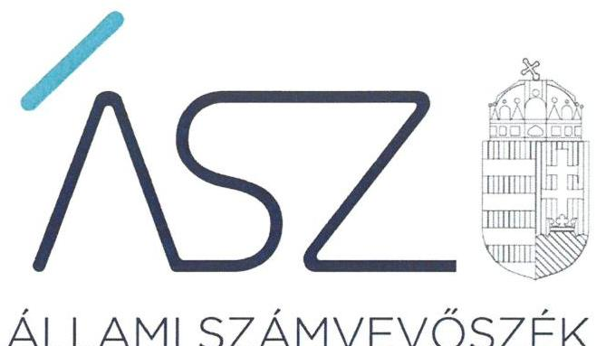

# JELENTÉS

## Községi, nagyközségi önkormányzatok integritásának ellenőrzése

24 közös önkormányzati hivatal, valamint a közös hivatalokat működtető 168 községi önkormányzat integritásának ellenőrzése

2020. 10. hó 29. nap

2020. 9. www.asz.hu

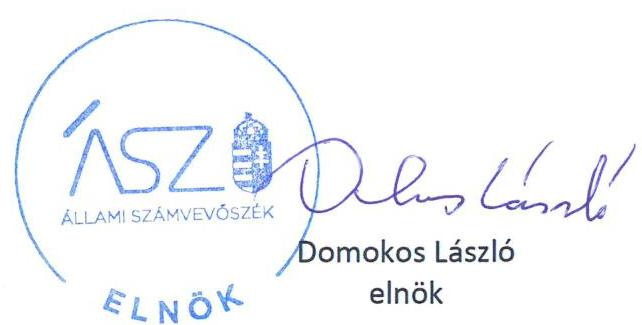

---

# AZ ELLENŐRZÉST FELÜGYELTE: 

HOLMAN MAGDOLNA JULIANNA felügyeleti vezető
SALAMON ILDIKÓ felügyeleti vezető

## AZ ELLENŐRZÉST VEZETTE ÉS A VÉGREHAJTÁSÁÉRT FELELŐS:

MAROZSÁN LÁSZLÓNÉ ellenőrzésvezető
DR. CSERNYÁK SZABOLCS ellenőrzésvezető
DR. TÓTH VIKTÓRIA ellenőrzésvezető
DR. KOVÁCS DIÁNA ellenőrzésvezető

A PROGRAM ÖSSZEÁLLÍTÁSÁÉRT FELELŐS:
SALAMON ILDIKÓ tervezési vezető

Jelentéseink az Országgyúlés számítógépes hálózatán és az interneten a www.asz.hu címen is olvashatóak.

IKTATÓSZÁM: EL-2967-001/2020
TÉMASZÁM: 2485
ELLENŐRZÉS-AZONOSÍTÓ SZÁM: V0829330-V0829521

---

# TARTALOMJEGYZÉK 

■ ÖSSZEGZÉS ..... 5
■ AZ ELLENŐRZÉS CÉLJA ..... 8
■ AZ ELLENŐRZÉS TERÜLETE ..... 9
■ AZ ELLENŐRZÉS HÁTTERE, INDOKOLTSÁGA ..... 10
■ A JELENTÉS LÉNYEGES KÉRDÉSKÖREI ..... 11
■ AZ ELLENŐRZÉS HATÓKÖRE ÉS MÓDSZEREI ..... 12
■ MEGÁLLAPÍTÁSOK ..... 14
■ JAVASLATOK ..... 22
■ MELLÉKLETEK ..... 27
I. sz. melléklet: Értelmező szótár ..... 27
II. sz. melléklet: Ellenőrzött közös önkormányzati hivatalok és önkormányzatok ..... 29
III. sz. melléklet: Összefoglaló az önkormányzatok alapvető integritási kontrolljának értékeléséről ..... 33
IV. sz. melléklet: Intézkedést igénylő megállapítások ..... 40
■ FÜGGELÉK: ÉSZREVÉTELEK ..... 43
■ RÖVIDÍTÉSEK JEGYZÉKE ..... 57

---

.

---

# ÖSSZEGZÉS 

Az Állami Számvevőszék a hét önkormányzat alkotta összesen 24 közös önkormányzati hivatal és a hozzájuk tartozó, összesen 168 községi önkormányzat integritási kontrolljainak kialakítását ellenőrizte. A 24 közös önkormányzati hivatalnál, továbbá az őket müködtető 168 önkormányzat mintegy felénél nem volt biztositva a jogszabályok által előirt alapvető integritáskontrollok kiépítése, ezáltal a feladatellátásuk és a döntéshozataluk során nem voltak védettek a korrupcióval szemben.

## Az ellenőrzés társadalmi indokoltsága

Az állampolgárok számára számos közszolgáltatást, hatósági tevékenységet települési önkormányzataik nyújtanak, ezért nélkülözhetetlen, hogy az önkormányzatok döntéshozatali folyamatai a korrupciós kockázatoktól védettek legyenek, továbbá, hogy az önkormányzati szervezeti célok érvényesülését megfelelő etikai rendszer is biztosítsa. Az ÁSZ ${ }^{1}$ Integritás felméréseiben az önkormányzatokat általában is kockázatosabb intézménycsoportként azonosította be. A kisebb méretű települési önkormányzatok integritása fokozottan veszélyeztetett, mert kontrollkörnyezetük, integritási infrastruktúrájuk - az ÁSZ Integritás felmérésének eredményei alapján is - kevésbé kiépített.

Az ÁSZ ellenőrzése rámutat a kisebb méretű, közös önkormányzati hivatalt működtető községi önkormányzatok integritási kontrolljainak gyenge pontjaira, hogy ezáltal a kontrollok kiépítettsége javuljon, az önkormányzatok integritási veszélyeztetettsége középtávon csökkenjen.

## Értékelések, következtetések

Az önkormányzatok és a közös önkormányzati hivatalok szabályos, átlátható és elszámoltatható működésének alapvető feltétele, hogy a képviselő-testületek és az önkormányzati hivatalok rendelkezzenek a jogszabályban előírt tartalmú szervezeti és működési szabályzattal, amely alapvető integritási kontrollként rögzíti a felelősségi viszonyokat, a működés és a feladatellátás részletes belső rendjét és módját, továbbá az önkormányzati képviselő-testület tagjainak és az önkormányzati hivatal köztisztviselőinek a vagyonnyilatkozat tételéhez szükséges alapvető szabályozási kereteit, követelményét. Az önkormányzat képviselő-testületének szervezeti és működési szabályzata rögzíti többek között a képviselő-testület üléseinek rendjét, a döntéshozatal részletes szabályait, az önkormányzat szerveinek jogállását, feladat és hatásköreit, valamint az önkormányzati képviselökre vonatkozó magatartási szabályokat.

A hét községi önkormányzat által alkotott összesen 24 közös önkormányzati hivatalhoz tartozó összesen 168 önkormányzat 30\%ánál a képviselő-testület nem rendelkezett szervezeti és működési szabályzattal az ellenőrzött teljes időszakban. Az önkormányzatok 46\%-ánál nem határozták meg a vagyonnyilatkozat-tételre kötelezettek körét.

A feladatellátás és a döntéshozatal részletes belső rendjét, módját és felelősségi viszonyokat, továbbá a vagyongyarapodás ellenőrzéséhez szükséges követelményeket rögzítő szervezeti és működési keretek szabályszerű kialakítása hiányában az önkormányzatok 46\%ánál nem volt biztosított a teljes 2018. évben a szabályos, átlátható és elszámoltatható működés alapvető feltétele, ezáltal az önkormányzatok közpénzfelhasználásának korrupció elleni védelme sem.
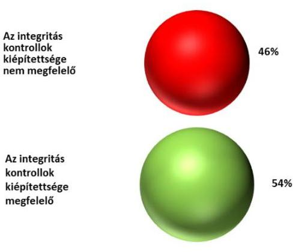

1. ábra: A jogszabály által előírt, alapvető integritás kontrollok kiépítettsége az ellenőrzött önkormányzatok arányában

---

A 168 önkormányzat mindösszesen 54\%-ánál alakították ki szabályszerűen az önkormányzat képviselő-testülete döntéshozatalának és feladatellátásának szervezeti és múködési kereteit, ezáltal megteremtették a korrupció elleni védelmükhöz szükséges szabályos és átlátható múködés alapvető feltételeit.

A közös önkormányzati hivatalok vonatkozásában a korrupció elleni védelemhez szükséges, jogszabály által előírt alapvető integritási kontrollok megfelelő kiépítettségét a szervezeti és múködésre, továbbá a szervezeti integritást sértő események kezelésének és az integrált kockázatkezelés eljárásrendjére vonatkozó szabályzatok, eljárásrendek szabályszerű kialakítása szolgálja.

A közös önkormányzati hivatal szervezeti és múködési szabályzata a jogszabályban előírt tartalomnak megfelelően kell, hogy rögzítse a felelősségi viszonyokat, a múködés és a feladatellátás részletes belső rendjét és módját, így többek között a közös önkormányzati hivatal szervezeti felépítésének és múködési rendjének kereteit, a hivatal szervezeti egységeit, a hivatali szervezetben a

2. ábra: A jogszabály által előírt, alapvető integritás kontrollok kiépítettsége az ellenőrzött közös önkormányzati hivatalok arányában
nevesített munkakörökhöz tartozó feladat és hatásköröket, a helyettesítés rendjét, a vagyonnyilatkozat-tételre kötelezett köztisztviselők körét.

A 24 közös önkormányzati hivatal 33\%-a nem rendelkezett szervezeti és múködési szabályzattal a teljes ellenőrzött időszakban. További 37\%-ánál a szervezeti és múködési keretek kialakítása nem volt szabályszerű. A feladatellátás részletes belső rendjét, módját és felelősségi viszonyokat rögzítő szervezeti és működési keretek szabályszerű kialakítása hiányában a közös önkormányzati hivatalok 70\%-ának a jegyzői nem biztosították a szabályos, átlátható és elszámoltatható múködés alapvető feltételeit, ezáltal a közös önkormányzati hivatalok korrupció elleni védelme sem volt biztosított a közpénzfelhasználásuk és a nemzeti vagyonnal való gazdálkodásuk során.

A közös önkormányzati hivatalnál a szervezeti integritást sértő események kezelésének eljárásrendje biztosítja az integritási kontrollok kiépítettsége szempontjából alapvető szabályozási keretet az önkormányzati hivatalt érintő integritást sértő események kezelése vonatkozásában a felmerülő korrupciós kockázatok mérsékléséhez.

A 24 közös önkormányzati hivatal 67\%-nál a jegyzők nem szabályozták a szervezeti integritást sértő események kezelésének eljárásrendjét az ellenőrzött teljes 2018-as évben. További 17\%-ánál az eljárásrend kialakítása a jogszabályi előírások ellenére nem volt szabályszerű. Ezáltal a közös önkormányzati hivatalok 84\%-ánál a jegyző nem biztosította az integritást sértő események kezeléséhez a korrupciós kockázatokat mérséklő kontrollok megfelelő kiépítését a teljes ellenőrzött időszakban.

Az integrált kockázatkezelési eljárásrend biztosítja az integritási kontrollok kiépítettsége szempontjából alapvető szabályozási kereteket az önkormányzati hivatalt érintő integritási és korrupciós kockázatok azonosításához, kezeléséhez és mérsékléséhez.

A 24 közös önkormányzati hivatal 46\%-ánál nem szabályozták az integrált kockázatkezelés eljárásrendjét az ellenőrzött időszakban, míg 8\%-nál csak a 2018. év utolsó negyedévében szabályozták azokat. Mivel a 24 önkormányzati hivatal több mint felénél a jegyzők, a teljes 2018. évre vonatkozóan a szervezet minden tevékenységére kiterjedően nem határozták meg a közös önkormányzati hivatal múködéséhez kapcsolódó korrupciós kockázatok kezelésének kereteit, a múködésében felmerülő kockázatos területeket, folyamatokat, ebből következően nem tették meg a szervezet minden tevékenységére kiterjedő szükséges intézkedést a korrupciós veszélyek megelőzésére, a korrupciós kockázatok mérséklésére.

A 24 közös önkormányzati hivatal 8\%-ánál tett lépéseket a jegyző az ellenőrzött időszakban az alapvető integritási kontrollok kiépítésére a kontrollok fent bemutatott kereteinek jogszabály által előírt szabályzatba foglalásával, azonban azok az egyik közös önkormányzati hivatal esetében sem feleltek meg a jogszabályi előírásoknak. Így az ellenőrzött 24 közös önkormányzati hivatal egyike sem biztosította a jogszabályok által előírt alapvető integritási kontrollok szabályszerű kiépítését, ezáltal feladatellátásuk során nem voltak védettek a korrupcióval szemben.

Az ellenőrzés megállapította, hogy a 168 önkormányzat 46\%-ánál és az általuk működtetett 24 önkormányzati közös hivatalnál a szervezeti integritás és az elszámoltathatóság alapvető követelményei és feltételei nem teljesültek,

---

az ellenőrzés során értékelt integritáskontrollok összességében nem biztosították a közös önkormányzati hivatalok és önkormányzatok védelmét a korrupció kockázataival szemben.

A III. melléklet a 168 községi önkormányzat vonatkozásában mutatja be az alapvető integritási kontroll kialakításának összegző értékelését.

Az egyes önkormányzatok, közös önkormányzati hivatalok integritásának értékeléséből adódóan megfogalmazott azon megállapításoknak az összesítését, amelyek az ellenőrzött szervezetek részéről további intézkedést igényelnek, a IV. melléklet tartalmazza.

---

# AZ ELLENŐRZÉS CÉLJA 

AZ ELLENŐRZÉS CÉLJA annak értékelése volt, hogy az ellenőrzött szervezetek a feladatellátásuk nyomán jelentkező integritási kockázatokat megfelelően felmérték-e, a kockázatokat mérséklő integritáskontrollokat kiépítették-e, és a kontrolleszközök kiterjedtek-e a kockázatos folyamatokra, területekre.

---

# **AZ ELLENŐRZÉS TERÜLETE**

## **Közös hivatallal rendelkező községi önkormányzatok**

A községi önkormányzatok integritásának ellenőrzése a 7 önkormányzat által alapított, összesen 24 közös önkormányzati hivatalra és a hozzájuk tartozó valamennyi, összesen 168 önkormányzatra (továbbiakban: önkormányzatok) terjedt ki.

A települések állandó lakosainak átlagos száma 2018. évben 357 fő volt, a legalacsonyabb lakosságszámú település 19 fővel Debréte község, a legmagasabb lakosságszámú település 1693 fővel Zalaapáti község volt.

Az önkormányzatok képviselő-testülete átlagosan 5 főből állt, munkájukat átlagosan 1 bizottság támogatta, az önkormányzatok bizottságai nem önkormányzati képviselő taggal nem rendelkeztek.

A gazdálkodási feladatokat a közös önkormányzati hivatalok látták el, ahol a kinevezett köztisztviselők átlagos száma 9 fő volt.

Az ellenőrzött önkormányzatok a 2018. évi konszolidált éves költségvetési beszámolók szerint átlagosan 116,1 millió Ft költségvetési bevételt értek el, valamint 100,7 millió Ft költségvetési kiadást teljesítettek, vagyonuk átlagos értéke 2018. december 31-én 324,1 millió Ft volt.

1. táblázat

|  ÖNKORMÁNYZATOK BESZÁMOLÓ SZERINTI BEVÉTELÉNEK, KIADÁSÁNAK ÉS VAGYONÁNAK KIEMELT ADATAI (MILLIÓ FT) |  |   |
| --- | --- | --- |
|  **ÁTLAGOS** |  |   |
|  **Bevétel** | **Kialos** | **Vagyon**  |
|  116,1 | 100,7 | 324,1  |
|  **LEGALACSONYABB** |  |   |
|  **Bevétel** | **Kialos** | **Vagyon**  |
|  12,6 | 10,3 | 40,3  |
|  (Pusztaapáti Község Önkormányzata) | (Hegyhátszentmárton Község Önkormányzata) | (Siklóshodony Községi Önkormányzat)  |
|  **LEGMANASABB** |  |   |
|  **Bevétel** | **Kialos** | **Vagyon**  |
|  673,6 | 547,2 | 1 387,0  |
|  (Mozsgó Községi Önkormányzat) | (Mozsgó Községi Önkormányzat) | (Zalaapáti Község Önkormányzata)  |

*Forrás: Az ellenőrzött önkormányzatok 2018. évi konszolidált éves beszámolók*

---

# AZ ELLENŐRZÉS HÁTTERE, INDOKOLTSÁGA 

Az ÁSZ önálló integritási ellenőrzési módszertana a kontrollok kiépítettségén túl, azok kiterjedését is értékelte a kockázatos folyamatokra, valamint olyan integritási eszközöket is ellenőrzött, amelyeket nemzetközi jó gyakorlatok alapoznak meg.

Az ÁSZ ellenőrzése rámutat a kisebb méretű, önálló hivatallal rendelkező, illetve közös önkormányzati hivatalt működtető községi önkormányzatok integritási kontrolljainak gyenge pontjaira, hogy ezáltal a kontrollok kiépítettsége javuljon, az önkormányzatok integritási veszélyeztetettsége középtávon csökkenjen.

Az ellenőrzés várható hasznosulása több szinten valósul meg. Az ellenőrzés az ellenőrzöttek számára visszajelzést ad az integritás kontrollok kialakításáról, illetve azok hiányosságairól, javaslataival hozzájárul az integritás megerősítéséhez. Az ellenőrzések megállapításait más önkormányzatok is hasznosíthatják a megfelelő integritás környezet kialakításához. A társadalom számára az ellenőrzések visszajelzést adnak az önkormányzatok integritásáról. Az ellenőrzések átláthatóvá teszik az ellenőrzöttek integritási mechanizmusainak múködését.

---

# A JELENTÉS LÉNYEGES KÉRDÉSKÖREI 

1. Megfelelő-e az ellenőrzött önkormányzatoknál az alapvető integritási kontrollok kiépitettsége?
2. Megfelelő-e az ellenőrzött közös önkormányzati hivataloknál az alapvető integritási kontrollok kiépitettsége?

---

# AZ ELLENŐRZÉS HATÓKÖRE ÉS MÓDSZEREI 

## Az ellenőrzés típusa

Megfelelőségi ellenőrzés.

## Az ellenőrzött időszak

2018. év

## Az ellenőrzés tárgya

Az ellenőrzött önkormányzatok és közös önkormányzati hivatalok integritási kontrolljainak kiépítettsége, a kontroll eszközök kiterjedése a kockázatos folyamatokra, területekre.

## Az ellenőrzött szervezet

A 7 önkormányzat által közös önkormányzati hivatalt alapító összesen 168 községi önkormányzat, valamint a gazdálkodási feladataikat ellátó 24 közös önkormányzati hivatal.

Az ellenőrzött szervezeteket a II. melléklet tartalmazza.

## Az ellenőrzés jogalapja

Az ÁSZ törvény² 1. § (3) bekezdésének megfelelően az ÁSZ általános hatáskörrel végzi a közpénzekkel és az állami és önkormányzati vagyonnal való felelős gazdálkodás ellenőrzését. Az ÁSZ törvény 5. § (6) bekezdése alapján ellenőrzése során értékeli a belső kontrollrendszer múködését.

## Az ellenőrzés módszerei

Az ellenőrzést a nemzetközi standardokat irányadónak tekintve, az ellenőrzési program szempontjai, kérdései, az ellenőrzött időszakban hatályos jogszabályok, az ellenőrzés szakmai szabályok és módszertanok figyelembevételével végezte az ÁSZ. Az ellenőrzés ideje alatt az ellenőrzött szervezetekkel történő kapcsolattartás az ÁSZ SZMSZ ${ }^{5}$-ének vonatkozó előírásai alapján volt biztosított. Az ellenőrzési kérdések megválaszolásához szükséges bizonyítékok megszerzése az ellenőrzöttek által rendelkezésre bocsátott dokumentumokra, adatokra, valamint az általuk közzétett honlapon fellelhető információkra alapozva megfigyelés, szemle (szemrevételezés)

---

kérdésfeltevés (információkérés), valamint elemző eljárással történt. Az ellenőrzési bizonyítékként felhasználható adatforrások közé az ellenőrzési program részletes szempontjainál felsorolt adatforrások tartoztak.

Az ellenőrzés lefolytatásához az önkormányzatok és közös önkormányzati hivatalok az ÁSZ által kért dokumentumok elektronikus megküldésével szolgáltattak adatokat. A rendelkezésre bocsátott adatok, információk kontrollja az ellenőrzés keretében történt meg.

Helyénvalósági kritériumok alapján azokat az ellenőrzési kérdéseket értékelte az ÁSZ, amelyek esetében nem állt rendelkezésre jogszabályi előírás, ugyanakkor a megfelelő integritás kontrollok kialakítása érdekében szükséges a kérdés közös önkormányzati hivatalok általi kezelése. A meghatározott helyénvalósági kritériumokat olyan „jó gyakorlatok" beazonosításával alapozta meg az ÁSZ, amelyek nemzetközi és hazai sztenderdekben, útmutatókban található iránymutatások, követelmények, meghatározások.

Az ellenőrzés során az önkormányzatok és a közös önkormányzati hivatalok integritáskontrolljai kialakításának értékelése három szinten történt:

- minden önkormányzat és közös önkormányzati hivatal vonatkozásában szabályszerűségi kritérium volt az integritás alapú szervezeti kultúra kialakításának előfeltételeként, a szabályszerű működés alapvető feltételeit meghatározó szervezeti és működési szabályzat jogszabályban előírt tartalomnak megfelelő megléte;
- minden közös önkormányzati hivatal vonatkozásában szabályszerűségi kritérium volt az integritási kontrollok kiépítése szempontjából alapvető szabályzatok - a szervezeti integritást sértő események kezelésének, valamint az integrált kockázatkezelés eljárásrendjének jogszabályban előírt tartalomnak megfelelő megléte.
- a jogszabályok által előírt alapvető integritási kontrollokat kialakító közös önkormányzati hivatal vonatkozásában a számvevőszéki ellenőrzés helyénvalósági kritériumként értékelte az etikai elvárások meghatározását, továbbá a közbeszerzési értékhatárt el nem érő beszerzésekre vonatkozóan legalább három ajánlat bekéréséről rendelkező szabályzat, valamint a közérdekű bejelentések és panaszok kezelésére vonatkozó szabályozás meglétét.

---

# 1. Megfelelő-e az ellenőrzött önkormányzatoknál az alapvető integritási kontrollok kiépítettsége? 

Összegző megállapítás

Az ellenőrzött 168 önkormányzat közül 77 önkormányzatnál nem biztosították az alapvető integritási kontrollok kiépítését a szabályszerű szervezeti és múködési keretek kialakításának hiányában a 2018. évben.

Az ellenőrzött 168 önkormányzat közül 44 önkormányzat képviselő-testülete az Mötv. 53. § (1) bekezdésében foglaltak ellenére nem rendelkezett SZMSZ-szel a 2018. évben. Míg további hat önkormányzat csak a 2018. év egy részében rendelkezett SZMSZ-szel.

A Vnytv4. 4. § d) pontjában előírtak ellenére 77 önkormányzatnál nem került meghatározásra az önkormányzatnál vagyonnyilatkozat tételre kötelezettek köre, mivel vagy nem rendelkeztek SZMSZ-szel vagy az SZMSZek nem tartalmazták az erre vonatkozó szabályozást. Ezáltal a korrupció elleni védelem biztosításához szükséges alapvető követelmények kialakítása nem történt meg.

Az ellenőrzött 168 önkormányzat közül 118 önkormányzat képviselőtestülete a teljes 2018. évben rendelkezett az Mötv5. előírásának megfelelően a működés és a feladatellátás részletes belső rendjét és módját, a felelőségi viszonyokat rögzítő SZMSZ ${ }^{6}$-szel.

A 2018. évben szabályszerű SZMSZ-szel rendelkező önkormányzatok megteremtették a közpénzfelhasználás és a nemzeti vagyonnal való gazdálkodás korrupció elleni védelméhez szükséges alapvető szervezeti kereteket, illetve biztosították a szabályos, átlátható múködés alapvető feltételeit.

Az ellenőrzött időszakban SZMSZ-szel nem rendelkező önkormányzatokat a 2. táblázat mutatja be.

---

1. táblázat

A 2018. ÉVRE VONATKOZÓAN SZMSZ-SZEL NEM RENDELKEZŐ ÖNKORMÁNYZATOK

| Sorszám | Önkormányzat megnevezése | Az önkormányzat SZMSZ-szel nem rendelkezett |
| :--: | :--: | :--: |
| 1. | Diósviszló Község Önkormányzata | 2018. év |
| 2. | Babarcszőlős Községi Önkormányzat | 2018. év |
| 3. | Bisse Községi Önkormányzat | 2018. év |
| 4. | Garé Község Önkormányzata | 2018. év |
| 5. | Kisdér Községi Önkormányzata | 2018. év |
| 6. | Rádfalva Község Önkormányzat | 2018. év |
| 7. | Siklósbodony Községi Önkormányzat | 2018. év |
| 8. | Hirics Községi Önkormányzat | 2018. év |
| 9. | Kemse Község Önkormányzata | 2018. év |
| 10. | Kórós Község Önkormányzata | 2018. év |
| 11. | Lúzsok Községi Önkormányzat | 2018. év |
| 12. | Páprád Községi Önkormányzat | 2018. év |
| 13. | Vejti Községi Önkormányzat | 2018. év |
| 14. | Zaláta Község Önkormányzata | 2018. év |
| 15. | Mindszentgodisa Községi Önkormányzat | 2018. év |
| 16. | Nagynyárád Község Önkormányzata | 2018. év |
| 17. | Kölked Község Önkormányzata | 2018. év |
| 18. | Sátorhely Község Önkormányzata | 2018. év |
| 19. | Törökkoppány Község Önkormányzata | 2018. év |
| 20. | Bonnya Község Önkormányzata | 2018. év |
| 21. | Kára Község Önkormányzata | 2018. év |
| 22. | Miklósi Község Önkormányzata | 2018. év |
| 23. | Somogyacsa Község Önkormányzata | 2018. év |
| 24. | Somogydöröcske Község Önkormányzata | 2018. év |
| 25. | Szorosad Község Önkormányzata | 2018. év |
| 26 | Békás Község Önkormányzata | 2018. év |
| 27. | Ugod Község Önkormányzata | 2018. év |
| 28. | Bakonykoppány Község Önkormányzata | 2018. év |
| 29. | Bakonyszúcs Község Önkormányzata | 2018. év |
| 30 | Béb Község Önkormányzata | 2018. év |
| 31. | Nagytevel Község Önkormányzata | 2018. év |
| 32. | Csömödér Község Önkormányzata | 2018. év |
| 33. | Barlahida Község Önkormányzata | 2018. év |
| 34. | Hernyék Község Önkormányzata | 2018. év |
| 35. | Kissziget Község Önkormányzata | 2018. év |
| 36. | Mikekarácsonyfa Község Önkormányzata | 2018. év |
| 37. | Zebecke Község Önkormányzata | 2018. év |
| 38. | Zalaapáti Község Önkormányzata | 2018. év |
| 39. | Bókaháza Község Önkormányzata | 2018. év |
| 40. | Dióskál Község Önkormányzata | 2018. év |
| 41. | Egeraracsa Község Önkormányzata | 2018. év |
| 42 | Esztergályhorváti Község Önkormányzata | 2018. év |
| 43. | Gétye Község Önkormányzata | 2018. év |
| 44. | Zalaszentmárton Község Önkormányzata | 2018. év |
| 45. | Szalonna Község Önkormányzata | 2018. 01. 01-04. 02. között |
| 46. | Martonyi Község Önkormányzata | 2018. 01. 01-04. 03. között |
| 47. | Meszes Község Önkormányzata | 2018. 01. 01.-04. 03. között |
| 48. | Telkibánya Község Önkormányzata | 2018. 01. 01.-02. 28. között |
| 49. | Pányok Község Önkormányzata | 2018. 01. 01.-02. 28. között |
| 50. | Kéked Község Önkormányzata | 2018. 01. 01.-02. 28. között |

---

# 2. Megfelelő-e az ellenőrzött közös önkormányzati hivataloknál az alapvető integritási kontrollok kiépítettsége? 

Összegző megállapítás

Az ellenőrzött 24 közös önkormányzati hivatalnál nem biztosították a jogszabályokban előírt alapvető integritáskontrollok szabályszerű kiépítését a 2018. évben.
2.1. számú megállapítás

17 közös önkormányzati hivatalnál a teljes ellenőrzött időszakban hiányoztak a szabályos, átlátható és elszámoltatható múködés alapvető feltételei a szabályszerű szervezeti és múködési keretek kialakításának hiányában.

Az ellenőrzött 24 közös önkormányzati hivatal közül hét önkormányzati hivatal az Áht ${ }^{7}$. 10. § (5) bekezdésben foglaltak ellenére nem rendelkezett SZMSZ-szel a 2018. évre vonatkozóan, míg egy önkormányzati hivatalnak csupán 2018. december 1-től volt jóváhagyott SZMSZ-e.

Az ellenőrzött időszakban SZMSZ-szel nem rendelkező közös önkormányzati hivataloknál a múködés és feladatellátás részletes belső rendje, módja és felelősségi viszonyok rögzítésének hiányában a szabályos, átlátható és elszámoltatható múködés alapvető feltételei hiányoztak.

További kilenc közös önkormányzati hivatalnál az elkészített SZMSZ nem felelt meg a vonatkozó jogszabályi előírásoknak, melyből három önkormányzati hivatalnál a jegyző az SZMSZ-ben nem határozta meg a va-gyonnyilatkozat-tételre kötelezettek körét, ezáltal nem gondoskodott a korrupció elleni védelem, az átlátható múködés alapvető követelményeinek kialakításáról.

A 2018. évben mindösszesen hét közös önkormányzati hivatalnál teremtették meg szabályszerű szervezeti és múködési keretek kialakításával, a felelősségi viszonyok meghatározásával a jegyzők a hivatalok múködéséhez és a korrupció elleni védelem biztosításához szükséges alapvető szervezeti kereteket és biztosították a szabályos, átlátható és elszámoltatható múködés alapvető feltételeit.

Az ellenőrzött 24 közös önkormányzati hivatal SZMSZ-ének kialakítására vonatkozó összesített értékelést a 3. táblázat mutatja be.

---

# 3. táblázat 

## A KÖZÖS ÖNKORMÁNYZATI HIVATALOK ÉRTÉKELÉSE AZ SZMSZ-KIALAKÍTÁSÁRA VONATKOZÓAN

| Sör-   szám | Közös önkormányzati hivatal megnevezése | SZMSZ-szel nem rendelkezett | Az SZMSZ   nem volt szabályozottú | Az SZMSZ szabályozottú volt |
| :--: | :--: | :--: | :--: | :--: |
| 1. | Csányoszrói Közös Önkormányzati Hivatal |  |  | $\checkmark$ |
| 2. | Diósviszlói Közös Önkormányzati Hivatal | 2018. év |  |  |
| 3. | Híricsi Közös Önkormányzati Hivatal | 2018. év |  |  |
| 4. | Mindszentgodisai Közös Önkormányzati Hivatal |  | X |  |
| 5. | Mozsgói Közös Önkormányzati Hivatal |  |  | $\checkmark$ |
| 6. | Nagydobszai Közös Önkormányzati Hivatal |  | X |  |
| 7. | Nagynyárádi Közös Önkormányzati Hivatal |  | X |  |
| 8. | Selyebi Közös Önkormányzati Hivatal | 2018. év |  |  |
| 9. | Szalonnai Közös Önkormányzati Hivatal | 2018. év |  |  |
| 10. | Telkibányai Közös Önkormányzati Hivatal |  | X |  |
| 11. | Mesztegnyői Közös Önkormányzati Hivatal |  | X |  |
| 12. | Törökkoppányi Közös Önkormányzati Hivatal |  | X |  |
| 13. | Csarodai Közös Önkormányzati Hivatal |  | X |  |
| 14. | Balogunyomi Közös Önkormányzati Hivatal |  |  | $\checkmark$ |
| 15. | Ivánci Közös Önkormányzati Hivatal |  | X |  |
| 16. | Kenyeri Közös Önkormányzati Hivatal |  |  | $\checkmark$ |
| 17. | Molnaszecsődi Közös Önkormányzati Hivatal |  |  | $\checkmark$ |
| 18. | Nádasdi Közös Önkormányzati Hivatal |  |  | $\checkmark$ |
| 19. | Vasaljai Közös Önkormányzati Hivatal |  |  | $\checkmark$ |
| 20. | Nemesgörzsönyi Közös Önkormányzati Hivatal |  | X |  |
| 21. | Ugodi Közös Önkormányzati Hivatal | $\begin{gathered} 2018.01 .01 .-11.30 . \\ \text { között } \end{gathered}$ |  | $\begin{gathered} 2018.12 .01 .- \\ 12.31 . \text { között } \end{gathered}$ |
| 22. | Csömödéri Közös Önkormányzati Hivatal | 2018. év |  |  |
| 23. | Zalaapáti Közös Önkormányzati Hivatal | 2018. év |  |  |
| 24. | Zalabaksai Közös Önkormányzati Hivatal | 2018. év |  |  |

Aztelégött időszakban nem a jogszabálynak megfelelő tartalmú SZMSZ-szel múködött kilenc közös önkormányzati hivatal, mely SZMSZeknek a tartalmi értékelését a 4. táblázat tartalmazza.
4. táblázat

| Az SZMSZ-ben megsértett jogszabályhely | A 2018. évben nem a jogszabálynak megfelelő SZMSZ-szel rendelkező közös önkormányzati hivatalok SZMSZ-ének tartalmi értékelése |
| :--: | :--: |
| Ávr ${ }^{a}$. 13. § (1) bekezdés b), c) és e) pontjának és a Vnytv. 4. § a) pont előírásai | A Mindszentgodisai Közös Önkormányzati Hivatal SZMSZ-e az Ávr. előírásai ellenére nem tartalmazta a közös önkormányzati hivatal alapító okirata számát, alapításának időpontját, a kormányzati funkció szerinti besorolt alaptevékenységek megjelölését, a közös önkormányzati hivatal szervezeti ábráját, továbbá a Vnytv. előirása ellenére a vagyonnyilatkozat-tételi kötelezettséggel járó munkaköröket abban nem határozták meg. |
| Ávr. 13. § (1) bekezdés b), c) és e) pontjának és a Vnytv. 4. § a) pont előírásai | A Nagydobszai Közös Önkormányzati Hivatal SZMSZ-e az Ávr. előírásai ellenére nem tartalmazta a közös önkormányzati hivatal alapító okirata keltét, számát, a kormányzati funkció szerinti besorolt alaptevékenységek megjelölését, a közös önkormányzati hivatal szervezeti ábráját, továbbá a Vnytv. előirása ellenére a vagyonnyilatkozat-tételi kötelezettséggel járó munkaköröket abban nem határozták meg. |

---

| Ávr. 13. § (1) bekezdés b), c), e) és g) pontjának előírásai | A Nagynyárádi Közös Önkormányzati Hivatal SZMSZ-e az Ávr. előírásai ellenére nem tartalmazta a közös önkormányzati hivatal alapító okirata keltét, számát, alapításának időpontját, az ellátandó és a kormányzati funkció szerint besorolt alaptevékenységeinek megjelölését, a közös önkormányzati hivatal szervezeti ábráját, a gazdasági szervezet megnevezését, továbbá az SZMSZben nevesített munkakörökhöz tartozó feladatköröket és hatásköröket. |
| :--: | :--: |
| Ávr. 13. § (1) bekezdés b), c), e) és g) pontjának előírásai | A Telkibányai Közös Önkormányzati Hivatal SZMSZ-e az Ávr. előírásai ellenére nem tartalmazta a közös önkormányzati hivatal alapító okirata keltét, számát és alapításának időpontját, a közös önkormányzati hivatal által ellátandó és a kormányzati funkció szerint besorolt alaptevékenységeinek megjelölését, a közös önkormányzati hivatal szervezeti ábráját, továbbá az SZMSZ-ben nevesített valamennyi munkakörhöz tartozó helyettesítés rendjét. |
| Ávr. 13. § (1) bekezdés g) pontjának és a Vnytv. 4. § a) pont előírásai | A Mesztegnyői Közös Önkormányzati Hivatal SZMSZ-e az Ávr. előírásai ellenére nem tartalmazta az SZMSZ-ben nevesített munkakörökhöz tartozó feladatköröket és hatásköröket, továbbá a Vnytv. előírása ellenére nem tartalmazta a vagyonnyilatkozat-tételi kötelezettséggel járó munkaköröket. |
| Ávr. 13. § (1) bekezdés b), e) és i) pontjának előírásai | A Törökkoppányi Közös Önkormányzati Hivatal SZMSZ-e az Ávr. előírásai ellenére nem tartalmazta a közös önkormányzati hivatal alapító okirata keltét, számát, alapításának időpontját, szervezeti felépítését, szervezeti ábráját, a szervezeti egységei megnevezését, a gazdasági szervezet megnevezését, továbbá nem tartalmazta azon költségvetési szerv felsorolást, amelynek tekintetében az Áht. 10. § (4a) és (4b) bekezdés alapján az Ávr. 9. § (1) bek. szerinti gazdasági szervezeti feladatokat ellátta. |
| Ávr. 13. § (1) bekezdés b), e) és g) pontjának előírásai | A Csarodai Közös Önkormányzati Hivatal SZMSZ-e az Ávr. előírásai ellenére nem tartalmazta a közös önkormányzati hivatal alapító okirat keltét, számát, alapításának időpontját, a közös önkormányzati hivatal szervezeti ábráját, továbbá az SZMSZ-ben nevesített munkakörökhöz tartozó helyettesítés rendjét. |
| Ávr. 13. § (1) bekezdés b), c), e) és g) pontjának előírásai | Az Ivánci Közös Önkormányzati Hivatal SZMSZ-e az Ávr. előírásai ellenére nem tartalmazta a közös önkormányzati hivatal alapító okirata keltét, számát, az ellátandó és a kormányzati funkció szerint besorolt alaptevékenységeinek megjelölését, a közös önkormányzati hivatal szervezeti felépítését, a szervezeti ábráját, a szervezeti egységeinek a megnevezését, az SZMSZ-ben nevesített munkakörökhöz tartozó feladatköröket és hatásköröket. |
| Ávr. 13. § (1) bekezdés b), c) és e) pontjának előírásai | A Nemesgörzsönyi Közös Önkormányzati Hivatal SZMSZ-e az Ávr. előírásai ellenére nem tartalmazta a közös önkormányzati hivatal alapító okirata keltét, számát, alapításának időpontját, az ellátandó és a kormányzati funkció szerint besorolt alaptevékenységeinek megjelölését, továbbá a szervezeti ábráját. |

Forrás: $A S Z$
2.2. számú megállapítás

20 közös önkormányzati hivatalnál nem biztosította a jegyző a szervezeti integritást sértő események kezeléséhez a korrupciós kockázatokat mérséklő kontrollok szabályszerű kiépítését a teljes ellenőrzött időszakban.

Az ellenőrzött 24 közös önkormányzati hivatal közül 12 önkormányzati hivatalnál a jegyző nem szabályozta a $\mathrm{Bkr}^{9}$. 2016. október 1-jétől hatályos 6. § (4) és (4a) bekezdésének előírásai alapján a szervezeti integritást sértő események kezelésének eljárásrendjét a 2018. évre vonatkozóan. További négy közös önkormányzati hivatalnál a jegyző év közben készítette el az eljárásrendet.

A Bkr. által előírt eljárásrend hiányában az érintett közös önkormányzati hivatalok jegyzői az ellenőrzött időszakban nem biztosították az integritást sértő események kezelése vonatkozásában a korrupciós kockázatokat mérséklő kontrollok kiépítéséhez az alapvető szabályozási kereteket.

---

A szervezeti integritást sértő események kezelésének eljárásrendjét szabályozó nyolc közös önkormányzati hivatal felénél az eljárásrend kialakítása - a Bkr. 6. § (4a) bekezdésének előírásai ellenére - nem volt szabályszerű. Szabályszerű eljárásrend hiányában az érintett közös önkormányzati hivatalok jegyzője az integritást sértő események kezelését szolgáló kontrollokat hiányosan alakította ki, ezáltal a hivatali szervezetben az integritást sértő események kezelése során felmerülő korrupciós kockázatok mérséklését nem biztosították.

A 24 ellenőrzött közös önkormányzati hivatal közül csupán négy önkormányzati hivatal rendelkezett a teljes 2018. évben a szervezeti integritást sértő események kezelésére vonatkozó eljárásrenddel.

Az ellenőrzött 24 közös önkormányzati hivatal szervezeti integritást sértő események kezelésének eljárásrendje kialakítására vonatkozó összesített értékelését az 5. táblázat mutatja be.
5. táblázat

# A KÖZÖS ÖNKORMÁNYZATI HIVATALOK ÉRTÉKELÉSE A SZERVEZETI INTEGRITÁST SÉRTŐ ESEMÉNYEK KEZELÉSÉNEK ELJÁRÁSRENDJÉRE VONATKOZÓAN 

| Sorszám | Közös önkormányzati hivatal megnevezése | Az eljárásrenddel nem rendelkezett | Az eljárásrendje nem volt szabályszerű | Az eljárásrendje szabályszerű volt |
| :--: | :--: | :--: | :--: | :--: |
| 1. | Csányoszrói Közös Önkormányzati Hivatal | 2018. év |  |  |
| 2. | Diósviszlói Közös Önkormányzati Hivatal | 2018. év |  |  |
| 3. | Hiricsi Közös Önkormányzati Hivatal | 2018. év |  |  |
| 4. | Mindszentgodisai Közös Önkormányzati Hivatal | 2018. év |  |  |
| 5. | Mozsgói Közös Önkormányzati Hivatal | 2018. év |  |  |
| 6. | Nagydobszai Közös Önkormányzati Hivatal | 2018. év |  |  |
| 7. | Nagynyárádi Közös Önkormányzati Hivatal | 2018. év |  |  |
| 8. | Selyebi Közös Önkormányzati Hivatal | $\begin{gathered} 2018.01 .01 .- \\ 09.30 . \text { között } \end{gathered}$ |  | $\begin{gathered} 2018.10 .01 .-12.31 . \\ \text { között } \end{gathered}$ |
| 9. | Szalonnai Közös Önkormányzati Hivatal |  |  | $\checkmark$ |
| 10. | Telkibányai Közös Önkormányzati Hivatal | 2018. év |  |  |
| 11. | Mesztegnyői Közös Önkormányzati Hivatal | 2018. év |  |  |
| 12. | Törökkoppányi Közös Önkormányzati Hivatal |  |  | $\checkmark$ |
| 13. | Csarodai Közös Önkormányzati Hivatal |  |  | $\checkmark$ |
| 14. | Balogunyomi Közös Önkormányzati Hivatal |  | X |  |
| 15. | Ivánci Közös Önkormányzati Hivatal | $\begin{gathered} 2018.01 .01 .- \\ 09.24 . \text { között } \end{gathered}$ |  | $\begin{gathered} 2018.09 .25-12.31 . \\ \text { között } \end{gathered}$ |
| 16. | Kenyeri Közös Önkormányzati Hivatal | $\begin{gathered} 2018.01 .01- \\ 09.30 . \text { között } \end{gathered}$ |  | $\begin{gathered} 2018.10 .01 .-12.31 . \\ \text { között } \end{gathered}$ |
| 17. | Molnaszecsődi Közös Önkormányzati Hivatal |  | X |  |
| 18. | Nádasdi Közös Önkormányzati Hivatal |  | X |  |
| 19. | Vasaljai Közös Önkormányzati Hivatal |  | X |  |
| 20. | Nemesgörzsönyi Közös Önkormányzati Hivatal | 2018. év |  |  |
| 21. | Ugodi Közös Önkormányzati Hivatal | 2018. év |  |  |
| 22. | Csömödéri Közös Önkormányzati Hivatal | $\begin{gathered} 2018.01 .01 .- \\ 11.30 . \text { között } \end{gathered}$ |  | $\begin{gathered} 2018.12 .01-12.31 . \\ \text { között } \end{gathered}$ |
| 23. | Zalaapáti Közös Önkormányzati Hivatal |  |  | $\checkmark$ |
| 24. | Zalabaksai Közös Önkormányzati Hivatal | 2018. év |  |  |

---

A 2018. évben nem szabályszerű eljárásrenddel rendelkező közös önkormányzati hivatalok integritást sértő események kezelésére vonatkozó eljárásrendjeinek értékelését a 6. táblázat tartalmazza.
6. táblázat

| Az eljárásrendben megsértett jogszabályhely | A közös önkormányzati hivatalok integritást sértő események kezelésére vonatkozó eljárásrend tartalmi értékelése a 2018. évben nem szabályszerű eljárásrendek vonatkozásában |
| :--: | :--: |
| Bkr. 6. § (4a) bekezdés b)-d) pontjai | A Balogunyomi Közös Önkormányzati Hivatal integritást sértő események kezelésére vonatkozó eljárásrendje a Bkr. előírásaiban foglaltak ellenére nem tartalmazta a bejelentés kivizsgálásához szükséges információk összegyűjtésének módját, az érintettek meghallgatásának eljárási szabályait és a vonatkozó dokumentumok átvizsgálásának szabályait. |
| Bkr. 6. § (4a) bekezdés b)-d) pontjai | Molnaszecsődi Közös Önkormányzati Hivatal integritást sértő események kezelésére vonatkozó eljárásrendje a Bkr. előírásaiban foglaltak ellenére nem tartalmazta a bejelentés kivizsgálásához szükséges információk összegyűjtésének módját, az érintettek meghallgatásának eljárási szabályait és a vonatkozó dokumentumok átvizsgálásának szabályait. |
| Bkr. 6. § (4a) bekezdés b)-d) és g) pontjai | A Nádasdi Közös Önkormányzati Hivatal integritást sértő események kezelésére vonatkozó eljárásrendje a Bkr. előírásaiban foglaltak ellenére nem tartalmazta a bejelentés kivizsgálásához szükséges információk összegyűjtésének módját, az érintettek meghallgatásának eljárási szabályait és a vonatkozó dokumentumok átvizsgálásának szabályait, valamint a bejelentő védelmére, elismerésére, illetve a vizsgálat eredményéről való tájékoztatásra vonatkozó szabályokat. |
| Bkr. 6. § (4a) bekezdés b)-d) és g) pontjai | A Vasaljai Közös Önkormányzati Hivatal integritást sértő események kezelésére vonatkozó eljárásrendje a Bkr. előírásaiban foglaltak ellenére nem tartalmazta a bejelentés kivizsgálásához szükséges információk összegyűjtésének módját, az érintettek meghallgatásának eljárási szabályait és a vonatkozó dokumentumok átvizsgálásának szabályait, valamint a bejelentő védelmére, elismerésére, illetve a vizsgálat eredményéről való tájékoztatásra vonatkozó szabályokat. |

Forrás: ÁSZ
2.3. számú megállapítás

13 közös önkormányzati hivatal jegyzője nem határozta meg a múködéshez kapcsolódó kockázatok kezelésének kereteit a szervezet minden tevékenységére kiterjedően a teljes 2018. évre vonatkozóan.

Az ellenőrzött 24 közös önkormányzati hivatal közül 11 önkormányzati hivatalnál a jegyző nem szabályozta a Bkr. 2016. október 1-jétől hatályos 6. § (4) bekezdésének előírása alapján az integrált kockázatkezelés eljárásrendjét a 2018. évre vonatkozóan. További két hivatalnál a jegyzők a 2018. év során készítették el a közös önkormányzati hivatalra vonatkozó eljárásrendet. Így a Bkr. által előírt integrált kockázatkezelési eljárásrend hiányában a közös önkormányzati hivatalok közül 13 önkormányzati hivatalnak a jegyzői nem azonosították be a közös önkormányzati hivatal működésében felmerülő kockázatokat, folyamatokat, ezáltal a korrupciós kockázatok mérséklésére nem tették meg a szervezet minden tevékenységére kiterjedő szükséges intézkedést a teljes 2018. évben.

Az integrált kockázatkezelési eljárásrendet szabályozó közös önkormányzati hivataloknál az eljárásrend kialakítása a Bkr. előírásainak megfelelő volt. Ezeknél a közös önkormányzati hivataloknál a jegyző a szervezet minden tevékenységére vonatkozóan meghatározta a múködésükhöz kapcsolódóan felmerülő korrupciós kockázatokat, kialakította a szükséges in-

---

tézkedésekre vonatkozó szabályokat, ezáltal biztosította a korrupciós kockázatok kezelésének az átláthatóságát a szervezet minden tevékenységében.

Az ellenőrzött 24 közös önkormányzati hivatal integrált kockázatkezelés eljárásrendjének kialakítására vonatkozó összesített értékelését a 7. táblázat mutatja be.
7. táblázat

# A KÖZÖS ÖNKORMÁNYZATI HIVATALOK ÉRTÉKELÉSE AZ INTEGRÁLT KOCKÁZATKEZELÉS ELJÁRÁSRENDJÉRE VONATKOZÓAN 

| Sor-   szám | Közös önkormányzati hivatal megnevezése | Az eljárásrendjé nem rendelkezett | Az eljárásrendje szabályszerű volt |
| :--: | :--: | :--: | :--: |
| 1. | Csányoszrói Közös Önkormányzati Hivatal | 2018. év |  |
| 2. | Diósviszlói Közös Önkormányzati Hivatal | 2018. év |  |
| 3. | Híricsi Közös Önkormányzati Hivatal | 2018. év |  |
| 4. | Mindszentgodisai Közös Önkormányzati Hiva-   tal | 2018. év |  |
| 5. | Mozsgói Közös Önkormányzati Hivatal |  | $\checkmark$ |
| 6. | Nagydobszai Közös Önkormányzati Hivatal | 2018. év |  |
| 7. | Nagynyárádi Közös Önkormányzati Hivatal | 2018. év |  |
| 8. | Selyebi Közös Önkormányzati Hivatal | 2018. év |  |
| 9. | Szalonnai Közös Önkormányzati Hivatal |  | $\checkmark$ |
| 10. | Telkibányai Közös Önkormányzati Hivatal |  | $\checkmark$ |
| 11. | Mesztegnyői Közös Önkormányzati Hivatal | 2018. év |  |
| 12. | Törökkoppányi Közös Önkormányzati Hivatal |  | $\checkmark$ |
| 13. | Csarodai Közös Önkormányzati Hivatal |  | $\checkmark$ |
| 14. | Balogunyomi Közös Önkormányzati Hivatal |  | $\checkmark$ |
| 15. | Ivánci Közös Önkormányzati Hivatal | 2018. 01.01-09.24. között | 2018.09.25-12.31. között |
| 16. | Kenyeri Közös Önkormányzati Hivatal | 2018. 01.01.-09.30. között | 2018.10.01.-12.31. között |
| 17. | Molnaszecsődi Közös Önkormányzati Hivatal |  | $\checkmark$ |
| 18. | Nádasdi Közös Önkormányzati Hivatal |  | $\checkmark$ |
| 19. | Vasaljai Közös Önkormányzati Hivatal |  | $\checkmark$ |
| 20. | Nemesgörzsönyi Közös Önkormányzati Hiva-   tal | 2018. év |  |
| 21. | Ugodi Közös Önkormányzati Hivatal | 2018. év |  |
| 22. | Csömödéri Közös Önkormányzati Hivatal |  | $\checkmark$ |
| 23. | Zalaapáti Közös Önkormányzati Hivatal |  | $\checkmark$ |
| 24. | Zalabaksai Közös Önkormányzati Hivatal | 2018. év |  |

A 24 közös önkormányzati hivatal egyikénél sem került kialakításra a 2018. évre vonatkozóan a jogszabályi előírásoknak megfelelő SZMSZ, szervezeti integritást sértő események kezelésének eljárásrendje és az integrált kockázatkezelési eljárásrend. A három alapvető integritási kontroll hiánya miatt a közös önkormányzati hivataloknál az etikai elvárások meghatározása, a közbeszerzési értékhatárt el nem érő beszerzésekre vonatkozó legalább három ajánlat bekérése, valamint a közérdekú bejelentések és panaszok kezelése területén nem biztosítható a szabályszerű kontrollfolyamatok kialakítása és ezáltal nem járulhattak hozzá a közös önkormányzati hivatalok integritásának erősítéséhez.

---

# JAVASLATOK 

Az ÁSZ tv. 33. § (1) bekezdésében foglaltak értelmében az ellenőrzött szervezet vezetője köteles a jelentésben foglalt megállapításokhoz kapcsolódó intézkedési tervet összeállítani és azt a jelentés kézhezvételétől számított 30 napon belül az ÁSZ részére megküldeni. Amennyiben az ellenőrzött szervezet vezetője nem küldi meg határidőben az intézkedési tervet, vagy továbbra sem elfogadható intézkedési tervet küld, az Állami Számvevőszék elnöke az ÁSZ tv. 33. § (3) bekezdése a) és b) pontjaiban foglaltakat érvényesítheti.

| Diósviszló Község Önkormányzata | Babarcszőlős Községi Önkormányzat | Bisse Községi Önkormányzat |
| :--: | :--: | :--: |
| Garé Község Önkormányzata | Kisdér Községi Önkormányzata | Rádfalva Község Önkormányzat |
| Siklósbodony Községi Önkormányzat | Hirics Községi Önkormányzat | Kemse Község Önkormányzata |
| Kórós Község Önkormányzata | Lúzsok Községi Önkormányzat | Páprád Községi Önkormányzat |
| Vejti Községi Önkormányzat | Zaláta Község Önkormányzata | Mindszentgodisa Községi Önkormányzat |
| Nagynyárád Község Önkormányzata | Kölked Község Önkormányzata | Sátorhely Község Önkormányzata |
| Zalaszentmárton Község Önkormányzata | Törökkoppány Község Önkormányzata | Bonnya Község Önkormányzata |
| Kára Község Önkormányzata | Miklósi Község Önkormányzata | Somogyacsa Község Önkormányzata |
| Somogydöröcske Község Önkormányzata | Szorosad Község Önkormányzata | Békás Község Önkormányzata |
| Ugod Község Önkormányzata | Bakonykoppány Község Önkormányzata | Bakonyszücs Község Önkormányzata |
| Béb Község Önkormányzata | Nagytevel Község Önkormányzata | Csömödér Község Önkormányzata |
| Barlahida Község Önkormányzata | Hernyék Község Önkormányzata | Kissziget Község Önkormányzata |
| Mikekarácsonyfa Község Önkormányzata | Zebecke Község Önkormányzata | Zalaapáti Község Önkormányzata |
| Bókaháza Község Önkormányzata | Dióskál Község Önkormányzata | Egeraracsa Község Önkormányzata |
| Esztergályhorváti Község Önkormányzata | Gétye Község Önkormányzata | - |
| polgármesterének |  |  |

1. Intézkedjen, hogy az önkormányzat képviselő-testülete a jogszabályi elöírásoknak megfelelően rendelkezzen a müködésének részletes szabályait meghatározó szervezeti és müködési szabályzattal.
(IV. számú melléklet 3. pontja alapján)

---

| Csányoszró Község Önkormányzata | Besence Község Önkormányzata | Gilvánfa Község Önkormányzata |
| :--: | :--: | :--: |
| Kisasszonyfa Község Önkormányzata | Magyarmecske Község Önkormányzata | Magyartelek Község Önkormányzata |
| Nagycsány Község Önkormányzata | Bakóca Községi Önkormányzat | Baranyajenő Község Önkormányzat |
| Kisbeszterce Községi Önkormányzat | Kishajmás Községi Önkormányzat | Szágy Községi Önkormányzat |
| Tormás Községi Önkormányzat | Nagydobsza Község Önkormányzata | Kistamási Község Önkormányzata |
| Merenye Község Önkormányzata | Molvány Község Önkormányzata | Nemeske Község Önkormányzata |
| Pettend Község Önkormányzata | Tótszentgyörgy Község Önkormányzata | Sárok Községi Önkormányzat |
| Fony Község Önkormányzata | Hejce Község Önkormányzata | Mogyoróska Község Önkormányzata |
| Pányok Község Önkormányzata | Regéc Község Önkormányzata | Kemenesmagasi Községi Önkormányzat |
| Kemenesszentmárton Község Önkormányzata | - | - |
| polgármesterének |  |  |

1. Intézkedjen, hogy az önkormányzat képviselő-testületének szervezeti és müködési szabályzatában a törvényi elöírásoknak megfelelően meghatározásra kerüljön a vagyonnyilatkozat tételre kötelezettek köre.
(IV. számú melléklet 4. pontja alapján)

---

| Diósviszlói Közös Önkormányzati Hivatal | Selyebi Közös Önkormányzati Hivatal | Szalonnai Közös Önkormányzati Hivatal |
| :--: | :--: | :--: |
| Csömödéri Közös Önkormányzati Hivatal | Zalaapáti Közös Önkormányzati Hivatal | Zalabaksai Közös Önkormányzati Hivatal |
| jegyzőjének |  |  |

1. Intézkedjen annak érdekében, hogy a jogszabályi elöírásoknak megfelelően az önkormányzati hivatal rendelkezzen szervezeti és müködési szabályzattal.
(IV. számú melléklet 1. pontja alapján)

| Mindszentgodisai Közös Önkormányzati Hivatal | Nagydobszai Közös Önkormányzati Hivatal | Nagynyárádi Közös Önkormányzati Hivatal |
| :--: | :--: | :--: |
| Telkibányai Közös Önkormányzati Hivatal | Mesztegnyői Közös Önkormányzati Hivatal | Törökkoppányi Közös Önkormányzati Hivatal |
| Csarodai Közös Önkormányzati Hivatal | Ivánci Közös Önkormányzati Hivatal | Nemesgörzsönyi Közös Önkormányzati Hivatal |
| jegyzőjének |  |  |

1. Intézkedjen, hogy a közös hivatal szervezeti és müködési szabályzata feleljen meg a jogszabályi elöírásoknak.
(IV. számú melléklet 2. pontja alapján)

---

| Csányoszrói Közös Önkormányzati Hivatal | Nagynyárádi Közös Önkormányzati Hivatal | Nemesgörzsönyi Közös Önkormányzati Hivatal |
| :--: | :--: | :--: |
| Diósviszlói Közös Önkormányzati Hivatal | Mozsgói Közös Önkormányzati Hivatal | Ugodi Közös Önkormányzati Hivatal |
| Telkibányai Közös Önkormányzati Hivatal | Nagydobszai Közös Önkormányzati Hivatal | Mindszentgodisai Közös Önkormányzati Hivatal |
| Mesztegnyői Közös Önkormányzati Hivatal | Zalabaksai Közös Önkormányzati Hivatal | - |
| jegyzőjének |  |  |

1. Intézkedjen a Bkr. elöirásai szerint a szervezeti integritást sértő események kezelésének eljárásrendje szabályozásáról.
(IV. számú melléklet 5. pontja alapján)

| Vasaljai Közös Önkormányzati   Hivatal | Molnaszecsődi Közös Önkor-   mányzati Hivatal | Nádasdi Közös Önkormányzati   Hivatal |
| :--: | :--: | :--: |
| jegyzőjének |  |  |

1. Intézkedjen a Bkr. elöirásainak megfelelő szervezeti integritást sértő események kezelésének eljárásrendje szabályozásáról.
(IV. számú melléklet 6. pontja alapján)

---

| Csányoszrói Közös Önko-   mányzati Hivatal | Nagynyárádi Közös Önkor-   mányzati Hivatal | Nemesgörzsönyi Közös Önkor-   mányzati Hivatal |
| :--: | :--: | :--: |
| Diósviszlói Közös Önkormány-   zati Hivatal | Selyebi Közös Önkormányzati   Hivatal | Ugodi Közös Önkormányzati   Hivatal |
| Mesztegnyői Közös Önkor-   mányzati Hivatal | Zalabaksai Közös Önkormány-   zati Hivatal | Mindszentgodisai Közös Ön-   kormányzati Hivatal |
| Nagydobszai Közös Önkor-   mányzati Hivatal | - | - |
| jegyzőjének |  |  |

1. Intézkedjen a Bkr. elöírásai szerint az integrált kockázatkezelés eljárásrendjének szabályozásáról.
(IV. számú melléklet 7. pontja alapján)

---

# MELLÉKLETEK 

- I. SZ. MELLÉKLET: ÉRTELMEZŐ SZÓTÁR

Etikai, erkölcsi

Helyi önkormányzat

Integritás

Integritási kockázatok

Integrált Kockázatkezelési rendszer

Költségvetési szerv vezetője

A társadalom szempontjából helyesnek tartott emberi, vagy valamely hivatásrendhez kötődő magatartást, cselekedeteket meghatározó, jogon kívüli normák összessége.
A helyi önkormányzat jogi személy. Az önkormányzati feladatok ellátását a képvi-selő-testület és szervei biztosítják. A képviselő-testület szervei: a polgármester, a főpolgármester, a megyei közgyűlés elnöke, a képviselő-testület bizottságai, a részönkormányzat testülete, az önkormányzati hivatal, a megyei önkormányzati hivatal, a közös önkormányzati hivatal, a jegyző, továbbá a társulás. A képviselő-testület feladatkörébe tartozó közszolgáltatások ellátására - jogszabályban meghatározottak szerint - költségvetési szervet, a polgári rendtartásról szóló törvény szerinti gazdálkodó szervezetet, nonprofit szervezetet és egyéb szervezetet alapíthat, továbbá szerződést köthet természetes és jogi személlyel vagy jogi személységgel nem rendelkező szervezettel. (Forrás: Mötv. 41. § (1), (2), (6) bekezdései)
Az integritás egy személy vagy szervezet azon minőségi ismérve, jellemzője, amely a szervezet vagy a társadalom tagjai által elfogadott morális értékek, standardok és szabályok szerinti cselekvés/működés minőségére utal. A jogalkotó az integritás nemzetközileg elfogadott definícióit figyelembe véve létrehozta a közszféra egyes intézményei számára kötelező integritás fogalmat. A Nemzetgazdasági Minisztérium által 2017-ben kiadott „Magyarországi államháztartási belső kontroll standardok Útmutató" a következőképpen definiálja az integritást: Az „integritás" - egyik gyakran használt jelentése szerint - az elvek, értékek, cselekvések, módszerek, intézkedések konzisztenciáját jelenti, vagyis olyan magatartásmódot, amely meghatározott értékeknek megfelel. Integritás-irányítási rendszer bevezetése a szervezetben a szervezethez rendelt közfeladatok integritás szempontú ellátását, az érték alapú működéssel (integritással) összefüggő szervezeti követelmények következetes érvényesítését jelenti.
Integritási kockázatnak minősül a szervezet célkitűzéseit, értékeit, elveit sértő vagy veszélyeztető visszaélés, szabálytalanság, vagy egyéb esemény lehetősége. A korrupciós kockázat olyan integritási kockázat, amely korrupciós cselekmény bekövetkezésének lehetőségét jelenti. Minden korrupciós kockázat egyben integritási kockázat is.
Olyan folyamatalapú kockázatkezelési rendszer, amely a szervezet minden tevékenységére kiterjed, egységes módszertan és eljárások alkalmazásával, a szervezet célkitűzéseinek és értékeinek figyelembevételével biztosítja a szervezet kockázatainak teljes körű azonosítását, azok meghatározott kritériumok szerinti értékelését, valamint a kockázatok kezelésére vonatkozó intézkedési terv elkészítését és az abban foglaltak nyomon követését;
helyi önkormányzat esetén a jegyző, főjegyző (Forrás: Bkr. 2. § n) pont nb) alpont

---

Közös önkormányzati hivatal

Önkormányzati hivatal

Székhely önkormányzat

Tag önkormányzat

Olyan önkormányzati hivatal, amelyet azon járáson belüli községi önkormányzatok hoztak létre, amelyek közigazgatási területét legfeljebb egy település közigazgatási területe választja el egymástól és a községek lakosságszáma nem haladja meg a kétezer főt. A kétezer fő lakosságszámot meghaladó település is tartozhat közös önkormányzati hivatalhoz. A közös önkormányzati hivatalhoz tartozó települések összlakosságszáma legalább kétezer fő, vagy a közös hivatalhoz tartozó települések száma legalább hét. Közös önkormányzati hivatal létrehozásáról vagy megszüntetéséről az érintett települési önkormányzatok képviselő-testületei az általános önkormányzati választások napját követő hatvan napon belül állapodnak meg. a polgármesteri hivatal és a közös önkormányzati hivatal
(Forrás: Áht. 1. § 18. pont)
Abban az esetben, ha a közös önkormányzati hivatalt múködtető települések egyike város, akkor a város a székhelytelepülés. Egyéb esetekben a székhelytelepülést a közös önkormányzati hivatalhoz tartozó önkormányzatok képviselő-testületei határozzák meg.
a közös önkormányzati hivatalhoz tartozó, székhelytelepülésnek nem minősülő helyi önkormányzat

---

# II. SZ. MELLÉKLET: ELLENŐRZÖTT KÖZÖS ÖNKORMÁNYZATI HIVATALOK ÉS ÖNKORMÁNYZATOK 

## Csányoszrói Közös Önkormányzati Hivatal

Székhely önkormányzat: Csányoszró Község Önkormányzata
Besence Község Önkormányzata
Gilvánfa Község Önkormányzata
Kisasszonyfa Község Önkormányzata
Magyarmecske Község Önkormányzata
Magyartelek Község Önkormányzata
Nagycsány Község Önkormányzata

## Diósviszlói Közös Önkormányzati Hivatal

Székhely önkormányzat: Diósviszló Község Önkormányzata
Babarcszőlős Községi Önkormányzat
Bisse Községi Önkormányzat
Garé Község Önkormányzata
Kisdér Községi Önkormányzata
Rádfalva Község Önkormányzat
Siklósbodony Községi Önkormányzat

## Híricsi Közös Önkormányzati Hivatal

Székhely önkormányzat: Hírics Községi Önkormányzat
Kemse Község Önkormányzata
Körós Község Önkormányzata
Lúzsok Községi Önkormányzat
Páprád Községi Önkormányzat
Vejti Községi Önkormányzat
Zaláta Község Önkormányzata

## Mindszentgodisai Közös Önkormányzati Hivatal

Székhely önkormányzat: Mindszentgodisa Községi Önkormányzat
Bakóca Községi Önkormányzat
Baranyajenő Község Önkormányzat
Kisbeszterce Községi Önkormányzat
Kishajmás Községi Önkormányzat
Szágy Községi Önkormányzat
Tormás Községi Önkormányzat

## Mozsgói Közös Önkormányzati Hivatal

Székhely önkormányzat: Mozsgó Községi Önkormányzat
Almáskeresztúr Községi Önkormányzat
Csertő Községi Önkormányzat
Magyarlukafa Község Önkormányzata
Somogyhárságy Község Önkormányzata
Szulimán Község Önkormányzata
Vásárosbéc Község Önkormányzata

## Nagydolaszai Közös Önkormányzati Hivatal

Székhely önkormányzat: Nagydobsza Község Önkormányzata
Kistamási Község Önkormányzata
Merenye Község Önkormányzata
Molvány Község Önkormányzata
Nemeske Község Önkormányzata
Pettend Község Önkormányzata
Tótszentgyörgy Község Önkormányzata

---

# Nagynyárádi Közös Önkormányzati Hivatal 

Székhely önkormányzat: Nagynyárád Község Önkormányzata

| Bezedek Községi Önkormányzat | Ivándárda Községi Önkormányzat | Kölked Község Önkormányzata |
| :--: | :--: | :--: |
| Lippó Községi Önkormányzat | Sárok Községi Önkormányzat | Sátorhely Község Önkormányzata |

## Selyebi Közös Önkormányzati Hivatal

Székhely önkormányzat: Selyeb Község Önkormányzata

| Abaújlak Község Önkormányzata | Abaújszolnok Község Önkormányzata | Gagybátor Községi Önkormányzat |
| :--: | :--: | :--: |
| Gagyvendégi Községi Önkormányzat | Pamlény Község Önkormányzata | Szászfa Község Önkormányzata |

## Szalonnai Közös Önkormányzati Hivatal

Székhely önkormányzat: Szalonna Község Önkormányzata

| Debréte Község Önkormányzata | Martonyi Község Önkormányzata | Meszes Község Önkormányzata |
| :--: | :--: | :--: |
| Rakaca Község Önkormányzata | Rakacaszend Község Önkormányzata | Viszló Község Önkormányzata |

## Telkibányai Közös Önkormányzati Hivatal

Székhely önkormányzat: Telkibánya Község Önkormányzata

| Fony Község Önkormányzata | Hejce Község Önkormányzata | Kéked Község Önkormányzata |
| :--: | :--: | :--: |
| Mogyoróska Község Önkormányzata | Pányok Község Önkormányzata | Regéc Község Önkormányzata |

## Mesztegnyői Közös Önkormányzati Hivatal

Székhely önkormányzat: Mesztegnyő Község Önkormányzata

| Csömend Községi Önkormányzat | Gadány Község Önkormányzata | Hosszúvíz Község Önkormányzata |
| :--: | :--: | :--: |
| Nikla Községi Önkormányzat | Tapsony Község Önkormányzata | Kelevíz Község Önkormányzata |

## Törökkoppányi Közös Önkormányzati Hivatal

Székhely önkormányzat: Törökkoppány Község Önkormányzata

| Bonnya Község Önkormányzata | Kára Község Önkormányzata | Miklósi Község Önkormányzata |
| :--: | :--: | :--: |
| Somogyacsa Község Önkormányzata | Somogydöröcske Község Önkormányzata | Szorosad Község Önkormányzata |

## Csarodai Közös Önkormányzati Hivatal

Székhely önkormányzat: Csaroda Község Önkormányzata

| Gelénes Község Önkormányzata | Hetefejércse Község Önkormányzata | Tiszaszalka Község Önkormányzata |
| :--: | :--: | :--: |
| Tiszavid Község Önkormányzata | Tákos Község Önkormányzata | Vámosatya Község Önkormányzata |

---

# Balogunyomi Közös Önkormányzati Hivatal 

Székhely önkormányzat: Balogunyom Község Önkormányzata

| Gyanógeregye Község Önkormányzata | Kisunyom Község Önkormányzata | Nemeskolta Község Önkormányzata |
| :--: | :--: | :--: |
| Sorkifalud Község Önkormányzata | Sorkikápolna Község Önkormányzata | Sorokpolány Község Önkormányzata |

## Ivánci Közös Önkormányzati Hivatal

Székhely önkormányzat: Ivánc Község Önkormányzata

| Felsőmarác Község Önkormányzata | Hegyhátszentmárton Község Önkormányzata | Községi Önkormányzat Kisrákos |
| :--: | :--: | :--: |
| Községi Önkormányzat Pankasz | Községi Önkormányzat Viszák | Szaknyér Község Önkormányzata |

## Kenyeri Közös Önkormányzati Hivatal

Székhely önkormányzat: Kenyeri Községi Önkormányzat

| Csönge Község Önkormányzata | Kemenesmagasi Községi Önkormányzat | Kemenesszentmárton Község Önkormányzata |
| :--: | :--: | :--: |
| Pápoc Község Önkormányzata | Szergény Községi Önkormányzat | Vönöck Község Önkormányzata |

## Molnaszecsódi Közös Önkormányzati Hivatal

Székhely önkormányzat: Molnaszecsőd Község Önkormányzata

| Döbörhegy Községi Önkormányzat | Döröske Községi Önkormányzat | Halastó Községi Önkormányzat |
| :--: | :--: | :--: |
| Magyarszecsőd Község Önkormányzata | Nagymizdó Községi Önkormányzat | Szarvaskend Községi Önkormányzat |

## Nádasdi Közös Önkormányzati Hivatal

Székhely önkormányzat: Nádasd Községi Önkormányzat

| Daraboshegy Községi Önkormányzat | Halogy Községi Önkormányzat | Hegyháthodász Községi Önkormányzat |
| :--: | :--: | :--: |
| Hegyhátsál Községi Önkormányzat | Katafa Községi Önkormányzat | Szőce Községi Önkormányzat |

## Vasaljai Közös Önkormányzati Hivatal

Székhely önkormányzat: Vasalja Községi Önkormányzat

| Harasztifalu Község Önkormányzata | Kemestaródfa Községi Önkormányzat | Magyarnádalja Községi Önkormányzat |
| :--: | :--: | :--: |
| Nagykölked Község Önkormányzata | Pinkamindszent Községi Önkormányzat | Rádóckölked Község Önkormányzata |

## Nemesgörzsönyi Közös Önkormányzati Hivatal

Székhely önkormányzat: Nemesgörzsöny Község Önkormányzata

| Békás Község Önkormányzata | Kemeneshőgyész Község Önkormányzata | Kemenesszentpéter Község Önkormányzata |
| :--: | :--: | :--: |
| Magyargencs Község Önkormányzata | Mezőlak Község Önkormányzata | Nagyacsád Község Önkormányzata |

---

# Ugodi Közös Önkormányzati Hivatal 

Székhely önkormányzat: Ugod Község Önkormányzata

| Bakonykoppány Község Önkormányzata | Bakonyszücs Község Önkormányzata | Bakonyság Község Önkormányzata |
| :--: | :--: | :--: |
| Béb Község Önkormányzata | Lovászpatona Község Önkormányzata | Nagytevel Község Önkormányzata |

## Csömödéri Közös Önkormányzati Hivatal

Székhely önkormányzat: Csömödér Község Önkormányzata

| Barlahida Község Önkormányzata | Hernyék Község Önkormányzata | Iklödbördőce Község Önkormányzata |
| :--: | :--: | :--: |
| Kissziget Község Önkormányzata | Mikekarácsonyfa Község Önkormányzata | Zebecke Község Önkormányzata |

## Zalaapáti Közös Önkormányzati Hivatal

Székhely önkormányzat: Zalaapáti Község Önkormányzata

| Bókaháza Község Önkormányzata | Dióskál Község Önkormányzata | Egeraracsa Község Önkormányzata |
| :--: | :--: | :--: |
| Esztergályhorváti Község Önkormányzata | Gétye Község Önkormányzata | Zalaszentmárton Község Önkormányzata |

## Zalabaksai Közös Önkormányzati Hivatal

Székhely önkormányzat: Zalabaksa Község Önkormányzata

| Kálócfa Község Önkormányzata | Kerkabarabás Község Önkormányzata | Kozmadombja Község Önkormányzata |
| :--: | :--: | :--: |
| Pórszombat Község Önkormányzata | Pusztaapáti Község Önkormányzata | Szilvágy Község Önkormányzata |

---

# III. SZ. MELLÉKLET: ÖSSZEFOGLALÓ AZ ÖNKORMÁNYZATOK ALAPVETŐ INTEGRITÁSI KONTROLLJÁNAK ÉRTÉKELÉSÉRŐL 

Jelmagyarázat:

Szabályzat rendelkezésre áll és tartalmát tekintve szabályszerű
Szabályzat nem áll rendelkezésre
A szabályzat rendelkezésre áll, de abban nem határozták meg a vagyonnyilatkozat tételre kötelezettek körét

|  | A jogszabályok által előírt alapvető integritás kontroll kiépítettsége az önkormányzatoknál | Az önkormányzat a teljes ellenőrzött időszakban   az Mötv. 53. § (1) bekezdésével összhangban rendelkezett-e SZMSZszel?   Amennyiben rendelkezett, az tartalmában a jogszabályi előírások alapján szabályszerű volt-e? |
| :--: | :--: | :--: |
| Csányoszrói Közös Önkormányzati Hivatal | Csányoszró Község Önkormányzata | $x$ |
|  | Besence Község Önkormányzata | $x$ |
|  | Gilvánfa Község Önkormányzata | $x$ |
|  | Kisasszonyfa Község Önkormányzata | $x$ |
|  | Magyarmecske Község Önkormányzata | $x$ |
|  | Magyartelek Község Önkormányzata | $x$ |
|  | Nagycsány Község Önkormányzata | $x$ |
| Diósvisztói Közös Önkormányzati Hivatal | Diósviszló Község Önkormányzata |  |
|  | Babarcszőlős Községi Önkormányzat |  |
|  | Bisse Községi Önkormányzat |  |
|  | Garé Község Önkormányzata |  |
|  | Kisdér Községi Önkormányzata |  |
|  | Rádfalva Község Önkormányzat |  |
|  | Siklósbodony Községi Önkormányzat |  |
| Híricsi Közös Önkormányzati Hivatal | Hirics Községi Önkormányzat |  |
|  | Kemse Község Önkormányzata |  |
|  | Kórós Község Önkormányzata |  |
|  | Lúzsok Községi Önkormányzat |  |
|  | Páprád Községi Önkormányzat |  |
|  | Vejti Községi Önkormányzat |  |
|  | Zaláta Község Önkormányzata |  |

---

|  | A jogszabályok által előírt alapvető integritás kontroll kiépitettsége az önkormányzatoknál | Az önkormányzat a teljes ellenőrzött időszakban   az Mötv. 53. § (1) bekezdésével összhangban rendelkezett-e SZMSZszel?   Amennyiben rendelkezett, az tartalmában a jogszabályi elöírások alapján szabályszerű volt-e? |
| :--: | :--: | :--: |
| 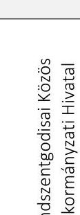 | Mindszentgodisa Községi Önkormányzat |  |
|  | Bakóca Községi Önkormányzat | $x$ |
|  | Baranyajenő Község Önkormányzat | $x$ |
|  | Kisbeszterce Községi Önkormányzat | $x$ |
|  | Kishajmás Községi Önkormányzat | $x$ |
|  | Szágy Községi Önkormányzat | $x$ |
|  | Tormás Községi Önkormányzat | $x$ |
| 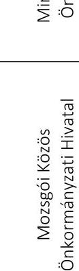 | Mozsgó Községi Önkormányzat |  |
|  | Almáskeresztúr Községi Önkormányzat |  |
|  | Csertő Községi Önkormányzat |  |
|  | Magyarlukafa Község Önkormányzata |  |
|  | Somogyhárságy Község Önkormányzata |  |
|  | Szulimán Község Önkormányzata |  |
|  | Vásárosbéc Község Önkormányzata |  |
|  | Nagydobsza Község Önkormányzata | $x$ |
|  | Kistamási Község Önkormányzata | $x$ |
|  | Merenye Község Önkormányzata | $x$ |
|  | Molvány Község Önkormányzata | $x$ |
|  | Nemeske Község Önkormányzata | $x$ |
|  | Pettend Község Önkormányzata | $x$ |
|  | Tótszentgyörgy Község Önkormányzata | $x$ |
| 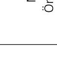 | Nagynyárád Község Önkormányzata |  |
|  | Bezedek Községi Önkormányzat |  |
|  | Ivándárda Községi Önkormányzat |  |
|  | Kölked Község Önkormányzata |  |
|  | Lippó Községi Önkormányzat |  |
|  | Sárok Községi Önkormányzat | $x$ |
|  | Sátorhely Község Önkormányzata | $\longrightarrow$ |

---

|  | A jogszabályok által elóírt alapvető integritás kontroll kiépítettsége az önkormányzatoknál | Az önkormányzat a teljes ellenőrzött időszakban az Mötv. 53. § (1) bekezdésével összhangban rendelkezett-e SZMSZszel?   Amennyiben rendelkezett, az tartalmában a jogszabályi előírások alapján szabályszerű volt-e? |
| :--: | :--: | :--: |
| 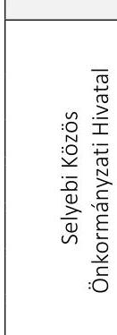 | Selyeb Község Önkormányzata |  |
|  | Abaújlak Község Önkormányzata |  |
|  | Abaújszolnok Község Önkormányzata |  |
|  | Gagybátor Községi Önkormányzat |  |
|  | Gagyvendégi Községi Önkormányzat |  |
|  | Pamlény Község Önkormányzata |  |
|  | Szászfa Község Önkormányzata |  |
| 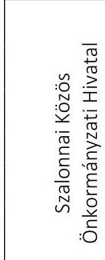 | Szalonna Község Önkormányzata |  |
|  | Debréte Község Önkormányzata |  |
|  | Martonyi Község Önkormányzata |  |
|  | Meszes Község Önkormányzata |  |
|  | Rakaca Község Önkormányzata |  |
|  | Rakacaszend Község Önkormányzata |  |
|  | Viszló Község Önkormányzata |  |
| 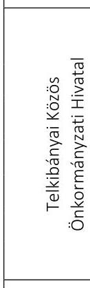 | Telkibánya Község Önkormányzata |  |
|  | Fony Község Önkormányzata | $\times$ |
|  | Hejce Község Önkormányzata | $\times$ |
|  | Kéked Község Önkormányzata |  |
|  | Mogyoróska Község Önkormányzata | $\times$ |
|  | Pányok Község Önkormányzata |  |
|  | Regéc Község Önkormányzata | $\times$ |
| 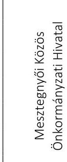 | Mesztegnyő Község Önkormányzata |  |
|  | Csömend Községi Önkormányzat |  |
|  | Gadány Község Önkormányzata |  |
|  | Hosszúvíz Község Önkormányzata |  |
|  | Nikla Községi Önkormányzat |  |
|  | Tapsony Község Önkormányzata |  |
|  | Kelevíz Község Önkormányzata |  |

---

|  | A jogszabályok által előírt alapvető integritás kontroll kiépitettsége az önkormányzatoknál | Az önkormányzat a teljes ellenőrzött időszakban   az Mötv. 53. § (1) bekezdésével összhangban rendelkezett-e SZMSZszel?   Amennyiben rendelkezett, az tartalmában a jogszabályi elöírások alapján szabályszerű volt-e? |
| :--: | :--: | :--: |
| Törökkoppányi Közös Önkormányzati Hivatal | Törökkoppány Község Önkormányzata |  |
|  | Bonnya Község Önkormányzata |  |
|  | Kára Község Önkormányzata |  |
|  | Miklósi Község Önkormányzata |  |
|  | Somogyacsa Község Önkormányzata |  |
|  | Somogydöröcske Község Önkormányzata |  |
|  | Szorosad Község Önkormányzata |  |
| Csarodai Közös Önkormányzati Hivatal | Csaroda Község Önkormányzata |  |
|  | Gelénes Község Önkormányzata |  |
|  | Hetefejércse Község Önkormányzata |  |
|  | Tiszaszalka Község Önkormányzata |  |
|  | Tiszavid Község Önkormányzata |  |
|  | Tákos Község Önkormányzata |  |
|  | Vámosatya Község Önkormányzata |  |
| Balogunyomi Közös Önkormányzati Hivatal | Balogunyom Község Önkormányzata |  |
|  | Gyanógeregye Község Önkormányzata |  |
|  | Kisunyom Község Önkormányzata |  |
|  | Nemeskolta Község Önkormányzata |  |
|  | Sorkifalud Község Önkormányzata |  |
|  | Sorkikápolna Község Önkormányzata |  |
|  | Sorokpolány Község Önkormányzata |  |
| Ivánti Közös Önkormányzati Hivatal | Ivánc Község Önkormányzata |  |
|  | Felsőmarác Község Önkormányzata |  |
|  | Hegyhátszentmárton Község Önkormányzata |  |
|  | Községi Önkormányzat Kisrákos |  |
|  | Községi Önkormányzat Pankasz |  |
|  | Községi Önkormányzat Viszák |  |
|  | Szaknyér Község Önkormányzata |  |

---

|  | A jogszabályok által elóírt alapvető integritás kontroll kiépítettsége az önkormányzatoknál | Az önkormányzat a teljes ellenőrzött időszakban   az Mötv. 53. § (1) bekezdésével összhangban rendelkezett-e SZMSZszel?   Amennyiben rendelkezett, az tartalmában a jogszabályi előírások alapján szabályszerű volt-e? |
| :--: | :--: | :--: |
|  | Kenyeri Községi Önkormányzat |  |
|  | Csönge Község Önkormányzata |  |
|  | Kemenesmagasi Községi Önkormányzat | $x$ |
|  | Kemenesszentmárton Község Önkormányzata | $x$ |
|  | Pápoc Község Önkormányzata |  |
|  | Szergény Községi Önkormányzat |  |
|  | Vönöck Község Önkormányzata |  |
|  | Molnaszecsőd Község Önkormányzata |  |
|  | Döbörhegy Községi Önkormányzat |  |
|  | Döröske Községi Önkormányzat |  |
|  | Halastó Községi Önkormányzat |  |
|  | Magyarszecsőd Község Önkormányzata |  |
|  | Nagymizdó Községi Önkormányzat |  |
|  | Szarvaskend Községi Önkormányzat |  |
|  | Nádasd Községi Önkormányzat |  |
|  | Daraboshegy Községi Önkormányzat |  |
|  | Halogy Községi Önkormányzat |  |
|  | Hegyháthodász Községi Önkormányzat |  |
|  | Hegyhátsál Községi Önkormányzat |  |
|  | Katafa Községi Önkormányzat |  |
|  | Szőce Községi Önkormányzat |  |
|  | Vasalja Községi Önkormányzat |  |
|  | Harasztifalu Község Önkormányzata |  |
|  | Kemestaródfa Községi Önkormányzat |  |
|  | Magyarnádalja Községi Önkormányzat |  |
|  | Nagykölked Község Önkormányzata |  |
|  | Pinkamindszent Községi Önkormányzat |  |
|  | Rádóckölked Község Önkormányzata |  |

---

|  | A jogszabályok által előírt alapvető integritás kontroll kiépitettsége az önkormányzatoknál | Az önkormányzat a teljes ellenőrzött időszakban   az Mötv. 53. § (1) bekezdésével összhangban rendelkezett-e SZMSZszel?   Amennyiben rendelkezett, az tartalmában a jogszabályi elöírások alapján szabályszerű volt-e? |
| :--: | :--: | :--: |
| 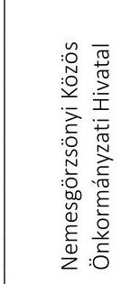 | Nemesgörzsöny Község Önkormányzata |  |
|  | Békás Község Önkormányzata |  |
|  | Kemeneshögyész Község Önkormányzata |  |
|  | Kemenesszentpéter Község Önkormányzata |  |
|  | Magyargencs Község Önkormányzata |  |
|  | Mezölak Község Önkormányzata |  |
|  | Nagyacsád Község Önkormányzata |  |
|  | Ugod Község Önkormányzata |  |
|  | Bakonykoppány Község Önkormányzata |  |
|  | Bakonyszücs Község Önkormányzata |  |
|  | Bakonyság Község Önkormányzata |  |
|  | Béb Község Önkormányzata |  |
|  | Lovászpatona Község Önkormányzata |  |
|  | Nagytevel Község Önkormányzata |  |
|  | Csömödér Község Önkormányzata |  |
|  | Barlahida Község Önkormányzata |  |
|  | Hernyék Község Önkormányzata |  |
|  | Iklödbördöce Község Önkormányzata |  |
|  | Kissziget Község Önkormányzata |  |
|  | Mikekarácsonyfa Község Önkormányzata |  |
|  | Zebecke Község Önkormányzata |  |
|  | Zalaapáti Község Önkormányzata |  |
|  | Bókaháza Község Önkormányzata |  |
|  | Dióskál Község Önkormányzata |  |
|  | Egeraracsa Község Önkormányzata |  |
|  | Esztergályhorváti Község Önkormányzata |  |
|  | Gétye Község Önkormányzata |  |
|  | Zalaszentmárton Község Önkormányzata |  |

---

|  | A jogszabályok által elóírt alapvető integritás kontroll kiépítettsége az önkormányzatoknál | Az önkormányzat a teljes ellenőrzött időszakban   az Mötv. 53. § (1) bekezdésével összhangban rendelkezett-e SZMSZszel?   Amennyiben rendelkezett, az tartalmában a jogszabályi előírások alapján szabályszerű volt-e? |
| :--: | :--: | :--: |
|  | Zalabaksa Község Önkormányzata |  |
|  | Kálócfa Község Önkormányzata |  |
|  | Kerkabarabás Község Önkormányzata |  |
|  | Kozmadombja Község Önkormányzata |  |
|  | Pórszombat Község Önkormányzata |  |
|  | Pusztaapáti Község Önkormányzata |  |
|  | Szilvágy Község Önkormányzata |  |

---

# IV. SZ. MELLÉKLET: INTÉZKEDÉST IGÉNYLŐ MEGÁLLAPÍTÁSOK 

1. A közös önkormányzati hivatal az Áht. 10. § (5) bekezdésében foglaltak ellenére nem rendelkezett szervezeti és müködési szabályzattal.

Diósviszlói Közös Önkormányzati Hivatal | Híricsi Közös Önkormányzati Hivatal* | Selyebi Közös Önkormányzati Hivatal |
| :-- | :-- | :-- |

Szalonnai Közös Önkormányzati Hivatal | Csömödéri Közös Önkormányzati Hivatal | Zalaapáti Közös Önkormányzati Hivatal |
| :-- | :-- | :-- |

Zalabaksai Közös Önkormányzati Hivatal

| 2. A közös önkormányzati hivatal szervezeti és müködési szabályzata nem felelt meg az Ávr. és/vagy a Vnytv. előírásainak. |  |  |
| :--: | :--: | :--: |
| Mindszentgodisai Közös Önkormányzati Hiva-   tal | Nagydobszai Közös Önkormányzati Hivatal | Nagynyárádi Közös Önkormányzati Hivatal |
| Telkibányai Közös Önkormányzati Hivatal | Mesztegnyői Közös Önkormányzati Hivatal | Törökkoppányi Közös Önkormányzati Hivatal |
| Csarodai Közös Önkormányzati Hivatal | Ivánci Közös Önkormányzati Hivatal | Nemesgörzsönyi Közös Önkormányzati Hivatal |
| 3. Az önkormányzat képviselő-testülete a Mötv. 53. § (1) bekezdésében foglaltak ellenére nem rendelkezett szervezeti és müködési szabály-   zattal. |  |  |
| Diósviszló Község Önkormányzata | Babarcszőlős Községi Önkormányzat | Bisse Községi Önkormányzat |
| Garé Község Önkormányzata | Kisdér Községi Önkormányzata | Rádfalva Község Önkormányzat |
| Siklósbodony Községi Önkormányzat | Hírics Községi Önkormányzat | Kemse Község Önkormányzata |
| Kórós Község Önkormányzata | Lúzsok Községi Önkormányzat | Páprád Községi Önkormányzat |
| Vejti Községi Önkormányzat | Zaláta Község Önkormányzata | Mindszentgodisa Községi Önkormányzat |
| Nagynyárád Község Önkormányzata | Kölked Község Önkormányzata | Sátorhely Község Önkormányzata |
| Zalaszentmárton Község Önkormányzata | Törökkoppány Község Önkormányzata | Bonnya Község Önkormányzata |
| Kára Község Önkormányzata | Miklósi Község Önkormányzata | Somogyacsa Község Önkormányzata |
| Somogydöröcske Község Önkormányzata | Szorosad Község Önkormányzata | Békás Község Önkormányzata |
| Ugod Község Önkormányzata | Bakonykoppány Község Önkormányzata | Bakonyszúcs Község Önkormányzata |
| Béb Község Önkormányzata | Nagytevel Község Önkormányzata | Csömödér Község Önkormányzata |
| Barlahida Község Önkormányzata | Hernyék Község Önkormányzata | Kissziget Község Önkormányzata |
| Mikekarácsonyfa Község Önkormányzata | Zebecke Község Önkormányzata | Zalaapáti Község Önkormányzata |
| Bókaháza Község Önkormányzata | Dióskál Község Önkormányzata | Egeraracsa Község Önkormányzata |
| Esztergályhorváti Község Önkormányzata | Gétye Község Önkormányzata | - |
| 4. Az önkormányzat képviselő-testületének szervezeti és müködési szabályzatában nem került meghatározásra a Vnytv. 4. § d) bekezdésében   előírtak ellenére a vagyonnyilatkozattételre kötelezettek teljes köre |  |  |
| Csányoszró Község Önkormányzata | Besence Község Önkormányzata | Gilvánfa Község Önkormányzata |
| Kisasszonyfa Község Önkormányzata | Magyarmecske Község Önkormányzata | Magyartelek Község Önkormányzata |
| Nagycsány Község Önkormányzata | Bakóca Községi Önkormányzat | Baranyajenő Község Önkormányzat |
| Kisbeszterce Községi Önkormányzat | Kishajmás Községi Önkormányzat | Szágy Községi Önkormányzat |
| Tormás Községi Önkormányzat | Nagydobsza Község Önkormányzata | Kistamási Község Önkormányzata |
| Merenye Község Önkormányzata | Molvány Község Önkormányzata | Nemeske Község Önkormányzata |
| Pettend Község Önkormányzata | Tótszentgyörgy Község Önkormányzata | Sárok Községi Önkormányzat |
| Fony Község Önkormányzata | Hejce Község Önkormányzata | Mogyoróska Község Önkormányzata |
| Pányok Község Önkormányzata | Regéc Község Önkormányzata | Kemenesmagasi Községi Önkormányzat |
| Kemenesszentmárton Község Önkormányzata | — | — |
| 5. A közös önkormányzati hivatalok jegyzői a Bkr. 6. § (4) bekezdésében előírtak ellenére nem szabályozták a szervezeti integritást sértő ese-   mények kezelésének eljárásrendjét. |  |  |
| Csányoszrói Közös Önkormányzati Hivatal | Nagynyárádi Közös Önkormányzati Hivatal | Nemesgörzsönyi Közös Önkormányzati Hivatal |
| Diósviszlói Közös Önkormányzati Hivatal | Mozsgói Közös Önkormányzati Hivatal | Ugodi Közös Önkormányzati Hivatal |
| Híricsi Közös Önkormányzati Hivatal* | Telkibányai Közös Önkormányzati Hivatal | Nagydobszai Közös Önkormányzati Hivatal |
| Mindszentgodisai Közös Önkormányzati Hiva-   tal | Mesztegnyői Közös Önkormányzati Hivatal | Zalabaksai Közös Önkormányzati Hivatal |

[^0]
[^0]:    * A Híricsi Közös Önkormányzati Hivatal 2019. december 31. napjával megszűnt, ezért javaslatot nem fogalmazott meg az ÁSZ.

---

| 6. A közös önkormányzati hivatalok jegyzői nem a Bkr. 6. § (4a) bekezdésében előírtaknak megfelelően szabályozták a szervezeti integritást sértő események kezelésének eljárásrendjét. |  |  |
| :--: | :--: | :--: |
| Vasaljai Közös Önkormányzati Hivatal | Molnaszecsődi Közös Önkormányzati Hiva-   tal | Nádasdi Közös Önkormányzati Hivatal |
| Balogunyomi Közös Önkormányzati Hivatal ${ }^{\dagger}$ | — | — |
| 7. A közös önkormányzati hivatalok jegyzői a Bkr. 6. § (4) bekezdésében előírtak ellenére nem szabályozták az integrált kockázatkezelés eljárásrendjét. |  |  |
| Csányoszrói Közös Önkormányzati Hivatal | Nagynyárádi Közös Önkormányzati Hivatal | Nemesgörzsönyi Közös Önkormányzati Hivatal |
| Diósviszlói Közös Önkormányzati Hivatal | Selyebi Közös Önkormányzati Hivatal | Ugodi Közös Önkormányzati Hivatal |
| Híricsi Közös Önkormányzati Hivatal ${ }^{\ddagger}$ | Mesztegnyői Közös Önkormányzati Hivatal | Zalabaksai Közös Önkormányzati Hivatal |
| Mindszentgodisai Közös Önkormányzati Hiva-   tal | Nagydobszai Közös Önkormányzati Hivatal | — |

[^0]
[^0]:    ${ }^{\dagger}$ A Balogunyomi Közös Önkormányzati Hivatal 2019. december 31. napjával megszűnt, ezért javaslatot nem fogalmazott meg az ÁSZ.
    ${ }^{\ddagger}$ A Híricsi Közös Önkormányzati Hivatal 2019. december 31. napjával megszűnt, ezért javaslatot nem fogalmazott meg az ÁSZ.

---

.

---

# FÜGGELÉK: ÉSZREVÉTELEK 

A jelentéstervezetet a Számvevőszék 15 napos észrevételezésre megküldte az ellenőrzött szervezetek vezetőinek az ÁSZ tv. 29. §5 (1) bekezdése előírásának megfelelően.

Bakonykoppány Község Önkormányzata polgármestere, Bakonyszücs Község Önkormányzata polgármestere, Béb Község Önkormányzata polgármestere, Békás Község Önkormányzata polgármestere, Besence Község Önkormányzata polgármestere, Bókaháza Község Önkormányzata polgármestere, Csányoszró Község Önkormányzata polgármestere, Dióskál Község Önkormányzata polgármestere, Egeraracsa Község Önkormányzata polgármestere, Esztergályhorváti Község Önkormányzata polgármestere, Gétye Község Önkormányzata polgármestere, Gilvánfa Község Önkormányzata polgármestere, Kemenesmagasi Községi Önkormányzat polgármestere, Kemenesszentmárton Község Önkormányzata polgármestere, Kisasszonyfa Község Önkormányzata polgármestere, Magyarmecske Község Önkormányzata polgármestere, Magyartelek Község Önkormányzata polgármestere, a Molnaszecsődi Közös Önkormányzati Hivatal jegyzője, Nagytevel Község Önkormányzata polgármestere, Ugod Község Önkormányzata polgármestere, a Zalaapáti Közös Önkormányzati Hivatal jegyzője, Zalaapáti Község Önkormányzata polgármestere, valamint Zalaszentmárton Község Önkormányzata polgármestere a jelentéstervezet megállapításaira észrevételt tett. Az Önkormányzatok, Közös Önkormányzati Hivatalok figyelembe nem vett észrevételeit és az elutasítás indokát a függelék tartalmazza.

[^0]
[^0]:    § 29. § (1) Az Állami Számvevőszék az ellenőrzési megállapításait megküldi az ellenőrzött szervezet vezetőjének vagy az általa megbízott személynek, és annak, akinek személyes felelősségét állapította meg.
    (2) Az ellenőrzött szervezet vezetője és a felelősként megjelölt személy az ellenőrzés megállapításaira tizenöt napon belül írásban észrevételt tehet.
    (3) Az Állami Számvevőszék az észrevételre a beérkezésétől számított harminc napon belül írásban válaszol. A figyelembe nem vett észrevételeket köteles a jelentésben feltüntetni, és megindokolni, hogy azokat miért nem fogadta el.

---

Az Állami Számvevőszék (továbbiakban: ÁSZ) az ellenőrzési megállapításait az ellenőrzött szervezet közreműködési kötelezettsége keretében, az ellenőrzési adatszolgáltatás során a részére törvényi határidőben rendelkezésre bocsátott, az ellenőrzött szervezet által Teljességi és hitelességi nyilatkozattal alátámasztott hiteles dokumentumokra alapozva fogalmazta meg.

# Bakonykoppány Község Önkormányzata 

Az Önkormányzat polgármestere észrevételt tett a számvevőszéki jelentéstervezet IV. számú melléklet 3. pontjának megállapítására, valamint a kapcsolódó javaslatra.
Bakonykoppány Község Önkormányzata (továbbiakban: Önkormányzat) polgármesterének észrevétele szerint az Önkormányzat Képviselő-testülete rendelkezik a Magyarország helyi önkormányzatairól szóló 2011. évi CLXXXIX. törvény 53. § (1) bekezdése szerinti Szervezeti és Működési Szabályzattal, amit az ellenőrzés során az Állami Számvevőszék (továbbiakban: ÁSZ) rendelkezésére bocsátottak.
Az ÁSZ az EL-1965-003/2019. iktatószámú levelében bekérte az Önkormányzat aláírt és hiteles Szervezeti és Múködési Szabályzatáról szóló önkormányzati rendeletét, amit az Önkormányzat polgármestere 2019. szeptember 4-én kelt nyilatkozata szerint az ellenőrzés rendelkezésére bocsátott. A polgármester nyilatkozata szerint megküldött Szervezeti és Múködési Szabályzat vizsgálata alapján az ÁSZ megállapította, hogy az tartalmazza Bakonykoppány Község Önkormányzata Képviselő-testületének 11/2017. (IX. 25.) számú, az Önkormányzat Szervezeti és Múködési Szabályzatáról szóló 8/2013. (VI. 28.) számú önkormányzati rendeletének módosításáról szóló aláírt és hiteles rendeletét, valamint az Önkormányzat Szervezeti és Múködési Szabályzatáról szóló 8/2013. (VI. 28.) számú önkormányzati rendeletét, amelynek aláírása nem történt meg, így az nem minősül hiteles dokumentumnak, ezért azt az ÁSZ nem értékelte ellenőrzési bizonyítékként.
Az ÁSZ ellenőrzési megállapításait kizárólag az Állami Számvevőszékről szóló 2011. évi LXVI. törvény 28. § (2) bekezdésben meghatározott adatszolgáltatási időszakon belül megküldött, teljességi és hitelességi nyilatkozattal alátámasztott dokumentumokra alapozva teszi. Az Önkormányzat polgármestere nyilatkozott az adatszolgáltatás során arról, hogy az ÁSZ részére átadott dokumentumok, adatok megbízhatóak, és a bekért adatokra, dokumentumokra vonatkozóan teljes körű információt tartalmaznak.

A fentiekre tekintettel a jelentéstervezet megállapításai helytállóak, módosításuk nem indokolt.

## Bakonyszücs Község Önkormányzata

Az Önkormányzat polgármestere észrevételt tett a számvevőszéki jelentéstervezet IV. számú melléklet 3. pontjának megállapítására, valamint a kapcsolódó javaslatra.
Bakonyszücs Község Önkormányzata (továbbiakban: Önkormányzat) polgármesterének észrevétele szerint az Önkormányzat Képviselő-testülete rendelkezik a Magyarország helyi önkormányzatairól szóló 2011. évi CLXXXIX. törvény 53. § (1) bekezdése szerinti Szervezeti és Múködési Szabályzattal, amit az ellenőrzés során az Állami Számvevőszék (továbbiakban: ÁSZ) rendelkezésére bocsátottak.
Az ÁSZ az EL-1965-004/2019. iktatószámú levelében bekérte az Önkormányzat aláírt és hiteles Szervezeti és Múködési Szabályzatáról szóló önkormányzati rendeletét, amit az akkor hivatalban volt polgármester 2019. szeptember 4én kelt nyilatkozata szerint az ellenőrzés rendelkezésére bocsátott. A nyilatkozat szerint megküldött Szervezeti és Múködési Szabályzat vizsgálata alapján az ÁSZ megállapította, hogy az tartalmazza Bakonyszücs Község Önkormányzata Képviselő-testületének 10/2018. (XI. 20.) számú, az Önkormányzat Szervezeti és Múködési Szabályzatáról szóló 7/2013. (VI. 28.) számú önkormányzati rendeletének módosításáról szóló aláírt és hiteles rendeletét, valamint az Önkormányzat Szervezeti és Múködési Szabályzatáról szóló 7/2013. (VI. 28.) számú önkormányzati rendeletét, amelynek aláírása nem történt meg, így az nem minősül hiteles dokumentumnak, ezért azt az ÁSZ nem értékelte ellenőrzési bizonyítékként.
Az ÁSZ ellenőrzési megállapításait kizárólag az Állami Számvevőszékről szóló 2011. évi LXVI. törvény 28. § (2) bekezdésben meghatározott adatszolgáltatási időszakon belül megküldött, teljességi és hitelességi nyilatkozattal alátámasztott dokumentumokra alapozva teszi. Az Önkormányzat polgármestere nyilatkozott az adatszolgáltatás során arról, hogy az ÁSZ részére átadott dokumentumok, adatok megbízhatóak, és a bekért adatokra, dokumentumokra vonatkozóan teljes körű információt tartalmaznak.

A fent leírtakra tekintettel a jelentéstervezet megállapításai helytállóak, módosításuk nem indokolt.

---

# Béb Község Önkormányzata 

Az Önkormányzat polgármestere észrevételt tett a számvevőszéki jelentéstervezet IV. számú melléklet 3. pontjának megállapítására, valamint a kapcsolódó javaslatra.
Béb Község Önkormányzata (továbbiakban: Önkormányzat) polgármesterének észrevétele szerint az Önkormányzat Képviselő-testülete rendelkezik a Magyarország helyi önkormányzatairól szóló 2011. évi CLXXXIX. törvény 53. § (1) bekezdése szerinti Szervezeti és Müködési Szabályzattal, amit az ellenőrzés során az Állami Számvevőszék (továbbiakban: ÁSZ) rendelkezésére bocsátottak.
Az ÁSZ az EL-1965-006/2019. iktatószámú levelében bekérte az Önkormányzat aláírt és hiteles Szervezeti és Müködési Szabályzatáról szóló önkormányzati rendeletét, amit az Önkormányzat polgármestere 2019. szeptember 4-én kelt nyilatkozata szerint az ellenőrzés rendelkezésére bocsátott. A polgármester nyilatkozata szerint megküldött Szervezeti és Müködési Szabályzat vizsgálata alapján az ÁSZ megállapította, hogy az tartalmazza Béb Község Önkormányzata Képviselő-testületének 7/2018. (XI. 15.) számú, az Önkormányzat Szervezeti és Müködési Szabályzatáról szóló 9/2013. (VI. 28.) számú önkormányzati rendeletének módosításáról szóló aláírt és hiteles rendeletét, valamint az Önkormányzat Szervezeti és Müködési Szabályzatáról szóló 9/2013. (VI. 28.) számú önkormányzati rendeletét, amelynek aláírása nem történt meg, így az nem minősül hiteles dokumentumnak, ezért azt az ÁSZ nem értékelte ellenőrzési bizonyítékként.
Az ÁSZ ellenőrzési megállapításait kizárólag az Állami Számvevőszékről szóló 2011. évi LXVI. törvény 28. § (2) bekezdésben meghatározott adatszolgáltatási időszakon belül megküldött, teljességi és hitelességi nyilatkozattal alátámasztott dokumentumokra alapozva teszi. Az Önkormányzat polgármestere nyilatkozott az adatszolgáltatás során arról, hogy az ÁSZ részére átadott dokumentumok, adatok megbízhatóak, és a bekért adatokra, dokumentumokra vonatkozóan teljes körű információt tartalmaznak.

A fent leírtakra tekintettel a jelentéstervezet megállapításai helytállóak, módosításuk nem indokolt.

## Békás Község Önkormányzata

Az Önkormányzat polgármestere észrevételt tett a számvevőszéki jelentéstervezet IV. számú melléklet 3. pontjában foglalt, a szervezeti és müködési szabályzattal kapcsolatos megállapítására.
Az Állami Számvevőszék az EL-1964-003/2019. iktatószámú adatbekérő levélben kérte Békás Község Önkormányzata (továbbiakban: Önkormányzat) 2018. évben hatályos önkormányzati szervezeti és müködési szabályzatáról (továbbiakban: SZMSZ) szóló önkormányzati rendelet átadását. Az Önkormányzat polgármestere a 2019. szeptember 4-i keltezésű teljességi és hitelességi nyilatkozattal - amelyben az átadott dokumentumok, adatok megbízhatóságáról és teljes körűségéről nyilatkozott - az „SZMSZ 14-2014. (XII.15.) .pdf", az „SZMSZ mód 3-2015.(III.1.) .pdf" és az „SZMSZ mód 5-2015.(V.4.) .pdf" elnevezésű dokumentumokat adta át. Az Állami Számvevőszék ellenőrzési megállapításait az ellenőrzési adatbekérés során határidőben átadott, a teljességi és hitelességi nyilatkozatban feltüntetett, hiteles dokumentumok alapján tette meg.
Magyarország helyi önkormányzatairól szóló 2011. évi CLXXXIX. törvény (továbbiakban: Mötv.) 51. § (1) bekezdése szerint „A helyi önkormányzat képviselő-testülete által megalkotott rendeletet a polgármester és a jegyző írja alá." Ezen túl a közfeladatot ellátó szervek iratkezelésének általános követelményeiről szóló 335/2005. (XII. 29.) Korm. rendelet (továbbiakban: kormányrendelet) 53. § (1) bekezdése a hiteles kiadmánnyal szemben támasztott követelményekről rendelkezik. Az ellenőrzés részére „SZMSZ 14-2014. (XII.15.) .pdf", az „SZMSZ mód 3-2015.(III.1.) .pdf" és az „SZMSZ mód 5-2015.(V.4.) .pdf" elnevezéssel átadott dokumentumok nem felelnek meg

- sem az Mötv. 51. § (1) bekezdésének, mivel azokon nem szerepel a polgármester aláírása,
- sem a kormányrendelet 53. § (1) bekezdés a) pontja előírásának, mivel a dokumentumokon nem szerepel a kiadmányozási joggal rendelkező személy saját kezű aláírása és a szerv hivatalos bélyegzőlenyomata;
- sem a kormányrendelet 53. § (1) bekezdés b) pontja előírásának, mivel a dokumentumokon a hitelesítésre felhatalmazott személy saját kezű aláírása és a szerv hivatalos bélyegzőlenyomata mellett, a kiadmányozási joggal rendelkező személy neve mellett nem szerepel az „s. k." jelzés.
Mindezek alapján az ellenőrzött szervezet vezetője nem igazolta, hogy az Önkormányzat képviselő-testülete rendelkezett az Mötv. 53. § (1) bekezdése szerinti szervezeti és müködési szabályzattal.

A fent leírtakra tekintettel az észrevétel elfogadása, a jelentéstervezet megállapításának módosítása nem indokolt.

---

# Besence Község Önkormányzata 

Az Önkormányzat polgármestere észrevételt tett a számvevőszéki jelentéstervezet IV. számú melléklet 4. pontjában foglalt, a szervezeti és múködési szabályzattal kapcsolatos megállapítására.
Az Állami Számvevőszék az EL-1938-003/2019. iktatószámú adatbekérő levélben kérte Besence Község Önkormányzata (továbbiakban: Önkormányzat) 2018. évben hatályos önkormányzati szervezeti és múködési szabályzatáról (továbbiakban: SZMSZ) szóló önkormányzati rendelet átadását. Az Önkormányzat akkor hivatalban volt polgármestere a 2019. augusztus 30-i keltezésű teljességi és hitelességi nyilatkozattal - amelyben az átadott dokumentumok, adatok megbízhatóságáról és teljes körűségéről nyilatkozott - a „Besence I.1SZMSZrol szóló önk.rend..pdf" elnevezésű dokumentumot adta át. Az Állami Számvevőszék ellenőrzési megállapításait az ellenőrzési adatbekérés során határidőben átadott, a teljességi és hitelességi nyilatkozatban feltüntetett, hiteles dokumentumok alapján tette meg.
A jelentéstervezet megállapításával érintett, az Önkormányzat Képviselő-testülete Szervezeti és Múködési Szabályzatáról szóló önkormányzati rendelet ismételt felülvizsgálata során megállapítottuk, hogy az a polgármester vagyonnyilatkozat tételi kötelezettsége vonatkozásában tartalmaz rendelkezést. Az egyes vagyonnyilatkozat-tételi kötelezettségekről szóló 2007. évi CLII. törvény (továbbiakban: Vnytv.) 4. § d) pontjában foglaltak szerint azonban az őket ilyen minőségükben alkalmazó szervezet szervezeti és múködési szabályzatában fel kell tüntetni a vagyonnyilatkozattételi kötelezettséget más, a közszolgálatban nem álló személy vonatkozásában is, aki - önállóan vagy testület tagjaként - javaslattételre, döntésre, illetve ellenőrzésre jogosult.
A polgármester észrevétele szerint a polgármester és a helyi képviselők vagyonnyilatkozatára nem terjed ki a Vnytv. hatálya. A Vnytv. 1. § (1) bekezdése szerint kötelezett az, aki a 3. §-ban felsorolt feladatot lát el, tisztséget, illetve munkakört tölt be. A Vnytv. 3. § (3) bekezdés e) pontja előírja, hogy vagyonnyilatkozat tételére kötelezett az a közszolgálatban nem álló személy, aki - önállóan vagy testület tagjaként - javaslattételre, döntésre, illetve ellenőrzésre jogosult.
A Vnytv. 4. § a) pontjában foglalt rendelkezésre vonatkozóan a jelentéstervezet nem tartalmaz megállapítást az Önkormányzat vonatkozásában. A jelentéstervezet szerinti intézkedést igénylő megállapítás arra vonatkozik, hogy az Önkormányzat képviselő-testületének szervezeti és múködési szabályzatában nem került meghatározásra a Vnytv. 4. § d) bekezdésében előírtak ellenére a vagyonnyilatkozattételre kötelezettek teljes köre.

Mindezek alapján az ellenőrzött szervezet vezetője nem igazolta, hogy az Önkormányzat Képviselő-testületének szervezeti és múködési szabályzatában meghatározásra került a Vnytv. 4. § d) bekezdésében előírtaknak megfelelően a vagyonnyilatkozattételre kötelezettek teljes köre.

A fent leírtakra tekintettel az észrevétel elfogadása, a jelentéstervezet megállapításának módosítása nem indokolt.

## Bókaháza Község Önkormányzata

Az Önkormányzat polgármestere észrevételt tett a számvevőszéki jelentéstervezet IV. számú melléklet 3. pontjában foglalt, a szervezeti és múködési szabályzattal kapcsolatos megállapítására.
Az Állami Számvevőszék az EL-1967-003/2019. iktatószámú adatbekérő levélben kérte Bókaháza Község Önkormányzata (továbbiakban: Önkormányzat) 2018. évben hatályos önkormányzati szervezeti és múködési szabályzatáról szóló önkormányzati rendelet átadását. Az Önkormányzat polgármestere 2019. szeptember 3-i keltezésű teljességi és hitelességi nyilatkozatában az átadott dokumentumok, adatok megbízhatóságáról és teljes körűségéről nyilatkozott. Az Állami Számvevőszék ellenőrzési megállapításait az ellenőrzési adatbekérés során határidőben átadott, a teljességi és hitelességi nyilatkozatban feltüntetett, hiteles dokumentumok alapján tette meg.
Magyarország helyi önkormányzatairól szóló 2011. évi CLXXXIX. törvény (továbbiakban: Mötv.) 51. § (1) bekezdése szerint „A helyi önkormányzat képviselő-testülete által megalkotott rendeletet a polgármester és a jegyző írja alá." Ezen túl a közfeladatot ellátó szervek iratkezelésének általános követelményeiről szóló 335/2005. (XII. 29.) Korm. rendelet (továbbiakban: kormányrendelet) 53. § (1) bekezdése rendelkezik a hiteles kiadmánnyal szemben támasztott követelményekről. Az ellenőrzés részére átadott dokumentum nem felel meg

- sem az Mötv. 51. § (1) bekezdésének, mivel azon nem szerepel a jegyző és a polgármester aláírása,
- sem a kormányrendelet 53. § (1) bekezdés a) pontja előírásának, mivel a dokumentumon nem szerepel a kiadmányozási joggal rendelkező személy saját kezű aláírása és a szerv hivatalos bélyegzőlenyomata;
- sem a kormányrendelet 53. § (1) bekezdés b) pontja előírásának, mivel a dokumentumon nem szerepel a kiadmányozási joggal rendelkező személy neve mellett az „s. k." jelzés, a hitelesítésre felhatalmazott személy saját kezű aláírása és a szerv hivatalos bélyegzőlenyomata.

---

Mindezek alapján az ellenőrzött szervezet vezetője nem igazolta, hogy az Önkormányzat képviselő-testülete rendelkezett az Mótv. 53. § (1) bekezdése szerinti szervezeti és működési szabályzattal.

A leírtakra tekintettel az észrevétel elfogadása, a jelentéstervezet megállapításának módosítása nem indokolt.

# Csányoszró Község Önkormányzata 

Az Önkormányzat polgármestere észrevételt tett a számvevőszéki jelentéstervezet IV. számú melléklet 4. pontjában foglalt, a szervezeti és működési szabályzattal kapcsolatos megállapítására.
Az Állami Számvevőszék az EL-1938-002/2019. iktatószámú adatbekérő levélben kérte Csányoszró Község Önkormányzata (továbbiakban: Önkormányzat) 2018. évben hatályos önkormányzati szervezeti és működési szabályzatáról (továbbiakban: SZMSZ) szóló önkormányzati rendelet átadását. Az Önkormányzat akkor hivatalban volt polgármestere a 2019. augusztus 29-i keltezésű teljességi és hitelességi nyilatkozattal - amelyben az átadott dokumentumok, adatok megbízhatóságáról és teljes körűségéről nyilatkozott - a „Csányoszró I.1SZMSZrol önk.rendelet.pdf" elnevezésű dokumentumot adta át. Az Állami Számvevőszék ellenőrzési megállapításait az ellenőrzési adatbekérés során határidőben átadott, a teljességi és hitelességi nyilatkozatban feltüntetett, hiteles dokumentumok alapján tette meg. A jelentéstervezet megállapításával érintett, az Önkormányzat Képviselő-testülete Szervezeti és Működési Szabályzatáról szóló önkormányzati rendelet ismételt felülvizsgálata során megállapítottuk, hogy az a polgármester vagyonnyilatkozat tételi kötelezettsége vonatkozásában tartalmaz rendelkezést. Az egyes vagyonnyilatkozat-tételi kötelezettségekről szóló 2007. évi CLII. törvény (továbbiakban: Vnytv.) 4. § d) pontjában foglaltak szerint azonban az őket ilyen minőségükben alkalmazó szervezet szervezeti és működési szabályzatában fel kell tüntetni a vagyonnyilatkozattételi kötelezettséget más, a közszolgálatban nem álló személy vonatkozásában is, aki - önállóan vagy testület tagjaként - javaslattételre, döntésre, illetve ellenőrzésre jogosult.
A polgármester észrevétele szerint a polgármester és a helyi képviselők vagyonnyilatkozatára nem terjed ki a Vnytv. hatálya. A Vnytv. 1. § (1) bekezdése szerint kötelezett az, aki a 3. §-ban felsorolt feladatot lát el, tisztséget, illetve munkakört tölt be. A Vnytv. 3. § (3) bekezdés e) pontja előírja, hogy vagyonnyilatkozat tételére kötelezett az a közszolgálatban nem álló személy, aki - önállóan vagy testület tagjaként - javaslattételre, döntésre, illetve ellenőrzésre jogosult.
Továbbá a Vnytv. 4. § a) pontjában foglalt rendelkezésre vonatkozóan a jelentéstervezet nem tartalmaz megállapítást az Önkormányzat vonatkozásában. A jelentéstervezet szerinti intézkedést igénylő megállapítás arra vonatkozik, hogy az Önkormányzat képviselő-testületének szervezeti és működési szabályzatában nem került meghatározásra a Vnytv. 4. § d) bekezdésében előírtak ellenére a vagyonnyilatkozattételre kötelezettek teljes köre.

Mindezek alapján az ellenőrzött szervezet vezetője nem igazolta, hogy az Önkormányzat Képviselő-testületének szervezeti és működési szabályzatában meghatározásra került a Vnytv. 4. § d) bekezdésében előírtaknak megfelelően a vagyonnyilatkozattételre kötelezettek teljes köre.
A fent leírtakra tekintettel az észrevétel elfogadása, a jelentéstervezet megállapításának módosítása nem indokolt.

## Dióskál Község Önkormányzata

Az Önkormányzat polgármestere észrevételt tett a számvevőszéki jelentéstervezet IV. számú melléklet 3. pontjában foglalt, a szervezeti és működési szabályzattal kapcsolatos megállapítására.
Az Állami Számvevőszék az EL-1967-004/2019. iktatószámú adatbekérő levélben kérte Dióskál Község Önkormányzata (továbbiakban: Önkormányzat) 2018. évben hatályos önkormányzati szervezeti és működési szabályzatáról szóló önkormányzati rendelet átadását. Az Önkormányzat polgármestere 2019. szeptember 3-i keltezésű teljességi és hitelességi nyilatkozatában az átadott dokumentumok, adatok megbízhatóságáról és teljes körűségéről nyilatkozott. Az Állami Számvevőszék ellenőrzési megállapításait az ellenőrzési adatbekérés során határidőben átadott, a teljességi és hitelességi nyilatkozatban feltüntetett, hiteles dokumentumok alapján tette meg.
Magyarország helyi önkormányzatairól szóló 2011. évi CLXXXIX. törvény (továbbiakban: Mötv.) 51. § (1) bekezdése szerint „A helyi önkormányzat képviselő-testülete által megalkotott rendeletet a polgármester és a jegyző írja alá." Ezen túl a közfeladatot ellátó szervek iratkezelésének általános követelményeiről szóló 335/2005. (XII. 29.) Korm. rendelet (továbbiakban: kormányrendelet) 53. § (1) bekezdése rendelkezik a hiteles kiadmánnyal szemben támasztott követelményekről. Az ellenőrzés részére átadott dokumentum nem felel meg

- sem az Mötv. 51. § (1) bekezdésének, mivel azon nem szerepel a jegyző és a polgármester aláírása,

---

- sem a kormányrendelet 53. § (1) bekezdés a) pontja előírásának, mivel a dokumentumon nem szerepel a kiadmányozási joggal rendelkező személy saját kezű aláírása és a szerv hivatalos bélyegzőlenyomata;
- sem a kormányrendelet 53. § (1) bekezdés b) pontja előírásának, mivel a dokumentumon nem szerepel a kiadmányozási joggal rendelkező személy neve mellett az „s. k." jelzés, a hitelesítésre felhatalmazott személy saját kezű aláírása és a szerv hivatalos bélyegzőlenyomata.
Mindezek alapján az ellenőrzött szervezet vezetője nem igazolta, hogy az Önkormányzat képviselő-testülete rendelkezett az Mötv. 53. § (1) bekezdése szerinti szervezeti és müködési szabályzattal.

A leírtakra tekintettel az észrevétel elfogadása, a jelentéstervezet megállapításának módosítása nem indokolt.

# Egeraracsa Község Önkormányzata 

Az Önkormányzat polgármestere észrevételt tett a számvevőszéki jelentéstervezet IV. számú melléklet 3. pontjában foglalt, a szervezeti és müködési szabályzattal kapcsolatos megállapítására.
Az Állami Számvevőszék az EL-1967-005/2019. iktatószámú adatbekérő levélben kérte Egeraracsa Község Önkormányzata (továbbiakban: Önkormányzat) 2018. évben hatályos önkormányzati szervezeti és müködési szabályzatáról szóló önkormányzati rendelet átadását. Az Önkormányzat polgármestere 2019. szeptember 3-i keltezésű teljességi és hitelességi nyilatkozatában az átadott dokumentumok, adatok megbízhatóságáról és teljes körűségéről nyilatkozott. Az Állami Számvevőszék ellenőrzési megállapításait az ellenőrzési adatbekérés során határidőben átadott, a teljességi és hitelességi nyilatkozatban feltüntetett, hiteles dokumentumok alapján tette meg.
Magyarország helyi önkormányzatairól szóló 2011. évi CLXXXIX. törvény (továbbiakban: Mötv.) 51. § (1) bekezdése szerint „A helyi önkormányzat képviselő-testülete által megalkotott rendeletet a polgármester és a jegyző írja alá." Ezen túl a közfeladatot ellátó szervek iratkezelésének általános követelményeiről szóló 335/2005. (XII. 29.) Korm. rendelet (továbbiakban: kormányrendelet) 53. § (1) bekezdése rendelkezik a hiteles kiadmánnyal szemben támasztott követelményekről. Az ellenőrzés részére átadott dokumentum nem felel meg

- sem az Mötv. 51. § (1) bekezdésének, mivel azon nem szerepel a jegyző és a polgármester aláírása,
- sem a kormányrendelet 53. § (1) bekezdés a) pontja előírásának, mivel a dokumentumon nem szerepel a kiadmányozási joggal rendelkező személy saját kezű aláírása és a szerv hivatalos bélyegzőlenyomata;
- sem a kormányrendelet 53. § (1) bekezdés b) pontja előírásának, mivel a dokumentumon nem szerepel a kiadmányozási joggal rendelkező személy neve mellett az „s. k." jelzés, a hitelesítésre felhatalmazott személy saját kezű aláírása és a szerv hivatalos bélyegzőlenyomata.
Mindezek alapján az ellenőrzött szervezet vezetője nem igazolta, hogy az Önkormányzat képviselő-testülete rendelkezett az Mötv. 53. § (1) bekezdése szerinti szervezeti és müködési szabályzattal.

A fent leírtakra tekintettel az észrevétel elfogadása, a jelentéstervezet megállapításának módosítása nem indokolt.

## Esztergályhorváti Község Önkormányzata

Az Önkormányzat polgármestere észrevételt tett a számvevőszéki jelentéstervezet IV. számú melléklet 3. pontjában foglalt, a szervezeti és müködési szabályzattal kapcsolatos megállapítására.
Az Állami Számvevőszék az EL-1967-006/2019. iktatószámú adatbekérő levélben kérte Esztergályhorváti Község Önkormányzata (továbbiakban: Önkormányzat) 2018. évben hatályos önkormányzati szervezeti és müködési szabályzatáról szóló önkormányzati rendelet átadását. Az Önkormányzat polgármestere 2019. szeptember 3-i keltezésű teljességi és hitelességi nyilatkozatában az átadott dokumentumok, adatok megbízhatóságáról és teljes körűségéről nyilatkozott. Az Állami Számvevőszék ellenőrzési megállapításait az ellenőrzési adatbekérés során határidőben átadott, a teljességi és hitelességi nyilatkozatban feltüntetett, hiteles dokumentumok alapján tette meg.
Magyarország helyi önkormányzatairól szóló 2011. évi CLXXXIX. törvény (továbbiakban: Mötv.) 51. § (1) bekezdése szerint „A helyi önkormányzat képviselő-testülete által megalkotott rendeletet a polgármester és a jegyző írja alá." Ezen túl a közfeladatot ellátó szervek iratkezelésének általános követelményeiről szóló 335/2005. (XII. 29.) Korm. rendelet (továbbiakban: kormányrendelet) 53. § (1) bekezdése rendelkezik a hiteles kiadmánnyal szemben támasztott követelményekről. Az ellenőrzés részére átadott dokumentum nem felel meg

- sem az Mötv. 51. § (1) bekezdésének, mivel azon nem szerepel a jegyző és a polgármester aláírása,
- sem a kormányrendelet 53. § (1) bekezdés a) pontja előírásának, mivel a dokumentumon nem szerepel a kiadmányozási joggal rendelkező személy saját kezű aláírása és a szerv hivatalos bélyegzőlenyomata;

---

- sem a kormányrendelet 53. § (1) bekezdés b) pontja előírásának, mivel a dokumentumon nem szerepel a kiadmányozási joggal rendelkező személy neve mellett az „s. k." jelzés, a hitelesítésre felhatalmazott személy saját kezű aláírása és a szerv hivatalos bélyegzőlenyomata.
Mindezek alapján az ellenőrzött szervezet vezetője nem igazolta, hogy az Önkormányzat képviselő-testülete rendelkezett az Mötv. 53. § (1) bekezdése szerinti szervezeti és müködési szabályzattal.

A leírtakra tekintettel az észrevétel elfogadása, a jelentéstervezet megállapításának módosítása nem indokolt.

# Gétye Község Önkormányzata 

Az Önkormányzat polgármestere észrevételt tett a számvevőszéki jelentéstervezet IV. számú melléklet 3. pontjában foglalt, a szervezeti és müködési szabályzattal kapcsolatos megállapítására.
Az Állami Számvevőszék az EL-1967-007/2019. iktatószámú adatbekérő levélben kérte Gétye Község Önkormányzata (továbbiakban: Önkormányzat) 2018. évben hatályos önkormányzati szervezeti és müködési szabályzatáról szóló önkormányzati rendelet átadását. Az Önkormányzat polgármestere 2019. szeptember 3-i keltezésű teljességi és hitelességi nyilatkozatában az átadott dokumentumok, adatok megbízhatóságáról és teljes körűségéről nyilatkozott. Az Állami Számvevőszék ellenőrzési megállapításait az ellenőrzési adatbekérés során határidőben átadott, a teljességi és hitelességi nyilatkozatban feltüntetett, hiteles dokumentumok alapján tette meg.
Magyarország helyi önkormányzatairól szóló 2011. évi CLXXXIX. törvény (továbbiakban: Mötv.) 51. § (1) bekezdése szerint „A helyi önkormányzat képviselő-testülete által megalkotott rendeletet a polgármester és a jegyző írja alá." Ezen túl a közfeladatot ellátó szervek iratkezelésének általános követelményeiről szóló 335/2005. (XII. 29.) Korm. rendelet (továbbiakban: kormányrendelet) 53. § (1) bekezdése rendelkezik a hiteles kiadmánnyal szemben támasztott követelményekről. Az ellenőrzés részére átadott dokumentum nem felel meg

- sem az Mötv. 51. § (1) bekezdésének, mivel azon nem szerepel a jegyző és a polgármester aláírása,
- sem a kormányrendelet 53. § (1) bekezdés a) pontja előírásának, mivel a dokumentumon nem szerepel a kiadmányozási joggal rendelkező személy saját kezű aláírása és a szerv hivatalos bélyegzőlenyomata;
- sem a kormányrendelet 53. § (1) bekezdés b) pontja előírásának, mivel a dokumentumon nem szerepel a kiadmányozási joggal rendelkező személy neve mellett az „s. k." jelzés, a hitelesítésre felhatalmazott személy saját kezű aláírása és a szerv hivatalos bélyegzőlenyomata.
Mindezek alapján az ellenőrzött szervezet vezetője nem igazolta, hogy az Önkormányzat képviselő-testülete rendelkezett az Mötv. 53. § (1) bekezdése szerinti szervezeti és müködési szabályzattal.

A fent leírtakra tekintettel az észrevétel elfogadása, a jelentéstervezet megállapításának módosítása nem indokolt.

## Gilvánfa Község Önkormányzata

Az Önkormányzat polgármestere észrevételt tett a számvevőszéki jelentéstervezet IV. számú melléklet 4. pontjában foglalt, a szervezeti és müködési szabályzattal kapcsolatos megállapítására.
Az Állami Számvevőszék az EL-1938-004/2019. iktatószámú adatbekérő levélben kérte Gilvánfa Község Önkormányzata (továbbiakban: Önkormányzat) 2018. évben hatályos önkormányzati szervezeti és müködési szabályzatáról (továbbiakban: SZMSZ) szóló önkormányzati rendelet átadását. Az Önkormányzat polgármestere a 2019. augusztus 30i keltezésű teljességi és hitelességi nyilatkozattal - amelyben az átadott dokumentumok, adatok megbízhatóságáról és teljes körűségéről nyilatkozott - a „Gilvánfa I.1SZMSZrol szóló önk.rend..pdf" elnevezésű dokumentumot adta át. Az Állami Számvevőszék ellenőrzési megállapításait az ellenőrzési adatbekérés során határidőben átadott, a teljességi és hitelességi nyilatkozatban feltüntetett, hiteles dokumentumok alapján tette meg.
A jelentéstervezet megállapításával érintett, az Önkormányzat Képviselő-testülete Szervezeti és Müködési Szabályzatáról szóló önkormányzati rendelet ismételt felülvizsgálata során megállapítottuk, hogy az a polgármester vagyonnyilatkozat tételi kötelezettsége vonatkozásában tartalmaz rendelkezést. Az egyes vagyonnyilatkozat-tételi kötelezettségekről szóló 2007. évi CLII. törvény (továbbiakban: Vnytv.) 4. § d) pontjában foglaltak szerint azonban az őket ilyen minőségükben alkalmazó szervezet szervezeti és müködési szabályzatában fel kell tüntetni a vagyonnyilatkozattételi kötelezettséget más, a közszolgálatban nem álló személy vonatkozásában is, aki - önállóan vagy testület tagjaként - javaslattételre, döntésre, illetve ellenőrzésre jogosult.
Az Önkormányzat polgármesterének észrevétele szerint a polgármester és a helyi képviselők vagyonnyilatkozatára nem terjed ki a Vnytv. hatálya. A Vnytv. 1. § (1) bekezdése szerint kötelezett az, aki a 3. §-ban felsorolt feladatot lát el, tisztséget, illetve munkakört tölt be. A Vnytv. 3. § (3) bekezdés e) pontja előírja, hogy vagyonnyilatkozat tételére

---

kötelezett az a közszolgálatban nem álló személy, aki - önállóan vagy testület tagjaként - javaslattételre, döntésre, illetve ellenőrzésre jogosult.
A Vnytv. 4. § a) pontjában foglalt rendelkezésre vonatkozóan a jelentéstervezet nem tartalmaz megállapítást az Önkormányzat vonatkozásában. A jelentéstervezet szerinti intézkedést igénylő megállapítás arra vonatkozik, hogy az Önkormányzat képviselő-testületének szervezeti és múködési szabályzatában nem került meghatározásra a Vnytv. 4. § d) bekezdésében előírtak ellenére a vagyonnyilatkozattételre kötelezettek teljes köre.
Mindezek alapján az ellenőrzött szervezet vezetője nem igazolta, hogy az Önkormányzat Képviselő-testületének szervezeti és múködési szabályzatában meghatározásra került a Vnytv. 4. § d) bekezdésében előírtaknak megfelelően a vagyonnyilatkozattételre kötelezettek teljes köre.

A leírtakra tekintettel az észrevétel elfogadása, a jelentéstervezet megállapításának módosítása nem indokolt.

# Kemenesmagasi Községi Önkormányzat 

Az Önkormányzat polgármestere észrevételt tett a számvevőszéki jelentéstervezet IV. számú melléklet 4. pontjában foglalt, a szervezeti és múködési szabályzattal kapcsolatos megállapítására.
Az Állami Számvevőszék az EL-1954-004/2019. iktatószámú adatbekérő levélben kérte Kemenesmagasi Községi Önkormányzat (továbbiakban: Önkormányzat) 2018. évben hatályos szervezeti és múködési szabályzatáról (továbbiakban: SZMSZ) szóló önkormányzati rendelet átadását. Az Önkormányzat polgármestere a 2019. szeptember 3-i keltezésú teljességi és hitelességi nyilatkozattal - amelyben az átadott dokumentumok, adatok megbízhatóságáról és teljes körüségéről nyilatkozott - a „Kmagasi szmsz.pdf" elnevezésű dokumentumot adta át. Az Állami Számvevőszék ellenőrzési megállapításait az ellenőrzési adatbekérés során határidőben átadott, a teljességi és hitelességi nyilatkozatban feltüntetett, hiteles dokumentumok alapján tette meg.
Az Önkormányzat Szervezeti és Múködési Szabályzatának ismételt felülvizsgálata során megállapítottuk, hogy a rendelet 20. § (3) bekezdése g) pontja a vagyonnyilatkozatok nyilvántartása, kezelése és az őrzése tekintetében tartalmaz előírást, továbbá a 17. § előírásai a vagyonnyilatkozattal kapcsolatos - az abban foglaltak valóságtartalmának ellenőrzésére vonatkozó - eljárás szabályait rögzítik, azonban az egyes vagyonnyilatkozat-tételi kötelezettségekről szóló 2007. évi CLII. törvény (továbbiakban: Vnytv.) 4. § d) pontja ellenére a vagyonnyilatkozat tételére kötelezettek köre nem került meghatározásra.
Mindezek alapján az ellenőrzött szervezet vezetője nem igazolta, hogy az Önkormányzat képviselő-testületének szervezeti és múködési szabályzatában meghatározásra került a Vnytv. 4. § d) bekezdésében előírtaknak megfelelően a vagyonnyilatkozattételre kötelezettek teljes köre.

A fent leírtakra tekintettel az észrevétel elfogadása, a jelentéstervezet megállapításának módosítása nem indokolt.

## Kemenesszentmárton Község Önkormányzata

Az Önkormányzat polgármestere észrevételt tett a számvevőszéki jelentéstervezet IV. számú melléklet 4. pontjában foglalt, a szervezeti és múködési szabályzattal kapcsolatos megállapítására.
Az Állami Számvevőszék az EL-1954-005/2019. iktatószámú adatbekérő levélben kérte Kemenesszentmárton Község Önkormányzata (továbbiakban: Önkormányzat) 2018. évben hatályos szervezeti és múködési szabályzatáról (továbbiakban: SZMSZ) szóló önkormányzati rendelet átadását. Az Önkormányzat polgármestere a 2019. szeptember 3-i keltezésú teljességi és hitelességi nyilatkozattal - amelyben az átadott dokumentumok, adatok megbízhatóságáról és teljes körűségéről nyilatkozott - az „SZMSZ.pdf" elnevezésű dokumentumot adta át. Az Állami Számvevőszék ellenőrzési megállapításait az ellenőrzési adatbekérés során határidőben átadott, a teljességi és hitelességi nyilatkozatban feltüntetett, hiteles dokumentumok alapján tette meg.
Az Önkormányzat Szervezeti és Működési Szabályzatának ismételt felülvizsgálata során megállapítottuk, hogy a rendelet 19. § (3) bekezdése g) pontja a vagyonnyilatkozatok nyilvántartása, kezelése és az őrzése tekintetében tartalmaz előírást, továbbá a 16. § előírásai a vagyonnyilatkozattal kapcsolatos - az abban foglaltak valóságtartalmának ellenőrzésére vonatkozó - eljárás szabályait rögzítik, azonban az egyes vagyonnyilatkozat-tételi kötelezettségekről szóló 2007. évi CLII. törvény (továbbiakban: Vnytv.) 4. § d) pontja ellenére a vagyonnyilatkozat tételére kötelezettek köre nem került meghatározásra.
Mindezek alapján az ellenőrzött szervezet vezetője nem igazolta, hogy az Önkormányzat képviselő-testületének szervezeti és múködési szabályzatában meghatározásra került a Vnytv. 4. § d) bekezdésében előírtaknak megfelelően a vagyonnyilatkozattételre kötelezettek teljes köre.

---

A leírtakra tekintettel az észrevétel elfogadása, a jelentéstervezet megállapításának módosítása nem indokolt.

# Kisasszonyfa Község Önkormányzata 

Az Önkormányzat polgármestere észrevételt tett a számvevőszéki jelentéstervezet IV. számú melléklet 4. pontjában foglalt, a szervezeti és múködési szabályzattal kapcsolatos megállapítására.
Az Állami Számvevőszék az EL-1938-005/2019. iktatószámú adatbekérő levélben kérte Kisasszonyfa Község Önkormányzata (továbbiakban: Önkormányzat) 2018. évben hatályos önkormányzati szervezeti és múködési szabályzatáról (továbbiakban: SZMSZ) szóló önkormányzati rendelet átadását. Az Önkormányzat polgármestere a 2019. szeptember 2-i keltezésú teljességi és hitelességi nyilatkozattal - amelyben az átadott dokumentumok, adatok megbízhatóságáról és teljes körűségéről nyilatkozott - a „Kisasszonyfa önk-i SZMSZrol szóló rendelet.pdf" elnevezésű dokumentumot adta át. Az Állami Számvevőszék ellenőrzési megállapításait az ellenőrzési adatbekérés során határidőben átadott, a teljességi és hitelességi nyilatkozatban feltüntetett, hiteles dokumentumok alapján tette meg.
A jelentéstervezet megállapításával érintett, az Önkormányzat Képviselő-testülete Szervezeti és Múködési Szabályzatáról szóló önkormányzati rendelet ismételt felülvizsgálata során megállapítottuk, hogy az a polgármester vagyonnyilatkozat tételi kötelezettsége vonatkozásában tartalmaz rendelkezést. Az egyes vagyonnyilatkozat-tételi kötelezettségekről szóló 2007. évi CLII. törvény (továbbiakban: Vnytv.) 4. § d) pontjában foglaltak szerint azonban az őket ilyen minőségükben alkalmazó szervezet szervezeti és múködési szabályzatában fel kell tüntetni a vagyonnyilatkozattételi kötelezettséget más, a közszolgálatban nem álló személy vonatkozásában is, aki - önállóan vagy testület tagjaként - javaslattételre, döntésre, illetve ellenőrzésre jogosult.
Az Önkormányzat polgármesterének észrevétele szerint a polgármester és a helyi képviselők vagyonnyilatkozatára nem terjed ki a Vnytv. hatálya. A Vnytv. 1. § (1) bekezdése szerint kötelezett az, aki a 3. §-ban felsorolt feladatot lát el, tisztséget, illetve munkakört tölt be. A Vnytv. 3. § (3) bekezdés e) pontja előírja, hogy vagyonnyilatkozat tételére kötelezett az a közszolgálatban nem álló személy, aki - önállóan vagy testület tagjaként - javaslattételre, döntésre, illetve ellenőrzésre jogosult.
Továbbá a Vnytv. 4. § a) pontjában foglalt rendelkezésre vonatkozóan a jelentéstervezet nem tartalmaz megállapítást az Önkormányzat vonatkozásában. A jelentéstervezet szerinti intézkedést igénylő megállapítás arra vonatkozik, hogy az Önkormányzat képviselő-testületének szervezeti és múködési szabályzatában nem került meghatározásra a Vnytv. 4. § d) bekezdésében előírtak ellenére a vagyonnyilatkozattételre kötelezettek teljes köre.

Mindezek alapján az ellenőrzött szervezet vezetője nem igazolta, hogy az Önkormányzat Képviselő-testületének szervezeti és múködési szabályzatában meghatározásra került a Vnytv. 4. § d) bekezdésében előírtaknak megfelelően a vagyonnyilatkozattételre kötelezettek teljes köre.
A fent leírtakra tekintettel az észrevétel elfogadása, a jelentéstervezet megállapításának módosítása nem indokolt.

## Magyarmecske Község Önkormányzata

Az Önkormányzat polgármestere észrevételt tett a számvevőszéki jelentéstervezet IV. számú melléklet 4. pontjában foglalt, a szervezeti és múködési szabályzattal kapcsolatos megállapítására.
Az Állami Számvevőszék az EL-1938-006/2019. iktatószámú adatbekérő levélben kérte Magyarmecske Község Önkormányzata (továbbiakban: Önkormányzat) 2018. évben hatályos önkormányzati szervezeti és múködési szabályzatáról (továbbiakban: SZMSZ) szóló önkormányzati rendelet átadását. Az Önkormányzat polgármestere a 2019. augusztus 30-i keltezésű teljességi és hitelességi nyilatkozattal - amelyben az átadott dokumentumok, adatok megbízhatóságáról és teljes körűségéről nyilatkozott - a „Magyarmecske I.1SZMSZrol szóló önk.rend..pdf" elnevezésű dokumentumot adta át. Az Állami Számvevőszék ellenőrzési megállapításait az ellenőrzési adatbekérés során határidőben átadott, a teljességi és hitelességi nyilatkozatban feltüntetett, hiteles dokumentumok alapján tette meg.
A jelentéstervezet megállapításával érintett, az Önkormányzat Képviselő-testülete Szervezeti és Múködési Szabályzatáról szóló önkormányzati rendelet ismételt felülvizsgálata során megállapítottuk, hogy az a polgármester vagyonnyilatkozat tételi kötelezettsége vonatkozásában tartalmaz rendelkezést. Az egyes vagyonnyilatkozat-tételi kötelezettségekről szóló 2007. évi CLII. törvény (továbbiakban: Vnytv.) 4. § d) pontjában foglaltak szerint azonban az őket ilyen minőségükben alkalmazó szervezet szervezeti és múködési szabályzatában fel kell tüntetni a vagyonnyilatkozattételi kötelezettséget más, a közszolgálatban nem álló személy vonatkozásában is, aki - önállóan vagy testület tagjaként - javaslattételre, döntésre, illetve ellenőrzésre jogosult.

---

Az Önkormányzat polgármesterének észrevétele szerint a polgármester és a helyi képviselők vagyonnyilatkozatára nem terjed ki a Vnytv. hatálya. A Vnytv. 1. § (1) bekezdése szerint kötelezett az, aki a 3. §-ban felsorolt feladatot lát el, tisztséget, illetve munkakört tölt be. A Vnytv. 3. § (3) bekezdés e) pontja előírja, hogy vagyonnyilatkozat tételére kötelezett az a közszolgálatban nem álló személy, aki - önállóan vagy testület tagjaként - javaslattételre, döntésre, illetve ellenőrzésre jogosult.
Továbbá a Vnytv. 4. § a) pontjában foglalt rendelkezésre vonatkozóan a jelentéstervezet nem tartalmaz megállapítást az Önkormányzat vonatkozásában. A jelentéstervezet szerinti intézkedést igénylő megállapítás arra vonatkozik, hogy az Önkormányzat képviselő-testületének szervezeti és múködési szabályzatában nem került meghatározásra a Vnytv. 4. § d) bekezdésében előírtak ellenére a vagyonnyilatkozattételre kötelezettek teljes köre.

Mindezek alapján az ellenőrzött szervezet vezetője nem igazolta, hogy az Önkormányzat Képviselő-testületének szervezeti és múködési szabályzatában meghatározásra került a Vnytv. 4. § d) bekezdésében előírtaknak megfelelően a vagyonnyilatkozattételre kötelezettek teljes köre.

A leírtakra tekintettel az észrevétel elfogadása, a jelentéstervezet megállapításának módosítása nem indokolt.

# Magyartelek Község Önkormányzata 

Az Önkormányzat polgármestere észrevételt tett a számvevőszéki jelentéstervezet IV. számú melléklet 4. pontjában foglalt, a szervezeti és múködési szabályzattal kapcsolatos megállapítására.
Az Állami Számvevőszék az EL-1938-007/2019. iktatószámú adatbekérő levélben kérte Magyartelek Község Önkormányzata (továbbiakban: Önkormányzat) 2018. évben hatályos önkormányzati szervezeti és múködési szabályzatáról (továbbiakban: SZMSZ) szóló önkormányzati rendelet átadását. Az Önkormányzat polgármestere a 2019. szeptember 2-i keltezésű teljességi és hitelességi nyilatkozattal - amelyben az átadott dokumentumok, adatok megbízhatóságáról és teljes körűségéről nyilatkozott - a „Magyartelek önk-i SZMSZrol szóló rendelet.pdf" elnevezésű dokumentumot adta át. Az Állami Számvevőszék ellenőrzési megállapításait az ellenőrzési adatbekérés során határidőben átadott, a teljességi és hitelességi nyilatkozatban feltüntetett, hiteles dokumentumok alapján tette meg.
A jelentéstervezet megállapításával érintett, az Önkormányzat Képviselő-testülete Szervezeti és Működési Szabályzatáról szóló önkormányzati rendelet ismételt felülvizsgálata során megállapítottuk, hogy az a polgármester vagyonnyilatkozat tételi kötelezettsége vonatkozásában tartalmaz rendelkezést. Az egyes vagyonnyilatkozat-tételi kötelezettségekről szóló 2007. évi CLII. törvény (továbbiakban: Vnytv.) 4. § d) pontjában foglaltak szerint azonban az őket ilyen minőségükben alkalmazó szervezet szervezeti és múködési szabályzatában fel kell tüntetni a vagyonnyilatkozattételi kötelezettséget más, a közszolgálatban nem álló személy vonatkozásában is, aki - önállóan vagy testület tagjaként - javaslattételre, döntésre, illetve ellenőrzésre jogosult.
Az Önkormányzat polgármesterének észrevétele szerint a polgármester és a helyi képviselők vagyonnyilatkozatára nem terjed ki a Vnytv. hatálya. A Vnytv. 1. § (1) bekezdése szerint kötelezett az, aki a 3. §-ban felsorolt feladatot lát el, tisztséget, illetve munkakört tölt be. A Vnytv. 3. § (3) bekezdés e) pontja előírja, hogy vagyonnyilatkozat tételére kötelezett az a közszolgálatban nem álló személy, aki - önállóan vagy testület tagjaként - javaslattételre, döntésre, illetve ellenőrzésre jogosult.
Továbbá a Vnytv. 4. § a) pontjában foglalt rendelkezésre vonatkozóan a jelentéstervezet nem tartalmaz megállapítást az Önkormányzat vonatkozásában. A jelentéstervezet szerinti intézkedést igénylő megállapítás arra vonatkozik, hogy az Önkormányzat képviselő-testületének szervezeti és múködési szabályzatában nem került meghatározásra a Vnytv. 4. § d) bekezdésében előírtak ellenére a vagyonnyilatkozattételre kötelezettek teljes köre.

Mindezek alapján az ellenőrzött szervezet vezetője nem igazolta, hogy az Önkormányzat Képviselő-testületének szervezeti és múködési szabályzatában meghatározásra került a Vnytv. 4. § d) bekezdésében előírtaknak megfelelően a vagyonnyilatkozattételre kötelezettek teljes köre.

A fent leírtakra tekintettel az észrevétel elfogadása, a jelentéstervezet megállapításának módosítása nem indokolt.

## Molnaszecsődi Közös Önkormányzati Hivatal

A Közös Önkormányzati Hivatal jegyzője észrevételt tett a számvevőszéki jelentéstervezet 2.3. számú megállapításának 4. bekezdésében foglalt, az integritás kontrollokkal kapcsolatos megállapítására.
A jelentéstervezet 3., 5. és 7. táblázatai egyértelműen tartalmazzák a Molnaszecsődi Közös Önkormányzati Hivatal értékelését a szervezeti és múködési szabályzatra, a szervezeti integritást sértő események kezelésének eljárásrendjére és az integrált kockázatkezelési eljárásrendre vonatkozóan.

---

Az értékelés szerint a Molnaszecsődi Közös Önkormányzati Hivatal integritást sértő események kezelésére vonatkozó eljárásrendje nem volt szabályszerű, mivel a költségvetési szervek belső kontrollrendszeréről és belső ellenőrzéséről szóló 370/2011. (XII. 31.) Korm. rendelet 6. § (4a) bekezdés b)-d) pontjai előírásaiban foglaltak ellenére nem tartalmazta a bejelentés kivizsgálásához szükséges információk összegyűjtésének módját, az érintettek meghallgatásának eljárási szabályait és a vonatkozó dokumentumok átvizsgálásának szabályait.
A jelentéstervezet 2.3. számú megállapításának 4. bekezdése az azt megelőzően bemutatott részletes megállapítások alapján vonja le a következtetést, amely szerint „A 24 közös önkormányzati hivatal egyikénél sem került kialakításra a 2018. évre vonatkozóan a jogszabályi előírásoknak megfelelő SZMSZ, szervezeti integritást sértő események kezelésének eljárásrendje és az integrált kockázatkezelési eljárásrend." Ez a Molnaszecsődi Közös Önkormányzati Hivatal esetében is fennáll, mivel a három alapvető integritási kontroll egyike, a Hivatal szervezeti integritást sértő események kezelésének eljárásrendje - az észrevételben is elismert módon - nem felelt meg a jogszabályi előírásoknak.

A leírtakra tekintettel az észrevétel elfogadása, a jelentéstervezet megállapításának módosítása nem indokolt.

# Nagytevel Község Önkormányzata 

Az Önkormányzat polgármestere észrevételt tett a számvevőszéki jelentéstervezet IV. számú melléklet 3. pontjának megállapítására, valamint a kapcsolódó javaslatra.

Nagytevel Község Önkormányzata (továbbiakban: Önkormányzat) polgármesterének észrevétele szerint az Önkormányzat Képviselő-testülete rendelkezik a Magyarország helyi önkormányzatairól szóló 2011. évi CLXXXIX. törvény 53. § (1) bekezdése szerinti Szervezeti és Működési Szabályzattal, amit az ellenőrzés során az Állami Számvevőszék (továbbiakban: ÁSZ) rendelkezésére bocsátottak.
Az ÁSZ az EL-1965-008/2019. iktatószámú levelében bekérte az Önkormányzat aláírt és hiteles Szervezeti és Müködési Szabályzatáról szóló önkormányzati rendeletét, amit az Önkormányzat polgármestere 2019. szeptember 4-én kelt nyilatkozata szerint az ellenőrzés rendelkezésére bocsátott. A polgármester nyilatkozata szerint megküldött Szervezeti és Müködési Szabályzat vizsgálata alapján az ÁSZ megállapította, hogy az tartalmazza Nagytevel Község Önkormányzata Képviselő-testületének 8/2018. (XI. 15.) számú, az Önkormányzat Szervezeti és Müködési Szabályzatáról szóló 10/2013. (VI. 28.) számú önkormányzati rendeletének módosításáról szóló aláírt és hiteles rendeletét, valamint az Önkormányzat Szervezeti és Müködési Szabályzatáról szóló 10/2013. (VI. 28.) számú önkormányzati rendeletét, amelynek aláírása nem történt meg, így az nem minősül hiteles dokumentumnak, ezért azt az ÁSZ nem értékelte ellenőrzési bizonyítékként.
Az ÁSZ ellenőrzési megállapításait kizárólag az Állami Számvevőszékről szóló 2011. évi LXVI. törvény 28. § (2) bekezdésben meghatározott adatszolgáltatási időszakon belül megküldött, teljességi és hitelességi nyilatkozattal alátámasztott dokumentumokra alapozva teszi. Az Önkormányzat polgármestere nyilatkozott az adatszolgáltatás során arról, hogy az ÁSZ részére átadott dokumentumok, adatok megbízhatóak, és a bekért adatokra, dokumentumokra vonatkozóan teljes körű információt tartalmaznak.

A fent leírtakra tekintettel a jelentéstervezet megállapításai helytállóak, módosításuk nem indokolt.

## Ugod Község Önkormányzata

Az Önkormányzat polgármestere észrevételt tett a számvevőszéki jelentéstervezet IV. számú melléklet 3. pontjának megállapítására, valamint a kapcsolódó javaslatra.

Ugod Község Önkormányzata (továbbiakban: Önkormányzat) polgármesterének észrevétele szerint az Önkormányzat Képviselő-testülete rendelkezik a Magyarország helyi önkormányzatairól szóló 2011. évi CLXXXIX. törvény 53. § (1) bekezdése szerinti Szervezeti és Müködési Szabályzattal, amit az ellenőrzés során az Állami Számvevőszék (továbbiakban: ÁSZ) rendelkezésére bocsátottak.
Az ÁSZ az EL-1965-002/2019. iktatószámú levelében bekérte az Önkormányzat aláírt és hiteles Szervezeti és Müködési Szabályzatáról szóló önkormányzati rendeletét, amit az Önkormányzat polgármestere 2019. szeptember 4-én kelt nyilatkozata szerint az ellenőrzés rendelkezésére bocsátott. A polgármester nyilatkozata szerint megküldött Szervezeti és Müködési Szabályzat vizsgálata alapján az ÁSZ megállapította, hogy az tartalmazza Ugod Község Önkormányzata Képviselő-testületének 10/2018. (XI. 23.) számú, az Önkormányzat Szervezeti és Müködési Szabályzatáról szóló 8/2013. (VI. 28.) számú önkormányzati rendeletének módosításáról szóló aláírt és hiteles rendeletét, valamint az Önkormányzat Szervezeti és Müködési Szabályzatáról szóló 8/2013. (VI. 28.) számú önkormányzati rendeletét,

---

amelynek aláírása nem történt meg, így az nem minősül hiteles dokumentumnak, ezért azt az ÁSZ nem értékelte ellenőrzési bizonyítékként.
Az ÁSZ ellenőrzési megállapításait kizárólag az Állami Számvevőszékről szóló 2011. évi LXVI. törvény 28. § (2) bekezdésben meghatározott adatszolgáltatási időszakon belül megküldött, teljességi és hitelességi nyilatkozattal alátámasztott dokumentumokra alapozva teszi. Az Önkormányzat polgármestere nyilatkozott az adatszolgáltatás során arról, hogy az ÁSZ részére átadott dokumentumok, adatok megbízhatóak, és a bekért adatokra, dokumentumokra vonatkozóan teljes körű információt tartalmaznak.

A leírtakra tekintettel a jelentéstervezet megállapításai helytállóak, módosításuk nem indokolt.

# Zalaapáti Közös Önkormányzati Hivatal 

A Közös Önkormányzati Hivatal jegyzője észrevételt tett a számvevőszéki jelentéstervezet IV. számú melléklet 1. pontjában foglalt, a szervezeti és múködési szabályzattal kapcsolatos megállapítására.

Az Állami Számvevőszék az EL-1967-001/2019. iktatószámú adatbekérő levélben kérte a Zalaapáti Közös Önkormányzati Hivatal (továbbiakban: Önkormányzati hivatal) 2018. évben hatályos szervezeti és múködési szabályzatát és azok elfogadásáról szóló képviselő testületi határozat(ok) megküldését. Az Önkormányzati hivatal által az ellenőrzés rendelkezésére bocsátott dokumentumok ismételt felülvizsgálata során megállapítást nyert, hogy az Önkormányzati hivatal jegyzője - 2019. szeptember 3-i keltezésű teljességi és hitelességi nyilatkozatában foglaltak ellenére - az Önkormányzati hivatal szervezeti és múködési szabályzatát nem adta át. Az Állami Számvevőszék ellenőrzési megállapításait az ellenőrzési adatbekérés során határidőben átadott, a teljességi és hitelességi nyilatkozatban feltüntetett, hiteles dokumentumok alapján tette meg. Az Önkormányzati hivatal jegyzője nem igazolta, hogy az Önkormányzati hivatal 2018. évben rendelkezett az Áht. 10. § (5) bekezdése szerinti szervezeti és múködési szabályzattal.

A fent leírtakra tekintettel az észrevétel elfogadása, a jelentéstervezet megállapításának módosítása nem indokolt.

## Zalaapáti Község Önkormányzata

Az Önkormányzat polgármestere észrevételt tett a számvevőszéki jelentéstervezet IV. számú melléklet 3. pontjában foglalt, a szervezeti és múködési szabályzattal kapcsolatos megállapítására.

Az Állami Számvevőszék az EL-1967-002/2019. iktatószámú adatbekérő levélben kérte Zalaapáti Község Önkormányzata (továbbiakban: Önkormányzat) 2018. évben hatályos önkormányzati szervezeti és múködési szabályzatáról szóló önkormányzati rendelet átadását. Az Önkormányzat polgármestere 2019. szeptember 3-i keltezésű teljességi és hitelességi nyilatkozatában az átadott dokumentumok, adatok megbízhatóságáról és teljes körűségéről nyilatkozott. Az Állami Számvevőszék ellenőrzési megállapításait az ellenőrzési adatbekérés során határidőben átadott, a teljességi és hitelességi nyilatkozatban feltüntetett, hiteles dokumentumok alapján tette meg.
Magyarország helyi önkormányzatairól szóló 2011. évi CLXXXIX. törvény (továbbiakban: Mötv.) 51. § (1) bekezdése szerint „A helyi önkormányzat képviselő-testülete által megalkotott rendeletet a polgármester és a jegyző írja alá." Ezen túl a közfeladatot ellátó szervek iratkezelésének általános követelményeiről szóló 335/2005. (XII. 29.) Korm. rendelet (továbbiakban: kormányrendelet) 53. § (1) bekezdése rendelkezik a hiteles kiadmánnyal szemben támasztott követelményekről. Az ellenőrzés részére átadott dokumentum nem felel meg

- sem az Mötv. 51. § (1) bekezdésének, mivel azon nem szerepel a jegyző és a polgármester aláírása,
- sem a kormányrendelet 53. § (1) bekezdés a) pontja előírásának, mivel a dokumentumon nem szerepel a kiadmányozási joggal rendelkező személy saját kezű aláírása és a szerv hivatalos bélyegzőlenyomata;
- sem a kormányrendelet 53. § (1) bekezdés b) pontja előírásának, mivel a dokumentumon nem szerepel a kiadmányozási joggal rendelkező személy neve mellett az „s. k." jelzés, a hitelesítésre felhatalmazott személy saját kezű aláírása és a szerv hivatalos bélyegzőlenyomata.
Mindezek alapján az ellenőrzött szervezet vezetője nem igazolta, hogy az Önkormányzat képviselő-testülete rendelkezett az Mötv. 53. § (1) bekezdése szerinti szervezeti és múködési szabályzattal.

A fent leírtakra tekintettel az észrevétel elfogadása, a jelentéstervezet megállapításának módosítása nem indokolt.

## Zalaszentmárton Község Önkormányzata

Az Önkormányzat polgármestere észrevételt tett a számvevőszéki jelentéstervezet IV. számú melléklet 3. pontjában foglalt, a szervezeti és múködési szabályzattal kapcsolatos megállapítására.

---

Az Állami Számvevőszék az EL-1967-008/2019. iktatószámú adatbekérő levélben kérte Zalaszentmárton Község Önkormányzata (továbbiakban: Önkormányzat) 2018. évben hatályos önkormányzati szervezeti és működési szabályzatáról szóló önkormányzati rendelet átadását. Az Önkormányzat polgármestere 2019. szeptember 3-i keltezésű teljességi és hitelességi nyilatkozatában az átadott dokumentumok, adatok megbízhatóságáról és teljes körűségéről nyilatkozott. Az Állami Számvevőszék ellenőrzési megállapításait az ellenőrzési adatbekérés során határidőben átadott, a teljességi és hitelességi nyilatkozatban feltüntetett, hiteles dokumentumok alapján tette meg.
Magyarország helyi önkormányzatairól szóló 2011. évi CLXXXIX. törvény (továbbiakban: Mötv.) 51. § (1) bekezdése szerint „A helyi önkormányzat képviselő-testülete által megalkotott rendeletet a polgármester és a jegyző írja alá." Ezen túl a közfeladatot ellátó szervek iratkezelésének általános követelményeiről szóló 335/2005. (XII. 29.) Korm. rendelet (továbbiakban: kormányrendelet) 53. § (1) bekezdése rendelkezik a hiteles kiadmánnyal szemben támasztott követelményekről. Az ellenőrzés részére átadott dokumentum nem felel meg

- sem az Mötv. 51. § (1) bekezdésének, mivel azon nem szerepel a jegyző és a polgármester aláírása,
- sem a kormányrendelet 53. § (1) bekezdés a) pontja előírásának, mivel a dokumentumon nem szerepel a kiadmányozási joggal rendelkező személy saját kezű aláírása és a szerv hivatalos bélyegzőlenyomata;
- sem a kormányrendelet 53. § (1) bekezdés b) pontja előírásának, mivel a dokumentumon nem szerepel a kiadmányozási joggal rendelkező személy neve mellett az „s. k." jelzés, a hitelesítésre felhatalmazott személy saját kezű aláírása és a szerv hivatalos bélyegzőlenyomata.
Mindezek alapján az ellenőrzött szervezet vezetője nem igazolta, hogy az Önkormányzat képviselő-testülete rendelkezett az Mötv. 53. § (1) bekezdése szerinti szervezeti és működési szabályzattal.

A leírtakra tekintettel az észrevétel elfogadása, a jelentéstervezet megállapításának módosítása nem indokolt.

---

.

---

# RÖVIDÍTÉSEK JEGYZÉKE 

${ }^{1}$ ÁSZ
${ }^{2}$ ÁSZ. törvény
${ }^{3}$ ÁSZ SZMSZ
${ }^{4}$ Vnytv.
${ }^{5}$ Mötv.
${ }^{6}$ SZMSZ
${ }^{7}$ Áht.
${ }^{8}$ Ávr.
${ }^{9}$ Bkr.

Állami Számvevőszék
Állami Számvevőszékről szóló 2011. évi LXVI. törvény (hatályos: 2011. július 1-jétől)
Az Állami Számvevőszék Szervezeti és Működési Szabályzata
egyes vagyonnyilatkozat-tételi kötelezettségekről szóló 2007. évi CLII. törvény (hatályos: 2007. december 7-től)
Magyarország helyi önkormányzatairól szóló 2011. évi CLXXXIX. törvény (hatályos: 2012. január 1-től)
szervezeti és múködési szabályzat
az államháztartásról szóló 2011. évi CXCV. törvény (hatályos 2012. január 1-jétől) az államháztartás múködési rendjéről szóló 368/2011.
a költségvetési szervek belső kontrollrendszeréről és belső ellenőrzéséről szóló 370/2011. (XII.31.) Korm. rendelet (hatályos: 2012. január 1-jétől)

---

# 1052 

1052 Budapest, Apáczai Cs. J. u. 10. | 1364 Budapest 4. Pf. 54 TEL: +36 14849100
email: szamvevoszek@asz.hu
web: www.asz.hu | www.aszhirportal.hu