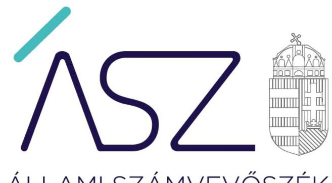

ÁLLAMI SZÁMVEVŐSZÉK

# JELENTÉS

## Központi költségvetési szervek ellenőrzése

Szakképzési centrumok

2020.

20210
www.asz.hu

---

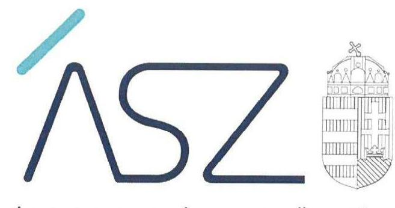

ÁLLAMI SZÁMVEVŐSZÉK

# JELENTÉS 

## Központi költségvetési szervek ellenőrzése

Szakképzési centrumok
2020. 11. hó 10. nap

20210
www.asz.hu

---

# AZ ELLENŐRZÉST FELÜGYELTE: 

DR. PULAY GYULA felügyeleti vezető

AZ ELLENŐRZÉST VEZETTE ÉS A VÉGREHAJTÁSÁÉRT FELELŐS:
SZAPPANOS JÚLIA ellenőrzésvezető
JANIK JÓZSEF ellenőrzésvezető

A PROGRAM ÖSSZEÁLLÍTÁSÁÉRT FELELŐS:
GÖRGÉNYI GÁBOR osztályvezető
IKTATÓSZÁM: EL-2982-001/2020.
TÉMASZÁM: 2549
ELLENŐRZÉS-AZONOSÍTÓ SZÁM: V0893

Jelentéseink az Országgyülés számítógépes hálózatán és az interneten a www.asz.hu címen is olvashatóak.

---

# TARTALOMJEGYZÉK 

■ ÖSSZEGZÉS ..... 5
■ AZ ELLENŐRZÉS CÉLJA ..... 7
■ AZ ELLENŐRZÉS TERÜLETE ..... 8
■ AZ ELLENŐRZÉS HÁTTERE, INDOKOLTSÁGA ..... 9
■ A JELENTÉS LÉNYEGES KÉRDÉSKÖREI ..... 10
■ AZ ELLENŐRZÉS HATÓKÖRE ÉS MÓDSZEREI ..... 11
■ MEGÁLLAPÍTÁSOK ..... 13
■ JAVASLATOK ..... 17
■ MELLÉKLETEK ..... 49
I. sz. melléklet: Ellenőrzött Szakképzési Centrumok kockázati területeinek értékelése ..... 49
II. sz. melléklet: Ellenőrzött Szakképzési Centrumok ..... 50
III. sz. melléklet: Szakképzési Centrumokat érintő egyedi megállapítások ..... 51
IV. sz. melléklet: Értelmező szótár ..... 67
■ FÜGGELÉK: ÉSZREVÉTELEK ..... 69
■ RÖVIDÍTÉSEK JEGYZÉKE ..... 137

---

.

---

# ÖSSZEGZÉS 

Az ellenőrzött 40 szakképzési centrum közül 36 szervezet esetében a kialakított számviteli szabályozás nem felelt meg a jogszabályi előírásoknak, ami kockázatot jelentett a közpénzek felhasználásának átláthatóságára, elszámoltathatóságára és a felelős gazdálkodásra.
39 szakképzési centrum nem biztosította a jogszabályban meghatározott nyilvántartások és 34 szakképzési centrum az éves költségvetési beszámoló szabályszerűségét, ezáltal nem teremtette meg a közpénzekkel és a nemzeti vagyonnal történő felelős gazdálkodás alapvető feltételeit.

## Az ellenőrzés társadalmi indokoltsága

Törvényben deklaráltak szerint a szakképzés feladata a korszerű szakmai ismeretek megszerzésére való felkészítés és az egész életen át tartó tanuláshoz szükséges készségek fejlesztése. A szakképzés és a felsőoktatás az oktatási rendszer egymásra épülő, szerves részei. A szakképzés felsőfokú szakképzettséget nem igénylő munkakör betöltéséhez vagy tevékenység végzéséhez szükséges szakmára felkészítő szakmai oktatás és szakképesítésre felkészítő szakmai képzés.

Magyarország versenyképességének és a magyar gazdaság fejlődésének alapvető feltétele a magyar munkavállalók szakmai képzettsége és felkészültsége, amelyben a szakképzési rendszernek döntő szerepe van. A szakképzéshez kapcsolódó közfeladatokat ellátó 40 szakképzési centrumnak a közpénzekkel és a közvagyonnal való törvényes, átlátható működése és gazdálkodása társadalmi érdek.

Az ellenőrzésnek külön aktualitást ad, hogy 2020. január 1-től hatályba lépett az új szakképzési törvény (Szkt. ${ }^{1}$ ), illetve, hogy egy korábbi törvénymódosítás következtében 2019. szeptember 1-től kancellár irányítja a szakképzési centrum pénzügyi, gazdasági tevékenységét. Az említett változások előtti utolsó teljes év ellenőrzésével az ÁSZ² elősegíti, hogy a szakképzési centrumok a jogszabályi előírások szerint alakítsák ki gazdálkodásuk szabályozási kereteit, valamint a kockázatok feltárásával támogatást nyújt a szakképzési centrumok feletti irányítói, fenntartói feladatok ellátói részére.

## Főbb megállapítások, következtetések, javaslatok

Valamennyi szakképzési centrum rendelkezett a szervezet feladatai ellátásának részletes belső rendjét tartalmazó szervezeti és működési szabályzattal.

A szakképzési centrumok - egy kivétellel - rendelkeztek számviteli politikával és annak keretében elkészítendő szabályzatokkal, azonban 36 szakképzési centrumnak voltak olyan szabályzatai, amelyek nem feleltek meg a jogszabályi előírásoknak. A szabályzatok hiányosságai akadályozzák a számviteli törvénynek és az államháztartás számviteléről szóló kormányrendeletnek a számviteli alapelveknek megfelelő végrehajtását, valamint a szabályszerű beszámolást.

34 szakképzési centrum az éves költségvetési beszámolóban szereplő mérlegtételek értékét a 2018. évben nem támasztotta alá olyan leltárral, amely tételesen, ellenőrizhető módon tartalmazza a mérlegben szereplő eszközöket és forrásokat mennyiségben és értékben. Ennek hiányában az éves költségvetési beszámoló nem mutatott megbízható és valós képet a vagyoni helyzetről, nem volt igazolt a vagyonnak a szakképzési centrum tevékenységi körében történő felhasználása.

A gazdálkodási jogkörök (kötelezettségvállalás, teljesítés igazolás) gyakorlására jogosult személyekről és aláírás mintájukról vezetett nyilvántartások 26 szakképzési centrumnál nem voltak szabályszerűek, nem teremtették meg a kontrolltevékenységek szabályszerű gyakorlásának feltételeit. A kötelezettségvállalások, más fizetési kötelezettségek nyilvántartásának kialakítása 39 szakképzési centrum esetében nem felelt meg a jogszabályi előírásoknak.

---

A szakképzési centrumok vezetői a 2018. évre vonatkozóan - 5 kivétellel - nem a jogszabály szerinti nyilatkozatban értékelték az általuk vezetett költségvetési szerv belső kontrollrendszerének minőségét. Ennek következtében a nyilatkozatok az integritás érvényesítésére alkalmas szervezeti kultúra kialakítására nem terjedtek ki. A nyilatkozatok szerint a vezetők gondoskodtak a belső kontrollrendszer szabályszerű működéséről, a beszámolási kötelezettség teljesítéséről, teljességéről és hitelességéről, az eljárások szabályszerűségét és elszámoltathatóságát biztosító rendszer bevezetéséről. Az ellenőrzés megállapításai ezek valóságtartalmát megkérdőjelezik.

Következtetés: Az ellenőrzés által feltárt hiányosságok a közpénzekkel és a nemzeti vagyonnal való gazdálkodás súlyos kockázatait tárták fel, ezért indokolt volt, hogy e kockázatok csökkentése, illetve bekövetkezésének megelőzése érdekében a szakképzési centrumok pénzügyi, gazdálkodási tevékenysége - az ennek irányításáért felelős kancellári rendszer létrehozásával - megerősítésre kerüljön.

A gazdálkodási fegyelem megszilárdítására irányuló törekvést jelzi, hogy a jelentéstervezet alapján több szakképzési centrum kancellárja intézkedési tervet dolgozott ki, amelyek véglegesítésére a jelentés kézhezvételét követően kerülhet sor.

---

# AZ ELLENŐRZÉS CÉLJA 

AZ ELLENŐRZÉS CÉLJA annak megállapítása volt, hogy a szakképzési centrumok kialakítottak-e a szabályszerű gazdálkodáshoz szükséges, jogszabály által kötelezően előírt szabályzatokat, szabályozásokat; szabályszerűen alakították-e ki a jogszabály által előírt kötelező nyilvántartásokat, valamint szabályszerűen készítették-e el éves beszámolójukat, és a költségvetési szervek vezetői értékelték-e a belső kontrollrendszer minőségét.

---

# AZ ELLENŐRZÉS TERÜLETE 

## Szakképzési Centrumok

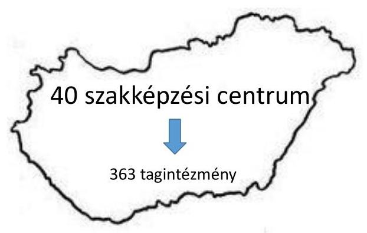

A 2015. évet megelőzően az iskolai rendszerű szakképzésben működő, állami fenntartású szakképző iskolák fenntartója a KLIK ${ }^{3}$ volt. 2015. július 1. napján a szakképző iskolai rendszer keretében megvalósult fenntartóváltás és intézményintegráció következtében a szakképzési intézmények a Klebelsberg Intézményfenntartó Központtól az NGM ${ }^{4}$ fenntartásába kerültek.

Az átalakulás során létrejött szakképzési centrumok olyan önálló, az államháztartás központi alrendszerébe tartozó költségvetési szervek, amelyek részeként, azok szervezetébe tagoltan jogi személyiséggel (Szkt. 17.§) rendelkező szakképző intézmények („tagintézmények") működnek a szakképzési feladatok ellátása érdekében. A szakképző iskolák a költségvetési szervként működő szakképzési centrumok telephelyeivé váltak, a szakképzési centrumok középirányítója lett az NSZFH ${ }^{5}$.

Az alapítói jog gyakorlója és irányító szerve 2018. május 21-ig az NGM, 2018. május 22-től a szakképzési centrumok irányító és fenntartó szerve az ITM $^{6}$ lett, a középirányító szerve az NSZFH maradt.

Az ellenőrzött időszakban a szakképzési centrumok élén a szakképzésért és felnőttképzésért felelős miniszter ${ }^{7}$ által megbízott főigazgató állt. Az Szkt. 26. § 3. jelenleg hatályos bekezdése értelmében a főigazgató és a kancellár önállóan vezeti és képviseli a szakképzési centrumot. Jelen ellenőrzés időszakában 40 szakképzési centrum működött az országban.

Az ellenőrzés a központi költségvetési szervek körébe tartozó, az ITM által fenntartott valamennyi szakképzési centrumra kiterjedt, a 2018. évre vonatkozóan.
2018. évi éves beszámolóik adatai alapján a szakképzési centrumok, nemzeti vagyonba tartozó eszközeinek együttes értéke 163388 M Ft volt, 220065 M Ft bevétel mellett kiadásaik 178443 M Ft összeget tettek ki, az alaptevékenység kötelezettségvállalással terhelt maradványának kumulált összege 39297 M Ft volt. Alapító okirataik tanúsága szerint a szakképzési centrumoknak összesen 363 tagintézménye volt.

---

# AZ ELLENŐRZÉS HÁTTERE, INDOKOLTSÁGA 

A központi költségvetési szervek gazdálkodását és működését az ÁSZ törvényi felhatalmazás alapján ellenőrzi, annak érdekében, hogy a közpénzfelhasználás javulását, a nemzeti vagyonnal való gazdálkodás javulását előmozdítsa. Az ellenőrzéssel az ÁSZ elősegíti, hogy ezen szervezetek betöltsék funkciójukat, a jogszabályi előírásoknak megfelelően működjenek és gazdálkodjanak, valamint támogatást nyújt a szakképzési centrumok feletti irányítói, fenntartói feladatok ellátásában.

---

# A JELENTÉS LÉNYEGES KÉRDÉSKÖREI 

1.     - A szakképzési centrumok kialakították-e a szabályszerű gazdálkodás jogszabály által kötelezően előírt szabályozási kereteit?
2.     - A szakképzési centrumok biztosították-e jogszabályban meghatározott nyilvántartásaik kialakítását és éves számviteli beszámolóik szabályszerűségét?
3.     - A szakképzési centrumok vezetői nyilatkozatban értékelték-e a belső kontrollrendszer minőségét?

---

# AZ ELLENŐRZÉS HATÓKÖRE ÉS MÓDSZEREI 

## Az ellenőrzés típusa

Megfelelőségi ellenőrzés.

## Az ellenőrzött időszak

A 2018. év.

## Az ellenőrzés tárgya

A szakképzési centrumok gazdálkodása jogszabály által kötelezően előírt szabályozási keretrendszerének szabályszerűsége, a jogszabályban meghatározott nyilvántartások kialakítása és az éves számviteli beszámoló szabályszerűsége, valamint a felelős vezető nyilatkozatának szabályszerűsége a kialakított belső kontrollrendszer minőségéről.

## Az ellenőrzött szervezet

Szakképzési centrumok (II. számú melléklet szerint).

## Az ellenőrzés jogalapja

Az ellenőrzés jogszabályi alapját az ÁSZ tv. 1. § (3) bekezdés, 5. § (2)-(4) és (6) bekezdései, valamint az Áht. 61. § (2) bekezdésének előírásai képezik.

## Az ellenőrzés módszerei

Az ellenőrzést az ellenőrzött időszakban hatályos jogszabályok, az ellenőrzés szakmai szabályai, a jelen ellenőrzésre irányadó ÁSZ módszertanok, az ellenőrzési programban foglalt értékelési szempontok szerint került végrehajtásra. Az ellenőrzést az ÁSZ a program kérdéseire adott válaszok kiértékelésével, valamint a programban ismertetett ellenőrzési kérdések, kritériumok, adatforrások között megjelölt adatforrások, továbbá az adott időszakban hatályos jogszabályok figyelembevételével folytatta le.

A kockázatértékelésen alapuló ellenőrzés a gazdálkodás lényeges területeire terjedt ki, és súlypontok meghatározásával lehetőséget biztosított a kockázatok beazonosítására.

---

Az ellenőrzés során az ellenőrzött szervezettel történő kapcsolattartást az Állami Számvevőszék szervezeti és működési szabályzatának vonatkozó előírásai alapján biztosította.

---

# 1. A szakképzési centrumok kialakították-e a szabályszerű gazdálkodás jogszabály által kötelezően előírt szabályozási kereteit? 

Összegző megállapítás

1.1. számú megállapítás
1.2. számú megállapítás

A 2018. évben a szakképzési centrumok 7 kivétellel kialakították a szabályszerű gazdálkodás jogszabály által kötelezően előírt szabályozási kereteit.

A szakképzési centrumok rendelkeztek szabályszerű szervezeti és működési szabályzattal.

Mind a 40 szakképzési centrum az Áht. 10. § (5) bekezdésében előírtak szerint rendelkezett szervezeti és működési szabályzattal, melyek tartalmazták az Ávr. ${ }^{8}$ 13. § (1) bekezdés c), e), f), g), h) pontjaiban megkövetelt tartalmi elemeket, valamint a Vnytv. ${ }^{9}$ 4. § a) pontjának megfelelően meghatározták a vagyonnyilatkozat-tételi kötelezettséggel járó munkaköröket.

39 szakképzési centrum rendelkezett számviteli politikával és annak keretében elkészítendő szabályzatokkal, de azok - hiányosságaik miatt - nem biztosították gazdálkodásuk átláthatóságát.

Valamennyi szakképzési centrum rendelkezett számviteli politikával az Áhsz. ${ }^{10}$ 50. § (1) bekezdésében előírtaknak megfelelően.

32 szakképzési centrum esetében a számviteli politikában nem rögzítették az általános költségek, kiadások és bevételek tevékenységekre történő felosztásának konkrét módját, a felosztáshoz alkalmazott mutatókat, vetítési alapokat az Áhsz. 50. § (7) bekezdésében előírtakkal ellentétben. Az előírt szabályozás hiánya miatt nem állapítható meg, hogy az általános kiadásokat a szakképzési centrum mi alapján osztja fel közvetlenül tagintézményre, illetve kormányzati funkcióra.

Eszközök és források leltárkészítési és leltározási szabályzatával a szakképzési centrumok mindegyike rendelkezett az Áhsz 50. § (1) bekezdésében, valamint a Számv. tv. 14. § (5) bekezdés a) pontjában előírtaknak megfelelően. Egy szakképzési centrum szabályzata nem tartalmazta a használt, de a mérlegben értékkel nem szereplő immateriális javak, tárgyi eszközök, készletek leltározási módját az Áhsz. 22. § (2) bek. b) pontja ellenére.

39 szakképzési centrum esetében rendelkezésre állt az Áhsz. 50. § (1) bekezdésében, valamint a Számv. tv. 14. § (5) bekezdés b) pontjában előírtaknak megfelelő eszközök és források értékelési szabályzata.

A rendelkezésre álló szabályzatok öt szervezet esetében nem voltak összhangban a jogszabályi előírásokkal:

---

- négy szakképzési centrum eszközök és források értékelési szabályzata nem tartalmazta az egyszerűsített értékelési eljárás alá vont követelések besorolásának elveit, dokumentálásának szabályait

 az Áhsz. 50. § (2) bekezdés c) pontja ellenére;
- egy szakképzési centrum eszközök és források értékelési szabályzata nem tartalmazta követeléstípusonként a kis összegű követelések év végi meghatározásának elveit, dokumentálásának szabályait az Áhsz. 50. § (2) bekezdés b) pontja ellenére.
Pénzkezelési szabályzattal a szakképzési centrumok mindegyike rendelkezett az Áhsz. 50. § (1) bekezdésében, valamint a Számv. tv. 14. § (5) bekezdés d) pontjában előírtaknak megfelelően.

A rendelkezésre álló szabályzatok három szervezet esetében nem voltak összhangban a jogszabályi előírásokkal:
— két szakképzési centrum szabályzata a Számv. tv. 14. § (8) bekezdésében foglalt előírások közül nem tartalmazta napi készpénz záró állomány maximális mértékét,
— egy szakképzési centrum szabályzata Számv. tv. 14. § (8) bekezdésében foglalt előírások közül nem tartalmazta a pénzkezelés személyi és tárgyi feltételeit.

# 1.3. számú megállapítás 

34 szakképzési centrum rendelkezett egyéb, a gazdálkodásukat érintő, jogszabályban kötelezően előírt szabályzatokkal, szabályozással.

A gazdálkodás részletes rendjét meghatározó belső szabályzattal valamennyi szakképzési centrum rendelkezett az Áht. 10. § (5) bekezdésben előírtaknak megfelelően.

Kilenc szakképzési centrum belső szabályzatban nem rendezte a működéshez kapcsolódó, a költségvetési szerv előirányzatait terhelő, pénzügyi kihatással bíró, jogszabályban nem szabályozott kérdéseket, így különösen a kötelezettségvállalás, a teljesítés igazolása gyakorlásának módjával, eljárási és dokumentációs részletszabályaival, valamint az ezeket végző személyek kijelölésének rendjével kapcsolatos belső előírásokat, feltételeket, ezáltal nem tett eleget az Ávr. 13. § (2) bekezdés a) pont előírásainak.

Integrált kockázatkezelési eljárásrenddel 37 szakképzési centrum rendelkezett a Bkr. 6. § (4) bekezdésében előírtaknak megfelelően.

A beszerzések lebonyolításának eljárásrendjét tartalmazó belső szabályozással 39 szakképzési centrum rendelkezett az Ávr. 13. § (2) bekezdés b) pontjában előírtaknak megfelelően.

A vagyonnyilatkozat átadására, nyilvántartására, a vagyonnyilatkozatban foglalt személyes adatok védelmére vonatkozó szabályzattal 37 szakképzési centrum rendelkezett a Vnytv. 11. § (6) bekezdésében előírtaknak megfelelően. Egy szakképzési centrum szabályzata nem felelt meg a Vnytv. 11. § (6) előírásainak a személyes adatok védelmére vonatkozó előírások hiánya miatt.

---

# 2. A szakképzési centrumok biztosították-e jogszabályban meghatározott nyilvántartásaik kialakítását és éves számviteli beszámolóik szabályszerűségét? 

Összegző megállapítás

2.1. számú megállapítás
2.2. számú megállapítás

A szakképzési centrumok - egy-egy kivétellel - nem biztosították az éves beszámoló szabályszerűségét, illetve nem alakították ki a jogszabályban meghatározott nyilvántartásokat.

A szakképzési centrumok közül 39 elkészítette az éves beszámolót a jogszabály által előírt formában, azonban a költségvetési beszámoló mérlegét szabályszerű leltárral 34 szervezet nem támasztotta alá.

Éves költségvetési beszámolót egy szakképzési centrum nem készített az Áhsz. 5. § (1) bekezdésében foglaltak ellenére a 2018. évben. Egy szakképzési centrum éves költségvetési beszámolójának kiegészítő melléklete nem tartalmazta a kiegészítő tájékoztató adatokat az Áhsz. 29. § (2) bekezdés c) pontjában foglaltak ellenére.

34 szakképzési centrum az Áhsz. 22. § (1), valamint a Számv. tv. 69. § (1) bekezdése ellenére éves költségvetési beszámolója mérlegtételeit nem támasztotta alá olyan leltárral, amely tételesen, ellenőrizhető módon tartalmazza a mérlegben szereplő eszközöket és forrásokat mennyiségben és értékben. Szabályszerű leltárral alátámasztott mérleg hiányában a szakképzési centrumok éves költségvetési beszámolója nem volt megalapozott, a megfelelő leltár hiánya a nemzeti vagyon védelme szempontjából alapvető kockázatot jelentett.

A szakképzési centrumok közül 14 rendelkezett a jogszabályi előírásoknak megfelelően kialakított naprakész nyilvántartással a gazdálkodási jogkört gyakorolni jogosult személyek aláírás-mintájáról, emellett a szakképzési centrumok közül egy rendelkezett a jogszabályi előírások szerint kialakított kötelezettségvállalások, más fizetési kötelezettségek nyilvántartással.

Kötelezettségvállalásra, teljesítés igazolására jogosult személyekről és aláírás-mintájukról vezetett naprakész nyilvántartással 26 szakképzési centrum nem rendelkezett az Ávr. 60. § (3) bekezdésében foglaltak ellenére.

39 szakképzési centrum esetében a kötelezettségvállalások, más fizetési kötelezettségek nyilvántartása az Áhsz. 14. melléklet II/4. pontjában meghatározott előírásoknak nem felelt meg. A szakképzési centrumok kötelezettségvállalások, más fizetési kötelezettségek nyilvántartásai az Áhsz. 14. melléklet II/4. bekezdésében előírtak szerinti 19 tartalmi kritériumból nyolc szakképzési centrum esetében több, mint 10, huszonkettő szakképzési centrum esetében 5-9, kilenc szakképzési centrum esetében 1-4 kritérium nem teljesült.

Ezek közül kiemelendő, hogy
$\longrightarrow$ harmincöt szakképzési centrum nyilvántartásai nem tartalmazták az utalványozás Ávr. 59.§ (2) bekezdése szerinti dokumentumának azonosításához szükséges adatokat, és

---

- harminckét szakképzési centrum nyilvántartásai nem tartalmazták a kötelezettségvállalást, más fizetési kötelezettséget tanúsító dokumentumok megnevezését.

# 3. A szakképzési centrumok vezetői nyilatkozatban értékelték-e a belső kontrollrendszer minőségét? 

Összegző megállapítás
2018. évre vonatkozóan valamennyi szakképzési centrum vezetője nyilatkozatban értékelte az általa vezetett költségvetési szerv belső kontrollrendszerének minőségét, azonban a nyilatkozat 35 szakképzési centrum esetében nem a jogszabályban előírt tartalommal készült.

A Bkr. 11. § (1) bekezdésében előírt kötelezettség teljesítése érdekében minden szakképzési centrum vezetője nyilatkozatban értékelte a költségvetési szerv belső kontrollrendszerének minőségét, ugyanakkor:

- harmincöt szakképzési centrum vezetője nem a Bkr. 1. melléklet szerinti nyilatkozatban értékelte a belső kontrollrendszer minőségét. Ennek következtében a nyilatkozatokban a szervezeti kultúra kialakítását - amely biztosítja az elkötelezettséget a szervezeti célok és értékek iránt, valamint alkalmas az integritás érvényesítésének biztosítására - nem értékelték,
- egy szakképzési centrum vezetőjének nyilatkozata az éves költségvetési beszámoló Áhsz. 32. §-a szerinti benyújtási határidejét követően készült el.
A vezetői nyilatkozatban foglaltakat nem igazolták vissza a kontrollkörnyezet kialakítására vonatkozó megállapítások. A nyilatkozatok szerint belső szabályzatban rendezettek voltak a működéshez kapcsolódó, pénzügyi kihatással bíró, jogszabályban nem szabályozott kérdések. Gondoskodtak továbbá a szabályszerű működésről, a beszámolási kötelezettség hitelességéről, az eljárások szabályszerűségét és elszámoltathatóságát biztosító rendszer bevezetéséről. Az ellenőrzés azonban hiányosságokat tárt fel a számviteli politikák, továbbá az azok keretében kiadott eszközök és források leltározási és leltárkészítési szabályzatok, eszközök és források értékelési szabályzatok, pénzkezelési szabályzatok tartalmi elemei vonatkozásában. Továbbá a szakképzési centrumok nem biztosították a jogszabályban meghatározott nyilvántartások kialakítását és az éves beszámoló szabályszerűségét.

---

# JAVASLATOK 

Az ÁSZ tv. 33. § (1) bekezdésében foglaltak értelmében az ellenőrzött szervezet vezetője köteles a jelentésben foglalt megállapításokhoz kapcsolódó intézkedési tervet összeállítani és azt a jelentés kézhezvételétől számított 30 napon belül az ÁSZ részére megküldeni. Amennyiben az ellenőrzött szervezet vezetője nem küldi meg határidőben az intézkedési tervet, vagy továbbra sem elfogadható intézkedési tervet küld, az Állami Számvevőszék elnöke az ÁSZ tv. 33. § (3) bekezdése a) és b) pontjaiban foglaltakat érvényesítheti.

## A Bajai Szakképzési Centrum kancellárjának

1. Intézkedjen, hogy az Áhsz.-ben előírtak szerint a számviteli politikában rögzítésre kerüljenek az általános költségek, valamint az általános kiadások és bevételek tevékenységekre történő felosztásának módja, a felosztáshoz alkalmazott mutatók, vetítési alapok.
(III. számú melléklet 1/1. számú megállapítás alapján)
2. Intézkedjen, hogy a Számv. tv.-ben előírt pénzkezelési szabályzat rendelkezzen a napi készpénz záró állomány maximális mértékéről.
(III. számú melléklet 1/2. számú megállapítás alapján)
3. Intézkedjen a Számv. tv.-ben és az Áhsz.-ben foglalt előírásoknak megfelelően az éves költségvetési beszámoló mérleg tételeinek tételesen, ellenőrizhető módon, a mérlegben szereplő eszközöket és forrásokat mennyiségben és értékben tartalmazó leltárral történő alátámasztásáról.
(III. számú melléklet 1/3. számú megállapítás alapján)
4. Intézkedjen az Ávr. jogszabályi előírásainak megfelelő naprakész nyilvántartás vezetéséről a kötelezettségvállalásra, pénzügyi ellenjegyzésre, teljesítés igazolására, érvényesítésre, utalványozásra jogosult személyekről és aláírás-mintájukról.
(III. számú melléklet 1/4. számú megállapítás alapján)
5. Intézkedjen, hogy kötelezettségvállalások, más fizetési kötelezettségek nyilvántartása az Áhsz. 14. melléklet II/4. pontjában meghatározott előírásoknak feleljen meg.
(III. számú melléklet 1/5. számú megállapítás alapján)

---

6. Intézkedjen a Bkr.-ben előírtaknak megfelelően a belső kontroll rendszer minőségének Bkr. 1. számú mellékletében előírt tartalmú nyilatkozatban történő értékeléséről.
(III. számú melléklet 1/6. számú megállapítás alapján)

# A Békéscsabai Szakképzési Centrum kancellárjának 

1. Intézkedjen, hogy az Ávr.-ben előírtak szerint belső szabályzatban rendezésre kerüljenek a gazdálkodással - így különösen a teljesítés igazolás gyakorlásának módjával, eljárási és dokumentációs részletszabályaival, valamint az ezeket végző személyek kijelölésének rendjével kapcsolatos belső előírások, feltételek.
(III. számú melléklet 2/1. számú megállapítás alapján)
2. Intézkedjen a Számv. tv.-ben és az Áhsz.-ben foglalt előírásoknak megfelelően az éves költségvetési beszámoló mérleg tételeinek tételesen, ellenőrizhető módon, a mérlegben szereplő eszközöket és forrásokat mennyiségben és értékben tartalmazó leltárral történő alátámasztásáról.
(III. számú melléklet 2/2. számú megállapítás alapján)
3. Intézkedjen, hogy kötelezettségvállalások, más fizetési kötelezettségek nyilvántartása az Áhsz. 14. melléklet II/4. pontjában meghatározott előírásoknak feleljen meg.
(III. számú melléklet 2/3. számú megállapítás alapján)

## A Berettyóújfalui Szakképzési Centrum kancellárjának

1. Intézkedjen, hogy az Áhsz.-ben előírtak szerint a számviteli politikában rögzítésre kerüljenek az általános költségek, valamint az általános kiadások és bevételek tevékenységekre történő felosztásának módja, a felosztáshoz alkalmazott mutatók, vetítési alapok.
(III. számú melléklet 3/1. számú megállapítás alapján)
2. Intézkedjen a Számv. tv.-ben és az Áhsz.-ben foglalt előírásoknak megfelelően az éves költségvetési beszámoló mérleg tételeinek tételesen, ellenőrizhető módon, a mérlegben szereplő eszközöket és forrásokat mennyiségben és értékben tartalmazó leltárral történő alátámasztásáról.
(III. számú melléklet 3/2. számú megállapítás alapján)

---

3. Intézkedjen az Ávr. előírásainak megfelelő naprakész nyilvántartás vezetéséről a kötelezettségvállalásra, pénzügyi ellenjegyzésre, teljesítés igazolására, érvényesítésre, utalványozásra jogosult személyekről és aláírás-mintájukról.
(III. számú melléklet 3/3. számú megállapítás alapján)
4. Intézkedjen, hogy kötelezettségvállalások, más fizetési kötelezettségek nyilvántartása az Áhsz. 14. melléklet II/4. pontjában meghatározott előírásoknak feleljen meg.
(III. számú melléklet 3/4. számú megállapítás alapján)

# A Budapesti Gazdasági Szakképzési Centrum kancellárjának 

1. Intézkedjen, hogy az Áhsz.-ben előírtak szerint a számviteli politikában rögzítésre kerüljenek az általános költségek, valamint az általános kiadások és bevételek tevékenységekre történő felosztásának módja, a felosztáshoz alkalmazott mutatók, vetítési alapok.
(III. számú melléklet 4/1. számú megállapítás alapján)
2. Intézkedjen a Számv. tv.-ben és az Áhsz.-ben foglalt előírásoknak megfelelően az éves költségvetési beszámoló mérleg tételeinek tételesen, ellenőrizhető módon, a mérlegben szereplő eszközöket és forrásokat mennyiségben és értékben tartalmazó leltárral történő alátámasztásáról.
(III. számú melléklet 4/2. számú megállapítás alapján)
3. Intézkedjen az Ávr. előírásainak megfelelő naprakész nyilvántartás vezetéséről a kötelezettségvállalásra, pénzügyi ellenjegyzésre, teljesítés igazolására, érvényesítésre, utalványozásra jogosult személyekről és aláírás-mintájukról.
(III. számú melléklet 4/3. számú megállapítás alapján)
4. Intézkedjen, hogy kötelezettségvállalások, más fizetési kötelezettségek nyilvántartása az Áhsz. 14. melléklet II/4. pontjában meghatározott előírásoknak feleljen meg.
(III. számú melléklet 4/4. számú megállapítás alapján)

---

5. Intézkedjen a Bkr.-ben előírtaknak megfelelően a belső kontroll rendszer minőségének Bkr. 1. számú mellékletében előírt tartalmú nyilatkozatban történő értékeléséről.
(III. számú melléklet 4/5. számú megállapítás alapján)

# A Budapesti Gépészeti Szakképzési Centrum kancellárjának 

1. Intézkedjen a Számv. tv.-ben és az Áhsz.-ben foglalt előírásoknak megfelelően az éves költségvetési beszámoló mérleg tételeinek tételesen, ellenőrizhető módon, a mérlegben szereplő eszközöket és forrásokat mennyiségben és értékben tartalmazó leltárral történő alátámasztásáról.
(III. számú melléklet 5/1. számú megállapítás alapján)
2. Intézkedjen az Ávr. jogszabályi előírásainak megfelelő naprakész nyilvántartás vezetéséről a kötelezettségvállalásra, pénzügyi ellenjegyzésre, teljesítés igazolására, érvényesítésre, utalványozásra jogosult személyekről és aláírás-mintájukról.
(III. számú melléklet 5/2. számú megállapítás alapján)
3. Intézkedjen, hogy kötelezettségvállalások, más fizetési kötelezettségek nyilvántartása az Áhsz. 14. melléklet II/4. pontjában meghatározott előírásoknak feleljen meg.
(III. számú melléklet 5/3. számú megállapítás alapján)
4. Intézkedjen a Bkr.-ben előírtaknak megfelelően a belső kontroll rendszer minőségének Bkr. 1. számú mellékletében előírt tartalmú nyilatkozatban történő értékeléséről.
(III. számú melléklet 5/4. számú megállapítás alapján)

## A Budapesti Komplex Szakképzési Centrum kancellárjának

1. Intézkedjen, hogy az Áhsz.-ben előírtak
 szerint a számviteli politikában rögzítésre kerüljenek az általános költségek, valamint az általános kiadások és bevételek tevékenységekre történő felosztásának módja, a felosztáshoz alkalmazott mutatók, vetítési alapok.
(III. számú melléklet 6/1. számú megállapítás alapján)

---

2. Intézkedjen, hogy az Áhsz.-ben előírtak szerint az eszközök és források értékelésének szabályzata rögzítse az egyszerűsített értékelési eljárás alá vont követelések besorolásának elveit, dokumentálásának szabályait.
(III. számú melléklet 6/2. számú megállapítás alapján)
3. Intézkedjen a Számv. tv.-ben és az Áhsz.-ben foglalt előírásoknak megfelelően az éves költségvetési beszámoló mérleg tételeinek tételesen, ellenőrizhető módon, a mérlegben szereplő eszközöket és forrásokat mennyiségben és értékben tartalmazó leltárral történő alátámasztásáról.
(III. számú melléklet 6/3. számú megállapítás alapján)
4. Intézkedjen, hogy az éves költségvetési beszámoló részét képező kiegészítő melléklet az Áhsz. előírása szerinti adatokat tartalmazza.
(III. számú melléklet 6/4. számú megállapítás alapján)
5. Intézkedjen az Ávr. jogszabályi előírásainak megfelelő naprakész nyilvántartás vezetéséről a kötelezettségvállalásra, pénzügyi ellenjegyzésre, teljesítés igazolására, érvényesítésre, utalványozásra jogosult személyekről és aláírás-mintájukról.
(III. számú melléklet 6/5. számú megállapítás alapján)
6. Intézkedjen, hogy kötelezettségvállalások, más fizetési kötelezettségek nyilvántartása az Áhsz. 14. melléklet II/4. pontjában meghatározott előírásoknak feleljen meg.
(III. számú melléklet 6/6. számú megállapítás alapján)
7. Intézkedjen a Bkr.-ben előírtaknak megfelelően a belső kontroll rendszer minőségének Bkr. 1. számú mellékletében előírt tartalmú nyilatkozatban történő értékeléséről.
(III. számú melléklet 6/7. számú megállapítás alapján)

# A Budapesti Műszaki Szakképzési Centrum kancellárjának 

1. Intézkedjen, hogy az Áhsz.-ben előírtak szerint az eszközök és források értékelésének szabályzata rögzítse a kis összegű követelések év végi meghatározásának elveit, dokumentálásának szabályait.
(III. számú melléklet 7/1. számú megállapítás alapján)

---

2. Intézkedjen a Számv. tv.-ben és az Áhsz.-ben foglalt előírásoknak megfelelően az éves költségvetési beszámoló mérleg tételeinek tételesen, ellenőrizhető módon, a mérlegben szereplő eszközöket és forrásokat mennyiségben és értékben tartalmazó leltárral történő alátámasztásáról.
(III. számú melléklet 7/2. számú megállapítás alapján)
3. Intézkedjen az Ávr. jogszabályi előírásainak megfelelő naprakész nyilvántartás vezetéséről a kötelezettségvállalásra, pénzügyi ellenjegyzésre, teljesítés igazolására, érvényesítésre, utalványozásra jogosult személyekről és aláírás-mintájukról.
(III. számú melléklet 7/3. számú megállapítás alapján)
4. Intézkedjen, hogy kötelezettségvállalások, más fizetési kötelezettségek nyilvántartása az Áhsz. 14. melléklet II/4. pontjában meghatározott előírásoknak feleljen meg.
(III. számú melléklet 7/4. számú megállapítás alapján)
5. Intézkedjen a Bkr.-ben előírtaknak megfelelően a belső kontroll rendszer minőségének Bkr. 1. számú mellékletében előírt tartalmú nyilatkozatban történő értékeléséről.
(III. számú melléklet 7/5. számú megállapítás alapján)

# A Ceglédi Szakképzési Centrum kancellárjának 

1. Intézkedjen, hogy az Áhsz.-ben előírtak szerint a számviteli politikában rögzítésre kerüljenek az általános költségek, valamint az általános kiadások és bevételek tevékenységekre történő felosztásának módja, a felosztáshoz alkalmazott mutatók, vetítési alapok.
(III. számú melléklet 8/1. számú megállapítás alapján)
2. Intézkedjen a Számv. tv.-ben és az Áhsz.-ben foglalt előírásoknak megfelelően az éves költségvetési beszámoló mérleg tételeinek tételesen, ellenőrizhető módon, a mérlegben szereplő eszközöket és forrásokat mennyiségben és értékben tartalmazó leltárral történő alátámasztásáról.
(III. számú melléklet 8/2. számú megállapítás alapján)

---

3. Intézkedjen az Ávr. jogszabályi előírásainak megfelelő naprakész nyilvántartás vezetéséről a kötelezettségvállalásra, pénzügyi ellenjegyzésre, teljesítés igazolására, érvényesítésre, utalványozásra jogosult személyekről és aláírás-mintájukról.
(III. számú melléklet 8/3. számú megállapítás alapján)
4. Intézkedjen, hogy kötelezettségvállalások, más fizetési kötelezettségek nyilvántartása az Áhsz. 14. melléklet II/4. pontjában meghatározott előírásoknak feleljen meg.
(III. számú melléklet 8/4. számú megállapítás alapján)
5. Intézkedjen a Bkr.-ben előírtaknak megfelelően a belső kontroll rendszer minőségének Bkr. 1. számú mellékletében előírt tartalmú nyilatkozatban történő értékeléséről.
(III. számú melléklet 8/5. számú megállapítás alapján)

# A Debreceni Szakképzési Centrum kancellárjának 

1. Intézkedjen, hogy az Áhsz.-ben előírtak szerint a számviteli politikában rögzítésre kerüljenek az általános költségek, valamint az általános kiadások és bevételek tevékenységekre történő felosztásának módja, a felosztáshoz alkalmazott mutatók, vetítési alapok.
(III. számú melléklet 9/1. számú megállapítás alapján)
2. Intézkedjen a Számv. tv.-ben és az Áhsz.-ben foglalt előírásoknak megfelelően az éves költségvetési beszámoló mérleg tételeinek tételesen, ellenőrizhető módon, a mérlegben szereplő eszközöket és forrásokat mennyiségben és értékben tartalmazó leltárral történő alátámasztásáról.
(III. számú melléklet 9/2. számú megállapítás alapján)
3. Intézkedjen az Ávr. előírásainak megfelelő naprakész nyilvántartás vezetéséről a kötelezettségvállalásra, pénzügyi ellenjegyzésre, teljesítés igazolására, érvényesítésre, utalványozásra jogosult személyekről és aláírás-mintájukról.
(III. számú melléklet 9/3. számú megállapítás alapján)
4. Intézkedjen, hogy kötelezettségvállalások, más fizetési kötelezettségek nyilvántartása az Áhsz. 14. melléklet II/4. pontjában meghatározott előírásoknak feleljen meg.
(III. számú melléklet 9/4. számú megállapítás alapján)

---

5. Intézkedjen a Bkr.-ben előírtaknak megfelelően a belső kontroll rendszer minőségének Bkr. 1. számú mellékletében előírt tartalmú nyilatkozatban történő értékeléséről.
(III. számú melléklet 9/5. számú megállapítás alapján)

# A Dunaújvárosi Szakképzési Centrum kancellárjának 

1. Intézkedjen, hogy az Áhsz.-ben előírtak szerint a számviteli politikában rögzítésre kerüljenek az általános költségek, valamint az általános kiadások és bevételek tevékenységekre történő felosztásának módja, a felosztáshoz alkalmazott mutatók, vetítési alapok.
(III. számú melléklet 10/1. számú megállapítás alapján)
2. Intézkedjen, hogy az Ávr.-ben előírtak szerint belső szabályzatban rendezésre kerüljenek a gazdálkodással - így különösen a teljesítés igazolás gyakorlásának módjával, eljárási és dokumentációs részletszabályaival, valamint az ezeket végző személyek kijelölésének rendjével kapcsolatos belső előírások, feltételek.
(III. számú melléklet 10/2. számú megállapítás alapján)
3. Intézkedjen a Vnytv.-ben előírt vagyonnyilatkozat átadására, nyilvántartására, a vagyonnyilatkozatban foglalt személyes adatok védelmére vonatkozó szabályozás megalkotásáról.
(III. számú melléklet 10/3. számú megállapítás alapján)
4. Intézkedjen az Áhsz. szerinti éves költségvetési beszámolónak az Áhsz. valamennyi előírásának megfelelő elkészítéséről.
(III. számú melléklet 10/4. számú megállapítás alapján)
5. Intézkedjen az Ávr. jogszabályi előírásainak megfelelő naprakész nyilvántartás vezetéséről a kötelezettségvállalásra, pénzügyi ellenjegyzésre, teljesítés igazolására, érvényesítésre, utalványozásra jogosult személyekről és aláírás-mintájukról.
(III. számú melléklet 10/5. számú megállapítás alapján)
6. Intézkedjen, hogy kötelezettségvállalások, más fizetési kötelezettségek nyilvántartása az Áhsz. 14. melléklet II/4. pontjában meghatározott előírásoknak feleljen meg.
(III. számú melléklet 10/6. számú megállapítás alapján)

---

7. Intézkedjen a Bkr.-ben előírtaknak megfelelően a belső kontroll rendszer minőségének Bkr. 1. számú mellékletében előírt tartalmú nyilatkozatban történő értékeléséről.
(III. számú melléklet 10/7. számú megállapítás alapján)

# A Heves Megyei Szakképzési Centrum kancellárjának 

1. Intézkedjen, hogy a Számv. tv.-ben előírt pénzkezelési szabályzat rendelkezzen a napi készpénz záró állomány maximális mértékéről.
(III. számú melléklet 11/1. számú megállapítás alapján)
2. Intézkedjen a Számv. tv.-ben és az Áhsz.-ben foglalt előírásoknak megfelelően az éves költségvetési beszámoló mérleg tételeinek tételesen, ellenőrizhető módon, a mérlegben szereplő eszközöket és forrásokat mennyiségben és értékben tartalmazó leltárral történő alátámasztásáról.
(III. számú melléklet 11/2. számú megállapítás alapján)
3. Intézkedjen az Ávr. jogszabályi előírásainak megfelelő naprakész nyilvántartás vezetéséről a kötelezettségvállalásra, pénzügyi ellenjegyzésre, teljesítés igazolására, érvényesítésre, utalványozásra jogosult személyekről és aláírás-mintájukról.
(III. számú melléklet 11/3. számú megállapítás alapján)
4. Intézkedjen, hogy kötelezettségvállalások, más fizetési kötelezettségek nyilvántartása az Áhsz. 14. melléklet II/4. pontjában meghatározott előírásoknak feleljen meg.
(III. számú melléklet 11/4. számú megállapítás alapján)

## Az Érdi Szakképzési Centrum kancellárjának

1. Intézkedjen, hogy az Áhsz.-ben előírtak szerint a számviteli politikában rögzítésre kerüljenek az általános költségek, valamint az általános kiadások és bevételek tevékenységekre történő felosztásának módja, a felosztáshoz alkalmazott mutatók, vetítési alapok.
(III. számú melléklet 12/1. számú megállapítás alapján)

---

2. Intézkedjen a Számv. tv.-ben és az Áhsz.-ben foglalt előírásoknak megfelelően az éves költségvetési beszámoló mérleg tételeinek tételesen, ellenőrizhető módon, a mérlegben szereplő eszközöket és forrásokat mennyiségben és értékben tartalmazó leltárral történő alátámasztásáról.
(III. számú melléklet 12/2. számú megállapítás alapján)
3. Intézkedjen, hogy kötelezettségvállalások, más fizetési kötelezettségek nyilvántartása az Áhsz. 14. melléklet II/4. pontjában meghatározott előírásoknak feleljen meg.
(III. számú melléklet 12/3. számú megállapítás alapján)
4. Intézkedjen a Bkr.-ben előírtaknak megfelelően a belső kontroll rendszer minőségének Bkr. 1. számú mellékletében előírt tartalmú nyilatkozatban történő értékeléséről.
(III. számú melléklet 12/4. számú megállapítás alapján)

# A Győri Szakképzési Centrum kancellárjának 

1. Intézkedjen, hogy az Áhsz.-ben előírtak szerint a számviteli politikában rögzítésre kerüljenek az általános költségek, valamint az általános kiadások és bevételek tevékenységekre történő felosztásának módja, a felosztáshoz alkalmazott mutatók, vetítési alapok.
(III. számú melléklet 13/1. számú megállapítás alapján)
2. Intézkedjen, hogy kötelezettségvállalások, más fizetési kötelezettségek nyilvántartása az Áhsz. 14. melléklet II/4. pontjában meghatározott előírásoknak feleljen meg.
(III. számú melléklet 13/2. számú megállapítás alapján)
3. Intézkedjen a Bkr.-ben előírtaknak megfelelően a belső kontroll rendszer minőségének Bkr. 1. számú mellékletében előírt tartalmú nyilatkozatban történő értékeléséről.
(III. számú melléklet 13/3. számú megállapítás alapján)

---

# A Gyulai Szakképzési Centrum kancellárjának 

1. Intézkedjen, hogy az Áhsz.-ben előírtak szerint a számviteli politikában rögzítésre kerüljenek az általános költségek, valamint az általános kiadások és bevételek tevékenységekre történő felosztásának módja, a felosztáshoz alkalmazott mutatók, vetítési alapok.
(III. számú melléklet 14/1. számú megállapítás alapján)
2. Intézkedjen, hogy az Áhsz.-ben előírtak szerint az eszközök és források értékelésének szabályzata rögzítse az egyszerűsített értékelési eljárás alá vont követelések besorolásának elveit, dokumentálásának szabályait.
(III. számú melléklet 14/2. számú megállapítás alapján)
3. Intézkedjen a Számv. tv.-ben és az Áhsz.-ben foglalt előírásoknak megfelelően az éves költségvetési beszámoló mérleg tételeinek tételesen, ellenőrizhető módon, a mérlegben szereplő eszközöket és forrásokat mennyiségben és értékben tartalmazó leltárral történő alátámasztásáról.
(III. számú melléklet 14/3. számú megállapítás alapján)
4. Intézkedjen az Ávr. jogszabályi előírásainak megfelelő naprakész nyilvántartás vezetéséről a kötelezettségvállalásra, pénzügyi ellenjegyzésre, teljesítés igazolására, érvényesítésre, utalványozásra jogosult személyekről és aláírás-mintájukról.
(III. számú melléklet 14/4. számú megállapítás alapján)
5. Intézkedjen, hogy kötelezettségvállalások, más fizetési kötelezettségek nyilvántartása az Áhsz. 14. melléklet II/4. pontjában meghatározott előírásoknak feleljen meg.
(III. számú melléklet 14/5. számú megállapítás alapján)

## A Hódmezővásárhelyi Szakképzési Centrum kancellárjának

1. Intézkedjen, hogy az Áhsz.-ben előírtak szerint a számviteli politikában rögzítésre kerüljenek az általános költségek, valamint az általános kiadások és bevételek tevékenységekre történő felosztásának módja, a felosztáshoz alkalmazott mutatók, vetítési alapok.
(III. számú melléklet 15/1. számú megállapítás alapján)

---

2. Intézkedjen a Bkr.-ben előírtaknak megfelelően a belső kontroll rendszer minőségének Bkr. 1. számú mellékletében előírt tartalmú nyilatkozatban történő értékeléséről.
(III. számú melléklet 15/2. számú megállapítás alapján)

# A Kaposvári Szakképzési Centrum kancellárjának 

1. Intézkedjen, hogy az Áhsz.-ben előírtak szerint a számviteli politikában rögzítésre kerüljenek az általános költségek, valamint az általános kiadások és bevételek tevékenységekre történő felosztásának módja, a felosztáshoz alkalmazott mutatók, vetítési alapok.
(III. számú melléklet 16/1. számú megállapítás alapján)
2. Intézkedjen az Ávr. jogszabályi előírásainak megfelelő naprakész nyilvántartás vezetéséről a kötelezettségvállalásra, pénzügyi ellenjegyzésre, teljesítés igazolására, érvényesítésre, utalványozásra jogosult személyekről és aláírás-mintájukról.
(III. számú melléklet 16/2. számú megállapítás alapján)
3. Intézkedjen, hogy kötelezettségvállalások, más fizetési kötelezettségek nyilvántartása az Áhsz. 14. melléklet II/4. pontjában meghatározott előírásoknak feleljen meg.
(III. számú melléklet 16/3. számú megállapítás alapján)
4. Intézkedjen a Bkr.-ben előírtaknak megfelelően a belső kontroll rendszer minőségének Bkr. 1. számú mellékletében előírt tartalmú nyilatkozatban történő értékeléséről.
(III. számú melléklet 16/4. számú megállapítás alapján)

## A Karcagi Szakképzési Centrum kancellárjának

1. Intézkedjen, hogy az Áhsz.-ben előírtak szerint a számviteli politikában rögzítésre kerüljenek az általános költségek, valamint az általános kiadások és bevételek tevékenységekre történő felosztásának módja, a felosztáshoz alkalmazott mutatók, vetítési alapok.
(III. számú melléklet 17/1. számú megállapítás alapján)

---

2. Intézkedjen a Bkr.-ben előírt integrált kockázatkezelési eljárásrend megalkotásáról.
(III. számú melléklet 17/2. számú megállapítás alapján)
3. Intézkedjen az Ávr. jogszabályi előírásainak megfelelő naprakész nyilvántartás vezetéséről a kötelezettségvállalásra, pénzügyi ellenjegyzésre, teljesítés igazolására, érvényesítésre,

 utalványozásra jogosult személyekről és aláírás-mintájukról.
(III. számú melléklet 17/3. számú megállapítás alapján)
4. Intézkedjen, hogy kötelezettségvállalások, más fizetési kötelezettségek nyilvántartása az Áhsz. 14. melléklet II/4. pontjában meghatározott előírásoknak feleljen meg.
(III. számú melléklet 17/4. számú megállapítás alapján)
5. Intézkedjen a Bkr.-ben előírtaknak megfelelően a belső kontroll rendszer minőségének Bkr. 1. számú mellékletében előírt tartalmú nyilatkozatban történő értékeléséről.
(III. számú melléklet 17/5. számú megállapítás alapján)

# A Kecskeméti Szakképzési Centrum kancellárjának 

1. Intézkedjen, hogy az Áhsz.-ben előírtak szerint az eszközök és források értékelésének szabályzata rögzítse az egyszerűsített értékelési eljárás alá vont követelések besorolásának elveit, dokumentálásának szabályait.
(III. számú melléklet 18/1. számú megállapítás alapján)
2. Intézkedjen a Számv. tv.-ben és az Áhsz.-ben foglalt előírásoknak megfelelően az éves költségvetési beszámoló mérleg tételeinek tételesen, ellenőrizhető módon, a mérlegben szereplő eszközöket és forrásokat mennyiségben és értékben tartalmazó leltárral történő alátámasztásáról.
(III. számú melléklet 18/2. számú megállapítás alapján)
3. Intézkedjen, hogy kötelezettségvállalások, más fizetési kötelezettségek nyilvántartása az Áhsz. 14. melléklet II/4. pontjában meghatározott előírásoknak feleljen meg.
(III. számú melléklet 18/3. számú megállapítás alapján)

---

4. Intézkedjen a Bkr.-ben előírtaknak megfelelően a belső kontroll rendszer minőségének Bkr. 1. számú mellékletében előírt tartalmú nyilatkozatban történő értékeléséről.
(III. számú melléklet 18/4. számú megállapítás alapján)

# A Kiskunhalasi Szakképzési Centrum kancellárjának 

1. Intézkedjen, hogy az Áhsz.-ben előírtak szerint a számviteli politikában rögzítésre kerüljenek az általános költségek, valamint az általános kiadások és bevételek tevékenységekre történő felosztásának módja, a felosztáshoz alkalmazott mutatók, vetítési alapok.
(III. számú melléklet 19/1. számú megállapítás alapján)
2. Intézkedjen a Vnytv.-ben előírt vagyonnyilatkozat átadására, nyilvántartására, a vagyonnyilatkozatban foglalt személyes adatok védelmére vonatkozó szabályozás megalkotásáról.
(III. számú melléklet 19/2. számú megállapítás alapján)
3. Intézkedjen a Számv. tv.-ben és az Áhsz.-ben foglalt előírásoknak megfelelően az éves költségvetési beszámoló mérleg tételeinek tételesen, ellenőrizhető módon, a mérlegben szereplő eszközöket és forrásokat mennyiségben és értékben tartalmazó leltárral történő alátámasztásáról.
(III. számú melléklet 19/3. számú megállapítás alapján)
4. Intézkedjen, hogy kötelezettségvállalások, más fizetési kötelezettségek nyilvántartása az Áhsz. 14. melléklet II/4. pontjában meghatározott előírásoknak feleljen meg.
(III. számú melléklet 19/4. számú megállapítás alapján)
5. Intézkedjen a Bkr.-ben előírtaknak megfelelően a belső kontroll rendszer minőségének Bkr. 1. számú mellékletében előírt tartalmú nyilatkozatban történő értékeléséről.
(III. számú melléklet 19/5. számú megállapítás alapján)

---

# A Kisvárdai Szakképzési Centrum kancellárjának 

1. Intézkedjen, hogy az Áhsz.-ben előírtak szerint a számviteli politikában rögzítésre kerüljenek az általános költségek, valamint az általános kiadások és bevételek tevékenységekre történő felosztásának módja, a felosztáshoz alkalmazott mutatók, vetítési alapok.
(III. számú melléklet 20/1. számú megállapítás alapján)
2. Intézkedjen a Számv. tv.-ben és az Áhsz.-ben foglalt előírásoknak megfelelően az éves költségvetési beszámoló mérleg tételeinek tételesen, ellenőrizhető módon, a mérlegben szereplő eszközöket és forrásokat mennyiségben és értékben tartalmazó leltárral történő alátámasztásáról.
(III. számú melléklet 20/2. számú megállapítás alapján)
3. Intézkedjen az Ávr. előírásainak megfelelő naprakész nyilvántartás vezetéséről a kötelezettségvállalásra, pénzügyi ellenjegyzésre, teljesítés igazolására, érvényesítésre, utalványozásra jogosult személyekről és aláírás-mintájukról.
(III. számú melléklet 20/3. számú megállapítás alapján)
4. Intézkedjen, hogy kötelezettségvállalások, más fizetési kötelezettségek nyilvántartása az Áhsz. 14. melléklet II/4. pontjában meghatározott előírásoknak feleljen meg.
(III. számú melléklet 20/4. számú megállapítás alapján)
5. Intézkedjen a Bkr.-ben előírtaknak megfelelően a belső kontroll rendszer minőségének Bkr. 1. számú mellékletében előírt tartalmú nyilatkozatban történő értékeléséről.
(III. számú melléklet 20/5. számú megállapítás alapján)

---

# A Mátészalkai Szakképzési Centrum kancellárjának

1. Intézkedjen, hogy a Számv. tv.-ben előírt pénzkezelési szabályzat rendelkezzen a pénzkezelés személyi feltételeiről.
(III. számú melléklet 21/1. számú megállapítás alapján)

---

2. Intézkedjen a Vnytv.-ben előírt vagyonnyilatkozat átadására, nyilvántartására, a vagyonnyilatkozatban foglalt személyes adatok védelmére vonatkozó szabályozás megalkotásáról.
(III. számú melléklet 21/2. számú megállapítás alapján)
3. Intézkedjen a Számv. tv.-ben és az Áhsz.-ben foglalt előírásoknak megfelelően az éves költségvetési beszámoló mérleg tételeinek tételesen, ellenőrizhető módon, a mérlegben szereplő eszközöket és forrásokat mennyiségben és értékben tartalmazó leltárral történő alátámasztásáról.
(III. számú melléklet 21/3. számú megállapítás alapján)
4. Intézkedjen, hogy kötelezettségvállalások, más fizetési kötelezettségek nyilvántartása az Áhsz. 14. melléklet II/4. pontjában meghatározott előírásoknak feleljen meg.
(III. számú melléklet 21/4. számú megállapítás alapján)
5. Intézkedjen a Bkr.-ben előírtaknak megfelelően a belső kontroll rendszer minőségének Bkr. 1. számú mellékletében előírt tartalmú nyilatkozatban történő értékeléséről.
(III. számú melléklet 21/5. számú megállapítás alapján)

# A Miskolci Szakképzési Centrum kancellárjának 

1. Intézkedjen, hogy az Áhsz.-ben előírtak szerint a számviteli politikában rögzítésre kerüljenek az általános költségek, valamint az általános kiadások és bevételek tevékenységekre történő felosztásának módja, a felosztáshoz alkalmazott mutatók, vetítési alapok.
(III. számú melléklet 22/1. számú megállapítás alapján)
2. Intézkedjen a Számv. tv.-ben és az Áhsz.-ben foglalt előírásoknak megfelelően az éves költségvetési beszámoló mérleg tételeinek tételesen, ellenőrizhető módon, a mérlegben szereplő eszközöket és forrásokat mennyiségben és értékben tartalmazó leltárral történő alátámasztásáról.
(III. számú melléklet 22/2. számú megállapítás alapján)
3. Intézkedjen, hogy kötelezettségvállalások, más fizetési kötelezettségek nyilvántartása az Áhsz. 14. melléklet II/4. pontjában meghatározott előírásoknak feleljen meg.
(III. számú melléklet 22/3. számú megállapítás alapján)

---

4. Intézkedjen a Bkr.-ben előírtaknak megfelelően a belső kontroll rendszer minőségének Bkr. 1. számú mellékletében előírt tartalmú nyilatkozatban történő értékeléséről.
(III. számú melléklet 22/4. számú megállapítás alapján)

# A Nagykanizsai Szakképzési Centrum kancellárjának 

1. Intézkedjen, hogy az Áhsz.-ben előírtak szerint a számviteli politikában rögzítésre kerüljenek az általános költségek, valamint az általános kiadások és bevételek tevékenységekre történő felosztásának módja, a felosztáshoz alkalmazott mutatók, vetítési alapok.
(III. számú melléklet 23/1. számú megállapítás alapján)
2. Intézkedjen, hogy az Ávr.-ben előírtak szerint belső szabályzatban rendezésre kerüljenek a gazdálkodással - így különösen a kötelezettségvállalással, a teljesítés igazolás gyakorlásának módjával, eljárási és dokumentációs részletszabályaival, valamint az ezeket végző személyek kijelölésének rendjével - kapcsolatos belső előírások, feltételek.
(III. számú melléklet 23/2. számú megállapítás alapján)
3. Intézkedjen a Számv. tv.-ben és az Áhsz.-ben foglalt előírásoknak megfelelően az éves költségvetési beszámoló mérleg tételeinek tételesen, ellenőrizhető módon, a mérlegben szereplő eszközöket és forrásokat mennyiségben és értékben tartalmazó leltárral történő alátámasztásáról.
(III. számú melléklet 23/3. számú megállapítás alapján)
4. Intézkedjen az Ávr. előírásainak megfelelő naprakész nyilvántartás vezetéséről a kötelezettségvállalásra, pénzügyi ellenjegyzésre, teljesítés igazolására, érvényesítésre, utalványozásra jogosult személyekről és aláírás-mintájukról.
(III. számú melléklet 23/4. számú megállapítás alapján)
5. Intézkedjen, hogy kötelezettségvállalások, más fizetési kötelezettségek nyilvántartása az Áhsz. 14. melléklet II/4. pontjában meghatározott előírásoknak feleljen meg.
(III. számú melléklet 23/5. számú megállapítás alapján)

---

6. Intézkedjen a Bkr.-ben előírtaknak megfelelően a belső kontroll rendszer minőségének Bkr. 1. számú mellékletében előírt tartalmú nyilatkozatban történő értékeléséről.
(III. számú melléklet 23/6. számú megállapítás alapján)

# A Nyíregyházi Szakképzési Centrum kancellárjának 

1. Intézkedjen, hogy az Áhsz.-ben előírtak szerint a számviteli politikában rögzítésre kerüljenek az általános költségek, valamint az általános kiadások és bevételek tevékenységekre történő felosztásának módja, a felosztáshoz alkalmazott mutatók, vetítési alapok.
(III. számú melléklet 24/1. számú megállapítás alapján)
2. Intézkedjen a Számv. tv.-ben és az Áhsz.-ben foglalt előírásoknak megfelelően az éves költségvetési beszámoló mérleg tételeinek tételesen, ellenőrizhető módon, a mérlegben szereplő eszközöket és forrásokat mennyiségben és értékben tartalmazó leltárral történő alátámasztásáról.
(III. számú melléklet 24/2. számú megállapítás alapján)
3. Intézkedjen, hogy kötelezettségvállalások, más fizetési kötelezettségek nyilvántartása az Áhsz. 14. melléklet II/4. pontjában meghatározott előírásoknak feleljen meg.
(III. számú melléklet 24/3. számú megállapítás alapján)
4. Intézkedjen a Bkr.-ben előírtaknak megfelelően a belső kontroll rendszer minőségének Bkr. 1. számú mellékletében előírt tartalmú nyilatkozatban történő értékeléséről.
(III. számú melléklet 24/4. számú megállapítás alapján)

## Az Ózdi Szakképzési Centrum kancellárjának

1. Intézkedjen, hogy az Áhsz.-ben előírtak szerint a számviteli politikában rögzítésre kerüljenek az általános költségek, valamint az általános kiadások és bevételek tevékenységekre történő felosztásának módja, a felosztáshoz alkalmazott mutatók, vetítési alapok.
(III. számú melléklet 25/1. számú megállapítás alapján)

---

2. Intézkedjen, hogy az Ávr.-ben előírtak szerint belső szabályzatban rendezésre kerüljenek a gazdálkodással - így különösen a kötelezettségvállalással, a teljesítés igazolás gyakorlásának módjával, eljárási és dokumentációs részletszabályaival, valamint az ezeket végző személyek kijelölésének rendjével - kapcsolatos belső előírások, feltételek.
(III. számú melléklet 25/2. számú megállapítás alapján)
3. Intézkedjen, hogy az Ávr.-ben előírtak szerint belső szabályzatban rendezésre kerüljön a beszerzések lebonyolításával kapcsolatos eljárásrend.
(III. számú melléklet 25/3. számú megállapítás alapján)
4. Intézkedjen a Számv. tv.-ben és az Áhsz.-ben foglalt előírásoknak megfelelően az éves költségvetési beszámoló mérleg tételeinek tételesen, ellenőrizhető módon, a mérlegben szereplő eszközöket és forrásokat mennyiségben és értékben tartalmazó leltárral történő alátámasztásáról.
(III. számú melléklet 25/4. számú megállapítás alapján)
5. Intézkedjen, hogy kötelezettségvállalások, más fizetési kötelezettségek nyilvántartása az Áhsz. 14. melléklet II/4. pontjában meghatározott előírásoknak feleljen meg.
(III. számú melléklet 25/5. számú megállapítás alapján)
6. Intézkedjen a Bkr.-ben előírtaknak megfelelően a belső kontroll rendszer minőségének Bkr. 1. számú mellékletében előírt tartalmú nyilatkozatban történő értékeléséről.
(III. számú melléklet 25/6. számú megállapítás alapján)

# A Pápai Szakképzési Centrum kancellárjának 

1. Intézkedjen, hogy az Áhsz.-ben előírtak szerint a számviteli politikában rögzítésre kerüljenek az általános költségek, valamint az általános kiadások és bevételek tevékenységekre történő felosztásának módja, a felosztáshoz alkalmazott mutatók, vetítési alapok.
(III. számú melléklet 26/1. számú megállapítás alapján)
2. Intézkedjen a Számv. tv.-ben előírt eszközök és források értékelési szabályzatának megalkotásáról.
(III. számú melléklet 26/2. számú megállapítás alapján)

---

3. Intézkedjen, hogy az Áhsz.-ben előírt leltárkészítési és leltározási szabályzat rendelkezzen a használt, de a mérlegben értékkel nem szereplő immateriális javak, tárgyi eszközök, készletek leltározási módjáról.
(III. számú melléklet 26/3. számú megállapítás alapján)
4. Intézkedjen, hogy az Ávr.-ben előírtak szerint belső szabályzatban rendezésre kerüljenek a gazdálkodással - így különösen a kötelezettségvállalással, a teljesítés igazolás gyakorlásának módjával, eljárási és dokumentációs részletszabályaival, valamint az ezeket végző személyek kijelölésének rendjével - kapcsolatos belső előírások, feltételek.
(III. számú melléklet 26/4. számú megállapítás alapján)
5. Intézkedjen a Bkr.-ben előírt integrált kockázatkezelési eljárásrend megalkotásáról.
(III. számú melléklet 26/5. számú megállapítás alapján)
6. Intézkedjen az Ávr. előírásainak megfelelő naprakész nyilvántartás vezetéséről a kötelezettségvállalásra, pénzügyi ellenjegyzésre, teljesítés igazolására, érvényesítésre, utalványozásra jogosult személyekről és aláírás-mintájukról.
(III. számú melléklet 26/6. számú megállapítás alapján)
7. Intézkedjen, hogy kötelezettségvállalások, más fizetési kötelezettségek nyilvántartása az Áhsz. 14. melléklet II/4. pontjában meghatározott előírásoknak feleljen meg.
(III. számú melléklet 26/7. számú megállapítás alapján)
8. Intézkedjen a Bkr.-ben előírtaknak megfelelően a belső kontroll rendszer minőségének Bkr. 1. számú mellékletében előírt tartalmú nyilatkozatban történő értékeléséről.
(III. számú melléklet 26/8. számú megállapítás alapján)

# A Baranya Megyei Szakképzési Centrum kancellárjának 

1. Intézkedjen, hogy az Áhsz.-ben előírtak szerint a számviteli politikában rögzítésre kerüljenek az általános költségek, valamint az általános kiadások és bevételek tevékenységekre történő felosztásának módja, a felosztáshoz alkalmazott mutatók, vetítési alapok.
(III. számú melléklet 27/1. számú megállapítás alapján)

---

2. Intézkedjen a Számv. tv.-ben és az Áhsz.-ben foglalt előírásoknak megfelelően az éves költségvetési beszámoló mérleg tételeinek tételesen, ellenőrizhető módon, a mérlegben szereplő eszközöket és forrásokat mennyiségben és értékben tartalmazó leltárral történő alátámasztásáról.
(III. számú melléklet 27/2. számú megállapítás alapján)
3. Intézkedjen, hogy kötelezettségvállalások, más fizetési kötelezettségek nyilvántartása az Áhsz. 14. melléklet II/4. pontjában meghatározott előírásoknak feleljen meg.
(III. számú melléklet 27/3. számú megállapítás alapján)
4. Intézkedjen a Bkr.-ben előírtaknak megfelelően a belső kontroll rendszer minőségének Bkr.

 1. számú mellékletében előírt tartalmú nyilatkozatban történő értékeléséről.
(III. számú melléklet 27/4. számú megállapítás alapján)

# A Nógrád Megyei Szakképzési Centrum kancellárjának 

1. Intézkedjen, hogy az Áhsz.-ben előírtak szerint a számviteli politikában rögzítésre kerüljenek az általános költségek, valamint az általános kiadások és bevételek tevékenységekre történő felosztásának módja, a felosztáshoz alkalmazott mutatók, vetítési alapok.
(III. számú melléklet 28/1. számú megállapítás alapján)
2. Intézkedjen a Számv. tv.-ben és az Áhsz.-ben foglalt előírásoknak megfelelően az éves költségvetési beszámoló mérleg tételeinek tételesen, ellenőrizhető módon, a mérlegben szereplő eszközöket és forrásokat mennyiségben és értékben tartalmazó leltárral történő alátámasztásáról.
(III. számú melléklet 28/2. számú megállapítás alapján)
3. Intézkedjen az Ávr. előírásainak megfelelő naprakész nyilvántartás vezetéséről a kötelezettségvállalásra, pénzügyi ellenjegyzésre, teljesítés igazolására, érvényesítésre, utalványozásra jogosult személyekről és aláírás-mintájukról.
(III. számú melléklet 28/3. számú megállapítás alapján)

---

4. Intézkedjen, hogy kötelezettségvállalások, más fizetési kötelezettségek nyilvántartása az Áhsz. 14. melléklet II/4. pontjában meghatározott előírásoknak feleljen meg.
(III. számú melléklet 28/4. számú megállapítás alapján)
5. Intézkedjen a Bkr.-ben előírtaknak megfelelően a belső kontroll rendszer minőségének Bkr. 1. számú mellékletében előírt tartalmú nyilatkozatban történő értékeléséről.
(III. számú melléklet 28/5. számú megállapítás alapján)

# A Siófoki Szakképzési Centrum kancellárjának 

1. Intézkedjen, hogy az Áhsz.-ben előírtak szerint a számviteli politikában rögzítésre kerüljenek az általános költségek, valamint az általános kiadások és bevételek tevékenységekre történő felosztásának módja, a felosztáshoz alkalmazott mutatók, vetítési alapok.
(III. számú melléklet 29/1. számú megállapítás alapján)
2. Intézkedjen a Számv. tv.-ben és az Áhsz.-ben foglalt előírásoknak megfelelően az éves költségvetési beszámoló mérleg tételeinek tételesen, ellenőrizhető módon, a mérlegben szereplő eszközöket és forrásokat mennyiségben és értékben tartalmazó leltárral történő alátámasztásáról.
(III. számú melléklet 29/2. számú megállapítás alapján)
3. Intézkedjen az Ávr. előírásainak megfelelő naprakész nyilvántartás vezetéséről a kötelezettségvállalásra, pénzügyi ellenjegyzésre, teljesítés igazolására, érvényesítésre, utalványozásra jogosult személyekről és aláírás-mintájukról.
(III. számú melléklet 29/3. számú megállapítás alapján)
4. Intézkedjen, hogy kötelezettségvállalások, más fizetési kötelezettségek nyilvántartása az Áhsz. 14. melléklet II/4. pontjában meghatározott előírásoknak feleljen meg.
(III. számú melléklet 29/4. számú megállapítás alapján)
5. Intézkedjen a Bkr.-ben előírtaknak megfelelően a belső kontroll rendszer minőségének Bkr. 1. számú mellékletében előírt tartalmú nyilatkozatban történő értékeléséről.
(III. számú melléklet 29/5. számú megállapítás alapján)

---

# A Soproni Szakképzési Centrum kancellárjának 

1. Intézkedjen, hogy az Áhsz.-ben előírtak szerint a számviteli politikában rögzítésre kerüljenek az általános költségek, valamint az általános kiadások és bevételek tevékenységekre történő felosztásának módja, a felosztáshoz alkalmazott mutatók, vetítési alapok.
(III. számú melléklet 30/1. számú megállapítás alapján)
2. Intézkedjen a Számv. tv.-ben és az Áhsz.-ben foglalt előírásoknak megfelelően az éves költségvetési beszámoló mérleg tételeinek tételesen, ellenőrizhető módon, a mérlegben szereplő eszközöket és forrásokat mennyiségben és értékben tartalmazó leltárral történő alátámasztásáról.
(III. számú melléklet 30/2. számú megállapítás alapján)
3. Intézkedjen, hogy kötelezettségvállalások, más fizetési kötelezettségek nyilvántartása az Áhsz. 14. melléklet II/4. pontjában meghatározott előírásoknak feleljen meg.
(III. számú melléklet 30/3. számú megállapítás alapján)
4. Intézkedjen a Bkr.-ben előírtaknak megfelelően a belső kontroll rendszer minőségének Bkr. 1. számú mellékletében előírt tartalmú nyilatkozatban történő értékeléséről.
(III. számú melléklet 30/4. számú megállapítás alapján)

## A Szegedi Szakképzési Centrum kancellárjának

1. Intézkedjen, hogy az Áhsz.-ben előírtak szerint a számviteli politikában rögzítésre kerüljenek az általános költségek, valamint az általános kiadások és bevételek tevékenységekre történő felosztásának módja, a felosztáshoz alkalmazott mutatók, vetítési alapok.
(III. számú melléklet 31/1. számú megállapítás alapján)
2. Intézkedjen a Számv. tv.-ben és az Áhsz.-ben foglalt előírásoknak megfelelően az éves költségvetési beszámoló mérleg tételeinek tételesen, ellenőrizhető módon, a mérlegben szereplő eszközöket és forrásokat mennyiségben és értékben tartalmazó leltárral történő alátámasztásáról.
(III. számú melléklet 31/2. számú megállapítás alapján)

---

3. Intézkedjen az Ávr. előírásainak megfelelő naprakész nyilvántartás vezetéséről a kötelezettségvállalásra, pénzügyi ellenjegyzésre, teljesítés igazolására, érvényesítésre, utalványozásra jogosult személyekről és aláírás-mintájukról.
(III. számú melléklet 31/3. számú megállapítás alapján)
4. Intézkedjen, hogy kötelezettségvállalások, más fizetési kötelezettségek nyilvántartása az Áhsz. 14. melléklet II/4. pontjában meghatározott előírásoknak feleljen meg.
(III. számú melléklet 31/4. számú megállapítás alapján)
5. Intézkedjen a Bkr.-ben előírtaknak megfelelően a belső kontroll rendszer minőségének Bkr. 1. számú mellékletében előírt tartalmú nyilatkozatban történő értékeléséről.
(III. számú melléklet 31/5. számú megállapítás alapján)

# A Székesfehérvári Szakképzési Centrum kancellárjának 

1. Intézkedjen, hogy az Ávr.-ben előírtak szerint belső szabályzatban rendezésre kerüljenek a gazdálkodással - így különösen a teljesítés igazolás gyakorlásának módjával, eljárási és dokumentációs részletszabályaival, valamint az ezeket végző személyek kijelölésének rendjével kapcsolatos belső előírások, feltételek.
(III. számú melléklet 32/1. számú megállapítás alapján)
2. Intézkedjen a Számv. tv.-ben és az Áhsz.-ben foglalt előírásoknak megfelelően az éves költségvetési beszámoló mérleg tételeinek tételesen, ellenőrizhető módon, a mérlegben szereplő eszközöket és forrásokat mennyiségben és értékben tartalmazó leltárral történő alátámasztásáról.
(III. számú melléklet 32/2. számú megállapítás alapján)
3. Intézkedjen, hogy kötelezettségvállalások, más fizetési kötelezettségek nyilvántartása az Áhsz. 14. melléklet II/4. pontjában meghatározott előírásoknak feleljen meg.
(III. számú melléklet 32/3. számú megállapítás alapján)

---

4. Intézkedjen a Bkr.-ben előírtaknak megfelelően a belső kontroll rendszer minőségének Bkr. 1. számú mellékletében előírt tartalmú nyilatkozatban történő értékeléséről.
(III. számú melléklet 32/4. számú megállapítás alapján)

# A Tolna Megyei Szakképzési Centrum kancellárjának 

1. Intézkedjen, hogy az Áhsz.-ben előírtak szerint a számviteli politikában rögzítésre kerüljenek az általános költségek, valamint az általános kiadások és bevételek tevékenységekre történő felosztásának módja, a felosztáshoz alkalmazott mutatók, vetítési alapok.
(III. számú melléklet 33/1. számú megállapítás alapján)
2. Intézkedjen a Számv. tv.-ben és az Áhsz.-ben foglalt előírásoknak megfelelően az éves költségvetési beszámoló mérleg tételeinek tételesen, ellenőrizhető módon, a mérlegben szereplő eszközöket és forrásokat mennyiségben és értékben tartalmazó leltárral történő alátámasztásáról.
(III. számú melléklet 33/2. számú megállapítás alapján)
3. Intézkedjen, hogy kötelezettségvállalások, más fizetési kötelezettségek nyilvántartása az Áhsz. 14. melléklet II/4. pontjában meghatározott előírásoknak feleljen meg.
(III. számú melléklet 33/3. számú megállapítás alapján)
4. Intézkedjen a Bkr.-ben előírtaknak megfelelően a belső kontroll rendszer minőségének Bkr. 1. számú mellékletében előírt tartalmú nyilatkozatban történő értékeléséről.
(III. számú melléklet 33/4. számú megállapítás alapján)

## A Szerencsi Szakképzési Centrum kancellárjának

1. Intézkedjen, hogy az Áhsz.-ben előírtak szerint a számviteli politikában rögzítésre kerüljenek az általános költségek, valamint az általános kiadások és bevételek tevékenységekre történő felosztásának módja, a felosztáshoz alkalmazott mutatók, vetítési alapok.
(III. számú melléklet 34/1. számú megállapítás alapján)

---

2. Intézkedjen a Számv. tv.-ben és az Áhsz.-ben foglalt előírásoknak megfelelően az éves költségvetési beszámoló mérleg tételeinek tételesen, ellenőrizhető módon, a mérlegben szereplő eszközöket és forrásokat mennyiségben és értékben tartalmazó leltárral történő alátámasztásáról.
(III. számú melléklet 34/2. számú megállapítás alapján)
3. Intézkedjen az Ávr. jogszabályi előírásainak megfelelő naprakész nyilvántartás vezetéséről a kötelezettségvállalásra, pénzügyi ellenjegyzésre, teljesítés igazolására, érvényesítésre, utalványozásra jogosult személyekről és aláírás-mintájukról.
(III. számú melléklet 34/3. számú megállapítás alapján)
4. Intézkedjen, hogy kötelezettségvállalások, más fizetési kötelezettségek nyilvántartása az Áhsz. 14. melléklet II/4. pontjában meghatározott előírásoknak feleljen meg.
(III. számú melléklet 34/4. számú megállapítás alapján)
5. Intézkedjen a Bkr.-ben előírtaknak megfelelően a belső kontroll rendszer minőségének Bkr. 1. számú mellékletében előírt tartalmú nyilatkozatban történő értékeléséről.
(III. számú melléklet 34/5. számú megállapítás alapján)

# A Szolnoki Szakképzési Centrum kancellárjának 

1. Intézkedjen, hogy az Áhsz.-ben előírtak szerint a számviteli politikában rögzítésre kerüljenek az általános költségek, valamint az általános kiadások és bevételek tevékenységekre történő felosztásának módja, a felosztáshoz alkalmazott mutatók, vetítési alapok.
(III. számú melléklet 35/1. számú megállapítás alapján)
2. Intézkedjen a Számv. tv.-ben és az Áhsz.-ben foglalt előírásoknak megfelelően az éves költségvetési beszámoló mérleg tételeinek tételesen, ellenőrizhető módon, a mérlegben szereplő eszközöket és forrásokat mennyiségben és értékben tartalmazó leltárral történő alátámasztásáról vonatkozóan.
(III. számú melléklet 35/2. számú megállapítás alapján)

---

3. Intézkedjen az Ávr. előírásainak megfelelő naprakész nyilvántartás vezetéséről a kötelezettségvállalásra, pénzügyi ellenjegyzésre, teljesítés igazolására, érvényesítésre, utalványozásra jogosult személyekről és aláírás-mintájukról.
(III. számú melléklet 35/3. számú megállapítás alapján)
4. Intézkedjen, hogy kötelezettségvállalások, más fizetési kötelezettségek nyilvántartása az Áhsz. 14. melléklet II/4. pontjában meghatározott előírásoknak feleljen meg.
(III. számú melléklet 35/4. számú megállapítás alapján)
5. Intézkedjen a Bkr.-ben előírtaknak megfelelően a belső kontroll rendszer minőségének Bkr. 1. számú mellékletében előírt tartalmú nyilatkozatban történő értékeléséről.
(III. számú melléklet 35/5. számú megállapítás alapján)

# A Tatabányai Szakképzési Centrum kancellárjának 

1. Intézkedjen, hogy az Áhsz.-ben előírtak szerint a számviteli politikában rögzítésre kerüljenek az általános költségek, valamint az általános kiadások és bevételek tevékenységekre történő felosztásának módja, a felosztáshoz alkalmazott mutatók, vetítési alapok.
(III. számú melléklet 36/1. számú megállapítás alapján)
2. Intézkedjen, hogy az Áhsz.-ben előírtak szerint az eszközök és források értékelésének szabályzata rögzítse az egyszerűsített értékelési eljárás alá vont követelések besorolásának elveit, dokumentálásának szabályait.
(III. számú melléklet 36/2. számú megállapítás alapján)
3. Intézkedjen, hogy az Ávr.-ben előírtak szerint belső szabályzatban rendezésre kerüljenek a gazdálkodással - így különösen a teljesítés igazolás gyakorlásának módjával, eljárási és dokumentációs részletszabályaival, valamint az ezeket végző személyek kijelölésének rendjével kapcsolatos belső előírások, feltételek.
(III. számú melléklet 36/3. számú megállapítás alapján)

---

4. Intézkedjen a Bkr.-ben előírt integrált kockázatkezelési eljárásrend megalkotásáról.
(III. számú melléklet 36/4. számú megállapítás alapján)
5. Intézkedjen a Számv. tv.-ben és az Áhsz.-ben foglalt előírásoknak megfelelően az éves költségvetési beszámoló mérleg tételeinek tételesen, ellenőrizhető módon, a mérlegben szereplő eszközöket és forrásokat mennyiségben és értékben tartalmazó leltárral történő alátámasztásáról.
(III. számú melléklet 36/5. számú megállapítás alapján)
6. Intézkedjen az Ávr. előírásainak megfelelő naprakész nyilvántartás vezetéséről a kötelezettségvállalásra, pénzügyi ellenjegyzésre, teljesítés igazolására, érvényesítésre, utalványozásra jogosult személyekről és aláírás-mintájukról.
(III. számú melléklet 36/6. számú megállapítás alapján)
7. Intézkedjen, hogy kötelezettségvállalások, más fizetési kötelezettségek nyilvántartása az Áhsz. 14. melléklet II/4. pontjában meghatározott előírásoknak feleljen meg.
(III. számú melléklet 36/7. számú megállapítás alapján)
8. Intézkedjen a Bkr.-ben előírtaknak megfelelően a belső kontroll rendszer minőségének Bkr. 1. számú mellékletében előírt tartalmú nyilatkozatban történő értékeléséről.
(III. számú melléklet 36/8. számú megállapítás alapján)

# A Váci Szakképzési Centrum kancellárjának 

1. Intézkedjen, hogy az Áhsz.-ben előírtak szerint a számviteli politikában rögzítésre kerüljenek az általános költségek, valamint az általános kiadások és bevételek tevékenységekre történő felosztásának módja, a felosztáshoz alkalmazott mutatók, vetítési alapok.
(III. számú melléklet 37/1. számú megállapítás alapján)

---

2. Intézkedjen, hogy az Ávr.-ben előírtak szerint belső szabályzatban rendezésre kerüljenek a gazdálkodással - így különösen a kötelezettségvállalással, a teljesítés igazolás gyakorlásának módjával, eljárási és dokumentációs részletszabályaival, valamint az ezeket végző személyek kijelölésének rendjével - kapcsolatos belső előírások, feltételek.
(III. számú melléklet 37/2. számú megállapítás alapján)
3. Intézkedjen a Számv. tv.-ben és az Áhsz.-ben foglalt előírásoknak megfelelően az éves költségvetési beszámoló mérleg tételeinek tételesen, ellenőrizhető módon, a mérlegben szereplő eszközöket és forrásokat mennyiségben és értékben tartalmazó leltárral történő alátámasztásáról.
(III. számú melléklet 37/3. számú megállapítás alapján)
4. Intézkedjen az Ávr. előírásainak megfelelő naprakész nyilvántartás vezetéséről a kötelezettségvállalásra, pénzügyi ellenjegyzésre, teljesítés igazolására, érvényesítésre, utalványozásra jogosult személyekről és aláírás-mintájukról.
(III. számú melléklet 37/4. számú megállapítás alapján)
5. Intézkedjen, hogy kötelezettségvállalások, más fizetési kötelezettségek nyilvántartása az Áhsz. 14. melléklet II/4. pontjában meghatározott előírásoknak feleljen meg.
(III. számú melléklet 37/5. számú megállapítás alapján)
6. Intézkedjen a Bkr.-ben előírtaknak megfelelően a belső kontroll rendszer minőségének Bkr. 1. számú

 mellékletében előírt tartalmú nyilatkozatban történő értékeléséről.
(III. számú melléklet 37/6. számú megállapítás alapján)

# A Vas Megyei Szakképzési Centrum kancellárjának 

1. Intézkedjen, hogy az Áhsz.-ben előírtak szerint a számviteli politikában rögzítésre kerüljenek az általános költségek, valamint az általános kiadások és bevételek tevékenységekre történő felosztásának módja, a felosztáshoz alkalmazott mutatók, vetítési alapok.
(III. számú melléklet 38/1. számú megállapítás alapján)

---

2. Intézkedjen, hogy az Ávr.-ben előírtak szerint belső szabályzatban rendezésre kerüljenek a gazdálkodással - így különösen a kötelezettségvállalással, a teljesítés igazolás gyakorlásának módjával, eljárási és dokumentációs részletszabályaival, valamint az ezeket végző személyek kijelölésének rendjével - kapcsolatos belső előírások, feltételek.
(III. számú melléklet 38/2. számú megállapítás alapján)
3. Intézkedjen a Számv. tv.-ben és az Áhsz.-ben foglalt előírásoknak megfelelően az éves költségvetési beszámoló mérleg tételeinek tételesen, ellenőrizhető módon, a mérlegben szereplő eszközöket és forrásokat mennyiségben és értékben tartalmazó leltárral történő alátámasztásáról.
(III. számú melléklet 38/3. számú megállapítás alapján)
4. Intézkedjen az Ávr. előírásainak megfelelő naprakész nyilvántartás vezetéséről a kötelezettségvállalásra, pénzügyi ellenjegyzésre, teljesítés igazolására, érvényesítésre, utalványozásra jogosult személyekről és aláírás-mintájukról.
(III. számú melléklet 38/4. számú megállapítás alapján)
5. Intézkedjen, hogy kötelezettségvállalások, más fizetési kötelezettségek nyilvántartása az Áhsz. 14. melléklet II/4. pontjában meghatározott előírásoknak feleljen meg.
(III. számú melléklet 38/5. számú megállapítás alapján)
6. Intézkedjen a Bkr.-ben előírtaknak megfelelően a belső kontroll rendszer minőségének Bkr. 1. számú mellékletében előírt tartalmú nyilatkozatban történő értékeléséről.
(III. számú melléklet 38/6. számú megállapítás alapján)

# A Veszprémi Szakképzési Centrum kancellárjának 

1. Intézkedjen a Számv. tv.-ben és az Áhsz.-ben foglalt előírásoknak megfelelően az éves költségvetési beszámoló mérleg tételeinek tételesen, ellenőrizhető módon, a mérlegben szereplő eszközöket és forrásokat mennyiségben és értékben tartalmazó leltárral történő alátámasztásáról.
(III. számú melléklet 39/1. számú megállapítás alapján)

---

2. Intézkedjen az Ávr. előírásainak megfelelő naprakész nyilvántartás vezetéséről a kötelezettségvállalásra, pénzügyi ellenjegyzésre, teljesítés igazolására, érvényesítésre, utalványozásra jogosult személyekről és aláírás-mintájukról.
(III. számú melléklet 39/2. számú megállapítás alapján)
3. Intézkedjen, hogy kötelezettségvállalások, más fizetési kötelezettségek nyilvántartása az Áhsz. 14. melléklet II/4. pontjában meghatározott előírásoknak feleljen meg.
(III. számú melléklet 39/3. számú megállapítás alapján)

# A Zalaegerszegi Szakképzési Centrum kancellárjának 

1. Intézkedjen, hogy az Áhsz.-ben előírtak szerint a számviteli politikában rögzítésre kerüljenek az általános költségek, valamint az általános kiadások és bevételek tevékenységekre történő felosztásának módja, a felosztáshoz alkalmazott mutatók, vetítési alapok.
(III. számú melléklet 40/1. számú megállapítás alapján)
2. Intézkedjen a Számv. tv.-ben és az Áhsz.-ben foglalt előírásoknak megfelelően az éves költségvetési beszámoló mérleg tételeinek tételesen, ellenőrizhető módon, a mérlegben szereplő eszközöket és forrásokat mennyiségben és értékben tartalmazó leltárral történő alátámasztásáról.
(III. számú melléklet 40/2. számú megállapítás alapján)
3. Intézkedjen az Ávr. előírásainak megfelelő naprakész nyilvántartás vezetéséről a kötelezettségvállalásra, pénzügyi ellenjegyzésre, teljesítés igazolására, érvényesítésre, utalványozásra jogosult személyekről és aláírás-mintájukról.
(III. számú melléklet 40/3. számú megállapítás alapján)
4. Intézkedjen, hogy kötelezettségvállalások, más fizetési kötelezettségek nyilvántartása az Áhsz. 14. melléklet II/4. pontjában meghatározott előírásoknak feleljen meg.
(III. számú melléklet 40/4. számú megállapítás alapján)

---

5. Intézkedjen a Bkr.-ben előírtaknak megfelelően a belső kontroll rendszer minőségének Bkr. 1. számú mellékletében előírt tartalmú nyilatkozatban történő értékeléséről.
(III. számú melléklet 40/5. számú megállapítás alapján)

---

# MELLÉKLETEK

## I. SZ. MELLÉKLET: ELLENŐRZÖTT SZAKKÉPZÉSI CENTRUMOK KOCKÁZATI TERÜLETEINEK ÉRTÉKELÉSE

|  |   |   |   |   |   |   |   |   |   |   |   |   |   |   |
| --- | --- | --- | --- | --- | --- | --- | --- | --- | --- | --- | --- | --- | --- | --- |
|  |   |   |   |   |   |   |   |   |   |   |   |   |   |   |
|  |   |   |   |   |   |   |   |   |   |   |   |   |   |   |
|  |   |   |   |   |   |   |   |   |   |   |   |   |   |   |
|  |   |   |   |   |   |   |   |   |   |   |   |   |   |   |
|  |   |   |   |   |   |   |   |   |   |   |   |   |   |   |
|  |   |   |   |   |   |   |   |   |   |   |   |   |   |   |
|  |   |   |   |   |   |   |   |   |   |   |   |   |   |   |
|  |   |   |   |   |   |   |   |   |   |   |   |   |   |   |
|  |   |   |   |   |   |   |   |   |   |   |   |   |   |   |
|  |   |   |   |   |   |   |   |   |   |   |   |   |   |   |
|  |   |   |   |   |   |   |   |   |   |   |   |   |   |   |
|  |   |   |   |   |   |   |   |   |   |   |   |   |   |   |
|  |   |   |   |   |   |   |   |   |   |   |   |   |   |   |
|  |   |   |   |   |   |   |   |   |   |   |   |   |   |   |
|  |   |   |   |   |   |   |   |   |   |   |   |   |   |   |
|  |   |   |   |   |   |   |   |   |   |   |   |   |   |   |
|  |   |   |   |   |   |   |   |   |   |   |   |   |   |   |
|  |   |   |   |   |   |   |   |   |   |   |   |   |   |   |
|  |   |   |   |   |   |   |   |   |   |   |   |   |   |   |
|  |   |   |   |   |   |   |   |   |   |   |   |   |   |   |
|  |   |   |   |   |   |   |   |   |   |   |   |   |   |   |
|  |   |   |   |   |   |   |   |   |   |   |   |   |   |   |
|  |   |   |   |   |   |   |   |   |   |   |   |   |   |   |
|  |   |   |   |   |   |   |   |   |   |   |   |   |   |   |
|  |

   |   |   |   |   |   |   |   |   |   |   |   |   |   |
|  |   |   |   |   |   |   |   |   |   |   |   |   |   |   |
|  |   |   |   |   |   |   |   |   |   |   |   |   |   |   |
|  |   |   |   |   |   |   |   |   |   |   |   |   |   |   |
|  |   |   |   |   |   |   |   |   |   |   |   |   |   |   |
|  |   |   |   |   |   |   |   |   |   |   |   |   |   |   |
|  |   |   |   |   |   |   |   |   |   |   |   |   |   |   |

---

# II. SZ. MELLÉKLET: ELLENŐRZÖTT SZAKKÉPZÉSI CENTRUMOK 

1 Bajai Szakképzési Centrum
2 Békéscsabai Szakképzési Centrum
3 Berettyóújfalui Szakképzési Centrum
4 Budapesti Gazdasági Szakképzési Centrum
5 Budapesti Gépészeti Szakképzési Centrum
6 Budapesti Komplex Szakképzési Centrum
7 Budapesti Műszaki Szakképzési Centrum
8 Ceglédi Szakképzési Centrum
9 Debreceni Szakképzési Centrum
10 Dunaújvárosi Szakképzési Centrum
11 Egri Szakképzési Centrum
12 Érdi Szakképzési Centrum
13 Győri Szakképzési Centrum
14 Gyulai Szakképzési Centrum
15 Hódmezővásárhelyi Szakképzési Centrum
16 Kaposvári Szakképzési Centrum
17 Karcagi Szakképzési Centrum
18 Kecskeméti Szakképzési Centrum
19 Kiskunhalasi Szakképzési Centrum
20 Kisvárdai Szakképzési Centrum
21 Mátészalkai Szakképzési Centrum
22 Miskolci Szakképzési Centrum
23 Nagykanizsai Szakképzési Centrum
24 Nyíregyházi Szakképzési Centrum
25 Őzdi Szakképzési Centrum
26 Pápai Szakképzési Centrum
27 Pécsi Szakképzési Centrum
28 Salgótarjáni Szakképzési Centrum
29 Siófoki Szakképzési Centrum
30 Soproni Szakképzési Centrum
31 Szegedi Szakképzési Centrum
32 Székesfehérvári Szakképzési Centrum
33 Szekszárdi Szakképzési Centrum
34 Szerencsi Szakképzési Centrum
35 Szolnoki Szakképzési Centrum
36 Tatabányai Szakképzési Centrum
37 Váci Szakképzési Centrum
38 Vas Megyei Szakképzési Centrum
39 Veszprémi Szakképzési Centrum
40 Zalaegerszegi Szakképzési Centrum

---

# 1. Bajai Szakképzési Centrum 

## Megállapítások

1. A számviteli politikában nem rögzítették az általános költségek, kiadások és bevételek tevékenységekre történő felosztásának konkrét módját, a felosztáshoz alkalmazott mutatókat, vetítési alapokat az Áhsz. 50. § (7) bekezdésében előírtakkal ellentétben.
2. A pénzkezelési szabályzat a Számv. tv. 14. § (8) bekezdése ellenére nem tartalmazott rendelkezést a napi készpénz záró állomány maximális értékéről.
3. A szakképzési centrum a Számv. tv. 69. § (1) bekezdésében, valamint az Áhsz. 22. § (1) bekezdésében előírtak ellenére a 2018. évi éves költségvetési beszámolója mérlegtételeit nem támasztotta alá olyan leltárral, amely tételesen, ellenőrizhető módon tartalmazza a mérlegben szereplő eszközöket és forrásokat mennyiségben és értékben.
4. A szakképzési centrum a 2018. évre vonatkozóan nem rendelkezett az Ávr. 60. § (3) bekezdésében előírt naprakész nyilvántartással a gazdálkodási jogkört gyakorolni jogosult személyekről és aláírás-mintájukról.
5. A szakképzési centrum kötelezettségvállalások, más fizetési kötelezettségek 2018. évi nyilvántartása az Áhsz. 14. melléklet II/4. pontjában meghatározott előírásoknak nem felelt meg.
6. A szakképzési centrum vezetője nem a Bkr. 11. § (1) bekezdésében megjelölt 1. számú mellékletében előírt tartalmú nyilatkozatban értékelte a szakképzési centrum belső kontrollrendszerének minőségét.

## 2. Békéscsabai Szakképzési Centrum

## Megállapítások

1. A szakképzési centrum nem rendelkezett az Ávr. 13. § (2) bekezdés a) pontjában előírt, a teljesítésigazolás gyakorlásának módjával, eljárási és dokumentációs részletszabályaival, valamint az ezeket végző személyek kijelölésének rendjével kapcsolatos belső előírásokat, feltételeket tartalmazó belső szabályozással.
2. A szakképzési centrum a Számv. tv. 69. § (1) bekezdésében, valamint az Áhsz. 22. § (1) bekezdésében előírtak ellenére a 2018. évi éves költségvetési beszámolója mérlegtételeit nem támasztotta alá olyan leltárral, amely tételesen, ellenőrizhető módon tartalmazza a mérlegben szereplő eszközöket és forrásokat mennyiségben és értékben.
3. A szakképzési centrum kötelezettségvállalások, más fizetési kötelezettségek 2018. évi nyilvántartása az Áhsz. 14. melléklet II/4. pontjában meghatározott előírásoknak nem felelt meg.

## 3. Berettyóújfalui Szakképzési Centrum

## Megállapítások

1. A számviteli politikában nem rögzítették az általános költségek, kiadások és bevételek tevékenységekre történő felosztásának konkrét módját, a felosztáshoz alkalmazott mutatókat, vetítési alapokat az Áhsz. 50. § (7) bekezdésében előírtakkal ellentétben.
2. A szakképzési centrum a Számv. tv. 69. § (1) bekezdésében, valamint az Áhsz. 22. § (1) bekezdésében előírtak ellenére a 2018. évi éves költségvetési beszámolója mérlegtételeit nem támasztotta alá olyan leltárral, amely tételesen, ellenőrizhető módon tartalmazza a mérlegben szereplő eszközöket és forrásokat mennyiségben és értékben.

---

3. A szakképzési centrum a 2018. évre vonatkozóan nem rendelkezett az Ávr. 60. § (3) bekezdésében előírt naprakész nyilvántartással a gazdálkodási jogkört gyakorolni jogosult személyekről és aláírás-mintájukról.
4. A szakképzési centrum kötelezettségvállalások, más fizetési kötelezettségek 2018. évi nyilvántartása az Áhsz. 14. melléklet II/4. pontjában meghatározott előírásoknak nem felelt meg.

# 4. Budapesti Gazdasági Szakképzési Centrum 

## Megállapítások

1. A számviteli politikában nem rögzítették az általános költségek, kiadások és bevételek tevékenységekre történő felosztásának konkrét módját, a felosztáshoz alkalmazott mutatókat, vetítési alapokat az Áhsz. 50. § (7) bekezdésében előírtakkal ellentétben.
2. A szakképzési centrum a Számv. tv. 69. § (1) bekezdésében, valamint az Áhsz. 22. § (1) bekezdésében előírtak ellenére a 2018. évi éves költségvetési beszámolója mérlegtételeit nem támasztotta alá olyan leltárral, amely tételesen, ellenőrizhető módon tartalmazza a mérlegben szereplő eszközöket és forrásokat mennyiségben és értékben.
3. A szakképzési centrum a 2018. évre vonatkozóan nem rendelkezett az Ávr. 60. § (3) bekezdésében előírt naprakész nyilvántartással a gazdálkodási jogkört gyakorolni jogosult személyekről és aláírás-mintájukról.
4. A szakképzési centrum kötelezettségvállalások, más fizetési kötelezettségek 2018. évi nyilvántartása az Áhsz. 14. melléklet II/4. pontjában meghatározott előírásoknak nem felelt meg.
5. A szakképzési centrum vezetője nem a Bkr. 11. § (1) bekezdésében megjelölt 1. számú mellékletében előírt tartalmú nyilatkozatban értékelte a szakképzési centrum belső kontrollrendszerének minőségét.

## 5. Budapesti Gépészeti Szakképzési Centrum

## Megállapítások

1. A szakképzési centrum a Számv. tv. 69. § (1) bekezdésében, valamint az Áhsz. 22. § (1) bekezdésében előírtak ellenére a 2018. évi éves költségvetési beszámolója mérlegtételeit nem támasztotta alá olyan leltárral, amely tételesen, ellenőrizhető módon tartalmazza a mérlegben szereplő eszközöket és forrásokat mennyiségben és értékben.
2. A szakképzési centrum a 2018. évre vonatkozóan nem rendelkezett az Ávr. 60. § (3) bekezdésében előírt naprakész nyilvántartással a gazdálkodási jogkört gyakorolni jogosult személyekről és aláírás-mintájukról.
3. A szakképzési centrum kötelezettségvállalások, más fizetési kötelezettségek 2018. évi nyilvántartása az Áhsz. 14. melléklet II/4. pontjában meghatározott előírásoknak nem felelt meg.
4. A szakképzési centrum vezetője nem a Bkr. 11. § (1) bekezdésében megjelölt 1. számú mellékletében előírt tartalmú nyilatkozatban értékelte a szakképzési centrum belső kontrollrendszerének minőségét.

## 6. Budapesti Komplex Szakképzési Centrum

## Megállapítások

1. A számviteli politikában nem rögzítették az általános költségek, kiadások és bevételek tevékenységekre történő felosztásának konkrét módját, a felosztáshoz alkalmazott mutatókat, vetítési alapokat az Áhsz. 50. § (7) bekezdésében előírtakkal ellentétben.
2. A szakképzési centrum eszközök és források értékelési szabályzata az Áhsz. 50. § (2) bek. c) pontjában foglaltak ellenére nem tartalmazta az egyszerűsített értékelési eljárás alá vont követelések besorolásának elveit, dokumentálásának szabályait.

---

3. A szakképzési centrum a Számv. tv. 69. § (1) bekezdésében, valamint az Áhsz. 22. § (1) bekezdésében előírtak ellenére a 2018. évi éves költségvetési beszámolója mérlegtételeit nem támasztotta alá olyan leltárral, amely tételesen, ellenőrizhető módon tartalmazza a mérlegben szereplő eszközöket és forrásokat mennyiségben és értékben.
4. A szakképzési centrum 2018. évre vonatkozó éves költségvetési beszámolója részét képező kiegészítő melléklet nem tartalmazta az Áhsz. 29. § (2) bekezdésének c) pontja és (3) bekezdése szerinti kiegészítő tájékoztató adatokat.
5. A szakképzési centrum a 2018. évre vonatkozóan nem rendelkezett az Ávr. 60. § (3) bekezdésében előírt naprakész nyilvántartással a gazdálkodási jogkört gyakorolni jogosult személyekről és aláírás-mintájukról.
6. A szakképzési centrum kötelezettségvállalások, más fizetési kötelezettségek 2018. évi nyilvántartása az Áhsz. 14. melléklet II/4. pontjában meghatározott előírásoknak nem felelt meg.
7. A szakképzési centrum vezetője nem a Bkr. 11. § (1) bekezdésében megjelölt 1. számú mellékletében előírt tartalmú nyilatkozatban értékelte a szakképzési centrum belső kontrollrendszerének minőségét.

# 7. Budapesti Műszaki Szakképzési Centrum 

## Megállapítások

1. Az eszközök és források értékelési szabályzata az Áhsz. 50. § (2) bek. b) pontjában foglaltak ellenére nem tartalmazta a kis összegű követelések év végi meghatározásának elveit, dokumentálásának szabályait.
2. A szakképzési centrum a Számv. tv. 69. § (1) bekezdésében, valamint az Áhsz. 22. § (1) bekezdésében előírtak ellenére a 2018. évi éves költségvetési beszámolója mérlegtételeit nem támasztotta alá olyan leltárral, amely tételesen, ellenőrizhető módon tartalmazza a mérlegben szereplő eszközöket és forrásokat mennyiségben és értékben.
3. A szakképzési centrum a 2018. évre vonatkozóan nem rendelkezett az Ávr. 60. § (3) bekezdésében előírt naprakész nyilvántartással a gazdálkodási jogkört gyakorolni jogosult személyekről és aláírás-mintájukról.
4. A szakképzési centrum kötelezettségvállalások, más fizetési kötelezettségek 2018. évi nyilvántartása az Áhsz. 14. melléklet II/4. pontjában meghatározott előírásoknak nem felelt meg.
5. A szakképzési centrum vezetője nem a Bkr. 11. § (1) bekezdésében megjelölt 1. számú mellékletében előírt tartalmú nyilatkozatban értékelte a szakképzési centrum belső kontrollrendszerének minőségét.

## 8. Ceglédi Szakképzési Centrum

## Megállapítások

1. A számviteli politikában nem rögzítették az általános költségek, kiadások és bevételek tevékenységekre történő felosztásának konkrét módját, a felosztáshoz alkalmazott mutatókat, vetítési alapokat az Áhsz. 50. § (7) bekezdésében előírtakkal ellentétben.
2. A szakképzési centrum a Számv. tv. 69. § (1) bekezdésében, valamint az Áhsz. 22. § (1) bekezdésében előírtak ellenére a 2018. évi éves költségvetési beszámolója mérlegtételeit nem támasztotta alá olyan leltárral, amely tételesen, ellenőrizhető módon tartalmazza a mérlegben szereplő eszközöket és forrásokat mennyiségben és értékben.
3. A szakképzési centrum a 2018. évre vonatkozóan nem rendelkezett az Ávr. 60. § (3) bekezdésében előírt naprakész nyilvántartással a gazdálkodási jogkört gyakorolni jogosult személyekről és aláírás-mintájukról.
4. A szakképzési centrum kötelezettségvállalások, más

 fizetési kötelezettségek 2018. évi nyilvántartása az Áhsz. 14. melléklet II/4. pontjában meghatározott előírásoknak nem felelt meg.
5. A szakképzési centrum vezetője nem a Bkr. 11. § (1) bekezdésében megjelölt 1. számú mellékletében előírt tartalmú nyilatkozatban értékelte a szakképzési centrum belső kontrollrendszerének minőségét.

---

# 9. Debreceni Szakképzési Centrum 

## Megállapítások

1. A számviteli politikában nem rögzítették az általános költségek, kiadások és bevételek tevékenységekre történő felosztásának konkrét módját, a felosztáshoz alkalmazott mutatókat, vetítési alapokat az Áhsz. 50. § (7) bekezdésében előírtakkal ellentétben.
2. A szakképzési centrum a Számv. tv. 69. § (1) bekezdésében, valamint az Áhsz. 22. § (1) bekezdésében előírtak ellenére a 2018. évi éves költségvetési beszámolója mérlegtételeit nem támasztotta alá olyan leltárral, amely tételesen, ellenőrizhető módon tartalmazza a mérlegben szereplő eszközöket és forrásokat mennyiségben és értékben.
3. A szakképzési centrum a 2018. évre vonatkozóan nem rendelkezett az Ávr. 60. § (3) bekezdésében előírt naprakész nyilvántartással a gazdálkodási jogkört gyakorolni jogosult személyekről és aláírás-mintájukról.
4. A szakképzési centrum kötelezettségvállalások, más fizetési kötelezettségek 2018. évi nyilvántartása az Áhsz. 14. melléklet II/4. pontjában meghatározott előírásoknak nem felelt meg.
5. A szakképzési centrum vezetője nem a Bkr. 11. § (1) bekezdésében megjelölt 1. számú mellékletében előírt tartalmú nyilatkozatban értékelte a szakképzési centrum belső kontrollrendszerének minőségét.

## 10. Dunaújvárosi Szakképzési Centrum

## Megállapítások

1. A számviteli politikában nem rögzítették az általános költségek, kiadások és bevételek tevékenységekre történő felosztásának konkrét módját, a felosztáshoz alkalmazott mutatókat, vetítési alapokat az Áhsz. 50. § (7) bekezdésében előírtakkal ellentétben.
2. A szakképzési centrum nem rendelkezett az Ávr. 13. § (2) bekezdés a) pontjában előírt, a teljesítésigazolás gyakorlásának módjával, eljárási és dokumentációs részletszabályaival, valamint az ezeket végző személyek kijelölésének rendjével kapcsolatos belső előírásokat, feltételeket tartalmazó belső szabályozással.
3. A szakképzési centrum a 2018. évben nem rendelkezett a Vnytv. 11. § (6) bekezdésében előírt vagyonnyilatkozat átadására, nyilvántartására, a vagyonnyilatkozatban foglalt személyes adatok védelmére vonatkozó szabályozással.
4. A Szakképzési Centrum a 2018. évben nem rendelkezett az Áhsz. 5. §-ban előírt éves költségvetési beszámolóval.
5. A szakképzési centrum a 2018. évre vonatkozóan nem rendelkezett az Ávr. 60. § (3) bekezdésében előírt naprakész nyilvántartással a gazdálkodási jogkört gyakorolni jogosult személyekről és aláírás-mintájukról.
6. A szakképzési centrum kötelezettségvállalások, más fizetési kötelezettségek 2018. évi nyilvántartása az Áhsz. 14. melléklet II/4. pontjában meghatározott előírásoknak nem felelt meg.
7. A szakképzési centrum vezetője nem a Bkr. 11. § (1) bekezdésében megjelölt 1. számú mellékletében előírt tartalmú nyilatkozatban értékelte a szakképzési centrum belső kontrollrendszerének minőségét.

## 11. Egri Szakképzési Centrum (Új néven: Heves Megyei Szakképzési Centrum)

## Megállapítások

1. A szakképzési centrum pénz- (és érték)kezelési szabályzata a Számv. tv. 14. § (8) bekezdésében előírtakkal ellentétben nem tartalmazta a pénztárban megengedett napi készpénz záró állomány maximális mértékét.
2. A szakképzési centrum a Számv. tv. 69. § (1) bekezdésében, valamint az Áhsz. 22. § (1) bekezdésében előírtak ellenére a 2018. évi éves költségvetési beszámolója mérlegtételeit nem támasztotta alá olyan leltárral, amely

---

tételesen, ellenőrizhető módon tartalmazza a mérlegben szereplő eszközöket és forrásokat mennyiségben és értékben.
3. A szakképzési centrum a 2018. évre vonatkozóan nem rendelkezett az Ávr. 60. § (3) bekezdésében előírt naprakész nyilvántartással a gazdálkodási jogkört gyakorolni jogosult személyekről és aláírás-mintájukról.
4. A szakképzési centrum kötelezettségvállalások, más fizetési kötelezettségek 2018. évi nyilvántartása az Áhsz. 14. melléklet II/4. pontjában meghatározott előírásoknak nem felelt meg.

# 12. Érdi Szakképzési Centrum 

## Megállapítások

1. A számviteli politikában nem rögzítették az általános költségek, kiadások és bevételek tevékenységekre történő felosztásának konkrét módját, a felosztáshoz alkalmazott mutatókat, vetítési alapokat az Áhsz. 50. § (7) bekezdésében előírtakkal ellentétben.
2. A szakképzési centrum a Számv. tv. 69. § (1) bekezdésében, valamint az Áhsz. 22. § (1) bekezdésében előírtak ellenére a 2018. évi éves költségvetési beszámolója mérlegtételeit nem támasztotta alá olyan leltárral, amely tételesen, ellenőrizhető módon tartalmazza a mérlegben szereplő eszközöket és forrásokat mennyiségben és értékben.
3. A szakképzési centrum kötelezettségvállalások, más fizetési kötelezettségek 2018. évi nyilvántartása az Áhsz. 14. melléklet II/4. pontjában meghatározott előírásoknak nem felelt meg.
4. A szakképzési centrum vezetője nem a Bkr. 11. § (1) bekezdésében megjelölt 1. számú mellékletében előírt tartalmú nyilatkozatban értékelte a szakképzési centrum belső kontrollrendszerének minőségét.

## 13. Győri Szakképzési Centrum

## Megállapítások

1. A számviteli politikában nem rögzítették az általános költségek, kiadások és bevételek tevékenységekre történő felosztásának konkrét módját, a felosztáshoz alkalmazott mutatókat, vetítési alapokat az Áhsz. 50. § (7) bekezdésében előírtakkal ellentétben.
2. A szakképzési centrum kötelezettségvállalások, más fizetési kötelezettségek 2018. évi nyilvántartása az Áhsz. 14. melléklet II/4. pontjában meghatározott előírásoknak nem felelt meg.
3. A szakképzési centrum vezetője nem a Bkr. 11. § (1) bekezdésében megjelölt 1. számú mellékletében előírt tartalmú nyilatkozatban értékelte a szakképzési centrum belső kontrollrendszerének minőségét.

## 14. Gyulai Szakképzési Centrum

## Megállapítások

1. A számviteli politikában nem rögzítették az általános költségek, kiadások és bevételek tevékenységekre történő felosztásának konkrét módját, a felosztáshoz alkalmazott mutatókat, vetítési alapokat az Áhsz. 50. § (7) bekezdésében előírtakkal ellentétben.
2. Az eszközök és források értékelési szabályzata az Áhsz. 50. § (2) bekezdés c) pontja ellenére nem határozta meg az egyszerűsített értékelési eljárás alá vont követelések besorolásának elveit, dokumentálással kapcsolatos szabályokat.
3. A szakképzési centrum a Számv. tv. 69. § (1) bekezdésében, valamint az Áhsz. 22. § (1) bekezdésében előírtak ellenére a 2018. évi éves költségvetési beszámolója mérlegtételeit nem támasztotta alá olyan leltárral, amely tételesen, ellenőrizhető módon tartalmazza a mérlegben szereplő eszközöket és forrásokat mennyiségben és értékben.

---

4. A szakképzési centrum a 2018. évre vonatkozóan nem rendelkezett az Ávr. 60. § (3) bekezdésében előírt naprakész nyilvántartással a gazdálkodási jogkört gyakorolni jogosult személyekről és aláírás-mintájukról.
5. A szakképzési centrum kötelezettségvállalások, más fizetési kötelezettségek 2018. évi nyilvántartása az Áhsz. 14. melléklet II/4. pontjában meghatározott előírásoknak nem felelt meg.

# 15. Hódmezővásárhelyi Szakképzési Centrum 

## Megállapítások

1. A számviteli politikában nem rögzítették az általános költségek, kiadások és bevételek tevékenységekre történő felosztásának konkrét módját, a felosztáshoz alkalmazott mutatókat, vetítési alapokat az Áhsz. 50. § (7) bekezdésében előírtakkal ellentétben.
2. A szakképzési centrum vezetője nem a Bkr. 11. § (1) bekezdésében megjelölt 1. számú mellékletében előírt tartalmú nyilatkozatban értékelte a szakképzési centrum belső kontrollrendszerének minőségét.

## 16. Kaposvári Szakképzési Centrum

## Megállapítások

1. A számviteli politikában nem rögzítették az általános költségek, kiadások és bevételek tevékenységekre történő felosztásának konkrét módját, a felosztáshoz alkalmazott mutatókat, vetítési alapokat az Áhsz. 50. § (7) bekezdésében előírtakkal ellentétben.
2. A szakképzési centrum a 2018. évre vonatkozóan nem rendelkezett az Ávr. 60. § (3) bekezdésében előírt naprakész nyilvántartással a gazdálkodási jogkört gyakorolni jogosult személyekről és aláírás-mintájukról.
3. A szakképzési centrum kötelezettségvállalások, más fizetési kötelezettségek 2018. évi nyilvántartása az Áhsz. 14. melléklet II/4. pontjában meghatározott előírásoknak nem felelt meg.
4. A szakképzési centrum vezetője nem a Bkr. 11. § (1) bekezdésében megjelölt 1. számú mellékletében előírt tartalmú nyilatkozatban értékelte a szakképzési centrum belső kontrollrendszerének minőségét.

## 17. Karcagi Szakképzési Centrum

## Megállapítások

1. A számviteli politikában nem rögzítették az általános költségek, kiadások és bevételek tevékenységekre történő felosztásának konkrét módját, a felosztáshoz alkalmazott mutatókat, vetítési alapokat az Áhsz. 50. § (7) bekezdésében előírtakkal ellentétben.
2. A szakképzési centrum a 2018. évben nem rendelkezett a Bkr. 6. § (4) bekezdésében előírt integrált kockázatkezelési eljárásrenddel.
3. A szakképzési centrum a 2018. évre vonatkozóan nem rendelkezett az Ávr. 60. § (3) bekezdésében előírt naprakész nyilvántartással a gazdálkodási jogkört gyakorolni jogosult személyekről és aláírás-mintájukról.
4. A szakképzési centrum kötelezettségvállalások, más fizetési kötelezettségek 2018. évi nyilvántartása az Áhsz. 14. melléklet II/4. pontjában meghatározott előírásoknak nem felelt meg.
5. A szakképzési centrum vezetője nem a Bkr. 11. § (1) bekezdésében megjelölt 1. számú mellékletében előírt tartalmú nyilatkozatban értékelte a szakképzési centrum belső kontrollrendszerének minőségét.

---

# 18. Kecskeméti Szakképzési Centrum 

## Megállapítások

1. Az eszközök és források értékelési szabályzata az Áhsz. 50. § (2) bekezdés c) pontjában előírtak ellenére nem tartalmazta egyszerűsített értékelési eljárás alá vont követelések besorolásának elveit, dokumentálásának szabályait.
2. A szakképzési centrum a Számv. tv. 69. § (1) bekezdésében, valamint az Áhsz. 22. § (1) bekezdésében előírtak ellenére a 2018. évi éves költségvetési beszámolója mérlegtételeit nem támasztotta alá olyan leltárral, amely tételesen, ellenőrizhető módon tartalmazza a mérlegben szereplő eszközöket és forrásokat mennyiségben és értékben.
3. A szakképzési centrum kötelezettségvállalások, más fizetési kötelezettségek 2018. évi nyilvántartása az Áhsz. 14. melléklet II/4. pontjában meghatározott előírásoknak nem felelt meg.
4. A szakképzési centrum vezetője nem a Bkr. 11. § (1) bekezdésében megjelölt 1. számú mellékletében előírt tartalmú nyilatkozatban értékelte a szakképzési centrum belső kontrollrendszerének minőségét.

## 19. Kiskunhalasi Szakképzési Centrum

## Megállapítások

1. A számviteli politikában nem rögzítették az általános költségek, kiadások és bevételek tevékenységekre történő felosztásának konkrét módját, a felosztáshoz alkalmazott mutatókat, vetítési alapokat az Áhsz. 50. § (7) bekezdésében előírtakkal ellentétben.
2. A szakképzési centrum a 2018. évben nem rendelkezett a Vnytv. 11. § (6) bekezdésében előírt vagyonnyilatkozat átadására, nyilvántartására, a vagyonnyilatkozatban foglalt személyes adatok védelmére vonatkozó szabályozással.
3. A szakképzési centrum a Számv. tv. 69. § (1) bekezdésében, valamint az Áhsz. 22. § (1) bekezdésében előírtak ellenére a 2018. évi éves költségvetési beszámolója mérlegtételeit nem támasztotta alá olyan leltárral, amely tételesen, ellenőrizhető módon tartalmazza a mérlegben szereplő eszközöket és forrásokat mennyiségben és értékben.
4. A szakképzési centrum kötelezettségvállalások, más fizetési kötelezettségek 2018. évi nyilvántartása az Áhsz. 14. melléklet II/4. pontjában meghatározott előírásoknak nem felelt meg.
5. A szakképzési centrum vezetője nem a Bkr. 11. § (1) bekezdésében megjelölt 1. számú mellékletében előírt tartalmú nyilatkozatban értékelte a szakképzési centrum belső kontrollrendszerének minőségét.

## 20. Kisvárdai Szakképzési Centrum

## Megállapítások

1. A számviteli politikában nem rögzítették az általános költségek, kiadások és bevételek tevékenységekre történő felosztásának konkrét módját, a felosztáshoz alkalmazott mutatókat, vetítési alapokat az Áhsz. 50. § (7) bekezdésében előírtakkal ellentétben.
2. A szakképzési centrum a Számv. tv. 69. § (1) bekezdésében, valamint az Áhsz. 22. § (1) bekezdésében előírtak ellenére a 2018. évi éves költségvetési beszámolója mérlegtételeit nem támasztotta alá olyan leltárral, amely tételesen, ellenőrizhető módon tartalmazza a mérlegben szereplő eszközöket és forrásokat mennyiségben és értékben.
3. A szakképzési centrum a 2018. évre vonatkozóan nem rendelkezett az Ávr. 60. § (3) bekezdésében előírt naprakész nyilvántartással a gazdálkodási jogkört gyakorolni jogosult személyekről és aláírás-mintájukról.
4. A szakképzési centrum kötelezettségvállalások, más fizetési kötelezettségek 2018. évi nyilvántartása az Áhsz. 14. melléklet II/4. pontjában meghatározott előírásoknak nem felelt meg.

---

5. A szakképzési centrum vezetője nem a Bkr. 11. § (1) bekezdésében megjelölt 1. számú mellékletében előírt tartalmú nyilatkozatban értékelte a szakképzési centrum belső kontrollrendszerének minőségét.

# 21. Mátészalkai Szakképzési Centrum 

##
 Megállapítások

1. A Pénzkezelési szabályzat nem felelt meg a jogszabályi előírásoknak, mert a Számv. tv. 14. § (8) bekezdésében előírtak ellenére nem tartalmazta a pénzkezelés személyi feltételeire vonatkozó rendelkezéseket.
2. A szakképzési centrum a 2018. évben nem rendelkezett a Vnytv. 11. § (6) bekezdésében előírt vagyonnyilatkozat átadására, nyilvántartására, a vagyonnyilatkozatban foglalt személyes adatok védelmére vonatkozó szabályozással.
3. A szakképzési centrum a Számv. tv. 69. § (1) bekezdésében, valamint az Áhsz. 22. § (1) bekezdésében előírtak ellenére a 2018. évi éves költségvetési beszámolója mérlegtételeit nem támasztotta alá olyan leltárral, amely tételesen, ellenőrizhető módon tartalmazza a mérlegben szereplő eszközöket és forrásokat mennyiségben és értékben.
4. A szakképzési centrum kötelezettségvállalások, más fizetési kötelezettségek 2018. évi nyilvántartása az Áhsz. 14. melléklet II/4. pontjában meghatározott előírásoknak nem felelt meg.
5. A szakképzési centrum vezetője nem a Bkr. 11. § (1) bekezdésében megjelölt 1. számú mellékletében előírt tartalmú nyilatkozatban értékelte a szakképzési centrum belső kontrollrendszerének minőségét.

## 22. Miskolci Szakképzési Centrum

## Megállapítások

1. A számviteli politikában nem rögzítették az általános költségek, kiadások és bevételek tevékenységekre történő felosztásának konkrét módját, a felosztáshoz alkalmazott mutatókat, vetítési alapokat az Áhsz. 50. § (7) bekezdésében előírtakkal ellentétben.
2. A szakképzési centrum a Számv. tv. 69. § (1) bekezdésében, valamint az Áhsz. 22. § (1) bekezdésében előírtak ellenére a 2018. évi éves költségvetési beszámolója mérlegtételeit nem támasztotta alá olyan leltárral, amely tételesen, ellenőrizhető módon tartalmazza a mérlegben szereplő eszközöket és forrásokat mennyiségben és értékben.
3. A szakképzési centrum kötelezettségvállalások, más fizetési kötelezettségek 2018. évi nyilvántartása az Áhsz. 14. melléklet II/4. pontjában meghatározott előírásoknak nem felelt meg.
4. A szakképzési centrum vezetője nem a Bkr. 11. § (1) bekezdésében megjelölt 1. számú mellékletében előírt tartalmú nyilatkozatban értékelte a szakképzési centrum belső kontrollrendszerének minőségét.

## 23. Nagykanizsai Szakképzési Centrum

## Megállapítások

1. A számviteli politikában nem rögzítették az általános költségek, kiadások és bevételek tevékenységekre történő felosztásának konkrét módját, a felosztáshoz alkalmazott mutatókat, vetítési alapokat az Áhsz. 50. § (7) bekezdésében előírtakkal ellentétben.
2. A szakképzési centrum vezetője az Ávr. 13. § (2) bekezdése a) pont előírásai ellenére belső szabályzatban nem rendezte a kötelezettségvállalás, teljesítés igazolása gyakorlásának módjával, eljárási és dokumentációs részletszabályaival, valamint az ezeket végző személyek kijelölésének rendjével kapcsolatos belső előírásokat, feltételeket.

---

3. A szakképzési centrum a Számv. tv. 69. § (1) bekezdésében, valamint az Áhsz. 22. § (1) bekezdésében előírtak ellenére a 2018. évi éves költségvetési beszámolója mérlegtételeit nem támasztotta alá olyan leltárral, amely tételesen, ellenőrizhető módon tartalmazza a mérlegben szereplő eszközöket és forrásokat mennyiségben és értékben.
4. A szakképzési centrum a 2018. évre vonatkozóan nem rendelkezett az Ávr. 60. § (3) bekezdésében előírt naprakész nyilvántartással a gazdálkodási jogkört gyakorolni jogosult személyekről és aláírás-mintájukról.
5. A szakképzési centrum kötelezettségvállalások, más fizetési kötelezettségek 2018. évi nyilvántartása az Áhsz. 14. melléklet II/4. pontjában meghatározott előírásoknak nem felelt meg.
6. A szakképzési centrum vezetője nem a Bkr. 11. § (1) bekezdésében megjelölt 1. számú mellékletében előírt tartalmú nyilatkozatban értékelte a szakképzési centrum belső kontrollrendszerének minőségét.

# 24. Nyíregyházi Szakképzési Centrum 

## Megállapítások

1. A számviteli politikában nem rögzítették az általános költségek, kiadások és bevételek tevékenységekre történő felosztásának konkrét módját, a felosztáshoz alkalmazott mutatókat, vetítési alapokat az Áhsz. 50. § (7) bekezdésében előírtakkal ellentétben.
2. A szakképzési centrum a Számv. tv. 69. § (1) bekezdésében, valamint az Áhsz. 22. § (1) bekezdésében előírtak ellenére a 2018. évi éves költségvetési beszámolója mérlegtételeit nem támasztotta alá olyan leltárral, amely tételesen, ellenőrizhető módon tartalmazza a mérlegben szereplő eszközöket és forrásokat mennyiségben és értékben.
3. A szakképzési centrum kötelezettségvállalások, más fizetési kötelezettségek 2018. évi nyilvántartása az Áhsz. 14. melléklet II/4. pontjában meghatározott előírásoknak nem felelt meg.
4. A szakképzési centrum vezetője nem a Bkr. 11. § (1) bekezdésében megjelölt 1. számú mellékletében előírt tartalmú nyilatkozatban értékelte a szakképzési centrum belső kontrollrendszerének minőségét.

## 25. Ózdi Szakképzési Centrum

## Megállapítások

1. A számviteli politikában nem rögzítették az általános költségek, kiadások és bevételek tevékenységekre történő felosztásának konkrét módját, a felosztáshoz alkalmazott mutatókat, vetítési alapokat az Áhsz. 50. § (7) bekezdésében előírtakkal ellentétben.
2. A szakképzési centrum vezetője az Ávr. 13. § (2) bekezdése a) pont előírásai ellenére belső szabályzatban nem rendezte a kötelezettségvállalás, teljesítés igazolása gyakorlásának módjával, eljárási és dokumentációs részletszabályaival, valamint az ezeket végző személyek kijelölésének rendjével kapcsolatos belső előírásokat, feltételeket.
3. A szakképzési centrum az Ávr. 13. § (2) bekezdés b) pontjában előírtak ellenére belső szabályzatban nem rendezte a beszerzések lebonyolításával kapcsolatos eljárásrendet.
4. A szakképzési centrum a Számv. tv. 69. § (1) bekezdésében, valamint az Áhsz. 22. § (1) bekezdésében előírtak ellenére a 2018. évi éves költségvetési beszámolója mérlegtételeit nem támasztotta alá olyan leltárral, amely tételesen, ellenőrizhető módon tartalmazza a mérlegben szereplő eszközöket és forrásokat mennyiségben és értékben.
5. A szakképzési centrum kötelezettségvállalások, más fizetési kötelezettségek 2018. évi nyilvántartása az Áhsz. 14. melléklet II/4. pontjában meghatározott előírásoknak nem felelt meg.
6. A szakképzési centrum vezetője nem a Bkr. 11. § (1) bekezdésében megjelölt 1. számú mellékletében előírt tartalmú nyilatkozatban értékelte a szakképzési centrum belső kontrollrendszerének minőségét.

---

# 26. Pápai Szakképzési Centrum 

## Megállapítások

1. A számviteli politikában nem rögzítették az általános költségek, kiadások és bevételek tevékenységekre történő felosztásának konkrét módját, a felosztáshoz alkalmazott mutatókat, vetítési alapokat az Áhsz. 50. § (7) bekezdésében előírtakkal ellentétben.
2. A szakképzési centrum a Számv. tv. 14. § (5) bekezdés b) pontja előírásai ellenére nem rendelkezett eszközök és források értékelési szabályzatával.
3. A leltárkészítési és leltározási szabályzat az Áhsz. 22. § (2) bekezdés b) pontja előírása ellenére nem tartalmazta a használt, de a mérlegben értékkel nem szereplő immateriális javak, tárgyi eszközök, készletek leltározási módját.
4. A szakképzési centrum vezetője az Ávr. 13. § (2) bekezdése a) pont előírásai ellenére belső szabályzatban nem rendezte a kötelezettségvállalás, teljesítés igazolása gyakorlásának módjával, eljárási és dokumentációs részletszabályaival, valamint az ezeket végző személyek kijelölésének rendjével kapcsolatos belső előírásokat, feltételeket.
5. A szakképzési centrum a 2018. évben nem rendelkezett a Bkr. 6. § (4) bekezdésében előírt integrált kockázatkezelési eljárásrenddel.
6. A szakképzési centrum a 2018. évre vonatkozóan nem rendelkezett az Ávr. 60. § (3) bekezdésében előírt naprakész nyilvántartással a gazdálkodási jogkört gyakorolni jogosult személyekről és aláírás-mintájukról.
7. A szakképzési centrum kötelezettségvállalások, más fizetési kötelezettségek 2018. évi nyilvántartása az Áhsz. 14. melléklet II/4. pontjában meghatározott előírásoknak nem felelt meg.
8. A szakképzési centrum vezetője nem a Bkr. 11. § (1) bekezdésében megjelölt 1. számú mellékletében előírt tartalmú nyilatkozatban értékelte a szakképzési centrum belső kontrollrendszerének minőségét.

## 27. Pécsi Szakképzési Centrum (Új néven: Baranya Megyei Szakképzési Centrum)

## Megállapítások

1. A számviteli politikában nem rögzítették az általános költségek, kiadások és bevételek tevékenységekre történő felosztásának konkrét módját, a felosztáshoz alkalmazott mutatókat, vetítési alapokat az Áhsz. 50. § (7) bekezdésében előírtakkal ellentétben.
2. A szakképzési centrum a Számv. tv. 69. § (1) bekezdésében, valamint az Áhsz. 22. § (1) bekezdésében előírtak ellenére a 2018. évi éves költségvetési beszámolója mérlegtételeit nem támasztotta alá olyan leltárral, amely tételesen, ellenőrizhető módon tartalmazza a mérlegben szereplő eszközöket és forrásokat mennyiségben és értékben.
3. A szakképzési centrum kötelezettségvállalások, más fizetési kötelezettségek 2018. évi nyilvántartása az Áhsz. 14. melléklet II/4. pontjában meghatározott előírásoknak nem felelt meg.
4. A szakképzési centrum vezetője nem a Bkr. 11. § (1) bekezdésében megjelölt 1. számú mellékletében előírt tartalmú nyilatkozatban értékelte a szakképzési centrum belső kontrollrendszerének minőségét.

---

# 28. Salgótarjáni Szakképzési Centrum (Új néven: Nógrád Megyei Szakképzési Centrum) 

## Megállapítások

1. A számviteli politikában nem rögzítették az általános költségek, kiadások és bevételek tevékenységekre történő felosztásának konkrét módját, a felosztáshoz alkalmazott mutatókat, vetítési alapokat az Áhsz. 50. § (7) bekezdésében előírtakkal ellentétben.
2. A szakképzési centrum a Számv. tv. 69. § (1) bekezdésében, valamint az Áhsz. 22. § (1) bekezdésében előírtak ellenére a 2018. évi éves költségvetési beszámolója mérlegtételeit nem támasztotta alá olyan leltárral, amely tételesen, ellenőrizhető módon tartalmazza a mérlegben szereplő eszközöket és forrásokat mennyiségben és értékben.
3. A szakképzési centrum a 2018. évre vonatkozóan nem rendelkezett az Ávr. 60. § (3) bekezdésében előírt naprakész nyilvántartással a gazdálkodási jogkört gyakorolni jogosult személyekről és aláírás-mintájukról.
4. A szakképzési centrum kötelezettségvállalások, más fizetési kötelezettségek 2018. évi nyilvántartása az Áhsz. 14. melléklet II/4. pontjában meghatározott előírásoknak nem felelt meg.
5. A szakképzési centrum vezetője nem a Bkr. 11. § (1) bekezdésében megjelölt 1. számú mellékletében előírt tartalmú nyilatkozatban értékelte a szakképzési centrum belső kontrollrendszerének minőségét.

## 29. Siófoki Szakképzési Centrum

## Megállapítások

1. A számviteli politikában nem rögzítették az általános költségek, kiadások és bevételek tevékenységekre történő felosztásának konkrét módját, a felosztáshoz alkalmazott mutatókat, vetítési alapokat az Áhsz. 50. § (7) bekezdésében előírtakkal ellentétben.
2. A szakképzési centrum a Számv. tv. 69. § (1) bekezdésében, valamint az Áhsz. 22. § (1) bekezdésében előírtak ellenére a 2018. évi éves költségvetési beszámolója mérlegtételeit nem támasztotta alá olyan leltárral, amely tételesen, ellenőrizhető módon tartalmazza a mérlegben szereplő eszközöket és forrásokat mennyiségben és értékben.
3. A szakképzési centrum a 2018. évre vonatkozóan nem rendelkezett az Ávr. 60. § (3) bekezdésében előírt naprakész nyilvántartással a gazdálkodási jogkört gyakorolni jogosult személyekről és aláírás-mintájukról.
4. A szakképzési centrum kötelezettségvállalások, más fizetési kötelezettségek 2018. évi nyilvántartása az Áhsz. 14. melléklet II/4. pontjában meghatározott előírásoknak nem felelt meg.
5. A szakképzési centrum vezetője nem a Bkr. 11. § (1) bekezdésében megjelölt 1. számú mellékletében előírt tartalmú nyilatkozatban értékelte a szakképzési centrum belső kontrollrendszerének minőségét.

## 30. Soproni Szakképzési Centrum

## Megállapítások

1. A számviteli politikában nem rögzítették az általános költségek, kiadások és bevételek tevékenységekre történő felosztásának konkrét módját, a felosztáshoz alkalmazott mutatókat, vetítési alapokat az Áhsz. 50. § (7) bekezdésében előírtakkal ellentétben.
2. A szakképzési centrum a Számv. tv. 69. § (1) bekezdésében, valamint az Áhsz. 22. § (1) bekezdésében előírtak ellenére a 2018. évi éves költségvetési beszámolója mérlegtételeit nem támasztotta alá olyan leltárral, amely tételesen, ellenőrizhető módon tartalmazza a mérlegben szereplő eszközöket és forrásokat mennyiségben és értékben.

---

3. A szakképzési centrum kötelezettségvállalások, más fizetési kötelezettségek 2018. évi nyilvántartása az Áhsz. 14. melléklet II/4. pontjában meghatározott előírásoknak nem felelt meg.
4. A szakképzési centrum vezetője nem a Bkr. 11. § (1) bekezdésében megjelölt 1. számú mellékletében előírt tartalmú nyilatkozatban értékelte a szakképzési centrum belső kontrollrendszerének minőségét.

# 31. Szegedi Szakképzési Centrum 

## Megállapítások

1. A számviteli politikában nem rögzítették az általános költségek, kiadások és bevételek tevékenységekre történő felosztásának konkrét módját, a felosztáshoz alkalmazott mutatókat, vetítési alapokat az Áhsz. 50. § (7) bekezdésében előírtakkal ellentétben.
2. A szakképzési centrum
 a Számv. tv. 69. § (1) bekezdésében, valamint az Áhsz. 22. § (1) bekezdésében előírtak ellenére a 2018. évi éves költségvetési beszámolója mérlegtételeit nem támasztotta alá olyan leltárral, amely tételesen, ellenőrizhető módon tartalmazza a mérlegben szereplő eszközöket és forrásokat mennyiségben és értékben.
3. A szakképzési centrum a 2018. évre vonatkozóan nem rendelkezett az Ávr. 60. § (3) bekezdésében előírt naprakész nyilvántartással a gazdálkodási jogkört gyakorolni jogosult személyekről és aláírás-mintájukról.
4. A szakképzési centrum kötelezettségvállalások, más fizetési kötelezettségek 2018. évi nyilvántartása az Áhsz. 14. melléklet II/4. pontjában meghatározott előírásoknak nem felelt meg.
5. A szakképzési centrum vezetője nem a Bkr. 11. § (1) bekezdésében megjelölt 1. számú mellékletében előírt tartalmú nyilatkozatban értékelte a szakképzési centrum belső kontrollrendszerének minőségét.

## 32. Székesfehérvári Szakképzési Centrum

## Megállapítások

1. A szakképzési centrum nem rendelkezett az Ávr. 13. § (2) bekezdés a) pontjában előírt, a teljesítésigazolás gyakorlásának módjával, eljárási és dokumentációs részletszabályaival, valamint az ezeket végző személyek kijelölésének rendjével kapcsolatos belső előírásokat, feltételeket tartalmazó belső szabályozással.
2. A szakképzési centrum a Számv. tv. 69. § (1) bekezdésében, valamint az Áhsz. 22. § (1) bekezdésében előírtak ellenére a 2018. évi éves költségvetési beszámolója mérlegtételeit nem támasztotta alá olyan leltárral, amely tételesen, ellenőrizhető módon tartalmazza a mérlegben szereplő eszközöket és forrásokat mennyiségben és értékben.
3. A szakképzési centrum kötelezettségvállalások, más fizetési kötelezettségek 2018. évi nyilvántartása az Áhsz. 14. melléklet II/4. pontjában meghatározott előírásoknak nem felelt meg.
4. A szakképzési centrum vezetője nem a Bkr. 11. § (1) bekezdésében megjelölt 1. számú mellékletében előírt tartalmú nyilatkozatban értékelte a szakképzési centrum belső kontrollrendszerének minőségét.

## 33. Szekszárdi Szakképzési Centrum (új nevén: Tolna Megyei Szakképzési Centrum)

## Megállapítások

1. A számviteli politikában nem rögzítették az általános költségek, kiadások és bevételek tevékenységekre történő felosztásának konkrét módját, a felosztáshoz alkalmazott mutatókat, vetítési alapokat az Áhsz. 50. § (7) bekezdésében előírtakkal ellentétben.
2. A szakképzési centrum a Számv. tv. 69. § (1) bekezdésében, valamint az Áhsz. 22. § (1) bekezdésében előírtak ellenére a 2018. évi éves költségvetési beszámolója mérlegtételeit nem támasztotta alá olyan leltárral, amely

---

tételesen, ellenőrizhető módon tartalmazza a mérlegben szereplő eszközöket és forrásokat mennyiségben és értékben.
3. A szakképzési centrum kötelezettségvállalások, más fizetési kötelezettségek 2018. évi nyilvántartása az Áhsz. 14. melléklet II/4. pontjában meghatározott előírásoknak nem felelt meg.
4. A szakképzési centrum vezetője nem a Bkr. 11. § (1) bekezdésében megjelölt 1. számú mellékletében előírt tartalmú nyilatkozatban értékelte a szakképzési centrum belső kontrollrendszerének minőségét.

# 34. Szerencsi Szakképzési Centrum 

## Megállapítások

1. A számviteli politikában nem rögzítették az általános költségek, kiadások és bevételek tevékenységekre történő felosztásának konkrét módját, a felosztáshoz alkalmazott mutatókat, vetítési alapokat az Áhsz. 50. § (7) bekezdésében előírtakkal ellentétben.
2. A szakképzési centrum a Számv. tv. 69. § (1) bekezdésében, valamint az Áhsz. 22. § (1) bekezdésében előírtak ellenére a 2018. évi éves költségvetési beszámolója mérlegtételeit nem támasztotta alá olyan leltárral, amely tételesen, ellenőrizhető módon tartalmazza a mérlegben szereplő eszközöket és forrásokat mennyiségben és értékben.
3. A szakképzési centrum a 2018. évre vonatkozóan nem rendelkezett az Ávr. 60. § (3) bekezdésében előírt naprakész nyilvántartással a gazdálkodási jogkört gyakorolni jogosult személyekről és aláírás-mintájukról.
4. A szakképzési centrum kötelezettségvállalások, más fizetési kötelezettségek 2018. évi nyilvántartása az Áhsz. 14. melléklet II/4. pontjában meghatározott előírásoknak nem felelt meg.
5. A szakképzési centrum vezetője nem a Bkr. 11. § (1) bekezdésében megjelölt 1. számú mellékletében előírt tartalmú nyilatkozatban értékelte a szakképzési centrum belső kontrollrendszerének minőségét.

## 35. Szolnoki Szakképzési Centrum

## Megállapítások

1. A számviteli politikában nem rögzítették az általános költségek, kiadások és bevételek tevékenységekre történő felosztásának konkrét módját, a felosztáshoz alkalmazott mutatókat, vetítési alapokat az Áhsz. 50. § (7) bekezdésében előírtakkal ellentétben.
2. A szakképzési centrum a Számv. tv. 69. § (1) bekezdésében, valamint az Áhsz. 22. § (1) bekezdésében előírtak ellenére a 2018. évi éves költségvetési beszámolója mérlegtételeit nem támasztotta alá olyan leltárral, amely tételesen, ellenőrizhető módon tartalmazza a mérlegben szereplő eszközöket és forrásokat mennyiségben és értékben.
3. A szakképzési centrum a 2018. évre vonatkozóan nem rendelkezett az Ávr. 60. § (3) bekezdésében előírt naprakész nyilvántartással a gazdálkodási jogkört gyakorolni jogosult személyekről és aláírás-mintájukról.
4. A szakképzési centrum kötelezettségvállalások, más fizetési kötelezettségek 2018. évi nyilvántartása az Áhsz. 14. melléklet II/4. pontjában meghatározott előírásoknak nem felelt meg.
5. A szakképzési centrum vezetője nem a Bkr. 11. § (1) bekezdésében megjelölt 1. számú mellékletében előírt tartalmú nyilatkozatban értékelte a szakképzési centrum belső kontrollrendszerének minőségét.

---

# 36. Tatabányai Szakképzési Centrum 

## Megállapítások

1. A számviteli politikában nem rögzítették az általános költségek, kiadások és bevételek tevékenységekre történő felosztásának konkrét módját, a felosztáshoz alkalmazott mutatókat, vetítési alapokat az Áhsz. 50. § (7) bekezdésében előírtakkal ellentétben.
2. Az eszközök és források értékelési az Áhsz. 50. § (2) bekezdés c) pontjában foglaltak ellenére nem tartalmazta az egyszerűsített értékelési eljárás alá vont követelések besorolásának elveit, dokumentálásának szabályait.
3. A szakképzési centrum nem rendelkezett az Ávr. 13. § (2) bekezdés a) pontjában előírt, a teljesítésigazolás gyakorlásának módjával, eljárási és dokumentációs részletszabályaival, valamint az ezeket végző személyek kijelölésének rendjével kapcsolatos belső előírásokat, feltételeket tartalmazó belső szabályozással.
4. A szakképzési centrum a 2018. évben nem rendelkezett a Bkr. 6. § (4) bekezdésében előírt integrált kockázatkezelési eljárásrenddel.
5. A szakképzési centrum a Számv. tv. 69. § (1) bekezdésében, valamint az Áhsz. 22. § (1)bekezdésében előírtak ellenére a 2018. évi éves költségvetési beszámolója mérlegtételeit nem támasztotta alá olyan leltárral, amely tételesen, ellenőrizhető módon tartalmazza a mérlegben szereplő eszközöket és forrásokat mennyiségben és értékben.
6. A szakképzési centrum a 2018. évre vonatkozóan nem rendelkezett az Ávr. 60. § (3) bekezdésében előírt naprakész nyilvántartással a gazdálkodási jogkört gyakorolni jogosult személyekről és aláírás-mintájukról.
7. A szakképzési centrum kötelezettségvállalások, más fizetési kötelezettségek 2018. évi nyilvántartása az Áhsz. 14. melléklet II/4. pontjában meghatározott előírásoknak nem felelt meg.
8. A szakképzési centrum vezetője nem a Bkr. 11. § (1) bekezdésében megjelölt 1. számú mellékletében előírt tartalmú nyilatkozatban értékelte a szakképzési centrum belső kontrollrendszerének minőségét.

## 37. Váci Szakképzési Centrum

## Megállapítások

1. A számviteli politikában nem rögzítették az általános költségek, kiadások és bevételek tevékenységekre történő felosztásának konkrét módját, a felosztáshoz alkalmazott mutatókat, vetítési alapokat az Áhsz. 50. § (7) bekezdésében előírtakkal ellentétben.
2. A szakképzési centrum az Ávr. 13. § (2) bekezdése a) pont előírásai ellenére belső szabályzatban nem rendezte a kötelezettségvállalás, teljesítés igazolásának módjával, eljárási és dokumentációs részletszabályaival, valamint az ezeket végző személyek kijelölésének rendjével kapcsolatos belső előírásokat, feltételeket.
3. A szakképzési centrum a Számv. tv. 69. § (1) bekezdésében, valamint az Áhsz. 22. § (1) bekezdésében előírtak ellenére a 2018. évi éves költségvetési beszámolója mérlegtételeit nem támasztotta alá olyan leltárral, amely tételesen, ellenőrizhető módon tartalmazza a mérlegben szereplő eszközöket és forrásokat mennyiségben és értékben.
4. A szakképzési centrum a 2018. évre vonatkozóan nem rendelkezett az Ávr. 60. § (3) bekezdésében előírt naprakész nyilvántartással a gazdálkodási jogkört gyakorolni jogosult személyekről és aláírás-mintájukról.
5. A szakképzési centrum kötelezettségvállalások, más fizetési kötelezettségek 2018. évi nyilvántartása az Áhsz. 14. melléklet II/4. pontjában meghatározott előírásoknak nem felelt meg.
6. A szakképzési centrum vezetője nem a Bkr. 11. § (1) bekezdésében megjelölt 1. számú mellékletében előírt tartalmú nyilatkozatban értékelte a szakképzési centrum belső kontrollrendszerének minőségét.

---

# 38. Vas Megyei Szakképzési Centrum 

## Megállapítások

1. A számviteli politikában nem rögzítették az általános költségek, kiadások és bevételek tevékenységekre történő felosztásának konkrét módját, a felosztáshoz alkalmazott mutatókat, vetítési alapokat az Áhsz. 50. § (7) bekezdésében előírtakkal ellentétben.
2. A szakképzési centrum az Ávr. 13. § (2) bekezdése a) pont előírásai ellenére belső szabályzatban nem rendezte a kötelezettségvállalás, teljesítés igazolásának módjával, eljárási és dokumentációs részletszabályaival, valamint az ezeket végző személyek kijelölésének rendjével kapcsolatos belső előírásokat, feltételeket.
3. A szakképzési centrum a Számv. tv. 69. § (1) bekezdésében, valamint az Áhsz. 22. § (1) bekezdésében előírtak ellenére a 2018. évi éves költségvetési beszámolója mérlegtételeit nem támasztotta alá olyan leltárral, amely tételesen, ellenőrizhető módon tartalmazza a mérlegben szereplő eszközöket és forrásokat mennyiségben és értékben.
4. A szakképzési centrum a 2018. évre vonatkozóan nem rendelkezett az Ávr. 60. § (3) bekezdésében előírt naprakész nyilvántartással a gazdálkodási jogkört gyakorolni jogosult személyekről és aláírás-mintájukról.
5. A szakképzési centrum kötelezettségvállalások, más fizetési kötelezettségek 2018. évi nyilvántartása az Áhsz. 14. melléklet II/4. pontjában meghatározott előírásoknak nem felelt meg.
6. A szakképzési centrum vezetője nem a Bkr. 11. § (1) bekezdésében megjelölt 1. számú mellékletében előírt tartalmú nyilatkozatban értékelte a szakképzési centrum belső kontrollrendszerének minőségét.

## 39. Veszprémi Szakképzési Centrum

## Megállapítások

1. A szakképzési centrum a Számv. tv. 69. § (1) bekezdésében, valamint az Áhsz. 22. § (1) bekezdésében előírtak ellenére a 2018. évi éves költségvetési beszámolója mérlegtételeit nem támasztotta alá olyan leltárral, amely tételesen, ellenőrizhető módon tartalmazza a mérlegben szereplő eszközöket és forrásokat mennyiségben és értékben.
2. A szakképzési centrum a 2018. évre vonatkozóan nem rendelkezett az Ávr. 60. § (3) bekezdésében előírt naprakész nyilvántartással a gazdálkodási jogkört gyakorolni jogosult személyekről és aláírás-mintájukról.
3. A szakképzési centrum kötelezettségvállalások, más fizetési kötelezettségek 2018. évi nyilvántartása az Áhsz. 14. melléklet II/4. pontjában meghatározott előírásoknak nem felelt meg.

## 40. Zalaegerszegi Szakképzési Centrum

## Megállapítások

1. A számviteli politikában nem rögzítették az általános költségek, kiadások és bevételek tevékenységekre történő felosztásának konkrét módját, a felosztáshoz alkalmazott mutatókat, vetítési alapokat az Áhsz. 50. § (7) bekezdésében előírtakkal ellentétben.
2. A szakképzési centrum a Számv. tv. 69. § (1) bekezdésében, valamint az Áhsz. 22. § (1) bekezdésében előírtak ellenére a 2018. évi éves költségvetési beszámolója mérlegtételeit nem támasztotta alá olyan leltárral, amely tételesen, ellenőrizhető módon tartalmazza a mérlegben szereplő eszközöket és forrásokat mennyiségben és értékben.
3. A szakképzési centrum a 2018. évre vonatkozóan nem rendelkezett az Ávr. 60. § (3) bekezdésében előírt naprakész nyilvántartással a gazdálkodási jogkört gyakorolni jogosult személyekről és aláírás-mintájukról.
4. A szakképzési centrum kötelezettségvállalások, más fizetési kötelezettségek 2018. évi nyilvántartása az Áhsz. 14. melléklet II/4. pontjában meghatározott előírásoknak nem felelt meg.

---

5. A szakképzési centrum vezetője nem a Bkr. 11. § (1) bekezdésében megjelölt 1. számú mellékletében előírt tartalmú nyilatkozatban értékelte a szakképzési centrum belső kontrollrendszerének minőségét.

---

# - IV. SZ. MELLÉKLET: ÉRTELMEZŐ SZÓTÁR 

átláthatóság
belső kontrollrendszer
elszámoltathatóság
integrált kockázatkezelési rendszer
kockázat
kockázatelemzés
kockázatkezelési rendszer
nemzeti vagyon

Az átláthatóság az egyik előfeltétele az elszámoltathatóságnak, vagyis annak, hogy a felelősök tevékenységükért, döntéseikért elszámoltathatóak, felelősségre vonhatóak legyenek. Az érintettek igénylik, és részükre biztosítani szükséges, hogy a célok elérése érdekében folytatott tevékenységekről, folyamatokról, a rendszeres, vagy időközönkénti tájékoztatást, azaz valamilyen formában megbízható,
 időszerű, a tevékenység szempontjából fontos információkat közzé- vagy hozzáférhetővé legyenek téve. (forrás: Államháztartási belső kontroll standarok és gyakorlati útmutató, NGM, 2017)

A belső kontrollrendszer a kockázatok kezelése és tárgyilagos bizonyosság megszerzése érdekében kialakított folyamatrendszer, amely azt a célt szolgálja, hogy a működés és gazdálkodás során a tevékenységeket szabályszerűen, gazdaságosan, hatékonyan, eredményesen hajtsák végre, az elszámolási kötelezettségeket teljesítsék, megvédjék az erőforrásokat a veszteségektől, károktól és nem rendeltetésszerű használattól. (Forrás: Áht. 69. § (1) bekezdése)
Az elszámoltathatóság azt jelenti, hogy a vezető vagy a munkatárs felelős a tevékenységéért, a rábízott eszközök és források felhasználásáért, az érintettek pedig jogosultak számon kérni azt, hogy a felhasználás valóban az ő érdekükben, és az elvártnak megfelelően történt-e. (forrás: Államháztartási belső kontroll standarok és gyakorlati útmutató, NGM, 2017)
Olyan folyamatalapú kockázatkezelési rendszer, amely a szervezet minden tevékenységére kiterjed, egységes módszertan és eljárások alkalmazásával, a szervezet célkitűzéseinek és értékeinek figyelembevételével biztosítja a szervezet kockázatainak teljes körű azonosítását, azok meghatározott kritériumok szerinti értékelését, valamint a kockázatok kezelésére vonatkozó intézkedési terv elkészítését és az abban foglaltak nyomon követését. (Forrás: Bkr. 2. § m) pontja, 2016. október 1-jétől)
A kockázat annak a valószínűségét jelenti, hogy egy vagy több esemény vagy intézkedés nem kívánt módon befolyásolja a rendszer működését, céljainak megvalósulását. (Forrás: Javaslatok a korrupciós kockázatok kezelésére - Kockázatkezelési és ellenőrzési módszertan 35. oldal, ÁSZ)
Objektív módszer az ellenőrizendő területek kiválasztására, mely meghatározza a költségvetési szerv tevékenységében és belső kontrollrendszerében rejlő kockázatokat. (Forrás: Bkr. 2. § I) pont)
Olyan irányítási eszközök és módszerek összessége, melynek elemei a szervezeti célok elérését veszélyeztető tényezők (kockázatok) azonosítása, elemzése, csoportosítása, nyomon követése, valamint szükség esetén a kockázati kitettség mérséklése. (Forrás: Bkr. 2. § m) pontja, 2016. szeptember 30-ig)
A nemzeti vagyon Alaptörvény szerinti behatárolása azt a célkitűzést fejezi ki, hogy az állam és az önkormányzatok által ellátott közfeladatok törvényben meghatározott megosztásának elve érvényesüljön az adott feladat ellátásához rendelt vagyonnak az állam tulajdonából önkormányzati tulajdonba, vagy - az adott feladatnak az államhoz történő telepítése esetén - önkormányzati tulajdonból állami tulajdonba kerülése során. A törvény a nemzeti vagyon elsődleges rendeltetéseként a közfeladatok ellátásának biztosítását határozza meg. A nemzeti vagyon körébe sorolt vagyonelemeket a nemzeti vagyonról szóló 2011. évi CXCVI. törvény 1. § (2) bekezdése határozza meg. (Forrás: Nemzeti vagyonról szóló 2011. évi CXCVI. törvény általános indokolása)

---

.

---

# FÜGGELÉK: ÉSZREVÉTELEK 

A jelentéstervezetet a Számvevőszék 15 napos észrevételezésre megküldte az ellenőrzött szervezetek vezetőinek az ÁSZ tv. 29. § (1) bekezdése előírásának megfelelően.

A Békéscsabai Szakképzési Centrum főigazgatója és kancellárja, a Dunaújvárosi Szakképzési Centrum főigazgatója és kancellárja, a Győri Szakképzési Centrum főigazgatója és kancellárja, a Kaposvári Szakképzési Centrum főigazgatója és kancellárja, a Kecskeméti Szakképzési Centrum főigazgatója és kancellárja, a Baranya Megyei Szakképzési Centrum főigazgatója és kancellárja, a Soproni Szakképzési Centrum főigazgatója és kancellárja és a Tolna Megyei Szakképzési Centrum főigazgatója és kancellárja a jelentéstervezet megállapításaira észrevételt tett.
A Berettyóújfalu Szakképzési Centrum főigazgatója és kancellárja, a Budapesti Gazdasági Szakképzési Centrum főigazgatója és kancellárja, a Budapesti Gépészeti Szakképzési Centrum főigazgatója és kancellárja, a Ceglédi Szakképzési Centrum főigazgatója és kancellárja, a Hódmezővásárhelyi Szakképzési Centrum kancellárja, a Karcagi Szakképzési Centrum főigazgatója és kancellárja, a Kiskunhalasi Szakképzési Centrum főigazgatója és kancellárja, a Miskolci Szakképzési Centrum főigazgatója és kancellárja, a Nyíregyházi Szakképzési Centrum főigazgatója és kancellárja, az Ózdi Szakképzési Centrum kancellárja, a Szegedi Szakképzési Centrum kancellárja, a Szerencsi Szakképzési Centrum főigazgatója és kancellárja, a Váci Szakképzési Centrum főigazgatója és kancellárja a jelentéstervezet megállapításaira nem kívánt észrevételt tenni.
A többi ellenőrzött szervezettől a jelentéstervezetre nem érkezett észrevétel.

[^0]
[^0]:    * 29. § (1) Az Állami Számvevőszék az ellenőrzési megállapításait megküldi az ellenőrzött szervezet vezetőjének vagy az általa megbízott személynek, és annak, akinek személyes felelősségét állapította meg.
    (2) Az ellenőrzött szervezet vezetője és a felelősként megjelölt személy az ellenőrzés megállapításaira tizenöt napon belül írásban észrevételt tehet.
    (3) Az Állami Számvevőszék az észrevételre a beérkezésétől számított harminc napon belül írásban válaszol. A figyelembe nem vett észrevételeket köteles a jelentésben feltüntetni, és megindokolni, hogy azokat miért nem fogadta el.

---

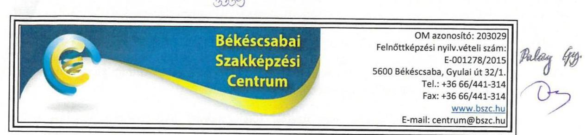

Iktatószám: A-180/4/2020.

Domokos László
elnök
Állami Számvevőszék
BUDAPEST
Apáczai Csere János utca 10. 1052
1364 Budapest 4., Pf. 54

# Tisztelt Elnök Úr! 

Az Állami Számvevőszék ellenőrzést végzett a 2018. évre vonatkozóan a Békéscsabai Szakképzési Centrumnál, amellyel kapcsolatosan három megállapítást és javaslatot tett.
A Békéscsabai Szakképzési Centrum észrevételt szeretne tenni a „Központi költségvetési szervek ellenőrzése - Szakképzési centrumok" című számvevőszéki jelentéstervezetre.

## Az Állami Számvevőszék a következő megállapításokat határozta meg:

1. A szakképzési centrum nem rendelkezett az Ávr. 13. § (2) bekezdés a) pontjában előírt, a teljesítésigazolás gyakorlásának módjával, eljárási és dokumentációs részletszabályaival, valamint az ezeket végző személyek kijelölésének rendjével kapcsolatos belső előírásokat, feltételeket tartalmazó belső szabályozással.
2. A szakképzési centrum a Számv. tv. 69. § (1) bekezdésében, valamint az Áhsz. 22. § (1)(2) bekezdésében előírtak ellenére a 2018. évi éves költségvetési beszámolója mérlegtételeit nem támasztotta alá olyan leltárral, amely tételesen, ellenőrizhető módon tartalmazza a mérlegben szereplő eszközöket és forrásokat mennyiségben és értékben.
3. A szakképzési centrum kötelezettségvállalások, más fizetési kötelezettségek 2018. évi nyilvántartása az Áhsz. 14. melléklet II/4. pontjában meghatározott előírásoknak nem felelt meg.

A Békéscsabai Szakképzési Centrum az alábbi észrevételeket teszi a megállapításokra:

1. A Békéscsabai Szakképzési Centrum rendelkezik külön szabályzattal, *A kötelezettségvállalás, ellenjegyzés, teljesítésigazolás, érvényesítés, utalványozás eljárásrendje* címmel, amely tartalmazza a teljesítésigazolás gyakorlásának módját, eljárási és dokumentációs részletszabályait, valamint az ezeket végző személyek kijelölésének rendjével kapcsolatos belső előírásokat, feltételeket tartalmazó belső szabályozást.

---

2. A mérlegben szereplő eszközök és források mennyiségben és értékben történő alátámasztására az ellenőrzés során összesítő leltár került becsatolásra. A jövőbeni szabályszerű működés érdekében a Békéscsabai Szakképzési Centrum kiemelt figyelmet fordít a teljes körű tételes, ellenőrizhető dokumentálásra.
3. A kötelezettségvállalások, más fizetési kötelezettségek nyilvántartása esetében feltárt hiányosságok tekintetében a Békéscsabai Szakképzési Centrum a jogszabályban előírt rendelkezésnek megfelelően készíti el és vezeti a további működése során.

Békéscsaba, 2020. szeptember 16.

Tisztelettel,
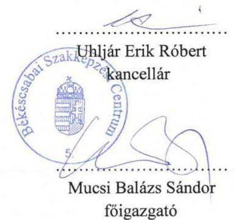

---

Ikt. szám: EL-2456-161/2020.

Mucsi Balázs Sándor úr
főigazgató
Békéscsabai Szakképzési Centrum

# Békéscsaba 

Tisztelt Főigazgató Úr!
„Központi költségvetési szervek ellenőrzése - Szakképzési centrumok" címmel készített számvevőszéki jelentéstervezet Békéscsabai Szakképzési Centrumra vonatkozó megállapításaira a 2020. szeptember 16-án kelt, A-180/4/2020. iktatószámú levélben megküldött észrevételeit megkaptam.

Az Állami Számvevőszék észrevételekre vonatkozó álláspontjáról a felügyeleti vezető által készített részletes tájékoztatást csatoltan megküldöm.

Tájékoztatom Főigazgató urat, hogy a számvevőszéki jelentésben - az Állami Számvevőszékről szóló 2011. évi LXVI. törvény 29. § (3) bekezdése alapján - a figyelembe nem vett észrevételeket szerepeltetjük az elutasítás indokának feltüntetésével.

Budapest, 2020. 10. hónap 21. nap
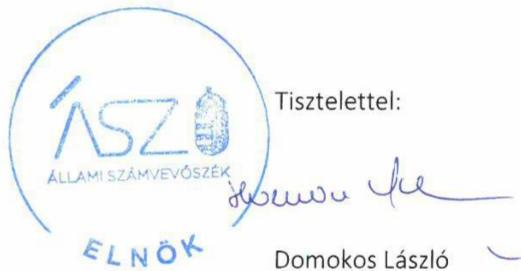

Melléklet: Tájékoztatás az észrevételek kezeléséről

---

# Tájékoztatás az észrevételek kezeléséről 

„Központi költségvetési szervek ellenőrzése - Szakképzési centrumok" című jelentéstervezet (továbbiakban: jelentéstervezet) Békéscsabai Szakképzési Centrumra (továbbiakban: Intézmény) vonatkozó megállapításaira a 2020. szeptember 16-án kelt, A-180/4/2020. iktatószámú levelében megküldött észrevételeit áttekintettem. Az észrevételek kezeléséről az alábbi tájékoztatást adom.

1. A jelentéstervezetnek az Intézmény kancellárjának címzett 1. számú javaslatára (III. számú melléklet 2/1. számú megállapítására) vonatkozó észrevételével kapcsolatban
Főigazgató úr észrevételében kijelenti, hogy az Intézmény rendelkezik külön szabályzattal, „A kötelezettségvállalás, ellenjegyzés, teljesítésigazolás, érvényesítés, utalványozás eljárásrendje" címmel, amely tartalmazza a teljesítésigazolás gyakorlásának módját, eljárási és dokumentációs részletszabályait, valamint az ezeket végző személyek kijelölésének rendjével kapcsolatos belső előírásokat, feltételeket tartalmazó belső szabályozást.
Az Állami Számvevőszék (továbbiakban: ÁSZ) EL-2457-001/2020. iktatószámú levelében bekérte az Intézmény 2018. évre vonatkozó aláírt és hiteles, az államháztartásról szóló 2011. évi CXCV. törvény 10. § (5) bekezdése szerint elkészített gazdálkodása részletes rendjét meghatározó belső szabályzatát. Főigazgató úr 2020. március 12-én kelt teljességi és hiteleségi nyilatkozata szerint a kért dokumentumot az ellenőrzés rendelkezésére bocsátotta.
Főigazgató úr nyilatkozata szerint az Intézmény gazdálkodása részletes rendjét meghatározó belső szabályzataként megküldött, 2018. január 1-től hatályos „Gazdálkodási Szabályzat" tartalmát megvizsgáltam és megállapítottam, hogy az nem tartalmazza a teljesítésigazolás gyakorlásának módjával, eljárási és dokumentációs részletszabályaival, valamint az ezeket végző személyek kijelölésének rendjével kapcsolatos belső előírásokat, feltételeket. Az adatszolgáltatásra nyitva álló határidőn belül Főigazgató úr nyilatkozata szerint az ellenőrzés rendelkezésére bocsátott további dokumentumok sem tartalmaznak a teljesítésigazolásra vonatkozó szabályozást. Megállapítottam továbbá, hogy Főigazgató úr észrevételében hivatkozott, „A kötelezettségvállalás, ellenjegyzés, teljesítésigazolás, érvényesítés, utalványozás eljárásrendje" elnevezésű dokumentum nem szerepel Főigazgató úr 2020. március 12-én kelt teljességi és hiteleségi nyilatkozatában, azt az adatszolgáltatási időszakon belül nem bocsátották az ellenőrzés rendelkezésére.
Az ÁSZ ellenőrzési megállapításait az Állami Számvevőszékről szóló 2011. évi LXVI. törvény (továbbiakban: ÁSZ tv.) 28. § (2) bekezdésben meghatározott adatszolgáltatási időszakon belül megküldött, teljességi és hitelességi nyilatkozattal alátámasztott dokumentumokra alapozva teszi. Főigazgató úr nyilatkozott az adatszolgáltatás során arról, hogy az ÁSZ részére átadott dokumentumok, adatok megbízhatóak, és a bekért adatokra, dokumentumokra vonatkozóan teljes körű információt tartalmaznak.
Mindezek alapján az Intézmény 2018. évben nem rendelkezett az államháztartásról szóló törvény végrehajtásáról szóló 368/2011. (XII. 31.) Korm. rendelet 13. § (2) bekezdés a) pontjában előírt, a

---

teljesítésigazolás gyakorlásának módjával, eljárási és dokumentációs részletszabályaival, valamint az ezeket végző személyek kijelölésének rendjével kapcsolatos belső előírásokat, feltételeket tartalmazó belső szabályozással.
A fent leírtakra tekintettel észrevételét az Állami Számvevőszék nem veszi figyelembe, a jelentéstervezet Intézmény kancellárjának címzett javaslata és az azt megalapozó megállapítása helytálló, módosításuk nem indokolt.

# 2. A jelentéstervezetnek az Intézmény kancellárjának címzett 2. számú javaslatára (III. számú melléklet 2/2. számú megállapítására) vonatkozó észrevételével kapcsolatban 

Főigazgató úr észrevételében kijelenti, hogy a mérlegben szereplő eszközök és források mennyiségben és értékben történő alátámasztására az ellenőrzés során összesítő leltár került becsatolásra, továbbá a jövőbeni szabályszerű működés érdekében az Intézmény kiemelt figyelmet fordít annak teljes körű tételes, ellenőrizhető dokumentálásra.
Az ÁSZ EL-2457-001/2020. iktatószámú levelében bekérte az Intézmény aláírt és hiteles, a 2018. évi beszámoló mérleg tételeinek alátámasztására összeállított leltárat, amely tételesen, ellenőrizhető módon tartalmazza a mérleg fordulónapján meglévő eszközöket és forrásokat. Főigazgató úr 2020. március 12-én kelt teljességi és hiteleségi nyilatkozata szerint a kért dokumentumokat az ellenőrzés rendelkezésére bocsátotta.
Főigazgató úr nyilatkozata szerint megküldött, a 2018. évi beszámoló mérleg tételeinek alátámasztására összeállított leltár dokumentumait megvizsgáltam és megállapítottam, hogy az Intézmény 2018. évi beszámolója mérlegének B/I/1 Vásárolt készletek sorát alátámasztó leltárra vonatkozóan az ellenőrzés rendelkezésére bocsátott dokumentumban a vásárolt készletek értéknövekedés, értékcsökkenés, egyenleg értékei szerepelnek, azonban az elvégzett leltárra, vagy annak kiértékelésére vonatkozó információt (leltárérték/eltérés) nem tartalmaz. Megállapítottam továbbá, hogy a mérleg G) Saját tőke sorait alátámasztó leltárak az Intézmény főigazgatójának 2020. március 12-én kelt teljességi és hiteleségi nyilatkozatában nem szerepelnek, azokat az adatszolgáltatási időszakon belül nem bocsátották az ellenőrzés rendelkezésére. Az Intézmény mérlegének H/I Költségvetési évben esedékes kötelezettségek és H/II Költségvetési évet követően esedékes kötelezettségek sorainak alátámasztására készített
 leltárként megküldött kimutatásban szereplő kötelezettségekről nem állapítható meg, hogy azok a költségvetési évben, vagy azt évet követően esedékes kötelezettségek-e.
Az ÁSZ ellenőrzési megállapításait az Állami Számvevőszékről szóló 2011. évi LXVI. törvény (továbbiakban: ÁSZ tv.) 28. § (2) bekezdésben meghatározott adatszolgáltatási időszakon belül megküldött, teljességi és hitelességi nyilatkozattal alátámasztott dokumentumokra alapozva teszi. Főigazgató úr nyilatkozott az adatszolgáltatás során arról, hogy az ÁSZ részére átadott dokumentumok, adatok megbízhatóak, és a bekért adatokra, dokumentumokra vonatkozóan teljes körű információt tartalmaznak.
Mindezek alapján az Intézmény a számvitelről szóló 2000. évi C. törvény 69. § (1) bekezdésében, valamint az államháztartás számviteléről szóló 4/2013. (I. 11.) Korm. rendelet 22. § (1)-(2) bekezdésében előírtak ellenére a 2018. évi éves költségvetési beszámolója mérlegtételeit nem támasztotta alá olyan leltárral, amely tételesen, ellenőrizhető módon tartalmazza a mérlegben szereplő eszközöket és forrásokat mennyiségben és értékben.
Főigazgató úrnak az Intézmény jövőbeli leltárkészítésének teljes körű tételes, ellenőrizhető dokumentálásra vonatkozó tájékoztatását megköszönöm, azonban felhívom figyelmét, hogy az ÁSZ tv. 33. § (1) bekezdése alapján az Intézmény kancellárja köteles a jövőben kiadmányozásra kerülő jelentésben foglalt javaslatokat megalapozó megállapításokhoz, így a mérleg leltárral való alátámasztására vonatkozó javaslathoz és az azt megalapozó megállapításhoz kapcsolódóan is intézkedési tervet összeállítani, és azt a jelentés kézhezvételétől számított harminc napon belül megküldeni.
A fent leírtakra tekintettel észrevételét az Állami Számvevőszék nem veszi figyelembe, a jelentéstervezet Intézmény kancellárjának címzett javaslata és az azt megalapozó megállapítása helytálló, módosításuk nem indokolt.

# 3. A jelentéstervezetnek az Intézmény kancellárjának címzett 3. számú javaslatára (III. számú melléklet 2/3. számú megállapítására) vonatkozó észrevételével kapcsolatban 

Főigazgató úr észrevételében arról tájékoztat, hogy a kötelezettségvállalások, más fizetési kötelezettségek nyilvántartása esetében feltárt hiányosságok tekintetében az Intézmény a jogszabályban előírt rendelkezésnek megfelelően készíti el és vezeti a további működése során.
Főigazgató úr észrevételében a jelentéstervezet megállapítását nem cáfolja. Főigazgató úrnak az Intézmény kötelezettségvállalások, más fizetési kötelezettségek nyilvántartása jogszabályi előírásoknak megfelelő elkészítésére és vezetésére vonatkozó tájékoztatását megköszönöm, azonban felhívom figyelmét, hogy az ÁSZ tv. 33. § (1) bekezdése alapján az Intézmény kancellárja köteles a jövőben kiadmányozásra kerülő jelentésben foglalt javaslatokat megalapozó megállapításokhoz, így a kötelezettségvállalások, más fizetési kötelezettségek szabályszerű nyilvántartására vonatkozó javaslathoz és az azt megalapozó megállapításhoz kapcsolódóan is intézkedési tervet köteles összeállítani, és azt a jelentés kézhezvételétől számított harminc napon belül megküldeni.
A fent leírtakra tekintettel észrevételét az Állami Számvevőszék nem veszi figyelembe, a jelentéstervezet Intézmény kancellárjának címzett javaslata és az azt megalapozó megállapítása helytálló, módosításuk nem indokolt.

Budapest, 2020. 40. hónap 21. nap

---

Ikt. szám: EL-2456-160/2020.

Uhljár Erik Róbert úr
kancellár
Békéscsabai Szakképzési Centrum

# Békéscsaba 

Tisztelt Kancellár Úr!
„Központi költségvetési szervek ellenőrzése - Szakképzési centrumok" címmel készített számvevőszéki jelentéstervezet Békéscsabai Szakképzési Centrumra vonatkozó megállapításaira a 2020. szeptember 16-án kelt, A-180/4/2020. iktatószámú levélben megküldött észrevételeit megkaptam.

Az Állami Számvevőszék észrevételekre vonatkozó álláspontjáról a felügyeleti vezető által készített részletes tájékoztatást csatoltan megküldöm.

Tájékoztatom Kancellár urat, hogy a számvevőszéki jelentésben - az Állami Számvevőszékről szóló 2011. évi LXVI. törvény 29. § (3) bekezdése alapján - a figyelembe nem vett észrevételeket szerepeltetjük az elutasítás indokának feltüntetésével.

Budapest, 2020. 10. hónap 21. nap
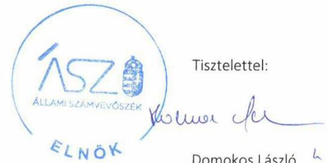

Tisztelettel:

Melléklet: Tájékoztatás az észrevételek kezeléséről

---

# Tájékoztatás az észrevételek kezeléséről 

„Központi költségvetési szervek ellenőrzése - Szakképzési centrumok" című jelentéstervezet (továbbiakban: jelentéstervezet) Békéscsabai Szakképzési Centrumra (továbbiakban: Intézmény) vonatkozó megállapításaira a 2020. szeptember 16-án kelt, A-180/4/2020. iktatószámú levelében megküldött észrevételeit áttekintettem. Az észrevételek kezeléséről az alábbi tájékoztatást adom.

1. A jelentéstervezet Kancellár úrnak címzett 1. számú javaslatára (III. számú melléklet 2/1. számú megállapítására) vonatkozó észrevételével kapcsolatban
Kancellár úr észrevételében kijelenti, hogy az Intézmény rendelkezik külön szabályzattal, „A kötelezettségvállalás, ellenjegyzés, teljesítésigazolás, érvényesítés, utalványozás eljárásrendje" címmel, amely tartalmazza a teljesítésigazolás gyakorlásának módját, eljárási és dokumentációs részletszabályait, valamint az ezeket végző személyek kijelölésének rendjével kapcsolatos belső előírásokat, feltételeket tartalmazó belső szabályozást.
Az Állami Számvevőszék (továbbiakban: ÁSZ) EL-2457-001/2020. iktatószámú levelében bekérte az Intézmény 2018. évre vonatkozó aláírt és hiteles, az államháztartásról szóló 2011. évi CXCV. törvény 10. § (5) bekezdése szerint elkészített gazdálkodása részletes rendjét meghatározó belső szabályzatát. Az Intézmény főigazgatójának 2020. március 12-én kelt teljességi és hiteleségi nyilatkozata szerint a kért dokumentumot az ellenőrzés rendelkezésére bocsátotta.
Az Intézmény főigazgatójának nyilatkozata szerint az Intézmény gazdálkodása részletes rendjét meghatározó belső szabályzataként megküldött, 2018. január 1-től hatályos „Gazdálkodási Szabályzat" tartalmát megvizsgáltam és megállapítottam, hogy az nem tartalmazza a teljesítésigazolás gyakorlásának módjával, eljárási és dokumentációs részletszabályaival, valamint az ezeket végző személyek kijelölésének rendjével kapcsolatos belső előírásokat, feltételeket. Az adatszolgáltatásra nyitva álló határidőn belül az Intézmény főigazgatója nyilatkozata szerint az ellenőrzés rendelkezésére bocsátott további dokumentumok sem tartalmaznak a teljesítésigazolásra vonatkozó szabályozást. Megállapítottam továbbá, hogy Kancellár úr észrevételében hivatkozott, „A kötelezettségvállalás, ellenjegyzés, teljesítésigazolás, érvényesítés, utalványozás eljárásrendje" elnevezésű dokumentum nem szerepel az Intézmény főigazgatójának 2020. március 12-én kelt teljességi és hiteleségi nyilatkozatában, azt az adatszolgáltatási időszakon belül nem bocsátották az ellenőrzés rendelkezésére.
Az ÁSZ ellenőrzési megállapításait az Állami Számvevőszékről szóló 2011. évi LXVI. törvény (továbbiakban: ÁSZ tv.) 28. § (2) bekezdésben meghatározott adatszolgáltatási időszakon belül megküldött, teljességi és hitelességi nyilatkozattal alátámasztott dokumentumokra alapozva teszi. Az Intézmény főigazgatója nyilatkozott az adatszolgáltatás során arról, hogy az ÁSZ részére átadott dokumentumok, adatok megbízhatóak, és a bekért adatokra, dokumentumokra vonatkozóan teljes körű információt tartalmaznak.
Mindezek alapján az Intézmény 2018. évben nem rendelkezett az államháztartásról szóló törvény végrehajtásáról szóló 368/2011. (XII. 31.) Korm. rendelet 13. § (2) bekezdés a) pontjában előírt, a teljesítésigazolás gyakorlásának módjával, eljárási és dokumentációs részletszabályaival, valamint az ezeket végző személyek kijelölésének rendjével kapcsolatos belső előírásokat, feltételeket tartalmazó belső szabályozással.
A fent leírtakra tekintettel észrevételét az Állami Számvevőszék nem veszi figyelembe, a jelentéstervezet Kancellár úrnak címzett javaslata és az azt megalapozó megállapítása helytálló, módosításuk nem indokolt.

# 2. A jelentéstervezet Kancellár úrnak címzett 2. számú javaslatára (III. számú melléklet 2/2. számú megállapítására) vonatkozó észrevételével kapcsolatban 

Kancellár úr észrevételében kijelenti, hogy a mérlegben szereplő eszközök és források mennyiségben és értékben történő alátámasztására az ellenőrzés során összesítő leltár került becsatolásra, továbbá a jövőbeni szabályszerű működés érdekében az Intézmény kiemelt figyelmet fordít annak teljes körű tételes, ellenőrizhető dokumentálásra.
Az ÁSZ EL-2457-001/2020. iktatószámú levelében bekérte az Intézmény aláírt és hiteles, a 2018. évi beszámoló mérleg tételeinek alátámasztására összeállított leltárat, amely tételesen, ellenőrizhető módon tartalmazza a mérleg fordulónapján meglévő eszközöket és forrásokat. Az Intézmény főigazgatójának 2020. március 12-én kelt teljességi és hiteleségi nyilatkozata szerint a kért dokumentumokat az ellenőrzés rendelkezésére bocsátotta.
Az Intézmény főigazgatójának nyilatkozata szerint megküldött, a 2018. évi beszámoló mérleg tételeinek alátámasztására összeállított leltár dokumentumait megvizsgáltam és megállapítottam, hogy az Intézmény 2018. évi beszámolója mérlegének B/I/1 Vásárolt készletek sorát alátámasztó leltárra vonatkozóan az ellenőrzés rendelkezésére bocsátott dokumentumban a vásárolt készletek értéknövekedés, értékcsökkenés, egyenleg értékei szerepelnek, azonban az elvégzett leltárra, vagy annak kiértékelésére vonatkozó információt (leltárérték/eltérés) nem tartalmaz. Megállapítottam továbbá, hogy a mérleg G) Saját tőke sorait alátámasztó leltárak az Intézmény főigazgatójának 2020. március 12-én kelt teljességi és hiteleségi nyilatkozatában nem szerepelnek, azokat az adatszolgáltatási időszakon belül nem bocsátották az ellenőrzés rendelkezésére. Az Intézmény mérlegének H/I Költségvetési évben esedékes kötelezettségek és H/II Költségvetési évet követően esedékes kötelezettségek sorainak alátámasztására készített leltárként megküldött kimutatásban szereplő kötelezettségekről nem állapítható meg, hogy azok a költségvetési évben, vagy azt évet követően esedékes kötelezettségek-e.
Az ÁSZ ellenőrzési megállapításait az Állami Számvevőszékről szóló 2011. évi LXVI. törvény (továbbiakban: ÁSZ tv.) 28. § (2) bekezdésben meghatározott adatszolgáltatási időszakon belül megküldött, teljességi és hitelességi nyilatkozattal alátámasztott dokumentumokra alapozva teszi. Az Intézmény főigazgatója nyilatkozott az adatszolgáltatás során arról, hogy az ÁSZ részére átadott dokumentumok, adatok megbízhatóak, és a bekért adatokra, dokumentumokra vonatkozóan teljes körű információt tartalmaznak.
Mindezek alapján az Intézmény a számvitelről szóló 2000. évi C. törvény 69. § (1) bekezdésében, valamint az államháztartás számviteléről szóló 4/2013. (I. 11.) Korm. rendelet 22. § (1)-(2) bekezdésében előírtak ellenére a 2018. évi éves költségvetési beszámolója mérlegtételeit nem támasztotta alá olyan leltárral, amely tételesen, ellenőrizhető módon tartalmazza a mérlegben szereplő eszközöket és forrásokat mennyiségben és értékben.
Kancellár úrnak az Intézmény jövőbeli leltárkészítésének teljes körű tételes, ellenőrizhető dokumentálásra vonatkozó tájékoztatását megköszönöm, azonban felhívom figyelmét, hogy az

---

ÁSZ tv. 33. § (1) bekezdése alapján köteles a jövőben kiadmányozásra kerülő jelentésben foglalt javaslatokat megalapozó megállapításokhoz, így a mérleg leltárral való alátámasztására vonatkozó javaslathoz és az azt megalapozó megállapításhoz kapcsolódóan is intézkedési tervet összeállítani, és azt a jelentés kézhezvételétől számított harminc napon belül megküldeni.
A fent leírtakra tekintettel észrevételét az Állami Számvevőszék nem veszi figyelembe, a jelentéstervezet Kancellár úrnak címzett javaslata és az azt megalapozó megállapítása helytálló, módosításuk nem indokolt.

# 3. A jelentéstervezet Kancellár úrnak címzett 3. számú javaslatára (III. számú melléklet 2/3. számú megállapítására) vonatkozó észrevételével kapcsolatban 

Kancellár úr észrevételében arról tájékoztat, hogy a kötelezettségvállalások, más fizetési kötelezettségek nyilvántartása esetében feltárt hiányosságok tekintetében az Intézmény a jogszabályban előírt rendelkezésnek megfelelően készíti el és vezeti a további működése során.
Kancellár úr észrevételében a jelentéstervezet megállapítását nem cáfolja. Kancellár úrnak az Intézmény kötelezettségvállalások, más fizetési kötelezettségek nyilvántartása jogszabályi előírásoknak megfelelő elkészítésére és vezetésére vonatkozó tájékoztatását megköszönöm, azonban felhívom figyelmét, hogy az ÁSZ tv. 33. § (1) bekezdése alapján köteles a jövőben kiadmányozásra kerülő jelentésben foglalt javaslatokat megalapozó megállapításokhoz, így a kötelezettségvállalások, más fizetési kötelezettségek szabályszerű nyilvántartására vonatkozó javaslathoz és az azt megalapozó megállapításhoz kapcsolódóan is intézkedési tervet összeállítani, és azt a jelentés kézhezvételétől számított harminc napon belül megküldeni.
A fent leírtakra tekintettel észrevételét az Állami Számvevőszék nem veszi figyelembe, a jelentéstervezet Kancellár úrnak címzett javaslata és az azt megalapozó megállapítása helytálló, módosításuk nem indokolt.

Budapest, 2020. 10. hónap 21. nap

---

# Dumaújvárosi Szakképzési Centrum 

2409 Dumaújváros, Római körút StiA
Tel: 06 (25) 743-136
www.dumaajvurcentrum.hu
088 szorrosiht: 203034
Felnöbképzési nyilvántartásba vételi szám: E-001282/2015

Állami Számvevőszék
Ikt.sz: NSZFH/611/002133-3/2020
Domokos László elnök úr részére
Úgyintéző: Mázás Rudolf

Budapest
Apáczai Csere János u. 10.
1052

Tárgy: Az ÁSZ „Központi költségvetési szervek ellenőrzése - Szakképzési Centrumok" ellenőrzési jelentéstervezetéhez észrevételek

## Tisztelt Elnök Úr!

Az Állami Számvevőszék EL-2456-095/2020. iktatószámú levelével észrevételezés céljából megküldte a Dumaújvárosi Szakképzési Centrum (DSZC) részére a „Központi költségvetési szervek ellenőrzése - Szakképzési centrumok" címû számvevőszéki jelentéstervezetet.

Megköszönve az ÁSZ ellenőrzés során végzett munkáját, a DSZC részéről a jelentéstervezetben foglalt megállapításokkal kapcsolatban az alábbi észrevételeket kívánjuk tenni:

1. ÁSZ megállapítás: „A Szakképzési Centrum a 2018. évben nem rendelkezett az Áhsz. 5. §-ban elöirt éves költségvetési beszámolóval."

Észrevétel: A DSZC rendelkezik 2018. évre vonatkozó költségvetési beszámolóval és kiegészítő mellékleteivel, ill. a 2018. évi beszámoló mérlegtételeinek alátámasztására összeállított leltárral, melyet jelen levelünkhöz mellékelten csatolunk (1. sz. melléklet).
2. ÁSZ megállapítás: „A szakképzési centrum vezetöje nem a Bkr. 11. § (1) bekezdésében megjelölt
 1. számú mellékletében előírt tartalmú nyilatkozatban értékelte a szakképzési centrum belső kontrollrendszerének minőségét."

Észrevétel: A DSZC a 2018. évi költségvetési beszámolóhoz leadta a 370/2011. (XII.31.) Korm. rendelet 1. sz. melléklete szerinti „nyilatkozatot", melyben a szakképzési centrum vezetője értékelte az irányítása alá tartozó költségvetési szerv kontrollrendszerének minőségét. A „nyilatkozatot" mellékelten csatoljuk (2. sz. melléklet).

---

Dunaújvárosi Szakképzési Centrum
2400 Dunaújváros, Római körút 51/A
Tel.: 06 (23) 743-136
www.dunadvarosissz.hu tttkaros@dunaujvarosisz.hu
UM azonosító: 200034
Felnőttképzési nyilvántartásba vételi szám: E-001002/2015
3. ÁSZ megállapítás: „A szakképzési centrum nem rendelkezett az Ávr. 13. §. (2) bekezdés a) pontjában előírt, a teljesítésigazolás gyakorlásának módjával, eljárási és dokumentációs részletszabályaival, valamint az ezeket végző személyek kijelölésének rendjével kapcsolatos belső előírásokat, feltételeket tartalmazó belső szabályozással."

Észrevétel: A DSZC 2017.09.01-től hatályos DSZC-11/1. sz. „Kötelezettségvállalás, ellenjegyzés, teljesítésigazolás, érvényesítés, utalványozás eljárásrendje" szabályzata tartalmazza a teljesítésigazolás részletszabályait, az ezeket végző személyek kijelölésének rendjével kapcsolatos előírásokat, feltételeket, a teljesítés igazolására jogosultak megbízását, aláírásmintáját. A szabályzatot és a megbízásokat mellékelten csatoljuk (3. sz. melléklet).
4. ÁSZ megállapítás: „A szakképzési centrum kötelezettségvállalások, más fizetési kötelezettségek 2018. évi nyilvántartása az Áhsz. 14. melléklet II/4. pontjában meghatározott előírásoknak nem felelt meg."

Észrevétel: A DSZC a kötelezettségvállalások, más fizetési kötelezettségek nyilvántartásához a Forrás.Net Integrált Ügyviteli Rendszert használja. Az adatok kinyerése a program lekérdező rendszerén keresztül történt, melynek megfelelő nyilvántartást küldtük meg az ÁSZ ellenőrzéséhez.

Dunaújváros, 2020. szeptember 16.
Melléklet: - 1. sz. melléklet a DSZC 2018. évi költségvetési beszámolója és mellékletei

- 2. sz. melléklet a költségvetési szerv vezetőjének nyilatkozata a DSZC kontrollrendszerének minőségéről (2019.02.28.)
- 3. sz. melléklet a DSZC-11/1 számú „Kötelezettségvállalás, ellenjegyzés, teljesítés igazolás, érvényesítés, utalványozás eljárásrendje, teljesítésigazolásra szóló megbízások

Tisztelettel,

Piros Mariann
kancellár

Pocsainé Varga Veronika főigazgató

---

Ikt. szám: EL-2456-165/2020.

Pocsainé Varga Veronika úrhölgy
főigazgató
Dunaújvárosi Szakképzési Centrum

# Dunaújváros 

Tisztelt Főigazgató Úrhölgy!

A „Központi költségvetési szervek ellenőrzése - Szakképzési centrumok" címmel készített számvevőszéki jelentéstervezetre a 2020. szeptember 16-án kelt, NSZFH/611/002133-3/2020. iktatószámú levélben megküldött észrevételt megkaptam.

Az Állami Számvevőszék észrevételre vonatkozó álláspontjáról a felügyeleti vezető által készített részletes tájékoztatást csatoltan megküldöm.

Tájékoztatom Főigazgató úrhölgyet, hogy a számvevőszéki jelentésben - az Állami Számvevőszékről szóló 2011. évi LXVI. törvény 29. § (3) bekezdése alapján - a figyelembe nem vett észrevételeket szerepeltetjük az elutasítás indokának feltüntetésével.

Budapest, 2020. 40 hónap 20 nap

Melléklet: Tájékoztatás az észrevétel kezeléséről

Tisztelettel:

---

# Tájékoztatás az észrevétel kezeléséről 

A „Központi költségvetési szervek ellenőrzése - Szakképzési centrumok" című jelentéstervezetre (továbbiakban: jelentéstervezet) a 2020. szeptember 16-án kelt, NSZFH/611/002133-3/2020. iktatószámú - kancellár úrhölgyyel közösen írt - levelében megküldött észrevételt áttekintettem. Az észrevétel kezeléséről az alábbi tájékoztatást adom.

Az Állami Számvevőszék (továbbiakban: ÁSZ) az ellenőrzési megállapításait az Állami Számvevőszékről szóló 2011. évi LXVI. törvény (továbbiakban: ÁSZ tv.) 28. § (2) bekezdése alapján az ellenőrzött szervezet által az ellenőrzéséhez kapcsolódóan, az ellenőrzés lefolytatásához a törvényi határidőben rendelkezésre bocsátott, a teljességi és hitelességi nyilatkozatban feltüntetett dokumentumokra alapozza.

Kancellár úrhölgy 2020. március 10-i keltezésű NSZFH/611/001762-2/2020. iktatószámú teljességi és hitelességi nyilatkozata (továbbiakban: THNY) szerint az ÁSZ részére átadott dokumentumok, adatok megbízhatóak, és a bekért adatokra, dokumentumokra vonatkozóan teljes körű információt tartalmaznak.

Az észrevételhez mellékletként csatolt, az ÁSZ részére az adatszolgáltatásra biztosított törvényi határidőn kívül megküldött, utólag rendelkezésre bocsátott dokumentumokat az ÁSZ nem értékelte.

1. A jelentéstervezet III. melléklet 10/4. számú, az éves költségvetési beszámoló hiányára tett és a kapcsolódó 4. számú javaslatra vonatkozó észrevételét az Állami Számvevőszék nem veszi figyelembe.

Főigazgató úrhölgy észrevételében jelezte, hogy a Dunaújvárosi Szakképzési Centrum (továbbiakban: DSZC) rendelkezik 2018. évre vonatkozó költségvetési beszámolóval és kiegészítő mellékleteivel, ill. a 2018. évi beszámoló mérlegtételeinek alátámasztására összeállított leltárral.

Az Állami Számvevőszék az EL-2465-001/2020. iktatószámú, 2020. február 28-án kelt levelének (továbbiakban: adatbekérő levél) 3. számú melléklete 10. pontjában kérte az ÁSZ részére az ellenőrzéshez megküldeni a 2018. évre vonatkozó költségvetési beszámoló és kiegészítő mellékletei dokumentumokat.

A DSZC által az adatszolgáltatás során törvényi határidőben beküldött, THNY 1.10.1 sorszámú sorában jelzett „2018.pdf" dokumentum felülvizsgálata során megállapítottam, hogy az nem a DSZC 2018. évi költségvetési beszámolója és annak kiegészítő mellékletei, hanem a DSZC 2019. február 28-án kelt, „Időközi mérlegjelentés - IV. negyedév" dokumentum, melynek tartalma nem azonos a költségvetési beszámoló tartalmával.

Tájékoztatom Főigazgató úrhölgyet, hogy a 2456-045/2020. iktatószámú, a „Központi költségvetési szervek ellenőrzése - Szakképzési centrumok" című számvevőszéki jelentéstervezet a DSZC 2018. évi beszámoló mérlegtételei alátámasztására összeállított leltár hiányára vonatkozó megállapítást nem tartalmaz.

---

A fentiekre tekintettel a jelentéstervezet kapcsolódó megállapításának módosítása nem indokolt.
2. A jelentéstervezet III. melléklet 10/7. számú, a vezetői nyilatkozattal kapcsolatban tett és a kapcsolódó 7. számú javaslatra vonatkozó észrevételét az Állami Számvevőszék nem veszi figyelembe.
Főigazgató úrhölgy észrevételében leírta, hogy a DSZC a 2018. évi költségvetési beszámolóhoz leadta a 370/2011. (XII.31.) Korm. rendelet 1. sz. melléklete szerinti „nyilatkozatot", melyben a szakképzési centrum vezetője értékelte az irányítása alá tartozó költségvetési szerv kontrollrendszerének minőségét.
Az ÁSZ az adatbekérő levél 3. számú melléklete 12. pontjában kérte az ellenőrzéshez beküldeni a 2018. évre vonatkozó vezetői nyilatkozatot a belső kontrollrendszer minőségéről.
A Kancellár úrhölgy a THNY 1.12.1 sorszámú sorában jelzett „2018. évi beszámoló Nyilatkozat.pdf" dokumentummal igazoltan az ellenőrzés rendelkezésére bocsátotta a 2019. február 28-án kelt nyilatkozatot. A nyilatkozat felülvizsgálata során megállapítottam, hogy annak szövegezése több helyen eltér a 2016. X. 1. napjától hatályos költségvetési szervek belső kontrollrendszeréről és belső ellenőrzéséről szóló 370/2011. (XII. 31.) Korm. rendelet (továbbiakban: Bkr.) 1. mellékletében előírtaktól, mert nem tartalmazza a Bkr. szerinti nyilatkozat A) pontja második gondolatjelben lévő szervezeti kultúra kialakítására vonatkozó szöveget.
A főigazgatói nyilatkozat a Bkr. 1. melléklet A) pontja harmadik gondolatjelben lévő „vagyon rendeltetésszerű használatáról" szöveg helyett „vagyon rendeltetésszerű igénybevételéről" kifejezést, valamint az „alapító okiratban megjelölt tevékenységek" szöveg helyett az „alapító okiratban előírt tevékenységek" kifejezést tartalmazza.
Továbbá a főigazgatói nyilatkozatban a Bkr. 1. melléklet A) pontja második bekezdésében meghatározott „integrált kockázatkezelési rendszer" helyett „kockázatkezelési rendszer" kifejezés szerepel.
A fentiekre tekintettel a jelentéstervezet kapcsolódó megállapításának módosítása nem indokolt.
3. A jelentéstervezet III. melléklet 10/2. számú, a gazdálkodási jogköröket gyakorlók nyilvántartásával kapcsolatban tett és a kapcsolódó 2. számú javaslatra vonatkozó észrevételét az Állami Számvevőszék nem veszi figyelembe.
Főigazgató úrhölgy észrevételében jelezte, hogy a DSZC 2017.09.01-től hatályos DSZC-11/1. sz. „Kötelezettségvállalás, ellenjegyzés, teljesítésigazolás, érvényesítés, utalványozás eljárásrendje" szabályzata tartalmazza a teljesítésigazolás részletszabályait, az ezeket végző személyek kijelölésének rendjével kapcsolatos előírásokat, feltételeket, a teljesítés igazolására jogosultak megbízását, aláírásmintáját.
Az ÁSZ az adatbekérő levél 3. számú melléklete 13. pontjában kérte az ellenőrzéshez beküldeni a kötelezettségvállalásra, teljesítésigazolásra jogosult személyekről és aláírás-mintájukról vezetett nyilvántartást. A Kancellár úrhölgy a THNY-vel igazoltan az ellenőrzés rendelkezésére bocsátotta a „Kötelezettségváll.pdf" dokumentumot, amely 15 db felhatalmazás kötelezettségvállalás ellátásához és egy db felhatalmazás kötelezettségvállalás ellátásához visszavonását tartalmazó dokumentum a DSZC főigazgatójának részéről.
A Kancellár úrhölgy által beküldött fenti dokumentumok nem felelnek meg az államháztartásról szóló törvény végrehajtásáról szóló 368/2011. (XII. 31.) Korm. rendelet (továbbiakban: Ávr.) 60. § (3)

---

bekezdése előírásainak, amely szerint a kötelezettséget vállaló szerv a kötelezettségvállalásra, pénzügyi ellenjegyzésre, teljesítés igazolására, érvényesítésre, utalványozásra jogosult személyekről és aláírás-mintájukról - elektronikus aláírás alkalmazása esetén a használt tanúsítványokról és az elektronikus aláíráshoz kapcsolódó tanúsítvány nyilvános adatairól - a belső szabályzatában foglaltak szerint naprakész nyilvántartást vezet.
A fentiekre tekintettel a jelentéstervezet kapcsolódó megállapításának módosítása nem indokolt.
4. A jelentéstervezet III. melléklet 10/6. számú, a kötelezettségvállalások nyilvántartásával kapcsolatban tett és a kapcsolódó 6. számú javaslatra vonatkozó észrevételét az Állami Számvevőszék nem veszi figyelembe.
Főigazgató úrhölgy észrevételében leírta, hogy a DSZC a kötelezettségvállalások, más fizetési kötelezettségek nyilvántartásához a Forrás.Net Integrált Ügyviteli Rendszert használja. Az adatok kinyerése a program lekérdező rendszerén keresztül történt, melynek megfelelő nyilvántartást küldtek meg az ÁSZ ellenőrzéséhez.
Az ÁSZ az adatbekérő levél 3. számú melléklete 14. pontjában kérte az ellenőrzéshez beküldeni a kötelezettségvállalásokról vezetett nyilvántartást. Kancellár úrhölgy a THNY-vel igazoltan az ellenőrzés rendelkezésére bocsátotta a „Kötváll. nyilvántartás.pdf" dokumentumot. A beküldött dokumentum a DSZC 2018. évi kötelezettségvállalásainak nyilvántartása, amely azonban az államháztartás számviteléről szóló 4/2013. (I.11.) Kormányrendelet 14. melléklet II./4. a)-h) pontjaiban előírt adatok közül nem tartalmazta az a) pontban meghatározott kötelezettségvállalás sorszámát, az azt tanúsító dokumentum megnevezését, a pénzügyi ellenjegyzésre vonatkozó adatokat, a b) pontban meghatározott tanúsító dokumentum megnevezését, iktató- vagy érkeztető számát, keltét, valamint az f) pont szerinti kötelezettségek módosulásait.
A fentiekre tekintettel a jelentéstervezet kapcsolódó megállapításának módosítása nem indokolt.
Budapest, 2020. 10 hónap 20. nap

---

# 150 éve   e közpénzek őre 

Ikt. szám: EL-2456-164/2020.
Piros Mariann úrhölgy
kancellár
Dunaújvárosi Szakképzési Centrum

## Dunaújváros

Tisztelt Kancellár Úrhölgy!

A „Központi költségvetési szervek ellenőrzése - Szakképzési centrumok" címmel készített számvevőszéki jelentéstervezetre a 2020. szeptember 16-án kelt, NSZFH/611/002133-3/2020. iktatószámú levélben megküldött észrevételt megkaptam.

Az Állami Számvevőszék észrevételre vonatkozó álláspontjáról a felügyeleti vezető által készített részletes tájékoztatást csatoltan megküldöm.

Tájékoztatom Kancellár úrhölgyet, hogy a számvevőszéki jelentésben - az Állami Számvevőszékről szóló 2011. évi LXVI. törvény 29. § (3) bekezdése alapján - a figyelembe nem vett észrevételeket szerepeltetjük az elutasítás indokának feltüntetésével.

Budapest, 2020. 10 hónap 20 nap

Melléklet: Tájékoztatás az észrevétel kezeléséről

---

# Tájékoztatás az észrevétel kezeléséről 

A „Központi költségvetési szervek ellenőrzése - Szakképzési centrumok" címû jelentéstervezetre (továbbiakban: jelentéstervezet) a 2020. szeptember 16-án kelt, NSZFH/611/002133-3/2020. iktatószámú - főigazgató úrhölggyel közösen írt - levelében megküldött észrevételt áttekintettem. Az észrevétel kezeléséről az alábbi tájékoztatást adom.

Az Állami Számvevőszék (továbbiakban: ÁSZ) az ellenőrzési megállapításait az Állami Számvevőszékről szóló 2011. évi LXVI. törvény (továbbiakban: ÁSZ tv.) 28. § (2) bekezdése alapján az ellenőrzött szervezet által az ellenőrzéséhez kapcsolódóan, az ellenőrzés lefolytatásához a törvényi határidőben rendelkezésre bocsátott, a teljességi és hitelességi nyilatkozatban feltüntetett dokumentumokra alapozza.

Kancellár úrhölgy 2020. március 10-i keltezésű NSZFH/611/001762-2/2020. iktatószámú teljességi és hitelességi nyilatkozata (továbbiakban: THNY) szerint az ÁSZ részére átadott dokumentumok, adatok megbízhatóak, és a bekért adatokra, dokumentumokra vonatkozóan teljes körű információt tartalmaznak.

Az észrevételhez mellékletként csatolt, az ÁSZ részére az adatszolgáltatásra biztosított törvényi határidőn kívül megküldött, utólag rendelkezésre bocsátott dokumentumokat az ÁSZ nem értékelte.

1. A jelentéstervezet III. melléklet 10/4. számú, az éves költségvetési beszámoló hiányára tett és a kapcsolódó 4. számú javaslatra vonatkozó észrevételét az Állami Számvevőszék nem veszi figyelembe.
Kancellár úrhölgy észrevételében jelezte, hogy a Dunaújvárosi Szakképzési Centrum (továbbiakban: DSZC) rendelkezik 2018. évre vonatkozó költségvetési beszámolóval és kiegészítő mellékleteivel, ill. a 2018. évi beszámoló mérlegtételeinek alátámasztására összeállított leltárral.

Az Állami Számvevőszék az EL-2465-001/2020. iktatószámú, 2020. február 28-án kelt levelének (továbbiakban: adatbekérő levél) 3. számú melléklete 10. pontjában kérte az ÁSZ részére az ellenőrzéshez megküldeni a 2018. évre vonatkozó költségvetési beszámoló és kiegészítő mellékletei dokumentumokat.

A DSZC által az adatszolgáltatás során törvényi határidőben beküldött, THNY 1.10.1 sorszámú sorában jelzett „2018.pdf" dokumentum felülvizsgálata során megállapítottam, hogy az nem a DSZC 2018. évi költségvetési beszámolója és annak kiegészítő mellékletei, hanem a DSZC 2019. február 28-án kelt,
 „Időközi mérlegjelentés - IV. negyedév" dokumentum, melynek tartalma nem azonos a költségvetési beszámoló tartalmával.

Tájékoztatom Kancellár úrhölgyet, hogy a 2456-045/2020. iktatószámú, a „Központi költségvetési szervek ellenőrzése - Szakképzési centrumok" címú számvevőszéki jelentéstervezet a DSZC 2018. évi beszámoló mérlegtételei alátámasztására összeállított leltár hiányára vonatkozó megállapítást nem tartalmaz.

---

A fentiekre tekintettel a jelentéstervezet kapcsolódó megállapításának módosítása nem indokolt.
2. A jelentéstervezet III. melléklet 10/7. számú, a vezetői nyilatkozattal kapcsolatban tett és a kapcsolódó 7. számú javaslatra vonatkozó észrevételét az Állami Számvevőszék nem veszi figyelembe.
Kancellár úrhölgy észrevételében leírta, hogy a DSZC a 2018. évi költségvetési beszámolóhoz leadta a 370/2011. (XII.31.) Korm. rendelet 1. sz. melléklete szerinti „nyilatkozatot", melyben a szakképzési centrum vezetője értékelte az irányítása alá tartozó költségvetési szerv kontrollrendszerének minőségét.
Az ÁSZ az adatbekérő levél 3. számú melléklete 12. pontjában kérte az ellenőrzéshez beküldeni a 2018. évre vonatkozó vezetői nyilatkozatot a belső kontrollrendszer minőségéről.
Kancellár úrhölgy a THNY 1.12.1 sorszámú sorában jelzett „2018. évi beszámoló Nyilatkozat.pdf" dokumentummal igazoltan az ellenőrzés rendelkezésére bocsátotta a 2019. február 28-án kelt nyilatkozatot. A nyilatkozat felülvizsgálata során megállapítottam, hogy annak szövegezése több helyen eltér a 2016. X. 1. napjától hatályos költségvetési szervek belső kontrollrendszeréről és belső ellenőrzéséről szóló 370/2011. (XII. 31.) Korm. rendelet (továbbiakban: Bkr.) 1. mellékletében előírtaktól, mert nem tartalmazza a Bkr. szerinti nyilatkozat A) pontja második gondolatjelben lévő szervezeti kultúra kialakítására vonatkozó szöveget.
A főigazgatói nyilatkozat a Bkr. 1. melléklet A) pontja harmadik gondolatjelben lévő „vagyon rendeltetésszerű használatáról" szöveg helyett „vagyon rendeltetésszerű igénybevételéről" kifejezést, valamint az „alapító okiratban megjelölt tevékenységek" szöveg helyett az „alapító okiratban előírt tevékenységek" kifejezést tartalmazza.
Továbbá a főigazgatói nyilatkozatban a Bkr. 1. melléklet A) pontja második bekezdésében meghatározott „integrált kockázatkezelési rendszer" helyett „kockázatkezelési rendszer" kifejezés szerepel.
A fentiekre tekintettel a jelentéstervezet kapcsolódó megállapításának módosítása nem indokolt.
3. A jelentéstervezet III. melléklet 10/2. számú, a gazdálkodási jogköröket gyakorlók nyilvántartásával kapcsolatban tett és a kapcsolódó 2. számú javaslatra vonatkozó észrevételét az Állami Számvevőszék nem veszi figyelembe.
Kancellár úrhölgy észrevételében jelezte, hogy a DSZC 2017.09.01-től hatályos DSZC-11/1. sz. „Kötelezettségvállalás, ellenjegyzés, teljesítésigazolás, érvényesítés, utalványozás eljárásrendje" szabályzata tartalmazza a teljesítésigazolás részletszabályait, az ezeket végző személyek kijelölésének rendjével kapcsolatos előírásokat, feltételeket, a teljesítés igazolására jogosultak megbízását, aláírásmintáját.
Az ÁSZ az adatbekérő levél 3. számú melléklete 13. pontjában kérte az ellenőrzéshez beküldeni a kötelezettségvállalásra, teljesítésigazolásra jogosult személyekről és aláírás-mintájukról vezetett nyilvántartást. Kancellár úrhölgy a THNY-nyel igazoltan az ellenőrzés rendelkezésére bocsátotta a „Kötelezettségváll.pdf" dokumentumot, amely 15 db felhatalmazás kötelezettségvállalás ellátásához és egy db felhatalmazás kötelezettségvállalás ellátásához visszavonását tartalmazó dokumentum a DSZC főigazgatójának részéről.
Kancellár úrhölgy által beküldött fenti dokumentumok nem felelnek meg az államháztartásról szóló törvény végrehajtásáról szóló 368/2011. (XII. 31.) Korm. rendelet (továbbiakban: Ávr.) 60. § (3) bekezdése előírásainak, amely szerint a kötelezettséget vállaló szerv a kötelezettségvállalásra, pénzügyi ellenjegyzésre, teljesítés igazolására, érvényesítésre, utalványozásra jogosult személyekről és aláírás-mintájukról - elektronikus aláírás alkalmazása esetén a használt tanúsítványokról és az elektronikus aláíráshoz kapcsolódó tanúsítvány nyilvános adatairól - a belső szabályzatában foglaltak szerint naprakész nyilvántartást vezet.

---

A fentiekre tekintettel a jelentéstervezet kapcsolódó megállapításának módosítása nem indokolt.
4. A jelentéstervezet III. melléklet 10/6. számú, a kötelezettségvállalások nyilvántartásával kapcsolatban tett és a kapcsolódó 6. számú javaslatra vonatkozó észrevételét az Állami Számvevőszék nem veszi figyelembe.

Kancellár úrhölgy észrevételében leírta, hogy a DSZC a kötelezettségvállalások, más fizetési kötelezettségek nyilvántartásához a Forrás.Net Integrált Úgyviteli Rendszert használja. Az adatok kinyerése a program lekérdező rendszerén keresztül történt, melynek megfelelő nyilvántartást küldtek meg az ÁSZ ellenőrzéséhez.
Az ÁSZ az adatbekérő levél 3. számú melléklete 14. pontjában kérte az ellenőrzéshez beküldeni a kötelezettségvállalásokról vezetett nyilvántartást. Kancellár úrhölgy a THNY-nyel igazoltan az ellenőrzés rendelkezésére bocsátotta a „Kötváll. nyilvántartás.pdf" dokumentumot. A beküldött dokumentum a DSZC 2018. évi kötelezettségvállalásainak nyilvántartása, amely azonban az államháztartás számviteléről szóló 4/2013. (I.11.) Kormányrendelet 14. melléklet II./4. a)-h) pontjaiban előírt adatok közül nem tartalmazta az a) pontban meghatározott kötelezettségvállalás sorszámát, az azt tanúsító dokumentum megnevezését, a pénzügyi ellenjegyzésre vonatkozó adatokat, a b) pontban meghatározott tanúsító dokumentum megnevezését, iktató- vagy érkeztető számát, keltét, valamint az f) pont szerinti kötelezettségek módosulásait.

A fentiekre tekintettel a jelentéstervezet kapcsolódó megállapításának módosítása nem indokolt.

Budapest, 2020. 16. hónap 26. nap

---

györi szakképzési centrum

Domonkos László
elnök úr
Állami Számvevőszék
1364 Budapest, Pf. 54

Tisztelt Elnök Úr!

Hivatkozva az EL-2456-058/2020. számú levél mellékleteként megküldött, „Központi költségvetési szervek ellenőrzése - Szakképzési centrumok" című számvevőszéki jelentéstervezet megállapításaira, az alábbi észrevételt tesszük.

A tervezet megállapításai szerint:

- a szakképzési centrum a 2018. évre vonatkozóan nem rendelkezett az Ávr. 60. § (3) bekezdésében előírt naprakész nyilvántartással a gazdálkodási jogkört gyakorolni jogosult személyekről és aláírás-mintájukról;
- a szakképzési centrum kötelezettségvállalások, más fizetési kötelezettségek 2018. évi nyilvántartása az Áhsz. 14. melléklet II/4. pontjában meghatározott előírásoknak nem felelt meg;

A szakképzési centrumban a gazdálkodási jogkörök végzésére jogosultak írásban történő, szabályszerű felhatalmazását, kijelölését "A Kötelezettségvállalás, ellenjegyzés, teljesítésigazolás, érvényesítés, utalványozás eljárásrendje 4. számú módosított változat" illetve "A Kötelezettségvállalás, ellenjegyzés, teljesítésigazolás, érvényesítés, utalványozás eljárásrendje 5. számú módosított változat" belső szabályzatokban kerültek rögzítésre a 2018-as évben.
A kötelezettségvállalásra, pénzügyi ellenjegyzésre, teljesítésigazolásra, érvényesítésre és utalványozásra kijelölt személyeket és aláírásmintájukat ezen belső szabályzatok mellékletei tartalmazzák.
Amennyiben a gazdálkodásra kijelölt személyek tekintetében változás következik be, a szabályzat soron kívül módosításra kerül, így biztosítva azt, hogy a nyilvántartás naprakész legyen.

A szakképzési centrum a kötelezettségvállalások nyilvántartását a Forrás integrált ügyviteli rendszer Kötelezettségvállalási moduljában vezeti. A modul feladata többek között a kötelezettségvállalások nyilvántartásba vétele, külső és belső adatszolgáltatások kielégítése, a Pénzügyi és a Főkönyvi modulok kötelezettségvállalásokhoz kapcsolódó funkcióit fogja egységbe.
A nyilvántartás rendelkezik az igényeknek megfelelő bontási lehetőséggel:

---

györi szakképzési centrum

- lehetőség van a kötelezettségvállalások határidők szerinti nyilvántartására;
- előirányzati évenként rögzíthetők, így lehetőséget nyújt az előző évi, tárgyévi és következő éveket terhelő kötelezettségvállalások rögzítésére is,
- továbbá a törvényi előírásoknak megfelelően megkülönböztet előzetes és végleges kötelezettségvállalásokat is.
A szolgáltatást a Griffsoft Informatikai Zrt. biztosítja, aki vállalta, hogy a szoftverterméket folyamatosan úgy fejleszti, hogy a használatra bocsájtott mindenkori verzió összes funkciója megfeleljen a hatályos jogszabályi követelményeknek.
A szakképzési centrum az ellenőrzött időszakban a Forrás integrált ügyviteli rendszer kötelezettségvállalási moduljában vezette a nyilvántartását, amely biztosítja a törvényi előírásoknak megfelelő előírásokat a kötelezettségvállalási nyilvántartással kapcsolatosan.

Kérem észrevételeink szíves figyelembe vételét!

Győr, 2020.09.15.

# Üdvözlettel 

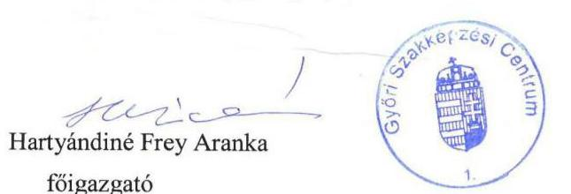

Gede Eszter
kancellár

---

Ikt. szám: EL-2456-167/2020.

Hartyándiné Frey Aranka Elvira úrhölgy
főigazgató
Győri Szakképzési Centrum

# Győr 

Tisztelt Főigazgató Úrhölgy!

A „Központi költségvetési szervek ellenőrzése - Szakképzési centrumok" címmel készített számvevőszéki jelentéstervezetre a 2020. szeptember 15-én kelt, NSZFH/614/000544-4/2020. iktatószámú levélben megküldött észrevételeket megkaptam.

Az Állami Számvevőszék észrevételekre vonatkozó álláspontjáról a felügyeleti vezető által készített részletes tájékoztatást csatoltan megküldöm.

Tájékoztatom Főigazgató úrhölgyet, hogy a számvevőszéki jelentésben - az Állami Számvevőszékről szóló 2011. évi LXVI. törvény 29. § (3) bekezdése alapján - a figyelembe nem vett észrevételeket szerepeltetjük az elutasítás indokának feltüntetésével.

Budapest, 2020. 10. hónap 20. nap

Melléklet: Tájékoztatás az észrevételek kezeléséről
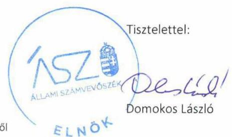

---

# Tájékoztatás az észrevételek kezeléséről 

A „Központi költségvetési szervek ellenőrzése - Szakképzési centrumok" című jelentéstervezetre (továbbiakban: jelentéstervezet) a 2020. szeptember 15-én kelt, NSZFH/614/000544-4/2020. iktatószámú levelében megküldött észrevételeket áttekintettem. Az észrevételek kezeléséről az alábbi tájékoztatást adom.

1. A jelentéstervezet III. melléklet 13/2. számú, a gazdálkodási jogkört gyakorolni jogosult személyekről és aláírás-mintájukról vezetett nyilvántartással kapcsolatos megállapításra tett észrevételt elfogadtuk.
A jelentéstervezet megállapításával érintett, a 2018. január 1-2018. december 31. közötti időszakra vonatkozó hatályos kötelezettségvállalásra, teljesítés igazolásra jogosult személyekről és aláírásmintájukról vezetett nyilvántartás dokumentumának ismételt felülvizsgálata során megállapítottuk, hogy az ellenőrzött szervezet vezetője igazolta, hogy a Győri Szakképzési Centrum a 2018. évre vonatkozóan rendelkezett az államháztartásról szóló törvény végrehajtásáról szóló 368/2011. (XII. 31.) Korm. rendelet 60. § (3) bekezdésében előírt nyilvántartással a gazdálkodási jogkört gyakorolni jogosult személyekről és aláírás-mintájukról.
A fentiekre tekintettel az észrevételt elfogadtuk, a jelentéstervezet III. számú melléklet 13/2. számú megállapítása, valamint a kapcsolódó javaslat törlésre kerül.
2. A jelentéstervezet III. melléklet 13/3. számú, kötelezettségvállalások, más fizetési kötelezettségek 2018. évi nyilvántartásával kapcsolatos megállapításra tett észrevételt az Állami Számvevőszék nem veszi figyelembe.
Az Állami Számvevőszék az EL-2468-001/2020. iktatószámú, 2020. február 28-án kelt levelének 3. számú melléklete 14. pontjában bekérte a 2018. január 1-2018. december 31. közötti időszakra vonatkozó hatályos kötelezettségvállalásokról vezetett nyilvántartást (Áhsz. 39. § (3) bek., 14. melléklet II/4. a)-h) pont). Főigazgató és Kancellár úrhölgy a 2020. március 10-i keltezésű teljességi és hitelességi nyilatkozattal - amelyben az átadott dokumentumok, adatok megbízhatóságáról és teljes körűségéről nyilatkozott - a „GYMSZC Köt.váll.-okról v. ny. 2018.pdf" és a „GYSZSZC Köt.váll.-ról v. ny. 2018.pdf" elnevezésű dokumentumokat adta át. Az Állami Számvevőszék ellenőrzési megállapításait az ellenőrzési adatbekérés során határidőben átadott, a teljességi és hitelességi nyilatkozatban feltüntetett, hiteles dokumentumok alapján tette meg.
A jelentéstervezet megállapításával érintett dokumentum ismételt felülvizsgálata során megállapítottuk, hogy a Győri Szakképzési Centrum kötelezettségvállalásokról vezetett nyilvántartással rendelkezett, azonban a nyilvántartás nem tartalmazta az Áhsz. 14. melléklet II/4. a) és b) pontjaiban foglaltak ellenére a kötelezettségvállalást, más fizetési kötelezettséget tanúsító dokumentum megnevezését. Nem tartalmazta az Áhsz. 14. melléklet II/4. f) pontjában foglaltak ellenére a kötelezettségvállalás, más fizetési kötelezettség módosulásait (pl. fizetési határidő változása, utólag kapott engedmények stb.), az azokat tanúsító dokumentum megnevezését, iktatószámát, keltét.

---

Továbbá nem tartalmazta az Áhsz. 14. melléklet II/4. g) pontjában foglaltak ellenére az utalványozás Ávr. 59. § (2) bekezdése szerinti dokumentumának azonosításához szükséges adatokat, és az Áhsz. 14. melléklet II/4. h) pontjában előírtak ellenére a könyvviteli számlák megnevezéseit.

Mindezek alapján az ellenőrzött szervezet vezetője nem igazolta, hogy a Győri Szakképzési Centrum rendelkezett a kötelezettségvállalások, más fizetési kötelezettségek Áhsz. 14. melléklet II/4. pontjában meghatározottak szerinti 2018. évi nyilvántartással, így a jelentéstervezet kapcsolódó megállapításának módosítása nem indokolt.

Budapest, 2020. 40. hónap 20. nap

---

Ikt. szám: EL-2456-168/2020.

Gede Eszter úrhölgy
kancellár
Győri Szakképzési Centrum

# Győr 

Tisztelt Kancellár Úrhölgy!

A „Központi költségvetési szervek ellenőrzése - Szakképzési centrumok" címmel készített számvevőszéki jelentéstervezetre a 2020. szeptember 15-én kelt, NSZFH/614/000544-4/2020. iktatószámú levélben megküldött észrevételeket megkaptam.

Az Állami Számvevőszék észrevételekre vonatkozó álláspontjáról a felügyeleti vezető által készített részletes tájékoztatást csatoltan megküldöm.

Tájékoztatom Kancellár úrhölgyet, hogy a számvevőszéki jelentésben - az Állami Számvevőszékről szóló 2011. évi LXVI. törvény 29. § (3) bekezdése alapján - a figyelembe nem vett észrevételeket szerepeltetjük az elutasítás indokának feltüntetésével.

Budapest, 2020. 40. hónap 20. nap

Melléklet: Tájékoztatás az észrevételek kezeléséről

---

# Tájékoztatás az észrevételek kezeléséről 

A „Központi költségvetési szervek ellenőrzése - Szakképzési centrumok" című jelentéstervezetre (továbbiakban: jelentéstervezet) a 2020. szeptember 15-én kelt, NSZFH/614/000544-4/2020. iktatószámú levelében megküldött észrevételeket áttekintettem. Az észrevételek kezeléséről az alábbi tájékoztatást adom.

1. A jelentéstervezet III. melléklet 13/2. számú, a gazdálkodási jogkört gyakorolni jogosult személyekről és aláírás-mintájukról vezetett nyilvántartással kapcsolatos megállapításra tett észrevételt elfogadtuk.
A jelentéstervezet megállapításával érintett, a 2018. január 1-2018. december 31.
 közötti időszakra vonatkozó hatályos kötelezettségvállalásra, teljesítés igazolásra jogosult személyekről és aláírásmintájukról vezetett nyilvántartás dokumentumának ismételt felülvizsgálata során megállapítottuk, hogy az ellenőrzött szervezet vezetője igazolta, hogy a Győri Szakképzési Centrum a 2018. évre vonatkozóan rendelkezett az államháztartásról szóló törvény végrehajtásáról szóló 368/2011. (XII. 31.) Korm. rendelet 60. § (3) bekezdésében előírt nyilvántartással a gazdálkodási jogkört gyakorolni jogosult személyekről és aláírásmintájukról.
A fentiekre tekintettel az észrevételt elfogadtuk, a jelentéstervezet III. számú melléklet 13/2. számú megállapítása, valamint a kapcsolódó javaslat törlésre kerül.
2. A jelentéstervezet III. melléklet 13/3. számú, kötelezettségvállalások, más fizetési kötelezettségek 2018. évi nyilvántartásával kapcsolatos megállapításra tett észrevételt az Állami Számvevőszék nem veszi figyelembe.
Az Állami Számvevőszék az EL-2468-001/2020. iktatószámú, 2020. február 28-án kelt levelének 3. számú melléklete 14. pontjában bekérte a 2018. január 1-2018. december 31. közötti időszakra vonatkozó hatályos kötelezettségvállalásokról vezetett nyilvántartást (Áhsz. 39. § (3) bek., 14. melléklet II/4. a)-h) pont). Főigazgató és Kancellár úrhölgy a 2020. március 10-i keltezésű teljességi és hitelességi nyilatkozattal - amelyben az átadott dokumentumok, adatok megbízhatóságáról és teljes körűségéről nyilatkozott - a „GYNSZC Köt.váll.-okról v. ny. 2018.pdf" és a „GYSZSZC Köt.váll.-ról v. ny. 2018.pdf" elnevezésű dokumentumokat adta át. Az Állami Számvevőszék ellenőrzési megállapításait az ellenőrzési adatbekérés során határidőben átadott, a teljességi és hitelességi nyilatkozatban feltüntetett, hiteles dokumentumok alapján tette meg.
A jelentéstervezet megállapításával érintett dokumentum ismételt felülvizsgálata során megállapítottuk, hogy a Győri Szakképzési Centrum kötelezettségvállalásokról vezetett nyilvántartással rendelkezett, azonban a nyilvántartás nem tartalmazta az Áhsz. 14. melléklet II/4. a) és b) pontjaiban foglaltak ellenére a kötelezettségvállalást, más fizetési kötelezettséget tanúsító dokumentum megnevezését. Nem tartalmazta az Áhsz. 14. melléklet II/4. f) pontjában foglaltak ellenére a kötelezettségvállalás, más fizetési kötelezettség módosulásait (pl. fizetési határidő változása, utólag kapott engedmények stb.), az azokat tanúsító dokumentum megnevezését, iktatószámát, keltét.

---

Továbbá nem tartalmazta az Áhsz. 14. melléklet II/4. g) pontjában foglaltak ellenére az utalványozás Ávr. 59. § (2) bekezdése szerinti dokumentumának azonosításához szükséges adatokat, és az Áhsz. 14. melléklet II/4. h) pontjában előírtak ellenére a könyvviteli számlák megnevezéseit.

Mindezek alapján az ellenőrzött szervezet vezetője nem igazolta, hogy a Győri Szakképzési Centrum rendelkezett a kötelezettségvállalások, más fizetési kötelezettségek Áhsz. 14. melléklet II/4. pontjában meghatározottak szerinti 2018. évi nyilvántartással, így a jelentéstervezet kapcsolódó megállapításának módosítása nem indokolt.

Budapest, 2020. 10. hó 20. nap

---

# Klimat Számvevőszék 

Iktatószám: NSZFH/618/000884-6/2020.
Ügyintéző: Tallián Zsolt

## Domokos László

Állami Számvevőszék Elnöke részére
Budapest
Apáczai Csere János u. 10.
1052
Tárgy: Észrevétel számvevőszéki jelentéstervezetre

## Tisztelt Elnök Úr!

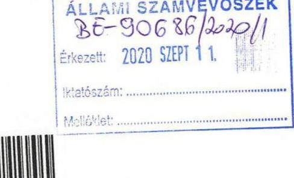

Köszönettel megkaptuk EL-2456-061/2020. és EL-2456-101/2020. iktatószámokon a „Központi költségvetési szervek ellenőrzése - Szakképzési centrumok" című számvevőszéki jelentéstervezetet.

A Kaposvári Szakképzési Centrumra vonatkozó 3. megállapításra mely szerint a „szakképzési centrum 2018. évre vonatkozóan nem rendelkezik az Ávr. 60. § (3) bekezdésében előírt naprakész nyilvántartással a gazdálkodási jogkört gyakorolni jogosult személyekről és aláírásmintájukról" a következő észrevételt tesszük:

A Kaposvári Szakképzési Centrum kötelezettségvállalás, ellenjegyzés, teljesítésigazolás, érvényesítés, utalványozás rendjéről szóló 1/2016. nyilvántartási szám alatt kiadott szabályzatának függelékei szervezeti egység bontásban (központi szervezeti egység és különkülön tagintézmények) tartalmazzák a gazdálkodási jogköröket gyakorló személyek kijelölését és aláírás-mintáját a következők szerint:

- kötelezettségvállalásra jogosultak 2. függelék,
- pénzügyi ellenjegyzésre jogosultak 3. függelék,
- teljesítés igazolására jogosultak 4. függelék,
- érvényesítésre jogosultak 5. függelék,
- utalványozásra jogosultak 6. függelék.

---

A felsorolt függelékekben szereplő aláírások alapján a Kaposvári Szakképzési Centrumban megtörtént annak ellenőrzése, hogy az arra jogosult személy gyakorolta-e az adott gazdálkodási jogkört. A függelékek vezetése naprakészen történt.
A függelékek az adatbekérés során feltöltésre kerültek az Állami Számvevőszék Elektronikus Adatbekérési Rendszerébe.

A számvevőszéki jelentéstervezetben szereplő további megállapításokra észrevételt nem kívánunk tenni.

Tisztelettel kérjük, hogy a számvevőszéki jelentés véglegesítése során észrevételünket szíveskedjen figyelembe venni.

Segítő munkáját megköszönjük.

Kaposvár, 2020. szeptember 8.
Tisztelettel:
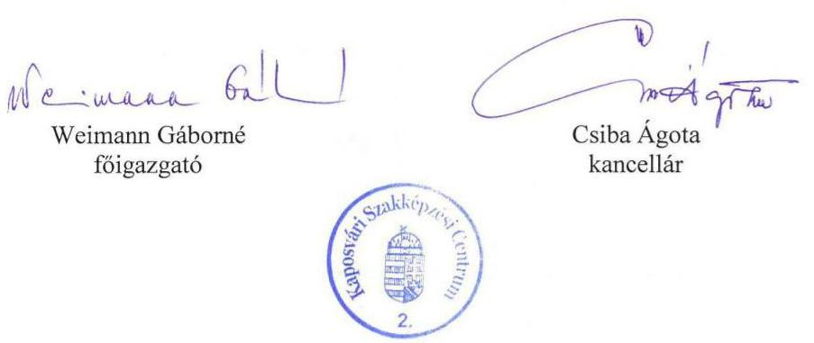

---

Ikt. szám: EL-2456-138/2020.

Weimann Gáborné úrhölgy
főigazgató
Kaposvári Szakképzési Centrum
Kaposvár

Tisztelt Főigazgató Úrhölgy!

A „Központi költségvetési szervek ellenőrzése - Szakképzési centrumok" címmel készített számvevőszéki jelentéstervezetre a 2020. szeptember 8-án kelt levélben megküldött észrevételét megkaptam.
Az Állami Számvevőszék észrevételre vonatkozó álláspontjáról a felügyeleti vezető által készített részletes tájékoztatást csatoltan megküldöm.

Tájékoztatom Főigazgató úrhölgyet, hogy a számvevőszéki jelentésben - az Állami Számvevőszékről szóló 2011. évi LXVI. törvény 29. § (3) bekezdése alapján - a figyelembe nem vett észrevételt szerepeltetjük az elutasítás indokának feltüntetésével.

Budapest, 2020. 10. hó 8. nap
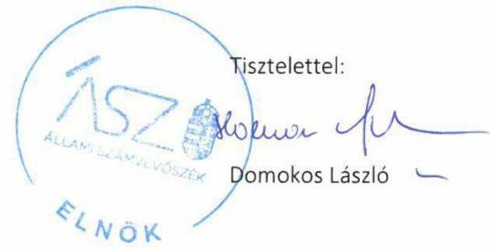

Melléklet: Tájékoztatás az észrevétel kezeléséről

---

# Tájékoztatás az észrevételek kezeléséről 

A „Központi költségvetési szervek ellenőrzése - Szakképzési centrumok" című jelentéstervezetre (továbbiakban: jelentéstervezet) 2020. szeptember 8-án kelt levelében megküldött észrevételét áttekintettem. Az észrevétel kezeléséről az alábbi tájékoztatást adom.

1. Az Ávr. 60. § (3) bekezdésében előírt naprakész nyilvántartással kapcsolatban tett megállapításra érkezett észrevétel (Jelentéstervezet III. sz. melléklet 16/2. pont)
Főigazgató úrhölgy észrevételében foglaltakra válaszolva tájékoztatom, hogy az Állami Számvevőszék az EL-2471-001/2020 iktatószámú adatbekérő levélben kérte 2018. évi Kaposvári Szakképzési Centrumra vonatkozó kötelezettségvállalásra, teljesítés igazolásra jogosult személyekről és aláírás-mintájukról vezetett nyilvántartást.
A 2020. március 11-én kelt teljességi és hitelességi nyilatkozattal alátámasztott módon a gazdálkodási jogkörgyakorlók felhatalmazásai, kijelölései, valamint a 2016. január 1-jétől hatályos „A Kötelezettségvállalás, ellenjegyzés, teljesítésigazolás, érvényesítés, utalványozás eljárásrendje" szabályzat került átadásra. A beküldött dokumentumok ismételt felülvizsgálata során megállapítottam, hogy a felhatalmazások és kijelölések önmagukban nem tekinthetőek naprakész nyilvántartásnak. A gazdálkodási jogkörgyakorlók nyilvántartása nem biztosított, mivel az egyes kijelölésekről nyilvántartás nem készült, a jogkörgyakorlás folyamatos fennállásáról, illetve megszűnéséről ez a kialakított rendszer nem szolgáltat pontos információt. A „Kötelezettségvállalás, ellenjegyzés, teljesítésigazolás, érvényesítés, utalványozás eljárásrendje" szabályzat a kötelezettségvállalók felhatalmazásának, a teljesítésigazolók kijelölésének módját tartalmazza, egyéb nyilvántartási kötelezettséget nem ír elő.

A fentiekre tekintettel az észrevételt nem fogadjuk el, így a jelentéstervezet kapcsolódó megállapításának módosítása nem indokolt.

Budapest, 2020. 10. hó 8. nap

---

# Kecskeméti Szakképzési Centrum 6000 Kecskemét, Bibó István utca 1.   OM. azonosító: 203041, FNYSZ.: E-001288/2015   e-mail: titkarsag@kecskemetiszc.hu; tel.: +36 76/482-511 

Iktatószám: NSZFH/620/000174-1/2020
Hivatkozási szám: EL-2456-063/2020
EL-2456-103/2020
Domokos László úr
elnök
Állami Számvevőszék

## Budapest

Tisztelt Elnök Úr!
A Kecskeméti Szakképzési Centrum megkapta a „Központi költségvetési szervek ellenőrzése-Szakképzési centrumok" című számvevőszéki jelentéstervezetet. A centrumra vonatkozó egyedi megállapítás 2. pontjára kívánunk kiegészítést tenni.

Megállapítás: A szakképzési centrum a Számv. tv. 69. § (1) bekezdésében, valamint az Áhsz. 22. § (1)(2) bekezdésében előírtak ellenére a 2018. évi éves költségvetési beszámolója mérlegtételeit nem támasztotta alá olyan leltárral, amely tételesen, ellenőrizhető módon tartalmazza a mérlegben szereplő eszközöket és forrásokat mennyiségben és értékben.

Kiegészítés: A Kecskeméti Szakképzési Centrum minden évben elvégzi az eszközök mennyiségi leltárfelvételét. A 2018 évi leltározás a belsőszabályzatban leírtak szerint bonyolódott. Az eszközök nyilvántartása, leltár kiértékelése a FORRAS.Net program Eszköz moduljában történik.

Az Elektronikus Adatbekérési Rendszerben, a csoportos leltáreredmény értékben főkönyvi szám szerinti riport került feltöltésre a beszámoló sorainak alátámasztásaként. A FORRÁS.Net Eszköz modulja zárt rendszer, ahol a bevitt leltári adatok, információk alapján a háttérben végzi el a tételek főkönyv szerinti összegző műveletét. A főkönyv szerinti tételes riport nyomtatása a nyilvántartott 44.500 tétel esetében 2.270 oldal, ezért nem került feltöltésre.

Egyidejűleg megköszönjük az ellenőrzést. A korrigálandó feladatokra az intézkedést megtesszük annak érdekében, hogy gazdálkodásunk a jogszabály által kötelezően előírt szabályozási keretek között történjen.

Kecskemét, 2020. szeptember 11.
Tisztelettel:

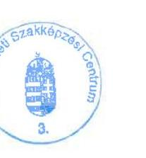
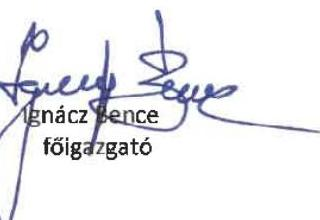

---

Ikt. szám: EL-2456-136/2020.

Ignácz Bence úr
főigazgató
Kecskeméti Szakképzési Centrum

# Kecskemét 

Tisztelt Főigazgató Úr!

A „Központi költségvetési szervek ellenőrzése - Szakképzési centrumok" címmel készített számvevőszéki jelentéstervezetre a 2020. szeptember 11-én kelt, NSZFH/620/000174-1/2020. iktatószámú levélben megküldött észrevételt megkaptam.

Az Állami Számvevőszék észrevételre vonatkozó álláspontjáról a felügyeleti vezető által készített részletes tájékoztatást csatoltan megküldöm.

Tájékoztatom Főigazgató urat, hogy a számvevőszéki jelentésben - az Állami Számvevőszékről szóló 2011. évi LXVI. törvény 29. § (3) bekezdése alapján - a figyelembe nem vett észrevételeket szerepeltetjük az elutasítás indokának feltüntetésével.

Budapest, 2020. 10. hó 0. nap

Melléklet: Tájékoztatás az észrevétel kezeléséről
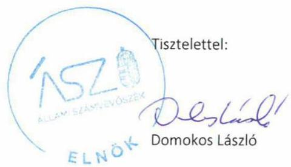

---

# Tájékoztatás az észrevétel kezeléséről 

A „Központi költségvetési szervek ellenőrzése - Szakképzési centrumok" című jelentéstervezetre (továbbiakban: jelentéstervezet) a 2020. szeptember 11-én kelt, NSZFH/620/000174-1/2020. iktatószámú - kancellár úrral közösen írt - levelében megküldött észrevételt áttekintettem. Az észrevétel kezeléséről az alábbi tájékoztatást adom.

A levelében a jelentéstervezet III. melléklet 18/2. számú, a mérlegtételeket alátámasztó leltár hiányával kapcsolatban tett kiegészítése nem indokolja a megállapítás módosítását.
Az Állami Számvevőszék az EL-2473-001/2020. iktatószámú, 2020. február 28-án kelt levelének 3. számú melléklete 11. pontjában bekérte a 2018. évi beszámoló mérleg tételeinek alátámasztására összeállított leltárt, amely tételesen, ellenőrizhető módon tartalmazza a mérleg fordulónapján meglévő eszközöket és forrásokat (Áhsz. 22. § (1) bek.). Főigazgató úr a 2020. március 11-i keltezésű teljességi és hitelességi nyilatkozattal - amelyben az átadott dokumentumok, adatok megbízhatóságáról és teljes körűségéről nyilatkozott - a „Beszámoló alátámasztására leltár.pdf" elnevezésű dokumentumot adta át. Az Állami Számvevőszék ellenőrzési megállapításait az ellenőrzési adatbekérés során határidőben átadott, a teljességi és hitelességi nyilatkozatban feltüntetett, hiteles dokumentumok alapján tette meg.
A jelentéstervezet megállapításával érintett, a 2018. évi beszámoló mérleg tételeinek alátámasztására összeállított és az ellenőrzés rendelkezésére bocsátott „Beszámoló alátámasztására leltár.pdf" elnevezésű dokumentum ismételt felülvizsgálata során megállapítottam,

 hogy a dokumentumban fellelhető kimutatások nem tekinthetők leltárnak, mivel nem tartalmazzák tételesen és ellenőrizhető módon a Kecskeméti Szakképzési Centrum mérleg fordulónapján meglévő eszközeit és forrásait. A beküldött dokumentumot levelében Főigazgató úr sem nevezi leltárnak, hanem jelzi, hogy „a csoportos leltáreredmény értékben főkönyvi szám szerinti riport került feltöltésre a beszámoló sorainak alátámasztásaként".
Mindezek alapján az ellenőrzött szervezet vezetője nem igazolta, hogy a Kecskeméti Szakképzési Centrum 2018. évi éves költségvetési beszámolója mérlegtételeit alátámasztotta az Áhsz. 22. § (1) bekezdésében előírtaknak megfelelő leltárral. Így a jelentéstervezet kapcsolódó megállapításának módosítása nem indokolt.

Budapest, 2020. 10. hónap 8. nap
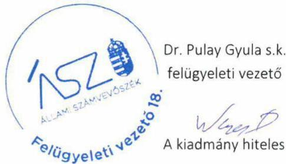

---

Ikt. szám: EL-2456-137/2020.

Leviczky Cirill úr
kancellár
Kecskeméti Szakképzési Centrum

# Kecskemét 

Tisztelt Kancellár Úr!

A „Központi költségvetési szervek ellenőrzése - Szakképzési centrumok" címmel készített számvevőszéki jelentéstervezetre a 2020. szeptember 11-én kelt, NSZFH/620/000174-1/2020. iktatószámú levélben megküldött észrevételt megkaptam.

Az Állami Számvevőszék észrevételre vonatkozó álláspontjáról a felügyeleti vezető által készített részletes tájékoztatást csatoltan megküldöm.

Tájékoztatom Kancellár urat, hogy a számvevőszéki jelentésben - az Állami Számvevőszékről szóló 2011. évi LXVI. törvény 29. § (3) bekezdése alapján - a figyelembe nem vett észrevételeket szerepeltetjük az elutasítás indokának feltüntetésével.

Budapest, 2020. 10. hónap 8. nap

Melléklet: Tájékoztatás az észrevétel kezeléséről

---

# Tájékoztatás az észrevétel kezeléséről 

A „Központi költségvetési szervek ellenőrzése - Szakképzési centrumok" című jelentéstervezetre (továbbiakban: jelentéstervezet) a 2020. szeptember 11-én kelt, NSZFH/620/000174-1/2020. iktatószámú - főigazgató úrral közösen írt - levelében megküldött észrevételt áttekintettem. Az észrevétel kezeléséről az alábbi tájékoztatást adom.

A levelében a jelentéstervezet III. melléklet 18/2. számú, a mérlegtételeket alátámasztó leltár hiányával kapcsolatban tett kiegészítése nem indokolja a megállapítás módosítását.
Az Állami Számvevőszék az EL-2473-001/2020. iktatószámú, 2020. február 28-án kelt levelének 3. számú melléklete 11. pontjában bekérte a 2018. évi beszámoló mérleg tételeinek alátámasztására összeállított leltárt, amely tételesen, ellenőrizhető módon tartalmazza a mérleg fordulónapján meglévő eszközöket és forrásokat (Áhsz. 22. § (1) bek.). Főigazgató úr a 2020. március 11-i keltezésű teljességi és hitelességi nyilatkozattal - amelyben az átadott dokumentumok, adatok megbízhatóságáról és teljes körűségéről nyilatkozott - a „Beszámoló alátámasztására leltár.pdf" elnevezésű dokumentumot adta át. Az Állami Számvevőszék ellenőrzési megállapításait az ellenőrzési adatbekérés során határidőben átadott, a teljességi és hitelességi nyilatkozatban feltüntetett, hiteles dokumentumok alapján tette meg.
A jelentéstervezet megállapításával érintett, a 2018. évi beszámoló mérleg tételeinek alátámasztására összeállított és az ellenőrzés rendelkezésére bocsátott „Beszámoló alátámasztására leltár.pdf" elnevezésű dokumentum ismételt felülvizsgálata során megállapítottam, hogy a dokumentumban fellelhető kimutatások nem tekinthetők leltárnak, mivel nem tartalmazzák tételesen és ellenőrizhető módon a Kecskeméti Szakképzési Centrum mérleg fordulónapján meglévő eszközeit és forrásait. A beküldött dokumentumot levelében Kancellár úr sem nevezi leltárnak, hanem jelzi, hogy „a csoportos leltáreredmény értékben főkönyvi szám szerinti riport került feltöltésre a beszámoló sorainak alátámasztásaként".
Mindezek alapján az ellenőrzött szervezet vezetője nem igazolta, hogy a Kecskeméti Szakképzési Centrum 2018. évi éves költségvetési beszámolója mérlegtételeit alátámasztotta az Áhsz. 22. § (1) bekezdésében előírtaknak megfelelő leltárral. Így a jelentéstervezet kapcsolódó megállapításának módosítása nem indokolt.

Budapest, 2020. 10. hónap 8. nap
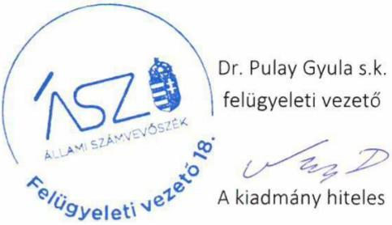

---

331h
Ruljaj Gy.
Ikt.szám: NSZFH/629/001774-4/2020
Tárgy: észrevétel az EL-2456-045/2020 iktatószámú jelentéstérvezethez

Domokos László Úr
Elnök
Állami Számvevőszék

Tisztelt Elnök Úr!

Az EL-2456-045/2020 iktatószámú jelentéstervezet Baranya Megyei Szakképzési Centrumot érintő megállapításaira az alábbi észrevételeket tesszük:

- A jelentéstervezet III. számú mellékletének 27/2. számú megállapításához:
(„A szakképzési centrum a Számv. tv. 69. § (1) bekezdésében, valamint az Áhsz. 22. § (1)-(2) bekezdésében előírtak ellenére a 2018. évi éves költségvetési beszámolója mérlegtételeit nem támasztotta alá olyan leltárral, amely tételesen, ellenőrizhető módon tartalmazza a mérlegben szereplő eszközöket és forrásokat mennyiségben és értékben.")

Az Elektronikus Adatszolgáltatási Rendszerbe feltöltött dokumentumok mellett a Baranya Megyei Szakképzési Centrumban fellelhetők az alábbi dokumentumok is:

- a 2018. december 31-i fordulónapra készült leltár végrehajtásának dokumentumai, leltárkörzetenként lefüzve (leltárfelvételi ívek, jegyzőkönyvek),
- 2018. december 31-i dátumra szóló „csoportos leltár eredmény", ami a leltározást követően került generálásra a számviteli szoftverből és eszközönként tételesen mutatja a leltár eredményét.
- A jelentéstervezet III. számú mellékletének 27/3. megállapításához:
(„A szakképzési centrum a 2018. évre vonatkozóan nem rendelkezett az Ávr. 60. § (3) bekezdésében előírt naprakész nyilvántartással a gazdálkodási jogkört gyakorolni jogosult személyekről és aláírásmintájukról.")

A kötelezettségvállalásra, pénzügyi ellenjegyzésre, teljesítés igazolására, érvényesítésre, utalványozásra jogosult személyekről és aláírás-mintájukról szóló nyilvántartás feltöltésre került az Elektronikus Adatszolgáltatási Rendszerbe az alábbiak szerint:

- kötelezettségvállalás: „kötv szab 20181 függelék.pdf", „kötv szab 20182 függelék.pdf", „Kötváll szab 2 mód 20180701.pdf"
- pénzügyi ellenjegyzés: „kötv szab 20183 függelék.pdf", „kötv szab 20183 függ(kiegészítés).pdf", „Kötváll szab 3 mód 20180925.pdf", „Kötváll szab 4 mód 20181229.pdf"
- teljesítés igazolása: „kötv szab 20184 függelék.pdf", „Kötváll szab 2 mód 20180701.pdf", „Kötváll szab 4 mód 20181229.pdf"
- érvényesítés: „kötv szab 20185 függelék.pdf", „Kötváll szab 1 mód 20180301.pdf", „Kötváll szab 3 mód 20180925.pdf", „Kötváll szab 4 mód 20181229.pdf"
- utalványozás: „Kötv szab 20186 függelék.pdf", „Kötváll szab 2 mód 20180701.pdf"

---

- A jelentéstervezet III. számú mellékletének 27/4. megállapításhoz:
(„A szakképzési centrum kötelezettségvállalások, más fizetési kötelezettségek 2018. évi nyilvántartása az Áhsz. 14. melléklet II/4. pontjában meghatározott előírásoknak nem felelt meg.")

A 2018. évi kötelezettségvállalások Áhsz. 14. melléklet II/4. pontja szerinti nyilvántartására - az Elektronikus Adatszolgáltatási Rendszerbe feltöltött dokumentumokon kívül - rendelkezésre áll egy további, excel alapú nyilvántartás is, ami teljes körűen csak a hivatkozásai alapjául szolgáló, 5135 db fájlból álló, 1,2 gigabájt méretű adatbázissal együtt használható.

Pécs, 2020. 09. 16.

Tisztelettel:
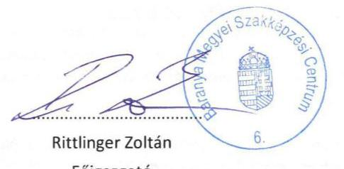

Rittlinger Zoltán
Főigazgató
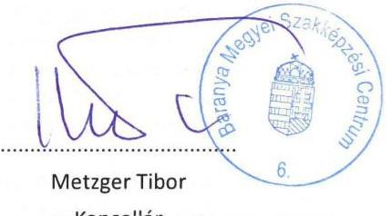

Metzger Tibor
Kancellár

---

Ikt. szám: EL-2456-169/2020.

Rittlinger Zoltán úr
főigazgató
Baranya Megyei Szakképzési Centrum

Pécs

Tisztelt Főigazgató Úr!

A „Központi költségvetési szervek ellenőrzése - Szakképzési centrumok" címmel készített számvevőszéki jelentéstervezetre a 2020. szeptember 16-án kelt, NSZFH/629/001774-4/2020. iktatószámú levélben megküldött észrevételeket megkaptam.

Az Állami Számvevőszék észrevételekre vonatkozó álláspontjáról a felügyeleti vezető által készített részletes tájékoztatást csatoltan megküldöm.

Tájékoztatom Főigazgató urat, hogy a számvevőszéki jelentésben - az Állami Számvevőszékről szóló 2011. évi LXVI. törvény 29. § (3) bekezdése alapján - a figyelembe nem vett észrevételeket szerepeltetjük az elutasítás indokának feltüntetésével.

Budapest, 2020. 10. hónap 20. nap

Melléklet: Tájékoztatás az észrevételek kezeléséről
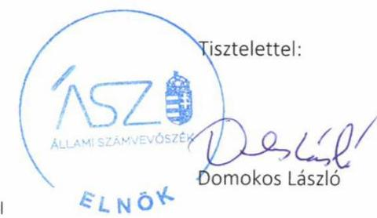

---

# Tájékoztatás az észrevételek kezeléséről 

A „Központi költségvetési szervek ellenőrzése - Szakképzési centrumok" című jelentéstervezetre (továbbiakban: jelentéstervezet) a 2020. szeptember 16-án kelt, NSZFH/629/001774-4/2020. iktatószámú levelében megküldött észrevételeket áttekintettem. Az észrevételek kezeléséről az alábbi tájékoztatást adom.

1. A jelentéstervezet III. melléklet 27/2. számú, a mérlegtételeket alátámasztó leltárral kapcsolatos megállapításra tett észrevételt az Állami Számvevőszék nem veszi figyelembe.
Az Állami Számvevőszék az EL-2482-001/2020. iktatószámú, 2020. február 28-án kelt levelének 3. számú melléklete 11. pontjában bekérte a 2018. évi beszámoló mérleg tételeinek alátámasztására összeállított leltár dokumentumait, amelyek tételesen, ellenőrizhető módon tartalmazzák a mérleg fordulónapján meglévő eszközöket és forrásokat (Áhsz. 22. § (1) bek.). Főigazgató úr és Kancellár úr a 2020. március 11-i keltezésű teljességi és hitelességi nyilatkozattal - amelyben az átadott dokumentumok, adatok megbízhatóságáról és teljes körűségéről nyilatkozott - a „11 Beszámolót alátámasztó j.könyv.pdf" és a „11 Eszk.kartonok záró br. értéke.pdf" megnevezésű dokumentumokat bocsátotta az ellenőrzés rendelkezésére. Az Állami Számvevőszék ellenőrzési megállapításait az ellenőrzési adatbekérés során határidőben átadott, a teljességi és hitelességi nyilatkozatban feltüntetett, hiteles dokumentumok alapján tette meg.
A jelentéstervezet megállapításával érintett, a 2018. évi beszámoló mérleg tételeinek alátámasztására összeállított leltár dokumentumainak ismételt felülvizsgálata során megállapítottuk, hogy a dokumentumokban fellelhető kimutatások nem tekinthetők leltárnak, mivel nem tartalmazzák tételesen és ellenőrizhető módon a Baranya Megyei Szakképzési Centrum mérleg fordulónapján meglévő eszközeit és forrásait. Főigazgató úr és Kancellár úr észrevételében jelzi, hogy az Elektronikus Adatszolgáltatási Rendszerbe feltöltött dokumentumok mellett a Baranya Megyei Szakképzési Centrumban fellelhetők még további mérleget alátámasztó leltárdokumentumok is. Ezen dokumentumok azonban nem kerültek az ÁSZ számára átadásra az adatszolgáltatásra biztosított határidőben.

Mindezek alapján az ellenőrzött szervezet vezetője nem igazolta, hogy a Baranya Megyei Szakképzési Centrum 2018. évi éves költségvetési beszámolója mérlegtételeit alátámasztotta az Áhsz. 22. § (1) bekezdésében előírtaknak megfelelő leltárral, így a jelentéstervezet kapcsolódó megállapításának módosítása nem indokolt.
2. A jelentéstervezet III. melléklet 27/3. számú, a gazdálkodási jogkört gyakorolni jogosult személyekről és aláírás-mintájukról vezetett nyilvántartással kapcsolatos megállapításra tett észrevételt elfogadtuk.
A jelentéstervezet megállapításával érintett, a 2018. január 1-2018. december 31. közötti időszakra vonatkozó naprakész kötelezettségvállalásra, teljesítés igazolásra jogosult személyekről és aláírásmintájukról vezetett nyilvántartás dokumentumának ismételt felülvizsgálata során megállapítottuk, hogy az ellenőrzött szervezet vezetője igazolta, hogy a Baranya Megyei Szakképzési Centrum a 2018. évre vonatkozóan rendelkezett az államháztartásról szóló törvény végrehajtásáról szóló 368/2011. (XII.

---

31.) Korm. rendelet 60. § (3) bekezdésében előírt nyilvántartással a gazdálkodási jogkört gyakorolni jogosult személyekről és aláírás-mintájukról.

A fentiekre tekintettel az észrevételt elfogadtuk, a jelentéstervezet III. számú melléklet 27/3. számú megállapítása törlésre kerül.
3. A jelentéstervezet III. melléklet 27/4. számú, kötelezettségvállalások, más fizetési kötelezettségek 2018. évi nyilvántartásával kapcsolatos megállapításra tett észrevételt az Állami Számvevőszék nem veszi figyelembe.

Az Állami Számvevőszék az EL-2482-001/2020. iktatószámú, 2020. február 28-án kelt levelének 3. számú melléklete 14. pontjában bekérte a 2018. január 1-2018. december 31. közötti időszakra vonatkozó hatályos kötelezettségvállalásokról vezetett nyilvántartást (Áhsz. 39. § (3) bek., 14. melléklet II/4. a)-h) pont). Főigazgató úr és Kancellár úr a 2020. március 11-i keltezésű teljességi és hitelességi nyilatkozattal - amelyben az átadott dokumentumok, adatok megbízhatóságáról és teljes körűségéről nyilatkozott - a „bér_12.hó KIRA_szftetel_FOSZAMF.xlsx", a „bér_12.hó KIRA_szftetel_EGYÉB.xlsx", a „bér_11.hó KIRA_szftetel.xlsx", a „bér_10. hó KIRA_szftetel.xlsx", a „bér_09. hó KIRA_szftetel.xlsx", a „bér_08.hó KIRA_szftetel.xlsx", a „bér_07.hó KIRA_szftetel.xlsx", a „bér_06.hó KIRA_szftetel.xlsx", a „bér_05.hó KIRA_szftetel.xlsx", a „bér_04.hó KIRA_szftetel.xlsx", a „bér_03.hó KIRA_szftetel.xlsx", a „bér_02.hó KIRA_szftetel.xlsx", a „bér_01.hó KIRA_szftetel.xlsx", a „14 Kötváll K3-K8.xls", a „14 Kötváll K1-K2.xls" megnevezésű dokumentumot adta át. Az Állami Számvevőszék ellenőrzési megállapításait az ellenőrzési adatbekérés során határidőben átadott, a teljességi és hitelességi nyilatkozatban feltüntetett, hiteles dokumentumok alapján tette meg.
A jelentéstervezet megállapításával érintett dokumentum ismételt felülvizsgálata során megállapítottuk, hogy a Baranya Megyei Szakképzési Centrum kötelezettségvállalásokról vezetett nyilvántartása nem tartalmazta az Áhsz. 14. melléklet II/4. pontjaiban - a d) pont kivételével - előírt tartalmi elemeket.

Mindezek alapján az ellenőrzött szervezet vezetője nem igazolta, hogy a Baranya Megyei Szakképzési Centrum rendelkezett a kötelezettségvállalások, más fizetési kötelezettségek Áhsz. 14. melléklet II/4. pontjában meghatározottak szerinti 2018. évi nyilvántartással, így a jelentéstervezet kapcsolódó megállapításának módosítása nem indokolt.

Budapest, 2020. 10. hónap 20. nap
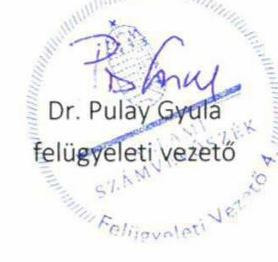

---

Ikt. szám: EL-2456-170/2020.

Metzger Tibor úr
kancellár
Baranya Megyei Szakképzési Centrum

Pécs

Tisztelt Kancellár Úr!

A „Központi költségvetési szervek ellenőrzése - Szakképzési centrumok" címmel készített számvevőszéki jelentéstervezetre a 2020. szeptember 16-án kelt, NSZFH/629/001774-4/2020. iktatószámú levélben megküldött észrevételeket megkaptam.

Az Állami Számvevőszék észrevételekre vonatkozó álláspontjáról a felügyeleti vezető által készített részletes tájékoztatást csatoltan megküldöm.

Tájékoztatom Kancellár urat, hogy a számvevőszéki jelentésben - az Állami Számvevőszékről szóló 2011. évi LXVI. törvény 29. § (3) bekezdése alapján - a figyelembe nem vett észrevételeket szerepeltetjük az elutasítás indokának feltüntetésével.

Budapest, 2020. 10. hónap 20. nap

Tisztelettel:

Melléklet: Tájékoztatás az észrevételek kezeléséről

---

# Tájékoztatás az észrevételek kezeléséről 

A „Központi költségvetési szervek ellenőrzése - Szakképzési centrumok" címú jelentéstervezetre
 (továbbiakban: jelentéstervezet) a 2020. szeptember 15-én kelt, NSZFH/629/001774-4/2020. iktatószámú levelében megküldött észrevételeket áttekintettem. Az észrevételek kezeléséről az alábbi tájékoztatást adom.

1. A jelentéstervezet III. melléklet 27/2. számú, a mérlegtételeket alátámasztó leltárral kapcsolatos megállapításra tett észrevételt az Állami Számvevőszék nem veszi figyelembe.
Az Állami Számvevőszék az EL-2482-001/2020. iktatószámú, 2020. február 28-án kelt levelének 3. számú melléklete 11. pontjában bekérte a 2018. évi beszámoló mérleg tételeinek alátámasztására összeállított leltár dokumentumait, amelyek tételesen, ellenőrizhető módon tartalmazzák a mérleg fordulónapján meglévő eszközöket és forrásokat (Áhsz. 22. § (1) bek.). Főigazgató úr és Kancellár úr a 2020. március 11-i keltezésű teljességi és hitelességi nyilatkozattal - amelyben az átadott dokumentumok, adatok megbízhatóságáról és teljes körűségéről nyilatkozott - a „11 Beszámolót alátámasztó j.könyv.pdf" és a „11 Eszk.kartonok záró br. értéke.pdf" megnevezésű dokumentumokat bocsátotta az ellenőrzés rendelkezésére. Az Állami Számvevőszék ellenőrzési megállapításait az ellenőrzési adatbekérés során határidőben átadott, a teljességi és hitelességi nyilatkozatban feltüntetett, hiteles dokumentumok alapján tette meg.
A jelentéstervezet megállapításával érintett, a 2018. évi beszámoló mérleg tételeinek alátámasztására összeállított leltár dokumentumainak ismételt felülvizsgálata során megállapítottuk, hogy a dokumentumokban fellelhető kimutatások nem tekinthetők leltárnak, mivel nem tartalmazzák tételesen és ellenőrizhető módon a Baranya Megyei Szakképzési Centrum mérleg fordulónapján meglévő eszközeit és forrásait. Főigazgató úr és Kancellár úr észrevételében jelzi, hogy az Elektronikus Adatszolgáltatási Rendszerbe feltöltött dokumentumok mellett a Baranya Megyei Szakképzési Centrumban fellelhetők még további mérleget alátámasztó leltárdokumentumok is. Ezen dokumentumok azonban nem kerültek az ÁSZ számára átadásra az adatszolgáltatásra biztosított határidőben.

Mindezek alapján az ellenőrzött szervezet vezetője nem igazolta, hogy a Baranya Megyei Szakképzési Centrum 2018. évi éves költségvetési beszámolója mérlegtételeit alátámasztotta az Áhsz. 22. § (1) bekezdésében előírtaknak megfelelő leltárral, így a jelentéstervezet kapcsolódó megállapításának módosítása nem indokolt.
2. A jelentéstervezet III. melléklet 27/3. számú, a gazdálkodási jogkört gyakorolni jogosult személyekről és aláírás-mintájukról vezetett nyilvántartással kapcsolatos megállapításra tett észrevételt elfogadtuk.
A jelentéstervezet megállapításával érintett, a 2018. január 1-2018. december 31. közötti időszakra vonatkozó naprakész kötelezettségvállalásra, teljesítés igazolásra jogosult személyekről és aláírásmintájukról vezetett nyilvántartás dokumentumának ismételt felülvizsgálata során megállapítottuk, hogy az ellenőrzött szervezet vezetője igazolta, hogy a Baranya Megyei Szakképzési Centrum a 2018. évre vonatkozóan rendelkezett az államháztartásról szóló törvény végrehajtásáról szóló 368/2011. (XII. 31.) Korm. rendelet 60. § (3) bekezdésében előírt nyilvántartással a gazdálkodási jogkört gyakorolni jogosult személyekről és aláírás-mintájukról.

A fentiekre tekintettel az észrevételt elfogadtuk, a jelentéstervezet III. számú melléklet 27/3. számú megállapítása törlésre kerül.
3. A jelentéstervezet III. melléklet 27/4. számú, kötelezettségvállalások, más fizetési kötelezettségek 2018. évi nyilvántartásával kapcsolatos megállapításra tett észrevételt az Állami Számvevőszék nem veszi figyelembe.

Az Állami Számvevőszék az EL-2482-001/2020. iktatószámú, 2020. február 28-án kelt levelének 3. számú melléklete 14. pontjában bekérte a 2018. január 1-2018. december 31. közötti időszakra vonatkozó hatályos kötelezettségvállalásokról vezetett nyilvántartást (Áhsz. 39. § (3) bek., 14. melléklet II/4. a)-h) pont). Főigazgató úr és Kancellár úr a 2020. március 11-i keltezésű teljességi és hitelességi nyilatkozattal - amelyben az átadott dokumentumok, adatok megbízhatóságáról és teljes körűségéről nyilatkozott - a „bér_12.hó KIRA_szftetel_FOSZAMF.xlsx", a „bér_12.hó KIRA_szftetel_EGYÉB.xlsx", a „bér_11.hó KIRA_szftetel.xlsx", a „bér_10. hó KIRA_szftetel.xlsx", a „bér_09. hó KIRA_szftetel.xlsx", a „bér_08.hó KIRA_szftetel.xlsx", a „bér_07.hó KIRA_szftetel.xlsx", a „bér_06.hó KIRA_szftetel.xlsx", a „bér_05.hó KIRA_szftetel.xlsx", a „bér_04.hó KIRA_szftetel.xlsx", a „bér_03.hó KIRA_szftetel.xlsx", a „bér_02.hó KIRA_szftetel.xlsx", a „bér_01.hó KIRA_szftetel.xlsx", a „14 Kötváll K3-K8.xls", a „14 Kötváll K1-K2.xls" megnevezésű dokumentumokat adta át. Az Állami Számvevőszék ellenőrzési megállapításait az ellenőrzési adatbekérés során határidőben átadott, a teljességi és hitelességi nyilatkozatban feltüntetett, hiteles dokumentumok alapján tette meg.

A jelentéstervezet megállapításával érintett dokumentum ismételt felülvizsgálata során megállapítottuk, hogy a Baranya Megyei Szakképzési Centrum kötelezettségvállalásokról vezetett nyilvántartása nem tartalmazta az Áhsz. 14. melléklet II/4. pontjaiban - a d) pont kivételével - előírt tartalmi elemeket.

Mindezek alapján az ellenőrzött szervezet vezetője nem igazolta, hogy a Baranya Megyei Szakképzési Centrum rendelkezett a kötelezettségvállalások, más fizetési kötelezettségek Áhsz. 14. melléklet II/4. pontjában meghatározottak szerinti 2018. évi nyilvántartással, így a jelentéstervezet kapcsolódó megállapításának módosítása nem indokolt.

Budapest, 2020. október 20. nap

---

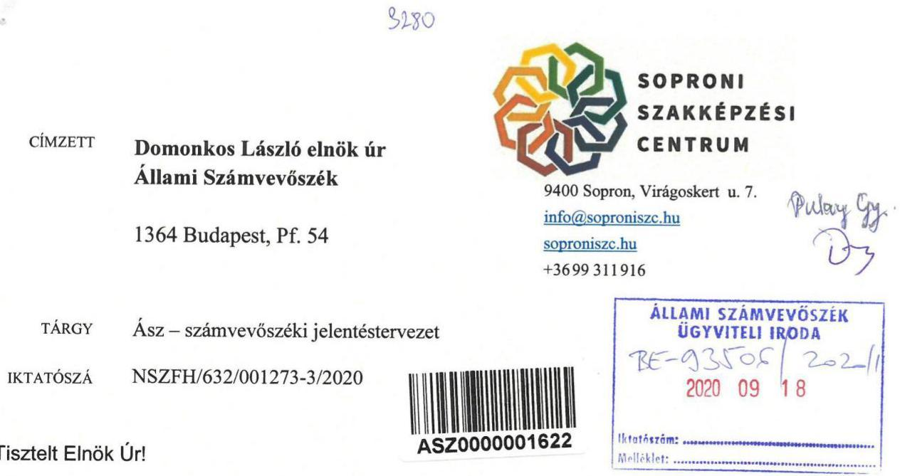

Hivatkozással az EL-2456-075/2020 iktatószámú levelük mellékletében megküldött „Központi költségvetési szervek ellenőrzése - Szakképzési centrumok" címü számvevőszéki jelentéstervezetben foglalt megállapításokra az alábbi észrevételeket tesszük:

1. Köszönjük észrevételüket a számviteli politikánkkal kapcsolatban. A Soproni Szakképzési Centrumban a költségek és bevételek felmerülésekor beazonosítjuk a kapcsolódó tevékenységeket. Iránymutatásuknak megfelelően a számviteli politikánkat kiegészítjük az alkalmazott mutatókkal és a vetítési alapokkal.
2. A Soproni Szakképzési Centrumban a költségvetési beszámoló mérlegtételeinek alátámasztása érdekében leltár készült a 2018. évben is. A leltár dokumentumait feltöltöttük, a mérlegtételek sorait alátámasztottuk analitikus kimutatással. A leltár elkészítése főkönyvi számokra történt, a mérlegsoroknak megfelelően.
3. A Soproni Szakképzési Centrum „Kötelezettségvállalás, ellenjegyzés, teljesítésigazolás, érvényesítés, utalványozás eljárásrendje" című szabályzat 2. sz. függeléke tartalmazza a gazdálkodási jogkört gyakorló személyek nyilvántartását és aláírásmintájukat. Amennyiben a gazdálkodásra kijelölt személyek tekintetében változás következik be, a szabályzat megfelelő sorszámú függeléke soron kívül módosításra kerül, így biztosítjuk, hogy a nyilvántartás naprakész legyen.
4. A Soproni Szakképzési Centrumban a kötelezettségvállalások nyilvántartása a Forrás.net integrált ügyviteli rendszerrel történik, a Kötelezettségvállalás modulban. A szoftver megfelel az Áhsz. előírásainak, nyilvántartásunk is tartalmazza az előírt adatokat. A nyilvántartásban előirányzati évenként kerülnek rögzítésre a kötelezettségvállalások, megkülönböztetve az előzetes és végleges kötelezettségvállalásokat is. A Forrás.net integrált ügyviteli rendszert a Griffsoft Informatikai Zrt. biztosítja a szakképzési centrumok részére, vállalva, hogy a szoftvert úgy fejleszti, hogy az mindenkor megfeleljen a jogszabályi előírásoknak. Az alkalmazott lekérdezések - terjedelmi okokból - nem tartalmazzák teljeskörűen a rögzített adatokat, így a megküldött dokumentum hiányosnak

tünhet. Köszönjük észrevételüket, a kötelezettségek nyilvántartására a jövőben is kiemelt figyelmet fogunk fordítani.
5. A Bkr. 11 (1) bekezdésében megjelölt 1. számú mellékletében előírt tartalmú nyilatkozatot a fenntartó rendelkezéseinek megfelelően töltöttük ki. A nyomtatványban nyilatkoztunk a Soproni Szakképzési Centrum kontrollkörnyezetéről, a kockázatkezelési rendszeréről, a kontrolltevékenységekről, az alkalmazott információs és kommunikációs rendszerről és a nyomonkövetési (monitoring) rendszerről.

Kérjük észrevételeink szíves figyelembe vételét!

Sopron, 2020. szeptember 15.

Kuntár Csaba
Főigazgató
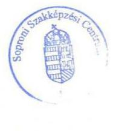

Králik Tibor
Kancellár

---

# 150 éve   a közzététel órája

Ikt. szám: EL-2456-152/2020.

Kuntár Csaba úr
főigazgató
Soproni Szakképzési Centrum

Sopron

Tisztelt Főigazgató Úr!

A „Központi költségvetési szervek ellenőrzése - Szakképzési centrumok" címmel készített számvevőszéki jelentéstervezetre a 2020. szeptember 15-én kelt, NSZFH/632/001273-3/2020. iktatószámú levélben megküldött észrevételt megkaptam.

Az Állami Számvevőszék (továbbiakban: ÁSZ) észrevételre vonatkozó álláspontjáról a felügyeleti vezető által készített részletes tájékoztatást csatoltan megküldöm.

Tájékoztatom Főigazgató urat, hogy a számvevőszéki jelentésben - az Állami Számvevőszékről szóló 2011. évi LXVI. törvény 29. § (3) bekezdése alapján - a figyelembe nem vett észrevételeket szerepeltetjük az elutasítás indokának feltüntetésével.

Budapest, 2020. október 16. nap

Tisztelettel:

Melléklet: Tájékoztatás az észrevétel kezeléséről

---

# Tájékoztatás az észrevétel kezeléséről 

A „Központi költségvetési szervek ellenőrzése - Szakképzési centrumok" című jelentéstervezetre (továbbiakban: jelentéstervezet) a 2020. szeptember 15-én kelt, NSZFH/632/001273-3/2020. iktatószámú - kancellár úrral közösen írt - levelében megküldött észrevételt áttekintettem. Az észrevétel kezeléséről az alábbi tájékoztatást adom.

1. A jelentéstervezet III. melléklet 30/1. számú, a számviteli politikával kapcsolatban tett tájékoztatást köszönöm. Azt az ÁSZ nem tekinti észrevételnek.
Főigazgató úr észrevételében jelezte, hogy a Soproni Szakképzési Centrum (továbbiakban: Soproni SZC) számviteli politikáját a jelentéstervezet megállapításai alapján kiegészítik.
Főigazgató úr az észrevételben a jelentéstervezet megállapítását nem vitatta. Köszönjük a tájékoztatását a jövőbeni intézkedésről, azonban az alapján a jelentéstervezet kapcsolódó megállapításának módosítása nem indokolt.
2. A jelentéstervezet III. melléklet 30/2. számú, a mérlegtételeket alátámasztó leltárral és a kapcsolódó 2. számú javaslatra vonatkozó észrevételével kapcsolatban
Főigazgató úr észrevételében leírta, hogy a Soproni SZC-ban a költségvetési beszámoló mérlegtételeinek alátámasztása érdekében leltár készült a 2018. évben is. A leltár dokumentumait feltöltötték, a mérlegtételek sorait analitikus kimutatással alátámasztották. A leltár elkészítése főkönyvi számokra történt, a mérlegsoroknak megfelelően.
Az ÁSZ az EL-2485-001/2020. iktatószámú, 2020. február 28-án kelt levelének (továbbiakban: adatbekérő levél) 3. számú melléklete 11. pontjában bekérte a 2018. évi beszámoló mérleg tételeinek alátámasztására összeállított leltár dokumentumait, amelyek tételesen, ellenőrizhető módon tartalmazzák a mérleg fordulónapján meglévő eszközöket és forrásokat. Főigazgató úr a 2020. március 11-i keltezésű teljességi és hitelességi nyilatkozattal (továbbiakban: THNY) - amelyben az átadott dokumentumok, adatok megbízhatóságáról és teljes körűségéről nyilatkozott - 36 db feltöltött file-ban adott át dokumentumokat a beszámoló mérlegtételeinek alátámasztására összeállított leltárként. Az ÁSZ ellenőrzési megállapításait az ellenőrzési adatbekérés során határidőben átadott, a teljességi és hitelességi nyilatkozatban feltüntetett, hiteles dokumentumok alapján tette meg.
A jelentéstervezet megállapításával érintett, az ellenőrzött által rendelkezésre bocsátott dokumentumok ismételt felülvizsgálata során megállapítottam, hogy a Soproni SZC a tárgyi eszközökre vonatkozóan nem adott át az ellenőrzés rendelkezésére olyan dokumentumot, amely a mérlegsorban szereplő érték alátámasztását igazolja. E hiányosság alapján megállapítható, hogy a Soproni SZC az államháztartás számviteléről szóló 4/2013. (I. 11.) Korm. rendelet (továbbiakban: Áhsz.) 22. § (1) bekezdésében előírtak ellenére a 2018. évi éves költségvetési beszámolója mérlegtételeit nem támasztotta alá olyan leltárral, amely tételesen, ellenőrizhető módon tartalmazza a mérlegben szereplő eszközöket és forrásokat mennyiségben és értékben.
A fentiekre tekintettel az ÁSZ az észrevételt nem veszi figyelembe, a jelentéstervezet kapcsolódó megállapításának módosítása nem indokolt.

3. A jelentéstervezet III. melléklet 30/3. számú, a gazdálkodási jogköröket gyakorlók nyilvántartásával és a kapcsolódó 3. számú javaslatra vonatkozó észrevételével kapcsolatban
Főigazgató úr észrevételében leírta, hogy a Soproni SZC „Kötelezettségvállalás, ellenjegyzés, teljesítésigazolás, érvényesítés, utalványozás eljárásrendje" című szabályzat 2. sz. függeléke tartalmazza a gazdálkodási jogkört gyakorló személyek nyilvántartását és aláírásmintájukat. Amennyiben a gazdálkodásra kijelölt személyek tekintetében változás következik be, a szabályzat megfelelő sorszámú függeléke soron kívül módosításra kerül, így biztosítják, hogy a nyilvántartás naprakész legyen.
Az ÁSZ az adatbekérő levél 3. számú melléklete 13. pontjában bekérte a kötelezettségvállalásra, teljesítésigazolásra jogosult személyekről és aláírás-mintájukról vezetett nyilvántartást. Főigazgató úr a THNY-vel igazoltan az ellenőrzés rendelkezésére bocsátotta a Soproni SZC 2018. január 1-jétől hatályos Kötelezettségvállalás, ellenjegyzés, teljesítésigazolás, érvényesítés, utalványozás eljárásrendjének 2. függelékét, amely az egyes gazdálkodási jogköröket gyakorló személyek aláírásmintáit tartalmazta.
A jelentéstervezet megállapításával érintett dokumentumok ismételt felülvizsgálata során megállapítottam, hogy a Soproni SZC által átadott dokumentumok megfelelnek az Ávr. 60. § (3) bekezdésében előírtaknak, ezért a jelentéstervezet megállapításának módosítása és a kapcsolódó javaslat törlése indokolt.
4. A jelentéstervezet III. melléklet 30/4. számú, a kötelezettségvállalások nyilvántartásával és a kapcsolódó 4. számú javaslatra vonatkozó észrevételével kapcsolatban
Főigazgató úr észrevételében leírta, hogy a Soproni SZC-ban a kötelezettségvállalások nyilvántartása a Forrás.net integrált ügyviteli rendszerrel történik, a Kötelezettségvállalás modulban. A szoftver megfelel az Áhsz. előírásainak, nyilvántartásuk is tartalmazza az előírt adatokat. A nyilvántartásban előirányzati évenként kerülnek rögzítésre a kötelezettségvállalások, megkülönböztetve az előzetes és végleges kötelezettségvállalásokat is. A Forrás.net integrált ügyviteli rendszert a Griffsoft Informatikai Zrt. biztosítja a szakképzési centrumok részére, vállalva, hogy a szoftvert úgy fejleszti, hogy az
 mindenkor megfeleljen a jogszabályi előírásoknak. Az alkalmazott lekérdezések - terjedelmi okokból - nem tartalmazták teljeskörűen a rögzített adatokat, így a megküldött dokumentum hiányosnak tűnhet. Jelezte, hogy a kötelezettségek nyilvántartására a jövőben is kiemelt figyelmet fognak fordítani.
Az ÁSZ az adatbekérő levél 3. számú melléklete 14. pontjában bekérte a kötelezettségvállalásokról vezetett nyilvántartást. Főigazgató úr észrevételében elismerte, hogy az általa a THNY-nyel igazoltan az ellenőrzés rendelkezésére bocsátott „SoproniSZC_kötváll anal kimut.pdf" című nyilvántartás nem tartalmazta teljeskörűen az Áhsz. 14. melléklet II/4. pontjában előírt adatokat.
A fentiekre tekintettel az ÁSZ az észrevételt nem veszi figyelembe, a jelentéstervezet kapcsolódó megállapításának módosítása nem indokolt.
5. A jelentéstervezet III. melléklet 30/5. számú, a vezetői nyilatkozattal és a kapcsolódó 5. számú javaslatra vonatkozó észrevételével kapcsolatban
Főigazgató úr észrevételében jelezte, hogy a költségvetési szervek belső kontrollrendszeréről és belső ellenőrzéséről szóló 370/2011. (XII. 31.) Korm. rendelet (továbbiakban: Bkr.) 11. § (1) bekezdésében megjelölt 1. számú mellékletében előírt tartalmú nyilatkozatot a fenntartó rendelkezéseinek megfelelően töltötték ki. A nyomtatványban nyilatkoztak a Soproni SZC kontrollkörnyezetéről, a kockázatkezelési rendszeréről, a kontrolltevékenységekről, az alkalmazott információs és

---

# kommunikációs rendszerről és a nyomonkövetési (monitoring) rendszerről. 

Az ÁSZ az adatbekérő levél 3. számú melléklete 12. pontjában bekérte a 2018. évre vonatkozó vezetői nyilatkozatot a belső kontrollrendszer minőségéről. Főigazgató úr a THNY-nyel igazoltan az ellenőrzés rendelkezésére bocsátotta a 2019. február 28-án kelt nyilatkozatát. A nyilatkozat felülvizsgálata során megállapítottam, hogy annak szövegezése több helyen eltér a Bkr. akkor hatályos 1. sz. mellékletében előírtaktól, ezért az nem tartalmazta a szervezeti kultúra kialakítására vonatkozó pontot (1. sz. melléklet szerinti nyilatkozat 2. felsorolása).
A fentiekre tekintettel az ÁSZ az észrevételt nem veszi figyelembe, a jelentéstervezet kapcsolódó megállapításának módosítása nem indokolt.

Budapest, 2020. 10. hónap 10. nap
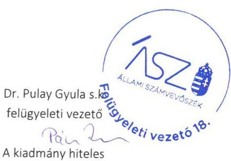

---

# 150 éve   a közpénzek őre   ÁLLAMI SZÁMVEVŐSZÉK 

## ELNÖK

Ikt. szám: EL-2456-151/2020.

Králik Tibor úr
kancellár
Soproni Szakképzési Centrum

Sopron

Tisztelt Kancellár Úr!

A „Központi költségvetési szervek ellenőrzése - Szakképzési centrumok" címmel készített számvevőszéki jelentéstervezetre a 2020. szeptember 15-én kelt, NSZFH/632/001273-3/2020. iktatószámú levélben megküldött észrevételt megkaptam.

Az Állami Számvevőszék (továbbiakban: ÁSZ) észrevételre vonatkozó álláspontjáról a felügyeleti vezető által készített részletes tájékoztatást csatoltan megküldöm.

Tájékoztatom Kancellár urat, hogy a számvevőszéki jelentésben - az Állami Számvevőszékről szóló 2011. évi LXVI. törvény 29. § (3) bekezdése alapján - a figyelembe nem vett észrevételeket szerepeltetjük az elutasítás indokának feltüntetésével.

Budapest, 2020. 10. hónap 15. nap

Tisztelettel:

Melléklet: Tájékoztatás az észrevétel kezeléséről

---

# Tájékoztatás az észrevétel kezeléséről 

A „Központi költségvetési szervek ellenőrzése - Szakképzési centrumok" címú jelentéstervezetre (továbbiakban: jelentéstervezet) a 2020. szeptember 15-én kelt, NSZFH/632/001273-3/2020. iktatószámú - főigazgató úrral közösen írt - levelében megküldött észrevételt áttekintettem. Az észrevétel kezeléséről az alábbi tájékoztatást adom.

1. A jelentéstervezet III. melléklet 30/1. számú, a számviteli politikával kapcsolatban tett tájékoztatást köszönöm. Azt az ÁSZ nem tekinti észrevételnek.
Kancellár úr észrevételében jelezte, hogy a Soproni Szakképzési Centrum (továbbiakban: Soproni SZC) számviteli politikáját a jelentéstervezet megállapításai alapján kiegészítik.
Kancellár úr az észrevételben a jelentéstervezet megállapítását nem vitatta. Köszönjük a tájékoztatását a jövőbeni intézkedésről, azonban az alapján a jelentéstervezet kapcsolódó megállapításának módosítása nem indokolt.
2. A jelentéstervezet III. melléklet 30/2. számú, a mérlegtételeket alátámasztó leltárral és a kapcsolódó 2. számú javaslatra vonatkozó észrevételével kapcsolatban
Kancellár úr észrevételében leírta, hogy a Soproni SZC-ban a költségvetési beszámoló mérlegtételeinek alátámasztása érdekében leltár készült a 2018. évben is. A leltár dokumentumait feltöltötték, a mérlegtételek sorait analitikus kimutatással alátámasztották. A leltár elkészítése főkönyvi számokra történt, a mérlegsoroknak megfelelően.
Az ÁSZ az EL-2485-001/2020. iktatószámú, 2020. február 28-án kelt levelének (továbbiakban: adatbekérő levél) 3. számú melléklete 11. pontjában bekérte a 2018. évi beszámoló mérleg tételeinek alátámasztására összeállított leltár dokumentumait, amelyek tételesen, ellenőrizhető módon tartalmazzák a mérleg fordulónapján meglévő eszközöket és forrásokat. Kancellár úr a 2020. március 11-i keltezésű teljességi és hitelességi nyilatkozattal (továbbiakban: THNY) - amelyben az átadott dokumentumok, adatok megbízhatóságáról és teljes körűségéről nyilatkozott - 36 db feltöltött fileben adott át dokumentumokat a beszámoló mérleg tételeinek alátámasztására összeállított leltárként. Az ÁSZ ellenőrzési megállapításait az ellenőrzési adatbekérés során határidőben átadott, a teljességi és hitelességi nyilatkozatban feltüntetett, hiteles dokumentumok alapján tette meg.
A jelentéstervezet megállapításával érintett, az ellenőrzött által rendelkezésre bocsátott dokumentumok ismételt felülvizsgálata során megállapítottam, hogy a Soproni SZC a tárgyi eszközökre vonatkozóan nem adott át az ellenőrzés rendelkezésére olyan dokumentumot, amely a mérlegsorban szereplő érték alátámasztását igazolja. E hiányosság alapján megállapítható, hogy a Soproni SZC az államháztartás számviteléről szóló 4/2013. (I. 11.) Korm. rendelet (továbbiakban: Áhsz.) 22. § (1) bekezdésében előírtak ellenére a 2018. évi éves költségvetési beszámolója mérlegtételeit nem támasztotta alá olyan leltárral, amely tételesen, ellenőrizhető módon tartalmazza a mérlegben szereplő eszközöket és forrásokat mennyiségben és értékben.
A fentiekre tekintettel az ÁSZ az észrevételt nem veszi figyelembe, a jelentéstervezet kapcsolódó megállapításának módosítása nem indokolt.

---

3. A jelentéstervezet III. melléklet 30/3. számú, a gazdálkodási jogköröket gyakorlók nyilvántartásával és a kapcsolódó 3. számú javaslatra vonatkozó észrevételével kapcsolatban
Kancellár úr észrevételében leírta, hogy a Soproni SZC „Kötelezettségvállalás, ellenjegyzés, teljesítésigazolás, érvényesítés, utalványozás eljárásrendje" című szabályzat 2. sz. függeléke tartalmazza a gazdálkodási jogkört gyakorló személyek nyilvántartását és aláírás mintájukat. Amennyiben a gazdálkodásra kijelölt személyek tekintetében változás következik be, a szabályzat megfelelő sorszámú függeléke soron kívül módosításra kerül, így biztosítják, hogy a nyilvántartás naprakész legyen.
Az ÁSZ az adatbekérő levél 3. számú melléklete 13. pontjában bekérte a kötelezettségvállalásra, teljesítésigazolásra jogosult személyekről és aláírás-mintájukról vezetett nyilvántartást. Kancellár úr a THNY-nyel igazoltan az ellenőrzés rendelkezésére bocsátotta a Soproni SZC 2018. január 1-jétől hatályos Kötelezettségvállalás, ellenjegyzés, teljesítésigazolás, érvényesítés, utalványozás eljárásrendjének 2. függelékét, amely az egyes gazdálkodási jogköröket gyakorló személyek aláírás mintáit tartalmazta.
A jelentéstervezet megállapításával érintett dokumentumok ismételt felülvizsgálata során megállapítottam, hogy a Soproni SZC által átadott dokumentumok megfelelnek az Ávr. 60. § (3) bekezdésében előírtaknak, ezért a jelentéstervezet megállapításának módosítása és a kapcsolódó javaslat törlése indokolt.
4. A jelentéstervezet III. melléklet 30/4. számú, a kötelezettségvállalások nyilvántartásával és a kapcsolódó 4. számú javaslatra vonatkozó észrevételével kapcsolatban
Kancellár úr észrevételében leírta, hogy a Soproni SZC-ban a kötelezettségvállalások nyilvántartása a Forrás.net integrált ügyviteli rendszerrel történik, a Kötelezettségvállalás modulban. A szoftver megfelel az Áhsz. előírásainak, nyilvántartásuk is tartalmazza az előírt adatokat. A nyilvántartásban előirányzati évenként kerülnek rögzítésre a kötelezettségvállalások, megkülönböztetve az előzetes és végleges kötelezettségvállalásokat is. A Forrás.net integrált ügyviteli rendszert a Griffsoft Informatikai Zrt. biztosítja a szakképzési centrumok részére, vállalva, hogy a szoftvert úgy fejleszti, hogy az mindenkor megfeleljen a jogszabályi előírásoknak. Az alkalmazott lekérdezések - terjedelmi okokból - nem tartalmazták teljeskörűen a rögzített adatokat, így a megküldött dokumentum hiányosnak tűnhet. Jelezte, hogy a kötelezettségek nyilvántartására a jövőben is kiemelt figyelmet fognak fordítani.
Az ÁSZ az adatbekérő levél 3. számú melléklete 14. pontjában bekérte a kötelezettségvállalásokról vezetett nyilvántartást. Kancellár úr észrevételében elismerte, hogy az általa a THNY-nyel igazoltan az ellenőrzés rendelkezésére bocsátott „SoproniSZC_kötváll anal kimut.pdf" című nyilvántartás nem tartalmazta teljeskörűen az Áhsz. 14. melléklet II/4. pontjában előírt adatokat.
A fentiekre tekintettel az ÁSZ az észrevételt nem veszi figyelembe, a jelentéstervezet kapcsolódó megállapításának módosítása nem indokolt.
5. A jelentéstervezet III. melléklet 30/5. számú, a vezetői nyilatkozattal és a kapcsolódó 5. számú javaslatra vonatkozó észrevételével kapcsolatban
Kancellár úr észrevételében jelezte, hogy a költségvetési szervek belső kontrollrendszeréről és belső ellenőrzéséről szóló 370/2011. (XII. 31.) Korm. rendelet (továbbiakban: Bkr.) 11. § (1) bekezdésében megjelölt 1. számú mellékletében előírt tartalmú nyilatkozatot a fenntartó rendelkezéseinek megfelelően töltötték ki. A nyomtatványban nyilatkoztak a Soproni SZC kontrollkörnyezetéről, a kockázatkezelési rendszeréről, a kontrolltevékenységekről, az alkalmazott információs és

---

# kommunikációs rendszerről és a nyomonkövetési (monitoring) rendszerről. 

Az ÁSZ az adatbekérő levél 3. számú melléklete 12. pontjában bekérte a 2018. évre vonatkozó vezetői nyilatkozatot a belső kontrollrendszer minőségéről. Főigazgató úr a THNY-nyel igazoltan az ellenőrzés rendelkezésére bocsátotta a 2019. február 28-án kelt nyilatkozatát. A nyilatkozat felülvizsgálata során megállapítottam, hogy annak szövegezése több helyen eltér a Bkr. akkor hatályos 1. sz. mellékletében előírtaktól, ezért az nem tartalmazta a szervezeti kultúra kialakítására vonatkozó pontot (1. sz. melléklet szerinti nyilatkozat 2. felsorolása).

A fentiekre tekintettel az ÁSZ az észrevételt nem veszi figyelembe, a jelentéstervezet kapcsolódó megállapításának módosítása nem indokolt.

Budapest, 2020. 10. hónap 10. nap

Dr. Pulay Gyula s.k. felügyeleti vezető

A kiadmány hiteles

---

# DOMOKOS LÁSZLÓ   elnök 

## ÁLLAMI SZÁMVEVŐSZÉK

Budapest
Apáczai Csere János u. 10. 1052

TOLNA MEGYEI
SZAKKÉPZÉSI
CENTRUM

Iktatószám: NSZFH/635/000830-2/2020.
Ügyintéző: Éles Márta
Tárgy: Észrevétel tétel „Központi költségvetési szervek ellenőrzése - Szakképzési centrumok"
Hivatkozás: EL-2456-078/2020.
Melléklet: -

## ÁLLAMI SZÁMVEVŐSZÉK

BE-9348120201
Érkezett: 2020. SZFPT 18
Iktatószám:
Melléklet:

Hivatkozva az EL-2456-078/2020. iktatószámon érkezett számvevőszéki jelentéstervezetre, arra az alábbi észrevételeket teszem:

- III. számú melléklet 33/1. számú megállapítás: a jelentéstervezetbe tett észrevételt elfogadjuk, a Számviteli politika módosításra kerül.
- III. számú melléklet 33/2. számú megállapítás: a 2018. évi beszámoló mérlegében szereplő eszközök és források leltárral történő alátámasztását szolgáló bizonylatok a Centrum központi munkaszervezetében tételesen, ellenőrizhető módon megtalálhatóak.
- III. számú melléklet 33/3. számú megállapítás: az SZC/1498/2017. évi iktatószámon nyilvántartott, a Szekszárdi Szakképzési Centrum kötelezettségvállalás, ellenjegyzés, teljesítésigazolás, érvényesítés, utalványozás eljárásrendjéről szóló szabályzat naprakészen tartalmazza a pénzügyi ellenjegyzésre, teljesítés igazolásra, érvényesítésre, utalványozásra jogosult személyek névsorát és aláírás-mintájukat. A szabályzat felcsatolásra került az ellenőrzéshez.
- III. számú melléklet a 33/4. számú megállapítás: a kötelezettségvállalások naprakészen vezetve vannak a FORRÁS.NET integrált pénzügyi rendszerben. A rendszer üzemeltetője, a GriffSoft Zrt. vállalja, hogy a nyilvántartás megfelel a jogszabályi kötelezettségeknek.

---

# TOLNA MEGYEI SZAKKÉPZÉSI CENTRUM 

- III. számú melléklet 33/5. számú megállapítás: a belső kontroll rendszer minőségének Bkr. 1. számú mellékletét a fenntartó a 2018. évi beszámoló mellékleteként küldte meg, a kitöltött mellékletet jóváhagyta.

Szekszárd, 2020. szeptember 15.
Tisztelettel:
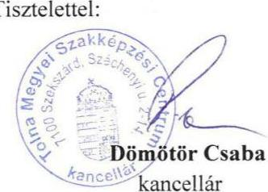
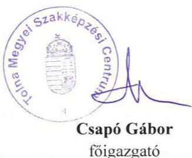

---

Ikt. szám: EL-2456-154/2020.

Csapó Gábor Tibor úr
főigazgató
Tolna Megyei Szakképzési Centrum

# Szekszárd 

Tisztelt Főigazgató Úr!

A „Központi költségvetési szervek ellenőrzése - Szakképzési centrumok" címmel készített számvevőszéki jelentéstervezetre a 2020. szeptember 15-én kelt, NSZFH/635/000830-2/2020. iktatószámú levélben megküldött észrevételeket megkaptam.

Az Állami Számvevőszék észrevételekre vonatkozó álláspontjáról a felügyeleti vezető által készített részletes tájékoztatást csatoltan megküldöm.

Tájékoztatom Főigazgató urat, hogy a számvevőszéki jelentésben - az Állami Számvevőszékről szóló 2011. évi LXVI. törvény 29. § (3) bekezdése alapján - a figyelembe nem vett észrevételeket szerepeltetjük az elutasítás indokának feltüntetésével.

Budapest, 2020. 10. hónap 16. nap

---

# Tájékoztatás az észrevételek kezeléséről 

A „Központi költségvetési szervek ellenőrzése - Szakképzési centrumok" című jelentéstervezetre (továbbiakban: jelentéstervezet) a 2020. szeptember 15-én kelt, NSZFH/635/000830-2/2020. iktatószámú levelében megküldött észrevételeket áttekintettem. Az észrevételek kezeléséről az alábbi tájékoztatást adom.

1. A jelentéstervezet III. melléklet 33/1. számú, a számviteli politikával kapcsolatban tett megállapítására vonatkozó tájékoztatást az Állami Számvevőszék nem tekinti észrevételnek.
Főigazgató úr észrevételt tett a jelentéstervezet III. sz. mellékletének 33/1. megállapításában foglaltakra, mely szerint a jelentéstervezet megállapításához kapcsolódó észrevételt elfogadják, a Számviteli
 politika módosításra kerül.
Főigazgató úr az észrevételben a jelentéstervezet megállapítását nem vitatta. A jelentéstervezet kapcsolódó megállapításának módosítása nem indokolt.
2. A jelentéstervezet III. melléklet 33/2. számú, a mérlegtételeket alátámasztó leltárral kapcsolatos megállapításra tett észrevételt az Állami Számvevőszék nem veszi figyelembe.
Az Állami Számvevőszék az EL-2488-001/2020. iktatószámú, 2020. február 28-án kelt levelének 3. számú melléklete 11. pontjában bekérte a 2018. évi beszámoló mérleg tételeinek alátámasztására összeállított leltár dokumentumait, amelyek tételesen, ellenőrizhető módon tartalmazzák a mérleg fordulónapján meglévő eszközöket és forrásokat (az államháztartás számviteléről szóló 4/2013. (I. 11.) Korm. rendelet - továbbiakban: Áhsz. - 22. § (1) bekezdés). A Tolna Megyei Szakképzési Centrum Kancellárja a 2020. március 10-i keltezésű teljességi és hitelességi nyilatkozattal - amelyben az átadott dokumentumok, adatok megbízhatóságáról és teljes körűségéről nyilatkozott - a „2018.évi mérleg tanúsítvány.pdf", a „jegyzőkönyv_bankszámla-egyenleg.pdf", „jegyzőkönyv_készpénzállomány.pdf", a „Leltárzáró jegyzőkönyv.pdf", a „Mérlegsorok alátámasztása.pdf" elnevezésű dokumentumokat bocsátotta az ellenőrzés rendelkezésére. Az Állami Számvevőszék ellenőrzési megállapításait az ellenőrzési adatbekérés során határidőben átadott, a teljességi és hitelességi nyilatkozatban feltüntetett, hiteles dokumentumok alapján tette meg.
A jelentéstervezet megállapításával érintett, a 2018. évi beszámoló mérleg tételeinek alátámasztására összeállított leltár dokumentumainak ismételt felülvizsgálata során megállapítottuk, hogy a „Gépek, berendezések, felszerelések, járművek" ellenőrzött szervezet által rendelkezésre bocsátott leltárdokumentációja nem teljes körű, továbbá a „Követelések", az „Egyéb sajátos elszámolások", az „Aktív időbeli elhatárolások", a „Saját tőke", a „Kötelezettségek", valamint a „Passzív időbeli elhatárolások" mérlegfőcsoportok tételei esetében az ellenőrzött szervezet nem bocsátott az ellenőrzés rendelkezésére olyan dokumentumokat, amelyek a felsorolt tételek leltárral való alátámasztottságát igazolták volna.
Mindezek alapján az ellenőrzött szervezet vezetője nem igazolta, hogy a Tolna Megyei Szakképzési Centrum 2018. évi éves költségvetési beszámolója mérlegtételeit alátámasztotta az Áhsz. 22. § (1) bekezdésében előírtaknak megfelelő leltárral, így a jelentéstervezet kapcsolódó megállapításának módosítása nem indokolt.

---

3. A jelentéstervezet III. melléklet 33/3. számú, a gazdálkodási jogkört gyakorolni jogosult személyekről és aláírás-mintájukról vezetett nyilvántartással kapcsolatos megállapításra tett észrevételt elfogadtuk.
A jelentéstervezet megállapításával érintett, a 2018. január 1-2018. december 31. közötti időszakra vonatkozó hatályos kötelezettségvállalásra, teljesítés igazolásra jogosult személyekről és aláírásmintájukról vezetett nyilvántartás dokumentumának ismételt felülvizsgálata során megállapítottuk, hogy az ellenőrzött szervezet vezetője igazolta, hogy a Tolna Megyei Szakképzési Centrum a 2018. évre vonatkozóan rendelkezett az államháztartásról szóló törvény végrehajtásáról szóló 368/2011. (XII. 31.) Korm. rendelet 60. § (3) bekezdésében előírt nyilvántartással a gazdálkodási jogkört gyakorolni jogosult személyekről és aláírás-mintájukról.
A fentiekre tekintettel az észrevételt elfogadtuk, a jelentéstervezet III. számú melléklet 33/3. számú megállapítása törlésre kerül.
4. A jelentéstervezet III. melléklet 33/4. számú, kötelezettségvállalások, más fizetési kötelezettségek 2018. évi nyilvántartásával kapcsolatos megállapításra tett észrevételt az Állami Számvevőszék nem veszi figyelembe.
Az Állami Számvevőszék az EL-2488-001/2020. iktatószámú, 2020. február 28-án kelt levelének 3. számú melléklete 14. pontjában bekérte a 2018. január 1-2018. december 31. közötti időszakra vonatkozó hatályos kötelezettségvállalásokról vezetett nyilvántartást (Áhsz. 39. § (3) bek., 14. melléklet II/4. a)-h) pont). A Tolna Megyei Szakképzési Centrum Kancellárja a 2020. március 10-i keltezésű teljességi és hitelességi nyilatkozattal - amelyben az átadott dokumentumok, adatok megbízhatóságáról és teljes körűségéről nyilatkozott - a „14. Kötelezettségváll. nyilvántartás.xls" elnevezésű dokumentumot adta át. Az Állami Számvevőszék ellenőrzési megállapításait az ellenőrzési adatbekérés során határidőben átadott, a teljességi és hitelességi nyilatkozatban feltüntetett, hiteles dokumentumok alapján tette meg.
A jelentéstervezet megállapításával érintett dokumentum ismételt felülvizsgálata során megállapítottuk, hogy a Tolna Megyei Szakképzési Centrum kötelezettségvállalásokról vezetett nyilvántartással rendelkezett, azonban a nyilvántartás nem tartalmazta az Áhsz. 14. melléklet II/4. a) b) e) f) g) h) pontjaiban előírt tartalmi elemeket.

Mindezek alapján az ellenőrzött szervezet vezetője nem igazolta, hogy a Tolna Megyei Szakképzési Centrum rendelkezett a kötelezettségvállalások, más fizetési kötelezettségek Áhsz. 14. melléklet II/4. pontjában meghatározottak szerinti 2018. évi nyilvántartással, így a jelentéstervezet kapcsolódó megállapításának módosítása nem indokolt.
5. A jelentéstervezet III. melléklet 33/5. számú, belső kontroll rendszer minőségének értékelésével kapcsolatos megállapításra tett észrevételt az Állami Számvevőszék nem veszi figyelembe.
Az Állami Számvevőszék az EL-2488-001/2020. iktatószámú, 2020. február 28-án kelt levelének 3. számú melléklete 12. pontjában bekérte a vezetői nyilatkozatot a 2018. évre vonatkozó belső kontrollrendszer minőségéről (a költségvetési szervek belső kontrollrendszeréről és belső ellenőrzésről szóló 370/2011. (XII. 31.) Korm. rendelet - továbbiakban: Bkr. - 11. § (1) bekezdésében előírt, 1. melléklete szerinti nyilatkozat). A Tolna Megyei Szakképzési Centrum Kancellárja a 2020. március 10-i keltezésű teljességi és hitelességi nyilatkozattal - amelyben az átadott dokumentumok, adatok megbízhatóságáról és teljes körűségéről nyilatkozott - a „6.sz.melléklet_Nyilatkozat.pdf" elnevezésű dokumentumot adta át. Az Állami Számvevőszék ellenőrzési megállapításait az ellenőrzési adatbekérés

---

során határidőben átadott, a teljességi és hitelességi nyilatkozatban feltüntetett, hiteles dokumentumok alapján tette meg.

A jelentéstervezet megállapításával érintett dokumentum ismételt felülvizsgálata során megállapítottuk, hogy a Tolna Megyei Szakképzési Centrum vezetője a 2018-as évre vonatkozóan nyilatkozatban értékelte a költségvetési szerv belső kontrollrendszerének minőségét, azonban annak szövegezése több helyen eltér a 2016. X. 1. napjától hatályos Bkr. 1. mellékletében előírtaktól, mert nem tartalmazza a Bkr. szerinti nyilatkozat A) pontja második gondolatjelben lévő szervezeti kultúra kialakítására vonatkozó szöveget. A nyilatkozat a Bkr. 1. melléklet A) pontja harmadik gondolatjelben lévő „vagyon rendeltetésszerű használatáról" szöveg helyett „vagyon rendeltetésszerű igénybevételéről" kifejezést, valamint az „alapító okiratban megjelölt tevékenységek" szöveg helyett az „alapító okiratban előírt tevékenységek" kifejezést tartalmazza. Továbbá a nyilatkozatban a Bkr. 1. melléklet A) pontja második bekezdésében meghatározott „integrált kockázatkezelési rendszer" helyett „kockázatkezelési rendszer" kifejezés szerepel.

Mindezek alapján az ellenőrzött szervezet vezetője nem igazolta, hogy a Tolna Megyei Szakképzési Centrum a 2018. évre vonatkozóan a Bkr. 11. § (1) bekezdésében megjelölt 1. számú mellékletében előírt tartalmú nyilatkozatban értékelte a szakképzési centrum belső kontrollrendszerének minőségét, így a jelentéstervezet kapcsolódó megállapításának módosítása nem indokolt.

Budapest, 2020. 10. hónap 16. nap
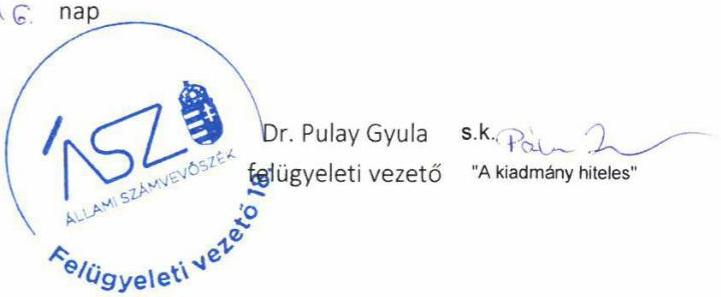

---

Ikt. szám: EL-2456-156/2020.

Dömötör Csaba úr
kancellár
Tolna Megyei Szakképzési Centrum

# Szekszárd 

Tisztelt Kancellár Úr!

A „Központi költségvetési szervek ellenőrzése - Szakképzési centrumok" címmel készített számvevőszéki jelentéstervezetre a 2020. szeptember 15-én kelt, NSZFH/635/000830-2/2020. iktatószámú levélben megküldött észrevételeket megkaptam.

Az Állami Számvevőszék észrevételekre vonatkozó álláspontjáról a felügyeleti vezető által készített részletes tájékoztatást csatoltan megküldöm.

Tájékoztatom Kancellár urat, hogy a számvevőszéki jelentésben - az Állami Számvevőszékről szóló 2011. évi LXVI. törvény 29. § (3) bekezdése alapján - a figyelembe nem vett észrevételeket szerepeltetjük az elutasítás indokának feltüntetésével.

Budapest, 2020. 40. hónap 40. nap
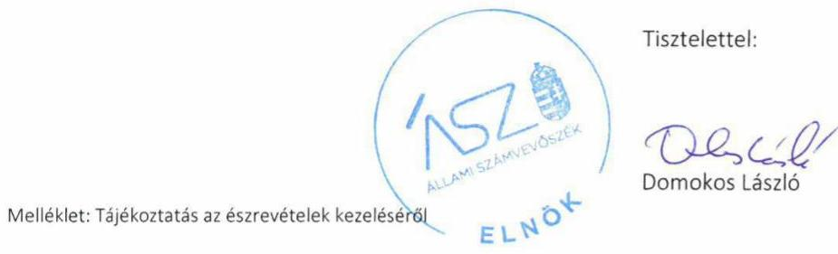

---

# Tájékoztatás az észrevételek kezeléséről 

A „Központi költségvetési szervek ellenőrzése - Szakképzési centrumok" című jelentéstervezetre (továbbiakban: jelentéstervezet) a 2020. szeptember 15-én kelt, NSZFH/635/000830-2/2020. iktatószámú levelében megküldött észrevételeket áttekintettem. Az észrevételek kezeléséről az alábbi tájékoztatást adom.

1. A jelentéstervezet III. melléklet 33/1. számú, a számviteli politikával kapcsolatban tett megállapítására vonatkozó tájékoztatást az Állami Számvevőszék nem tekinti észrevételnek.
Kancellár úr észrevételt tett a jelentéstervezet III. sz. mellékletének 33/1. megállapításában foglaltakra, mely szerint a jelentéstervezet megállapításához kapcsolódó észrevételt elfogadják, a Számviteli politika módosításra kerül.
Kancellár úr az észrevételben a jelentéstervezet megállapítását nem vitatta. A jelentéstervezet kapcsolódó megállapításának módosítása nem indokolt.
2. A jelentéstervezet III. melléklet 33/2. számú, a mérlegtételeket alátámasztó leltárral kapcsolatos megállapításra tett észrevételt az Állami Számvevőszék nem veszi figyelembe.
Az Állami Számvevőszék az EL-2488-001/2020. iktatószámú, 2020. február 28-án kelt levelének 3. számú melléklete 11. pontjában bekérte a 2018. évi beszámoló mérleg tételeinek alátámasztására összeállított leltár dokumentumait, amelyek tételesen, ellenőrizhető módon tartalmazzák a mérleg fordulónapján meglévő eszközöket és forrásokat (az államháztartás számviteléről szóló 4/2013. (I. 11.) Korm. rendelet - továbbiakban: Áhsz. - 22. § (1) bekezdés). Kancellár úr a 2020. március 10-i keltezésű teljességi és hitelességi nyilatkozattal - amelyben az átadott dokumentumok, adatok megbízhatóságáról és teljes körűségéről nyilatkozott - a „2018.évi mérleg tanúsítvány.pdf", a „Jegyzőkönyv_bankszámla-egyenleg.pdf", „Jegyzőkönyv_készpénzállomány.pdf", a „Leltárzáró jegyzőkönyv.pdf", a „Mérlegsorok alátámasztása.pdf" elnevezésű dokumentumokat bocsátotta az ellenőrzés rendelkezésére. Az Állami Számvevőszék ellenőrzési megállapításait az ellenőrzési adatbekérés során határidőben átadott, a teljességi és hitelességi nyilatkozatban feltüntetett, hiteles dokumentumok alapján tette meg.
A jelentéstervezet megállapításával érintett, a 2018. évi beszámoló mérleg tételeinek alátámasztására összeállított leltár dokumentumainak ismételt felülvizsgálata során megállapítottuk, hogy a „Gépek, berendezések, felszerelések, járművek" ellenőrzött szervezet által rendelkezésre bocsátott leltárdokumentációja nem teljes körű, továbbá a „Követelések", az „Egyéb sajátos elszámolások", az „Aktív időbeli elhatárolások", a „Saját tőke", a „Kötelezettségek", valamint a „Passzív időbeli elhatárolások" mérlegfőcsoportok tételei esetében az ellenőrzött szervezet nem bocsátott az ellenőrzés rendelkezésére olyan dokumentumokat, amelyek a felsorolt tételek leltárral való alátámasztottságát igazolták volna.
Mindezek alapján az ellenőrzött szervezet vezetője nem igazolta, hogy a Tolna Megyei Szakképzési Centrum 2018. évi éves költségvetési beszámolója mérlegtételeit alátámasztotta az Áhsz. 22. § (1) bekezdésében előírtaknak megfelelő leltárral, így a jelentéstervezet kapcsolódó megállapításának módosítása nem indokolt.

---

3. A jelentéstervezet III. melléklet 33/3. számú, a gazdálkodási jogkört gyakorolni jogosult személyekről és aláírás-mintájukról vezetett nyilvántartással kapcsolatos megállapításra tett észrevételt elfogadtuk.
A jelentéstervezet megállapításával érintett, a 2018. január 1-2018. december 31. közötti időszakra vonatkozó hatályos kötelezettségvállalásra, teljesítés igazolásra jogosult személyekről és aláírásmintájukról vezetett nyilvántartás dokumentumának ismételt felülvizsgálata során megállapítottuk, hogy az ellenőrzött szervezet vezetője igazolta, hogy a Tolna Megyei Szakképzési Centrum a 2018. évre vonatkozóan rendelkezett az államháztartásról szóló törvény végrehajtásáról szóló 368/2011. (XII. 31.) Korm. rendelet 60. § (3) bekezdésében előírt nyilvántartással a gazdálkodási jogkört gyakorolni jogosult személyekről és aláírás-mintájukról.
A fentiekre tekintettel az észrevételt elfogadtuk, a jelentéstervezet III. számú melléklet 33/3. számú megállapítása törlésre kerül.
4. A jelentéstervezet III. melléklet 33/4. számú, kötelezettségvállalások, más fizetési kötelezettségek 2018. évi nyilvántartásával kapcsolatos megállapításra tett észrevételt az Állami Számvevőszék nem veszi figyelembe.
Az Állami Számvevőszék az EL-2488-001/2020. iktatószámú, 2020. február 28-án kelt levelének 3. számú melléklete 14. pontjában bekérte a 2018. január 1-2018. december 31. közötti időszakra vonatkozó hatályos kötelezettségvállalásokról vezetett nyilvántartást (Áhsz. 39. § (3) bek., 14. melléklet II/4. a)-h) pont). Kancellár úr a 2020. március 10-i keltezésű teljességi és hitelességi nyilatkozattal - amelyben az átadott dokumentumok, adatok megbízhatóságáról és teljes körűségéről nyilatkozott - a „14. Kötelezettségváll. nyilvántartás.xls" elnevezésű dokumentumot adta át. Az Állami Számvevőszék ellenőrzési megállapításait az ellenőrzési adatbekérés során határidőben átadott, a teljességi és hitelességi nyilatkozatban feltüntetett, hiteles dokumentumok alapján tette meg.
A jelentéstervezet megállapításával érintett dokumentum ismételt felülvizsgálata során megállapítottuk, hogy a Tolna Megyei Szakképzési Centrum kötelezettségvállalásokról vezetett nyilvántartással rendelkezett, azonban a nyilvántartás nem tartalmazta az Áhsz. 14. melléklet II/4. a) b) e) f) g) h) pontjaiban előírt tartalmi elemeket.

Mindezek alapján az ellenőrzött szervezet vezetője nem igazolta, hogy a Tolna Megyei Szakképzési Centrum rendelkezett a kötelezettségvállalások, más fizetési kötelezettségek Áhsz. 14. melléklet II/4. pontjában meghatározottak szerinti 2018. évi nyilvántartással, így a jelentéstervezet kapcsolódó megállapításának módosítása nem indokolt.
5. A jelentéstervezet III. melléklet 33/5. számú, belső kontroll rendszer minőségének értékelésével kapcsolatos megállapításra tett
 észrevételt az Állami Számvevőszék nem veszi figyelembe.
Az Állami Számvevőszék az EL-2488-001/2020. iktatószámú, 2020. február 28-án kelt levelének 3. számú melléklete 12. pontjában bekérte a vezetői nyilatkozatot a 2018. évre vonatkozó belső kontrollrendszer minőségéről (a költségvetési szervek belső kontrollrendszeréről és belső ellenőrzésről szóló 370/2011. (XII. 31.) Korm. rendelet - továbbiakban: Bkr. - 11. § (1) bekezdésében előírt, 1. melléklete szerinti nyilatkozat). Kancellár úr a 2020. március 10-i keltezésű teljességi és hitelességi nyilatkozattal - amelyben az átadott dokumentumok, adatok megbízhatóságáról és teljes körűségéről nyilatkozott - a „6.sz.melléklet_Nyilatkozat.pdf" elnevezésű dokumentumot adta át. Az Állami Számvevőszék ellenőrzési megállapításait az ellenőrzési adatbekérés során határidőben átadott, a teljességi és hitelességi nyilatkozatban feltüntetett, hiteles dokumentumok alapján tette meg.

---

A jelentéstervezet megállapításával érintett dokumentum ismételt felülvizsgálata során megállapítottuk, hogy a Tolna Megyei Szakképzési Centrum vezetője a 2018-as évre vonatkozóan nyilatkozatban értékelte a költségvetési szerv belső kontrollrendszerének minőségét, azonban annak szövegezése több helyen eltér a 2016. X. 1. napjától hatályos Bkr. 1. mellékletében előírtaktól, mert nem tartalmazza a Bkr. szerinti nyilatkozat A) pontja második gondolatjelben lévő szervezeti kultúra kialakítására vonatkozó szöveget. A nyilatkozat a Bkr. 1. melléklet A) pontja harmadik gondolatjelben lévő „vagyon rendeltetésszerű használatáról" szöveg helyett „vagyon rendeltetésszerű igénybevételéről" kifejezést, valamint az „alapító okiratban megjelölt tevékenységek" szöveg helyett az „alapító okiratban előírt tevékenységek" kifejezést tartalmazza. Továbbá a nyilatkozatban a Bkr. 1. melléklet A) pontja második bekezdésében meghatározott „integrált kockázatkezelési rendszer" helyett „kockázatkezelési rendszer" kifejezés szerepel.
Mindezek alapján az ellenőrzött szervezet vezetője nem igazolta, hogy a Tolna Megyei Szakképzési Centrum a 2018. évre vonatkozóan a Bkr. 11. § (1) bekezdésében megjelölt 1. számú mellékletében előírt tartalmú nyilatkozatban értékelte a szakképzési centrum belső kontrollrendszerének minőségét, így a jelentéstervezet kapcsolódó megállapításának módosítása nem indokolt.

Budapest, 2020. 10. hónap $\wedge$ C. nap
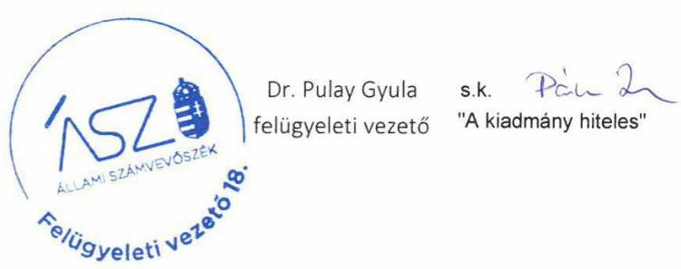

---

# RÖVIDÍTÉSEK JEGYZÉKE 

${ }^{1}$ Szkt.
${ }^{2}$ ÁSZ
${ }^{3}$ KLIK
${ }^{4}$ NGM
${ }^{5}$ NSZFH
${ }^{6}$ ITM
${ }^{7}$ Szakképzésért és felnőttképzésért felelős miniszter
${ }^{8}$ Ávr.
${ }^{9}$ Vnytv.
${ }^{10}$ Áhsz.
2019. évi LXXX. törvény - a szakképzésről (hatályos: 2020. január 1-jétől)

Állami Számvevőszék
Klebelsberg Intézményfenntartó Központ
Nemzetgazdasági Minisztérium
Nemzeti Szakképzési és Felnőttképzési Hivatal
Innovációs és Technológiai Minisztérium
2018.V.22. napjától az innovációért és technológiáért felelős miniszter, azt megelőzően nemzetgazdasági miniszter
az államháztartásról szóló törvény végrehajtásáról szóló 368/2011. (XII. 31.) Korm. rendelet (hatályos: 2012. január 1-jétől)
egyes vagyonnyilatkozat-tételi kötelezettségekről szóló 2007. évi CLII. törvény az államháztartás számviteléről szóló 4/2013. (I. 11.) Korm. rendelet (hatályos: 2014. január 1-jétől)

---

# ASZ 

ÁLLAMI SZÁMVEVŐSZÉK
1052 Budapest, Apáczai Cs. J. u. 10. I 1364 Budapest 4. Pf. 54 TEL: +36 14849100
email: szamvevoszek@asz.hu
web: www.asz.hu | www.aszhirportal.hu

