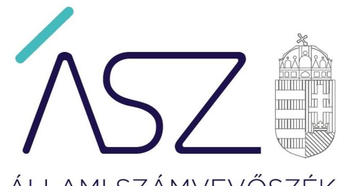
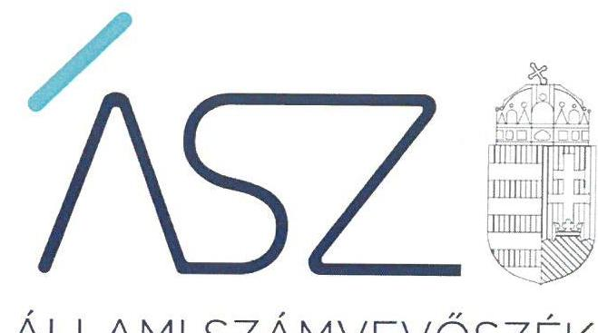

ÁLLAMI SZÁMVEVŐSZÉK

# JELENTÉS

Önkormányzati intézmények integritás és belső kontroll ellenőrzése

Érdi Közterület-fenntartó Intézmény

2020.

20211
www.asz.hu

---

ÁLLAMI SZÁMVEVŐSZÉK

# JELENTÉS

Önkormányzati intézmények integritás és belső kontroll ellenőrzése

Érdi Közterület-fenntartó Intézmény

2020. 11. hó 12. nap

2021. 1. www.asz.hu

---

# AZ ELLENŐRZÉST FELÜGYELTE: 

PETŐ KRISZTINA felügyeleti vezető

## AZ ELLENŐRZÉST VEZETTE ÉS A VÉGREHAJTÁSÁÉRT FELELŐS:

DR. GÁL NÓRA ellenőrzésvezető

## A PROGRAM ÖSSZEÁLLÍTÁSÁÉRT FELELŐS:

BERTALAN RUDOLF GYULA ellenőrzési program készítéséért felelős vezető

IKTATÓSZÁM: EL-3000-001/2020.
TÉMASZÁM: 2511
ELLENŐRZÉS-AZONOSÍTÓ SZÁM: V085503
Jelentéseink az Országgyúlés számítógépes hálózatán és az interneten a www.asz.hu címen is olvashatóak.

---

# TARTALOMJEGYZÉK 

■ ÖSSZEGZÉS ..... 5
■ AZ ELLENŐRZÉS CÉLJA ..... 6
■ AZ ELLENŐRZÉS TERÜLETE ..... 7
■ AZ ELLENŐRZÉS HÁTTERE, INDOKOLTSÁGA ..... 8
■ A JELENTÉS LÉNYEGES KÉRDÉSKÖREI ..... 9
■ AZ ELLENŐRZÉS HATÓKÖRE ÉS MÓDSZEREI ..... 10
■ MEGÁLLAPÍTÁSOK ..... 12
■ JAVASLATOK ..... 14
■ MELLÉKLETEK ..... 17
I. sz. melléklet: Értelmező szótár ..... 17
■ FÜGGELÉK: ÉSZREVÉTELEK ..... 19
■ RÖVIDÍTÉSEK JEGYZÉKE ..... 23

---

.

---

# ÖSSZEGZÉS 

Az Érdi Közterület-fenntartó Intézmény 2018-ban biztositotta a közpénzek szabályszerü elszámolását, azonban a belső kontrollrendszer kialakítása és müködtetése során maradtak fenn hiányosságok. Az integritási kontrollokat nem épitették ki, igy a korrupciós kockázatokkal szemben nem volt védett a szervezet.

## Az ellenőrzés társadalmi indokoltsága

Az Állami Számvevőszék alapvető feladata a közpénzekkel, az állami és önkormányzati vagyonnal való gazdálkodás ellenőrzése. Az Állami Számvevőszék az ÁSZ törvényben kapott felhatalmazással élve ellenőrzi az önkormányzati intézmények gazdálkodását, müködését, hogy az ellenőrzések megállapításaival támogassa az ellenőrzött szervezetek szabályszerű gazdálkodását, javaslataival elősegítse az Alaptörvényben megfogalmazott alapvetések érvényesülését a mindennapi életben az önkormányzatok szintjén. Az Állami Számvevőszék stratégiájában megfogalmazott célkitűzése az integritás alapú, átlátható és elszámoltatható közpénzfelhasználás elősegítése. Ennek megvalósítása érdekében az Állami Számvevőszék prioritásként kezeli a közpénzzel gazdálkodó szervezetek esetében a belső kontrollrendszer müködésének ellenőrzését.

## Főbb megállapítások, következtetések, javaslatok

Az Érdi Közterület-fenntartó Intézménynél a kiadások teljesítése és a bevételek beszedése a jogszabályi előírások szerint történt. Az intézményvezető a szervezet tevékenységének, a célok megvalósításának nyomon követését biztosító rendszert szabályszerűen működtette.

Az Érdi Közterület-fenntartó Intézménynél azonban elmaradt a szabályszerű müködést támogató egyes szabályok meghatározása.

Az integrált kockázatkezelési rendszert az Érdi Közterület-fenntartó Intézmény vezetője az előírások ellenére nem alakította ki, ennek hiányában nem is működtette, így a költségvetési szerv tevékenységében, gazdálkodásában felmerülő kockázatok kezelését nem biztosították.

A szervezet információs és kommunikációs rendszerét sem alakították ki és nem működtették. Így nem biztosították, hogy a szükséges információk maradéktalanul, megfelelő időben eljussanak az illetékes szervezethez, szervezeti egységhez, személyhez.

A szervezet integritás elvű müködése nem volt biztosított, a szervezeten belül az integritás kockázatokat nem mérték fel, a vagyonnyilatkozat-tételei kötelezettséggel járó munkaköröket nem határozták meg. A szervezeti teljesítmény mérésére alkalmas követelményeket nem alakították ki, ezáltal a teljesítmény mérésének feltételeit nem biztosították.

Az Érdi Közterület-fenntartó Intézmény vezetője a jogszabály szerinti nyilatkozatában értékelte az intézmény 2018. évi belső kontrollrendszerének minőségét. A nyilatkozat tartalmát az ellenőrzés megállapításai nem igazolták.

Az Állami Számvevőszék az ellenőrzés megállapításai alapján az Érdi Közterület-fenntartó Intézmény intézményvezetője részére 10 javaslatot fogalmazott meg.

---

# AZ ELLENŐRZÉS CÉLJA 

AZ ELLENŐRZÉS CÉLJA annak megállapítása volt, hogy az önkormányzati intézmény belső kontrollrendszere biztosította-e az átlátható, szabályszerű, gazdaságos, hatékony és eredményes gazdálkodás feltételeit. Az ellenőrzés keretében az ÁSZ ${ }^{1}$ értékelte, hogy a költségvetési szervnél kiépítették-e a korrupciós kockázatok kezelését szolgáló integritási kontrollokat, továbbá adottake egy teljesítményellenőrzés lefolytatásának a feltételei.

---

# **AZ ELLENŐRZÉS TERÜLETE**

## **Érdi Közterület-fenntartó Intézmény**

Az Intézményt² 2015. január 1-jei időponttal Érd Megyei Jogú Város Önkormányzata alapította. Az Intézmény működési területe Érd város területe. Az Intézmény fenntartója Érd Megyei Jogú Város Önkormányzata, felügyeleti szerve Érd Megyei Jogú Város Önkormányzat Közgyűlése.

Az Intézmény önállóan működő és gazdálkodó közszolgáltató költségvetési szerv, amely saját gazdasági szervezettel rendelkezett.

Az Intézmény alaptevékenységei: szennyvíz gyűjtése, tisztítása, elhelyezése, települési hulladék begyűjtése, szállítása, út-, autópálya építése, építményüzemeltetés, általános épülettakarítás, egyéb takarítás, zöldterület-kezelés, város-, községgazdálkodási szolgáltatások, közcélú foglalkoztatás, közhasznú foglalkoztatás, közmunka, köztemető-fenntartás és működtetés.

Az Intézmény vállalkozási tevékenysége az ingatlankezelés.

A Magyar Államkincstár adatai alapján az Intézmény költségvetési kiadása 2888 millió forint, a költségvetési bevétele 1435 millió forint volt a 2018. évben.

Az Intézmény vezetőjének megbízása 2014. február 1-jétől, 2019. január 31-ig terjedő időszakra szólt.

---

# AZ ELLENŐRZÉS HÁTTERE, INDOKOLTSÁGA 

A BELSŐ KONTROLLRENDSZER kialakítása és múködtetése nélkül nem valósítható meg a közpénzek, a közvagyon átlátható, szabályos, gazdaságos, hatékony és eredményes felhasználása. A belső kontrollrendszer azt a célt szolgálja, hogy a költségvetési szervek múködésük és gazdálkodásuk során a tevékenységeket szabályszerűen hajtsák végre, teljesítsék elszámolási kötelezettségeiket és megvédjék az erőforrásokat a veszteségektől, a károktól és a nem rendeltetésszerű használattól.

A belső kontrollrendszer magában foglalja mindazon elveket, eljárásokat és belső szabályzatokat, melyek biztosítják, hogy a költségvetési szerv valamennyi tevékenysége és célja összhangban legyen a szabályszerűséggel, szabályozottsággal, valamint a gazdaságosság, hatékonyság és eredményesség követelményeivel, az eszközökkel és forrásokkal való gazdálkodásban ne kerüljön sor pazarlásra, visszaélésre, rendeltetésellenes felhasználásra. Megfelelő, pontos és naprakész információk álljanak rendelkezésre a költségvetési szerv múködésével kapcsolatosan, és a belső kontrollrendszer harmonizációjára, össze-hangolására vonatkozó jogszabályok végrehajtásra kerüljenek. Az integritás kontrollok kiépítése, erősítése a szervezet korrupciós kockázatainak kezelését szolgálja. A teljesítménykövetelmények meghatározása megalapozhatja a teljesítményellenőrzés lefolytatását.

---

# A JELENTÉS LÉNYEGES KÉRDÉSKÖREI 

1. Az önkormányzati Intézmény belső kontrollrendszerének kialakítása és müködtetése szabályszerű volt-e?
2. Az önkormányzati Intézménynél kiépítették-e az integritás kontrollrendszerét?
3. Az önkormányzati Intézménynél alakítottak-e ki a teljesítmény mérésére alkalmas követelményeket?

---

# AZ ELLENŐRZÉS HATÓKÖRE ÉS MÓDSZEREI 

## Az ellenőrzés típusa

Megfelelőségi ellenőrzés.

## Az ellenőrzött időszak

2018. év

## Az ellenőrzés tárgya

Az önkormányzati intézmény belső kontrollrendszerének kialakítása és működtetése, valamint az integritás kontrollok kiépítettsége, a teljesítményellenőrzés feltételeinek kialakítása.

## Az ellenőrzött szervezet

Érdi Közterület-fenntartó Intézmény

## Az ellenőrzés jogalapja

Az ellenőrzés jogszabályi alapját az ÁSZ tv. ${ }^{3}$ 1. § (3) bekezdés, 5. § (6) bekezdése, valamint az Áht. ${ }^{4}$ 61. § (2) bekezdésének előírásai képezik.

## Az ellenőrzés módszerei

Az ÁSZ az ellenőrzést az ellenőrzési program szempontjai, az ellenőrzött időszakban hatályos jogszabályok, az ellenőrzés szakmai szabályai, az ÁSZ által meghatározott és honlapján nyilvánosságra hozott helyénvalósági kritériumok, valamint a jelen ellenőrzésre irányadó ÁSZ módszertanok figyelembevételével hajtotta végre.

Az ellenőrzési kérdések megválaszolásához szükséges bizonyítékok megszerzése az ellenőrzött által rendelkezésre bocsátott dokumentumokra, adatokra alapozva megfigyelés, szemle (szemrevételezés), kérdésfeltevés (információkérés), mintavételezés, valamint elemző eljárás útján történt. Az ellenőrzési bizonyítékként felhasználható adatforrások közé tartoztak az ellenőrzési program részletes szempontjainál felsorolt adatforrások, valamint minden egyéb - az ellenőrzés folyamán feltárt, az ellenőrzés szempontjából információt tartalmazó - dokumentum.

---

Az ellenőrzés lefolytatásához az ellenőrzött szervezet tanúsítvány kitöltésével, valamint az ÁSZ által kért dokumentumok megküldésével szolgáltatott adatokat, amelyek valódiságát és teljes körűségét az ellenőrzött szervezet vezetője által tett teljességi és hitelességi nyilatkozat igazolta. A rendelkezésre bocsátott adatok, információk kontrollja az ellenőrzés keretében történt.

Az önkormányzati intézmény belső kontrollrendszere egyes pilléreinek kialakítására és működtetésére vonatkozó értékelés:
$\longrightarrow$ „szabályszerü", amennyiben az értékelt területen az elért „igen" válaszok százalékban kifejezett, egész számra kerekített aránya legalább $85 \%$,
$\longrightarrow$ „nem szabályszerű", ha nem éri el a $85 \%$-ot.
Az önkormányzati intézmény belső kontrollrendszerének összesített értékelése (a kontrollrendszer egésze) esetében a „szabályszerű" értékelésnek a feltétele volt, hogy egyik kontrollterület sem kapott „nem szabályszerű" értékelést. A belső kontrollrendszer szabálytalansága esetén az integritás kontrollok kiépítése és működtetése nem „megfelelő".

A kontrolltevékenységek gyakorlása és a bevételek elszámolása esetében az ellenőrzés azokra a legnagyobb értékű tételekre - a lényeges sokaságra - terjedt ki, melyek összértéke eléri a teljes sokaság összértékének 50\%-át. A bevételek (szolgáltatások ellenértéke, térítési díj, ellátási díj) esetében tételes ellenőrzést folytatott le az ÁSZ. A kiadások (felhalmozási kiadások, dologi kiadások) esetében a lényeges sokaságból véletlen mintavétellel kijelölt tételek kerültek ellenőrzésre.
„Szabályszerű" értékelést kapott egy mintavétellel ellenőrzött területet, amennyiben 95\%-os megbízhatósággal az ellenőrzött sokaságban az átlagos hibaarány legfeljebb 10\%, „nem szabályszerűt", amennyiben 10\%nál magasabb arányt képviselt. Abban az esetben, ha az ellenőrzött sokaság tekintetében a 10\%-os hibaarányhoz való viszony megítélésnek megbízhatósága nem érte el a 95\%-ot, annak elérése érdekében az értékelést további szempontokkal egészítette ki az ÁSZ, és figyelembe vette a feltárt hibák értékét.

Az önkormányzati intézmény vezetője által kiépített integritás kontrollrendszer értékeléséhez helyénvalósági kritériumok is megfogalmazásra kerültek.

Az ellenőrzés ideje alatt az ellenőrzött szervezettel történő kapcsolattartást az ÁSZ SZMSZ²-ének vonatkozó előírásai alapján biztosította az ÁSZ.

---

# 1. Az önkormányzati Intézmény belső kontrollrendszerének kialakítása és múködtetése szabályszerű volt-e? 

Összegző megállapítás

Az Intézmény belső kontrollrendszerének kialakítása 2018. évben nem volt szabályszerű. A kontrolltevékenységek gyakorlása szabályszerű volt.

A KONTROLLKÖRNYEZET kialakítása nem volt szabályszerű.
Az Intézmény az Áht. előírásai szerint rendelkezett SZMSZ6-szel. A Vnytv. ${ }^{7} 4 . \S$ a) pontja ellenére az SZMSZ-ben nem tüntették fel a vagyon-nyilatkozat-tételi kötelezettséggel járó munkaköröket. Nem gondoskodtak a Vnytv. 11. § (6) bekezdésében előírt, a vagyonnyilatkozat átadására, nyilvántartására, a vagyonnyilatkozatban foglalt személyes adatok védelmére vonatkozó további szabályok szabályzatban történő rögzítéséről.

Az Intézmény rendelkezett a Számv. tv. ${ }^{8}$ előírása szerint Számviteli politikával és annak keretében elkészített számviteli szabályzatokkal9. A Számviteli politikában a Számv. tv. 14. § (4) bekezdésének előírása ellenére nem rögzítették az Intézményre jellemző szabályokat, előírásokat, módszereket, amelyekkel meghatározzák, hogy mit tekintenek a számviteli elszámolás, az értékelés szempontjából lényegesnek, jelentősnek, nem lényegesnek, nem jelentősnek.

Az Intézmény az Áhsz. ${ }^{10}$ 51. § (2) bekezdésében foglaltak ellenére nem rendelkezett számlarenddel.

Az Intézmény rendelkezett az Áht. és az Ávr. ${ }^{11}$ előírásainak megfelelően Gazdálkodási Szabályzattal ${ }^{12}$. A gazdálkodási jogkörök gyakorlására jogosult személyekről és aláírás-mintájukról az előírások szerinti nyilvántartást vezették.

Az Intézmény vezetője a Bkr. ${ }^{13} 2 . \S$ m) pontjában meghatározottak szerinti integrált kockázatkezelési rendszert a Bkr. 3. § b) pontjának előírása ellenére nem alakított ki. Nem szabályozta a Bkr. 6. § (4) bekezdésének előírása ellenére az integrált kockázatkezelés, továbbá a szervezeti integritást sértő események kezelésének eljárásrendjét.

Az Intézmény nem rendelkezett az Ltv. ${ }^{14}$ 10. § (1) bekezdés a) pontjaiban előírtak ellenére iratkezelési szabályzattal.

Az Intézmény vezetője a 2018. évben - a 305/2005. (XII. 25. ) Korm. rendelet ${ }^{15}$ 3. § előírásaira is figyelemmel - az Ávr. 13. § (2) bekezdés. h) pontja előírása ellenére nem szabályozta a kötelezően közzéteendő adatok nyilvánosságra hozatalának rendjét.

## AZ INTEGRÁLT KOCKÁZATKEZELÉSI RENDSZERT az Intézményvezető a Bkr. 3. § b) pontja ellenére nem alakította ki és kialakítás hiányában nem múködtette.

---

A KONTROLLTEVÉKENYSÉGEK gyakorlása szabályszerű volt. A kifizetések teljesítése és a bevételek beszedése a jogszabályi előírások szerint történt.

# AZ INTÉZMÉNY INFORMÁCIÓS ÉS KOMMUNIKÁ- 

CIÓS RENDSZERÉT az Intézményvezető a 2018. évben nem alakította ki és kialakítás hiányában nem múködtette. Az Intézmény nem rendelkezett iratkezelési szabályzattal és nem szabályozták a kötelezően közzéteendő adatok nyilvánosságra hozatalának rendjét.

A MONITORING RENDSZERT az Intézményvezető kialakította, az Intézmény tevékenységének, a célok megvalósításának folyama-tos- és eseti nyomon követését szabályszerűen biztosította.

Az Intézményvezető a Bkr. 1. melléklete szerinti nyilatkozatában értékelte az Intézmény 2018. évi belső kontrollrendszerének minőségét. A nyilatkozat tartalmát az ellenőrzés megállapításai nem igazolták.

## 2. Az önkormányzati Intézménynél kiépítették-e az integritás kontrollrendszerét?

## Összegző megállapítás

Az Intézményvezető nem építette ki az integritás kontrollrendszerét.

Az Intézmény a Bkr.-ben előírtak szerinti integrált kockázatkezelési rendszert nem alakított ki és nem múködtetett, így az integritást veszélyeztető kockázatok kezelése sem volt biztosított.

A vagyonnyilatkozat-tételi kötelezettséggel járó munkaköröket az SZMSZ-ben nem tüntették fel. Az Intézmény nem alakított ki teljesítményértékelési rendszert. Az Intézmény munkatársai korrupcióellenes képzésben nem vettek részt.

Az Intézmény vezetője az Ávr. 13. § (2) bekezdés e) pontjában előírt, a reprezentációs kiadások felosztását, azok elszámolásának szabályait belső szabályzatban nem rendezte.

Az Intézmény vezetője a Bkr. 6. § (1) bekezdés c) pontja előírása ellenére a 2018. évben nem alakított ki olyan kontrollkörnyezetet, amelyben meghatározottak, ismertek és elfogadottak az etikai elvárások a szervezet minden szintjén.

## 3. Az önkormányzati Intézménynél alakítottak-e ki a teljesítmény mérésére alkalmas követelményeket?

Összegző megállapítás
Az Intézményvezető nem alakította ki a teljesítmény mérésére alkalmas követelményeket.

Az Intézményvezető nem alakította ki a szervezet vonatkozásában a teljesítmény mérésének feltételeit, továbbá a szervezeti célok elérését szolgáló feladatok, tevékenységek mérését szolgáló indikátorokat, mérőszámokat, továbbá feladat és teljesítmény-mutatókat sem határozott meg.

---

# JAVASLATOK 

Az ÁSZ tv. 33. § (1) bekezdésében foglaltak értelmében az ellenőrzött szervezet vezetője köteles a jelentésben foglalt megállapításokhoz kapcsolódó intézkedési tervet összeállítani és azt a jelentés kézhezvételétől számított 30 napon belül az ÁSZ részére megküldeni. Amennyiben az intézkedési tervet az ellenőrzött szervezet vezetője nem küldi meg határidőben, vagy továbbra sem elfogadható intézkedési tervet küld, az ÁSZ elnöke az ÁSZ törvény 33. § (3) bekezdés a)-b) pontjaiban foglaltakat érvényesítheti.

## Érdi Közterület-fenntartó Intézmény intézményvezetőjének

1. Intézkedjen az SZMSZ módosításáról a vagyonnyilatkozat-tételi kötelezettséggel érintett munkakörök feltüntetése érdekében és kezdeményezze a módosított SZMSZ Képviselő-testület általi jóváhagyását.
(1. összegző megállapítás 2. bekezdésének 2. mondata alapján)
2. Intézkedjen a vagyonnyilatkozat átadására, nyilvántartására, a vagyonnyilatkozatban foglalt személyes adatok védelmére vonatkozó további szabályok megállapításáról.
(1. összegző megállapítás 2. bekezdésének 3. mondata alapján)
3. Intézkedjen a számviteli politika módosításáról a jogszabályi előírásnak való megfelelés érdekében.
(1. összegző megállapítás 3. bekezdésének 2. mondata alapján)
4. Intézkedjen a jogszabályban elöirt számlarend elkészitése érdekében.
(1. összegző megállapítás 4. bekezdése alapján)
5. Intézkedjen a jogszabályban elöirt integrált kockázatkezelési rendszer kialakítása és müködtetése érdekében.
(1. összegző megállapítás 6. bekezdésének 1. mondata és 9. bekezdése alapján)
6. Intézkedjen a jogszabály szerinti integrált kockázatkezelés eljárásrendje, valamint az integritást sértő események kezelésének eljárásrendje szabályozása érdekében.
(1. összegző megállapítás 6. bekezdésének 2. mondata alapján)

---

7. Intézkedjen a jogszabályi előirás szerinti iratkezelési szabályzat elkészítése és kiadása érdekében.
(1. összegző megállapítás 7. bekezdése alapján)
8. Intézkedjen a jogszabályi előirásnak megfelelően a kötelezően közzéteendő adatok nyilvánosságra hozatalának rendje szabályozása érdekében.
(1. összegző megállapítás 8. bekezdése alapján)
9. Rendezze a jogszabályi előirásnak megfelelően belső szabályzatban a reprezentációs kiadások felosztásának, azok elszámolásának szabályait.
(2. összegző megállapítás 3. bekezdése alapján)
10. Intézkedjen olyan kontrollkörnyezet kialakításáról, amelyben meghatározottak, ismertek és elfogadottak az etikai elvárások a szervezet minden szintjén.
(2. összegző megállapítás 4. bekezdése alapján)

---

.

---

# MELLÉKLETEK 

- I. SZ. MELLÉKLET: ÉRTELMEZŐ SZÓTÁR
belső kontrollrendszer
belső kontrollrendszer pillérei, kontrollterületei
helyénvalósági ellenőrzés
információs és kommunikációs rendszer
integrált kockázatkezelési rendszer
kontrollkörnyezet
kontrolltevékenységek
monitoring rendszer

A belső kontrollrendszer a kockázatok kezelése és tárgyilagos bizonyosság megszerzése érdekében kialakított folyamatrendszer, amely azt a célt szolgálja, hogy a múködés és gazdálkodás során a tevékenységeket szabályszerűen, gazdaságosan, hatékonyan, eredményesen hajtsák végre, az elszámolási kötelezettségeket teljesítsék, megvédjék az erőforrásokat a veszteségektől, károktól és nem rendeltetésszerű használattól. (Forrás: Áht. 69. § (1) bekezdése)
A kontrollkörnyezet, az (integrált) kockázatkezelési rendszer, a kontrolltevékenységek, az információs és kommunikációs rendszer, valamint a nyomon követési (monitoring) rendszer. (Forrás: Bkr. 3. §-a)
A helyénvalósági ellenőrzés a megfelelőségi ellenőrzés azon altípusa, amelyet azokban az esetekben kell alkalmazni, amelyekre jogszabályi előírások nem alkalmazhatóak, illetve amennyiben egyes kérdések megítélésénél nyilvánvaló jogszabályi hiányosságok vannak. Helyénvalósági ellenőrzés során az ellenőrzést végző személynek a közszféra intézményeinek helyes gazdálkodására, a közpénzek eredményes és megfelelő felhasználására és a közszféra tisztviselőinek magatartására vonatkozó általános elvek mentén kell az ellenőrzést lefolytatnia. A helyénvalósági ellenőrzés kritériumait az ellenőrzés tárgyában általánosan elfogadott, illetve nemzetközi vagy hazai „jó gyakorlatok" is meghatározhatják. (Forrás: Állami Számvevőszék, A megfelelőségi ellenőrzés alapelvei 2015. július)
A költségvetési szerv vezetője által kialakított és múködtetett olyan rendszer, mely biztosítja, hogy a megfelelő információk a megfelelő időben eljutnak az illetékes szervezethez, szervezeti egységhez, illetve személyhez. (Forrás: Bkr. 9. § (1) bekezdés)
Olyan folyamatalapú kockázatkezelési rendszer, amely a szervezet min-den tevékenységére kiterjed, egységes módszertan és eljárások alkalmazásával, a szervezet célkitűzéseinek és értékeinek figyelembevételével biztosítja a szervezet kockázatainak teljes körű azonosítását, azok meg-határozott kritériumok szerinti értékelését, valamint a kockázatok keze-lésére vonatkozó intézkedési terv elkészítését és az abban foglaltak nyomon követését. (Forrás: Bkr. 2. § m) pontja, 2016. október 1-jétől)
A költségvetési szerv vezetője által kialakított olyan elvek, eljárások, belső szabályzatok összessége, amelyben világos a szervezeti struktúra, a folyamatok átláthatók, egyértelműek a felelősségi, hatásköri viszonyok és feladatok, meghatározottak, ismertek és elfogadottak az etikai elvárások a szervezet minden szintjén, átlátható a humánerőforráskezelés, biztosított a szervezeti célok és értékek irányában való elkötelezettség fejlesztése és elősegítése. (Forrás: Bkr. 6. § (1) bekezdés)
A költségvetési szerv vezetője által a szervezeten belül kialakított (kontroll) tevékenységek, melyek biztosítják a kockázatok kezelését, hozzájárulnak a szervezet céljainak eléréséhez és erősítik a szervezet integritását. (Forrás: Bkr. 8. § (1) bekezdés)
A költségvetési szerv vezetője köteles kialakítani a szervezet tevékenységének a célok megvalósításának nyomon követését biztosító rendszert, amely az operatív tevékenységek keretében megvalósuló folyamatos és eseti nyomon követésből, valamint az operatív tevékenységektől függetlenül múködő belső ellenőrzésből állhat. (Forrás: Bkr. 10. §)

---

.

---

# FÜGGELÉK: ÉSZREVÉTELEK 

A jelentéstervezetet a Számvevőszék 15 napos észrevételezésre megküldte az ellenőrzött szervezet vezetőjének az ÁSZ tv. 29. §* (1) bekezdése előírásának megfelelően.

Az Érdi Közterület-fenntartó Intézmény intézményvezetője a jelentéstervezet megállapításaira írásban észrevételt tett.

Az ÁSZ tv. 29. § (3) bekezdésével összhangban az ÁSZ a Függelékben feltünteti az ellenőrzés megállapításaival kapcsolatban tett, figyelembe nem vett észrevételeket, és megindokolja, hogy azokat miért nem fogadta el.

[^0]
[^0]:    * 29. § (1) Az Állami Számvevőszék az ellenőrzési megállapításait megküldi az ellenőrzött szervezet vezetőjének vagy az általa megbízott személynek, és annak, akinek személyes felelősségét állapította meg.
    (2) Az ellenőrzött szervezet vezetője és a felelősként megjelölt személy az ellenőrzés megállapításaira tizenöt napon belül írásban észrevételt tehet.
    (3) Az Állami Számvevőszék az észrevételre a beérkezésétől számított harminc napon belül írásban válaszol. A figyelembe nem vett észrevételeket köteles a jelentésben feltüntetni, és megindokolni, hogy azokat miért nem fogadta el.

---

A számvevőszéki jelentéstervezet megállapításaival kapcsolatban az intézményvezető által 2020. július 27-én tett (az Állami Számvevőszékhez 2020. július 31-én érkezett) el nem fogadott észrevételek és azok kezelésének indokolása.

# 1. A vagyonnyilatkozat-tételre kötelezettek körével kapcsolatban tett észrevétel (Jelentéstervezet 1. megállapítás 2. bekezdés 2 . mondata) 

Az intézményvezető észrevételében vitatta a jelentéstervezet azon megállapítását, miszerint a Vnytv. 4. § a) pontja ellenére az SZMSZ-ben nem tüntették fel a vagyonnyilatkozat-tételi kötelezettséggel járó munkaköröket.

Az ÁSZ az adatbekérő levélben kérte az Intézmény SZMSZ-ének átadását. A 2020. február 4-én kelt teljességi és hitelességi nyilatkozattal alátámasztott módon az Intézmény 2014. február 4-től hatályos SZMSZ-e került átadásra, amely a Vnytv. 4. § a) pontjában foglalt előírások ellenére nem tartalmazta az Intézménynél alkalmazásban álló, vagyonnyi-latkozat-tételre kötelezett munkakörök felsorolását.

## 2. A vagyonnyilatkozat-tétel belső szabályozásával kapcsolatban tett észrevétel (Jelentéstervezet 1. megállapítás 2. bekezdés 3 . mondata)

Az intézményvezető észrevételében vitatta a jelentéstervezet azon megállapítását, miszerint nem gondoskodtak a Vnytv. 11. § (6) bekezdésében előírt, a vagyonnyilatkozat átadására, nyilvántartására, a vagyonnyilatkozatban foglalt személyes adatok védelmére vonatkozó további szabályok szabályzatban történő rögzítéséről.

Az ÁSZ az adatbekérő levélben kérte az Intézmény SZMSZ-e és a vagyonnyilatkozat átadására, nyilvántartására, a vagyonnyilatkozatban foglalt személyes adatok védelmére vonatkozó további szabályokat rögzítő szabályozása átadását. A 2020. február 4-én kelt teljességi és hitelességi nyilatkozattal alátámasztott módon az Intézmény 2014. február 4-től hatályos SZMSZ-e, valamint a 2015. március 19-től hatályos Iratkezelési szabályzata került átadásra.

A beküldött dokumentum ismételt felülvizsgálata során megállapítottuk, hogy az átadott SZMSZ és Iratkezelési szabályzat nem tartalmazott a vagyonnyilatkozat átadására, nyilvántartására, a vagyonnyilatkozatban foglalt személyes adatok védelmére vonatkozó szabályokat.

Az Intézmény SZMSZ-e az intézményvezető és gazdasági vezető mellett további olyan munkaköröket is nevesít (pl.: intézményvezető-helyettes, gazdasági vezető-helyettes, műszaki vezető), akik vonatkozásában a Vnytv. 3. § (1) bekezdésének figyelembevételével indokolt vagyonnyilatkozat tételi kötelezettséget előírni, illetve amely munkakörök vonatkozásában a Vnytv. 11. § (6) bekezdés szerinti, vagyonnyilatkozat átadására, nyilvántartására, a vagyonnyilatkozatban foglalt személyes adatok védelmére vonatkozó részletszabályok Intézménynél történő lefektetése indokolt.

## 3. A számviteli politikával kapcsolatban tett észrevétel (Jelentéstervezet 1. megállapítás 3. bekezdése)

Az intézményvezető észrevételében vitatta a jelentéstervezet azon megállapítását, miszerint a Számviteli politikában a Számv. tv. 14. § (4) bekezdésének előírása ellenére nem rögzítették az Intézményre jellemző szabályokat, előírásokat, módszereket, amelyekkel meghatározzák, hogy mit tekintenek a számviteli elszámolás, az értékelés szempontjából lényegesnek, jelentősnek, nem lényegesnek, nem jelentősnek.

Az ÁSZ az adatbekérő levélben kérte az Intézmény 2018. évben hatályos számviteli politikájának átadását. A 2020. január 7-én kelt teljességi és hitelességi nyilatkozattal alátámasztott módon a kapcsolódó adatbekérésre az Intézmény 2015. március 19-től hatályos számviteli politikája került átadásra, amely a Számv. tv. 14. § (4) bekezdésének előírásai ellenére nem rögzítette azokat az Intézményre jellemző szabályokat, előírásokat, módszereket, amelyekkel meghatározzák, hogy mit tekintenek a számviteli elszámolás, az értékelés szempontjából lényegesnek, jelentősnek, nem lényegesnek, nem jelentősnek.

## 4. A számlarenddel kapcsolatban tett észrevétel (Jelentéstervezet 1. megállapítás 4. bekezdése)

Az intézményvezető észrevételében vitatta a jelentéstervezet azon megállapítását, miszerint az Intézmény az Áhsz. 51. § (2) bekezdésében foglaltak ellenére nem rendelkezett számlarenddel.

Az ÁSZ az adatbekérő levélben kérte az Intézmény 2018. évben hatályos számlarendjének átadását. A 2020. február 4-én kelt teljességi és hitelességi nyilatkozattal alátámasztott módon a kapcsolódó adatbekérésre az Intézmény könyvelő programból nyomtatott számlatükör került átadásra, amely az Áhsz. 51. § (2) bekezdés és a Számv. tv. 161. § (2) bekezdésben előírt tartalmi előírásoknak nem felel meg.

---

Az észrevételében hivatkozott és az ellenőrzés során szintén átadott 2014. február 1-jétől hatályos Bizonylati rend szintén nem teljesíti a számlarenddel kapcsolatban az Áhsz. 51. § (2) bekezdés és a Számv. tv. 161. § (2) bekezdésben előírt tartalmi követelményeket, mivel nem tartalmazza minden alkalmazott számla számlajelét, megnevezését, valamint a főkönyvi számla és analitikus nyilvántartás kapcsolatát.
5. Az integrált kockázatkezelési rendszerrel kapcsolatban tett észrevétel (Jelentéstervezet 1. megállapítás 6. bekezdés 1. mondata és 1. megállapítás 9. bekezdése)

Az Intézményvezető észrevételében vitatta a jelentéstervezet azon megállapításait, miszerint az Intézmény vezetője a Bkr. 2. § m) pontjában meghatározottak szerinti integrált kockázatkezelési rendszert a Bkr. 3. § b) pontjának előírása ellenére nem alakított ki, illetve az integrált kockázatkezelési rendszert az Intézményvezető a Bkr. 3. § b) pontja ellenére nem alakította ki és kialakítás hiányában nem múködtette.

Az ÁSZ az adatbekérő levélben kérte az Intézmény 2018. évben hatályos integrált kockázatkezelési rendszer múködtetésére vonatkozó belső szabályozásnak átadását. A 2020. február 4-én kelt teljességi és hitelességi nyilatkozattal alátámasztott módon a kapcsolódó adatbekérésre az Intézmény 2016. március 1-jétől hatályos Belső kontrollrendszer szabályzata került benyújtásra. A Bkr. 2016. október 1-jétől írja elő az integrált kockázatkezelési rendszer múködtetését, amelyhez igazodóan a 2018. évi ellenőrzéshez benyújtott Belső kontrollrendszer szabályzat nem került aktualizálásra.

# 6. Az iratkezelési szabályzattal kapcsolatban tett észrevétel (Jelentéstervezet 1. megállapítás 7. bekezdése) 

Az Intézményvezető észrevételében vitatta a jelentéstervezet azon megállapítását, miszerint az Intézmény nem rendelkezett az Ltv. 10. § (1) bekezdés a) pontjaiban előírtak ellenére iratkezelési szabályzattal.

Az ÁSZ az adatbekérő levélben kérte az Intézmény 2018. évben hatályos iratkezelési szabályzat átadását. A 2020. február 4-én kelt teljességi és hitelességi nyilatkozattal alátámasztott módon a kapcsolódó adatbekérésre benyújtott dokumentum az illetékes közlevéltár egyetértését nem tartalmazta, ezért az Ltv. 10. § (1) bekezdés a) pontjának megfelelő iratkezelési szabályzatként nem volt elfogadható.
7. A közzéteendő adatok nyilvánosságra hozatalának rendjével kapcsolatban tett észrevétel (Jelentéstervezet 1. megállapítás 8. bekezdése)

Az Intézményvezető észrevételében vitatta a jelentéstervezet azon megállapítását, miszerint az Intézmény vezetője a 2018. évben - a 305/2005. (XII. 25. ) Korm. rendelet 3. § előírásaira is figyelemmel - az Ávr. 13. § (2) bekezdés h) pontja előírása ellenére nem szabályozta a kötelezően közzéteendő adatok nyilvánosságra hozatalának rendjét.

Az ÁSZ az adatbekérő levélben kérte az Intézmény 2018. évben hatályos kötelezően közzéteendő adatok nyilvánosságra hozatalának rendje szabályozásnak az átadását. A 2020. február 4-én kelt teljességi és hitelességi nyilatkozattal alátámasztott módon a kapcsolódó adatbekérésre az Intézmény az ellenőrzött időszakot követően hatályba lépett dokumentumot küldött be, amelyet az ellenőrzési megállapítások megtétele során nem tudtunk figyelembe venni.

## 8. A reprezentációs szabályzattal kapcsolatban tett észrevétel (Jelentéstervezet 2. megállapítás 3. bekezdése)

Az Intézményvezető észrevételében vitatta a jelentéstervezet azon megállapítását, miszerint az Intézmény vezetője az Ávr. 13. § (2) bekezdés e) pontjában előírt, a reprezentációs kiadások felosztását, azok elszámolásának szabályait belső szabályzatban nem rendezte.

Az ÁSZ az adatbekérő levélben kérte az Intézmény 2018. évben hatályos reprezentációs kiadások felosztásának, azok elszámolásának szabályozása átadását. A 2020. február 4-én kelt teljességi és hitelességi nyilatkozattal alátámasztott módon a kapcsolódó adatbekérésre az Intézmény az ellenőrzött időszakot követően hatályba lépett dokumentumot küldött be, amelyet az ellenőrzési megállapítások megtétele során nem tudtunk figyelembe venni.

## 9. Az etikai elvárások szabályozásával kapcsolatban tett észrevétel (Jelentéstervezet 2. megállapítás 4. bekezdése)

Az Intézményvezető észrevételében vitatta a jelentéstervezet azon megállapítását, miszerint az Intézmény vezetője a Bkr. 6. § (1) bekezdés c) pontja előírása ellenére a 2018. évben nem alakított ki olyan kontrollkörnyezetet, amelyben meghatározottak, ismertek és elfogadottak az etikai elvárások a szervezet minden szintjén.

---

Az ÁSZ az adatbekérő levélben kérte az Intézmény 2018. évben hatályos etikai elvárást meghatározó dokumentum Etikai Kódex/hivatásetikai szabályozása átadását. A 2020. február 4-én kelt teljességi és hitelességi nyilatkozattal alátámasztott módon a kapcsolódó adatbekérésre az Intézmény az ellenőrzött időszakot követően hatályba léptetett dokumentumokat küldött be, amelyet az ellenőrzési megállapítások megtétele során nem tudtunk figyelembe venni.

---

# RÖVIDÍTÉSEK JEGYZÉKE 

${ }^{1}$ ÁSZ
${ }^{2}$ Intézmény
${ }^{3}$ ÁSZ tv.
${ }^{4}$ Áht.
${ }^{5}$ ÁSZ SZMSZ
${ }^{6}$ SZMSZ
${ }^{7}$ Vnytv.
${ }^{8}$ Számv. tv.
${ }^{9}$ Számviteli szabályzatok
${ }^{10}$ Áhsz.
${ }^{11}$ Ávr.
${ }^{12}$ Gazdálkodási szabályzat
${ }^{13}$ Bkr.
${ }^{14}$ Ltv.
${ }^{15}$ 305/2005. (XII. 25.) Korm. rendelet

Állami Számvevőszék
Érdi Közterület-fenntartó Intézmény
2011. évi LXVI. törvény az Állami Számvevőszékről (hatályos: 2011. július 1-jétől)
2011. évi CXCV. törvény az államháztartásról (hatályos: 2011. január 1-jétől) az Állami Számvevőszék elnökének 3/2019. (XII.23.) ÁSZ utasítása az Állami Számvevőszék Szervezeti és Működési Szabályzata
Érdi Közterület-fenntartó Intézmény Szervezeti és Múködési Szabályzata (hatályos: 2014. február 3-tól)
2007. évi CLII. törvény - egyes vagyonnyilatkozat-tételi kötelezettségekről
2000. évi C. törvény a számvitelről (hatályos: 2001. január 1-jétől)

Érdi Közterület-fenntartó Intézmény Számviteli Politikája (hatályos: 2015. március 19.), Érdi Közterület-fenntartó Intézmény Leltározási Szabályzata (hatályos: 2016. március 1-től), Érdi Közterület-fenntartó Intézmény Eszközök és források Értékelési Szabályzata (hatályos: 2014. február 24-től), Érdi Közterületfenntartó Intézmény Pénzkezelési Szabályzata (hatályos: 2017. május 1-től)
4/2013. (I.11.) Korm. rendelet az államháztartás számviteléről
368/2011. (XII. 31.). Korm. rendelet az államháztartás számviteléről
Érdi Közterület-fenntartó Intézmény Gazdálkodási Szabályzata (hatályos: 2014. február 1-től)
a 370/2011. (XII. 31.) Korm. rendelet a költségvetési szervek belső kontrollrendszeréről és belső ellenőrzésről
1995. évi LXVI. törvény a köziratokról, a közlevéltárakról és a magánlevéltári anyag védelméről
a közérdekú adatok elektronikus közzétételére, az egységes közadatkereső rendszerre, valamint a központi jegyzék adattartalmára, az adatintegrációra vonatkozó részletes szabályokról

---

# ASZ 

ALLAMI SZAMVEVOSZEK
1052 Budapest, Apáczai Cs. J. u. 10. I 1364 Budapest 4. Pf. 54 TEL: +36 14849100
email: szamvevoszek@asz.hu
web: www.asz.hu | www.aszhirportal.hu