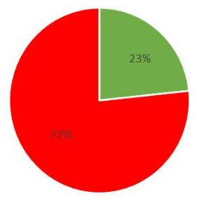

ÁLLAMI SZÁMVEVŐSZÉK

# JELENTÉS 

## Utóellenőrzések

Az önkormányzatok utóellenőrzésének kockázatértékelésen alapuló ellenőrzése
2020.

20212
www.asz.hu

---

ÁLLAMI SZÁMVEVŐSZÉK

# JELENTÉS

## Utóellenőrzések

Az önkormányzatok utóellenőrzésének kockázatértékelésen alapuló ellenőrzése

2020.
11. hó 19. nap

20212
www.asz.hu

---

# AZ ELLENŐRZÉST FELÜGYELTE: 

PETŐ KRISZTINA felügyeleti vezető

## AZ ELLENŐRZÉST VEZETTE ÉS A VÉGREHAJTÁSÁÉRT FELELŐS:

SALAMIN VIKTOR ellenőrzésvezető

## A PROGRAM ÖSSZEÁLLÍTÁSÁÉRT FELELŐS:

HOLMAN MAGDOLNA JULIANNA főtitkár

IKTATÓSZÁM: EL-3001-001/2020.
TÉMASZÁM: 2509
ELLENŐRZÉS-AZONOSÍTÓ SZÁM: V085301
Jelentéseink az Országgyúlés számítógépes hálózatán és az interneten a www.asz.hu címen is olvashatóak.

---

# TARTALOMJEGYZÉK 

■ ÖSSZEGZÉS ..... 5
■ AZ ELLENŐRZÉS CÉLJA ..... 6
■ AZ ELLENŐRZÉS TERÜLETE ..... 7
■ AZ ELLENŐRZÉS HÁTTERE, INDOKOLTSÁGA ..... 8
■ A JELENTÉS LÉNYEGES KÉRDÉSKÖREI ..... 9
■ ELLENŐRZÉS HATÓKÖRE ÉS MÓDSZEREI ..... 10
■ MEGÁLLAPÍTÁSOK ..... 12
■ MELLÉKLETEK ..... 19
I. sz. melléklet: Az intézkedési tervhez kapcsolódó jogszabályi előírások betartásának értékelése az ellenőrzött önkormányzatoknál ..... 19
II. sz. melléklet: Ellenőrzött időszak önkormányzatonként ..... 20
III. sz. melléklet: Értelmező szótár ..... 21
■ FÜGGELÉK: ÉSZREVÉTELEK ..... 23
■ RÖVIDÍTÉSEK JEGYZÉKE ..... 33

---

.

---

# ÖSSZEGZÉS 

A Számvevőszék utóellenőrzése megállapította, hogy a 30 ellenőrzött önkormányzatból 23-nál a jogkövető magatartás nem volt biztositott, igy fennáll annak kockázata, hogy az önkormányzatok müködésében, gazdálkodásában korábban feltárt szabálytalanságok kijavítása, megszüntetése elmaradt. Az ellenőrzés tapasztalatai alapján indokolt, hogy az Állami Számvevőszék az önkormányzatok teljes körét ellenőrzése alá vonja.

## Az ellenőrzés társadalmi indokoltsága

Az Állami Számvevőszék stratégiájában célul tűzte ki a számvevőszéki munka hasznosulásának javítását. Ezzel összhangban ellenőrzi, hogy az ellenőrzött szervezetek megvalósították-e a korábbi ellenőrzései által feltárt hibák, hiányosságok és szabálytalanságok megszüntetése céljából elkészített intézkedési tervekben foglaltakat. A rendszeres utóellenőrzések hozzájárulnak a szükséges intézkedések tényleges végrehajtáshoz, ezáltal a közpénzügyek rendezettségének javulásához.

Az Állami Számvevőszék kiemelt célja, hogy a helyi önkormányzatok müködésében, gazdálkodásában rejlő kockázatok feltárásával, ellenőrzésével hozzájáruljon a közpénzek átlátható, rendezett módon való felhasználásához.

Jelen utóellenőrzés 30 önkormányzat külső ellenőrzéséhez kapcsolódó egyes jogszabályi előírások betartásának értékelésére terjedt ki. Az ellenőrzésre kiválasztott önkormányzatok nem reprezentálják a hazai önkormányzatokat.

## Főbb megállapítások, következtetések

A szabálytalan müködés kockázatának értékelése az ellenőrzött önkormányzatok százalékában

- Az ellenőrzés kockázatot nem tárt fel
- Szabálytalan müködés kockázata nem csökkent

A Számvevőszék az utóellenőrzésre kiválasztott önkormányzatoknál a korábbi ellenőrzések megállapításai alapján elkészített intézkedési tervekkel kapcsolatos jogszabályi előírások betartását ellenőrizte.

A szabálytalan müködés kockázata a 30 önkormányzatból 23 esetben, az ellenőrzött önkormányzatok 77\%-ánál nem csökkent. Ezen 23 önkormányzat a külső, számvevőszéki ellenőrzésekkel kapcsolatos jogszabályi kötelezettségének nem tett eleget, így nem biztosította a számvevőszéki ellenőrzések javaslatainak hasznosulását, a feltárt szabálytalanságok megszüntetését. A szabálytalan müködés kockázata - a hibajavítási képesség, a külső ellenőrzés megállapításai hasznosításának hiányában - ezen önkormányzatok esetében nem csökkent.

A 23 önkormányzatból 11 nem számolt be az ÁSZ-nak, mint külső ellenőrzést végzőnek az általa meghatározott módon az intézkedési tervben meghatározott egyes feladatok végrehajtásáról, ezzel megsértette a vonatkozó jogszabályi előírásokat. 4 önkormányzat esetében a beszámoló nem tartalmazta valamennyi, az intézkedési tervben rögzített feladatot. Az intézkedési tervben rögzített feladatok végrehajtásáról készített beszámoló hiányában a feladatok végrehajtása nem volt értékelhető.

A 23 önkormányzatból 9 nem vezette a külső ellenőrzésekről szóló jogszabály szerinti nyilvántartást, további 1 önkormányzat esetében a nyilvántartás tartalma nem felelt meg a jogszabályban foglaltaknak. Szabályszerú nyilvántartások hiányában az intézkedések végrehajtásának nyomon követése nem volt biztosított. A jogszabályi előírások szerinti nyilvántartások hiányában az intézkedések végrehajtása nem volt biztosított.

7 önkormányzat a külső ellenőrzésekhez kapcsolódó jogszabályi előírások betartásával biztosította a külső ellenőrzések javaslatai hasznosításának lehetőségét.

---

# AZ ELLENŐRZÉS CÉLJA 

Az ellenőrzés célja annak értékelése volt, hogy a belső kontrollrendszer kialakítására és működtetésére kötelezett szervezet irányítója, vezetője csökkentette-e a szervezet szabálytalan múködésének kockázatát az intézkedési tervében meghatározott feladatok végrehajtásának értékelése alapján.

---

# AZ ELLENŐRZÉS TERÜLETE 

## Önkormányzatok

Az utóellenőrzés 30 kiválasztott önkormányzatnál értékelte a külső ellenőrzések nyilvántartásához kapcsolódó jogszabályi előírások betartását. Az ellenőrzött önkormányzatok méretükben, a település lakosságszámában, elhelyezkedésükben különbözőek.

Az utóellenőrzés alapjául szolgáló ellenőrzésekből készült jelentések 2017-2018. években kerültek nyilvánosságra. Az ÁSZ tv. ${ }^{1}$ alapján az ellenőrzött szervezeteknek a számvevőszéki jelentésben rögzített megállapítások hasznosulása érdekében intézkedési terv készítési kötelezettségük van. Az ÁSZ² célja a feltárt hibák, hiányosságok és szabálytalanságok felszámolása, ennek érdekében utóellenőrzéseket végez.

Az önkormányzatok szerteágazó feladatkörük és az ehhez kapcsolódó jelentős közpénzfelhasználás miatt visszatérő alanyai az ÁSZ ellenőrzéseinek. Jelen ellenőrzés az intézkedési tervben szereplő feladatok végrehajtásának, a számvevőszéki ellenőrzéshez kapcsolódó jogszabályi előírások betartásának értékelésével arra keresi a választ, hogy az egyes önkormányzatok csökkentették-e a szabálytalan múködésből adódó kockázatokat.

---

# AZ ELLENŐRZÉS HÁTTERE, INDOKOLTSÁGA 

Az ÁSZ tv. 33. § (1) bekezdése értelmében a számvevőszéki jelentésben foglalt javaslatokat megalapozó ÁSZ megállapítások alapján az ellenőrzött szervezet vezetője intézkedési tervet köteles összeállítani, és az Állami Számvevőszék részére megküldeni.

A költségvetési szervek belső kontrollrendszeréről és belső ellenőrzéséről szóló 370/2011. (XII. 31.) Korm. rendelet (Bkr. ${ }^{3}$ ) előírása alapján az intézkedési terv elkészítéséért, végrehajtásáért és a megtett intézkedésekről történő beszámolásért az ellenőrzött, valamint a javaslattal érintett szerv, illetve szervezeti egység vezetője a felelős. E jogszabály a költségvetési szerv vezetője részére évente beszámolási kötelezettséget határoz meg. Előírja, hogy a költségvetési szerv vezetője évente beszámol a külső ellenőrzések javaslatai alapján készült intézkedési tervek végrehajtásáról a fejezetet irányító szerv vezetőjének és a fejezetet irányító szerv belső ellenőrzési vezetőjének.

Az utóellenőrzés keretében az ÁSZ azt értékelte, hogy a költségvetési szerv vezetője az érintett számvevőszéki jelentésben foglalt javaslatokat megalapozó megállapításokkal összhangban készített intézkedési tervében meghatározott feladatok végrehajtásának értékelésével megtette-e a közpénz, közvagyon szabályos felhasználása érdekében szükséges intézkedéseket.

A vezetői intézkedések elmaradása esetén, annak a közpénzek, közvagyon veszélyeztetettségére gyakorolt valószínűsített hatásának számvevőszéki értékelése további intézkedéseket vonhat maga után.

---

# A JELENTÉS LÉNYEGES KÉRDÉSKÖREI 

1. Csökkent-e a szabálytalan müködés kockázata az ellenőrzött önkormányzatoknál?

---

# ELLENŐRZÉS HATÓKÖRE ÉS MÓDSZEREI 

## Az ellenőrzés típusa

Megfelelőségi ellenőrzés.

## Az ellenőrzött időszak

Az utóellenőrzés alapját képező ÁSZ jelentés közzétételének napjától az utóellenőrzésről szóló adatbekérő levél keltének napjáig tartó időszak a II. számú melléklet szerint.

## Az ellenőrzés tárgya

Az intézkedési tervben meghatározott feladatok végrehajtásával kapcsolatban az ellenőrzött szervezet vezetője által vezetett nyilvántartás és a feladatok végrehajtásáról készített beszámolók ${ }^{4}$.

## Az ellenőrzött szervezetek

Az ellenőrzésre kiválasztott 30 önkormányzat az I. számú melléklet szerint. (Önkormányzat alatt a helyi önkormányzatot, mint önálló költségvetési beszámoló készítésére kötelezettet, valamint a gazdálkodási feladatait ellátó önkormányzati hivatalt együttesen értjük, illetve társulás esetén a társulási megállapodásban meghatározott, annak hiányában a székhely önkormányzatot.)

## Az ellenőrzés jogalapja

Az ellenőrzés jogszabályi alapját az ÁSZ tv. 1. § (3) bekezdésének és 33. § (7) bekezdésének az előírásai képezik.

## Az ellenőrzés módszerei

Az ellenőrzést az ellenőrzési program ellenőrzési kérdései, az ellenőrzött időszakban hatályos jogszabályok, az ellenőrzés szakmai szabályok és módszertanok figyelembe vételével az ellenőrzési programban foglalt értékelési szempontok szerint végeztük.

Az ellenőrzés ideje alatt az ellenőrzött szervezettel történő kapcsolattartást az ÁSZ Szervezeti és Múködési Szabályzatának vonatkozó előírásai alapján biztosítottuk.

---

Az utóellenőrzés megállapításait az ÁSZ rendelkezésére álló dokumentumok, valamint az ÁSZ adatbekérése szerint, az ellenőrzött szervezetek által rendelkezésre bocsátott dokumentumok, adatok alapján fogalmaztuk meg, amely indokolt esetén kiegészült az ellenőrzött szervezet székhelyén történő adatbetekintéssel, helyszíni ellenőrzéssel is.

Az ellenőrzési kérdések megválaszolásához szükséges bizonyítékok megszerzése az ellenőrzött által rendelkezésre bocsátott dokumentumokra, adatokra alapozva megfigyelés, szemle (szemrevételezés), kérdésfeltevés (információkérés), valamint elemző eljárás alkalmazásával történt.

Az ellenőrzés lefolytatásához az ellenőrzött szervezet az ÁSZ által kért dokumentumok elektronikus megküldésével, illetve az önkormányzati alrendszerbe tartozó szervezetek tanúsítvány kitöltésével szolgáltattak adatot, melyek valódiságát és teljes körűségét az ellenőrzött szervezet vezetője által tett teljességi és hitelességi nyilatkozat igazolta. Az így rendelkezésre bocsátott adatok, információk, a tanúsítványi adatok valódiságának, megbízhatóságának kontrollja az ellenőrzés keretében történt.

Az ellenőrzés azonban kiterjedt minden olyan körülményre és adatra, amely az ÁSZ jogszabályban meghatározott feladataiban, valamint a program végrehajtása folyamán felmerült újabb összefüggések feltárásához szükséges volt.

Az ÁSZ az ellenőrzési kérdésekre adott válaszok alapján több lépcsőben értékelte az ellenőrzött szervezeteket.

Minden ellenőrzött szervezet esetében az ellenőrzési kérdésekre adott válaszok alapján értékeltük, hogy az ÁSZ által a szervezet szabályos működését érintően feltárt - javaslatokat megalapozó - megállapítások kezelése megtörtént-e.

Az értékelés eredménye alapján az ÁSZ további intézkedéseket kezdeményezhet.

---

# 1. Csökkent-e a szabálytalan múködés kockázata az ellenőrzött önkormányzatoknál? 

Összegző megállapítás

Az ellenőrzött 30 önkormányzat közül 23 a külső ellenőrzésekkel kapcsolatos jogszabályi előírásokat nem tartotta be. Ezen önkormányzatoknál nem igazolható, hogy a korábban végzett ÁSZ ellenőrzés során feltárt szabálytalanságok - az intézkedési tervekben vállalt intézkedések hatására - megszűntek, ezért a szabálytalan múködés kockázata nem csökkent.

Az ellenőrzött önkormányzatoknál feltárt hiányosságok, szabálytalanságok előfordulását az 1. ábra mutatja be. Az egyes önkormányzatoknál feltárt hiányosságokat az I. számú melléklet foglalja össze. A feltárt hiányosságokat önkormányzatonként az alábbiakban részletezzük.

NAGYKAMARÁS KÖZSÉG ÖNKORMÁNYZATA nem teljesítette az ÁSZ tv. 28. § (2) bekezdésében előírt adatszolgáltatási közremúködési kötelezettségét, nem bocsátotta a kért dokumentumokat az ellenőrzés rendelkezésére. Ennek következtében az ellenőrzés Nagykamarás Község Önkormányzata vonatkozásában nem volt lefolytatható, ezzel Nagykamarás Község Önkormányzata az „Utóellenőrzések" című számvevőszéki ellenőrzés lefolytatását akadályozta.

Nagykamarás Község Önkormányzata a külső ellenőrzésekhez kapcsolódó jogszabályi előírások betartását igazoló dokumentumokat, továbbá a múködés, gazdálkodás kereteit biztosító szabályzatokat, dokumentumokat nem bocsátotta az ellenőrzés rendelkezésére. A dokumentumok hiányában a jogszabályi előírásoknak való megfelelés nem igazolt.

BÁCSBORSÓD KÖZSÉGI ÖNKORMÁNYZAT a külső ellenőrzésekről szóló, a Bkr. 14. § (1) bekezdése szerinti nyilvántartást nem a 47. § (2) bekezdése szerinti tartalommal vezette. Az ÁSZ ellenőrzésének javaslatait megalapozó megállapításokhoz kapcsolódó, intézkedési tervben meghatározott feladatokat nem hajtotta végre a Bkr. 13. § (2) bekezdésének előírása ellenére.

BAKONYTAMÁSI KÖZSÉG ÖNKORMÁNYZATA az ÁSZ-nak, mint külső ellenőrzést végzőnek nem az általa meghatározott módon és tartalommal számolt be az intézkedési tervben meghatározott egyes feladatok végrehajtásáról, ezzel megsértette a Bkr. 13. § (4) bekezdésének előírásait.

Bakonytamási Község Önkormányzata a külső ellenőrzésekről szóló, a Bkr. 14. § (1) bekezdése szerinti nyilvántartást nem vezette.

Bakonytamási Község Önkormányzata az ÁSZ ellenőrzésének javaslatait megalapozó megállapításokhoz kapcsolódó, intézkedési tervben meghatározott feladatokat nem hajtotta végre a Bkr. 13. § (2) bekezdésének előírása ellenére.

---

# BUDAPEST FŐVÁROS II. KERÜLETI ÖNKOR- 

MÁNYZAT a külső ellenőrzésekről a Bkr. 47. § (2) bekezdésében foglalt tartalommal vezetett nyilvántartása nem tartalmazta az ÁSZ ellenőrzéséhez kapcsolódó intézkedési tervben rögzített valamennyi feladatot, emiatt nem teljesült a Bkr. 14. § (1) bekezdésében foglalt előírás.

Budapest Főváros II. Kerületi Önkormányzat az ÁSZ ellenőrzésének javaslatait megalapozó megállapításokhoz kapcsolódó, intézkedési tervben meghatározott feladatokat nem hajtotta végre a Bkr. 13. § (2) bekezdésének előírása ellenére.

BÜKKARANYOS KÖZSÉG ÖNKORMÁNYZATA az ÁSZnak, mint külső ellenőrzést végzőnek nem az általa meghatározott módon és tartalommal számolt be az intézkedési tervben meghatározott egyes feladatok végrehajtásáról, ezzel megsértette a Bkr. 13. § (4) bekezdésének előírásait.

Bükkaranyos Község Önkormányzata a külső ellenőrzésekről a Bkr. 47. § (2) bekezdésében foglalt tartalommal vezetett nyilvántartása nem tartalmazta az ÁSZ ellenőrzéséhez kapcsolódó intézkedési tervben rögzített valamennyi feladatokat, emiatt nem teljesült a Bkr. 14. § (1) bekezdésében foglalt előírás.

Bükkaranyos Község Önkormányzata az ÁSZ ellenőrzésének javaslatait megalapozó megállapításokhoz kapcsolódó, intézkedési tervben meghatározott feladatokat nem hajtotta végre a Bkr. 13. § (2) bekezdésének előírása ellenére.

HATVAN VÁROS ÖNKORMÁNYZATA nem számolt be az ÁSZ-nak, mint külső ellenőrzést végzőnek az általa meghatározott módon az intézkedési tervben meghatározott egyes feladatok végrehajtásáról, ezzel megsértette a Bkr. 13. § (4) bekezdésének előírásait.

Hatvan Város Önkormányzata a külső ellenőrzésekről a Bkr. 47. § (2) bekezdésében foglalt tartalommal vezetett nyilvántartása nem tartalmazta az ÁSZ ellenőrzéséhez kapcsolódó intézkedési tervben rögzített valamennyi feladatot, emiatt nem teljesült a Bkr. 14. § (1) bekezdésében foglalt előírás.

Hatvan Város Önkormányzata az ÁSZ ellenőrzésének javaslatait megalapozó megállapításokhoz kapcsolódó, intézkedési tervben meghatározott feladatokat nem hajtotta végre a Bkr. 13. § (2) bekezdésének előírása ellenére.

IVÁNBATTYÁN KÖZSÉG ÖNKORMÁNYZATA a külső ellenőrzésekről a Bkr. 47. § (2) bekezdésében foglalt tartalommal vezetett nyilvántartása nem tartalmazta az ÁSZ ellenőrzéséhez kapcsolódó intézkedési tervben rögzített valamennyi feladatot, emiatt nem teljesült a Bkr. 14. § (1) bekezdésében foglalt előírás.

Ivánbattyán Község Önkormányzata az ÁSZ ellenőrzésének javaslatait megalapozó megállapításokhoz kapcsolódó, intézkedési tervben meghatározott feladatokat nem hajtotta végre a Bkr. 13. § (2) bekezdésének előírása ellenére.

---

KÉTHELY KÖZSÉG ÖNKORMÁNYZATA nem számolt be az ÁSZ-nak, mint külső ellenőrzést végzőnek az általa meghatározott módon az intézkedési tervben meghatározott egyes feladatok végrehajtásáról, ezzel megsértette a Bkr. 13. § (4) bekezdésének előírásait.

KÖTELEK KÖZSÉG ÖNKORMÁNYZATA nem számolt be az ÁSZ-nak, mint külső ellenőrzést végzőnek az általa meghatározott módon az intézkedési tervben meghatározott egyes feladatok végrehajtásáról, ezzel megsértette a Bkr. 13. § (4) bekezdésének előírásait.

Kőtelek Község Önkormányzata a külső ellenőrzésekről szóló, a Bkr. 14. § (1) bekezdése szerinti nyilvántartást nem vezette.

Kőtelek Község Önkormányzata az ÁSZ ellenőrzésének javaslatait megalapozó megállapításokhoz kapcsolódó, intézkedési tervben meghatározott feladatokat nem hajtotta végre a Bkr. 13. § (2) bekezdésének előírása ellenére.

MAGYARATÁD KÖZSÉGI ÖNKORMÁNYZAT nem számolt be az ÁSZ-nak, mint külső ellenőrzést végzőnek az általa meghatározott módon az intézkedési tervben meghatározott egyes feladatok végrehajtásáról, ezzel megsértette a Bkr. 13. § (4) bekezdésének előírásait.

Magyaratád Községi Önkormányzat a külső ellenőrzésekről szóló, a Bkr. 14. § (1) bekezdése szerinti nyilvántartást nem vezette.

Magyaratád Községi Önkormányzat az ÁSZ ellenőrzésének javaslatait megalapozó megállapításokhoz kapcsolódó, intézkedési tervben meghatározott feladatokat nem hajtotta végre a Bkr. 13. § (2) bekezdésének előírása ellenére.

MEZŐKÖVESD VÁROS ÖNKORMÁNYZATA a külső ellenőrzésekről szóló, a Bkr. 14. § (1) bekezdése szerinti nyilvántartást nem vezette.

Mezőkövesd Város Önkormányzata az ÁSZ ellenőrzésének javaslatait megalapozó megállapításokhoz kapcsolódó, intézkedési tervben meghatározott feladatokat nem hajtotta végre a Bkr. 13. § (2) bekezdésének előírása ellenére.

MOHÁCS VÁROS ÖNKORMÁNYZATA nem számolt be az ÁSZ-nak, mint külső ellenőrzést végzőnek az általa meghatározott módon az intézkedési tervben meghatározott egyes feladatok végrehajtásáról, ezzel megsértette a Bkr. 13. § (4) bekezdésének előírásait.

Mohács Város Önkormányzata a külső ellenőrzésekről a Bkr. 47. § (2) bekezdésében foglalt tartalommal vezetett nyilvántartása nem tartalmazta az ÁSZ ellenőrzéséhez kapcsolódó intézkedési tervben rögzített valamennyi feladatot, emiatt nem teljesült a Bkr. 14. § (1) bekezdésében foglalt előírás.

Mohács Város Önkormányzata az ÁSZ ellenőrzésének javaslatait megalapozó megállapításokhoz kapcsolódó, intézkedési tervben meghatározott feladatokat nem hajtotta végre a Bkr. 13. § (2) bekezdésének előírása ellenére.

---

MONORIERDŐ KÖZSÉG ÖNKORMÁNYZATA nem számolt be az ÁSZ-nak, mint külső ellenőrzést végzőnek az általa meghatározott módon az intézkedési tervben meghatározott egyes feladatok végrehajtásáról, ezzel megsértette a Bkr. 13. § (4) bekezdésének előírásait.

Monorierdő Község Önkormányzata a külső ellenőrzésekről szóló, a Bkr. 14. § (1) bekezdése szerinti nyilvántartást nem vezette.

Monorierdő Község Önkormányzata az ÁSZ ellenőrzésének javaslatait megalapozó megállapításokhoz kapcsolódó, intézkedési tervben meghatározott feladatokat nem hajtotta végre a Bkr. 13. § (2) bekezdésének előírása ellenére.

NAGYKÁLLO VÁROS ÖNKORMÁNYZATA az ÁSZ-nak, mint külső ellenőrzést végzőnek nem az általa meghatározott módon és tartalommal számolt be az intézkedési tervben meghatározott egyes feladatok végrehajtásáról, ezzel megsértette a Bkr. 13. § (4) bekezdésének előírásait.

Nagykálló Város Önkormányzata a külső ellenőrzésekről a Bkr. 47. § (2) bekezdésében foglalt tartalommal vezetett nyilvántartása nem tartalmazta az ÁSZ ellenőrzéséhez kapcsolódó intézkedési tervben rögzített valamennyi feladatot, emiatt nem teljesült a Bkr. 14. § (1) bekezdésében foglalt előírás.

Nagykálló Város Önkormányzata az ÁSZ ellenőrzésének javaslatait megalapozó megállapításokhoz kapcsolódó, intézkedési tervben meghatározott feladatokat nem hajtotta végre a Bkr. 13. § (2) bekezdésének előírása ellenére.

NYÍRKARÁSZ KÖZSÉGI ÖNKORMÁNYZAT a külső ellenőrzésekről a Bkr. 47. § (2) bekezdésében foglalt tartalommal vezetett nyilvántartása nem tartalmazta az ÁSZ ellenőrzéséhez kapcsolódó intézkedési tervben rögzített valamennyi feladatot, emiatt nem teljesült a Bkr. 14. § (1) bekezdésében foglalt előírás.

Nyírkarász Községi Önkormányzat az ÁSZ ellenőrzésének javaslatait megalapozó megállapításokhoz kapcsolódó, intézkedési tervben meghatározott feladatokat nem hajtotta végre a Bkr. 13. § (2) bekezdésének előírása ellenére.

ÓPUSZTASZER KÖZSÉGI ÖNKORMÁNYZAT nem számolt be az ÁSZ-nak, mint külső ellenőrzést végzőnek az általa meghatározott módon az intézkedési tervben meghatározott egyes feladatok végrehajtásáról, ezzel megsértette a Bkr. 13. § (4) bekezdésének előírásait.

Ópusztaszer Községi Önkormányzat a külső ellenőrzésekről a Bkr. 47. § (2) bekezdésében foglalt tartalommal vezetett nyilvántartása nem tartalmazta az ÁSZ ellenőrzéséhez kapcsolódó intézkedési tervben rögzített valamennyi feladatot, emiatt nem teljesült a Bkr. 14. § (1) bekezdésében foglalt előírás.

Ópusztaszer Községi Önkormányzat az ÁSZ ellenőrzésének javaslatait megalapozó megállapításokhoz kapcsolódó, intézkedési tervben meghatározott feladatokat nem hajtotta végre a Bkr. 13. § (2) bekezdésének előírása ellenére.

---

RUDABÁNYA VÁROS ÖNKORMÁNYZATA nem számolt be az ÁSZ-nak, mint külső ellenőrzést végzőnek az általa meghatározott módon az intézkedési tervben meghatározott egyes feladatok végrehajtásáról, ezzel megsértette a Bkr. 13. § (4) bekezdésének előírásait.

Rudabánya Város Önkormányzata a külső ellenőrzésekről szóló, a Bkr. 14. § (1) bekezdése szerinti nyilvántartást nem vezette.

Rudabánya Város Önkormányzata az ÁSZ ellenőrzésének javaslatait megalapozó megállapításokhoz kapcsolódó, intézkedési tervben meghatározott feladatokat nem hajtotta végre a Bkr. 13. § (2) bekezdésének előírása ellenére.

# SIKLÓSNAGYFALU KÖZSÉGI ÖNKORMÁNYZAT 

nem számolt be az ÁSZ-nak, mint külső ellenőrzést végzőnek az általa meghatározott módon az intézkedési tervben meghatározott egyes feladatok végrehajtásáról, ezzel megsértette a Bkr. 13. § (4) bekezdésének előírásait.

Siklósnagyfalu Községi Önkormányzat a külső ellenőrzésekről szóló, a Bkr. 14. § (1) bekezdése szerinti nyilvántartást nem vezette.

Siklósnagyfalu Községi Önkormányzat az ÁSZ ellenőrzésének javaslatait megalapozó megállapításokhoz kapcsolódó, intézkedési tervben meghatározott feladatokat nem hajtotta végre a Bkr. 13. § (2) bekezdésének előírása ellenére.

SZENNA KÖZSÉG ÖNKORMÁNYZATA a külső ellenőrzésekről a Bkr. 47. § (2) bekezdésében foglalt tartalommal vezetett nyilvántartása nem tartalmazta az ÁSZ ellenőrzéséhez kapcsolódó intézkedési tervben rögzített valamennyi feladatot, emiatt nem teljesült a Bkr. 14. § (1) bekezdésében foglalt előírás.

Szenna Község Önkormányzata az ÁSZ ellenőrzésének javaslatait megalapozó megállapításokhoz kapcsolódó, intézkedési tervben meghatározott feladatokat nem hajtotta végre a Bkr. 13. § (2) bekezdésének előírása ellenére.

SZIGETHALOM VÁROS ÖNKORMÁNYZATA a külső ellenőrzésekről a Bkr. 47. § (2) bekezdésében foglalt tartalommal vezetett nyilvántartása nem tartalmazta az ÁSZ ellenőrzéséhez kapcsolódó intézkedési tervben rögzített valamennyi feladatot, emiatt nem teljesült a Bkr. 14. § (1) bekezdésében foglalt előírás.

Szigethalom Város Önkormányzata az ÁSZ ellenőrzésének javaslatait megalapozó megállapításokhoz kapcsolódó, intézkedési tervben meghatározott feladatokat nem hajtotta végre a Bkr. 13. § (2) bekezdésének előírása ellenére.

## TISZASZENTMÁRTON KÖZSÉG ÖNKORMÁNY-

ZATA az ÁSZ-nak, mint külső ellenőrzést végzőnek nem az általa meghatározott módon és tartalommal számolt be az intézkedési tervben meghatározott egyes feladatok végrehajtásáról, ezzel megsértette a Bkr. 13. § (4) bekezdésének előírásait.

Tiszaszentmárton Község Önkormányzata a külső ellenőrzésekről szóló, a Bkr. 14. § (1) bekezdése szerinti nyilvántartást nem vezette.

---

Tiszaszentmárton Község Önkormányzata az ÁSZ ellenőrzésének javaslatait megalapozó megállapításokhoz kapcsolódó, intézkedési tervben meghatározott feladatokat nem hajtotta végre a Bkr. 13. § (2) bekezdésének előírása ellenére.

VAJDÁCSKA KÖZSÉGI ÖNKORMÁNYZAT nem számolt be az ÁSZ-nak, mint külső ellenőrzést végzőnek az általa meghatározott módon az intézkedési tervben meghatározott egyes feladatok végrehajtásáról, ezzel megsértette a Bkr. 13. § (4) bekezdésének előírásait.

Vajdácska Községi Önkormányzat a külső ellenőrzésekről a Bkr. 47. § (2) bekezdésében foglalt tartalommal vezetett nyilvántartása nem tartalmazta az ÁSZ ellenőrzéséhez kapcsolódó intézkedési tervben rögzített valamennyi feladatot, emiatt nem teljesült a Bkr. 14. § (1) bekezdésében foglalt előírás.

Vajdácska Községi Önkormányzat az ÁSZ ellenőrzésének javaslatait megalapozó megállapításokhoz kapcsolódó, intézkedési tervben meghatározott feladatokat nem hajtotta végre a Bkr. 13. § (2) bekezdésének előírása ellenére.

# ZALAEGERSZEG MEGYEI JOGÚ VÁROS ÖNKOR- 

MÁNYZATA a külső ellenőrzésekről a Bkr. 47. § (2) bekezdésében foglalt tartalommal vezetett nyilvántartása nem tartalmazta az ÁSZ ellenőrzéséhez kapcsolódó intézkedési tervben rögzített valamennyi feladatot, emiatt nem teljesült a Bkr. 14. § (1) bekezdésében foglalt előírás.

Zalaegerszeg Megyei Jogú Város Önkormányzata az ÁSZ ellenőrzésének javaslatait megalapozó megállapításokhoz kapcsolódó, intézkedési tervben meghatározott feladatokat nem hajtotta végre a Bkr. 13. § (2) bekezdésének előírása ellenére.

HÉT ÖNKORMÁNYZAT A SZÁMVEVŐSZÉK ÁLTAL VÉGZETT ELLENŐRZÉSEK ESETÉBEN AZ INTÉZKEDÉSI TERVVEL KAPCSOLATOS JOGSZABÁLYI ELŐÍRÁSOKAT BETARTOTTA, az intézkedéseket nyilvántartotta, megvalósulásukat nyomon követte. Ezen önkormányzatok múködésére vonatkozó kockázatot az ellenőrzés nem tárt fel. Ezen hét önkormányzat a következő:
— Cegléd Város Önkormányzata,
— Dabas Város Önkormányzata,
— Hajmás Község Önkormányzata,
— Hidegség Község Önkormányzata,
— Jászszentandrás Községi Önkormányzat,
— Őzd Város Önkormányzata,
— Veresegyház Város Önkormányzata.

---

.

---

# MELLÉKLETEK

I. SZ. MELLÉKLET: AZ INTÉZKEDÉSI TERVHEZ KAPCSOLÓDÓ JOGSZABÁLYI ELŐÍRÁSOK BETARTÁSÁNAK ÉRTÉKELÉSE AZ ELLENŐRZÖTT ÖNKORMÁNYZATOKNÁL

|   | Önkormányzatok | Beszámolót készített? | A beszámoló teljes körüen tartalmazza az intézkedési terv feladatait? | Nyilvántartás alátámasztotta a beszámolót? | Nyilvántartást vezetett? | Nyilvántartás megfelel a Bkr. 47. §-ban foglaltaknak? | Nyilvántartás teljes körüen tartalmazza az ÁSZ megállapításokat?  |
| --- | --- | --- | --- | --- | --- | --- | --- |
|  1. | BÁCSBORSÓD KÖZSÉGI ÖNKORMÁNYZAT | I | I | N | I | N | N  |
|  2. | BAKONYTAMÁSI KÖZSÉG ÖNKORMÁNYZATA | I | N | N | N | N | N  |
|  3. | BUDAPEST FÖVÁROS II. KERÜLETI ÖNKORMÁNYZAT | I | I | N | I | I | N  |
|  4. | BÜKKARANYOS KÖZSÉG ÖNKORMÁNYZATA | I | N | N | I | I | N  |
|  5. | CEGLÉD VÁROS ÖNKORMÁNYZATA | I | I | I | I | I | I  |
|  6. | DABAS VÁROS ÖNKORMÁNYZATA | I | I | I | I | I | I  |
|  7. | HAJMÁS KÖZSÉG ÖNKORMÁNYZATA | I | I | I | I | I | I  |
|  8. | HATVAN VÁROS ÖNKORMÁNYZATA | N | N | N | I | I | N  |
|  9. | HIDEGSÉG KÖZSÉG ÖNKORMÁNYZATA | I | I | I | I | I | I  |
|  10. | IVÁNBATTYÁN KÖZSÉG ÖNKORMÁNYZATA | I | I | N | I | I | N  |
|  11. | JÁSZSZENTANDRÁS KÖZSÉGI ÖNKORMÁNYZAT | I | I | I | I | I | I  |
|  12. | KÉTHELY KÖZSÉG ÖNKORMÁNYZATA | N | N | N | I | I | I  |
|  13. | KÖTELEK KÖZSÉG ÖNKORMÁNYZAT | N | N | N | N | N | N  |
|  14. | MAGYARATÁD KÖZSÉGI ÖNKORMÁNYZAT | N | N | N | N | N | N  |
|  15. | MEZÖKÖVESD VÁROS ÖNKORMÁNYZATA | I | I | N | N | N | N  |
|  16. | MOHÁCS VÁROS ÖNKORMÁNYZATA | N | N | N | I | I | N  |
|  17. | MONORIERDŐ KÖZSÉG ÖNKORMÁNYZATA | N | N | N | N | N | N  |
|  18. | NAGYKÁLLÓ VÁROS ÖNKORMÁNYZATA | I | N | N | I | I | N  |
|  19. | NAGYKAMARÁS KÖZSÉG ÖNKORMÁNYZATA | N | N | N | N | N | N  |
|  20. | NYÍRKARÁSZ KÖZSÉGI ÖNKORMÁNYZAT | I | I | N | I | I | N  |
|  21. | ÖPUSZTASZER KÖZSÉGI ÖNKORMÁNYZAT | N | N | N | I | I | N  |
|  22. | ÖZD VÁROS ÖNKORMÁNYZATA | I | I | I | I | I | I  |
|  23. | RUDABÁNYA VÁROS ÖNKORMÁNYZATA | N | N | N | N | N | N  |
|  24. | SIBLÓSNAGYFÁLU KÖZSÉGI ÖNKORMÁNYZAT | N | N | N | N | N | N  |
|  25. | SZENNA KÖZSÉG ÖNKORMÁNYZATA | I | I | N | I | I | N  |
|  26. | SZIGETHALOM VÁROS ÖNKORMÁNYZAT | I | I | N | I | I | N  |
|  27. | TISZASZENTMÁRTON KÖZSÉG ÖNKORMÁNYZATA | I | N | N | N | N | N  |
|  28. | VAJDÁCSKA KÖZSÉGI ÖNKORMÁNYZAT | N | N | N | I | I | N  |
|  29. | VERESEGYHÁZ VÁROS ÖNKORMÁNYZATA | I | I | I | I | I | I  |
|  30. | ZALAEGERSZEG MEGYEI JOGÚ VÁROS ÖNKORMÁNYZATA | I | I | N | I | I | N  |

I - Igen N - Nem

---

|   | Önkormányzatok | Az utóellenőrzés alapját képező ÁSZ jelentés közzétételének napja | Az utóellenőrzésről szóló adatbekérő levél kelte  |
| --- | --- | --- | --- |
|  1. | BÁCSBORSÓD KÖZSÉGI ÖNKORMÁNYZAT | 2017. október 3. | 2019. szeptember 11.  |
|  2. | BAKONYTAMÁSI KÖZSÉG ÖNKORMÁNYZATA | 2017. június 13. | 2019. szeptember 11.  |
|  3. | BUDAPEST FÖVÁROS II. KERÜLETI ÖNKORMÁNYZAT | 2017. április 4. | 2019. szeptember 11.  |
|  4. | BÜKKARANYOS KÖZSÉG ÖNKORMÁNYZATA | 2017. április 4. | 2019. szeptember 11.  |
|  5. | CEGLÉD VÁROS ÖNKORMÁNYZATA | 2018. április 27. | 2019. szeptember 11.  |
|  6. | DABAS VÁROS ÖNKORMÁNYZATA | 2018. április 27. | 2019. szeptember 11.  |
|  7. | HAJMÁS KÖZSÉG ÖNKORMÁNYZATA | 2017. október 3. | 2019. szeptember 11.  |
|  8. | HATVAN VÁROS ÖNKORMÁNYZATA | 2018. február 8. | 2019. szeptember 11.  |
|  9. | HIDEGSÉG KÖZSÉG ÖNKORMÁNYZATA | 2017. szeptember 13. | 2019. szeptember 11.  |
|  10. | IVÁNBATTYÁN KÖZSÉG ÖNKORMÁNYZATA | 2018. február 8. | 2019. szeptember 11.  |
|  11. | JÁSZSZENTANDRÁS KÖZSÉGI ÖNKORMÁNYZAT | 2017. február 14. | 2019. szeptember 11.  |
|  12. | KÉTHELY KÖZSÉG ÖNKORMÁNYZATA | 2017. május 18. | 2019. szeptember 11.  |
|  13. | KÖTELEK KÖZSÉG ÖNKORMÁNYZAT | 2018. december 27. | 2019. szeptember 11.  |
|  14. | MAGYARATÁD KÖZSÉGI ÖNKORMÁNYZAT | 2018. június 20. | 2019. szeptember 11.  |
|  15. | MEZÖKÖVESD VÁROS ÖNKORMÁNYZATA | 2017. május 18. | 2019. szeptember 11.  |
|  16. | MOHÁCS VÁROS ÖNKORMÁNYZATA | 2017. június 13. | 2019. szeptember 11.  |
|  17. | MONORIERDŐ KÖZSÉG ÖNKORMÁNYZATA | 2018. február 27. | 2019. szeptember 11.  |
|  18. | NAGYKÁLLÓ VÁROS ÖNKORMÁNYZATA | 2018. április 13. | 2019. szeptember 11.  |
|  19. | NAGYKAMARÁS KÖZSÉG ÖNKORMÁNYZATA | 2018. június 29. | 2019. szeptember 11.  |
|  20. | NYÍRKARÁSZ KÖZSÉGI ÖNKORMÁNYZAT | 2018. október 9. | 2019. szeptember 11.  |
|  21. | ÖPUSZTASZER KÖZSÉGI ÖNKORMÁNYZAT | 2017. május 18. | 2019. szeptember 11.  |
|  22. | ÖZD VÁROS ÖNKORMÁNYZATA | 2017. május 23. | 2019. szeptember 11.  |
|  23. | RUDABÁNYA VÁROS ÖNKORMÁNYZATA | 2018. január 17. | 2019. szeptember 11.  |
|  24. | SIKLÓSNAGYFALU KÖZSÉGI ÖNKORMÁNYZAT | 2018. december 13. | 2019. szeptember 11.  |
|  25. | SZENNA KÖZSÉG ÖNKORMÁNYZATA | 2017. május 23. | 2019. szeptember 11.  |
|  26. | SZIGETHALOM VÁROS ÖNKORMÁNYZAT | 2018. február 15. | 2019. szeptember 11.  |
|  27. | TISZASZENTMÁRTON KÖZSÉG ÖNKORMÁNYZATA | 2017. szeptember 13. | 2019. szeptember 11.  |
|  28. | VAJDÁCSKA KÖZSÉGI ÖNKORMÁNYZAT | 2018. július 18. | 2019. szeptember 11.  |
|  29. | VERESEGYHÁZ VÁROS ÖNKORMÁNYZATA | 2017. november 22. | 2019. szeptember 11.  |
|  30. | ZALAEGERSZEG MEGYEI JOGÚ VÁROS ÖNKORMÁNYZATA | 2018. június 20. | 2019. szeptember 11.  |

---

a múködés, gazdálkodás kereteit biztosító szabályzatok, dokumentumok
belső kontrollrendszer
intézkedési terv
belső ellenőrzés

Bkr. hatálya alá tartozó szerve-
zet

Az ellenőrzés lefolytatásakor a következő működés, gazdálkodás kereteit biztosító szabályzatokat, dokumentumokat értékeltük:

- Szervezeti és Működési Szabályzat (Áht. 9. § b) pont, 10. § (5) bek., Ávr. 13. § (1) bek.),
- társult önkormányzatok esetében az önkormányzatok között létrejött társulási megállapodás (Mötv. 93. §),
- számviteli politika (és a keretében elkészítendő belső szabályzatok: eszközök és források leltárkészítési és leltározási szabályzata, eszközök és források értékelési szabályzata, pénzkezelési szabályzat) (Számv. tv. 14. § (3)-(4) bek., 14. § (5) bek. d) pont, (8) bek., 14. § (5) bek. a) pont, 14. § (5) bek. b) pont),
- a kötelezettségvállalásra, pénzügyi ellenjegyzésre, teljesítés igazolására, érvényesítésre, utalványozásra jogosult személyekről és aláírás-mintájukról vezetett nyilvántartás az államháztartásról szóló törvény végrehajtásáról szóló 368/2011. (XII. 31.) Korm. rendelet 60. § (3) bekezdésében foglaltak szerint (Ávr. 60. § (3) bek.),
- ha a helyi önkormányzat mellett múködő(tt) helyi nemzetiségi önkormányzat, a helyi nemzetiségi önkormányzat és a helyi önkormányzat által kötött, aláírt hatályos megállapodás(ok),
- Vezetői nyilatkozat a belső kontrollrendszer múködéséről a költségvetési szervek belső kontrollrendszeréről és belső ellenőrzéséről szóló 370/2011. (XII. 31.) Korm. rendelet 11. § (1) és (4) bekezdésében foglaltak szerint (Bkr. 11. § (1) és (4) bek., 1. melléklet),
- Vagyongazdálkodási rendelet (Htv. 138. § (1) bek. j) pontja).

A belső kontrollrendszer a kockázatok kezelése és tárgyilagos bizonyosság megszerzése érdekében kialakított folyamatrendszer, amely azt a célt szolgálja, hogy a múködés és gazdálkodás során a tevékenységeket szabályszerűen, gazdaságosan, hatékonyan, eredményesen hajtsák végre, az elszámolási kötelezettségeket teljesítsék, megvédjék az erőforrásokat a veszteségektől, károktól és nem rendeltetésszerű használattól. (Forrás: Áht. 69. § (1) bekezdése).
Az ellenőrzési javaslatok alapján az ellenőrzött szervezet, szervezeti egység által készített intézkedések végrehajtásának ütemezése a végrehajtásért felelős személyek és a vonatkozó határidők megjelölésével. (Bkr. 2. § k) pont).
Független, tárgyilagos bizonyosságot adó és tanácsadó tevékenység, amelynek célja, hogy az ellenőrzött szervezet múködését fejlessze és eredményességét növelje, az ellenőrzött szervezet céljai elérése érdekében rendszerszemléletű megközelítéssel és módszeresen értékeli, illetve fejleszti az ellenőrzött szervezet irányítási és belső kontrollrendszerének hatékonyságát (Bkr. 2. § b) pont).
A Bkr. 1. § (2) bekezdésben felsorolt szervezetek köre a Bkr. 1. § (2) bekezdés d) pont (a kormányzati szektorba sorolt egyéb szervezetek) kivételével

---

.

---

# FÜGGELÉK: ÉSZREVÉTELEK 

A jelentéstervezetet a Számvevőszék 15 napos észrevételezésre megküldte az ellenőrzött szervezetek vezetőinek az ÁSZ tv. 29. §* (1) bekezdése előírásának megfelelően.

Kéthely Község Önkormányzatának polgármestere, Nagykálló Város Önkormányzatának polgármestere, Szenna Község Önkormányzatának polgármestere, Hatvan Város Önkormányzatának polgármestere, Budapest Főváros II. Kerületi Önkormányzat polgármestere, Rudabánya Város Önkormányzatának polgármestere, Zalaegerszeg Megyei Jogú Város Önkormányzatának polgármestere, valamint Nagykamarás Község Önkormányzatának polgármestere a jelentéstervezet megállapításaira írásban észrevételt tett. Az Önkormányzatok polgármestereinek figyelembe nem vett észrevételeit és az elutasítás indokát a függelék tartalmazza.

[^0]
[^0]:    * 29. § (1) Az Állami Számvevőszék az ellenőrzési megállapításait megküldi az ellenőrzött szervezet vezetőjének vagy az általa megbízott személynek, és annak, akinek személyes felelősségét állapította meg.
    (2) Az ellenőrzött szervezet vezetője és a felelősként megjelölt személy az ellenőrzés megállapításaira tizenöt napon belül írásban észrevételt tehet.
    (3) Az Állami Számvevőszék az észrevételre a beérkezésétől számított harminc napon belül írásban válaszol. A figyelembe nem vett észrevételeket köteles a jelentésben feltüntetni, és megindokolni, hogy azokat miért nem fogadta el.

---

Az Állami Számvevőszék (továbbiakban: ÁSZ) az ellenőrzési megállapításait az ellenőrzött szervezet közreműködési kötelezettsége keretében, az ellenőrzési adatszolgáltatás során a részére törvényi határidőben rendelkezésre bocsátott, az ellenőrzött szervezet által Teljességi és hitelességi nyilatkozattal alátámasztott hiteles dokumentumokra alapozva fogalmazta meg.
Minden ellenőrzött szervezet a jelentéstervezet rá vonatkozó megállapításai tekintetében gyakorolhatta észrevételezési jogát, így a figyelembe nem vett észrevételek elutasításának indoklása is az adott ellenőrzött szerv tevékenységét értékelő megállapításra vonatkozik.

# Kéthely Község Önkormányzata 

Az Önkormányzat polgármestere észrevételt tett az intézkedési tervben meghatározott egyes feladatok végrehajtásáról szóló beszámolással kapcsolatban (Jelentéstervezet 1. megállapítás)
Kéthely Község Önkormányzatának (továbbiakban: Önkormányzat) polgármestere észrevételében jelezte, hogy adatszolgáltatási kötelezettség teljesítését az előírt módon az Állami Számvevőszék Elektronikus adatszolgáltatási rendszerén keresztül teljesítették, illetve postai úton is megküldték 2020. szeptember 20-án. A polgármester levelében tájékoztatatta az ÁSZ-t, hogy a tárhelyre került feltöltésre az 1. számú tanúsítvány, amelyben részletesen, az intézkedési tervben megfogalmazott valamennyi elvégzendő feladatra vonatozóan számot adtak a végrehajtásról. Észrevételében jelezte, hogy megküldésre került a „Külső ellenőrzésekhez kapcsolódó intézkedések nyilvántartása", amely szintén tartalmazta az intézkedési tervben megfogalmazott feladatokat, azok végrehajtási határidejét, illetve a megtett intézkedéseket. A fenti dokumentumokon kívül további szöveges beszámoló megküldését nem tartották szükségesnek.

Az ÁSZ az EL-1779-001/2019. iktatószámú adatbekérő levél 2. számú mellékletében nem szöveges beszámolót kért, ahogy azt a polgármester észrevételében is jelezte -, hanem az ellenőrzött időszakra vonatkozóan a „Beszámoló a javaslatokat megalapozó ÁSZ megállapításhoz kapcsolódó feladatok végrehajtásáról az önkormányzati alrendszerbe tartozó szervezeteknél" megnevezésű tanúsítvány kitöltését kérte.

A beküldött dokumentumok ismételt felülvizsgálatát követően megállapítást nyert, hogy a kitöltött tanúsítványt nem bocsátották az ellenőrzés rendelkezésére az adatszolgáltatás időszakában. A polgármester 2019. szeptember 20-án kelt teljességi és hitelességi nyilatkozata - amelyben az átadott dokumentumok, adatok megbízhatóságáról és teljes körűségéről nyilatkozott - sem tartalmazza az 1. számú tanúsítványt. Az ÁSZ az ellenőrzési megállapításait az ellenőrzési adatbekérés során a részére határidőben rendelkezésre bocsátott, valamint a teljességi és hitelességi nyilatkozattal alátámasztott, hiteles dokumentumok alapján tette meg.

Mindezek alapján megalapozott az ellenőrzés azon megállapítása, amely szerint Kéthely Község Önkormányzata nem számolt be az ÁSZ-nak, mint külső ellenőrzést végzőnek az általa meghatározott módon az intézkedési tervben meghatározott egyes feladatok végrehajtásáról, ezzel megsértette a költségvetési szervek belső kontrollrendszeréről és belső ellenőrzéséről szóló 370/2011. (XII.31.) Korm. rendelet 13. § (4) bekezdése előírásait.

A fentiekre tekintettel a jelentéstervezet megállapítása helytálló, módosítása nem indokolt.
Köszönettel vettem a külső ellenőrzésekről vezetett nyilvántartással összefüggő tájékoztatását, azt az ÁSZ nem tekinti észrevételnek, mert az ellenőrzés sem fogalmazott meg megállapítást erre vonatkozóan.

## Nagykálló Város Önkormányzata

Az Önkormányzat polgármestere észrevételt tett az intézkedési tervben meghatározott egyes feladatok végrehajtásának módjával és tartalmával kapcsolatban (Jelentéstervezet 1. megállapítás 2. bekezdés)
Nagykálló Város Önkormányzatának (továbbiakban: Önkormányzat) polgármestere észrevételében leírta, hogy a költségvetési szervek belső kontrollrendszeréről és belső ellenőrzéséről szóló 370/2011. (XII. 31.) Korm. rendelet (továbbiakban: Bkr.) 13. § (4) bekezdése szerint az ellenőrzött, valamint a javaslattal érintett szerv, illetve szervezeti egység vezetője a külső ellenőrzést végzők részére a külön jogszabályban vagy annak hiányában az általuk meghatározott módon és határidőre számol be az intézkedési tervben meghatározott egyes feladatok végrehajtásáról. Észrevételében jelezte, továbbá, hogy az EL-1808-001/2019. iktatószámú adatszolgáltatásra felhívó levélben az Utóellenőrzések című programhoz a dokumentumok jegyzékében felsorolt sarkalatos dokumentumokat, a Bkr. 14. § (1) be-

---

kezdése szerint a külső ellenőrzések javaslatai alapján készült intézkedési tervek végrehajtásáról vezetett éves nyilvántartást az ÁSZ által meghatározott módon és határidőre megküldték az ÁSZ részére. A polgármester véleménye szerint ezzel a Bkr. 13. § (4) bekezdésében foglaltaknak megfelelően járt el az önkormányzat.
Az ÁSZ az EL-1808-001/2019. iktatószámú adatbekérő levélben kérte az 1. számú tanúsítvány kitöltését. A 2019. szeptember 23-án kelt teljességi és hitelességi nyilatkozattal alátámasztott módon Nagykálló Város Önkormányzata a „6_1_SZ_TANUSITVANY.pdf" nevű dokumentumot adta át.
A beküldött dokumentumok ismételt felülvizsgálatát követően megállapítást nyert, az Önkormányzat által a tanúsítványi adatszolgáltatás (1. számú tanúsítvány) keretében készített beszámoló nem tartalmazta valamennyi, a tárgyi utóellenőrzés alapjául szolgáló alapellenőrzés során az Önkormányzat által megküldött és az ÁSZ által elfogadott intézkedési tervben és az annak mellékletét képező 5/2018. számú jegyzői utasításban szereplő intézkedési tervpontot (feladatot) és azok végrehajtását.

A jegyzőnek szóló 3. számú javaslattal kapcsolatosan az 5/2018. számú jegyzői utasítás kettő feladatot fogalmazott meg, amelyből csak a második szerepel az 1. számú tanúsítványban. A jegyzőnek szóló 5. számú javaslattal kapcsolatosan az 5/2018. számú jegyzői utasítás három feladatot fogalmazott meg, amelyből csak a harmadik feladat szerepel az 1. számú tanúsítványban és az sem teljes körűen, mert a bizonylattal kapcsolatos teendők nem kerültek pontosan meghatározásra. A jegyzőnek szóló 6. számú javaslat esetében az 5/2018. számú jegyzői utasítás három feladatot fogalmazott meg, amelyből csak a harmadik feladat szerepel az 1. számú tanúsítványban. A jegyzőnek szóló 8. számú javaslattal kapcsolatosan a jegyzői utasítás három feladatot fogalmazott meg, amelyek nem szerepelnek az 1. számú tanúsítványban. A jegyzőnek szóló 9. számú javaslathoz kapcsolódóan a jegyzői utasítás kettő feladatot fogalmazott meg, amelyből a második nem szerepel az 1. számú tanúsítványban. Ezáltal az Önkormányzat a Bkr. 13. § (4) bekezdésében foglaltak ellenére nem az ÁSZ által meghatározott módon és tartalommal számolt be az intézkedési tervben meghatározott egyes feladatok végrehajtásáról.

A fentiekre tekintettel a jelentéstervezet megállapítása helytálló, módosítása nem indokolt.

# Az Önkormányzat polgármestere észrevételt tett a külső ellenőrzésekről vezetett nyilvántartás tartalmával kapcsolatban (Jelentéstervezet 1. megállapítás 3. bekezdés) 

A polgármester észrevételében jelezte, hogy az Önkormányzat Bkr. 14. § (1) bekezdésében előírtak szerint vezetett nyilvántartását felülvizsgálták és megállapították, hogy az tartalmazta az ÁSZ jelentésében szereplő valamennyi, a polgármesternek, valamint a jegyzőnek előírt javaslatot. Az intézkedési terv valamennyi intézkedést igénylő megállapítása feltüntetésre került, mindössze egy, többször ismétlődő megállapítást - a 2016. évben lefolytatott belső ellenőrzésekhez a Bkr. 45. § (1)-(3) bekezdéseiben előírtak ellenére nem készített az érintett szervezeti egység vezetője intézkedési tervet, amely az ÁSZ jelentésében taglalt javaslat és megállapítás az 5.2. és 7.1 számon szerepelt - egy alkalommal tüntettek fel, tekintettel arra, hogy ugyanazt a megállapítást tartalmazta.
Az ÁSZ az EL-1808-001/2019. iktatószámú adatbekérő levélben kérte a Bkr. 14.§ (1) bekezdés szerinti, az Önkormányzat által a külső ellenőrzések javaslatai alapján készült intézkedési tervek végrehajtásáról vezetett nyilvántartás átadását. A 2019. szeptember 23-án kelt teljességi és hitelességi nyilatkozattal alátámasztott módon az Önkormányzat az „1_KÜLSŐ_ELL_NYILVANTARTAS.pdf" és a „6_1_SZ_TANUSITVANY.pdf" nevű dokumentumokat adta át.
A beküldött dokumentumok ismételt felülvizsgálatát követően megállapítást nyert, hogy az „1_KÜLSŐ_ELL_NYILVANTARTAS.pdf" elnevezésű, külső ellenőrzések nyilvántartása dokumentum nem tartalmazta az összes intézkedési tervpontot, így az 1. számú tanúsítványban szereplő információk a külső ellenőrzésekről vezetett nyilvántartásban szereplő adatokkal sem alátámasztottak. A jegyzőnek szóló 3. számú javaslattal kapcsolatosan az elvégzendő feladatokat tartalmazó 5/2018. számú jegyzői utasítás kettő feladatot fogalmazott meg, ebből csak a második szerepel a külső ellenőrzések nyilvántartásában. A jegyzőnek szóló 5. számú javaslattal kapcsolatosan a jegyzői utasítás három feladatot fogalmazott meg, ebből csak a harmadik szerepel a külső ellenőrzések nyilvántartásában, de az is hiányosan, mert a bizonylattal kapcsolatos teendők nem kerültek pontosan meghatározásra. A jegyzőnek szóló 6. számú javaslat esetében a jegyzői utasítás három feladatot fogalmazott meg, amelyből csak a harmadik feladat szerepel a külső ellenőrzések nyilvántartásában. A jegyzőnek címzett 8. számú javaslattal kapcsolatosan a jegyzői utasítás három feladatot fogalmaz meg, ezek nem szerepelnek a külső ellenőrzések nyilvántartásában. A 9. számú javaslathoz kapcsolódóan kettő feladat van megfogalmazva, ebből a második nem szerepel a nyilvántartásban. Ezáltal az Önkormányzat által a külső ellenőrzések javaslatai

---

alapján készült intézkedési tervek végrehajtásáról vezetett nyilvántartás nem felelt meg a Bkr. 14. § (1) bekezdése előírásainak.

A fentiekre tekintettel a jelentéstervezet megállapítása helytálló, módosítása nem indokolt.
Az Önkormányzat polgármestere észrevételt tett az intézkedési tervben meghatározott feladatok végrehajtásával kapcsolatban (Jelentéstervezet 1. megállapítás 4. bekezdés)

A polgármester észrevételében jelezte, hogy a megállapításban foglaltakkal nem ért egyet, mert az utóellenőrzés során megküldött dokumentumok, valamint a külső ellenőrzésekhez kapcsolódó intézkedések nyilvántartásában a megtett intézkedések tételesen bemutatják az intézkedési tervben szereplő feladatok végrehajtását. Polgármester úr észrevételében leírta, hogy szervezeti és munkavállalói szinten is a külső ellenőrzések során feltárt hibák, hiányosságok kijavítását, megszüntetését prioritásként kezelik a mindennapi munkavégzés során.

Az ÁSZ az EL-1808-001/2019. iktatószámú adatbekérő levélben kérte a Bkr. 14.§ (1) bekezdés szerinti, az Önkormányzat által a külső ellenőrzések javaslatai alapján készült intézkedési tervek végrehajtásáról vezetett nyilvántartás átadását. Az Önkormányzat a 2019. szeptember 23-án kelt teljességi és hitelességi nyilatkozattal alátámasztott módon az „1_KÜLSŐ_ELL_NYILVANTARTAS.pdf" és a „6_1_SZ_TANUSITVANY.pdf" nevű dokumentumokat adta át.

A beküldött dokumentumok ismételt felülvizsgálatát követően megállapítást nyert, hogy az Önkormányzat által a tanúsítványi adatszolgáltatás (1. számú tanúsítvány) keretében készített beszámoló nem tartalmazta valamennyi, a tárgyi utóellenőrzés alapjául szolgáló alapellenőrzés során az Önkormányzat által megküldött és az ÁSZ által elfogadott intézkedési tervben és az annak mellékletét képező 5/2018. számú jegyzői utasításban szereplő intézkedési tervpontot (feladatot) és azok végrehajtását. Az „1_KÜLSŐ_ELL_NYILVANTARTAS.pdf" elnevezésű, külső ellenőrzések nyilvántartása dokumentum nem tartalmazta az összes intézkedési tervpontot, így az 1. számú tanúsítványban szereplő információk a külső ellenőrzésekről vezetett nyilvántartásban szereplő adatokkal nem alátámasztottak. Ezáltal az Önkormányzat nem biztosította a Bkr. 13. § (1) bekezdése szerint az intézkedési terv elkészítésének, végrehajtásának és a megtett intézkedésekről történő beszámolás megfelelőségét.

A fentiekre tekintettel a jelentéstervezet megállapítása helytálló, módosítása nem indokolt.

# Szenna Község Önkormányzata 

Az Önkormányzat polgármestere észrevételt tett az intézkedési tervben meghatározott egyes feladatok nyilvántartásával kapcsolatban (Jelentéstervezet 1. megállapítás)

Szenna Község Önkormányzatának (továbbiakban: Önkormányzat) polgármestere észrevételében jelezte, hogy a külső ellenőrzések nyilvántartásában felsorolt feladatokat összevetették az ÁSZ ellenőrzéséhez kapcsolódó intézkedési tervben meghatározott feladatokkal és eltérést nem találtak. Észrevételében leírta továbbá, hogy a feladatokat az intézkedési tervben meghatározott határidőig minden esetben végrehajtották, a kitűzött célt elérték, a végrehajtást és annak időpontját 2019. szeptember 23. napján az ellenőrzési internetes felületre feltöltött táblázatban feltüntették.

Az ÁSZ az EL-1782-001/2019. iktatószámú adatbekérő levél 2. számú mellékletében kérte az ellenőrzött időszakra vonatkozóan a külső ellenőrzések javaslatai alapján készült intézkedési tervek végrehajtásáról vezetett Bkr. 14. § (1) bekezdés szerinti nyilvántartást.

Az ellenőrzés rendelkezésére bocsátott külső ellenőrzésekről szóló nyilvántartások felülvizsgálatakor megállapítást nyert, hogy azok folyamatos és teljes körű vezetéséről az ÁSZ ellenőrzéssel kapcsolatban nem gondoskodtak. A nyilvántartások a Bkr. 47. § (2) bekezdésében előírt, az intézkedési tervek szerinti egyes feladatokhoz tartozó, kötelezően rögzítendő információkat maradéktalanul nem tartalmazták.

Mindezek alapján megalapozott az ellenőrzés azon megállapítása, amely szerint Szenna Község Önkormányzata a külső ellenőrzésekről a Bkr. 47. § (2) bekezdésében foglalt tartalommal vezetett nyilvántartása nem tartalmazta az ÁSZ ellenőrzéséhez kapcsolódó intézkedési tervben rögzített valamennyi feladatot, emiatt nem teljesült a Bkr. 14. § (1) bekezdésében foglalt előírás.

A fentiekre tekintettel a jelentéstervezet megállapítása helytálló, módosítása nem indokolt.

---

# Az Önkormányzat polgármestere észrevételt tett az intézkedési tervben meghatározott egyes feladatok végrehajtásával kapcsolatban (Jelentéstervezet 1. megállapítás) 

A polgármester észrevételében jelezte, hogy a Simonfai Közös Önkormányzati Hivatalra vonatkozó kitöltött 1. számú tanúsítvány feltöltött példánya két sor tekintetében hiányos, nem tartalmazta a „Részesedések helyes besorolása" és „A befektetési jegyek hozamát a bizonylat beérkezését követően haladéktalanul nyilvántartásba kell venni" megnevezésű feladatokat, melyek 2017. június 30. nappal végrehajtásra kerültek. A polgármester észrevételében rögzítette, hogy az Önkormányzat az ÁSZ ellenőrzések javaslatait megalapozó megállapításokhoz kapcsolódó intézkedési tervben meghatározott feladatokat végrehajtotta a Bkr. 13. §. (2) bekezdése szerint.
Az ÁSZ az EL-1782-001/2019. iktatószámú adatbekérő levél 2. számú mellékletében kérte kitölteni az ellenőrzött időszakra vonatkozóan a „Beszámoló a javaslatokat megalapozó ÁSZ megállapításhoz kapcsolódó feladatok végrehajtásáról az önkormányzati alrendszerbe tartozó szervezeteknél" megnevezésű tanúsítványt. A polgármester észrevételében elismerte, hogy a Simonfai Közös Önkormányzati Hivatalra vonatkozó kitöltött tanúsítvány feltöltött példánya hiányos, nem tartalmazta a „Részesedések helyes besorolása" és „A befektetési jegyek hozamát a bizonylat beérkezését követően haladéktalanul a nyilvántartásba fel kell venni" megnevezésű feladatokat. Továbbá a Simonfai Közös Önkormányzati Hivatal külső ellenőrzésekről vezetett nyilvántartása az intézkedési tervben meghatározott feladatok végrehajtásának bemutatása tekintetében hiányos, ezáltal nem támasztja alá az 1. számú tanúsítvány adatait.

Mindezek alapján megalapozott az ellenőrzés azon megállapítása, amely szerint Szenna Község Önkormányzata az ÁSZ ellenőrzésének javaslatait megalapozó megállapításokhoz kapcsolódó, intézkedési tervben meghatározott feladatokat nem hajtotta végre a Bkr. 13. § (2) bekezdésének előírása ellenére.

Az ÁSZ az ellenőrzési megállapításait az ellenőrzési adatbekérés során a részére határidőben rendelkezésre bocsátott, teljességi és hitelességi nyilatkozattal alátámasztott, hiteles dokumentumok alapján tette meg. A polgármester és a Simonfai Közös Önkormányzati Hivatal jegyzője az átadott dokumentumok, adatok hitelességért, valódiságáért, hiánytalanságáért és hatályosságáért a 2019. 09.23-án kelt teljességi és hitelességi nyilatkozatukban teljes felelősséget vállaltak.

A fentiekre tekintettel a jelentéstervezet megállapítása helytálló, módosítása nem indokolt.

## Hatvan Város Önkormányzata

Az Önkormányzat polgármestere észrevételt tett az intézkedési tervben meghatározott egyes feladatok végrehajtásának módjával és tartalmával kapcsolatban (Jelentéstervezet 1. megállapítás 2-3. bekezdés)
Hatvan Város Önkormányzatának (továbbiakban: Önkormányzat) polgármestere észrevételében jelezte, hogy az ÁSZ 2019. szeptember 11. napján kelt utóellenőrzésről szóló adatbekérő levelében meghatározott határidőben feltöltésre kerültek a levél mellékletét képező jegyzék szerinti dokumentumok. A „Beszámoló a javaslatokat megalapozó ÁSZ megállapításhoz kapcsolódó feladatok végrehajtásáról az önkormányzati alrendszerbe tartozó szervezeteknél" elnevezésű táblázat felöltésére határidőben adminisztratív hiba miatt nem került sor, ezért azt postai úton tértivevényes küldeményként küldte meg az Önkormányzat az ÁSZ részére, amelyet az ÁSZ 2019. november 19. napján kézhez vett. Ezen beszámoló mellékletét képező nyilvántartások azonban az ÁSZ 2019. szeptember 11. napján kelt utóellenőrzésről szóló adatbekérő levelére vonatkozó elektronikus feltöltés alkalmával az ÁSZ részére határidőben megküldésre kerültek.

A polgármester észrevételében tájékoztatta az ÁSZ-t arról, hogy az Önkormányzat jegyzője a Bkr. 31. § (6) bekezdése alapján soron kívüli ellenőrzést rendelt el arra vonatkozóan, hogy az ÁSZ ellenőrzési megállapításai alapján elkészített intézkedési tervben (módosított intézkedési tervben) foglalt intézkedések végrehajtása megtörtént-e. A fenti eljárás eredményeként készített beszámoló szerint az intézkedési tervben foglaltak végrehajtásra kerültek.

Továbbá a polgármester észrevételében kérte, hogy az ÁSZ módosítsa oly módon a jelentéstervezet megállapításait, hogy az Önkormányzat részben eleget tett beszámolási kötelezettségének, mert a külső ellenőrzések nyilvántartása határidőben megküldésre került. A polgármester levele mellékleteként megküldte az ÁSZ jelentés alapján, a jegyző által elrendelt ellenőrzésről készített, intézkedési terv végrehajtásáról szóló beszámolót, ezért kérte az ÁSZ megállapításának módosítását. A polgármester észrevétele szerint a 2019. szeptember 11. napján kelt utóellenőrzésről szóló adatbekérő levél szerint megküldött dokumentumok alapján részben megállapítható, hogy az intézkedési tervben foglaltaknak az Önkormányzat határidőben eleget tett.

---

Az ÁSZ az EL-1812-001/2019. iktatószámú adatbekérő levelében kérte az utóellenőrzés alapját képező 18041 számú ÁSZ jelentéshez kapcsolódóan a külső ellenőrzések javaslatai alapján készült intézkedési tervek végrehajtásáról, a Bkr. 14. § (1) bekezdésének előírása szerint vezetett nyilvántartását, valamint a Bkr. 13. § (4) bekezdése szerinti beszámolót („Beszámoló a javaslatokat megalapozó ÁSZ megállapításhoz kapcsolódó feladatok végrehajtásáról az önkormányzati alrendszerbe tartozó szervezeteknél" című 1. számú tanúsítvány). Az ÁSZ adatbekérő levelében felhívta a polgármester figyelmét az ÁSZ tv. 28. § (1)-(2) bekezdésében foglaltakra, amely alapján az adatszolgáltatást soron kívül, de legkésőbb öt munkanapon belül szükséges teljesíteni.

A 2019. szeptember 23-án kelt, a polgármester által aláírt teljességi és hitelességi nyilatkozat szerint az Önkormányzat a Bkr. 13. § (4) bekezdése szerinti beszámolót („Beszámoló a javaslatokat megalapozó ÁSZ megállapításhoz kapcsolódó feladatok végrehajtásáról az önkormányzati alrendszerbe tartozó szervezeteknél" elnevezésű táblázatot) nem bocsátotta az ÁSZ rendelkezésére. A külső ellenőrzések javaslatai alapján készült intézkedési tervek végrehajtásáról vezetett nyilvántartásaként az Önkormányzat négy olyan dokumentumot bocsátott az ÁSZ rendelkezésére, amelyekben a Nemzeti Adó- és Vámhivatal, a Magyar Államkincstár, a Heves Megyei Kormányhivatal, valamint az Innovációs és Technológiai Minisztérium ellenőrzéseivel kapcsolatos információk találhatóak. A nyilvántartások azonban az utóellenőrzés alapját képező ÁSZ ellenőrzéssel kapcsolatos adatokat nem tartalmazta.

Az ÁSZ megállapításait az adatszolgáltatásra rendelkezésre álló időszak alatt az Önkormányzat által megküldött dokumentumok alapján tette meg. Az ÁSZ tv. 28. § (1) bekezdése alapján az ÁSZ ellenőrzéseinek lefolytatása érdekében az ellenőrzött szervezet közreműködésre köteles. Az ellenőrzött szervezet közreműködési kötelezettsége magában foglalja az ÁSZ tv. 28. § (2) bekezdés szerinti kötelezettséget, amely szerint a közreműködésre felhívott szervezet az ÁSZ részére - annak kérésére soron kívül, de legkésőbb öt munkanapon belül - az ellenőrzés lefolytatása érdekében szükséges adatokat és dokumentumokat rendelkezésre bocsátja. Az ÁSZ tv. 28. § (2) bekezdése szerinti közreműködési kötelezettség törvényi határidőben történő teljesítése a rendelkezésre bocsátott adatok, dokumentumok ÁSZ általi befogadásának alapvető feltétele. A polgármester teljességi és hitelességi nyilatkozatával igazolta az ellenőrzésnek határidőben átadott dokumentumok teljes körűségét és hitelességét, hogy azokat objektív ellenőrzés bizonyítékként tudja értékelni és figyelembe venni a megbízható és szakszerű megállapítások megtételéhez. A polgármester észrevételében elismerte, hogy a „Beszámoló a javaslatokat megalapozó ÁSZ megállapításhoz kapcsolódó feladatok végrehajtásáról az önkormányzati alrendszerbe tartozó szervezeteknél" elnevezésű táblázatot határidőben nem bocsátotta az ÁSZ rendelkezésére.

Tájékoztatom, hogy az adatszolgáltatásra rendelkezésre álló határidőn túl, valamint az ellenőrzött időszakon kívül keletkezett, az észrevételéhez megküldött dokumentumokat az ÁSZ az utóellenőrzés során nem tudja figyelembe venni, azok visszaküldéséről gondoskodik.

A fentiekre tekintettel a jelentéstervezet megállapítása helytálló, módosítása nem indokolt.

# Budapest Főváros II. Kerületi Önkormányzat 

Az Önkormányzat polgármestere észrevételt tett az intézkedési tervhez kapcsolódó nyilvántartásra és az intézkedési tervben meghatározott feladatok végrehajtásával kapcsolatban (Jelentéstervezet 1. megállapítás 2-3. bekezdés)

Budapest Főváros II. Kerületi Önkormányzat (továbbiakban: Önkormányzat) polgármestere észrevételében leírta, hogy a jelentéstervezet alapján a Külső Ellenőrzések Nyilvántartásának táblázata áttekintésre került és mellékelten megküldte 2016. évi ellenőrzésekről szóló táblázatot, amely tartalmazza az utóellenőrzés alapjául szolgáló 2016. augusztus 2. napján indult ellenőrzés megállapításait, az előírt és a megtett intézkedések rövid leírását. Az észrevétel szerint az ÁSZ a 2017. évtől kérte a külső ellenőrzésekre vonatkozó nyilvántartás feltöltését. Az észrevételben rögzítésre került, hogy valamennyi, a 17059 sorszámú számvevőszéki jelentésben megfogalmazott javaslat, megállapítás végrehajtásra került.

Az ÁSZ az EL-1786-001/2019. iktatószámú, 2019. szeptember 11-én kelt adatbekérő levele 2. számú mellékletének II.1. pontjában kérte az utóellenőrzés alapját képező 17059 számú számvevőszéki jelentés közzétételének napjától az adatbekérő levél keltének napjáig tartó időszakra vonatkozóan a külső ellenőrzések javaslatai alapján készült intézkedési tervek végrehajtásáról vezetett, a Bkr. 14. § (1) bekezdésének megfelelő nyilvántartást. Ez alapján az ÁSZ nem 2017. évtől kérte a külső ellenőrzésekre vonatkozó nyilvántartás feltöltését, ahogy azt a polgármester észrevételében jelezte, hanem a megjelölt időszakra vonatkozó releváns dokumentumokat kérte. Az ÁSZ az utóellenőrzés alapjául szolgáló ellenőrzésének javaslatairól az Önkormányzatot 2017-ben tájékoztatta és ugyanebben az évben vette tudomásul a javaslatot megalapozó

---

megállapításokra készített intézkedési tervet. A nyilvántartás jogszabályban előírt vezetését - függetlenül attól, hogy melyik évben nyitotta meg az Önkormányzat a nyilvántartását - 2017-től tudta teljesíteni az Önkormányzat, amikor az információk rendelkezésre álltak.

Az Önkormányzat a 2019. szeptember 24-én kelt teljességi és hitelességi nyilatkozattal alátámasztott módon - amelyben polgármester és jegyző az átadott dokumentumok, adatok megbízhatóságáról és teljes körűségéről nyilatkozott - a „KülsőEll.Nyilv. 2017-2019.xlsx" megnevezésű dokumentumot bocsátotta az ellenőrzés rendelkezésére. Az ÁSZ ellenőrzési megállapításait az ellenőrzési adatbekérés során határidőben átadott, a teljességi és hitelességi nyilatkozatban feltüntetett, hiteles dokumentumok alapján tette meg.

A rendelkezésre bocsátott dokumentum ismételt felülvizsgálata során megállapítást nyert, hogy a „KülsőEll.Nyilv. 20172019.xlsx" megnevezésű nyilvántartás a Bkr. 14 (1) bekezdésében foglaltak ellenére nem tartalmazta az ÁSZ ellenőrzéséhez kapcsolódó intézkedési tervben rögzített valamennyi feladatot. Az ellenőrzés rendelkezésére bocsátott nyilvántartás hiányosságát Polgármester úr észrevétele is megerősítette.

Az ÁSZ tv. 28. § (2) bekezdése szerint, a közreműködésre felhívott szervezet az ÁSZ részére - annak kérésére soron kívül, de legkésőbb öt munkanapon belül - az ellenőrzés tervezhetősége, meghatározása, illetve lefolytatása érdekében szükséges adatokat és dokumentumokat rendelkezésre bocsátja, illetve a kapcsolódó tájékoztatást köteles megadni. Az Önkormányzat teljességi és hitelességi nyilatkozattal alátámasztottan dokumentumokat bocsátott az ellenőrzés rendelkezésére. Az ÁSZ az ellenőrzés során kizárólag az adatszolgáltatásra rendelkezésre álló - az ÁSZ tv. 28. § (2) bekezdés szerinti - határidőn belül beérkezett dokumentumokat veszi figyelembe. A törvényes határidőn túl megküldött dokumentumokat az ÁSZ nem értékeli, annak visszaküldéséről gondoskodik.

Mindezek alapján az ellenőrzött szervezet vezetője nem igazolta, hogy a külső ellenőrzésekről szóló a Bkr. 47. § (2) bekezdésében foglalt tartalommal vezetett nyilvántartása tartalmazta az ÁSZ utóellenőrzés alapjául szolgáló ellenőrzéséhez kapcsolódó intézkedési tervben rögzített feladatokat, ezért nem teljesült a Bkr. 14. § (1) bekezdésében foglalt előírás, és nem igazolta, hogy a Bkr. 13. § (2) bekezdésében foglaltaknak megfelelően az intézkedési tervben foglaltak végrehajtása megtörtént.

A fentiekre tekintettel a jelentéstervezet megállapítása helytálló, módosítása nem indokolt.

# Rudabánya Város Önkormányzata 

Az Önkormányzat polgármestere észrevételt tett az intézkedési tervhez kapcsolódó beszámolóra és nyilvántartásra vonatkozóan (Jelentéstervezet 1. megállapítás 2-4. bekezdései)

Rudabánya Város Önkormányzatának (továbbiakban: Önkormányzat) polgármestere észrevételében jelezte, hogy az utóellenőrzéssel kapcsolatosan az adatbekérő levélben szereplő valamennyi „sarkalatos" dokumentum a rendszerbe feltöltésre került. Az „egyéb" dokumentumok közül a külső ellenőrzések javaslatai alapján készült intézkedési tervek végrehajtásáról vezetett nyilvántartás és a teljességi és hitelességi nyilatkozat lemaradt, azonban azok postai úton 2019.09.24. lettek továbbítva. A postai úton továbbított dokumentumok hitelesített másolatát a polgármester az észrevételhez mellékelve megküldte az Állami Számvevőszék részére.

Az ÁSZ az EL-1813-001/2019. iktatószámú, 2019. szeptember 11-én kelt adatbekérő levele 2. számú mellékletének II.1. pontjában bekérte a külső ellenőrzések javaslatai alapján készült intézkedési tervek végrehajtásáról vezetett, a Bkr. 14. § (1) bekezdésének megfelelő nyilvántartást, továbbá 6. pontjában az 1. számú tanúsítványt (Beszámoló a javaslatokat megalapozó ÁSZ megállapításokhoz kapcsolódó feladatok végrehajtásáról az önkormányzati alrendszerbe tartozó szervezeteknél).

Rudabánya Város Önkormányzatának Alpolgármestere - aki a polgármesteri feladatok teljeskörű ellátásának meghatalmazásával rendelkezett az adatbekérés időszakában - az adatszolgáltatás keretében a 2019. szeptember 24-i keltezésű, postai úton továbbított teljességi és hitelességi nyilatkozatot bocsátotta az ellenőrzés rendelkezésére. A teljességi és hitelességi nyilatkozatban - amelyben az Alpolgármester az átadott dokumentumok, adatok megbízhatóságáról és teljes körűségéről nyilatkozott - az adatbekérő levél 2. számú melléklete II.1. pontjához és II.6. pontjához tartozó adatszolgáltatás tekintetében nem szerepelt az ellenőrzés rendelkezésére bocsátott dokumentum. Az ÁSZ az ellenőrzési megállapításait az ellenőrzési adatbekérés során határidőben átadott, a teljességi és hitelességi nyilatkozatban feltüntetett, hiteles dokumentumok alapján tette meg.

---

Az ÁSZ tv. 28. § (2) bekezdése szerint, a közreműködésre felhívott szervezet az ÁSZ részére - annak kérésére soron kívül, de legkésőbb öt munkanapon belül - az ellenőrzés tervezhetősége, meghatározása, illetve lefolytatása érdekében szükséges adatokat és dokumentumokat rendelkezésre bocsátja, illetve a kapcsolódó tájékoztatást köteles megadni. Rudabánya Város Önkormányzata teljességi és hitelességi nyilatkozattal alátámasztottan dokumentumokat bocsátott az ellenőrzés rendelkezésére. Az ÁSZ az ellenőrzés során kizárólag az adatszolgáltatásra rendelkezésre álló - az ÁSZ tv. 28. § (2) bekezdés szerinti - határidőn belül beérkezett dokumentumokat veszi figyelembe. A törvényes határidőn túl megküldött dokumentumokat az Állami Számvevőszék nem értékeli.

Mindezek alapján az ellenőrzött szervezet vezetője - a Bkr. 13. § (4) bekezdésében foglalt előírások ellenére - az intézkedési tervben meghatározott feladatok végrehajtásáról nem számolt be az Állami Számvevőszék részére, nem igazolta, hogy a külső ellenőrzésekről szóló, a Bkr. 14. § (1) bekezdése szerinti nyilvántartást vezette, és nem igazolta, hogy a Bkr. 13. § (2) bekezdésében foglaltaknak megfelelően az intézkedési tervben foglaltak végrehajtása megtörtént.

A fentiekre tekintettel a jelentéstervezet megállapítása helytálló, módosítása nem indokolt.

# Zalaegerszeg Megyei Jogú Város Önkormányzata 

Az Önkormányzat polgármestere észrevételt tett a külső ellenőrzésekről vezetett nyilvántartás tartalmával kapcsolatban (Jelentéstervezet 1. megállapítás 2. bekezdése)

Zalaegerszeg Megyei Jogú Város Önkormányzatának (továbbiakban: Önkormányzat) polgármestere észrevételében leírta, hogy a külső ellenőrzésekről szóló, jogszabály szerinti nyilvántartást hivataluk az előírt tartalommal vezeti, azonban a vizsgált időszakra vonatkozó nyilvántartásba kettő tétel sajnálatos módon nem került rögzítésre. Az adminisztrációs hibát kijavították, és a hiányzó tételekkel kiegészített nyilvántartást az észrevétel mellékleteként megküldték.

Az ÁSZ az EL-1804-001/2019. iktatószámú adatbekérő levélben kérte a Bkr. 14.§ (1) bekezdés szerinti, az Önkormányzat által a külső ellenőrzések javaslatai alapján készült intézkedési tervek végrehajtásáról vezetett nyilvántartás átadását. A 2019. szeptember 23-án kelt teljességi és hitelességi nyilatkozattal alátámasztott módon az Önkormányzat az „2018_külső_ell.nyilvántartása.pdf" és a „2019_külső_ell.nyilvántartás.pdf" nevű dokumentumokat adta át. Az ÁSZ az ellenőrzési megállapításait az ellenőrzési adatbekérés során határidőben átadott, a teljességi és hitelességi nyilatkozatban feltüntetett, hiteles dokumentumok alapján tette meg.

A beküldött dokumentumok ismételt felülvizsgálata során megállapítást nyert, hogy az Önkormányzat által a külső ellenőrzések javaslatai alapján készült intézkedési tervek végrehajtásáról vezetett 2018. évi nyilvántartás a Bkr. 14 (1) bekezdésében foglaltak ellenére nem tartalmazta az ÁSZ ellenőrzéséhez kapcsolódó intézkedési tervben a polgármester számára rögzített feladatokat. Az ellenőrzés rendelkezésére bocsátott nyilvántartás hiányosságát a polgármester észrevétele is alátámasztja.

Az ÁSZ tv. 28. § (2) bekezdése szerint, a közreműködésre felhívott szervezet az ÁSZ részére - annak kérésére soron kívül, de legkésőbb öt munkanapon belül - az ellenőrzés tervezhetősége, meghatározása, illetve lefolytatása érdekében szükséges adatokat és dokumentumokat rendelkezésre bocsátja, illetve a kapcsolódó tájékoztatást köteles megadni. Zalaegerszeg Megyei Jogú Város Önkormányzata teljességi és hitelességi nyilatkozattal alátámasztottan dokumentumokat bocsátott az ellenőrzés rendelkezésére. Az ÁSZ az ellenőrzés során kizárólag az adatszolgáltatásra rendelkezésre álló - az ÁSZ tv. 28. § (2) bekezdés szerinti - határidőn belül beérkezett dokumentumokat veszi figyelembe. A törvényes határidőn túl megküldött dokumentumokat az ÁSZ nem értékeli.

A fentiekre tekintettel a jelentéstervezet megállapítása helytálló, módosítása nem indokolt.

## Nagykamarás Község Önkormányzata

Az Önkormányzat polgármestere észrevételt tett az adatszolgáltatási kötelezettség teljesítésével kapcsolatban (Jelentéstervezet 1. megállapítás 2-3. bekezdései)

Nagykamarás Község Önkormányzatának (továbbiakban: Önkormányzat) polgármestere észrevételében leírta, hogy kérte az ÁSZ-t az adatszolgáltatás megtételére nyitva álló határidő meghosszabbítását. Észrevételében jelezte továbbá, hogy az adatszolgáltatásra nyitva álló határidőn belül az Önkormányzat töltött fel dokumentumokat az ÁSZ Elektronikus Adatszolgáltatási Rendszerébe (továbbiakban: ABR). A polgármester észrevételében jelezte, hogy az adatszolgáltatáshoz nem került feltöltésre a teljességi és hitelességi nyilatkozat, és kérte a nyilatkozat pótlólagos megküldésének lehetőségét a számvevőszéki jelentés véglegesítéséhez.

---

Az ÁSZ az EL-1803-001/2019. iktatószámú, 2019. szeptember 11-én kelt adatbekérő levelének 2. számú mellékletében felsorolt - az ellenőrzött időszakban hatályos, illetve az ellenőrzött időszakra vonatkozó - aláírt, hiteles dokumentumokat kérte pdf formátumban az ABR felületre feltölteni.

Az ÁSZ az adatbekérő levelében felhívta a polgármester figyelmét, hogy ellenőrzés megállapításait az adatbekérés során határidőben átadott, valamint az ellenőrzött szervezet vezetője által aláírt teljességi és hitelességi nyilatkozatban feltüntetett (továbbiakban: nyilatkozat), hiteles dokumentumok alapján teszi meg. Az ellenőrzött szervezet vezetője nyilatkozik arról, hogy az ÁSZ részére átadott, a nyilatkozatban részletezett dokumentumok, adatok megbízhatóak és a bekért adatokra, dokumentumokra vonatkozóan teljes körű információt tartalmaznak. Az ellenőrzött szervezet vezetője nyilatkozik továbbá az átadott dokumentumok, adatok hitelességéért, valódiságért, hiánytalanságáért és hatályosságáért, továbbá felelősséget vállal, hogy a dokumentumok, adatok az eredetivel mindenben megegyeznek.

Az ÁSZ tv. 28. § (2) bekezdése előírása szerint a közremúködésre felhívott szervezet az ÁSZ részére - annak kérésére soron kívül, de legkésőbb öt munkanapon belül - az ellenőrzés tervezhetősége, meghatározása, illetve lefolytatása érdekében szükséges adatokat és dokumentumokat rendelkezésre bocsátja, illetve a kapcsolódó tájékoztatást köteles megadni.

A polgármester észrevételében elismerte, hogy az adatszolgáltatáshoz nem került feltöltésre az ABR felületre a nyilatkozat. Az ÁSZ 2019. október 4-én, a polgármester részére küldött elektronikus levelében jelezte a nyilatkozat hiányát és kérte, hogy azt egy munkanapon belül elektronikus úton, az eredeti példányt pedig postai úton küldje meg az ÁSZ részére.

A polgármester az ÁSZ felszólítása ellenére továbbra sem küldte meg a nyilatkozatát. Az ellenőrzött szervezettől beszerzett adatok hitelességét és a dokumentumok meglétét a polgármester által kiállított teljességi és hitelességi nyilatkozat garantálja. Nyilatkozat hiányában a polgármester nem igazolta, hogy az ÁSZ részére rendelkezésre bocsátott dokumentumok, adatok hitelesek, valódiak, hiánytalanok és hatályosságukért a polgármester felelősséget vállal, továbbá hogy a dokumentumok, adatok az eredetivel mindenben megegyeznek. Mindezek alapján az ÁSZ az átadott dokumentumok hitelességéről, valódiságáról, hiánytalanságáról nem tudott meggyőződni.

A fentiekre tekintettel a jelentéstervezet megállapítása helytálló, módosítása nem indokolt.

---

.

---

# RÖVIDÍTÉSEK JEGYZÉKE 

${ }^{1}$ ÁSZ tv.
${ }^{2}$ ÁSZ
${ }^{3}$ Bkr.
${ }^{4}$ Beszámoló

Az Állami Számvevőszékről szóló 2011. évi LXVI. törvény (hatályos: 2011. július 1-jétől).
Állami Számvevőszék
A költségvetési szervek belső kontrollrendszeréről és belső ellenőrzéséről szóló 370/2011. (XII. 31.) Korm. rendelet (hatályos: 2012. január 1-jétől).
Az ellenőrzött önkormányzatok által az ÁSZ, mint külső ellenőr által kért, a meghatározott intézkedési tervben rögzített feladatok végrehajtásáról készített beszámoló a Bkr. 13. § (4) bekezdése szerint.

---

# ASZ 

ALLAMI SZAMVEVOSZEK
1052 Budapest, Apáczai Cs. J. u. 10. I 1364 Budapest 4. Pf. 54 TEL: +36 14849100
email: szamvevoszek@asz.hu
web: www.asz.hu | www.aszhirportal.hu