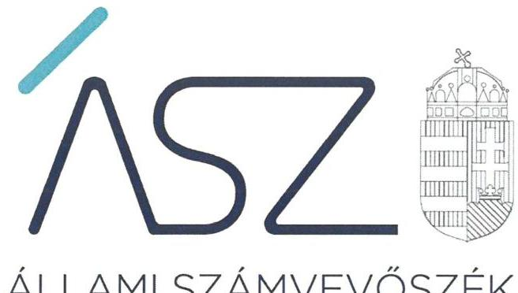
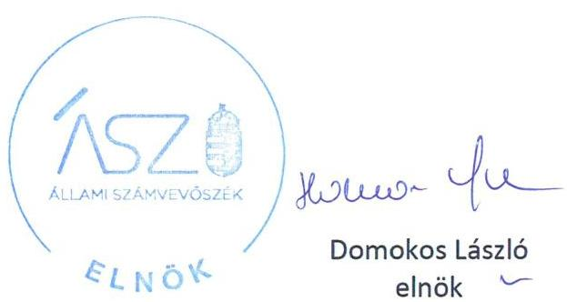

ÁLLAMI SZÁMVEVŐSZÉK

# JELENTÉS 

Az állami vagyon feletti tulajdonosi joggyakorlással kapcsolatos tevékenységek ellenőrzése

2020. 

20213
www.asz.hu

---

ÁLLAMI SZÁMVEVŐSZÉK

# JELENTÉS

Az állami vagyon feletti tulajdonosi joggyakorlással kapcsolatos tevékenységek ellenőrzése

2020. 12. hó 03. nap

2021. 3. www.asz.hu

---

|  | AZ ELLENŐRZÉST FELÜGYELTE: |
| :--: | :--: |
|  | MAKKAI MÁRIA felügyeleti vezető |
|  | AZ ELLENŐRZÉST VEZETTE ÉS A VÉGREHAJTÁSÁÉRT FELELŐS: |
|  | GÁL MAGDOLNA ellenőrzésvezető |
|  | A PROGRAM ÖSSZEÁLLÍTÁSÁÉRT FELELŐS: |
|  | GÖRGÉNYI GÁBOR osztályvezető |
|  | A TÉMÁHOZ KAPCSOLÓDÓ KORÁBBI SZÁMVEVŐSZÉKI JELENTÉSEK: |
| - címe: | Az állami vagyon feletti tulajdonosi joggyakorlással kapcsolatos tevékenységek ellenőrzése |
| - sorszáma: | 19202 |
| - címe: | Az állami vagyon feletti tulajdonosi joggyakorlással kapcsolatos tevékenységek ellenőrzése |
| - sorszáma: | 19158 |
| IKTATÓSZÁM: EL-3015-001/2020. |  |
| TÉMASZÁM: 2537 |  |
| ELLENŐRZÉS-AZONOSÍTÓ SZÁM: V0881 |  |

---

# TARTALOMJEGYZÉK 

- ÖSSZEGZÉS ..... 5
- AZ ELLENŐRZÉS CÉLJA ..... 6
- AZ ELLENŐRZÉS TERÜLETE ..... 7
- AZ ELLENŐRZÉS HÁTTERE, INDOKOLTSÁGA ..... 8
- A JELENTÉS LÉNYEGES KÉRDÉSKÖREI ..... 9
- AZ ELLENŐRZÉS HATÓKÖRE ÉS MÓDSZEREI ..... 10
- MEGÁLLAPÍTÁSOK ..... 13
- MELLÉKLETEK ..... 17
I. sz. melléklet: Értelmező szótár ..... 17
- FÜGGELÉK: ÉSZREVÉTELEK ..... 19
- RÖVIDÍTÉSEK JEGYZÉKE ..... 21

---

.

---

# ÖSSZEGZÉS 

A Magyar Nemzeti Vagyonkezelő Zrt. és a Nemzeti Földügyi Központ tulajdonosi joggyakorlása 2019-ben megfelelt a jogszabályi előírásoknak, a rábízott állami vagyonnal összefüggő nyilvántartási, beszámolási, vagyon megóvási kötelezettségeiket szabályszerűen teljesítették. Feladatellátásukkal hozzájárultak a nemzeti vagyon megőrzése, kezelése és védelme Alaptörvényben rögzített céljának és követelményének érvényesüléséhez.

## Az ellenőrzés társadalmi indokoltsága

Az Állami Számvevőszék a közvagyonnal való felelős gazdálkodás elősegítése érdekében, törvényi kötelezettségének is eleget téve minden évben ellenőrzi az állami vagyon feletti tulajdonosi joggyakorlással kapcsolatos tevékenységeket. Az ellenőrzéssel hozzájárul az állami vagyon feletti kontrollok, a felelős, szabályszerű vagyongazdálkodás erősítéséhez, az állami vagyon megóvását, a közjó érdekében való hasznosítását célzó feladatellátás javításához, valamint az annak jövőbeli fejlesztését célzó döntések megalapozott előkészítéséhez. Ezzel az Állami Számvevőszék hozzájárul a jól irányított állam múködéséhez, és objektív képet szolgáltat a társadalom részére a közvagyonnal való felelős gazdálkodás megvalósulásáról.

## Főbb megállapítások, következtetések

A tulajdonosi joggyakorló szervezetek által kiépített kontrollrendszer biztosította az állami vagyon feletti tulajdonosi joggyakorlás - a nemzeti vagyonnal való átlátható és felelős gazdálkodás - szabályszerű ellátását. A szervezeti és a gazdálkodási kereteket a jogszabályi előírásokkal összhangban kialakították. Az integrált kockázatkezelési rendszer, az információs és kommunikációs rendszer, valamint a nyomon követési rendszer kialakítása és múködtetése szabályszerű volt.

A tulajdonosi joggyakorló szervezetek az állami tulajdonú ingatlanok vagyonkezelésbe adása, valamint értékesítése során a vonatkozó jogszabályi előírások betartásával, továbbá a tulajdonosi joggyakorlással összefüggő ellenőrzések elvégzésével hozzájárultak az állami vagyon megóvásához. A rábízott állami vagyonról a tulajdonosi joggyakorlók szabályszerűen beszámoltak, az állami vagyon nyilvántartását, leltározását elvégezték.

A Magyar Nemzeti Vagyonkezelő Zrt. a többségi állami tulajdonban álló társaságokban lévő társasági részesedések felett szabályszerűen gyakorolta a tulajdonosi jogokat.

Az állami vagyonnal való gazdálkodásról az Országgyűlés felé a nemzeti vagyon kezeléséért felelős tárca nélküli miniszter és az agrárminiszter szabályszerűen számolt be.

---

# AZ ELLENŐRZÉS CÉLJA 

Az ellenőrzés célja volt annak megítélése, hogy az állami vagyon felett tulajdonosi jogokat gyakorló szervezetek tulajdonosi joggyakorlása megfelelt-e a vonatkozó jogszabályok előírásainak.

---

# AZ ELLENŐRZÉS TERÜLETE 

## Az állami vagyon feletti tulajdonosi joggyakorlással kapcsolatos tevékenységek

A közvagyon meghatározó részét kitevő állami vagyonnal való felelős, átlátható és elszámoltatható gazdálkodás követelményét az Alaptörvény ${ }^{1}$ rögzíti.

A 2012. január 1-jén hatályba lépett Nvtv. ${ }^{2}$ többek között meghatározza a nemzeti vagyon rendeltetését, kategóriáit és a vagyongazdálkodás keretszabályait.

Az állam tulajdonában álló vagyon feletti tulajdonosi joggyakorlás módját, a vagyon védelmének, hasznosításának, kezelésének, nyilvántartásának általánosan érvényes szabályait a Vtv. ${ }^{3}$ állapítja meg. A törvény szerint a tulajdonosi joggyakorlás feladata az állami vagyon rendeltetésének megfelelő, hatékony, költségtakarékos, értékmegőrző, értéknövelő felhasználásának, hasznosításának biztosítása, valamint gyarapítása.

A Vtv. az államot megillető tulajdonosi jogok és kötelezettségek összességének tulajdonosi joggyakorlójaként - törvény, vagy miniszteri rendelet eltérő rendelkezése hiányában - az MNV Zrt4-t nevesíti.

Az ellenőrzés a legjelentősebb, nagy vagyoni kör feletti tulajdonosi joggyakorlók tulajdonosi joggyakorlással kapcsolatos tevékenységére terjedt ki:

Az MNV Zrt. a Magyar Állam által alapított egyszemélyes részvénytársaság. A Vtv. szerint az MNV Zrt. felelős az állami vagyon nyilvántartásáért, a tulajdonosi joggyakorlása alá tartozó állami vagyon hasznosításáért, az állami vagyont vele szerződéses jogviszony alapján használó szervezetek, személyek állami vagyonnal való gazdálkodásának rendszeres ellenőrzéséért. Az MNV Zrt.-ben az állam részvényesi jogait - a Vtv-ben meghatározott kivételekkel - az állami vagyon felügyeletéért felelős miniszter gyakorolja.

Az NFK ${ }^{5}$-t az Országgyűlés 2019. július 1-én alapította az NFA jogutód szervezeteként. Az NFA ${ }^{6}$ általános jogutódlással szűnt meg, így az NFA elnöke által kiadott utasítások hatálya kiterjedt a jogutódlással létrejövő szervezetre azzal, hogy az NFA alatt NFK értendő. A Nemzeti Földalap felett a Magyar Állam nevében a tulajdonosi jogokat és kötelezettségeket az agrárpolitikáért felelős miniszter az NFK útján gyakorolja. Az NFK az agrárpolitikáért felelős miniszter irányítása alatt álló központi költségvetési szerv.

Az MNV Zrt-re és az NFK-ra rábízott állami vagyon befektetett eszközértéke 10 608,4 Mrd Ft (MNV Zrt: 10 194,4 Mrd Ft; NFK: 414,0 Mrd Ft) volt 2019. december 31-én.

---

# AZ ELLENŐRZÉS HÁTTERE, INDOKOLTSÁGA 

Az állami vagyonról szóló 2007. évi CVI. törvény 3. § (4) bekezdése szerint az állami vagyon feletti tulajdonosi joggyakorlással kapcsolatos tevékenységeket az ÁSZ ${ }^{7}$ évente ellenőrzi. A Nemzeti Földalap feletti tulajdonosi joggyakorlással kapcsolatos tevékenység éves gyakorisággal történő ellenőrzéséről a Nemzeti Földalapról szóló 2010. évi LXXXVII. törvény 14. § (1) bekezdése rendelkezik.

Az Állami Számvevőszék törvényi kötelezettségének eleget téve, a közvagyonnal való felelős gazdálkodás előmozdítása érdekében ellenőrzi a nemzeti vagyon meghatározó részét kitevő állami vagyon felett tulajdonosi jogokat gyakorló szervezetek feladatellátást.

Az ellenőrzés eredményeként az ÁSZ véleményt formál arról, hogy a Magyar Állam tulajdonosi joggyakorlásában érintett szervezetek múködése és az állami vagyonnal való gazdálkodása összhangban volt- e az állami vagyonra vonatkozó jogszabályok rendelkezéseivel. Az ellenőrzés rámutathat az állami vagyon feletti joggyakorlás tevékenységeinek esetleges szabályozási problémáira és hiányosságaira, hozzájárulva az állami vagyon feletti kontrollok, a felelős, szabályszerű vagyongazdálkodás erősítéséhez, valamint az állami vagyon megóvását, a közjó érdekében való hasznosítását célzó feladatellátás javításához.

Az ellenőrzés tájékoztatást ad a törvényhozás, az érintett szervezetek és a társadalom részére az állami vagyon feletti tulajdonosi joggyakorlói feladatok ellátásáról, ezáltal hozzájárul az átláthatósághoz, a területet érintő döntések megalapozottságához.

---

# A JELENTÉS LÉNYEGES KÉRDÉSKÖREI 

1. Az állam tulajdonosi jogait gyakorló szervezetek kialakították és müködtették-e a tulajdonosi joggyakorlással kapcsolatos tevékenységek szabályszerű ellátását biztosító kontrollrendszert?
2. Az állam tulajdonosi jogait gyakorló szervezetek tulajdonosi joggyakorlással kapcsolatos tevékenységüket szabályszerűen látták-e el?
3. Az állam tulajdonosi jogait gyakorló szervezetek szabályszerűen tartották-e nyilván az állami vagyont, a jogszabályokban elöirt adatszolgáltatásokat teljesítették-e?
4. Az állami vagyonnal való gazdálkodásról az Országgyülés felé történő beszámolás szabályszerűen megtörtént-e?

---

# AZ ELLENŐRZÉS HATÓKÖRE ÉS MÓDSZEREI 

## Az ellenőrzés típusa

Szabályszerűségi ellenőrzés.

## Az ellenőrzött időszak

2019. év

## Az ellenőrzés tárgya

A Magyar Állam tulajdonosi joggyakorlásában érintett szervezetek állami vagyonra vonatkozó tulajdonosi joggyakorlással kapcsolatos Intézkedései és a tulajdonosi joggyakorlási feladatok szabályszerű ellátását támogató belső szabályozási, közzétételi kontrollok és a tulajdonosi ellenőrzési rendszer.

Az állami ingatlanvagyon vagyonkezelésbe adását és a tulajdonjogának átruházását az MNV Zrt. és az NFK, a többségi állami tulajdonú társasági részesedések feletti tulajdonosi jogok gyakorlását az MNV Zrt. esetében ellenőrizte az ÁSZ.

Az állami vagyonnal kapcsolatos nyilvántartások kialakítását és vezetését, az adatszolgáltatások, a beszámolási kötelezettség teljesítését az MNV Zrt. és az NFK szervezeteknél, a beszámolási kötelezettség teljesítését az Országgyűlés felé a Nemzeti vagyon kezeléséért felelős tárca nélküli miniszternél és az Agrárminisztériumnál ellenőrizte az ÁSZ.

## Az ellenőrzött szervezet

A Magyar Nemzeti Vagyonkezelő Zrt. és a Nemzeti Földügyi Központ.
Az Országgyűlés felé történő beszámolás tekintetében a Nemzeti vagyon kezeléséért felelős tárca nélküli miniszter és az Agrárminisztérium.

A Nemzeti Földügyi Központ (NFK) 2019. július 1-tól a Nemzeti Földügyi Központ létrehozásáról szóló 1150/2019. (III. 25.) Korm. határozat, valamint a 2019. évi XL. törvény alapján a megszüntetett Nemzeti Földalapkezelő Szervezet (NFA) általános jogutódjaként kerül ellenőrzésre.

## Az ellenőrzés jogalapja

Az ellenőrzés jogszabályi alapját az ÁSZ tv. ${ }^{8}$ 5. § (4) bekezdés a) pontja, a Vtv. 3. § (4) bekezdése és az Nfatv. ${ }^{9}$ 14. § (1) bekezdése képezik.

---

# Az ellenőrzés módszerei 

Az ellenőrzést az ÁSZ az ellenőrzött időszakban hatályos jogszabályok, az ellenőrzés szakmai szabályai, a jelen ellenőrzésre irányadó ÁSZ módszertanok, az ellenőrzési programban foglalt értékelési szempontok szerint hajtotta végre.

Az ellenőrzés ideje alatt az ÁSZ az ellenőrzött szervezettel történő kapcsolattartást az ÁSZ SZMSZ ${ }^{10}$-ének vonatkozó előírásai alapján biztosította.

A tulajdonosi joggyakorlás belső szabályozási rendszerének és a tulajdonosi ellenőrzési rendszer kialakításának, működtetésének ellenőrzése az MNV Zrt. és az NFK szervezetekre vonatkozóan történt.

Az ellenőrzési kérdések megválaszolásához szükséges bizonyítékok megszerzése az ellenőrzöttek által rendelkezésre bocsátott dokumentumokra, adatokra alapozva megfigyelés, szemle (szemrevételezés), kérdésfeltevés (információkérés), mintavételezés, valamint elemző eljárás alkalmazásával történt.

Az állami vagyon feletti tulajdonosi joggyakorlással kapcsolatos tevékenységek ellenőrzése során a tulajdonosi ellenőrzéssel, a többségi állami tulajdonú társasági részesedések feletti tulajdonosi joggyakorlással, az állami tulajdonú ingatlanok vagyonkezelésbe adásával és az ezzel összefüggő nyilvántartási kötelezettséggel, valamint az állami tulajdonú ingatlanok értékesítésével kapcsolatos intézkedések szabályszerűségének ellenőrzéséhez a minta kiválasztása egyszerű véletlen, illetve rétegzett mintavétel alapján történt.

A vizsgált terület „szabályszerű" minősítést kapott, ha a minta ellenőrzésének eredménye alapján 95\%-os bizonyossággal a teljes sokaságban az átlagos hibaarány nem haladta meg a 10\%-ot, „nem szabályszerű" minősítést kapott, ha nagyobb volt, mint 10\%. Abban az esetben, ha az ellenőrzött sokaság tekintetében a 10\%-os hibaarányhoz való viszony megítélésnek megbízhatósága nem érte el a 95\%-ot, annak elérése érdekében az értékelés további szempontokkal egészült ki, figyelembe vételre került a feltárt hibák értéke.

Az ellenőrzött szervezetek belső kontrollrendszere egyes pilléreinek kialakítására és működtetésére vonatkozó értékelés:
$\longrightarrow$ „szabályszerű", amennyiben az értékelt területen az elért „igen" válaszok százalékban kifejezett, egész számra kerekített aránya legalább $85 \%$,
$\longrightarrow$ „nem szabályszerű", ha nem éri el a 85\%-ot.
Az ellenőrzési bizonyítékként felhasználható adatforrások közé tartoztak egyrészt a szakmai program részletes szempontjainál felsorolt adatforrások, másrészt minden - az ellenőrzés folyamán feltárt, az ellenőrzés szempontjából információt tartalmazó - dokumentum.

Az egységes értelmezést támogatta a program mellékletét képező fogalomtár és rövidítésjegyzék.

Az ellenőrzés lefolytatásához az ellenőrzött szervezetek a tanúsítványok elektronikus kitöltésével, valamint az ÁSZ által kért dokumentumok elektronikus megküldésével szolgáltattak adatokat, amelyek valódiságát és

---

teljes körűségét az ellenőrzött szervezet vezetője által tett teljességi és hitelességi nyilatkozat igazolta. A rendelkezésre bocsátott adatok, információk kontrollja az ellenőrzés keretében történt.

---

# MEGÁLLAPÍTÁSOK 

## 1. Az állam tulajdonosi jogait gyakorló szervezetek kialakították és múködtették-e a tulajdonosi joggyakorlással kapcsolatos tevékenységek szabályszerű ellátását biztosító kontrollrendszert?

Összegző megállapítás

### 1.1. számú megállapítás

A tulajdonosi joggyakorló szervezetek kialakították és múködtették a tulajdonosi joggyakorlással kapcsolatos tevékenységek szabályszerű ellátását biztosító kontrollrendszert.

Az MNV Zrt. és az NFK a tulajdonosi joggyakorlás rendjét szabályszerűen alakította ki.

A tulajdonosi joggyakorlás szervezeti kereteit, belső szabályait az MNV Zrt. és az NFK a jogszabályi előírásoknak megfelelően alakította ki, rendelkeztek az Áht. ${ }^{11}$ és az Ávr. ${ }^{12}$ előírásaival összhangban kialakított, a tulajdonosi joggyakorlással kapcsolatos feladatokat ellátó szervezeti egységek megnevezését, feladat- és hatásköreit, a felelősségi viszonyokat tartalmazó SZMSZ-ek ${ }^{13} \mathrm{kel}$.

Az MNV Zrt. és az NFK a Számv.tv. ${ }^{14}$ előírásainak megfelelően rendelkezett a törvényben rögzített alapelvek, értékelési előírások alapján kialakított, a szervezeti adottságoknak, körülményeknek leginkább megfelelő, a törvény végrehajtásának módszereit, eszközeit meghatározó számviteli szabályzatokkal ${ }^{15}$.

Az MNV Zrt. és az NFK a Vtv. vhr. előírásainak megfelelően az állami vagyon használói, vagyonkezelői és haszonélvezői által teljesítendő adatszolgáltatások részletes tartalmát, formáját vagyonnyilvántartási szabályzat ${ }^{16}$ ban határozta meg.
1.2. számú megállapítás

Az MNV Zrt. és az NFK a tulajdonosi joggyakorlási feladatok szabályszerű ellátását támogató kockázatkezelési, nyomonkövetési, valamint információs és kommunikációs rendszereket a jogszabályoknak megfelelően alakította ki és múködtette.

Az MNV Zrt. és az NFK a Bkr. ${ }^{17}$ előírásai szerint szabályozta az integrált kockázatkezelés eljárásrendjét ${ }^{18}$.

Az MNV Zrt-nél, és az NFK-nál elvégezték az integritási és korrupciós kockázatok felmérését, megállapították a szervezet tevékenységében rejlő és szervezeti célokkal összefüggő kockázatokat, továbbá meghatározták az egyes kockázatokkal kapcsolatban szükséges intézkedéseket, valamint azok végrehajtása folyamatos nyomon követésének módját.

A monitoring rendszert az MNV Zrt., és az NFK a tulajdonosi feladatellátáshoz kapcsolódóan szabályszerűen alakította ki, amely biztosította a

---

### 1.3. számú megállapítás

szervezetek tulajdonosi joggyakorlással kapcsolatos tevékenységeinek és a célok megvalósulásának nyomon követését.

Az MNV Zrt. és az NFK vezetője a Bkr. rendelkezéseinek megfelelően kialakította a szervezet információs és kommunikációs rendszerét, meghatározta a beszámolási szinteket, határidőket és módokat, szabályozta a közérdekű adatok megismerésére irányuló igények teljesítésének rendjét ${ }^{19}$, és a kötelezően közzéteendő adatok nyilvánosságra hozatalának rendjét ${ }^{20}$.

Az MNV Zrt. és az NFK a jogszabályi előírásoknak és a belső szabályozásoknak megfelelően eleget tett a tulajdonosi joggyakorlással összefüggő ellenőrzési kötelezettségeinek.

A tulajdonosi ellenőrzési rendszert az MNV Zrt. és az NFK az Nvtv., a Vtv. és a Vtv. vhr. ${ }^{21}$ előírásaival összhangban alakította ki és múködtette.

Az MNV Zrt. elkészítette az éves Tulajdonosi Ellenőrzési Tervét ${ }^{22}$. Az MNV Zrt. ellenőrizte az állami vagyon használóját, vagyonkezelőjét és haszonélvezőjét megillető jogok gyakorlásának szabályszerűségét, a kötelezettségek teljesítését. A tárgyévet követő év május 31-ig elkészítette és a nemzeti vagyon kezeléséért felelős tárca nélküli miniszter részére megküldte az éves ellenőrzési tapasztalatokról, az azok nyomán tett intézkedésekről szóló jelentését.

Az NFA elnöke jóváhagyta az Nfatv. vhr. ${ }^{23}$ előírásainak megfelelő, 2019. évi Éves Ellenőrzési Tervet ${ }^{24}$. Az NFK ellenőrizte a vagyonkezelő beszámolási, nyilvántartási, adatszolgáltatási kötelezettségének, továbbá a vagyon hasznosítására kötött szerződésekben foglalt kötelezettségek teljesítését. Az NFK elnöke 2020. május 31-ig elkészítette és az agrárpolitikáért felelős miniszter részére megküldte a 2019. évi tulajdonosi ellenőrzésekről és az éves ellenőrzési tapasztalatokról, az azok nyomán tett intézkedésekről szóló jelentést.

# 2. Az állam tulajdonosi jogait gyakorló szervezetek tulajdonosi joggyakorlással kapcsolatos tevékenységüket szabályszerűen látták-e el? 

Összegző megállapítás

Az állam tulajdonosi jogait gyakorló szervezetek a tulajdonosi joggyakorlással kapcsolatos tevékenységüket szabályszerűen látták le.

### 2.1. számú megállapítás

Az MNV Zrt. és az NFK az állami tulajdonú ingatlanok vagyonkezelésbe adását a jogszabályi előírásoknak megfelelően végezte.

Az MNV Zrt-nél az állami tulajdonú ingatlanok vagyonkezelésbe adása megfelelt az Nvtv., a Vtv. és a Vtv. vhr. előírásainak.

Az NFK az állami tulajdonú ingatlanok vagyonkezelésbe adását az Nvtv., az Nfatv. és az Nfatv. vhr. rendelkezéseivel összhangban, szabályszerűen hajtotta végre.

Az MNV Zrt és az NFK a vagyonkezelési szerződéseket a vonatkozó jogszabályokban előírt tartalommal kötötte meg.

---

# 2.2. számú megállapítás 

Az állami tulajdonú ingatlanok tulajdonjogának átruházásával kapcsolatos feladatait az MNV Zrt. és az NFK szabályszerűen végezte.

A tulajdonosi joggyakorlók kialakították, szabályzatokban rögzítették az állami vagyon körébe tartozó vagyonelemek értékesítésével kapcsolatos előírásokat.

Az MNV Zrt. és az NFK az állami tulajdonú ingatlanok értékesítésével kapcsolatos feladataikat a Vtv., a Vtv. vhr, az Nfatv., az Nfatv. vhr., és a Ptk. ${ }^{25}$ előírásaiban rögzítetteknek megfelelően, szabályszerűen végezték.

Az adásvételi szerződések megkötése során a vonatkozó jogszabályok és belső szabályzatok rendelkezései alapján jártak el.
2.3. számú megállapítás Az MNV Zrt. többségi állami tulajdonban álló társaságban lévő társasági részesedések feletti tulajdonosi joggyakorlása szabályszerű volt.

A tulajdonosi joggyakorlása alá tartozó, 2019. évben alapított többségi állami tulajdonú gazdasági társaságok vonatkozásában az MNV Zrt. szabályszerűen járt el a társaságok létesítő okiratainak kiadásánál, a felügyelő bizottság létrehozásánál és a könyvvizsgáló kijelölésénél, továbbá a Tak. tv. ${ }^{26}$ 5. § (3) bekezdés szerinti szabályzat elfogadásánál.

Az MNV Zrt. a tulajdonosi joggyakorlása alá tartozó többségi állami tulajdonú gazdasági társaságok legfőbb szerveként eljárva szabályszerűen döntött az éves számviteli beszámolók jóváhagyásáról, a társaságok eredményének felosztásáról.

## 3. Az állam tulajdonosi jogait gyakorló szervezetek szabályszerűen tartották-e nyilván az állami vagyont, a jogszabályokban elöírt adatszolgáltatásokat teljesítették-e?

Összegző megállapítás Az állami vagyon nyilvántartásával kapcsolatos kötelezettségének az NFK szabályszerűen, az MNV Zrt. nem szabályszerűen tett eleget. A tulajdonosi joggyakorló szervezetek a rábízott állami vagyonnal kapcsolatos beszámolási kötelezettségeiket szabályszerűen teljesítették.

### 3.1. számú megállapítás

A rábízott állami vagyonnal kapcsolatos nyilvántartási kötelezettségének az NFK szabályszerűen, az MNV Zrt. nem szabályszerűen tett eleget.

Az éves költségvetési beszámolót az MNV Zrt. és az NFK a rábízott állami vagyonról elkészítette.

A rábízott állami vagyonba tartozó eszközök leltározását az MNV Zrt. és a NFK a Számv. tv., az Áhsz. ${ }^{27}$ és a belső szabályzatok előírásainak megfelelően végezte el.

Az állami vagyon nyilvántartásával kapcsolatos kötelezettségét az NFK szabályszerűen teljesítette.

Az MNV Zrt. vagyonnyilvántartása nem tartalmazta:

---

$\longrightarrow$ az Áhsz. 39. § (3) bekezdésében és az Áhsz. 14. melléklet IX. 1. pontjában előírtak ellenére a vagyonkezelés időtartamát,
$\longrightarrow$ a Vtv. vhr. 14. § (2) bekezdésében előírtak ellenére a vagyonelemekhez kapcsolódó jogokat.
Az MNV Zrt. az ÁSZ korábbi ellenőrzése ${ }^{28}$ alapján készített intézkedési tervében vállalta, hogy az állami vagyon nyilvántartásának fejlesztését érintő egységes nyilvántartási és lekérdezési rendszert alakít ki, amely biztosítja a jogszabályban előírt adattartalom lekérdezhetőségét. Az egységes nyilvántartási és lekérdezési rendszer alkalmazása 2019. évben még nem volt időszerű, tekintettel a kialakítására vállalt határidőre.
3.2. számú megállapítás

Az MNV Zrt. és az NFK a rábízott állami vagyonra vonatkozó év végi beszámolási, az NFK az adatszolgáltatási kötelezettségét a szabályokkal összhangban teljesítette.

Az MNV Zrt. és az NFK a rábízott állami vagyonról szóló 2019. évi éves költségvetési beszámolót határidőben elkészítette. Az MNV Zrt. költségvetési beszámolóját a Felügyelő Bizottság, az Igazgatóság ${ }^{29}$ és a Részvényesi Jogok Gyakorlója ${ }^{30}$ elfogadta.

Az NFK a rábízott állami vagyonról készített mérlegről, valamint a mérleg soraival megegyező vagyonelemenkénti tételes adatokról a Vtv. vhrben előírt, 2019. évre vonatkozó adatszolgáltatást az MNV Zrt. részére határidőben teljesítette.

# 4. Az állami vagyonnal való gazdálkodásról az Országgyúlés felé történő beszámolás szabályszerűen megtörtént-e? 

Összegző megállapítás

Az állami vagyonnal való gazdálkodásról az Országgyúlés felé a nemzeti vagyon kezeléséért felelős tárca nélküli miniszter és az agrárminiszter szabályszerűen számolt be.

A nemzeti vagyon kezeléséért felelős tárca nélküli miniszter az állam nevében tulajdonosi jogokat gyakorló szervezetek 2018. évi múködéséről, az állami vagyon állományának alakulásáról, az állami vagyonnal való gazdálkodás folyamatairól a Vtv. előírásaival összhangban beszámolt ${ }^{31}$ az Országgyúlés részére.

Az agrárminiszter az agrárgazdaság helyzetéről szóló éves beszámolójában ${ }^{32}$ az Nfatv. előírásaival összhangban beszámolt az Országgyúlés részére a földbirtok politikai irányelvek érvényesüléséről, a Nemzeti Földalap helyzetéről és az NFK tevékenységéről.

---

# MELLÉKLETEK 

## I. SZ. MELLÉKLET: ÉRTELMEZŐ SZÓTÁR

állami vagyon
nemzeti vagyon
rábízott állami vagyon
tulajdonosi ellenőrzés

A Vtv. alkalmazásában állami vagyonnak minősül:
a) az állam tulajdonában lévő dolog, valamint dolog módjára hasznosítható természeti erő;
b) az a) pont hatálya alá tartozó mindazon vagyon, amely vonatkozásában törvény az állam kizárólagos tulajdonjogát nevesíti;
c) az állam tulajdonában lévő tagsági jogviszonyt megtestesítő értékpapír, illetve az államot megillető egyéb társasági részesedés;
d) az államot megillető olyan immateriális, vagyoni értékkel rendelkező jogosultság, amelyet jogszabály vagyoni értékű jogként nevesít;
e) az állam tulajdonában lévő pénzügyi eszközök.
(Forrás: Vtv. 1. § (2) bekezdése)
A nemzeti vagyonba tartozik:
a) az állam vagy a helyi önkormányzat kizárólagos tulajdonában álló dolgok,
b) az a) pont hatálya alá nem tartozó, az állam vagy a helyi önkormányzat tulajdonában lévő dolog,
c) az állam vagy a helyi önkormányzat tulajdonában lévő pénzügyi eszközök, továbbá az államot vagy a helyi önkormányzatot megillető társasági részesedések,
d) az államot vagy a helyi önkormányzatot megillető bármely vagyoni értékkel rendelkező jogosultság, amelyet jogszabály vagyoni értékű jogként nevesít,
e) Magyarország határa által körbezárt terület feletti légtér,
f) az üvegházhatású gázok kibocsátási egységeinek kereskedelméről szóló törvény szerinti kibocsátási egység és légiközlekedési kibocsátási egység, valamint az ENSZ Éghajlat-változási Keretegyezménye és annak Kiotói Jegyzőkönyve végrehajtási keretrendszeréről szóló törvény szerinti kiotói egység,
g) állami vagy helyi önkormányzati fenntartású közgyűjtemény (muzeális intézmény, levéltár, közgyűjteményként működő kép- és hangarchívum, valamint könyvtár) saját gyűjteményében nyilvántartott kulturális javak körébe tartozó dolog, kivéve, ha a dolog más tulajdonában áll,
h) a régészeti lelet,
i) a nemzeti adatvagyon körébe tartozó állami nyilvántartások fokozottabb védelméről szóló törvény szerinti nemzeti adatvagyon.
(Forrás: Nvtv. 1. § (2) bekezdése)
Az Nfatv. 1. § (1) bekezdése szerint a Nemzeti Földalapba tartozó földvagyon tekinthető rábízott állami vagyonnak. (Forrás: Nfatv. 1. § (1) bekezdése)
A Vtv. 3. § (1) bekezdése értelmében a rábízott állami vagyon felett az államot megillető tulajdonosi jogok és kötelezettségek összességét tulajdonosi joggyakorlóként - ha törvény vagy miniszteri rendelet eltérően nem rendelkezik - az MNV Zrt. gyakorolja. Az MNV Zrt. rábízott állami vagyonnal való gazdálkodását el kell különíteni a saját vagyonával történő gazdálkodástól (Forrás: Vtv. 22. § (1) bekezdése)
A Vtv. vhr. 20. §. (2) bekezdés alapján a tulajdonosi ellenőrzés célja az állami vagyonnal való gazdálkodás vizsgálata, ennek keretében a rendeltetésellenes, jogszerútlen, szerződésellenes, vagy a tulajdonos érdekeit sértő, illetve a központi költségvetést hátrányosan érintő vagyongazdálkodási intézkedések feltárása és a jogszerú állapot helyreállítása, továbbá a vagyonnyilvántartás hitelességének, teljességének és helyességének biztosítása.

---

tulajdonosi joggyakorlás és vagyongazdálkodás feladata
tulajdonosi joggyakorló

Az Nfatv. vhr. 47. § (2) bekezdése szerint a tulajdonosi ellenőrzés célja a földrészlettel való gazdálkodás vizsgálata, ennek keretében a rendeltetésellenes, jogszerútlen, szerződésellenes, vagy a tulajdonos érdekeit sértő intézkedések feltárása és a jogszerű állapot helyreállítása, továbbá a vagyonnyilvántartás hitelességének, teljességének és helyességének biztosítása.
A 263/2010. (XI. 17.) Korm. rendelet 11. § (1) bekezdése szerint a vagyonkezelési szerződésben foglaltak betartását az NFA ellenőrzi.
(Forrás: Vtv. vhr. 20. §. (2) bekezdése, Nfatv. vhr. 47. § (2) bekezdése, 263/2010. (XI. 17.) Korm. rendelet 11. § (1) bekezdése)
A Vtv. 2. § (1) bekezdése szerint az állami vagyon rendeltetésének megfelelő - az állami feladatok ellátásához, a társadalmi szükségletek kielégítéséhez, valamint a Kormány gazdaságpolitikája megvalósításának elősegítéséhez szükséges, egységes elveken alapuló, önálló ágazatként megjelenő - hatékony, költségtakarékos, értékmegőrző, értéknövelő felhasználásának biztosítása (közvetlen felhasználás), illetve közvetett hasznosítása (beleértve a vagyoni kör változását eredményező értékesítést), valamint az állami vagyon gyarapítása (ideértve a vagyoni kör bővítését is).
(Forrás: Vtv. 2. § (1) bekezdése)
Nvtv. 3. § (1) bekezdés 17. pontja szerint, aki a nemzeti vagyon felett az államot vagy a helyi önkormányzatot megillető tulajdonosi jogok és kötelezettségek összességének gyakorlására jogosult.
(Forrás: Nvtv. 3. § (1) bekezdés 17. pontja)

---

# FÜGGELÉK: ÉSZREVÉTELEK 

A jelentéstervezetet a Számvevőszék 15 napos észrevételezésre megküldte az ellenőrzött szervezetek vezetőinek az ÁSZ tv. 29. §* (1) bekezdése előírásának megfelelően.

Az ÁSZ a jelentéstervezetet észrevételezésre megküldte a Magyar Nemzeti Vagyonkezelő Zrt. vezérigazgatójának és a Nemzeti Földügyi Központ elnökének, valamint az Agrárminisztérium miniszterének és a Nemzeti vagyon kezeléséért felelős tárca nélküli miniszternek.
A Magyar Nemzeti Vagyonkezelő Zrt. vezérigazgatója, a Nemzeti Földügyi Központ elnöke és a Nemzeti vagyon kezeléséért felelős tárca nélküli miniszter nemleges észrevételt tett, az Agrárminisztérium minisztere az ÁSZ tv. 29. § (2) bekezdésében foglalt észrevételezési jogával nem élt.

[^0]
[^0]:    * 29. § (1) Az Állami Számvevőszék az ellenőrzési megállapításait megküldi az ellenőrzött szervezet vezetőjének vagy az általa megbízott személynek, és annak, akinek személyes felelősségét állapította meg.
    (2) Az ellenőrzött szervezet vezetője és a felelősként megjelölt személy az ellenőrzés megállapításaira tizenöt napon belül írásban észrevételt tehet.
    (3) Az Állami Számvevőszék az észrevételre a beérkezésétől számított harminc napon belül írásban válaszol. A figyelembe nem vett észrevételeket köteles a jelentésben feltüntetni, és megindokolni, hogy azokat miért nem fogadta el.

---

.

---

# RÖVIDÍTÉSEK JEGYZÉKE 

${ }^{1}$ Alaptörvény
${ }^{2}$ Nvtv.
${ }^{3}$ Vtv.
${ }^{4}$ MNV Zrt.
${ }^{5}$ NFK
${ }^{6}$ NFA
${ }^{7}$ ÁSZ
${ }^{8}$ ÁSZ tv.
${ }^{9}$ Nfatv.
${ }^{10}$ ÁSZ SZMSZ
${ }^{11}$ Áht.
${ }^{12}$ Ávr.
${ }^{13}$ SZMSZ-ek
${ }^{14}$ Számv.tv.
${ }^{15}$ Számviteli szabályzatok

Magyarország Alaptörvénye (2011. április 25.)
a nemzeti vagyonról szóló 2011. évi CXCVI. törvény
2007. évi CVI. törvény az állami vagyonról

Magyar Nemzeti Vagyonkezelő Zrt.
Nemzeti Földügyi Központ (2019. július 01-től)
Nemzeti Földalapkezelő Szervezet (Megszüntetéséről az országgyűlés döntött, megszűnésének dátuma: 2019. június 30.)
Állami Számvevőszék
2011. évi LXVI. törvény az Állami Számvevőszékről
2010. évi LXXXVII. törvény a Nemzeti Földalapról

Az Állami Számvevőszék Szervezeti és müködési szabályzata
2011. évi CXCV. törvény az államháztartásról

368/2011. (XII.31.) Korm. rendelet az államháztartásról szóló törvény végrehajtásáról
MNV Zrt. 621/2018. (XII.12.) IG. sz. határozattal kiadott Szervezeti és Müködési Szabályzata (hatályos: 2019. január 01-től)
MNV Zrt. 197/2019. (V.29.) IG. sz. határozattal kiadott Szervezeti és Müködési Szabályzata (hatályos: 2019. június 01-től)
1/2017 (IX.15.) számú NFA utasítása a Nemzeti Földalapkezelő szervezet Szervezeti és Müködési Szabályzatáról (hatályos 2017. szeptember 15-től) 1/2019.(VIII.9.) számú NFK elnöki utasítás NFK Szervezeti és Müködési Szabályzata (hatályos 2019. augusztus 10-től)
2/2019.(XI.6.) számú NFK elnöki utasítás NFK Szervezeti és Müködési Szabályzata (hatályos: 2019. november 07-től)
2000. évi C törvény a számvitelről

MNV Zrt. 13/2018 Vig utasítással kiadott Számviteli politikája (hatályos 2018. május 30 -tól)
MNV Zrt. 74/2019 Vig utasítással kiadott Számviteli politikája (hatályos: 2019. július. 24-től)

MNV Zrt. 13/2017 Vig utasítással kiadott Számlatükör és Számlarend (hatályos: 2017. március 29-től)
MNV Zrt. 75/2019 Vig utasítással kiadott Számlatükör és Számlarend (hatályos: 2019. július 24-től)
MNV Zrt. 12/2018 Vig. utasítással kiadott Eszközök és források értékelési szabályzata (hatályos: 2018. május 30-tól)
MNV Zrt. 76/2019 Vig. utasítással kiadott Eszközök és források értékelési szabályzata (hatályos: 2019.július 24-től)
MNV Zrt. 16/2016 Vig. utasítással kiadott Leltárkészítési és leltározási szabályzata (hatályos: 2016.május 31-től)
MNV Zrt. 99/2019 Vig. utasítással kiadott Leltárkészítési és leltározási szabályzata (hatályos: 2019. december 17-től)
9/2017.(VI.30.) számú NFA elnöki utasítás 2. számú melléklete az intézményi számviteli politika, a 15. számú melléklet a vagyonfejezethez kapcsolódó számviteli politika

---

16 vagyonnyilvántartási szabályzat

17 Bkr.

18 Integrált kockázatkezelés eljárásrendje

19 közérdekű adatok megismerésére irányuló igények teljesítésének rendje

20 kötelezően közzéteendő adatok nyilvánosságra hozatalának rendje

9/2017.(VI.30.) számú NFA elnöki utasítás 8. számú melléklete számlarend 9/2017.(VI.30.) számú NFA elnöki utasítás 9. számú melléklet bizonylati rend

9/2017.(VI.30.) számú NFA elnöki utasítás 3. számú melléklet intézmény eszközök és források leltározási és leltárkészítési szabályzat 9/2017.(VI.30.) számú NFA elnöki utasítás 4. számú melléklet Eszközök és források értékelési szabályzata
10/2014 Vig utasítás a Magyar Nemzeti Vagyonkezelő Zrt. közvetlen és közvetett kezelésű rábízott vagyonának nyilvántartási feladataira vonatkozó alapvető belső szabályok (hatályos: 2014. március 24-től)
14/2019 Vig utasítás az MNV Zrt. tulajdonosi joggyakorlásába tartozó vagyont érintő Vagyonnyilvántartási Szabályzatáról, különös tekintettel a vagyonkezeléssel összefüggő adatszolgáltatásokra (hatályos: 2019. április 03-tól)

A Nemzeti Földalapkezelő Szervezet elnökének a Nemzeti Földalapkezelő Szervezet Vagyon-nyilvántartási Szabályzatáról szóló 33/2017. (XII.13.) NFA utasítása (hatályos: 2017. december 18-tól)
370/2011. (XII.31.) Korm. rendelet a költségvetési szervek belső kontrollrendszeréről és belső ellenőrzéséről
MNV Zrt. 631/2016. Vig. utasítással kiadott Belsőkontroll Kézikönyv (hatályos: 2016. december 21-től)
MNV Zrt. 293/2019. Vig. utasítással kiadott Belsőkontroll Kézikönyv (hatályos: 2019. július 1-től)
A Nemzeti Földalapkezelő Szervezet elnökének a Nemzeti Földalapkezelő Szervezet Integrált Kockázatkezelési Szabályzatáról, az integritási és korrupciós kockázatok felméréséről, az azok kezelését szolgáló Intézkedési tervről, valamint Integritás jelentésről szóló 31/2016. (XII.8.) számú NFA utasítása (hatályos: 2016. december 8-tól)
A Nemzeti Földalapkezelő Szervezet elnökének a Nemzeti Földalapkezelő Szervezet integritását sértő események kezeléséről szóló 32/2016. (XII.8.) számú NFA utasítása (hatályos: 2016. december 8-tól)
A Nemzeti Földalapkezelő Szervezet elnökének az integritási és korrupciós kockázatokra vonatkozó bejelentések fogadásának és kivizsgálásának, valamint az érdekérvényesítők fogadásának rendjéről szóló 33/2016. (XII.8.) számú NFA utasítása (hatályos: 2016. december 8-tól)

A Nemzeti Földalapkezelő Szervezet elnökének Kockázat elemzési eljárásrendről szóló 3/2018. (I.2.) NFA utasítása (hatályos: 2018. január 4-től)
30/2017. vezérigazgatói utasítás Az MNV ZRt. Közérdekú adatai szolgáltatásának, valamint közzétételének rendjéről (hatályos: 2017. november 15 -től)
36/2019. vezérigazgatói utasítás Az MNV ZRt. Közérdekú adatai szolgáltatásának, valamint közzétételének rendjéről (hatályos: 2019. június 28 -tól)
A Nemzeti Földalapkezelő Szervezet elnökének a közérdekú adatok megismerésére irányuló igények teljesítésének rendjéről szóló 16/2017. (VIII. 14) NFA utasítása (hatályos: 2017. augusztus 14-től) 30/2017. vezérigazgatói utasítás Az MNV ZRt. Közérdekú adatai szolgáltatásának, valamint közzétételének rendjéről (hatályos: 2017. november 15 -től)

---

${ }^{21}$ Vtv. vhr.
${ }^{22}$ Éves Tulajdonosi Ellenőrzési Terv
${ }^{23}$ Nfatv. vhr.
${ }^{24}$ 2019. Évi Ellenőrzési Terv
${ }^{25}$ Ptk.
${ }^{26}$ Tak. tv.
${ }^{27}$ Áhsz.
${ }^{28}$ ÁSZ korábbi ellenőrzése
${ }^{29}$ Igazgatóság
${ }^{30}$ Részvényesi Jogok Gyakorlója
${ }^{31}$ a nemzeti vagyon kezeléséért felelős tárca nélküli miniszter beszámolója
${ }^{32}$ Agrárminiszter beszámolója az agrárgazdaság helyzetéről

36/2019. vezérigazgatói utasítás Az MNV ZRt. Közérdekú adatai szolgáltatásának, valamint közzétételének rendjéről (hatályos: 2019. június 28 -tól)
A Nemzeti Földalapkezelő Szervezet elnökének 36/2018. (XI.30) utasítása a kötelezően közzéteendő adatok nyilvánosságra hozatalának rendjéről (hatályos: 2018. november 30-tól)
254/2007. (X. 4.) Korm. rendelet az állami vagyonnal való gazdálkodásról az MNV Zrt. 21_2019_(III.08.)_RJGY határozattal elfogadott 2019. évi Tulajdonosi Ellenőrzési Terve
a Nemzeti Földalapba tartozó földrészletek hasznosításának részletes szabályairól szóló 262/2010. (XI. 17.) Korm. rendelet
Nemzeti Földalapkezelő Szervezet Éves Ellenőrzési Terv 2019.
2013. évi V. törvény a Polgári Törvénykönyvről
2009. évi CXXII. törvény a köztulajdonban álló gazdasági társaságok takarékosabb múködéséről
4/2013. (I. 11.) Kormányrendelet az államháztartás számviteléről
18203. számú ÁSZ jelentés: Az állami vagyon feletti tulajdonosi joggyakorlással kapcsolatos tevékenységek ellenőrzése
Magyar Nemzeti Vagyonkezelő Zrt. Igazgatósága
a nemzeti vagyon kezeléséért felelős tárca nélküli miniszter
B/9468 beszámoló az állam nevében tulajdonosi jogokat gyakorló szervezetek 2018. évi müködéséről, az állami vagyon állományának alakulásáról, az állami vagyonnal való gazdálkodás folyamatairól B/6347. Jelentés az agrárgazdaság 2017. évi helyzetéről I-II

---

# ASZ 

ALLAMI SZAMVEVOSZEK
1052 Budapest, Apáczai Cs. J. u. 10. I 1364 Budapest 4. Pf. 54 TEL: +36 14849100
email: szamvevoszek@asz.hu
web: www.asz.hu | www.aszhirportal.hu