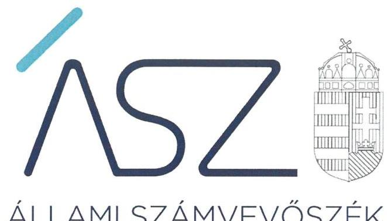
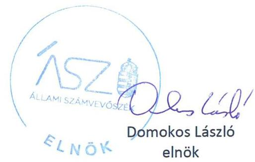
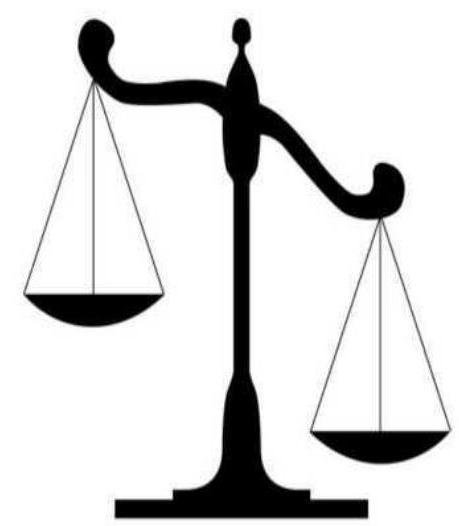

ÁLLAMI SZÁMVEVŐSZÉK

# JELENTÉS

A költségvetési támogatásban részesülő pártalapítványok 2017-2018. évi gazdálkodása törvényességének ellenőrzése

Váradi András Alapítvány

2020.

20214
www.asz.hu

---

ÁLLAMI SZÁMVEVŐSZÉK

# JELENTÉS

A költségvetési támogatásban részesülő pártalapítványok 2017-2018. évi gazdálkodása törvényességének ellenőrzése

Váradi András Alapítvány

2020. 12. hó 10. nap

20214
www.asz.hu

---

# AZ ELLENŐRZÉST FELÜGYELTE: 

KAKAS SÁNDOR felügyeleti vezető

## AZ ELLENŐRZÉST VEZETTE ÉS A VÉGREHAJTÁSÁÉRT FELELŐS:

GÁL MAGDOLNA ellenőrzésvezető

## A PROGRAM ÖSSZEÁLLÍTÁSÁÉRT FELELŐS:

BERTALAN RUDOLF GYULA projektvezető

## A TÉMÁHOZ KAPCSOLÓDÓ KORÁBBI SZÁMVEVŐSZÉKI JELENTÉSEK:

- címe: Jelentés - A költségvetési támogatásban részesülő pártalapítványok 2015-2016. évi gazdálkodása törvényességének ellenőrzése - Váradi András Alapítvány
- sorszáma: $\quad 18188$

IKTATÓSZÁM: EL-3017-001/2020.
TÉMASZÁM: 2521
ELLENŐRZÉS-AZONOSÍTÓ SZÁM: V086505

---

# TARTALOMJEGYZÉK 

■ ÖSSZEGZÉS ..... 5
■ AZ ELLENŐRZÉS CÉLJA ..... 6
■ AZ ELLENŐRZÉS TERÜLETE ..... 7
■ AZ ELLENŐRZÉS HÁTTERE, INDOKOLTSÁGA ..... 8
■ AZ ELLENŐRZÉS LÉNYEGES KÉRDÉSKÖREI. ..... 9
■ AZ ELLENŐRZÉS HATÓKÖRE ÉS MÓDSZEREI ..... 10
■ MELLÉKLETEK ..... 11
I. sz. melléklet: Értelmező szótár ..... 11
■ FÜGGELÉK: ÉSZREVÉTELEK ..... 13
■ RÖVIDÍTÉSEK JEGYZÉKE ..... 15

---

.

---

# ÖSSZEGZÉS 

## A Váradi András Alapítvány az ellenőrizhetőség feltételeit nem biztositotta.

## Az ellenőrzés társadalmi indokoltsága

A Párttörvény ${ }^{1}$ 9/A § (1) bekezdése alapján a politikai kultúra fejlesztése érdekében tudományos, ismeretterjesztő, kutatási, oktatási tevékenység folytatása céljából létrehozott pártalapítványok gazdálkodása törvényességének ellenőrzése - Pártalapítványi törvény² 4. § (2) bekezdése értelmében - az ÁSZ³ feladata. E törvény 4. § (4) bekezdése alapján az ÁSZ kétévente - kötelező jelleggel - ellenőrzi azoknak a pártalapítványoknak a gazdálkodását, amelyek állami költségvetési támogatásban részesültek.

Az ÁSZ, mint az Országgyűlés ellenőrző szerve a pártalapítványok gazdálkodása törvényességének/szabályszerüségének értékelésével hozzájárul ahhoz, hogy a társadalom objektív képet alkothasson a pártalapítványok működéséről. A jelentésben foglalt megállapítások, következtetések és javaslatok alapján a törvényalkotók konkrét lépéseket tehetnek a pártalapítványokra vonatkozó szabályozások megváltoztatása, átláthatóbbá, ellenőrizhetőbbé tétele irányába. Az ellenőrzött szervezetek szintjén a hiányosságok, szabálytalanságok feltárása, az ennek kapcsán megfogalmazott megállapítások elősegíthetik a pártalapítványok szabályszerű gazdálkodását.

Az ÁSZ stratégiájában megfogalmazta, hogy az államháztartáson kívülre nyújtott költségvetési támogatások és az ingyenes vagyonjuttatás ellenőrzésével hozzájárul ahhoz, hogy a közpénzeket a civil szervezetek is átlátható módon használják fel. A pártalapítványok gazdálkodása szabályszerűségének bemutatásával az ellenőrzés értékteremtő módon járul hozzá az ÁSZ stratégiai céljainak megvalósításához, a nyilvánosság megfelelő tájékoztatásához.

Az ÁSZ 2018. évben ellenőrizte a Pártalapítvány ${ }^{4}$ 2015-2016. évi gazdálkodását.

## Következtetések

A Váradi András Alapítványnál a kuratóriumi elnök kuratóriumi tagsága és képviseleti jogosultsága 2019. július 9-én megszűnt, a Kuratórium tagjainak megbízása ugyanezen a napon lejárt. Új Kuratórium és kuratóriumi elnök nem került kijelölésre, a Pártalapítványnál a törvényes múködés feltételei nem biztosítottak. A Pártalapítvány nem biztosította az ellenőrzés végrehajtásának feltételeit.

A Váradi András Alapítvány nem igazolta, hogy a gazdálkodására vonatkozó belső szabályozása megfelelt az Országgyűlés által megalkotott Számviteli törvény előírásainak, továbbá, hogy a könyvviteli nyilvántartásának adatai alátámasztják a Pártalapítványi törvényben előírt és a Magyar Közlöny mellékletét képező Hivatalos Értesítőben közzétett, 2017. és 2018. évi tevékenységéről szóló éves jelentései és az azok részét képező számviteli beszámolói adatait. Ezáltal nem zárható ki, hogy a közzétett éves jelentések a jogszabályi előírások ellenére nem valós adatokat tartalmaznak, nem mutatnak megbízható és valós összképet a Pártalapítvány bevételeiről és kiadásairól, továbbá törvényellenesen nincsenek valós számlák és pénzügyi teljesítések a közzétett éves jelentések adatai mögött.

A Váradi András Alapítvány nem igazolta, hogy az ellenőrzött időszakban a költségvetési támogatást kizárólag a Pártalapítványi törvényben meghatározott célokkal összhangban használta fel, és a támogatásokat, adományokat a törvényi előírás szerint, szabályszerűen fogadta el. Ezáltal nem zárható ki, hogy a Váradi András Alapítvány a Pártalapítványi törvényben előírtakat megsértve tiltott módon fogadott el támogatást, valamint a költségvetési támogatást nem megengedett célra használta fel.

A Váradi András Alapítvány nem igazolta továbbá, hogy a 2015-2016. évi gazdálkodása törvényességének ellenőrzéséről szóló 18188. számú számvevőszéki jelentésben megfogalmazott javaslatok alapján készített, öt pontból álló intézkedési tervében vállalt feladatokat végrehajtotta.

Mindezek alapján a Váradi András Alapítvány az Alaptörvénnyel ${ }^{5}$ ellentétesen a közpénzekre vonatkozó gazdálkodásával a nyilvánosság előtt nem számolt el, a felhasznált közpénzekre vonatkozó gazdálkodása átláthatóságát nem biztosította.

---

# AZ ELLENŐRZÉS CÉLJA 

Az ellenőrzés célja annak megállapítása volt, hogy a pártalapítvány törvényesen gazdálkodott-e, az éves számviteli beszámolók és a pártalapítvány tevékenységéről szóló éves jelentések a jogszabályi előírásoknak megfeleltek-e, a könyvvezetés és gazdálkodás során a vonatkozó jogszabályi rendelkezéseket és belső előírásokat betartották-e. Az ellenőrzés célja továbbá annak értékelése volt, hogy az előző számvevőszéki jelentésben foglalt megállapításokkal összhangban készített intézkedési tervben meghatározott feladatokat az ellenőrzött szervezet végrehaj-totta-e.

---

# AZ ELLENŐRZÉS TERÜLETE 

## Váradi András Alapítvány

Az ellenőrzés a Párttörvény alapján a politikai kultúra fejlesztése érdekében tudományos, ismeretterjesztő, kutatási, oktatási tevékenység folytatása céljából, a Ptk. ${ }^{6}$ szerinti létesítő/alapító okiraton alapuló bírósági nyilvántartásba vétellel létrejött párt-alapítvány gazdálkodására terjedt ki.

A Pártalapítvány törvényes gazdálkodásának (könyvvezetése, beszámolása, jelentéstétele) szabályait alapvetően a Pártalapítványi tv.-en túl, a Számviteli törvény ${ }^{7}$ és a Számviteli vhr. ${ }^{8}$ határozza meg.

Az Együtt - a Korszakváltók Pártja 2014. május 27-én alapította az Együtt Magyarországért Alapítványt, amely 2015-ben vette fel a Váradi András Alapítvány nevet.

A Pártalapítvány az Alapító okirat ${ }^{9}$-ban foglaltak szerint a politikai kultúra fejlesztése érdekében történő tudományos, ismeretterjesztő, kutatási és oktatási tevékenységet folytatott. A Pártalapítványt a Fővárosi Törvényszék a 2014. július 9-én jogerőre emelkedett végzésével vette nyilvántartásba.

A Pártalapítvány 2018. december 31-én 1,0 millió Ft alapítói vagyonnal rendelkezett. Döntéshozó, képviselő és vagyonkezelő szerve a Kuratórium ${ }^{10}$ volt, amely az alapításkor három, 2018. december 31-én hat tagból állt.

A Pártalapítvány által készített, és a Magyar Közlöny mellékletét képező Hivatalos Értesítő 2018. június 29-i számában, illetve a 2019. június 28-i számában közzétett éves jelentései szerint a Pártalapítvány 2017. évben 41,3 millió Ft, 2018. évben 20,7 millió Ft költségvetési támogatásban részesült.

Az ÁSZ 2018. évben ellenőrizte a Pártalapítvány 2015-2016. évi gazdálkodásának törvényességét. Az ellenőrzés megállapításait a 18188. számú számvevőszéki jelentés tartalmazza.

---

# AZ ELLENŐRZÉS HÁTTERE, INDOKOLTSÁGA 

Társadalmi elvárás a közpénzek értékelvű, rendeltetésszerű felhasználása, a közpénzekből nyújtott támogatások átláthatóságának megteremtése, amelyhez az ÁSZ az államháztartásból nyújtott támogatások ellenőrzésével kíván hozzájárulni. A Párt tv. 9/A § (1) bekezdése alapján a politikai kultúra fejlesztése érdekében tudományos, ismeretterjesztő, kutatási, oktatási tevékenység folytatása céljából létrehozott pártalapítványok gazdálkodása törvényességének ellenőrzése - Pártalapítványi tv. 4. § (2) bekezdése értelmében - az ÁSZ feladata. E törvény 4. § (4) bekezdése alapján az ÁSZ kétévente - kötelező jelleggel - ellenőrzi azoknak a pártalapítványoknak a gazdálkodását, amelyek állami költségvetési támogatásban részesültek.

Az ÁSZ, mint az Országgyűlés ellenőrző szerve a pártalapítványok gazdálkodása törvényességének/szabályszerűségének értékelésével hozzájárul ahhoz, hogy a társadalom objektív képet alkothasson a pártalapítványok működéséről. Az ellenőrzés eredményeinek célzott felhasználói a nyilvánosság, a jogalkotó, továbbá a pártalapítványok esetén azok alapítója és szervei. A jelentésben foglalt megállapítások, következtetések és javaslatok alapján a törvényalkotók konkrét lépéseket tehetnek a pártalapítványokra vonatkozó szabályozások megváltoztatása, átláthatóbbá, ellenőrizhetőbbé tétele irányába. Az ellenőrzött szervezetek szintjén a hiányosságok, szabálytalanságok feltárása, az ennek kapcsán megfogalmazott megállapítások elősegíthetik a pártalapítványok szabályszerű gazdálkodását.

Az ÁSZ tv. 33. § (1) bekezdése értelmében az ellenőrzött szervezet vezetője köteles a jelentésben foglalt megállapításokhoz kapcsolódó intézkedési tervet összeállítani, és azt a jelentés kézhezvételétől számított harminc napon belül az ÁSZ részére megküldeni.

Az ÁSZ által befogadott intézkedési tervben foglaltak megvalósítását az ÁSZ tv. 33. § (7) bekezdésében foglaltak alapján - az ÁSZ utóellenőrzés keretében ellenőrizheti. Az utóellenőrzések keretében - az intézkedések értékelése során - az ÁSZ figyelembe veszi az ellenőrzött szervezetek múködési feltételeiben, valamint a jogszabályi előírásokban bekövetkezett változásokat.

---

# AZ ELLENŐRZÉS LÉNYEGES KÉRDÉSKÖREI 

1. A Pártalapítvány gazdálkodásának törvényessége biztositott volt-e?
2. A Pártalapítvány könyvvezetése és gazdálkodása során a vonatkozó jogszabályi rendelkezéseket és belső elöírásokat betartották-e?
3. A Pártalapítvány tevékenységéről szóló éves jelentések, az éves számviteli beszámolók a jogszabályi elöírásoknak megfelel-tek-e?
4. A Pártalapítvány az intézkedési tervben meghatározott feladatokat végrehajtotta-e?

---

# AZ ELLENŐRZÉS HATÓKÖRE ÉS MÓDSZEREI 

## Az ellenőrzés típusa

Szabályszerúségi ellenőrzés.

## Az ellenőrzött időszak

2017-2018. évek.

## Az ellenőrzés tárgya

Az ellenőrzés tárgyát képezte a pártalapítvány gazdálkodása, a könyovezetés szabályozása és gyakorlata szabályszerűsége, az éves számviteli beszámolókra és az alapítvány tevékenységéről szóló éves jelentésekre vonatkozó kötelezettség teljesítése, valamint a gazdálkodáshoz kapcsolódó ellenőrzések javaslatainak hasznosítására irányuló tevékenység.

## Az ellenőrzött szervezet

Váradi András Alapítvány

## Az ellenőrzés jogalapja

Az ÁSZ tv. 1. § (3) bekezdése, 5. § (3) bekezdése, 33. § (7) bekezdése, a Pártalapítványi törvény 4. § (2) és (4) bekezdései.

## Az ellenőrzés módszerei

Az ellenőrzést az ÁSZ az Ellenőrzési program szempontjai, az ellenőrzött időszakban hatályos jogszabályok, a jelen ellenőrzésre irányadó ÁSZ módszertan figyelembe vételével végezte el.

Az ellenőrzési bizonyítékként felhasználható adatforrások közé tartoztak egyrészt az ellenőrzési program részletes szempontjainál felsorolt adatforrások, másrészt minden egyéb - az ellenőrzés folyamán feltárt, az ellenőrzés szempontjából információt tartalmazó - dokumentum.

Az ellenőrzést az ÁSZ az ellenőrzött szervezet által rendelkezésre bocsátott dokumentumokra, adatokra alapozta. A rendelkezésre bocsátott adatok, információk kontrollja az ellenőrzés keretében történt.

---

# MELLÉKLETEK 

- I. SZ. MELLÉKLET: ÉRTELMEZŐ SZÓTÁR
alapítvány
gazdasági-vállalkozási tevékenység
költségvetésből juttatott/nyújtott forrás/támogatás
pártalapítvány

Az alapítvány az alapító által az alapító okiratban meghatározott tartós cél folyamatos megvalósítására létrehozott jogi személy. Az alapító az alapító okiratban meghatározza az alapítványnak juttatott vagyont és az alapítvány szervezetét. Alapítvány nem alapítható gaz-dasági-vállalkozási tevékenység folytatására. Az alapítvány az alapítványi cél megvalósításával közvetlenül összefüggő gazdasági tevékenység végzésére jogosult. Alapítvány nem lehet korlátlan felelősségű tagja más jogalanynak, nem létesíthet alapítványt és nem csatlakozhat alapítványhoz. (Forrás: Ptk. 3:378. §, 3:379. § (1) - (3) bekezdés)
A jövedelem- és vagyonszerzésre irányuló vagy azt eredményező, üzletszerűen végzett gazdasági tevékenység, kivéve az adomány (ajándék) elfogadását, a létesítő okiratban meghatározott cél szerinti tevékenységet (ideértve a közhasznú tevékenységet is), - 2015. november 28 -tól - a pénzeszközök betétbe, értékpapírba, társasági részesedésbe történő elhelyezését és az ingatlan megszerzését, használatának átengedését és átruházását. (Forrás: Ectv. 2. § 11. pont.)
A pártalapítványoknak a Párt tv. 9/A. § (1) bekezdése és a Pártalapítványi tv. 1. § előírásainak értelmében, az éves költségvetési törvények szerint - jellemzően az 1. számú melléklet I. Országgyűlés fejezet 9. Pártalapítványok támogatás címen - az állami költségvetésből juttatott forrás/támogatás.
az államháztartás központi alrendszeréből - a Tb alap kivételével - ellenérték nélkül, pénzben nyújtott költségvetési támogatás (Forrás: Áht ${ }^{11}$. 1. § 14. pont)
A politikai kultúra fejlesztése érdekében, tudományos, ismeretterjesztő, kutatási és oktatási tevékenység folytatása céljából pártok által létrehozott, külön jogszabályban - a Pártalapítványi tv. 1. § és 3. § (1) bekezdése - meghatározott, jogi személynek minősülő egyéb szervezet, speciális jogállású alapítvány (Forrás: Párt tv. 9/A. § (1) bekezdés, Pártalapítványi tv. 1. §, Ectv. 1. § (2) bekezdés, 2. § 6. c) pont, Számv. tv. 3. § (1) bekezdése 4. pont, Számviteli vhr. 2. § (1) bekezdés I) pont)

---

.

---

# FÜGGELÉK: ÉSZREVÉTELEK 

A jelentéstervezetet a Számvevőszék 15 napos észrevételezésre megküldte az ellenőrzött szervezet vezetőjének az ÁSZ tv. 29. §* (1) bekezdése előírásának megfelelően.

Az ellenőrzött szervezet képviselője a jelentéstervezet megállapításaira nem tett észrevételt.

[^0]
[^0]:    * 29. § (1) Az Állami Számvevőszék az ellenőrzési megállapításait megküldi az ellenőrzött szervezet vezetőjének vagy az általa megbízott személynek, és annak, akinek személyes felelősségét állapította meg.
    (2) Az ellenőrzött szervezet vezetője és a felelősként megjelölt személy az ellenőrzés megállapításaira tizenöt napon belül írásban észrevételt tehet.
    (3) Az Állami Számvevőszék az észrevételre a beérkezésétől számított harminc napon belül írásban válaszol. A figyelembe nem vett észrevételeket köteles a jelentésben feltüntetni, és megindokolni, hogy azokat miért nem fogadta el.

---

.

---

# RÖVIDÍTÉSEK JEGYZÉKE 

${ }^{1}$ Párttörvény
${ }^{2}$ Pártalapítványi törvény
${ }^{3}$ ÁSZ
${ }^{4}$ Pártalapítvány
${ }^{5}$ Alaptörvény
${ }^{6}$ Ptk.
${ }^{7}$ Számviteli törvény
${ }^{8}$ Számviteli vhr.
${ }^{9}$ Alapító okirat
${ }^{10}$ Kuratórium
${ }^{11}$ Áht.
1989. évi XXXIII. törvény a pártok működéséről és gazdálkodásáról 2003. évi XLVII. törvény a pártok müködését segítő tudományos, ismeretterjesztő, kutatási, oktatási tevékenységet végző alapítványokról Állami Számvevőszék
Váradi András Alapítvány
Magyarország Alaptörvénye (2011. április 25.)
2013. évi V. törvény a Polgári Törvénykönyvről
2000. évi C. törvény a számvitelről

479/2016. (XII.28.) Korm. rendelet a számviteli törvény szerinti egyes egyéb szervezetek beszámoló készítési és könyvvezetési kötelezettségének sajátosságairól
A Váradi András Alapítvány 2017. február 21-én kelt Alapító okirata a módosításokkal egységes szerkezetben
A Váradi András Alapítvány 2018. július 24-én kelt Alapító okirata a módosításokkal egységes szerkezetben
A Váradi András Alapítvány Kuratóriuma
2011. évi CXCV. törvény az államháztartásról

---

# ASZ 

ALLAMI SZAMVEVOSZEK
1052 Budapest, Apáczai Cs. J. u. 10. I 1364 Budapest 4. Pf. 54 TEL: +36 14849100
email: szamvevoszek@asz.hu
web: www.asz.hu | www.aszhirportal.hu