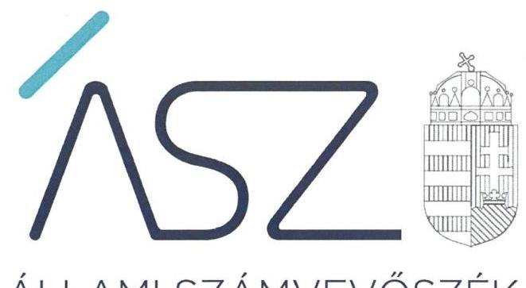

ÁLLAMI SZÁMVEVŐSZÉK

# JELENTÉS

## Önkormányzati intézmények integritás és belső kontroll ellenőrzése

Tiszaújvárosi Intézményműködtető Központ

2020.

20215
www.asz.hu

---

ÁLLAMI SZÁMVEVŐSZÉK

# JELENTÉS

## Önkormányzati intézmények integritás és belső kontroll ellenőrzése

Tiszaújvárosi Intézményműködtető Központ

2020.

12. hó 29. nap

20215

www.asz.hu

---

# AZ ELLENŐRZÉST FELÜGYELTE: 

PETŐ KRISZTINA felügyeleti vezető

## AZ ELLENŐRZÉST VEZETTE ÉS A VÉGREHAJTÁSÁÉRT FELELŐS:

DR. GÁL NÓRA ellenőrzésvezető

## A PROGRAM ÖSSZEÁLLÍTÁSÁÉRT FELELŐS:

BERTALAN RUDOLF GYULA ellenőrzési program készítéséért felelős vezető

IKTATÓSZÁM: EL-3038-001/2020.
TÉMASZÁM: 2511
ELLENŐRZÉS-AZONOSÍTÓ SZÁM: V085505
Jelentéseink az Országgyűlés számítógépes hálózatán és az interneten a www.asz.hu címen is olvashatóak.

---

# TARTALOMJEGYZÉK 

■ ÖSSZEGZÉS ..... 5
■ AZ ELLENŐRZÉS CÉLJA ..... 6
■ AZ ELLENŐRZÉS TERÜLETE ..... 7
■ AZ ELLENŐRZÉS HÁTTERE, INDOKOLTSÁGA ..... 8
■ A JELENTÉS LÉNYEGES KÉRDÉSKÖREI ..... 9
■ AZ ELLENŐRZÉS HATÓKÖRE ÉS MÓDSZEREI ..... 10
■ MEGÁLLAPÍTÁSOK ..... 12
■ JAVASLATOK ..... 14
■ MELLÉKLETEK ..... 17
I. sz. melléklet: Értelmező szótár ..... 17
■ FÜGGELÉK: ÉSZREVÉTELEK ..... 19
■ RÖVIDÍTÉSEK JEGYZÉKE ..... 23

---

.

---

# ÖSSZEGZÉS 

2018-ban a Tiszaújvárosi Intézményműködtető Központ belső kontrollrendszere nem biztosította a közpénzekkel való szabályszerű, átlátható és elszámoltatható gazdálkodás feltételeit. Az integritási kontrollokat nem építették ki, így a korrupciós kockázatokkal szemben nem volt védett a szervezet.

## Az ellenőrzés társadalmi indokoltsága

Az Állami Számvevőszék alapvető feladata a közpénzekkel, az állami és önkormányzati vagyonnal való gazdálkodás ellenőrzése. Az Állami Számvevőszék az ÁSZ törvényben kapott felhatalmazással élve ellenőrzi az önkormányzati intézmények gazdálkodását, működését, hogy az ellenőrzések megállapításaival támogassa az ellenőrzött szervezetek szabályszerű gazdálkodását, javaslataival elősegítse az Alaptörvényben megfogalmazott alapvetések érvényesülését a mindennapi életben az önkormányzatok szintjén. Az Állami Számvevőszék stratégiájában megfogalmazott célkitűzése az integritás alapú, átlátható és elszámoltatható közpénzfelhasználás elősegítése. Ennek megvalósítása érdekében az Állami Számvevőszék prioritásként kezeli a közpénzzel gazdálkodó szervezetek esetében a belső kontrollrendszer működésének ellenőrzését.

## Főbb megállapítások, következtetések, javaslatok

A Tiszaújvárosi Intézményműködtető Központ belső kontrollrendszerének kialakítása és működtetése nem volt szabályszerű.

Az integrált kockázatkezelési rendszert az Intézmény kialakította, működtetéséről azonban nem gondoskodott. Ezért a költségvetési szerv tevékenységében, gazdálkodásában felmerülő kockázatok kezelését nem biztosították.

A kontrolltevékenységek gyakorlása nem volt szabályszerű, mert az intézmény nem rendelkezett a gazdasági jogkörgyakorlók aláírás mintáit tartalmazó nyilvántartással. Így nem volt biztosított a kiadások és bevételek elszámolásának szabályszerűsége.

A Tiszaújvárosi Intézményműködtető Központ vezetője a szervezet tevékenységének, a célok megvalósításának nyomon követését biztosító rendszert és az információs és kommunikációs rendszert nem alakította ki és nem működtette. Nem biztosította a szabályszerű, átlátható működés feltételét.

A szervezet integritás elvű működése, az integritást veszélyeztető kockázatok kezelése az integrált kockázatkezelési rendszer működtetésének hiányában nem volt biztosított.

A Tiszaújvárosi Intézményműködtető Központnál a szervezet teljesítmény mérésére alkalmas követelményeit, így a minőségi pénzköltés feltételeit sem alakították ki.

Az Állami Számvevőszék az ellenőrzés megállapításai alapján a Tiszaújvárosi Intézményműködtető Központ Igazgatója részére 8 javaslatot fogalmazott meg.

---

# AZ ELLENŐRZÉS CÉLJA 

AZ ELLENŐRZÉS CÉLJA annak megállapítása volt, hogy az önkormányzati intézmény belső kontrollrendszere biztosította-e az átlátható, szabályszerű, gazdaságos, hatékony és eredményes gazdálkodás feltételeit. Az ellenőrzés keretében az ÁSZ értékelte, hogy a költségvetési szervnél kiépítették-e a korrupciós kockázatok kezelését szolgáló integritási kontrollokat, továbbá adottak-e egy teljesítményellenőrzés lefolytatásának a feltételei.

---

# AZ ELLENŐRZÉS TERÜLETE

## Tiszaújvárosi Intézményműködtető Központ

A 2008. július 1-jén alapított, gazdasági szervezettel rendelkező Intézmény1 fenntartója Tiszaújváros Város Önkormányzata. Az Intézmény alaptevékenységeként teljes körűen ellátja a hozzá rendelt három önkormányzati intézmény gazdálkodási feladatait, és további három önkormányzati intézmény részére biztosítja a gyermekétkeztetést és a munkahelyi étkeztetést. Az Intézmény feladatkörébe tartozik a szociális étkeztetés biztosítása, valamint a szolgálati lakások üzemeltetése is. A Magyar Államkincstár adatai alapján az Intézmény költségvetési kiadása 931 millió forint, a költségvetési bevétele 232 millió forint volt a 2018. évben.

Az Intézmény egyszemélyi felelős vezetője, képviselője az Igazgató2, aki felett a munkáltatói jogokat Tiszaújváros Város Önkormányzatának Képviselő-testülete, az egyéb munkáltatói jogokat Tiszaújváros Város Önkormányzatának polgármestere gyakorolja. Az Igazgató személye a 2018. évben nem változott.

---

# AZ ELLENŐRZÉS HÁTTERE, INDOKOLTSÁGA 

A BELSŐ KONTROLLRENDSZER kialakítása és működtetése nélkül nem valósítható meg a közpénzek, a közvagyon átlátható, szabályos, gazdaságos, hatékony és eredményes felhasználása. A belső kontrollrendszer azt a célt szolgálja, hogy a költségvetési szervek működésük és gazdálkodásuk során a tevékenységeket szabályszerűen hajtsák végre, teljesítsék elszámolási kötelezettségeiket és megvédjék az erőforrásokat a veszteségektől, a károktól és a nem rendeltetésszerű használattól.

A belső kontrollrendszer magában foglalja mindazon elveket, eljárásokat és belső szabályzatokat, melyek biztosítják, hogy a költségvetési szerv valamennyi tevékenysége és célja összhangban legyen a szabályszerűséggel, szabályozottsággal, valamint a gazdaságosság, hatékonyság és eredményesség követelményeivel, az eszközökkel és forrásokkal való gazdálkodásban ne kerüljön sor pazarlásra, visszaélésre, rendeltetésellenes felhasználásra. Megfelelő, pontos és naprakész információk álljanak rendelkezésre a költségvetési szerv működésével kapcsolatosan, és a belső kontrollrendszer harmonizációjára, összehangolására vonatkozó jogszabályok végrehajtásra kerüljenek. Az integritás kontrollok kiépítése, erősítése a szervezet korrupciós kockázatainak kezelését szolgálja. A teljesítménykövetelmények meghatározása megalapozhatja a teljesítményellenőrzés lefolytatását.

---

# A JELENTÉS LÉNYEGES KÉRDÉSKÖREI 

1. Az önkormányzati Intézmény belső kontrollrendszerének kialakítása és működtetése szabályszerű volt-e?
2. Az önkormányzati Intézménynél kiépítették-e az integritás kontrollrendszerét?
3. Az önkormányzati Intézménynél alakítottak-e ki a teljesítmény mérésére alkalmas követelményeket?

---

# AZ ELLENŐRZÉS HATÓKÖRE ÉS MÓDSZEREI 

## Az ellenőrzés típusa

Megfelelőségi ellenőrzés.

## Az ellenőrzött időszak

2018. év

## Az ellenőrzés tárgya

Az önkormányzati intézmény belső kontrollrendszerének kialakítása és működtetése, valamint az integritás kontrollok kiépítettsége, a teljesítményellenőrzés feltételeinek kialakítása.

## Az ellenőrzött szervezet

Tiszaújvárosi Intézményműködtető Központ

## Az ellenőrzés jogalapja

Az ellenőrzés jogszabályi alapját az ÁSZ tv. ${ }^{3}$ 1. § (3) bekezdés, 5. § (6) bekezdése, valamint az Áht. ${ }^{4}$ 61. § (2) bekezdésének előírásai képezik.

## Az ellenőrzés módszerei

Az ÁSZ ${ }^{5}$ az ellenőrzést az ellenőrzési program szempontjai, az ellenőrzött időszakban hatályos jogszabályok, az ellenőrzés szakmai szabályai, az ÁSZ által meghatározott és honlapján nyilvánosságra hozott helyénvalósági kritériumok, valamint a jelen ellenőrzésre irányadó ÁSZ módszertanok figyelembevételével hajtotta végre.

Az ellenőrzési kérdések megválaszolásához szükséges bizonyítékok megszerzése az ellenőrzött által rendelkezésre bocsátott dokumentumokra, adatokra alapozva megfigyelés, szemle (szemrevételezés), kérdésfeltevés (információkérés), mintavételezés, valamint elemző eljárás útján történt. Az ellenőrzési bizonyítékként felhasználható adatforrások közé tartoztak az ellenőrzési program részletes szempontjainál felsorolt adatforrások, valamint minden egyéb az ellenőrzés folyamán feltárt, az ellenőrzés szempontjából információt tartalmazó dokumentum.

---

Az ellenőrzés lefolytatásához az ellenőrzött szervezet tanúsítvány kitöltésével, valamint az ÁSZ által kért dokumentumok megküldésével szolgáltatott adatokat, amelyek valódiságát és teljes körűségét az ellenőrzött szervezet vezetője által tett teljességi és hitelességi nyilatkozat igazolta. A rendelkezésre bocsátott adatok, információk kontrollja az ellenőrzés keretében történt.

Az önkormányzati intézmény belső kontrollrendszere egyes pilléreinek kialakítására és működtetésére vonatkozó értékelés:
$\longrightarrow$ „szabályszerű", amennyiben az értékelt területen az elért „igen" válaszok százalékban kifejezett, egész számra kerekített aránya legalább $85 \%$,
$\longrightarrow$ „nem szabályszerű", ha nem éri el a 85\%-ot.
Az önkormányzati intézmény belső kontrollrendszerének összesített értékelése (a kontrollrendszer egésze) esetében a „szabályszerű" értékelésnek a feltétele volt, hogy egyik kontrollterület sem kapott „nem szabályszerű" értékelést. A belső kontrollrendszer szabálytalansága esetén az integritás kontrollok kiépítése és működtetése nem „megfelelő".

Az önkormányzati intézmény vezetője által kiépített integritás kontrollrendszer értékeléséhez helyénvalósági kritériumok is megfogalmazásra kerültek.

Az ellenőrzés ideje alatt az ellenőrzött szervezettel történő kapcsolattartást az ÁSZ SZMSZ ${ }^{6}$-ének vonatkozó előírásai alapján biztosította az ÁSZ.

---

# 1. Az önkormányzati Intézmény belső kontrollrendszerének kialakítása és működtetése szabályszerű volt-e? 

Összegző megállapítás

Az Intézmény belső kontrollrendszerének kialakítása és működtetése a 2018. évben nem volt szabályszerű.

A KONTROLLKÖRNYEZET kialakítása nem volt szabályszerű.
Az Intézmény az Áht. előírásai szerint rendelkezett SZMSZ7-szel, azonban az SZMSZ-ben az Ávr. ${ }^{8}$ 13. § (1) bekezdés g) pont előírása ellenére nem határozták meg a gazdasági vezető helyettesítésének szabályait. Az SZMSZ-ben 2018. március 31-ig a Vnytv. ${ }^{9} 4 . \S$ a) pontja ellenére nem tüntették fel a vagyonnyilatkozat-tételi kötelezettséggel járó munkaköröket.

Az Intézmény rendelkezett a Számv. tv. ${ }^{10}$ előírása szerint Számviteli politikával ${ }^{11}$. A Számviteli politikában a Számv. tv. 14. § (4) bekezdésének előírása ellenére nem rögzítették azokat a gazdálkodóra jellemző szabályokat, előírásokat, módszereket, amelyekkel meghatározzák, hogy mit tekintenek a számviteli elszámolás, az értékelés szempontjából lényegesnek, nem lényegesnek. A Számviteli politika keretében a Számv. tv. 14. § (5) bekezdés d) pontjában foglaltak szerint elkészítendő Pénzkezelési Szabályzattal ${ }^{12}$ az Intézmény 2018. első negyedévében nem rendelkezett.

Az Intézménynél a gazdálkodási jogkörök gyakorlására jogosult személyekről és aláírás-mintájukról az Ávr. 60. § (3) bekezdésében foglaltak szerinti nyilvántartást nem vezették.

Az Intézmény 2018. első negyedévében nem rendelkezett ellenőrzési nyomvonallal a Bkr. ${ }^{13} 6 . \S$ (3) bekezdésének előírása ellenére.

Az Intézmény nem rendelkezett az Ltv. ${ }^{14}$ 10. § (1) bekezdés a) pontjaiban előírtak szerinti iratkezelési szabályzattal.

## AZ INTEGRÁLT KOCKÁZATKEZELÉSI RENDSZER

működtetése nem volt szabályszerű. Az Igazgató a kockázatkezelési rendszert kialakította, azonban annak működtetéséről a Bkr. 7. § (1)-(2) bekezdésében előírtak ellenére nem gondoskodott. Nem határozta meg az egyes kockázatokkal kapcsolatban szükséges intézkedéseket, valamint azok végrehajtása folyamatos nyomon követésének módját.

A KONTROLLTEVÉKENYSÉGEK gyakorlása a gazdálkodási jogkörök gyakorlására jogosult személyekről és aláírás-mintájukról az Ávr. 60. § (3) bekezdésében foglaltak szerinti nyilvántartás vezetésének hiányában nem volt szabályszerű.

## AZ INTÉZMÉNY INFORMÁCIÓS ÉS

KOMMUNIKÁCIÓS RENDSZERÉT az Igazgató a 2018. évben a Bkr. 3. § d) pontjában előírtak ellenére kialakítás hiányában nem működtette. A Bkr. 9. § (1) bekezdése ellenére nem biztosították, hogy a

---

szükséges információk, maradéktalanul, megfelelő időben eljussanak az illetékes szervezethez, szervezeti egységhez, személyhez.

A MONITORING RENDSZERT az Igazgató kialakította, azonban azt a Bkr. 3. § e) pontjával ellentétesen nem működtette, nem biztosította az operatív tevékenységek keretében megvalósuló folyamatos és eseti nyomon követést.

Az Igazgató a Bkr. 1. melléklete szerinti nyilatkozatában értékelte az Intézmény 2018. évi belső kontrollrendszerének minőségét. A nyilatkozat tartalmát az ellenőrzés megállapításai nem igazolták.

# 2. Az önkormányzati Intézménynél kiépítették-e az integritás kontrollrendszerét? 

## Összegző megállapítás Az Igazgató nem építette ki az integritás kontrollrendszerét.

Az Intézménynél a jogszabályok által előírt kontrollok kiépítettségének szintje nem támogatta az intézmény integritás elvű működését.

Az Igazgató a Bkr. 6. § (4) bekezdésének előírása ellenére az integritást sértő események kezelésének eljárásrendjét nem szabályozta, ezért az integritást veszélyeztető kockázatok kezelése nem volt biztosított.

Nem alakítottak ki teljesítményértékelési rendszert. Az Intézmény munkatársai korrupcióellenes képzésben nem vettek részt.

## 3. Az önkormányzati Intézménynél alakítottak-e ki a teljesítmény mérésére alkalmas követelményeket?

## Összegző megállapítás Az Igazgató nem alakította ki a teljesítmény mérésére alkalmas követelményeket.

Az Igazgató nem alakította ki a szervezet vonatkozásában a teljesítmény mérésének feltételeit, a szervezeti célok elérését szolgáló feladatok, tevékenységek mérését szolgáló indikátorokat, mérőszámokat, továbbá feladat és teljesítmény-mutatókat sem határozott meg.

---

# JAVASLATOK 

Az ÁSZ tv. 33. § (1) bekezdésében foglaltak értelmében az ellenőrzött szervezet vezetője köteles a jelentésben foglalt megállapításokhoz kapcsolódó intézkedési tervet összeállítani és azt a jelentés kézhezvételétől számított 30 napon belül az ÁSZ részére megküldeni. Amennyiben az intézkedési tervet az ellenőrzött szervezet vezetője nem küldi meg határidőben, vagy továbbra sem elfogadható
 intézkedési tervet küld, az ÁSZ elnöke az ÁSZ törvény 33. § (3) bekezdés a)-b) pontjaiban foglaltakat érvényesítheti.

## Tiszaújvárosi Intézményműködtető Központ igazgatójának:

1. Intézkedjen az SZMSZ módosításáról a gazdasági igazgató helyettesítési szabályainak meghatározása érdekében és kezdeményezze a módosított SZMSZ Képviselő-testület általi jóváhagyását.
(1. összegző megállapítás 2. bekezdése alapján)
2. Intézkedjen a számviteli politika módosításáról a jogszabályi előírásnak való megfelelés érdekében.
(1. összegző megállapítás 3. bekezdésének 2. mondata alapján)
3. Intézkedjen a jogszabályban előírt, a gazdálkodási jogkörök gyakorlására jogosult személyeket és aláírás-mintájukat tartalmazó nyilvántartás vezetése érdekében.
(1. összegző megállapítás 4. bekezdése alapján)
4. Intézkedjen a jogszabályi előírás szerinti iratkezelési szabályzat elkészítése érdekében.
(1. összegző megállapítás 6. bekezdése alapján)
5. Intézkedjen a jogszabályban előírt integrált kockázatkezelési rendszer működtetése érdekében.
(1. összegző megállapítás 7. bekezdése alapján)
6. Intézkedjen az információs és kommunikációs rendszer kialakításáról és működtetéséről.
(1. összegző megállapítás 9. bekezdése alapján)

---

7. | Intézkedjen a monitoring rendszer működtetéséről.
(1. összegző megállapítás 10. bekezdése alapján)
8. | Intézkedjen a jogszabályi előírás szerint az integritást sértő
események kezelésének eljárásrendje szabályozásáról.
(2. összegző megállapítás 2. bekezdése alapján)

---

.

---

# MELLÉKLETEK 

- I. SZ. MELLÉKLET: ÉRTELMEZŐ SZÓTÁR
belső kontrollrendszer
belső kontrollrendszer pillérei, kontrollterületei
helyénvalósági ellenőrzés
információs és kommunikációs rendszer
integrált
kockázatkezelési rendszer
kontrollkörnyezet
kontrolltevékenységek
monitoring rendszer

A belső kontrollrendszer a kockázatok kezelése és tárgyilagos bizonyosság megszerzése érdekében kialakított folyamatrendszer, amely azt a célt szolgálja, hogy a működés és gazdálkodás során a tevékenységeket szabályszerűen, gazdaságosan, hatékonyan, eredményesen hajtsák végre, az elszámolási kötelezettségeket teljesítsék, megvédjék az erőforrásokat a veszteségektől, károktól és nem rendeltetésszerű használattól. (Forrás: Áht. 69. § (1) bekezdése)
A kontrollkörnyezet, az (integrált) kockázatkezelési rendszer, a kontrolltevékenységek, az információs és kommunikációs rendszer, valamint a nyomon követési (monitoring) rendszer. (Forrás: Bkr. 3. §-a)
A helyénvalósági ellenőrzés a megfelelőségi ellenőrzés azon altípusa, amelyet azokban az esetekben kell alkalmazni, amelyekre jogszabályi előírások nem alkalmazhatóak, illetve amennyiben egyes kérdések megítélésénél nyilvánvaló jogszabályi hiányosságok vannak. Helyénvalósági ellenőrzés során az ellenőrzést végző személynek a közszféra intézményeinek helyes gazdálkodására, a közpénzek eredményes és megfelelő felhasználására és a közszféra tisztviselőinek magatartására vonatkozó általános elvek mentén kell az ellenőrzést lefolytatnia. A helyénvalósági ellenőrzés kritériumait az ellenőrzés tárgyában általánosan elfogadott, illetve nemzetközi vagy hazai „jó gyakorlatok" is meghatározhatják. (Forrás: Állami Számvevőszék, A megfelelőségi ellenőrzés alapelvei 2015. július)
A költségvetési szerv vezetője által kialakított és működtetett olyan rendszer, mely biztosítja, hogy a megfelelő információk a megfelelő időben eljutnak az illetékes szervezethez, szervezeti egységhez, illetve személyhez. (Forrás: Bkr. 9. § (1) bekezdés) Olyan folyamatalapú kockázatkezelési rendszer, amely a szervezet minden tevékenységére kiterjed, egységes módszertan és eljárások alkalmazásával, a szervezet célkitűzéseinek és értékeinek figyelembevételével biztosítja a szervezet kockázatainak teljes körű azonosítását, azok meghatározott kritériumok szerinti értékelését, valamint a kockázatok kezelésére vonatkozó intézkedési terv elkészítését és az abban foglaltak nyomon követését. (Forrás: Bkr. 2. § m) pontja, 2016. október 1-jétől)
A költségvetési szerv vezetője által kialakított olyan elvek, eljárások, belső szabályzatok összessége, amelyben világos a szervezeti struktúra, a folyamatok átláthatók, egyértelműek a felelősségi, hatásköri viszonyok és feladatok, meghatározottak, ismertek és elfogadottak az etikai elvárások a szervezet minden szintjén, átlátható a humánerőforrás-kezelés, biztosított a szervezeti célok és értékek irányában való elkötelezettség fejlesztése és elősegítése. (Forrás: Bkr. 6. § (1) bekezdés)
A költségvetési szerv vezetője által a szervezeten belül kialakított (kontroll) tevékenységek, melyek biztosítják a kockázatok kezelését, hozzájárulnak a szervezet céljainak eléréséhez és erősítik a szervezet integritását. (Forrás: Bkr. 8. § (1) bekezdés)
A költségvetési szerv vezetője köteles kialakítani a szervezet tevékenységének a célok megvalósításának nyomon követését biztosító rendszert, amely az operatív tevékenységek keretében megvalósuló folyamatos és eseti nyomon követésből, valamint az operatív tevékenységektől függetlenül működő belső ellenőrzésből állhat. (Forrás: Bkr. 10. §)

---

.

---

# FÜGGELÉK: ÉSZREVÉTELEK 

A jelentéstervezetet a Számvevőszék 15 napos észrevételezésre megküldte az ellenőrzött szervezetek vezetőinek az ÁSZ tv. 29. § (1) bekezdése előírásának megfelelően.

A Tiszaújvárosi Intézményműködtető Központ igazgatója a jelentéstervezet megállapításaira írásban észrevételt tett.

Az ÁSZ tv. 29. § (3) bekezdésével összhangban az ÁSZ a Függelékben feltünteti az ellenőrzés megállapításaival kapcsolatban tett, figyelembe nem vett észrevételeket, és megindokolja, hogy azokat miért nem fogadta el.

[^0]
[^0]:    * 29. § (1) Az Állami Számvevőszék az ellenőrzési megállapításait megküldi az ellenőrzött szervezet vezetőjének vagy az általa megbízott személynek, és annak, akinek személyes felelősségét állapította meg.
    (2) Az ellenőrzött szervezet vezetője és a felelősként megjelölt személy az ellenőrzés megállapításaira tizenöt napon belül írásban észrevételt tehet.
    (3) Az Állami Számvevőszék az észrevételre a beérkezésétől számított harminc napon belül írásban válaszol. A figyelembe nem vett észrevételeket köteles a jelentésben feltüntetni, és megindokolni, hogy azokat miért nem fogadta el.

---

A számvevőszéki jelentéstervezet megállapításaival kapcsolatban az igazgató által 2020. november 17-én tett (az Állami Számvevőszékhez 2020. november 20-án érkezett), el nem fogadott észrevételek és azok kezelésének indokolása.

# 1. A vagyonnyilatkozat-tételre kötelezettek körével kapcsolatban tett észrevétel (Jelentéstervezet 1. megállapítás 2. bekezdés 1. mondata) 

Az igazgató észrevételében jelezte, hogy a vagyonnyilatkozat-tételre vonatkozóan a szervezeti és működési szabályzat (továbbiakban: SZMSZ) Harmadik fejezet 10. pontja határozza meg az előírásokat, amelyben leírásra került, hogy a részletszabályokat az SZMSZ függelékeként szereplő Vagyonnyilatkozati Szabályzat tartalmazza, amelyet az ellenőrzés során felcsatolásra került.

Az ellenőrzés részére rendelkezésre bocsátott SZMSZ függelékeként szereplő Vagyonnyilatkozati Szabályzat ismételt felülvizsgálata során megállapítottuk, hogy a szabályzatban a Vnytv. 4. § a) pontjában előírtakkal összhangban feltüntették a vagyonnyilatkozat-tételi kötelezettséggel járó munkaköröket. A Vagyonnyilatkozati Szabályzat 2018. április 1-jétől hatályos, így az ÁSZ az észrevételt a 2018. január 1-je és március 31-e közötti ellenőrzött időszakra nem fogadja el. Így megalapozott az ÁSZ megállapítása, hogy az SZMSZ-ben 2018. március 31-ig a Vnytv. 4. § a) pontja ellenére nem tüntették fel a vagyonnyilatkozat-tételi kötelezettséggel járó munkaköröket.

## 2. A számviteli politikával kapcsolatban tett észrevétel (Jelentéstervezet 1. megállapítás 3. bekezdés 2. mondata)

Az igazgató észrevételében jelezte, hogy az Intézmény Számviteli Politikájának III. 4. pontja rendelkezik a Számv. tv. 14. § (4) bekezdésének előírásairól. Az Intézmény rendelkezett Számviteli Politikával 2018. évre vonatkozóan, ami felcsatolásra is került.

Az ÁSZ az adatbekérő levélben kérte az Intézmény 2018. évben hatályos számviteli politikájának feltöltését az ÁSZ Elektronikus Adatszolgáltatási Rendszerébe. A 2020. január 6-án kelt teljességi és hitelességi nyilatkozattal alátámasztva az Intézmény 2018. január 1-jétől hatályos számviteli politikája került beküldésre.

A beküldött dokumentum ismételt felülvizsgálata során megállapítottuk, hogy az nem tartalmazza a Számv. tv. 14. § (4) bekezdésének előírásai ellenére azokat az Intézményre jellemző szabályokat, előírásokat, módszereket, amelyekkel meghatározzák, hogy mit tekintenek a számviteli elszámolás, az értékelés szempontjából lényegesnek és nem lényegesnek.

## 3. A gazdálkodási jogkörök gyakorlására jogosult személyekről vezetett nyilvántartással és a kontrolltevékenységek gyakorlásával kapcsolatban tett megállapításokra érkezett észrevétel (Jelentéstervezet 1. megállapítás 4. és 8. bekezdései)

Az igazgató észrevételében jelezte, hogy a gazdálkodási jogkörök gyakorlására jogosult személyekről a nyilvántartás felcsatolásra került, amelyet a Kötelezettségvállalás, Ellenjegyzés Utalványozás szabályzat mellékletei tartalmaznak. Aláírási mintájukat tartalmazó meghatalmazások is felcsatolásra kerültek.

Az ÁSZ az adatbekérő levélben kérte az Intézmény 2018. évben hatályos, a kötelezettségvállalásra, teljesítés igazolására jogosult személyekről és aláírás-mintájukról vezetett nyilvántartás feltöltését az ÁSZ Elektronikus Adatszolgáltatási Rendszerébe. A 2020. január 6-án kelt teljességi és hitelességi nyilatkozattal alátámasztva az Intézmény 2018. március 31-től hatályos „Kötelezettségvállalás, utalványozás, ellenjegyzés, érvényesítés rendjének szabályzata" került beküldésre.

A beküldött dokumentum ismételt felülvizsgálata során megállapítottuk, hogy az adatszolgáltatás során feltöltött szabályzat 4. számú melléklete Nyilvántartás a kötelezettségvállalásra jogosult személyekről, valamint 5. számú melléklete a Nyilvántartás a teljesítés igazolásra jogosult személyekről „Jogosult aláírása" oszlopai az Ávr. 60. § (3) bekezdésében foglalt előírások ellenére a jogosult személyek aláírás-mintáját nem tartalmazza.

Az észrevételben hivatkozott és az ellenőrzés során szintén rendelkezésre bocsátott „Teljesítésigazolások.pdf" elnevezésű dokumentum teljesítésigazolás és érvényesítés elvégzésére vonatkozó kijelölések, amelyek nem azonosak az Ávr. 60. § (3) bekezdésében előírt naprakész nyilvántartással.

---

# 4. Az Intézmény ellenőrzési nyomvonalával kapcsolatban tett észrevétel (Jelentéstervezet 1. megállapítás 5. bekezdése) 

Az igazgató észrevételében jelezte, hogy az intézmény 2018. első negyedévében is rendelkezett Ellenőrzési Nyomvonallal. Az intézmény vezetője március 31-ig kérte a szabályzatok felülvizsgálatát, ami megtörtént és a módosított Ellenőrzési Nyomvonal 2018. március 31-től lett hatályos, addig a 2017. évi volt érvényben.

Az ÁSZ az adatbekérő levélben kérte az Intézmény ellenőrzési nyomvonalának feltöltését az ÁSZ Elektronikus Adatszolgáltatási Rendszerébe. A 2020. február 4-én kelt teljességi és hitelességi nyilatkozattal alátámasztva az Intézmény az adatszolgáltatásra biztosított törvényi határidőn belül a 2018. március 31-től hatályos „Ellenőrzési nyomvonal és kialakításának eljárási rendje" című szabályzatot küldte be. Az Intézmény vezetője a hivatkozott teljességi és hitelességi nyilatkozatban kijelentette, hogy az ÁSZ részére átadott, a nyilatkozatban részletezett dokumentumok, adatok megbízhatóak és a bekért adatokra, dokumentumokra vonatkozóan teljes körű információt tartalmaznak. Az Igazgató nyilatkozott továbbá az átadott dokumentumok, adatok hitelességéért, valódiságáért, hiánytalanságáért és hatályosságáért, azokért teljes felelősséget vállalt.

Az észrevételben hivatkozott 2017. évben hatályos eljárásrendet az adatszolgáltatás során nem bocsátották az ÁSZ rendelkezésére.

## 5. Az iratkezelési szabályzattal kapcsolatban tett észrevétel (Jelentéstervezet 1. megállapítás 6. bekezdése)

Az igazgató észrevételében jelezte, hogy az intézmény rendelkezett iratkezelési szabályzattal, amely felcsatolásra került.

Az ÁSZ az adatbekérő levélben kérte az Intézmény 2018. évben hatályos iratkezelési szabályzatának feltöltését az ÁSZ Elektronikus Adatszolgáltatási Rendszerébe. A 2020. február 4-én kelt teljességi és hitelességi nyilatkozattal alátámasztva benyújtott iratkezelési szabályzat című dokumentum az illetékes közlevéltár egyetértését nem tartalmazta, ezért az Ltv. 10. § (1) bekezdés a) pontja szerinti előírásoknak nem felel meg, mert az illetékes közlevéltár egyetértését tartalmazó külön dokumentum nem került csatolásra, és azt a szabályzat sem tartalmazza.

## 6. Az integrált kockázatkezelési rendszer működtetésével kapcsolatban tett észrevétel (Jelentéstervezet 1. megállapítás 8. bekezdése)

Az igazgató észrevételében jelezte, hogy az Integrált Kockázatkezelési Szabályzatban, illetve a Belső Kontroll Szabályzatban meghatározta a kockázatokkal kapcsolatos intézkedéseket, amelyek felcsatolásra kerültek.

Az ÁSZ az adatbekérő levélben kérte az Intézmény integrált kockázatkezelési rendszer működtetését igazoló, alátámasztó dokumentumokat: kockázati térkép; kockázatok felmérése, megállapítása, beazonosítása dokumentumai; kockázatok meghatározott kritériumok szerinti értékelésének, elemzésének, felülvizsgálatának dokumentumai; az integritás és az egyes kockázatokkal kapcsolatos intézkedések meghatározásának dokumentumai; az egyes kockázatokkal kapcsolatos intézkedések teljesítésének folyamatos nyomon követését alátámasztó/igazoló dokumentumai.

A 2020. február 4-én kelt teljességi és hitelességi nyilatkozattal alátámasztva benyújtott, észrevételben hivatkozott dokumentumok az Intézmény 2017. április 15-től hatályos Integrált kockázatkezelési szabályzata, illetve a 2018. április 15-től hatályos Belső Kontrollrendszer szabályzata, belső ellenőrzési jelentések és intézkedési tervek, valamint a 2018. október 1-jétől érvényes Kockázatértékelés. A Kockázatértékelésben az Igazgató a Bkr. 7. § (1)-(2) bekezdésében előírtak ellenére nem határozta meg az egyes kockázatokkal kapcsolatban szükséges intézkedéseket, valamint azok végrehajtása folyamatos nyomon követésének módját.

---

# 7. A monitoring rendszer működtetésére észrevétel (Jelentéstervezet 1. megállapítás 10. bekezdése) 

Az igazgató észrevételében jelezte, hogy a Belső Kontroll Szabályzat VI.
 pontja alapján az intézmény vezetője működtette a nyomon követési rendszert, amely szabályzat szintén felcsatolásra került.

Az ÁSZ az adatbekérő levélben kérte az operatív tevékenységek keretében megvalósuló folyamatos és eseti nyomon követést biztosító operatív monitoring-feladatok meghatározását tartalmazó dokumentumokat, valamint a meghatározott indikátorokkal kapcsolatban a folyamatos nyomon követésre vonatkozó intézkedéseket.

A 2020. február 4-én kelt teljességi és hitelességi nyilatkozattal alátámasztva benyújtott, észrevételben hivatkozott Belső Kontroll Szabályzat a Bkr. 3. § e) pontjával ellentétesen nem igazolta az operatív tevékenységek keretében megvalósuló folyamatos és eseti nyomon követést.

---

# RÖVIDÍTÉSEK JEGYZÉKE 

${ }^{1}$ Intézmény
${ }^{2}$ Igazgató
${ }^{3}$ ÁSZ tv.
${ }^{4}$ Áht.
${ }^{5}$ ÁSZ
${ }^{6}$ ÁSZ SZMSZ
${ }^{7}$ SZMSZ
${ }^{8}$ Ávr.
${ }^{9}$ Vnytv.
${ }^{10}$ Számv. tv.
${ }^{11}$ Számviteli Politika
${ }^{12}$ Pénzkezelési Szabályzat
${ }^{13}$ Bkr.
${ }^{14}$ Ltv.

Tiszaújvárosi Intézményműködtető Központ
Tiszaújvárosi Intézményműködtető Központ igazgatója
2011. évi LXVI. törvény az Állami Számvevőszékről (hatályos: 2011. július 1-jétől)
2011. évi CXCV. törvény az államháztartásról (hatályos: 2011. január 1-jétől)

Állami Számvevőszék
az Állami Számvevőszék elnökének 3/2019. (XII. 23.) ÁSZ utasítása az Állami
Számvevőszék Szervezeti és Működési Szabályzata
Tiszaújvárosi Intézményműködtető Központ Szervezeti és Működési Szabályzata (Hatályos: 2018. január 1-jétől)
368/2011. (XII. 31.) Korm. rendelet az államháztartásról szóló törvény végrehajtásáról
2007. évi CLII. törvény egyes vagyonnyilatkozat-tételi kötelezettségekről
2000. évi C. törvény a számvitelről (hatályos: 2001. január 1-jétől)

Tiszaújvárosi Intézményműködtető Központ Számviteli Politikája (hatályos: 2018. január 1-jétől)
A Tiszaújvárosi Intézményműködtető Központ Pénzkezelési Szabályzata (hatályos: 2018. március 31-től)
370/2011. (XII. 31.) Korm. rendelet a költségvetési szervek belső kontrollrendszeréről és belső ellenőrzésről
1995. évi LXVI. törvény a köziratokról, a közlevéltárakról és a magánlevéltári anyag védelméről

---

# 1052 

1052 Budapest, Apáczai Cs. J. u. 10. I 1364 Budapest 4. Pf. 54 TEL: +36 14849100
email: szamvevoszek@asz.hu
web: www.asz.hu | www.aszhirportal.hu
