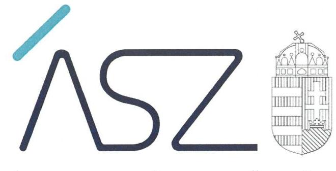

ÁLLAMI SZÁMVEVŐSZÉK

# JELENTÉS

## Önkormányzati intézmények integritás és belső kontroll ellenőrzése

Kazincbarcikai Szociális Szolgáltató Központ

2020.

20216
www.asz.hu

---

ÁLLAMI SZÁMVEVŐSZÉK

# JELENTÉS

Önkormányzati intézmények integritás és belső kontroll ellenőrzése

Kazincbarcikai Szociális Szolgáltató Központ

2020.

12. hó 29. nap

20216
www.asz.hu

---

# AZ ELLENŐRZÉST FELÜGYELTE: 

PETŐ KRISZTINA felügyeleti vezető

## AZ ELLENŐRZÉST VEZETTE ÉS A VÉGREHAJTÁSÁÉRT FELELŐS:

DR. GÁL NÓRA ellenőrzésvezető

## A PROGRAM ÖSSZEÁLLÍTÁSÁÉRT FELELŐS:

BERTALAN RUDOLF GYULA ellenőrzési program készítéséért felelős vezető

IKTATÓSZÁM: EL-3041-001/2020.
TÉMASZÁM: 2511
ELLENŐRZÉS-AZONOSÍTÓ SZÁM: V085504
Jelentéseink az Országgyűlés számítógépes hálózatán és az interneten a www.asz.hu címen is olvashatóak.

---

# TARTALOMJEGYZÉK 

- ÖSSZEGZÉS ..... 5
- AZ ELLENŐRZÉS CÉLJA ..... 6
- AZ ELLENŐRZÉS TERÜLETE ..... 7
- AZ ELLENŐRZÉS HÁTTERE, INDOKOLTSÁGA ..... 8
- A JELENTÉS LÉNYEGES KÉRDÉSKÖREI ..... 9
- AZ ELLENŐRZÉS HATÓKÖRE ÉS MÓDSZEREI ..... 10
- MEGÁLLAPÍTÁSOK ..... 12
- JAVASLATOK ..... 14
- MELLÉKLETEK ..... 17
I. sz. melléklet: Értelmező szótár ..... 17
- FÜGGELÉK: ÉSZREVÉTELEK ..... 19
- RÖVIDÍTÉSEK JEGYZÉKE ..... 21

---

.

---

# ÖSSZEGZÉS 

2018-ban a Kazincbarcikai Szociális Szolgáltató Központnál a belső kontrollrendszer működtetésének hiányában nem biztosították a közpénzekkel való szabályszerű, átlátható és elszámoltatható gazdálkodás feltételeit. Az integritási kontrollokat nem építették ki, így a korrupciós kockázatokkal szemben nem volt védett a szervezet.

## Az ellenőrzés társadalmi indokoltsága

Az Állami Számvevőszék alapvető feladata a közpénzekkel, az állami és önkormányzati vagyonnal való gazdálkodás ellenőrzése. Az Állami Számvevőszék az ÁSZ törvényben kapott felhatalmazással élve ellenőrzi az önkormányzati intézmények gazdálkodását, működését, hogy az ellenőrzések megállapításaival támogassa az ellenőrzött szervezetek szabályszerű gazdálkodását, javaslataival elősegítse az Alaptörvényben megfogalmazott alapvetések érvényesülését a mindennapi életben az önkormányzatok szintjén. Az Állami Számvevőszék stratégiájában megfogalmazott célkitűzése az integritás alapú, átlátható és elszámoltatható közpénzfelhasználás elősegítése. Ennek megvalósítása érdekében az Állami Számvevőszék prioritásként kezeli a közpénzzel gazdálkodó szervezetek esetében a belső kontrollrendszer működésének ellenőrzését.

## Főbb megállapítások, következtetések, javaslatok

A Kazincbarcikai Szociális Szolgáltató Központ belső kontrollrendszerének működtetése a 2018. évben nem volt szabályszerű, ezzel nem biztosították, hogy megfelelő, pontos és naprakész információk álljanak rendelkezésre a költségvetési szerv működésével kapcsolatban.

A kontrolltevékenységek gyakorlása nem volt szabályszerű, mivel a Kazincbarcikai Szociális Szolgáltató Központ nem rendelkezett a kötelezettségvállalások és más fizetési kötelezettségek nyilvántartásával. Nyilvántartás hiányában nincs megbízható információ a pénzügyi döntések meghozatalához, ezáltal olyan döntések meghozatalára kerülhet sor, amelyek megalapozatlanok és pénzügyi fedezettel nem rendelkeznek.

Az integrált kockázatkezelési rendszer működtetéséről nem gondoskodtak, így a költségvetési szerv tevékenységében rejlő és a szervezeti célokkal összefüggő kockázatokkal kapcsolatos intézkedések, valamint azok folyamatos nyomon követése módjának meghatározása elmaradt. Az intézményvezető a szervezet tevékenységének, a célok megvalósításának nyomon követését biztosító rendszert és az információs és kommunikációs rendszert sem működtette.

A Kazincbarcikai Szociális Szolgáltató Központ integritás elvű működése, az integritást veszélyeztető kockázatok kezelése nem volt biztosított. A szervezeti teljesítmény mérésére alkalmas követelményeit, így a minőségi pénzköltés feltételeit sem alakították ki.

Az Állami Számvevőszék az ellenőrzés megállapításai alapján az Kazincbarcikai Szociális Szolgáltató Központ intézményvezetője részére 8 javaslatot fogalmazott meg.

---

# AZ ELLENŐRZÉS CÉLJA 

AZ ELLENŐRZÉS CÉLJA annak megállapítása volt, hogy az önkormányzati intézmény belső kontrollrendszere biztosította-e az átlátható, szabályszerű, gazdaságos, hatékony és eredményes gazdálkodás feltételeit. Az ellenőrzés keretében az ÁSZ értékelte, hogy a költségvetési szervnél kiépítették-e a korrupciós kockázatok kezelését szolgáló integritási kontrollokat, továbbá adottak-e egy teljesítményellenőrzés lefolytatásának a feltételei.

---

# **AZ ELLENŐRZÉS TERÜLETE**

## **Kazincbarcikai Szociális Szolgáltató Központ**

A Kazincbarcikai Szociális Szolgáltató Központot 1979. szeptember 15-én alapították. Az Intézmény1 irányító szerve Kazincbarcika Város Önkormányzatának Képviselő-testülete, fenntartója Kazincbarcika Város Önkormányzata. Az Intézmény főtevékenysége idősek, fogyatékosok bentlakásos ellátása, emellett alaptevékenységébe tartozik többek között házi segítségnyújtás, gyermekek napközbeni ellátása, továbbá hajléktalanok nappali ellátása. Az Intézmény önállóan működő, közfeladatot ellátó közszolgáltató intézmény. Főtevékenysége mellett ellátja a saját, illetve a hozzá rendelt Egressy Béni Városi Könyvtár és Kazincbarcikai Összevont Óvodák működtetését, gazdálkodásuk megszervezését. A Magyar Államkincstár adatai alapján az Intézmény költségvetési kiadása 1085 millió forint, költségvetési bevétele pedig 200 millió forint volt a 2018. évben. Az intézmény vezetőjének kinevezése 2017. szeptember 1-től 2022. augusztus 31-ig tart.

---

# AZ ELLENŐRZÉS HÁTTERE, INDOKOLTSÁGA 

A BELSŐ KONTROLLRENDSZER kialakítása és működtetése nélkül nem valósítható meg a közpénzek, a közvagyon átlátható, szabályos, gazdaságos, hatékony és eredményes felhasználása. A belső kontrollrendszer azt a célt szolgálja, hogy a költségvetési szervek működésük és gazdálkodásuk során a tevékenységeket szabályszerűen hajtsák végre, teljesítsék elszámolási kötelezettségeiket és megvédjék az erőforrásokat a veszteségektől, a károktól és a nem rendeltetésszerű használattól.

A belső kontrollrendszer magában foglalja mindazon elveket, eljárásokat és belső szabályzatokat, melyek biztosítják, hogy a költségvetési szerv valamennyi tevékenysége és célja összhangban legyen a szabályszerűséggel, szabályozottsággal, valamint a gazdaságosság, hatékonyság és eredményesség követelményeivel, az eszközökkel és forrásokkal való gazdálkodásban ne kerüljön sor pazarlásra, visszaélésre, rendeltetésellenes felhasználásra. Megfelelő, pontos és naprakész információk álljanak rendelkezésre a költségvetési szerv működésével kapcsolatosan, és a belső kontrollrendszer harmonizációjára, összehangolására vonatkozó jogszabályok végrehajtásra kerüljenek. Az integritás kontrollok kiépítése, erősítése a szervezet korrupciós kockázatainak kezelését szolgálja. A teljesítménykövetelmények meghatározása megalapozhatja a teljesítményellenőrzés lefolytatását.

---

# A JELENTÉS LÉNYEGES KÉRDÉSKÖREI 

1. Az önkormányzati Intézmény belső kontrollrendszerének kialakítása és működtetése szabályszerű volt-e?
2. Az önkormányzati Intézménynél kiépítették-e az integritás kontrollrendszerét?
3. Az önkormányzati Intézménynél alakítottak-e ki a teljesítmény mérésére alkalmas követelményeket?

---

# AZ ELLENŐRZÉS HATÓKÖRE ÉS MÓDSZEREI 

## Az ellenőrzés típusa

Megfelelőségi ellenőrzés.

## Az ellenőrzött időszak

2018. év

## Az ellenőrzés tárgya

Az önkormányzati intézmény belső kontrollrendszerének kialakítása és működtetése, valamint az integritás kontrollok kiépítettsége, a teljesítményellenőrzés feltételeinek kialakítása.

## Az ellenőrzött szervezet

Kazincbarcikai Szociális Szolgáltató Központ

## Az ellenőrzés jogalapja

Az ellenőrzés jogszabályi alapját az ÁSZ tv. ${ }^{2}$ 1. § (3) bekezdés, 5. § (6) bekezdése, valamint az Áht. ${ }^{3}$ 61. § (2) bekezdésének előírásai képezik.

## Az ellenőrzés módszerei

Az ÁSZ ${ }^{4}$ az ellenőrzést az ellenőrzési program szempontjai, az ellenőrzött időszakban hatályos jogszabályok, az ellenőrzés szakmai szabályai, az ÁSZ által meghatározott és honlapján nyilvánosságra hozott helyénvalósági kritériumok, valamint a jelen ellenőrzésre irányadó ÁSZ módszertanok figyelembevételével hajtotta végre.

Az ellenőrzési kérdések megválaszolásához szükséges bizonyítékok megszerzése az ellenőrzött által rendelkezésre bocsátott dokumentumokra, adatokra alapozva megfigyelés, szemle (szemrevételezés), kérdésfeltevés (információkérés), valamint elemző eljárás útján történt. Az ellenőrzési bizonyítékként felhasználható adatforrások közé tartoztak az ellenőrzési program részletes szempontjainál felsorolt adatforrások, valamint minden egyéb - az ellenőrzés folyamán feltárt, az ellenőrzés szempontjából információt tartalmazó - dokumentum.

---

Az ellenőrzés lefolytatásához az ellenőrzött szervezet tanúsítvány kitöltésével, valamint az ÁSZ által kért dokumentumok megküldésével szolgáltatott adatokat, amelyek valódiságát és teljes körűségét az ellenőrzött szervezet vezetője által tett teljességi és hitelességi nyilatkozat igazolta. A rendelkezésre bocsátott adatok, információk kontrollja az ellenőrzés keretében történt.

Az önkormányzati intézmény belső kontrollrendszere egyes pilléreinek kialakítására és működtetésére vonatkozó értékelés:
$\longrightarrow$ „szabályszerű", amennyiben az értékelt területen az elért „igen" válaszok százalékban kifejezett, egész számra kerekített aránya legalább $85 \%$,
$\longrightarrow$ „nem szabályszerű", ha nem éri el a $85 \%$-ot.
Az önkormányzati intézmény belső kontrollrendszerének összesített értékelése (a kontrollrendszer egésze) esetében a „szabályszerű" értékelésnek a feltétele volt, hogy egyik kontrollterület sem kapott „nem szabályszerű" értékelést. A belső kontrollrendszer szabálytalansága esetén az integritás kontrollok kiépítése és működtetése nem „megfelelő".

Az önkormányzati intézmény vezetője által kiépített integritás kontrollrendszer értékeléséhez helyénvalósági kritériumok is megfogalmazásra kerültek.

Az ellenőrzés ideje alatt az ellenőrzött szervezettel történő kapcsolattartást az ÁSZ SZMSZ5-ének vonatkozó előírásai alapján biztosította az ÁSZ.

---

# 1. Az önkormányzati Intézmény belső kontrollrendszerének kialakítása és működtetése szabályszerű volt-e? 

Összegző megállapítás

Az Intézmény belső kontrollrendszerét kialakították, a belső kontrollrendszer működtetése a 2018. évben nem volt szabályszerű.

A KONTROLLKÖRNYEZET KIALAKÍTÁSA szabályszerű volt.

Az Intézmény az Áht. előírásai szerint rendelkezett SZMSZ6-szel.
Az Intézmény rendelkezett a Számv. tv. ${ }^{7}$ előírása szerint Számviteli politikával és annak keretében elkészített számviteli szabályzatokkal ${ }^{8}$.

Az Intézmény rendelkezett az Áht. és az Ávr. ${ }^{9}$ előírásainak megfelelően Gazdálkodási Szabályzattal ${ }^{10}$. A gazdálkodási jogkörök gyakorlására jogosult személyekről és aláírás-mintájukról az előírások szerinti nyilvántartást vezették.

Az Intézményvezető a jogszabályi előírások szerint szabályozta a szervezeti integritást sértő események kezelésének eljárásrendjét.

## AZ INTEGRÁLT KOCKÁZATKEZELÉSI

RENDSZERT az Intézményvezető kialakította. A Bkr. ${ }^{11}$ 7. § (1)-(2) bekezdésében előírtak ellenére azonban a kockázatkezelési rendszer működtetéséről nem gondoskodott, mivel nem határozta meg az egyes kockázatokkal kapcsolatban szükséges intézkedéseket, valamint azok végrehajtása folyamatos nyomon követésének módját.

A KONTROLLTEVÉKENYSÉGEK gyakorlása nem volt szabályszerű, mert az Intézmény 2018. évre vonatkozóan az Áhsz. 39. §. (1) bekezdésében előírt, kötelezettségvállalások, más fizetési kötelezettségek nyilvántartását nem vezette.

## AZ INTÉZMÉNY INFORMÁCIÓS ÉS

KOMMUNIKÁCIÓS RENDSZERÉT az Intézmény igazgatója 2018. évben a Bkr. 3. § d) pontjában előírtak ellenére kialakítás hiányában nem működtette. A Bkr. 9. § (1) bekezdése ellenére nem biztosították, hogy a szükséges információk, maradéktalanul, megfelelő időben eljussanak az illetékes szervezethez, szervezeti egységhez, személyhez.

Az Intézmény - a 305/2005. (XII. 25. ) Korm. rendelet 3. §-a és az Ávr. 13. § (2) bekezdés h) pontja előírásaival ellentétesen - nem szabályozta a kötelezően közzéteendő adatok nyilvánosságra hozatalának rendjét.

Az Intézmény nem rendelkezett az Ltv. ${ }^{12}$ 10. § (1) bekezdés a) pontjaiban előírtak szerinti iratkezelési szabályzattal.

A MONITORING rendszert az Intézmény vezetője kialakította, azonban azt a Bkr. 3. § e) pontjával ellentétesen nem működtette, nem

---

biztosította az operatív tevékenységek keretében megvalósuló folyamatos és eseti nyomon követést.

Az Intézményvezető a Bkr. 1. melléklete szerinti nyilatkozatában értékelte az Intézmény 2018. évi belső kontrollrendszerének minőségét. A nyilatkozat tartalmát az ellenőrzés megállapításai nem igazolták.

# 2. Az önkormányzati Intézménynél kiépítették-e az integritás kontrollrendszerét? 

## Összegző megállapítás Az Intézményvezető nem építette ki az integritás kontrollrendszerét.

Az intézménynél a jogszabályok által előírt kontrollok kiépítettségének szintje nem támogatta a szervezet integritás elvű működését.

Az Intézmény a kockázatkezeléshez kapcsolódóan a Bkr. 3. § b) pontjában foglaltak ellenére az integrált kockázatkezelési rendszert nem működtette, ezért az integritást veszélyeztető kockázatok kezelése nem volt biztosított.

A Vnytv. ${ }^{13}$ 4. § a) pontja ellenére az SZMSZ-ben nem tüntették fel a vagyonnyilatkozat-tételi kötelezettséggel járó munkaköröket. Nem gondoskodtak a Vnytv. 11. § (6) bekezdésében előírt, a vagyonnyilatkozat átadására, nyilvántartására, a vagyonnyilatkozatban foglalt személyes adatok védelmére vonatkozó további szabályok rögzítéséről.

Az Intézmény nem alakított ki teljesítményértékelési rendszert. Az Intézmény munkatársai korrupcióellenes képzésben nem vettek részt.

## 3. Az önkormányzati Intézménynél alakítottak-e ki a teljesítmény mérésére alkalmas követelményeket?

Összegző megállapítás Az Intézményvezető nem alakította ki a teljesítmény mérésére alkalmas követelményeket.

Az Intézményvezető nem alakította ki a szervezet vonatkozásában a teljesítmény mérésének feltételeit, továbbá a szervezeti célok elérését szolgáló feladatok, tevékenységek mérését szolgáló indikátorokat, mérőszámokat, továbbá feladat és teljesítmény-mutatókat sem határozott meg.

---

# JAVASLATOK 

Az ÁSZ tv. 33. § (1) bekezdésében foglaltak értelmében az ellenőrzött szervezet vezetője köteles a jelentésben foglalt megállapításokhoz kapcsolódó intézkedési tervet összeállítani és azt a jelentés kézhezvételétől számított 30 napon belül az ÁSZ részére megküldeni. Amennyiben az intézkedési tervet az ellenőrzött szervezet vezetője nem küldi meg határidőben, vagy továbbra sem elfogadható intézkedési
 tervet küld, az ÁSZ elnöke az ÁSZ törvény 33. § (3) bekezdés a)-b) pontjaiban foglaltakat érvényesítheti.

## Kazincbarcikai Szociális Szolgáltató Központ intézményvezetőjének:

1. Intézkedjen a jogszabályban előírt integrált kockázatkezelési rendszer működtetésére érdekében.
(1. összegző megállapítás 6. bekezdésének 2. mondata alapján)
2. Intézkedjen a kötelezettségvállalások és más fizetési kötelezettségek nyilvántartásának jogszabály szerinti vezetéséről.
(1. összegző megállapítás 7. bekezdése alapján)
3. Intézkedjen az információs és kommunikációs rendszer kialakításáról és működtetéséről.
(1. összegző megállapítás 8. bekezdése alapján)
4. Intézkedjen a jogszabályban előírtak szerint a kötelezően közzéteendő adatok nyilvánosságra hozatalának rendje szabályozásáról.
(1. összegző megállapítás 9. bekezdése alapján)
5. Intézkedjen a jogszabályi előírás szerinti iratkezelési szabályzat kiadása érdekében.
(1. összegző megállapítás 10. bekezdése alapján)
6. Intézkedjen a monitoring rendszer működtetéséről.
(1. összegző megállapítás 11. bekezdése alapján)

---

7. Intézkedjen az SZMSZ módosításáról a vagyonnyilatkozat-tételi kötelezettséggel járó munkakörök feltüntetése érdekében és kezdeményezze a módosított SZMSZ Képviselő-testület általi jóváhagyását.
(2. összegző megállapítás 3. bekezdésének 1. mondata alapján)
8. Intézkedjen a jogszabályi előírással összhangban a vagyonnyilatkozat átadására, nyilvántartására, a vagyonnyilatkozatban foglalt személyes adatok védelmére vonatkozó további szabályok rögzítéséről.
(2. összegző megállapítás 3. bekezdésének 2. mondata alapján)

---

.

---

# MELLÉKLETEK 

- I. SZ. MELLÉKLET: ÉRTELMEZŐ SZÓTÁR
belső kontrollrendszer
belső kontrollrendszer pillérei, kontrollterületei
helyénvalósági ellenőrzés
integrált
kockázatkezelési rendszer
kontrollkörnyezet
kontrolltevékenységek
monitoring rendszer

A belső kontrollrendszer a kockázatok kezelése és tárgyilagos bizonyosság megszerzése érdekében kialakított folyamatrendszer, amely azt a célt szolgálja, hogy a működés és gazdálkodás során a tevékenységeket szabályszerűen, gazdaságosan, hatékonyan, eredményesen hajtsák végre, az elszámolási kötelezettségeket teljesítsék, megvédjék az erőforrásokat a veszteségektől, károktól és nem rendeltetésszerű használattól. (Forrás: Áht. 69. § (1) bekezdése)
A kontrollkörnyezet, az (integrált) kockázatkezelési rendszer, a kontrolltevékenységek, az információs és kommunikációs rendszer, valamint a nyomon követési (monitoring) rendszer. (Forrás: Bkr. 3. §-a)
A helyénvalósági ellenőrzés a megfelelőségi ellenőrzés azon altípusa, amelyet azokban az esetekben kell alkalmazni, amelyekre jogszabályi előírások nem alkalmazhatóak, illetve amennyiben egyes kérdések megítélésénél nyilvánvaló jogszabályi hiányosságok vannak. Helyénvalósági ellenőrzés során az ellenőrzést végző személynek a közszféra intézményeinek helyes gazdálkodására, a közpénzek eredményes és megfelelő felhasználására és a közszféra tisztviselőinek magatartására vonatkozó általános elvek mentén kell az ellenőrzést lefolytatnia. A helyénvalósági ellenőrzés kritériumait az ellenőrzés tárgyában általánosan elfogadott, illetve nemzetközi vagy hazai „jó gyakorlatok" is meghatározhatják. (Forrás: Állami Számvevőszék, A megfelelőségi ellenőrzés alapelvei 2015. július)
Olyan folyamatalapú kockázatkezelési rendszer, amely a szervezet minden tevékenységére kiterjed, egységes módszertan és eljárások alkalmazásával, a szervezet célkitűzéseinek és értékeinek figyelembevételével biztosítja a szervezet kockázatainak teljes körű azonosítását, azok meghatározott kritériumok szerinti értékelését, valamint a kockázatok kezelésére vonatkozó intézkedési terv elkészítését és az abban foglaltak nyomon követését. (Forrás: Bkr. 2. § m) pontja, 2016. október 1-jétől)
A költségvetési szerv vezetője által kialakított olyan elvek, eljárások, belső szabályzatok összessége, amelyben világos a szervezeti struktúra, a folyamatok átláthatók, egyértelműek a felelősségi, hatásköri viszonyok és feladatok, meghatározottak, ismertek és elfogadottak az etikai elvárások a szervezet minden szintjén, átlátható a humánerőforrás-kezelés, biztosított a szervezeti célok és értékek irányában való elkötelezettség fejlesztése és elősegítése. (Forrás: Bkr. 6. § (1) bekezdés)
A költségvetési szerv vezetője által a szervezeten belül kialakított (kontroll) tevékenységek, melyek biztosítják a kockázatok kezelését, hozzájárulnak a szervezet céljainak eléréséhez és erősítik a szervezet integritását. (Forrás: Bkr. 8. § (1) bekezdés)
A költségvetési szerv vezetője köteles kialakítani a szervezet tevékenységének a célok megvalósításának nyomon követését biztosító rendszert, amely az operatív tevékenységek keretében megvalósuló folyamatos és eseti nyomon követésből, valamint az operatív tevékenységektől függetlenül működő belső ellenőrzésből állhat. (Forrás: Bkr. 10. §)

---

.

---

# FÜGGELÉK: ÉSZREVÉTELEK 

A jelentéstervezetet a Számvevőszék 15 napos észrevételezésre megküldte az ellenőrzött szervezet vezetőjének az ÁSZ tv. 29. § (1) bekezdése előírásának megfelelően.

A Kazincbarcikai Szociális Szolgáltató Központ igazgatója a jelentéstervezet megállapításaira írásban észrevételt tett.

Az ÁSZ tv. 29. § (3) bekezdésével összhangban az ÁSZ a Függelékben feltünteti az ellenőrzés megállapításaival kapcsolatban tett, figyelembe nem vett észrevételeket, és megindokolja, hogy azokat miért nem fogadta el.

[^0]
[^0]:    * 29. § (1) Az Állami Számvevőszék az ellenőrzési megállapításait megküldi az ellenőrzött szervezet vezetőjének vagy az általa megbízott személynek, és annak, akinek személyes felelősségét állapította meg.
    (2) Az ellenőrzött szervezet vezetője és a felelősként megjelölt személy az ellenőrzés megállapításaira tizenöt napon belül írásban észrevételt tehet.
    (3) Az Állami Számvevőszék az észrevételre a beérkezésétől számított harminc napon belül írásban válaszol. A figyelembe nem vett észrevételeket köteles a jelentésben feltüntetni, és megindokolni, hogy azokat miért nem fogadta el.

---

A számvevőszéki jelentéstervezet megállapításaival kapcsolatban az igazgató által 2020. november 19-én tett (az Állami Számvevőszékhez 2020. november 23-án érkezett), el nem fogadott észrevétel és kezelésének indokolása.

# 1. A kötelezettségvállalások, más fizetési kötelezettségek nyilvántartásának vezetésével kapcsolatban tett észrevétel (Jelentéstervezet 1. összegző megállapítás 7. bekezdése) 

Az igazgató észrevételében jelezte, hogy Kazincbarcika Város Önkormányzata és intézményei - beleértve a Kazincbarcikai Szociális Szolgáltató Központot is - 2018. január 1-jén csatlakozott az ASP Önkormányzati Alkalmazásközponthoz. Ettől az időponttól kezdődően a gazdasági események ebben a rendszerben kerültek rögzítésre. Az ASP rendszer, Gazdálkodás Szakrendszer KASZPER modul 112 menüpontjában a Követelések/Kötelezettségvállalások/más fizetési kötelezettségek nyilvántartása megvalósul. Igazgató úr az államháztartás számviteléről szóló 4/2013. (I. 11.) Korm. rendelet 39. § (1) bekezdésére hivatkozva jelezte, hogy a jogszabály arra nem tér ki, hogy a nyilvántartást milyen formában és hol kell vezetni, véleménye szerint a nyilvántartás vezetése megvalósul az ASP rendszer keretein belül és a költségvetési év zárásával a nyilvántartás tárgyévi zárása is megtörténik.

Az ÁSZ az adatbekérő levélben kérte az Intézmény 2018. évi kötelezettségvállalásainak nyilvántartása Excel formátumban történő feltöltését az ÁSZ Elektronikus Adatszolgáltatási Rendszerébe.

A beküldött dokumentumok ismételt felülvizsgálata során megállapítottuk, hogy az Intézmény az adatszolgáltatás során a 2018. évi kötelezettségvállalásainak nyilvántartását nem bocsátotta az ÁSZ rendelkezésére, valamint ilyen dokumentum megnevezését az Igazgató által aláírt, 2020. február 4-i keltezésű Teljességi és hitelességi nyilatkozat sem tartalmaz.

---

# RÖVIDÍTÉSEK JEGYZÉKE 

${ }^{1}$ Intézmény
${ }^{2}$ ÁSZ tv.
${ }^{3}$ Áht.
${ }^{4}$ ÁSZ
${ }^{5}$ ÁSZ SZMSZ
${ }^{6}$ SZMSZ
${ }^{7}$ Számv. tv.
${ }^{8}$ Számviteli szabályzatok
${ }^{9}$ Ávr.
${ }^{10}$ Gazdálkodási szabályzat
${ }^{11}$ Bkr.
${ }^{12}$ Ltv.
${ }^{13}$ Vnytv.

Kazincbarcikai Szociális Szolgáltató Központ
2011. évi LXVI. törvény az Állami Számvevőszékről (hatályos: 2011. július 1-jétől)
2011. évi CXCV. törvény az államháztartásról (hatályos: 2011. január 1-jétől)

Állami Számvevőszék
az Állami Számvevőszék elnökének 3/2019. (XII. 23.) ÁSZ utasítása az Állami
Számvevőszék Szervezeti és Működési Szabályzata
Kazincbarcikai Szociális Szolgáltató Központ szervezeti és Működési Szabályzata
2000. évi C. törvény a számvitelről (hatályos: 2001. január 1-jétől)

Kazincbarcikai Szociális Szolgáltató Központ Eszközök és források leltározási és
leltárkészítési Szabályzata, Eszközök és források értékelési Szabályzata,
Pénzkezelési Szabályzat
368/2011. (XII. 31.) Korm. rendelet az államháztartás számviteléről
Kazincbarcikai Szociális Szolgáltató Központ Gazdálkodási Szabályzata
370/2011. (XII. 31.) Korm. rendelet a költségvetési szervek belső kontrollrendszeréről és belső ellenőrzésről
1995. évi LXVI. törvény a köziratokról, a közlevéltárakról és a magánlevéltári anyag védelméről
2007. évi CLII. törvény egyes vagyonnyilatkozat-tételi kötelezettségekről

---

# 1052 

1052 Budapest, Apáczai Cs. J. u. 10. I 1364 Budapest 4. Pf. 54 TEL: +36 14849100
email: szamvevoszek@asz.hu
web: www.asz.hu | www.aszhirportal.hu

