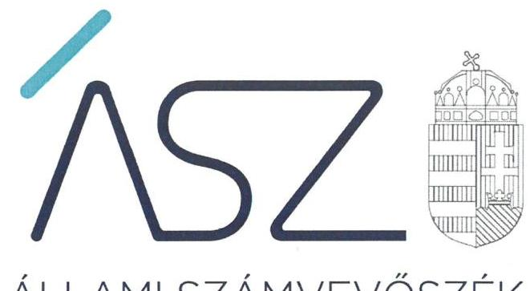
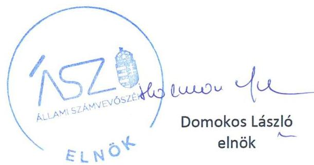
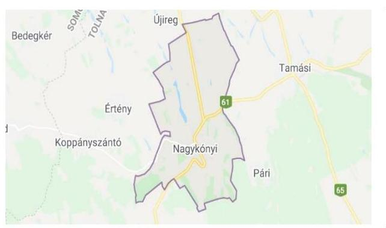

ÁLLAMI SZÁMVEVŐSZÉK

# JELENTÉS 

Önkormányzati intézmények integritás és belső kontroll ellenőrzése

Nagykónyi Óvoda és Főzőkonyha
2020.

20217
www.asz.hu

---

ÁLLAMI SZÁMVEVŐSZÉK

# JELENTÉS

Önkormányzati intézmények integritás és belső kontroll ellenőrzése

Nagykónyi Óvoda és Főzőkonyha

2020.

12. hó 29. nap

20217
www.asz.hu

---

# AZ ELLENŐRZÉST FELÜGYELTE: 

PETŐ KRISZTINA felügyeleti vezető

## AZ ELLENŐRZÉST VEZETTE ÉS A VÉGREHAJTÁSÁÉRT FELELŐS:

RÁCZKEVI KATALIN ellenőrzésvezető

## A PROGRAM ÖSSZEÁLLÍTÁSÁÉRT FELELŐS:

BERTALAN RUDOLF ellenőrzési program készítéséért felelős

IKTATÓSZÁM: EL-3031-001/2020.
TÉMASZÁM: 2551
ELLENŐRZÉS-AZONOSÍTÓ SZÁM: V085502
Jelentéseink az Országgyűlés számítógépes
hálózatán és az interneten a www.asz.hu címen is olvashatóak.

---

# TARTALOMJEGYZÉK 

■ ÖSSZEGZÉS ..... 5
■ AZ ELLENŐRZÉS CÉLJA ..... 6
■ AZ ELLENŐRZÉS TERÜLETE ..... 7
■ AZ ELLENŐRZÉS HÁTTERE, INDOKOLTSÁGA ..... 8
■ AZ ELLENŐRZÉS LÉNYEGES KÉRDÉSKÖREI ..... 9
■ AZ ELLENŐRZÉS HATÓKÖRE ÉS MÓDSZEREI ..... 10
■ MEGÁLLAPÍTÁSOK ..... 12
■ JAVASLATOK ..... 15
■ MELLÉKLETEK ..... 17
I. sz. melléklet: Értelmező szótár ..... 17
■ FÜGGELÉK: ÉSZREVÉTELEK ..... 19
■ RÖVIDÍTÉSEK JEGYZÉKE ..... 21

---

.

---

# ÖSSZEGZÉS 

A 2018. évben Nagykónyi Óvoda és Főzőkonyha belső kontrollrendszere nem biztosította a közpénzekkel való szabályszerű, átlátható és elszámoltatható gazdálkodást. Az integritási kontrollokat nem építették ki, így a korrupciós kockázatokkal szemben nem volt védett a szervezet.

## Az ellenőrzés társadalmi indokoltsága

Az Állami Számvevőszék alapvető feladata a közpénzekkel, az állami és önkormányzati vagyonnal való gazdálkodás ellenőrzése. Az Állami Számvevőszék az ÁSZ törvényben kapott felhatalmazással élve ellenőrzi az önkormányzati intézmények gazdálkodását, működését, hogy az ellenőrzések megállapításaival támogassa az ellenőrzött szervezetek szabályszerű gazdálkodását, javaslataival elősegítse az Alaptörvényben megfogalmazott alapvetések érvényesülését a mindennapi életben az önkormányzatok szintjén. Az Állami Számvevőszék stratégiájában megfogalmazott célkitűzése az integritás alapú, átlátható és elszámoltatható közpénzfelhasználás elősegítése. Ennek megvalósítása érdekében az Állami Számvevőszék prioritásként kezeli a közpénzzel gazdálkodó szervezetek esetében a belső kontrollrendszer működésének ellenőrzését.

## Főbb megállapítások, következtetések, javaslatok

Nagykónyi Óvoda és Főzőkonyha belső kontrollrendszere 2018-ban nem biztosította a szabályszerű, átlátható és elszámoltatható gazdálkodást.

Nagykónyi Óvoda és Főzőkonyha integritás elvű működésének alapvető feltételeit biztosító szabályozások nem álltak rendelkezésre a 2018. évben. Nagykónyi Óvoda és Főzőkonyha nem rendelkezett számlarenddel, így nem határozták meg mindazon szabályokat, amelyek a szabályszerű könyvvezetést és beszámoló készítést biztosítják. Nem vezették a kötelezettségvállalások nyilvántartását, ennek hiányában Nagykónyi Óvoda és Főzőkonyha nem rendelkezett megbízható információkkal a pénzügyi döntések meghozatalához, ezáltal olyan döntésekre is sor kerülhetett, amelyek pénzügyi fedezete nem volt biztosított.

A kontrolltevékenységek gyakorlása nem volt szabályszerű. A könyvviteli számlákból az éves költségvetési beszámoló alátámasztását biztosító főkönyvi kivonatot nem készítették el. Főkönyvi kivonat hiányában nem igazolt, hogy az éves költségvetési beszámoló megbízható, valós összképet mutat a vagyoni, pénzügyi helyzetről.

Nagykónyi Óvoda és Főzőkonyha intézményvezetője nem mérte fel és nem állapította meg a szervezete tevékenységében rejlő és a szervezeti célokkal összefüggő kockázatokat, továbbá nem határozta meg az egyes kockázatokkal kapcsolatban szükséges intézkedéseket, valamint azok teljesítésének folyamatos nyomon követésének módját. Továbbá nem biztosította, hogy az információk a megfelelő időben eljussanak az illetékes szervezethez, szervezeti egységhez, illetve személyhez. A monitoring rendszert az előírások ellenére nem működtették, a szervezet tevékenységének, a célok megvalósításának nyomon követését nem végezték el.

A szervezet integritás elvű működése - annak kialakítása hiányában - nem volt biztosított. A szervezet tevékenységében rejlő kockázatokat, így a korrupciós kockázatokat nem mérték fel, a vagyonnyilatkozat-tételi kötelezettséggel járó munkaköröket nem határozták meg.

Nagykónyi Óvoda és Főzőkonyhánál a szervezet teljesítmény mérésére alkalmas követelményeit, így a minőségi pénzköltés feltételeit nem alakították ki.

Az Állami Számvevőszék az ellenőrzés megállapításai alapján a Nagykónyi Óvoda és Főzőkonyha intézményvezetője részére 8 javaslatot fogalmazott meg.

---

# AZ ELLENŐRZÉS CÉLJA 

AZ ELLENŐRZÉS CÉLJA annak megállapítása volt, hogy az önkormányzati intézmény belső kontrollrendszere biztosította-e az átlátható, szabályszerű, gazdaságos, hatékony és eredményes gazdálkodás feltételeit. Az ellenőrzés keretében az ÁSZ értékelte, hogy a költségvetési szervnél kiépítették-e a korrupciós kockázatok kezelését szolgáló integritási kontrollokat, továbbá adottak-e egy teljesítményellenőrzés lefolytatásának a feltételei.

---

# AZ ELLENŐRZÉS TERÜLETE 

## Nagykónyi Óvoda és Főzőkonyha

A Nagykónyi Óvoda és Főzőkonyha intézményt az Önkormányzat ${ }^{1}$ Képviselő-testülete ${ }^{2}$ 2013. július 1-jén alapította. Az Intézmény ${ }^{3}$ vonatkozásában 2018. évben a fenntartói jogokat az Önkormányzat, az irányító szervi jogokat Nagykónyi Község Önkormányzatának Képviselő-testülete gyakorolta.

Nagykónyi község Tolna megyében, Tamási járásban található, állandó lakosainak száma a Központi Statisztikai Hivatal Magyarország közigazgatási helynévkönyve alapján 2018. január 1-jén 1068 fő volt.

Az Intézmény típusa köznevelési intézmény, közfeladata az ellenőrzött időszakban óvodai nevelés, valamint sajátos nevelési igényű gyermekek óvodai nevelése volt. Továbbá 2018. évben gyermekétkeztetés feladatot a szintén Nagykónyiban található Főzőkonyha telephelyén látott el. Az Intézménybe felvehető maximális gyermeklétszám 45 fő volt az ellenőrzött időszakban.

Az Intézmény illetékességi, működési köre, felvételi körzete Nagykónyi község közigazgatási területe volt. A 2018. évben az Intézményvezető ${ }^{4}$ személyében két alkalommal történt változás, a jelenlegi Intézményvezető 2018. augusztus 16. napján került kinevezésre. Az ellenőrzött évben az Intézmény gazdasági szervezettel nem rendelkező költségvetési szerv volt, gazdálkodási tevékenységét a Hivatal ${ }^{5}$ látta el Munkamegosztási megállapodás ${ }_{1,2}$-ben ${ }^{6}$ rögzítettek alapján.

Az Intézmény a 2018. évben 32,5 millió Ft költségvetési bevételt és 61,9 millió Ft finanszírozási bevételt ért el, továbbá közel 93,4 millió Ft központi költségvetési kiadást teljesített.

A foglalkoztatottak átlagos statisztikai állományi létszáma 2018. évben 9 fő volt.

---

# AZ ELLENŐRZÉS HÁTTERE, INDOKOLTSÁGA 

A BELSŐ KONTROLLRENDSZER kialakítása és működtetése nélkül nem valósítható meg a közpénzek, a közvagyon átlátható, szabályos, gazdaságos, hatékony és eredményes felhasználása. A belső kontrollrendszer azt a célt szolgálja, hogy a költségvetési szervek működésük és gazdálkodásuk során a tevékenységeket szabályszerűen hajtsák végre, teljesítsék elszámolási kötelezettségeiket és megvédjék az erőforrásokat a veszteségektől, a károktól és a nem rendeltetésszerű használattól.

A belső kontrollrendszer magában foglalja mindazon elveket, eljárásokat és belső szabályzatokat, melyek biztosítják, hogy a költségvetési szerv valamennyi tevékenysége és célja összhangban legyen a szabályszerűséggel, szabályozottsággal, valamint a gazdaságosság, hatékonyság és eredményesség követelményeivel, az eszközökkel és forrásokkal való gazdálkodásban ne kerüljön sor pazarlásra, visszaélésre, rendeltetésellenes felhasználásra. Megfelelő, pontos és naprakész információk álljanak rendelkezésre a költségvetési szerv működésével kapcsolatosan, és a belső kontrollrendszer harmonizációjára, összehangolására vonatkozó jogszabályok végrehajtásra kerüljenek. Az integritás kontrollok kiépítése, erősítése a szervezet korrupciós kockázatainak kezelését szolgálja. A teljesítménykövetelmények meghatározása megalapozhatja a teljesítményellenőrzés lefolytatását.

---

# AZ ELLENŐRZÉS LÉNYEGES KÉRDÉSKÖREI 

1. Az önkormányzati Intézmény belső kontrollrendszerének kialakítása és működtetése szabályszerű volt-e?
2. Az önkormányzati Intézménynél kiépítették-e az integritás kontrollrendszerét?
3. Az önkormányzati Intézménynél alakítottak-e ki a teljesítmény mérésére alkalmas követelményeket?

---

# AZ ELLENŐRZÉS HATÓKÖRE ÉS MÓDSZEREI 

## Az ellenőrzés típusa

Megfelelőségi ellenőrzés.

## Az ellenőrzött időszak

2018. év

## Az ellenőrzés tárgya

Az önkormányzati intézmény belső kontrollrendszerének kialakítása és működtetése, valamint az integritás kontrollok kiépítettsége, a teljesítményellenőrzés feltételeinek kialakítása.

## Az ellenőrzött szervezet

Nagykónyi Óvoda és Főzőkonyha

## Az ellenőrzés jogalapja

Az ellenőrzés jogszabályi alapját az ÁSZ tv. ${ }^{7}$ 1. § (3) bekezdés, 5. § (6) bekezdése, valamint az Áht. ${ }^{8}$ 61. § (2) bekezdésének előírásai képezik.

## Az ellenőrzés módszerei

Az ÁSZ ${ }^{9}$ az ellenőrzést az ellenőrzési program szempontjai, az ellenőrzött időszakban hatályos jogszabályok, az ellenőrzés szakmai szabályai, az ÁSZ által meghatározott és honlapján nyilvánosságra hozott helyénvalósági kritériumok, valamint a jelen ellenőrzésre irányadó ÁSZ módszertanok figyelembevételével hajtotta végre. Az ellenőrzési kérdések megválaszolásához szükséges bizonyítékok megszerzése az ellenőrzött által rendelkezésre bocsátott dokumentumokra, adatokra alapozva megfigyelés, szemle (szemrevételezés), kérdésfeltevés (információkérés), valamint elemző eljárás útján történt. Az ellenőrzési bizonyítékként felhasználható adatforrások közé tartoztak az ellenőrzési program részletes szempontjainál felsorolt adatforrások, valamint minden egyéb az ellenőrzés folyamán feltárt, az ellenőrzés szempontjából információt tartalmazó - dokumentum.

---

Az ellenőrzés lefolytatásához az ellenőrzött szervezet tanúsítvány kitöltésével, valamint az ÁSZ által kért dokumentumok megküldésével szolgáltatott adatokat, amelyek valódiságát és teljes körűségét az ellenőrzött szervezet vezetője által tett teljességi és hitelességi nyilatkozat igazolta. A rendelkezésre bocsátott adatok, információk kontrollja az ellenőrzés keretében történt.

Az önkormányzati intézmény belső kontrollrendszere egyes pilléreinek kialakítására és működtetésére vonatkozó értékelés:
$\longrightarrow$ „szabályszerű", amennyiben az értékelt területen az elért „igen" válaszok százalékban kifejezett, egész számra kerekített aránya legalább $85 \%$,
$\longrightarrow$ „nem szabályszerű", ha nem éri el a 85\%-ot.
Az önkormányzati intézmény belső kontrollrendszerének összesített értékelése (a kontrollrendszer egésze) esetében a „szabályszerű" értékelésnek a feltétele volt, hogy egyik kontrollterület sem kapott „nem szabályszerű" értékelést. A belső kontrollrendszer szabálytalansága esetén az integritás kontrollok kiépítése és működtetése nem „megfelelő".

Az önkormányzati intézmény vezetője által kiépített integritás kontrollrendszer értékeléséhez helyénvalósági kritériumok is megfogalmazásra kerültek.

Az ellenőrzés ideje alatt az ellenőrzött szervezettel történő kapcsolattartást az ÁSZ SZMSZ ${ }^{10}$-ének vonatkozó előírásai alapján biztosította az ÁSZ.

---

# 1. Az önkormányzati Intézmény belső kontrollrendszerének kialakítása és működtetése szabályszerű volt-e? 

Összegző megállapítás

Az Intézmény belső kontrollrendszerének kialakítása és működtetése 2018. évben nem volt szabályszerű.

Az Intézményvezető a Bkr. ${ }^{11}$ 1. melléklete szerinti nyilatkozatában értékelte az Intézmény 2018. évi belső kontrollrendszerének minőségét. Az Intézmény belső kontrollrendszerének minőségéről és működéséről adott nyilatkozat a kontrollkörnyezet kialakítására, a kontrolltevékenységek gyakorlására, továbbá az integrált kockázatkezelési rendszer, az információs és kommunikációs rendszer, és a monitoring rendszer működtetésére vonatkozó tartalmát az ÁSZ ellenőrzés során tett megállapítások nem igazolták, az alábbiak miatt:

A KONTROLLKÖRNYEZET kialakítása nem volt szabályszerű.
Az Intézmény az Áht. előírásai szerint rendelkezett SZMSZ ${ }^{12}$-szel, azonban a Vnytv. ${ }^{13}$ 4. § a) pontja ellenére az Intézmény SZMSZ-ében nem tüntették fel a vagyonnyilatkozat-tételi kötelezettséggel járó munkaköröket.

Az Intézmény rendelkezett a Számv.tv. ${ }^{14}$ előírása szerint Számviteli politikával és annak keretén belül elkészített számviteli szabályzatokkal ${ }^{15}$.

Az Intézmény az Áhsz. ${ }^{16}$ 51. § (2) bekezdés, továbbá a Számv.tv. 161. § (1) bekezdésében foglaltak ellenére nem rendelkezett számlarenddel.

Az Intézmény rendelkezett a jogszabályok szerint Gazdálkodási szabályzattal ${ }^{17}$. A gazdálkodási jogkörök gyakorlására jogosult személyekről és aláírás-mintájukról az előírások szerinti nyilvántartást vezettek.

Az Intézmény a Bkr. 6. § (4) bekezdésében foglaltak ellenére a szervezeti integritást sértő események kezelésének eljárásrendjével, továbbá az integrált kockázatkezelés eljárásrendjével 2018. augusztus 31-ig nem rendelkezett.

Az Intézményvezető az Intézmény ellenőrzési nyomvonalát a Bkr. 6. § (3) bekezdése ellenére 2018. augusztus 31-ig nem készítette el.

Az Intézményvezető a Bkr. 6. § (1) bekezdésének c) pontja ellenére 2018. szeptember 30-ig a szervezetre vonatkozó etikai elvárásokat nem határozott meg.

---

Az Intézmény nem rendelkezett az Ltv. ${ }^{18}$ 10. § (1) bekezdés a) pontjaiban előírtak szerinti iratkezelési szabályzattal, mert az Intézményi SZMSZ 2. számú mellékleteként készült Iratkezelési szabályzatot az illetékes közlevéltár egyetértése nélkül adták ki.

# AZ INTEGRÁLT KOCKÁZATKEZELÉSI 

RENDSZERT az Intézményvezető a Bkr. 7. § (1) bekezdése ellenére nem működtette. A Bkr. 7. § (2) bekezdésében foglaltak ellenére nem mérte fel és nem állapította meg az Intézmény tevékenységében rejlő és a szervezeti célokkal összefüggő kockázatokat, továbbá nem határozta meg az egyes kockázatokkal kapcsolatban szükséges intézkedéseket, valamint azok teljesítésének folyamatos nyomon követésének módját.

A KONTROLLTEVÉKENYSÉGEK gyakorlása nem volt szabályszerű, mert:
$\longrightarrow$ az
 Intézmény 2018. évre vonatkozóan az Áhsz. 39. §. (1) bekezdésében, továbbá Áhsz. 14. melléklet II. pontjában előírtak ellenére a kötelezettségvállalások, más fizetési kötelezettségek nyilvántartását nem vezette;
$\longrightarrow$ Az Intézmény 2018. évre a Számv. tv. 5. §-ában, az Áhsz. 5. § (1) bekezdésében továbbá az Áhsz. 53. § (1) bekezdés és (3) bekezdés c) pontjában előírtak ellenére a könyvviteli számlákból az éves költségvetési beszámoló alátámasztását biztosító főkönyvi kivonatot nem készített.

## AZ INFORMÁCIÓS ÉS KOMMUNIKÁCIÓS

RENDSZERT az Intézmény SZMSZ-ében az előírások szerint kialakították. Az információs és kommunikációs rendszert 2018. évben a Bkr. 3. § d) pontjában és 9. § (1) bekezdésében előírtak ellenére nem működtették az Intézményvezető teljességi és hitelességi nyilatkozata, valamint az ellenőrzés rendelkezésére bocsátott dokumentumok alapján.

A MONITORING RENDSZERT az Intézményvezető a Bkr. előírásaival összhangban kialakította, az Intézmény tevékenységének, a célok megvalósításának folyamatos- és eseti nyomon követését biztosító rendszerét a Belső kontroll szabályzatban ${ }^{19}$ meghatározta. Az Intézményvezető teljességi és hitelességi nyilatkozata, valamint az ellenőrzés rendelkezésére bocsátott dokumentumok alapján - a Bkr. 3. § e) bekezdésében és a Belső kontroll szabályzat 7. pontjában előírtak ellenére - 2018. évben a monitoring rendszert nem működtették.

---

# 2. Az önkormányzati Intézménynél kiépítették-e az integritás kontrollrendszerét? 

## Összegző megállapítás Az Intézményvezető nem építette ki az integritás kontrollrendszerét.

Az Intézmény integrált kockázatkezelési rendszert a Bkr.-ben előírtak ellenére nem működtetett, nem végzett kockázatelemzést, így nem azonosították az integritást veszélyeztető kockázatokat sem.

A vagyonnyilatkozat-tételi kötelezettséggel járó munkaköröket a jogszabályi előírás ellenére az SZMSZ-ben nem tüntették fel.

Az Intézmény nem alakított ki teljesítményértékelési rendszert. Az Intézmény munkatársai korrupcióellenes képzésben nem vettek részt.

## 3. Az önkormányzati Intézménynél alakítottak-e ki a teljesítmény mérésére alkalmas követelményeket?

## Összegző megállapítás Az Intézményvezető nem alakította ki a teljesítmény mérésére alkalmas követelményeket.

Az Intézményvezető nem alakította ki a szervezet vonatkozásában a teljesítmény mérésének feltételeit, továbbá a szervezeti célok elérését szolgáló feladatok, tevékenységek mérését szolgáló indikátorokat, mérőszámokat, továbbá feladat és teljesítmény-mutatókat sem határozott meg.

---

# JAVASLATOK 

Az ÁSZ tv. 33. § (1) bekezdésében foglaltak értelmében az ellenőrzött szervezet vezetője köteles a jelentésben foglalt megállapításokhoz kapcsolódó intézkedési tervet összeállítani és azt a jelentés kézhezvételétől számított 30 napon belül az ÁSZ részére megküldeni. Amennyiben az intézkedési tervet az ellenőrzött szervezet vezetője nem küldi meg határidőben, vagy továbbra sem elfogadható intézkedési tervet küld, az ÁSZ elnöke az ÁSZ törvény 33. § (3) bekezdés a)-b) pontjaiban foglaltakat érvényesítheti.

## Nagykónyi Óvoda és Főzőkonyha intézményvezetőjének:

1. Intézkedjen az SZMSZ módosításáról a vagyonnyilatkozat-tételi kötelezettséggel járó munkakörök feltüntetése érdekében.
(1. összegző megállapítás 3. bekezdése alapján)
2. Intézkedjen a jogszabályokban előírt számlarend elkészítése érdekében.
(1. összegző megállapítás 5. bekezdése alapján)
3. Intézkedjen a jogszabályi előírás szerinti iratkezelési szabályzat kiadása érdekében.
(1. összegző megállapítás 10. bekezdése alapján)
4. Intézkedjen az integrált kockázatkezelési rendszer működtetéséről, amelynek során mérje fel és állapítsa meg a költségvetési szerv tevékenységében rejlő és szervezeti célokkal összefüggő kockázatokat, valamint határozza meg az egyes kockázatokkal kapcsolatban szükséges intézkedéseket és azok teljesítésének folyamatos nyomon követése módját.
(1. összegző megállapítás 11. bekezdése alapján)
5. Intézkedjen a kötelezettségvállalások és más fizetési kötelezettségek nyilvántartásának jogszabály szerinti vezetéséről.
(1. összegző megállapítás 12. bekezdésének 1. francia bekezdése alapján)

---

6. Intézkedjen a könyvviteli számlákból az éves költségvetési beszámoló alátámasztását biztosító főkönyvi kivonat elkészítése érdekében.
(1. összegző megállapítás 12. bekezdésének 2. francia bekezdése alapján)
7. Intézkedjen a jogszabályban foglalt előírások szerint az információs és kommunikációs rendszer működtetéséről.
(1. összegző megállapítás 13. bekezdésének 2. mondata alapján)
8. Intézkedjen a jogszabályban foglalt előírások szerint a monitoring rendszer működtetéséről.
(1. összegző megállapítás 14. bekezdésének 2. mondata alapján)

---

# MELLÉKLETEK 

- I. SZ. MELLÉKLET: ÉRTELMEZŐ SZÓTÁR
belső kontrollrendszer
belső kontrollrendszer pillérei, kontrollterületei
helyénvalósági ellenőrzés
információs és kommunikációs rendszer
integrált
kockázatkezelési rendszer
kontrollkörnyezet
kontrolltevékenységek
monitoring rendszer

A belső kontrollrendszer a kockázatok kezelése és tárgyilagos bizonyosság megszerzése érdekében kialakított folyamatrendszer, amely azt a célt szolgálja, hogy a működés és gazdálkodás során a tevékenységeket szabályszerűen, gazdaságosan, hatékonyan, eredményesen hajtsák végre, az elszámolási kötelezettségeket teljesítsék, megvédjék az erőforrásokat a veszteségektől, károktól és nem rendeltetésszerű használattól. (Forrás: Áht. 69. § (1) bekezdése)
A kontrollkörnyezet, az (integrált) kockázatkezelési rendszer, a kontrolltevékenységek, az információs és kommunikációs rendszer, valamint a nyomon követési (monitoring) rendszer. (Forrás: Bkr. 3. §-a)
A helyénvalósági ellenőrzés a megfelelőségi ellenőrzés azon altípusa, amelyet azokban az esetekben kell alkalmazni, amelyekre jogszabályi előírások nem alkalmazhatóak, illetve amennyiben egyes kérdések megítélésénél nyilvánvaló jogszabályi hiányosságok vannak. Helyénvalósági ellenőrzés során az ellenőrzést végző személynek a közszféra intézményeinek helyes gazdálkodására, a közpénzek eredményes és megfelelő felhasználására és a közszféra tisztviselőinek magatartására vonatkozó általános elvek mentén kell az ellenőrzést lefolytatnia. A helyénvalósági ellenőrzés kritériumait az ellenőrzés tárgyában általánosan elfogadott, illetve nemzetközi vagy hazai „jó gyakorlatok" is meghatározhatják. (Forrás: Állami Számvevőszék, A megfelelőségi ellenőrzés alapelvei 2015. július)
A költségvetési szerv vezetője által kialakított és működtetett olyan rendszer, mely biztosítja, hogy a megfelelő információk a megfelelő időben eljutnak az illetékes szervezethez, szervezeti egységhez, illetve személyhez. (Forrás: Bkr. 9. § (1) bekezdés) Olyan folyamatalapú kockázatkezelési rendszer, amely a szervezet minden tevékenységére kiterjed, egységes módszertan és eljárások alkalmazásával, a szervezet célkitűzéseinek és értékeinek figyelembevételével biztosítja a szervezet kockázatainak teljes körű azonosítását, azok meg-határozott kritériumok szerinti értékelését, valamint a kockázatok kezelésére vonatkozó intézkedési terv elkészítését és az abban foglaltak nyomon követését. (Forrás: Bkr. 2. § m) pontja, 2016. október 1-jétől)
A költségvetési szerv vezetője által kialakított olyan elvek, eljárások, belső szabályzatok összessége, amelyben világos a szervezeti struktúra, a folyamatok átláthatók, egyértelműek a felelősségi, hatásköri viszonyok és feladatok, meghatározottak, ismertek és elfogadottak az etikai elvárások a szervezet minden szintjén, átlátható a humánerőforrás-kezelés, biztosított a szervezeti célok és értékek irányában való elkötelezettség fejlesztése és elősegítése. (Forrás: Bkr. 6. § (1) bekezdés)
A költségvetési szerv vezetője által a szervezeten belül kialakított (kontroll) tevékenységek, melyek biztosítják a kockázatok kezelését, hozzájárulnak a szervezet céljainak eléréséhez és erősítik a szervezet integritását. (Forrás: Bkr. 8. § (1) bekezdés) A költségvetési szerv vezetője köteles kialakítani a szervezet tevékenységének a célok megvalósításának nyomon követését biztosító rendszert, amely az operatív tevékenységek keretében megvalósuló folyamatos és eseti nyomon követésből, valamint az operatív tevékenységektől függetlenül működő belső ellenőrzésből állhat. (Forrás: Bkr. 10. §)

---

.

---

# FÜGGELÉK: ÉSZREVÉTELEK 

A jelentéstervezetet a Számvevőszék 15 napos észrevételezésre megküldte az ellenőrzött szervezet vezetőjének az ÁSZ tv. 29. §* (1) bekezdése előírásának megfelelően.

A Nagykónyi Óvoda és Főzőkonyha intézményvezetője az ÁSZ tv. 29. § (2) bekezdésében foglalt észrevételezési jogával nem élt, a jelentéstervezetre észrevételt nem tett.

[^0]
[^0]:    * 29. § (1) Az Állami Számvevőszék az ellenőrzési megállapításait megküldi az ellenőrzött szervezet vezetőjének vagy az általa megbízott személynek, és annak, akinek személyes felelősségét állapította meg.
    (2) Az ellenőrzött szervezet vezetője és a felelősként megjelölt személy az ellenőrzés megállapításaira tizenöt napon belül írásban észrevételt tehet.
    (3) Az Állami Számvevőszék az észrevételre a beérkezésétől számított harminc napon belül írásban válaszol. A figyelembe nem vett észrevételeket köteles a jelentésben feltüntetni, és megindokolni, hogy azokat miért nem fogadta el.

---

.

---

# RÖVIDÍTÉSEK JEGYZÉKE 

${ }^{1}$ Önkormányzat
${ }^{2}$ Képviselő-testület
${ }^{3}$ Intézmény
${ }^{4}$ Intézményvezető
${ }^{5}$ Hivatal
${ }^{6}$ Munkamegosztási megállapodás ${ }_{1}$

Munkamegosztási megállapodás ${ }_{2}$
${ }^{7}$ ÁSZ tv.
${ }^{8}$ Áht.
${ }^{9}$ ÁSZ
${ }^{10}$ ÁSZ SZMSZ
${ }^{11}$ Bkr.
${ }^{12}$ SZMSZ
${ }^{13}$ Vnytv.
${ }^{14}$ Számv.tv.
${ }^{15}$ számviteli szabályzatok
${ }^{16}$ Áhsz.
${ }^{17}$ Gazdálkodási szabályzat
${ }^{18}$ Ltv.
${ }^{19}$ Belső kontroll szabályzat

Nagykónyi Község Önkormányzata
Nagykónyi Község Önkormányzatának Képviselő-testülete
Nagykónyi Óvoda és Főzőkonyha
Nagykónyi Óvoda és Főzőkonyha Intézményvezetője
Nagykónyi Közös Önkormányzati Hivatal
Munkamegosztási megállapodás gazdasági szervezeti feladatot ellátó költségvetési szerv, valamint a gazdasági szervezettel nem rendelkező költségvetési szerv között gazdálkodási-, munkaügyi feladatok munkamegosztásának rendjére vonatkozóan Nagykónyi Közös Önkormányzati Hivatal és Nagykónyi Óvoda és Főzőkonyha között (hatályos: 2017. augusztus 4. napjától)
Munkamegosztási megállapodás gazdasági szervezeti feladatot ellátó költségvetési szerv, valamint a gazdasági szervezettel nem rendelkező költségvetési szerv között gazdálkodási-, munkaügyi feladatok munkamegosztásának rendjére vonatkozóan Nagykónyi Közös Önkormányzati Hivatal és Nagykónyi Óvoda és Főzőkonyha között (hatályos: 2018. augusztus 16. napjától)
2011. évi LXVI. törvény az Állami Számvevőszékről (hatályos: 2011. július 1-jétől)
2011. évi CXCV. törvény az államháztartásról (hatályos: 2011. január 1-jétől)

Állami Számvevőszék
az Állami Számvevőszék elnökének 3/2019. (XII.23.) ÁSZ utasítása az Állami Számvevőszék Szervezeti és Működési Szabályzata
370/2011. (XII. 31.) Korm. rendelet a költségvetési szervek belső kontrollrendszeréről és belső ellenőrzéséről (hatályos: 2012. január 1-jétől)
Nagykónyi Óvoda és Főzőkonyha Szervezeti és Működési Szabályzat (hatályos: 2017. október 1-jétől)
2007. évi CLII. törvény egyes vagyonnyilatkozat-tételi kötelezettségekről 2000. évi C. törvény a számvitelről (hatályos: 2001. január 1-jétől)

Nagykónyi Közös Önkormányzati Hivatal Leltározási és leltárkészítési szabályzata (hatályos: 2016. március 1-jétől); Nagykónyi Közös Önkormányzati Hivatal Eszközök és források értékelési szabályzata (hatályos: 2016. március 1-jétől); Nagykónyi Közös Önkormányzati Hivatal Pénzkezelési szabályzata (hatályos: 2016. március 1-jétől)
4/2013. (I. 11.) Korm. rendelet az államháztartás számviteléről
Nagykónyi Közös Önkormányzati Hivatal Gazdálkodási szabályzata (hatályos: 2016. január 16-tól)
1995. évi LXVI. törvény a köziratokról, a közlevéltárakról és a magánlevéltári anyag védelméről
Nagykónyi Óvoda és Főzőkonyha Belső kontroll szabályozása (hatályos: 2018. szeptember 1-jétől)

---

# 1052 

1052 Budapest, Apáczai Cs. J. u. 10. I 1364 Budapest 4. Pf. 54 TEL: +36 14849100
email: szamvevoszek@asz.hu
web: www.asz.hu | www.aszhirportal.hu

