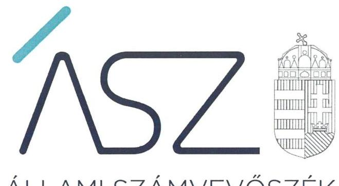
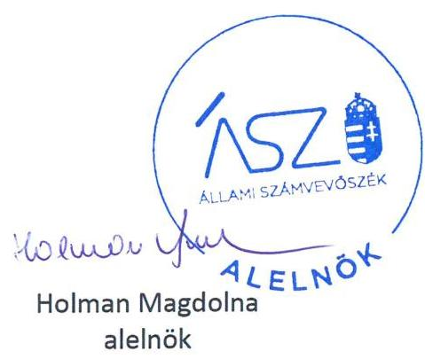

ÁLLAMI SZÁMVEVŐSZÉK

# JELENTÉS 

Pártok gazdálkodása

A költségvetési támogatásban részesülő pártok 2017-2018. évi gazdálkodása törvényességének ellenőrzése a Jobbik Magyarországért Mozgalomnál

2020.

20218
www.asz.hu

---

ÁLLAMI SZÁMVEVŐSZÉK

# JELENTÉS 

Pártok gazdálkodása

A költségvetési támogatásban részesülő pártok 2017-2018. évi gazdálkodása törvényességének ellenőrzése a Jobbik Magyarországért Mozgalomnál
2020. 12. hó 18. nap

20218
www.asz.hu

---

# AZ ELLENŐRZÉST FELÜGYELTE: 

DR. BENEDEK MÁRIA felügyeleti vezető
DR. NAGY IMRE felügyeleti vezető

## AZ ELLENŐRZÉST VEZETTE ÉS A VÉGREHAJTÁSÁÉRT FELELŐS:

DR. PELLEI TAMÁS ellenőrzésvezető

## A PROGRAM ÖSSZEÁLLÍTÁSÁÉRT FELELŐS:

BERTALAN RUDOLF felelős vezető

## A TÉMÁHOZ KAPCSOLÓDÓ KORÁBBI SZÁMVEVŐSZÉKI JELENTÉSEK:

- címe: Jelentés a költségvetési támogatásban részesülő pártok 2015-2016. évi gazdálkodása törvényességének ellenőrzéséről a JOBBIK Magyarországért Mozgalomnál
- sorszáma: 18012
- címe: Jelentés a költségvetési támogatásban részesülő pártok 2013-2014. évi gazdálkodása törvényességének ellenőrzéséről a JOBBIK Magyarországért Mozgalomnál
- sorszáma: 16139

IKTATÓSZÁM: EL-3035-001/2020.
TÉMASZÁM: 2520
ELLENŐRZÉS-AZONOSÍTÓ SZÁM: V086402

---

# TARTALOMJEGYZÉK 

■ ÖSSZEGZÉS ..... 5
■ AZ ELLENŐRZÉS CÉLJA ..... 7
■ AZ ELLENŐRZÉS TERÜLETE ..... 8
■ AZ ELLENŐRZÉS HÁTTERE, INDOKOLTSÁGA ..... 9
■ A JELENTÉS LÉNYEGES KÉRDÉSKÖREI ..... 10
■ AZ ELLENŐRZÉS HATÓKÖRE ÉS MÓDSZEREI ..... 11
■ MEGÁLLAPÍTÁSOK ..... 13
■ JAVASLATOK ..... 16
■ MELLÉKLETEK ..... 19
I. sz. melléklet: Értelmező szótár ..... 19
■ FÜGGELÉKEK ..... 21
I. sz. függelék a jelentéshez ..... 21
II. sz. függelék: Észrevételek ..... 22
■ RÖVIDÍTÉSEK JEGYZÉKE ..... 27

---

.

---

# ÖSSZEGZÉS 

A Jobbik Magyarországért Mozgalom 2017-ben és 2018-ban nem biztositotta a gazdálkodásának átláthatóságát és a közpénzek felhasználásának elszámoltathatóságát a párt tagsága és az állampolgárok felé.

## Az ellenőrzés társadalmi indokoltsága

A pártok az állampolgárok egyesülési szabadsága alapján létrehozott olyan szervezetek, amelyek kereteket nyújtanak a népakarat kialakításához és kinyilvánításához, a politikai életben való állampolgári részvételhez.

A politikai élet tisztasága érdekében törvény állapítja meg a pártok vagyonára és gazdálkodására vonatkozó szabályokat. Az egyesülési jog alapján létrejövő más szervezetekhez képest szűkebb körben határozza meg azt a gazdasági tevékenységet, amelyet a párt végezhet, biztosítja azonban a pártok részére azt a jogosultságot, hogy az állami költségvetésből támogatásban részesüljenek. A pártok gazdálkodását a politikai élet tisztasága érdekében rendszeresen indokolt ellenőrizni, ezért törvényi előírás alapján az Állami Számvevőszék a költségvetési támogatást kapott pártok gazdálkodását kétévente ellenőrzi. A gazdálkodás szabályszerűségének, a felhasznált közpénzek nagyságának bemutatásával a társadalom objektív képet alkothat a pártok múködéséről.

A pártokkal szembeni társadalmi elvárás a törvényt tisztelő, jogkövető magatartás, mivel a párt képviselői a jogállamiságot megtestesítő törvényhozó hatalom részei. Mindezekre tekintettel fokozott társadalmi veszélyességet hordoz egy párt elszámoltathatóságának hiánya, elszámolási kötelezettségének nem teljesítése.

## Főbb megállapítások, javaslatok

A Jobbik Magyarországért Mozgalom 2017-2018. évi gazdálkodása törvényességének ellenőrzése során feltárt lényeges szabálytalanságok miatt a párt gazdálkodása nem volt átlátható és elszámoltatható.

A Jobbik Magyarországért Mozgalom nem igazolta a könyvelésébe bejegyzett adatok valódiságát, és nem biztosította annak ellenőrizhetőségét. Nem biztosította a 2018-ban magánszemélyektől kapott mintegy 161 millió Ft öszszegű adomány átlátható nyilvántartásának feltételeit. A feltárt szabálytalanságok miatt a 2017. és 2018. évi pénzügyi kimutatás nem mutatott megbízható és valós képet a párt gazdálkodásáról, hanem megtévesztette a párt tagságát és az állampolgárokat.

A pénzügyi kimutatásokat nem terjesztették a párt szélesebb tagságát képviselő Kongresszus elé, így a Jobbik Magyarországért Mozgalom a gazdálkodásának áttekinthetőségét és ellenőrizhetőségét a saját tagsága részére sem biztosította.

A Jobbik Magyarországért Mozgalom nem tett eleget a közélet tisztaságára vonatkozó alaptörvényi követelménynek és törvényi előírásoknak. Ezáltal nem zárható ki, hogy nem engedélyezett források felhasználásával tisztességtelen előnyhöz juthatott más pártokkal szemben.

A párt törvényes múködésének és gazdálkodásának helyreállítása érdekében a Jobbik Magyarországért Mozgalom elnökének mielőbbi intézkedése szükséges. Ennek támogatására az Állami Számvevőszék 11 javaslatot fogalmazott meg a párt elnöke részére.

---

# Következtetések

Az Állami Számvevőszék a 2005-2018. közötti időszakra vonatkozóan hat alkalommal ellenőrizte a Jobbik Magyarországért Mozgalom gazdálkodását. A jelenlegi, 2017-2018. évekre kiterjedő ellenőrzés során feltárt jellemző törvénysértések 2005. óta visszatérően megjelentek a párt gazdálkodásában. A visszatérő törvénysértéseket az 1. táblázat mutatja be.

1. táblázat

|   | 2005-2008. | 2009-2010. | 2011-2012. | 2013-2014. | 2015-2016. | 2017-2018.  |
| --- | --- | --- | --- | --- | --- | --- |
|  Ellenőrzési rendszer nem szabályszorú működtetése | X | X | X | X | $*$ | X  |
|  Átállítás nyilvántartások hiánya |  | X |  | X | $*$ | X  |
|  Bizonyíatok hiánya vagy szabálytalan bizonylatok | X | X | X | X | $*$ | X  |
|  Nem pénzbeli hozzájárulások értékelésének elmulasztása |  | X |  | X | $*$ | X  |

- A Jobbik Magyarországért Mozgalom a 2015-2016. évek gazdálkodásának ellenőrzéséhez kapcsolódó közreműködési kötelezettségét nem teljesítette, ezáltal nem igazolta az átlátható és ellenőrizhető gazdálkodás alapjainak megteremtését, a közpénzek szabályos, átlátható felhasználását, továbbá a müködéséhez igénybe vett források jogszerűségét.

A korábbi számvevőszéki jelentésekben rögzített és a jelenlegi ellenőrzés során feltárt törvénysértések alapján a Jobbik Magyarországért Mozgalom 2005-2018. között nem biztosította a gazdálkodása törvényi előírásokhoz kapcsolódó lényeges elemeinek szabályszerűségét. A gazdálkodás lényeges elemeinek értékelését az ellenőrzési megállapítások alapján a 2. táblázat mutatja be. 2. táblázat

|   | 2005-2008. | 2009-2010. | 2011-2012. | 2013-2014. | 2015-2016. | 2017-2018.  |
| --- | --- | --- | --- | --- | --- | --- |
|  Szabályozás |  |  |  |  |  |   |
|  Ellenőrzés |  |  |  |  |  |   |
|  Könyvesesetés |  |  |  |  |  |   |
|  Beszámolás |  |  |  |  |  |   |

2öld: szabályszerű, piros: nem szabályszerű A párt gazdálkodásában azonosított visszatérő törvénysértések arra mutatnak rá, hogy a Jobbik Magyarországért Mozgalom a gazdálkodásának legtöbb területén nem gondoskodott az Állami Számvevőszék által feltárt hibák kijavításáról, a párt szabályszerű, átlátható és elszámoltatható gazdálkodásának helyreállításáról, annak ellenére, hogy ezt a párt a számvevőszéki jelentésekben foglalt megállapításokra készített intézkedési terveiben vállalta.

A pártok működéséről és gazdálkodásáról szóló 1989. évi XXXIII. törvény 1. §-a és általános indokolása alapján azok az egyesületek nyújthatnak szervezeti kereteket a népakarat kialakításához és kinyilvánításához, a politikai életben való állampolgári részvételhez, amelyek kinyilvánítják, hogy a törvény rendelkezéseit magukra nézve kötelezőnek ismerik el. Emellett az Alaptörvény 39. cikk (1) bekezdése szerint a központi költségvetésből csak olyan szervezet részére nyújtható támogatás, amelynek a támogatás felhasználására irányuló tevékenysége átlátható.

Az átláthatóság hiánya, továbbá a 2005-2018. évre vonatkozó ellenőrzések során feltárt lényeges és visszatérő törvénysértések alapján felvetődhet a kérdés: eleget tesz-e a pártként való müködéshez és a költségvetési támogatáshoz való hozzájutáshoz előírt alapvető követelményeknek a Jobbik Magyarországért Mozgalom?

---

# AZ ELLENŐRZÉS CÉLJA 

AZ ELLENŐRZÉS CÉLJA annak értékelése, hogy a Jobbik Magyarországért Mozgalom által közzétett pénzügyi kimutatások a törvényi előírásoknak megfelel-tek-e, a könyvvezetés és gazdálkodás során betartották-e a vonatkozó jogszabályi és belső előírásokat; a Jobbik Magyarországért Mozgalom a múködéséhez szabályszerűen igénybe vehető forrásokat használt-e fel.

---

# AZ ELLENŐRZÉS TERÜLETE 

## Jobbik Magyarországért Mozgalom

A Jobbik Magyarországért Mozgalom 2003. október 2-án létrejött olyan egyesület, amely nyilvántartott tagsággal rendelkezett, és a nyilvántartásba vételét végző bíróság előtt kinyilvánította, hogy a Párttörvény ${ }^{1}$ rendelkezéseit magára nézve kötelezőnek ismeri el a Párttörvény 1. §-a alapján.

A Jobbik Magyarországért Mozgalom döntéshozó testülete a Kongresszus², döntéshozatali szervei az Országos Választmány ${ }^{3}$ és az Országos Elnökség ${ }^{4}$ volt.

A Jobbik Magyarországért Mozgalom 2017. évi pénzügyi kimutatásában a 2017 évi költségvetési törvényben ${ }^{5}$ jóváhagyott központi költségvetésből származó 475,8 millió Ft-os támogatás összegét mutatta ki. A 2018. évben a zárszámadási törvény ${ }^{6}$ alapján a Jobbik Magyarországért Mozgalom 961,4 millió Ft központi költségvetésből származó támogatásban részesült.

A 2017. évi pénzügyi kimutatásban 718,8 millió Ft bevételt, 909,6 millió Ft kiadást, a 2018. évi pénzügyi kimutatásban 1 386,8 millió Ft bevételt, valamint 1555,2 millió Ft kiadást mutattak ki.

A Jobbik Magyarországért Mozgalom a Párttörvény alapján biztosított lehetőséggel élve 2011. évben megalapította a Gyarapodó Magyarországért Alapítványt, amelynek elnevezése a 2015. évben Jobbik Magyarországért Alapítványra változott. A Jobbik Magyarországért Mozgalom az ellenőrzött időszak alatt gazdasági társaságot nem alapított.

---

# AZ ELLENŐRZÉS HÁTTERE, INDOKOLTSÁGA 

Az ÁSZ tv. ${ }^{7}$ 5. § (11) bekezdés a) pontja, valamint a Párttörvény 10. § (1) bekezdése alapján a pártok gazdálkodása törvényességének ellenőrzésére az ÁSZ ${ }^{8}$ jogosult. Törvényi előírás szerint az ÁSZ kétévente ellenőrzi azoknak a pártoknak a gazdálkodását, amelyek rendszeres költségvetési támogatásban részesültek.

Az ÁSZ legutóbb a Jobbik Magyarországért Mozgalom 2015-2016. évi gazdálkodásának törvényességét ellenőrizte.

A gazdálkodás szabályszerűségének, a felhasznált közpénzek nagyságának bemutatásával a társadalom objektív képet alkothat a pártok működéséről. Az ellenőrzés megállapításai a gazdálkodás megfelelőségének bemutatásával elősegíthetik, hogy a törvényalkotók konkrét lépéseket tegyenek a pártok finanszírozására vonatkozó szabályozások megváltoztatása, átláthatóbbá, ellenőrizhetőbbé tétele irányába. Az ellenőrzés rámutat a pártok gazdálkodásával kapcsolatos jó gyakorlatokra és szabálytalanságokra. A hiányosságok, szabálytalanságok feltárása, az ennek kapcsán megfogalmazott megállapítások elősegíthetik a törvényi rendelkezések megsértésének szankcionálását.

---

# A JELENTÉS LÉNYEGES KÉRDÉSKÖREI 

1- A Jobbik Magyarországért Mozgalom szabályszerűen kialakitotta-e a gazdálkodás szabályozási kereteit?
2- A Jobbik Magyarországért Mozgalom könyvvezetése és gazdálkodása szabályszerű volt-e?
3- A Jobbik Magyarországért Mozgalom pénzügyi kimutatása megfelelte a jogszabályi elöírásoknak, közzétételi kötelezettségét szabályszerűen teljesítette-e?

---

# AZ ELLENŐRZÉS HATÓKÖRE ÉS MÓDSZEREI 

## Az ellenőrzés típusa

Szabályszerűségi ellenőrzés.

## Az ellenőrzött időszak

2017-2018. évek, a 2017. év vonatkozásában a 18012. számú ÁSZ jelentésben meghatározott dokumentumok kivételével.

## Az ellenőrzés tárgya

A Jobbik Magyarországért Mozgalom ellenőrzése során az ellenőrzés tárgyát képezte a 2017. és a 2018. évre vonatkozó pénzügyi kimutatás elkészítésére, jóváhagyására, közzétételére, a párt könyvvezetésére, gazdálkodására, ennek keretében a számviteli szabályozás kialakítására, a bizonylati rend, bizonylati fegyelem betartására, egyéb gazdálkodási, ellenőrzési és pénzügyi-számviteli informatikai feladatok ellátására irányuló tevékenységek. Az ellenőrzés tárgya volt még a források elszámolása és felhasználása, valamint a vagyon jogszabályi előírásoknak megfelelő hasznosítása.

Az ellenőrzés kiterjedt minden olyan körülményre és adatra, amely az ÁSZ jogszabályban meghatározott feladatainak teljesítéséhez, valamint a program végrehajtása folyamán felmerült újabb összefüggések feltárásához szükséges volt.

## Az ellenőrzött szervezet

Jobbik Magyarországért Mozgalom

## Az ellenőrzés jogalapja

Az ellenőrzés jogalapját az ÁSZ tv. 5. § (11) bekezdés a) pontja, a Párttörvény 4. § (4)-(5) bekezdései, valamint 10. § (1), (3)-(4) bekezdései képezte.

## Az ellenőrzés módszerei

Az ÁSZ ellenőrzésére az ellenőrzési program szempontjai, az ellenőrzött időszakban hatályos jogszabályok, az ellenőrzés általános szakmai szabályai, az ellenőrzésre irányadó ÁSZ módszertanok figyelembevételével került sor. A közpénzekkel való felelős gazdálkodás segítésére irányuló javaslatok kidolgozásakor a hatályos jogszabályok irányadóak.

---

Az ellenőrzés ideje alatt a Jobbik Magyarországért Mozgalommal történő kapcsolattartást az ÁSZ SZMSZ ${ }^{\text {® }}$-ének vonatkozó előírásai alapján biztosította az ÁSZ.

Az ellenőrzés céljának eléréséhez szükséges bizonyítékok megszerzése a Jobbik Magyarországért Mozgalom által rendelkezésre bocsátott dokumentumokra, adatokra alapozva közvetlen, részletes elemzés, megfigyelés, szemrevételezés, információkérés, megerősítés, valamint elemző eljárás útján történt. Az ellenőrzési bizonyítékként felhasználható adatforrások közé tartoztak egyrészt az ellenőrzési program részletes szempontjainál felsorolt adatforrások, másrészt minden egyéb - az ellenőrzés folyamán feltárt, az ellenőrzés szempontjából információt tartalmazó - dokumentum.

Az ellenőrzés lefolytatásához a Jobbik Magyarországért Mozgalom az ÁSZ által kért dokumentumok megküldésével szolgáltatott adatokat, amelyek valódiságát és teljes körűségét a Jobbik Magyarországért Mozgalom vezetője által tett teljességi és hitelességi nyilatkozatnak kellett igazolnia. A rendelkezésre bocsátott adatok, információk kontrollja az ellenőrzés keretében történt.

Az ÁSZ a tételes ellenőrzés mellett statisztikai alapú mintavételezést és értékelést alkalmazott. A minták kiválasztása rétegzett mintavételezéssel történt. A hozzájárulások, adományok és egyéb bevételek, valamint a személyi juttatások (működési kiadáson belül), eszközbeszerzések és a működési kiadások további tételei, politikai tevékenység kiadásai, egyéb kiadások mintatételeinek értékelése „szabályszerű", ha a minta ellenőrzésének eredménye alapján 95\%-os bizonyossággal a teljes sokaságban az átlagos hibaarány nem haladta meg a 10\%-ot, „nem szabályszerű, ha nagyobb volt, mint 10\%. Abban az esetben, ha a teljes sokaság tekintetében a 10\%-os hibaarányhoz való viszony megítélésének megbízhatósága nem érte el a 95\%-ot, annak elérése érdekében az értékelés további szempontokkal egészült ki, a feltárt hibák értéke is figyelembe vételre került.

---

# 1. A Jobbik Magyarországért Mozgalom szabályszerűen kialakította-e a gazdálkodás szabályozási kereteit? 

Összegző megállapítás

A Jobbik Magyarországért Mozgalom a gazdálkodására vonatkozó szabályozási kereteit a 2017-2018. években kialakította.

A Jobbik ${ }^{10}$ a Számv. tv. ${ }^{11}$ előírásai alapján rendelkezett Számviteli politikával ${ }^{12}$, melynek keretében elkészítette az Értékelési szabályzat ${ }_{1,2}$ - $t^{13}$. a Leltározási szabályzatot ${ }^{14}$, és a Pénzkezelési szabályzatot ${ }^{15}$, továbbá a Számv. tv. előírásai szerint elkészítette a Számlarendet ${ }^{16}$.

A Jobbik az Értékelési szabályzat ${ }_{1,2}$ 5. pontjában, a Párttörvény 4. § (5) bekezdés szerint a nem pénzbeli vagyoni hozzájárulás értékének meghatározását előírta.

## 2. A Jobbik Magyarországért Mozgalom könyvvezetése és gazdálkodása szabályszerű volt-e?

## Összegző megállapítás

A Jobbik könyvvezetése és gazdálkodása a 2017. és a 2018. években nem volt szabályszerű.

A Jobbik a 2017. évi záró főkönyvi nyilvántartáshoz kapcsolódó részletező kimutatásában egy gazdasági társasággal szemben fennálló szállítói kötelezettségként 78 millió Ft tartozást szerepeltetett annak ellenére, hogy a szállítói kötelezettségeire vonatkozóan, 2017. december 31-ei fordulónappal - a Jobbik által elfogadott egyenlegközlő levél alapján - a szállító felé fennálló tartozásállománya 89 millió Ft volt. Így a Számv. tv. 42. § (1) bekezdésének előírása ellenére a kötelezettségei között a szállítói tartozásállományt nem az elismert tartozásokkal egyezően mutatta ki.

A Jobbik az ellenőrzött időszakban kiadásként olyan költségeket számolt el, amelyek a mérleg fordulónapját megelőző időszakban merültek fel, korábbi időszakot terheltek. A 2017. évben elszámolt és a 2014-2016. éveket terhelő kiadások összege 4,6 millió Ft, a 2018. évben elszámolt és a 2017. évet terhelő kiadások összege 28,7 millió Ft volt. Ezen költségeket a Jobbik a Számv. tv. 44. § (1) bekezdés b) pontjában előírtak ellenére passzív időbeli elhatárolásként nem mutatta ki elkülönítetten, mint a mérleg fordulónapja előtti időszakot terhelő azon költségeket, ráfordításokat, amelyek csak a mérleg fordulónapja utáni időszakban merültek fel, kerültek számlázásra.

A Jobbik a 2018. évben 961,4 millió Ft központi költségvetési támogatásban részesült, ennek ellenére a 2018. évi könyvviteli nyilvántartásában költségvetési támogatásból származó bevételként 1216,5 millió Ft-ot számolt el. A Jobbik a ténylegesen kiutalt és a könyveiben szereplő költségvetési támogatás 255,1 millió Ft-os különbözet összegét a Számv. tv. 165. §

---

(2) bekezdésében foglalt előírás ellenére bizonylattal nem támasztotta alá, és az nem képezhette az egyéb ráfordításként elszámolt kiadások forrását sem.

A fenti szabálytalanságok miatt a Jobbik a Számv. tv. 159 8-ának előírása ellenére a 2017. és 2018. években nem vezetett olyan nyilvántartást a tulajdonában levő eszközökről és forrásokról, a gazdasági múveletekről, amely az eszközökben és a forrásokban bekövetkezett változásokat a valóságnak megfelelően, folyamatosan, zárt rendszerben, áttekinthetően mutatta volna.

A Jobbik a 2017. és 2018. években a Számv. tv. 165. § (4) bekezdésének előírásai ellenére nem biztosította a főkönyvi könyvelés, az analitikus nyilvántartások és a bizonylatok adatai közötti egyeztetés és ellenőrzés lehetőségét logikailag zárt rendszerrel, mert:
— az elszámolásra kiadott előlegekről, valamint a pénztári tételekről a Pénzkezelési szabályzat 11.5. pontjában, a Bizonylati rend „III. Számviteli nyilvántartással, könyveléssel kapcsolatos bizonylatok" megnevezésű rész 15. pontjában, valamint a Számlarend „Kapcsolat az analitikus nyilvántartással" megnevezésű részben foglaltak szerinti analitikus nyilvántartást nem vezetett. A pénztár főkönyvi számla tartozik és követel oldalának forgalma a 2017. évben 2,9 Mrd Ft, a 2018. évben 3,2 Mrd Ft volt, ezen belül az elszámolásra kiadott előlegek főkönyvi számla tartozik és követel oldalának forgalma a 2017. évben 2,7 Mrd Ft, a 2018. évben 2,9 Mrd Ft volt;
— a 2018. évben a főkönyvi nyilvántartásában a Számviteli politika 1. sz. módosítás 6. mellékletében és Számlarend 9. számlaosztályában rögzített előírások szerinti elkülönítést nem biztosította, a magánszemélyektől kapott 500,0 ezer Ft feletti egyéb hozzájárulások, adományok összegét az 500,0 ezer Ft alatti hozzájárulások között rögzítette.

A Jobbik a 2017. és a 2018. évekre vonatkozóan anélkül számolt el magánszemélyek hivatali célra használt saját tulajdonú gépjármúveinek használata után költségtérítést, hogy azok a magánszemélyek, akik hivatali célra használták a saját tulajdonú gépjármúvüket, az Szja. tv. ${ }^{17}$ 3. számú melléklete IV. fejezetének 9. pontjában előírtak ellenére igazolták volna, hogy az érintett gépjármúvek az ő tulajdonukat képezték.

A Jobbik az ellenőrzési rendszerét nem szabályszerűen alakította ki és működtette, mert:
— Az Alapszabály ${ }_{1-3}{ }^{18} 158$. § a) pontjának előírása ellenére a Számvizsgáló Bizottság 2017-2018. években nem ellenőrizte a Jobbik költségvetésének végrehajtását és a zárszámadást;
— a 2013. évi CLXXVII. tv. 11. § (1) bekezdése és a Ptk. ${ }^{19}$ 3:26. § (4) bekezdésének előírásai ellenére az Alapszabály ${ }_{2,3}$-ban nem nevesítette a felügyelőbizottság tagjait;
— a Számv. tv. 14. § (8) bekezdésében foglaltakat megsértve a Pénzkezelési szabályzatban nem határozta meg a készpénzállomány ellenőrzésének gyakoriságát.
A Jobbik - az ÁSZ rendelkezésre bocsátott dokumentumok alapján - a Párttörvény 4. § (5) bekezdésében és az Értékelési szabályzat ${ }_{1,2} 5$. pontjában rögzítettek ellenére - egy magánszemély által nyújtott szívességi iro-

---

dahasználat kivételével - a 2017. és a 2018. években az ellenőrzött tíz esetből egy esetben sem gondoskodott a részére nyújtott nem pénzbeli hozzájárulások értékeléséről.

# 3. A Jobbik Magyarországért Mozgalom pénzügyi kimutatása megfelelt-e a jogszabályi előírásoknak, közzétételi kötelezettségét szabályszerűen teljesítette-e? 

Összegző megállapítás

A Jobbik a 2017. évi és a 2018. évi pénzügyi kimutatását nem a jogszabályi előírások szerint készítette el.

A Jobbik a 2017-2018. évekre vonatkozóan a Párttörvény előírása szerinti határidőben közétett pénzügyi kimutatása adatait a Számv. tv. 4. § (1) bekezdésének előírása ellenére a 2. pontokban rögzítettek alapján szabályszerű könyvvezetéssel nem támasztotta alá. A nyilvánosságra hozott pénzügyi kimutatásai nem biztosították a gazdálkodásáról közzétett adatok valódiságát, a közpénzek felhasználásának átláthatóságát és elszámoltathatóságát.

A Jobbik a 2017. és 2018. évi pénzügyi kimutatásait úgy tette közzé, hogy a Ptk. 3:80 § b) pontjának, valamint az Alapszabály2-3 110. § (1) bekezdés b) pontjának előírása ellenére azokat az Országos Elnökség, mint a Jobbik ügyvezető szerve nem terjesztette a Kongresszus elé. Ebből adódóan a Kongresszus a Számviteli politika „A beszámolók készítéshez kapcsolódó feladatok és határidők" részében foglaltak ellenére a 2017. és 2018.évi pénzügyi kimutatásokat nem hagyta jóvá.

---

# JAVASLATOK 

Az ÁSZ tv. 33. § (1) bekezdésében foglaltak értelmében az ellenőrzött szervezet vezetője köteles a jelentésben foglalt megállapításokhoz kapcsolódó intézkedési tervet összeállítani és azt a jelentés kézhezvételétől számított 30 napon belül az ÁSZ részére megküldeni. Amennyiben az ellenőrzött szervezet vezetője nem küldi meg határidőben az intézkedési tervet, vagy továbbra sem elfogadható intézkedési tervet küld, az Állami Számvevőszék elnöke az ÁSZ tv. 33. § (3) bekezdése a) és b) pontjaiban foglaltakat érvényesítheti.

## Jobbik Magyarországért Mozgalom elnöke

1. Intézkedjen, hogy a jövőben kötelezettségként az elismert - szállítási, vállalkozási, szolgáltatási és egyéb szerződésekből eredő, pénzértékben kifejezett - tartozásokat mutassa ki a jogszabályi előirások szerint.
(2. sz. megállapítás 1. bekezdése alapján)
2. Intézkedjen, hogy a jövőben a jogszabályi előirások szerint passzív időbeli elhatárolásként elkülönítetten mutassa ki a mérleg fordulónapja előtti időszakot terhelő költséget, ráfordítást, amely csak a mérleg fordulónapja utáni időszakban merül fel, kerül számlázásra.
(2. sz. megállapítás 2. bekezdése alapján)
3. Intézkedjen arról, hogy a Számv. tv. előírásának megfelelően adatokat a számviteli (könyvviteli) nyilvántartásokba csak bizonylat alapján jegyezzenek be.
(2. sz. megállapítás 3. bekezdése alapján)
4. Intézkedjen a számviteli szabályzataiban előírt analitikus nyilvántartás vezetéséről az elszámolásra kiadott előlegek és a készpénzállomány változása tekintetében annak érdekében, hogy biztosítsa a fökönyvi könyvelés, az analitikus nyilvántartások és a bizonylatok adatai közötti egyeztetés és ellenőrzés lehetőségét logikailag zárt rendszerrel a jogszabályi előirás szerint.
(2. sz. megállapítás 5. bekezdés 1. francia bekezdése alapján)

---

5. Intézkedjen a jogszabályban és a számviteli szabályzataiban foglalt előírások szerint - az 500 ezer Ft feletti egyéb hozzájárulások, adományok fökönyvi nyilvántartásban történő elkülönített kimutatásáról - a fökönyvi könyvelés, az analitikus nyilvántartás és a bizonylatok adatai közötti egyeztetés és ellenőrzés lehetőségének logikailag zárt rendszerrel történő biztosítása érdekében.
(2. sz. megállapítás 5. bekezdés 2. francia bekezdése alapján)
6. Intézkedjen, hogy a jövőben a magánszemélyek hivatali célra használt saját tulajdonú gépjármúveinek használata utáni költségtérítés kifizetése és elszámolása során tartsa be a jogszabályi előírásokat.
(2. sz. megállapítás 6. bekezdése alapján)
7. Intézkedjen, hogy a Számvizsgáló Bizottság a belső szabályozásnak megfelelően ellenőrizze a párt költségvetésének végrehajtását és a zárszámadást.
(2. sz. megállapítás 7. bekezdés 1. francia bekezdése alapján)
8. Intézkedjen a felügyelő bizottság tagjainak Alapszabályban történő rögzítéséről a jogszabályi előírás szerint.
(2. sz. megállapítás 7. bekezdés 2. francia bekezdése alapján)
9. Intézkedjen a készpénzállomány ellenőrzése gyakoriságának pénzkezelési szabályzatban történő meghatározásáról a jogszabályi előírás szerint.
(2. sz. megállapítás 7. bekezdés 3. francia bekezdése alapján)
10. Gondoskodjon a párt részére nyújtott nem pénzbeli hozzájárulások értékeléséről a jogszabályi előírás szerint.
(2. sz. megállapítás 8. bekezdése alapján)
11. Gondoskodjon arról, hogy a jövőben a pénzügyi kimutatás jóváhagyására az Alapszabályban és a belső szabályokban foglaltak szerint szabályszerűen kerüljön sor.
(3. sz. megállapítás 2. bekezdése alapján)

---

.

---

# MELLÉKLETEK 

- I. SZ. MELLÉKLET: ÉRTELMEZŐ SZÓTÁR
pénzügyi kimutatás
költségvetési támogatás
nem pénzbeli támogatás

A Párttörvény 9. § (1) bekezdésében meghatározott, a törvény 1. számú melléklete szerinti pénzügyi kimutatás (hatályos 2014. május 6-ától), amelyet a pártok kötelesek minden év május 31-ig a Magyar Közlönyben, valamint saját honlappal rendelkező pártok a honlapjukon is közzétenni.
Az államháztartás alrendszerei terhére nyújtott pénzbeli vagy nem pénzbeli juttatás, amelyet a támogató nem elsősorban ellenszolgáltatás ellenében, de konkrét program megvalósítása vagy meghatározott időszakban a támogatott szervezet múködtetése érdekében nyújt. (Civil tv. ${ }^{20}$ 2. § 15. pont)
Vagyoni értékkel rendelkező forgalomképes dolog, szellemi alkotás, illetve vagyoni értékű jog részben vagy egészében, véglegesen vagy ideiglenesen, teljesen vagy részben ingyenesen történő átruházása vagy átengedése, illetve szolgáltatás biztosítása. (Civil tv. 2. § 25. pont)

---

.

---

# FÜGGELÉKEK 

- I. SZ. FÜGGELÉK A JELENTÉSHEZ

Az Állami Számvevőszék az ellenőrzések során feltárt tényekhez kapcsolódó további körülmények tisztázására eszközrendszerrel nem rendelkezik. Amennyiben az ellenőrzésen túlmutatóan indokoltnak látszik az ellenőrzés során feltárt körülmények további vizsgálata, az Állami Számvevőszék törvényi felhatalmazás alapján az ellenőrzés által feltárt körülményeket továbbítja a hatáskörrel rendelkező szervnek a szükséges intézkedések megtétele, eljárások lefolytatása érdekében.

A közpénzek felhasználásának átláthatósága és elszámoltathatósága érdekében kiemelten fontos, hogy a rendszeres költségvetési támogatással gazdálkodó szervezetek - pártok - betartsák a törvényi előírásokat.
I. Az ellenőrzés folyamán az Állami Számvevőszék feltárta azt, hogy a Jobbik számviteli nyilvántartása alapján a 2017. évben 2,7 Mrd Ft, a 2018. évben 2,9 Mrd Ft összegű készpénzforgalmat jelenített meg magánszemélyek részére elszámolásra kiadott előlegként, amely összegek törvényes felhasználásával - analitikus nyilvántartás hiányában - nem számolt el. Ebből adódóan a Jobbik nem biztositotta a Számv. tv. 165. § (4) bekezdésében előírtakat.

Az analitikus nyilvántartások hiányából adódóan a Jobbik nem igazolta, hogy a 2017. és a 2018. években a magánszemélyek részére elszámolásra kiadott előlegek rendezése az Szja tv. 72. § (4) bekezdésének c) pontjában előírtak szerint történt, azaz az elszámolásra kiadott előlegekkel elszámoltak 30 napon belül, azok után kamatjövedelem nem keletkezett.
II. Az ellenőrzés folyamán az Állami Számvevőszék feltárta azt, hogy a Jobbik a 2017. és a 2018. évekre vonatkozóan anélkül számolt el magánszemélyek hivatali célra használt saját tulajdonú gépjármüveinek használata után költségtérítést, hogy azok a magánszemélyek, akik hivatali célra használták a saját tulajdonú gépjármüvüket, az Szja. tv. 3. számú melléklete IV. fejezetének 9. pontjában elöírtak szerint igazolták volna, hogy az érintett gépjármüvek az ő tulajdonukat képezték.

A 2017-2018. években magánszemélyek részére történt saját tulajdonú gépjármü használattal kapcsolatos költségtérítések kifizetése során a Jobbik nem igazolta az adómentes kifizetés jogszabályban elöírt feltételeit.

Az elszámolásra kiadott előlegek és a költségtérítések kifizetése során tapasztalt szabálytalanságok felvetik az adófizetési kötelezettség elkerülésének gyanúját.

A fentiekben jelzett és a jelentéstervezetben szereplő szabálytalanságok felvetik továbbá, hogy a közzétett pénzügyi kimutatások a jogszabályi előírások ellenére nem valós adatokat tartalmaznak, nem mutatnak megbízható és valós összképet a párt bevételeiről és kiadásairól, a valótlan adatokat tartalmazó pénzügyi kimutatások közzétételével a párt a nyilvánosságot és a saját tagságát is megtévesztette.

Az eset konkrét körülményeinek feltárására a Nemzeti Adó- és Vámhivatal rendelkezik hatáskörrel.

---

A jelentéstervezetet a Számvevőszék 15 napos észrevételezésre megküldte az ellenőrzött szervezet vezetőjének az ÁSZ tv. 29. §* (1) bekezdése előírásának megfelelően.

A Jobbik Magyarországért Mozgalom elnöke a jelentéstervezet megállapításaira észrevételt tett. Az ÁSZ tv. 29. § (3) bekezdésével összhangban az ÁSZ a Függelékben feltünteti a jelentéstervezet megállapításaival kapcsolatban tett, figyelembe nem vett észrevételeket, és megindokolja, hogy azokat miért nem fogadta el.

[^0]
[^0]:    * 29. § (1) Az Állami Számvevőszék az ellenőrzési megállapításait megküldi az ellenőrzött szervezet vezetőjének vagy az általa megbízott személynek, és annak, akinek személyes felelősségét állapította meg.
    (2) Az ellenőrzött szervezet vezetője és a felelősként megjelölt személy az ellenőrzés megállapításaira tizenöt napon belül írásban észrevételt tehet.
    (3) Az Állami Számvevőszék az észrevételre a beérkezésétől számított harminc napon belül írásban válaszol. A figyelembe nem vett észrevételeket köteles a jelentésben feltüntetni, és megindokolni, hogy azokat miért nem fogadta el.

---

1. A Jobbik Magyarországért Mozgalom elnöke az 1-3. számú észrevételeiben a jelentéstervezet összegzésében, főbb megállapításaiban és következtetéseiben megfogalmazott összegzésekre, következtetésekre tett észrevételeket.
Az elnök az 1. számú észrevételében kifogásolta, hogy a jelentéstervezet Összegzés, Főbb megállapítások, következtetések, javaslatok része a negatívumok mellett nem mutatja be az ellenőrzés során feltárt pozitív megállapításokat. Az elnök a 2. számú észrevételében azt fogalmazta meg, hogy nem tartja megállapítással alátámasztottnak azt a következtetést, amely szerint a pártnál „nem zárható ki, hogy nem engedélyezett források felhasználásával tisztességtelen előnyhöz juthatott más pártokkal szemben". Az elnök a 3. számú észrevételében az alábbi kérdés szerepeltetését kifogásolta az ellenőrzés következtetései között: „Az átláthatóság hiánya, továbbá a 2005-2018. évre vonatkozó ellenőrzések során feltárt lényeges és visszatérő törvénysértések alapján felvetődhet a kérdés: eleget tesz-e a pártként való müködéshez és a költségvetési támogatáshoz való hozzájutáshoz előírt alapvető követelményeknek a JOBBIK Magyarországért Mozgalom?"
Az észrevételekhez kapcsolódóan az Állami Számvevőszék arról adott tájékoztatást, hogy a Jobbik Magyarországért Mozgalom ellenőrzéséről szóló jelentéstervezet megállapításainak és következtetéseinek megfogalmazása során a vonatkozó törvényi előírásokban és a honlapján (www.asz.hu) elérhető nyilvános módszertani dokumentumokban foglaltak betartásával járt el.
Az ÁSZ tv. 32. § (1) bekezdése szerint „a jelentés tartalmazza a feltárt tényeket, az ezeken alapuló megállapításokat, következtetéseket." A 2016. évben az Állami Számvevőszék honlapján közzétett „Módszertan a pártok gazdálkodása törvényességének ellenőrzéséhez" című nyilvános módszertani dokumentum szerint „az ÁSZ a mennyiségi és a minőségi szempontokra tekintettel értékeli a megszerzett bizonyítékokat, és azok alapján megállapításokat tesz, következtetéseket von le. A következtetések levonásához az ÁSZ áttekinti és értékeli az ellenőrzési eljárások eredményeit. Az ÁSZ az ellenőrzés során azonosított hibákat abból a szempontból értékeli, hogy azok egyedileg vagy együttesen lé-nyegesek-e, és meghatározza, hogy azok milyen hatást gyakorolhatnak az ellenőrzés eredményeire. Ehhez az ÁSZ mérlegeli a hibák természetét és összegét, valamint az előfordulásuk körülményeit."
Az elnök 1. számú észrevételéhez kapcsolódóan az Állami Számvevőszék jelezte, hogy a jelentéstervezet Összegzés, Főbb megállapítások, következtetések, javaslatok részében foglalt, ÁSZ tv. szerinti megállapításokat és következtetéseket a hivatkozott módszertani útmutatóban foglaltakkal összhangban, az abban megjelölt szempontok értékelése alapján fogalmazta meg. Az elnök 2. számú észrevételében hivatkozott következtetést - amely szerint a párt tekintetében „nem zárható ki, hogy nem engedélyezett források felhasználásával tisztességtelen előnyhöz juthatott más pártokkal szemben" - a jelentéstervezet 2. számú megállapítás 8. bekezdésében foglalt megállapítás alapozta meg, amely szerint „a 2017. és a 2018. években az ellenőrzött tíz esetből egy esetben sem gondoskodott a részére nyújtott nem pénzbeli hozzájárulások értékeléséről". Az elnök 3. számú észrevételéhez kapcsolódóan az Állami Számvevőszék jelezte, hogy a törvényi előírások és a nyilvánosan elérhető módszertani dokumentumok nem zárják ki a következtetés kérdés formájában történő megfogalmazását.
Emellett a Jobbik Magyarországért Mozgalom a jelentéstervezet megállapításaihoz kapcsolódóan nem bocsátott olyan dokumentumot az Állami Számvevőszék rendelkezésére, amely a jelentéstervezetben foglalt következtetéseket alátámasztó megállapításokat érdemben cáfolná. Ezért az elnök észrevételeiben foglaltak tényekkel, dokumentumokkal nem alátámasztottak.
Mindezek alapján az észrevételek nem megalapozottak, az Állami Számvevőszék az elnök észrevételeit nem vette figyelembe, a jelentéstervezet módosítása nem indokolt.
2. A Jobbik Magyarországért Mozgalom elnöke a 4. számú észrevételében a jelentéstervezet 2. számú megállapítás 2. bekezdésében foglalt megállapítással érintett kiadások összegszerűsége tekintetében tett észrevételt.
Az elnök észrevételében azt fogalmazta meg, hogy a jelentéstervezet 2. számú megállapítás 2. bekezdésében megjelölt 28,7 millió forint időbeli elhatárolásból 11 millió forint összeget a 2 . számú megállapítás 1 . bekezdése is tartalmazza, így ugyanazon összeg értéke - tévesen - két megállapításban is szerepel.
Az elnök a levelében nem vitatta a jelentéstervezet 2. számú megállapítás 1. és 2. bekezdésében foglalt megállapítások tényszerűségét, amelyek a kötelezettségek, illetve a passzív időbeli elhatárolás kimutatása tekintetében tártak

---

fel szabálytalanságot. Az elnök észrevételében jelzett, 11 millió forint összegű kiadás tekintetében az ellenőrzés mindkét hivatkozott szabálytalanságot megállapította, ezért a jelentéstervezet 2. számú megállapítás 1. és 2. bekezdésében szereplő kiadási összegek helytállóak.

A fent leírtak alapján az észrevétel nem megalapozott, az Állami Számvevőszék az elnök észrevételét nem vette figyelembe, a jelentéstervezet módosítása nem indokolt.

# 3. A Jobbik Magyarországért Mozgalom elnöke az 5. számú észrevételében a jelentéstervezet 2. számú megállapítás 3. bekezdésében foglalt megállapítással kapcsolatban tett észrevételt. 

Az elnök észrevételében kifogásolta a jelentéstervezet 2. számú megállapítás 3. bekezdésében foglalt megállapítást, amely szerint a Jobbik Magyarországért Mozgalom a ténylegesen kiutalt és a könyveiben szereplő költségvetési támogatás 255,1 millió Ft-os különbözet összegét a számvitelről szóló 2000. évi C. törvény (a továbbiakban: Számv. tv.) 165. § (2) bekezdésében foglalt előírás ellenére bizonylattal nem támasztotta alá. Az észrevételében indokolásként arra hivatkozott, hogy a Jobbik Magyarországért Mozgalom a hivatkozott összeget a párt által kiállított könyvelési utasítás alapján könyvelte.

Az elnök 5. számú észrevételéhez kapcsolódóan az Állami Számvevőszék jelezte, hogy a Számv.tv. 165. § (2) bekezdésében foglaltak szerint a számviteli (könyvviteli) nyilvántartásokba csak szabályszerűen kiállított bizonylat alapján szabad adatokat bejegyezni. Az a bizonylat szabályszerű, amely az adott gazdasági műveletre (eseményre) vonatkozóan a könyvvitelben rögzítendő és a más jogszabályban előírt adatokat a valóságnak megfelelően, hiánytalanul tartalmazza.

A fent leírtak alapján az észrevétel nem megalapozott, az Állami Számvevőszék az elnök észrevételét nem vette figyelembe, a jelentéstervezet módosítása nem indokolt.

## 4. A Jobbik Magyarországért Mozgalom elnöke a 6. számú észrevételében a jelentéstervezet 2. számú megállapítás 6. bekezdésében foglalt megállapítással kapcsolatban tett észrevételt.

Az elnök észrevételében azt fogalmazta meg, hogy a kiküldetési rendelvények ellenőrzésekor a Jobbik Magyarországért Mozgalom a jogszabályi előírások szerint járt el, ugyanakkor az ezt igazoló dokumentumok az adatszolgáltatás során nem minden esetben kerültek feltöltésre.

Az elnök 6. számú észrevételéhez kapcsolódóan az Állami Számvevőszék arról adott tájékoztatást, hogy a Jobbik Magyarországért Mozgalom elnöke az Állami Számvevőszék adatbekéréséhez megküldött 2019. november 19-i keltezésű teljességi és hitelességi nyilatkozatában kijelentette: az Állami Számvevőszék részére átadott dokumentumok, adatok a bekért adatokra, dokumentumokra vonatkozóan teljes körű információt tartalmaznak. Az Állami Számvevőszék a számvevőszéki jelentéstervezetben szereplő megállapításokat ez alapján tette meg.

Továbbá az Állami Számvevőszék arról tájékoztatta a Jobbik Magyarországért Mozgalom elnökét, hogy a belföldi kiküldetések elszámolásának szabályszerűségét az ellenőrzési programban és a számvevőszéki jelentéstervezetben bemutatott statisztikai alapú mintavételezéssel és értékeléssel ellenőrizte. A mintatételek ellenőrzése kiterjedt a személyi jövedelemadóról szóló 1995. évi CXVII. törvény 3. számú melléklet IV. fejezet 9. pontjában foglalt előírás ellenőrzésére, amely szerint magánszemély a saját tulajdonú gépjármú tulajdonjogát 2017. december 31-ig a kötelező gépjármú felelősségbiztosítás befizetését igazoló szelvénnyel, 2018. január 1-jétől a közlekedési igazgatási hatóság által kiadott törzskönyvvel, a törzskönyv visszavonása esetén a közlekedési igazgatási hatóság által kiadott igazolással igazolja.

Mindezek alapján az észrevétel nem megalapozott, az Állami Számvevőszék az elnök észrevételét nem vette figyelembe, a jelentéstervezet módosítása nem indokolt.

## 5. A Jobbik Magyarországért Mozgalom elnöke a 7. számú észrevételében a jelentéstervezet 2. számú megállapítás 8. bekezdésében foglalt megállapítással kapcsolatban tett észrevételt.

Az elnök észrevételében azt fogalmazta meg, hogy a Jobbik Magyarországért Mozgalom minden esetben elvégezte a nem pénzben nyújtott vagyoni hozzájárulás értékelését.

---

Az elnök 7. számú észrevételéhez kapcsolódóan az Állami Számvevőszék jelezte, hogy a 2019. szeptember 4-i keltezésű, EL-1644-011/2020. iktatószámú levele 2. számú mellékletének 31. pontjában kérte a nem pénzbeli vagyoni hozzájárulások/adományok párt általi értékelésének bizonylatait. Emellett az Állami Számvevőszék a 2019. szeptember 24-i keltezésű, EL-1644-025/2020. iktatószámú levelében kérte a párt részére juttatott nem pénzbeli vagyoni hozzájárulásokról szóló 4. számú tanúsítvány megküldését. A Jobbik Magyarországért Mozgalom elnöke által 2019. szeptember 25-én aláírt 4. számú tanúsítvány szerint a párt egy magánszemélytől kapott nem pénzbeli vagyoni hozzájárulást szívességi irodahasználat címén. A Jobbik Magyarországért Mozgalom a nem pénzbeli vagyoni hozzájárulások párt általi értékeléseinek igazolásához is kizárólag a hivatkozott szívességi irodahasználathoz kapcsolódó szerződést bocsátotta az Állami Számvevőszék rendelkezésére. A Jobbik Magyarországért Mozgalom elnöke az Állami Számvevőszék adatbekéréséhez megküldött 2019. szeptember 13-i keltezésű teljességi és hitelességi nyilatkozatában kijelentette, hogy az Állami Számvevőszék részére átadott dokumentumok, adatok a bekért adatokra, dokumentumokra vonatkozóan teljes körű információt tartalmaznak.

Ugyanakkor az Állami Számvevőszék a 2019. szeptember 4-i keltezésű, EL-1644-011/2020. iktatószámú levele 2. számú mellékletének 30. pontjában kérte a bérleti szerződések, 32. pontjában pedig a gazdasági-vállalkozási tevékenységre vonatkozó szerződések rendelkezésre bocsátását is. A Jobbik Magyarországért Mozgalom ehhez kapcsolódóan olyan, jogi személyekkel kötött szerződéseket küldött meg az ellenőrzés részére, amelyek esetében a Párttörvény rendelkezései előírják a nem pénzben nyújtott vagyoni hozzájárulások értékelését. A Párttörvény 4. § (2) bekezdése szerint a párt - a törvényben foglalt kivételektől eltekintve - jogi személytől, jogi személyiséggel nem rendelkező szervezettől vagyoni hozzájárulást nem fogadhat el. A Párttörvény 4. § (5) bekezdése szerint, ha a párt részére a vagyoni hozzájárulást nem pénzben nyújtották, köteles annak értékeléséről (értékének meghatározásáról) gondoskodni.

A Jobbik Magyarországért Mozgalom elnöke által 2019. szeptember 25-én aláírt, korábban hivatkozott 4. számú tanúsítvány és az ellenőrzés rendelkezésére bocsátott dokumentumok szerint az érintett tíz szerződés esetében a párt nem végezte el a nem pénzbeli vagyoni hozzájárulások Párttörvény 4. § (5) bekezdésében előírt értékelését.

Mindezek alapján az észrevétel nem megalapozott, az Állami Számvevőszék az elnök észrevételét nem vette figyelembe, a jelentéstervezet módosítása nem indokolt.

# 6. A Jobbik Magyarországért Mozgalom elnöke a 8. számú észrevételében a jelentéstervezet 2. számú megállapítás 5. bekezdés 1. francia bekezdésében foglalt megállapítással kapcsolatban tett észrevételt. 

Az elnök észrevételében azt fogalmazta meg, hogy a Jobbik Magyarországért Mozgalom rendelkezett a megállapításban hiányolt analitikus nyilvántartásokkal, azok azonban az adatszolgáltatás során nem kerültek feltöltésre. Az észrevételében megfogalmazott véleménye szerint az ellenőrzésnek volt lehetősége ezen dokumentumok helyszíni ellenőrzésére.

Az elnök 8. számú észrevételéhez kapcsolódóan az Állami Számvevőszék arról adott tájékoztatást, hogy a Jobbik Magyarországért Mozgalom elnöke az Állami Számvevőszék adatbekéréséhez megküldött 2019. szeptember 13-i keltezésű teljességi és hitelességi nyilatkozatában kijelentette: az Állami Számvevőszék részére átadott dokumentumok, adatok a bekért adatokra, dokumentumokra vonatkozóan teljes körű információt tartalmaznak. Az Állami Számvevőszék a számvevőszéki jelentéstervezetben szereplő megállapításokat ez alapján tette meg. A Jobbik Magyarországért Mozgalom elnökének teljességi és hitelességi nyilatkozatában foglaltak alapján a beérkezett dokumentumok helyszíni ellenőrzése nem volt indokolt.

A fent leírtak alapján az észrevétel nem megalapozott, az Állami Számvevőszék az elnök észrevételét nem vette figyelembe, a jelentéstervezet módosítása nem indokolt.

---

.

---

# RÖVIDÍTÉSEK JEGYZÉKE 

${ }^{1}$ Párttörvény
${ }^{2}$ Kongresszus
${ }^{3}$ Országos Választmány
${ }^{4}$ Országos Elnökség
${ }^{5}$ 2017. évi költségvetési törvény
${ }^{6}$ Zárszámadási törvény
${ }^{7}$ ÁSZ tv.
${ }^{8}$ ÁSZ
${ }^{9}$ ÁSZ SZMSZ
${ }^{10}$ Jobbik
${ }^{11}$ Számv.tv.
${ }^{12}$ Számviteli politika
${ }^{13}$ Értékelési szabályzat ${ }_{1,2}$
${ }^{14}$ Leltározási szabályzat
${ }^{15}$ Pénzkezelési szabályzat
${ }^{16}$ Számlarend
${ }^{17}$ Szja. tv.
${ }^{18}$ Alapszabály ${ }_{2-3}$

A pártok múködéséről és gazdálkodásáról szóló 1989. évi XXXIII. törvény (hatályos 1989. október 30-ától)
Jobbik Magyarországért Mozgalom legfőbb politikai döntéshozó szerve Jobbik Magyarországért Mozgalom kiemelten fontos, döntéshozatali szerve Jobbik Magyarországért Mozgalom kiemelten fontos, döntéshozatali szerve Magyarország 2017. évi központi költségvetéséről szóló 2016. évi XC. törvény (hatályos: 2017. január 1-jétől)
Magyarország 2018. évi központi költségvetéséről szóló 2019. évi LXXIX. törvény a 2017. évi C. törvény végrehajtásáról (hatályos: 2019. december 6-ától.) Az Állami Számvevőszékről szóló 2011. évi LXVI. törvény (hatályos: 2011. július 01-jétől)
Állami Számvevőszék
Állami Számvevőszék Szervezeti és Működési Szabályzata
Jobbik Magyarországért Mozgalom
A számvitelről szóló 2000. évi C. törvény (hatályos 2001. január 1-jétől)
Jobbik Magyarországért Mozgalom 11/2015 (I.5.) sz. határozattal hatályba léptetett Számviteli politikája (hatályos: 2015. január 5-től), módosítva: 761/2015 (XII.20.) sz. módosító határozattal (hatályos: 2016. január 1-jétől), 14/2016 (VI.29.) sz. módosító határozattal (hatályos: 2016. július 1-jétől), 496/2016 (XII.13.) sz. módosító határozattal (hatályos: 2017. január 1-jétől), 614/2018 (VII.25.) sz. módosító határozattal (hatályos: 2018. július 31-től)

Értékelési szabályzat: Jobbik Magyarországért Mozgalom 11/2015 (I.5.) sz. határozattal hatályba léptetett Eszközök és források értékelési szabályzata (hatályos: 2015. január 5-től), módosítva: 761/2015 (XII.20.) sz. módosító határozattal (hatályos: 2016. január 1-jétől), 596/2018 (VII.11.) sz. módosító határozattal (hatályos: 2018. július 15-étől)
Értékelési szabályzat: Jobbik Magyarországért Mozgalom 614/2018 (VII.25.) sz. határozattal hatályba léptetett Eszközök és források értékelési szabályzata (hatályos: 2018. július 31-től)
Jobbik Magyarországért Mozgalom 11/2015 (I.5.) sz. határozattal hatályba léptetett Leltározási szabályzata (hatályos: 2015. január 5-től), módosítva: 496/2016 (XII.13.) sz. módosító határozattal (hatályos: 2016. december 15-től) Jobbik Magyarországért Mozgalom 11/2015 (I.5.) sz. határozattal hatályba léptetett Pénzkezelési szabályzata (hatályos: 2015. január 5-től), módosítva: 761/2015 (XII.20.) sz. módosító határozattal (hatályos: 2016. december 15-től), 496/2016 (XII.13.) sz. módosító határozattal (hatályos: 2016. december 15-től) Jobbik Magyarországért Mozgalom 2017. január 1-től érvényes Számlarendje, módosítva: 614/2018. (VII.) módosító határozattal (hatályos 2018. július 31-től) A személyi jövedelemadóról szóló 1995. évi CXVII. törvény (hatályos: 1996. január 1-jétől)
Jobbik Magyarországért Mozgalom és 2015. október 10-én módosított Alapszabálya1 (hatályos: 2015.október 10-től)
Jobbik Magyarországért Mozgalom 2018. április 28-án módosított Alapszabálya2 (hatályos: 2018.április 28-tól)
Jobbik Magyarországért Mozgalom 2018. augusztus 25-én módosított Alapszabálya3 (hatályos: 2018.augusztus 25-tól)

---

${ }^{19}$ PtK.
${ }^{20}$ Civil.tv.

A Polgári Törvénykönyvről szóló 2013. évi V. törvény (hatályos: 2014. március 15 -től)
Az egyesülési jogról, a közhasznú jogállásról, valamint a civil szervezetek múködéséről és támogatásáról szóló 2011. évi CLXXV. törvény (hatályos: 2012. január 1-től)

---

# 1052 

1052 Budapest, Apáczai Cs. J. u. 10. I 1364 Budapest 4. Pf. 54 TEL: +36 14849100
email: szamvevoszek@asz.hu
web: www.asz.hu | www.aszhirportal.hu