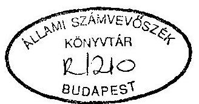
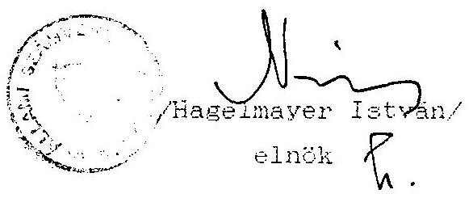

# Állami Számvevőszék

## JELENTÉS

a LUNGO DROM Érdekvédelmi Cigányszövetség Országos Szövetsége
1993. évi állami költségvetési támogatás felhasználásának ellenőrzéséről

---

A vizsgálatot vezette:
dr. Elek János
osztályvezető főtanácsos

A vizsgálatot végezte:
dr. Szávai Tamás
számvevő tanácsos
dr. Dotterweith Antal
számvevő tanácsos
Écsy Lajosné
számvevő
Tóth István
számvevő tanácsos

---

# ÁLLAMI SZÁMVEVŐSZÉK

IV. Vagyonellenőrzési Igazgatóság
$\mathrm{V}-1004-12 / 1994$.

## JELENTÉS

a LUNGO DROM Érdekvédelmi Cigányszövetség Országos Szövetsége 1993. évi állami költségvetési támogatás felhasználásának ellenőrzéséről

## I.

Az ellenőrzés körülményei, célja és módszere

Az Állami Számvevőszékről szóló, többször módosított 1989. évi XXXVIII. törvény 2. § (5) bekezdése értelmében az Állami Számvevőszék (továbbiakban: ASZ) ellenőrzi az állami költségvetési támogatás felhasználását a társadalmi szervezeteknél. Az Országgyűlés a 28/1993. (IV. 29.) OGY határozatában döntött a nemzeti etnikai kisebbségi szervezetek 1993. évi támogatásáról, meghatározva, hogy a támogatás a szervezeti és működési költségek fedezésére szolgál. E jogszabályok figyelembevételével az ASZ 1994. évi ellenőrzési terve alapján került sor az ellenőrzés lefolytatására.

A LUNGO DROM Érdekvédelmi Cigányszövetség (továbbiakban: Szövetség) 1993-ban a legnagyobb összegű állami költségvetési támogatásban részesített cigány etnikai érdekvédelmi szervezet. A Szövetség az állami költségvetési támogatás mellett szervezőtevékenységének eredményeként jelentős összegű céltámogatásokhoz is jutott. A céltámogatásokat döntően a cigányok foglalkoztatási helyzetének javítására és szociális problémáik gondozására fordították. Mindezek figyelembevételével került sor a Szövetség 1993. évi állami költségvetési támogatás felhasználásának ellenőrzésére.

Az ellenőrzés célja annak értékelése volt, hogy a Szövetség az Országgyűlés által odaítélt állami költségvetési támogatást - az Országgyűlés határozatában foglaltakra is figyelemmel - az alapszabályban megfogalmazott tevékenységi célnak megfelelően használta-e fel, ezt a célt a legkisebb eszköz-, illetve pénzfelhasználással valósította-e meg, illetve a gazdálkodásra, nyilvántartásra és beszámolásra vonatkozó jogszabályokat hogyan tartotta be.

A vizsgálat a főkönyvi könyvelés 1993. évre vonatkozó adataira terjedt ki. Az ellenőrzés a pénzfelhasználást a Szövetség Titkárságán található dokumentumok alapján vizsgálta. A helyszíni ellenőrzés 1994. március 7-től április 1-ig tartott.

---

# II.

Az 1993. évi pénzfelhasználás ellenőrzésének tapasztalatai

1. Az Országgyűlés által odaítélt állami költségvetési támogatás felhasználásának ellenőrzése
1.1. A Szövetség 1993. évben az Országgyűlés részéről 8.130.000 Ft állami költségvetési támogatásban részesült.

A Szövetség a célja szerinti tevékenység körében látja el a szolnoki Polgármesteri Hivatal megbízása alapján - a kommunális munkások foglalkoztatásával kapcsolatos feladatokat is, továbbá a Megyei Munkaügyi Központ jelentős mértékű támogatásával családsegítő és foglalkoztatási tevékenységet végez. Emellett különböző feladatokat lát el a kapott állami céltámogatások felhasználásával. A különböző címeken kapott mintegy 18.000.000 Ft támogatást és ezek felhasználását az ellenőrzés nem vizsgálta, mivel ezek függetlenek az Országgyűlés által nyújtott támogatástól.
1.2. A Szövetség 1993. évi tényleges bevétele 26.264.000 Ft volt, ebből az Országgyűlés által odaítélt állami költségvetési támogatás mértéke $8.130.000 \mathrm{Ft}(31 \%)$.

Az Országgyűlés által nyújtott támogatáson kívül bevételek jogcímei:

- pályázat útján nyert támogatások
$18.095.000 \mathrm{Ft}$
- egyéb bevételek (kamat, eszközértékesítés)
$39.000 \mathrm{Ft}$

---

A Szövetség által közölt bevételek összege pontatlan, mert az 1.133.000 Ft-tal kevesebb a tényleges bevételeknél.
1.3. Az 1993. évi Országgyűlés által odaítélt költségvetési támogatás jogcímenkénti teljeskörű felhasználásának elszámolását a Szövetség elkészítette és az Országgyűlés Emberi jogi, kisebbségi és vallásügyi bizottságának megküldte. Az elszámolás alapját képező teljeskörű számítási anyagot azonban az ellenőrzésnek bemutatni nem tudták.
A könyvvezetés hiányosságai miatt nem volt lehetőség megvizsgálni az elszámolásban feltüntetett adatok helyességét a könyvelési adatok egybevetésével. A könyvviteli nyilvántartásban kimutatott jogcímenkénti bevételek és kiadások egy része nem a tényleges állapotot tükrözi, emellett a jogcímenkénti felhasználások teljeskörűen nem állapíthatók meg.

A Szövetség Alapszabálya előírja, hogy a Szövetség az elnökség által jóváhagyott költségvetés alapján gazdálkodik. Az 1993. évi bevételeket és kiadásokat tartalmazó költségvetést az ellenőrzésnek azonban bemutatni nem tudták. Nem tekinthető éves költségvetésnek az 1993. március 27-i elnökségi döntés, miszerint 1993-ban bérekre és tiszteletdíjakra, illetve tagszervezetek támogatására 3-3 M Ft fordítható, a többi kiadás feletti döntési jogkör pedig az elnök és a főtitkár hatáskörébe tartozik.

Fentiek miatt az ellenőrzésnek az 1993. évi költségvetési támogatás felhasználásának a tervszámokkal való összehasonlítására sem volt lehetősége.

---

A beszámolóban az állami támogatás felhasználásaként 7.900.000 Ft-ot mutattak ki. Fenti összegből mindössze az elszámolás 1.1, 1.2, 4. során kimutatott 4.312.952 Ft kiadást tudták bizonylatokkal alátámasztani a helyszíni ellenőrzés idején történő gyűjtéssel.

Az ellenőrzés megállapította, hogy az elszámolásban szereplő személyi jellegű kiadások és az adóhatósággal kapcsolatos elszámolások nem a bizonylatok szerinti tényleges adatokat tartalmazzák, mert a 3. sz. mellékletben szereplő adatok elméleti számítás alapján kerültek kimutatásra. Így pl. a Szövetség elnöke a kimutatásban szereplő 12 havi illetményén felül 13. havi fizetésben, 71.100 Ft jutalomban és szabadság megváltásban is részesült.

Fentieken kívül az egyes felhasználási jogcímeken elszámolt kiadásokat nemcsak az alapszabályban meghatározott célok megvalósítása érdekében teljesítették, illetve egyes kifizetéseknél nem állapítható meg a felhasználások jogossága. Így pl.:

- 1993-ban 23 személy részére - különböző összegű - összesen 817.866 Ft kölcsönt folyósítottak több havi visszafizetési kötelezettséggel. A kölcsönfolyósítás nem tekinthető a Szövetség célja szerinti tevékenységnek.
- Személygépkocsi használat, illetve utazási költség címén 1.945.710 Ft összegű kifizetés történt. Ennek egy részénél nem állapítható meg a felhasználás indokoltsága. Kiküldetési rendelvény alapján 1.130.715 Ft-ot, költségtérítési címén - elszámolás nélkül 541.250 Ft-ot és benzinszámlák alapján - a felhasználás indoklása és a teljesítmény elszámolása nélkül - 273.745 Ft-ot fizettek ki a Szövetség pénztárából. Az összes utazási költségtérítési a Szövetség által kimutatott összes kiadás 7,8 %-a, a költségvetési támogatás felhasználásának pedig 24,6 %-a.
2. A pénzfelhasználás törvényességével kapcsolatos megállapítások
2.1. A számviteli rend ellenőrzése

A Szövetség a számvitelről szóló 1991. évi XVIII. törvény (a továbbiakban: Szt.) és a 157/1992. (XII. 4.) Korm. rendelet által előírt beszámolókészítési és könyvvezetési kötelezettségének egyszerűsített mérleg készítésével és egyszeres könyvvitel - naplófőkönyv - vezetésével tesz eleget.

Az egyszeres könyvvitel megszervezése, vezetése többségében nem felel meg a Szt. 80. §-ban foglalt előírásoknak, mert áttekinthetetlen és zárt rendszerben nem mutatja ki az eszközökben és forrásokban bekövetkezett változásokat. A pénzforgalmi könyveléshez kapcsolódó, a Szövetség vagyonalakulásának pénzügyi helyzetének megállapításához szükséges kiegészítő és analitikus nyilvántartásokat - az eszköznyilvántartás és a személyi jövedelemadó-nyilvántartás kivételével - nem vezetnek, illetve a személyi jövedelemadó analitikus nyilvántartás vezetése nem teljeskörű.

---

A számviteli nyilvántartások céljára és a beszámoló alátámasztására szolgáló bizonylatok körét és azok legfontosabb alaki és tartalmi követelményeit bizonylat szabályzatban meghatározták ugyan, de az abban foglalt előírásokat többségében nem tartották be.

A Szövetség számviteli feladatait ellátó gazdasági szervezet 1 fő irodavezetőből és 1 fő könyvelőből áll. A könyvelő nem rendelkezik legalább középfokú könyvelői képesítéssel, így a 10/1993. (IV. 9.) PM. számú rendeletben előírt képesítési követelményeknek nem felelt meg a foglalkoztatása.

A könyvvezetési kötelezettség teljesítésének ellenőrzése kapcsán az alábbi észrevételeket lényegesnek kell tekintetnünk:
a: A jelentés 1.3 pontjában szereplő nagyösszegű kölcsönfolyósítások egy részét, összesen 316.000 Ft-ot nem a követelések között mutatták ki, hanem egyéb kiadásként könyvelték el. Ugyanakkor a visszafizetések összegéből 503.000 Ft-ot a követelések csökkentése helyett az egyéb bevételek között szerepeltettek.

Magánszemélytől felvett 125.000 Ft kölcsönt tartozásként nem mutatták ki, visszafizetését pedig az egyéb kiadások jogcímre könyvelték. További 85.000 Ft kölcsönfelvételt bevételként könyveltek el.

Az 1992. évi kölcsön-igénybevételek és kölcsönnyújtások év végi egyenlege a naplófőkönyv nyitó adatai között nem

---

szerepel. Emiatt és az 1993. évi helytelen könyvelések miatt a naplófőkönyvből nem állapítható meg az 1993. év végi hiteltartozások és követelések pontos összege.
b. Több esetben nem tartották be a Szt. 33. §-ának azon előírását, hogy a készpénzforgalmat érintő bizonylatok adatait késedelem nélkül, a pénzmozgással egyidejűleg kell rögzíteni a könyvelésben. Az ellenőrzés az alábbi esetekben állapította meg a Takarékbank Rt-től felvett házipénztár ellátmányok késedelmes pénztári bevételezését, illetve könyvelését:

| Felvett összeg   (Ft) | Felvétel | Pénztári bevételezés |
| :--: | :--: | :--: |
| 150.000 .- | január 12. | január 25. |
| 50.000 .- | január 21. | január 25. |
| 50.000 .- | március 16. | március 16. |
| 1.000.000 .- | szeptember 16. | szeptember 21. |
| 150.000 .- | szeptember 20. | szeptember 21. |
| 300.000 .- | december 3. | december 6. |
| 560.756 .- | december 22. | december 27. |
| 106.374 .- | december 23. | december 27. |
| 525.558 .- | december 26. | december 29. |

A készpénzforgalom könyvelésével kapcsolatos további észrevétel, hogy több esetben a napi készpénzkiadások meghaladták a rendelkezésre álló készpénz összegét. Így pl. 1993. április 30-án - 94.250 Ft, július 2-án 284.984 Ft és december 31-én - 28.799.30 Ft negatív egyenleget mutatott a napi záró készpénzállomány.

---

Fentiekkel kapcsolatban elfogadható magyarázatot nem tudtak adni, annak ellenére, hogy a Szövetség házipénztárkezelési szabályzata előírja pénztári eltérés esetén jegyzőkönyv felvételét, a többlet bevételezését és a hiány kiadásba helyezését.
c. A naplófőkönyvben kimutatott munkabéreket terhelő levonások, a Szövetség által fizetendő TB járulék összege és azok teljesítése a könyvelési adatokból az alábbiak miatt nem állapítható meg:

- A munkavállalóktól levont 10 %-os és a Szövetséget terhelő 44 %-os társadalombiztosítási járulék tartozásokat, valamint a SZJA, munkavállalói hozzájárulás és egyéb levonásokat a tartozások között nem különítik el és teljeskörűen sem tartják nyilván azokat. A Szövetséget terhelő társadalombiztosítási tartozás, nyilvántartás hiányában nem állapítható meg. A havi társadalombiztosítási bevallásokat sem tudták teljeskörűen bemutatni.
- A tartozások kifizetését sem lehetett a könyvelési adatok alapján jogcímenként megállapítani, mivel a levont 10 %-os TB járulék kifizetését teljes egészében a közterhek között könyvelték el és előfordult, hogy SZJA tartozás kiegyenlítését is a fenti jogcímen könyvelték el.

# 2.2. A bizonylatrend ellenőrzése

A Szövetség a Szt. előírásaival összhangban teljeskörűen szabályozta az alkalmazandó számviteli bizonylatok körét és

---

azok tartalmi előírásait, valamint kijelölte a szigorú számadási kötelezettség alá tartozó bizonylatokat.

A vizsgálat tapasztalatai alapján az ellenőrzés megállapította, hogy a megfelelő szabályozás ellenére a bizonylatok mintegy 60 %-ban nem felelnek meg a számviteli bizonylat követelményeinek.
a. A pénztári be- és kifizetéseket, valamint a banki átutalásokat a Szövetség alapvetően az annak alapjául szolgáló bizonylatok alapján eszközli. Kivételt képeznek ez alól a tiszteletdíjak, egyes megbízási díjak és a nem utazással összefüggő költségtérítések. Ezek kifizetése mellől ugyanis minden esetben hiányzik a kifizetés alapjául szolgáló alapbizonylat.

Pl. - 1993. június 3-án az 523.486 sz. kiadási pénztárbizonylaton 80.000 Ft tiszteletdíjat fizettek ki alapbizonylat nélkül.

- 1993. augusztus 4-én az 598.640 sz. kiadási pénztárbizonylaton 20.000 Ft tiszteletdíjat és 3.000 Ft költségtérítést fizettek ki alapbizonylat nélkül.

A kiadási pénztárbizonylatok kiállítása során a munkabér-kifizetések kivételével nem tartják be a tartalmi követelményeket. A kiadási pénztárbizonylatokról ugyanis gyakran hiányzik a pénzfelvételére jogosult személy megnevezése és a felvevő aláírása.

Pl. - A 1.076.040 sz. kiadási pénztárbizonylaton 14.426 Ft üzemanyagszámla alapján számoltak el benzinköltséget, a bizonylatról hiányzik a felvételre jogosult neve és a felvételt igazoló
 aláírás.

---

- A 2.211.266. sz. kiadási pénztárbizonylaton 17.764 Ft benzinszámlát fizettek ki; a kiadási pénztárbizonylatról hiányzik a felvételre jogosult neve és a felvétel tényét igazoló aláírás.

Ez a gyakorlat annál inkább kifogásolható, mivel a Szövetség pénzkezelési szabályzata is előírja, hogy pénzt kifizetni csak a felvételre jogosult személy részére lehet. Más személy csak meghatalmazással vehet fel pénzt. A Szövetség kiadási pénztárbizonylatainak kb 50%-áról nem állapítható meg, hogy a felvételre jogosult vette-e fel a pénzt.

A Szövetség 1993. február 22-én a 155.659. sz. kiadási pénztárbizonylaton 17.600 Ft-ot fizetett ki aranygyűrű vásárlására; az aranygyűrű sorsára vonatkozó dokumentumot az ellenőrzésnek bemutatni nem tudták. Az irodavezető szóbeli nyilatkozata szerint azt a Szövetség alelnöke kapta meg.

A Szövetség az alapszabály alapján önálló jogi személyiséggel rendelkező helyi szervezeteket, a nekik átadott támogatással elszámoltatja. Az elszámolás a felhasználás alapbizonylatái alapján történik, azokról a központ fénymásolatot készít.
b. A Szövetség külföldi kiküldetéssel összefüggő költségeinek fedezetére 650.400 Ft értékben vásárolhatott volna konvertibilis valutát, a 36/1991. (XII. 20.) Ft rendelet előírásai szerint. Ennek ellenére a Szövetség a legális valuta vásárlás lehetőségével nem élt. Ugyanakkor megállapítható, hogy két alkalommal (1993. május 4. és

---

1993. szeptember 6.) összesen 63.676 Ft-ot fizettek ki két személy turista valutakeretéből történő valutavásárlásra. A valuta felhasználásáról, az esetleges hivatalos külföldi utazásról jogszabályban előírt elszámolás nem készült. A valuta felhasználására vonatkozó dokumentumot az ellenőrzésnek bemutatni nem tudtak.
c. Az utazási költségek elszámolásánál sorozatosan ismétlődő szabálytalanságokat követtek el, mint:

- 273.745 Ft-ot fizettek ki benzinszámlák alapján úgy, hogy a felhasználás indokoltságát igazoló útvonalnyilvántartást nem vezettek. A számlákról az esetek mintegy 90%-ában nem állapítható meg, hogy milyen rendszámú gépkocsiba tankoltak. Előfordult az is, hogy 2 db benzinszámlát kétszer fizettek ki. 1993. március 8-án a 2.211.170. és a 2.211.171. sz. pénztár kiadási bizonylaton is kifizették az alábbi benzinszámlák összegét.

1993. márc. 1. 443.363. sz. számla
40 1. benzin, olaj, fagyálló 4.115 Ft
1993. márc. 10. 443.376. sz. számla
40 1. benzin, olaj, fagyálló 2.860 Ft

Összesen:
6.975 Ft

- Egy személy részére útnyilvántartás vezetése nélkül havi 15.000 Ft, összesen 180.000 Ft gépkocsihasználatot fizettek ki átalányjelleggel.

---

- A kiküldetési rendelvénnyel és útvonalnyilvántartással kifizetett útiköltség-elszámolások esetében a kiküldetési rendelvények kiállítása többségében nem felelt meg a tartalmi követelményeknek. Azokról ugyanis rendszerint hiányzik az elrendelő aláírása, a teljesítés igazolása és a kiküldő szerv bélyegzője. Ezekben az esetekben azonban a költségek kiszámítása a vonatkozó előírások szerint történt.
d. A személyi jövedelemadó-köteles kifizetések nyilvántartásával, bevallásával és befizetésével kapcsolatos kötelezettségének a Szövetség nem tett maradéktalanul eleget. Teljeskörű nyilvántartást csak a munkaviszonyból származó kifizetésekről vezettek. Munkaviszonyon kívül azonban tiszteletdíj, megbízási díj, költségtérítési, segély, ajándék címén 56 személynek 2.933.048 Ft személyi jövedelemadó-köteles nettó kifizetés történt. Ebből azonban egyéni nyilvántartás 1.156.426 Ft-ról, 13 fő esetében készült. Év végi adatot is csak az utóbbi esetekben szolgáltattak adóbevallási célra. Ezekből az összegekből a kifizetéskor adóelőleget még a havi rendszerességű megbízási díjak esetében sem vontak le. Egy részét év végén visszabruttózítatták és az adóbevallás készítéséhez kiadott igazolásokon úgy tüntették fel, mintha abból adóelőleget vontak volna.

Fl. - A Szövetség irodavezetőjének év közben kifizetett nem munkabér jellegű kifizetésből nettó 60.000 Ft-ot az adatszolgáltatáshoz mint bruttó 92.304 Ft adóköteles kifizetést mutattak ki, amiből 32.304 Ft adóelőleget vontak le.

---

- A Szövetség alelnökének év közben különböző jogcímeken kifizetett összegből nettó 55.426 Ft-ot az adatszolgáltatáshoz mint 128.770 Ft adóköteles kifizetést mutattak ki, amiből 43.344 Ft adóelőleget vontak le.

Az adóbevallás elkészítéséhez adott adatszolgáltatásokban 6 személy esetében összesen 589.426 Ft nettó kifizetést tüntettek fel úgy, mintha az 953.378 Ft bruttó kifizetés lett volna, amiből 363.952 Ft adóelőleget vontak le. Ez az adat azonban nem egyezik meg a naplófőkönyv adataival. A naplófőkönyvben ugyanis 4 személy esetében összesen 189.300 Ft nettó kifizetés visszabruttózítása történt meg 304.704 Ft bruttó kifizetésé, amiből 115.404 Ft adóelőleg levonás történt.

Ezzel a hibás adatszolgáltatással a Szövetség az adóhatóságot megtévesztette, mert 248.548 Ft-tal több levont személyi jövedelemadó összeget mutatott ki, mint amit könyvvitele tartalmaz.
e. A társadalombiztosítási-járulék köteles kifizetések nyilvántartásával, bevallásával kapcsolatos kötelezettségének a Szövetség nem tett maradéktalanul eleget. Az eseti és rendszeres megbízási díjak kifizetéséhez kapcsolódó 1975. évi II. tv. előírásait figyelmen kívül hagyva, a megbízási díjakból az egészségbiztosítási és nyugdíjjárulékot nem vonta le. Ezen kifizetések után a munkáltatót terhelő 44%-os járulékfizetési kötelezettséget sem írta elő.

---

# 3. Más szervek által végzett vizsgálatok 

A Szövetségnél az Adó- és Pénzügyi Ellenőrzési Hivatal Jász-Nagykun-Szolnok megyei Igazgatósága 1993. szeptemberében ellenőrzést végzett. Az ellenőrzés során megállapította, hogy a Szövetség nem tartotta be az 1989. évi XLV. törvény előírásait. Adóbevallási, adóelőleg levonási kötelezettségének nem tett maradéktalanul eleget. Megállapította továbbá, hogy a számviteli rend és bizonylati fegyelem előírásait megsértette.

Az APEH ellenőrzés megállapításai alapján felhívta a Szövetséget a számviteli rend betartására. Mindezek ellenére 1993-ban az APEH által megállapított hiányosságok ismétlődtek.

## 4. Menetközben tett intézkedések

A Szövetség elnöke a helyszíni ellenőrzés alatt, annak tapasztalatai alapján a könyvelő munkaviszonyát megszüntette, és mérlegképes könyvelő képesítésű szakembert bízott meg a könyvelői feladatok ellátásával és a korábbi hibák kijavításával.

## III.

## Összefoglalás, javaslatok

A Szövetség 1993-ban a könyvviteli adatok szerint 26.264.000 Ft felhasználható pénzforrással rendelkezett. Ebből az összegből 31%-ot tett ki az Országgyűlés által 1993-ban odaítélt 8.130.000 Ft állami költségvetési támogatás. A fennmaradó

---

összeget, 18.134.000 Ft-ot a cigányság foglalkoztatási gondjainak enyhítésére, szociális gondozóhálózat kiépítésére, és egyéb, a cigányság érdekeit szolgáló célprogramokra fordították.

A Szövetség az állami költségvetési támogatást 9.61%-ban nem saját működésére, hanem szociális segélyezésre fordította a könyvelés dokumentumai szerint.

A Szövetség pénzfelhasználása során a takarékos gazdálkodás nem érvényesült maradéktalanul. Ezt bizonyítja a források nagymértékű kölcsönadása és az a körülmény, hogy az utazási költségelszámolásban jelentős nagyságrendben szerepelnek ellenőrizhetetlen felhasználású benzinszámlák.

A pénzfelhasználás során könyvviteli és számviteli szabályokat a jelentésben részletezettek szerint nagymértékben figyelmen kívül hagyták. A hiányosságok kialakulásában alapvető szerepet játszott, hogy a Szövetség gazdasági eseményeinek könyvelésére megfelelő végzettséggel nem rendelkező könyvelőt alkalmaztak. Szándékos visszaélés gyanúja az ellenőrzés során nem merült fel.

A hiányosságok kiküszöbölésére érdekében a helyszíni vizsgálat időszakában új, megfelelő végzettségű könyvelő alkalmazására került sor a Szövetségnél.

A jelentésben megállapított jogszabálysértések miatt az Állami Számvevőszék a Szövetség elnökének személyes felelősségét állapította meg, mert:

- Nem tett eleget a számvitelről szóló 1991. évi XVIII. tv. könyvvezetésről és a bizonylati fegyelemről szóló előírásainak

---

(83. és 85. §). Emiatt a Szövetség könyvelése áttekinthetetlen és nem teljeskörű.

- A jelentés 2.2/e. pontjában megállapított 6.975 Ft összegű, 2 db benzinszámla kifizetését kétszer utalványozta, és ezzel 6.975 Ft összegű szabálytalan kifizetés történt a házipénztárból.
- A Szövetség a személyi jövedelemadó-köteles kifizetésekhez kapcsolódó bevallási, adóelőleg levonási és kifizetőhelyi adatszolgáltatási kötelezettségének a jelentés II./2/d. pontjában foglaltak szerinti mértékben nem tett eleget. Ezzel a költségvetésnek adóbevétel kiesést okozott, illetve helytelen adatszolgáltatásával az Adóhatóságot megtévesztette.
- A jelentés 2.1/c. pontjában leírtak szerint a Szövetség nyilvántartásaiból nem állapítható meg a munkabéreket terhelő társadalombiztosítási tartozások összege. A jelentés 2.2/e. pontjában megállapítottak szerint a megbízási díjak után a többször módosított 1975. évi II. tv. 103. és 103/A §-ának előírásaitól eltérően nem vonták le a 10%-os egészségbiztosítási és nyugdíjjárulékot, és ezzel összefüggésben a 44%-os társadalombiztosítási járulék fizetési kötelezettségét sem írták elő.

Az ellenőrzés a Szövetség elnökétől az Állami Számvevőszékről szóló 1989. évi XXXVIII. tv. 23. §-a előírása szerint írásbeli magyarázatot kért.

Magyarázatában a Szövetség elnöke előadta, hogy a könyvelői feladatok ellátására a Jász-Nagykun-Szolnok megyei Munkaügyi Központtól kértek, és kaptak embert. Ezért fel sem merült ben-

---

nük, hogy a kiközvetített személy megfelelő képzettséggel nem rendelkezik, és munkáját nem megfelelően végzi. Az ellenőrzés során szerzett tapasztalatok alapján pedig elnöki jogkörében eljárva gondoskodott megfelelő képzettségű könyvelő alkalmazásáról. Utasította a könyvelőt, az 1993. évi gazdasági események újrakönyvelésére, és a személyi jövedelemadó és társadalombiztosítási kötelezettségek korrigálására. A kétszeres kifizetett 6.975 Ft-ot pedig a felvevő a pénztárba befizette.

Az ellenőrzés megállapításaira való tekintettel - személyes felelősség érvényesítésének mellőzésével - szükségesnek tartja a jelentést tájékoztatás és hasznosítás céljából megküldeni a Legfőbb Ügyészségnek, a II. fejezet 2.2.d. pontjában leírt szabálytalanságok miatt az Adó- és Pénzügyi Ellenőrzési Hivatalnak, valamint a jelentés II. fejezet 2.2.e. pontjában leírtak miatt az Egészségbiztosítási és Nyugdíjbiztosítási Önkormányzatoknak.

A jelentésben megfogalmazott tapasztalatok alapján javasolja az ellenőrzés a Szövetségnek, hogy:

- A számviteli rend helyreállítására a Szövetség elnöke tegye meg a szükséges intézkedést.
- Intézkedni kell a jelentés 2.2/c. pontjában megállapított kétszeres kifizetés kivizsgálásáról és a szabálytalan pénzfelvétel visszafizetéséről.
- A hivatalos célú hivatali és saját gépjárművek költségelszámolásának feltételeit az érvényes jogszabályi előírásokkal összhangban kell szabályozni.

---

- A hivatalos külföldi kiküldetésekhez a Szövetségek jogszabályban biztosított valutakeretét használják fel.
- A személyi jövedelemadó-köteles kifizetések és a társadalombiztosítási kötelezettségek nyilvántartását vizsgálják felül, és tegyék meg a szükséges intézkedéseket a törvényes állapot helyreállítására.

Budapest, 1994. június

