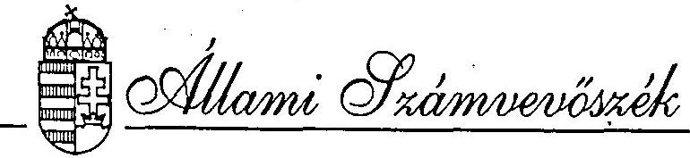
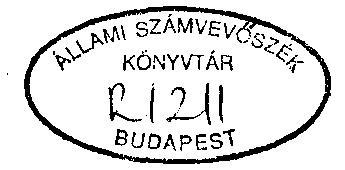
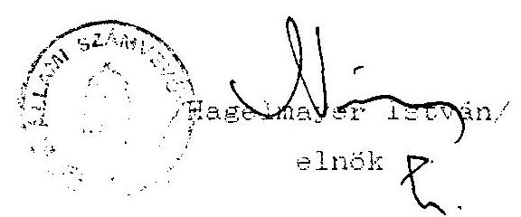

#  

## JELENTÉS

a Cigány Ifjúsági Szövetség
1993. évi állami költségvetési támogatás felhasználásának ellenôrzésérôl

---

A vizsgálatot vezette:
dr. Elek János
osztályvezető főtanácsos

A vizsgálatot végezte:

| Berzétey Attiláné | számvevö tanácsos |
| :-- | :-- |
| Hoffmann István | számvevö |

---

# ALLAMI SZAMVKVOSZEK 

IV. Vagyonellenőrzési Igazgatósáa
$\mathrm{V}-1004-12 / 1994$.

## J E L E N T E S

a Cigány Ifjúsági Szövetség
1993. évi állami költségvetési támogatás
felhasználásának ellenőrzéséről

## I.

A vizsgálat körülményei, célja, módszere

1. Az Állami Számvevõszékröl szólo, többször módositott 1989. évi XXXVIII. törvény 2. § (5) bekezdése értelmében a társadalmi szervezeteknek juttatott állami költségvetési támogatás felhasználását az Állami Számvevõszék (továbbiakban: ASZ) ellenörzi.

A Magyar Köztársaság 1993. évi költségvetéséről szólo 1992. évi LXXX. törvény a nemzeti és etnikai társadalmi szervezetek müködési költségei fedezetére 220.000 .000 Ft-ot hagyott jóvá. Az összeg felosztásáról az Országgyülés 28/1993. (IV. 29.) GGY határozatában döntött, amely szerint - az Országgyülés Emberi jogi, kisebbségi és vallásügyi bizottságának javaslata alapján - a Cigány Ifjúsági Szövetsėg (továbbiakban: CISZ. vagy Szövetség) 1993. évi müködési költségeihez 3.450 .000 Ft-tal járul hozzá. E rendelkezések figyelembevételével került sor - az ASZ 1994. évre jóváhagyott ellenörzési terve alapján - az ellenörzés lefolytatására.

---

Az ellenőrzés a CISSz részére 1993. évre jóváhagyott állami költségvetési támogatás felhasználását a Szövetség köspontjában (Budapest, 1133. Váci út 90.) ellenőrizte, mivel a szervezetnek nincsenek nyilvántartott - önálló jogi személyiséggel rendelkezo - területi szervezetei.

Az ellenőrzés célja annak értékelése volt, hogy a CISS az állami költségvetési támogatást - az Országgyülés határozatában foglaltakra is figyelemmel - az alapszabályában megfogalmazott tevékenységi célok megvalósítása érdekében használta-e fel: a kitüzött célokat a költségek lehető legkisebb szintre való szorításával, minimális ráfordítással érte-e el. Az ellenörzés vizsgálta, továbbá azt is, hogy a pénzfelhasználás a társadalmi szervezetekre vonatkozó hatályos törvények elöirásainak betartásával történt-e.
2. Az ellenőrzés a lezárt 1993. gazdálkodási évre terjedt ki. A helyszini szúrópróbaszerũ ellenőrzés 1994. március 7 -től március 17 -ig tartott. A fenti időpontban a vizsgált szervezet 1993. évre vonatkozó gazdálkodási információi, az éves költségvetés teljesítéséről szóló beszámoló nem állt teljeskörüen az ellenőrzés rendelkezésére (a beszámoló elkészitésének határideje legkésőbb május 31-e).
II.

1. A CISSZ 1993. évi tényleges pénzfelhasználásának értékelése
1.1 A Szövetség az Országgyülés Emberi jogi, kisebbségi és vallásügyi bizottságához 1993. január 29-én benyújtott pályázat mellékletét képező költségvetés-tervezetében 8.000 .000 Ft

---

költségvetési támogatási igényt, valamint 6.200 .000 Ft egyéb bevételt (céltámogatás) jelzett. A benyújtott költségve-tés-tervezet kiadási oldalának jogcím szerinti bontása nem a bizottság által elöírt tartalommal készült, igy pl. a programok költségét nem bontották fel költségnemek szerint. Ezen kivül nem részletezték az összes kiadáson belül az állami költségvetési támogatás tervezett felhasználásának jogcímeit. 1992. év végén fennálló 2.442 .148 Ft tartozás helyett csak 600.000 Ft-ot tüntettek fel.

A pályázathoz mellékelt szöveges programtervezet részletesen, havi bontásban sorolja fel az egyes kiadási tételekhez kapcsolódó közmũvelődési, érdekképviseleti és szociális jellegũ programokat.

A Szövetség a jóváhagyott 3.450 .000 Ft mũködési célú állami költségvetési támogatáson felül végül 1.930 .000 Ft céljellegũ támogatást is kapott különbözö szervezetektöl.
1.2 A Szövetség az Országgyülés határozatában megitélt költség vetési támogatás felhasználására végleges költségvetést nem készített, azt az alapszabályban elöirt módon, a Titkárság nem is hagyta jóvá. A Titkárság 1993. április 2-i üléséröl készült jegyzőkönyv költségterv nélkül, általános megfogalmazásban rögziti a végrehajtható legszükségesebb feladatokat. Ezek: Pedagógus Kamara müködtetése, Iskolapolgár Alapítvánnyal közös program, ösztöndijak juttatása, képzömüvészeti alkotások vásárlása, vitafórumok, egyeztető tárgyalások a kisebbségi és közoktatási törvényröl.

---

A Szövetség tényleges pénzfelhasználását az ASZ a fenti titkársági jegyzőkönyv, valamint az Országgyülés Emberi jogi, kisebbségi és vallásügyi bizottsága részére, 1994. január 21-én készített beszámoló és "tájékoztató gazdálkodási adatok", valamint a naplófökönyv és az analitikus nyilvántartások alapján vizsgálta.

A Szövetség által - . . aplófökönyvi adatok alapján - összeállított "tájékoztató gazdálkodási adatok" ellenőrzése - a bérköltség kivételével - csak a naplófökönyv adatainak tételes kigyűjtésével volt lehetséges, mivel az összeállításhoz számítási anyag nem állt rendelkezésre. A Szövetség különböző tervezett programjaira fordított összegek az egyes költségnemek (anyag, szeme yi és egyéb költségek) között szerepelnek, azok elkülönített gyüjtése nem történt meg. Ezért a kiadások költségnemenkénti szerkezetét csak azok összességében lehetett elemezni:

Eszközbeszerzés (áruvásárlás) címén a Szövetség 1993. évben 1.385 .520 Ft-ot fizetett ki, az alábbi összetételben:

| képvásárlás | 900.000 Ft |
| :-- | --: |
| grafikai album készítése | 400.000 Ft |
| cigány népviselet vásárlás | 30.000 Ft |
| elektronikus hangszer vásárlás | 55.520 Ft |

összesen: $\quad 1.385 .520 \mathrm{Ft}$

A tárgyi eszközök beszerzésére fordított összea a juttatott költségvetési támogatás $40,2 \%$-át teszi ki.

---

Bérköltségként 2.092 .860 Ft-ot, a költségvetési támogatás $60.7 \%$-át számoltak el, amely összeg a Szövetség központi irodájában foglalkoztatott 5 fő munkabérét, 2 fó tiszteletdiját, valamint a munkavégzésre irányuló egyéb jogviszony keretében foglalkoztatottak dijazását tartalmazza. A Szövetség közterhet (társadalombiztosítási járulék, személyi jöve delemadó, munkavállalói és munkáltatói járulék) nem fizetett, ezért a tényleges (nettó) bérkiadás csak 1.318 .723 Ft, a költségvetési támogatás $38,2 \%-a$.

Hivatali célú magángépjármú használat címén - egy személy részére - munkábajárás és városi közlekedés, ügyintézés címén havonta rendszeresen fizettek térítést, összesen 207.630 Ft értékben. A Szövetség ugyanakkor havonta - április hó kivételével - belföldi útirendelvénnyel elszámolt hivatalos célú utakra is kifizetett - összesen 288.148 Ft költségtérítést.

A Szövetség 2 ízben vett igénybe bérelt XX-es rendszámú gépjárművet, ennek összes költsége - benzinköltséggel együtt 273.963 Ft volt. Taxihasználat cimen összesen 17.677 Ft költség merült fel. A Szövetség végsősoron személygépjármú használatra 1993. évben mindösszesen 787.418 Ft-ot számolt el költségei között, amely az éves költségvetési támogatás $22,8 \%$-a. Utazási költségként külföldi utazások kapcsán Ft-ban kifizetett vasúti jegy, biztosítás stb. ellenértekeként a fentieken kivül 145.850 Ft-ot fizettek ki.

A Szövetség testvérszervezeteknek (tagszervezeteknek) is alapítványoknak a naplófökönyv adatai szerint - a tájékoztató gazdálkodási adatok c. elszámolásban szereplö 594.000 Ft-tal ellentétben - közvetlenül csak 194.000 Ft-ot utalt át

---

támogatásként 1993. évben, összesen 10 címzett részére (pl. MCKSZ Makó és Nagykanizsa, Amalipe, Pro-Fitt Alapítvány, Martin Luther King Alapítvány), amely szervezetek önálló jogi személyiséggel rendelkező egyéb cigány kulturális egyesületek, szervezetek, alapítványok, iskolák.

A CIEZ 1993. évi tényleges pénzügyi helyzetének elemzése azt mutatja, hogy a Szövetség az évet 847.963 Ft pénzkészlettel és 4.519 .846 Ft - az előző évek során felhalmozott - tartozással zárta.

A naplófőkönyv, valamint a bizonylatok alapján kigyüjtött adatok figyelembevételével összegezve megállapítható, hogy a Szövetség a részére juttatott 3.450 .000 Ft költségvetési támogatást az egyetemes cigány nemzeti és etnikai kultúra, érdekképviselet és oktatás alapszabályban megfogalmazott céljainak elérése érdekében használta fel. Az ellenörzés megállapítása szerint azonban a Szövetség gazdálkodását és pénzfelhasználását nem jellemezte a célszerüség és a takarékosság.
2. A pénzfelhasználás törvényességével kapcsolatos megállapítások
2.1. A Szövetség müködésének és gazdálkodásának rendjét az Alapszabály, valamint a Szervezeti és Müködési Szabályzat rendelkezései rögzítik. Az Alapszabály szerint a Szövetség legfőbb szerve a Közgyülés, amely 3 évre megválasztja a Titkárságot. A Titkárság ( 5 taglétszámú testület), választ-

---

ja meg a titkárt, aki a Szövetség szabályszerű pénz- és vagyonkezeléséért személyi és anyagi felelősséggel tartozik. A gazdálkodás szabályszerűségének ellenőrzése a 3 tagú Ellenőrzö Bizottság feladata.

A Szervezeti és Müködési Szabályzat (SzMSz) szerint a Szövetség felelős egyszemélyi vezetője a főtitkár, helyettese az ügyvezető igazgató. A Szövetség gazdálkodási feladataira vonatkozó jogszabályok előirásainak érvényesítéséről a gazdasági vezetö gondoskodik. A Szövetség szervezeti egységei az országos apparátus, a gazdasági, valamint az oktatási és közmüvelődési, szervezési osztály.

Az említett szabályzatok nincsenek egymással összhangban, egymástól eltérő fogalmakat tartalmaznak, a Szövetség szervezeti felépítése - amelyről az egyesülési jogról szóló többször módosított 1989. évi II. törvény elöirása szerint az alapszabályban kell rendelkezni - nem azonos az Alapszabályban és az SzMSz-ben.
2.2. A Szövetség nem alakította ki a számviteli törvényben elöirtaknak megfelelően a teljes pénzforgalmát zárt, az elszámolások ellenőrzését biztosító formában tartalmazó számviteli nyilvántartásait. Hiányoznak a pénzgazdálkodással, a pénzkezeléssel kapcsolatos előirások (házipénztár kezelése), a költségtérítésben (gépjármúhasználat), valamint tiszteletdijban részesülök köre és díjazásának mértéke. Nincs szabályozva a pénzmozgásokkal kapcsolatos bizonylati rend, a szigorú számadási kötelezettség alá vont nyomtatványok köre. Az SzMSz az aláirási és munkáltatói jogkör rög-

---

zitésén túl osak a fôtitkár, az ügyvezető igazgató és a gazdasági vezetö feladatkörének leirását tartalmazza.

Gazdasági vezetö nincs, a Szövetség pénzforgalmi könyvelését mellékfoglalkozási jogviszonyra kötött szerzödés alapján foglalkoztatott könyvelö végzi, akinek szakmai képzettsége nem felel meg a 10/1993. (IV. 9.) PM rendelet 26 § (2) bekezdésében elöirt feltételnek.
2.3. A Szövetség könyvvezetési kötelezettségének az egyszeres könyvvitel alkalmazásával tesz eleget. Fénzeszközeiröl és azok forrásairól, valamint az azokban beállott változásokról naplófökönyv vezetésével ad számot. Az ehhez szükséges kiegészitő és analitikus nyilvántartásokat hiányosan vezeti, tárgyi eszközeiről nyilvántartása nincs, az egyszerüsitett mérleg egyes tételeinek megalapozásához szükséges leltárral egyáltalán nem rendelkezik, igy egyszerüsitett mérlegének elkészitéséhez a számviteli törvényben, illetöleg a társadalmi szervezetek éves beszámolókészitésének és könyvvezetési kötelezettségének sajátosságairól szóló 157/1992. (XII. 4.) Kormányrendeletben elöirt feltételei. hiányoznak.

A könyvvezetés alapját képezõ alapbizonylatok igen syakran nem felelnek meg a számviteli törvényben foglalt alaki és tartalmi elöirásoknak. A bizonylatokról hiányzik a bizonylat megnevezése és sorszáma, a bizonylatot kiállitó megielölése, a gazdasági müveletet elrendelö személy aláírása, a kifizetés jogosságának elismerése és engedélyezése (utalványozás) a gazdasági müveletek tartalma, a kifizetés jogc:me, a pénz felvevöjének alírása stb. Kiadásként könyveinek

---

pl. a naplófökönvoben 35.000 Ft-ot az átvételt igazoló aláírás nélküli "nyilatkozat" alapján. Költségátalány kifizetésére került sor olyan "díszpozíció" alapján, amelyhez kapcsolódó testületi döntés, engedélyezés nem lelhető fel. Bizonylatként kezelnek pl. élelmiszerbolti pénztárblokkokat, taxi és egyéb számlákat, postai feladóvevényeket, vagy OTP csekkeket, amelyek mellett az összegek rendeltetésére vonatkozó feljegyzés sem szerepel. Ezért gyakran a naplófơkönyv "szöveg" rovata kitöltetlen, a könyvelés pontatlan. A naplófőkönyv egyes tételei nehezen egyeztethetőek a bizonylatokkal, ugyanis a bizonylat számaként vagy a számla tömbsorszáma, a belföldi útirendelvény sorszáma, stb. szerepel, vagy nincs is bizonylatszám, pl. közértpénztárblokkok esetében. A könyvelés alapját képező bizonylatokat általában a kiadás idópontja szerint, havonta elkülönített borítékokban gyüjtik, azonban azokat még csak be sem sorszámozzák.
2.4. A Szövetség a személygépjármú hivatalos célú használatát, űzemanyag felhasználásának elszámolását, ezzel összefüggésben a költségtérítés kifizetését, nyilvántartását nem a zozúti gépjármúvek üzemanyag és kenőanyag fogyasztásának igazolás nélkül elszámolható mértékéről szóló 60/1992. (IV. 1.) Kormányrendeletben, illetőleg a személyi jövedelemadóról szóló törvényben foglaltak szerint eszközölte. A költségtérítésben részesülő személy útvonalnyilvántartást nem vezetett, nem rendelkeztek a kormányrendelet 5. S-ában elöirt, az adóévre szóló megállapodással, az elszámolás egy 1992. évre szóló megállapodás alapján történik, amely megállapodáson a munkáltató aláírása nem is szerepel. Nincs írásbeli megállapodás a munkába járás és városi közlekedés, illetőleg ügyintézés címén rendszeresen felvett költségté-

---

ritésről sem. Nyilvántartás (útnyilvántartás, munkában töltött napok) hiányában ezen összegek felvételének jogossága, illetőleg összevonandó jövedelmet képező bevétel aránya nem állapítható meg.

A belföldi kiküldetési rendelvények kitöltése hiányos, pl. hiányzik az engedélyező és az elszámoló aláírása.
2.5. Külföldi kiküldetésre - a naplófőkönyv tanúsága szerint két izben került sor, mindkét esetben a Müvelődési és Közoktatási Minisztérium szervezésében. Az utazással kapcsolatosan felmerült költségeket a minisztérium számlázta ki, forintban, vasúti jegy és biztosítás jogcimen.
2.6. A Szövetség vezetett analitikus nyilvántartást a személyi jövedelemadó, a munkáltatói és munkaadói járulék, a társadalombiztosítási járulék, a nyugdij- és egészségbiztosítási járulék fizetési kötelezettségéről. A bérkifizetési jegyzékekhez megbizási jogviszony esetén minden esetben osatolták a megbizási szerződéseket. Az alkalmazottakkal - az ügyvezető igazgató kivéve - minden esetben kötöttek munkazzerzödést. Az ügyvezető igazgató feladatköréről csak az SzMSz rendelkezik. A járandóságokat a bérkifizetési jegyzékek alapján, utalványozás és ellenőrzés nélkül fizették ki, esetenként az átvételt igazoló aláírás hiányzik. Bérjegyzéken kivül az I-II-III. hónapban egy személy részére tiszteletdijként fizettek ki olyan díjazást, amely valójában megbizási díj lett volna.

A személyi jövedelemadóról vezetett nyilvántartás a 2.4. pontban részletezett szabálytalanságok miatt nem pontos. a

---

havi egészségbiztosítási és nyugdijjárulék alapját és összeget tartalmazó, a társadalombiztositásról szóló 89/1990. (V. 1.) MT rendeletnek a 48/1992. (III. 13.) Korm. rendelet 71. § (20) bekezdésében megállapított VI. számú melléklete szerinti járulékelszámolási nyilvántartó lapot, amelynek alapján a dolgozók részére március 31-ig igazolást kellene kiadniuk, nem vezettek.

A Szövetség esetében évi egyszeri adóbevallási kötelezettség lehetósége áll fenn. 1993. évi bevallási kötelezettséget az adó szövetségi szintü öszzegére vonatkozóan teljesítette, a személyenkénti, összevonás alá tartozó kifizetéseket tartalmazó nyomtatvány a bevallásban nem szerepel. A munkáltatótól származó jövedelemröl és az adóelólegek levonásáról kiállított adatlapokon a dolgozó aláírása több izben hiányzik, hiányzik továbbá a magánszemélyek nyilatkozata az összevonandó jövedelmekröl, illetöleg arról, hogy önadózó, avagy a munkáltatóját bízza meg az adó elszámolásával.

A Szövetség a társadalombiztosítási járulékot nem vallotta be, a járulék bevallására szolgáló összesített elszámolást a társadalombiztosítási szervhez az év folyaman egyetlen hónapban sem nyújtották be.
2.7. A Szövetség a kifizetett munkabéreket terhelö, általa levont és bérköltségként elkönyvelt, valamint a Szövetséget terhelő, az adóhatóságot, illetőleg a társadalombiztosítást illető befizetési kötelezettségeinek nem tesz eleget. Ebböl kifolyóan 1991. évtöl kezdödően összesen 3.974 .846 Ft adós-

---

sága keletkezett, ezt növeli $1.000 .000 \mathrm{Ft}$, amelyet a cél meghiúsítása miatt az MKM részére vissza kell fizetnie.

Az ellenôrzés megállapítása szerint a jelenleg gyermekgondozási dijban részesülõ fôtitkárasszony 1969. évtől tisztségének ellátása elismeréseként a Szövetségtől rendszeres havi tiszteletdijat vesz fel, gyermekgondozási szabadsága idején is ellátja tisztségéből eredõ kötelezettségeit. Juttatása nem számít munkaviszonyból származó keresetnek. Társadalombiztosítási szakellenőrzési feladat annak megállapítása, hogy a nevezettet milyen alapon illetik meg az 1975. évi II. törvény 15 § (1) bekezdése szerinti anyasági ellátások.

A Szövetségnél ezidáig sem adó, sem társadalombiztosítási hatósági ellenőrzés nem volt.
2.8. Az Allami Számvevõszék a jelentés II. fejezetében részletezett tapasztalatai alapján megállapította a Szövetség fôtitkárának személyes felelősségét;

- a számvitelről szóló 1991. évi XVIII. törvény 83. 84. és 85. 8-aiban elöirt bizonylati elv és fegyelem megsértése miatt,
- az adózás rendjéről szóló 1990. évi XCI. törvény 25. elö3-ában irt befizetési kötelezettség elmulasztása miatt,
- a társadalombiztosításról szóló többször módosított 1975. évi II. törvény T. 103 § (1) bek. és T. 103/A 3-ában elöirt járulékbefizetési kötelezettség elmulasztása, továbbá a

---

89/1990. (V. 1.) MT rendelet 445 2-ában elöirt olszámolási és adatszolgaltatási kötelezettség elmulasztása miatt.

Az Allami Számvevöszékröl szólo 1989. évi XXXVIII. törvény 23. 3-a alapján az ASZ az elkövetett szabálytalanságokról irásbeli magyarázatot kért. Eszrevételeik azon részeit, amelyek a jelentésben foglaltakat érdemben módosító tényeket nem tartalmaztak, nem fogadtuk el.

Az ASZ fentiek miatt szükségesnek tarja megállapításait tájékoztatás és intézkedés céljából megküldeni a Legföbb Ugyészségnek, az Adó- és Pénzügyi Ellenörzési Hivatalnak, valamint az Egészségbiztosítási és a Nyugdijbiztosítási önkormányzatoknak.

# III. 

Az Allami Számvevöszék javasolja, hogy a Szövetség:

- Biztositsa az Alapszabály és a Szervezeti és Müködési Szabályzat közötti összhangot, az azokban alkalmazott fogalmak, szervezeti rend és rendelkezések tekintetében.
- Számviteli nyilvántartásait az elszámolások ellenörzését biztositó formában alakitsa ki.
= Szabályozza és tartsa be a pénzmozgásokkal kapcsolatos bizonylati rendet és fegyelmet.
= Allapitsa meg a szigorú számadási kötelezettség alá vont nyomtatványok körét.

---

= Készitsen eszközeit és forrásait ellenőrizhetō módon tartalmazó leitárt.

- Gondoskodièk pénzforgalmi könyvelésének végzésére a 10/1993. (IV. 9.) PM rendelet 26 \$ (2) bekezdésében elöirt feltételnek megfelelö szakember foglalkoztatásáról.
- Az ügyvezető igazgató munkaszerzödését a Munka Törvénykönyve 76. §-ában elöirtak szerint foglalja írásba.
- Szabályozza a tiszteletdijban, költségtéritésben részesülök körét. különös tekintettel a személygépjármü hivatalos célú használatával összefüggő szabályozásra.
- Pontositsa a személyi jövedelemadó alapjának és mértékének megállapításához szükséges nyilvántartásait.
- Vezesse a havi egészségbiztosítási és nyugdijjárulék alapjait és összeget tartalmazó járulékelszámolási nyilvántartó lapot.
- Rendezzo adótartozását, valamint társadalombiztosítási járulék bevallását és tartozását.

Budapest, 1994. június
