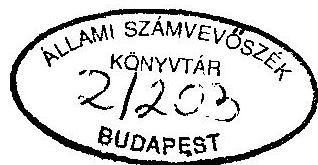
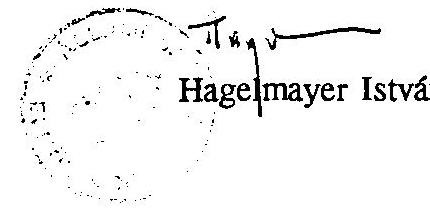

# JELENTÉS 

az önkormányzatok vagyonhasznosítási, vállalkozási tevékenységének vizsgálatáról

---

# JELENTÉS 

## az önkormányzatok vagyonhasznosítási, vállalkozási tevékenységének vizsgálatáról

Az Állami Számvevőszék az 1992. évben végzett reprezentatív ellenőrzés keretében megvizsgálta az önkormányzati tulajdon kialakulásának helyzetét. A vizsgálat az állami tulajdonnak az önkormányzati törvényben (1990. évi LXV. tv. - továbbiakban: Öt.) és a vagyonátadási törvényben (1991. évi XXXIII. tv. - továbbiakban Vt.) meghatározott átadásának alakulásán túlmenően érintette a helyi önkormányzatoknál akkor még csak helyenként tapasztalható vagyongazdálkodást is.

A vizsgálat rámutatott arra, hogy objektív (pl. jogszabályok késedelmes megjelenése) és szubjektív (pl. szakemberhiány) okokra egyaránt visszavezethetően az alkalmazott gyakorlat nem tette lehetővé az önkormányzatokat megillető vagyontárgyak teljes körű megszerzését, nyilvántartásba vételét, számviteli elszámolását. Ezért, továbbá mert vagyonrendeletet nem alkottak, a törzsvagyont nem különítették el, és az ingó- és ingatlan vagyon vagyontörvényben foglaltak szerinti leltározása nem mindenütt történt meg, az önkormányzatok mérlegének tartalma nem volt összhangban a számviteli törvényben foglaltakkal.

Az ellenőrzött önkormányzatoknál a vizsgálat idején a vagyonnal való gazdálkodás feltételeinek, a szervezet kialakításának megteremtése kezdeti stádiumban volt. E téren még nem alakult ki az önkormányzatok között a szükséges mértékủ együttmüködési készség. Az elmaradottabb területeken - elsősorban az infrastruktúra hiánya miatt - nem volt megfelelő vállalkozási kedv, a kisebb településeken pedig nem volt olyan nagyságrendű vagyon, amellyel vállalkozni lehetett volna. Mindezekre visszavezethetően a vagyongazdálkodás kezdeti jelei is csak a nagyobb településeken és ott is korlátozott módon voltak fellelhetők. Ez irányú tevékenységük elsősorban a belterületi földek, a lakás és nem lakás céljára szolgáló helyiségek értékesítésére, a gazdasági társaságokban a törvényi előírások alapján kapott részesedésekre, helyenként értékpapírok vásárlására, kötvény kibocsátására irányult.

---

# A tapasztalatokat figyelembe véve az ÁSZ 1993. II. félévében megvizsgálta, hogy az önkormányzatok 

- a ténylegesen birtokukba került vagyonnal hogyan gazdálkodnak,
- a vagyon mekkora hányadát és milyen eredménnyel hasznosítják vállalkozási célokra.

A vizsgálatba bevont önkormányzatokat a megfelelő reprezentáció biztosítása érdekében a különböző település típusokból és azon belül is a népességszám alapján kialakított négy kategóriából állítottuk össze. Elsősorban az éves költségvetési beszámolóban vállalkozási tevékenységből elért bevételt kimutató költségvetési szerveket (polgármesteri hivatalokat, intézményeket) vontuk az ellenőrzés körébe. A vizsgálat 10 megyében és a fôvárosban, 22 városra, 17 nagyközségre, 23 községre, valamint a Fővárosi Önkormányzatra és két kerületi önkormányzatra terjedt ki.

E településeken él az ország lakosságának $25 \%$-a és az ellenőrzött önkormányzatok rendelkeztek (1992. december 31-én) az ország önkormányzatainak összesített mérlegében kimutatott saját vagyon $28 \%$-ával ( 188 milliárd Ft-tal). Ebből következôen a konkrét helyi vizsgálatok megfelelő alapot nyújtanak általánosítható következtetések levonására is.

## A lefolytatott ellenőrzés tapasztalatairól a következőkben adunk számot.

Az APEH-SZTADI 1992. évi költségvetési beszámolókból készített összesítésének adatai szerint az önkormányzatoknál a mérlegben kimutatott saját vagyon növekedése 293 milliárd Ft, 79,2\%. Ezen belül kiugróan magas a részesedések - gazdasági társasági érdekeltségek, közüzemre bízott vagyon (beleértve a közmúhálózatokat és bérlakásállományt is) - 3.328\%-os 6 milliárd Ft-ról 199 milliárd Ft-ra, valamint az értékpapírok $907 \%$-os 405 millió Ft-ról 3,7 milliárd Ft-ra való növekedése. E két vagyoni kör változása képviselte az összes vagyon-növekmény kétharmadát. Ezt részben az állami vállalatok átalakulása révén kapott részesedések miatti vagyonnövekedés, valamint a tanácsi alapítású közüzemi vállalatok, az általuk kezelt közművek és bérlakásállomány önkormányzati tulajdonba kerülését követően elôírt önkormányzati nyilvántartásba vétel eredményezte. (Részletes adatokat a 3. sz. melléklet szemlélteti.) A vagyonnövekedés 1992. évben nem zárult le, egyrészt a tulajdonba vett, de mérlegben még nem szerepeltetett eszközök, másrészt az állami vállalatok 1993. évi átalakulása során kapott gazdasági társasági érdekeltségek miatt a vagyon további növekedése 1993. évben is várható.

---

A vagyonátadó bizottságok (továbbiakban: VÁB) közreműködésével történő vagyonátadás 1993.év végére csaknem teljes egészében befejeződött. Az előző évek megyénkénti több ezres ügyszámával szemben 1993-ban megyénként átlagosan már csak alig több mint 200 vagyonátadási üggyel kellett a VÁB-oknak foglalkozniuk. (Szóródás: 76-603 beadvány) A jelenleg folyamatban lévő vagyonátadási ügyek döntő része a vízmű vállalatok, a műemlék-épületek, a védett természeti területek, kisebb része a belterületi földek és egyes centrális szervek elhelyezését érintő ingatlanok átadására korlátozódik. Ezekre jellemző, hogy elintézésük a korábbiaknál bonyolultabb és több esetben a VÁB döntéssel elégedetlen felek az ügyeket bírósági útra terelték.

# 1. A vagyongazdálkodás szabályozottsága 

Az önkormányzatok 1993. év végéig az őket az Öt. vagy a Vt. alapján megillető vagyonhoz, csaknem 100\%-ban hozzájutottak, ami indokolttá és szükségessé tette, hogy a vonatkozó törvényi előírásokkal összhangban megalkossák vagyongazdálkodási rendeleteiket.

Ezzel összhangban a vizsgált önkormányzatok 80\%-a, ha jelentős késedelemmel is, de 1992. második félévében, illetve 1993. évben rendeletben szabályozott különböző vagyongazdálkodási feladatokat. A többiek a vizsgálat időpontjában csak ez irányú rendelet-tervezettel rendelkeztek, amelyeket 1994. évben terjesztenek a testületek elé.

Az elfogadott vagyongazdálkodási rendeletekre az jellemző, hogy túl általánosak, a vonatkozó törvényi előírások szövegét ismétlik és nem határozták meg a helyi sajátosságokhoz igazodó konkrét megoldásokat. Elsősorban az ingatlanokról tartalmaznak előírásokat - ami annak is következménye, hogy a központi jogszabályok is elsősorban e vagyoni körről írnak elő határozott, egyértelmű követelményeket - a vagyon egyéb összetevőivel csak elvétve foglalkoznak. Jellemző hiányosság, hogy a befektetett pénzügyi eszközökkel, vagyoni értékű jogokkal, gépek, berendezések, járművek kategóriába tartozó tárgyi eszközökkel történő gazdálkodási, hasznosítási feladatokat nem szabályozták. Az utóbbi különösen ott kifogásolható, ahol jelentősebb egészségügyi intézmények, jól felszerelt szakközépiskolák, szakmunkásképző intézetek is működnek és ezek számottevő értéket képviselő géppel, berendezéssel, felszereléssel rendelkeznek.

Számos önkormányzat az állami vállalatok privatizációja révén 1992-93. évben jutott jelentős értékű részvényhez, üzletrészhez. Az önkormányzatok azonban nem alakították ki a korábbiaktól eltérő sajátosságú vagyonelemmel kapcso-

---

latos gazdálkodás feltételrendszerét, a tulajdonosi jogok gyakorlásának mechanizmusát.

Az önkormányzatok vagyongazdálkodási feladatainak szabályozásához a Belügyminisztérium egy - a BM Önkormányzati Tájékoztató 1993. évi IV. számában megjelentetett - mintarendelettel kívánt segítséget nyújtani, amelynek hatása érzékelhető volt egyes önkormányzati vagyonrendeletek tartalmán. A mintarendelet azonban az Államháztartásról szóló 1992. évi XXXVIII. tv. (továbbiakban: Áht.) által előírt kötelezettségekkel nem foglalkozott.

A vizsgált önkormányzatok a korábban elkészített vagyongazdálkodási rendeletüket az Áht. megjelenését követően azzal nem hozták összhangba. Az 1992. második félévében, illetve 1993-ban megalkotott vagyongazdálkodási és költségvetési rendeletekben - három önkormányzatot kivéve - sem kerültek annak alábbi előírásai beépítésre.

Az Áht

- 95. paragrafusában foglalt azon előírás, hogy az önkormányzat beruházási és felújítási feladatainak megvalósítására a költségvetési rendeletében meghatározott értékhatár felett nyilvános versenytárgyalást kell meghirdetni. 57 önkormányzatnál nem került szabályozásra,
— ugyancsak 57 önkormányzat nem tett eleget a 108. paragrafus (1) bekezdésben foglaltaknak, mely szerint az önkormányzat rendeletében meghatározott értékhatár felett
- vagyont elidegeníteni,
- használat, illetve hasznosítás jogát átengedni
csak nyilvános versenytárgyalás útján a legjobb ajánlatot tevő részére lehet.
- a 108. paragrafus (2) bekezdésben rögzítettek közül a vagyon ingyenes átruházására 57, a követelés lemondási módjának és eseteinek meghatározására 62 önkormányzat nem tért ki vagyongazdálkodási rendeletében.

Az önkormányzatoknál félreértésre adott okot az Áht. 5. paragrafusa és a 104. paragrafus (2) bekezdésének értelmezése.

Az 5. paragrafus a helyi önkormányzatok teljes költségvetését az államháztartás helyi szintjének tekinti és ezt erősíti az Áht. több más rendelkezése is, pl. 12. paragrafus, amikor kimondja, hogy az államháztartás alrendszereinek minden bevétele és kiadása költségvetésük részét képezi; 15 paragrafus, amely szerint az államháztartás alrendszereinek költségvetési előirányzatai a feladatok ellátásához teljesítendő kiadásokat és a várhatóan beszedhető bevételeket tartalmazza.
A 104. paragrafus (2) bekezdése viszont csak a helyi önkormányzatok

---

törzsvagyonát tekinti az államháztartás köréhez tartozónak. E bekezdés téves értelmezése szerint az ennek hasznosításából származó bevételre, illetve az ezzel kapcsolatos kiadásokra nem vonatkoznak az Áht. előirásai.

A félreértés alapján éppen a vállalkozási célra legalkalmasabb, önkormányzati elhatározás alapján korlátozás nélkül forgalomképesnek minősített vagyonnal való gazdálkodás kerülhet ki a testületi ellenőrzésből, a kötelező piaci megmérettetés rendszeréből.

Az önkormányzatok nem éltek az Öt. 80. paragrafus (2) bekezdésében adott lehetőséggel, miszerint meghatározott vagyontárgy, vagy vagyonrész elidegenítését, megterhelését, vállalkozásba való bevitelét, illetőleg más célú hasznosítását rendeletben helyi népszavazáshoz köthetik. Erre elsősorban a lebonyolítás költségkihatásai és adminisztrációs terhei miatt nem került sor.

A lakások és a nem lakás céljára szolgáló helyiségek értékesítési feltételrendszerét a vagyongazdálkodás köréből kiemelten - néhány kivételtől eltekintve minden ilyen vagyonnal rendelkező önkormányzat szabályozta. Az önkormányzatok többsége néhány módosítással hatályban tartotta a korábbi - 32/1969. (IX.30.) sz. kormányrendeleten alapuló - tanácsi rendeletet. A belterületi földek, építési és üdülési célt szolgáló telkek értékesítési módját, feltételeit az ilyen területtel nagyobb számban rendelkező önkormányzatok szabályozták.

Az önkormányzati képviselőtestületek a vagyongazdálkodási feladatok, hatáskörök általános szabályozása keretében szinte valamennyi jogot fenntartottak maguknak. Kivételt képez az intézmények által működtetett önkormányzati ingatlan vagyon. Jellemző módon a vagyontárgyakat egy éves időtartamra az intézmény vezetője önállóan adhatja bérbe. Öt, másutt tíz évig a testület meghatározott bizottságának engedélyével, e felett pedig csak testületi hozzájárulással kerülhet sor a bérbeadásra.
Az önkormányzatok többségénél a vagyonhasznosítás kérdésében a polgármester kapott bizonyos jogosultságot, de ezzel elvétve éltek. Csak néhány településen volt tapasztalható az ezzel való "visszaélés".

Pl. Tokod nagyközség képviselőtestülete előzetes tárgyalásokra a polgármestert felhatalmazla 2 alkalommal. Ez alapján a polgármester meg is kötötte a szerződéseket, amelyek tartalmát azonban utólag a testület sem ellenezte.

Nem kellően rendezett a vagyonhasznosításhoz, vagyongazdálkodáshoz, vállalkozási tevékenységhez fűződő felelősség kérdése. Erre vonatkozó helyi szabályozást az önkormányzatok általában nem készítettek. Ebből következő-

---

en csak a Munka Törvénykönyve, a köztisztviselők jogállásáról szóló törvény, valamint a Polgári törvénykönyv vonatkozó paragrafusait lehet értelemszerủen alkalmazni. A helyi szabályozás (pl. ügyrend, munkaköri leírás) elmaradása viszont e törvények alkalmazását is nehezíti.

A vagyongazdálkodási rendeletekben általában meghatározták - legalább a fơbb jellemzők alapján kialakított eszközcsoportokra - a törzsvagyoni és (kizárásos alapon) az egyéb forgalomképes (vállalkozói) vagyoni kört. A tapasztalatok szerint ennek során az Öt. 79. paragrafusában foglaltakat több esetben figyelmen kívül hagyták.

PI. a törzsvagyon korlátozottan forgalomképes csoportjába tartozó intézmények besorolásánál az önkormányzatok csak az intézmény müködését biztosító épületet tekintették ide tartozónak, de az intézmények által üzemeltetett bérlakásokat és a nem lakás céljára szolgáló helyiségeket és egyéb, az intézmény által kizárólagosan a vállalkozási tevékenységéhez használt ingatlanokat kiemelték a törzsvagyoni körből. Ez a döntés bár célszerü, de eltér a törvényben elöírtaktól.
1992. VI. 30-i határidőre az 1991. évi XCI. tv. 16. paragrafus (3) bekezdés alapján csak a vizsgált önkormányzatok $26 \%$-a tekintette át és határozta meg a hozzájuk tartozó költségvetési szervek - és ezen belül már a 4/1991. (II.13.) PM rendelet 3. paragrafusa által is költségvetési szervnek minősített polgármesteri hivatal - alapító okiratában az alap- és vállalkozási tevékenységet. Többen 1992. II. félévében és 1993. I. félévében pótolták ezt, de jelenleg is hiányzik még az önkormányzatok $37 \%$-ánál az alap- és vállalkozási tevékenység körének, mértékének meghatározása.
2. Az önkormányzat vállalkozói jellegű vagyonának kialakulása, a tulajdon jogi rendezettsége

Az önkormányzati tulajdon kialakulása és az állami tulajdon egy részének önkormányzati tulajdonba adásának folyamata bár még teljes egészében nem fejeződött be, megállapítható, hogy döntő többsége az önkormányzatok birtokába került. Ez lehetőséget nyújtott azon önkormányzatoknál a vagyongazdálkodásra, amelyek erre alkalmas vagyontárgyakhoz, értékpapírokhoz, részesedésekhez jutottak. A forgalomképesnek minósített vagyoni körön belül a lakások, nem lakás céljára szolgáló helyiségek, belterületi földterületek, illetve építési telkek, települési önkormányzat által alapított közüzemi vállalatok és költségvetési üzemek - vagyonátadó bizottsági átadása lényegében a Főváros kivételével befejeződött. A kapott tulajdon földhivatali nyilvántartáson

---

történő átvezetése azonban még nem zárult le, több településen csak 1992-93. években kezdték el a bejegyzések kérését.

Az önkormányzati vállalkozói vagyon részét képezi az állami vállalatok átalakulása során a belterületi földérték figyelembevételével kialakított részesedés. Az önkormányzatok ennek mértékéről - megfelelő nyilvántartási rendszer hiányában - pontos információval nem rendelkeznek. Ez részben annak is betudható, hogy bár az ÁVŰ és az ÁV Rt a korábbi vizsgálatunkban javasolt és elfogadott szervezeti rendszert kialakította, de a jelenlegi ellenőrzésünk során sem tudott teljes körű tájékoztatást adni az önkormányzatok részére járó - az átalakulással létrejött gazdasági társaságokban meglévő - részesedések mértékéről.

E két szervezettől kapott adatok, valamint az önkormányzatoknál tapasztaltak alapján valószínűsíthető, hogy ezen vagyoni kör mintegy $30-40 \%$-áról nem rendelkeznek információval az önkormányzatok. E miatt elsősorban a nagyközségekben, városokban nem ismerik, hogy milyen mértékben és mikor jutottak, illetve jutnak további érdekeltséghez vagy ennek megfelelő pénzösszeghez.

Az önkormányzatok az átvett, tulajdonjogilag rendezett vagyon teljes körű évenkénti leltározását nem végezték el. Vagyonleltárt csak 12 önkormányzat készített és csatolt az éves zárszámadáshoz. Az elkészült önkormányzati vagyonleltárak sem adnak tájékoztatást a teljes vagyonról a következő hiányosságok miatt:

- az egyébként nyilvántartási értékkel is rendelkező befektetett eszközökről sok esetben csak a naturális adatokat ismertetik, (pl. közmúvek értékadatait nem tüntetik fel);
- a gazdasági társasági érdekeltségeket nem a mérlegben szereplővel egyező összegben szerepeltetik;
- a vagyonleltárakban nem mindig különítik el egymástól a jogilag rendezett önkormányzati tulajdont a még felülvizsgálattal, vagy peres eljárásban érintett vagyontól;
- a vagyonleltárak többségéből hiányoznak a beruházások, a beruházási előlegek, a pénzügyi befektetések, az immateriális javak és ezen belül is a vagyoni értékű jogok;
- nem szerepeltetik az eszközértéket csökkentő kötelezettségeket, amelyek a mérleg forrásoldalán szerepelnek.

---

A vizsgált önkormányzatoknál a vagyon nyilvántartása az ellenőrzés időpontjában még nem volt megnyugtató. Döntő többségüknél - csaknem 80\%-nál - a fellelhető dokumentációk alapján rögzíthetően a valóságban meglévő és a mérlegben kimutatott vagyon értéke között eltérés mutatkozott. E miatt éves mérlegük tartalma nem felel meg a számviteli törvény által előirt valódiság elvének.

Az ellenőrzött 65 önkormányzat közül 6-nál a hiányos információk nem tették lehetővé az eltérések egyértelmű megállapítását. (Három önkormányzatnál a volt társközségekkel a vagyonmegosztás még nem fejeződött be. Egy önkormányzat egy - az 1950-es évek elején államositott - épület tulajdonjogával rendelkezik, de annak nyilvántartási értékét még nem alakította ki. Két önkormányzatnál a bérlakások nyilvántartási értékét nem vezetik - az eladások átvezetésével naprakészen.)

A további 59 önkormányzat összesített mérleg szerinti saját vagyona 6,7\%-kal ( 12607 M Ft -tal) volt kevesebb, mint amit a vizsgálat során számvevőink feltártak. Mindössze 14 önkormányzat vagyonkimutatása egyezett meg a vizsgálat által is megállapított értékkel ( 2 város, 2 nagyközség, 10 község), 11 önkormányzatnál ( 4 város, 2 nagyközség, 5 község) a mérlegben kimutatott vagyon több, 34 önkormányzatnál (Főváros, 14 város, 2 fővárosi kerület, 10 nagyközség, 7 község) pedig kevesebb volt, mint amit az ellenőrzés rögzített.

Jelentős szóródás volt tapasztalható az egyes önkormányzatok között. A Fővárosi V. kerületi Önkormányzatnál 214\%-kal, Bleske városnál 121\%-kal, Lentl városnál 70\%-kal, Keszthely városnál $67 \%$-kal, Hajdúnánás városnál $56 \%$-kal, Battonya városnál $55 \%$-kal volt több, ugyanakkor Dorog városnál $5 \%$-kal, Gárdony városnál pedig $2 \%$-kal volt kevesebb a ténylegesen feltárt vagyon a mérlegben kimutatottnál. (Részletes adatok az 5. sz. mellékletben)

# Döntően a következő eszközök nyilvántartásba vételénél tapasztaltunk szabálytalanságot: 

- az állami vállalatok átalakulása, értékesítése során, a belterületi föld értéke alapján az önkormányzat részére adott részesedés-üzletrész számbavétele hiányos,
- a vagyonátadó bizottságok által önkormányzati tulajdonba adott tanácsi alapítású közüzemi vállalatok közül elsősorban a volt megyei tanácsi alapítású vállalatoktól a települési önkormányzatok részére átadott vagyonérték nem szerepel a mérlegben. Általában nincs kimutatva, vagy csak részben szerepel a volt Városgazdálkodási Vállalat és Költségvetési Üzem, illetve a tevékenységüket tovább folytató gazdasági társaságok vagyona a beszámolóban,

---

- a Vt. erejénél fogva a VÁB igazolásával önkormányzati tulajdonba került tanácsi alapítású ingatlankezelő szervezetek (vállalatok, költségvetési üzemek) által kezelt lakásalap ingatlanok nyilvántartási értéke általában sem a polgármesteri hivatal, sem az intézmények mérlegében nem szerepelt, még akkor sem ha közvetlenül ők kezelték. (PI. Tokod nagyközségben a volt Városgazdálkodási Vállalat által kezelt mintegy 146 lakásról az önkormányzat semmilyen nyilvántartással nem rendelkezik, ugyanakkor a Vt. 1. paragrafusa alapján azokat az önkormányzat tulajdonának tekinti és folyamatosan értékesíti.)

# 3. Az önkormányzatok vállalkozási tevékenysége 

Az Öt. és a Vt. egyaránt lehetőséget nyújt arra, hogy az önkormányzati feladatok ellátásához szűkösen rendelkezésre álló költségvetési forrásokat a vállalkozási tevékenység végzése során elért eredményből kiegészítsék. Az önkormányzatok egy része nem rendelkezik olyan forgalomképes vagyonnal, amellyel vállalkozni lehetne. Többen a privatizáció során jutottak olyan vagyonrészekhez, amelyek osztalékra, részesedésekre, vagy a gazdasági társaság veszteséges tevékenységének tudomásulvételére "jogosít". A forgalomképes vagyontárgyakkal rendelkezőkre vonatkozóan a hatékony működtetés, a vagyonnal való ésszerű gazdálkodás szabályait az Áht., illetve a 137/1993. (X.12.) Korm. számú rendelet tartalmazza.

Az Áht. 107. paragrafus (2) bekezdése egyértelmúen rögziti, hogy "a vállalkozásokba fektetett vagyonnal a legnagyobb jövedelmet, vagyongyarapodást biztositó módon kell gazdálkodni". A 137/1993. (X.12.) Korm.számú rendelet 5. paragrafus (4) bekezdés pedig tiltja a veszteséges vállalkozási tevékenységet és előírja, hogy "ha a költségvetési szerv vállalkozási tevékenysége összességében veszteséges, a felügyeleti szerv köteles a veszteség okait felülvizsgálni és annak alapján intézkedni azok megszüntetésére".

Ezek az önkormányzati téren érvényes előírások "elvileg" nem teszik lehetővé az önkormányzatok számára a fontos helyi célkitűzések megvalósítását segitő, de nem nyereséges vállalkozások végzését. Az önkormányzatok jelenlegi vállalkozási tevékenységük jelentős részét azonban elsősorban nem nyereség, illetve vagyonszerzés céljából, hanem a foglalkoztatottság elősegítése, a kereskedelmi ellátás javítása, a közüzemi szolgáltatások biztosítása és más - pl. szociálpolitikai - megfontolások miatt végzik. Tekintettel arra, hogy az alap- és vállalkozási jellegű tevékenységek egységes minősítését a 137/1993. (X.12.) Korm.számú rendelet sem írja elő, így az önkormányzatok önállóan, szabadon dönthetnek arról, hogy milyen vállalkozási jellegű tevékenységet sorolnak az

---

alap- és milyent a vállalkozás körébe. Amennyiben a tevékenységet alapfeladatként látják el, a nyereségességi követelményt figyelmen kívül hagyhatják. Igaz viszont, hogy ez esetben a vállalt feladat folyamatos végzését a testület - a vállalkozási tevékenységtől eltérően - kötelező jelleggel vállalta fel és az önkormányzattól annak biztosítását a helyi lakosság számon kérheti.

A kormányrendelet 17. paragrafusa alapján néhány - általában haszonszerzési célból végzett tevékenység bevétele nem minősül vállalkozásból származónak.

Pl.
-a költségvetési szerv helyiségeinek - ide tartoznak a nem lakás céljára szolgáló helyiségek (garázs, üzlet, raktár stb.) - bérbeadásából;
—a kamatoztatási céllal történő betételhelyezés kamatából;
— az önkormányzat nem vállalkozási tevékenységgel összefüggő értékpapírjainak - pl. az állami vállalatok átalakulása során a belterületi földérték alapján kapott részvényeknek - tőzsdei, vagy tőzsdén kívüli értékesítéséből
származó bevétel.
Fentiek következtében ugyanazon vállalkozási jellegű, önként vállalt feladatot (pl. piac-, fürdő-, parkoló üzemeltetés, gázcseretelep-, háztartási tűzelőolaj-kút működtetés, tejbegyűjtés) az egyik önkormányzat alap, a másik vállalkozási tevékenységnek minősíti.

Vállalkozási tevékenységnek minősítette pl. Nagykơrös város a piac-vásár szervezését, működtetését, családi ünnepségeket szervező iroda müködtetését, amelyekkel 1992. évben összesen 2833 E Ft eredményt ért el; Hajdúnánás város a szennyvíz-szállítást, piacüzemeltetést, ingatlan bérbeadást, camping üzemeltetést, városi lap megjelentetést, saját autóbusszal végzett szállítást, amelyekkel együttesen 3544 E Ft eredményt ért el; Gárdony város a termál fürdő üzemeltetését, amelynek vesztesége 1992. évben 8296 E Ft volt. Az önkormányzat 1993. évben is üzemeltette a fürdőt, a várható veszteség kisebb összegű lesz, mint az előző években, de 1994. évtől az üzemeltetést már nem az önkormányzat végzi, ugyanis sikerült kedvező feltételekkel vállalkozót találnia.

Problémát jelent továbbá az önkormányzatok polgármesteri hivatalai és intézményei un. kiegészítő tevékenységének (nyomdai kapacitás, helyiség bérbeadás, konyhai kapacitás stb.) besorolása, amelyeket alap- és vállalkozási tevékenységként egyaránt végeznek. Ebben az esetben az alaptevékenységeknél kerül elszámolásra a szabad kapacitás kihasználtságát javító vállalkozási jellegű bevétel is. Azonban az eszközök elhasználódásának vállalkozási jellegủ tevé-

---

kenységgel összefüggő amortizációja elkülönítésre nem kerül, így a fokozottabb igénybevételhez kapcsolódóan jelentkező esetleges gyorsabb felújítási, pótlási igény kielégítéséhez a szükséges forrás még részben sem képződik.

Az önkormányzat vállalkozási jellegű tevékenységének alap, vagy vállalkozásnak történő minősítésével kapcsolatos döntésére hatással van az is, hogy gyakran még a költségvetési szervek alaptevékenységére vonatkozó számviteli előírások megfelelő alkalmazásához értő szakemberekkel sem rendelkeznek. A vállalkozás menedzselése és gazdálkodásának könyviteli elszámolása további szakmai, üzleti és számviteli ismereteket követel az önkormányzat munkatársaitól.

Az önkormányzatoknak jelenleg nincs megfelelő szervezetük vállalkozások beindításához, működtetéséhez. Tekintettel arra, hogy a közpénzt, a közvagyont teszik kockára, ha azt vállalkozásokba fektetik, ez fokozott óvatosságot követel. Amennyiben a tevékenységet az önkormányzat - egyébként megfelelő gyakorlattal nem rendelkező - munkatársára bízzák, annak döntéseit az esetenkénti túlzott óvatosság, máskor pedig a közgazdasági összefüggések ismeretének hiánya, illetve figyelmen kívül hagyása jellemzi.

[^0]A helyszíni ellenőrzések alkalmával csak elvétve találkoztak számvevőink azzal, hogy a vagyonrendeletben az önkormányzat a vagyonhasznosításhoz előírta volna gazdaságossági számítások készítését. A gyakorlati munka során egyetlen egy esetben sem tapasztaltuk, hogy a döntést megelőzően felméréseket végeztek, vagy alternatív megoldásokat kidolgoztak volna egy-egy vagyon-

[^0]:   Pl. Csenger Önkormányzata 14 M Ft-tal belépett az AGROFRUKT Rt-be, amely mezőgazdasági termékek feldolgozását tervezte, az üzem korszerűsítési beruházásai ellenére veszteségessé vált, felszámolása folyamatban van. A befektetett összeg visszatérülésére az önkormányzat nem számíthat; Paks város Polgármesteri Hivatala az 1992. évi eredménykimutatásban 5818 E Ft bevétellel szemben 18930 E Ft kiadást számolt el. Eredménycsökkentő tényezőként vett figyelembe szabálytalanul további 119610 E Ft felhalmozási célú kiadást, melyet részben már végzett, részben még nem végzett vállalkozási tevékenységhez biztosított (pl. étterem-vásárlás, strand építés), azonban a vállalkozással kapcsolatos beruházásokhoz vállalkozási tartalékkal nem rendelkezett. A felhalmozási kiadás, valamint a bevétel-kiadás közötti különbség együttes összegét 132722 E Ft-ot az alaptevékenység terhére elszámolták, és módosított pénzforgalmi eredményként csak a vállalkozási tevékenységet terhelő értékcsökkenéssel azonos összegű - 2125 E Ft veszteséget mutattak ki. A vonatkozó előírások alapján a vállalkozási tevékenység módosított pénzforgalmi eredménye ténylegesen -15 237 E Ft veszteség volt.

---

tárgy gazdasági társaságba vitelét, vagy a pénzbeli hozzájárulás folyósítását megelőzően.

Mindezek alapvetően járultak hozzá, hogy a vizsgált önkormányzatok költségvetési beszámolójában kimutatott vállalkozási tevékenység összességében veszteséges.

A vizsgált 65 önkormányzat közül 1992. évben 50 mutatott ki vállalkozási tevékenységet és ezek közül 17 volt veszteséges. A vállalkozások 29,9\%-át a polgármesteri hivatalok, $70,1 \%$-át intézmények végzik, a községekre jellemző, hogy $90-95 \%$-ban maga a polgármesteri hivatal látja el az ezzel összefüggő feladatokat. A veszteség összege 17 önkormányzatnál együttesen -20 425 E Ft volt, a kimutatott helyesbített eredmény pedig 14 önkormányzatnál összesen 17506 E Ft, amelyek egyenlege -2 919 E Ft. A többi önkormányzat az alaptevékenységre visszaforgatás miatt helyesbített eredményt nem mutatott ki, a visszaforgatott eredmény mértéke a beszámolóból nem állapítható meg.

A kimutatott vállalkozási eredmény többsége sem reális. Az esetek nagyobb hányadában ugyanis az elszámolások nem feleltek meg a jogszabályi előírásnak.
(Pl. nem osztottak fel egyes az alap- és vállalkozási tevékenységet egyaránt érintő kiadásokat, hanem azt teljes egészében az alaptevékenységre számolták el, nemcsak az alapító által vállalkozási tevékenységnek minősített tevékenységböl elért bevételt tekintették vállalkozási bevételnek, hanem egyéb az alapító által minősített vagy nem besorolt tevékenység bevételét - szállítás, helyiség bérleti dij stb. - a kiadások figyelembevétele nélkül is számításba vették.)

A vállalkozási tevékenység elszámolt bevétele a vizsgált körben a 99 milliárd forintos módosított költségvetési kiadási előirányzathoz viszonyítva mindössze $0,66 \%$ ( 652 M Ft ), a tevékenység helyesbített eredménye pedig ugyancsak a vizsgált körben összesen 1 ezrelék alatti veszteséget ( $-2,9 \mathrm{M} \mathrm{Ft}-\mathrm{ot}$ ) mutat.

A vállalkozási tevékenység módosított költségvetési kiadáshoz viszonyított
bevételének aránya település-típusonként jelentős eltérést tükröz. Az 5-10 ezer
fő közötti népességszámú nagyközségekben 7,25\%-os, az 5-10 ezer fös városok-
ban $2,51 \%$-os, a községekben $1,55 \%$-os, a Fővárosban $0,40 \%$-os, a kerületekben
$0,47 \%$-os az arány. Az eredmény szóródása még jelentősebb. A községek
$0,05 \%$-os, a Főváros $0,01 \%$-os a fővárosi kerületek $0,02 \%$-os nyereséget értek
el. Az 5-10 E fős nagyközségek $0,33 \%$-os, az azonos lakosság-számú városok
pedig $0,70 \%$-os veszteséggel zárták az 1992-es évet. (Részletes adatok a 4. sz.
mellékletben)
Az eredményesség megítélését nehezíti, hogy az alaptevékenység ellátásához felhasznált, vagy a következő évben felhasználni tervezett eredmény összege az

---

1992. évi költségvetési beszámoló "Eredménykimutatás" táblázatában nem jelenik meg külön sorban, hanem más pénzforgalmi eredményt módosító tételekkel összevontan szerepel. Így abból nem állapítható meg, hogy mekkora a vállalkozási tevékenység eredményéből az alaptevékenységre visszaforgatott összeg, illetve a visszaforgatás előtti eredmény.

Az 1993. évi módosítás - 30. ürlap 12. sor - már célirányosabb, mert a vállalkozási tevékenység eredményéből az alaptevékenység ellátására fordított összeg feltüntetését előírja. Ez az összeg azonban tartalmazza az 1992. évi eredményböl 1993. évben vállalkozási tevékenységre visszaforgatott összeget is, így a költségvetési beszámolóból nem, csupán a megjelölt fókönyvi számlákról állapítható meg, hogy az 1993. évi eredményből mennyit forgattak vissza az alaptevékenységre.

Az önkormányzatok vagyongazdálkodására az egyes vagyoni köröknél az alábbiak jellemzőek:

A bérlakásokat és a nem lakás céljára szolgáló helyiségeket az önkormányzatok többsége elsősorban bérbeadás útján hasznosítja. Néhány városban és a fővárosi kerületekben viszont 1992-93. évben jelentősen felgyorsult a lakásértékesítés. A városok közül kivételt képez pl. Cegléd, Hévíz, Gárdony, Orosháza, Csenger és Balmazújváros, ahol átmenetileg szünetelt az eladás. A nagyközségekben is kisszámú lakásértékesítésre került sor, a testületek többsége az új lakástörvényig felfüggesztette az eladást. Kivételt jelent pl. Kincsesbánya, ahol a szénbányát működtető vállalattól 1990-ben átvett 250 lakásból 193-at már értékesítettek a bérlők részére. A lakásértékesítés nem tekinthető vállalkozási jellegűnek, mivel részben a bérlők fokozódó vételi törekvéseinek tesz ezáltal eleget az önkormányzat, illetve az egyre halmozódó felújítási igény miatti feladatokat kerüli el az egyszeri hasznosítással.

Gazdasági társaságba apportként bérlakások beviteléről nem döntöttek a testületek, de pl. Keszthelyen mégis az önkormányzat által alapított egyszemélyes Kft mérlegében szerepel a lakásállomány.
Ahol a lakásértékesítés folytatódott vagy felgyorsult, az értékesítés során a kormányrendeletben és a helyi önkormányzati rendeletben előírtakat általában betartották.

A nem lakás céljára szolgáló helyiségek hasznosításánál nem az elidegenítés, hanem a bérbeadás a meghatározó. A fővárosi kerületeknél volt tapasztalható, hogy a korábbi szinte teljes elzárkózással szemben 1993. II. félévben az év

---

vége felé közeledve egyre több nem lakás céljára szolgáló helyiséget értékesítettek versenytárgyalás nélkül.

PI: A Bp. Fôváros V. kerületi Önkormányzata a társasházzá alakított épületekben a társasház alapító okirat módosításával a tetőterek, pincék, egyéb közös használatú helyiségek önálló telekkönyvi albetétesítését követően értékesített üres, nem lakás céljára szolgáló helyiségeket nyilvános meghirdetés, versenyeztetés nélkül.

Az egyéb épületek, építmények, vegyes rendeltetésű épületek értékesítése szintén mérsékelt volt.

PI. Tunyogmatolcson a szolgáltatóházat annak négy bérlője részére nyilvános versenytárgyalás nélkül értékesítették, Orosházán 34 garázst és 9 üzletet értékesítési céllal épített az önkormányzat, amelyet az építés ideje alatt jelentkező vevők részére adott el. A vevők az építés ütemének megfelelően fizették meg a vételárat.

A lakásokat és a nem lakás céljára szolgáló helyiségeket, valamint az egyéb épületeket általában a számviteli nyilvántartási érték felett, esetenként ennek öt-tízszeresét is meghaladó áron értékesítették.

PI: Bicske város Önkormányzata a 4700 E Ft nyilvántartási értékủ volt városi pártszékházat értékesítette az ÁFÉSZ részére 29500 E Ft-ért, Battonya város Önkormányzata 2 db 268 E Ft nyilvántartású lakást adott el 1661 E Ft-ért, Dorog város Önkormányzata 574 E Ft nyilvántartási értékú épületet értékesített 16000 E Ft-ért; a GAMESZ iroda és műhely épületeit, amelyek nyilvántartási értéke 1747 E Ft volt, 4950 E Ft-ért adta el, Hosszúpályi nagyközség Önkormányzata 209 E Ft nyilvántartási értékủ lakóházat értékesített 700 E Ft-ért.

Számos önkormányzatnál az eladást értékbecslés, nyilvános felhívás, pályáztatás, licitálás lebonyolítása előzte meg. Az ár kialakításánál a testületek esetenként eltekintettek az előzetes értékbecslés készíttetésétől és az ingatlan fekvése, műszaki állapota, valamint a helyi forgalmi értékek figyelembevételével saját maguk alakították ki az árat. (Pl. Bicske város, Örkény nagyközség.)

Az építési és üdülési célt szolgáló telkek értékesítésénél a nagyközségekben, községekben a túlkínálat volt a jellemző. Ilyen esetben az eladási árat a helyi forgalmi érték figyelembevételével a képviselőtestület alakította ki. A népességcsökkenés megakadályozására több önkormányzat az építési telek megvásárlásához hosszú lejáratú kölcsönt, árkedvezményt, támogatást nyújtott.

---

Pl. Kardoskúton a közmúvesítési költségeket és $+1 \mathrm{~Ft} / \mathrm{m}^{2}$ árat kért az önkormányzat, Mucsfán 5 év elidegenítési tilalommal térítésmentesen adtak át 3 jelentkezőnek építési telket.
Azokon a településeken, ahol a kereslet meghaladta a kínálatot vagy pályázatot írtak ki és licitáltatták a jelentkezóket, (pl. Örkény, Szentendre, Cegléd), vagy az eladási árat a képviselőtestület határozta meg és ennek ismeretében pályázókkal "kihúzatták" a figyelembe vett összes területből az általa megvásárolhatót (pl. Hatvan).
Gyakori, hogy versenytárgyalás, pályázat, meghirdetése nélkül a képviselötestület idöszakonként - megfelelő számú vevő jelentkezése esetén - dönt arról, hogy a vételi szándékot bejelentők közül kik vehetik meg és milyen pénzügyi feltételekkel a telkeket.
Előfordult az is, hogy az igények felmérése és meghirdetés nélkül a jelentkező vevőknek adták el a kért területet. (Pl. Gárdonyban, Újklgyóson, Battonyán.)

A telekértékesítés az előzmények, helyi adottságok figyelembevétele esetén nem minden esetben tekinthető vállalkozási tevékenységnek. Amennyiben az Öt. vagy Vt. alapján kapott beépítetlen terület nem rendszeres és nem vagyonszerzési célú értékesítéséről van szó, úgy az nem minősül vállalkozásnak. Előfordul azonban, hogy az önkormányzat építési telekalakítási céllal, pl. közművesítés utáni értékesítési szándékkal vásárol területet, ilyenkor a vétel és a közművesítés is vállalkozási tevékenység.

A telkek a számviteli nyilvántartásban általában érték nélküliek (értékkel az 1992. január 1. után vásárolt, vagy közművesítési ráfordítás összegével növelt, vagy értékbecsléssel felértékelt esetben szerepelnek, mely utóbbi azonban jelentős költségkihatással jár), így az értékesítés eredményességét csupán az esetlegesen elvégzett előzetes értékbecsléshez lehet viszonyítani. Az összehasonlítás során az esetek jelentősebb részénél a licitálás utáni ár is csak az eredeti kikiáltási, értékbecslés szerinti ár maradt, de előfordultak e fölötti értékesítések is.
A külterületi földek értékesítése nem jellemző, általában a tartós haszonbérbeadás a hasznosítás módja. Csupán 5 településen került sor önkormányzati tulajdonú külterületi föld értékesítésére (Orosháza, Doboz, Gárdony, Cece, Battonya).

Vállalkozási céllal ingatlan vétel csak néhány önkormányzatnál fordult elő. Pl. Mgtsz-től ingatlant vásárolt Tunyogmatolcs, Romonya község, tovább-értékesítési, illetve munkahelyteremtő beruházási céllal.

Az ingatlan-lizingelés gyakorlata az önkormányzatoknál nem alakult ki, ilyen hasznosítási, értékesítési megoldást a vizsgálat nem tárt fel.

---

Az állami vállalatok átalakulása során kapott gazdasági társasági érdekeltségek nagyságrendje a korábban leírtak miatt nem pontosítható. A kapott részesedés általában a társaság törzstőkéjének kis hányadát $0,1-1,5 \%$-át képviseli, csak a nagyobb tőkével rendelkező társaságok székhely szerinti önkormányzatai kaptak 5-6\%-os érdekeltséget, azonban az önkormányzat vagyonán belül ez a mérték is jelentősen növelte a részesedések arányát. Az önkormányzatok a belterületi föld értékének véleményezése során gyakran tettek észrevételt. Túl alacsonynak tartották az értékbecslő által megállapított összeget, vagy az ÁVŰ által kialakított és később az 1992. évi LIV. tv. 42. paragrafus (1) bekezdésében szabályozott számítási módszert kifogásolták. A kapott érdekeltséget általában megtartották. Két önkormányzatnál (Hévíz, Keszthely) a kapott részvények többségét a kibocsátó társaság részére névértéken eladták, illetve ingatlanra cserélték. Az ingatlan értékeként a társaság alakuláskori újra-értékelésénél megállapított összeget vették figyelembe. Értékpapír névérték feletti értékesítésre egyetlen esetben került sor. (Tőfej Önkormányzata a kapott Zalakerámia részvényt értékesítette 1988 Ft-os árfolyamon.)

Az önkormányzatok elsősorban a VÁB által részben, vagy egészben részükre átadott a közmú üzemeltetési és kommunális szolgáltatások ellátását végző, a korábbi tanácsi szervezetekből átalakított vállalatokban, gazdasági társaságokban vesznek részt. Ezen társaságokban a tulajdon mértékének pontosítása, a tulajdonosi jogok gyakorlásának módja még nem megoldott. A legtöbb hiányosság ezek működtetésénél tapasztalható.

A Vt. 38. paragrafusa lehetővé teszi, hogy az önkormányzat a tulajdonába került, "a közüzeme működéséhez szükséges vagyont a közüzemre bízza". Ebben az esetben a rábízott vagyon tulajdonosa az önkormányzat marad. A polgármesteri hivatal, mint az önkormányzat költségvetési szerve, a nettó értéket kvázi "tájékoztatásul" kimutatja, de költségként nem számolhatja el az értékcsökkenést. Az üzemeltetést végző gazdálkodó szervezetek, mivel nem váltak tulajdonossá, így a számviteli törvény szerint az értékcsökkenés költségként történő elszámolására sem jogosultak. A Vt. és a számviteli törvény, illetve a 67/1993. (V.5.) számú Korm.rendelet amortizációval kapcsolatos előbbiekben részletezett előírásai a közüzemi szolgáltatás reális költségeinek teljes körű közvetlen számbavételét nem teszik lehetővé. Így nem képződik fedezet az üzemeltetésre átadott, befektetett immateriális javak és tárgyi eszközök pótlására sem.
A PM által ennek feloldására kialakított "bérleti díj konstrukcióval", mint áthidaló megoldással a helyszíni vizsgálat befejezéséig egyetlen ellenőrzött önkormányzatnál sem találkoztunk.

---

Az Öt. 8. paragrafusában foglalt alapfeladatokon kívül vállalt tevékenységek ellátására egyre több önkormányzat alapított egyedül, vagy több önkormányzattal közösen gazdasági társaságot. A közös összefogás a regionális jellegű tevékenységhez (pl. telefonhálózat, gázhálózat, déli-autópálya beruházás) kapcsolódott. Több dél-alföldi önkormányzat összefogásával vállalkozások fejlesztésére foglalkoztatottságot elősegítő regionális fejlesztési társaság alakult. Konkrét vállalkozási célra csak 8-10 önkormányzat - más vállalkozóval közösen alapított gazdasági társaságot.

Az önkormányzatok Kft. és Rt. részesedést, valamint betéti társaságban kültagként való részvételt vállaltak vállalkozásaik során. Olyan társaságban való részvételt, amelyben felelősségük a befektetett tőke mértékét meghaladta volna - a vízművállalatoknál átmenetileg még meglévő közös vállalati formát kivéve - nem fordult elő.

Mind a vállalati átalakulás révén kapott, mind a saját elhatározás alapján létrejött gazdasági társasági érdekeltségek hozadéka 1992. évben és 1993. évben is alacsony volt. A kapott osztalékok együttes összege nem haladta meg az önkormányzati költségvetés éves bevételi előirányzatának $0,8 \%$-át.

Az önkormányzatok tartós pénzbetét elhelyezése nem jellemző, általában 3-6 hónapos lekötésekkel törekednek a kamatbevétel, illetve saját forrásuk növelésére. A nagyobb összegű rövid lejáratú és tartós betéteket többnyire az OTP-nél helyezték el, részben államilag garantált állampapírokba fektetéssel. Kedvezőtlen, hogy esetenként előfordul a képviselőtestület előzetes felhatalmazása nélküli államilag nem garantált betételhelyezés is.

[^0]Hitelfelvételre közvetlenül, vagy kötvénykibocsátás útján elsősorban az alaptevékenységekhez kapcsolódó beruházások, felújítások megvalósításánál került sor.
Az önkormányzatok - Cegléd kivételével, amely 540 E Ft névértékủ kárpótlási

[^0]:    Pl. Csenger polgármestere a testület elózetes jóváhagyása nélkül helyezett el a Gávavencseló Takarékszövetkezetnél 10 M Ft betétel. A takarékszövetkezet időközbeni csődje miatt az önkormányzatnak a kamatokkal együtt $15,7 \mathrm{M} \mathrm{Ft}$ követelése van, amelyet valószínüsithetően nem tud érvényesiteni. Kisebb településeken 5-10 M Ft-os tartós betétállomány esetenként elöfordul, amelyet elsősorban az OTP-nél helyeznek el.
    Kialakult nagyobb betétállomány is pl. a Bp. Főváros V. kerületi Önkormányzata 1 milliárd Ft feletti összegủ rövid lejáratú, de rendszeresen meghosszabbított betétállománnyal rendelkezik.

---

jegyért Pillér befektetési jegyet vásárolt, - a kapott kárpótlási jegyeket még nem használták fel.

Kezességvállalás 9 önkormányzatnál fordult elő, összesen mintegy 74 M Ft erejéig (ebből 3 eset víziközmủ szervezet által felvett hiteltörlesztéshez, 1 telefonberuházást végző részvénytársaság részére lakossági befizetésekhez, 1 gázbekötéshez kapcsolódó lakossági hitelhez és 1 önkormányzati vállalat által felvett hitelhez kapcsolódott). Sajátos kezességvállalásról döntött Dorog Önkormányzata 1992. évben, amikor egy természetes személy 900 E Ft-os lakásvásárlási OTP kölcsönének visszafizetésére vállalt kezességet.

# 4. Következtetések, javaslatok 

Az önkormányzatok a megalakulásuktól a helyszíni vizsgálatok időpontjáig terjedő időszak alatt nem oldották meg teljeskörűen a törvények által előírt vagyongazdálkodással összefüggő szabályozási feladatokat.

A vagyon átadása lényegében befejeződött, azonban rendezetlen még elsősorban a tanácsi alapítású közművállalatok, műemlékek, természetvédelmi területek, egyes centrális hatáskörű szervek tulajdonjoga, üzemeltetési rendszere és folyamatos a privatizáció révén az önkormányzatokat megillető "vagyonszerzés".
Nem rendelkeznek a törvényi előírásoknak megfelelő teljes körű vagyonleltárral és a számviteli nyilvántartások sem biztosítanak maradéktalan információt az önkormányzatok vagyonáról. Még mindig nem lehet pontos, reális képet alkotni az önkormányzatok tulajdonába került vagyon teljes köréről és annak jelenlegi értékéről.
Az önkormányzatok a tulajdonukba került vagyon hosszabb távú hasznosítását célzó gazdálkodási tevékenységet általában nem folytatnak. A kapott vagyon egy részét az alaptevékenységhez kapcsolódó feladatellátáson túlmenően elsősorban bérbeadás útján hasznosítják, más részével pedig (pl. telek, lakás) nem gazdálkodnak, hanem értékesítik. A "vagyon felélés" révén szerzett összegeket döntő részben alaptevékenységük ellátásához használják fel, kisebb részben betétként kamatoztatják. Az állami vállalatok átalakulása révén kapott részvényekkel, a lakásértékesítés során átvett kárpótlási jegyekkel még szintén nem indult meg a gazdálkodás.

Az önkormányzatok nem készültek fel a vállalkozási tevékenységgel kapcsolatos kiadások, bevételek pontos nyilvántartására, hiányoznak az önkormányzati

---

képviselőtestületek által meghatározott alapító okiratok, amelyekben a végezhető vállalkozási tevékenység tartalmát és mértékét meghatároznák.

A helyszíni vizsgálati tapasztalatok alapján a részjelentésekben rögzített megállapításokat, valamint a törvényekben megfogalmazottak alapján tett javaslatainkat az önkormányzatok elfogadták, azokkal egyetértettek. A javaslatok figyelembevételével intézkedési terveket készítettek, több önkormányzatnál pedig a vizsgálat idején hozzá kezdtek a feltárt hiányosságok megszüntetéséhez. Az intézkedési tervekben elsősorban a következőket irányozták elő:

- a tulajdonba vett vagyon nyilvántartásának pontosítását, naprakésszé tételét,
- a vagyongazdálkodási feladatokkal foglalkozó rendeletek megalkotását,
- a költségvetési szervek alapító okiratának és ebben a vállalkozási tevékenység tartalmának és mértékének meghatározását,
- a költségvetési szervek eredményelszámolásának fokozottabb belső ellenőrzését,
- a volt tanácsi közüzemi vállalatok vagyonelszámolásának, nyilvántartásának pontosítását.

A további munka szinvonalának növelésére, célirányosabbá, hatékonyabbá tételére a helyszínen tett javaslatok megvalósításán kívül szükségesnek tartjuk, hogy

# 1. A privatizációs miniszter; 

- szerezzen érvényt annak, hogy az állami vállalatok átalakulása során az önkormányzatok részére a belterületi föld alapján járó részesedés mértékéről, mind az ÁVÜ-nél, mind az ÁV Rt-nél pontos nyilvántartás készüljön és az önkormányzatok a törvényben biztosított határidőn belül kapják meg részesedésüket.

## 2. A belügyminiszter;

- a pénzügyminiszter bevonásával tekintse át az 1991. évi XXXIII.tv. 38. paragrafus alapján a közüzemek müködéséhez szükséges és közüzemre bízott vagyon tulajdonosának és üzemeltetőjének különválásából adódó problémát. Kezdeményezze a pénzügyminiszterrel egyetértésben a tárgyi eszközök pótlásához szükséges források biztosítása érdekében indokolt jogszabály-módosításokat.

---

- a közlekedési-hírközlési és vízügyi miniszter és a pénzügyminiszter bevonásával kezdeményezzen összehangolt intézkedéseket az önkormányzatok vízmű-üzemeltetési feladatait ellátó szervezetek múködési formáinak törvényben foglaltakkal összhangban lévő megoldására,
- a földmúvelésügyi, valamint a környezetvédelmi és területfejlesztési miniszter bevonásával tegyen összehangolt intézkedéseket a múemlék épületek és természetvédelmi területek tulajdonjogi helyzetének rendezésével kapcsolatos feladatok felgyorsítására,
- a költségvetési kiadások csökkentése érdekében tegye meg a szükséges intézkedéseket a VÁB-ok mielőbbi megszüntetésére,
- hívja fel a köztársasági megbízotti hivatalokat az önkormányzatok törvényben foglalt, de nem teljesített feladatainak - pl. vagyongazdálkodási rendelet, zárszámadáshoz vagyonleltár csatolása, költségvetési szervek alapító okiratának elkészítése stb. - fokozottabb számonkérésére.

# 3. A pénzügyminiszter; 

- kezdeményezze, hogy az államháztartási törvény módosítása során kerüljön meghatározásra az önkormányzatok alaptevékenységének köre, különös tekintettel arra, hogy a vállalkozások eredményessége az önkormányzatoknál mindenki számára megismerhetővé váljon.

Budapest, 1994. június
Melléklet: 1-5-ig (7 lap)

---

A vizsgálatot vezette:

A vizsgálat szervezésében és az összefoglaló jelentés összeállításában részt vett:

Dr. Saly Ferenc régióvezetô fôtanácsos
Csecserits Imréné számvevő tanácsos
Dr. Spilák Antal számvevő tanácsos

A helyszini vizsgálatot végezte:

Főváros és kerületek:
Baranya megye:
Békés megye:
Fejér megye:
Hajdú-Bihar megye:
Heves megye:
Komárom-Esztergom megye:
Pest megye

Szabolcs-Szatmár Bereg megye:
Tolna megye:
Zala megye:

Csecserits Imréné számvevő tanácsos
Fancsali Mária számvevő
Dr. Koronics Károlyné számvevő tanácsos
Hirka Mihály számvevő tanácsos
Horváth József számvevő tanácsos
Szilágyi Sándor számvevő tanácsos
Maróti Sándor számvevő tanácsos
Fátrainé Zsebedics Katalin számvevő tanácsos
Dr. Spilák Antal számvevő tanácsos
Dr. Hábenczius Gyula ny. számvevő
László András számvevő tanácsos
Péntek László számvevő tanácsos
Gerencsér Ferenc számvevő tanácsos

---

# Vizsgált önkormányzatok 

Budapest Főváros
Budapest V. kerület
Budapest XIX. kerület
Baranya megye
Mohács Város
Villány nagyközség
Királyegyháza község
Tengeri Község
Pogány község
Romonya község
Békés megye
Baitonya város
Orosháza város
Doboz nagyközség
Újkigyós nagyközség
Kardoskút község
Nagybánhegyes község
Fejér megye
Bicske város
Gárdony város
Sárbogárd város
Cece nagyközség
Perkáta nagyközség
Balinka község
Kincsesbánya község
Hajdú-Bihar megye
Balmazújváros
Hajdúnánás város
Husszúpályi nagyközség
Görbeháza község
Körösszegapáti község
Szerep község
Heves megye
Gyöngyös város
Hatvan város
Kál nagyközség
Verpelét nagyközség
Abasár község
Visonta község
Komárom-Esztergom megye
Dorog város
Komárom város
Bábolna nagyközség
Tokod nagyközség
Baj község
Kesztölc község

Pest megye
Cegléd város
Nagykörös város
Szentendre város
Örkény nagyközség
Taksony nagyközség
Iklad község
Szabolcs-Szatmár-Bereg megye
Csenger város
Tiszavasvári város
Nagyecsed nagyközség
Nyirbogdány község
Tiszaszalka község
Tunyogmatolcs község
Tolna megye
Paks város
Tolna város
Bátaszék nagyközség
Fadd nagyközség
Felsónyék község
Mucsfa község
Zala megye
Hévíz város
Keszthely város
Lenti város
Pacsa nagyközség
Zalakaros nagyközség
Tófej község
Zalacsány község

---

A V-1017-45/1994. sz. vizsgálati jelentés 3.sz.melléklete

A HELYI ÖNKORMÁNYZATOK 1992. ÉVI MÉRLEGE

|  ESZKÖZÖK |  |  |  |  |  |  |  |  |  |  |  |  |  |  |  |  |  |  |  |   |
| --- | --- | --- | --- | --- | --- | --- | --- | --- | --- | --- | --- | --- | --- | --- | --- | --- | --- | --- | --- | --- | --- |
|  (millió forentban) |  |  |  |  |  |  |  |  |  |  |  |  |  |  |  |  |  |  |  |   |
|   |  |  |  |  |  |  |  |  |  |  |  |  |  |  |  |  |  |  |  |   |
|  1. Vagyoni értékű jogok |  |  |  |  |  |  |  |  |  |  |  |  |  |  |  |  |  |  |  |   |
|  2. Széberő termékok |  |  |  |  |  |  |  |  |  |  |  |  |  |  |  |  |  |  |  |   |
|  3. Egyéb immateriális javak |  |  |  |  |  |  |  |  |  |  |  |  |  |  |  |  |  |  |  |   |
|  I. | DIMATERIÁLIS JAVAK ÖSSZESEN |  |  |  |  |  |  |  |  |  |  |  |  |  |  |  |  |  |  |   |
|  1. | Iogalánák |  |  |  |  |  |  |  |  |  |  |  |  |  |  |  |  |  |  |   |
|  2. | Gépok, bevendelezés, felcserelések |  |  |  |  |  |  |  |  |  |  |  |  |  |  |  |  |  |  |   |
|  3. | Ilemőnek |  |  |  |  |  |  |  |  |  |  |  |  |  |  |  |  |  |  |   |
|  4. | Beruházások |  |  |  |  |  |  |  |  |  |  |  |  |  |  |  |  |  |  |   |
|  5. | Beruházásokra adott előlegek |  |  |  |  |  |  |  |  |  |  |  |  |  |  |  |  |  |  |   |
|  II. | TÁRGYI ESZKÖZÖK ÖSSZESEN |  |  |  |  |  |  |  |  |  |  |  |  |  |  |  |  |  |  |   |
|  1. | Részsendések |  |  |  |  |  |  |  |  |  |  |  |  |  |  |  |  |  |  |   |
|  2. | Értékpapírok |  |  |  |  |  |  |  |  |  |  |  |  |  |  |  |  |  |  |   |
|  3. | Adott kölcsönök |  |  |  |  |  |  |  |  |  |  |  |  |  |  |  |  |  |  |   |
|  4. | Hosszúgyigazó bankbostak |  |  |  |  |  |  |  |  |  |  |  |  |  |  |  |  |  |  |   |
|  III. | BEFEKTETETI PÉNZÜGYI ESZKÖZÖK ÖSSZESEN |  |  |  |  |  |  |  |  |  |  |  |  |  |  |  |  |  |  |   |
|  1. | BEFEKTETETI PÉNZÜGYI ESZKÖZÖK ÖSSZESEN |  |  |  |  |  |  |  |  |  |  |  |  |  |  |  |  |  |  |   |
|  2. | Anyagok |  |  |  |  |  |  |  |  |  |  |  |  |  |  |  |  |  |  |   |
|  3. | Árok |  |  |  |  |  |  |  |  |  |  |  |  |  |  |  |  |  |  |   |
|  4. | Ártok |  |  |  |  |  |  |  |  |  |  |  |  |  |  |  |  |  |  |   |
|  5. | Betségesően termékok, felkésztségek |  |  |  |  |  |  |  |  |  |  |  |  |  |  |  |  |  |  |   |
|  6. | Késztségesési tartalék elszámolása |  |  |  |  |  |  |  |  |  |  |  |  |  |  |  |  |  |  |   |
|  7. | Kéthegessési pénzmaradvány |  |  |  |  |  |  |  |  |  |  |  |  |  |  |  |  |  |  |   |
|  8. | Kőhegessési pénzmaradvány |  |  |  |  |  |  |  |  |  |  |  |  |  |  |  |  |  |  |   |
|  9. | KÖLTSÉGVETÉSI TARTALÉK ÖSSZESEN |  |  |  |  |  |  |  |  |  |  |  |  |  |  |  |  |  |  |   |
|  10. | KÖLTSÉGVETÉSI TARTALÉK ÖSSZESEN |  |  |  |  |  |  |  |  |  |  |  |  |  |  |  |  |  |  |   |
|  11. | Vállalkozási tartalék elszámolása |  |  |  |  |  |  |  |  |  |  |  |  |  |  |  |  |  |  |   |
|  12. | Vállalkozási TVK- eredménye |  |  |  |  |  |  |  |  |  |  |  |  |  |  |  |  |  |  |   |
|  13. | Vállalkozási TVK- eredménye |  |  |  |  |  |  |  |  |  |  |  |  |  |  |  |  |  |  |   |
|  14. | VÁLLALKOZÁSI TARTALÉK ÖSSZESEN |  |  |  |  |  |  |  |  |  |  |  |  |  |  |  |  |  |  |   |
|  15. | TARTALÉKOK ÖSSZESEN |  |  |  |  |  |  |  |  |  |  |  |  |  |  |  |  |  |  |   |
|  16. | TARTALÉKOK ÖSSZESEN |  |  |  |  |  |  |  |  |  |  |  |  |  |  |  |  |  |  |   |
|  17. | Fejlesztési célú hitelek |  |  |  |  |  |  |  |  |  |  |  |  |  |  |  |  |  |  |   |
|  18. | Tartozás fejlődési kötvénykibocsátásból |  |  |  |  |  |  |  |  |  |  |  |  |  |  |  |  |  |  |   |
|  19. | Tartozás működési kötvénykibocsátásból |  |  |  |  |  |  |  |  |  |  |  |  |  |  |  |  |  |  |   |
|  20. | TARTOLA mük. célú kötvénykibocsátásból |  |  |  |  |  |  |  |  |  |  |  |  |  |  |  |  |  |  |   |
|  21. | HOSZZÜLEIÁRATÚ KÖTELEZETTSÉGEK |  |  |  |  |  |  |  |  |  |  |  |  |  |  |  |  |  |  |   |
|  22. | HOSZZÜLEIÁRATÚ KÖTELEZETTSÉGEK |  |  |  |  |  |  |  |  |  |  |  |  |  |  |  |  |  |  |   |
|  23. | Kötelezettségek, szállítók |  |  |  |  |  |  |  |  |  |  |  |  |  |  |  |  |  |  |   |
|  24. | Működési célú hitelek |  |  |  |  |  |  |  |  |  |  |  |  |  |  |  |  |  |  |   |
|  25. | Működési célú hitelek |  |  |  |  |  |  |  |  |  |  |  |  |  |  |  |  |  |  |   |
|  26. | Kötézdési célú hitelek |  |  |  |  |  |  |  |  |  |  |  |  |  |  |  |  |  |  |   |
|  27. | Kőszéberővégés, szállítók |  |  |  |  |  |  |  |  |  |  |  |  |  |  |  |  |  |  |   |
|  28. | Működési célú hitelek |  |  |  |  |  |  |  |  |  |  |  |  |  |  |  |  |  |  |   |
|  29. | Működési célú hitelek |  |  |  |  |  |  |  |  |  |  |  |  |  |  |  |  |  |  |   |
|  30. | Működési célú hitelek |  |  |  |  |  |  |  |  |  |  |  |  |  |  |  |  |  |  |   |
|  31. | ÉRTEKAPÍROK ÖSSZESEN |  |  |  |  |  |  |  |  |  |  |  |  |  |  |  |  |  |  |   |
|  32. | ÉRTEKAPÍROK ÖSSZESEN |  |  |  |  |  |  |  |  |  |  |  |  |  |  |  |  |  |  |   |
|  33. | Főretűrék és betöltés |  |  |  |  |  |  |  |  |  |  |  |  |  |  |  |  |  |  |   |
|  34. | Főretűrék és betöltés |  |  |  |  |  |  |  |  |  |  |  |  |  |  |  |  |  |  |   |
|  35. | Főintézetési bankszámlák |  |  |  |  |  |  |  |  |  |  |  |  |  |  |  |  |  |  |   |
|  36. | Finanszírozási bankszámlák |  |  |  |  |  |  |  |  |  |  |  |  |  |  |  |  |  |  |   |
|  37. | Hógen pénzszakdudók számáti |  |  |  |  |  |  |  |  |  |  |  |  |  |  |  |  |  |  |   |
|  38. | PÉNZESZKÖZÖK ÖSSZESEN |  |  |  |  |  |  |  |  |  |  |  |  |  |  |  |  |  |  |   |
|  39. | Finanszírozási elszámolások |  |  |  |  |  |  |  |  |  |  |  |  |  |  |  |  |  |  |   |
|  40. | Akár függő, átfizió elszámolások |  |  |  |  |  |  |  |  |  |  |  |  |  |  |  |  |  |  |   |
|  41. | Akár idegenzítői elszámolások |  |  |  |  |  |  |  |  |  |  |  |  |  |  |  |  |  |  |   |
|  42. | EGYÉR AKTÍV PÉNZÜGYI ELSZÁMOLÁSOK |  |  |  |  |  |  |  |  |  |  |  |  |  |  |  |  |  |  |   |
|  43. | FÖRÖZESZKÖZÖK ÖSSZESEN |  |  |  |  |  |  |  |  |  |  |  |  |  |  |  |  |  |  |   |
|  44. | ESZKÖZÖK ÖSSZESEN |  |  |  |  |  |  |  |  |  |  |  |  |  |  |  |  |  |  |   |
|  45. | ESZKÖZÖK ÖSSZESEN |  |  |  |  |  |  |  |  |  |  |  |  |  |  |  |  |  |  |   |
|   |  |  |  |  |  |  |  |  |  |  |  |  |  |  |  |  |  |  |  |   |
|  46. |  |  |  |  |  |  |  |  |  |  |  |  |  |  |  |  |  |  |  |   |
|  47. |  |  |  |  |  |  |  |  |  |  |  |  |  |  |  |  |  |  |  |   |
|  48. |  |  |  |  |  |  |  |  |  |  |  |  |  |  |  |  |  |  |  |   |
|  49. |  |  |  |  |  |  |  |  |  |  |  |  |  |  |  |  |  |  |  |   |
|  50. |  |  |  |  |  |  |  |  |  |  |  |  |  |  |  |  |  |  |  |   |
|  51. |  |  |  |  |  |  |  |  |  |  |  |  |  |  |  |  |  |  |  |   |
|  52. |  |  |  |  |  |  |  |  |  |  |  |  |  |  |  |  |  |  |  |   |
|  53. |  |  |  |  |  |  |  |  |  |  |  |  |  |  |  |  |  |  |  |   |
|  54. |  |  |  |  |  |  |  |  |  |  |  |  |  |  |  |  |  |  |  |   |
|  55. |  |  |  |  |  |  |  |  |  |  |  |  |  |  |  |  |  |  |  |   |
|  56. |  |  |  |  |  |  |  |  |  |  |  |  |  |  |  |  |  |  |  |   |
|  57. |  |  |  |  |  |  |  |  |  |  |  |  |  |  |  |  |  |  |  |   |
|  58. |  |  |  |  |  |  |  |  |  |  |  |  |  |  |  |  |  |  |  |   |
|  59. |  |  |  |  |  |  |  |  |  |  |  |  |  |  |  |  |  |  |  |   |
|  60. |  |  |  |  |  |  |  |  |  |  |  |  |  |  |  |  |  |  |  |   |
|  61. |  |  |  |  |  |  |  |  |  |  |  |  |  |  |  |  |  |  |  |   |
|  62. |  |  |  |  |  |  |  |  |  |  |  |  |  |  |  |  |  |  |  |   |
|  63. |  |  |  |  |  |  |  |  |  |  |  |  |  |  |  |  |  |  |  |   |
|  64. |  |  |  |  |  |  |  |  |  |  |  |  |  |  |  |  |  |  |  |   |
|  65. |  |  |  |  |  |  |  |  |  |  |  |  |  |  |  |  |  |  |  |   |
|  66. |  |  |  |  |  |  |  |  |  |  |  |  |  |  |  |  |  |  |  |   |
|  67. |  |  |  |  |  |  |  |  |  |  |  |  |  |  |  |  |  |  |  |   |
|  68. |  |  |  |  |  |  |  |  |  |  |  |  |  |  |  |  |  |  |  |   |
|  69. |  |  |  |  |  |  |  |  |  |  |  |  |  |  |  |  |  |  |  |   |
|  70. |  |  |  |  |  |  |  |  |  |  |  |  |  |  |  |  |  |  |  |   |
|  71. |  |  |  |  |  |  |  |  |  |  |  |  |  |  |  |  |  |  |  |   |
|  72. |  |  |  |  |  |  |  |  |  |  |  |  |  |  |  |  |  |  |  |   |
|  73. |  |  |  |  |  |  |  |  |  |  |  |  |  |  |  |  |  |  |  |   |
|  74. |  |  |  |  |  |  |  |  |  |  |  |  |  |  |  |  |  |  |  |   |
|  75. |  |  |  |  |  |  |  |  |  |  |  |  |  |  |  |  |  |  |  |   |
|  76. |  |  |  |  |  |  |  |  |  |  |  |  |  |  |  |  |  |  |  |   |
|  77. |  |  |  |  |  |  |  |  |  |  |  |  |  |  |  |  |  |  |  |   |
|  78. |  |  |  |  |  |  |  |  |  |  |  |  |  |  |  |  |  |  |  |   |
|  79. |  |  |  |  |  |  |  |  |  |  |  |  |  |  |  |  |  |  |  |   |
|  80. |  |  |  |  |  |  |  |  |  |  |  |  |  |  |  |  |  |  |  |   |
|  81. |  |  |  |  |  |  |  |  |  |  |  |  |  |  |  |  |  |  |  |   |
|  82. |  |  |  |  |  |  |  |  |  |  |  |  |  |  |  |  |  |  |  |   |
|  83. |  |  |  |  |  |  |  |  |  |  |  |  |  |  |  |  |  |  |  |   |
|  84. |  |  |  |  |  |  |  |  |  |  |  |  |  |  |  |  |  |  |  |   |
|  85. |  |  |  |  |  |  |  |  |  |  |  |  |  |  |  |  |  |  |  |   |
|  86. |  |  |  |  |  |  |  |  |  |  |  |  |  |  |  |  |  |  |  |   |
|  87. |  |  |  |  |  |  |  |  |  |  |  |  |  |  |  |  |  |  |  |   |
|  88. |  |  |  |  |  |  |  |  |  |  |  |  |  |  |  |  |  |  |  |   |
|  89. |  |  |  |  |  |  |  |  |  |  |  |  |  |  |  |  |  |  |  |   |
|  90. |  |  |  |  |  |  |  |  |  |  |  |  |  |  |  |  |  |  |  |   |
|  91. |  |  |  |  |  |  |  |  |  |  |  |  |  |  |  |  |  |  |  |   |
|  92. |  |  |  |  |  |  |  |  |  |  |  |  |  |  |  |  |  |  |  |   |
|  93. |  |  |  |  |  |  |  |  |  |  |  |  |  |  |  |  |  |  |  |   |
|  94. |  |  |  |  |  |  |  |  |  |  |  |  |  |  |  |  |  |  |  |   |
|  95. |  |  |  |  |  |  |  |  |  |  |  |  |  |  |  |  |  |  |  |   |
|  96. |  |  |  |  |  |  |  |  |  |  |  |  |  |  |  |  |  |  |  |   |
|  97. |  |  |  |  |  |  |  |  |  |  |  |  |  |  |  |  |  |  |  |   |
|  98. |  |  |  |  |  |  |  |  |  |  |  |  |  |  |  |  |  |  |  |   |
|  99. |  |  |  |  |  |  |  |  |  |  |  |  |  |  |  |  |  |  |  |   |
|  100. |  |  |  |  |  |  |  |  |  |  |  |  |  |  |  |  |  |  |  |   |
|  101. |  |  |  |  |  |  |  |  |  |  |  |  |  |  |  |  |  |  |  |   |
|  102. |  |  |  |  |  |  |  |  |  |  |  |  |  |  |  |  |  |  |  |   |
|  103. |  |  |  |  |  |  |  |  |  |  |  |  |  |  |  |  |  |  |  |   |
|  104. |  |  |  |  |  |  |  |  |  |  |  |  |  |  |  |  |  |  |  |   |
|  105. |  |  |  |  |  |  |  |  |  |  |  |  |  |  |  |  |  |  |  |   |
|  106. |  |  |  |  |  |  |  |  |  |  |  |  |  |  |  |  |  |  |  |   |
|  107. |  |  |  |  |  |  |  |  |  |  |  |  |  |  |  |  |  |  |  |   |
|  108. |  |  |  |  |  |  |  |  |  |  |  |  |  |  |  |  |  |  |  |   |
|  109. |  |  |  |  |  |  |  |  |  |  |  |  |  |  |  |  |  |  |  |   |
|  110. |  |  |  |  |  |  |  |  |  |  |  |  |  |  |  |  |  |  |  |   |
|  111. |  |  |  |  |  |  |  |  |  |  |  |  |  |  |  |  |  |  |  |   |
|  112. |  |  |  |  |  |  |  |  |  |  |  |  |  |  |  |  |  |  |  |   |
|  113. |  |  |  |  |  |  |  |  |  |  |  |  |  |  |  |  |  |  |  |   |
|  114. |  |  |  |  |  |  |  |  |  |  |  |  |  |  |  |  |  |  |  |   |
|  115. |  |  |  |  |  |  |  |  |  |  |  |  |  |  |  |  |  |  |  |  |   |
|  116. |  |  |  |  |  |  |  |  |  |  |  |  |  |  |  |  |  |  |  |  |   |
|  117. |  |  |  |  |  |  |  |  |  |  |  |  |  |  |  |  |  |  |  |  |   |
|  118. |  |  |  |  |  |  |  |  |  |  |  |  |  |  |  |  |  |  |  |  |   |
|  119. |  |  |  |  |  |  |  |  |  |  |  |  |  |  |  |  |  |  |  |  |   |
|  120. |  |  |  |  |  |  |  |  |  |  |  |  |  |  |  |  |  |  |  |  |   |
|  121. |  |  |  |  |  |  |  |  |  |  |  |  |  |  |  |  |  |  |  |  |   |
|  122. |  |  |  |  |  |  |  |  |  |  |  |  |  |  |  |  |  |  |  |  |   |
|  123. |  |  |  |  |  |  |  |  |  |  |  |  |  |  |  |  |  |  |  |  |   |
|  124. |  |  |  |  |  |  |  |  |  |  |  |  |  |  |  |  |  |  |  |  |   |
|  125. |  |  |  |  |  |  |  |  |  |  |  |  |  |  |  |  |  |  |  |  |   |
|  126. |  |  |  |  |  |  |  |  |  |  |  |  |  |  |  |  |  |  |  |  |  |   |
|  127. |  |  |  |  |  |  |  |  |  |  |  |  |  |  |  |  |  |  |  |  |  |   |
|  128. |  |  |  |  |  |  |  |  |  |  |  |  |  |  |  |  |  |  |  |  |  |   |
|  129. |  |  |  |  |  |  |  |  |  |  |  |  |  |  |  |  |  |  |  |  |  |   |
|  130. |  |  |  |  |  |  |  |  |  |  |  |  |  |  |  |  |  |  |  |  |  |   |
|  131. |  |  |  |  |  |  |  |  |  |  |  |  |  |  |  |  |  |  |  |  |  |   |
|  132. |  |  |  |  |  |  |  |  |  |  |  |  |  |  |  |  |  |  |  |  |  |   |
|  133. |  |  |  |  |  |  |  |  |  |  |  |  |  |  |  |  |  |  |  |  |  |   |
|  134. |  |  |  |  |  |  |  |  |  |  |  |  |  |  |  |  |  |  |  |  |  |   |
|  135. |  |  |  |  |  |  |  |  |  |  |  |  |  |  |  |  |  |  |  |  |  |  |   |
|  136. |  |  |  |  |  |  |  |  |  |  |  |  |  |  |  |  |  |  |  |  |  |  |   |
|  137. |  |  |  |  |  |  |  |  |  |  |  |  |  |  |  |  |  |  |  |  |  |  |   |
|  138. |  |  |  |  |  |  |  |  |  |  |  |  |  |  |  |  |  |  |  |  |  |  |   |
|  139. |  |  |  |  |  |  |  |  |  |  |  |  |  |  |  |  |  |  |  |  |  |  |   |
|  140. |  |  |  |  |  |  |  |  |  |  |  |  |  |  |  |  |  |  |  |  |  |  |   |
|  141. |  |  |  |  |  |  |  |  |  |  |  |  |  |  |  |  |  |  |  |  |  |  |   |
|  142. |  |  |  |  |  |  |  |  |  |  |  |  |  |  |  |  |  |  |  |  |  |  |   |
|  143. |  |  |  |  |  |  |  |  |  |  |  |  |  |  |  |  |  |  |  |  |  |  |   |
|  144. |  |  |  |  |  |  |  |  |  |  |  |  |  |  |  |  |  |  |  |  |  |  |   |
|  145. |  |  |  |  |  |  |  |  |  |  |  |  |  |  |  |  |  |  |  |  |  |  |  |   |
|  146. |  |  |  |  |  |  |  |  |  |  |  |  |  |  |  |  |  |  |  |  |  |  |  |   |
|  147. |  |  |  |  |  |  |  |  |  |  |  |  |  |  |  |  |  |  |  |  |  |  |  |   |
|  148. |  |  |  |  |  |  |  |  |  |  |  |  |  |  |  |  |  |  |  |  |  |  |  |   |
|  149. |  |  |  |  |  |  |  |  |  |  |  |  |  |  |  |  |  |  |  |  |  |  |  |  |   |
|  150. |  |  |  |  |  |  |  |  |  |  |  |  |  |  |  |  |  |  |  |  |  |  |  |  |   |
|  151. |  |  |  |  |  |  |  |  |  |  |  |  |  |  |  |  |  |  |  |  |  |  |  |  |   |
|  152. |  |  |  |  |  |  |  |  |  |  |  |  |  |  |  |  |  |  |  |  |  |  |  |  |   |
|  153. |  |  |  |  |  |  |  |  |  |  |  |  |  |  |  |  |  |  |  |  |  |  |  |  |   |
|  154. |  |  |  |  |  |  |  |  |  |  |  |  |  |  |  |  |  |  |  |  |  |  |  |  |   |
|  155. |  |  |  |  |  |  |  |  |  |  |  |  |  |  |  |  |  |  |  |  |  |  |  |  |   |
|  156. |  |  |  |  |  |  |  |  |  |  |  |  |  |  |  |  |  |  |  |  |  |  |  |  |   |
|  157. |  |  |  |  |  |  |  |  |  |  |  |  |  |  |  |  |  |  |  |  |  |  |  |  |   |
|  158. |  |  |  |  |  |  |  |  |  |  |  |  |  |  |  |  |  |  |  |  |  |  |  |  |   |
|  159. |  |  |  |  |  |  |  |  |  |  |  |  |  |  |  |  |  |  |  |  |  |  |  |  |  |   |
|  160. |  |  |  |  |  |  |  |  |  |  |  |  |  |  |  |  |  |  |  |  |  |  |  |  |   |
|  161. |  |  |  |  |  |  |  |  |  |  |  |  |  |  |  |  |  |  |  |  |  |  |  |  |   |
|  162. |  |  |  |  |  |  |  |  |  |  |  |  |  |  |  |  |  |  |  |  |  |  |  |  |   |
|  163. |  |  |  |  |  |  |  |  |  |  |  |  |  |  |  |  |  |  |  |  |  |  |  |  |   |
|  164. |  |  |  |  |  |  |  |  |  |  |  |  |  |  |  |  |  |  |  |  |  |  |  |  |   |
|  165. |  |  |  |  |  |  |  |  |  |  |  |  |  |  |  |  |  |  |  |  |  |  |  |  |   |
|  166. |  |  |  |  |  |  |  |  |  |  |  |  |  |  |  |  |  |  |  |  |  |  |  |   |
|  167. |  |  |  |  |  |  |  |  |  |  |  |  |  |  |  |  |  |  |  |  |  |  |   |
| 168. |  |  |  |  |  |  |  |  |  |  |  |  |  |  |  |  |  |  |  |  |   |
|  169. |  |  |  |  |  |  |  |  |  |  |  |  |  |  |  |  |  |  |  |  |  |   |
| 170. |  |  |  |  |  |  |  |  |  |  |  |  |  |  |  |  |  |  |  |  |   |
|  171. |  |  |  |  |  |  |  |  |  |  |  |  |  |  |  |  |  |  |   |
|  172. |  |  |  |  |  |  |  |  |  |  |  |  |  |  |  |  |  |  |  |   |
|  173. |  |  |  |  |  |  |  |  |  |  |  |  |  |  |  |  |  |  |  |   |
|  174. |  |  |  |  |  |  |  |  |  |  |  |  |  |  |  |  |  |  |  |   |
|  175. |  |  |  |  |  |  |  |  |  |  |  |  |  |  |  |  |  |  |  |   |
|  176. |  |  |  |  |  |  |  |  |  |  |  |  |  |  |  |  |  |  |  |   |
|  177. |  |  |  |  |  |  |  |  |  |  |  |  |  |  |  |  |  |  |  |  |   |
|  178. |  |  |  |  |  |  |  |  |  |  |  |  |  |  |  |  |  |  |  |   |
|  179. |  |  |  |  |  |  |  |  |  |  |  |  |  |  |  |  |  |  |  |   |
|  180. |  |  |  |  |  |  |  |  |  |  |  |  |  |  |  |  |  |   |
|  181. |  |  |  |  |  |  |  |  |  |  |  |  |  |  |  |  |  |  |   |
|  182. |  |  |  |  |  |  |  |  |  |  |  |  |  |  |  |  |  |  |  |   |
|  183. |  |  |  |  |  |  |  |  |  |  |  |  |  |  |  |  |  |  |  |   |
|  184. |  |  |  |  |  |  |  |  |  |  |  |  |  |  |  |  |  |  |   |
|  185. |  |  |  |  |  |  |  |  |  |  |  |  |  |  |  |  |   |
|  185. |  |  |  |  |  |  |  |  |  |  |  |  |  |  |  |  |  |   |
|  186. |  |  |  |  |  |  |  |  |  |  |  |  |  |  |  |  |   |
|  187. |  |  |  |  |  |  |  |  |  |  |  |  |  |  |  |  |  |   |
|  188. |  |  |  |  |  |  |  |  |  |  |  |  |  |  |  |  |  |  |   |
|  189. |  |  |  |  |  |  |  |  |  |  |  |  |  |  |  |  |  |  |  |   |
|  189. |  |  |  |  |  |  |  |  |  |  |  |  |  |  |  |  |  |  |   |
|  190. |  |  |  |  |  |  |  |  |  |  |  |  |  |  |  |  |  |   |
|  191. |  |  |  |  |  |  |  |  |  |  |  |  |  |  |  |  |   |
|  192. |  |  |  |  |  |  |  |  |  |  |  |  |  |  |  |  |  |   |
|  192. |  |  |  |  |  |  |  |  |  |  |  |  |  |  |  |  |  |  |  |   |
|  193. |  |  |  |  |  |  |  |  |  |  |  |  |  |  |  |  |  |  |  |  |  |  |  |   |
|  194. |  |  |  |  |  |  |  |  |  |  |  |  |  |  |  |  |  |  |  |  |  |  |  |  |  |   |
|  195. |  |  |  |  |  |  |  |  |  |  |  |  |  |  |  |  |  |  |  |  |  |  |  |  |  |   |
|  196. |  |  |  |  |  |  |  |  |  |  |  |  |  |  |  |  |  |  |  |  |  |  |  |  |   |
|  197. |  |  |  |  |  |  |  |  |  |  |  |  |  |  |  |  |  |  |  |  |  |  |  |  |  |   |
|  198. |  |  |  |  |  |  |  |  |  |  |  |  |  |  |  |  |  |  |  |  |  |  |  |  |  |  |  |  |  |   |
|  199. |  |  |  |  |  |  |  |  |  |  |  |  |  |  |  |  |  |  |  |  |  |  |  |  |  |  |  |  |  |   |
|  19. |  |  |  |  |  |  |  |  |  |  |  |  |  |  |  |  |  |  |  |  |  |  |  |  |  |  |  |  |  |   |
|  19. |  |  |  |  |  |  |  |  |  |  |  |  |  |  |  |  |  |  |  |  |  |  |  |  |  |  |  |  |  |  |   |
|  19. |  |  |  |  |  |  |  |  |  |  |  |  |  |  |  |  |  |  |  |  |  |  |  |  |  |  |  |  |  |  |  |  |  |  |  |  |   |
|  19. |  |  |  |  |  |  |  |  |  |  |  |  |  |  |  |  |  |  |  |  |  |  |  |  |  |  |  |  |  |  |  |  |  |  |  |  |  |  |  |  |  |  |  |  |  |  |  |  |  |  |  |  |  |  |  |  |  |  |  |  |  |  |  |  |  |  |  |  |  |   |  |  |  |  |   |   |  |   |  |   |  |    |  |  |  |  |  |  |  |  |  |  |  |  |  |  |  |  |  |  |  |  |  |  |  |  |  |  |  |  |  |  |  |  |  |  |  |  |  |  |  |  |  |  |  |  |  |  |  |  |   |  |  |  |   |  |    |  |   |  |  |  |  |  |  |  |  |  |  |  |  |  |  |  |  |  |  |  |  |  |  |  |  |   |  |  |  |  |  |  |  |  |  |  |   |  |  |    |  |  |  |  |  |  |  |  |   |  |   |  |    |  |  |  |  |  |  |  |  |  |  |  |  |  |  |  |  |  |  |  |  |  |  |  |  |  |  |  |  |  |  |  |  |  |  |  |  |  |  |  |  |  |  |  |  |  |  |  |  |  |  |  |  |  |  |  |  |  |  |  |  |  |  |  |  |  |  |  |  |  |  |  |  |  |  |  |  |  |  |  |  |  |  |  |  |  |  |  |  |  |  |  |  |  |  |  |  |  |  |  | 

---

#### 4 es. melléklete

|  Az önkormányzatok vállalkozási tevékenységéből származó bevételének és eredményének alakulása a költségvetés összkladánához viszonyítva - 1992-ben |  |  |  |  | 1.000 Ft-ban  |
| --- | --- | --- | --- | --- | --- |
|  Megnevezés | Költségvetés módosított kiadási előirányzata | Vállalkozási tevékenység helyenbített eredmény | Vállalkozási tevékenység helyenbített eredményre | Vállalkozási tevékenység helyenbített eredményre | Vállalkozási tevékenység helyenbített eredményének aránya a költségvetés kiadási előirányzatához %  |
|  1. Főváros
2. Kerületek:
- V. kerület
- XIX. kerület | 70.675.230
1.762.184
2.544.074 | 282.477
-
12.0412 | 4.186
515 | 0.40
-
0.47 | 0.01
-
0.02  |
|  Főváros és kerületek össze:
Városok: | 74.981.488 | 294.519 | 4.701 | 0.39 | 0.01  |
|  3. - 1-5 K fő között
4. - 5-10 K fő között | 338.719
1.259.290
18.298.592 | 31.641
205.363 | -8.824
5.232 | 2.51
1.12 | -0.70
0.03  |
|  Városok összesen: | 19.896.601 | 237.004 | -3.592 | 1.19 | -0.02  |
|  Nagyköznégek:
6. - 1-5 K fő között
7. - 5-10 K fő között | 1.556.969
1.176.418 | 16.334
85.267 | -604
-3.929 | 1.05
7.25 | -0.04
-0.33  |
|  Nagyköznégek összesen: | 2.733.387 | 101.601 | -4.533 | 3.72 | -0.17  |
|  Köznégek:
8. - 200 fő alatt
9. - 200-500 fő között
10. - 500-1000 fő között
11. - 1000 fő felett | 5.162
9.927
184.110
1.011.691 | 3.096
2.388
13.242 | -
26
479 | 59.98
-
1.30
1.31 | -
0.01
0.05  |
|  Köznégek összesen: | 1.210.890 | 18.726 | 505 | 1.55 | 0.04  |
|  Mindösszesen: | 98.822.366 | 651.850 | -2.919 | 0.66 | -0.00  |
|  Főváros nélkül: | 23.840.878 | 357.331 | -7.620 | 1.50 | -0.00  |

Megjegyzés: az eredményadatok az értékcsökkenés, a pénzforgalmi eredményi módosító tényezők és a tárgyévről átvitt veszteség figyelembevételével kerültek kialakításra, az itt szereplő eredmény egyben a befizetési kötelezettség alapja.

---

Az önkormányzati saját vagyon alakulása 1992. évben

| Önkormányzat | Önkormányzati vagyon |  |  | All.népesség |
| :--: | :--: | :--: | :--: | :--: |
|  | Méreg | Vizsgálat | Eltérés | 1993 |
|  | E Ft | E Ft | \% | Fö |
| Budapest Főváros | 161807667 | 167477622 | $103.5 \%$ | 1834618 |
| Budapest V.kerület | 1382365 | 4342249 | $314.1 \%$ | 43199 |
| Budapest XIX. kerület | 2948755 | 3054786 | $103.6 \%$ | 70648 |
| Fövés ker.összesen | 166138787 | 174874657 | $105.3 \%$ | 1948465 |
| Városok |  |  |  |  |
| Balbazúiváros | 535831 | 550421 | $102.7 \%$ | 18679 |
| Battonya város | 220578 | 342368 | $155.2 \%$ | 7445 |
| Bicske város | 209779 | 462476 | $220.5 \%$ | 11836 |
| Cegléd város | 1403622 | 1443910 | $102.9 \%$ | 38141 |
| Csenger város | 471001 | 480719 | $102.1 \%$ | 5544 |
| Dorog város | 1078249 | 1025298 | $95.1 \%$ | 13585 |
| Gárdony város | 403675 | 394097 | $97.6 \%$ | 8086 |
| Gyöngyös város | 2309390 | 3152029 | $136.5 \%$ | 36441 |
| Hajdúnánás város | 496577 | 775390 | $156.1 \%$ | 19369 |
| Hatvan város | 1614724 | 1614724 | $100.0 \%$ | 24819 |
| Keszthely város | 1605517 | 2677909 | $166.8 \%$ | 22885 |
| Lenti város | 449879 | 764235 | $169.9 \%$ | 9123 |
| Mohács város | 850926 | 850926 | $100.0 \%$ | 20920 |
| Nagykörös város | 739088 | 894071 | $121.0 \%$ | 25854 |
| Orosháza város | 1492558 | 1527558 | $102.3 \%$ | 34702 |
| Paks város | 1908603 | 1900435 | $99.6 \%$ | 20399 |
| Sárbogárd város | 546179 | 582893 | $106.7 \%$ | 13448 |
| Szentendre város | 678711 | 958851 | $141.3 \%$ | 20093 |
| Tiszavasvári város | 707043 | 707017 | $100.0 \%$ | 14643 |
| Tolna város | 287220 | 295745 | $103.0 \%$ | 12493 |
| Városok összesen | 18009150 | 21401072 | $118.8 \%$ | 378505 |
| Nagyközségek |  |  |  |  |
| Bábolna nagyközség | 422808 | 423238 | $100.1 \%$ | 3631 |
| Bátaszék nagyközség | 120677 | 122642 | $101.6 \%$ | 7232 |
| Cece nagyközség | 56477 | 71450 | $126.5 \%$ | 2965 |
| Doboz nagyközség | 61041 | 110436 | $180.9 \%$ | 4789 |
| Fadd nagyközség | 79428 | 115709 | $145.7 \%$ | 4509 |

---

| Önkormányzat | Önkormányzati vagyon |  |  | Áll.népesség 1993  |
| --- | --- | --- | --- | --- |
|  |   |   |   |   |
|   | Méreg | Vizsgálat | Eltérés | Fő  |
|   | E Ft | E Ft | $\%$ |   |
|  |   |   |   |   |
|  Hosszúpályi nagyközzég | 134678 | 134678 | 100.0\% | 5271  |
|  Nagyecsed nagyközzég | 103634 | 103631 | 100.0\% | 7514  |
|  Örkény nagyközzég | 183833 | 186528 | 101.5\% | 4685  |
|  Perkáta nagyközzég | 58719 | 88055 | 150.0\% | 3928  |
|  Taksony nagyközzég | 69439 | 69406 | 100.0\% | 5373  |
|  Ujkigyós nagyközzég | 107690 | 107690 | 100.0\% | 5943  |
|  Verpelét nagyközzég | 47718 | 47719 | 100.0\% | 3982  |
|  Villány nagyközzég | 73840 | 74677 | 101.1\% | 2923  |
|  Zalakaros nagyközzég | 291055 | 605880 | 208.2\% | 1171  |
|  Nagyközzégek összesen | 1811037 | 2261739 | 124.9\% | 63916  |
|  |   |   |   |   |
|  Községek |  |  |  |   |
|  Abasár község | 42918 | 42918 | 100.0\% | 3238  |
|  Baj község | 65519 | 65519 | 100.0\% | 2226  |
|  Balinka község | 26381 | 35013 | 132.7\% | 955  |
|  Felsőnyék község | 16802 | 16802 | 100.0\% | 1282  |
|  Görbeháza község | 42107 | 42107 | 100.0\% | 2864  |
|  Iklad község | 53098 | 53366 | 100.5\% | 2086  |
|  Kardoskút község | 32575 | 32575 | 100.0\% | 1009  |
|  Kesztölc község | 35288 | 35388 | 100.3\% | 2388  |
|  Kincsesbánya község | 87005 | 88420 | 101.6\% | 1638  |
|  Királyegyháza község | 31026 | 31486 | 101.5\% | 1014  |
|  Körösszegapáti község | 24507 | 24507 | 100.0\% | 1197  |
|  Mucsfa község | 7722 | 7722 | 100.0\% | 487  |
|  Nagybánhegyes község | 78422 | 76214 | 97.2\% | 1836  |
|  Nyírbogdány község | 87846 | 94186 | 107.2\% | 2995  |
|  Pogány község | 27629 | 27629 | 100.0\% | 839  |
|  Romonya község | 7891 | 7341 | 93.0\% | 394  |
|  Tengeri község | 3906 | 3604 | 92.3\% | 84  |
|  Tiszaszalka község | 42494 | 42494 | 100.0\% | 1079  |
|  Tófej község | 39905 | 59613 | 149.4\% | 802  |
|  Tunyogmatolcs község | 67133 | 66501 | 99.1\% | 2727  |
|  Visonta község | 108350 | 108350 | 100.0\% | 1349  |
|  Zalacsány község | 81344 | 76844 | 94.5\% | 884  |
|  Községek összesen | 1009868 | 1038599 | 102.8\% | 33373  |
|  Összesen | 186968842 | 199576067 | 106.7\% | 2424259  |

---

A vizsgálat során nem volt pontosan megállapítható a saját vagyon az alábbi önkormányzatoknál:

| Önkormányzat | Önkormányzati vagyon |  |  | Áll.népesség |
| :--: | :--: | :--: | :--: | :--: |
|  | Méreg | Vizsgálat | Eltérés | 1993 |
|  | E Ft | E Ft | \% | Fö |
|  |  |  |  |  |
| Hévíz város | 323394 |  |  | 4387 |
| Komárom város | 781700 |  |  | 19707 |
| Kál nagyközzég | 143868 |  |  | 3600 |
| Tokod nagyközzég | 100867 |  |  | 4441 |
| Pacsa nagyközzég | 117642 |  |  | 1989 |
| Szerep község | 22192 |  |  | 1602 |
| Összesen | 1489663 |  |  | 35726 |
| Mindösszesen | 188458505 |  |  | 2459985 |