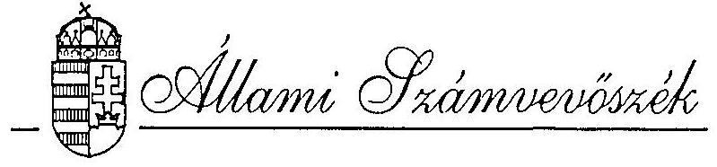
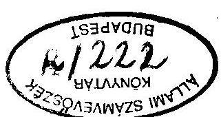
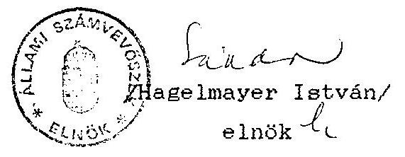

# JELENTÉS 

a Magyar Madártani és Természetvédelmi Egyesület 1993. évi központi költségvetési támogatás felhasználásának ellenőrzéséről

---

A vizsgálatot vezette:
dr. Elek János
osztályvezető főtanácsos

A vizsgálatot végezte:

Écsy Lajosné
dr. Szávai Tamás
Tóth István
számvevő
számvevő tanácsos
számvevő tanácsos

---

# ÁLLAMI SZÁMVEVŐSZÉK 

IV. Vagyonellenőrzési Igazgatóság
$\mathrm{V}-1005-10 / 1994$
Témaszám: 222

## J E L E N T É S

## a Magyar Madártani és Természetvédelmi Egyesület 1993. évi központi költségvetési támogatás felhasználásának ellenőrzéséről

I.

## Az ellenőrzés körülményei, célja és módszere

Az Állami Számvevőszékről szóló, többször módosított 1989. évi XXXVIII. törvény 2. § (5) bekezdése értelmében az Állami Számvevőszék (továbbiakban: ASZ) ellenőrzi a központi költségvetési támogatás felhasználását a társadalmi szervezeteknél. Az Országgyűlés az 58/1993. (VII. 29.) OGY határozatában döntött a társadalmi szervezetek 1993. évi támogatásáról. Fentiek figyelembevételével az ASZ 1994. évi ellenőrzési terve alapján került ellenőrzésre.

A Magyar Madártani és Természetvédelmi Egyesület (továbbiakban: Egyesület) tevékenysége kiterjed a természetvédelem valamennyi szakterületére, és azon belül kiemelten a madárvilággal kapcsolatos védelemre, népszerűsítésre, kutatásra. Az Egyesület széleskörű természetvédelmi és kutatási feladatai ellátásához a

---

költségvetési támogatás mellett jelentős összegű egyéb támogatással és saját bevétellel is rendelkezett. Mindezek figyelembevételével került sor az Egyesület 1993. évi költségvetési támogatás felhasználásának ellenőrzésére.

Az ellenőrzés célja annak értékelése volt, hogy az Egyesület az Országgyűlés által odaítélt központi költségvetési támogatást az Országgyűlés Társadalmi Szervezetek Költségvetési Támogatását Koordináló Bizottsága által előírt jogcímekre és az Alapszabályban megfogalmazott tevékenységi célnak megfelelően használta-e fel, továbbá a gazdálkodásra, nyilvántartásra és beszámolásra vonatkozó jogszabályokat hogyan tartotta be.

A vizsgálat a főkönyvi könyvelés 1993. évre vonatkozó adataira terjedt ki. Az ellenőrzés a pénzfelhasználást az Egyesület Titkárságán található dokumentumok alapján vizsgálta. A helyszíni ellenőrzés 1994. április 25-től május 20-ig tartott.

# II. 

## Az 1993. évi pénzfelhasználás ellenőrzésének tapasztalatai

1. Az Országgyűlés által odaítélt központi költségvetési támogatás felhasználásának ellenőrzése
1.1. Az Egyesület az 1993. évi feladatai ellátásához - működésre, helyi csoportok támogatására és célprogramok végrehajtására - összesen 14.840 E Ft költségvetési támogatási igényt

---

nyújtott be az Országgyűlés Társadalmi Szervezetek Költségvetési Támogatását Koordináló Bizottságához.

Az Országgyűlés 58/1993. (VII. 29.) határozata alapján 8.500 E Ft támogatásban részesült az Egyesület.

A 8.500 E Ft összegű költségvetési támogatás az Egyesület 1993. évi beszámolójában kimutatott 29.549 E Ft összes bevételnek 28,8%-a.
1.2. Az 1993. évi Országgyűlés által odaítélt költségvetési támogatás jogcímenkénti teljeskörű felhasználásának elszámolását az Egyesület elkészítette és az Országgyűlés Társadalmi Szervezetek Költségvetési Támogatását Koordináló Bizottsága részére megküldte. Az elszámolás alapját képező bizonylatokkal alátámasztott teljeskörű számítási anyagot az ellenőrzés rendelkezésére bocsátották.

A bizonylatok és a könyvelési adatok vizsgálata alapján az ellenőrzés megállapította, hogy a költségvetési támogatás felhasználásáról készített elszámolás teljeskörűen és tételesen tartalmazza az Egyesület könyvelésében rögzített kiadásokat, melyeket az Alapszabályban meghatározott célok megvalósítása érdekében teljesítettek. Ugyanakkor a Bizottság által az egyes jogcímekre engedélyezett támogatási összegek keretszámait nem tartották be. A célprogramok teljesítésének 1994-re történt áthúzódása miatti pénzmaradványok egy részét működésre és a tagszervezetek támogatására fordították az alábbiak szerint:

---

| Jogcím | Igényelt támogatás |  | Tényleges   felhaszn. | Felhasználás |  |
| :--: | :--: | :--: | :--: | :--: | :--: |
|  |  | ezer | Ft |  |  |
| A/ Működés | 8.590 | 1.900 | 3.169 | 1.269 |  |
| B/ Tagszervezetek   támogatása | 2.500 | 2.500 | 2.843 | 343 |  |
| C/ Programok:   1. Repülés az   életért | 2.000 | 2.000 | 928 |  | 1.072 |
| 2. Halastavak természetvédelmi problémái | 1.750 | 2.100 | 571 |  | 1.529 |
| Összesen: | 14.840 | 8.500 | 7.511 | $+1.612$ | $-2.601$ |

1.3. Az Egyesület Alapszabálya előírja, hogy az Egyesület pénzeszközeivel éves költségvetés keretében gazdálkodik. Az ellenőrzésnek bemutatott, a tervezett és tényleges bevételeket és kiadásokat tartalmazó "1993. évi költségelszámolás" adatai részleteiben és főösszegében nincsenek összhangban a könyveléssel, illetve azoktól eltérő adatokat tartalmaznak. Így a tervezett és tényleges adatok könyveléssel történő összehasonlítása nem volt lehetséges.
2. A pénzfelhasználás törvényességével kapcsolatos megállapítások

# 2.1. A számviteli rend ellenőrzése 

Az Egyesület a számvitelről szóló 1991. évi XVIII. törvény (a továbbiakban Szt.) és a 157/1992. (XII. 4.) Korm. rend. által előírt beszámolókészítési és könyvvezetési kötele-

---

zettségének - saját döntése alapján - éves beszámoló készítésével és kettős könyvvitel vezetésével tesz eleget.

A társadalmi szervezetek gazdálkodó tevékenységéről intézkedő 114/1992. (VII. 23.) Korm. rendelet értelmében az Egyesületnek el kell különíteni a szervezet célja szerinti, valamint vállalkozási tevékenysége szerinti bevételeit és költségeit. Ez az elkülönítés nem történt meg.

Az Egyesület számvitelének megszervezésénél az Szt. 77. § és 79. §-aiban előírt kötelezettségének nem tett maradéktalanul eleget. A számviteli rendszer teljeskörű szabályozását nem végezték el.

Számlarendet nem készítettek. Nem határozták meg a főkönyvi számlák és az analitikus nyilvántartások kapcsolatát. A nem önálló jogi személyiségű helyi csoportok gazdálkodásának könyvvezetési rendszerét, az Egyesülettől kapott támogatások elszámolási kötelezettségének módját nem szabályozták. Az önálló jogi személyiséggé alakuló helyi csoportok esetében nem rendezték a vagyonmegosztást és nem követelték meg a nyitómérleg készítését.

A könyvviteli nyilvántartás nem tartalmazza teljeskörűen az eszközökben és forrásokban bekövetkezett változásokat, mivel az Egyesület Postabanknál vezetett forint és devizaszámláinak forgalmát nem könyvelik és év végi állományát a beszámolóban nem mutatták ki. Nem tartalmazza továbbá a könyvelés a nem önálló jogi személyiségű helyi csoportok gazdálkodásának saját bankszámlán és pénztáron keresztül bonyolított pénzforgalmi adatait sem.

---

Számviteli politikájuk kialakításának hiányában nem határozták meg a beszámoló elkészítésekor és a könyvvezetésnél érvényesítendő számviteli alapelveket, a gazdasági műveletek rögzítésének és a könyvviteli zárlat elvégzésének időpontját, az eszközök értékelésének és leltározásának szabályait.

Az Egyesület számviteli feladatait 1 fő - megbízásos munkaviszonyban foglalkoztatott - könyvelő és 1 fő pénztáros-bérelszámoló látja el. Egyikük sem rendelkezik a 10/1993. (IV. 9.) PM. számú rendeletben előírt könyvelői képesítéssel. A könyvelő nyilatkozata szerint megbízása csak a könyvelési bizonylatok lakáson történő lekönyvelésére terjedt ki.

A könyvvezetés és az 1993. éves beszámoló ellenőrzése során tett további észrevételek:
a. Az éves beszámoló mérleg mellékletében befektetett pénzügyi eszközként 6.955 E Ft-ot mutattak ki. A könyveléshez csatolt hiányos dokumentumok ezt nem támasztották alá. A kért írásbeli magyarázat és a pótlólag bemutatott bizonylatok alapján megállapítható, hogy részesedésként a pénzügyi eszközök között - a bírósági bejegyzéssel egyezően - csak 2.905 E Ft szerepelhet, míg adott kölcsönként 3.770 E Ft-ot kellett volna feltüntetni. A fennmaradó 280 E Ft nem minősül befektetett pénzügyi eszköznek, mert azt végleges juttatásként adták át az érintett vállalkozásoknak.

---

b. Előfordult, hogy jelentős értékű eszközöket nyilvántartásba vétel nélkül, költségszámlára könyveltek el. Így például: a 28/92. sz. és a 32/103. sz. kiadási pénztárbizonylatok szerint vásárolt 139.900 Ft értékű 1 db Videorecordert és a 206.625 Ft értékű számítógépet és tartozékait nem könyvelték el a tárgyi eszközök főkönyvi számlára és az eszköznyilvántartásba sem.
c. A nem önálló jogi személyiségű helyi csoportoknak pályázatra, programszervezésre és működési kiadásokra nyújtott 735 E Ft összegű támogatást elszámolási kötelezettség nélkül, támogatási költségként könyvelték el az 511 főkönyvi számlán.

# 2.2. A bizonylati rend ellenőrzése 

Az Egyesület még 1976-ban kelt Ügyviteli és Pénzkezelési Szabályzatában előírta az alkalmazandó számviteli bizonylatok körét és azok tartalmi követelményeit, valamint kijelölte a szigorú számadási kötelezettség alá tartozó bizonylatokat. Ez a szabályozás azonban nem felel meg az 1992. január 1. óta érvényes számviteli törvény előírásainak.

A vizsgálat tapasztalatai alapján az ellenőrzés megállapította, hogy az Egyesületnél gyakran a saját szabályzatukban foglaltakat sem tartották be, több esetben megsértették a számviteli rendre és a bizonylati fegyelemre vonatkozó előírásokat:
a./ A kötelezően előírt analitikus nyilvántartások közül előírás szerint vezetik a személyi jövedelemadóköteles

---

kifizetések egyedi nyilvántartását. Ezen kívül vezetnek még eszköznyilvántartást, azonban az csak az Egyesület központjában lévő eszközöket tartalmazza, és abból sem állapítható meg a tényleges eszközállomány tekintettel arra, hogy leltárral nem ellenőrizték.

Ugyancsak nem teljeskörű a szigorú számadású nyomtatványok nyilvántartása, mert abból az eszköznyilvántartáshoz hasonlóan hiányzik a helyi szervezetek által használt nyomtatványok nyilvántartása. A központban használt szigorú számadású bizonylatoknak is csak a számát tartják nyilván, a használatbavétel kezdetét és végét nem. Így nem állapítható meg, hogy mely tömbök kerültek felhasználásra.
Egyáltalán nem vezetnek analitikus nyilvántartást az elszámolásra kiadott előlegekről, így az elszámolási határidő betartása nem ellenőrizhető annak ellenére, hogy azt az Egyesület Pénzkezelési Szabályzata kötelezően előírja.
Nem vezetnek továbbá analitikus nyilvántartást az értékcikkekről (valuta, csekk, élelmiszer-utalvány), valamint a nagymennyiségű, saját előállítású és kereskedelmi árukészletről.
b./ A pénztári be- és kifizetések, valamint a banki átutalások bizonylati alátámasztása csak részben felel meg a követelményeknek.

A banki bevételeknél gyakran előfordult, hogy a készpénzbefizetésekhez nem csatolták a megfelelő csekkszelvényt, így a befizető neve és a befizetés jogcíme nem állapítható meg.

---

A bank és a pénztár közötti pénzmozgást nem minden esetben bizonylatolják megfelelően, ezért az 1993. június 8-án a 101. sz. bankkivonaton szereplő 500.000 Ft postai befizetés jogcíme nem állapítható meg.

A kiadási pénztárbizonylatok vizsgálata során az ellenőrzés az alábbi hiányosságokat állapította meg:

- A megbízási díjak egy részénél összesen 1.867.640 Ft bruttó megbízási díj esetében utalványozás és teljesítésigazolás nélkül került sor a kifizetésre.
- A számlakifizetések esetében is hiányzik a pénztárbizonylathoz csatolt számlákról annak igazolása, hogy a számlán szereplő vásárlás valóban az Egyesület érdekében történt, illetve, hogy az azon szereplő árut átvették.

A Fertődön rendezett nemzetközi konferencia költségelszámolásánál a 47/45. sz. kiadási pénztárbizonylaton utalványozott és kifizetett 226.016,60 Ft felhasználásának egy részét szabályszerű bizonylatokkal nem támasztották alá. A fenti összegből készpénzszámla helyett a - megnevezés feltüntetése nélkül - blokk ellenében fizettek ki 4.629,70 Ft-ot, továbbá "étkezések" címén 104.575 Ft-ot anélkül, hogy a csatolt készpénzszámlán az adagszámot és az igénybevett étkezést feltüntették volna. Ugyancsak szabálytalan a "Fertődtavi Nemzeti Parknak" - 21 db készpénzszámlán - külön-

---

féle címen kiszámlázott 19.498,90 Ft-nak a kifizetése is, mivel a számlák nem az Egyesület nevére szólnak.
c./ Az Egyesület külföldi kiküldetéssel összefüggő költségeinek fedezetére 680.000 Ft értékű konvertibilis valutavásárlási lehetőséggel rendelkezett a 36/1991. (XII. 23.) PM rendelet előírásai szerint. Az Egyesület e valutavásárlási lehetőséggel nem élt annak ellenére, hogy az ellenőrzés megállapítása szerint a vizsgált időszakban több külföldi kiküldetés is volt.

Az ellenőrzés által feltárt esetekben azonban nem a 30/1992. (II. 13.) Korm. rendelet előírásai szerint jártak el. A kiutazásokhoz ugyanis egyetlen vizsgált esetben sem a hivatalos külföldi kiküldetési rendelvényt használták, hanem a belföldi kiküldetéshez rendszeresített.

A vizsgált külföldi utazásokhoz az ellenőrzés rendelkezésére álló bizonylatok szerint devizaellátmányt sem a költségek fedezetére, sem napidíj címén nem biztosítottak. A felmerült úti- és szállásköltséget, esetleg napidíjat utólag forintban fizették ki.

Ilyen szabálytalan módon az ellenőrzés által feltárt 6 esetben összesen 192.795 Ft költségtérítést fizetett az

 Egyesület külföldi utazással összefüggésben.

Az ellenőrzés az Egyesület könyvelésében nem szereplő, a Postabank Ft-nél vezetett angol font bankszámla kimu-

---

tatásai alapján megállapította, hogy két esetben 1.250, és 410 angol font felvételéhez kapcsolódóan a 30/1992. (II. 13.) Korm. rendelet előírása szerinti kiküldetési rendelvény kiállítására, illetve a felvett pénz előírás szerű elszámolására nem került sor. A 410 angol fontról készített elszámolást, azonban az megfelelő bizonylatok hiányában nem fogadható el.
d./ A belföldi utazási költségek elszámolásánál 1-2 kivételtől eltekintve betartották a jogszabályi előírásokat. A hivatali gépjármű, illetve a saját gépjármű hivatali célú használatának elszámolásánál egyaránt az előírások szerint jártak el.
3. Az állami befizetési kötelezettségek teljesítésének ellenőrzése

Az ellenőrzés az állami befizetési kötelezettségek közül a társadalombiztosítási, nyugdíj- és egészségbiztosítási, valamint a munkaadói és a munkavállalói járulék, a személyi jövedelemadó és általános forgalmi adó nyilvántartására, bevallására és befizetésére vonatkozó jogszabályok érvényesülését vizsgálta. Ennek során az alábbi megállapításokat tette.
3.1. A társadalombiztosítási-járulék köteles kifizetések nyilvántartásával és bevallásával kapcsolatos kötelezettségének az Egyesület nem tett maradéktalanul eleget. Megbizási szerződések alapján ugyanis 5 személynek összesen 285.000 Ft megbizási díjat fizetett ki anélkül, hogy az u-

---

tán a munkáltatót terhelő 44%-os közteher befizetési kötelezettséget előírta és teljesítette volna. Emiatt 125.400 Ft társadalombiztosítási befizetés elmaradt.

Ugyanakkor 9. sz. bankszámlakivonathoz csatolt "Duna-Ipoly Nemzeti Park állapotfelmérése I. ütem" számlákban szerzői jogdíjjal összefüggően 94.600 Ft TB járulék költségtényezőként szerepel. Ez arra utal, hogy az Egyesület járulékfizetési kötelezettség alá nem eső kifizetés után indokolatlanul 94.600 Ft összeget fizetett a társadalombiztosításnak.
3.2. A nyugdíj- és egészségbiztosítási járulék levonását, bevallását, befizetését és ezek könyvelési elszámolását az előírások szerint végezték.
3.3. A többször módosított 1991. évi IV. törvényben előírt munkaadói és munkavállalói járulékfizetési kötelezettségüknek csak részben tettek eleget.

A 2%-os munkavállalói járulékot az előírások szerint levonták a fizetésre kötelezettektől, illetve a levonások összegét maradéktalanul befizették.

Az Egyesületet terhelő, a munkaviszonyból származó bruttó keresetek után fizetendő munkaadói járulékfizetési kötelezettségüknek azonban egyáltalán nem tettek eleget.
3.4. A személyi jövedelemadó-köteles kifizetések nyilvántartásával, bevallásával és befizetésével kapcsolatos kötelezettségének az Egyesület maradéktalanul eleget tett. Az

---

adóbevallásukhoz adott adatszolgáltatásokban szereplő adatok megegyeznek az Egyesület könyvelésében és bevallásában szereplő adatokkal.
3.5. Az adózás rendjéről szóló 1990. évi XCI. törvény előírásaitól eltérően az Egyesület az általános forgalmi adó körbe nem jelentkezett be annak ellenére, hogy a vizsgált 1993. évben értékesítési árbevétele meghaladta az általános forgalmi adóról szóló 1992. évi LXXIV. tv. 49 §-a szerint a választható alanyi adómentesség 500.000 Ft-os értékhatárát. Az Egyesület az általa kiállított számlákon ötletszerűen hol feltüntette, hol pedig elhagyta az adót. A számlákon feltüntetett adót nem minden esetben könyvelték a fizetendő általános forgalmi adó számlára, így annak befizetése is elmaradt, ÁFA-t vissza nem igényeltek. A főkönyvi könyvelésben 1993. évben csupán 94.272 Ft adófizetési kötelezettséget tartottak nyilván, melyből a tárgyévben 19.522 Ft-ot utaltak át az adóhatóságnak. Adóbevallást nem készítettek.

Az Egyesület nem vezetett olyan nyilvántartást, - ÁFA analitikát -, mely alkalmas az adó önadózással történő megállapítására és bevallására.

A kiállított számlák belső tartalma hiányos, gyakran hiányzik az értékesített termék, illetve nyújtott szolgáltatás pontos megnevezése, cikkszáma, KSH besorolási száma, valamint az általános forgalmi adóra vonatkozó adatok.

Értékesítésnek, szolgáltatásnak nem minősíthető esetekben is számlát állítottak ki. Így például a nem önálló helyi csoportnak elszámolásra, illetve továbbértékesítésre át-

---

adott nyomdatermékekről, vagy különféle szervezetektől kapott jogszabályon, illetve egyéb megállapodáson alapuló támogatásokról. Esetenként a számlák hiányos tartalma és kellő kapcsolódó bizonylatok felszereltségének hiányában a pénzügyi művelet minősítése az ellenőrzés számára nem biztosított.

A helyi csoportok által végzett értékesítések (könyv, plakát, nyakkendő stb.) esetében a számlaadási, illetve nyugtaadási kötelezettségnek nem tettek eleget.

# 4. A helyszíni ellenőrzés idején megtett intézkedések 

4.1. Az Egyesület 1994. május 6-án megtartott elnökségi ülésén készült jegyzőkönyv 5. pontjában foglaltak szerint Kállay György főtitkár a helyszíni ellenőrzés idején tájékoztatta az Elnökséget az Állami Számvevőszék által végzett ellenőrzés során megállapított alapvető hiányosságokról.

Az Elnökség megbízta a főtitkárt, hogy:

- írjon ki pályázatot a titkárság vezetői állására, és
- az ASZ vizsgálat alapján a szükséges intézkedéseket azonnal tegye meg, továbbá
- készítse elő a pénzügyi, számviteli részleg átszervezését.

Az Egyesület főtitkára még a helyszíni ellenőrzés alatt felkérte a "SZAMOLAS" Bt-ot az 1993. évi ÁFA soronkívüli felülvizsgálatára.

---

III.

# Összefoglalás 

Az Egyesület 1993-ban a könyvviteli adatok szerint 29.549 E Ft bevétellel rendelkezett. Ennek az összegnek 28,8 %-a az Országgyűlés által 1993-ban - működésre, tagszervezetek támogatására és célprogramokra - odaítélt központi költségvetési támogatás.

Az Egyesület a költségvetési támogatást az Alapszabályban meghatározott célokra fordította. Az egyes jogcímekre engedélyezett keretszámokat azonban nem tartották be.

A számviteli rendszer kialakításánál a számviteli törvényben előírtakat nagy mértékben figyelmen kívül hagyták. Emiatt a könyvviteli nyilvántartás és az 1993. évi beszámoló nem tartalmazza teljeskörűen és a tényleges állapotnak megfelelően az Egyesület vagyoni helyzetét. A hiányosságok kialakulásában alapvető szerepet játszott, hogy az Egyesület nem rendelkezik megfelelő könyvelői képesítéssel rendelkező szakemberrel.

A bizonylatrend sok tekintetben nem felel meg az Szt. előírásainak. Az alaki és tartalmi követelmények a bizonylatok jelentős részénél nem érvényesülnek kellőképpen.

A külföldi kiküldetési költségek elszámolásánál és kifizetésénél rendszeresen megsértették a 30/1992. (II. 13.) Korm. rendelet előírásait.

---

Nem tettek maradéktalanul eleget az állami befizetési kötelezettségeik teljesítésének, mert 125.400 Ft összegű társadalombiztosítási járulékot és a 7%-os munkaadói járulékot egyáltalán nem fizették meg. Ezenkívül az általános forgalmi adó bejelentkezési, bevallási, nyilvántartási, adómegállapítási és befizetési kötelezettségeik teljesítését is elmulasztották.

Az ellenőrzés által megállapított hiányosságok megszüntetése céljából már a helyszíni vizsgálat idején az Egyesület Elnöksége megbízta a főtitkárt a szükséges intézkedések megtételére, a pénzügyi, számviteli részleg átszervezésének előkészítésére. Az ÁFA soronkívüli felülvizsgálatával szakirányú társaságot bíztak meg.

A jelentésben megállapított jogszabálysértések miatt az Állami Számvevőszék az Egyesület főtitkárának személyes felelősségét állapította meg, mert:

- Nem tett eleget a számvitelről szóló 1991. évi XVIII. tv. 77-79. §-aiban foglalt - a könyvvezetésről szóló - előírásainak.
- A jelentés 2.2.c pontjában leírtak szerint megsértette a 30/1992. (II. 13.) Korm. rendelet előírásait azzal, hogy külföldi utazással összefüggésbe valuta-ban felmerülő költségek forintban történő kifizetését engedélyezte, valamint nem követelte meg az előírt rendelvény használatát. Két esetben pedig a rendelet 9. §-ában előírt elszámolási kötelezettség betartását nem követelte meg.

---

- A jelentés 3.1. pontjában foglaltak szerint 285 E Ft összegű megbizási díj után az Egyesületet terhelő 44%-os, 125.400 Ft összegű társadalombiztosítási járulékot - az 1975. évi II. tv. 103/A §-ában előírtaktól eltérően - nem fizették meg.
- A jelentés 3.3. pontjában megállapított - az 1991. évi IV. törvényben előírt - munkaadói járulékot 1993-ban egyáltalán nem fizették meg.
- A jelentés 3.5. pontjában részletezettek szerint nem tett eleget az általános forgalmi adóról szóló 1992. évi LXXIV. tv. 49. §-ában és az adózás rendjéről szóló 1990. évi XCI. tv. előírásainak, mert az ÁFA bejelentkezési, bevallási, nyilvántartási, megállapítási és megfizetési kötelezettségeit elmulasztotta.

Az ellenőrzés az Egyesület főtitkárától az Állami Számvevőszékről szóló 1989. évi XXXVIII. tv. 23. §-a előírása szerint írásbeli magyarázatot kért.

Magyarázatában az Egyesület főtitkára előadta, hogy az ellenőrzés által megállapított szabálytalanságok megelőzéséhez szükséges személyi és anyagi feltételeket az Egyesület vezetőségének nem sikerült biztosítania. A pénzügyi-számviteli irányítást ellátók a szükséges végzettséggel nem rendelkeztek. Mindezek következménye, hogy a számviteli, adózási és egyéb jogszabályok ismeretének hiányában a megállapított hibákat és szabálytalanságokat elkövették. Az ellenőrzés során szerzett tapasztalatok alapján főtitkári jogkörében a könyvelő megbízásos jogviszonyát

---

megszüntette és önrevízió elvégzésére felkérte a "SZAMOLAS" Bt-ot. A pénzügyi-számviteli részleg folyamatban lévő átszervezésével kívánják megteremteni a számviteli tevékenység jogszabályban előírt feltételeit. A külföldi utazások rendjét utasítással azonnal szabályozta. Az 1.250 angol font elszámolási hiányát felülvizsgáltatta, illetve visszafizette a felvevővel. Intézkedett a társadalombiztosítási és munkaadói járulék pótlólagos rendezésére. Az ÁFA-val kapcsolatos kérdésekben az APEH állásfoglalása és a belső önrevízió alapján a szükséges intézkedések megtételét kilátásba helyezte.

Az ellenőrzés az írásbeli magyarázatot, a megtett és kilátásba helyezett intézkedéseket elfogadta. Szükségesnek tartja azonban - a személyes felelősség érvényesítésének mellőzésével - a jelentést tájékoztatás és hasznosítás céljából megküldeni a Legfőbb Ügyészségnek, a II. fejezet 3.1. pontjában leírtak miatt az Egészségbiztosítási és Nyugdíjbiztosítási önkormányzatoknak, valamint a jelentés II. fejezet 3.3. és 3.5. pontjaiban leírt szabálytalanságok miatt az Adó- és Pénzügyi Ellenőrzési Hivatalnak.

A jelentésben foglaltak alapján az ellenőrzés javasolja az Egyesületnek, hogy:

- A számviteli és bizonylatrend helyreállítására az Egyesület főtitkára tegye meg a szükséges intézkedéseket.
- A külföldi kiküldetési költségek elszámolásánál szüntessék meg a költségek forintban történő kifizetésének jogszabályellenes gyakorlatát és a kiküldöttek elszámoltatásánál maradéktalanul érvényesítsék a hatályos rendelkezések előírásait.

---

- Az elmaradt társadalombiztosítási és munkaadói járulék befizetések iránt a szükséges intézkedéseket tegyék meg.
- Az általános forgalmi adóval kapcsolatos mulasztásaik megszüntetése érdekében gondoskodjanak a törvényes állapot helyreállításáról.

Budapest, 1994. szeptember

