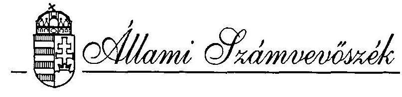
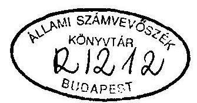
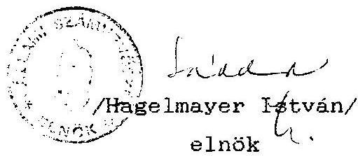

# JELENTÉS 

az Országos Ómagyar Kultúra Baráti Társaság
1993. évi állami költségvetési támogatás felhasználásának ellenőrzéséről

---

A vizsgálatot vezette:
dr. Elek János
osztályvezető főtanácsos

A vizsgálatot végezte:

Hoffmann István
Berzétey Attiláné
dr. Dotterweich Antal
számvevő
számvevő tanácsos
számvevő tanácsos

---

# ÁLLAMI SZÁMVEVŐSZÉK 

$\mathrm{V}-1007-8 / 1994$
Témaszám: 225

## JELENTES

## az Országos Ómagyar Kultúra Baráti Társaság   1993. évi központi költségvetési támogatás felhasználásának ellenőrzéséről

## I.

A vizsgálat körülményei, célja, módszere

Az Állami Számvevőszékről szóló, többször módosított 1989. évi XXXVIII. törvény 2. § (5) bek. értelmében a társadalmi szervezeteknek juttatott állami költségvetési támogatás felhasználását az Állami Számvevőszék (továbbiakban: ASZ) ellenőrzi.

Az Országgyűlés - a Magyar Köztársaság 1993. évi költségvetéséről szóló 1992. évi LXXX. törvény 34. §-a alapján - a társadalmi szervezetek költségvetési támogatására 58/1993. (VII. 9.) OGY határozatában 388 M Ft-ot biztosított.

A fenti összeg felosztása során az Országos Ómagyar Kultúra Baráti Társaság (továbbiakban: Társaság) benyújtott pályázata alapján 6.500.000 Ft összegű állami támogatásban részesült. E

---

rendelkezések figyelembevételével került sor - az ASZ 1994. évre jóváhagyott ellenőrzési terve alapján - az ellenőrzés lefolytatására.

Az ellenőrzés a Társaság részére 1993. évre jóváhagyott állami költségvetési támogatás felhasználását a Társaság székhelyén (Budapest, 1082. Kisfaludy utca 36.) ellenőrizte, mivel a szervezetnek önálló jogi személyiségű területi szervezetei nincsenek.

Az ellenőrzés célja annak értékelése volt, hogy a Társaság az állami költségvetési támogatást az Alapszabályában megfogalmazott tevékenységi célok, illetve a benyújtott pályázatokban szerepeltetett feladatok megvalósítása érdekében használta-e fel, a megvalósított feladatokat a költségek lehető legkisebb szintre való szorításával, minimális ráfordítással érte-e el. Vizsgálta az ellenőrzés azt is, hogy a pénzfelhasználás a társadalmi szervezetekre vonatkozó hatályos törvényekben foglaltak betartásával történt-e.

Az ellenőrzés a lezárt 1993. gazdálkodási évre terjedt ki. A helyszíni ellenőrzés 1994. május 2-tól május 10-ig tartott, a rendelkezésre álló dokumentációk alapján.

# II. 

A Társaság 1993. évi tényleges pénzfelhasználásának értékelése

1. Az Országgyűlés Társadalmi Szervezetek Költségvetési Támogatását Koordináló Bizottságához a Társaság 1993. március 1-i keltezéssel 4 db pályázatot nyújtott be, amelyben összesen

---

35,45 M Ft költségvetési támogatást igényelt, az alábbiak szerint:

- a Társaság működési költségei: 19.45 M Ft
- "Moldvai csángó magyarok története" című film költségei: 5.00 M Ft
- régi zenei fesztivál
megvalósításának költségei: 1.00 M Ft
- könyvmentési akció költségei: 10.00 M Ft

A pályázatok részletes előkalkulációt tartalmaztak a várható költségekre, megfelelő tagolásban.
1.1. A Társaság az Országgyűlés Társadalmi Szervezetek Költségvetési Támogatását Koordináló Bizottsághoz benyújtott pályázatok alapján végezetül 6.5 M Ft összegű állami költségvetési támogatásban részesült, amelyet két egyenlő részletben, 1993. július 30-án és augusztus 25-én utaltak át számára.

A folyósított támogatás felhasználási célját sem az OGY sem a Koordináló Bizottság nem jelölte meg, következésképpen a Társaság vezetése döntötte el, hogy a kitűzött céljai közül mire fordítja a kapott támogatást.

A Társaság gyakorlatilag 1993. év elejétől pályázatokban szerepeltetett ún. könyvmentési akcióra és nagyobb részt működési költségeinek fedezésére használta fel meglévő pénzeszközeit, számítva az igényelt állami költségvetési támogatás elnyerésére.

---

A Társaság ugyanis 1993. januárjában vállalta, hogy a csődbe ment Művelt Nép Könyvterjesztő Vállalattól átvesz 220 M Ft névértékű könyvkészletet, amelyet a vállalat anyagi lehetőségei híján (raktárbázis stb.) zúzdába szállított volna. A könyvkészlet megmentésére, szállítóeszközre, rakodóeszközre és munkásokra, továbbá értelemszerűen pénzre volt szükség. A Társaságnál rendelkezésre álló adatok szerint ezeknek a könyveknek az előállítása - szépirodalom, tanulmány, ismeretterjesztő mű, kézikönyv stb. - nem kevés állami támogatással történt - a könyvek tartalmi értékéről, hasznáról nem is szólva. Több közülük pótolhatatlan, vagy újbóli kiadásúak, a mai árak mellett többszöröse annak az összegnek, amennyiért a 220 M Ft névértékű könyvmennyiséget korábban kinyomtatták. A Társaság a könyvek elszállítását és raktározását 1993. év kezdetén megszervezte és megoldotta, amelyhez megszerezte a Honvédelmi Minisztérium támogatását is (kiürült katonai repülőtéri hangárok és szállítóeszközök biztosítása).

A könyvek hasznosítását illetően a Társaság célkitűzése az, hogy a könyvekből megkísérli:

- a moldvai-csángó magyarok központi könyvtárát megalapozni, és néhány faluban fiókkönyvtárat létesíteni;
- határon innen és túl rászoruló iskolák és könyvtárak, valamint külföldi magyar intézetek részére elajándékozni.

A könyvállomány szétválogatása, rendszerezése és csomagolása 1993. évben elkezdődött, folyó évben számítógépes nyilvántartásuk is beindult.

---

1.2. A Társaság a 6.5 M Ft juttatott állami költségvetési támogatásból 1993. évben mindösszesen 2.044.048 Ft összeget használt fel a következők szerint:

- Közvetlen költség ráfordításként 1.545.274 Ft-ot, a könyvmentési akció keretében. Ennek túlnyomó része bérköltségként, kisebb része pedig szállítási költségként merült fel.
- Általános költségként elszámolt 498.774 Ft-ot, központi iroda működésével kapcsolatosan, amelyek egy része összefügg a könyvmentési tevékenységgel is (telefon, posta, nyomtatvány, irodabérleti díj stb.).

Az ellenőrzés megjegyzi, hogy a 4.455.952 Ft összegű fel nem használt állami költségvetési támogatást a Társaság átvitte 1994. évre, ebből fedezte a könyvmentési akcióval kapcsolatos további kiadásokat.

Az ellenőrzés a naplófőkönyv, továbbá az alapbizonylatok alapján kigyűjtött adatok figyelembevételével megállapítja, hogy a Társaság 1993. évben a juttatott költségvetési támogatást 2.044.048 Ft nagyságrendben, Alapszabályában megfogalmazott célok megvalósítása érdekében használta fel.

Tekintettel arra, hogy a Társaság a juttatott költségvetési támogatásnak közel egyharmadát használta fel a vizsgált évben, érdemben nem volt lehetőség a takarékos költséggazdálkodás értékelésére.

---

2. A Társaság a számviteli törvényben előírtaknak megfelelően alakította ki számviteli nyilvántartásait, amelyek lehetővé teszik a teljes pénzforgalom zártságát és az elszámolások teljeskörű ellenőrizhetőségét.

A pénzgazdálkodással, pénzkezeléssel kapcsolatos alapvető szabályokat - röviden - az Alapszabály tartalmazza. A szigorú számadási kötelezettség alá vont nyomtatványok körét meghatározták, azokról nyilvántartást vezetnek. A költségtérítésben részesülők (gépjárműhasználat) elszámoltatása a vonatkozó rendeletek előírásainak eleget tesz. Ugyancsak rögzítették az aláírási, utalványozási és munkáltatói jogkört.

A Társaságnak kinevezett gazdasági vezetője nincs, a gazdasági-, pénzügyi teendőket - az Alapszabály szerint - gazdasági csoport végzi, amelyet a csoport vezetője irányít. A gazdasági és pénzügyi feladatokat ténylegesen a Társaság főtitkára látja el, két alkalmazottal. A könyvelés szakszerűségének biztosítására nyugdíjas okleveles könyvvizsgáló segítségét veszik igénybe.
2.1. A Társaság könyvvezetési kötelezettségének az egyszeres könyvvitel alkalmazásával tesz eleget. Pénzeszközeiről, azok forrásairól, valamint a bekövetkezett gazdasági eseményekről naplófőkönyv vezetésével ad számot. Ehhez szükséges - és előírt - kiegészítő és analitikus nyilvántartásokat felállítottak, vezetik. Az egyszerűsített mérleg egyes tételeinek megalapozását alátámasztó leltárt azonban nem vett fel, következésképpen a számviteli törvényben, illetve a 157/1992. (XII. 4.) Kormányrendeletben foglalt követelményeknek maradéktalanul nem tett eleget.

---

A könyvvezetés alapjául szolgáló alapbizonylatok a számviteli törvényben foglalt alaki és tartalmi előírásoknak megfelelnek. A naplófőkönyv vezetése pontos, előírás szerű.
2.2. A Társaság a személyi jövedelemadó, a munkáltatói és munkaadói járulék, a társadalombiztosítási járulék, a nyugdíj- és egészségbiztosítási járulék fizetési kötelezettségeiről analitikus nyilvántartást vezetett. A bérkifizetési jegyzékekhez minden esetben - megbízási jogviszony esetén - a megbízási szerződéseket csatolták. A járandóságokat bérfizetési jegyzék alapján, utalványozás és ellenőrzés mellett fizették ki.

A Társaság esetében évi egyszeri adóbevallási kötelezettség lehetősége áll fenn, amelyet 1993. évre társasági szinten a személyi jövedelemadó kivételével - teljesített.

A befizetési kötelezettségeit viszont - beleértve a személyi jövedelemadót, az általános forgalmi adót, a munkáltatói és munkaadói járulékot - maradéktalanul teljesítette. A személyi jövedelemadó bevallását pedig utólag, a helyszíni vizsgálat lezárását követően pótolta.

A társadalombiztosítási járulék bevallási és befizetési kötelezettségének teljeskörűen tett eleget.

A Társaság Ellenőrző Bizottsága 1993. novemberében ellenőrizte a Társaság 1992-1993. évi gazdálkodását, megállapításait jelentésben rögzítette. Megállapította, hogy a pénz- és vagyonnyilvántartások rendben lévők és javaslatot tett az ügyviteli apparátus létszámbővítésére.

---

# III. 

## Javaslatok

Az ellenőrzés a jelentésben részletezett megállapításai alapján javasolja, hogy a Társaság:

- Készítsen eszközeit és forrásait ellenőrizhető módon tartalmazó leltárt.

Budapest, 1994. szeptember

