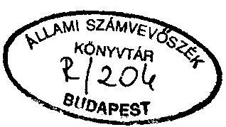
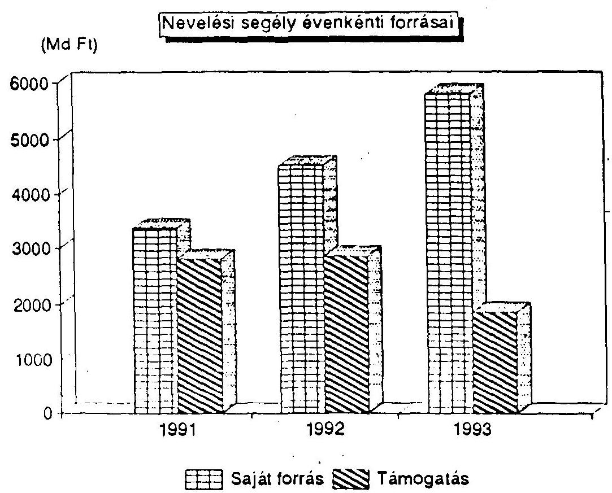
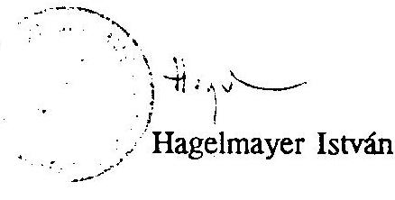
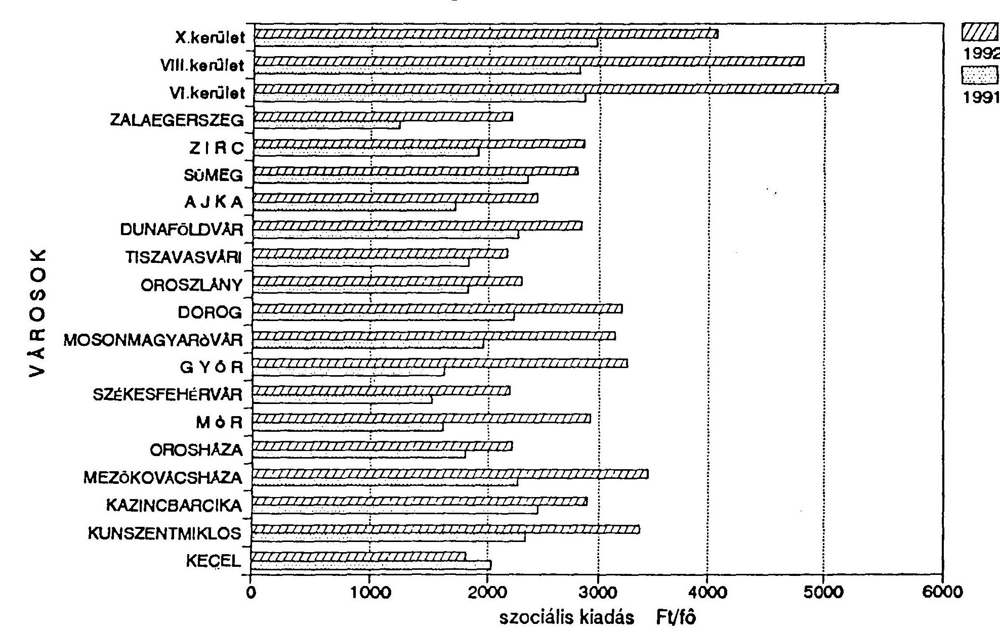

# Sallami 

## JELENTÉS

a családban nevelkedő fiatalkorúak szociális ellátásáról

---

# JELENTÉS 

a családban nevelkedő fiatalkorúak szociális ellátásáról

A helyi önkormányzatokról szóló 1990. évi LXV. törvény (ötv.) 8. § (4) bekezdése szerint az önkormányzatok kötelező feladata a lakosság szociális alapellátásának biztosítása. Az 1991. évi XX. tv. tovább részletezte az önkormányzati feladatokat és hatásköröket. A szociális ellátás egyes formáinak és az ellátásra való jogosultság feltételeinek törvényi szintű szabályozására a szociális igazgatásról és szociális ellátásokról szóló 1993. évi III. törvény megalkotásával 1993. évben került sor.

A társadalomban megjelenő, elsősorban a gazdaság teljesítőképességével összefüggő negatív folyamatok hatására - a munkanélküliség növekedése, a család életvezetési problémái, stb. - a támogatásra, segítségre szorulók száma a fiatalok korosztályán belül is egyre emelkedik. Az önkormányzatok által nyilvántartott és gondozott veszélyeztetett fiatalok száma 1991. évben 242908 fő, 1992. évben pedig már 305113 fő volt.

A fiatalkorúak szociális ellátásának döntő része pénzbeli támogatásban testesül meg. Rendszeres nevelési segélyre és rendkívüli gyámügyi segélyre országosan 1991. évben 5182 millió Ft-ot, 1992. évben 7089 millió Ft-ot fizettek ki. Alapvető fontosságú, hogy a fiatalok szociális ellátására fordított és évről-évre növekvő összegek megfelelően hasznosuljanak.

Az Állami Számvevőszék 1993. évi munkaterve alapján a fővárosban és 10 megyében vizsgálta a fiatalkorúak szociális ellátásának helyzetét. Az ellenőrzés, amely az 1991, 1992. éveket érintette, 63 városi, községi és kerületi önkormányzatra és azok egyes, gyermek- és ifjúságvédelmi feladatokat ellátó intézményeire terjedt ki.

---

A vizsgálat célja annak megállapítása volt, hogy az önkormányzatok:

- miként teremtették meg a településen a családban éló fiatalkorúak szociális alapellátásához a feltételeket,
- hogyan tudták a jelentkező igények és a meglévő lehetőségek összhangját biztosítani,
- a fiatalkorúak ellátására rendelkezésükre álló pénzeszközöket a céloknak megfelelően, hatékonyan használták-e fel,
- hogyan használták fel a pályázati úton nyújtott támogatásokat, és miként tettek eleget elszámolási kötelezettségeiknek.

Az elmúlt években végbement társadalmi változások, a gazdaságban lezajló folyamatok hatással voltak a társadalom egyes rétegeire, így a fiatalkorúak életkörülményeire, beilleszkedési lehetőségeikre. A társadalmi változások velejárója az ún. mikrocsoportok szétzilálódása, szétesése, a deviancia ugrásszerű növekedése. Ezeknek a káros hatásoknak részbeni kivédését szolgáló szociális védőháló kiépítése teljeskörűen nem történt meg. Ennek következtében növekedett a szegénységben éló családok száma, valamint kedvezőtlenül nagyarányú a különböző társadalmi beilleszkedési zavarok (öngyilkosság, bűnözés, alkoholizmus, mentális zavarok) mennyisége, a gyermek- és ifjúkori veszélyeztetettség.

Az átlagos életszínvonal utóbbi években bekövetkezett stagnálása, illetve minimális csökkenése egy rendkívül erőteljes differenciálódással, az egyenlőtlenségek növekedésével járt együtt. A népesség több mint felének romlottak, további közel egyötödének stagnáltak a jövedelmi pozíciói. Az állami szociálpolitika ugyan képes volt a hátrányosabb helyzetű rétegek végleges leszakadásának megakadályozására, ugyanakkor megkezdődött a középréteg leszakadása, elszegényedése. Összességében egyre szélesedik a létminimum alatt, vagy annak közelében lévő családok száma. Bár a pénzbeni társadalmi jövedelmek, így a családi pótlék is a jövedelemkülönbségek mérséklése irányába hatottak, mégis növekedett a gyermekek aránya az alacsony jövedelmű rétegen belül. A vállalt gyermekek számától függően a családok jövedelmi pozíciója fokozatosan romlik.

A KSH 1993. évi számításai szerint két szülő egy gyermek típusú aktív háztartások $24,1 \%$-a a két felnőtt két gyermek típusú családok $29,7 \%$-a él a létminimum alatti jövedelemből. A 3 gyermek nevelését vállaló szülők közel felének ( $41,4 \%$ ) kell azzal számolnia, hogy gyermekeinek felneveléséhez minimális anyagi feltételeket tud csak biztosítani.

---

A szegénység - fiatal korosztályon belüli - növekedése, a társadalmi-beilleszkedési zavarok káros hatása és következményei egyaránt indokolják a gyermek- és ifjúságvédelem helyzetének áttekintését, ennek keretében a családban élő veszélyeztetett fiatalok helyzetének javítására tett állami és önkormányzati intézkedések hatásának feltárását.

# MEGÁLLAPÍTÁSOK 

## I.

A fiatalkorúak szociális ellátásának jogi szabályozása

A fiatalkorúak körében jelentkező, és a deviáns magatartást fokozó hatások és tényezők következtében a fiatalok szociális ellátása, a gyermek- és ifjúságvédelem újszerü és egyre növekvő társadalmi problémákat vet fel. /munkanélküliség növekedése, ezzel együttjáró anyagi elbizonytalanodás stb./ Ezeknek a problémáknak a kezelése új módszereket, koncepciót igényel, amelyhez a szükséges jogi környezet nagyrészt még nem alakult ki.
Nem került sor a gyermek- és ifjúságvédelem mai viszonyokhoz igazodó átfogó törvényi szabályozására annak ellenére, hogy a többször módosított 1952. év IV. tv. (családjogi tv.), valamint az állami kötelezettségeket megfogalmazó ifjúságról szóló 1971. évi IV. törvény más társadalmi-gazdasági viszonyok között születtek.

A szociális problémák komplex kezelésének, a családgondozás jogi eszközökkel történő elősegítésének igénye a jogalkotó munkában nem kapott kellő súlyt. Az állami gyermekvédelem szakmai irányítása néhány évvel ezelőtt a művelődési tárcától a népjóléti tárca hatáskörébe került, ezzel a felnőtt- és gyermekvédelmi ellátás komplex szemléletben történő szabályozásának, irányításának szervezeti feltételei megteremtődtek. Az átszervezéssel együttjáró előnyökkel azonban a Népjóléti Minisztérium nem tudott megfelelően élni. A szociális törvény megalkotásának időszakában a már létező gyermek és ifjúságvédelmi törvénytervezet koncepciója által rögzített elgondolások háttérbe szorultak, így a családok ellátásának, komplex gondozásának törvényi szintű szabályozására nem került sor.

A szociális igazgatásról és egyes szociális ellátásokról szóló 1993. évi III. törvény, a gyermekek, fiatalkorúak ellátásnak bizonyos formáit kötelezővé teszi az önkormányzatok számára. Ezen túlmenően azonban az előző évtizedekben kialakult gyermekvédelmi rendszerben lényeges változást nem hozott. E területen a most készülő gyermekvédelmi törvény kíván gyökeres fordulatot megvalósítani.

---

A szociális törvénnyel életbeléptetett új, alanyi jogon járó pénzbeni ellátás a gyermeknevelési támogatás, amely a több gyermeket nevelő családok támogatásával az anyaság társadalmi megbecsülését fejezi ki.

A törvény a rendkívüli nevelési segély megszüntetésével egyidejüleg egy korosztálytól független új támogatási formát, az átmenetl segélyt léptette életbe. Adhatóságának feltételeit, a támogatás nagyságrendjére vonatkozó korlátokat az önkormányzatok helyi rendeleteikben szabályozzák.

A Gyermekjólétről és Gyermekvédelemről szóló új törvény koncepciója (és az ehhez kapcsolódó normaszöveg tervezete) elkészült. A koncepciót tárcaközi egyeztetés után a Népjóléti Minisztérium a Kormány elé kívánja terjeszteni. A törvénytervezet új korszakot kíván hozni a gyermekjóléti ellátásban. Míg a korábbi jogszabályok a veszélyeztetett gyermekek ellátását, az állami gondoskodás különböző formáit szabályozták, addig az új koncepció gyermekjóléti ellátás-rendszer kiépítését jelöli meg fő célkitúzésként. Elsődleges feladatának tekinti a család alkalmassá tételét a gyermek felnevelésére.

Az új koncepció szerint alapelv a hatósági és segitő funkciók szétválasztása. Az önkormányzat csak ellátást nyújthat, melyet az un. Gyermekjóléti Szolgálaton keresztül szolgáltató jelleggel köteles megszervezni. E Szolgálat a gyermekjóléti rendszer reformjának egyik fó eszköze. Általa válik lehetővé, hogy a jóléti ellátások jelentős része szolgáltatásként, hatósági jelleget nélkülözve jusson el a gyermekhez és a családhoz. Az önkormányzat gyermekvédelmi hatósági döntést nem hozhat, ez az újonnan megszervezendő Gyámhivatalok hatáskörébe tartozna.

A kétlépcsős rendszerben (városi, megyei) kiépítésre kerülő, a Népjóléti Miniszter irányítása alatt álló Gyámhivatalok a törvénytervezet értelmében ellátják a gyermekvédelmi hatósági feladatokat, a gyámügyi feladatokat (átveszik azokat az önkormányzatok gyámhatóságaitól, néhány gyámügyi hatáskör kivételével); törvényességi és szakmai felügyeletet gyakorolnak az önkormányzatok, gyermekjóléti szolgáltató intézmények tevékenysége felett. Az új igazgatási rendszer kiépítésével a szakmai munkavégzés egységesebb szintű ellátásának szervezeti kereteit kívánják megteremteni. A városokba telepítendő gyámhivatalokban a speciális szaktudást igénylő gyámügyi feladatok végzéséhez a személyi feltételek jobban biztosíthatók, a települési önkormányzatok pedig a hatósági munkától "megszabadulva" a korábbiaknál több figyelmet, energiát fordíthatnának a többségében megelőző jellegű család- és gyermekvédelmi tevékenységre.

---

A gyermek- és ifjúságvédelmi ellátás egyes területeit számos jogszabály érinti. A különbözö - érvényben lévő - jogszabályok gyakran egymásnak ellentmondó rendelkezéseket tartalmaztak, amely az egységes jogalkalmazást lehetetlenné tette. Egyes önkormányzati hatáskörök megállapítására eltérő előírásokat tartalmazó jogszabályok voltak érvényben.

A kiskorúakról való állami gondoskodásról, valamint a szülö és a gyermek kapcsolattartásának szabályozásáról szóló 31/1993. (II.17.) Korm. rendelettel módositott 51/1986. (XI.26.) MT rendelet 2. § (2) bekezdése szerint: "A gyámhatóság indokolt esetben segélyt állapithat meg". Ugyanakkor az 1991. évi XX. tv. (Hatáskörí törvény) 135.§ p. pontja szerint a települési képviselótestület "segélyt állapithat meg védő-óvó intézkedésként".

Hasonló a helyzet az étkezési térítési díjkedvezmények megállapításának hatáskörénél is, mivel a 24/1991. (II.9.) Korm. rendelettel módositott 1/1989. (I.18.) SZEM-MM-PM rendelet 3 § (10) bekezdése alapján a rászorultsági alapon biztosított térítési díjkedvezményről az érintett személy állandó lakóhelye szerint illetékes önkormányzat jegyzője dönt. Ugyanakkor a Hatásköri törvény 135. § p. pontja szerint a településl önkormányzat képviselőtestülete segélyt állapíthat meg védő- és óvó intézkedésként. A szociális igazgatásról és a szociális ellátásokról szóló 1993. évi III. törvény 45. § (1) bekezdése szerint a települési önkormányzat képviselötestülete létfenntartási gondokkal küzdő személy részére átmeneti segélyt nyújt. A 47. § szerint a pénzbeli ellátás helyett nyújtott természetbeni ellátás különösen... a gyermekintézmények térítési dijának kifizetése.

A szociális törvény megjelenését követően sem történt meg az előzőekben jelzett jogi ellentmondások rendezése. Az egyes, a népjóléti igazgatás körébe tartozó jogszabályok hatályon kívül helyezéséről szóló 31/1993. (II. 17.) Korm. rendelet nem helyezte hatályon kívül a magasabb szintű törvényi szabályozásnak ellentmondó hivatkozott MT és Korm. rendeletek adott paragrafusait.

Ezen ellentmondásokat az ellenőrzés lezárásának időszakában hatályba lépő 10/1994. (I. 30.) sz. Korm. rendelet feloldotta.

---

# II.   A fiatalkorúak szociális ellátásának önkormányzati tevékenysége 

## 1. A feladatellátás információ rendszere, a rászorultak felkutatása

A lakosság - ezen belül a családok, ezek egyes tagjai - életkörülményei az elmúlt időszakban kedvezőtlenül változtak. Egyre több gyermek és fiatalkorú szorult az önkormányzatok támogatására.

A szociális alapellátás keretébe tartozó feladatok megfelelő teljesítése, szervezése nem valósítható meg a szükséges alapinformációk nélkül. A vizsgálat tapasztalatai szerint az önkormányzatok nem ismerik átfogóan a településen élő lakosság szociális helyzetét, összetételét. Az állandó lakosok száma, esetleg kor szerinti összetétele, a munkanélküliek száma ismert, de ez nem elégséges információ a népesség szociális helyzetének megismerésére.

Bár a személyes adatok védelméről és a közérdekủ adatok nyilvánosságáról szóló 1992. évi LXIII. tv. a meglévő adatok, információk egy részének önkormányzatokhoz történő eljutását korlátozza, általános tapasztalat az is, hogy az önkormányzatok sem tettek meg mindent a lakosság szociális helyzetének megismerésére. Kisebb településeken, a községekben az önkormányzatok részéről nincs is igény a rászorultak felkutatására, melynek indoka, hogy "mindenki mindenkit ismer". A szociális helyzetet átfogóan bemutató felmérésre, szociális térkép készítésére alig néhány nagyobb önkormányzatnál került sor, többségük csak részleges információval rendelkezik (népességnyilvántartás, a gyermek- és ifjúságvédelmi intézkedések során rendszerbe kerülők adatai). (Példa 1)

A 22/1992. (I.28.) Korm. sz. rendelet 10. §-a a települési önkormányzat jegyzőjének feladatává teszi a gyermek- és ifjúságvédelmi feladat ellátásához szükséges helyi információs rendszer kialakítását, de ez a vizsgált önkormányzatok egyikénél sem történt meg. A rászorultak felkutatására, külön jelzőrendszer kiépítésére nem került sor. Az önkormányzat és intézményei közötti információ-áramlás, kapcsolattartás rendje nem szabályozott, elsősorban személyes kapcsolatokra épül, eseti jellegű. Az önkormányzatok nagyrészt akkor találkoznak a rászorulóval, ha konkrét támogatásra, segítségnyújtásra van szükség. Különösen hiányosak az önkormányzatok információi az oktatási-nevelési intézményekből kikerült 15-18 éves korosztályról.

---

Az egységes információs rendszer megszervezését kormányrendelet sorolja a népjóléti miniszter feladatai közé. A rendszer kialakításához szükséges feltételek megteremtését szolgáló kezdeményezések azonban nem jártak eredménnyel.

1991. évben a népjóléti tárca felnőtt- és fiatalkorúak ellátásáért felelős főosztályai előterjesztést készítettek egy idős-, fogyatékos-, hajléktalan ellátás és gyermekvédelem területét érintő módszertani háttérintézmény létrehozására. A tárca vezetői értekezlete úgy döntött, hogy e sokirányú feladat nehézkessé tenné a müködtetést, így a gyermekvédelmi információs szolgálatot külön kell megszervezni. 1992. évben ennek megvalósítása lekerült napirendről, a szükős gazdasági lehetőségek miatt.

A jelenleg érvényben levő gyámügyi statisztikai rendszer a sokszínű gyermekvédelmi tevékenység regisztrálására, az adatok elemzésére kevéssé alkalmas. Ennek egyik oka, hogy nem készültek el a veszélyeztetettség fogalmának egységesebb értelmezéséhez elengedhetetlenül szükséges szakmai iránymutatások. Az adatgyűjtés további hibája, hogy az nem teljeskörű. A különböző, családgondozást végző, gyermekvédelmi tevékenységet folytató intézmények adatai abban csak részben jelennek meg.

# 2. Az önkormányzati gyermekvédelmi tevékenység szabályozottsága, feltételei 

A fiatalkorúak ellátására vonatkozó feladat- és hatáskör telepítések az önkormányzatok szervezeti és működési szabályzataiban többnyire megtörténtek. Mivel a jogszabályok nem fogalmazzák meg egyértelműen az alapellátás tartalmát, mértékét, így minden hatáskört gyakorló döntési kompetenciájába tartozik a feladatellátás módjának, mértékének meghatározása. Ennek következtében az önkormányzati feladatellátás színvonalát a pénzügyi helyzet mellett a testület szakmai hozzáértése, szociális problémák iránti érzékenysége alapvetően befolyásolja.

A szociális ellátás, ezen belül a gyermek- és ifjúsági korosztály szociális ellátásának helyzetével általában nem foglalkoztak az önkormányzatok képviselőtestületei, szakbizottságai, koncepciót nem dolgoztak ki. A vizsgálat csak néhány esetben találkozott a gyermek- és ifjúságvédelem feladatainak, helyzetének áttekintésével, időszerű feladatok meghatározásával. (Példa 2)

A vizsgált három évben a fiatalok szociális ellátására vonatkozó jogi szabályozás kötöttségei az önkormányzatiság szellemével összhangban oldódtak. A testületek

---

azonban a helyi szintű szabályozás lehetőségével még kevéssé éltek, általában a korábbi gyakorlatot folytatták.

A 17/1992. (VII.10.) NM rendelet feloldotta a segélyösszegek minimumára vonatkozó előirásokat, ez azonban a helyi szabályozásban és az egyedi döntések meghozatalában nem hozott jelentős változást.

A szociális törvény megjelenése után elkészültek a törvényhez kapcsolódóan a szociális ellátások helyi szabályait rögzítő önkormányzati rendeletek. Általános tapasztalat, hogy a szociális törvény helyi végrehajtására megalkotott szabályok visszatükrözik a törvény hibáit. Az önkormányzatok helyi rendeletei sem komplexek, a szociális ellátások egy-egy szegmensét ölelik fel, egyes ellátásokat nem tartalmaznak.

A vizsgálat tapasztalatai alapján megállapítható, hogy a szociális törvény végrehajtására hozott helyi rendeletek többsége elsősorban a tanulói jogviszonnyal rendelkezőknek nyújtandó speciális támogatásokat (beiskolázási segély, tanszer, tankönyv, étkezési térítési díjkedvezmény, stb.) rögzítik. Nem történt meg azonban az átmeneti segélyezés törvényi rendelkezésének helyi szintre történő adaptálása. Csupán általánosságban szabályozták a család anyagi támogatásának feltételeit és annak különböző formáit. Ebben a fiatalkorúak helyzetének javítását szolgáló ellátások nem kaptak kiemelt figyelmet. (Példa 3)

Az életkörülmények romlása, a szociális feszültségek felhalmozódása, valamint a szociális törvényből adódó kötelezettségek jelentős nagyságrendű és komoly szaktudást igényló feladatokat adnak a polgármesteri hivatalok szociális, gyámügyi igazgatással foglalkozó munkatársai számára. Az e területen dolgozók felkészültsége kevés helyen biztosítja a feladatok szakszerű ellátását.

A nagyobb települések többsége (városok, fővárosi kerületek) korszerű szervezeti megoldások alkalmazására, megfelelő végzettségű szakemberek foglalkoztatására törekszik. Általános tendencia, hogy a fiatalok szociális ellátása (segélyek, támogatások) és a gyámhatósági munka külön szervezeti egységben folyik. Az egyes szervezeti egységek munkájának önkormányzati szintű koordinálása, irányítása azonban nem megoldott, holott ez az ellátások, illetve a problémakezelés hatékonyságát nagymértékben fokozná. (Példa 4)

A községi, nagyközségi önkormányzatoknál a polgármesteri hivatal szervezeti keretei között 1 fő - általában osztott munkakörben - látja el a gyermekvédelmi feladatokat, intézi a fiatalkorúak támogatásával segélyezésével kapcsolatos ügyeket.

---

A szociális ellátással, gyámügyi feladatokkal foglalkozó köztisztviselők döntő része nem rendelkezik felsőfokú végzettséggel, legfeljebb többéves tapasztalattal, helyismerettel. Sajnálatos, hogy az önkormányzati rendszer kialakulásával egyidejüleg nem teremtődtek meg a gyermekvédelmi feladatok ellátását végző ügyintézők folyamatos szakmai továbbképzésének lehetőségei. A szakmai felkészítésben is segítséget nyújtani tudó középirányító szint nem épült ki. A Népjóléti Minisztérium és a hozzátartozó háttérintézmények lehetőségei pedig korlátozottak ezen a téren.

A polgármesteri hivatalokban a személyi feltételek mellett többnyire a technikai háttér sem biztosított. Nem épült ki a leterhelt hivatali apparátust kiszolgáló számítógépes adatfeldolgozó rendszer, amely az adott támogatások, megtett intézkedések megfelelő nyilvántartásával a döntések megalapozottságát javítaná.

# 3. A fiatalkorúak ellátásához biztosított pénzügyi források 

A vizsgált önkormányzatok működési kiadásainak volumene 1991. évről 1992. évre átlagosan $24,8 \%$-kal növekedett. A kiadások növekedése a főváros kerületeiben meghaladta az átlagot $(35,7 \%)$ a községekben pedig az átlagos mérték alatt maradt (21\%). Az önkormányzatok döntő részénél a fiatalkorúak segélyezésére ténylegesen felhasznált előirányzatok a működési kiadásoknál is dinamikusabban (átlagosan mintegy $49 \%$-kal) emelkedtek. A városokban a legmagasabb a fiataloknak juttatott szociális célú kiadások emelkedése ( $52 \%$ ), míg a községekben átlagosan $31 \%$ - os a növekedés mértéke.

Az ellenőrzött önkormányzatok, kimutatásaik szerint, 1991-1992. évben múködési kiadásaiknak átlagosan 2,7 - 3,2\%-át fordították fiatalkorúak szociális segélyezésére. Az átlagos részarányhoz képest jelentősek az egyes önkormányzatok között az eltérések.

Míg egyes önkormányzatoknál a fiatalkorúak szociális kiadásainak részaránya nem éri el a $2 \%$-ot, addig más településen az ennek tízszeresét ( $20,7 \%$ )! is meghaladja.

Bár a 0-17 éves korosztály létszáma a vizsgált időszakban alig változott, az önkormányzatok egy fiatalkorura jutó kiadásai lényegesen emelkedtek. Amíg 1991. évben átlagosan 2041 Ft szociális kiadás jutott a vizsgált körben egy támogatott fiatalkorúra, addig 1992. évben már 3094 Ft-ot költöttek ilyen célú kiadásokra. Az

---

emelkedést az inflációs ráta, valamint a rászoruló számának növekedése egyaránt indokolja. (Példa 5)

Az önkormányzatok költségvetésében a vizsgálat témájába tartozó előirányzatok forrása részben saját pénzeszközökből, részben a nevelési segélyek normatív kiegészítésének központi támogatásából tevődik össze. A saját forrás döntő részben az önkormányzatokat felhasználási kötöttség nélkül megillető normatív állami támogatás. Az önkormányzatok által gyermek- és ifjúságvédelmi célokra tervezett kiadásokra 1991. és 1992. évben elméletileg általában fedezetet biztosított az alanyi jogú szociális normatíva ( $0-17$ éves korúak száma $\mathbf{x} 3100 \mathrm{Ft} /$ fő, illetve $3500 \mathrm{Ft} /$ fő). A fedezettség mértéke átlagosan 40-60\% körül mozgott. A vizsgált 63 települési önkormányzat közül 5 településen az egy-egy évben előirányzott kiadások meghaladták az ilyen címen juttatott normatív támogatás összegét. Ugyanakkor előfordult, hogy az önkormányzat a fiatalkorúak létszáma után kapott normatív támogatás néhány százalékát használta csak fel gyermek- és ifjúságvédelmi célokra. (Példa 6)

A vizsgált önkormányzatok általában éltek a nevelési segélyek kiegészítésének lehetőségével, a pályázattal elnyert pénzeszközökkel bővítették a gyermek- és ifjúságvédelemre tervezett előirányzataikat. Néhány önkormányzat (Bocfölde, Csatár) - mivel a szaktárca közlönyét nem fizették elő - a pályázati lehetőségekről 1991. évben nem szerzett tudomást, így csak 1992. évtől nyújtottak be kérelmet.

A központi támogatások elszámolt és fel nem használt részének visszafizetése az esetek többségében határidőn belül megtörtént. Nem kezdeményezte ugyanakkor a Népjóléti Minisztérium az Állami Számvevőszék 1992. évi törvényességi ellenőrzéséről készült jelentésben szereplő 27 millió Ft jogtalanul igénybe vett nevelési segély visszafizettetését. Az Állami Számvevőszék Jelen vizsgálata az 1991. évre folyósított támogatás céltól eltérő felhasználása miatt további 740 ezer Ft visszafizetési kötelezettséget állapított meg.

# 4. A gyermek- és ifjúságvédelmi feladatok ellátásának gyakorlata 

Az önkormányzatok, ifjúsági korosztállyal összefüggő szociálpolitikai, gyermekés ifjúságvédelmi feladatai a veszélyeztetett kiskorúak számának ugrásszerű emelkedése miatt az elmúlt években jelentősen növekedtek.

Az önkormányzatok által nyilvántartott veszélyeztetett kiskorúak számáról készülő adatszolgáltatás szerint, a vizsgált önkormányzatoknál 1991. évben a veszélyeztetett fiatalkorúak aránya a 0-17 éves korosztályhoz mérten $9,7 \%$ volt, 1992. évben ez az arány már $13,6 \%$-ot tett ki (az országos érték $9,5 \%$, illetve $12,2 \%$ ).

---

A közölt adatok valóságtartalma megkérdőjelezhető, az több bizonytalansági tényezőt is tartalmaz. Ennek oka egyrészt az, hogy a rendelkezésre álló információk, csak az ellátó rendszerbe már bekerültek adatait tartalmazzák (a potenciálisan veszélyeztetett, de az ellátási körbe még be nem vontakra a nyilvántartás nem terjed ki), másrészt a veszélyeztetettség fogalmának eltérő értelmezése miatt az egyes kategóriákba (hátrányos helyzet, veszélyeztetett) sorolás szubjektív elemeket tartalmaz. Önkormányzati hívatalokban, óvodákban, iskolákban is gyakran eltérő a veszélyeztetettség megítélése. Mindezek következtében a statisztikai adatok csak tendenciák megítélésére alkalmasak. (Példa 7.)

A fogalom értelmezésének bizonytalanságaiból is következik, hogy a vizsgált önkormányzatoknál a nyilvántartott veszélyeztetett fiatalok száma, aránya igen változatos képet mutat. A fóvárosban minden ötödik 17 éven aluli veszélyeztetett, míg a községekben csak minden tizenkettedik. Ha a veszélyeztetettnek minősített fiatalkorúak arányát az egyes megyék között, illetve azon belül vizsgáljuk, igen szélsőséges adatokkal találkozunk.

A veszélyeztetett kiskorúak döntő része anyagi okból veszélyeztetett. 1991. évben $69 \%$, 1992. évben már mintegy $79,6 \%$ (a vizsgált körben 1991. évben 67,4\%, 1992. évben $76,1 \%$ ) az anyagi okból veszélyeztetettként nyilvántartott fiatal. Az emelkedés mértéke önkormányzatonként változó mértékű.

Az anyagi veszélyeztetettség értelmezése önkormányzatonként igen eltérő. Elképzelhetetlen, hogy az egyik községben $0 \%$, míg a másik településen $100 \%$ az összes veszélyeztetett kiskorúból ezen ok miatt támogatottak aránya. A jogszabályok helytelen értelmezéséből következik, hogy egyes önkormányzatok a rendszeres nevelési segélyben részesülő kiskorúakat nem szerepeltetik az anyagi okból veszélyeztetettek között. (Példa 8)

A környezettanulmányok tanúsága szerint a család, a gyermek kedvezőtlen szociális helyzete gyakran a szülők életviteli, magatartásbeli problémáiból adódik (italozó életmód, gyermeknevelés hiányosságai) és abban csak kisebb súllyal játszik szerepet a szükséges anyagi háttér hiánya. Ezekben az esetekben a különböző veszélyeztető okok közül a környezeti ok a domináns, melynek csak következménye a család anyagi helyzetének rosszabbodása. Az önkormányzatok mégis anyagi okból veszélyeztetettként tartják nyilván ezeket a gyermekeket is.

Az önkormányzatok növekvő feladataikat részben szervezeteik (döntően a hivatali apparátus bevonásával), másrészt intézményeik útján igyekeznek valamilyen szinten ellátni.

---

A rászorultakat egyrészt anyagi támogatásokkal, másrészt különféle védő-óvó intézkedések megtételével segítik. Az önkormányzatoknál a fiatalkorúak anyagi támogatásának rendszere, az alkalmazott segélyezési gyakorlat igen változatos. A rászorultság, az anyagi támogatást, segélyt igénylők helyzetének megítélése és ennek alapján a segélyek összegének meghatározása általában, a család jövedelmét, esetenként vagyoni helyzetét rögzítő kimutatások, a helyi tapasztalatok és ismeretek, valamint az elvégzett környezettanulmányok megállapításai alapján történik.

A kérelmekhez csatolt jövedelemigazolások csak részben segítik a családok valós szociális helyzetének megismerését. Az irreálisan alacsony jövedelmek valóságtartalmának megítélése az önkormányzatok részéről szinte lehetetlen. Esetenként a kimutatott 1 fôre vetített jövedelem lényegesen alatta marad annak, amely a helyszínen tapasztalt tényleges életkörülmények alapján feltételezhető. (Példa 9)

A szociális törvény és a helyi önkormányzati rendeletek alapján többféle ellátásra való jogosultság is megszerezhető, mely "elkényelmesítheti" az egyént, a családot. A család jövedelmi helyzetéről rendelkezésre álló hiányos információk, valamint az önkormányzati hivatalok adatnyilvántartásának korszerütlensége miatt a párhuzamos juttatások kiküszöbölése nem biztosítható, így egyes rétegek a szociális juttatások révén jelentős jövedelemre tehetnek szert. Ez a lakosság körében feszültségek kialakulásához vezethet. (Példa 10)

A szegénység kiterjedése, a létminimum alatt vagy annak közvetlen közelében élők számának növekedése mellett a fenti okok is közrejátszanak abban, hogy a vizsgált önkormányzati körben egyre általánosabbá vált (elsősorban kisebb községekben) a rászorultság vizsgálatát mellőző, differenciálás nélkül biztosított pénzbeli és természetbeni támogatások folyósítása. (Példa 11)

Az önkormányzatok által nyújtott anyagi támogatásokon belül a pénzbeli ellátások dominálnak. Ezek között is meghatározó a rendszeres nevelési segély, amelyet a gyermeket nevelő, özvegyi nyugdíj minimum alatti átlag jövedelmű családok részére nyújtanak az önkormányzatok. A vizsgált önkormányzatok 1991. évben a szociális előirányzatok $41,9 \%$-át, 1992. évben $49,1 \%$-át használták fel rendszeres nevelési segélyezésre. (Példa 12)

A segélyek mértékének meghatározásánál az önkormányzatok nem differenciáltak. Általában a 19/1990. (V- 14.) SZEM rendelet 12. §-ával módosított 12/1987. (VI. 29.) MM rendelet 39. §-ban meghatározott minimális mértéket - a családi

---

pótlék 50\%-át - biztosították. Ez a gyakorlat tovább élt valamennyi önkormányzatnál a hivatkozott jogszabályi hely 17/1992. (VII. 10.) NM rendelet (20. §) által történő hatályon kívül helyezése után is.

A rendszeres nevelési segélyezés mellett a fiatalkorúak szociális támogatásának másik fő formája az átmeneti segély (a szociális törvény megjelenését megelőzően rendkívüli gyámügyi segély). (Példa 13)

A rendkívüli gyámügyi segélyként kifizetett támogatás a nagyszámú és évről-évre növekvő létszámú rászorulónak szerény anyagi segítséget jelent. A vizsgált körben 1991. évben átlagosan $3536 \mathrm{Ft}, 1992$. évben pedig 3905 Ft volt az egy gyermek részére biztosított támogatás összege. A rászorulók körének bővülése miatt a növekedés csupán $10,4 \%$, ami az inflációs ráta alatt marad. (Példa 14)

Az egyes önkormányzatok a segélyezési előirányzatok nagyságrendjének meghatározása, az egy gyermek részére adható támogatási összeg megállapítása során egymástól eltérő gyakorlatot folytattak. Az éves támogatás egy fơre jutó összege 1400 - 8700 Ft közötti értékek között mozgott.

A rendkívüli segély mértékére vonatkozó központi előirásokat a 17/1992. (VII. 10.) NM rendelet megszüntette. Ezt követően azonban - a rendszeres nevelési segélyhez hasonlóan - a segély helyi mértéke a szociális rendeletek megalkotásáig önkormányzati szinten nem került szabályozásra. Tovább élt a 12/1987. (VI. 29.) MM számú rendeletet módosító 19/1990. (V. 14.) SZEM rendelet 11. §-a alapján kialakított gyakorlat.

A szociális törvény megjelenése után a nagyobb települések képviselötestületei helyi rendeletükben a rászorultság mértékét figyelembe vevő segélyezési előírásokat fogalmaztak meg. Az egyes döntések meghozatala során törekvés mutatkozik a rászorultság mértéke és a megítélt támogatás nagysága közötti összhang megteremtésére.

A községekben, ahol a rászorultság megítéléséhez - hivatali apparátus, intézményi háttér hiánya miatt - a feltételek sokkal kedvezőtlenebbek, a differenciálás jelei minimálisak. Gyakori az egységes - az ifjúság egyes rétegeit azonos mértékben érintő - a rászorultság vizsgálata nélküli segélyezés, amelyet egyes képviselötestületek helyi rendeleteikben "garantálnak". Ezek a helyi szabályozások ellentétesek a szociális törvény által meghirdetett rászorultsági elvvel.

---

A pénzügyi lehetőségek korlátozottsága mellett az említett - rászorultságot nélkülöző - támogatási gyakorlat is közrejátszik abban, hogy az alkalmanként megállapított segély összege igen alacsony.

A gyermekek közvetlen ellátását segítő természetbeni juttatások szerepe növekszik, formái bővülnek.

Az étkezési térítési díjak mérséklésére egyes önkormányzatok évről-évre növekvő összegeket használnak fel. Ugyanakkor annak ellenére, hogy ezen támogatási forma szolgálja legközvetlenebbül, hogy a rászoruló gyermek ellátatlanul ne maradjon, a kisebb települési önkormányzatok alig élnek a támogatás ezen lehetőségével. (Példa 15)

A természetbeni juttatások keretében egyre több önkormányzat vállalja át a rászoruló, vagy egységesen valamennyi általános iskolás gyermek tanév eleji tankőnyv és füzetcsomag beszerzésének költségeit. Szinte valamennyi vizsgált önkormányzat megtéríti a külterületeken élő gyermekek, vagy a más településen lévő, közös fenntartású iskolába járó gyermekek utaztatási költségeit is.

A szülők erősen kifogásolható életvitele esetén egyre általánosabbá válik, hogy a pénzbeli támogatások helyett, meghatározott kereskedelmi egységekben beváltható vásárlási utalványt adnak. Többnyire kizárják a vásárlási utalványok élvezeti cikkek beszerzésére való felhasználását is. Több önkormányzat, a szociálisan rászorultak ellátásának elősegítésére diszkont boltot tart fenn - ezek létrehozását egyébként a Népjóléti Minisztérium szakmai pályázatai is kiemelten támogatják melyben alapvető élelmiszereket és közszükségleti cikkeket értékesítenek. (Példa 16)

A helyszíni vizsgálatok tapasztalatai szerint az önkormányzatok ügyintézése keretében ma még az okok ("gyökerek") mélyrehatóbb elemzése nélkül, a gondozás, a problémafeltárás helyett nagyrészt anyagi segítségnyújtás folyik. A megtett védő-óvó intézkedések önmagukban nem hatékonyak, a problémák újratermelődnek, esetleg a veszélyeztetettség fokozódik.

A nem anyagi veszélyeztetettség miatt indult gyámügyl eljárásokban általában környezettanulmányt nem készítenek, jövedelemigazolást nem kérnek be. A hangsúlyt a szükséges hatósági intézkedésre helyezik, jóllehet abból a motivációk felderítéséhez számos hasznos információhoz jutnának. Miután az esetek döntő részében a hatóság beavatkozását a gyermek magatartás-zavarai, szabálysértés, vétség, büncselekmény elkövetése, stb. teszi szükségessé, az intézkedések többsége a kiskorú és a törvényes képviselö figyelmeztetésére irányul. Erre a hivatali helyiségben, jórészt az

---

érintettek beidézését követően, személyes meghallgatás alkalmával kerül sor. Súlyosabb, illetve ismétlődő magatartási problémák, vagy cselekmények esetén, továbbá a bíróság, az ügyészség konkrét kezdeményezésére megelőző pártfogolásra, ill. pártfogóí felügyelet elrendelésére is intézkedtek. Lényegesen kisebb számban fordult elő intézményi szolgáltatás igénybevételére, nevelési tanácsadónál történő megjelenésre kötelezés. A hatóság eszköztárából ma már hiányzik, így nem találkozott az ellenőrzés a munkába lépés elősegítésével, a szülő, illetve a fiatalkorú munkáltatójával történő együttmüködéssel.

Az önkormányzat gyermekvédelemmel foglalkozó hivatali apparátusa feladatait csak a családdal és gyermekekkel közvetlen kapcsolatban levő intézményhálózat (egészségügyi, oktatási-nevelési intézmények, nevelési tanácsadók, családsegítő szolgálatok) közreműködésével képes eredményesen ellátni. Többségében azonban még hiányzik ezen intézmények gyermekvédelemben betöltött szerepének a megfogalmazása, a követelmények egzakt meghatározása.

Az önkor mányzatok gyermekvédelemmel foglalkozó munkatársai a legközvetlenebb kapcsolatot az oktatási-nevelési intézményekkel építették ki. A közoktatásról szóló törvény általánosságban meghatározza a gyermek és ifjúságvédelemből rájuk háruló feladatokat, a munka konkrét meghatározása már az adott intézmény pedagógusain múlik. Az elvárások pontosabb megfogalmazása nélkül, rendszeres szakmai felkészítés hiányában ezeknek a feladatoknak a végrehajtása intézményenként eltérő színvonalon történik.

A pedagógusok a kiskorúakkal és szüleikkel kialakított kapcsolatuk során a prevenciót tekintik elsődlegesnek (figyelemmel kisérés, tanácsadás, tanulás segítése, stb.). Foglalkoznak a hátrányos és veszélyeztetett, a nehezen nevelhető tanulókkal, kezdeményezik a rászorulók támogatását. Szervezik a fiatalok felvilágosítását a deviáns jelenségek különböző megnyilvánulásai elleni védekezés, károsító tényezőkre való felkészülés érdekében. Akciószerűen, vagy alkalmanként, hozzáértő szakembereket kérnek fel a rendőrségtől, az egészségügyi szervektől, stb. a megelőzést elősegítő előadások tartására.

A családsegítő szolgálatok szerepe, tevékenységi köre a vizsgált önkormányzatok jelentős részénél elsősorban az ilyen típusú intézmények működési kereteit körvonalazó jogi szabályok, iránymutatások hiánya miatt még nem alakult ki. Tevékenységük a szociális környezettől, az ott dolgozók irányultságától függően sokszínű. A családsegítő szolgálatok a szociális törvényben megfogalmazott azon szakmai elvárásnak, hogy "folyamatosan figyelemmel kíséri a lakosság szociális helyzetét és kezdeményezi a települési önkormányzatnál egyes szociálisan rászorult csoportok, szemé-

---

lyek e törvényben meghatározott vagy más speciális ellátását" ma még nem tudnak kielégítően eleget tenni. (Példa 17)

A nevelési tanácsadók zárt rendszerben múködnek, csak az őket megkeresők problémáival foglalkoznak, ami elsősorban és az esetek jelentős részében az óvodás vagy kisiskolás gyermekekkel való foglalkozást jelenti. Elsősorban a nevelési-oktatási intézményekkel kerülnek kapcsolatba, ha azok iskolaérettségi vizsgálatot kérnek, vagy logopédiai, pszichológiai segítségre van szükségük. (Példa 18)

Egyértelműen megállapítható, hogy sem a családsegítő szolgálatok, sem a nevelési tanácsadók tevékenységi köre nem terjed ki az iskolából kikerülő, élethelyzeténél fogva legveszélyeztetettebb korosztályra, a kamaszokra.

A szakmai feladatellátásban ma még nem tükröződnek a megváltozott viszonyok, az önkormányzatoknál a fiatalkorúak szociális támogatása, a gyermek- és ifjúságvédelmi feladatok ellátása nagyrészt a régi, "jól bevált" gyakorlat szerint folyik. Az önkormányzatok és intézményeik között nem alakult ki szoros, a feladatellátást elősegítő kapcsolatrendszer. Az önkormányzatok ma még kevéssé ismerik fel azokat az előnyöket, amelyekkel ezeknek az intézményeknek a gyermekvédelmi feladatellátásba való intenzívebb bekapcsolása járna. Mindezek hiányában a szociális problémák komplex kezelésére, a családközpontú ellátás megvalósítására csak a települések kisebb részénél tapasztalt a vizsgálat kezdeményező lépéseket, intézkedéseket.

# III. 

A gyermekvédelmi ellátást segitő fejezeti kezelésű előirányzatok felhasználása

A Parlament a vizsgált időszakra elfogadott éves költségvetési törvényekben a normatív módon meghatározott támogatásokon felül fejezeti kezelésű előirányzatok pályázati úton történő felhasználásáról is döntött. A pályázati úton elnyerhető támogatási lehetőségek megteremtésével elsősorban a gyermekvédelmi feladatok ellátásában döntő szerepet vállaló önkormányzatok számára kívánt kedvezőbb feltételeket biztosítani az ellátás intézményi feltételeink javításához, a rászoruló családok anyagi támogatási lehetőségei bővítéséhez. Nevelési segély kiegészítésére 1991. évben 2800 millió Ft, 1992. évben 2850 millió Ft, 1993. évben pedig 1850 millió Ft központosított előirányzatot biztosított a törvény. Az egyébként jelentős nagyságrendű, de évről-évre csökkenő reálértékű támogatás, a rászorulók

---

számának növekedésével párhuzamosan emelkedő önkormányzati előirányzatok mellett egyre kisebb mértékű forráskiegészítést tudott az egyes települések számára biztosítani.

Felnőtt, valamint gyermek- és ifjúságvédelmi ellátás fejlesztésére 1991. évben 310 millió Ft, 1992. évben 360 millió Ft, 1993. évben pedig 390 millió Ft állt rendelkezésre. Ezen előirányzatok nagyságrendjüknél fogva sem biztosíthattak az önkormányzatok fejlesztési elképzeléseinek megvalósításához komoly segítséget. Különösen igaz a fenti megállapítás a gyermekvédelmi szakellátásra, hiszen az e területre tervezett önkormányzati fejlesztések támogatására évente alig 100-100 millió Ft-ot tudott csak a szaktárca fordítani.

# 1. A nevelési segélyezés pályáztatásának fơbb tapasztalatai 

A Népjóléti Minisztérium által kiírt pályázati felhívások mindhárom évben az önkormányzatok széles köre számára biztosították a pótlólagos forráshoz jutás lehetőségét, ugyanis a támogatás elnyerésének kizárólagos feltétele csupán az volt,

---

hogy az önkormányzat az egyébként kötelező alapellátási körbe tartozó segélyezési támogatás előirányzatait költségvetésében megtervezze.

A tárca az elosztás objektivitását segítő mutatószám-rendszert dolgozott ki a pályázatok elbírálásához. Ebben a pályázható összeg maximumát az adott településen élő családi pótlékra jogosultak számához kötötték. A rászorultság mértékét közelítő demográfiai és jövedelmi adatokból számított szorzóval pedig korrigálták a számított összeget.

A pályázati rendszer eredményes müködtetéséhez szükséges, hogy a pótlólagos forráshoz jutás feltételei, valamint annak felhasználására és elszámolására vonatkozó előírások egyértelműen meghatározottak és a költségvetési, számviteli törvényekkel összhangban állóak legyenek. A nevelési segélyezésre vonatkozó pályázati kiírások ezeknek az elvárásoknak kevéssé feleltek meg.

A pályázatok benyújtásának alapfeltétele volt, hogy a települési önkormányzat a kiskorúak rendszeres és rendkívüli segélyezésére pénzeszközt biztosítson, a jogszabályi előírások ugyanakkor az önkormányzatokat nem kötelezték arra, hogy költségvetési rendeletükben kiemeljék ezen előirányzataikat. Emiatt a pályázatban megjelölt - sok esetben hibás adattartalmú - saját forrásnak a költségvetéssel történő összehasonlítása, egyeztetése nem volt megoldható. Az önkormányzatok több esetben a nevelési támogatás elszámolásának időszakában ismerték fel korábbi téves adatszolgáltatásuk hibáit és kérték a pályázatban megjelölt saját forrás módosítását, ezzel együtt a központi támogatásokból visszafizetendő összeg korrekcióját.

A pályázati kiírások ismétlődő és alapvető hiányossága, hogy a kiegészítő központi támogatások felhasználására vonatkozóan semmilyen feltételt nem határoztak meg. Igy nem tartalmazták azt az alapfeltételt sem, hogy az önkormányzatok az elnyert támogatást csak a pályázati célra használhatják fel, illetve, hogy a fel nem használt összeg vissza nem fizetése milyen szankciót von maga után.

A pályázati rendszer további hibája, hogy nem határoz meg a rendelkezésre álló források felhasználására sorrendiséget. Nem rögzíti, hogy a saját és pályázattal elnyert források nem teljeskörű felhasználása esetén mi a kötelező felhasználási sorrend. Egyértelmű előírások hiányában az egyes önkormányzatok különbözőképpen értelmezték az elszámolás módját. Többségük csak saját pénzmaradványt, mások saját és központi pénzmaradványt egyaránt, egyesek pedig csak támogatási pénzmaradványt mutattak ki.

---

# A pályázati rendszer nem alkalmazkodott rugalmasan az egyes pénzügyi, számviteli előírásokhoz, azok változásaihoz, az időközben megjelenő szociális törvény új kategóriáihoz. 

#### Abstract

1992. évtől a korábban önálló nevelési segély szakfeladat összevonásra került a szociális segély szakfeladattal. 1993. évtől pedig a szociális törvény a rendkívüli nevelési segélyt megszüntette. Helyébe a felnőttek és gyermekek segélyezésére szolgáló átmeneti segélyezést vezette be. Az érvényben lévő számviteli utasítások szerint az önkormányzatoknak a folyósított segély összegét a szociális törvényben elfogadott jogcímeknek megfelelően kell részletezni.

A szabályozás változásai következtében csak azoknál az önkormányzatoknál lehet - a központi támogatás elszámolásának alapját képező - megbízható felhasználási adatokat előállítani, ahol a nevelési segélyek tervezése és a felhasználás elszámolása pontosan vezetett analitikus nyilvántartó rendszeren alapszik.

A nevelési segélyek elszámolásának időszakában - főként a pályázati kiírások eltérő értelmezése miatt - számos méltányossági kérelem érkezett a Népjóléti Minisztériumhoz. A kérelmet benyújtó önkormányzatok egy része a pályázatok benyújtásakor, illetve a támogatás elszámolása során közölt adatait kívánta módosítani, mások a források felhasználására vonatkozó sorrendiség kérdésében gondolkodtak másképpen, mint az elszámolásukat ellenőrző megyei TÁKISZ. A minisztériumot az egyedi kérelmek megítélése kapcsán bizonytalanság, esetenként következetlenség jellemezte. (Példa 19)

A gyermekintézményeknél elszámolt étkezési díjkedvezmény összegét több önkormányzat nem szerepeltette elszámolása felhasználás adatában, e miatt a valóságosnál nagyobb összegű visszafizetési kötelezettséget mutatott ki. Későbbiekben egyes önkormányzatok a számukra kedvezőtlen kihatású tévedést korrigálni kívánták és ehhez kérték a minisztérium jóváhagyását.
Az önkormányzatok által közölt - csupán az analitikában megjelenő - adatok valóságtartalmának ellenőrzése még a megyei TÁKISZ-ok számára sem volt megoldható, ennek ellenére a minisztérium több esetben méltányolta az önkormányzatok kéréseit és a felhasználásnál kimutatott növekedés összegével csökkentette a nevelési segélykiegészítésből visszafizetendő összeg nagyságát.

Egyes önkormányzatoknál a nevelési segélyezés tényleges kiadásai nem érték el a saját forrás és kiegészítő támogatás együttes összegét. A források és a felhasználás közötti különbözetet nem minden önkormányzat tekintette kiegészítő támogatásból történő megtakarításnak. Azt egyes önkormányzatok saját forrásaik megtakarításaként mutatták ki. Az eltérő értelmezést az tette lehetővé, hogy a pályázati kiírások a források felhasználásának sorrendiségére nem határoztak meg szabályokat. Nem írták elő, hogy csak a saját források teljeskörü

---

felhasználását követôen lehet a központi támogatás felhasználásáról számot adni. A minisztérium a különböző felfogásban készített önkormányzati elszámolások megítélésekor, a benyújtott egyedi kérelmek elbírálása során nem volt következetes.
Székesfehérvár önkormányzata a nevelési segélyezés előirányzatát a tervezettnél lényegesen alacsonyabb összegben teljesítette, a különbözetként kimutatott és már vissza is fizetett 28473 ezer Ft-os maradványt - egyedi kérelemre a minisztérium visszautaltatta az önkormányzat számlájára.

A Népjóléti Minisztérium az egyedi kérelmek teljesítésével az érintett önkormányzatokat indokolatlanul juttatta előnyös helyzetbe azokkal az önkormányzatokkal szemben, akik a nem egyértelmű pályázati kiírásokat a maguk számára nem legkedvezőbben értelmezve számoltak el a támogatási összeggel és nem kértek egyedi méltányosságot, illetve állásfoglalást.

A három év tapasztalatai azt mutatják, hogy mind kevesebb azoknak az önkormányzatoknak a száma, amelyek nem élnek a nevelési segély kiegészítés igénylésének lehetőségével.

1991-ben még 1230 önkormányzat nem igényelt nevelési segély kiegészitést, vagy nem a maximumot igényelte. Ezek együttes igénye 276810 ezer Ft-tal ( $29 \%$-kal) maradt el az igényelhető felső határtól.

1992-ben már - a visszafizetést elmulasztó önkormányzatokat is beleszámítva - csupán 770 önkormányzat tartozott a lehetséges maximum alatti pályázók kategóriájába. Az elmaradt igény 183564 ezer Ft-ot tett ki, amely $28 \%$-os mértékủ elmaradást jelent.

1993-ban az előző év tendenciája folytatódott és felgyorsult. A maximálisnál kevesebb támogatást mindössze 597 település kapott. Az igényelhető felső határtól való együttes elmaradásuk 53821 ezer Ft, ami arányait tekintve $16,5 \%$.

A településszám és az igényelhető maximális támogatástól való elmaradás mértékének alakulása egyaránt alátámasztják, hogy a nevelési segélyezésre sokat áldozni nem tudó (nem akaró) önkormányzatok is mindinkább "ráállnak" az igényelhető maximum megpályázására. A nevelési segélyt kiegészítő támogatást az önkormányzatok már csaknem teljeskörűen felhasználási kötöttséggel juttatott "normatív támogatásként" kezelik.

---

# 2. A gyermek-és ifjúságvédelem fejlesztését támogató szakmai programok megvalósulása 

A pályázat mindhárom évben szektorsemleges volt. Azonos feltételekkel részesülhettek támogatásban az állami, a társadalmi szervezetek, az egyházak és magánszemélyek. 1992-ben első ízben írták elő a nem állami szervezetek pályázataira vonatkozóan, hogy a pályázóknak csatolniuk kell az illetékes önkormányzat véleményét.

Az 1993. évi pályázati felhívás a korábbi éveknél még hangsúlyosabban emeli ki, hogy a pályázati támogatás működési kiadásokra nem igényelhető. Előírja a müködés anyagi fedezetének vállalását igazoló képviselőtestületi határozat csatolását. A felhívás szerint a nem önkormányzati pályázók közül előnyben részesülnek azok, akik a pályázatukhoz csatolják az önkormányzattól átvállalt feladat ellátására vonatkozó előszerződést, valamint a képviselőtestület határozatát a szolgáltatás működési költségeihez való folyamatos hozzájárulásról.

Mindhárom év pályázati felhívása tartalmazza, hogy az igényelhető központi támogatás forráskiegészítésként működik. Az elnyerhető összeg a pályázatban meghatározott program tárgyévi megvalósítási költségeinek legfeljebb $50 \%$-a, maximum azonban 5 millió Ft lehetett. Kivételt képeztek az igen alacsony összegű saját forrással rendelkező kistelepülések. Az elbíráláskori döntések megbízhatóságának növelése céljából következetesen előírták a saját forrás hitelt érdemlő bizonyításának kötelezettségét, továbbá kilátásba helyezték a későbbi, kiegészítő információkérést.

A beérkező pályázatok feldolgozása és elbírálása az előző időszak tapasztalatainak felhasználásával évről-évre szervezettebben történt.

A pályázati témakörök heterogén volta, a döntés során alkalmazandó eltérő szakmai szempontok miatt, valamint az egyes részprogramok illeszthetősége érdekében két döntési szintet alakítottak ki.

A kiírt témakörök szerint összeállított 3-4 fős szakértői bizottságok feladata volt az azonos kategóriába tartozó pályázatok minösitése, rangsorolása, valamint javaslattétel a támogatandó programokra a témakörhöz rendelt keretösszeg határáig. A szakértői bizottságok tagjait külsó szakértők, pszichológusok, szociológusok, pedagógusok; gyakorló, vagy irányító szakemberek és a területért felelós minisztériumi szakemberek alkották.

---

A pályázatok végső elbírálását a második döntési szintet képviselő csúcsbizottság végezte, amelynek az elnökön kívül a szakértői csoportokból delegált 1-1 fő külső szakértő, valamint a pályázati témakörök szerinti felelős főosztályok képviselői voltak a tagjai. Feladatát képezte a szakértői bizottságok részéről a különböző témakörökben kialakított javaslatok több szempont szerinti összehasonlítása és az esetleges változtatásokat követően a véglegesen kialakított támogatási javaslat részleteiben, valamint összességében történő jóváhagyása.

A térségi problémák jobb érzékelése céljából 1992. óta a beérkező pályázatokról tájékoztatják a megyei önkormányzatokat. Írásos véleményüket kérik a lehetőségeket sokszorosan meghaladó igények rangsorolásához.

A család-, gyermek- és ifjúságvédelmi ellátások körében 1991-ben három szakmai terület részesült támogatásban; a családsegittés intézményei fejlesztésére 40 millió Ft-ot, a területi gyermekvédelemre 30 millió Ft-ot, a fiatalkori devianciák megelőzésére 30 millió Ft-ot irányoztak elő. A benyújtott 417 pályázat közül 99 db-ot fogadtak el. Az elfogadottak közül 51 esetben önkormányzat volt a pályázó.

1992-ben a fiatalkorúak szociális ellátására külön nevesítetten nem határoztak meg támogatott célokat. A Család-, Gyermek- és Ifjúságpolitikai Főosztály a négy nagyobb ellátási területre meghirdetett program közül a gyermekvédelemhez leginkább kapcsolódó "új ellátó intézmények, szolgálatok és non-profit szerződések" programját gondozta. A főosztály feladatát képező programra 489 db pályázat érkezett, melyből 80 db (köztük 47 db önkormányzat) részesült összesen 90 millió Ft támogatásban.

1993-ban négy meghirdetett, átfogónak minősülő program közül a "családsegítés", valamint a "gyermekek napközbeni ellátásának új formái" programok feletti szakmai felügyelet képezte a főosztály feladatát. A családsegítés, családvédelem területére érkezett 87 pályázat közül 44 db (ebből 25 önkormányzat) részesült összesen 30,5 millió Ft, míg a gyermekek napközbeni ellátásának új formáira benyújtott 68 pályázatból 24 db (ebből 19 önkormányzat) részesült együttesen 14,6 millió Ft támogatásban.

A pályázati kiírásokban meghatározott feltételrendszer mind konkrétabb megfogalmazásai, a biztosítékot jelentő követelmények mind hangsúlyosabb előírásai (önkormányzati képviselőtestületi határozatok stb.) és a pályázatok elbírálása belső szabályozottságának erősödése egyaránt jelzik az Népjóléti Minisztérium törekvését az e célra rendelkezésre álló szűkös források minél optimálisabb szétosztására.

---

Nincs ugyanakkor számottevő kedvező változás az 1991. évi - e szakterületet érintő - számvevőszéki vizsgálat óta a benyújtott pályázatok pénzügyi megalapozottságának dokumentáltsága, valamint a pályázattal elérendő cél pontosabb, döntésre alkalmasabb megismerése területén.

A szakértői bizottságok tagjai között nincs pénzügyi szakember. Az adatlap nyújtotta korlátozott terjedelmű leírásokból származnak ismereteik. Így döntéseik nem kismértékben függnek a pályázók önmenedzselő képességétől. A benyújtott, a folyamatban lévő, illetve a lezárt pályázatok döntő többségét egyetlen alkalommal sem ellenőrizték. A pályázók által benyújtott pénzügyi elszámolások nagy része felületes, elnagyolt. Többségük nem alkalmas a pályázati cél érdekében történt felhasználások szakszerű minősítésére.

A támogatott pályázatok között igen kevés azoknak a száma, ahol az igényelt - általában alacsony - összeget teljeskörűen oda is ítélték. A pályázatok jelentős körénél az igényelt összeg többszörösen meghaladja az odaítélt összeget. Nem találkozott az ellenőrzés olyan elemző anyaggal, amely e - jórészt pénzhiányból eredő - gyakorlatnak a pályázati cél megvalósulására gyakorolt hatásait elemezné, bemutatná.

A pályázói fegyelem lazaságát jelzi, egyúttal a minisztériumi ellenőrzés elmaradásának is betudható, hogy a vizsgálat időpontjáig a pályázók még 7 db 1991. évi, valamint 35 db 1992. évi pályázatról nem adtak számot (több éves megvalósulás esetén még részjelentést sem készítettek). A Népjóléti Minisztérium Család-, Gyermek- és Ifjúságpolitikai Főosztálya 1992. júliusában, valamint 1993. tavaszán és nyáron megküldte "reklamáló" leveleit a beszámolók elküldését elmulasztó pályázóknak, melyben - a támogatási szerződésben foglaltakhoz hasonlóan - a kapott támogatás visszafizettetéséről történő intézkedést helyezett kilátásba. Erre azonban csak egyetlen esetben került sor.

# KÖVETKEZTETÉSEK JAVASLATOK 

A szociális munka, ezen belül a gyermek- és ifjúságvédelmi feladatok tartalma, terjedelme az elmúlt évek társadalmi-gazdasági változásai miatt átalakulóban van. Az életszínvonal csökkenése miatt mind szélesebb tömegeket érintő szegénység, a munkanélküliség növekedése majd állandósulása és az ezt kísérő létbizonytalanság, a társadalmi átalakulásokkal szükségszerűen együttjáró társadalmi beilleszkedési zavarok eredményes kezelésére az önkormányzatok - jórészt rajtuk kívül álló okok miatt - nem készültek fel.

---

A szociális problémák hatékony kezelése a család egészének problémáit feltáró, komplex szemléletű családgondozás nélkül nem oldható meg. Ennek felismerése ugyan már megtörtént, a gyakorlati megvalósulás azonban az egységes szabályozás hiánya, valamint szakmai irányítási rendszerben bekövetkezett változások negatív következménye miatt késedelmet szenved.

A szociális gondok komplex szemléletű megoldását kívánta elősegíteni a gyermekvédelmi feladatoknak a felnőtt szociális szakmai irányítást végző népjóléti tárcához történő integrálása. Az átszervezés óta eltelt időszakban azonban a minisztériumban nem sikerült kialakítani olyan szervezeti struktúrát, amelynek keretein belül a felnőtt- és gyermekvédelmi ellátásban korábban meglévő elkülönültség oldódna. Mindezek az okok is közrejátszanak abban, hogy a komplex gondozás csíráit már felmutató szociális törvény megalkotásával egyidejüleg vagy annak részeként, nem került sor a gyermek- és ifjúságvédelmi feladatok átfogó törvényi szabályozására.

Az önkormányzatok megalakulásával a korábbi többszintű ágazati irányítás helyébe egy centralizált, középső szintet kiiktató, irányító rendszer lépett. A középső szint megszüntetése az ágazati irányítás gyengüléséhez, az önkormányzati munka szakmai támogatási lehetőségeinek csökkenéséhez vezetett. A szakmai segítségnyújtásra különösen a kistelepülések megfelelő szakmai képzettséggel nem rendelkező hivatali apparátusának volna elengedhetetlenül szüksége. Az ágazati irányítás erősítését szolgáló minisztériumi elképzeléseket mindezideig nem sikerült megvalósítani. Ezeknek a gondoknak a megoldásában az új gyermekvédelmi törvény koncepciója előbbre kíván lépni.

Az önkormányzatok múködését, a szociális ellátás feladatait szabályozó törvények a helyi képviselőtestületek számára mind nagyobb önállóságot, döntési szabadságot biztosítanak. Ezekkel a lehetőségekkel az önkormányzati rendszer bevezetésének első éveiben a testületek többsége még nem tudott megfelelően élni.

A testületek a szociális ellátás, ezen belül a fiatal korosztály helyzetével átfogóan általában nem foglalkoztak. A szociális törvény megjelenését követő időszakban megalkották helyi szociális rendeleteiket. Ezek a gyermekvédelmet jórészt csak a támogatások oldaláról érintik, figyelmen kívül hagyva azokat a tendenciákat, amelyek a társadalmi beilleszkedési zavarok felszínre kerülésével tapasztalhatók és helyi megoldást igényelnek. Az önkormányzatok évről-évre növekvő nagyságrendű pénzeszközöket tudtak a fiatalkorúak szociális támogatására fordítani. A nehéz élethelyzetek kezelésére alkalmas segélyezési politika azonban még a városok többségében sem alakult ki. A kisebb településeken viszont - a rászorultság elvével

---

ellentétes tendencia - az "egyensegélyezés" gyakorlata van terjedőben. Az egyenlő elosztás elvének alkalmazása a főösszegében növekvő ráfordítások mellett is a pénzeszközök elaprózódásához vezet és nem felel meg a hatékonyság követelményeinek.

A problémák komplex kezelésének intézményi feltételei a nagyobb településeken kiépültek vagy kiépülőben vannak, azonban az elvégzendő feladatok és a feltételek összehangolására általában nem került sor. Nem szabályozottak a hivatali apparátus és az egyes intézmények közötti együttmüködés formái, nem történt meg az ellátásban résztvevők között a feladatok elhatárolása.

A nevelési segélykeretet kiegészítő pályázati rendszer a benne levő bizonytalansági tényezők, valamint a feltételek pontatlan megfogalmazása miatt nem szolgálta az önkormányzatok biztonságát, a rászorultságra épülő segélyezési gyakorlat továbbfejlesztését. A települések csupán a pénzhez jutás lehetőségét látták benne. Nem ösztönzött a támogatásra szorulók felkutatására, inkább a differenciálás nélküli támogatások részarányát növelte.

Az Állami Számvevőszék a vizsgálati tapasztalatok alapján számos helyi szinten megvalósítandó javaslatot fogalmazott meg. Ezek az információs rendszer kiépítésére, a helyi szociális rendeletek áttekintésére és továbbfejlesztésére, a rászorultsági elv következetesebb érvényesítésére, a polgármesteri hivatal és intézméményei közötti együttmüködés rendjének kialakítására vonatkoztak.

A szociális ellátórendszer továbbfejlesztése érdekében az Állami Számvevőszék a Népjóléti Minisztérium részére az alábbiakat ajánlja:

- A tárcaközi egyeztetések megtörténtét követően terjessze a Kormány elé A Gyermekjólétról és Gyermekvédelemről szóló törvény koncepcióját és az ehhez kapcsolódó normaszöveg tervezetét. Ebben az önkormányzatok szakmai munkáját segíteni képes középszintű koordinációs szervezet létesítése kapjon hangsúlyos szerepet.
- Tekintse át a minisztériumon belül a felnőtt- és gyermekvédelmi feladatok szakmai irányítását ellátó szervezet struktúráját. Mérlegelje, hogy milyen szervezeti módosítások segítségével lehetne a komplex családgondozás gyakorlati megalapozását jobban szolgáló irányítási struktúrát kialakítani.
- Intézkedjék egy egységes, a felnőtt és gyermekvédelmi ellátásban közreműködő szervek, intézmények adataira támaszkodó - azonos elvek szerint működő információs rendszer kialakítására.

---

- A Művelődési és Közoktatási Minisztériummal együttműködve dolgozzák ki az oktatási-nevelési intézményeknek, nevelési tanácsadóknak a gyermekvédelmi feladatellátásba történő eredményesebb bekapcsolására vonatkozó elképzeléseket.
Szakmai iránymutatások kidolgozásával nyújtsanak segítséget abban, hogy a pedagógusok a közoktatásról szóló törvényben deklarált, ifjúságvédelemmel összefüggő feladataikat mind hatékonyabban láthassák el.
- A nevelési segélyezést kiegészítő pályázati rendszer további müködtetése - jelenlegi formájában - nem indokolt. Javasoljuk, hogy a költségvetésben nevelési segélyre biztosított előirányzat a település szociális helyzetét tükrözö mutatószámok figyelembevételével differenciált módon kerüljön felosztásra, és azt utólagos elszámolási kötelezettség nélkül juttassák el az önkormányzatoknak.
- A fejezeti kezelésű előirányzatok felhasználásának rendjét az ÁHT végrehajtására kiadott 139/1993. (X.12.) Korm. rendelet 19 § (7) bekezdése figyelembevételével szabályozzák.
A szakmai programok pályázati döntéseinél, valamint azok elszámoltatásakor a pénzügyi számonkérés szemlélete erőteljesebben érvényesüljön. A pályázatok elnyerésének legyen alapfeltétele a pályázat céljának pontos meghatározása, a fejlesztés megvalósításához szükséges saját forrás hiteltérdemlő bizonyítása. A pályázati célok szakmai és pénzügyi megvalósulását - esetenként helyszíni ellenőrzéssel is - kísérjék figyelemmel.

Budapest, 1994. június

Melléklet: 2 db .

---

A vizsgálatot vezette és az összefoglaló jelentést összeállitotta:
dr. Felleg Zsoltné fôtanácsos
A jelentés összeállításában közreműködött:
Berényi Magdolna számvevô tanácsos
Gordos László számvevő tanácsos
dr. Lacó Bálintné számvevő tanácsos
A Népjóléti Minisztériumban a vizsgálatot végezték:
Gordos László számvevő tanácsos
dr. Molnár Klára számvevő tanácsos
A települési önkormányzatoknál a helyszíni vizsgálatot végezték:
Bács-Kiskun megye:
Domján Jenő számvevő tanácsos
Békés megye:
Galuska Józsefné számvevő
Borsod-Abaúj-Zemplén megye:
Fekete Tibor számvevő tanácsos
Fejér megye:
Huberné Kuncsik Zsuzsanna számvevő
Czifra Erzsébet számvevő
Győr-Moson-Sopron megye:
Berényi Magdolna számvevő tanácsos
dr. Lacó Bálintné számvevő tanácsos
Komárom-Esztergom megye:
Ambrus Lajos számvevő
Szabolcs-Szatmár-Bereg megye:
Bacskai János számvevő tanácsos
Tolna megye:
Major Lászlóné számvevő
Zala megye:
Kócse Istvánné számvevő
Veszprém megye:
Rénes Mária számvevő tanácsos
Budapest:
Gordos László számvevő tanácsos
dr. Molnár Klára számvevő tanácsos

---

# ADATOK ÉS TÉNYEK 

a családban nevelkedő fiatalkorúak szociális ellátásáról

## 1. A szociális helyzet felmérése

- Székesfehérváron 1993. szeptemberében készítette el a város szociális térképét egy szakemberekből álló team, melynek során a népességi adatokra és a szociális ellátó rendszerből nyerhető információkra (gondozottak adatai, segélyezettek száma stb.) támaszkodtak. A munka folyamatosnak tekinthető, több részterület feltárására később kerül sor, így a hátrányos helyzetű és veszélyeztetett fiatalok körének kérdőíves felmérésére is.
- A Terézvárosi önkormányzat 1992. évben végzett a lakosság 1\%- ára kiterjedő közvélemény-kutatást szociálpolitikájának egyes kérdéseiről. A reprezentatív felmérés során az általános lakóhelyi közérzetre, a szegénységről alkotott lakossági véleményekre, a konkrét lakáskörülményekre vonatkozó információkat gyűjtöttek és azt értékelték, elemezték. 1993. év tavaszán készült el az 1990. évi népszámlálás $20 \%$-os mintájának feldolgozásával egy összehasonlító tanulmány a lakásviszonyokról, a migrációról, a hajléktalanokról, melyben három másik fővárosi kerülettel való összevetés is helyet kapott.
- Ajka városban (Veszprém megye) kikérdezésen alapuló módszerrel - az 1992. október 1-jei állapotra vonatkozóan - felmérték a lakosság szociális helyzetét. A felvett adatokat feldolgozták, melynek alapján elkészítették a város szociális térképét, így a szociálpolitikai koncepció kidolgozásához megfelelő információval rendelkeztek.

## 2. A testületek szociálpolitikai koncepciója

- Ajkán (Veszprém megye) a Szociális Bizottság elkészítette és a képviselőtestület 83/1993. (IV.26.) KT. sz. határozatával elfogadta a szociális koncepciót, mely meghatározza a következő évek feladatait és a gondoskodás rendszerének főbb alapelveit, hogy a szociális törvény által előírt kötelező feladatokat az önkormányzat teljesíthesse.
- Kazincbarcika város (BAZ megye) képviselőtestülete 1991. decemberében - a város szociálpolitikájára vonatkozóan - koncepciót fogadott el. A koncepció - mely érintette a gyermek- és ifjúságvédelmet is - megfogalmazta, hogy előtérbe kell

---

helyezni a természetbeni támogatásokat (tanszersegély, gyermekétkeztetés). A városi önkormányzat képviselőtestülete 1992. október 30-i ülésén tájékoztatót hallgatott meg az ifjúság helyzetéről, melynek során bemutatásra került az intézményeknél és a különböző szervezeteknél folyó ifjúságvédelmi munka és az azzal kapcsolatban jelentkező probléma, feladat.

- Győr-Moson-Sopron megyében, Mosonmagyaróváron a képviselôtestület és a Szociálpolitikai Bizottság több alkalommal foglalkozott a fiatalkorúak szociális ellátásának egyes részterületeivel, de továbblépés az egységes ellátás érdekében nem történt.

# 3. Helyi szociális rendeletek 

- A BAZ megyei Kisgyőr Községi Önkormányzat sajátos helyi szabályozásának szó szerinti értelmezése következtében a fiatalkorúak nem részesülhetnek átmeneti segélyben illetve annak természetben nyújtott formájában. A 3/1993. (VI.18.) számú önkormányzati rendelet 9. §-a szerint ugyanis: "Átmeneti segélyben lehet részesíteni azt a 18. életévét betöltött személyt, akinek megélhetése veszélyeztetve van, és az anyagi helyzetének átmeneti javítása más módon nem biztosítható".
- Martonvásár Nagyközség Önkormányzata (Fejér megye) rendeletében, egyéb helyi támogatásként nevesíti az újszülöttek, a tanulók (tanszer, tankönyv), a gyermektáboroztatás segélyezését.
- A peresztegi önkormányzat (Győr-Moson-Sopron megye) rendeletében a rászorultak részére meghatározott pénzbeli és természetbeni juttatások mellett, rászorultságtól illetve létfenntartást veszélyeztető rendkívüli élethelyzettől függetlenül, alanyi jogon járó támogatásokat is garantált a lakosság egyes rétegei részére.
- Székesfehérvár város (Fejér megye) az átmeneti segély adhatóságát széles határok között szabta meg, tág teret engedve a szubjektív döntésnek. A segély nyújtása jövedelemhatárhoz nem kötött, az egyszeri támogatás minimum-maximum összege sem meghatározott, éves szinten a nyugdíjminimum kétszeresét nem haladhatja meg.
- A kőbányai önkormányzat a krízissegély mértékére 3 kategóriát állapított meg, mely szerint egyedülálló kérelmezőnek 12000 forint, családban élőnek 20000 forint, rendszeres szociális ellátásban részesülőnek 4000 forint adható egy naptári évben.

---

# 4. A szociális ellátás szervezeti keretei 

- Zalaegerszegen a gyámhatósági munka nagy részét a közigazgatási osztályon látják el. A népjóléti osztály készíti elő döntésre a segélyezési ügyeket. A művelődési osztály feladatkörébe tartozik az ifjúsággal való foglalkozás, az oktatási-nevelési intézményekkel való kapcsolattartás. A részfeladatok összefogása, irányítása, az egyes szervezeti egységek munkájának koordinálása azonban nem megoldott.
- Győr városban (Győr-Moson-Sopron megye) a hivatal új felállása szerint, a Humánigazgatáson belül 4 iroda müködik. Ennek keretében az Egészségügyi és Szociálpolitikai Iroda végzi többek között a kiskorúak segélyezését is. A gyámügyi feladatokat a Gyámügyi Iroda látja el. Az irodák - melyek önálló szervezeti egységek - koordinálását az elképzelések szerint a humánigazgató fogja ellátni. A hivatal fentiek szerinti átalakítását 1993. szeptember 13-án határozta el a testület.

## 5. A fiatalkorúakat érintő szociális kiadások

- Tolna megyében Decs községben 1991. évben 2067 ezer forintot használtak fel a fiatalkorúak segélyezésére, ami az önkormányzat múködési kiadásának 6,8\%-át tette ki. 1992. évben az előző évinek közel dupláját, a működési kiadások $12,1 \%$-át fordították gyermek- és ifjúságvédelmi feladatokra.
- Zalaszegvár községben (Veszprém megye) az egy fiatalkorúra jutó szociális kiadások összege 1992. évben 8277 forint, az előző évihez képest $58 \%$-os a növekedés. A község állandó lakóiból ( 189 fő) a fiatalkorúak száma 36, és a működési kiadások 20,7\%-át! fordították fiatalok segélyezésére.
- Az 502 lakosú Csém községben (Komárom-Esztergom megye) az egy fiatalkorúra jutó szociális kiadás 1992. évben 2765 forint. A hasonló nagyságú (504 állandó lakosú) Zala megyei Csatár községben ezzel szemben 1298 forint az egy fiatalkorúra jutó 1992. évi kiadás, holott a fiatalkorúak aránya itt alacsonyabb. Csatár községben 1991. évben egy fiatalkorúra mindössze 152 forint szociális célú kiadás jutott, ehhez képest 1992. évre a növekedés több mint nyolcszoros! Ennek oka, hogy 1991. évben nem is terveztek segélyezést, a tényleges felhasználás minimális volt, míg 1992. évben a saját előirányzat mellett központi támogatásra is pályáztak.

## 6. A normatív támogatás célirányos felhasználása

- Sárhida község (Zala megye) 1991. évben a fiatalkorúak létszáma alapján kapott normatív támogatás $14 \%$-át fordította gyermek- és ifjúságvédelmi célokra.

---

- Hőgyész község (Tolna megye) a normatív támogatás 18-19\%-át költötte a fiatalkorúak szociális támogatására.
- Koroncó, Pereszteg, Halászi községek (Győr-Moson-Sopron megye) a normatív támogatás $13-18 \%$-át fordították gyermek- és ifjúságvédelmi célokra.
- A Békés megyei Köröstarcsán a normatív támogatás 10-11\%-át használták fel szociális célú kiadásokra.

# 7. A veszélyeztetett fiatalok aránya 

- Győr-Moson-Sopron megyében Győr városban minden 100 lakosra 2 veszélyeztetett kiskorú jut, míg Mosonmagyaróváron 12! A megyében vizsgált Peresztegen nincs veszélyeztetettként nyilvántartott kiskorú.
- Szabolcs-Szatmár megyében Tiszavasváriban 100 állandó lakosra több mint 10 veszélyeztetett kiskorú jut, míg Ramocsaháza községben 2,1.
- A Komárom-Esztergom megyei Dorog városban 100 állandó lakosra mintegy 14, Nagyigmándon közel 2 fó, a Fejér megyei Móron 6 fő, Bodmér községben 0 fő jut.
A Békés megyei Mezőkovácsházán mintegy 7 fő, Kőröstarcsán 1 fő veszélyeztetett fiatalkorú jutott 100 állandó lakosra.

## 8. A veszélyeztetettség eltérő értelmezése

- Zalaszegvár önkormányzatnál (Veszprém megye) az ellenőrzés 1991, 1992. évben veszélyeztetettként nyilvántartott kiskorúval nem találkozott, védő-óvó intézkedés, megelőző pártfogolás nem volt, míg rendszeres nevelési segélyben 1991. évben 3 fő, 1992. évben 9 fő kiskorú részesült.
- A Zala megyei Bak község 1991. évben 3 fő, 1992. évben 5 fő veszélyeztetett kiskorút szerepeltetett jelentésében, mely nem tartalmazza a (2-2 fő) rendszeres nevelési segélyben részesülők számát. Zalaegerszeg önkormányzata sem szerepelteti az anyagi okból veszélyeztetett kiskorúak között a rendszeres nevelési segélyben részesülteket.

## 9. A jövedelemigazolások valóságtartalma

- A Békés megyei Méhkerék önkormányzatnál a vizsgálat megállapítása szerint az 57 rendszeres nevelési segélyben részesített család munkanélküli (munkanélküli járadékban vagy jövedelempótló) támogatásban részesül. Igazolt jövedelmük nincs, vagy az egy főre eső jövedelem nem éri el a mindenkori nyugdíjminimumot. Ugyanakkor az 57 családból 40 család ( $100-1000 \mathrm{~m}^{2}$ közötti nagyságú fóliában)

---

mezőgazdasági kistermelést folytat. A segélykérelem kapcsán e tevékenységből bevételt nem mutattak ki.

# 10. A támogatások közötti összhang hiánya 

- Kunszentmiklós városban (Bács-Kiskun megye) a lakosság körében feszültségek jelentkeztek amiatt, hogy egyes ellátottak a különböző központi és önkormányzati támogatások révén (rendszeres nevelési segély, GYES, jövedelempótló támogatás, munkanélküli járadék) egy családtagra átlagosan 5200-7000 forint jövedelemmel rendelkeznek, emellett az átmeneti segély pénzbeli és természetbeni juttatási formáiban is részesültek, annak ellenére, hogy a részükre felajánlott munkalehetőségeket nem fogadták el. A munkaviszonnyal rendelkezők 1 fôre jutó jövedelme sem haladta meg esetenként ezt a szintet.

## 11. A rászorultság vizsgálatát mellőző segélyezési gyakorlat

- Sümegen (Veszprém megye) 1991. évben minden gyermek egységesen 1210 forint rendkívüli segélyben részesült.
- A BAZ megyei Tiszalúc nagyközség az 1991/92. tanév megkezdésekor 500 $\mathrm{Ft} /$ fő, a 1992/93. tanév kezdetekor pedig $1000 \mathrm{Ft} /$ fő egyszeri segélyt biztosított minden általános iskolás gyermek részére.
- A Győr-Moson-Sopron megyei Mihályi önkormányzat szociális bizottsági határozattal 1991. évben 86 fő kiskorú részére - 3 vagy több gyermek egy családban történő nevelése esetén - $1000 \mathrm{Ft} /$ fő segélyt fizetett ki.

## 12. Rendszeres nevelési segélyezés

- 1992. évben országosan mintegy 201 ezer kiskorú részesült éves szinten összesen 3334 millió Ft rendszeres nevelési segélyben. Az e címen kifizetett segélyek összege 1991. évhez mérten $54,2 \%$-kal nőtt, a segélyben részesítettek száma pedig $32 \%$-kal emelkedett. A segélyátlagok növekedése ( $16,8 \%$ ) ugyanakkor nem érte el az inflációs ráta mértékét.
A vizsgált körben az országos átlagnál magasabb a növekedés mértéke. A rendszeres nevelési segélyként kifizetett előirányzatok $74,1 \%$-kal, a segélyben részesítettek száma pedig $39,1 \%$-kal emelkedett 1991. évről 1992. évre.

## 13. Rendkívüli gyámügyi segélyezés

- Országos adatok szerint 1992. évben 3.755 millió forintot 1991. évhez képest $24,3 \%$-kal nagyobb összeget fizettek ki az önkormányzatok az átmenetileg nehéz

---

anyagi körülmények közé kerülő gyermekes családok támogatására. A vizsgált körben hasonló nagyságrendű ( $26,4 \%$-os) előirányzat növekedést tapasztaltunk.

# 14. A rendkívüli segélyezés nagyságrendje 

- A BAZ megyei Kazincbarcikán az egy főre vetített rendkívüli gyámügyi segély éves összege $1685 \mathrm{Ft} /$ fő, Kisgyőr településen $4976 \mathrm{Ft} /$ fő volt 1992. évben.
- A Zala megyei Zalaegerszegen $6877 \mathrm{Ft} /$ fő, Bak községben $2000 \mathrm{Ft} /$ fő a kifizetett éves támogatás.

## 15. Étkezési díjkedvezmény nyújtása

- Halászi községben (Győr-Moson-Sopron megye) térítési díjkedvezmény megállapítására nagyrészt utólag került sor, többnyire akkor, amikor a szülők elmaradtak a térítési díj megfizetésével.
- Győr város intézményei részére keretjellegủ előirányzatot határozott meg, melyből az étkezési térítési díjkedvezményeket fedezik. A támogatottak körét, a kedvezmény mértékét az intézmény vezetése az osztályfőnökök, gyermek- és ifjúságvédelmi felelősök bevonásával határozza meg.

## 16. Természetbeni juttatások

- A VIII. kerületben 1992. évben 1800 ezer forint összegű élelmiszerutalványt osztottak szét karácsonykor a nagycsaládos és a munkanélküli szülők között a "Segítsünk Egymáson" akció keretében.
- A kőbányai önkormányzat 1993. év elején 133 család közüzemi díjhátralékát egyenlítette ki úgy, hogy a családok a Díjbeszedő Rt-nek befizették tartozásuk $20 \%$-át. Ezen igazolást bemutatva a tartozás hátralévő $80 \%$-ának kiegyenlítésére intézkedtek.

## 17. Családsegítő szolgálatok tevékenysége

- A VI. kerületben a Gyámügyi Irodának nincs élő kapcsolata a Családsegítő Központtal. Nincs közöttük olyan együttműködés, hogy hatósági védő-óvó intézkedést megelőzendő, vagy abba beépítendő családgondozást kérhetnének.
- A X. kerületben működő Családsegítő Szolgálat, miután csak az önként jelentkezők problémáival foglalkozik, a rászorulók felkutatásában nem tud segíteni. A prevencióban, a deviáns jelenségek kialakulásának, elterjedésének megelőzésében így csak ezeken a családokon keresztül vesz részt. Mosonmagyaróváron a Családsegítő Szolgálat munkatársai néhány esetben az önkormányzattól

---

segélyt kérők körülményeinek feltárására elkészítették a környezettanulmányokat.

# 18. Nevelési Tanácsadók közreműködése 

- A Győr Városi Önkormányzat által fenntartott Nevelési Tanácsadó szolgáltatásainak igénybevételére az elmúlt 2 évben - a korábbi évektől eltérően meghatározó mértékben (mintegy $70 \%$ - ban) szülői kezdeményezésre került sor.
- A zirci (Veszprém megye) Nevelési Tanácsadó a volt vonzáskörzetébe tartozó települések önkormányzatainak kiszámlázza szolgáltatásait. Helyzete a vizsgálat időpontjában bizonytalan volt, mivel a városi önkormányzat a fenntartási jogot 1994. január 1-jével át szeretné adni a megyei önkormányzatnak.

## 19. A nevelési segélykiegészítés 1991. évi elszámolásánál

- Veszprém megyében Balatonalmádi Város és Csajág Község a pályázatban megjelölt saját források megváltoztatására és visszafizetési kötelezettség elengedésére vonatkozó kéréseit előbb visszautasították, majd egy hónappal később (májusban) teljesítették.
- Balatonalmádi város módosítást kért, mivel a pályázat benyújtásakor a saját forrást rosszul értelmezte. Az igénylésnél 2402 ezer forint saját forrást jelölt meg, míg a jegyző 215-2/1992. levele szerint 2202 ezer forint szerepel költségvetésükben. Az indokaik elfogadásra kerültek, így 1424 ezer forint helyett 1224 ezer forintot kellett 1991. év vonatkozásában visszafizetniük.
- Téves adatközlés miatt kért méltányosságot Csajág község is. (Figyelemre méltó, hogy ezt is 1992. évben "vették észre").
Ezt meg is kapták, így 1991. év vonatkozásában 250 ezer forint helyett 40 ezer forintot kellett visszafizetniük.
- A Veszprém megyei Alap és Előszállás önkormányzatok hasonló kéréseit - a pályázati feltételek utólagos módosításának nem teljesíthetőségére hivatkozással - a Népjóléti Minisztérium elutasította.
- Győr-Moson-Sopron megyében Győr város az 1991. évben kapott támogatásról készült, TÁKISZ-hoz benyújtott elszámolása szerint 7158 ezer forint visszafizetési kötelezettséget mutatott ki. Visszafizetési kötelezettségének az önkormányzat nem tett eleget, helyette a TÁKISZ-nak továbbított 42792/92. sz. levelében "a Népjóléti Minisztériummal történt előzetes egyeztetés alapján" az elszámolást módosította. A módosított elszámolás alapján az önkormányzatot visszafizetési kötelezettség nem terheli.

---

Az elszámolás módosításának igazolásaként a helyszíni vizsgálat a Polgármesteri Hivatal Szociális és Egészségügyi Osztálya, valamint Művelődési és Sport Osztálya vezetőjének továbbított 33168/1992. számú, 1992. március 17 -én kelt átiratát tudta fellelni. A levélben foglaltak szerint a művelődési ágazat felügyelete alá tartozó gyermekintézményekben 1991. évben élelmezési térítési díjkedvezményben részesültek tényleges költsége 7325 ezer forint. Ebből óvodák, általános iskolák, középfokú oktatási intézmények e célú "tényleges költsége" 4325 ezer forint, alapítványba befizetett összeg 3000 ezer forint. Fenti összegek kifizetéséről egyértelmű, követhető, dokumentumokkal alátámasztott számviteli nyilvántartásokkal az ellenőrzés nem "találkozott". Az elszámolásban szereplő adatok, a számviteli nyilvántartással nem egyeztethetők, a kimutatások és a pénzügyi információ adatai sem egyeznek meg.

- A nevelési segélykiegészítés 1992. évi elszámolásánál

Baranya megyei települések többsége visszafizetési kötelezettségének elengedésére vonatkozó igényét - nem minden esetben szakszerűen indokolva, de helyesen - elutasították. Négy település esetén (Drávakeresztúr, Gyöngyösmellék, Kétújfalu, továbbá Hosszúhetény) azonban a TÁKISZ-nak írt válaszlevelében nem foglalt egyértelműen állást a Népjóléti Minisztérium a fel nem használt összeg sorsáról.

- Székesfehérvár Város Önkormányzata és a Fejér Megyei TÁKISZ eltérően értelmezték a visszafizetési kötelezettséget.
A hivatkozott konkrét esetben a nevelési segélyt kiegészítő 1992. évi támogatás elszámolásakor Székesfehérvár Megyei Jogú Város a pályázat időszakában tervezett ( 62888 ezer forint saját forrás mellett 30472 ezer forint kiegészítő támogatás) összesen 93360 ezer forint nevelési segéllyel szemben csupán 64887 ezer forint felhasználásáról adott számot. Elszámolása értelmében a 30472 ezer forint támogatást teljeskörűen felhasználta, saját forrásból azonban csak 34415 ezer forint felhasználást mutatott ki. Ezzel szemben a megyei TÁKISZ az eredeti teljes előirányzatot alapul véve a fel nem használt teljes összeget (93 360-64 887) 28473 ezer forintot visszafizettette az önkormányzattal. Az önkormányzat olyan megfontolásból, hogy
"a pályázati kiírás nem tartalmazza azt, hogy a saját forrás teljeskörű felhasználását követően lehet csak a központi támogatást igénybe venni. Véleményünk szerint az elszámolás tisztázatlansága miatt a mi értelmezésünk is elfogadható"
egyedi kérelmet nyújtott be a Népjóléti Minisztériumba. A minisztérium méltányolta az önkormányzat indokait és a már befizetett 28473 ezer forintot visszautaltatta az önkormányzat számlájára.

---

|  Önkormányzat, megnevezése | Év | Nevelési segely felhasználása önkormányzat, 182 vizsgálat szerint (E Ft.) |  |  | ÁSZ vizsgálat szerint az elszámolások után még visszafizetésre jav, összeg (E Ft.)  |
| --- | --- | --- | --- | --- | --- |
|  Komárom-Esztergom megye |  |  |  |  |   |
|  Dág | 1991 | 564 | 424 |  | 140  |

A könyvelés és az éves beszámoló szerint a tényleges felhasználás 424 E Ft. A könyvelésben szereplő, valamint az általános iskolai napközi kialakítására átcsoportosított 140 E Ft. együttes összegét közölte az önkormányzat nevelési segély felhasználásként a pályázati elszámolásban.

### Veszprém megye

|  Súmeg | 1991 | 4.946 | 4.346 | 600  |
| --- | --- | --- | --- | --- |
|  Az önkormányzat pályázati elszámolása szerint 4.946 E Ft. a nevelési segély kifizetett összege, melyből a vizsgálat megállapítása szerint 600 E Ft.-ot nem a célnak megfelelően használtak fel. A képviselőtestület a normatív nevelési segélyből 600 E Ft.-ot csoportosított át a gimnaziumnak számítógép vásárlásra. Így az önkormányzatot a már rendezett 142 E Ft.-on felül további 600 E Ft.-os visszafizetési kötelezettség terheli. |  |  |  |  |   |

---

A vizsgált önkormányzatok fiatalkorúakra jutó szociálpolitikai célú kiadásai 1991-1992. években

|  Megnevezés | Mennyi segi egység | FOVÁROS |  |  | VÁROS |  |  | KOZSEG |  |  | VIZSGALT OSSZESTEN |  |   |
| --- | --- | --- | --- | --- | --- | --- | --- | --- | --- | --- | --- | --- | --- |
|   |  | 1991 | 1992 | 92/91
(\%) | 1991 | 1992 | 92/91
(\%) | 1991 | 1992 | 92/91
(\%) | 1991 | 1992 | 92/91
(\%)  |
|  Állandó lakozók száma | 16 | 252237 | 251668 | 99.8 | 557212 | 558238 | 100.2 | 92821 | 93041 | 100.2 | 902270 | 902947 | 100.1  |
|  Ebből: 0-17 évesek száma | 16 | 51717 | 48517 | 93.8 | 146141 | 144694 | 99 | 23399 | 23516 | 100.5 | 221257 | 216727 | 98  |
|  0-17 évesek aránya | \% | 20.5 | 19.3 |  | 26.2 | 25.9 |  | 25.2 | 25.3 |  | 24.5 | 24 |   |
|  Nyilvántartott veszélyeztetett kiskorúak száma | 16 | 8861 | 9723 | 109.7 | 10822 | 17677 | 163.3 | 1882 | 1971 | 104.7 | 21565 | 29371 | 136.2  |
|  Nyilvántartott veszélyeztetett kiskorúak aránya | \% | 17.1 | 20 |  | 7.4 | 12.2 |  | 8 | 8.4 |  | 9.7 | 13.6 |   |
|  Ebből: anyagi okból nyilvántartottak száma | 16 | 6306 | 7024 | 111.4 | 6997 | 13969 | 199.6 | 1240 | 1364 | 110 | 14543 | 22357 | 153.7  |
|  anyagi okból nyilvántartottak aránya | \% | 71.2 | 72.2 |  | 64.7 | 79 |  | 65.9 | 69.2 |  | 67.4 | 76.1 |   |
|  Vató-ovó intézkedések száma | db | 2365 | 1522 | 64.4 | 5321 | 4759 | 89.4 | 393 | 306 | 77.9 | 8079 | 6587 | 81.5  |
|  Teljesített összes müködési kiadás | E Ft | 3206356 | 4351024 | 135.7 | 12701861 | 15545187 | 122.4 | 1128937 | 1365547 | 121 | 17037154 | 21261758 | 124.8  |
|  Fiatalkorúak szociális célú kiadásai össz. | E Ft | 149795 | 221252 | 147.7 | 253650 | 385979 | 152.2 | 48319 | 63374 | 131.2 | 451764 | 670605 | 148.4  |
|  Fiatalkorúak szociális célú kiadásainak aránya | \% | 4.7 | 5.1 |  | 2 | 2.5 |  | 4.3 | 4.6 |  | 2.7 | 3.2 |   |
|  Egy állandó lakozra jutó fiatalkorú szociálad. | Ft/16 | 593 | 879 | 148.2 | 455 | 691 | 151.9 | 520 | 681 | 131 | 500 | 742 | 148.4  |
|  Egy 0-17 évesre jutó fiatalkorú szociálad. | Ft/16 | 2896 | 4560 | 157.5 | 1735 | 2667 | 153.7 | 2065 | 2694 | 130.5 | 2041 | 3094 | 151.6  |
|  Rendszeres nevelési segély | E Ft | 65574 | 132677 | 202.3 | 111043 | 176229 | 158.7 | 12615 | 20598 | 163.3 | 189232 | 329504 | 174.1  |
|  Segélyben részesülők száma | 16 | 4901 | 7830 | 159.8 | 7782 | 9821 | 126.2 | 880 | 1215 | 138.1 | 13563 | 18866 | 139.1  |
|  Rendszeres segélyátlag | Ft/16/hó | 1115 | 1412 | 126.6 | 1189 | 1495 | 125.7 | 1195 | 1413 | 118.2 | 1163 | 1455 | 125.1  |
|  Rendkívüli gyámúgyt segély | E Ft | 48352 | 51203 | 105.9 | 138004 | 184775 | 133.9 | 35608 | 44636 | 125.4 | 221964 | 280614 | 126.4  |
|  Rendkívüli gyámúgyt segélyben részesülők száma | 16 | 12443 | 17706 | 142.3 | 36902 | 40266 | 109.1 | 13420 | 13881 | 103.4 | 62765 | 71853 | 114.5  |
|  1 fore jutó rendkívüli gyámúgyt segély | Ft/ev | 3886 | 2892 | 74.4 | 3740 | 4589 | 122.7 | 2653 | 3216 | 121.2 | 3536 | 3905 | 110.4  |
|  Nevelési segély önkormányzati forrás | E Ft | 94096 | 156000 | 165.8 | 159289 | 266286 | 167.2 | 24426 | 34072 | 139.5 | 277811 | 456358 | 164.3  |
|  Központi támogatás | E Ft | 40824 | 41679 | 102.1 | 133732 | 144492 | 108 | 25692 | 28816 | 104.4 | 200248 | 212987 | 106.4  |
|  Központi támogatás a saját forrás \%-ában | \% | 43.4 | 26.7 |  | 84 | 54.3 |  | 105.2 | 76.7 |  | 72.1 | 46.7 |   |
|  Ténylegesen felhasznált nevelési segély | E Ft | 122820 | 190109 | 154.8 | 287564 | 392394 | 136.5 | 48695 | 65023 | 133.5 | 459079 | 647528 | 141  |
|  Visszafizetendő nev. segély (önk. elsz. szer.) | E Ft | 12110 | 0 |  | 10399 | 29991 |  | 3029 | 814 |  | 25538 | 30805 |   |

---

# Egy fiatalkorúra jutó szociális kiadás a vizsgált városokban 

---

- 12 -

# Egy fiatalkorúra jutó szociális kiadás a vizsgált községekben

|  VONYARCVASHEGY |  |  |  |  |  |  |  |  |  |  |  |  |  |  |  |  |  |  |  |  |  |  |  |  |  |  |  |  |  |  |  |  |  |  |  |  |  |  |  |  |  |  |  |  |  |  |  |  |  |  |  |  |  |  |  |  |  |  |  |  |  |  |  |  |  |  |  |  |  |  |  |  |  |  |  |  |  |  |  |  |  |  |  |  |  |  |  |  |  |  |  |  |  |  |  |  |  |  |  | 