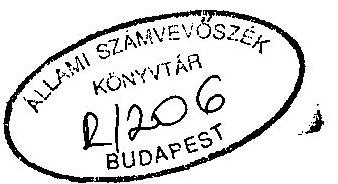
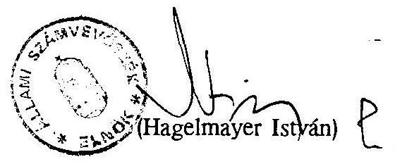
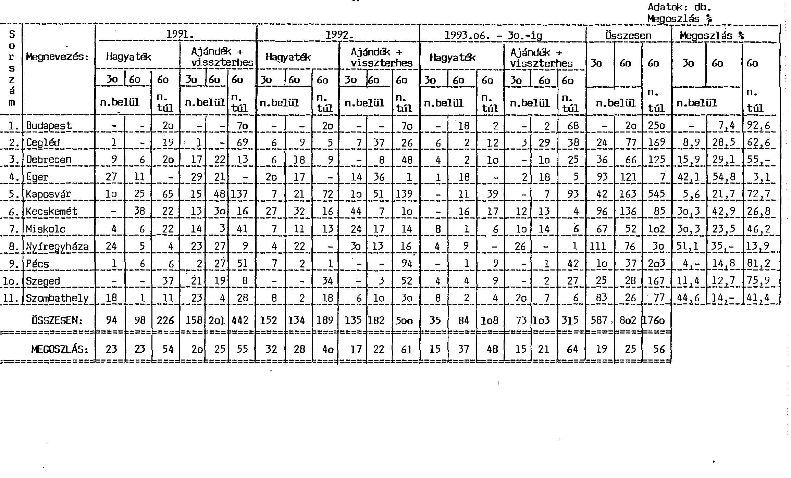
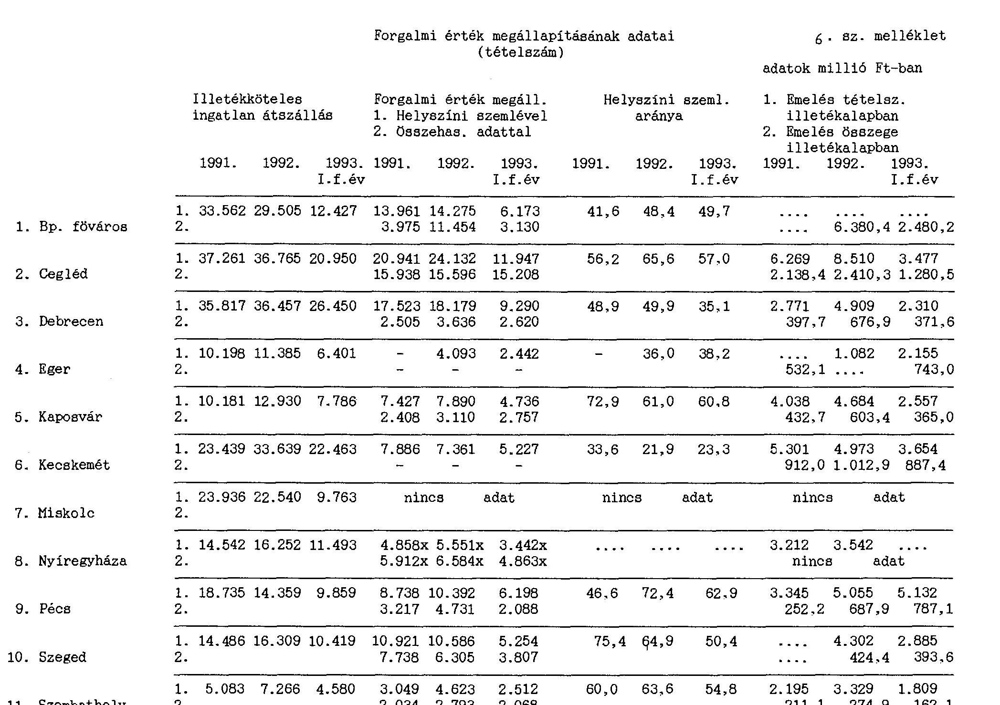

# Sillami Sramverösxék 

## JELENTÉS

az Illetékhivatalok tevékenységének ellenôrzésérôl

---

# JELENTÉS 

## Az Illetékhivatalok tevékenységének ellenôrzésérôl

Az 1989. évi XXXVIII. tv. szerint az Állami Számvevőszék ellenőrzi az Illetékhivatalok tevékenységét, a törvényi felhatalmazás alapján az 1993. évi munkatervünkben foglaltak szerint került sor az ellenőrzés lefolytatására.

## A vizsgálat célja annak megállapítása volt, hogy

- az illetékhivatalok szervezetének kialakítása, müködési rendjének, érdekeltségi rendszerének szabályozása hogyan felelt meg a magasabb szintű jogi szabályozásnak;
- az illetékek megállapítása, beszedése, végrehajtása a törvényeknek megfelelt-e.

Az illeték olyan kötelezettség, melyet eseti vagy járulékos jelleggel állami szolgáltatás igénybevételéért vagy valamilyen vagyon megszerzéséért egyszeri díj, illetve tartalmát tekintve vagyonadó formájában kell megfizetni.

Az illetékfizetési kötelezettség néhány kivételtől eltekintve egyaránt érinti a magánszemélyeket, a gazdálkodó- és egyéb szerveket.

Az 1990. évi XCIII. illetéktörvénynek megfelelően 1993. december 31-ig az illetékhivatali bevételek döntően az önkormányzatokat illették meg.
1994. január 1-jétől a Magyar Köztársaság 1994. évi költségvetéséről szóló 1993. CXI. tv. 24. paragrafusa szerint a megyei illetékhivatalok, valamint a Fővárosi Illetékhivatal által beszedett illeték 50\%-a központi költségvetést, 50\%-a pedig a törvényben foglalt szabályok szerinti megosztásban az önkormányzatokat illeti meg.

Az önkormányzati rendszer létrejöttével átrendeződtek az illetékügyi hatáskörök. Ezt megelőzően a fơvárosban és a megyékben illetékhivatal, a megyei városokban

---

adó- és illetékhivatal látta el az illetékekkel, valamint egyes igazgatási szolgáltatások díjának kezelésével, nyilvántartásával és ellenőrzésével kapcsolatos elsőfokú adóigazgatási feladatokat.

Az 1991. évi XX. ún. hatásköri törvény a főváros, a megyei jogú város, illetve kijelölt város (fő)jegyzőjének hatáskörébe utalta az illeték feladatokkal kapcsolatos elsőfokú eljárás lefolytatását.

A hatáskörre és bevételek megosztására vonatkozó szabályok módosítása szükségessé tette az illetékhivatalok szervezeti kereteinek átalakítását, integrálni kellett azokat az érintett polgármesteri hivatalok szervezetébe. Eleget kellett tenni a bevételek és költségek megosztását biztosító együttmüködési rendszer kialakítására, funkcionálására vonatkozó követelményeknek.

Az illetékhivatali jogalkalmazás során egyidejűleg kell érvényesíteni a bevételi szempontokat, a költségvetési érdekeket, s az illetékmentességgel, kedvezményekkel is támogatott társadalompolitikai, gazdaságpolitikai célokat.
Központi szabályozás hiányában azonban a hivatali szervezetben, a működésben, valamint a feladatellátás tekintetében szükségtelen, illetve a szakmai tevékenységet akadályozó különbségek is keletkeztek.

A vizsgált időszakon - 1991-1993. I. félév - belül 1992-ben az illetékbevételi előirányzat országosan 9,5 milliárd forint. Az összes befizetés 9,9 milliárd forint volt, melyből mintegy 0,4 milliárd forintot visszafizettek.Az előző évhez képest a befizetés annak ellenére növekedett $5,2 \%$-kal, hogy közben a tételszám közel $8 \%$-kal 57 ezer darabbal csökkent 684 ezerre. Az összegszerű növekedés alapvetően annak tudható be, hogy a nagyobb forgalmi értékek után állapították meg az illetékeket (infláció, privatizáció).
Az életszínvonal alakulása, a lakosság és a gazdálkodó szervek fizetőképességének romlása miatt a hátralékok növekedtek. Ennek összege országosan 1991. december 31-i 3,6 milliárd forinthoz képest 1992. év végére $11,8 \%$-kal növekedett és megközelítette a 4 milliárd forintot.

A költségvetésben betöltött súlyuk és nagyságrendjük alapján a bevételekben részesülő önkormányzatok érdekeltsége eltérő.
A megyei jogú városok és a főváros költségvetésében az illetékbevétel részaránya alacsonyabb, míg illetékügyekben hatáskörrel nem bíró megyei önkormányzatoknál költségvetésük volumenéből adódóan is nagyobb a szerepe, erősebb a bevételi érdekeltség. Az érdekeltségnek a bevételek növelésére irányuló hatásfokát ugyanakkor gyengítik az illetékbevételek megosztására vonatkozó szabályok.

---

A gazdaság átalakulása, a privatizáció felgyorsulása, a magántulajdon térhódítása, az átruházásra kerülő vagyontárgyak hagyományos körét kibővítette. Rendszeresebbé válik, hogy az ügylet tárgya vállalkozói vagyon /gyár, gyártelep, ipartelep, üzem, üzlet stb./, vagy termőföld. Az ilyen típusú ügyekhez a korábbi módszerek és ismeretek az illetékalap, a forgalmi érték megállapításához nem alkalmasak, illetve nem elégségek. A munkát nehezíti, hogy ebben a vagyoni körben az értékviszonyok kialakulatlanok, változásukra ható tényezők sokrétübbek, bonyolultabbak.
1991. január 1-jétől az adózás rendjének (továbbiakban ART) egységes szabályozásával az illetékbevételek végrehajtási eljárásában is új követelmények jelentkeztek a hivataloknál. A fizetési kötelezettségüket önként, határidőben nem teljesítőkkel szemben, a végrehajtási cselekményeket önállóan kell ellátniuk, sőt 1994. január 1-jétől az ingatlan végrehajtást is az elsőfokon eljáró adóhatóságnak kell lefolytatni.

1991 óta az országban 20 illetékhivatali szervezet múködik a polgármesteri hivatalokon belül, amelyből 11-nél folytattunk ellenőrzést (1. sz melléklet). Az ellenőrzés alá vont hivataloknál az 1992. évi kirótt illeték összege 8 milliárd forint volt, a hátralék 1992. december 31-i összege 3,4 milliárd forint, a befizetett, illetve beszedett illetékek összege 7,2 milliárd forint.

Az elvégzett vizsgálataink a kötelezettségek, befizetések nagyságrendjét tekintve átfogták az illetékügyi munka közel $80 \%$-át.

# A vizsgálat részletes megállapításai 

## I. Illetékhivatalok szervezete, müködési rendje

## I/1. Az Illetékhivatalok szervezete.

Az 1991. január 1-jével hatályba lépett 1990. évi helyi adókról rendelkező C. tv. 44 §-a és az 1991. évi XX. tv. 141. §-a az illetékügyekkel kapcsolatos I. fokú hatáskört a megye székhelye szerinti városi önkormányzat,
Pest megyében a köztársasági megbízott által kijelölt város (Cegléd), a fővárosban a Fővárosi Önkormányzat (fő) jegyzójéhez telepítette.

E hatáskör megjelölés a megye székhelye szerinti városi illetékhivatalok mellett önálló jogi személyiséggel rendelkező megyei illetékhivatalok által gyakorolt

---

hatáskör megszünését vonta maga után, ami egyúttal ezen illetékhivataloknak, mint szervezeteknek a megszűnését is jelentette.

A hatáskör módosításából következő szervezeti változás módjára, idejére, eljárási rendjére vonatkozóan semmilyen központi szabályozás nem jelent meg azon túlmenően, hogy az előbb említett törvény rögzítette a jegyző illetékhatósági feladatait Megyei Illetékhivatal elnevezéssel látja el.

Az 1990. évi CIV. tv. - a Magyar Köztársaság 1991. évi állami költségvetésről és az államháztartás vitelének 1991. évi szabályairól - 1. § (7) bek-e az 1991. évben keletkező illetékbevételeket úgy osztja el, mintha azt a megyeszékhely város illetékhivatala szedné be, ekkor azonban még a megyei illetékhivatalok is, mint a megyei önkormányzat önálló jogi személyiségủ szervei rendelkeztek a szükséges hatáskörrel.

A jogszabályok rendezetlensége, összehangolatlansága és hiánya "eredményezte" azt, hogy a korábbi megyei illetékhivatalok eltérő időpontban, eltérő szervezeti megoldásban és eltérő elnevezéssel integrálódtak be a megyeszékhely város - Pest megyében a kijelölt Cegléd város - polgármesteri hivatalának szervezetébe.

A szervezeti integrálódás 1991. 01. 30. (Kaposvár) és 1991. 12. 19. (Pécs) közötti időpontokban történt meg, az érintett testület(ek) által is rögzített formában.

Az önkormányzatok polgármesteri hivatalainak szervezetében vagy mint tiszta profilú illetékügyi feladatokat ellátó egységek - illetékhivatalok, illetékirodák -, vagy az adó- és illetékügyeket egyaránt ellátó szervezeti egységek -Adó- és Illetékhivatal - alakultak ki.

Cegléd, Kaposvár, Kecskemét, Pécs, Szeged, Szombathely városoknál Megyei Illetékhivatal, Debrecen, Eger, Miskolc, Nyíregyháza városoknál Adó- és Illetékhivatal alakult meg.

Nyíregyháza városnál a városi illetékességi feladatokat a Városi Adó- és Illetékiroda, a megyei illetékességi feladatokat a Megyei Illetékhivatal látja el, helyileg és szervezetileg elkülönülve, de a Polgármesteri Hivatal részeként. (Továbbiakban az eltérő elnevezések miatt a városok nevét használjuk az illetékhivatalok jelölésére.)

Az illetékhivatalok Szombathely és Debrecen megyei jogú városokban önálló, Budapest fővárosban és Cegléd városban részben önálló költségvetési szervként,

---

a többi városnál, mint a polgármesteri hivatal önállósággal nem rendelkező belső szervezeti egységeként müködnek.

A hatásköri törvényben megjelölt elnevezésből következtethetően az illetékfeladatokat a polgármesteri hivatalon belül elkülönült szervezetben - Megyei Illetékhivatalban - kell ellátni.
A törvény egyértelmú rendelkezésének hiányában azonban nem nevezhető törvénysértőnek azon szervezeti megoldás sem, amelyik a helyi adó- és illeték egy részlegben való kezelését határozta el.

A hivatal belső szervezeti felépítésére sem született központi intézkedés, így az önkormányzatok saját hatáskörben hozott - hozható - döntése következtében nem egységes elvek alapján alakult ki a hivatal.

Különbség van az elnevezésben (osztály, csoport), az egységek számában, és a feladat tartalmában is.

Pécs város a beszedés-végrehajtás feladataira még nem hozott létre belsó szervezeti egységet, ugyanakkor megítélésünk szerint a feladattal összeférhetetlen módon a forgalml érték megállapítására 1991 óta a hívatal dolgozóiból GMK alakult.

Több hivatalnál a beszedést-végrehajtást ellátó részleg a helyi adóval kapcsolatos feladatokat is ellátja.

A szervezeti felépítést vagy a Polgármesteri Hivatal Szervezeti és Működési Szabályzata, ill. az annak mellékleteként elfogadott Ügyrend, vagy a hivatal saját ügyrendje határozza meg, de előfordul olyan eset is, amikor a hivatal belső felépítése nincs érvényesen írásban szabályozva. (Miskolc, Nyíregyháza.)

Tapasztalatunk szerint a Polgármesteri Hivatalok napirenden tartják a szervezet korszerűsítését, a feladatoknak való jobb alkalmazkodás érdekében. Ennek következtében változtatásokat hajtottak, ill. terveznek végrehajtani.

A Fővárosi Illetékhivatal és Cegléd Város Megyei Illetékhivatalának szervezete is több alkalommal módosult 1991. január 1-je óta, amíg jelenlegi, korszerübb formáját elnyerte.

Szombathely város tervezi a munkarend és a szervezeti felépités finomítását az értékelő - helyszínelő- kiszabó - végrehajtó munka hézagmentes egymásra épülése érdekében.

---

A szervezeti felépítés meghatározása mellett a munkafolyamatok szabályozása gyakorol meghatározott befolyást a feladatellátásra.

Részletes szabályozás csak azokban a hivatalokban történt meg, ahol a hivatalok saját ügyrenddel rendelkeztek. (Cegléd, Eger, Szombathely)

Amennyiben az illetékfeladatok ellátásának szabályait csak a polgármesteri hivatal SZMSZ-e, vagy ügyrendje tartalmazza, ott mindössze a fó feladatok meghatározása történt meg, és a részletes "folyamatszabályozás" gyakorlatilag kézi vezérléssel történik. (Nyíregyháza, Debrecen, Miskolc).
A fóbb munkafolyamatoknak számító iktatás, értékmegállapítás, kiszabás, behajtás-végrehajtás folyamatát, kapcsolódási pontjainak meghatározását csak egységes elvekre épülő írásba foglalt szabályozás képes biztosítani.

A kiadmányozási jogkör, az 1991. évi XX. törvény hatáskör meghatározásából következően a megyeszékhely város jegyzőjét illeti meg. A jegyzők a kiadmányozás jogát teljeskörűen sehol nem gyakorolják.

Az ellenőrzési tapasztatok szerint a kiadmányozás jogkörét a jegyzők általában teljeskörűen átadták a hivatalvezetőknek és beosztottjaiknak, így az illetékhivatali feladatok jegyzöre való "telepítése" a gyakorlatban nem funkcionál.

A vizsgálatba bevont hivatalok dolgozói többségében 1993-ban már rendelkeztek munkaköri leírással. Az elkészült és a dolgozók által is megismert munkaköri leírások kevés kivételtől eltekintve megfelelő részletezettséggel tartalmazták az ellátandó feladatokat.

Miskolcon a hivatalnál a dolgozóknak nincs munkaköri leírása.
Debrecen város hivatalánál a csoportvezetők nem rendelkeztek munkaköri leírással.

A Fővárosban nem tartalmazták a folyamatba épített ellenőrzési feladatokat, a kiadmányozási jogosultságot.

Megítélésünk szerint a jelenleg foglalkoztatott létszám - a jelzett körülmények között - nem tudta maradéktalanul elvégezni a hivatalokra háruló feladatokat, sem a határidőben történő ügyintézés, sem az illetékbevételek vonatkozásában.
A vizsgálatba bevont több mint 3000 ügy közel felénél 60 napnál több idő telt el az iktatás és a fizetési meghagyás kibocsátása között. A feladatellátás gondjait

---

jelzi a hátralék dinamikus emelkedése is, mivel a vizsgált körben a folyó évi előíráshoz viszonyított aránya az 1991. évi 37,2\%-ról 43,7\%-ra emelkedett egy év alatt.

Mindez annak ellenére következett be, hogy a létszám a vizsgált 11 hivatalnál 1991-hez képest 1992-re 6,6\%-kal 587 fơről 626 fôre növekedett, míg az 1 fôre eső ügyszám 571 db-ról 550-re csökkent. (2. számú melléklet).

Megjegyezzük, hogy az illetékügyekkel foglalkozók létszámát nem lehet pontosan meghatározni, mivel az adó- és illetékhivatalok esetében - elsősorban a behajtás-végrehajtás területén, a dolgozók adó- és illetékfeladatokat egyaránt ellátnak.

A belső ellenőrzés alapvetően a vezetői és a munkafolyamatokba épített ellenőrzés rendszerében valósul meg. Függetlenített belső ellenőrt Debrecenben és Kecskeméten foglalkoztatnak.

A vezetői és munkafolyamatokba épített ellenőrzési feladatokat az ügyrend és a munkaköri leírások határozzák meg. Cegléd város hivatalának vezetője belső ellenőrzési szabályzatban, Kaposvár város hivatalának vezetője belső utasításban szabályozta a belső ellenőrzés rendszerét.

Megítélésünk szerint törvénysértő az a gyakorlat, hogy a hivatalt vezető jegyző helyett az illetékügyi részleg vezetője adja ki a belső ellenőrzési utasítást.

A számítógépes nyilvántartás, feldolgozás programja az ellenőrzési igényeket csak részlegesen elégíti ki, illetve azt kellően nem segíti.
Az ellenőrzések tapasztalatai azt mutatják, hogy a vezetői és munkafolyamatokba épített ellenőrzések eltérő színvonalon funkcionálnak, az ügyszámok folyamatos növekedése, az ügyintézési határidő csúszások, a hátralék volumenének és arányának növekedése arra figyelmeztet, hogy a belső ellenőrzés rendszerének újragondolása és hivatali szinten történő szabályozása szükséges.

I/2. Az illetékbevételek és költségek alakulása, megosztása, valamint szerepe az önkormányzatok költségvetésében.

Az 1991. évi illetékbevételek önkormányzatok közötti megosztását az 1990. évi CIV. tv. 1. § (7) bekezdése úgy szabályozta, hogy a megyeszékhely

---

illetékességi területén beszedett összeg - Pest megyében a kijelölt - város önkormányzatát, míg a megye illetékességi területén beszedett összeg a megyei önkormányzatot illeti meg. A beszedés költségei a megyei önkormányzatot illető bevételt terhelték.

Az 1991. évi XCI. 14. §-a az 1992. évi illetékbevétel megosztását úgy változtatta, hogy egyrészt a nem megyeszékhely megyei jogú városokat is részesíti az illetékességi területükön befolyt illeték bevételekből, másrészt a megye illetékességi területén beszedett bevétel $30 \%$-a közvetlenül a megyei önkormányzatot, $70 \%$-a egyenlő összegben valamennyi megyei önkormányzatot illeti meg. A beszedés költségeinek megosztását az érintett önkormányzatok megállapodására bízta a törvény, és úgy rendelkezett, hogy a megyei önkormányzatokat terhelő költségeket a megyeszékhely városnál illetékbevételként el kellett számolni.

Ez a szabályozás érvényesült az 1993. évi illetékbevételek vonatkozásában is.
Az 1994. évre vonatkozóan ismét változott a szabályozás, ugyanis az 1993. évi CXI. tv. 24. § (1) bek. szerint beszedett illeték 50 \%-a a központi költségvetést illeti meg, s a maradó $50 \%$-ot a korábbiak szerint megosztják, valamint ezt a részt terhelik a beszedés költségei is.
A vizsgált 11 illetékhivatal által beszedett illetékbevétel 1991-ben és 1992-ben lényegében azonos - 7,2 milliárd forint - szinten volt.

Országosan egységes számítógépes program biztosítja a város és a megye területét illető ügyek külön feldolgozását, így a ténylegesen keletkezett a megyeszékhely várost és megyét megillető bevételek összegének kimutatását a 14/1991.(V.21.) PM. sz. rendelet előírásainak betartása mellett.

A befolyt illetékbevételek kedvezményezettekhez történő utalásának rendjét az éves költségvetésről szóló törvény meghatározza, amely szerint - 1992. január 1-jétől - a tárgyhó 20-ig kell az azon időpontig beszedett illeték átutalását biztosítani. Az illetékhivatalok ezt a szabványt nem tudják betartani.

Ezen szabályozás ugyanis több ok miatt is problematikus:

- e szabályozás miatt az illetékhivataloknak minden hónapban gyakorlatilag két zárást kellett (volna) elkészíteniük.
- A szabályozás szerint a "megyei illetékhivatal minden hónap 20.napjáig... utalja az általa ezen időpontig beszedett illetékbevételt...."

---

# A 20 -áig beszedett bevételt 20 -án a zárási munkák idöszükséglete, a munkanapok alakulása, stb. miatt nem lehetséges utalni. 

A jogszabályok alkalmazásának nehézségeiből adódó eleve szabálytalan gyakorlat:

Debrecen a megyei érdekeltségủ bevételeket az előző hó utolsó napjának megfelelő állapot szerint átutalta.
A városi érdekeltségủ bevételeket viszont nem utalta át havi rendszerességgel. A rendszertelenül történő utalások száma 1991-ben 8, 1992-ben 5, 1993. I. félévben 3 .

Eger 1991. évben január és szeptember hónapban 5-5 millió Ft-tal kevesebh megyei bevételt utalt át, mivel ezen összegeket tartós betétként helyezte el az akkor még önálló, saját költségvetési számlával rendelkező hivatal.

Pécs a havi utalások kiszámításánál nem vette figyelembe a visszatérítések összegét, azzal év végén egy összegben korrigálta az utalandó összeget. Így év közben a szükségesnél nagyobb összegek kerültek átutalásra a megyei önkormányzat/ok/ javára.

Az illetékbevételek a bevételekkel érintett önkormányzatok költségvetésében eltérő arányt képviselnek (az önkormányzatok összes bevételeihez viszonyítva 2-10 \%), legnagyobb súlyuk a megyei önkormányzatok költségvetésében van.

Debrecen város költségvetésében 3\%-kal, Hajdú-Bihar megyei Önkormányzat költségvetésében $11 \%$-kal, Pécs város költségvetésében $1,98 \%$-kal, Baranya megyel Önkormányzat költségvetésében 4,95\%-kal szerepeltek 1992-ben az illetékbevételek az összes bevételhez viszonyítva.

A saját bevételeken belül már nagyobb szóródás tapasztalható és ebből a szempontból a megyei önkormányzatok esetében különösen meghatározó az illetékbevételek súlya.

Borsod-Abaúj-Zemplén megyel Önkormányzat 1992. évi saját bevételeinek $36 \%$-át tette ki az illetékbevétel. Miskolc város esetében ez az arány 7,3 \%-os.

A Szabolcs-Szatmár-Bereg megyel Önkormányzat 1992. évi saját bevételeinek $19,5 \%$-át, Nyíregyháza város saját bevételeinek $7,7 \%$-át tette ki az illetékbevétel.

A bevételek tervezésének pontosságát a vizsgált időszak alatt több tényező nehezítette.

---

A változó illetékmértékek csupán megközelítő pontosságú tervezést tettek lehetővé, mivel a folyamatban lévő ügyeket az előző mértékek szerint kell befejezni.

A bevételek megosztására vonatkozó 1992. évtől hatályba lépett szabályozás szintén bizonytalanságot okozott, különösen a megyei önkormányzatok esetében, és nem volt pontosan felmérhető a privatizációs ügyek illetékbevételre gyakorolt hatása sem.

A beszedési költségek kimutatását és megosztását az érdekelt önkormányzatok között az illetékhivatalok belsô szervezeti tagozódása automatikusan nem biztosítja. A belsó munkamegosztás ugyanis inkább a munkafolyamathoz, mint a területhez kapcsolódik.
Ebből következően a költségek kimutatását és elszámolását illetően nincs egységes gyakorlat. A megoldás a megyei és a városi önkormányzatok megállapodása lehetne, amelyek azonban nem minden esetben készülnek el időben, valamint teljesítésükről sincs rendszeres számadás.

Az illetékhivatalok müködtetésének költségei az önkormányzatok költségvetésében eltérő módon jelennek meg:
-azon hivatalok esetében, ahol a hivatal önálló, vagy részben önálló gazdálkodási jogkört kapott, a felmerült költség a polgármesteri hivatal költségvetésén belül kimutatható (Budapest, Cegléd, Kaposvár, Szombathely),
— az önálló költségvetési szervként múködő debreceni Városi Adó- és Megyei Illetékhivatal esetében a megyei feladatokat érintő költségeket részletes analitikával kimutatják, a városi adó- és illeték bevételekkel kapcsolatos költségek viszont nem különíthetők el,
—a polgármesteri hivatalok részét képező, gazdálkodási önállósággal nem rendelkező hivatalok tényleges költségei csak abban az esetben mutathatók ki, ha a hivatal ténylegesen felmerülő költségeit a számvitelben elkülönítik (Kecskemét,Szeged).
— Nyíregyháza megyei feladatot ellátó Illetékhivatala mind elhelyezésében - a Megyei Önkormányzat épületében -, mind szervezetében elkülönítve látja el feladatát, így költségei pontosan kimutathatóak (a városi feladat költségei viszont nincsenek elkülönítve).

---

Az előbbi "sokszínűség" mellett a vizsgált hivataloknál az illetékbeszedéssel kapcsolatos költség 1992-ben megközelítőleg 628 millió forintot tett ki (3. sz. melléklet), amely a befolyt 7,2 milliárd forint bevétel $8,7 \%$-a. A 100 Ft illetékbevételre eső $8,7 \mathrm{Ft}$-os átlagos költség jelentősen szóródik - a fővárosi 4,6 Ft-tól, Debreceni 21,6 Ft-ig - az egyes hivatalok között.

Az egy fôre eső̉ bevétel a Fővárosban - 22,8 millió Ft/fő - a legnagyobb, a költségek viszonylag átlagos 1 fôre jutó 1 millió forintos aránya mellett. Debrecenben az 1 fôre eső̉ bevétel a legalacsonyabb 7,2 millió Ft/fő, míg az 1 fôre eső költség 1,5 millió Ft/fő.

Az éves költségvetésről szóló törvények meghatározták azt, hogy az illetékbeszedés költségeinek megosztását az érdekelt önkormányzatok megállapodásban rögzítsék. A törvényi előírás "a megállapodásnak tartalmaznia kell a költségek körét és mértékét, az elszámolás ellenőrzésének módját."

Nincs kifejezetten előírás arról, hogy a megállapodást évenként milyen időpontig kell megkötni.

A megállapodások megkötése eltérő időpontokban, eltérő tartalommal történt. Elöfordult, hogy az önkormányzatok egyes esetekben és években nem rendelkeztek érvényes megállapodással.

Cegléd város és Pest megye önkormányzata elsó ízben 1993. 04. 02-án kötött megállapodást a költségek viseléséről, ahol a költségviselés arányát bevételarányosan $2,5-97,5 \%$-ban határozták meg. Az ezt megelőző években ettől lényegesen eltérő mértékben viselték a költségeket, amiről a megállapodásban kijelentették, hogy azokat tényként fogadják el.
A megállapodás a költségek bontását nem tartalmazza.
Pécs mj. város és a megyel önkormányzat között első ízben 1991. 12. 11-én jött létre megállapodás, amit újabb nem követett.
A megállapodás hiányos, mert pl. a költségek nincsenek részletezve, a közös költségen beszerzett eszközök tulajdoni-használati joga nincs meghatározva. A két önkormányzat között nincs kialakult együttmüködés.

A költségmegosztás általában a bevétel arányában történik. (Az előző évi tényleges, vagy a tárgyévi bevétel).

Ettől eltér a Kaposvár-1 önkormányzat és a Somogy megyel Önkormányzat által kötött megállapodás tartalma, ahol a lakosságszám arányában, míg Debrecen és Hajdú-Bihar megyei önkormányzatok a tényleges felmerülés arányában osztják meg a költségeket.

---

A megállapodások nem minden esetben rendelkeznek a tervezett és tényleges költségek eltérésének rendezéséről, a felhasználás ellenőrzéséről.

Az önkormányzatok között létrejött megállapodások rendezték a korábban önálló illetékhivatalok tulajdonában volt eszközök tulajdoni-használati kérdéseit. A rendezés az ingatlanon kívüli eszközök vonatkozásában alapvetően kétféle formában valósult meg:

- Az eszközök továbbra is a megyei önkormányzatok tulajdonában maradtak és arra ingyenes használati jogot biztosított a városi önkormányzat szervezetébe tartozó illetékhivatal számára.
(Kecskemét, Nyíregyháza, Miskolc, Szombathely).
- Az eszközök térítésmentesen átadásra kerültek a városi önkormányzat részére, azokat a városi önkormányzat tartja nyilván és szerepelteti vagyonmérlegében. (Cegléd, Debrecen, Eger, Kaposvár, Pécs, Szeged)

Az ingatlanok - amennyiben a megyei önkormányzat tulajdonában voltak általában továbbra is a megyei önkormányzatok tulajdonában maradtak, s azokra vagy a városi önkormányzat, vagy az illetékhivatal ingyenes használati jogot kapott, amit az ingatlan nyilvántartásba bejegyeztettek, de tapasztaltunk más megoldást is.

Kaposvár esetében az 1993. 05. 27 -én megkötött megállapodás szerint a megyei önkormányzat térítésmentesen a városi önkormányzat tulajdonába adta az illetékhivatal által használt ingatlant azzal a kikötéssel, hogy a feladatváltozás esetén a városi önkormányzat szintén térítésmentesen visszaadja a tulajdon jogot.

A közös költségen beszerzett eszközök tulajdonlásának kérdésére nem tér ki minden megállapodás.
A gyakorlat azt mutatja, hogy a megállapodások megkötése óta eltelt időben beszerzett eszközök annak az önkormányzatnak a vagyonnyilvántartásában szerepelnek, amelyik a megállapodás szerint könyv szerinti tulajdonosa az illetékhivatal által használt vagyonnak.

# I/3. Érdekeltségi rendszer 

A főváros, - a megyeszékhely város - és a megyei jogú városok önkormányzatai közvetlenül érdekeltek az illetékbevételek összegének alakulásában, mivel - 1993.

---

december 31-ig teljes mértékben, 1994. január 1-jétől 50\%-ában - az illetékességi területen keletkezett és beszedett illeték saját bevételként funkcionál.

Az önkormányzatok érdekeltsége eltérő.
A megyei önkormányzatok érdekeltsége ugyanis nem egyértelmü, mivel közvetlen a megye területén képződő bevétel 30\%-át - 1994. I. 1-jétől a maradó bevétel $30 \%$-át - kapták meg, a $70 \%$-ból arányosan részesedett a 19 megye. E szabályozást elsősorban azon megyei önkormányzatok sérelmezik, ahol a visszaosztásból származó bevétel kevesebb a megyében keletkező bevételnél.

1992-ben a Pest Megyei Önkormányzat 466,7. a Bács-Kiskun Megyei Önkormányzat 64, a Baranya Megyei Önkormányzat költségvetésébe 45 millió Ft-tal kevesebb bevétel került, mint a megye területén képződő illetékbevétel.

A munkavégzés minőségére, színvonalára a városi önkormányzat, mint munkáltató tud elsősorban ráhatást gyakorolni.
A megyei önkormányzatok az évente megkötendő megállapodások feltételrendszerének és a személyes érdekeltségi rendszer kialakításának kidolgozásában való részvétel útján tudják érdekeltségüket érvényesíteni.
Ez a lehetőség kevés ahhoz, hogy a megye érdemben hatást tudjon gyakorolni a bevételek alakulására.

Az 1994. január 1-jétől érvényes szabályozás gyengítette, illetve gyengíti az önkormányzatok - különösen a megyei önkormányzatok - érdekeltségét, mivel a befolyt illeték 50\%-a a központi költségvetést illeti meg, ezzel szemben az illetékbeszedés összes költségét az önkormányzatok viselik. Ebből következően - bár az illetékmértékek emelkedtek - az önkormányzatok illetékbevétele várhatóan csökken a korábbi szabályozással elérhető bevételhez képest.

Az 1990. évi C. tv. 45. §-a rendelkezik arról, hogy a helyi önkormányzat az ügykörébe tartozó adók és illetékek hatékony végrehajtásának, illetőleg alkalmazásának elősegítésére a beszedett illetékek terhére rendeletben szabályozhatja az anyagi érdekeltség feltételeit.

A szabályozás feltételrendszerét, tartalmát, módját jogszabály nem rögzíti, arra vonatkozóan iránymutatás, utasítás a pénzügyminisztériumtól sem jelent meg. Ennek következtében az érdekeltségi szabályozás az azonos tartalmú feladatellátás mellett olyan különbözóségeket mutat, amelyeket nem indokolnak egyedi sajátosságok.

---

Az érdekeltségi alapok képzésének szabályait az önkormányzatok lényegében minden kötöttség nélkül alkothatják meg.

Az anyagi érdekeltségre vonatkozó rendeletek megalkotása előtt az önkormányzatok többsége elvégezte a szükséges egyeztetést és a meghozott rendeletek az önkormányzatok egyetértését tükrözik.

Előfordultak azonban olyan esetek is, amikor vagy nem az egyeztetésnek megfelelően alkották meg a rendeletet, vagy nem történt egyeztetés, vagy mindkét önkormányzat alkotott rendeletet.

Cegléd város úgy alkotta meg rendeletét, hogy az előzőleg emlékeztetőben rögzített $5 \%$-os mérték helyett $6 \%$-ban határozta meg az illetékbevételből, érdekeltségi alapba helyezendő összeg nagyságát.

Debrecen város által alkotott rendelet megalkotása előtt a megyei önkormányzattal nem történt egyeztetés.

Pécs Megyei Jogú Város esetében a megyei és a városi önkormányzat egyaránt rendelkezett az érdekeltségi kifizetésekről, egyeztetés nélkül, egymástól függetlenül.

A vizsgálat időpontjáig minden illetékhivatalt müködtető önkormányzat megalkotta az anyagi érdekeltséget szabályozó rendeletét. Azoknál az önkormányzatoknál, ahol adó- és illetékhivatal müködik, ott mindkét tevékenység érdekeltségi szabályait rögzíti a megalkotott rendelet.

Az érdekeltséget szabályozó rendeletek - Kecskemét kivételével - az érdekeltség rendszerét érdekeltségi alap létrehozásával biztosítják.

A rendeletek meghatározzák az érdekeltségi alap forrását, az alapból részesülők körét, a kifizetés feltételeit, az alap kezelésének módját.
Az 1992. évre vonatkozó szabályozás néhány jellemzője, anomáliája:
A képzett forrás nagysága a beszedett illetékbevételek 1,19 - 7,9\%-a között szóródik.

Cegléd Város Illetékhivatal az alap forrásakénl az illetékbevétel 6\%-át és a késedelmi pótlék összegél határosta meg. (Összesen 7,9\%).

Kecskemét Megyei Jogú Város nem hozott létre érdekeltségi alapot, hanem a kifizetés feltételeit és nagyságát határozta meg. A ténylegesen kifizetendő összeget tartja vissza az illetékbevételből és utalja át a költségvetési számlára $(1,19 \%)$.

---

A forrásképzés módja néhány esetben magába foglalja az illetékügyi munka hatékonyabb végzésére való törekvést.
Ezt jelzi, hogy része az alapnak a forgalmi érték emelésből származó illetéktöbblet meghatározott hányada, a késedelmi pótlékra elszámolt összeg, és a meghatározott mértékủ bevételi teljesítés. Gyakran viszont az érdekeltségi alap nagyságát csak az illetékbevétel meghatározott \%-ában határozta meg az önkormányzat. (Nyíregyháza 3\%, Pécs 5\%, Szeged 5\%).

Legtöbbször az érdekeltségi alapokból teljesített kifizetések inkább jövedelem kiegészítésként, mint a személyes többletteljesítmény, illetve egy bizonyos folyamat alakulására kifejtett személyes ráhatás eredményének elismeréseként funkcionálnak.

Ezt támasztja alá, hogy az érdekeltségi célú kifizetéseket szabályozó rendeletek a kifizetés feltételeiként jellemzően általános célokat, pl.: a tervezett előirányzat teljesítése, az éves előíráshoz viszonyított bevétel nagysága stb. fogalmaznak meg.

Az egy fóre eső felhasznált érdekeltségi kifizetés szélső értékei között többszörös különbség van.

Miskolc Illetékhlvatalának dolgozói átlagosan 21.000 Ft. Cegléd Város Illetékhlvatalának dolgozói 244.000 Ft érdekeltségi kifizetésben részesültek személyenként 1992-ben. (4. sz. melléklet)

Az érdekeltségi alapból esetenként az illetékügyekkel nem közvetlenül foglalkozó személyek részére is biztosít az önkormányzati rendelet kifizetést.

Ft: Pécs Megyel és Városi önkormányzatainak választott tisztségviselöi egyaránt részesedtek 1992-ben az érdekeltségi alapból.
A megyei önkormányzat tisztségviselői 1992. évben 622 ezer Ft bruttó juttatásban ( 2 fö), a megyei jogú város tisztségviselöi 1.713 ezer Ft bruttó juttatásban részesültek ( 3 fö). A városi tisztségviselők a decemberben számfejtett 990 ezer Ft-ból eredő 584 ezer Ft nettó jutalékot helyi közérdekủ alapítványok részére átutaltatták. A város egyik alpolgármestere minden ilyen jellegü jutalmáról korábban is lemondott.

Az előbbiek jól szemléltetik azt, hogy a hatékonyabb munkavégzés ösztönzésének szándékával megvalósított érdekeltség jelenlegi rendszere csak részben alkalmas funkciójának betöltésére.

---

A vizsgálattal érintett időszakban - esetenként - jelentős nagyságrendủ volt a személyes érdekeltség céljára fel nem használt pénzeszköz állomány.

Cegléd Város Illetékhivatala 1993. VI. 30-ig 160.770 ezer Ft-ot nem használt fel személyi ösztönzésre (ebből 106.468 ezer Ft-ot fejlesztési célokra használt fel, 36.979 ezer Ft-ot általános tartalékba helyezett.)

Debrecen Megyel Jogú Város 41.940 ezer Ft-ot nem használt fel személyi ösztönzésre 1993. X. 5-i helyzetnek megfelelően.

Kaposvár Megyei Jogú Város érdekeltségi alap maradványa 1992. év végén 15.497 ezer Ft volt.

Budapest Fővárosi Illetékhivatal érdekeltségi alapjából 152.748 e Ft nem lett személyi ösztönzési célokra fordítva 1993. június 30-i állapot szerint.

Az érdekeltségi alap maradványok jelzik, hogy egyes esetekben a szükségesnél és indokoltnál nagyobb mértékủ az érdekeltségi alapképzés. A megyei illetékhivatalok esetében ez a tény sérti a jelenlegi szabályozási elveket, mert a túlzott mértékű alapképzés a többi megyét megillető bevételeket rövidíti meg.

A feladat azonossága, a szabályozásban megnyilvánuló és évről-évre erősödő központi akarat az érdekeltségi alapok képzésében, kezelésében, felhasználásában is meg kellene jelenjen. Keretjellegủ szabályok, kiküszöbölhetnék a jelenleg meglévő és érvényesülő többszörös nagyságrendi eltéréseket, különbségeket.

# II. Illetékhivatalok tevékenysége, feladatellátása 

II/1. Illetékköteles szerződések, értesítések bemutatása, illetékhivatalhoz való továbbítása, feldolgozása, adatszolgáltatások teljesítése

Az ajándék és a visszterhes vagyonszerzés iratait az ingatlan nyilvántartásba történő bejegyzést követően a földhivatal küldi meg az illetékhivatalnak.
Az ingatlannyilvántartásról szóló 1972. évi 31. sz. tv., valamint az államigazgatási eljárást szabályozó 1957. évi IV. tv. rendezi a földhivatali eljárást. A földhivatalokra is vonatkozik a 30 napos határidó, amelyen belül kell az iratokat elintézni és továbbítani az illetékhivatalhoz.

---

A vizsgálat tapasztalatai azt mutatják, hogy a földhivatalok adattovábbítása nem történik meg időben.

A reprezentatív ügyiratvizsgálat elemzéséből származó adatok szerint - eltérő mértékben -, de jelentős késedelemmel kapják meg az illetékhivatalok a kivetéshez szükséges alapiratokat.

A Pest megyei földhivatalok az ügyek 6,7\%-át küldték meg 30 napon belül.
Budapesten átlagosan 8,4 hónap az ügyirat továbbítás ideje.
A Szombathelyi Illetékhivatalhoz az ügyek 46\%-a érkezik meg 30 napon belül.

Hajdú-Bihar megyében 25-30\%-ban mérhető a 30 napon belüli földhivatali irattovábbítás aránya.

Összességében az ügyek közel felét 60 napon túl küldik meg az illetékhivatalnak.

A földhivatalhoz való érkezés és az illetékhivatalhoz való továbbküldés között eltelt idő bevételkiesést okozhat az önkormányzatoknál, amennyiben ez az idő a 3 hónapot meghaladja, mivel az illetéktörvény $68 \S$-a a forgalmi érték mérséklését írja elő. (1994. január 1-től 6 hónapot meghaladó késedelem esetén) A mérséklés mértéke elérheti a forgalmi érték $50 \%$-át.

A Fövárosi Illetékhivatal vezetőjének elemzése szerint a fővárosban a földhivatali elmaradás 1992. évben közel 17.000 db ügy és az ennek következtében vélelmezhető illetékkiesés 1,5 milliárd Ft-ra tehető.

A Cegléd Város önkormányzatához telepített Megyei Illetékhivatalnál a számítások szerint évente 50-80 millió Ft bevételkiesést okoz a késedelmes adattovábbítás.

A bevételkiesésen túlmenően a késedelem a behajtási-végrehajtási feladatokat is jelentősen megnehezíti, mert ezen idő alatt változások következhetnek be a fizetésre kötelezett lakhelyében, jövedelmi viszonyaiban, tulajdonviszonyokban stb.

A vizsgálatba bevont 11 illetékhivatal közül azonban a késedelem esetén alkalmazandó forgalmi érték mérséklést a jogszabályoknak megfelelően csupán a Fővárosi, valamint Cegléd és Miskolc Város Megyei Illetékhivatalánál alkalmazták. Pest megyében a késedelemhez hozzászámítják az ügyfél

---

késedelmét is, ezzel nagyobb mértékű forgalmi értékcsökkenést hajtanak végre.

Egerben a forgalmi érték csökkentését csupán a hagyatéki ügyeknél és csak abban az esetben alkalmazta, amikor az illetékhivatal a bejelentett forgalmi érték összegét megemelte.

A vizsgálatba bevont megyei illetékhivatalok többsége bármilyen időtartamú volt is a hivatali késedelem, a forgalmi érték csökkentését előiró jogszabályi rendelkezést nem alkalmazta, ezért törvénysértő módon járt el.

Az örökléssel kapcsolatos illetékkiszabás a közjegyzó által megküldött jogerős hagyatékátadó végzés alapján történik meg.

Az illetékkötelezettség keletkezésének időpontja a hagyaték megnyílta - az örökhagyó halálának napja. Ennek következtében van jelentősége annak, hogy a hagyaték megnyíltától számítva mikor kerül sor az illeték kiszabására. A hagyatéki eljárásról szóló többször módosított 6/1958.(VIII.4.) IM. számú rendelet szerint a polgármesteri hivataloknak a hagyatéki leltárt 30 napon belül kell elkészíteni és azt az elkészítéstől számított 5 napon belül el kell küldeni a közjegyzőhöz. A közjegyzó - hagyaték tárgyában hozott - végzésének illetékhivatalhoz való érkezése teszi lehetővé az illeték kiszabását.

Általános tapasztalat az, hogy a hagyaték megnyiltától az ügyek több hónap elteltével jutnak el az illetékhivatalhoz.

Cegléd Város Megyei Illetékhivatala esetében 5-9 hónap között van az átfutási idó.
Nyíregyháza város illetékügyei esetében átlagosan 8 hónap telt el a hagyaték megnyiltától a hivatalhoz történő érkezésig.

Debrecen Megyei Jogú Város Illetékhivatala az ügyek 28\%-át kapta meg 60 napon belül.

A késedelemben több tényező játszik szerepet.

- A polgármesteri hivatalok nem minden esetben továbbítják időben a hagyatéki iratokat.
- A közjegyzői eljárásban az örökösök felkutatása az örökség egyértelművé tétele esetenként hosszú időt vesz igénybe, különösen a póthagyatékok esetében.

---

A jogerős hagyatékátadó végzést a közjegyzők 15 napon belül kötelesek megküldeni az illetékhivatalnak, a közjegyzők e kötelezettségüknek többnyire eleget tesznek.

A bíróságok a feljegyzett eljárási illetékekről szóló értesítéseket általában időben megküldik az illetékhivataloknak. Az ügyintézést gyakran akadályozza az illeték kiszabáshoz szükséges adattartalom hiányossága. Különösen a tárgyalás mellőzésével meghozott döntések ügyeinél pontatlanok - azonosíthatatlanok a személyi adatok.

Az illetékhivataloknak az ügyek iktatásától számított 60 napon belül az illetékkötelezettséget tartalmazó fizetési meghagyásokat ki kell adniuk. Az 1957. évi IV. tv. az ügyintézési határidőt általánosságban 30 napban adja meg, amely adott esetben 30 nappal hoszabbítható.

Az ügyintézési határidők betartását a hagyatéki, ajándékozási és visszterhes vagyonszerzési ügyek vonatkozásában - véletlenszerűen kiválasztott - 3149 db kivetési irat feldolgozása során vizsgáltuk. Lásd: 5. sz. mell.

A vizsgálat tapasztalatai azt mutatják, hogy a hivatalok az ügyintézési határidőket csak részben képesek betartani.

A hagyatéki ügyek 49,4\%-nál 60 napon túl adták ki a fizetési meghagyást. Az ajándék- visszterhes ügyek esetében a 60 napon túl kiadott fizetési meghagyások aránya alacsonyabb, $38,6 \%$.

A Fővárosban 1991., 1992. évben 60 napon belül nem adtak ki fizetési meghagyást a vizsgált ügyekben.

Egerben viszont a hagyatéki ügyek 99\%-ánál. az ajándék- és visszterhes ügyek $95,2 \%$-ánál 60 napon belül kibocsátották a fizetési meghagyást.

Az ügyintézési határidők növekedésének egyik oka az iktatási késedelem.
Miskolcon állandósult az 1-2 hónapos iktatási késedelem.
Debrecenben a megyei részlegnél 1993. évben átlagban 2 hónap közelében volt az iktatási késedelem.

Az iktatási késedelem alapvetően a kiszabásra váró ügyiratokra jellemző. Az általános ügyintézéssel kapcsolatos iktatás - kérelmek, fellebbezések, stb. - a tapasztalatok szerint naprakész.

---

A kiszabási késedelmet - elsősorban a megyei ügyek esetében - az okozza, hogy a helyszíni értékfelülvizsgálat gazdaságossága érdekében az ügyeket összevárják. Az előzetes kiértesítések időpontjának egyeztetése esetenként nehézkes, az adathiányok pótlása időigényes feladat.

Az illetékhivatali késedelem konkrét bevételkiesést nem okoz, azonban a bevételek realizálódásának elhúzódása és az inflációs hatás miatt hátrányt okoz az önkormányzatok gazdálkodásában.

Az illetékhivatalok az adózás rendjéről szóló törvény előírásai szerint minden esetben eleget tettek az APEH-nek teljesítendő adatszolgáltatási kötelezettségeiknek. Az adatszolgáltatás gyakorlata azonban eltérő. Több esetben évente egy alkalommal a megadott határidőig teljesítik a hivatalok az adatszolgáltatási kötelezettséget, de előfordul a rendszeres évközbeni adatszolgáltatás is. (Szeged hetente teljesít adatszolgáltatást).

A Főváros havonta küldi meg az APEH-hez a hozzájuk bemutatott valamennyi szerződést, amelyen igazolják a forgalmi értéket, az illetékalapot és az illetéket.

A földhivatalok - a főváros kivételével - eleget tesznek adatszolgáltatási kötelezettségüknek. A szolgáltatott adatok azonban több esetben hiányosak, emiatt az általuk megküldött adatlapok egy részének kb. 10-15\%-ának nincs értékelhető információtartalma.

II/2 Az illetékkiszabási (megállapítási) munka törvényessége a forgalmi értékmegállapító munka és az eljárás törvényessége

Az illetékkiszabás során a törvényben előírt illetékmértékeket - eseti tévedésektől eltekintve - helyesen alkalmazták.

Pécsett a 300017/1993. sz. ügyben az adás-vétel tárgya gyártelep volt, 5\% helyett $2 \%$-os illetékkulccsal szabták ki az illetéket, az eltérés összege 183.750 Ft .

A fővárosban a 306644/1992. sz. ügyben a visszterhes vagyonátruházási illeték általános mértékével - 5\%-kal - szabták ki az illetéket. A II. fokú eljárásban megváltoztatták az I. fokú határozatot: "A megvásárolt ingatlan eredetileg lakóépületnek épült, azt a magyar állam, mint ilyet államositotta, s az lakóházés udvarként szerepelt az ingatlan nyilvántartásban (miközben) valójában irodaházként funkcionált). Az illeték tárgya a fentiek alapján a lakástulajdonra vonatkozó jogszabály kivánalmainak felel meg."

---

Az Illetéktörvény (továbbiakban Itv.) teljes személyes illetékmentességben részesíti a magyar államot, a helyi önkormányzatot, továbbá feltételhez kötötten a költségvetési szervet, társadalmi szervezetet, az egyházat, egyházak szövetségét, egyházi intézményt, az alapítványt, a vízgazdálkodási társulatot.

A személyes illetékmentességet a hivatalok helyesen alkalmazták, a feltételek meglétét vizsgálták, a szükséges nyilatkozatokat beszerezték, helyenként (Pest megye) APEH Megyei Igazgatóságától is kérnek igazolást.

A lakástulajdon szerzésével, cseréjével, 1 éven belüli vételével-eladásával ("kvázi csere") kapcsolatos kedvezményeket, jogokat helyesen alkalmazzák, érvényesítik.

A lakástulajdonok egymás közti cseréje (valamint a "kvázi csere") esetén illetékalapként az Itv. előírásait alkalmazva a terhekkel nem csökkentett forgalmi értékek különbözetével számolnak. A "kvázi csere" elbírálása, ügyintézése hosszadalmasabb, ha a vagyonszerző eladott korábbi lakása más megyében, vagy különösen ha a fővárosban van, az eladott lakás forgalmi értékének hivatalos megállapítását igazoló iratok beszerzési kötelezettsége miatt.
A dokumentáltság mindemellett összességében megfelelő, a hivatalok a szükséges iratokat beszerzik, bár hiányosságra is volt példa.

Debrecenben a 301650/1991. sz. kiszabáshoz az egy éven belül eladott lakás, 7,5 millió Ft-tal számított összegére a társhivatal (Budapest főváros) forgalmi érték megállapításának hivatalos irata nem állt rendelkezésre.

Lakóházépítésre alkalmas telektulajdonnak, vagy az ilyen ingatlan tulajdoni hányadának szerzésekor a lakóház 4 éven belüli felépítésének vállalása esetén alkalmazzák a törvényi (feltételes) mentességet, ellenőrzik (eltérő gyakorisággal) a feltétel teljesülését, mulasztás esetén intézkedést tesznek az illeték megfizetésére.

Az Illetéktörvény kötelezően előírja, hogy a lakóház felépítését az illetékhivatalnál a használatbavételi engedéllyel kell igazolni, legkésőbb a határidő elteltét követő 15 napon belül. Az illetékhivatal a megállapított (kiszabott), de az illetékfizetés tekintetében felfüggesztett illetéket törli, ha a mentesség feltételei teljesülnek.

Jellemző tapasztalat a vizsgált hivataloknál, hogy a lakótelek beépítését az ügyfél önként nem igazolja, a használatbavételi engedélyt csak felszólításra,

---

vagy helyszíni ellenőrzés során mutatja be, ez jelentős többletmunkával és költséggel jár.

Az építkezés 4 éven belül történő befejezését (Illetéktörvény 26. 7. (1) bek.) a gyakorlatban nem alkalmazzák mereven.

Kaposváron, amennyiben a 4 év leteltekor a lakóház készültségi foka a $60 \%$-ot meghaladta, méltányosságból véglegezték a mentességet. A vizsgált időszakban 40 esetben hoztak ilyen döntést.

A hivatalok a vizsgált esetek döntő hányadában helyesen alkalmazták az Itv. további mentességi, kedvezményi előírásait: értékpapír, takarékbetét öröklésének mentessége, az öröklési illeték mentessége, ha annak összege 1000 Ft alatti, kiskorú örökös fizetési kedvezménye, külterületi termőföld szerzésének illetékkedvezménye.

Debrecenben a 300310/1992. és a 305611/1993. sz. ügyeknél az átruházás tárgyát - egy haltenyésztő telepet - tévedésből minősítettek külterületi termőföldnek, jogtalanul alkalmazták a kedvezményt, ennek következtében összesen 2.576 ezer Ft-tal szabtak ki kevesebb illetéket.

Cégbejegyzés szerint ingatlan forgalmazására jogosult vállalkozónak az újraértékesítés céljából történő ingatlan tulajdonjog, illetőleg kezelői jog szerzése mentes a vagyonátruházási illeték alól (Itv. 26. §. (1) bek. f. pont).

Kaposváron e jogszabályi előirás alapján mentesült a vagyonátruházási illeték alól a Balatonföldvár Kormány Központ Üdülő átruházása, melynek forgalmi értéke 405 millió Ft.

Az ilyen címen szerzett és vagyonátruházási illetékfizetés alól mentesített ingatlan tulajdon jogának 1 éven belüli elidegenítését az 1993. XCVII. tv. 13. §-a alapján 1994. január 1-je után illetékkiszabásra bejelentett ügyekben igazolni kell. Ilyen előirás azonban, e törvényi módosítás előtt nem volt, visszaélésre adhatott lehetőséget.

Az illetéktartozás és pótlékának méltányosságból történő mérséklésére, elengedésére irányuló kérelem elbírálásához jellemzően beszerzik a lakhely szerinti önkormányzat szociálpolitikai feladatot ellátó szervének a véleményét. (Az ügyintézés átfutási idejét ez is növeli, a pótlékmentes fizetés esedékességének időpontját kitolja.)
Tapasztalatunk szerint az önkormányzatok által készített környezettanulmányokra, javaslatokra sem lehet a döntést alapozni, mert azok sokszor hiányosak,

---

ellentmondásosak (Pest megye). Arra is találtunk példát, amikor a kérelmek megalapozottabb elbírálására a hivatal önállóan szerez tapasztalatokat.

Nyíregyházán a hivatal székhelye szerinti lakosok kérelmeinek megalapozottságát az egyébként is elvégzett - forgalmi érték megállapításához szükséges helyszíni szemle során vizsgálják. Ennek hiányában kifejezetten a döntés előkészitése érdekében környezettanulmányt vesznek fel.

Az illeték alapjául szolgáló forgalmi érték megállapítása az illetékügyi munkában mind az illetékbevételek alakulását tekintve, mind a megállapított fizetési kötelezettségek jogszerűsége és megalapozottsága szempontjából meghatározó jelentőséggel bír.

Az Illetéktörvény előirása szerint, ha a felek a jogügylet, vagy a hagyaték bejelentésekor a forgalmi értéket nem tüntették fel, nem jelentették be, vagy az az illetékhivatal megítélése szerint a forgalmi értéktől eltér, a forgalmi értéket az illetékhivatal állapítja meg. Ez helyszíni szemle, összehasonlító értékadatok alapján, valamint az illetékfizetésre kötelezett nyilatkozata ismeretében - szükség esetén külső szakértő bevonásával történik.

A vizsgált hivataloknál az illeték alapjául szolgáló forgalmi értéket részben a bejelentett értékkel egyezően elfogadják, azonban az esetek többségében az értékeket felülvizsgálják. A felülvizsgálatok eredményeként a forgalmi értéket a helyszíni szemle során, illetve összehasonlító adatok figyelembevételével megemelik.
A helyszíni felülvizsgálatra történő kijelölés-kiválasztás csak helyi ismereten, tapasztalaton alapul, így belső szabályozások, szempontrendszerek meghatározásának hiányában szubjektív.

Valamennyi hivatal rendelkezik ún. adatbankkal, az abban foglalt információk, adatok elvileg alapot nyújtanak a forgalmi érték megalapozott megállapításához.

Pest megyében 1993-ban a jelentősebb településekről forgalmi érték térképet is készítettek, mely tartalmazza a településrészek legfontosabb azonosítóit és tényezőit. A térképek 1 példányát a Köztársasági Megbízotti Hivatalhoz is megküldték. Egerben félévenként az ingatlanforgalom adatairól részletező kimutatást és szöveges értékelést készítenek.

A forgalmi értékmegállapításra vonatkozó összesített adatok nem állnak rendelkezésre minden megyében, illetve azok adattartama megyénként eltérő, egy-egy fajtája kalkulált, a levonható következtetések inkább csupán tendenci-

---

ákat jelölhetnek. Ennek figyelembevételével a 6. sz. mellékletben foglalt adatok szerint megállapítható, hogy a hivatalok többsége
-a forgalmi értéket az ügyeknek közel az 50\%-ában, vagy azt meghaladó arányban helyszíni szemlével állapítja meg.

Ez az arány alacsonyabb Kecskeméten, Egerben, lényegesen magasabb Pécsett.

- Forgalmi értékemelések tételszámának aránya a helyszíni szemlék számához viszonyítva nagy szóródást mutat.

1993. I. félévében Pécsett 82,8\%, Szombathelyen 72\%, Debrecenben 24,9\%. Az emelés átlagos összege ugyanezen megyékben

- Pécs 153/e Ft,
- Szombathely 90/e Ft,
- Debrecen 161/e Ft.
- Az illetékhivatalok által megállapított forgalmi érték egyedi esetekben a bevallott értékhez képest jelentős nagyságrenddel is eltérhet.

Pécsett a 306.850/92.sz. ügyiratban szereplő 60 ezer Ft-tal szemben a hivatal 19.000 eFt-ban állapította meg a forgalmi értéket.

Szombathelyen a 101217/1991. sz. 1 millió Ft-tal szemben 1,9 millió Ft a 302193/1992. sz. alatt 400 ezer Ft-tal szemben 1,2 millió Ft forgalmi értéket állapított meg a hivatal.

A forgalmi értékmegállapítás dokumentálása a megyék egy részében nem kielégítő. Az előforduló hiányosságok a következők.
-A helyszíni szemlérő́ készített feljegyzéseken összehasonlító adatot nem szerepeltetnek, nincs utalás az adatbankra, vagy ügyszámra (Debrecen, Pécs, Eger, Szombathely, valamint Nyíregyháza város). Erre csak fellebbezési eljárás során kerül sor.

- A helyszíni szemle során az ingatlanok jellemzőit sablonosan kezelik, nem keresnek összefüggést az értékelő lap sorai között, a forgalmi érték meghatározására nem adnak kellő magyarázatot.

Pécsett a 302459/1992. sz. ügyiratnál a 900 ezer Ft-os vételárral szemben 2.250 ezer Ft forgalmi értéket határoztak meg. II. fokú eljárás során 1.800 ezer Ft-ot tartottak, az összehasonlító adatok és egyéb indokok alapján, megalapozottnak.

---

A privatizációs, vállalkozói vagyonátruházások okozták a legtöbb nehézséget az értékelési munkában az illetékhivataloknak.

Az értékviszonyok kialakulatlanok, nem állnak rendelkezésre összehasonlító adatok. Az ügyleteknek ebben a körében az összehasonlítási lehetőség lényegesen szűkebb a hagyományos értékelési körhöz képest.
Az Illetéktörvény az illeték alapjául szolgáló forgalmi érték megállapításához, tulajdonképpen csak a hagyományosnak tekinthető ingatlanforgalomra tartalmaz alkalmazható szabályokat. A hivataloknál ehhez az újszerủ feladathoz nincs kellő szakértelem és tapasztalat, sem alakult ki egységes gyakorlat. Kifogásolható, hogy mindezek ellenére külső szakértőt sem vesznek igénybe.

A hivatalok illetékalapként legtöbbször - helyszíni szemle tartásával, vagy anélkül - elfogadták a szerződésekben közölt eladási árat.

Szombathelyen összehasonlító adat és tapasztalat hiányában az illetékalapot általában a líciten kialakult, illetve az ÁVÜ által elfogadott eladási árral egyezően állapították meg.

Fővárosban a megvizsgált 36 ügyből hetyszini szemle 12 esetben volt, 2 esetben jelöltek meg összehasonlító értékadatot. Az illeték alapjául szolgáló forgalmi értéket minden esetben a szerződésben rögzített értéknek megfelelően állapították meg.

Az eladási árra alapozott illetékalap meghatározásánál nem egységes a gyakorlat (azonos hivatalon belül sem) az ÁFA összegének beszámításában. Ez a bizonytalanság és következetlenség helyenként a II. fokú eljárásban is tapasztalható.

Debrecenben az illetékalapot, az ügyletek egy részében a vételárral egyezően határozták meg. Ezen belül a 300310/1992. szám alatt az 55 millió Ft ÁFA nélküli, míg a 311824/1992. sz. alatt a 4,5 millió Ft ÁFÁ-val számított vételár után állapították meg az illetéket.

Pécsett a II. fokú eljárás során a KMBH a 302211/1992., a 302403/1991., a 300363/1991. sz. ügyekben helyet adott az ÁFÁ-ra vonatkozó feltebbezésnek, míg a 300877/1993. és a 300360/1993. ügyekben az I. fok döntését helybenhagyta.

A Legfelsőbb Bíróság Közigazgatási Kollégiumának a Bírósági Határozatok 1993/5. számban 328. szám alatt közzétett határozata szerint: "az áru értékének a forgalmi adó is része, azt az illetéktörvény alkalmazása során is

---

figyelembe kell venni, mert a forgalmi adó forgalmazás révén kapcsolódik a dologhoz, s mint ártényező befolyásolja annak értékét".

A hivatalok részéről a feladat bonyolultsága és nehézsége ellenére érzékelhető a törekvés a bejelentett érték helyességének ellenőrzésére, emelésére.
Az értékemelések megalapozottsága azonban kétséges, egyfajta alku eredményét, illetve fiskális szemléletet is tükröz, mivel az értékelések megalapozottsága sokszor nincs részletesen dokumentálva.

Pécsett és Miskolcon minimális idơráfordítással, a bejelentett értékhez képest, lényegesen magasabb forgalmi értékeket állapítottak meg.

|  | Vételár | Hivatal által   megáll. forg.érték |
| :--: | :--: | :--: |
|  | c Ft | c Ft |
| Pécsett |  |  |
| 307530/1992. | 50.000 | 56.250 (II.fokon   34.975/e Ft-ra   csökkentették) |
| 307473/1992. | 28.498 | 47.496 |
| 307472/1992. | 30.116 | 51.193 |
| 300360/1993. | 238.312 | 312.578 |
| 306834/1992. | 18.669 | 23.400 |
| 301950/1993. | 187.524 | 210.000 |
| Miskolcon |  |  |
| 307950/1993. | 1.432 | 4.000 |

Az Itv. 18.§. (2) bekezdés c. pontja alapján ingó után visszterhes vagyonátruházási illetéket csak abban az esetben kell fizetni, ha annak szerzése hatósági árverésen történik.

A privatizáció, a vállalkozó vagyon átruházása során bizonytalanság tapasztalható az ingatlanokkal együtt megszerzett ingó tárgyak minősítésével, értékelésével, illetékkötelezettség alá vonásával (illetve mentesítésével). A jelenlegi szabályozás ugyanis nem tesz különbséget a vállalkozói vagyon esetében sem az ingóság és a rendeltetésszerü használatot biztosító berendezések között. Tapasztalataink szerint a hivatalok az ügyek I. fokon történő lezárására törekednek.

Nyíregyházán a 341417/1993. sz. ügyben a szerződés az átruházott ingatlanok értékét 12 millió Ft-ban rögzítette.
Helyszini értékelés nem történt, az illetéket a 12 millió Ft után szabták ki, melyet a vevő nyilatkozatára, a beadott számlamásolatokra alapozva 6.024/e Ft-ra csökkentették, anélkül, hogy egyértelműen tisztázták volna a vagyontárgyak jellegét.

---

Külterületi ingatlan (szántóföld) átruházásánál az értékelést ugyancsak nehezítik a kialakulatlan értékviszonyok.
A hivatalok rendszerint elfogadják a bejelentett értéket, vagy normákat alkalmaznak, pl. Kecskeméten, Debrecenben 1.000 Ft /aranykorona.

A kiadott fizetési meghagyások (7. sz. melléklet) szabályszerűségét és meg alapozottságát az illetékkiszabási és forgalmi érték megállapítási munka determinálja.
A hatósági munka színvonalára adnak információt a jogorvoslati eljárás adatai:
— az adózó terhére (javára) a jogszabálysértő határozat saját hatáskörben történő módosítása, vagy visszavonása,
—a fellebbezési eljárásban helybenhagyott (megváltoztatott, megsemmisített) határozatok nagysága, aránya.

A hivatalok többségében a méltányossági és jogszabályi előírás miatti együttes helyesbítés a kiadott fizetési meghagyásokhoz viszonyítva $10 \%$ alatti. Ez az arány kiugróan magas a Fővárosnál, jelentősebben meghaladja az átlagot Pest megyében.

A Fővárosi Illetékhivatalban döntően az ügyfél kezdeményezésére, a törvényesség érdekében saját hatáskörben végzeti helyesbitések aránya a "származtatott" adatokkal számolva is a vizsgált időszakban átlagosan évi $31,2 \%$.

Az illetékhivatalok által kibocsátott elsőfokú határozatok közül a jogorvoslati eljárásban másodfokra felterjesztett ügyek aránya csekély. A vizsgált 2,5 év átlagában, a kiadott fizetési meghagyásokhoz viszonyítva, $0,2-1,7 \%$ között alakult.
$1,7 \%$ volt az arány a Főváros, $0.2 \%$ Debrecenben és Nyíregyházán.
A másodfokú eljárásban az illetékhivatalok által hozott határozatoknak a vizsgált időszak átlagában 32-75\%-át helybenhagyták.

Egerben a vizsgált 2,5 év alatt 202 ügyet terjesztettek fel másodfokú eljárásra, amelyböl 134 esetben ( $66,3 \%$ ) az illetékhivatal határozatát helybenhagyták. Szegeden ez az arány $74,5 \%$, Kaposváron $70,3 \%$.

Pécsett a 139 elbírált fellebbezésből 44 határozatot ( $31,7 \%$ ) hagytak változatlanul.

---

A fellebbezés jogcímeire vonatkozóan nem mindegyik hivatalnál álltak rendelkezésre adatok. A meglévő információ szerint az elsőfokú határozatok egy részének megváltoztatása mérlegelésen alapult, s nem jogszabálysértés indokolta.

Egerben a 2,5 év alatt elbírált 202 fellebbezésből 16 a hivatal méltányossági döntése ellen irányult. 50 pedig a forgalmi érték megállapítása ellen.

Szombathelyen II. fokon módosított határozatok megoszlása a változtatási jogcímek szerint:
jogszabály téves alkalmazása miatt 11 db ,
forgalmi érték magas összege indok 26 db ,
méltányossági ügyben 4 db .

A bírói keresetek száma a megyékben hivatalonként és évenként 1-22 db között alakult. A fővárosban magasabb a darabszámuk, de a kiadott fizetési meghagyásokhoz viszonyítva azonban mindössze $0,1-0,2 \%$-ot tesz ki.

A jogerősen megállapított illetékfizetési kötelezettséggel kapcsolatban benyújtott kérelmeknél a hivatalok élnek az ART-ben foglalt jogosítványaikkal, fizetési halasztást, részletfizetést engedélyeznek.
Az ART. a fizetési halasztás, részletfizetés engedélyezését feltételhez köti /81. §. (2), (3) bek./. A nem magánszemélyek esetében az előírt feltételeken túlmenően - annak igazolása, hogy az adózónak a fizetési nehézsége átmeneti, és úgy járt el, ahogy az adott helyzetben tőle elvárható - a kérelem teljesítését más tényezők is motiválják.

Átalakuló gazdaságunkban a vagyonszerzők között szélesedik az a kör, ahol az illetékhivatalok a kötelezett fizetési nehézségeinek megítéléséhez nem minden esetben jutnak értékelhető információkhoz.
A vizsgálataink során tapasztalatuk, hogy az I. fokú eljárás során hozott döntést (nem magánszemély részletfizetési kérelmének elutasítása) a II. fok megváltoztatta, megítélésünk szerint helytelenül, mivel a magánszemélyeknél figyelembe vehető indokok alapján bírálta el a II. fok a kérelmet.

Pécsett a 301192/1992. sz. ügyben a 6,5 millió Ft után (presszóvásárlás) kiszabott illetékből 275 ezer Ft-ra a II. fok részletfizetést engedélyezett alacsony keresetre, a hitel teherre, vagyoni helyzetre tekintettel.

A részletfizetésre vonatkozó határozatok esetenként (pl. Egerben) típusszöveg szerint készülnek, nem tükrözik a konkrét esetet.

---

II./3. Az illetékkötelezettségek teljesítése, az ellenőrzési, behajtási munka rendszeressége, hatékonysága, a hátralékok alakulása

A megállapított illetékkötelezettségeknek az előírt határidőben történő teljesitése mind a törvényesség, mind az állami, önkormányzati bevételek szempontjából jelentőséggel bír. Az 1991.- 1992. évi országos adatok, ezen belül a vizsgált 11 illetékhivatal összesített két és félévi adatai kedvezőtlen tendenciát tükröznek (8-9 sz. melléklet).

Miközben - az illetéktörvény módosulása, az illetékmértékek csökkenése miatt - az illeték összegének folyó évi előírása 1992-ben csökkent, 1993-ban pedig csak mérsékelt növekedést mutat, a hátralékok folyamatosan, az előírások változását meghaladó ütemben, nőttek. A vizsgált 11 hivatalnál a hátralék összege 1993. június 30 -án 4 milliárd Ft, $61,9 \%$-kal magasabb az 1991. január 1-i összegnél. A vizsgált körben a hátraléknak a folyó évi előíráshoz viszonyított aránya az 1991. évi $37,2 \%$-ról $43,7 \%$-ra emelkedett. Zárlati időpontokban kimutatott hátraléknak általában $30 \%$-a nem jogerős, illetve annak összegéig részletfizetést engedélyeztek.

Az átlagokhoz viszonyítva mindkét mutatót értékelve kedvezőtlenebb tendenciák a következő hivataloknál mutathatók ki:

|  | Hátralék növ. mért,   1993. VI. 30-i összeg   az 1991. I. 1-i   $\%$-ában | Hátralék a folyó év 1992.1 elöírás   $\%$-ában |  |  |
| :--: | :--: | :--: | :--: | :--: |
|  |  | 1991. | 1992. | 1993. ${ }^{\text {a }}$ |
| Főváros | 175,6 | 42,0 | 54,9 | 56,0 |
| Miskolc | 221,4 | 32,4 | 39,0 | 40,6 |
| Kaposvár | 200,0 | 28,9 | 33,0 | 35,1 |
| Nyíregyháza | 218,8 | 21,3 | 25,8 | 29,6 |

X 1993-ban a folyó évi előírás számított adat, a félévi tényleges adatok kétszeres összegével.
A hátralékoknak a zárlati időpontokban (december 31., június 30.) kimutatott összegein belül hivatalonként és évenként eltérő nagyságrendet, arányt képvisel a még nem jogerős és az illetéktörvény által fizetési kedvezményt biztosító előírása miatt (kiskorú örökösök) nem esedékes tartozások összege. Ennek aránya a hátralék összegéhez viszonyítva 1993. június 30 -án a vizsgált 11 hivatalnál 5,9-29,5\% között szóródott, átlaga $19,9 \%$ volt, a vizsgált 2,5 félévben csökkenő tendenciájú. (10. sz. mell.)

1993-ban legmagasabb a fơvárosban az aránya (29,5\%), átlag körüli Nyíregyházán (19,5\%), legalacsonyabb Pécsett (5,9\%).

---

A hátralékok további, viszonylag jelentôs részét teszik ki azok a tartozások, amelyekre a hivatalok részletfizetést, vagy halasztást engedélyeztek. Ennek a hátralékhoz viszonyított aránya, a vizsgált 11 hivatal átlagában, 1991-ben $15,5 \%, 1992$-ben $15,8 \%, 1993$. június 30 -án $11,8 \%$.
1993-ban aránya a legmagasabb, $35,4 \%$ Kecskeméten, legalacsonyabb 7,2\% Szegeden.

A hátralék összegét és arányát tovább javították azok a helyesbítések, amelyek alapján helyenként jelentős nagyságrendű - átlagot meghaladó törlésekre került sor, különösen 1991-ben ( 11. sz. melléklet).

Mindezek figyelembevételével rendkívül fontos hivatali (önkormányzati) feladat a kötelezettségek teljesítésének folyamatos ellenőrzése, a törvények által lehetővé tett intézkedések időben történő megtétele.

Az illetékek végrehajtására az ART-ben foglalt eltérésekkel a bírósági végrehajtásról szóló jogszabályokat kell alkalmazni. A tartozást a bankszámlával rendelkező fizetésre kötelezett esetében azonnali beszedési megbízással, ennek hiányában munkabérből, vagy egyéb rendszeres járandóságból, továbbá kifizetőtől járó kifizetésből történő letiltással kell végrehajtani.

Az illetékkifizetési kötelezettséget önkéntesen nem teljesítőkkel szemben a hivatalok változó gyakorisággal fizetési felhívásokat bocsátanak ki. Az ART. 87. §. (3) bekezdése szerint ez csupán lehetőség, és nem kötelező, a végrehajtási eljárás megindítását megelőzően.

A hátralékok nagyságának és arányának alakulásából az a következtetés vonható le, hogy a fizetési felhívások önmagukban nem hozzák meg a kívánt eredményt, a hivatalok végrehajtási eljárásuk során a törvényes eszközök adta lehetőségekkel összességében nem tudtak kellő hatékonysággal élni. Ennek fóbb összetevői a következők:

- A bankszámlával rendelkező adófizetésre kötelezett személyeknél élnek az azonnali beszedési megbízások benyújtásának lehetőségével, azonban - éppen a nagyösszegű hátralékok esetében - fedezethiány, vagy egyéb okok (felszám. elj. megindítása) miatt sokszor sikertelenek.

Kecskeméten a 300401/1992. sz. alatt a 4.601 ezer Ft illeték + 1.860 ezer Ft késedelmi pótlék beszedése bizonyult sikertelennek fedezethiány miatt.

- A bankszámlával nem rendelkező kötelezettek esetében az adatszerzési munka változó hatékonysága, továbbá objektív nehézségei miatt (pl. nehéz-

---

kes a munkahelyek megtalálása, személyi igazolványok azt nem tartalmazzák) a munkabérből, vagy egyéb járandóságból, stb. történő letiltások köre a hivataloknál szűkül. A számszaki adatok szóródnak évenként és hivatalonként, a hátralékos tételekhez képest arányuk alacsonynak tekinthető (12.sz. melléklet ).

| Kladott letiltások száma (db) |  |  |  | A letiltások számának arányu a hátralékos tételekhez (\%) |  |  |
| :--: | :--: | :--: | :--: | :--: | :--: | :--: |
|  | 1991. | 1992. | $\begin{gathered} 1993 . \\ \text { I. f. év } \end{gathered}$ | 1991. | 1992. | $\begin{gathered} 1993 . \\ \text { I. f.év } \end{gathered}$ |
| Pécs | 358 | 304 | 124 | ... | 1,2 | 0,6 |
| Kecskemét | 562 | 851 | 861 | 1,1 | 1,3 | 1,7 |
| Miskolc | 1053 | 506 | 497 | 4,6 | 2,2 | 2,1 |
| Cegléd | 2392 | 2766 | 974 | 6,1 | 8,1 | 2,8 |
| Föváros | 502 | 947 | 358 | 0,8 | 1,7 | 0,6 |
| Kaposvár | 1887 | 1953 | 1756 | 6,4 | 6,9 | 7,8 |

Egyes hivataloknál a relatíve nagyobb arányban kiadott fizetési letiltások eredményesek, bár a tartozások ilyenkor is csak hosszabb idő elteltével realizálódnak.

Kaposváron a kiadott letiltások és az azokból befolyt tartozások az alábbiak szerint alakultak:

|  | 1991. | 1992. | 1993. I.f.év |
| :-- | --: | --: | --: |
| - kiadott letiltások száma | 1.887 | 1.953 | 1.756 |
| - a letiltással érintett | 19,0 | 26,1 | 25,1 |
| $\quad$ tartozás összege (millió Ft) | $\ldots .$. | 7,8 | 2,6 |
| $\quad$ letiltásból befolyt (millió Ft) |  |  |  |

- A követelések és ingó vagyontárgyak végrehajtás alá vonásával a hivatalok alig éltek, a lefoglalt ingóságok elszállítására ritkán került sor. Az elszállított ingók értékesítése nehézkes, többszöri leértékelés után a tartozásnak csak csekély hányada realizálódik. (A szállítás, tárolás, örzés, értékesítés esetenként aránytalanul költséges.)
Több esetben tapasztalatuk, hogy a végrehajtási eljárás kilátásba helyezésére a tartozást rendezték.

A fơvárosban 1992. évben 883 esetben került sor ingóságok lefoglalására, azonban azok elszállítása csak két alkalommal történt meg.

Szombathelyen a tartozásukat fizetési felszólításra nem teljesítők közül 1992ben 11, 1993. I. félévben 8 hátralékost tájékoztattak a végrehajtási eljárás megindításáról, ennek hatására 8 fö, illetve 4 fö tartozását rendezte.

---

A hivatalok az egyéb végrehajtási fokozatok kimerítése, eredménytelensége esetén élnek az ingatlanvégrehajtás elrendelésével, az illetéktartozásnak jelzálogjoggal történő biztosításával.
A vizsgált hivataloknál foglalásra, ingatlanvégrehajtás elrendelésére, valamint az illetéktartozás jelzáloggal történő biztosítására 1993. VI. 30-i állapot szerint a hátralékos tételek $0,6 \%$-ában 1807 esetben került sor. (12. sz. melléklet).

- Az ingatlan végrehajtás elrendelésének gyakorlatilag értékelhető eredményei nincsenek. A nagyösszegű illetéktartozások, ilyen módon történő behajtására, sok esetben reális esély azért nincs, mert a hátralékosok (többnyire gazdasági társaságok) eladósodottak, ellenük csődeljárás, felszámolási eljárás van folyamatban. A velük szemben fennálló követelések megelőzik az illetéktartozásukat.

Pécsett a 302425/1991. sz. ügyben 40 millió Ft illetékalap után 2 millió Ft vagyonátruházási illetéket állapítottak meg. A tartozás többszöri megkeresés ellenére sem rendeződött.
A hátralékos Kft. idöközben felszámolásra került.
Időben hosszadalmas a végrehajtási jog bejegyzése, ezt követően az ingatlanok árverése elhúzódik, illetve sikertelen.

Miskolcon a 37.574 sz. határozattal 1992. július 20-án ingatlan végrehajtást kezdeményeztek. Az azóta 2 alkalommal megtartott árverések sikertelenek voltak.

Az ingatlanhoz kapcsolódóan a végrehajtási intézkedések elsősorban jelzálogjog bejegyzésére irányulnak, amelynek a tartozás kiegyenlítését jelentő értékelhető eredményei ugyancsak nem tapasztalhatóak.

Pest megyében pl. 1991-ben 496, 1992-ben 1.062 jelzálogjog érvényesítés történt, ingatlan végrehajtási jog bejegyzésére, ugyanezen idó alatt 8 , illetve 14 esetben kerültsor.

- Az illetékhivatalok figyelemmel kísérik az érintett körben a csőd, a felszámolási és végelszámolási eljárások beindítását, igénybejelentéseiket megteszik, csődtárgyalásokon, felszámolási, végelszámolási eljárásokon részt vesznek. A tapasztalat az, hogy a tartozások ezúton történő rendeződésének már nagyon kicsi az esélye. A gazdálkodó szervezetek tartozásai rendszerint meghaladják bevonható vagyonukat.

Az esedékesség időpontjáig meg nem fizetett illetéktartozás végrehajtására 1991-től bóvültek az illetékhivatali hatáskörök (az ingó vagyontárgyak végrehaj-

---

tása és a jelzálog bejegyzési lehetőségeket illetően is). A megye területére is illetékességgel bíró hivatalok számára ez komoly feladatot jelent.

A hivatalok egy része szervezetileg még ma sincs felkészülve, nem alkalmas arra, hogy az adott megye területén a tartozásukat önként nem rendezőkkel szemben hatékonyan eljárjanak, gyorsan és megalapozott információkhoz jussanak a hátralékosok letiltható jövedelmére, követelésére, vagyoni helyzetére vonatkozóan.

A hivatalok egy részében nem alakítottak ki még hatékony szervezeti egységet a beszedési végrehajtási feladatokra. (Pécs, Kecskemét)

Helyenként a végrehajtási feladatokat, adó- és illeték vonatkozásában, együttesen látják el, de csak a megyei város területére megszervezetten (Debrecen).

A hivatalok egy részénél a végrehajtási munkát is érintő többszöri átszervezés valósult meg az elmúlt években (Pest megye, főváros).
A hátralékok növekedése, a fizetési morál romlása miatt e területen a létszámerősités szükségessége is felvetődik (Szeged).

A végrehajtási eljárás törvényessége és eredményessége elsősorban abban szenved csorbát, hogy - az eredménytelen többszöri felhívást követően a hiányos információk (bankszámlaszám, munkahely ismeretének hiánya, a vagyoni helyzet, stb.) miatt a végrehajtási cselekmény - csak nagy késedelemmel indul meg. (Egyebekben a végrehajtási eljárás lefolytatásában a vizsgált hivataloknál törvénysértő gyakorlatot nem tapasztaltunk.)

Az ellenőrzendő személyekről (szervekről) a vizsgált hivataloknál - Eger kivételével - fellelhető az ún. "szemlealany" nyilvántartás.

A nyilvántartások egy része még felfektetésük idején érvényes elnevezéseket tartalmazza (pl. Szombathely), továbbá az önkormányzatokon, földhivatalokon, bíróságokon, közjegyzőkön (a hagyományos szemlealanyi kör) kívül más ellenőrzési alanyokat nem tartalmaznak, azokat még nem derítették fel (pl. Debrecen).

Az ellenőrzések gyakorisága, tervszerűsége a vizsgált hivataloknál különböző. A vizsgálat alá vont 2,5 éves időszakban egyáltalán nem volt ellenőrzés Miskolcon. Néhány hivatal végzett ugyan ellenőrzést, de számuk minimális.

Szegeden a 2,5 év alatt összesen 35, Szombathelyen 4, Pest megyében összesen 14 polgármesteri hivatalnál volt ellenőrzés, a fővárosban ilyen ellenőrzés 1991-ben nem volt, 1992. II. félévtől a kerületi önkormányzatok

---

polgármesteri hivatalainál kezdtek 2 évre szóló ütemterveik szerint ellenőrzéseket végezni, amelytől 1993. március és október hónapban eltértek. Kecskeméten a nyilvántartott 156 szemlealanyból évente kb. $10 \%$ kerül ellenőrzésre.

A zömében polgármesteri hivataloknál lefolytatott "szemlealany" ellenőrzések eredményeként több esetben megállapították a bélyeglerovás teljes, vagy részbeni hiányát. Jegyzőkönyvben rögzítették az ellenőrzött szerv visszajelzési kötelezettségét a megállapított hiányosságok felszámolásáról.

Az ellenőrzések egy részénél azonban hiányosságok feltárására nem, vagy alig kerül sor, a jelentések átvételét több esetben a vizsgált szervek aláírásukkal nem igazolták (főváros).
A felvett jegyzőkönyvekből nem követhető nyomon a megvizsgált iratok köre, a realizálások nem következetesek (Debrecen).

# Összefoglaló következtetések, javaslatok 

A korábbi szervezetek bázisán 1991-ben jöttek létre az új illetékhivatali szervezetek, integrálódva a főváros, a megye székhelyű megyei jogú városok, valamint kijelölés alapján - Cegléd város önkormányzatainak polgármesteri hivatalaiba.

Az önkormányzatok SZMSZ-ei szerint az illetékhivatalok a polgármesteri hivatalok szervezeti egységeiként funkcionálnak, azonban müködésükre viszonylagos elkülönülés jellemző. Ez abban is megnyilvánul, hogy illetékügyben a kiadmányozási jogot csaknem teljeskörűen a hivatalok kapták meg, gyakorlatilag a jegyzők a rájuk telepített hatáskörükben közvetlenül nem járnak el.

A polgármesteri hivatalokba csupán formainak tekinthető beintegrálódást az is igazolja, hogy helyenként a hivatalok megőrizték korábbi önálló költségvetési szervi státuszukat, gyakorlatilag megmaradt a szervezeteken belül a megye-város munkamegosztás jellege.

Miután a hivatali szervezetre, müködésre központi szabályozás nincs, az egyébként egységes feladat eltérő szervezeti formák keretei között valósul meg.
A központi szabályozásnak a hatáskörre, valamint a bevételek és költségek megosztására vonatkozó előírásai ugyanakkor nehezen kezelhető helyzetet teremtettek.
Az egyébként egyenrangú önkormányzatoknak a bevételekben történő érdekeltségük érvényesítésére, az illetékbeszedési költségek alakítására nem azonos a lehetőségük.

---

A megállapodás megkötése törvényi kényszeren alapul, az intézményfenntartásban, müködtetésben, hatáskörök gyakorlásában nincs egyenlőség.

A hivatali szervezetek - bár azok kialakítása hosszadalmas volt, jelenleg sem tekinthető befejezettnek - ellátták a jogszabályokban meghatározott feladataikat.

Az utóbbi években az illetékügyek bonyolultabbá váltak, kedvezőtlenebbek a munkavégzés külső körülményei, feltételei, egyaránt növekedtek a mennyiségi és minőségi követelmények.

A hivatalok a velük szemben támasztott követelményeknek nem minden területen tudtak megfelelni.
A hivatali munkavégzés hiányosságai érintik az állami, költségvetési valamint az érdekelt önkormányzat érdekeit, hatással vannak az állampolgári fegyelemre, a fizetési morálra, befolyásolják a piaci értékviszonyokat, szerepet játszanak az állam pénzügypolitikai, társadalompolitikai célkitűzéseinek megvalósításában.

A megyei szerepkör újragondolásával összhangban indokolt az illetékügyi hatáskör megyei főjegyzőre történő telepítése, az illetékbevételek megyei önkormányzatok saját bevételeként történő meghatározása, a központi költségvetést megillető rész megszünésével.

A korábbi hagyomány szerint alternatíva lehet a megyeszékhely város jegyzőjének illetékügyi hatáskörének fenntartása a megyei jogú város területére.

Az illetékbevétel, illetve az ezzel összefüggő hatáskör megyei önkormányzathoz való telepítése mellett szól, hogy az Ötv. módosítása kapcsán a megyei területfejlesztési és egyéb feladatbővüléssel járó többletforrás igény kielégítését szolgálhatná. Egyúttal ez azt is jelentené, hogy megyei szintű feladatot a megye minden települését érintő bevétel finanszírozna. Az illetékbevételek megyék közötti jelenlegi megosztását ennek függvényében célszerű felülvizsgálni.

Szélesebb összefüggésben az illetékügyi munkavégzésnek a következő területein tapasztalhatók többnyire általánosnak tekinthető problémák:

- hosszú az ügyintézés átfutási ideje. Az illetékkötelezettség keletkezésétől az illeték megállapításáig terjedő szakaszban (közjegyzők, földhivatalok, illetékhivatalok, stb.) késedelmes az ügyintézés.
- A forgalmi értékmegállapító munkában nem érvényesülnek maradéktalanul a törvényi előírások. A bejelentett értékek jelentős hányadát - hivatalonként eltérő

---

mértékben - nem ellenőrzik. A helyszíneléssel, összehasonlító adatok figyelembevételével megállapított értékek megalapozottsága sok esetben nem dokumentált, nem bizonyított. A forgalmi érték mérséklését előíró törvényi rendelkezéseket a hivatalok egy része a törvényi tényállás fennállása esetén nem gyakorolja.
A privatizáció keretében, vagy más módon átruházott vállalkozói vagyon értékelési gyakorlata kialakulatlan, ellentmondásos (egy hivatalon belül is). Ezen a területen a törvényi előírások sem adnak kellő eligazítást.

- Romlik a fizetési morál, növekszik az illetékhátralék.

A hivataloknál a végrehajtási munka hatékonysága gyenge, ehhez helyenként a szervezeti, személyi feltételek sem biztosítottak.

- A helyi önkormányzati rendeletekben szabályozott érdekeltség alacsony hatásfokú, nem ösztönöz kellően az illetékbevételek fokozására, a hátralékok csökkentésére, az ügyintézési átfutási idők rövidítésére, gyakorlatilag jövedelem kiegészítésként funkcionálnak, mint ilyen, viszont indokolatlan nagy szóródást mutat megyénként.

Az illetékhivatalok vizsgálatáról készült jelentéseket és javaslatokat mind a hivatalvezetők, mind a jegyzők elfogadták.

Az önkormányzatok illetékügyi hatáskörrel bíró jegyzői részéről a következő intézkedések megtétele szükséges:

- El kell készíteni a hivatali ügyrendet, szabályozni kell a munkafolyamatokat, ki kell alakítani a belső ellenőrzés rendszerét, pontosítani, illetve pótolni kell a munkaköri leírásokat, át kell tekinteni a kiadmányozás rendjét azoknál a hivataloknál, ahol az ellenőrzés e területen hiányosságokat állapított meg.
- Az illetékbeszedés költségeire vonatkozó megállapodásokat a törvényi előírások szerint kell megkötni. Az illetékbevételekből jogtalanul visszatartott összegekkel kapcsolatban a törvényességet helyre kell állítani, az érintett megyei önkormányzatokkal való megállapodások keretében, illetve azokkal összhangban.
- Meg kell vizsgálni a hivataloknál a késedelmes ügyintézés okait, felszámolásukra a szükséges intézkedéseket meg kell tenni.
- Folyamatossá kell tenni az illetékkötelezettségek teljesítésének ellenőrzését. Pontosítani szükséges a "szemlealany" nyilvántartást, növelni szükséges az ellenőrzések számát, javítani kell az ellenőrzés tartalmi elemeit, a realizálási munkát.
- Meg kell vizsgálni az illetékhátralékok nagyságának, növekedésének okait. További növekedésének megakadályozása, illetve csökkentése érdekében a

---

szükséges intézkedéseket meg kell tenni. Biztosítani kell a végrehajtási munka szervezeti és személyi feltételeit, a végrehajtási eljárás időben történő megindítását, következetes és törvényes lefolytatását.

- Felül kell vizsgálni a forgalmi értékmegállapító munka gyakorlatát. Meg kell határozni a helyszínelésre történő kijelölés szempontrendszerét, a helyszínelés lefolytatásának eljárási kérdéseit, a dokumentálás követelményeit összhangban a törvényi előírásokkal. Hivatali szakértelem hiányában külső szakértő közreműködését indokolt kezdeményezni.
- Indokoltnak tartjuk az érdekeltségre vonatkozó önkormányzati rendeletek felülvizsgálatát. Olyan érdekeltségi elemek alkalmazását javasoljuk, amelyek az illetékbevételek növelésére, a hátralékok csökkentésére ösztönöznek, elősegítik az illetékügyi munka törvényes intézését, hozzájárulnak az ügyintézés késedelmének csökkentéséhez.
Az érdekeltségi rendszer kialakítása a bevételekben ugyancsak érdekelt megyei önkormányzatokkal egyeztetve történhet.

Az érdekeltségi forrásokat a kifizetési szükségleteknek megfelelő mértékben indokolt biztosítani, kezelésüknél érvényesíteni kell az Áht. és végrehajtási rendeletei előírását.

Az illetékügyi feladatok jövőbeni eredményesebb ellátásához a következő felsőszintú intézkedéseket javasoljuk.

# A Belügyminisztériumnak az Önkormányzati törvény módosításához: 

- Az illetékügyek ellátása, - speciális jellegére tekintettel -, önálló szervezeti kereteket igényel.Egyrészt az önkormányzati helyi adóztatástól elválasztva, másrészt önálló - önkormányzati - költségvetési szervként, s nem a polgármesteri hivatal szervezeti egységeként.

A Pénzügyminisztériumnak, mint az illeték szakma irányításáért felelős Minisztériumnak:

- A törvények és más jogszabályok egységes értelmezése és végrehajtása érdekében az ART 6. § és 52. §-ban foglaltaknak megfelelően fokozottabban ellenőrizze az adóhatóságoknál - KMBH - az adóztatás irányítását és felügyeletét.
(Belügyminisztériummal közösen)
- A jelenleg hatályos törvényi keretek között a megyei önkormányzatot illető illetékbevételt célszerű állami támogatással kiváltani (a jelenlegi, 1994-től

---

érvényes, szabályozás szerint a megyei önkormányzatok közvetlenül már csak az $50 \%$-nak a 30 -át kapják, amelyet csökkenteni kell a fenntartási költségekkel), miáltal a megállapodás, költségviselés, érdekeltség anomáliái kiküszöbölhetők lennének.

- Az illetékügyi munka eredményességét ténylegesen szolgáló érdekeltség kialakítása céljából indokolt lenne, az érdekeltségi források képzésére, kifizetési jogcímeire, mértékeire vonatkozó főbb előírások egységes szabályozása. Az érdekeltség főbb elemeinek központi szabályozását indokolja, hogy az illetékbevétel 1994-tól gyakorlatilag megosztott bevételként funkcionál. (A helyi adókról szóló 1990. évi C. tv.)
- Amennyiben a hatáskörre, bevételi szabályozásra, költségviselésre vonatkozó jelenleg érvényben lévő előírások nem változnak, a beszedett illetékek utalási rendjére vonatkozó szabályok módosításának igénye merül fel.
A havi két zárási kötelezettség kiiktatása érdekében a bevételek utalását az előző hónapról készített zárlathoz indokolt kötni.

Ebben az esetben az is indokolt, hogy a megállapodás tartalmára, a megkötés határidejére részletesebb központi előírások legyenek.

- A forgalmi érték megállapítására vonatkozó, jelenleg érvényes törvényi előírások nem adnak kellő eligazítást a jogalkalmazók számára a vállalkozói vagyon elidegenítése esetére. Ezen belül is külön szabályozást igényelne a privatizáció keretében történő vagyonszerzés.
Az illetéktörvény konkrét előírást tartalmazzon arra vonatkozóan, hogy az ÁFA a forgalmi érték része-e.
A jogszabály módosításnál az adózás általános alapelveit célszerűnek tűnik figyelembe venni.
Az átruházásra kerülő vagyontárgyaknak a vállalkozói vagyonnal való kibővülése indokolttá teszi az ingó vagyontárgyak visszterhes átruházására vonatkozó mentességi előírás felülvizsgálatát. Üzletek, ipartelepek, üzemek értékesítése során indokolatlannak tűnik az ingó és ingatlan vagyontárgyak megkülönböztetése az illetékkötelezettség szempontjából. Ebben a körben az ingó forgalmi meghatározása is felülvizsgálatra szorulhat. (Az illetékekről szóló 1990.évi XCIII. tv.)
- A végrehajtási eljárásban a tartozást megállapító és az adózó lakhelye (telephelye) szerinti adóhatóság együttes közreműködése, vagy munkamegosztása lenne indokolt. Az adózó lakhelye (telephelye) szerinti adóhatóság közreműködése esetén az eredményesség a helyismeretből adódóan javulna, ugyanakkor a végrehajtás költségei is csökkenhetnének.

---

- Az illetékhivatalok ellenőrzési tevékenysége hatékonyságának fokozása érdekében a kötelezően előírt "szemlealany" nyilvántartás folyamatos aktualizálását tartjuk szükségesnek. (14/1991. (V. 21.) PM. sz. rendelet 14 §.)
- Az Illetékhivatalok számítógépes információs rendszerének ellenőrzési szempontokat is kielégítő továbbfejlesztését indokoltnak tartjuk.

Budapest, 1994. június

---

# KIMUTATÁS   a vizsgálatba bevont Illetékhivatalokról 

A vizsgálatot vezette dr. Sallai Antal fôtanácsos, Molnár Mária tanácsos és Szücs Zoltán számvevố kőzreműködésével.

| Sorsz. | Megnevezés | Vizsgálatot végzô/k/ neve/i/ |  |
| :--: | :--: | :--: | :--: |
| 1. | Budapest Fôv. Fôpolgármesteri Hivatal Fôvárosi Illetékhivatala | Benczik Lászlóné   Tímár József   dr. Magyar György | $\begin{aligned} & \text { tanácsos } \\ & \text { tanácsos } \\ & \text { számvevő } \end{aligned}$ |
| 2. | Cegléd Város Polgármesteri Hiv. Megyei Illetékhivatala | Benczik Lászlóné Tímár József dr. Magyar György | $\begin{aligned} & \text { tanácsos } \\ & \text { tanácsos } \\ & \text { számvevő } \end{aligned}$ |
| 3. | Debrecen Megyei Jogú Város Polgármesteri Hiv. Városi Adó- és Megyei Illetékhivatal | Molnár Mária | számvevő |
| 4. | Eger Megyei Jogú Város Adó- és Illetékhivatala | Nagy Sándorné | tanácsos |
| 5. | Kaposvár Megyei Jogú Város Polgármesteri Hivatal Megyei Illetékhivatala | dr. Szigeti István | számvevő |
| 6. | Kecskemét Megyei Jogú Város Polgármesteri Hivatal Megyei Illetékhivatala | dr. Botta Tibor | tanácsos |
| 7. | Miskolc Megyei Jogú Város Polgármes-   teri Hivatal Adó- és Illetékhivatalà | dr. Takács András | tanácsos |
| 8. | Nyiregyháza Megyei Jogú Város Polgármesteri Hivatal Adó- és Illeték Iroda | Szücs Zoltán | számvevő |
| 9. | Pécs Megyei Jogú Város Polgármesteri Hivatal Megyei Illetékhivatala | Maczekó Károly | tanácsos |
| 10. | Szeged Megyei Jogú Város Polgármesteri Hivatal Megyei Illetékhivatala | dr. Ótott Lajos | tanácsos |
| 11. | Szombathely Megyei Jogú Város Polgármesteri Hivatal Megyei Illetékhivatala | Horváth János | tanácsos |

---

# K I M U T A T Á S 

az Illetékhivatalok létszámának és ügyszámának alakulásáról

| Sorsz. | Megnevezés | Létszám fó Indulás kor 1. |  | Összes illeték ügy ${ }^{X}$   db 1991. 1992. |  | Egy fóre esó ügyszám 1992. $4 / 2$. |
| :--: | :--: | :--: | :--: | :--: | :--: | :--: |
|  |  |  |  | 3. | 4. |  |
| 1. | Budapest | 114 | 129 | 64.778 | 56.089 | 435 |
| 2. | Cegléd | 100 | 111 | 40.413 | 42.421 | 382 |
| 3. | Debrecen | 50 | 51 | 43.246 | 45.960 | 901 |
| 4. | Eger | 32 | 32 | 12.998 | 13.388 | 418 |
| 5. | Kaposvár | 36 | 36 | 15.235 | 18.492 | 514 |
| 6. | Kecskemét | 54 | 54 | 30.262 | 39.424 | 730 |
| 7. | Miskolc | 54 | 54 | 45.913 | 44.150 | 825 |
| 8. | Nyíregyháza | 40 | 49 | 25.386 | 29.002 | 591 |
| 9. | Pécs | 33 | 36 | 24.576 | 21.140 | 587 |
| 10. | Szeged | 46 | 46 | 23.214 | 25.035 | 544 |
| 11. | Szombathely | 28 | 28 | 9.403 | 11.299 | 435 |
| Vizsg. | hív. összesen: | 587 | 626 | 335.424 | 334.400 | 550 |

X: Az Illetékügyek száma a kiszabással kapcsolatos ügyeket tartalmazza

---

# KIMUTATAS 

az illetokhivatalok beszedésével kuperintatos adatok 1992. ev
ezer Ft-ban.

| Illetakthivatal megavazdse | Illetakbevé-   tel   üsuzaga | Létszám (fo) | Egy fóre esó bevetel $1 / 2$ | Kältségek összesen | $\begin{aligned} & \text { loo Ft. } \\ & \text { ill. bev.-re } \\ & \text { ead ktg. } \\ & \text { Ft-ban } \\ & 4 / 1 \times 100 \end{aligned}$ |
| :--: | :--: | :--: | :--: | :--: | :--: |
|  | 1. | 2. | 3. | 4. | 5. |
| Budapest | 2939101 | 129 | 22784 | 134312 | 4,6 |
| Cegled | 1081758 | 111 | 9746 | 119766 | 11, |
| Debrecen | 367983 | 51 | 7215 | 79597 | 21,6 |
| Egur | 235821 | 32 | 7369 | 27357 | 11,6 |
| Kaposvár | 383911 | 36 | 10664 | 36735 | 9,6 |
| Kecskemét | 460410 | 54 | 8526 | 36906 | 0, |
| Miskolc | 429445 | 54 | 7953 | 59615 | 13,9 |
| Nyíregyháza | 375872 | 49 | 7671 | 37397 | 2,2 |
| Pécs | 347410 | 36 | 9650 | 31450 | 9,1 |
| Szeged | 383927 | 46 | 8346 | 37141 | 9,7 |
| Szombathely | 226412 | 28 | 8086 | 27266 | 12, |
| Omexsen: | 7232050 | 626 | 11553 | 627542 | 8,7 |

---

# KIMUTATÁS 

az Illetékhivatalok dolgozóinak 1992. évi jövedelmi adatairól

| $\begin{aligned} & \text { S } \\ & \text { o } \\ & \text { r } \\ & \text { s } \\ & \text { z. } \end{aligned}$ | Megnevezés: | Átlagos illetmény 1992.I.1. ho/fô/Ft | Kifizetett   érd.alap   ho/fô/Ft | Erd.-i   alap az   alapbér   $\%$-ában | Évközi   kv.-i ju-   talom   ho/fô/Ft | Átlagos jövedelem 1992. ho/fô/ft |
| :--: | :--: | :--: | :--: | :--: | :--: | :--: |
| 1. | Budapest | 17.321 | 18.000 | 103,9 | 1.526 | 36.947 |
| 2. | Cegléd | 18.264 | 20.300 | 111,- | 1.582 | 40.146 |
| 3. | Debrecen | 16.483 | 3.400 | 20,6 | 1.355 | 21.238 |
| 4. | Eger | 20.000 | 8.250 | 41,3 | 2.416 | 30.666 |
| 5. | Kaposvár | 22.382 | 19.500 | 87,1 | 2.024 | 43.906 |
| 6. | Kecskemét | 22.590 | 6.800 | 30,1 | 5.296 | 34.686 |
| 7. | Miskolc | 17.772 | 1.762 | 7,7 | 5.678 | 25.512 |
| 8. | Nyíregyháza | 17.469 | 9.600 | 55,- | 1.000 | 28.069 |
| 9. | Pécs | 22.093 | 21.782 | 98,6 | 5.77 | 49.052 |
| 10. | Szeged | 21.780 | 12.900 | 59,2 | 2.726 | 37,406 |
| 11. | Szombathely | 17.900 | 17.000 | 95.- | 2.100 | 37.000 |

---

# KIMUTATAS 

az Illetékhivatalok ügyintézési határidőinek alakulása

---

# 6. sz. melléklet 

adatok millió Ft-ban

1. Emelés tételsz.
illetékalapban
2. Emelés összege illetékalapban
1991. 1992. 1993. 1991. 1992. 1993. 1991. 1992. 1993. 1991. 1992. 1993. I.f.év I.f.év

1. Bp. főváros
2. Cegléd
3. Debrecen
4. Eger
5. Kaposvár
6. Kecskemét
7. Miskolc
8. Nyíregyháza
9. Pécs
10. Szeged
11. Szombathely
12. 33.56229 .505 12.427 13.961 14.275 6.173 41,6 48,4 49,7
13. 37.26136 .765 20.950 20.941 24.132 11.947 56,2 65,6 57.0
14. 35.81736 .457 26.450 17.523 18.179 9.290 48.9 49,9 35.1
15. 10.19811 .385 6.401
16. 10.181 12.930 7.786
17. 23.43933 .639 22.463
18. 23.936 22.540 9.763
19. 14.54216 .252 11.493
20. 18.735 14.359 9.859
21. 14.486 16.309 10.419
22. 5.083 7.266 4.580
23. 1. 14.486 16.309 10.419
24. 5.083 7.266 4.580
25. 1992. 1993. I.f.év
26. 3.130
27. 11.947
24. 11.947
28. 15.596 15.208
17.523 18.179 9.290
2.505 3.636 2.620
4.093 2.442
7.427 7.890 4.736
2.408 3.110 2.757
7.886 7.361 5.227
7.886 7.361
5.227
4.763 nincs adat nincs adat
3. 2.212 3.542
nincs adat
46.6 72,4 62.9
5.132
252,2 687,9 787,1
75,4 64,9 50,4
4.302 2.885
424.4 393.6
60,0 63,6 54,8
2.195 3.329 1.809
211,1 274,9 162,1

---

# Fizetési meghagyások - Jogorvoslat 

(db)

| 1.Kiadott fizetési meghagyások sz. |  |  | 1. Méltányosság és jogszabályi előírás miatt helyesb. |  |  | Fellebbezések   1. száma   2. II. fokon helybenha- |  |  | Birósági keresetek   1. száma   2. jóváhagyva |  |  |
| :--: | :--: | :--: | :--: | :--: | :--: | :--: | :--: | :--: | :--: | :--: | :--: |
| 2. Előírás helyesbítés   a kiadott fizetési   meghagyások \%-ában |  |  | 2. Hivatalhoz érk. méltányossági kérelem |  |  | gyott ha-tározatok sz. |  |  |  |  |  |
| 1991. | 1992. | 1993.   I.f.év | 1991. | 1992. | 1993.   I.f.év | 1991. | 1992. | 1993.   I.f.év | 1991. | 1992. | 1993.   I.f.év |
| 1. Budapest föv. | 1. 63.256 | 54.300 | 30.458 | 19.251 | 20.684 | 12.109 | 1.343 | 759 | 402 | 60 | 96 |
|  | 2. 30.4 | 38,1 | 39.8 | 2.548 | 2.472 | 839 | 536 | 318 | 114 | 48 | 73 |
| 2. Cegléd | 1. 57.204 | 56.791 | 36.571 | 10.558 | 11.229 | 4.476 | 718 | 560 | 262 | 22 | 16 |
|  | 2. 18,5 | 19,8 | 12,2 | 5.509 | 4.521 | 3.057 | 401 | 302 | 115 | 16 | 12 |
| 3. Debrecen | 1. 38.299 | 38.791 | 26.940 | 2.679 | 2.439 | 916 | 67 | 68 | 31 | 2 | - |
|  | 2. 7.0 | 6.3 | 3,4 | 2.466 | 2.394 | 1.343 | 30 | 26 | 10 | 2 | - |
| 4. Eger | 1. 16.556 | 16.394 | 9.692 | 162 | 176 | 115 | 77 | 57 | 68 | 8 | 13 |
|  | 2. 1,0 | 1,1 | 1,2 | Adat |  |  | 53 | 36 | 45 | 4 | 6 |
| 5. Kaposvár | 1. 21.234 | 19.280 | 13.828 | 2.421 | 2.356 | 1.282 | 164 | 166 | 74 | 19 | 19 |
|  | 2. 11.4 | 12,2 | 9.3 | 1.899 | 1.383 | 730 | 123 | 116 | 45 | 14 | 17 |
| 6. Kecskemét | 1. 31.462 | 37.394 | 25.092 | 3.719 | 3.041 | 2.049 | 241 | 128 | 79 | 21 | 22 |
|  | 2. 11.8 | 8,1 | 8,2 | 6.712 | 6.781 | 2.792 | 133 | 59 | 44 | 15 | 14 |
| 7. Miskolc | 1. |  |  | 5.026 | 4.386 | 2.049 |  |  |  |  |  |
|  | 2. | Adat |  |  | Adat |  | Adat |  | Adat |  | ninc |
| 8. Nyíregyháza | 1. 24.191 | 30.341 | 16.515 | 1.796 | 1.899 | 1.256 | 34 | 31 | 42 | 1 | - |
|  | 2. 7,4 | 6,3 | 7,6 | 1.659 | 1.863 | 1.061 | 19 | 18 | 29 | 1 | - |
| 9. Pécs | 1. 12.590 | 14.383 | 13.751 | 1.357 | 2.022 | 1.876 | 43 | 58 | 38 | 1 | 1 |
|  | 2. 10.8 | 14.1 | 13,6 | 878 | 1.728 | 1.292 | 17 | 23 | 4 | - | - |
| 10. Szeged | 1. 31.466 | 30.825 | 17.173 | 1.445 | 1.450 | 903 | 92 | 158 | 130 | 3 | 10 |
|  | 2. 4,6 | 4,7 | 5,3 | 1.457 | 1.325 | 746 | 72 | 109 | 102 | 2 | 6 |
| 11. Szombathely | 1. 15.200 | 12.749 | 6.596 | 703 | 738 | 194 | 53 | 39 | 13 | 1 | 1 |
|  | 2. 4.6 | 5,8 | 2,9 | 577 | 463 | 301 | 26 | 28 | 2 | 1 | 1 |

---

Az illeték folyó évi elöírásának és a hátralékok összegének (arányának) alakulása
adatok millio Ft-ban

| Folyó évi elöírás | Hátralék | Hátralék aránya a folyó évi elöíráshoz |
| :--: | :--: | :--: |
| Mind- A vizs- Mind- A vizs- Mind- A vizsösz. x gált 11 ösz. x gált 11 ösz. x gált 11 illeték- hiv. |  |  |
| 1. 1991. Jan. 1. | - | 2.469 |
| 2. 1991 . | 8.461 | 3.569 |
| 3. 1992. | 10.834 | 8.008 |
| 4. Index: 1992/1991. | 99.5 | 94.6 |
| 5. 1993. VI. 30. | 4.572 |  |
| 6. Folyó évi elöírás 1993. XII. 31-i becsult összege (I. félév x 2) | 9.144 | - $\quad$ 43.7 |
| Index: 6/3 (1993/1992.) | 114.2 | - |
| 6/2 (1993/1991.) | 108.1 | - |
| 5/1 (1993.VI.30/ 1991.I.1.) | - | 161.9 |
| 5/2 (1993.VI.30/ 1991.) | - | 126.9 |
| 5/3 (1993.VI.30/ 1992. | - | 116.2 |

x Az országban müködő 20 illetékhivatal összesített adatai.

---

# Terhelés, befizetés, hátralék alakulása, aránya

|   | 1. Osszes terhelés | 2. Folyó évi terhelés (az összes terhelésből) | 1991. | 1992. | 1993. | 1991. | 1992. | 1993. | 1991. | 1992. | 1993. | 1991. | 1992. | 1993. | 1991. | 1992. | 1993.  |
| --- | --- | --- | --- | --- | --- | --- | --- | --- | --- | --- | --- | --- | --- | --- | --- | --- | --- |
|   | 1991. |  |  |  |  |  |  |  |  |  |  |  |  |  |  |  |   |
|  Budapest főv. | 4923.0 | 4768.6 | 3521.1 | 3208.2 | 2939.1 | 1374.3 | 1239.5 | 1766.2 | 1886.0 | 2176.1 | 92.5 | 175.6 |  |  |  |  |   |
|   | 4204.0 | 3436.8 | 1944.5 | 51.5 | 56.4 | 29.3 | 42.0 | 54.9 | 56.0 |  |  |  |  |  |  |  |   |
|  Cegléd | 1541.4 | 1560.1 | 1109.0 | 1044.8 | 1081.8 | 582.6 | 491.6 | 525.0 | 510.2 | 545.5 | 118.1 | 111.0 |  |  |  |  |   |
|   | 1156.4 | 1132.8 | 683.0 | 28.4 | 31.8 | 19.1 | 45.4 | 45.0 | 40.0 |  |  |  |  |  |  |  |   |
|  Debrecen | 429.9 | 458.9 | 300.8 | 352.3 | 368.0 | 186.9 | 67.2 | 84.0 | 99.5 | 118.5 | 107.7 | 176.3 |  |  |  |  |   |
|   | 376.1 | 383.6 | 202.6 | 6.4 | 8.6 | 4.6 | 22.3 | 25.9 | 29.3 |  |  |  |  |  |  |  |   |
|  Eger | 275.6 | 290.9 | 227.0 | 219.8 | 235.8 | 152.3 | 57.5 | 59.2 | 59.5 | 77.3 | 150.1 | 134.5 |  |  |  |  |   |
|   | 225.8 | 241.7 | 169.5 | 3.3 | 4.5 | 2.6 | 26.2 | 24.6 | 22.8 |  |  |  |  |  |  |  |   |
|  Kaposvár | 430.1 | 500.8 | 352.2 | 327.4 | 383.9 | 198.3 | 79.4 | 107.8 | 134.6 | 158.7 | 121.2 | 200.0 |  |  |  |  |   |
|   | 372.7 | 407.9 | 225.9 | 5.2 | 17.7 | 4.7 | 28.9 | 33.0 | 35.1 |  |  |  |  |  |  |  |   |
|  Kecskemét | 581.5 | 599.1 | 451.6 | 443.8 | 460.4 | 256.7 | 138.1 | 142.3 | 144.4 | 198.1 | 135.5 | 143.4 |  |  |  |  |   |
|   | 469.3 | 475.9 | 318.0 | 4.6 | 5.7 | 3.2 | 30.3 | 30.3 | 31.2 |  |  |  |  |  |  |  |   |
|  Miskolc | 538.0 | 601.4 | 437.5 | 394.0 | 429.4 | 232.8 | 94.9 | 149.3 | 182.6 | 210.1 | 112.6 | 221.4 |  |  |  |  |   |
|   | 460.2 | 468.6 | 259.1 | 5.4 | 10.6 | 5.4 | 32.4 | 39.0 | 46.6 |  |  |  |  |  |  |  |   |
|  Nyíregyháza | 354.8 | 476.3 | 352.2 | 293.9 | 375.9 | 210.1 | 66.2 | 64.1 | 108.4 | 144.8 | 162.6 | 218.8 |  |  |  |  |   |
|   | 301.3 | 419.9 | 244.9 | 3.2 | 8.0 | 2.7 | 21.3 | 25.8 | 29.6 |  |  |  |  |  |  |  |   |
|  Pécs | 417.8 | 457.5 | 309.4 | 334.4 | 347.4 | 173.6 | 94.0 | 96.2 | 115.8 | 138.2 | 129.0 | 147.1 |  |  |  |  |   |
|   | 348.4 | 388.6 | 224.7 | 5.6 | 5.7 | 2.5 | 27.6 | 29.8 | 30.8 |  |  |  |  |  |  |  |   |
|  Szeged | 450.3 | 513.4 | 381.4 | 343.5 | 383.9 | 215.6 | 98.6 | 114.3 | 138.1 | 172.1 | 137.1 | 174.6 |  |  |  |  |   |
|   | 360.3 | 411.3 | 247.0 | 7.5 | 8.7 | 6.3 | 31.7 | 33.6 | 34.9 |  |  |  |  |  |  |  |   |
|  Szombathely | 206.8 | 275.8 | 161.4 | 165.8 | 226.4 | 102.4 | 41.6 | 43.2 | 50.7 | 59.2 | 118.9 | 142.3 |  |  |  |  |   |
|   | 186.5 | 240.8 | 110.9 | 2.2 | 1.3 | 0.5 | 23.1 | 21.0 | 26.7 |  |  |  |  |  |  |  |   |
|  Osszesen x Az 1993. VI. 30-i folyó évi előírás kétszeresével számolva. | 10149.2 | 10502.8 | 7603.6 | 7127.9 | 7232.0 | 3685.9 | 2468.6 | 3151.5 | 3429.8 | 3998.7 | 108.1 | 162.0 |  |  |  |  |   |

---

A hátralékok összegéből a nem esedékes tartozások adatai: millió Ft-ban

|  | Kiskorú   nem esedékes |  |  | Részletfizetéssel   halasztással   érintett tart. összege |  |  | Kiskorú   nem esedékes   t a r t o z a ́s ok   a h á t r a l é k ö s s z e g é h e z   1991. 1992. 1993.   I. félév |  |  | Részletfizetés   halasztás   ar ány a   e é h e z   1991. 1992. 1993.   I. félév |  |  |
| :--: | :--: | :--: | :--: | :--: | :--: | :--: | :--: | :--: | :--: | :--: | :--: | :--: |
|  | 1991. | 1992. | 1993.   I. félév | 1991. | 1992. | 1993.   I. félév |  |  |  |  |  | 1. félév |
| 1.Budapest föv. | 708,1 | 615,1 | 641,0 | 212,3 | 251,0 | 165,4 | 40,1 | 32,6 | 29,5 | 12,0 | 13,3 | 7,6 |
| 2.Cegléd | 33.6 | 41,0 | 41,3 | 81,0 | 85,8 | 88,6 | 6,4 | 8,0 | 7,6 | 15,4 | 16,8 | 16,2 |
| 3. Debrecen | 8.5 | 10,9 | 10,9 | 12,3 | 16,0 | 13,1 | 10,1 | 11,0 | 9,2 | 14,6 | 16,1 | 11,1 |
| 4.Eger | 7,6 | 7,4 | 7,7 | 23,0 | 12,6 | 10,4 | 12,8 | 12,4 | 10,0 | 38,9 | 21,2 | 13,5 |
| 5.Kaposvár | 12,2 | 13,6 | 13,4 | 24,0 | 25,0 | 25,3 | 11,3 | 10,1 | 8,4 | 22,3 | 18,6 | 15,9 |
| 6. Kecskemét | 11,9 | 16,2 | 16,0 | 55,6 | 57,7 | 70,1 | 8,3 | 11,2 | 8,1 | 39,1 | 40,0 | 35,4 |
| 7.Miskolc | 17.7 | 12,1 | 12,3 | 33,2 | 34,9 | 31,8 | 11,9 | 6,6 | 5,9 | 22,2 | 19,1 | 15,1 |
| 8. Nyíregyháza | 9.6 | 32,8 | 28,3 | 10,0 | 13,2 | 17,6 | 15,0 | 30,3 | 19,5 | 15,6 | 12,2 | 12,3 |
| 9.Pécs | 3.4 | 7,7 | 8,2 | 5,6 | 22,7 | 23,9 | 3,5 | 6,7 | 5,9 | 5,8 | 19,6 | 17,3 |
| 10.Szeged | 15.4 | 11,0 | 10,9 | 17,8 | 10,5 | 12,3 | 13,5 | 8,0 | 6,3 | 15,6 | 7,6 | 7,2 |
| 11.Szombathely | 6,0 | 6,1 | 6,4 | 13,9 | 13,3 | 14,2 | 13,9 | 12,0 | 10,8 | 32,2 | 26,2 | 24,0 |

---

# Hátralék - jóváírás (törlés) előző évi hátralékra 

| Hátralék ösgege: e Ft |  |  |  | Jóváirás (tơrlés) |  |  |  | A jóváirás (tơrlés) a hátralék jan. 1-1 összegének $\%$-ában |  |  |
| :--: | :--: | :--: | :--: | :--: | :--: | :--: | :--: | :--: | :--: | :--: |
|  |  |  |  |  |  |  |  |  |  |  |
|  | 1991. | 1992. | 1993. | 1991. | 1992. | 1993.   jún.30-1g |  | 1991. | 1992. | 1993.   jún.30-1g |
| 1. Budapest föv. | 1.239 .574 | 1.766 .208 | 1.885 .963 | 520.564 | 434.363 | 309.344 | 42,0 | 24,6 | 16,4 |
| 2. Cegléd | 491.575 | 525.018 | 510.214 | 106.625 | 97.689 | 84.204 | 21,7 | 18,6 | 16,5 |
| 3. Debrecen | 67.187 | 83.961 | 99.472 | 13.404 | 8.630 | 1.285 | 20,0 | 10,3 | 1,3 |
| 4. Eger | 57.477 | 59.125 | 59.545 | 7.603 | 10.022 | 2.122 | 13,2 | 17,0 | 3,6 |
| 5. Kaposvár | 79.350 | 107.843 | 134.646 | 22.027 | 14.897 | 8.367 | 27,8 | 13,8 | 6,2 |
| 6. Kecskemét | 138.123 | 142.310 | 144.381 | 25.886 | 19.175 | 10.734 | 18,7 | 13,5 | 7,4 |
| 7. Miskolc | 94.907 | 149.288 | 182.565 | 17.165 | 16.490 | 4.127 | 18,1 | 11,0 | 2,3 |
| 8. Nyiregyháza | 66.177 | 64.135 | 108.440 | 12.693 | 7.726 | 1.104 | 19,2 | 12,0 | 1,0 |
| 9. Pécs | 94.002 | 96.220 | 115.757 | 24.574 | 27.308 | 2.681 | 26,1 | 28,4 | 2,3 |
| 10. Szeged | 98.563 | 114.277 | 138.112 | 8.560 | 12.207 | 3.718 | 8,7 | 10,7 | 2,7 |
| 11. Szombathely | 41.647 | 43.161 | 50.677 | 21.345 | 8.107 | 203 | 51,3 | 18,8 | 0,4 |

---

Hátralékok - végrehajtási intézkedések adatai
(tételszámok)

Hátralékos tétel sz. Nem jogerős + kiskorú
Részletfizetés + Végrehajtási intézkedések
halasztási letiltás db.
intézkedések

1. foglalás
2. ingatlan végre-
hajtás + jelzálog
1991. 1992. 1993. 1991. 1992. 1993. 1991. 1992. 1993. 1991. 1992. 1993. 1991. 1992. 1993. 1991. 1992. 1993. I.f.év
1. Budapest föv. 59.493 56.410 56.741 17.184 21.703 18.082 11.822 6.589 7.066 502 947 358 1. ... 883 396
2. Cegléd 38.788 34.239 35.454 16.287 16.158 15.527 5.509 4.521 3.058 2.392 2.766 974 1. 26 154 152
3. Debrecen 39.298 38.791 26.939 5.215 5.812 6.749 2.466 2.394 1.343 782 809 722 1. ... 74 59
4. Eger 22.400 21.209 16.145 3.580 3.161 3.909 754 556 262 750 919 536 1. 24 75 112
5. Kaposvár 29.504 28.531 22.652 2.615 4.466 4.591 2.542 2.183 1.387 1.887 1.953 1.756 1. 168 251 65
6. Kecskemét 51.360 64.414 51.277 10.371 11.259 15.360 7.493 6.826 4.585 562 851 861 1. 5xxx 26xxx -
7. Miskolc 22.800 23.031 23.670 8.319 7.170 8.438 ... 2.153 1.089 1.053 506 497 1. ... 84 173
8. Nyíregyháza 9.462x 13.276x 14.893x 4.075x 7.705x 7.841x 2.185 1.378 1.041 1.002 751 399 1. 2 24 75 168
9. Pécs 5.219 25.637 21.168 1.098 1.405 4.234 1.810 2.936 2.108 358 304 124 1. 18 143 193
10. Szeged 43.910 47.576 38.051 8.202 11.588 11.634 2.820 1.223 935 626 598 661 1. 2 11 21
11. Szombathely 5.549 6.406 6.926 2.343 3.127 2.533 ... ... ... 205 147 135 1. 2 3 65 168
x Nyíregyháza város adatát nem tartalmazza.
xx Helyi adóval kapcsolatos adatokat is tartalmazza.
xxx Nemleges.