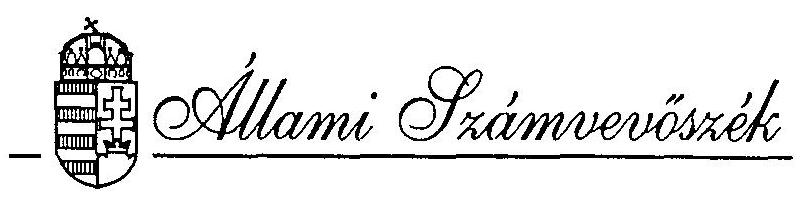
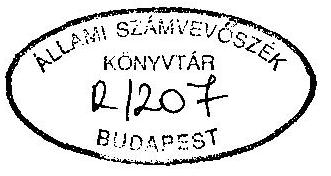
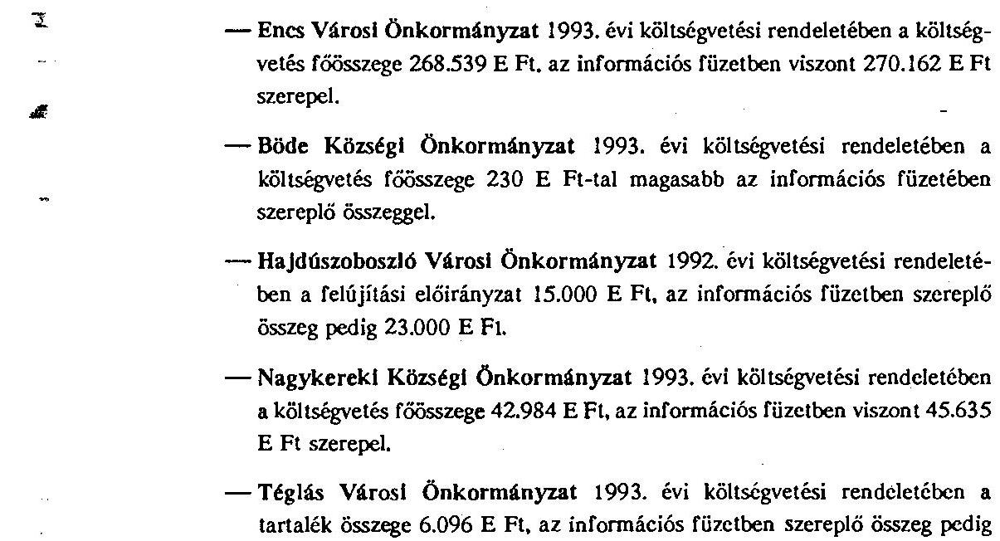
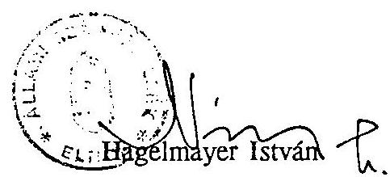
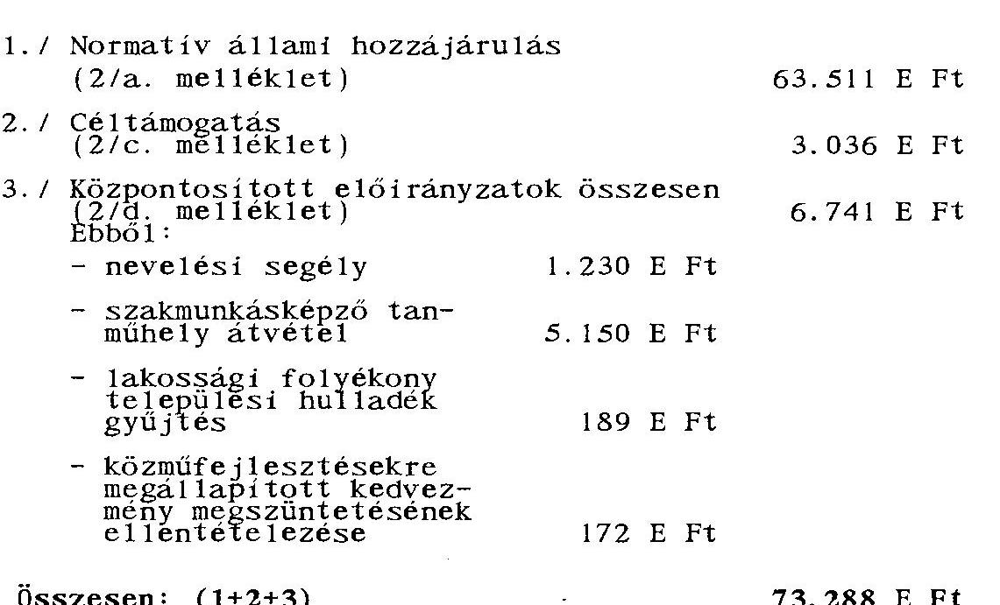

# JELENTÉS 

az önkormányzatok pénzügyi-gazdasági tevékenységének törvényességi ellenőrzéséről

---

Az önkormányzatok pénzügyi-gazdasági tevékenységének törvényességi ellenőrzéséről készült jelentést összeállította:
dr. Sallai Antal régióvezető főtanácsos
melynek elkészítésében közreműködött:
Fekete Tibor számvevő tanácsos
Az 1993. év folyamán végzett 157 helyszíni vizsgálatot az V. Önkormányzati és Területi Ellenőrzési Igazgatóság számvevői és számvevő tanácsosai végezték.

A régiószintű összefoglalókat készítették:

| Fekete Tibor | számvevő tanácsos |
| :-- | :-- |
| Horváth József | számvevő tanácsos |
| Kócse Istvánné | számvevő |
| Müller Ildikó | számvevő tanácsos |
| dr. Ótott Lajos | számvevő tanácsos |

---

# JELENTÉS 

## az önkormányzatok pénzügyi-gazdasági tevékenységének törvényességi ellenőrzéséről

A helyi önkormányzatokról szóló 1990. évi LXV. törvény 92. §-a alapján az Állami Számvevőszék - az 1993. évi munkatervének megfelelően - ellenőrizte az önkormányzatok pénzügyi-gazdasági tevékenységének törvényességét.
Az egységes központi program alapján lefolytatott, 1992-1993. évet érintő ellenőrzéseknek arra kellett választ keresniük, hogy az önkormányzatok:

- A gazdálkodásuk során betartják-e a törvényeket, rendeleteket.
- A központi támogatások igénybevételének és felhasználásának törvényessége, szabályszerűsége megfelelő-e.
- Hogyan gazdálkodnak a tulajdonukban levő vagyonnal.
- Eleget tesznek-e ellenőrzési kötelezettségüknek.

A gazdálkodás törvényességét 1993-ban 157 önkormányzatnál vizsgáltuk átfogó jelleggel. A jelentésben az ellenőrzések tapasztalatairól adunk számot, melynek összeállításánál felhasználtuk az önkormányzatok pénzgazdálkodásának, pénzkezelésének törvényességi, szabályszerűségi vizsgálatáról készített jelentés tapasztalatait is. Az átfogó ellenőrzéssel érintett önkormányzatok száma, az év elején meglévő 3.146 települési önkormányzat 5%-át reprezentálja. (1. számú melléklet).

A vizsgált települések több mint egynegyede városi-, míg háromnegyede községi és nagyközségi önkormányzat.
A törvényességi ellenőrzésekkel érintett településeken él az ország lakosságának mintegy 12%-a.

---

A vizsgált önkormányzatok kötelező és önként vállalt feladataikat több mint 1.300 intézményen keresztül, 55 milliárd forint felhasználásával látták el, mely összeg az 1992. évi önkormányzati kiadások 11%-ának felel meg.

# I. A VIZSGÁLATOK MEGÁLLAPÍTÁSAI 

## 1. Az önkormányzatok gazdálkodásának szabályozottsága, szervezettsége

Az ellenőrzéssel érintett önkormányzatok megalakulásukat követően - a helyi önkormányzatokról szóló 1990. évi LXV. törvény előírásainak megfelelően - elkészítették a működésük rendjét rögzítő Szervezeti és Működési Szabályzatokat (SZMSZ). Az SZMSZ-ek néhány esetben ideiglenes jelleggel kerültek elfogadásra, melyek véglegesítése a működés során szerzett tapasztalatok alapján folyamatosan megtörtént.
Előfordult azonban olyan eset is, amikor az önkormányzat megalakulását követő két év elteltével még mindig csak ideiglenes szervezeti és működési szabályzat volt hatályban.

Mezőkeresztes Nagyközségi önkormányzat 1991 áprilisában ideiglenesen elfogadott SZMSZ-ének véglegesítése 1993 májusáig (az ellenőrzés befejezéséig) nem történt meg.

A Főváros VIII. kerületében a végleges SZMSZ tervezetét a polgármester a képviselő-testület 1993. március 23-i ülésén terjesztette csak elő.

Az önkormányzatok működése során szerzett tapasztalatok, a bekövetkezett szervezeti változások szükségessé és indokolttá teszik az SZMSZ-ek folyamatos karbantartását, aktualizálását. A törvényességi vizsgálati körbe bevont önkormányzatok döntő része ezt a munkát folyamatosan elvégezte. Előfordult azonban olyan eset is, hogy az SZMSZ elfogadását követően annak szükség szerinti áttekintésére, aktualizálására nem került sor.

Alsópetény valamint Litke Község Önkormányzatok 1991-ben elfogadott SZMSZ-e alapján a polgármesteri tisztség társadalmi megbízatásban töltendő be. A testület által időközben hozott határozatok alapján a polgármesterek főállásban látják el feladataikat. Az SZMSZ módosítását azonban elmulasztották.

Az Alsópetény Község Önkormányzat SZMSZ-e továbbá úgy rendelkezik, hogy az igazgatási feladatok ellátására körjegyzőséget alakít. A testület 1991. évben hozott döntése alapján 1992. január 1-től önálló polgármesteri hivatal kialakítására került sor. A szervezeti változással egyidejűleg azonban nem gondoskodtak az SZMSZ módosításáról.

---

Boncodfölde község önkormányzata körjegyzőséghez csatlakozott, de az SZMSZ-ben polgármesteri hivatalról rendelkezett.

Rátót község korábban három másik településsel 1990-ben körjegyzőséget alkotott, de 1992. január 1-től az érintett önkormányzatok a körjegyzőséget megszüntették. A körjegyzőség megszüntetéséről, önálló polgármesteri hivatal létrehozásáról a testület nem hozott döntést, az SZMSZ módosítását elmulasztották.

Az SZMSZ-ek tartalmára vonatkozóan a vizsgálat - a korábbi évekhez viszonyítva - érdemi változást nem tapasztalt. Az SZMSZ-ek továbbra is főként a testületek működésének szabályait rögzítik, nem tartalmazzák a gazdálkodás ügymenetét, feladatát, a vezetők hatáskörét, felelősségét, a tulajdonosi jogkörből adódó intézményirányítási tevékenységet.

A gazdálkodással kapcsolatos feladat- és hatáskörök megosztása gyakran okoz gondot az önálló polgármesteri hivatallal rendelkező kistelepüléseken. A 300-400 lakosú községekben kis létszámú (2-3 fős) hivatalok működnek és a polgármester általában társadalmi megbízatású. Ezekben a hivatalokban nehezen biztosítható a kifizetéseket megelőző utalványozás. Még nehezebb a helyzet a saját részre, a hozzátartozó javára történő kifizetések esetén, valamint a helyettesítések kapcsán jelentkező feladatok megoldásánál.
Az önkormányzati feladatok ellátása, a gazdálkodás szervezettsége megköveteli az információs rendszer kialakítását, folyamatos működtetését. Az ellenőrzések során szerzett tapasztalatok azonban azt mutatják, hogy az önkormányzatok jelentős részénél csak az államháztartás információs rendszerhez kapcsolódó, ún. külső információs rendszer működik.

Az önkormányzatok és irányításuk alatt működő költségvetési szervek, valamint a polgármesteri hivatalok belső szervezeti egységei közötti információáramlás rendje teljeskörű kialakítása nem történt meg. Emiatt előfordul pl., hogy a pénzügyi-számviteli munkát érintő testületi döntések nem jutnak el időben a polgármesteri hivatal szervezeti egységeihez, az intézményekhez, illetve azok az egyes szervezeti egységek szintjén megrekednek.

A Mezőkeresztes Nagyközségi Önkormányzat Gazdasági Műszaki Ellátó Szervezete nem rendelkezett az 1992. évi és 1993. évi önkormányzati költségvetési rendelettel. Az intézményi költségvetést úgy állították össze, hogy a költségvetési rendelet nem volt az intézmény birtokában.

Nyírpazony Községi Önkormányzatnál a költségvetési rendelet módosításáról a gazdálkodási előadó nem kapott értesítést, így év közben a költségvetést érintő változásokat a számviteli nyilvántartásokban nem vezették át.

---

A Főváros IV. kerületében hiányzik a Gazdasági Osztály és a többi szakmai szervezet közötti információ-áramlást segítő konkrét, határidőkkel megjelölt adatszolgáltatási, egyeztetési kötelezettség leírása.

Az önkormányzati tulajdonosi jogok érvényesítése keretében az államháztartásról szóló 1992. évi XXXVIII. tv. (AHT) alapján az alapító okiratában meg kell határozni, hogy a költségvetési szervek vállalkozása milyen tevékenységre terjedhet ki, és az milyen mértéket érhet el. Az 1991. évi XCI. tv. feladatként határozta meg az önkormányzatok számára, hogy 1992. június 30-ig felül kell vizsgálniuk a költségvetési szervek alapító okiratát. Az ellenőrzés során szerzett tapasztalatok alapján az önkormányzatok nem teljeskörűen tettek eleget ezen törvényi kötelezettségüknek. Emiatt a költségvetési szervek

- gazdálkodási jogkörének,
- a tevékenységi körének (alaptevékenység, vállalkozási tevékenység),
- vállalkozási tevékenység mértékének
meghatározására az ellenőrzés időpontjáig valamennyi egységnél nem történt meg. (Pl. Nagykereki, Körösszakál, Alsópetény, Litke, Mezőkeresztes, Szigetvár, Bóly, Nagybajom, Dunaújváros, Dabas, Monor, Taksony).

Az ellenőrzések tapasztalatai szerint a tevékenységek besorolása, illetve a vállalkozás fogalmának meghatározása tekintetében az önkormányzatoknál nagy bizonytalanság volt tapasztalható. Az államháztartási törvény ugyanis nem határozta meg az alap- és vállalkozási tevékenység kritériumrendszerét. A kérdést csak az 1993. októberében megjelent 137/1993.(X. 12.) Korm. rendelet kísérelte meg rendezni.

A polgármesteri hivatalok operatív gazdálkodásával kapcsolatos feladatokat, szabályokat, különböző szabályzatok (pl. házipénztár kezelési, leltározási, selejtezési) rögzítik. A szabályzatok színvonala, aktualitása, a konkrétsága, valamint a helyi viszonyok figyelembevétele jelentős mértékben befolyásolja a pénzügyi-számviteli munka színvonalát. A belső szabályzatok jelentőségét, szükségét azonban nem mindenütt ismerték fel. A vizsgált önkormányzatok mintegy felénél a nyolcvanas évek közepén elkészített szabályzatok újbóli átdolgozását nem végezték el, a jogszabályi változások alapján azok aktualizálása nem történt meg. (Mátraverebély, Litke, Nézsa, Mezőkeresztes, Nyírmihálydi, Nyírpazony, Lőrinci, Lengyeltóti, Nagybajom, Vép, Jánosháza, Nagysáp).
A gazdaság szerkezetében végbement változásokkal összhangban, továbbá az Európai Gazdasági Közösség számviteli rendszerével való konzisztencia igényével hazánkban 1992. január 1-től új számviteli rendszer lépett életbe. Az erre vonatkozó egységes törvényi szintű szabályozás a költségvetési szervekre is kiterjed, de - tevékenységük jellegére tekintettel - sajátos szabályokkal egészül ki.

---

Az új számviteli törvény közzététele időben (a hatályba lépését több mint 6 hónappal megelőzően) megtörtént. A költségvetési szerveket érintő részletes szabályok viszont csak jóval később (1991. december 30.) kerültek kialakításra és kihirdetésre. Ezáltal az önkormányzati szférában éppen a központi szabályozás késedelme miatt nem voltak biztosítottak az új rendelkezések 1992. január 1-től való bevezetésének feltételei.
Az alapvetően megváltozott előírások megismerése, a szakemberek felkészítése, a technikai háttér kialakítása jelentős késéssel, abban az időszakban történhetett meg, amikor az új szabályokat már rég alkalmazni kellett volna.
Az áttérés gyakorlati végrehajtására 1992. II. negyedévét megelőzően azért sem kerülhetett sor, mert a mérlegrendezésre vonatkozó rendelet március hónapban jelent meg. (3/1992. (III. 4.) PM. r.).

Ilyen körülmények között lehetetlen követelmény volt, hogy költségvetési szervek saját számlarendjüket a törvényben előírt határidőre (1992. március 31.) és megfelelő tartalommal kidolgozzák.
A törvényi előírásnak azonban több önkormányzat polgármesteri hivatala nem tett eleget, és a vizsgálat időpontjáig nem készített számlarendet. (Alsópetény, Nézsa, Nyírmihálydi, Nyírpazony, Főváros XII. kerület, Szentendre, Nagyigmánd, Jánosháza).

Az elkészült és hatályban levő számlarendekkel kapcsolatban több hiányosság tapasztalható:
- a különböző ügyvitelszervező cégek által kiadott "minta" számlarendek adaptálása nem történt meg,

- gyakran általános, nem az operatív munkát segítő szabályokat tartalmazza,
- a polgármesteri hivatalok sajátosságait nem rögzítették,
- a költségvetési szerveknél alkalmazott pénzforgalmi szemléletű kettős könyvvitel rendszerében kiemelt szerepe van az analitikus nyilvántartásnak. Ennek rendje, tartalma és a főkönyvi könyveléshez való kapcsolódása nincs teljeskörűen kialakítva.

Az önkormányzatok körében bizonytalanság volt tapasztalható abban a kérdésben is, hogy a jegyző vagy a polgármester hagyja jóvá a polgármesteri hivatal számlarendjét.

A bizonytalanságot az okozta, hogy
- a számvitelről szóló 1991. XVIII. tv. szerint a számlarend összeállításáért és a folyamatos könyvvezetés helyességéért a költségvetés alapján gazdálkodó szervnek a vezetője a felelős. Ugyanakkor a helyi önkormányzatok

---

és szerveik feladat- és hatásköréről szóló 1991. évi XX. törvény előírása alapján a jegyző kialakítja a saját valamint intézményei számviteli rendjét, - az AHT-ban rögzített előírások szerint a költségvetési szerv vezetője (polgármesteri hivatal esetén a polgármester) felelős a számviteli rendért.

A nem egyértelmű központi szabályozás következtében eltérő gyakorlat alakult ki az önkormányzatok körében:
- sem a polgármester, sem a jegyző nem hagyta jóvá a számlarendet (Nagykereki, Mátraverebély, Litke községi önkormányzat),
$^2$ a polgármester hagyta jóvá a számlarendet (Szécsény város önkormányzata),
- a jegyző hagyta jóvá a számlarendet (Lőrinci város).

# 2. A költségvetés tervezésének és jóváhagyásának törvényessége. 

Az éves költségvetés készítése során az önkormányzatok az önkormányzati törvény alapján számbavették a kötelező és önként vállalt feladatokat. A vizsgálattal érintett önkormányzatok meghatározó részénél (82%-ánál) azonban nem készült gazdasági program, így az nem orientált a tervszámok kialakításánál. A gazdasági program elkészítésével kapcsolatban nem segítette az önkormányzatok munkáját a törvényi szabályozás sem. A gazdasági program elkészítését előíró önkormányzati törvény ugyanis nem határozza meg annak tartalmi követelményeit.

Az ellenőrzések során találkoztunk olyan esettel is, amikor a polgármester választási programját (beszédét) tekintette a hivatal - testületi döntés nélkül - az önkormányzat gazdasági programjának (Lengyeltóti és Nagyatád város).

A részletes költségvetés előterjesztését megelőzően az államháztartási törvényben foglaltaknak megfelelően a képviselő-testületek döntő része megtárgyalta a Költségvetési koncepciót. Előfordult azonban olyan önkormányzat is, ahol a koncepció nem került a képviselő-testület elé. (Pétervására, Zaránk, Nézsa, Alsópetény, Körösszakál, Nagykereki).

A költségvetésre vonatkozó rendelettervezetet az önkormányzatok egy részénél nem az ÁHT-ban meghatározott időtartamon belül - a költségvetési törvény kihirdetését követő két hónap - terjesztette a polgármester a képviselő-testület elé. A törvényben

 meghatározott határidőt általában néhány nappal, maximum 4 héttel lépték túl az önkormányzatok.

Előfordult azonban olyan eset is, amikor az 1993. évi költségvetési rendelettervezetet csak március 22-én terjesztette a polgármester a testület elé. (Újkér)

---

A rendelettervezet elfogadása illetve a rendeletalkotás jellemzően az előterjesztés napján megtörtént.

Az éves költségvetések összeállítása során 1993-ban is alapvetően a bázisszemléletű tervezési gyakorlat érvényesült. A kiadási tervszámok kialakításánál a meglévő intézményhálózat fenntartása, működése kapott prioritást. Bizonyítja ezt az is, hogy az 1992. évi kiadások 71%-a, az 1993. évi tervezett kiadások 76%-a működési célokat szolgált.

Az önkormányzatok bevételi struktúrája a vizsgált időszakban nem változott jelentősen. A bevételi források között továbbra is meghatározó az állami hozzájárulás. A legjelentősebb állami forrás, a normatív állami hozzájárulás megállapításánál alapul szolgáló mutatószámok az intézmények által jelzett adatok alapján kerültek kialakításra. Tekintettel arra, hogy a mutatószámok egységes nyilvántartására és kötelező ellenőrzésére törvényi előírás nincs, ezért az önkormányzatok részéről történő ellenőrzésük sok esetben nem történt meg. Ennek következtében jelentős eltérés mutatkozott a tervezésnél figyelembe vett és a tényleges mutatószámok között.

A helyi önkormányzatok a tervező munka során figyelembe vették az éves költségvetési törvény előírásait, költségvetésükben tartalmát tekintve helyesen szerepeltették a törvényben meghatározott bevételeket (normatív állami hozzájárulás, megosztott adók).

A saját bevételek tervszámainak kialakítása elsősorban az előző évi tapasztalati adatokra épült. A tervszámok realitása, megalapozottsága nem minden önkormányzatnál volt biztosítva, esetenként túlzott óvatosság, alultervezés volt tapasztalható.

A Főváros IV. kerületi önkormányzata nem számolt az 1993. évi tervében a vagyonkezeléssel megbízott részvénytársasága által bonyolított ingatlanértékesítés teljes bevételével. Már 1992-ben sem utalta át az Rt. a II-III. negyedévi ingatlanértékesítések nettó 51.000 E Ft bevételét.

Tapolca városi önkormányzatnál 1992. évben a tervezett bevételeknek több mint kétszerese realizálódott. Az 1993. évi tervszám ennek ellenére alacsonyabb az 1992. évi kreditelőirányzatnál, természetesen így az 1993. I. félévben elért bevétel meghaladja az éves szinten tervezett bevétel összegét.

Az elmúlt években az ellenőrzött, helyi adó kivetésére jogosult 155 önkormányzat - a megyei önkormányzatoknak ilyen lehetősége nincs - közül 87 vezetett be valamilyen helyi adót. (56%)
A helyi adókról szóló önkormányzati rendeletek a törvényi előírásoknak megfeleltek.

---

Önkormányzatonként átlag két adónemmel számoltak, leggyakoribb adóként az iparűzési adó szerepel az önkormányzati bevételek között. Jellemzőnek mondható, hogy a helyi adókat elsősorban kistelepüléseken nem vetették ki, mivel a lakosság száma és összetétele miatt elhanyagolható bevételt jelentene.

Az adóbevételek tervszámát a helyi adó rendeleteknek megfelelően, a mentességek, kedvezmények figyelembevételével - de megfelelő, felmérésen alapuló információk hiányában becsléssel határozták meg.
Ennek következtében a tervszámok nem bizonyultak mindig megalapozottnak.
A IV. kerületben bevezetett építmény- és telekadó tervezését nem előzte meg az adóalanyok körére vonatkozó felmérés, emiatt ebből a bevételből 1992-ben jelentős csökkenés keletkezett: a 225 milliós eredeti előirányzatot a testület 125 millióra módosította, amely év végére 53%-ban, 66 millióra teljesült. Az 1993. évi költségvetés 100 milliós tervszáma is becslésen alapult, mert az adózók felmérése még nem fejeződött be.

Monoron is irreálisnak bizonyult az 1992. évi kommunális és helyi iparűzési adó 10 milliós tervszáma, amelynek 64%-a teljesült.
Kiskunmajsa városban az iparűzési adó eredeti előirányzata 5150 E Ft volt, ezt évközben 10850 E Ft-ra módosították, a teljesítés 11014 E Ft-ban realizálódott. (214%)

A vizsgálattal érintett önkormányzatoknál a költségvetés egyensúlya többnyire biztosított volt. A bevételi források kiegészítéseként kölcsönforrás igénybevételét csak kevés helyen tervezték. A pótlólagos pénzügyi forrás megteremtésénél kötvénykibocsátási szándék nem fogalmazódott meg, a tervek összeállítása során az önkormányzatok hitelfelvétellel számoltak.
A tervezett hitel összbevételen belüli aránya 1993-ban jelentős szóródást mutat (Encs 3%, ugyanakkor Fehérgyarmat 17,9%).
A hitelfelvételek, illetve az azzal kapcsolatos előkészítő munkák döntő részben jogszerűek voltak. Csak kevés esetben fordult elő törvénysértés, illetve a helyi önkormányzati rendelet előírásainak be nem tartása.

Kiskunlacháza önkormányzat képviselőtestülete 1992. november 9-én 3 millió USA dollár beruházási hitel felvételéről döntött, és hozzájárult a bankgarancia hitelfedezetként 23 db összesen 384 millió Ft értékű - köztük 186 millió Ft értékű törzsvagyon körébe tartozó - ingatlanra az OTP Bank Rt. jelzálogjogának bejegyzéséhez.
(Az 1990. évi LXV. (önkormányzati) törvény 88. § b/ pontjában foglalt előírás szerint hitel fedezetéül törzsvagyon nem használható fel).

Téglás város önkormányzatának képviselő-testülete az 56/1992. (X.29.) sz. határozatával, az 1993-1995. között megvalósuló beruházások saját forrásának

---

kiegészítéseként 800 ezer USD deviza hitel felvételéről döntött. A hitel felvételével egyidejűleg 70 millió Ft erejéig jelzálogjogot jegyeztek be három ingatlanra. A jelzálog bejegyzésére testületi felhatalmazás nincs, annak ellenére, hogy az önkormányzat rendelete alapján a képviselőtestület jogosult az ingatlan vagyon megterhelésére.

A Köztisztviselői törvény egyes kérdések keretjellegű szabályozása mellett az önkormányzatok feladatává (hatáskörévé) tette a helyi szabályok részletes kialakítását. Az ellenőrzések során szerzett tapasztalatok azt mutatják, hogy ezen kötelezettségüknek az önkormányzatok nem vagy csak részben tettek eleget. Az ellenőrzéssel érintett önkormányzatok mintegy egyharmada egyáltalán nem készítette el a helyi szabályozást.

A helyi szabályozás meglététől függetlenül a költségvetés összeállítása során az önkormányzatok döntő része
—figyelembe vette a 13. havi illetmény miatti többletkiadásokat, valamint
—jelentős erőfeszítéseket tett a törvényekben rögzített és a tényleges bérek közötti különbség saját forrásból történő mérséklésére.

Az ÁHT jelenleg érvényes szabályozása szerint "a helyi önkormányzatok költségvetésében elkülönítetten szerepelnek az általános tartalék és a céltartalék előirányzatok". Ugyanakkor a törvény nem teszi kötelezővé a tartalék képzést. Ennek következtében a tartalékok jóváhagyása tekintetében eltérő gyakorlat alakult ki. Az önkormányzatok egy része ugyanis egyáltalán nem képzett tartalékot (Gönc, Fehérgyarmat, Nézsa, Böde).

A költségvetési rendeletekben jóváhagyott tartalékok mértéke önkormányzatonként nagyon eltérő, a költségvetés főösszegéhez viszonyított aránya 0,01-14% között szóródik.

A költségvetési rendeletben megtervezett általános- és céltartalék felhasználása szabályainak kialakítása, rögzítése az önkormányzatok döntő részénél megtörtént. A helyi szabályozások szerint a tartalékok felhasználásával kapcsolatos hatáskört az önkormányzatok jelentős részénél a testületek gyakorolják.

Az ÁHT előírásai szerint a költségvetés előterjesztésekor a törvényben meghatározott mérlegeket tájékoztatásul be kell mutatni a képviselő-testület részére. A vizsgált önkormányzatok többsége ezen törvényi kötelezettségnek nem tett eleget, a mérlegeket nem terjesztette a testület elé. Ez azonban részben a szabályozás hiányosságára is visszavezethető, mivel a törvény nem rögzíti a mérlegek tartalmát.

---

Az önkormányzatok által összeállított részletes költségvetések szerkezete nem minden esetben felelt meg az ÁHT-ban foglalt előírásoknak. Jellemző hiányosság, hogy a költségvetési rendeletekben nem került elkülönítetten jóváhagyásra az intézmények kiemelt (bér, TB, dologi) előirányzata (Kiskunlacháza, Balatonalmádi, Dunaújváros, Csepreg).

További hiányosságként került megállapításra, hogy az önkormányzat költségvetési rendeletében és az államháztartási információs rendszerhez kapcsolódó költségvetési információs füzetekben szereplő előirányzatok közötti egyezőség sok esetben nem áll fenn.

A költségvetési rendeletben és az információs füzetben szereplő költségvetési főösszegek közötti eltérést nagyon gyakran az okozta, hogy:
— a Társadalombiztosítási Alapoktól átvett pénzeszközök összege a költségvetési rendelet elfogadását követően változott, a TÁKISZ viszont csak a végleges összeggel vette át feldolgozásra az információs füzetet.
—az önkormányzatok által tervezett céltámogatások a költségvetési rendeletekben megjelentek, ugyanakkor ezek az adatok az államháztartás információs rendszere részére készült anyagban nem szerepelhettek, mivel annak szerkezetére és tartalmára eltérő előírás vonatkozik.

---

# 3. A költségvetés végrehajtásának törvényessége 

A testületek által jóváhagyott éves költségvetések módosítására a költségvetési év során több esetben sor került. A módosításokat elsősorban a tervezett feladatok közötti átrendeződés, az ehhez kapcsolódó pénzügyi források biztosítása, valamint a központi költségvetésből biztosított pótelőirányzatok tették szükségessé. A testületek által elfogadott költségvetési rendeletek korrekciója azonban esetenként a rendelet módosítása helyett csak határozattal történt (Hajdúszoboszló, Tata Városi Önkormányzatok, Szany nagyközség).
Jelentős ellentmondás van az 1992. évi költségvetési törvény 50. §-a, az ÁHT 74. §-a és az ÖTV 10. §-a között. Az első két törvény megengedi, hogy a képviselő-testület a költségvetési előirányzatok közötti átcsoportosítás jogát a bizottságokra és a polgármesterre átruházza. Vagyis átruházhatóvá teszi a költségvetési rendelet módosításának jogát is. Ez viszont ellentétes az ÖTV azon rendelkezésével, miszerint a rendeletalkotás (költségvetést csak rendelettel lehet megállapítani) a képviselő-testület át nem ruházható, kizárólagos hatásköre. Ebből következik, hogy a módosítás joga is csak a képviselő-testületet illetheti meg.
A törvényi előírással ellentétben több esetben előfordult, hogy a képviselő-testületek által jóváhagyott előirányzatok a testület döntése, felhatalmazása nélkül kerültek módosításra, illetve a módosítások csak a beszámoló információ füzetben jelentek meg.

Nagykereki Községi Önkormányzatnál az 1992. évi költségvetési beszámoló szerint az eredeti 36.962 E Ft összegű előirányzat év végére 40.162 E Ft-ra módosult. A 3.800 E Ft előirányzat változtatásáról nem volt testületi döntés.

Csorna Városi Önkormányzatnál a pénzügyi információ szerint 1992-ben 187.462 E Ft-tal magasabb összegű a módosított előirányzat a kreditelőirányzatnál, de a módosítást testületi döntések nem támasztják alá.

Szirmabesenyő Nagyközségi Önkormányzatnál az 1992. évi költségvetési rendelet szerint a bevételi és kiadási előirányzat összege 115.472 E Ft. A 9/1992. (VIII.27.) számú rendelettel módosított előirányzat 131.554 E Ft, ugyanakkor a beszámoló információs füzet és a zárszámadási rendelet 1. sz. melléklete szerint a módosított előirányzat 135.553 E Ft.

Alsópetény Községi Önkormányzatnál az év közben kapott állami támogatások miatt előirányzat módosítás nem történt meg.

A Főváros XII. kerületében 150.000 E Ft összegű saját hatáskörű előirányzat módosításáról nem született testületi döntés.

A költségvetés végrehajtásához kapcsolódó, operatív gazdálkodás egymást követő folyamatait (kötelezettségvállalás, ellenjegyzés, érvényesítés, utalványozás) keretjelleggel az ÁHT szabályozza. A helyi sajátosságok azonban indokolttá és szükségessé teszik, hogy ezeket a feladatokat, hatásköröket önkormányzatonként belső szabályzat rendezze.

Az ellenőrzéssel érintett 157 önkormányzat közül azonban 17 önkormányzatnál egyáltalán nem, 57 önkormányzatnál pedig csak részben történt meg a gazdálkodás biztonságát és törvényességét szolgáló belső szabályzatok elkészítése.

A kötelezettségvállalást, mint a pénzgazdálkodás egyik alapelemét az önkormányzatok nem szabályozták egyértelműen. A feladatköröket több esetben nem határolták el. A szabályzatokban nincs rögzítve, hogy az azonos jogkörrel feljogosítottak milyen sorrendben és értékben jogosultak a kötelezettségvállalás gyakorlására. Más esetben a szabályzatok a törvényi szöveget nevesítés és felhatalmazás nélkül tartalmazzák.
A kötelezettségvállalásokat általában nem tartották nyilván, ezért nem rendelkeztek a költségvetés végrehajtásával kapcsolatos információval.
A kötelezettségvállalás és ellenjegyzés szabályozásánál és gyakorlásánál valamennyi önkormányzatnál tapasztalhatók hiányosságok, amelyek arra utalnak, hogy a szabályozást többnyire formai kötelezettségként kezelték.
A pénzgazdálkodási feladatok közül a legtöbb hiányosság az érvényesítés során jelentkezett. A kisebb településeken az érvényesítéshez szükséges pénzügyi szakképesítés és a jogszabályok ismerete, a változások figyelemmel kísérése sok esetben nem biztosított.
A készpénzben történő kiadásoknál és bevételeknél az érvényesítés nagyrészt elmaradt. Nem vizsgálták bizonyítható módon a jogosultságot, a kiadások összegszerűségét, a fedezetet és az előírt alaki követelményeket. A készpénzbizonylatok nem tartalmazták az érvényesítési záradékot, hiányoztak az érvényesítést igazoló aláírások. A raktárral nem rendelkező önkormányzatok készpénz kiadásait igazoló bizonylatokra nem vezették rá a felhasználás helyét, az áru és szolgáltatás átvételét. A kistelepüléseknél az érvényesítés utólagosan történt. Az érvényesítést végzők írásbeli megbízása többségében
 elmaradt.
A kiadások és bevételek teljesítését elrendelő utalványozást több ellentmondás jellemezte. Az önkormányzatok nem tartották be még a saját szabályozásukat sem. Az utalványozásra olyan utalványrendeletet alkalmaztak, amely többnyire nem felelt meg a tartalmi és formai követelményeknek (hiányzott a befizető és a kedvezményezett neve, a fizetés időpontja, a terhelendő bankszámla száma és megnevezése stb.).

A vizsgált önkormányzatok több, mint felénél a kötelezettségvállalás, ellenjegyzés, érvényesítés, utalványozás gyakorlata nincs összhangban az ÁHT előírásaival, a meglévő helyi szabályzatokkal:

---

Szentkozmadombja községben a polgármester önkormányzati pénzeszköz terhére lánctalpás traktort vásárolt. Ez a beruházás a költségvetésben nem szerepelt, és arra a testület később sem adott felhatalmazást. A gépet a leszállítás óta nem használták és a további hasznosítása sem látszik biztosítottnak.

Bélmegyer községben a kötelezettségvállalások több esetben szabálytalanul történtek. Testületi jóváhagyás nélkül a polgármester és a pénzügyi csoportvezető vállalkozás céljából tollvásárlást bonyolított le 8.400 E Ft összegben.

Szentendre városban a polgármester helyett - felhatalmazás nélkül - a pénzügyi csoportvezető és irodavezető kötött vállalkozási szerződést.

A jelzett problémák mellett a költségvetés végrehajtása során Zala megyében gondot okozott, hogy a helyi önkormányzatokról szóló törvény nem zárja ki a döntéshozatalból azt a képviselő-testületi tagot, akit vagy akinek a hozzátartozóját az ügy személyesen érinti. (A kizárást a törvény a képviselő-testület döntésétől teszi függővé). Az ellenőrzés során szerzett tapasztalatok szerint ezt a kérdést a polgármesterek és képviselő-testületi tagok nem megfelelő súllyal kezelték. Emiatt előfordult, hogy saját támogatásukkal kapcsolatos döntésekben is résztvettek.

Szentkozmadombja községben a képviselő-testület 4 fő részére mezőgazdasági gép vásárlására összesen 500 E Ft kölcsönt nyújtott. A 4 fős képviselő-testületből 3 fő a kedvezményezettek között szerepelt.
Ugyanitt a testület a rászorultság vizsgálata nélkül, 2 alkalommal kiskorúak rendkívüli nevelési segélyezéséről határozott. Mindkét esetben a polgármester és egy képviselő is - az átlagnál magasabb összegekért - a támogatásban részesült és a döntéshozatalban is részt vett.

További hiányosság, hogy a saját bevételek nyilvántartási rendszerének teljeskörű kialakítása nem minden önkormányzatnál történt meg, illetve a meglévő nyilvántartások vezetése nem pontos. Emiatt esetenként nem követhető nyomon a bevételek beszedésének rendje, a kintlevőségek (követelések) összege. Több önkormányzatnál megállapítottuk, hogy nem működik a saját bevételek nyilvántartásához, befizetéséhez kapcsolódó információs rendszer a polgármesteri hivatalon belül, továbbá a hátralékot nyilvántartó költségvetési szervek, valamint a polgármesteri hivatal között. Mindezek következtében az önkormányzati beszámoló mérlegében nem minden esetben jelenik meg a fennálló követelés összege, azt az önkormányzatok nem ismerik teljeskörűen.

A Főváros II. kerületében nincs részletes nyilvántartás az épület és a földingatlan értékesítéséből származó bevételekről, a bérleti díjakról, a privatizációs bevételekről.

---

Jánosháza nagyközségi önkormányzatnál az 1992. évi mérlegben az adósok állománya 1.124 E Ft volt, ugyanakkor az ellenőrzés megállapítása szerint ez az összeg 2.478 E Ft.

Bük nagyközségnél a bevételekről vezetett nyilvántartás csak a tényleges befizetést tartalmazza, az előírást nem. Ebből következően a mérlegben hátralék kimutatására nem került sor.

A bevételek jelentős részét képező normatív állami hozzájárulások elszámolásánál a vizsgált 157 önkormányzat közül 86 (55%) önkormányzatnál mutatkozott eltérés a beszámolóban szereplő és a vizsgálat során megállapított mutatószám között. (2-a.-b. melléklet)
A normatív állami hozzájárulások tervezésének és elszámolásának alapjául szolgáló mutatószám nyilvántartási rendszer az önkormányzatok jelentős részénel még mindig nem került kialakításra. Nem működik megfelelően szabályozott, írásban dokumentált információs rendszer az intézmények és az önkormányzatok között. A mutatószámok igen gyakran szóban (telefonon) jutnak el az önkormányzatokhoz.

Mindezek miatt mind a tervezésnél, mind pedig az elszámolásnál bizonytalanság, pontatlanság volt tapasztalható.
Az ellenőrzések megállapításai azt támasztják alá, hogy az ÁHT-ban rögzített szankciók, kamatfizetések sem adtak kellő motivációt a mutatószámok nyilvántartási rendjének valamint az önkormányzatok és intézmények közötti információs rendszer kialakításához.

A vizsgált önkormányzati körben a céltámogatás igénylése és felhasználása az esetek döntő többségében megfelelt a törvényi előírásoknak. A támogatások igénybevétele a beruházási munkák megvalósulási ütemével összhangban, a törvényben meghatározott támogatási arányok figyelembevételével történt. Jogtalan igénybevétel és felhasználás megállapítására mindössze 4 önkormányzatnál került sor. (2/c. melléklet).

A központosított előirányzatok felhasználásának ellenőrzése során csak néhány esetben tapasztaltuk a vizsgált körben, hogy a támogatás igénybevétele nem az éves költségvetési törvényben rögzített feltételek szerint, az ott megjelölt célokra történt. Az ellenőrzések megállapításai alapján 8 önkormányzatnál, 4 központosított előirányzatot érintően teszünk javaslatot elvonásra (2/d. melléklet).

Az állami hozzájárulások tekintetében a törvényességi vizsgálatok összesített eredményeként 73.288 E Ft indokolatlan igénybevétel, illetve 28.633 E Ft további jogos igény megállapítására került sor. (2. sz. melléklet)

---

Az önkormányzatok vagyoni, pénzügyi helyzetükről, valamint azok változásairól az éves, valamint a féléves beszámoló keretében szolgáltatnak adatot az államháztartási információs rendszer számára. A beszámoló, valamint annak részét képező mérleg összeállításához a számviteli rendszernek kell megbízható, valós adatokat szolgáltatnia. A vizsgált önkormányzatoknál azonban több esetben azt tapasztaltuk, hogy a számviteli rendszer ezen követelménynek nem felel meg. A számviteli nyilvántartás és annak vezetése sok esetben nincs összhangban a számviteli törvény, valamint a vonatkozó kormányrendelet előírásaival:
— pontatlan a pénzmaradvány elszámolása,
—a beszámolóban szereplő adatok nem egyeznek meg a főkönyvi könyvelés adatával,
—a befektetett eszközök, valamint a fogyóeszközök besorolása nem, illetve nem pontosan történt meg,
—a gazdasági társaságokba bevitt vagyon értéke nem a befektetett pénzügyi eszközök között, hanem pénzeszköz átadásként jelenik meg a könyvviteli nyilvántartásban,
—a gazdasági eseményeket nem teljeskörűen könyvelik le,
—a beruházással, felújítással kapcsolatos kiadás gyakran karbantartásként jelenik meg a könyvviteli nyilvántartásban.

Az önkormányzatok döntő többsége betartotta a bankszámla nyitására, vezetésére vonatkozó ÁHT-ban foglalt rendelkezéseket. Egyetlen esetben fordult elő, hogy a bankszámla vezetésére vonatkozóan nincs - az ÁHT-ban foglaltaknak megfelelően - testületi döntés (Szirmabesenyő).

A bankszámlák vezetésével kapcsolatban két önkormányzatnál állapított meg a vizsgálat szabálytalan gyakorlatot:

Mezőkeresztes Nagyközség Önkormányzata az Országos Takarékpénztár és Kereskedelmi Bank Rt.-vel kötött bankszámla szerződés mellett egy másik pénzforgalmi számla vezetésére bankszámla szerződést kötött a Mezőkeresztes és Vidéke Takarékszövetkezettel. Így pénzforgalmát két pénzforgalmi jellegű bankszámlán bonyolította.

Füzesabony Városi Önkormányzat a letéti számláról gazdálkodást folytatott.

---

# 4. A költségvetési beszámoló törvényessége 

Az önkormányzati képviselő-testület a költségvetés végrehajtásáról az évközi tájékoztatás mellett a zárszámadás előterjesztése illetve megtárgyalása során szerez átfogó ismeretet.

Az ÁHT a polgármester feladatává teszi, hogy a zárszámadási rendeletet a költségvetési évet követő 3 hónapon belül a képviselő-testület elé kell terjeszteni.

Az ellenőrzések megállapításai szerint azonban több polgármester nem tett időben eleget a törvényben előírt kötelezettségének, és csak határidő után terjesztette az 1992. évi zárszámadással kapcsolatos rendelettervezetet a képviselő-testület elé. A határidő mulasztás egyes esetekben csak néhány napos volt, más esetekben viszont a több hónapot is elérte.

A Főváros XII. kerületében 1993 júliusában, Litke Községi Önkormányzatnál 1993. június 3-án, Nyírkarász Községi Önkormányzat 1993. augusztus 26-án, Pétervására Városi Önkormányzatnál 1993. június 10-én történt meg az 1992. évi zárszámadási rendelettervezet testület elé történő terjesztése.

Alsópetény Községi Önkormányzat polgármestere 1993. áprilisig nem terjesztette a testület elé az 1991. évre, valamint az 1992. évre vonatkozó zárszámadási rendelettervezetet.

A zárszámadásra vonatkozó rendelettervezetek csaknem minden esetben az előterjesztés napján elfogadásra kerültek. Néhány önkormányzatnál azonban az általánostól eltérő gyakorlattal találkoztunk az ellenőrzés során.

Demecser Községi Önkormányzatnál az előterjesztés határidőben megtörtént, annak elfogadására azonban csak 1993. június 18-án került sor.

Kiskunlacháza nagyközség zárszámadási rendelettervezetét 1993 júniusáig (az ellenőrzés befejezéséig) nem hagyta jóvá a testület.

A Nézsa-i polgármester által 1993. április 22-én beterjesztett rendelettervezetet 1993. szeptemberéig (az ellenőrzés befejezéséig) nem hagyta jóvá a testület.

A fenti megállapításokhoz kapcsolódóan meg kell jegyezni, hogy az államháztartási törvény - a költségvetési rendelettervezethez hasonlóan - csak az előterjesztés időpontját rögzíti, nem határozza meg viszont, hogy a testületnek azt milyen határidőn belül kell elfogadnia.

A zárszámadások szerkezetét vizsgálva azt tapasztaltuk, hogy azok nem minden esetben feleltek meg a törvényi előírásoknak. Nem a költségvetéssel azonos

---

szerkezetben, összehasonlítható módon állították össze (Sajóbábony, Zaránk, Tarnaméra, Nyírkarász, Szentendre, Örkény).

Az ÁHT előírja, hogy a zárszámadás tárgyalásakor a képviselő-testület részére különböző mérlegeket kell - tájékoztató jelleggel - bemutatni. Ezek tartalmára vonatkozó részletes szabályozást viszont a Kormány nem alkotott, holott arra ugyanezen törvény 124. § (2) bek. b./ pontjában felhatalmazást kapott. Jórészt ennek köszönhető, hogy a vizsgált önkormányzatok egyikénél sem tapasztalta az ellenőrzés a mérlegek elkészítését és testület elé terjesztését.

Az önkormányzatok az 1992. évi költségvetési évre vonatkozó beszámolási kötelezettségüknek határidőben eleget tettek, azt kivétel nélkül elkészítették, és az információs rendszer szerkezetének megfelelő formában továbbították a TÁKISZ-hoz.

Megállapításaink szerint azonban az államháztartás információs rendszerében olyan adatok kerülnek be, illetve olyan adatokat dolgoznak fel, amelyeket a testületek sok esetben még nem tárgyaltak, zárszámadási rendelettel nem fogadtak el.

Ennek oka, hogy a beszámolási és könyvvezetési kötelezettségről szóló kormányrendelet előírása szerint a beszámolót a tárgyévet követő év február 28-ig kell elkészíteni. Az ÁHT-ban foglalt szabályozás szerint viszont a zárszámadási rendelettervezetet a polgármester a költségvetési évet követően 3 hónapon belül terjeszti a képviselő-testület elé.

A TÁKISZ-hoz továbbított 1992. évi költségvetési beszámolók felülvizsgálata során megállapította a vizsgálat, hogy azok az előző évi tapasztalatokhoz hasonlóan nem minden esetben tükröznek valóságos, hű képet az önkormányzatok vagyoni, pénzügyi helyzetéről. A beszámoló és annak részét képező mérleg adatai nem egyeznek meg a könyvelési adatokkal.

Alsózsolca Nagyközségi Önkormányzat mérlegében a kötelezettségek között nem szerepel a csatornamű társulat felszámolása miatt az önkormányzat által visszafizetendő hitel összege, melyből 1992. december 31-én hosszúlejáratú 20.300 E Ft, rövidlejáratú pedig 1.900 E Ft.

Nádudvar Városi Önkormányzatnál a pénzmaradvány elszámolásának pontatlansága miatt a módosított pénzmaradvány ténylegesen 453 E Ft-tal több a beszámolóban kimutatott összegnél.

Szekszárd város 1992. évi önkormányzati szintű mérlege a számviteli nyilvántartásoktól ingatlanoknál 459.200 E Ft-tal, a részesedéseknél 620.000 E Ft-tal tér el.

---

Szentendre 1992. évi mérlegéből hiányzik a VÁB által átadott lakásingatlan 218.000 E Ft, és a kapott részvények 52.000 E Ft értéke.

A Főváros XII. kerületi Polgármesteri Hivatal 1992. évi mérlege két részvénytársaságban való érdekeltséget tartalmaz 47.000 E Ft összegben, holott további egy részvénytársaságban, illetve négy Kft-ben érdekelt még az önkormányzat 46.000 E Ft összegben. Az állami vállalatok átalakulása során szerzett érdekeltség a kimutatott 24.000 E Ft-tal szemben ténylegesen 239.000 E Ft.

A beszámoló és a könyvviteli nyilvántartások közötti egyezőség hiányának elsődleges okai, hogy
-- a könyvviteli rend kialakítása és a számviteli szabályok betartása területén gyakran fordulnak elő szabálytalanságok,

- a vagyon teljeskörű számbavétele és kimutatása nem történt meg minden önkormányzatnál,
- nagy bizonytalanság, pontatlanság tapasztalható a pénzmaradvány megállapítása és elszámolása területén.

A beszámoló elkészítésével egyidejűleg minden vizsgált önkormányzat eleget tett az 1992. évi állami költségvetésből biztosított támogatásokkal, hozzájárulásokkal kapcsolatos elszámolási kötelezettségének.

Az igénybe vett normatív állami hozzájárulásokkal való elszámolás azonban a vizsgált önkormányzatok jelentős részénél nem volt hitelesnek minősíthető. Az ellenőrzéssel érintett 157 önkormányzat közül 78-nál (50%) tapasztaltunk jogtalan igénybevételt (
 $2 / \mathrm{a}$ melléklet), míg 60 önkormányzatnál ( $38 \%$ ) többlet állami hozzájárulás folyósítására teszünk javaslatot ( $2 / \mathrm{b}$. melléklet).

A hibák arra utalnak, hogy elmaradt a mutatószámok felülvizsgálata, holott erre a ${ }^{2}$ Pénzügyminisztérium és a Belügyminisztérium 96056, illetve 305-194/93. sz. január 25-én kelt levelében felhívta az önkormányzatok figyelmét.

Az önkormányzatok által az éves beszámolóban kimutatott elszámolási különbözet állami költségvetés javára történő visszafizetése az önkormányzatok döntő többségénél megtörtént. Csak kevés számú önkormányzat nem teljesítette határidőre ilyen irányú kötelezettségét.

Ugyanakkor az általunk feltárt, jogtalanul igénybe vett állami hozzájárulás visszafizetése, illetve az önkormányzatokat megillető többlet állami hozzájárulás igénybevétele - törvényi rendelkezés hiányában - nem történt meg.

---

# 5. Az önkormányzati vagyonnal történő gazdálkodás 

A helyi önkormányzatokról szóló 1990. évi LXV., valamint az egyes állami tulajdonban lévő vagyontárgyak önkormányzati tulajdonba adásáról szóló 1991. évi XXXIII. törvény az elmúlt években jelentős volumenű és értékű vagyonhoz juttatta az önkormányzatokat. Az önkormányzati tulajdonba került vagyonnal összefüggő tulajdonosi jogok gyakorlásáról - az 1991. évi XX. valamint az 1990. évi LXV. törvény előírásai alapján - a képviselő-testület rendelkezik.

Az ellenőrzés során tett megállapítások azt bizonyítják, hogy kevés számú önkormányzatnál történt meg a vagyongazdálkodással kapcsolatos helyi szabályok teljeskörű kialakítása. Tapasztalataink szerint az elfogadott önkormányzati rendeletek sem érintik a vagyongazdálkodással összefüggő valamennyi feladatot, hatáskört. A meglévő helyi rendeletek visszatérő hiányossága, hogy

- hiányzik a forgalomképtelen és a korlátozottan forgalomképes vagyoni kör tételes felsorolása,
— nem tartalmazzák konkrétan a forgalomképes vagyonnal kapcsolatos átruházott döntési hatásköröket,
— nem szabályozzák, hogy milyen értékhatár feletti vagyon-elidegenítésnél, használatnál kell nyilvános versenytárgyalást hirdetni,
— nem szabályozzák az önkormányzati követelésekről történő lemondás eseteit és módját,
— nem rendezik a gazdasági társaságokban szerzett vagyoni részesedéssel kapcsolatos tulajdonosi jogok gyakorlásának módját és a felelősség kérdését.

A vagyonrendelet hiánya miatt a vizsgált önkormányzatok kétharmadánál nem történt meg a törzsvagyonnak az egyéb önkormányzati vagyonrészektől történő elkülönítése (Abaújszántó, Alsózsolca, Nagykereki, Hajdúszoboszló, Téglás, Körösszakál, Lőrinci, Pétervására).

Az önkormányzatok döntő része elvégezte az önkormányzati törvény valamint az 1991. évi XXXIII. törvény alapján tulajdonukba került vagyontárgyak felmérését, számbavételét. Ezeknek a vagyontárgyaknak az önkormányzati tulajdonba adása (a tulajdonjog telekkönyvi nyilvántartásokba történő bejegyzése) a törvény hatályba lépése óta - egy-két vitás ügytől eltekintve - lényegében megtörtént.

Úgynevezett költségvetési üzemek (önkormányzati alapítású, nyereségérdekelt szolgáltató-karbantartó szervek) nem tartoztak az átalakulási törvény hatálya

---

alá, ezért megszüntetésük és vagyonuk felhasználása (jogi státuszuk megváltoztatása) sok gondot okozott számos önkormányzatnak.

A Főváros II. kerületi önkormányzata perli az ÁVÜ-t, mert az az önkormányzati üzletrészt nem a belterületi föld értéke, hanem annak a vállalati terhekkel arányosan csökkentett része alapján juttatja az önkormányzatnak.

A különböző vagyontárgyak önkormányzati tulajdonba adásával párhuzamosan nem lett kialakítva a rendezett tulajdonú vagyontárgyak nyilvántartási rendszere. Emiatt, valamint a törzsvagyonnak az egyéb vagyontárgyaktól történő elkülönítésének hiánya miatt az önkormányzatok többségénél nem történt meg az 1990. évi LXV. törvényben foglaltaknak megfelelően az éves zárszámadás keretében a vagyonállapot leltárral történő bemutatása.

Az önkormányzatok jelentős része érdekeltséget szerzett különböző gazdasági társaságokban. Ez az érdekeltség elsősorban:

- az állami vállalatok gazdasági társasággá történő átalakításával,
— az önkormányzati földterületek apportálásával, valamint
— az önkormányzati közüzemi vállalatok gazdasági társasággá átalakításával
jött létre.
Lényegesen szűkebb körben tapasztalható saját alapítású gazdasági társaságokban való részvétel. Nem gyakori továbbá, hogy az önkormányzatok pénzbeni vagyoni hozzájárulással szereznének érdekeltséget különböző gazdasági társaságokban.

Átalános tapasztalat, hogy a különböző gazdasági társaságokban befektetett eszközök az önkormányzatok könyvviteli nyilvántartásában, mérlegében nem vagy nem teljeskörűen jelennek meg.

Vértesboglár önkormányzat 3 Kft-ben szerzett érdekeltséget 2.375 E Ft összegben. A befektetett pénzügyi eszköz azonban nem jelenik meg a könyvviteli nyilvántartásban.

A Főváros VIII. kerületi Önkormányzata 1991. évi mérlegében 86.700 E Ft befektetés szerepel. Ugyanakkor a hivatalban fellelhető iratok alapján ez az összeg ténylegesen 214.325 E Ft.

A Főváros XII. kerületi Önkormányzata 1992. évi zárómérlege 333.000 E Ft részesedés helyett mindössze 71.000 E Ft-ot tartalmaz.

Százhalombatta város Önkormányzata 1992. év végén 425.000 E Ft befektetéssel rendelkezett. Ezzel szemben a mérleg 26.000 E Ft részesedést tartalmaz.

---

Szécsény Városi Önkormányzat 1.403 E Ft összegű vagyoni részesedése nem jelenik meg a mérlegben.

Az önkormányzatok jelentős része hozzájárult alapítványok működéséhez. A támogatott alapítványok zömükben a települések egészségügyi, sport és művelődési feladatainak ellátásához kapcsolódnak. A támogatott alapítványok között voltak továbbá karitatív tevékenységet végzők is.

Az alapítványokhoz való hozzájárulás az ellenőrzött önkormányzatok döntő részénél a testület döntése alapján történt. Előfordult azonban olyan eset is, amikor az alapítvány támogatására testületi döntés nélkül került sor (Esztergom város, Szentistván, Taksony nagyközség, Kövágószőlős és Tatárszentgyörgy község).

A vagyon elidegenítése során gyakran nem érvényesültek az államháztartási törvény előírásai. A vagyongazdálkodással kapcsolatos önkormányzati rendeletek hiánya miatt nem történt meg az elidegenítés-, a használat helyi feltételrendszerének kialakítása. Emiatt az értékesítés nagyon gyakran a testület egyedi döntése alapján történt, nyilvános versenytárgyalás kiírására nem került sor. Előfordult olyan eset is, amikor az értékesítés testületi döntés nélkül, illetve a testület utólagos jóváhagyása mellett történt.

Mezőkeresztes Nagyközségi Önkormányzatnál 1992-ben testületi döntés nélkül értékesítettek 3 db építési telket, valamint egy épületet.

Alsózsolca Nagyközségi Önkormányzat polgármestere által 1992-ben aláírt adás-vételi szerződés szerint az önkormányzat értékesített $11.027 \mathrm{~m}^{2}$ területű ingatlant. Az értékesítést a képviselő-testület utólag hagyta jóvá.

A Főváros VIII. kerületében 1991-ben két olyan ingatlan értékesítésére került sor, amelyekről nem született testületi döntés.

Kiskunlacházán testületi döntés előtt kötöttek adás-vételi szerződést.

# 6. Az önkormányzatok ellenőrzési tevékenysége 

Az elmúlt évben lefolytatott vizsgálatok tapasztalatai azt mutatják, hogy az önkormányzatok ellenőrzési tevékenysége területén tapasztalható a legkisebb előrelépés. Az önkormányzatoknál még nem alakult ki a tulajdonosi szemléletből fakadó igény az ellenőrzés szükségessége iránt.

Az önkormányzatiság eltelt három évében nem vált általánossá a belső, valamint az intézményi felügyeleti ellenőrzés feladatainak, gyakoriságának valamint módszereinek szabályozása. Az elkészített szabályzatok gyakran túl általánosak (elsősorban az elméleti, általános kérdéseket rögzítik), nem határozzák meg a

---

személyekre (belső szervezeti egységre) vonatkozó konkrét ellenőrzési feladatokat.

Az önkormányzatok meghatározó részénél - gyakran a szervezet nagysága miatt indokoltan - nem foglalkoztatnak függetlenített belső ellenőrt. Emiatt a gazdálkodás belső ellenőrzése - csaknem kizárólag - a vezetői és a munkafolyamatba épített ellenőrzés keretében valósítható meg.
A belső ellenőrzési rendszer e két ágának hatékony működése csak a teljes körű szabályozottság és az ellenőrzési feladatok pontos megfogalmazása mellett biztosítható. A munkaköri leírások azonban nem tartalmazzák az ellenőrzési feladatokat, a különböző belső szabályzatok pedig nem minden esetben szolgálnak megfelelő alapul az egyes pénzügyi-gazdasági folyamatok megszakítás nélküli, folyamatos ellenőrzéséhez.

Mindezek miatt a munkafolyamatba épített ellenőrzés nem működik megfelelő hatékonysággal, a vezetői ellenőrzés pedig szinte kizárólag a kiadmányozáson, valamint az utalványozáson és ellenjegyzésen keresztül érvényesül.

Az önkormányzatok jelenlegi ellenőrzési rendszere csak kevés esetben biztosítja, hogy
— időben és megfelelő tartalommal felszínre kerüljenek a gazdálkodás területén előforduló szabálytalanságok,

- a testület döntéseinek gyakorlati végrehajtása nyomon követhető, ellenőrizhető legyen,
- az ellenőrzések tapasztalatai megfelelően segítsék a vezetői valamint a testületi döntések előkészítését, meghozatalát.

Az önkormányzati törvény értelmében a saját intézmények pénzügyi ellenőrzését a helyi önkormányzat látja el. Az ellenőrzések gyakoriságának törvényi szabályozása hiányzik. A vizsgált önkormányzatok a felügyeletük alá tartozó költségvetési intézmények közel 30\%-ánál végeztek 1992-ben pénzügyi, gazdasági ellenőrzést.

Az ellenőrzés során szerzett tapasztalatok mellett megállapítható, hogy a vonatkozó törvények nem rögzítik teljes részletességgel az önkormányzatok ellenőrzéssel kapcsolatos teendőit, kötelezettségeit. Az ellenőrzési feladat megoldását a jelenlegi jogi szabályozás lényegében a Pénzügyi Ellenőrző Bizottságtól (PEB) várja. Az alapvetően társadalmi munkában, gyakran megfelelő szakértelem hiányában működő bizottság azonban nem képes megoldani az önkormányzatok ellenőrzési feladatát. Ennek ellenére szakértők felkérését csak ritkán tapasztaltuk. Megállapításaink szerint a PEB-ek tevékenysége elsősorban a gazdálkodással kapcsolatos testületi előterjesztések véleményezésére terjed ki.

---

Az 1991. évi XX. törvény előírásai szerint a képviselő-testület feladata és hatásköre meghatározott időszakonként áttekinteni az általa alapított és fenntartott költségvetési szervek ellenőrzésének tapasztalatait. A képviselő-testületek döntő része azonban

- nem határozta meg azt az időszakot, amelynek elteltével áttekinti az ellenőrzés helyzetét illetve annak megállapításait,
— megalakulása óta nem tárgyalta az önkormányzati ellenőrzés helyzetét.
Mindezek miatt a testületek gyakran nem rendelkeznek az ellenőrzésre vonatkozó átfogó információval, tapasztalattal.

# II. Következtetések, javaslatok 

Az önkormányzatok gazdálkodásának szabályozottságára, valamint szabályszerűségére irányuló ellenőrzések tapasztalatai azt mutatják, hogy az önkormányzatok a lakosság ellátásával, a települések üzemeltetésével kapcsolatos feladataikat sok hiányossággal, de alapvetően ellátták.

A vizsgálat megállapításai szerint a tapasztalt hiányosságok egyrészt a gazdálkodással kapcsolatos feladat és hatáskörök, valamint az ebből eredő felelősség szabályozásának hiányával, másrészt a központi irányítással függnek össze, amely gyakran bizonytalanságot okozott vagy kedvezőtlen megoldásokhoz vezetett. A kisebb önkormányzatoknál a megfelelő szakemberek biztosítása is problémát okozott.

A helyi önkormányzatok a pénzügyi-gazdasági folyamatokról a beszámolórendszer keretében szolgáltatnak adatot az államháztartási információs rendszer számára. Ennek kapcsán problémaként vetődik fel, hogy a testület elé terjesztendő rendelettervezet és a Kormány tájékoztatására a TÁKISZ-hoz továbbítandó beszámoló füzetek elkészítésének tartalmára, szerkezetére, határidejére eltérő rendelkezéseket tartalmazó központi előírások vonatkoznak. A testületi előterjesztések elkészítésének rendjét az államháztartásról szóló törvény szabályozza, a beszámoló információs füzetekre vonatkozóan pedig a költségvetés alapján gazdálkodó szervek beszámolási és könyvvezetési kötelezettségéről szóló 179/1991. (XII.30.) Korm. rendelet tartalmaz előírásokat.

Az államháztartás információs rendszerében feldolgozásra kerülő adatok az analitikus nyilvántartások hiánya, valamint a pontatlan főkönyvi könyvelés miatt - gyakran nem tükrözik az önkormányzatok valós pénzügyi, vagyoni helyzetét, a mérlegvalódiság gyakran nem érvényesül.

---

A központi támogatások igénybevétele és felhasználása általában a vonatkozó jogszabályi előírásoknak megfelelően történt. A legproblematikusabb terület a mutatószámokhoz kötött normatív állami hozzájárulás. A viszonylag magas összegű elvonási, illetve pótlólagos támogatási javaslat elsősorban az önkormányzatok és költségvetési szerveik közötti információs rendszer hiányosságaiból ered.

Általánosítható tapasztalat, hogy nem vált teljeskörűvé az önkormányzati ellenőrzési rendszer kialakítása. Egyrészt, nem alakult ki a tulajdonosi szemléletből fakadó igény az ellenőrzés szükségessége iránt, másrészt lassította a jól működő ellenőrzési rendszer kialakítását - elsősorban a kisebb településeken az önkormányzaton belüli, valamint az ellenőrzésbe bevonható külső szakemberek hiánya.

A vizsgálatok során tett megállapításokat, javaslatokat a polgármesterek elfogadták, melyek alapján az esetek döntő részében megtették a szükséges intézkedéseket a hiányosságok folyamatos megszüntetése érdekében.

Az elkészített intézkedési tervek - a feltárt hiányosságok kijavítására - jellemzően az alábbiakat tartalmazták:

- a polgármester, a jegyző és a bizottságok feladat- és hatáskörét meghatározzák;
- a polgármesteri hivatal működését részletesen szabályozó ügyrendet készítenek, amely tartalmazza az egyes belső szervezeti egységek részletes feladat- és hatáskörét;
- a törzsvagyon körébe tartozó forgalomképes és korlátozottan forgalomképes vagyonról az önkormányzat rendeletet alkot és a törzsvagyont a nyilvántartásokba elkülönítetten kezeli;
—az éves zárszámadáshoz a vagyoni állapotot alátámasztó leltárt elkészítik, annak érdekében, hogy a mérlegben teljeskörűen és hitelesen szerepeljenek az eszközök és a források;
- az önkormányzat tulajdonába lévő vagyontárgyakkal történő gazdálkodás hatékonyságának fokozása érdekében, javaslatokat dolgoznak ki a képviselőtestület számára pl. Vagyonkezelő Iroda létrehozására;
- Az önkormányzat
 számlarendjében rögzítik:
a főkönyvi számlák és az analitikus nyilvántartások kapcsolatát, valamint;
az analitikus nyilvántartások formáját, tartalmát és vezetésének módját, továbbá;
a leltározás és a selejtezés részletes szabályait;

---

- Az ellenőrzés rendjéről ellenőrzési szabályzatot dolgoznak ki.

Az ellenőrzések során szerzett tapasztalatok alapján a következőket javasoljuk:

# a./ A Pénzügyminisztérium kezdeményezze 

- a jelentés a 2/a, b. számú mellékletben foglalt jogtalanul igénybe vett 63.511 EFt normatív állami hozzájárulások visszafizettetését, illetve a jogosan járó 28.633 EFt folyósítását,
— az 1992. évi XXXVIII. tv. módosítását. Az államháztartásról szóló törvény egészüljön ki az Állami Számvevőszék ellenőrzései által feltárt és bizonyított, jogtalanul igénybe vett állami hozzájárulások (normatív, cél- és címzett támogatások) utólagos visszafizetésének illetve az önkormányzatokat megillető többlettámogatások folyósításának törvényi szintű szabályozásával,
- az önkormányzatok költségvetési és zárszámadási rendeletei kiadási határidejének az államháztartási törvényben történő szabályozását,
- a helyi önkormányzat zárszámadási rendelettervezet előterjesztésének (elfogadásának), valamint az államháztartási információs rendszer részét képező beszámoló benyújtásának határideje közötti összhang megteremtését,
- az információszolgáltatási kötelezettségre, a számviteli rend kialakítására vonatkozó feladat és hatáskörök ÁHT 97. §-ában foglalt előírások összhangjának megteremtését. Javasoljuk ezen feladatokat - önálló költségvetési szervek esetében - a gazdasági vezető (önkormányzat polgármesteri hivatalánál jegyző) hatáskörévé tenni,
— az ÁHT-ban meghatározott, az önkormányzatok költségvetési és zárszámadási rendelettervezetének tárgyalásakor bemutatandó mérlegek tartalmi követelményeire vonatkozó előírások kormányrendeletben történő rögzítését.

## b./ A Belügyminisztérium kezdeményezze

- a 2/c. mellékletben foglalt, összesen 3.063 EFt jogtalanul igénybe vett céltámogatások, valamint a 2/d. mellékletben foglalt központosított előirányzatok közül jogtalanul igénybe vett lakossági folyékony települési hulladék gyűjtés címén 189 EFt, valamint közműfejlesztésekre megállapított kedvezmény megszüntetésének ellentételezése címén 172 EFt visszafizettetését,
- az önkormányzati törvény módosítása során a törvényben meghatározott gazdasági program alapvető tartalmi követelményeinek, a jóváhagyás rendjének és határidejének szabályozását,

---

- az önkormányzatok számára a vagyongazdálkodással kapcsolatos rendelet elkészítésének kötelezővé tételét, mivel jelenleg az önkormányzati törvény erre vonatkozóan egyértelmű, konkrét előírást nem tartalmaz.

# c./ Népjóléti Minisztérium kezdeményezze 

- a 2/d. mellékletben foglalt jogtalanul igénybe vett központosított előirányzatok közül 1230 EFt nevelési segély visszafizettetését.

## d./ Művelődési és Közoktatási Minisztérium kezdeményezze

- a 2/d. mellékletben foglalt jogtalanul igénybe vett központosított előirányzatok közül a szakmunkásképző tanműhely átvételével kapcsolatos 5150 EFt visszafizettetését.

Budapest, 1994. június

---

Az 1993. évi törvényességi vizsgálatok
település-tipusonkénti megoszlása

| ÁSZ   Kirendeltség | Vizsgált   önkorm.   száma   összesen | Megyei önkorm. Megyei jogú város és város | Nagyközség | Község |
| :--: | :--: | :--: | :--: | :--: |
|  |  | száma | és megnevezése |  |
| Baranya megye | 17 | 1. Komló   2. Szigetvár | 1. Boly | 1. Alsószentmárton   2. Bakonya   3. Cserkut   4. Egyházasharaszti   5. Görcsöny   6. Kistapolca   7. Kővágószőlős   8. Kővágótöttös   9. Old   10. Öcsárd   11. Regenye   12. Siklósnagyfalu   13. Szőke   14. Töttös |
| Bács-Kiskun megye | 10 | 1.Kiskunfélegyháza   2.Kiskunmajsa | - | 1. Bátya   2. Jászszentlászló   3. Hajós   4. Kisszállás   5. Orgovány   6. Pusztaföldvár   7. Tiszaalpár   8. Veszút |
| Békés megye | 6 | 1. Békéscsaba   2. Sarkad | - | 1.Bálványos   2. Dőzsvény   3.Kondoros   4.Telekgerendás |
| Borsod-Abaúj-Zemplén megye | 13 | 1. Encs   2.Sajószentpéter | 1.Abaújszántó   2. Alsózsolca   3. Mályinka   4. Szentistván   5. Gönc   6. Sajóbábony   7.Hollóháza   8. Szirmabesenyő | 1. Bükkaranyos   2. Aszaló   3. Béke |

---

| Csongrád megye | 8 | - | 1. Kistelek   2. Szentes | 1. Csanádalberti   2. Székkutas | 1. Eperjes   2. Maroslele   3. Nagylak   4. Pitvaros |
| :--: | :--: | :--: | :--: | :--: | :--: |
| Fejér megye | 4 | - | 1. Dunaújváros | 1. Lepsény | 1. Mány   2. Vértesboglár |
| Győr-Moson-   Sopron megye | 7 | - | 1. Csorna | 1. Bősárkány   2. Szany | 1. Harka   2. Rábaszentandrás   3. Öttevény   4. Újkér |
| Hajdú-Bihar megye | 5 | - | 1.Téglás   2. Nádudvar   3. Hajdúszoboszló | - | 1. Nagykereki   2. Körösszakál |
| Heves megye | 7 | - | 1. Füzesabony   2. Pétervására   3. Lőrinci | 1. Kisköre | 1. Heréd   2. Zaránk   3. Tarnaméra |
| Jász-Nagykun-   Szolnok megye | 9 | 1.Szolnok | 1. Jászberény   2. Jászszentlászló | 1. Jászladány | 1. Alattyán   2. Kétpó   3. Tiszagyenda   4. Újszász   5. Zagyvarékas |
| Komárom-Esztergom megye | 5 | - | 1. Esztergom   2. Tata | 1. Bábolna   2. Nagyigmánd | 1. Nagysáp |
| Nógrád megye | 6 | - | 1. Szécsény   2. Bátonyterenye | - | 1. Mátraverebély   2. Litke   3. Nézsa   4. Alsópetény |
| Somogy megye | 9 | - | 1. Lengyeltóti   2. Nagyatád | 1. Berzence   2. Nagybajom   3. Zamárdi | 1. Gyugy   2. Hács   3. Kisberény   4. Mezőcsokonya |

---

| Szabolcs-Szatmár-Bereg megye | 9 |  | 1. Nagykálló   2. Fehérgyarmat | 1. Demecser | 1. Kálmánháza   2. Nyírpazony   3. Nyírkarász   4. Tiszaeszlár   5. Nyírmihálydi   6. Nagycserkesz |
| :--: | :--: | :--: | :--: | :--: | :--: |
| Tolna megye | 5 | - | 1. Bonyhád   2. Szekszárd   3. Tamási | 1. Pincehely | 1. Fácánkert |
| Vas megye | 12 | - | - | 1. Bük   2. Csepreg   3. Jánosháza   4. Vép | 1. Bozai   2. Karakó   3. Kissomlyó   4. Keléd   5. Nemeskeresztúr   6. Rátót   7. Tömörd |
| Veszprém megye | 4 | - | 1. Tapolca   2. Balatonalmádi | - | 1. Márkó   2. Dörgicse |
| Zala megye | 9 | - | - | - | 1. Babosdöbréte   2. Boncodfölde   3. Böde   4. Hetés   5. Nagypáli   6. Szentkozmadombja   7. Teskánd   8. Zalabér   9. Zalatárnok |
| Pest megye | 8 | - | 1. Dabas   2. Monor   3. Százhalombatta   4. Szentendre | 1.Kiskunlacháza   2. Taksony | 1.Drégelypalánk   2. Tatárszentgyörgy |
| Főváros | 4 | - | 1. II. kerület   2. IV. kerület   3. VIII.kerület   4. XII. kerület |  |  |
| Összesen: | 157 | 2 | 41 | 29 | 85 |

---

# A vizsgált önkormányzatok jellemző adatai 

|  | Település (kerület) állandó lakosainak száma (fő) | Önállóan gazdálkodó intézmények száma | Részben önálló intézmények száma (db) | Polgármesteri hivatal létsz. (fő) | Pénzügyi-gazdasági feladatok ellátásával foglalkozók száma (fő) |
| :--: | :--: | :--: | :--: | :--: | :--: |
| Főváros | 462.840 | 84 | 242 | 1.335 | 121 |
| Észak-   Dunántúli   Régió | 97.013 | 144 | 126 | 816 | 142 |
| Dél-   Dunántúli   Régió | 154.075 | 102 | 61 | 716 | 109 |
| Dél-   Magyarországi   Régió | 284.861 | 166 | 147 | 1.058 | 226 |
| Észak-   Magyarországi   Régió | 188.977 | 82 | 158 | 785 | 158 |
| Összesen | 1.187.766 | 578 | 734 | 4.710 | 756 |

---

# 2. sz. melléklet   $\mathrm{V}-1001-28 / 1994$ 

Törvényességi vizsgálatok keretében
elvonásra javasolt 1992. évi
állami hozzájárulások, támogatások

Törvényességi vizsgálatok keretében
folyósításra javasolt 1992. évi
állami hozzájárulások

Normatív állami hozzájárulás (2/b. melléklet) 28.633 E Ft

---

A törvényességi ellenőrzés alapján az önkormányzatoktól elvonásra javasolt 1992. évi normatív állami hozzájárulás összege, valamint azok indokolása

# BARANYA MEGYE 

Komló város
2.721 E Ft

- idősek és fogyatékosok szállást biztosító intézeti ellátása
- óvodai ellátás
- általános iskolai oktatás
- alapfokú művészeti oktatás
- szakközépiskolai, szakiskolai oktatás
- diákotthoni ellátás

240 E Ft
418 E Ft
216 E Ft
21 E Ft
1.764 E Ft
62 E Ft

Alsószentmárton község
38 E Ft

- óvodai ellátás

38 E Ft
Egyházasharaszti község
146 E Ft

- óvodai ellátás

38 E Ft

- általános iskolai oktatás

108 E Ft
Kistapolca község
36 E Ft

- általános iskolai oktatás

36 E Ft
Old község
216 E Ft

- általános iskolai oktatás

216 E Ft
Regenye község
19 E Ft

- óvodai ellátás

19 E Ft
Siklósnagyfalu község 180 E Ft

- általános iskolai oktatás

---

Szőke község 19 E Ft

- óvodai ellátás 19 E Ft

BÁCS-KISKUN MEGYE
Kiskunfélegyháza város 713 E Ft

- óvodai ellátás 190 E Ft
- általános iskolai oktatás 180 E Ft
- szakmunkásképzés (elméleti okt.) 195 E Ft
- szakmunkásképző iskola
tanműhelyi oktatás 148 E Ft
Jászszentlászló község 149 E Ft
- idősek és fogyatékosok nappali
intézményi ellátása 56 E Ft
- óvodai ellátás 57 E Ft
- általános iskolai oktatás 36 E Ft
Hajós község 55 E Ft
- óvodai ellátás 19 E Ft
- általános iskolai oktatás 36 E Ft
Kiskunmajsa város 19 E Ft
- óvodai ellátás 19 E Ft

Tiszaalpár község 677 E Ft

- óvodai ellátás 209 E Ft
- általános iskolai oktatás 468 E Ft

BÉKÉS MEGYE
Békéscsaba város 10.089 E Ft

- alapfokú művészeti oktatás 84 E Ft
- fogyatékos gyermekek oktatása 195 E Ft
- szakmunkásképző iskola tanműhelyi oktatás 1.998 E Ft
- diákotthoni ellátás 7.812 E Ft

---

# BORSOD-ABAÚJ-ZEMPLÉN MEGYE 

Encs város ..... 195 E Ft

- fogyatékos gyermekek oktatása ..... 195 E Ft
Szentistván nagyközség ..... 216 E Ft
- általános iskolai oktatás ..... 216 E Ft
Gönc nagyközség ..... 28 E Ft
- idősek és fogyatékosok nappali intézményi ellátása ..... 28 E Ft
Alsózsolca nagyközség ..... 418 E Ft
- általános iskolai oktatás ..... 288 E Ft
- fogyatékos gyermekek oktatása ..... 130 E Ft
Bükkaranyos község ..... 108 E Ft
- általános iskolai oktatás ..... 108 E Ft
CSONGRÁD MEGYE
Eperjes község ..... 57 E Ft
- óvodai ellátás ..... 57 E Ft
Kistelek város ..... 270 E Ft
- óvodai ellátás ..... 38 E Ft
- általános iskolai oktatás ..... 108 E Ft
- diákotthoni ellátás ..... 124 E Ft
Nagylak község ..... 216 E Ft
- általános iskolai oktatás ..... 216 E Ft
Székkutas nagyközség ..... 199 E Ft
- általános iskolai oktatás ..... 180 E Ft
- óvodai ellátás ..... 19 E Ft

---

FEJÉR MEGYE
Dunaújváros megyei jogú város 825 E Ft

- általános iskolai oktatás 72 E Ft
- szakközépiskolai és szakiskolai oktatás 441 E Ft
- szakmunkásképzés elméleti
 oktatás 312 E Ft

Vérlesboglár község 95 E Ft

- óvodai ellátás 95 E Ft

GYŐR-MOSON-SOPRON MEGYE
Szany nagyközség 19 E Ft

- óvodai ellátás 19 E Ft

HAJDU-BIHAR MEGYE
Nagykereki község 219 E Ft

- idősek és fogyatékosok nappali intézményi ellátása 56 E Ft
- óvodai ellátás 19 E Ft
- általános iskolai oktatás 144 E Ft

Nádudvar város 303 E Ft

- óvodai ellátás 114 E Ft
- alapfokú művészeti oktatás 189 E Ft

HEVES MEGYE
Kisköre nagyközség 180 E Ft

- általános iskolai oktatás 180 E Ft

Tarnaméra község 76 E Ft

- óvodai ellátás 76 E Ft

Heréd község 74 E Ft

- óvodai ellátás 38 E Ft
- általános iskolai oktatás 36 E Ft

---

Pétervására város ..... 548 E Ft

- idősek és fogyatékosok napközi otthoni ellátása ..... 28 E Ft
- fogyatékos gyermekek oktatása ..... 520 E Ft
Lőrinci város ..... 439 E Ft
- óvodai ellátás ..... 323 E Ft
- alapfokú művészeti oktatás ..... 42 E Ft
- szakmunkásképző iskolai tanműhely oktatás ..... 74 E Ft
JÁSZ-NAGYKUN-SZOLNOK MEGYE
Jász-Nagykun-Szolnok Megyei Önkormányzat ..... 357 E Ft
- gimnáziumi oktatás ..... 357 E Ft
Alattyán község ..... 57 E Ft
- óvodai ellátás ..... 57 E Ft
Kétpó község ..... 76 E Ft
- óvodai ellátás ..... 76 E Ft
Jászberény város ..... 1.409 E Ft
- óvodai ellátás ..... 836 E Ft
- általános iskolai oktatás ..... 324 E Ft
- alapfokú művészeti oktatás ..... 63 E Ft
- diákotthoni ellátás ..... 186 E Ft
Jászladány nagyközség 927 E Ft
- idősek és fogyatékosok nappali intézeti ellátása ..... 84 E Ft
- óvodai ellátás ..... 266 E Ft
- általános iskolai oktatás ..... 252 E Ft
- fogyatékos gyermekek oktatása ..... 325 E Ft
Kisújszállás város ..... 239 E Ft
- óvodai ellátás ..... 114 E Ft
- szakközépiskolai oktatás ..... 63 E Ft
- diákotthoni ellátás ..... 62 E Ft

---

Újszász község 1.308 E Ft

- általános iskolai oktatás ..... 324 E Ft
- fogyatékos gyermekek oktatása ..... 130 E Ft
- gimnáziumi oktatás ..... 102 E Ft
- szakközépiskolai oktatás ..... 504 E Ft
- diákotthoni ellátás ..... 248 E Ft
Zagyvarékas ..... 57 E Ft
- óvodai ellátás ..... 57 E Ft
KOMÁROM-ESZTERGOM MEGYE
Esztergom város ..... 813 E Ft
- általános iskolai oktatás ..... 180 E Ft
- gimnáziumi oktatás ..... 51 E Ft
- szakmunkás elméleti oktatás ..... 312 E Ft
- diákotthoni ellátás ..... 186 E Ft
- idősek és fogyatékosok napközi otthoni ellátása ..... 84 E Ft
Tata város
2.766 E Ft
- óvodai ellátás ..... 190 E Ft
- általános iskolai oktatás ..... 252 E Ft
- szakközépiskolai és szakiskolai oktatás ..... 315 E Ft
- szakmunkás elméleti oktatás ..... 741 E Ft
- diákotthoni ellátás ..... 1.240 E Ft
- idősek és fogyatékosok napközi ..... 28 E Ft
Bábolna nagyközség
131 E Ft
- idősek és fogyatékosok napközi otthoni ellátása ..... 112 E Ft
- óvodai ellátás ..... 19 E Ft
Nagyigmánd nagyközség ..... 205 E Ft
- óvodai ellátás ..... 133 E Ft
- általános iskolai oktatás ..... 72 E Ft

---

| Nagysáp Község | 93 E Ft |  |
| :--: | :--: | :--: |
| - óvodai ellátás |  | 57 E Ft |
| - általános iskolai oktatás |  | 36 E Ft |
| NÓGRÁD MEGYE |  |  |
| Litke község | 38 E Ft |  |
| - óvodai ellátás |  | 38 E Ft |
| Nézsa község | 864 E Ft |  |
| - általános iskolai oktatás |  | 864 E Ft |
| Szécsény város | 5.253 E Ft |  |
| - alapfokú művészeti oktatás |  | 21 E Ft |
| - fogyatékos gyermekek oktatása |  | 65 E Ft |
| - szakmunkásképzés elméleti oktatás |  | 858 E Ft |
| - szakmunkásképző iskola tanműhelyi oktatás |  | 3.034 E Ft |
| - diákotthoni ellátás |  | 806 E Ft |
| - óvodai ellátás |  | 133 E Ft |
| - idősek és fogyatékosok nappali intézményi ellátása |  | 336 E Ft |
| Alsópetény község | 57 E Ft |  |
| - óvodai ellátás |  | 57 E Ft |
| Bátonyterenye város | 3.495 E Ft |  |
| - idősek és fogyatékosok nappali intézményi ellátása |  | 56 E Ft |
| - óvodai ellátás |  | 1.273 E Ft |
| - általános iskolai oktatás |  | 72 E Ft |
| - alapfokú művészeti oktatás |  | 399 E Ft |
| - szakközépiskolai, szakiskolai oktatás |  | 252 E Ft |
| - szakmunkásképző iskolai tanműhelyi oktatás |  | 1.443 E Ft |

---

SZABOLCS-SZATMÁR-BEREG MEGYE
Tiszaeszlár község ..... 338 E Ft
- idősek és fogyatékosok nappali intézményi ellátása ..... 112 E Ft
- óvodai ellátás ..... 190 E Ft
- általános iskolai oktatás ..... 36 E Ft
Nyírmeggyes község ..... 936 E Ft
- általános iskolai oktatás ..... 684 E Ft
- idősek és fogyatékosok nappali intézményi ellátása ..... 252 E Ft
Nyírbogdány község ..... 3.700 E Ft
- általános iskolai oktatás ..... 3.096 E Ft
- óvodai ellátás ..... 380 E Ft
- idősek és fogyatékosok nappali intézményi ellátása ..... 224 E Ft
Fehérgyarmat város ..... 575 E Ft
- fogyatékos gyermekek oktatása ..... 260 E Ft
- szakközépiskolai oktatás ..... 315 E Ft
TOLNA MEGYE
Bonyhád város ..... 1.247 E Ft
- szakközépiskolai, szakiskolai oktatás ..... 441 E Ft
- diákotthoni ellátás ..... 806 E Ft
Szekszárd város ..... 11.669 E Ft
- szociális otthoni és intézeti ellátás ..... 174 E Ft
- általános iskolai oktatás ..... 72 E Ft
- alapfokú művészeti oktatás ..... 147 E Ft
- fogyatékos gyermekek oktatása ..... 65 E Ft
- szakmunkásképző iskolai tanműhelyi oktatás ..... 11.211 E Ft

---

| Tamási város | 823 E Ft |  |
| --- | --- | --- |
| - általános iskolai oktatás |  | 468 E Ft |
| - alapfokú művészeti oktatás |  | 21 E Ft |
| - szakközépiskolai, szakiskolai oktatás |  | 63 E Ft |
| - szakmunkásképző elméleti oktatás |  | 234 E Ft |
| - szakmunkásképző iskolai tanműhelyi oktatás |  | 37 E Ft |

| Pincehely nagyközség | 326 E Ft |  |
| --- | --- | --- |
| - óvodai ellátás |  | 38 E Ft |
| - általános iskolai oktatás |  | 288 E Ft |

## VAS MEGYE

| Bük nagyközség | 123 E Ft |  |
| --- | --- | --- |
| - idősek és fogyatékosok nappali intézményi ellátása |  | 28 E Ft |
| - óvodai ellátás |  | 95 E Ft |

| Csepreg nagyközség | 38 E Ft |  |
| --- | --- | --- |
| - óvodai ellátás |  | 38 E Ft |

| Jánosháza nagyközség | 21 E Ft |  |
| --- | --- | --- |
| - alapfokú művészeti oktatás |  | 21 E Ft |

## VESZPRÉM MEGYE

| Balatonalmádi város | 74 E Ft |  |
| --- | --- | --- |
| - általános iskolai oktatás |  | 74 E Ft |

| Tapolca város | 63 E Ft |  |
| --- | --- | --- |
| - alapfokú művészeti oktatás |  | 63 E Ft |

## ZALA MEGYE

| Zalatárnok község | 28 E Ft |  |
| --- | --- | --- |
| - idősek és fogyatékosok nappali intézeti ellátása |  | 28 E Ft |

---

PEST MEGYE
Dabas város
1.440 E Ft

- általános iskolai oktatás
1.440 E Ft

Kiskunlacháza nagyközség 410 E Ft

- idősek és fogyatékosok nappali intézeti ellátása
- általános iskolai oktatás
- alapfokú művészeti oktatás
Örkény község
1.427 E Ft
- idősek és fogyatékosok nappali intézeti ellátása
- szakközépiskolai oktatás
- diákotthoni ellátás
Százhalombatta város
243 E Ft
- általános iskolai oktatás
- óvodai ellátás
Szentendre város
189 E Ft
- szakközépiskolai oktatás
Tatárszentgyörgy község 70 E Ft
- üdülőhelyi feladatok
Főváros
II. kerület
1.603 E Ft
- óvodai ellátás
- gimnáziumi oktatás
- szakmunkásképzés elméleti oktatás
- szakmunkásképzés iskolai tanműhelyi oktatás
IV. kerület
360 E Ft
- általános iskolai oktatás
56 E Ft
144 E Ft
210 E Ft

112 E Ft
819 E Ft
496 E Ft

72 E Ft
171 E Ft

189 E Ft

70 E Ft

380 E Ft
1.071 E Ft
78 E Ft
74 E Ft
360 E Ft

---

XII. kerület ..... 101 E Ft

- általános iskolai oktatás ..... 36 E Ft
- fogyatékos gyermekek oktatása ..... 65 E Ft

---

2/b.sz. melléklet
V-1001/28/1994.

A törvényességi ellenőrzés alapján az önkormányzatoknak folyósításra javasolt 1992. évi normatív állami hozzájárulások összege, valamint azok indokolása

# BARANYA MEGYE 

Komló város
2.056 E Ft

- idősek és fogyatékosok nappali intézményi ellátása
- szakmunkásképzés, elméleti oktatás
- fogyatékos gyermekek oktatása
28 E Ft
78 E Ft
1.950 E Ft

Alsószentmárton község
152 E Ft

- általános iskolai oktatás
- fogyatékos gyermekek oktatása
- kiegészítő állami hozzájárulás nemzetiségi, etnikai vagy kétnyelvű oktatáshoz
72 E Ft
65 E Ft
15 E Ft

Egyházasharaszti község
15 E Ft

- kiegészítő állami hozzájárulás nemzetiségi, etnikai vagy kétnyelvű oktatáshoz
15 E Ft

Görcsöny község
57 E Ft

- óvodai ellátás
57 E Ft

Ócsárd község
74 E Ft

- óvodai ellátás
- általános iskolai oktatás
38 E Ft
36 E Ft

---

# BÁCS-KISKUN MEGYE 

Kiskunfélegyháza ..... 558 E Ft

- diákotthoni ellátás ..... 558 E Ft
Hajós község ..... 28 E Ft
- idősek és fogyatékosok nappali intézeti ellátása ..... 28 E Ft
Kiskunmajsa város ..... 72 E Ft
- általános iskolai oktatás ..... 72 E Ft
BÉKÉS MEGYE
Békéscsaba város ..... 4.373 E Ft
- óvodai ellátás ..... 494 E Ft
- általános iskolai oktatás ..... 108 E Ft
- gimnáziumi oktatás ..... 51 E Ft
- szakközépiskolai, szakiskolai oktatás ..... 3.276 E Ft
- szakmunkásképzés elméleti oktatás ..... 429 E Ft
- kiegészítő állami hozzájárulás a nemzetiségi, etnikai óvodai ellátáshoz ..... 15 E Ft
BORSOD-ABAÚJ-ZEMPLÉN MEGYE
Hézökeresztes nagyközség ..... 112 E Ft
- idősek és fogyatékosok nappali intézményi ellátása ..... 112 E Ft
Encs város ..... 38 E Ft
- óvodai ellátás ..... 38 E Ft
Szentistván nagyközség ..... 112 E Ft
- idősek és fogyatékosok nappali intézményi ellátása ..... 112 E Ft

---

|  Gönc nagyközség | 84 E Ft  |
| --- | --- |
|  - óvodai ellátás | 19 E Ft  |
|  - fogyatékos gyermekek oktatása | 65 E Ft  |
|  Aszaló község | 38 E Ft  |
|  - óvodai ellátás | 38 E Ft  |
|  Alsózsolca nagyközség | 420 E Ft  |
|  - idősek és fogyatékosok nappali intézményi ellátása | 56 E Ft |

 E Ft  |
|  - óvodai ellátás | 304 E Ft  |
|  - kiegészítő állami hozzájárulás a nemzetiségi, etnikai óvodai ellátáshoz | 60 E Ft  |
|  Bekecs község | 133 E Ft  |
|  - óvodai ellátás | 133 E Ft  |
|  CSONGRÁD MEGYE |   |
|  Csandápalota nagyközség | 38 E Ft  |
|  - óvodai ellátás | 38 E Ft  |
|  Kistelek város | 631 E Ft  |
|  - idősek és fogyatékosok szállást biztosító intézményi ellátása | 160 E Ft  |
|  - idősek és fogyatékosok nappali intézményi ellátása | 28 E Ft  |
|  - alapfokú művészeti oktatás | 378 E Ft  |
|  - fogyatékos gyermekek oktatása | 65 E Ft  |
|  Nagylak község | 38 E Ft  |
|  - óvodai ellátás | 38 E Ft  |
|  Pitvaros község | 10 E Ft  |
|  - kiegészítő állami hozzájárulás a nemzetiségi, etnikai óvodai ellátáshoz | 10 E Ft  |

---

Szentes város
279 E Ft

- alapfokú művészeti oktatás ..... 168 E Ft
- szakmunkásképző iskolai tan-műhelyi oktatás ..... 111 E Ft
FEJÉR MEGYE
Dunaújváros Megyei Jogú Város ..... 577 E Ft
- óvodai ellátás ..... 57 E Ft
- fogyatékos gyermekek oktatása ..... 520 E Ft
HAJDÚ-BIHAR MEGYE
Nádudvar város ..... 245 E Ft
- általános iskolai oktatás ..... 180 E Ft
- fogyatékos gyermekek oktatása ..... 65 E Ft
HEVES MEGYE
Kisköre nagyközség ..... 140 E Ft
- idősek és fogyatékosok nappali intézményi ellátása ..... 140 E Ft
Tarnaméra község ..... 36 E Ft
- általános iskolai oktatás ..... 36 E Ft
Pétervására város ..... 326 E Ft
- óvodai ellátás ..... 38 E Ft
- általános iskolai oktatás ..... 288 E Ft
Lőrinci város ..... 36 E Ft
- általános iskolai oktatás ..... 36 E Ft
Füzesabony város ..... 319 E Ft
- óvodai ellátás ..... 19 E Ft
- általános iskolai oktatás ..... 216 E Ft
- idősek és fogyatékosok nappali intézményi ellátása ..... 84 E Ft

---

JÁSZ-NAGYKUN-SZOLNOK MEGYE
Jász-Nagykun-Szolnok megyei Önkormányzat
914 E Ft

- gyermek- és ifjúságvédelem
- fiatalok egészségügyi gyermekotthoni és gyógypedagógiai ellátása

201 E Ft

- fogyatékos gyermekek oktatása
- szakközépiskolai, szakiskolai oktatás
- szakmunkásképzés elméleti oktatás
- diákotthoni ellátás

252 E Ft
39 E Ft
124 E Ft

Alattyán község
56 E Ft

- idősek és fogyatékosok nappali intézményi ellátása

56 E Ft

Kisújszállás város
419 E Ft

- alapfokú művészeti oktatás
- gimnáziumi oktatás
- szakmunkásképzés elméleti oktatás
- szakmunkásképzés iskolai tanműhelyi oktatás

105 E Ft
51 E Ft
78 E Ft
18.5 E Ft

Újszász község
85 E Ft

- idősek és fogyatékosok nappali intézményi ellátása
- óvodai ellátás

28 E Ft
57 E Ft

KOMÁROM-ESZTERGOM MEGYE

Esztergom város
82 E Ft

- szakközépiskolai és szakiskolai oktatás
- óvodai ellátás

63 E Ft
19 E Ft

Tata város
715 E Ft

- fogyatékos gyermekek oktatása

---

Bábolna nagyközség ..... 144 E Ft
- általános iskolai oktatás ..... 144 E Ft
Nagylógmind nagyközség ..... 158 E Ft
- idősek és fogyatékosok napközi otthoni ellátása ..... 28 E Ft
- fogyatékos gyermekek oktatása ..... 130 E Ft
Nagysáp község ..... 65 E Ft
- fogyatékos gyermekek oktatása ..... 65 E Ft
NÓGRÁD MEGYE
Litke község ..... 95 E Ft
- kiegészítő állami hozzájárulás nemzetiségi, etnikai vagy két-tannyelvű oktatáshoz ..... 45 E Ft
- üdülőhelyi feladatok ..... 50 E Ft
Nézsa község ..... 406 E Ft
- óvodai ellátás ..... 36 E Ft
- kiegészítő állami hozzájárulás a nemzetiségi, etnikai óvodai ellátáshoz ..... 10 E Ft
- általános iskolai oktatás ..... 360 E Ft
Szécsény város ..... 1.328 E Ft
- szakközépiskolai oktatás ..... 1.008 E Ft
- idősek és fogyatékosok szállást biztosító intézményi ellátása ..... 320 E Ft
Alsópetény község ..... 121 E Ft
- kiegészítő állami hozzájárulás a nemzetiségi, etnikai vagy két-tannyelvű oktatáshoz ..... 85 E Ft
- általános iskolai oktatás ..... 36 E Ft
SZABOLCS-SZATMÁR-BEREG MEGYE
Nyírmihálydi község ..... 456 E Ft
- óvodai ellátás ..... 456 E Ft

---

| Demecser nagyközség | 748 E Ft |  |
| :--: | :--: | :--: |
| - általános iskolai oktatás |  | 252 E Ft |
| - óvodai ellátás |  | 152 E Ft |
| - fogyatékos gyermekek oktatása |  | 260 E Ft |
| - idősek és fogyatékosok nappali intézményi ellátása |  | 84 E Ft |
| Fehérgyarmat város | 449 E Ft |  |
| - óvodai ellátás |  | 76 E Ft |
| - általános iskolai oktatás |  | 180 E Ft |
| - szakmunkásképzés elméleti oktatás |  | 156 E Ft |
| - szakmunkásképző iskolai tanműhelyi oktatás |  | 37 E Ft |
| TOLNA MEGYE |  |  |
| Szekszárd város | 140 E Ft |  |
| - idősek és fogyatékosok nappali intézményi ellátása |  | 140 E Ft |
| Tamási város | 709 E Ft |  |
| - üdülőhelyi feladatok |  | 362 E Ft |
| - idősek és fogyatékosok nappali intézményi ellátása |  | 28 E Ft |
| - idősek és fogyatékosok szállást biztosító intézményi ellátása |  | 80 E Ft |
| - óvodai ellátás |  | 209 E Ft |
| - kiegészítő állami hozzájárulás nemzetiségi, etnikai vagy két-tannyelvű oktatáshoz |  | 30 E Ft |
| VAS MEGYE |  |  |
| Bük nagyközség | 108 E Ft |  |
| - általános iskolai oktatás |  | 108 E Ft |
| Csepreg nagyközség | 28 E Ft |  |
| - idősek napközi otthoni ellátása |  | 28 E Ft |

---

Jánosháza nagyközség 84 E Ft

- idősek és fogyatékosok nappali ellátása 84 E Ft

Nemeskeresztúr község 28 E Ft

- idősek és fogyatékosok nappali ellátása 28 E Ft

VESZPRÉM MEGYE

Márkó község 81 E Ft

- általános iskolai oktatás 36 E Ft
- kiegészítés nemzetiségi oktatáshoz 45 E Ft

ZALA MEGYE

Zalabér község 72 E Ft

- általános iskolai oktatás 72 E Ft

Zalatárnok község 19 E Ft

- óvodai ellátás 19 E Ft

PEST MEGYE

Dabas város 910 E Ft

- gimnáziumi oktatás 255 E Ft
- szakközépiskolai oktatás 63 E Ft
- szakmunkásképző iskola tanműhelyi oktatás 592 E Ft

Kiskunlacháza nagyközség 437 E Ft

- óvodai ellátás 437 E Ft

Örkény község 1.212 E Ft

- szakmunkásképzés elméleti oktatás 546 E Ft
- szakmunkásképző iskola tanműhelyi oktatás 666 E Ft

---

Százhalombatta város ..... 655 E Ft

- fogyatékos gyermekek oktatása ..... 650 E Ft
- kiegészítő állami hozzájárulás a nemzetiségi, etnikai óvodai ellátáshoz ..... 5 E Ft
Szentendre város ..... 3.246 E Ft
- idősek és fogyatékosok nappali intézeti ellátása ..... 56 E Ft
- kiegészítő állami hozzájárulás a nemzetiségi, etnikai vagy két-tannyelvű oktatáshoz ..... 300 E Ft
- gimnáziumi oktatás ..... 2.890 E Ft
Tatárszentgyörgy község ..... 57 E Ft
- óvodai ellátás ..... 57 E Ft
FŐVÁROS
XI. kerület ..... 3.413 E Ft
- idősek és fogyatékosok nappali intézeti ellátása ..... 504 E Ft
- általános iskolai oktatás ..... 2.844 E Ft
- fogyatékos gyermekek oktatása ..... 65 E Ft
VIII. kerület ..... 196 E Ft
- idősek és fogyatékosok nappali intézeti ellátása ..... 196 E Ft

---

$$
\begin{gathered}
2 / \mathrm{c} . \mathrm{sz} . \text { melléklet } \\
\mathrm{V}-1001 / 28 / 1994
\end{gathered}
$$

# A törvényességi ellenőrzések megállapításai szerint jogtalanul igénybe vett 1992. évi céltámogatások 

## BARANYA MEGYE

Görcsöny község
100 E Ft
Egészségügyi gép-műszer beszerzés céljára igénybevett céltámogatás a törvényben rögzített arányt meghaladó mértékű, illetve nem a saját forrással arányos volt.

## PEST MEGYE

Kiskunlacháza nagyközség 73 E Ft
Egészségügyi gép-műszer beszerzésére 1.000 E Ft céltámogatást kért és kapott az önkormányzat. A benyújtott számla alapján a tényleges felhasználás 927 E Ft volt.

Százhalombatta város 2.488 E Ft
A dunafüredi városrész szennyvízcsatorna hálózat építéséhez nyújtott be pályázatot a város. Majd csatlakoztak a csatornamű társuláshoz, és a beruházás társulati formában valósult meg, melyhez 40% céltámogatás jár.

Szentendre város
375 E Ft
A Lászlótelepi csatornaépítés befejeződött, és a tényleges kiadás kevesebb volt a tervezettnél. A kapott céltámogatásból 375 E Ft-ot nem használt fel a város.

---

A törvényességi ellenőrzések megállapításai szerint jogtalanul igénybe vett 1992. évi
központosított előirányzatok

KOMÁROM-ESZTERGOM MEGYE
Esztergom város
2.400 E Ft szakmunkásképző tanműhely átvétele

A városi önkormányzat a szakmunkásképző tanműhely átvételéhez 3.315 E Ft központi támogatást igényelt, de csak 2.400 E Ft-ot kapott. A támogatást nem új tanműhely megszerzésére fordította, hanem abból a már meglévő intézet konyháját újította fel.

NÓGRÁD MEGYE
Batontay város
7 E Ft nevelési segély
Az egészségügyi Gondnokságnál 1992.XII.30-i keltezéssel a rendszeres nevelési és rendkívüli nevelési segély főkönyvi számlákon 7.122 Ft összegű helyesbítést könyveltek, melyekhez bizonylat nem állt rendelkezésre. Így ez az összeg felhasználásként nem fogadható el.

Litke község
105 E Ft nevelési segély
A kiegészítő támogatások elszámolásánál a nevelési segélykeret teljeskörű felhasználásáról adott számot az önkormányzat. Ugyanakkor 105 E Ft összeg felhasználására nem került sor.

---

A költségvetésben tervezett 490 E Ft és a pályázattal elnyert 319 E Ft kiegészítő támogatás felhasználásáról adtak számot a beszámolóban.
A tényleges 1992. évi felhasználás azonban csak 429 E Ft volt, így a kiegészítő - 319 E Ft - támogatás nem került felhasználásra.

Szécsény város
799 E Ft nevelési segély
Az igényelt és elnyert 2.118 E Ft kiegészítő támogatással szemben tényleges felhasználásként csak 1.319 E Ft vehető figyelembe, mert

- a támogatás felhasználására vonatkozó elszámolásban végleges felhasználásként szerepeltetettek 533 E Ft-ot, ugyanakkor azt csak 1993. június 30-i határidejű, utólagos elszámolási kötelezettséggel előlegként utalták át az intézményekhez. Annak tényleges felhasználására - az elszámolás benyújtásáig - nem került sor.
- 229 E Ft összeget eszközbeszerzésre (pl. lemezjátszó, sportszer, rádiómagnók) fordítottak,
- 17 E Ft összegű "helyesbítés" könyvelésére került sor bizonylat nélkül.

# TOLNA MEGYE 

Bonyhád város
189 E Ft Lakossági folyékony települési hulladék gyűjtés

A lakossági folyékony települési hulladékgyűjtés támogatása címén - a városi szennyvíztelepet üzemeltető vízmű vállalatnak a telephelyre beszállított mennyiséget igazoló levele alapján - 189 E Ft igénybevétel történt. A hulladékgyűjtést végző szervezettől a polgármesteri hivatalnak bizonylata, és az igénybevett támogatás felhasználására dokumentuma nincs.

---

VAS MEGYE
Vas Megyei Önkormányzat 2.750 E Ft Szakmunkásképző tanműhely átvétele

Szakmunkás tanműhely átvételéhez kapcsolódó pályázat útján a BM 1992. IX. 29-i értesítése alapján az önkormányzat 2.750 E Ft támogatást kapott. Az ellenőrzés megállapítása alapján ebből csak 500 E Ft felhasználása kapcsolódik a pályázati cél megvalósításához.

Ugyancsak a szakmunkás tanműhely átvételéhez kapcsolódóan az önkormányzat a BM 1992. XII.21-i levelé alapján 6.000 E Ft-ot kapott. Ebből a cél megvalósítására 5.500 E Ft-ot felhasznált.

Bük nagyközség
172 E Ft Közműfejlesztésekre megállapított kedvezmények megszüntetésének eltérítése

A nagyközség 1992. évben a vállalkozásokhoz kapcsolódó közműfejlesztés esetén is igényelte a 15%-os támogatást.
