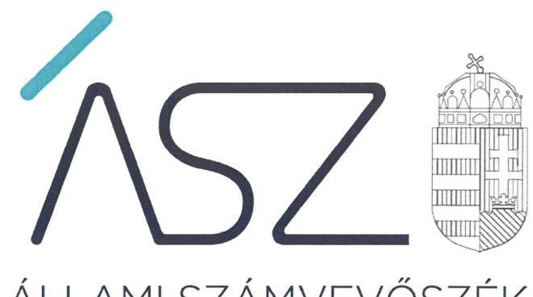

ÁLLAMI SZÁMVEVŐSZÉK

# JELENTÉS 

## A jelentős beruházások ellenőrzése

Szolnoki Szigligeti Színházhoz kapcsolódó felújítás projektje
2021.

21001
www.asz.hu

---

ÁLLAMI SZÁMVEVŐSZÉK

# JELENTÉS

## A jelentős beruházások ellenőrzése

Szolnoki Szigligeti Színházhoz kapcsolódó felújítás projektje

2021. 01. hó 06. nap

21001
www.asz.hu

---

# AZ ELLENŐRZÉST FELÜGYELTE: 

KLINGA LÁSZLÓ felügyeleti vezető

## AZ ELLENŐRZÉST VEZETTE ÉS A VÉGREHAJTÁSÁÉRT FELELŐS:

ÁRPÁSI TIBOR ellenőrzésvezető

## A PROGRAM ÖSSZEÁLLÍTÁSÁÉRT FELELŐS:

NÉMETH ANITA projektvezető

IKTATÓSZÁM: EL-3043-001/2020.
TÉMASZÁM: 2535
ELLENŐRZÉS-AZONOSÍTÓ SZÁM: V0879004

---

# TARTALOMJEGYZÉK 

■ ÖSSZEGZÉS ..... 5
■ AZ ELLENŐRZÉS CÉLJA ..... 6
■ AZ ELLENŐRZÉS TERÜLETE ..... 7
■ AZ ELLENŐRZÉS HÁTTERE, INDOKOLTSÁGA ..... 8
■ A JELENTÉS LÉNYEGES KÉRDÉSKÖREI ..... 9
■ AZ ELLENŐRZÉS HATÓKÖRE ÉS MÓDSZEREI ..... 10
■ MEGÁLLAPÍTÁSOK ..... 12
■ MELLÉKLETEK ..... 15
I. sz. melléklet: Fogalomtár ..... 15
■ FÜGGELÉK: ÉSZREVÉTELEK ..... 17
■ RÖVIDÍTÉSEK JEGYZÉKE ..... 19

---

.

---

# ÖSSZEGZÉS 

A Szolnoki Szigligeti Színház felújításának döntés előkészítése és a megvalósítás előkészítése megfelelő volt.

## Az ellenőrzés társadalmi indokoltsága

Az Állami Számvevőszék a jelentős beruházások ellenőrzésével támogatja a közpénzek szabályos és átlátható felhasználását. A beruházás előkészítésében közreműködő szervezetnek az Alaptörvényben meghatározott alapelvek szerint kell a közpénzeket felhasználnia. A szervezet köteles kiépíteni azokat a kontrollokat, amelyek az átláthatóság, az önállóság és a felelősség, azaz elszámoltathatóság, a törvényesség, a célszerűség és az eredményesség követelményének teljesülését szolgálják. Tekintettel arra, hogy a beruházások jellemzően több tízmillió, vagy több milliárd Ft-os támogatásból valósulnak meg, ezért az Alaptörvény követelményeinek betartásához szükséges szervezeti keretek, a szabályozó eszközök kialakítása, és azok betartása a beruházási kockázatok feltárása és kezelése elvárás a szervezet felé.

Az átláthatóság lényege, hogy a szervezetnek a törvényeknek és egyéb jogszabályoknak megfelelően kell végeznie a tevékenységét és arról nyilvánosan be kell számolnia. Az elszámoltathatóság lényege a felelősség. A szervezet felelős a közfeladatai ellátásáért, a közpénzek használatáért. Az eredményesség a kitűzött célok és azok megvalósulásának összehasonlításával mérhető.

A Szolnoki Szigligeti Színház felújítása előkészítésének ellenőrzése hozzájárulhat a beruházás eredményességéhez, a beruházási folyamat transzparenciájának erősítéséhez.

## Főbb megállapítások, következtetések, javaslatok

Az Emberi Erőforrások Minisztériuma a jogszabályban és belső előírásaiban rögzített módon készítette elő és terjesztette a Kormány elé a Szolnoki Szigligeti Színház felújításának tervezésére vonatkozó javaslatát. Szolnok Megyei Jogú Város Önkormányzata szabályszerűen határozott a Szolnoki Szigligeti Színház felújítása előkészítési tevékenységeinek megkezdéséről. A beruházás előkészítésének támogatását biztosító szerződés szabályszerűen került megkötésre.

Szolnok Megyei Jogú Város Önkormányzata belső szabályozottsága, szervezeti és működési folyamatai biztosították a beruházás megfelelő előkészítését, azonban a monitoring rendszert fejleszteni kell a beruházás előkészítésének hatásosabb nyomon követése érdekében. Szolnok Megyei Jogú Város Polgármesteri hivatalának jegyzője az ellenőrzött időszakot követően intézkedett az operatív tevékenységek keretében megvalósuló folyamatos és eseti nyomon követési (monitoring) rendszerének a beruházásokhoz kapcsolódóan történő működtetésére. Szolnok Megyei Jogú Város Önkormányzata a Szolnoki Szigligeti Színház felújítását szabályszerűen előkészítette, az előkészítési szakaszban megkötött szerződések megfelelőek voltak.

---

# AZ ELLENŐRZÉS CÉLJA 

AZ ELLENŐRZÉS CÉLJA a beruházás eredményes megvalósulásának elősegítése érdekében, a folyamatban lévő beruházás vonatkozásában, a döntés-előkészítésétől a megvalósítás megkezdéséig felmerülő kockázatok beazonosításának és az integritási szempontok érvényesülésének értékelése.

---

# AZ ELLENŐRZÉS TERÜLETE 

## Emberi Erőforrások Minisztériuma és Szolnok Megyei Jogú Város Önkormányzata - a Szolnoki Szigligeti Színház felújítása előkészítésének támogatása

Magyarország Kormánya a 1718/2017 (X.3.) számú Korm. határozatában ${ }^{1}$ egyetértett a Szolnoki Szigligeti Színház épülete felújításának szükségességével. A beruházás előkészítési fázisaira - a kifizetésekhez kapcsolódó pénzügyi tranzakciós illetékkel és kincstári díjakkal együtt - összesen 250,0 millió Ft forrást hagyott jóvá keretösszegként. A támogatás a 2017. évi költségvetési törvény² 1. melléklet XX. Emberi Erőforrások Minisztériuma fejezet címrendjének, 20. Fejezeti kezelésű előirányzatok cím, 50. Kulturális szakmai feladatok támogatása alcím, 15. A Szolnoki Szigligeti Színház felújítása jogcímcsoport javára került előirányzatként átcsoportosításra. A beruházás előkészítő fázisainak megvalósítása - engedélyezési terv készítése, engedélyeztetés lefolytatása, kivitelezési terv elkészítése - az épület tulajdonosa, Szolnok Megyei Jogú Város Önkormányzata feladata volt. A beruházás kormányzati felelőseként az emberi erőforrások minisztere került kijelölésre, akinek az előkészítési fázisok eredménye alapján előterjesztést kellett készítenie a Kormány részére a beruházás megvalósításának kérdésében.

A beruházás előkészítésének támogatására vonatkozó kormánydöntés alapján az $\mathrm{EMMI}^{3}$ és az Önkormányzat ${ }^{4}$ 2017. december 19-én Támogatási szerződést ${ }^{5}$ kötött, amelyben rögzítésre kerültek a központi költségvetési támogatás folyósításának, felhasználásnak és beszámolásának szabályai a Színház ${ }^{6}$ felújítása előkészítésének tárgyában. A Támogatási szerződés 100 %-os támogatási intenzitás mellett 248,9 millió Ft támogatási összeget biztosított a Színház felújításának előkészítésére.

Az Önkormányzat a tervezési feladatok elvégzésével, a műszaki ellenőri feladatok ellátásával és a közbeszerzések lebonyolításával a kizárólagos tulajdonában álló SZOLLAK Kft. ${ }^{7}$-t bízta meg.

Az Önkormányzat a beruházás megvalósítására vonatkozó közbeszerzési hirdetményt „A Szolnoki Szigligeti Színház felújítása" tárgyban 2018. december 12-én tette közzé.

---

# AZ ELLENŐRZÉS HÁTTERE, INDOKOLTSÁGA 

A közpénzek szabályos és átlátható felhasználásának támogatása céljából az ÁSZ ${ }^{8}$ a beruházások ellenőrzését - a megvalósításra fordított költségvetési források nagyságrendjére, a beruházások révén létrehozott nemzeti vagyon hasznosítására tekintettel - kiemelt fontosságú területként kezeli.

A közpénzből megvalósuló beruházások eredményes megvalósulása érdekében indokolt már a döntés-előkészítéstől a megvalósítás megkezdéséig tartó szakaszban felmerülő kockázatok beazonosításának és a kezelésükre kidolgozott intézkedések értékelése, az átláthatóság követelményével összhangban az integritási szempontok érvényesülésének biztosítása.

A beruházások előkészítésére fókuszáló ellenőrzés megállapításainak hasznosításaként lehetőség nyílhat még a beruházás folyamatában a feltárt hiányosságok, szabálytalanságok megszüntetéséhez szükséges korrekciók megtételére, a kontrollok erősítésére.

Jelen ellenőrzés, ezáltal hozzájárulhat az ÁSZ kockázatértékelő rendszere alapján kiválasztott, államháztartásból származó forrásból finanszírozott beruházások eredményességéhez, a beruházási folyamat transzparenciájának biztosításához.

Az ellenőrzés eredményeinek célzott felhasználói a nyilvánosság, valamint a beruházások előkészítésében és megvalósításában résztvevő szervezetek.

---

# A JELENTÉS LÉNYEGES KÉRDÉSKÖREI 

1. A beruházás döntés-előkészítése szabályszerűen történt-e?
2. A beruházás előkészítését végző ellenőrzött szervezet belső szabályozottsága, szervezeti és működési folyamatai biztosították-e a beruházás megfelelő előkészítését?
3. A beruházás megvalósításának előkészítése, a beruházás előkészítése keretében megkötött szerződések megfelelőek voltak-e?

---

# AZ ELLENŐRZÉS HATÓKÖRE ÉS MÓDSZEREI 

## Az ellenőrzés típusa

Megfelelőségi ellenőrzés.

## Az ellenőrzött időszak

A 2015-2018. évi központi költségvetésben megjelenő beruházások első döntés-előkészítésétől a beruházás előkészítési szakaszának befejezéséig (a megvalósításra vonatkozó közbeszerzési eljárás meghirdetésének időpontjáig) terjedő időszak, azaz 2017. augusztus 28. - 2018. december 12.

## Az ellenőrzés tárgya

Az ellenőrzés a beruházást érintő önkormányzati, kormányzati beruházási döntés-előkészítést beterjesztő szervezet, valamint a beruházás előkészítését végző önkormányzat és gazdálkodási feladatait ellátó polgármesteri hivatal, költségvetési szerv, nemzeti tulajdonban lévő gazdasági társaság döntés-előkészítési és beruházás előkészítési tevékenységének működési folyamataira, azok belső szabályozottságára, a megvalósítás előkészítésének megfelelőségére terjed ki.

## Az ellenőrzött szervezet

- Emberi Erőforrások Minisztériuma
- Szolnok Megyei Jogú Város Önkormányzata

## Az ellenőrzés jogalapja

Az ellenőrzés jogszabályi alapját az ÁSZ tv. ${ }^{9} 1 . \S$ (3) bekezdése és 5. § (2) - (5) bekezdései, valamint az Áht. 61. § (2) bekezdése képezték.

## Az ellenőrzés módszerei

Az ÁSZ az ellenőrzést az ellenőrzési program szempontjai, kérdései, az ellenőrzött időszakban hatályos jogszabályok, az ellenőrzés szakmai szabályai, az ÁSZ megfelelőségi ellenőrzési módszertana alapján végezte.

Az ellenőrzés ideje alatt az ellenőrzött szervezettel történő kapcsolattartást az ÁSZ Szervezeti és Működési Szabályzatának vonatkozó előírásai alapján biztosította az ÁSZ.

---

A program ellenőrzési szempontjai a szabályszerűségi szempontok szerinti ellenőrzésben a jogszabályok, közjogi szervezetszabályozó eszközök, önkormányzati rendeletek, határozatok, további belső utasítások, belső szabályozók előírásai, a helyénvalósági szempontok szerinti ellenőrzésben az ÁSZ korábbi beruházásokat érintő ellenőrzései során beazonosított „jó gyakorlatok" és általánosan elfogadott szakmai szabályok alapján kerültek meghatározásra.

Az ellenőrzési szempontok tartalmaznak helyénvalósági kritériumokat is, amelyet az ÁSZ honlapján tett közzé. A helyénvalósági kritériumok az ellenőrzés tárgyát képező, általánosan elfogadott, jogszabályok által nem szabályozott, illetve nemzetközi vagy hazai „jó gyakorlatokon" alapuló ellenőrzési szempontok, melyek hozzájárulnak az ellenőrzött szervezetek integritásának megerősítéséhez.

Az ellenőrzési kérdések megválaszolásához szükséges bizonyítékok megszerzése a következő ellenőrzési eljárások alkalmazásával történt: megfigyelés, kérdésfeltevés (információkérés), összehasonlítás, mintavételi eljárás, valamint elemző eljárás. Az ellenőrzés végrehajtásához a rétegzett mintavételi eljárással történik a mintavétel. Az ellenőrzési bizonyítékként felhasználható adatforrások közé tartoztak egyrészt az ellenőrzési programban felsorolt adatforrások, másrészt adatforrás volt még minden - az ellenőrzés folyamán - feltárt, az ellenőrzés szempontjából információkat tartalmazó dokumentum.

Mintavételes ellenőrzésre a beruházás előkészítésére vonatkozóan, közbeszerzési eljárások eredményeként kötött szerződések, továbbá a közbeszerzési értékhatárt el nem érő beszerzések (megrendelésekre, megbízásokra) szerinti rétegzés alapján kiválasztott szerződések esetében került sor.

A mintatételek kiválasztása a közbeszerzési határértéket elérő, illetve el nem érő szerződésekből véletlen rétegzett mintavétellel történt. A vizsgált terület „szabályszerű" minősítést kapott, ha a minta ellenőrzésének eredménye alapján 95\%-os bizonyossággal a teljes sokaságban az átlagos hibaarány nem haladta meg a 10\%-ot, „nem szabályszerű" minősítést kapott, ha nagyobb volt, mint 10\%. Abban az esetben, ha a teljes sokaság tekintetében a 10\%-os hibaarányhoz való viszony megítélésének megbízhatósága nem érte el a 95\%-ot, annak elérése érdekében az értékelés további szempontokkal egészült ki, a feltárt hibák értéke is figyelembe vételre került. Amennyiben a sokaság elemszáma nem haladta meg az előírt minta elemszámot, akkor a sokaság valamennyi elemének tételes ellenőrzésére került sor.

Az ellenőrzés során minden olyan körülmény és adat is ellenőrzésre került, amely a program végrehajtása kapcsán felmerült újabb összefüggéseknek az ellenőrzés céljaival összhangban lévő feltárásához szükséges volt.

---

# 1. A beruházás döntés-előkészítése szabályszerűen történt-e? 

## Összegző megállapítás

Az EMMI és az Önkormányzat tevékenysége a beruházás döntés-előkészítése során szabályszerű volt.

Az EMMI a 1144/2010. (VII. 7.) Korm. határozat ${ }^{10}$ előírásaival összhangban, továbbá az EMMI SZMSZ ${ }^{11}$ és az EMMI Kulturális Fejlesztési és Monitoring Főosztály ügyrendjében ${ }^{12}$ rögzített módon készítette elő és terjesztette a Kormány elé a Színház felújításának tervezésére vonatkozó javaslatát. Az előterjesztés ${ }^{13}$ tartalmazta a Színház felújítására vonatkozóan a Kormány társadalompolitikai célkitűzéseihez, a kormányprogramhoz való illeszkedését, indokait és lényegét, valamint a beruházás költségkihatását, várható gazdasági, költségvetési és egyéb hatásait bemutató hatásvizsgálati-lapot.

Az Önkormányzat Közgyűlése a Polgármesteri Hivatal Fejlesztési Igazgatóság előterjesztése alapján a Mötv. ${ }^{14}$ és az Önkormányzat SZMSZ ${ }^{15}$ előírásaival összhangban 2017. augusztus 28-án határozott ${ }^{16}$ a Színház felújítása előkészítési tevékenységeinek megkezdéséről.

Az EMMI előterjesztése alapján meghozott kormánydöntés értelmében a Színház felújítása előkészítésének támogatására az EMMI és az Önkormányzat által kötött Támogatási szerződés tartalma eleget tett az Áht.ben ${ }^{17}$ és az Ávr.-ben ${ }^{18}$ megfogalmazott követelményeknek. A forrás biztosítása a kedvezményezett részére a kormányhatározatban foglalt keretösszegen belül történt.

## 2. A beruházás előkészítését végző ellenőrzött szervezet belső szabályozottsága, szervezeti és működési folyamatai biztosították-

## Összegző megállapítás

A beruházás előkészítését végző Önkormányzat belső szabályozottsága, szervezeti és működési folyamatai biztosították a beruházás megfelelő előkészítését.

Az Önkormányzat belső szabályozó rendszerének kialakítása biztosította a beruházás megfelelő előkészítését.

Az Ávr. előírásaival összhangban a Polgármesteri Hivatal SZMSZ-e ${ }^{19}$ tartalmazta a szervezeti egységek feladatait, a nevesített munkakörökhöz tartozó feladat- és hatásköröket. A gazdálkodás részletes rendjét meghatározó szabályzatban ${ }^{20}$ rögzítették a kötelezettségvállalás, a teljesítésigazolás gyakorlásának módját, az erre jogosultak felhatalmazását, aláírás-mintáját.
 Az Önkormányzat a Számv. tv. ${ }^{21}$ és az Áhsz. ${ }^{22}$ előírásainak eleget téve rendelkezett számviteli politikával ${ }^{23}$, értékelési szabályzattal ${ }^{24}$, leltározási szabályzattal ${ }^{25}$, valamint számlarenddel ${ }^{26}$. Az Eseti Közbeszerzési Szabály-

---

zatban ${ }^{27}$ meghatározták a beruházás közbeszerzési eljárási előkészítésének, lefolytatásának, belső ellenőrzésének felelősségi rendjét, az Önkormányzat nevében eljáró, illetve az eljárásba bevont személyek, valamint szervezetek felelősségi körét és a közbeszerzési eljárás dokumentálási rendjét. A beruházás előkészítése keretében a koordinációs feladatokat ellátó Fejlesztési Osztály monitoring ellenőrzési nyomvonalát és beruházás előkészítésének ellenőrzési nyomvonalát elkészítették a Bkr. ${ }^{28}$ előírásával összhangban.

Az Önkormányzatnál a beruházás előkészítése során a monitoring és beszámolási rendszereket kialakították. Az Önkormányzat az operatív tevékenységek keretében megvalósuló folyamatos és eseti nyomon követési (monitoring) rendszerét a beruházás előkészítése során nem működtette, ezzel nem felelt meg a Bkr. 3. § (e) pontban előírtaknak.

# 3. A beruházás megvalósításának előkészítése, a beruházás előkészítése keretében megkötött szerződések megfelelőek voltak-e? 

Összegző megállapítás

Az Önkormányzat a Szolnoki Szigligeti Színház felújítását szabályszerűen előkészítette, az előkészítési szakaszban megkötött szerződések megfelelőek voltak.

Az Önkormányzat megfelelően készítette elő a beruházás megvalósítását. Kidolgozták a beruházás üzemeltetési koncepcióját², a költségvetés felülvizsgálata megtörtént. A tervezési feladatok elvégzésére, a műszaki ellenőri feladatok ellátására és a közbeszerzések lebonyolítására vonatkozó szerződéseket szabályszerűen kötötte meg az Önkormányzat, azok tartalmazták az Ávr. 50. § (1) bekezdésben előírt tartalmi elemeket.

---

.

---

# MELLÉKLETEK 

- I. SZ. MELLÉKLET: FOGALOMTÁR
beruházás
beterjesztő szervezet
felújítás
jelentős beruházás
monitoring
önkormányzat

A tárgyi eszközök beszerzése, létesítése, saját vállalkozásban történő előállítása, a beszerzett tárgyi eszköz üzembe helyezése, rendeltetésszerű használatbavétele érdekében az üzembe helyezésig, a rendeltetésszerű használatbavételig végzett tevékenység (szállítás, vámkezelés, közvetítés, alapozás, üzembe helyezés, továbbá mindaz a tevékenység, amely a tárgyi eszköz beszerzéséhez hozzákapcsolható, ideértve a tervezést, az előkészítést, a lebonyolítást, a hiteligénybevételt, a biztosítást is); beruházás a meglévő tárgyi eszköz bővítését, rendeltetésének megváltoztatását, átalakítását, élettartamának, teljesítőképességének közvetlen növelését eredményező tevékenység is, az előbbiekben felsorolt, e tevékenységhez hozzákapcsolható egyéb tevékenységekkel együtt. (Forrás: Számv. tv. 3. § (4) bekezdés 7. pont). A jelentős beruházásokat érintően beruházásnak tekintjük az immateriális javak beszerzését is.
A beruházási döntésre vonatkozó előterjesztésért felelős képviselő-testület bizottsága, polgármester, és/vagy a beruházási döntésre vonatkozó előterjesztésért felelős minisztérium.
Az elhasználódott tárgyi eszköz eredeti állaga (kapacitása, pontossága) helyreállítását szolgáló, időszakonként visszatérő olyan tevékenység, amely mindenképpen azzal jár, hogy az adott eszköz élettartama megnövekszik, eredeti műszaki állapota, teljesítőképessége megközelítően vagy teljesen visszaáll, az előállított termékek minősége vagy az adott eszköz használata jelentősen javul és így a felújítás pótlólagos ráfordításából a jövőben gazdasági előnyök származnak; felújítás a korszerűsítés is, ha az a korszerű technika alkalmazásával a tárgyi eszköz egyes részeinek az eredetitől eltérő megoldásával vagy kicserélésével a tárgyi eszköz üzembiztonságát, teljesítőképességét, használhatóságát vagy gazdaságosságát növeli; a tárgyi eszközt akkor kell felújítani, amikor a folyamatosan, rendszeresen elvégzett karbantartás mellett a tárgyi eszköz oly mértékben elhasználódott (szerkezeti elemei elöregedtek), amely elhasználódottság már a rendeltetésszerű használatot veszélyezteti; nem felújítás az elmaradt és felhalmozódó karbantartás egyidőben való elvégzése, függetlenül a költségek nagyságától. (Forrás: Számv.tv. 3. § (4) bekezdés 8. pont)

Jelentős beruházás az a beruházás, amelyet az ÁSZ kockázatelemzés alapján annak tekint. A kockázat-elemzés során figyelembe vett szempontok: a beruházás háttere, funkciója, bekerülési értéke, a szervezet költségvetéséhez, gazdasági társaság esetén mérlegfőösszegéhez való nagyságrendi viszonya, beruházás megvalósítási költségében a központi költségvetési támogatás részaránya.
A monitoring általánosságban a különböző szintű szervezeti célok megvalósításának folyamatát kíséri figyelemmel, melynek során a releváns eseményekről és tevékenységekről (együtt: folyamatokról) rendszeres jelleggel, strukturált, döntéstámogató információkhoz jutnak a szervezet vezetői. (Forrás: NGM Államháztartási Belső Kontroll Standardok és Gyakorlati Útmutató, 2017. szeptember)
A helyi önkormányzat jogi személy. Az önkormányzati feladatok ellátását a képviselő-testület és szervei biztosítják. A képviselő-testület szervei: a polgármester, a főpolgármester, a megyei közgyűlés elnöke, a képviselő-testület bizottságai, a részönkormányzat testülete, a polgármesteri hivatal, a megyei önkormányzati hivatal, a közös önkormányzati hivatal, a jegyző, továbbá a társulás. A képviselő-testület a

---

feladatkörébe tartozó közszolgáltatások ellátására - jogszabályban meghatározottak szerint - költségvetési szervet, a Polgári perrendtartásról szóló 2016. évi CXXX. törvény szerinti gazdálkodó szervezetet (a továbbiakban: gazdálkodó szervezet), nonprofit szervezetet és egyéb szervezetet (a továbbiakban együtt: intézmény) alapíthat, továbbá szerződést köthet természetes és jogi személlyel vagy jogi személyiséggel nem rendelkező szervezettel. (Forrás: Mötv. 41. § (1), (2), (6) bekezdései).

---

# FÜGGELÉK: ÉSZREVÉTELEK 

A jelentéstervezetet a Számvevőszék 15 napos észrevételezésre megküldte az ellenőrzött szervezet vezetőjének az ÁSZ tv. 29. §* (1) bekezdése előírásának megfelelően.

Az Emberi Erőforrások Minisztériuma, illetve Szolnok Megyei Jogú Város Önkormányzata polgármestere és Szolnok Megyei Jogú Város Polgármesteri Hivatala jegyzője írásban jelezte, hogy a jelentéstervezet megállapításaira nem tesz észrevételt.

[^0]
[^0]:    * 29. § (1) Az Állami Számvevőszék az ellenőrzési megállapításait megküldi az ellenőrzött szervezet vezetőjének vagy az általa megbízott személynek, és annak, akinek személyes felelősségét állapította meg.
    (2) Az ellenőrzött szervezet vezetője és a felelősként megjelölt személy az ellenőrzés megállapításaira tizenöt napon belül írásban észrevételt tehet.
    (3) Az Állami Számvevőszék az észrevételre a beérkezésétől számított harminc napon belül írásban válaszol. A figyelembe nem vett észrevételeket köteles a jelentésben feltüntetni, és megindokolni, hogy azokat miért nem fogadta el.

---

.

---

# RÖVIDÍTÉSEK JEGYZÉKE 

${ }^{1}$ Kormányhatározat
${ }^{2}$ 2017. évi költségvetési törvény
${ }^{3}$ EMMI
${ }^{4}$ Önkormányzat
${ }^{5}$ Támogatási szerződés
${ }^{6}$ Színház
${ }^{7}$ SZOLLAK Kft.
${ }^{8}$ ÁSZ
${ }^{9}$ ÁSZ tv.
${ }^{10}$ 1144/2010. (VII. 7.) Korm. határozat
${ }^{11}$ EMMI SZMSZ
${ }^{12}$ Ügyrend
${ }^{13}$ előterjesztés
${ }^{14}$ Mötv.
${ }^{15}$ Önkormányzat SZMSZ
${ }^{16}$ közgyűlési határozat
${ }^{17}$ Áht.
${ }^{18}$ Ávr.
${ }^{19}$ Hivatali SZMSZ
${ }^{20}$ szabályzat
${ }^{21}$ Számv. tv.
${ }^{22}$ Áhsz.

1718/2017 (X.3.) számú Korm. határozat a Szolnoki Szigligeti Színház felújítása előkészítésének támogatásáról (hatályos: 2017. október 3-tól)
2016. évi XC. törvény Magyarország 2017. évi központi költségvetéséről (hatályos: 2016. november 1-től)
Emberi Erőforrások Minisztériuma
Szolnok Megyei Jogú Város Önkormányzata
az EMMI és az Önkormányzat között 2017. december 19-én létrejött 61078/2017/KULTFEJL számú szerződés a Színház engedélyes és kiviteli tervek elkészítése költségeinek 100%-os intenzitású támogatásáról
Szolnoki Szigligeti Színház
SZOLLAK Vagyonkezelő Korlátolt Felelősségű Társaság
Állami Számvevőszék
2011. évi LXVI. törvény az Állami Számvevőszékről (hatályos: 2011. július 1-től)

1144/2010. (VII. 7.) Korm. határozat a Kormány ügyrendjéről
(hatályos: 2010. július 8-tól)
33/2014. (IX. 16.) EMMI utasítás az Emberi Erőforrások Minisztériuma Szervezeti és Működési Szabályzatáról (hatályos: 2014. szeptember 17-től) az EMMI Kulturális Fejlesztési és Monitoring Főosztály ügyrendje
ügyrend: hatályos 2017. február 16-tól
ügyrend: hatályos 2017. április 20-tól
ügyrend: hatályos 2017. szeptember 20-tól
35934-16/2017. számú Emberi Erőforrások Minisztere által készített Előterjesztés a Kormány részére a Szolnoki Szigligeti Színház felújítása tervezésének támogatásáról (hatályos: 2017. augusztus 18-tól)
2011. évi CLXXXIX. törvény Magyarország helyi önkormányzatairól (hatályos: 2012. január 1-től)
Szolnok Megyei Jogú Város Közgyűlésének 7/2014. (II.28.) sz. önkormányzati rendelete Szolnok Megyei Jogú Város Önkormányzata Szervezeti és Működési Szabályzatáról (hatályos: 2014. március 1-től)
Szolnok Megyei Jogú Város Közgyűlésének 231/2017. (VIII.28.) sz. közgyűlési határozata a Szolnoki Szigligeti Színház felújítása előkészítési tevékenységeinek megkezdéséről (hatályos: 2017. augusztus 28-tól)
2011. évi CXCV. törvény az államháztartásról (hatályos: 2011. december 31-től) 368/2011. (XII. 31.) Korm. rendelet az államháztartásról szóló törvény végrehajtásáról (hatályos: 2012. január 1-től)
Szolnok Megyei Jogú Város Polgármesteri Hivatalának Szervezeti és Működési Szabályzata (hatályos: 2016. március 1-től)
Kötelezettségvállalási, ellenjegyzési, érvényesítési és utalványozási hatásköri és eljárási rendjének részletes szabályaira vonatkozó I. 23944-1/2015. számú polgármesteri - jegyzői együttes utasítás (hatályos: 2015. január 1-től)
2000. évi C. törvény a számvitelről (hatályos: 2001. január 1-től) 4/2013. (I. 11.) Korm. rendelet az államháztartás számviteléről (hatályos: 2014. január 1-től)

---

${ }^{23}$ számviteli politika
${ }^{24}$ értékelési szabályzat
${ }^{25}$ leltározási szabályzat
${ }^{26}$ számlarend
${ }^{27}$ Eseti Közbeszerzési Szabályzat
${ }^{28}$ Bkr.
${ }^{29}$ üzemeltetési koncepció

Szolnok Megyei Jogú Város Polgármesteri Hivatal Számviteli politikája (hatályos: 2016. április 1-től)
Szolnok Megyei Jogú Város Polgármesteri Hivatal Eszközök és források értékelési szabályzata (hatályos: 2016. április 1-től)
Szolnok Megyei Jogú Város Polgármesteri Hivatal Eszközök és források leltárkészítési és leltározási szabályzata (hatályos: 2016. április 1-től)
Szolnok Megyei Jogú Város Polgármesteri Hivatal Számlarendje (hatályos: 2016. április 1-től)
Szolnok Megyei Jogú Város Önkormányzata, mint Ajánlatkérő Eseti Közbeszerzési Szabályzata (hatályos: 2018. november 23-tól)
370/2011. (XII. 31.) Korm. rendelet a költségvetési szervek belső kontrollrendszeréről és belső ellenőrzéséről (hatályos: 2012. január 1-től)
Szolnoki Szigligeti Színház fejlesztése - Üzemeltetési koncepció (készítette: SZOLLAK Vagyonkezelő Kft., 2018. szeptember)

---

# ÁSZ 

ÁLLAMI SZÁMVEVŐSZÉK
1052 Budapest, Apáczai Cs. J. u. 10. I 1364 Budapest 4. Pf. 54 TEL: +36 14849100
email: szamvevoszek@asz.hu
web: www.asz.hu | www.aszhirportal.hu

